# ----AI Agents in Detail

AI Agents are probably the **single biggest shift in software development** since code completion. Understanding them deeply will help you understand why tools like **GitHub Copilot Agent, Claude Code, Google Antigravity, Replit Agent, Bolt, and Lovable** feel fundamentally different from traditional AI chatbots.

### What is an AI Agent?

A simple definition:

> **An AI Agent is an AI system that can reason about a goal, choose actions, use tools, observe results, and continue working until the goal is completed.**

Unlike a chatbot, an agent doesn't stop after one answer.

### Chatbot vs AI Agent

##### Chatbot

```text
You
│
▼
Ask a question
│
▼
AI answers
│
▼
Stops
```

Example:

You:

> Write a login page.

AI:

```tsx
<Login />
```

Finished.

##### AI Agent

```text
You
│
▼
Describe a goal
│
▼
AI plans
│
▼
Uses tools
│
▼
Writes code
│
▼
Runs tests
│
▼
Finds errors
│
▼
Fixes errors
│
▼
Repeats
│
▼
Goal completed
```

Notice the loop.

### The Core Agent Loop

Nearly every modern agent follows this pattern:

```text
Goal

↓

Reason

↓

Plan

↓

Act

↓

Observe

↓

Reflect

↓

Repeat

↓

Done
```

This is often called the  **agent loop** .

### Step 1 – Goal

You give a high-level objective.

Example:

```text
Build Google Authentication.
```

Not:

* install package
* create middleware
* update routes

Just the goal.

### Step 2 – Reasoning

The agent asks itself:

```text
What needs to happen?
```

Example reasoning:

```text
Need authentication.

Need OAuth.

Need user table.

Need callback.

Need session.

Need frontend.

Need testing.
```

This reasoning may be internal and not fully shown to you.

### Step 3 – Planning

The agent creates a task list.

```text
Install Auth.js

↓

Configure Google

↓

Create login page

↓

Protect routes

↓

Update database

↓

Run tests
```

Some agents display this plan; others keep it internal.

### Step 4 – Tool Selection

The agent chooses which tools it needs.

Example:

```text
Filesystem

Terminal

Git

Browser

Database

GitHub

MCP
```

This is a key difference from a normal chatbot.

### Step 5 – Acting

The agent performs actions.

Examples:

```text
Create file

Edit file

Install package

Run npm

Execute SQL

Open browser

Read logs
```

It isn't just generating text—it is interacting with your development environment.

### Step 6 – Observation

The agent checks what happened.

Example:

```text
npm install

↓

Success
```

or

```text
Build failed

↓

Type error

↓

Need fix
```

The result becomes new context.

### Step 7 – Reflection

The agent evaluates its progress.

```text
Goal achieved?

YES

↓

Finish
```

or

```text
Goal achieved?

NO

↓

Continue
```

This self-checking makes agents much more reliable than single-pass code generation.

### Why Agents Feel Smart

A chatbot usually responds once.

An agent can think in stages:

```text
Read

↓

Analyze

↓

Plan

↓

Execute

↓

Verify

↓

Improve
```

It resembles a developer's workflow.

### Agent Memory

During a task, an agent keeps track of:

* Current goal
* Completed tasks
* Remaining work
* Files changed
* Errors encountered
* Previous tool outputs

This is often called the **working memory** of the agent. It is different from long-term memory about you.

### Tools

Agents become powerful because they can use tools.

Examples include:

##### Filesystem

```text
Read files

Create files

Rename

Delete
```

##### Terminal

```text
npm install

npm run build

git status
```

##### Browser

```text
Open localhost

Click button

Take screenshot

Verify UI
```

##### Git

```text
Commit

Branch

Diff

History
```

##### Database

```text
Query

Create table

Migration
```

##### GitHub

```text
Issue

PR

Actions

Repository
```

##### MCP

Access services like:

* PostgreSQL
* Slack
* Notion
* Jira
* Stripe
* Custom company systems

without custom integrations for each AI.

### Multi-step Reasoning

Example:

> Build a hospital ERP.

The agent might think:

```text
Need authentication

↓

Need roles

↓

Need patients

↓

Need doctors

↓

Need appointments

↓

Need billing

↓

Need reports
```

Then build each subsystem in order.

### Parallel Tasks

Modern agents can sometimes work on independent tasks at the same time.

For example:

```text
Authentication

Billing

Dashboard

Notifications
```

These can be developed concurrently if they don't depend on each other.

### Verification

One major improvement over early AI tools is verification.

Example:

```text
Generate code

↓

Run tests

↓

Fail

↓

Fix

↓

Run again

↓

Pass
```

Instead of leaving errors for you, the agent tries to resolve them.

### Browser Automation

Agents can interact with your running application.

Example:

```text
Open localhost

↓

Click Login

↓

Type email

↓

Click Submit

↓

Verify redirect

↓

Take screenshot
```

This helps validate that the feature actually works.

### Context

Everything an agent sees is its context.

Typical context includes:

* Current file
* Workspace
* Selected code
* Terminal output
* Git changes
* Documentation
* MCP resources

The richer the context, the better the decisions.

### Planning Documents

Agents work best with structured inputs.

Examples:

* Feature lists
* Requirements documents
* Architecture notes
* Database schemas
* Copilot instructions
* README files

These reduce ambiguity.

### Agent Permissions

Not every agent can do everything automatically.

Depending on the configuration, it may ask before:

* Deleting files
* Running terminal commands
* Installing packages
* Accessing external services
* Using MCP tools

This helps prevent unintended changes.

### Long-running Tasks

Agents can continue for minutes on a single request.

Example:

```text
Create CRM

↓

Generate database

↓

Generate APIs

↓

Generate frontend

↓

Generate tests

↓

Fix errors

↓

Deploy
```

You don't need to prompt after each step.

### Types of AI Agents

##### Coding Agents

Examples:

* GitHub Copilot Agent
* Claude Code
* Google Antigravity
* Replit Agent

Focus on software development.

##### Research Agents

Focus on:

* Reading papers
* Comparing sources
* Summarizing findings

##### Business Agents

Can:

* Analyze spreadsheets
* Generate reports
* Draft presentations
* Monitor KPIs

##### Automation Agents

Can:

* Send emails
* Update CRMs
* Schedule meetings
* Trigger workflows

Often by combining MCP tools or other integrations.

### What makes a good AI Agent?

A capable agent typically has:

* Strong reasoning.
* Reliable planning.
* Access to appropriate tools.
* High-quality context.
* Ability to observe results.
* Ability to recover from failures.
* Clear permission boundaries.

Weakness in any one area can reduce its effectiveness.

### A real-world example

Suppose you ask:

> "Build an inventory module for my ERP."

A modern coding agent might proceed like this:

```text
Read project

↓

Read Copilot instructions

↓

Read feature list

↓

Inspect database schema

↓

Plan inventory module

↓

Create migrations

↓

Generate Prisma models

↓

Create APIs

↓

Create React pages

↓

Add navigation

↓

Run build

↓

Fix TypeScript errors

↓

Run tests

↓

Open browser

↓

Verify inventory workflow

↓

Present summary and diffs
```

That entire sequence can happen from a single high-level request.

### How this relates to your work

For the kinds of applications you're building—custom business software, CRMs, ERPs, hospital systems, school management platforms, and SaaS products—AI agents are most valuable when you:

* Give them a **clear goal** rather than low-level coding instructions.
* Provide a **feature list** and  **project instructions** .
* Supply the right **context** (schema, documentation, current code).
* Let them handle repetitive implementation, testing, and refactoring while you focus on product design, business rules, and architecture.

In practice, the most effective workflow is usually a partnership: you define **what** the software should do, and the AI agent handles much of the  **how** , with you reviewing and guiding the results.

---

# ----Agentic AI

**Agentic AI** is one of the most important concepts in AI today. It's broader than an  **AI Agent** .

* **AI Agent** = a specific system (like GitHub Copilot Agent or Claude Code).
* **Agentic AI** = the design philosophy and architecture behind systems that can autonomously pursue goals.

Think of it this way:

```text
AI Agent           → A product (GitHub Copilot Agent)

Agentic AI         → The entire field and methodology of building autonomous AI systems
```

### Evolution of AI

Understanding Agentic AI is easier if you see how AI has evolved.

##### Stage 1: Traditional Software

```text
Input
↓

Program

↓

Output
```

Example:

```javascript
if (age >= 18)
    return "Adult"
```

The program cannot adapt.

##### Stage 2: AI Chatbots

```text
Question

↓

LLM

↓

Answer
```

Example:

```
Explain React.
```

AI responds.

Stops.

##### Stage 3: AI Assistants

```text
Question

↓

LLM

↓

Can access tools

↓

Answer
```

Example:

```
Summarize my Gmail.
```

The assistant can read Gmail and summarize it.

Still mostly reactive.

##### Stage 4: Agentic AI

```text
Goal

↓

Reason

↓

Plan

↓

Use tools

↓

Observe

↓

Improve

↓

Repeat

↓

Goal Completed
```

This is Agentic AI.

# Definition

Agentic AI is

> **An AI system capable of independently reasoning about goals, planning actions, using tools, adapting to feedback, and continuing work until the objective is achieved.**

Notice the difference.

The user provides

```
Goal
```

instead of

```
Instructions
```

**-- Traditional Prompting**

You tell AI every step.

```
Install Prisma.

Create schema.

Generate migration.

Create API.

Create frontend.

Test.
```

**-- Agentic Prompting**

You simply say

```
Build inventory management.
```

The AI decides

```
Need database.

Need API.

Need UI.

Need testing.

Need deployment.
```

Huge difference.

### Core Principles of Agentic AI

Almost every Agentic AI system has these capabilities.

**1. Goal-Oriented**

Normal AI answers questions.

Agentic AI pursues goals.

Example

```
Create a CRM.
```

The AI keeps working until the CRM exists.

**2. Planning**

Instead of immediately generating code,

it plans.

```
Authentication

↓

Dashboard

↓

Customers

↓

Orders

↓

Reports
```

Planning reduces mistakes.

**3. Reasoning**

The AI asks itself

```
What should happen next?

What dependencies exist?

What could fail?
```

This internal reasoning guides its actions.

**4. Decision Making**

Example

```
Need Database

↓

PostgreSQL already exists

↓

Reuse it
```

Instead of creating another database.

**5. Tool Use**

One of the biggest breakthroughs.

Agentic AI can use tools.

Examples

Filesystem

Git

GitHub

Browser

Terminal

Slack

Notion

Postgres

Stripe

MCP

Without tools,

AI is just predicting text.

**6. Memory**

Agentic AI remembers

Current goal

Completed tasks

Failed attempts

Files edited

Conversations

Business rules

There are different kinds of memory:

### Working Memory

Only during the current task.

### Session Memory

Current conversation.

### Long-Term Memory

Persistent across sessions (if supported).

### Reflection

This is what makes Agentic AI significantly better.

After acting,

it evaluates.

```
Did it work?

↓

No

↓

Fix

↓

Retry
```

Instead of assuming success.

### Self-Correction

Example

```
npm run build

↓

Build failed

↓

Read Error

↓

Fix

↓

Run Again
```

Traditional AI

↓

Stops after generating code.

Agentic AI

↓

Continues until the build succeeds or reaches a limit.

### Continuous Loop

Most Agentic AI systems follow

```
Observe

↓

Think

↓

Plan

↓

Act

↓

Observe Again

↓

Improve
```

This loop continues until

```
Goal Completed
```

### Multi-Step Execution

Suppose

```
Create Google Login.
```

Agentic AI

```
Install Auth.js

↓

Configure OAuth

↓

Create Database

↓

Create Callback

↓

Protect Routes

↓

Test

↓

Fix Errors

↓

Done
```

You didn't ask for each step.

### Parallel Thinking

Modern agents can split work.

Example

```
Authentication

Billing

Reports

Dashboard
```

Different subtasks can run independently and later be combined, depending on the platform.

### Context Awareness

Agentic AI understands

Project

Database

Framework

Git History

Documentation

Terminal

Browser

Instructions

MCP

The more relevant context it has, the better its decisions.

### Environment Awareness

It understands

```
Current Folder

↓

Operating System

↓

Installed Packages

↓

Running Server

↓

Git Branch
```

instead of working in isolation.

### Learning During Execution

Suppose

```
Library Changed

↓

Fetch Documentation

↓

Understand

↓

Update Code
```

Instead of relying only on prior training.

### Collaboration

Some Agentic AI systems can work with humans in a review loop.

```
Agent

↓

Suggest

↓

Human Reviews

↓

Agent Continues
```

rather than replacing the developer.

### Multi-Agent Systems

This is an exciting area.

Instead of one AI,

multiple agents cooperate.

Example

```
Planner Agent

↓

Coding Agent

↓

Testing Agent

↓

Documentation Agent

↓

Deployment Agent
```

Each specializes in one role.

### Agentic Workflow

Imagine building

```
Hospital ERP
```

Agentic AI may do

```
Read Requirements

↓

Read Feature List

↓

Read Database

↓

Plan

↓

Create Schema

↓

Generate APIs

↓

Generate Frontend

↓

Generate Tests

↓

Run Build

↓

Fix Errors

↓

Deploy

↓

Summarize
```

This resembles how a software team works.

### Agentic AI vs AI Agent

People often mix these up.

| AI Agent                      | Agentic AI                                      |
| ----------------------------- | ----------------------------------------------- |
| A specific application        | The overall approach or paradigm                |
| Example: GitHub Copilot Agent | The design philosophy behind autonomous systems |
| One implementation            | A broad category of systems                     |

Think of it like

```
Car

↓

Vehicle
```

Every car is a vehicle.

Not every vehicle is a car.

Similarly,

Every AI Agent uses Agentic AI ideas,

but Agentic AI is much broader than any single agent.

### Real-world examples

| Product              | Agentic capabilities                                               |
| -------------------- | ------------------------------------------------------------------ |
| GitHub Copilot Agent | Multi-file editing, terminal commands, testing, Git integration    |
| Claude Code          | Repository reasoning, code editing, terminal operations, MCP tools |
| Google Antigravity   | Coding agents, browser interaction, workflow automation            |
| Replit Agent         | Planning, coding, debugging, deployment                            |
| Bolt.new             | Full-stack application generation and iterative development        |
| Lovable              | Product planning, app generation, deployment                       |

### Levels of Agentic AI

You can think of increasing levels of autonomy like this:

```
Level 0

Chatbot

↓

Level 1

Assistant

↓

Level 2

Tool User

↓

Level 3

Agent

↓

Level 4

Multi-Agent System

↓

Level 5

Fully Autonomous Digital Worker
```

Today's mainstream products are generally in the **Level 2–4** range. They are powerful, but they still benefit from human oversight, especially for important technical and business decisions.

### The future

Most researchers and major AI companies expect software development to become increasingly  **agentic** :

* Developers will define  **goals and constraints** .
* AI agents will plan and implement much of the work.
* Humans will focus more on architecture, product decisions, business logic, security, and review.
* Multiple specialized agents will increasingly collaborate on complex tasks.

Rather than replacing software engineering, Agentic AI is shifting a developer's role from writing every line of code to directing, reviewing, and integrating the work of increasingly capable AI systems.

---

# AI Coding Platform Comparison

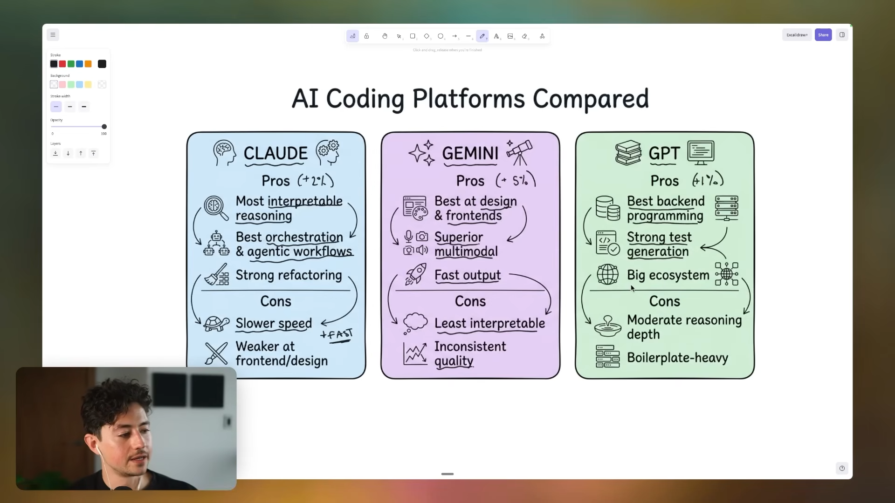

---

# ----Self Modifying System Prompts (Knowledge Accumulation Over Sessions)

This is one of the most fascinating ideas in Agentic AI. It aims to solve a major limitation of today's AI systems:

> **How can an AI become better at helping you over time without retraining the entire model?**

Instead of changing the model's neural network weights (which is expensive and slow), the system **modifies or extends its instructions and knowledge layer** between conversations.

Think of it as the AI gradually writing a better operating manual for itself.

### 🤔 The Problem

Imagine you work with an AI every day.

Day 1:

```text
User:
Build a CRM.

AI:
Uses Material UI.
```

Day 2:

```text
User:
I prefer Tailwind CSS.
```

Day 3:

```text
User:
Use Next.js App Router.
```

Day 4:

```text
User:
Never use JavaScript. Always TypeScript.
```

A traditional chatbot forgets most of this between sessions unless the information is stored somewhere.

### 💡 The Core Idea

Instead of changing the model itself, the AI updates a persistent instruction layer.

Think of it like:

```text
Base Model
      │
      ▼
System Prompt
      │
      ▼
Personal Memory
      │
      ▼
Project Memory
      │
      ▼
Conversation
```

The model stays the same.

The  **knowledge and instructions around it evolve** .

### 🏗️ What Is a System Prompt?

A system prompt is the hidden instruction given to the AI before your messages.

For example:

```text
You are a helpful programming assistant.

Be concise.

Prefer TypeScript examples.
```

You don't normally see it, but it influences every response.

### 🔄 What Makes It "Self-Modifying"?

A self-modifying system doesn't literally rewrite the base model.

Instead, it updates things like:

* Persistent instructions
* Long-term memories
* User preferences
* Project conventions
* Learned workflows
* Retrieved knowledge

For example:

### First conversation

```text
User:
Always use Tailwind CSS.
```

The system stores:

```text
Preference:
Tailwind CSS
```

Future conversations automatically include that preference.

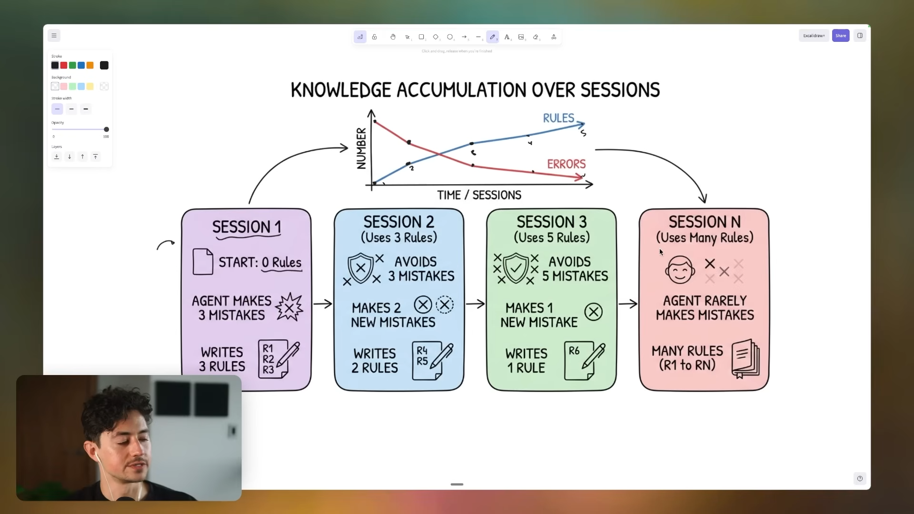

### 🧩 Layers of Knowledge

A modern AI often has multiple layers.

```text
LLM

↓

System Prompt

↓

Developer Instructions

↓

User Memory

↓

Project Memory

↓

Current Conversation

↓

Retrieved Documents

↓

Response
```

Only some of these layers change over time.

### 📚 Knowledge Accumulation

Imagine working on the same ERP project for six months.

Instead of relearning everything every day, the AI gradually builds knowledge.

Example:

Week 1

```text
Project

↓

Hospital ERP
```

Week 2

```text
Hospital ERP

↓

Uses PostgreSQL
```

Week 3

```text
Hospital ERP

↓

Uses Prisma
```

Week 4

```text
Hospital ERP

↓

Doctors have multiple schedules
```

Now every future discussion starts with a better understanding of the project.

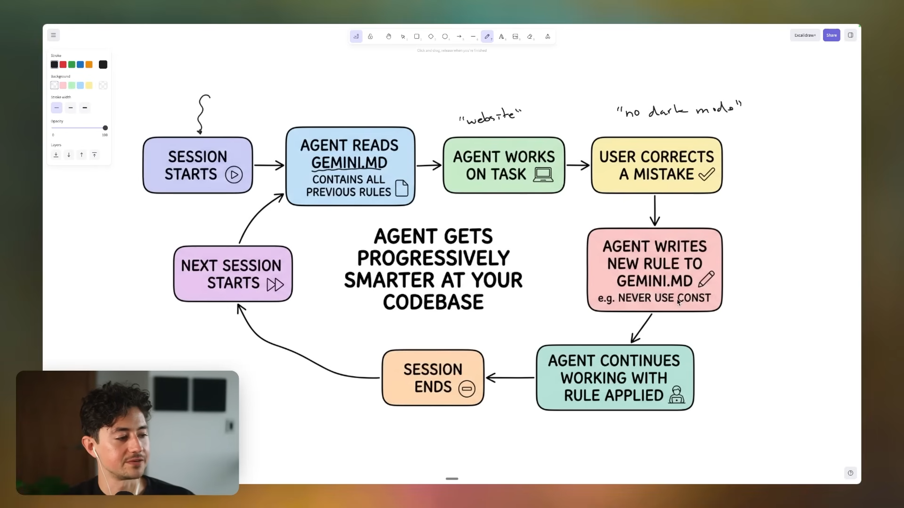

### 🧠 Types of Accumulated Knowledge

##### 👤 User Preferences

Examples:

* Preferred programming language
* Response format
* Favorite frameworks
* Naming conventions
* Writing style

Example:

```text
Use emojis in headings.
```

That's exactly the kind of long-term preference I can remember when you ask me to.

##### 📁 Project Knowledge

Examples:

```text
Project

↓

React

↓

Next.js

↓

Prisma

↓

AWS
```

The AI no longer needs to ask about the stack repeatedly.

##### 💼 Domain Knowledge

Example:

```text
Company

↓

Hospital ERP

↓

Patient

↓

Doctor

↓

Insurance

↓

Billing
```

The AI builds a richer understanding of the business domain.

##### ⚙️ Workflow Knowledge

Example:

```text
User always:

Creates feature list

↓

Creates database schema

↓

Builds backend

↓

Builds frontend
```

The AI can begin suggesting or anticipating that workflow.

### 🔍 How Is This Different From Training?

People often confuse these.

**-- Model Training**

```text
Billions of examples

↓

Weeks of GPU training

↓

Changes model weights
```

Very expensive.

**-- Knowledge Accumulation**

```text
Conversation

↓

Extract useful facts

↓

Store memory

↓

Reuse later
```

Fast and lightweight.

### 🗂️ Memory vs Self-Modifying Prompts

Memory:

```text
User likes Tailwind.
```

Self-modifying instructions:

```text
Whenever generating frontend code,
prefer Tailwind CSS.
```

Memory stores facts.

Instructions influence behavior.

Many systems use both together.

### 🔄 Dynamic System Prompts

Instead of one fixed prompt:

```text
You are helpful.
```

The system constructs one dynamically.

Example:

```text
You are helpful.

User prefers TypeScript.

User prefers concise explanations.

Current project uses Prisma.

User likes emoji headings.

Current repository is Next.js.
```

This prompt is assembled just before generating the response.

### 🧩 Retrieval-Based Knowledge

Not everything needs to be permanently remembered.

Sometimes the system retrieves relevant information only when needed.

Example:

```text
Question

↓

Search memories

↓

Retrieve relevant ones

↓

Inject into prompt

↓

Answer
```

This avoids overwhelming the model with unnecessary context.

**🏢 Enterprise Example**

Suppose an entire company uses an AI assistant.

The system can accumulate:

```text
Coding Standards

↓

Architecture

↓

Security Rules

↓

Internal Libraries

↓

Deployment Process
```

New developers immediately benefit from that shared knowledge.

### 🤖 Agentic AI Perspective

Agentic systems often go beyond remembering facts.

They may accumulate:

* Successful strategies
* Failed approaches
* Tool preferences
* Frequently used workflows
* Project architecture
* Business constraints

Example:

```text
Tried Solution A

↓

Failed

↓

Solution B worked

↓

Remember for future
```

This allows future tasks to start from a stronger position.

### 📈 Continuous Improvement

Imagine an AI helping you build ten SaaS products.

Over time it could accumulate:

```text
Project 1

↓

Learns authentication pattern

↓

Project 2

↓

Learns dashboard pattern

↓

Project 3

↓

Learns billing pattern

↓

Project 10

↓

Suggests a reusable SaaS architecture
```

This isn't because the underlying model has been retrained—it's because the surrounding knowledge has become richer.

### 🔒 Why Doesn't It Remember Everything?

There are important reasons:

* Privacy
* Security
* Relevance
* Storage limits
* Avoiding incorrect assumptions

Good systems are selective about what becomes long-term memory.

For example, a lasting preference like *"Use emoji icons in headings"* is useful to remember, while *"I'm debugging a TypeScript error today"* usually isn't.

### 🏗️ Global Rules

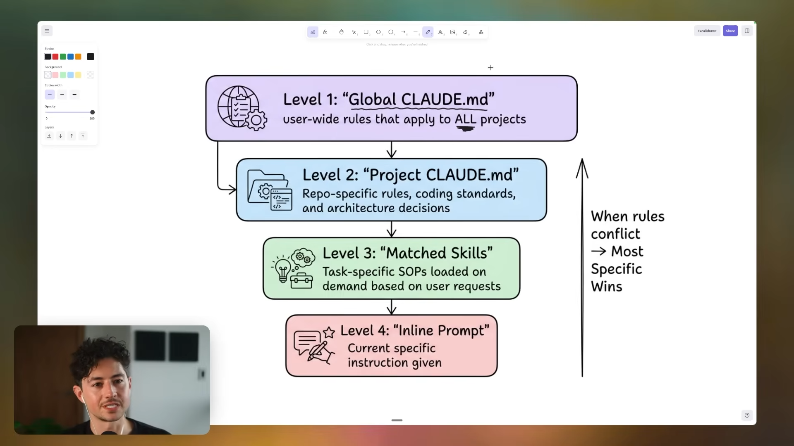

### ⚠️ Current Limitations

Today's systems—including ChatGPT, Claude, and GitHub Copilot—do **not** have unlimited, automatic lifelong memory.

Some limitations include:

* Memory is selective rather than exhaustive.
* Long-term memory may require user permission or be configurable.
* Project knowledge is often tied to a repository or workspace.
* Memories can become outdated and sometimes need to be corrected or deleted.
* The underlying language model is **not** rewritten after each conversation.

So "self-modifying system prompts" are usually implemented by  **updating the context around the model** , not by changing the model itself.

### 🚀 The Future Vision

Many researchers expect future Agentic AI systems to work more like experienced teammates:

```text
Conversation

↓

Extract important knowledge

↓

Update long-term memory

↓

Improve project instructions

↓

Refine workflows

↓

Retrieve relevant memories

↓

Perform future tasks more effectively
```

Instead of starting every project from scratch, the AI would continuously build a richer understanding of  **you** ,  **your projects** , and  **your preferred ways of working** —while keeping the core model unchanged.

This approach is one of the key ideas behind creating AI systems that become more helpful over months or years without needing to retrain the entire model.

---

# ----Multi-Model Orchestration

**Multi-Model Orchestration** is the practice of using  **multiple AI models together** , with an orchestrator deciding  **which model should handle which task, when to switch models, and how to combine their outputs** .

Instead of relying on one "super AI" for everything, the system treats different models like specialists on a team.

Think of it like a hospital:

```text
Patient
   │
   ▼
Reception
   │
   ▼
───────────────
Cardiologist
Neurologist
Radiologist
Surgeon
───────────────
   │
   ▼
Final Treatment
```

The receptionist (the orchestrator) decides which specialist to involve.

### 🧠 Why is it needed?

No single AI model is the best at everything.

For example:

| Task               | Best Type of Model             |
| ------------------ | ------------------------------ |
| Coding             | GPT, Claude, Gemini            |
| Image generation   | DALL·E, Imagen, Flux          |
| Speech recognition | Whisper                        |
| Translation        | Specialized translation models |
| OCR                | Vision models                  |
| Math               | Models optimized for reasoning |
| Fast autocomplete  | Small local models             |

Rather than forcing one model to do everything, an orchestrator chooses the right one.

### ⚙️ What is an Orchestrator?

The orchestrator is the "manager."

It doesn't usually solve the task itself.

Instead, it decides:

* Which model to use
* What context to send
* When to switch models
* Whether to call multiple models
* How to combine the results

Think of it as an air traffic controller.

```text
User

↓

Orchestrator

↓

Model A

Model B

Model C

↓

Combine Results

↓

Answer
```

### 🏗️ Basic Architecture

```text
User Request

↓

Planner

↓

Model Selection

↓

Tool Selection

↓

Run Models

↓

Merge Outputs

↓

Final Response
```

Each stage has a specific responsibility.

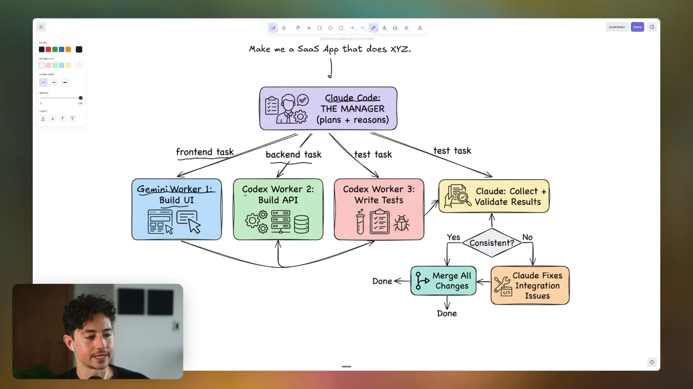

### 📋 Example 1 – Building a Website

You ask:

> Build a hospital website.

Instead of one model doing everything:

```text
Planner

↓

Coding Model

↓

HTML/CSS/React

↓

Design Model

↓

Color Palette

↓

Image Model

↓

Generate Hero Image

↓

Final Assembly
```

Each model contributes its specialty.

### 💻 Example 2 – Coding

Suppose you ask:

> Build authentication.

The orchestrator might use:

```text
Claude

↓

Architecture

↓

GPT

↓

React Components

↓

Gemini

↓

Documentation Search

↓

Combine
```

The final output is a blend of their strengths.

### 🖼️ Example 3 – Image Generation

Prompt:

> Create a futuristic hospital dashboard.

The workflow could be:

```text
GPT

↓

Improve Prompt

↓

Image Model

↓

Generate Image

↓

Vision Model

↓

Check Quality

↓

Final Image
```

The image model never had to write the prompt itself.

### 🎤 Example 4 – Voice Assistant

You say:

> Schedule a meeting tomorrow.

Workflow:

```text
Speech Model

↓

Convert Speech to Text

↓

LLM

↓

Understand Intent

↓

Calendar Tool

↓

Create Event

↓

Speech Model

↓

Read Confirmation
```

Several models and tools cooperate.

### 🔍 Types of Multi-Model Orchestration

##### 🟢 1. Sequential

One model feeds another.

```text
Model A

↓

Model B

↓

Model C
```

Example:

```text
Speech

↓

Translation

↓

Summarization
```

##### 🔵 2. Parallel

Multiple models work simultaneously.

```text
User

↓

──────────────
Model A

Model B

Model C
──────────────

↓

Merge
```

Much faster for independent tasks.

##### 🟣 3. Hierarchical

One model acts as the manager.

```text
Manager

↓

Worker 1

Worker 2

Worker 3

↓

Manager Reviews
```

Very common in modern AI agents.

##### 🟡 4. Voting (Ensemble)

Several models solve the same problem.

```text
GPT

↓

Claude

↓

Gemini

↓

Vote

↓

Best Answer
```

This can improve reliability for important decisions.

##### 🟠 5. Expert Routing

Different tasks go to different specialists.

```text
Math

↓

Math Model

Coding

↓

Coding Model

Images

↓

Vision Model
```

This is efficient because each model focuses on what it does best.

### 🧰 Model Router

The router decides where the request goes.

Example:

```text
User

↓

"Create logo"

↓

Image Model
```

Another example:

```text
User

↓

"Write SQL"

↓

Coding Model
```

Or:

```text
User

↓

"Summarize PDF"

↓

Document Model
```

The user doesn't have to choose manually.

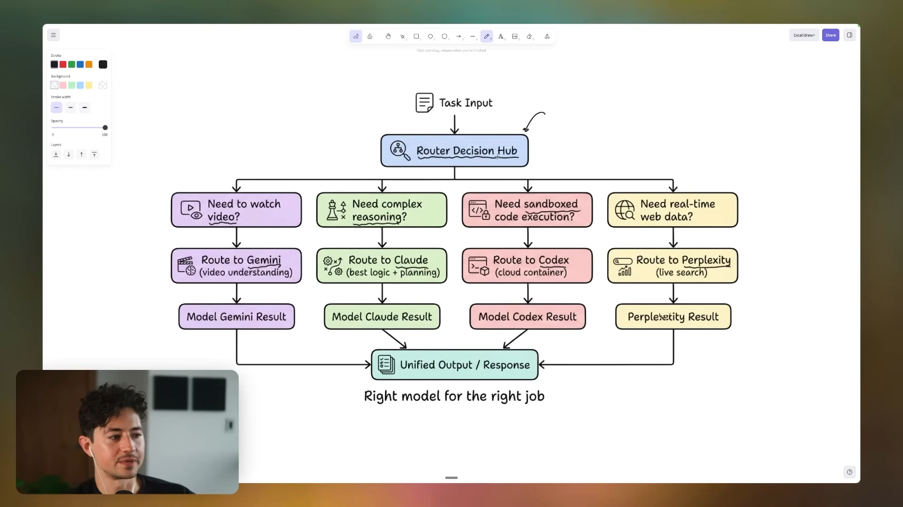

### 🧠 Context Sharing

Sometimes one model prepares information for another.

```text
Model A

↓

Creates Summary

↓

Model B

↓

Uses Summary

↓

Answer
```

This prevents every model from processing huge amounts of data independently.

### 🗂️ Shared Memory

Some orchestrators maintain shared memory.

```text
Memory

↓

Model A Reads

↓

Model B Reads

↓

Model C Reads
```

All models work from the same project knowledge.

### 🔧 Tool Orchestration

The orchestrator doesn't only manage models.

It also manages tools.

```text
LLM

↓

GitHub

↓

Postgres

↓

Browser

↓

Slack

↓

Filesystem
```

This is common in Agentic AI.

### 🤖 Multi-Agent vs Multi-Model

These terms are often confused.

**-- Multi-Model**

Different AI models.

```text
GPT

Claude

Gemini
```

**-- Multi-Agent**

Different AI agents.

```text
Planner

↓

Coder

↓

Tester

↓

Reviewer
```

Each agent may use the same model or different ones.

### 🌍 Real Example

Suppose you ask:

> Build an ERP.

An orchestrated workflow might look like:

```text
Planner Model

↓

Architecture Model

↓

Database Model

↓

Backend Model

↓

Frontend Model

↓

Testing Model

↓

Documentation Model

↓

Deployment Model
```

Each stage focuses on its own responsibility.

### 🚀 Real Products Using Orchestration

Many modern AI platforms use orchestration internally, although the exact details are usually proprietary.

Examples include:

* GitHub Copilot
* Claude
* Google Gemini
* Microsoft 365 Copilot
* OpenAI ChatGPT
* Replit Agent
* Lovable
* Bolt.new

For example, a coding assistant might use one model for planning, another for code generation, and another component for tool execution or verification.

### 📊 Benefits

✅ Better quality

Each model specializes.

✅ Lower cost

Cheap models can handle simple work.

Expensive models are reserved for difficult reasoning.

✅ Faster

Independent tasks can run in parallel.

✅ More reliable

Multiple models can verify each other.

✅ Easier to upgrade

You can replace one model without redesigning the whole system.

### ⚠️ Challenges

❌ More complex architecture

Managing several models is harder than using one.

❌ Higher latency

Passing information between models can add delays.

❌ Context consistency

Every model needs the right amount of context.

Too little causes mistakes.

Too much increases cost and latency.

❌ Cost management

Running multiple large models simultaneously can become expensive.

Smart orchestration tries to use the smallest capable model whenever possible.

### 🧩 Multi-Model Orchestration vs Single Model

| Single Model                     | Multi-Model Orchestration             |
| -------------------------------- | ------------------------------------- |
| One model handles everything     | Different models specialize           |
| Simpler architecture             | More complex orchestration            |
| Easier to build                  | More flexible                         |
| Limited by one model's strengths | Combines strengths of many models     |
| Harder to optimize per task      | Can optimize cost, speed, and quality |

### 🔮 The Future

Many researchers believe future AI systems will increasingly resemble software teams rather than single chatbots.

A possible workflow might look like this:

```text
User Goal

↓

Planner Model

↓

Research Model

↓

Coding Model

↓

Testing Model

↓

Security Review Model

↓

Documentation Model

↓

Deployment Model

↓

Final Review Model

↓

Completed Solution
```

Rather than searching for one "perfect" model, the trend is toward **orchestrating multiple specialized models and tools** so they can collaborate, verify one another, and deliver higher-quality results than any single model working alone.

---

# ----Video-to-Action Pipeline

A **Video-to-Action Pipeline** is an AI system that **observes a video (or live screen), understands what is happening, converts those observations into structured actions, and then performs or recommends those actions automatically.**

Instead of merely describing a video, the AI treats the video as  **instructions for accomplishing a task** .

Think of it as:

> **"Watch what a human does → Understand it → Learn it → Repeat it."**

This concept is becoming increasingly important in robotics, computer automation, autonomous agents, and AI copilots.

### 🧠 The Core Idea

Traditional AI:

```text
Video

↓

Describe video

↓

Done
```

Video-to-Action:

```text
Video

↓

Understand actions

↓

Create action plan

↓

Execute actions

↓

Verify

↓

Complete task
```

Instead of stopping at understanding, it  **acts** .

### 📺 Simple Example

Imagine a YouTube video:

> "How to create a React project."

The human performs:

```text
Open Terminal

↓

npm create vite

↓

Install React

↓

Install Tailwind

↓

Run Project
```

A Video-to-Action system converts that into:

```text
Action 1

↓

Action 2

↓

Action 3

↓

Action 4
```

Now another AI (or robot) can perform exactly those steps.

##### 🔍 Step 1 – Video Understanding

First, the AI watches the video.

It identifies:

* Objects
* People
* Buttons
* Menus
* Windows
* Cursor movement
* Keyboard typing
* Speech
* Screen changes

Example:

```text
Cursor

↓

Clicks Login

↓

Types Email

↓

Clicks Submit
```

This is the perception stage.

##### 📝 Step 2 – Event Detection

The AI identifies meaningful events.

Instead of every frame:

```text
Frame 1

Frame 2

Frame 3

Frame 4
```

it extracts:

```text
Opened Chrome

↓

Clicked Login

↓

Typed Password

↓

Submitted Form
```

Now the video becomes structured.

##### 🏷️ Step 3 – Action Recognition

The AI asks:

> **What action is happening?**

Examples:

```text
Click

Drag

Scroll

Type

Select

Open

Close

Upload
```

Instead of pixels,

it understands intent.

##### 🧩 Step 4 – State Understanding

The AI also understands:

Before:

```text
Login Page
```

After:

```text
Dashboard
```

So it knows

```text
Login succeeded.
```

rather than merely

```text
Button clicked.
```

##### 🧠 Step 5 – Planning

The actions become a workflow.

```text
Open Browser

↓

Go to Website

↓

Login

↓

Dashboard

↓

Create Project

↓

Save
```

This becomes an executable plan.

##### ⚙️ Step 6 – Execution

Another AI agent now performs those actions.

For example:

```text
Browser Agent

↓

Open Chrome

↓

Navigate

↓

Click

↓

Type

↓

Submit
```

The video has effectively become automation.

### 🏗️ Complete Pipeline

```text
Video

↓

Frame Extraction

↓

Vision Model

↓

Action Recognition

↓

Planning

↓

Agent

↓

Tools

↓

Execution
```

This is why it's called a  **pipeline** .

##### 🎯 Example 1 – Learning Photoshop

Suppose someone demonstrates:

```text
Open Photoshop

↓

Select Brush

↓

Draw

↓

Save PNG
```

The AI converts it into:

```text
Open Photoshop

↓

Select Brush Tool

↓

Paint

↓

Export PNG
```

A software agent could then repeat the process.

##### 🎯 Example 2 – Learning Excel

Video:

```text
Open Excel

↓

Insert Formula

↓

Sort

↓

Create Chart
```

Pipeline:

```text
Excel Agent

↓

Execute Formula

↓

Sort Data

↓

Generate Chart
```

##### 🎯 Example 3 – Learning VS Code

Video:

```text
Open VS Code

↓

Create React App

↓

Install Packages

↓

Run Project
```

The AI generates:

```text
mkdir project

↓

npm install

↓

code .

↓

npm run dev
```

No human intervention is needed after the workflow is understood.

### 🖥️ GUI Automation

This is one of the hottest applications.

The AI watches someone use software.

Example:

```text
Click Settings

↓

Click Privacy

↓

Enable Camera

↓

Save
```

The AI learns

how to operate that application.

Later it can perform those steps itself.

### 🤖 Robotics

Suppose a robot watches a human:

```text
Pick Cup

↓

Move Cup

↓

Place Cup
```

Pipeline:

```text
Vision

↓

Recognize Motion

↓

Create Motion Plan

↓

Robot Arm

↓

Repeat Action
```

This is often called  **learning from demonstration** .

### 💻 Coding Example

Imagine watching a developer:

```text
Open Terminal

↓

Create Next.js

↓

Install Prisma

↓

Create Schema

↓

Run Migration
```

The AI converts this into an executable workflow for a coding agent.

### 🧠 How AI Understands the Video

Modern systems combine several models.

```text
Video

↓

Vision Model

↓

Speech Model

↓

OCR

↓

LLM

↓

Planner
```

Each model contributes a different capability.

##### 👁️ Vision Model

Recognizes:

* Buttons
* Menus
* Windows
* Cursor
* UI layout

##### 🔤 OCR

Reads text.

Example:

```text
Settings

Save

Cancel

Next
```

##### 🎤 Speech Model

Transcribes spoken instructions.

Example:

> "Click Save."

##### 🧠 LLM

Understands the meaning.

Example:

```text
Need Login

↓

Need Authentication

↓

Need Dashboard
```

##### 🤖 Agent

Actually performs the task.

### 🛠️ Example Pipeline

Imagine a tutorial:

> Install Docker.

Pipeline:

```text
Video

↓

Speech

↓

Text

↓

Vision

↓

Identify Buttons

↓

Planner

↓

Steps

↓

Terminal Agent

↓

Install Docker
```

The AI transforms a passive tutorial into an executable workflow.

##### 📊 Structured Output

Instead of returning paragraphs,

the AI might produce:

```json
[
  {
    "action": "open_browser"
  },
  {
    "action": "navigate",
    "url": "https://react.dev"
  },
  {
    "action": "click",
    "selector": "#download"
  }
]
```

Another agent can execute this sequence.

##### 🌍 Real-World Uses

**💻 Software Automation**

Watch someone use software once.

The AI learns the workflow.

**🤖 Robotics**

Watch a human perform a task.

The robot learns it.

**🧪 Laboratory Automation**

Observe scientists performing experiments.

Generate repeatable procedures.

**🏭 Manufacturing**

Learn factory processes from video.

Create robotic workflows.

**🎮 Gaming**

Watch expert players.

Learn strategies and control sequences.

**📚 Education**

Watch tutorials.

Convert them into:

* Checklists
* Interactive lessons
* Automated workflows

### ⚠️ Challenges

**🎥 Ambiguity**

Videos often omit details.

Example:

```text
Click Button
```

Which button?

The AI must infer context.

**🖱️ UI Changes**

Today's interface:

```text
Save
```

Tomorrow:

```text
Store
```

Automation may break if it relies only on visual appearance.

**⚡ Timing**

Humans naturally wait.

AI must know:

```text
Click

↓

Wait

↓

Continue
```

instead of clicking too quickly.

**🔄 Generalization**

One tutorial may not apply to every version of an application.

The AI needs to adapt to variations.

---

# ----Stochastic Multi-Agent Consensus

**Stochastic Multi-Agent Consensus (SMAC)** is an advanced AI reasoning technique where **multiple AI agents independently solve the same problem, often with some randomness (stochasticity), and then compare, debate, or vote to arrive at a more reliable final answer.**

Instead of trusting the output of a single AI run, the system asks:

> **"What if we let several independent AI thinkers solve this problem and then combine their conclusions?"**

This idea is inspired by how **scientific peer review, engineering design reviews, and expert committees** work.

#### 🎯 Why is it needed?

A single AI model can make mistakes because of:

* Random sampling during generation
* Misunderstanding the prompt
* Hallucinations
* Incomplete reasoning
* Bias toward one solution

If only one AI is used:

```text
Question

↓

One AI

↓

One Answer
```

If that answer is wrong, the process ends there.

With consensus:

```text
Question

↓

──────────────
Agent A
Agent B
Agent C
Agent D
──────────────

↓

Compare

↓

Consensus

↓

Final Answer
```

The chance of a correct answer often improves, especially on difficult reasoning tasks.

#### 🎲 What does "Stochastic" mean?

**Stochastic** means  **there is some randomness involved** .

Large Language Models don't always generate the exact same reasoning path.

For example, ask five times:

> Design a CRM database.

You might get:

**Agent A**

```text
Users

Customers

Orders
```

**Agent B**

```text
Users

Customers

Invoices
```

**Agent C**

```text
Users

Customers

Payments
```

Each took a slightly different reasoning path.

That randomness is the **stochastic** part.

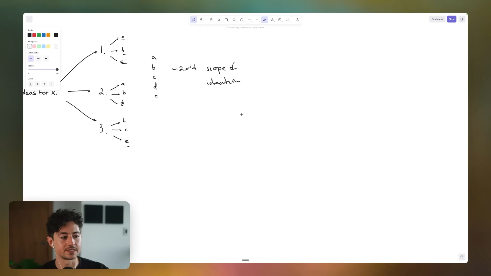

### 👥 What does "Multi-Agent" mean?

Instead of one agent:

```text
AI
```

You have several.

Example:

```text
Planner

↓

Architect

↓

Security Expert

↓

Database Expert

↓

Reviewer
```

Or simply several identical agents reasoning independently.

### 🤝 What does "Consensus" mean?

Consensus means reaching agreement.

Example:

```text
Agent A

↓

React

Agent B

↓

React

Agent C

↓

Next.js

Agent D

↓

React
```

Consensus:

```text
React
```

The majority agrees.

However, many systems use more sophisticated methods than a simple majority vote.

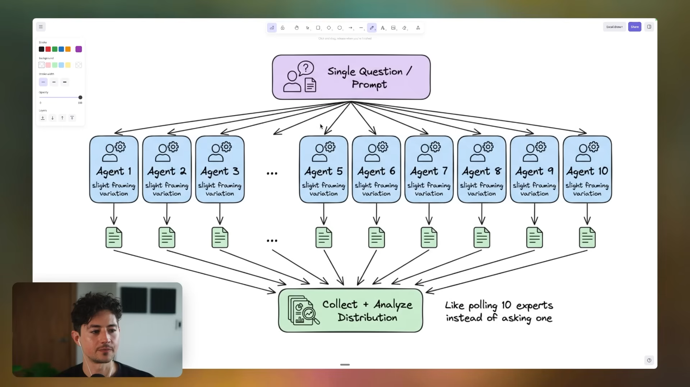

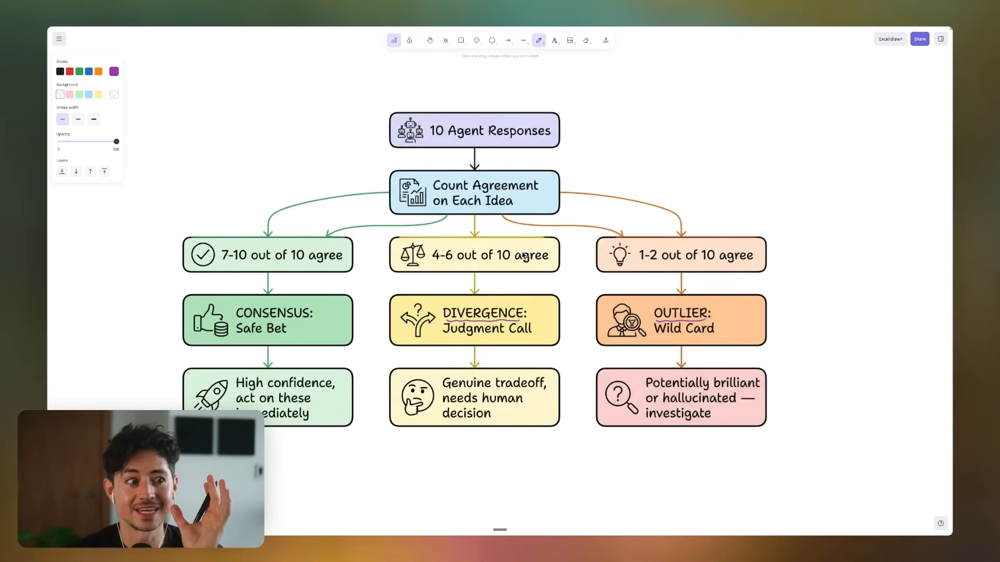

### 🏗️ Basic Architecture

```text
Problem

↓

Create Multiple Agents

↓

Each Solves Independently

↓

Compare Solutions

↓

Debate / Vote / Score

↓

Final Consensus
```

### 🔍 Example – Math Problem

Suppose:

```text
127 × 84
```

Instead of:

```text
One AI

↓

10678
```

The system creates:

```text
Agent A

↓

10668

Agent B

↓

10668

Agent C

↓

10668

Agent D

↓

10678
```

Consensus:

```text
10668
```

The outlier can be rejected.

### 💻 Example – Code Generation

Prompt:

> Build authentication.

Several agents produce solutions.

**Agent A**

Uses Auth.js.

**Agent B**

Uses Clerk.

**Agent C**

Uses Auth.js with middleware.

**Agent D**

Uses Auth.js with Server Actions.

Consensus might be:

```text
Auth.js

+

Middleware

+

Server Actions
```

Instead of copying one solution, the orchestrator can synthesize the strongest ideas.

### 🩺 Example – Medical AI

Question:

> Diagnose symptoms.

Agents specialize in:

```text
General Medicine

↓

Cardiology

↓

Neurology

↓

Radiology
```

Each gives an opinion.

The orchestrator weighs:

* Confidence
* Evidence
* Agreement

before producing a recommendation.

### 🎲 Why randomness helps

At first glance, randomness seems undesirable.

But if every agent always produced the same reasoning, there would be little benefit to having multiple agents.

Randomness encourages exploration.

Example:

```text
Problem

↓

Agent A

Finds Solution 1

↓

Agent B

Finds Solution 2

↓

Agent C

Finds Solution 3
```

The system can choose the best.

### 🧠 Different Types of Consensus

##### 🟢 Majority Voting

Simplest method.

```text
A → React

B → React

C → Vue

D → React
```

Winner:

```text
React
```

##### 🔵 Weighted Voting

Some agents are trusted more.

Example:

```text
Security Expert

Weight = 5

Junior Agent

Weight = 1
```

Not every vote counts equally.

##### 🟣 Confidence Scoring

Each agent reports confidence.

Example:

```text
Agent A

95%

↓

Agent B

80%

↓

Agent C

60%
```

Higher-confidence answers may carry more influence, although confidence alone doesn't guarantee correctness.

##### 🟠 Debate

Agents critique one another.

Example:

```text
Agent A

↓

Solution

↓

Agent B

↓

Criticism

↓

Agent A

↓

Revision

↓

Consensus
```

This can expose flaws before the final answer.

##### 🟡 Judge Model

Several agents propose answers.

A separate model evaluates them.

```text
Worker Agents

↓

Judge Model

↓

Best Answer
```

This "judge" pattern is common in modern AI systems.

### 🔄 Consensus Loop

```text
Problem

↓

Agent A

↓

Agent B

↓

Agent C

↓

Compare

↓

Disagree?

↓

Yes

↓

Reason Again

↓

Consensus

↓

Done
```

The process can repeat until sufficient agreement is reached or a stopping condition is met.

### 🌟Use Case-When Strategic Decision Needed

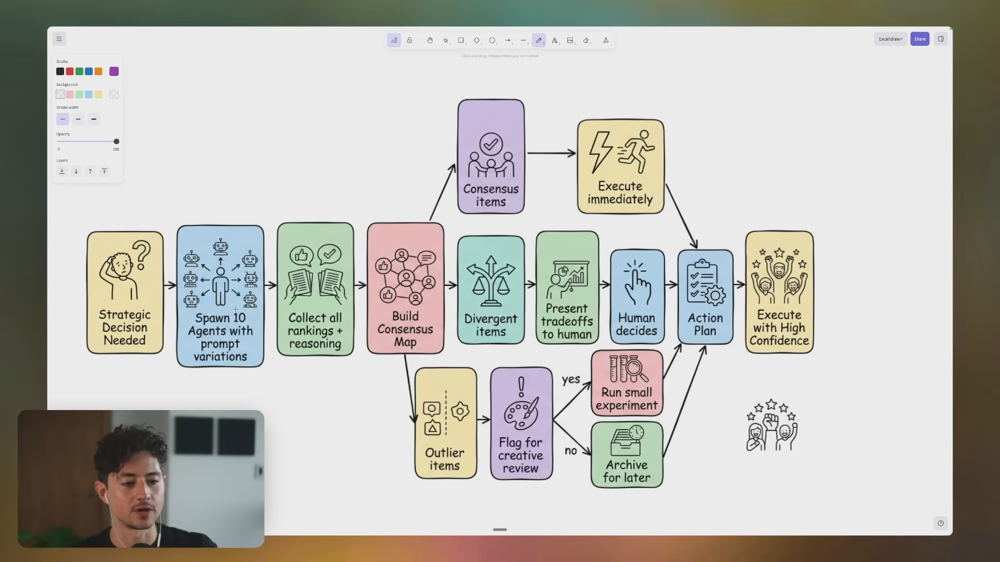

### 🚀 Example – Software Development

Imagine:

> Build an ERP.

Instead of one agent:

```text
Planner

↓

Writes Everything
```

The work is divided.

```text
Planner

↓

Database Agent

↓

Backend Agent

↓

Frontend Agent

↓

Testing Agent

↓

Security Agent

↓

Reviewer

↓

Consensus
```

Each focuses on its area of expertise.

### 🧪 Research Example

Suppose the task is:

> Find the best machine learning algorithm.

Agents independently search:

```text
Agent A

↓

Random Forest

Agent B

↓

XGBoost

Agent C

↓

CatBoost

Agent D

↓

LightGBM
```

Consensus might conclude:

```text
Use XGBoost

because

highest accuracy
```

based on shared evidence.

### 🤖 Relation to Chain of Thought

Normal reasoning:

```text
One Thought

↓

Answer
```

Consensus:

```text
Multiple Thoughts

↓

Compare

↓

Answer
```

Multiple independent reasoning paths reduce reliance on a single line of thought.

### 🧩 Relation to Self-Consistency

These concepts are closely related but not identical.

**Self-Consistency**

* One model.
* Multiple reasoning attempts.
* Choose the most consistent answer.

**Stochastic Multi-Agent Consensus**

* Multiple agents (which may use the same or different models).
* Independent reasoning.
* Combine through voting, judging, or debate.

Self-consistency can be viewed as a special case of this broader family of techniques.

### 🏢 Real-World Uses

This general approach is useful for:

* Scientific research
* Code generation
* Medical decision support
* Financial analysis
* Robotics
* Legal document review
* Autonomous driving
* Strategic planning

Anywhere reliability matters more than a single fast answer.

### ⚠️ Challenges

**💰 Cost**

Running multiple agents costs more than running one.

**⏱️ Latency**

Several agents take longer than one.

**🤔 Consensus isn't always correct**

If every agent shares the same incorrect assumption, they may all agree on the wrong answer.

Consensus improves reliability, but it is  **not a guarantee of correctness** .

### ⚖️ Diversity

If every agent thinks identically:

```text
Same Prompt

↓

Same Model

↓

Same Parameters

↓

Same Answer
```

there is little value.

Systems benefit when agents explore different reasoning paths or perspectives.

### 📌 Relationship to Agentic AI

Stochastic Multi-Agent Consensus is  **not a separate type of AI** . It is a **reasoning strategy** that can be used inside Agentic AI systems.

```text
User Goal

↓

Agentic AI

↓

Multiple Agents

↓

Independent Reasoning

↓

Consensus

↓

Action

↓

Verification

↓

Completed Goal
```

Many advanced coding assistants and research agents are moving toward architectures that incorporate ideas like multi-agent collaboration, judging, and consensus because they can improve robustness on complex tasks. The exact implementation varies between products, and companies rarely disclose the full details of their internal orchestration.

---

# ----Agent Chat Rom

**Agent Chat Rooms** are a collaborative AI architecture where **multiple AI agents communicate with one another in a shared conversation (or separate coordinated conversations) to solve a problem together.**

Instead of one AI doing all the thinking internally, you have a  **team of specialized AI agents** , each with a different role, discussing the task much like human coworkers in a meeting.

Think of it as creating a Slack or Microsoft Teams workspace—but every participant is an AI agent.

### 🧠 The Core Idea

Traditional AI:

```text
User

↓

One AI

↓

Answer
```

Agent Chat Rooms:

```text
User

↓

───────────────
Planner
Coder
Researcher
Tester
Reviewer
───────────────

↓

Discussion

↓

Final Answer
```

Instead of one stream of reasoning, you get  **collaborative reasoning** .

### 🤔 Why Chat Rooms?

Imagine you're building a hospital ERP.

Would you rather have:

```text
One Developer
```

or

```text
Backend Developer

Frontend Developer

Database Architect

QA Engineer

Security Engineer

Project Manager
```

Most real software is built by teams because different people have different expertise.

Agent Chat Rooms apply the same principle to AI.

### 🎭 Each Agent Has a Role

Every agent can have its own:

* Expertise
* Instructions
* Memory
* Tools
* Permissions
* Objectives

Example:

```text
Planner

↓

Creates roadmap

Coder

↓

Writes code

Tester

↓

Runs tests

Reviewer

↓

Checks quality
```

Each focuses on its specialty.

### 🏗️ Basic Architecture

```text
User Goal

↓

Chat Room

↓

───────────────
Planner

Architect

Backend

Frontend

QA

Security
───────────────

↓

Discussion

↓

Consensus

↓

Final Result
```

The "chat room" is the communication layer connecting the agents.

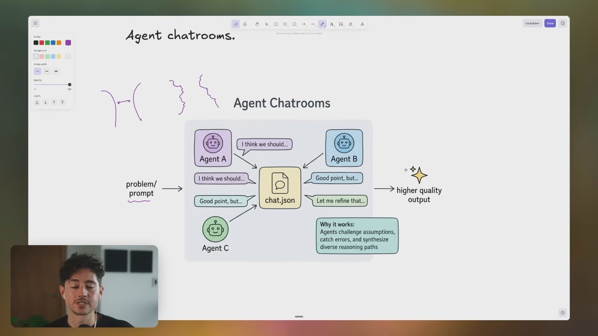

### 💻 Example – Building Authentication

User:

> Build Google Login.

The conversation might look like this:

```text
Planner

↓

Need OAuth.

Backend

↓

Need Auth.js.

Database

↓

Need Users table.

Security

↓

Need CSRF protection.

Tester

↓

Need login tests.

Reviewer

↓

Need error handling.
```

The final implementation combines everyone's input.

### 🔍 Internal Conversations

Users don't always see these discussions.

Many systems perform them behind the scenes.

Example:

```text
Planner

↓

Need database.

Architect

↓

Use PostgreSQL.

Backend

↓

Prisma schema.

Frontend

↓

React UI.

Tester

↓

Verify login.

Reviewer

↓

Looks good.
```

Only the finished result is shown to you.

### 🧩 Types of Agent Chat Rooms

##### 🟢 1. Open Chat Room

Everyone sees every message.

```text
Planner

↓

Coder

↓

Tester

↓

Reviewer
```

Very collaborative.

##### 🔵 2. Manager-Based

Only one agent communicates with everyone.

```text
Manager

↓

Backend

↓

Frontend

↓

Tester

↓

Manager

↓

User
```

The manager coordinates the work.

### 🟣 3. Private Channels

Some discussions happen privately.

Example:

```text
Backend

↔

Database
```

while

```text
Frontend

↔

Designer
```

The manager later combines the outcomes.

##### 🟠 4. Hierarchical Rooms

Large systems may contain multiple chat rooms.

```text
Project Manager

↓

Frontend Room

↓

Backend Room

↓

DevOps Room

↓

Testing Room
```

Each room solves its own problems before reporting upward.

### 🎯 Example – Research

Question:

> Compare PostgreSQL and MongoDB.

The chat room might include:

```text
Research Agent

↓

Collects papers

Database Expert

↓

Explains architecture

Performance Expert

↓

Benchmarks

Writer

↓

Creates report
```

The user receives one cohesive answer.

### 🛠️ Example – Bug Fixing

Suppose:

```text
Build Failed
```

The room might respond like this:

```text
Tester

↓

Type Error

Backend

↓

Fix API

Frontend

↓

Update Component

Reviewer

↓

Approve
```

This division of responsibility can speed up problem-solving.

### 🔄 Message Flow

Messages flow continuously.

```text
Planner

↓

Database

↓

Backend

↓

Frontend

↓

Tester

↓

Reviewer

↓

Planner
```

Every agent contributes new information.

### 🧠 Shared Memory

Often, all agents access common project memory.

```text
Project Memory

↓

Planner Reads

↓

Backend Reads

↓

Frontend Reads

↓

Tester Reads
```

Everyone stays aligned.

### 🔧 Shared Tools

Agents may also share tools.

Example:

```text
GitHub

Filesystem

Terminal

Browser

Database
```

Or they may each have different permissions.

Example:

```text
Tester

↓

Browser

Reviewer

↓

Git Diff

Database

↓

SQL
```

### 📚 Context Sharing

Instead of every agent reading the entire project:

```text
Huge Repository
```

The orchestrator provides only relevant context.

Example:

```text
Frontend

↓

React Files

Backend

↓

API Files

Database

↓

Schema
```

This reduces unnecessary processing.

### 🚀 Real Example

Imagine creating a CRM.

The room might look like:

```text
Manager

↓

Authentication Agent

↓

Customer Agent

↓

Billing Agent

↓

Reporting Agent

↓

Testing Agent

↓

Reviewer
```

The manager assembles the final solution.

### ⚖️ Agent Chat Rooms vs Multi-Agent Systems

These concepts are related but different.

##### 🟢 Multi-Agent System

Simply means multiple agents cooperate.

Example:

```text
Planner

↓

Coder

↓

Tester
```

Communication can happen in many ways.

##### 🟣 Agent Chat Room

Specifically emphasizes **conversation** between agents.

```text
Planner

↓

"I think PostgreSQL is best."

↓

Database Agent

↓

"Agreed because..."

↓

Security Agent

↓

"Need encryption."
```

The dialogue itself is central.

### 🎭 Agent Chat Rooms vs Multi-Model Orchestration

These are also different.

### Multi-Model Orchestration

Coordinates different AI models.

```text
GPT

Claude

Gemini
```

**-- Agent Chat Rooms**

Coordinates different  **roles** .

```text
Planner

Coder

Tester

Reviewer
```

One chat room could even have every agent powered by the same model.

### 🌍 Current Examples

Many modern AI systems are believed to use concepts similar to Agent Chat Rooms internally, although companies generally don't publish the exact implementation details.

Examples include:

* Claude Code
* GitHub Copilot Agent
* Google Antigravity
* Replit Agent
* Devin
* OpenHands
* Enterprise agent platforms

Some expose these roles directly, while others keep the collaboration hidden.

### ⚠️ Challenges

**💰 Higher Cost**

Running multiple agents consumes more compute than running one.

**⏱️ More Time**

More conversations generally mean more latency.

**🤝 Coordination**

Agents need clear communication.

Otherwise:

```text
Planner

↓

Wrong Context

↓

Backend

↓

Wrong Code
```

Miscommunication can propagate errors.

### 🔁 Infinite Discussions

Without limits, agents could keep debating forever.

Good systems impose:

* Time limits
* Message limits
* Consensus thresholds
* Manager intervention

---

# ----Sub-Agent Verification Loops and Mixture of Experts

### 🔄 Sub-Agent Verification Loops

Sub-Agent Verification Loops are an advanced Agentic AI technique where **specialized AI sub-agents continuously verify, critique, test, and improve the work of other agents before a final answer or action is produced.**

Instead of trusting one agent's output, the system builds **feedback loops** where other agents review the work, find mistakes, and request improvements.

Think of it as the AI equivalent of:

* Code reviews
* Peer review in scientific research
* QA testing
* Editorial review
* Security audits

##### 🎯 The Core Idea

Without verification:

```text
User

↓

Agent

↓

Answer
```

One mistake goes directly to the user.

With verification loops:

```text
User

↓

Worker Agent

↓

Verifier

↓

Critic

↓

Tester

↓

Reviewer

↓

Final Answer
```

Every stage attempts to improve the quality.

##### 🏗️ Basic Architecture

```text
Goal

↓

Planner

↓

Worker Agent

↓

Verification Agent

↓

Testing Agent

↓

Security Agent

↓

Final Output
```

Notice that multiple agents inspect the work before completion.

##### 💻 Example – Building Login Authentication

Suppose you ask:

> Build Google Login.

The Worker Agent creates:

```text
Login Page

OAuth

Session

Database
```

Instead of immediately returning it:

```text
Worker

↓

Verification Agent
```

The verification agent asks:

* Does OAuth work?
* Are sessions secure?
* Are callbacks handled?
* Is error handling missing?

##### 🔄 The Verification Loop

The process often looks like this:

```text
Generate Solution

↓

Review

↓

Errors Found?

↓

Yes

↓

Fix

↓

Review Again

↓

Approved

↓

Done
```

This loop may repeat several times.

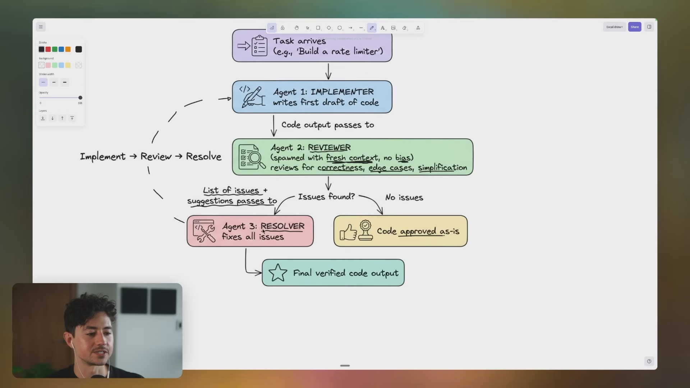

##### 🧪 Example – Code Review

Worker Agent:

```typescript
const password = req.body.password;
```

Security Agent:

```text
Password stored in plain text.

↓

Use bcrypt.
```

Worker revises:

```typescript
const hashed = await bcrypt.hash(password,10);
```

Security reviews again.

Only then is it accepted.

##### 🐞 Example – Debugging

Imagine:

```text
Worker

↓

Build Project

↓

TypeScript Error
```

Verification loop:

```text
Tester

↓

Read Error

↓

Worker

↓

Fix

↓

Tester

↓

Run Build

↓

Pass
```

Instead of the user fixing everything manually, the agents iterate until the issue is resolved or they reach a stopping limit.

##### 📚 Types of Verification Agents

**🔍 Syntax Verifier**

Checks:

* Syntax
* Imports
* Compilation

**🧠 Logic Verifier**

Checks:

* Algorithms
* Business logic
* Edge cases

**🔒 Security Verifier**

Looks for:

* SQL Injection
* XSS
* CSRF
* Secrets
* Authentication flaws

**⚡ Performance Verifier**

Checks:

* Database efficiency
* API latency
* Memory usage
* Scalability

**🎨 UI Verifier**

Examines:

* Responsiveness
* Accessibility
* Layout consistency

**🧪 Test Agent**

Runs:

* Unit tests
* Integration tests
* Browser tests
* API tests

##### 🔄 Continuous Verification

Modern AI systems don't verify only once.

Instead:

```text
Plan

↓

Implement

↓

Verify

↓

Improve

↓

Verify

↓

Improve

↓

Complete
```

Quality improves with each cycle.

##### 🤖 Why Sub-Agents?

One model trying to do everything may overlook its own mistakes.

A specialized reviewer approaches the problem differently.

For example:

```text
Coding Agent

↓

"Looks good."

↓

Security Agent

↓

"Actually, this endpoint lacks authorization."
```

Different perspectives uncover different issues.

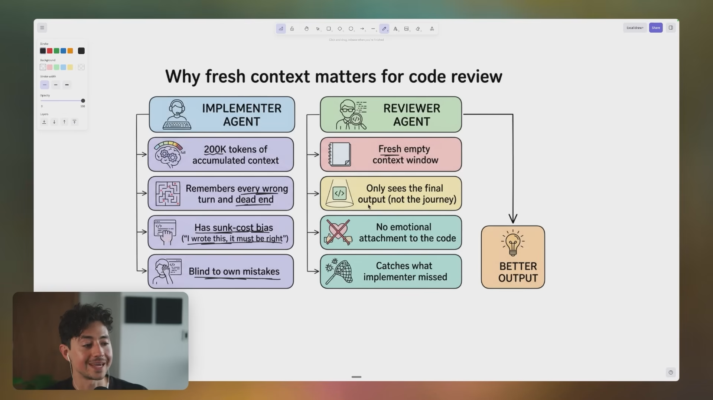

##### 🏢 Enterprise Example

Imagine building an ERP.

The workflow could be:

```text
Planner

↓

Backend Agent

↓

API Reviewer

↓

Security Reviewer

↓

Database Reviewer

↓

QA Agent

↓

Documentation Agent

↓

Deployment
```

Every major component is independently verified.

##### 📈 Benefits

✅ Higher accuracy

Multiple reviewers reduce mistakes.

✅ Better security

Dedicated security reviews catch vulnerabilities.

✅ Better code quality

Reviewers suggest cleaner architecture and style.

✅ More reliable software

Testing agents validate that features actually work.

##### ⚠️ Challenges

* Increased compute cost
* Longer execution time
* Potential disagreements between agents
* Requires orchestration to decide when enough verification has been done

### 🧠 What is a Mixture of Experts (MoE)?

A **Mixture of Experts (MoE)** is a neural network architecture where **many specialized expert subnetworks exist, but only a small subset is activated for any given input.**

Instead of every neuron working on every question, the model selectively activates the experts most relevant to the task.

Think of a large company.

It doesn't ask every employee to work on every problem.

Instead:

```text
Customer Question

↓

Reception

↓

Finance Team

OR

Legal Team

OR

Engineering Team

↓

Answer
```

The reception desk is analogous to the **router** in an MoE model.

##### 🏗️ Traditional Dense Model

In a dense transformer:

```text
Input

↓

Layer

↓

Every Neuron

↓

Output
```

Every parameter participates in every inference.

##### 🏗️ Mixture of Experts Model

In an MoE:

```text
Input

↓

Router

↓

Expert 3

Expert 8

↓

Combine

↓

Output
```

Only a few experts are active.

##### 🎯 Why Use MoE?

Large models keep getting bigger.

Suppose a model has:

```text
1 Trillion Parameters
```

Running all trillion parameters for every token would be extremely expensive.

Instead:

```text
1 Trillion Parameters

↓

Activate only

40 Billion

↓

Generate Output
```

You gain much of the capacity of a huge model while reducing computation per inference.

##### 🧩 What is an Expert?

An expert is a specialized neural subnetwork.

Examples (conceptually):

```text
Expert 1

Mathematics

Expert 2

Programming

Expert 3

Medicine

Expert 4

Languages

Expert 5

Physics
```

In reality, experts are  **not usually manually assigned these roles** . During training, they learn to specialize automatically based on the data and the routing process.

##### 🚦 The Router

The router decides which experts should process each token.

```text
Input

↓

Router

↓

Choose Experts

↓

Run Experts

↓

Merge Results
```

This decision happens dynamically for every token or small group of tokens, depending on the architecture.

##### 💻 Coding Example

Prompt:

> Write a React component.

Router:

```text
Coding Expert

↓

JavaScript Expert

↓

UI Expert
```

Those experts contribute to the response.

##### 🩺 Medical Example

Prompt:

> Explain diabetes.

Router:

```text
Medical Expert

↓

Biology Expert

↓

General Language Expert
```

The selected experts process the input together.

##### 🌍 Language Example

Prompt:

> Translate to Japanese.

Router:

```text
Translation Expert

↓

Japanese Language Expert

↓

Grammar Expert
```

Again, these are conceptual labels—the actual experts are learned neural components.

##### 🔄 MoE Workflow

```text
Input

↓

Embedding

↓

Router

↓

Expert Selection

↓

Expert Computation

↓

Merge

↓

Next Layer

↓

Output
```

This routing happens repeatedly throughout the model.

##### 📊 Dense vs MoE

| Dense Model                      | Mixture of Experts                                                 |
| -------------------------------- | ------------------------------------------------------------------ |
| Every parameter runs             | Only selected experts run                                          |
| Simpler architecture             | More complex routing                                               |
| Higher computation per inference | Lower computation per inference for the same total parameter count |
| Easier to train                  | More challenging to balance expert usage                           |

##### ⚖️ Advantages

**🚀 Better Scalability**

Models can grow to hundreds of billions or even trillions of parameters without requiring all of them to be active simultaneously.

**💰 Lower Inference Cost**

Only a fraction of the model is used for each token.

**🧠 Natural Specialization**

Experts tend to develop different competencies during training.

**📈 Higher Capacity**

The model can store more knowledge overall while keeping inference efficient.

##### ⚠️ Challenges

**🚦 Load Balancing**

If the router always picks the same experts:

```text
Expert 1

100%

Expert 2

0%

Expert 3

0%
```

Some experts become overloaded while others never learn.

Training includes mechanisms to encourage balanced usage.

**🧩 Routing Errors**

The router might choose suboptimal experts, reducing quality.

**🔧 More Complex Training**

MoE models require additional routing logic and balancing losses, making them harder to train than dense models.

##### 🏢 Real-World Examples

Several modern frontier models are known to use MoE architectures or variants of them, though companies rarely disclose complete architectural details.

Examples include:

* Google's Switch Transformer (research)
* Google's GLaM (research)
* Google's Gemini family (reported to use MoE techniques in some versions)
* Mistral's Mixtral models
* DeepSeek-V3
* Other recent frontier research models

Not every large language model uses MoE; many remain dense architectures.

##### 🔄 Mixture of Experts vs Multi-Agent Systems

These are often confused, but they operate at different levels.

| Mixture of Experts                   | Multi-Agent System                    |
| ------------------------------------ | ------------------------------------- |
| Inside one neural network            | Multiple independent AI agents        |
| Experts are neural subnetworks       | Agents are separate reasoning systems |
| Router selects experts automatically | Orchestrator coordinates agents       |
| Happens during inference             | Happens at the application level      |

---

# ----Prompt Contract and Scopes

**Prompt Contracts** and **Prompt Scopes** are concepts used in modern AI systems—especially  **Agentic AI** ,  **AI coding assistants** ,  **multi-agent systems** , and  **enterprise AI platforms** —to make AI behavior  **predictable, safe, modular, and reusable** .

Think of them like software engineering concepts:

* 📜 **Prompt Contract** = The agreement that defines *what the AI should do* and  *what rules it must follow* .
* 🎯 **Prompt Scope** = The boundaries that define *where those rules apply* and  *what information the AI is allowed to use* .

Together, they make AI systems behave more like well-engineered software components than unpredictable chatbots.

#### 📜 What is a Prompt Contract?

A **Prompt Contract** is a **formal or semi-formal specification** that defines:

* What the AI is responsible for
* What it is **not** responsible for
* Expected inputs
* Expected outputs
* Rules
* Constraints
* Success criteria

Think of it like a software API contract.

#### 💡 Simple Analogy

Imagine hiring an architect.

Without a contract:

```text
Build me a house.
```

They might build:

* 1 floor
* 5 floors
* Modern
* Traditional

Everything is ambiguous.

With a contract:

```text
Build

↓

2 floors

↓

3 bedrooms

↓

Modern style

↓

Budget ₹50 lakh

↓

Solar panels
```

Now expectations are clear.

Prompt contracts serve the same purpose for AI.

#### 🏗️ Structure of a Prompt Contract

A typical prompt contract includes:

```text
Role

↓

Objective

↓

Rules

↓

Constraints

↓

Output Format

↓

Success Conditions
```

#### 🧑‍💼 Example

Imagine a coding agent.

Prompt contract:

```text
Role

Senior Backend Engineer

Goal

Build REST APIs

Rules

Use TypeScript

Use Prisma

Use PostgreSQL

Never modify frontend

Output

Code + explanation
```

The AI now has a clear "job description."

#### 🎯 Why Prompt Contracts Matter

Without a contract:

```text
Write authentication.
```

The AI may:

* Use MongoDB
* Use Firebase
* Use Clerk
* Use JavaScript

You get inconsistent results.

With a contract:

```text
Always use

Next.js

TypeScript

Prisma

Auth.js
```

The AI becomes much more consistent.

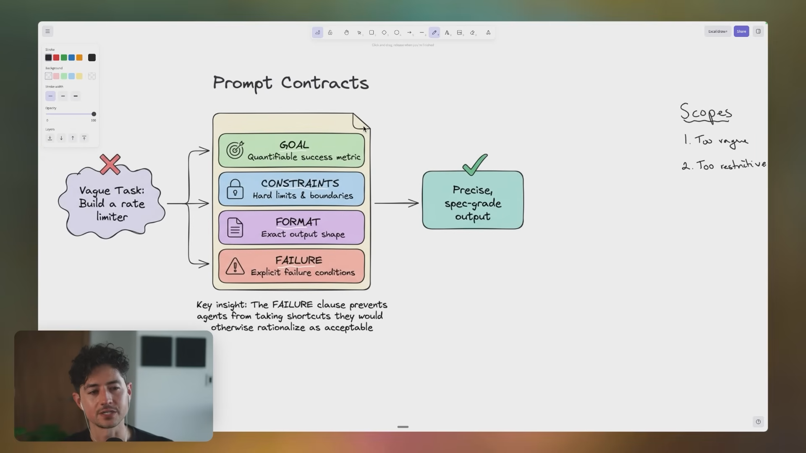

#### 📚 Components of a Prompt Contract

**👤 Role**

Who is the AI?

Example:

```text
Senior Software Architect
```

**🎯 Goal**

Example:

```text
Design authentication.
```

**📏 Rules**

Example:

```text
Use TypeScript.

No JavaScript.

No jQuery.
```

**🚫 Constraints**

Example:

```text
Do not delete files.

Do not install packages.

Do not change database schema.
```

#### 📤 Output Format

Example:

```text
Markdown

↓

Architecture

↓

Code

↓

Explanation
```

#### ✅ Success Criteria

Example:

```text
Build succeeds.

Tests pass.

No lint errors.
```

The AI knows when the task is considered complete.

### 🧩 What is Prompt Scope?

The **scope** defines the **boundary** within which a prompt or instruction is valid.

Think of it as the AI equivalent of variable scope in programming.

A rule doesn't always apply everywhere.

##### 🏗️ Example

Suppose you have:

```text
Always use React.
```

Should this apply to:

* Backend?
* Python scripts?
* SQL?
* Documentation?

Probably not.

The scope limits where that instruction applies.

##### 📦 Types of Prompt Scope

**🌍 Global Scope**

Applies everywhere.

Example:

```text
Always answer politely.
```

Every conversation follows this.

**👤 User Scope**

Applies to one user.

Example:

```text
Always use emoji headings.
```

This is a good example of a long-term user preference.

**📁 Project Scope**

Applies only to one project.

Example:

```text
Project:

Hospital ERP

Use PostgreSQL.

Use Prisma.
```

A different project might use MongoDB instead.

**📄 File Scope**

Applies only to one file.

Example:

```text
Inside

tailwind.config.ts

↓

Use Tailwind conventions.
```

**⚙️ Task Scope**

Only applies during one task.

Example:

```text
Today

↓

Refactor authentication.
```

Once the task ends, the rule expires.

**🤖 Agent Scope**

Only one agent receives the instruction.

Example:

```text
Security Agent

↓

Focus on vulnerabilities.
```

The coding agent never sees that instruction.

##### 🧠 Hierarchy of Scopes

Modern AI systems often layer scopes.

```text
Global

↓

Organization

↓

User

↓

Project

↓

Agent

↓

Task

↓

Current Prompt
```

Lower levels can refine or override higher levels, depending on the system's design.

##### 🏢 Enterprise Example

Imagine a company.

**Global**

```text
Never reveal confidential data.
```

**Team**

```text
Frontend team uses React.
```

**Project**

```text
This project uses Next.js.
```

**Task**

```text
Today

↓

Implement login.
```

The AI combines all applicable scopes.

### **🔄 Prompt Contract + Scope Together**

Imagine this:

Contract:

```text
Use Prisma.

Use PostgreSQL.

Never delete files.
```

Scope:

```text
Only applies

↓

Inventory Module
```

When working on billing,

those rules may not apply.

### 💻 Example in GitHub Copilot

Suppose you create a Copilot instructions file.

Contract:

```text
Use Tailwind.

Use App Router.

Prefer async/await.
```

Scope:

```text
Repository
```

Every file in that repository follows those rules.

Another repository can have a completely different contract.

### 🤖 Multi-Agent Example

Imagine:

```text
Planner

↓

Coder

↓

Tester

↓

Reviewer
```

Each receives a different contract.

Planner:

```text
Focus on architecture.
```

Coder:

```text
Write TypeScript only.
```

Tester:

```text
Find bugs.

Don't modify code.
```

Reviewer:

```text
Evaluate readability.
```

Same project.

Different contracts.

### 🔐 Why Contracts Improve Reliability

Without contracts:

```text
AI

↓

Makes assumptions
```

With contracts:

```text
AI

↓

Follows specification
```

This reduces variability between runs.

### 🧪 Prompt Contracts vs Prompt Engineering

These terms are related but different.

**-- Prompt Engineering**

Focuses on writing prompts that produce good results.

Example:

```text
Explain React simply.
```

**-- Prompt Contract**

Defines long-term behavior.

Example:

```text
Always use

TypeScript

Tailwind

Prisma
```

Think of prompt engineering as crafting a request, while prompt contracts define ongoing obligations.

### 🛡️ Security Benefits

Prompt contracts can restrict dangerous behavior.

Example:

```text
Never expose API keys.

Never delete production data.

Never execute destructive commands.
```

This is especially important for autonomous coding agents.

### 📈 Benefits

**✅ Consistency**

The AI behaves the same way across similar tasks.

**✅ Predictability**

Developers know what to expect.

**✅ Reusability**

The same contract can be shared across projects.

**✅ Team Collaboration**

Everyone works with the same AI standards.

**✅ Easier Maintenance**

Changing one contract updates AI behavior for all tasks within its scope.

### ⚠️ Challenges

**❌ Conflicting Scopes**

Example:

Global:

```text
Use React.
```

Project:

```text
Use Vue.
```

The system needs a conflict resolution strategy.

**❌ Too Many Rules**

Large contracts can become difficult to manage and may introduce conflicting instructions.

**❌ Scope Leakage**

A project-specific instruction might accidentally influence another project if scope boundaries aren't enforced correctly.

---

# Reverse Prompting

**Reverse Prompting** is a prompting technique where, instead of giving the AI a prompt and asking for an output, you **start with the output (or desired result) and ask the AI to infer, reconstruct, or generate the prompt that would likely have produced it.**

In simple terms:

> **Normal Prompting:** Prompt ➜ Output
> **Reverse Prompting:** Output ➜ Prompt

It's like reverse-engineering the AI's thought process.

### 🧠 The Core Idea

Normal interaction:

```text
Prompt

↓

AI

↓

Response
```

Reverse prompting:

```text
Response

↓

AI

↓

Likely Prompt
```

Instead of asking, "What is the answer?", you're asking, "What question or instruction would produce this answer?"

### 💡 Simple Example

Suppose you see this output:

```text
A responsive React login page using Tailwind CSS with email/password validation.
```

You ask the AI:

> Generate the prompt that would likely produce this output.

The AI might respond:

```text
Create a responsive login page using React and Tailwind CSS.
Include email/password validation, mobile responsiveness,
and clean modern UI.
```

You've reconstructed the prompt.

### 🎯 Why Use Reverse Prompting?

It helps you:

* 🔍 Understand how high-quality outputs are generated.
* ✍️ Learn better prompt engineering.
* 🛠️ Recreate prompts when only the output is available.
* 🤖 Improve AI workflows.
* 📚 Build prompt libraries.
* 🔄 Convert successful outputs into reusable templates.

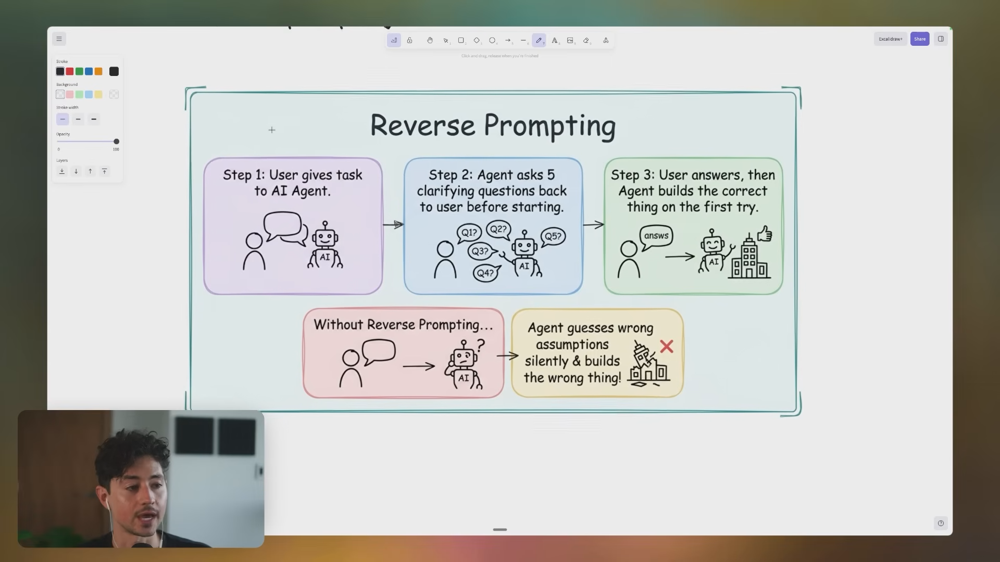

### 📚 Types of Reverse Prompting

##### 🟢 1. Output → Prompt

The simplest form.

Example:

Output:

```text
Write a Python script that reads a CSV and generates charts.
```

Reverse prompt:

```text
Create a Python program that loads a CSV file,
analyzes the data,
and generates charts using Matplotlib.
```

##### 🖼️ 2. Image → Prompt

Very common in AI image generation.

Suppose you have this image:

* Cyberpunk city
* Rain
* Neon lights
* Flying cars

The reverse prompt might be:

```text
A cinematic cyberpunk city at night,
neon lights reflecting on wet streets,
flying cars,
ultra detailed,
8K,
volumetric lighting.
```

Many AI tools can generate prompts from images.

##### 💻 3. Code → Prompt

Given this code:

```typescript
const users = await prisma.user.findMany();
```

Possible reverse prompt:

```text
Retrieve all users from the database using Prisma.
```

Useful for understanding generated code.

##### 📄 4. Document → Prompt

Suppose the AI produced:

* Executive Summary
* SWOT Analysis
* Financial Forecast

Reverse prompt:

```text
Create a business proposal
including SWOT analysis,
market opportunity,
financial projections,
and recommendations.
```

##### 🎨 5. Design → Prompt

Given a dashboard design:

Reverse prompt:

```text
Design a modern SaaS analytics dashboard
using blue gradients,
glassmorphism,
dark mode,
responsive layout,
and KPI cards.
```

### 🧩 Reverse Prompting Workflow

```text
Output

↓

Analyze Structure

↓

Identify Intent

↓

Infer Requirements

↓

Generate Prompt
```

The AI works backwards.

### 🧠 How the AI Infers the Prompt

The AI examines:

* Content
* Tone
* Style
* Constraints
* Technologies
* Formatting
* Complexity
* Hidden assumptions

For example:

Output:

```text
Next.js App Router
Prisma
Tailwind
Auth.js
```

The AI infers that the original prompt probably specified those technologies.

**🏢 Business Example**

Suppose someone created this presentation:

* Market Analysis
* Competitor Comparison
* Revenue Forecast

Reverse prompt:

```text
Create a startup pitch deck
with market analysis,
competitive landscape,
financial projections,
and investment opportunity.
```

### 🤖 Reverse Prompting vs Prompt Optimization

These concepts are related but different.

**-- Reverse Prompting**

Starts with:

```text
Output

↓

Prompt
```

Goal:

Recover or infer the original prompt.

**-- Prompt Optimization**

Starts with:

```text
Prompt

↓

Improve Prompt

↓

Better Output
```

Goal:

Make an existing prompt more effective.

### 🔍 Reverse Prompting vs Prompt Engineering

| Reverse Prompting  | Prompt Engineering    |
| ------------------ | --------------------- |
| Starts with output | Starts with objective |
| Infers the prompt  | Creates the prompt    |
| Reverse engineers  | Designs from scratch  |

### 🛠️ Applications

**📚 Learning Prompt Engineering**

If you see an excellent AI response, reverse prompting helps you understand how to reproduce it.

**🎨 AI Art**

Generate prompts from existing artwork.

**💻 Code Documentation**

Infer the original programming task from generated code.

**📄 Template Creation**

Turn successful outputs into reusable prompt templates.

**🧪 Benchmarking**

Compare prompts that likely produced different outputs across models.

### ⚠️ Limitations

**🎲 Multiple Valid Prompts**

Many different prompts can produce the same output.

Example:

Output:

```text
A React login page.
```

Possible prompts:

```text
Build a login page.
```

or

```text
Create an authentication screen.
```

or

```text
Develop a responsive React login interface.
```

There is usually  **no single "correct" original prompt** .

**🧠 Hidden Context**

The original prompt may have relied on:

* Project files
* Memory
* Previous conversation
* System instructions
* Tool outputs

Reverse prompting can't always recover that hidden context.

**🔒 System Prompts**

The model's internal system prompt is generally **not recoverable** from an output. Reverse prompting can only make educated guesses about user-facing instructions.

---

# ----Multi-Agent Chrome Automation

**Multi-Agent Chrome Automation** is an AI architecture in which **multiple specialized AI agents work together to control, navigate, and interact with the Chrome browser (or another web browser) to complete complex web-based tasks autonomously.**

Instead of one AI trying to do everything—understand the task, browse, fill forms, extract information, solve CAPTCHAs (where permitted), verify results, and recover from errors—a team of agents collaborates, each handling a specific responsibility.

Think of it as replacing a single web automation script with an  **entire digital team** .

### 🧠 The Core Idea

Traditional browser automation:

```text
User

↓

One Automation Script

↓

Browser

↓

Done
```

Multi-agent browser automation:

```text
User

↓

Planner Agent

↓

───────────────
Navigator
Researcher
Form Filler
Verifier
Error Recovery
───────────────

↓

Chrome

↓

Completed Task
```

Each agent focuses on one job.

### 🤔 Why Use Multiple Agents?

Consider this task:

> "Find the cheapest flight, compare hotels, book a room, save the invoice to Google Drive, and send me a Slack message."

A single browser automation script becomes complicated.

Instead:

```text
Flight Agent

↓

Hotel Agent

↓

Booking Agent

↓

Payment Agent

↓

Notification Agent
```

Each performs one specialized workflow.

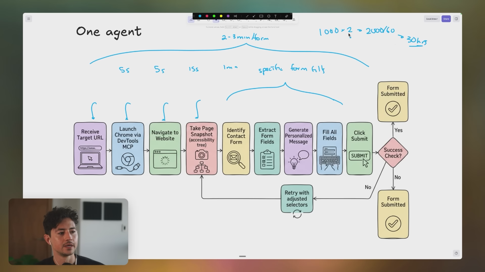

### 🏗️ Overall Architecture

```text
User Goal

↓

Planner Agent

↓

Task Decomposition

↓

Browser Agents

↓

Chrome

↓

Verification

↓

Final Result
```

The planner breaks a large task into smaller browser actions.

### 🔍 Example 1 – Online Shopping

User:

> Buy a Logitech MX Master 4 if it's under ₹10,000.

The workflow:

```text
Planner

↓

Shopping Agent

↓

Price Comparison Agent

↓

Review Agent

↓

Checkout Agent

↓

Verification Agent
```

Each agent contributes a piece of the workflow.

### 💼 Example 2 – Job Applications

User:

> Apply to all MERN jobs posted today.

Possible agents:

```text
Search Agent

↓

Resume Agent

↓

Application Agent

↓

Cover Letter Agent

↓

Confirmation Agent
```

The search agent finds listings.

The resume agent uploads files.

The application agent fills forms.

The confirmation agent ensures submissions succeeded.

### 📚 Example 3 – Research

Task:

> Research AI startups.

Agents:

```text
Search Agent

↓

Website Reader

↓

Financial Data Agent

↓

Summary Agent

↓

Citation Agent
```

Instead of one browser tab doing everything, several coordinated agents divide the work.

### 🌍 Browser Control

Agents perform browser operations such as:

* Opening tabs
* Clicking buttons
* Typing text
* Uploading files
* Downloading documents
* Selecting dropdowns
* Reading web pages
* Navigating menus
* Extracting tables
* Capturing screenshots

Example:

```text
Open Chrome

↓

Navigate

↓

Login

↓

Search

↓

Download PDF
```

### 🎯 Specialized Browser Agents

**🧭 Navigation Agent**

Responsible for:

* Opening pages
* Following links
* Managing tabs
* Tracking browser state

**🔎 Search Agent**

Handles:

* Google searches
* Website search bars
* Filtering results
* Ranking pages

**✍️ Form Agent**

Completes forms:

```text
Name

↓

Email

↓

Address

↓

Submit
```

**📖 Reader Agent**

Extracts:

* Text
* Tables
* Prices
* Documents
* Metadata

**🔍 Verification Agent**

Checks:

* Did login succeed?
* Was payment successful?
* Was the form submitted?
* Was the file uploaded?

**🔄 Recovery Agent**

If something fails:

```text
Button Missing

↓

Search Alternative

↓

Retry
```

Instead of stopping, it attempts recovery.

### 🧩 Shared Memory

Agents often share memory.

```text
Shared Memory

↓

Navigator

↓

Form Agent

↓

Verifier
```

Example:

```text
Logged In = True

↓

Reuse Session
```

No need to log in repeatedly.

### 🧠 Context Sharing

Imagine:

```text
Search Agent

↓

Finds Product

↓

Checkout Agent

↓

Uses Same Product
```

The agents exchange relevant information without redoing work.

### 🔄 Multi-Tab Coordination

Agents can operate across multiple tabs.

Example:

```text
Tab 1

Amazon

Tab 2

Flipkart

Tab 3

Official Website

↓

Comparison
```

Each tab contributes information before a recommendation is made.

### 💻 Example – GitHub Automation

Task:

> Review today's pull requests.

Possible agents:

```text
GitHub Reader

↓

Code Review Agent

↓

Security Agent

↓

Comment Generator

↓

Merge Agent
```

Each handles a different aspect of the workflow.

### 📧 Example – Email Automation

Task:

> Process today's invoices.

Agents:

```text
Gmail Agent

↓

Invoice Reader

↓

Accounting Agent

↓

Google Drive Agent

↓

Slack Agent
```

This combines browser automation with external services.

### 🤖 Browser Tools

Browser agents typically interact with Chrome through automation frameworks rather than controlling the browser directly.

Common technologies include:

* Playwright
* Puppeteer
* Selenium
* Chrome DevTools Protocol (CDP)
* Browser Use
* Stagehand

These frameworks allow AI agents to:

* Inspect page structure
* Locate elements
* Execute JavaScript
* Monitor network requests
* Capture screenshots

### 👁️ Vision-Based Automation

Modern systems don't rely only on HTML.

They may also use screenshots.

Example:

```text
Screenshot

↓

Vision Model

↓

Locate Button

↓

Click
```

This allows automation even when page structure changes.

### 🧩 DOM-Based Automation

Traditional automation:

```text
HTML

↓

Selector

↓

Click
```

Vision-based systems:

```text
Screenshot

↓

AI Vision

↓

Click
```

Many modern systems combine both approaches.

### 🌐 Multi-Website Automation

Agents can work across multiple sites.

Example:

```text
Google

↓

Amazon

↓

YouTube

↓

GitHub

↓

Gmail
```

Each site becomes part of one coordinated workflow.

### 🛡️ Security Considerations

Browser automation often involves:

* Passwords
* Cookies
* Payment details
* Personal information

Good systems typically:

* Encrypt credentials
* Limit permissions
* Require confirmation for sensitive actions
* Log actions for auditing

### ⚠️ Challenges

**🌐 Websites Change**

Buttons move.

Menus change.

Selectors break.

Agents must adapt.

**🚫 Anti-Bot Protection**

Many websites detect automation.

Respecting website terms of service and legal requirements is important. AI systems should not be designed to bypass access controls or anti-abuse mechanisms.

🧩 **Synchronization**

Multiple agents need to avoid conflicts.

Example:

```text
Agent A

Deletes File

↓

Agent B

Needs Same File
```

Shared state management becomes critical.

**💰 Cost**

Running multiple browser instances and AI agents consumes more compute and memory than a single automation script.

### 🚀 Real-World Examples

The exact internal architectures are proprietary, but capabilities related to multi-agent browser automation appear in or are being explored by products such as:

* OpenAI Operator
* Claude Code (for browser-assisted workflows)
* Browser Use
* OpenHands
* Replit Agent
* Google Project Mariner (research)
* Microsoft Copilot actions (for supported workflows)

The implementation details vary, but they share the goal of combining AI reasoning with browser interaction.

### 🧩 Relationship to Other Agentic AI Concepts

Multi-Agent Chrome Automation brings together many of the concepts you've been learning.

```text
User Goal

↓

Planner Agent

↓

Task Decomposition

↓

Browser Agents

↓

Chrome Automation (Playwright/CDP)

↓

Vision + DOM Understanding

↓

Verification Agents

↓

Consensus (if needed)

↓

Completed Task
```

It combines:

* 🤖 **Multi-Agent Systems** — multiple specialized agents collaborate.
* 🌐 **Browser Automation** — agents control Chrome or another browser.
* 👁️ **Vision Models** — understand screenshots and visual layouts.
* 📜 **Prompt Contracts** — define each agent's responsibilities.
* 🔄 **Verification Loops** — confirm actions succeeded.
* 🧠 **Shared Memory** — keep all agents synchronized.

The end result is an AI system that can perform complex web tasks much more like a coordinated human team than a traditional automation script.

---

# ----Token, Typical Billing & Context Management

### 🪙 What Are Tokens?

A **token** is the basic unit of text that an AI model reads and generates.

Unlike humans, who naturally think in **words** and  **sentences** , Large Language Models (LLMs) process  **tokens** .

A token can be:

* A whole word
* Part of a word
* A punctuation mark
* A space (depending on the tokenizer)
* A number
* A special symbol

The AI never actually sees "words"—it sees sequences of tokens.

### 🧠 Why Don't AI Models Use Words?

Words are too unpredictable.

Consider:

```text
run
running
runner
runs
```

Instead of storing each as a completely separate item, the tokenizer may split them into reusable pieces.

Example (illustrative only):

```text
running

↓

run + ning
```

or

```text
unbelievable

↓

un + believ + able
```

> **Important:** These examples are conceptual. Real tokenizers (such as OpenAI's BPE-based tokenizer or SentencePiece used by some other models) may split words differently.

This allows models to efficiently represent millions of words using a smaller vocabulary of reusable token pieces.

### 🔤 Examples of Tokens

Consider:

```text
Hello world!
```

It might become:

```text
Hello

world

!
```

Three tokens.

Another example:

```text
I love programming.
```

Could become:

```text
I

love

program

ming

.
```

Five tokens.

Again, the exact split depends on the tokenizer.

### 📏 How Many Words Are in One Token?

There is  **no exact conversion** .

For English, a common rule of thumb is:

| Measure       | Approximate Value |
| ------------- | ----------------- |
| 1 token       | ~0.75 words       |
| 100 tokens    | ~75 words         |
| 1,000 tokens  | ~750 words        |
| 10,000 tokens | ~7,500 words      |

A handy approximation:

```text
1 word ≈ 1.3 tokens
```

or

```text
100 words ≈ 130 tokens
```

These are averages, not guarantees.

### 🌍 Different Languages Have Different Token Counts

Languages tokenize differently.

For example:

**English**

```text
Hello, how are you?
```

Around 5–6 tokens.

**German**

Long compound words may be split into many pieces.

**Chinese**

Characters often correspond more closely to individual tokens, but this varies by tokenizer.

**Code**

Programming code tends to generate **more tokens** than ordinary English because identifiers, punctuation, braces, and operators are tokenized separately.

Example:

```typescript
const user = await prisma.user.findMany();
```

This may use dozens of tokens.

### 💻 Code Uses More Tokens

Compare:

English:

```text
Create a login page.
```

Few tokens.

Code:

```typescript
export async function GET() {
    return NextResponse.json(users);
}
```

Much more token-heavy because of symbols and syntax.

This is why coding tasks can consume context much faster than plain conversation.

### 📚 Input Tokens vs Output Tokens

Every AI request has two major parts.

```text
Input

↓

Model

↓

Output
```

Input tokens:

Everything you send.

Output tokens:

Everything the AI generates.

Both usually count toward usage and billing (though pricing varies by provider and model).

**📖 Example**

You send:

```text
Explain React.
```

20 input tokens (approximately).

The AI replies:

```text
Long explanation...
```

500 output tokens.

Total processed:

```text
520 tokens
```

### 💰 Typical Billing

Most AI providers charge  **per token** , usually with  **different prices for input and output tokens** .

Typical billing model:

```text
Input Tokens

×

Input Price

+

Output Tokens

×

Output Price
```

Many models charge **more for output tokens** because generating text requires additional computation.

### 💵 Example Billing (Illustrative)

Suppose a hypothetical model costs:

* Input: **$2 per million tokens**
* Output: **$8 per million tokens**

You send:

```text
5,000 input tokens
```

AI returns:

```text
2,000 output tokens
```

Cost:

```text
Input

5,000 × $2

=

$0.01

Output

2,000 × $8

=

$0.016

Total

≈ $0.026
```

> **Important:** Prices vary widely between providers and models and change over time. Always check the provider's current pricing page.

### 📊 Token Cost Example

Approximate token usage:

| Task              |                                  Approximate Tokens |
| ----------------- | --------------------------------------------------: |
| Short question    |                                             20–100 |
| One-page document |                                          500–1,000 |
| Blog article      |                                        1,000–3,000 |
| Long report       |                                       5,000–20,000 |
| Large codebase    | Tens of thousands to millions (processed in chunks) |

### 🧠 What Is a Context Window?

The **context window** is the maximum amount of information a model can consider  **at one time** .

Think of it as the AI's working memory for the current request.

```text
Context Window

↓

Everything AI Can See

↓

Generate Answer
```

If information doesn't fit into the context window, the model can't directly use it unless it is summarized or retrieved again.

##### 📚 Example

Imagine a model with a context window of:

```text
128,000 tokens
```

The model can see:

* Your prompt
* Previous conversation (if included)
* Uploaded files
* Retrieved documents
* System instructions
* Memories (if applicable)

All together must fit within the context window.

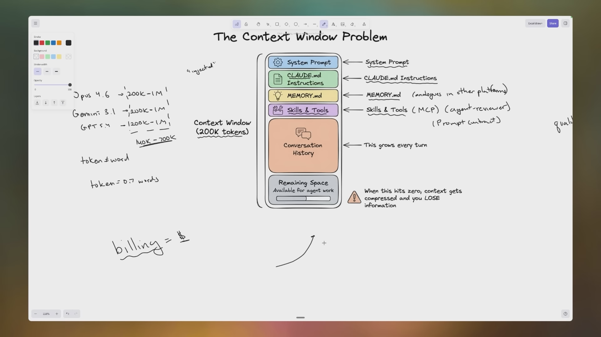

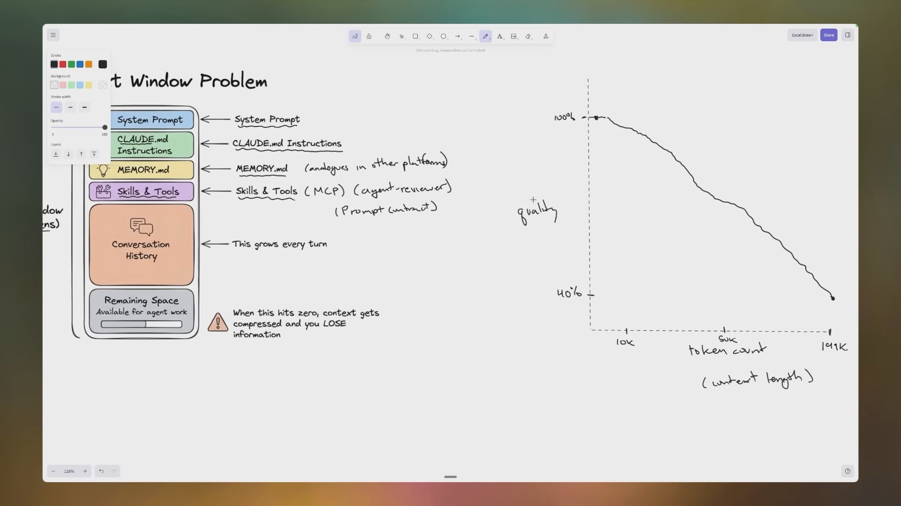

### 🧠 What Is Context Management?

**Context Management** is the process of deciding:

* What information should be included
* What should be removed
* What should be summarized
* What should be retrieved later

It ensures the AI has the **right information at the right time** without exceeding the context window.

##### 🏗️ Basic Context Flow

```text
User

↓

System Prompt

↓

Memory

↓

Project Files

↓

Retrieved Documents

↓

Conversation History

↓

AI
```

Everything is assembled before the model generates its response.

##### 🧩 Why Context Management Matters

Suppose your repository contains:

```text
500,000 lines
```

No current model can process all of that in one prompt efficiently.

Instead:

```text
Entire Repository

↓

Relevant Files

↓

Relevant Functions

↓

Relevant Lines

↓

AI
```

Only what's needed is provided.

##### 🔍 Context Retrieval

Imagine asking:

> Fix login bug.

The system doesn't send the entire project.

Instead:

```text
Project

↓

Search

↓

Login Files

↓

Authentication

↓

Database

↓

Send Only Those
```

This is much more efficient.

##### 📄 Context Compression

Long conversations consume tokens.

Instead of sending:

```text
100 Pages
```

The system may summarize them into:

```text
2 Pages
```

Example:

```text
Conversation

↓

Summarize

↓

Short Summary

↓

Continue
```

This preserves important information while reducing token usage.

##### 📚 Chunking

Large documents are divided into smaller pieces.

```text
Large PDF

↓

Chunk 1

Chunk 2

Chunk 3

Chunk 4
```

The system retrieves only the chunks relevant to your question.

##### 🧠 Retrieval-Augmented Generation (RAG)

Instead of stuffing everything into the prompt:

```text
Question

↓

Search Knowledge Base

↓

Retrieve Relevant Chunks

↓

Add to Prompt

↓

Answer
```

This keeps context focused and efficient.

##### 🎯 Context Prioritization

Not all information is equally important.

A typical priority order might look like:

```text
System Instructions

↓

Developer Instructions

↓

User Memory

↓

Current Task

↓

Recent Conversation

↓

Retrieved Documents
```

The exact ordering varies by platform and implementation.

##### 💻 Coding Example

Suppose you ask:

> Fix authentication.

The system may gather:

```text
Authentication Files

↓

User Schema

↓

Login Component

↓

Middleware

↓

Current Error
```

It does **not** include unrelated files like payment processing unless needed.

##### 🤖 Multi-Agent Context Management

Different agents may receive different context.

```text
Backend Agent

↓

API Files

Frontend Agent

↓

React Files

Database Agent

↓

Schema
```

This avoids overwhelming every agent with irrelevant information.

##### 📊 Token Usage During a Conversation

Imagine this chat:

```
You: 100 tokens
AI: 400 tokens

You: 150 tokens
AI: 500 tokens

You: 200 tokens
AI: 600 tokens
```

By the third exchange, the system may already be working with roughly:

```
100
+400
+150
+500
+200

≈ 1,350 input context tokens
```

before generating the next reply (depending on how much history the platform includes).

As conversations grow, context management becomes increasingly important.

##### ⚠️ What Happens When Context Is Full?

When the context window is reached, systems may:

* Remove the oldest messages.
* Summarize earlier conversation.
* Retrieve only relevant history.
* Ask you to start a new chat (less common with modern systems).
* Use external memory systems for long-term information.

Different AI platforms handle this differently.

##### 🚀 Modern Context Management Techniques

Modern AI assistants often combine several strategies:

* 🧠 Long-term memory for user preferences.
* 📄 Retrieval (RAG) for documents.
* ✂️ Summarization for long conversations.
* 📦 Chunking for large files.
* 🎯 Relevance ranking to include only useful information.
* 🤖 Agent-specific context for specialized tasks.
* 📜 Prompt contracts to keep behavior consistent.

---

# ----Context  Memory Visualizer

### 📊 Can You See How Much Context Memory Has Been Used?

The short answer is:

> **Usually, no.** Most AI chat applications do **not** display a live "context meter" showing how much of the model's context window is currently occupied.

However, some developer tools provide token counts or estimates.

**🤖 ChatGPT**

As of today, ChatGPT **does not provide a built-in context usage indicator** such as:

```text
Context Used:
████████░░░░░ 62%
```

or

```text
97,542 / 128,000 tokens
```

There is no official UI showing:

* Current tokens in context
* Remaining context
* Percentage used

ChatGPT manages context automatically behind the scenes.

**🧠 Claude**

Claude also **does not normally display a live context usage meter** in the standard chat interface.

It automatically:

* Keeps relevant conversation
* Compresses older context
* Retrieves project knowledge when needed

But you cannot normally see:

```text
Current Context:
145K / 200K
```

**💻 GitHub Copilot**

GitHub Copilot doesn't show:

* Remaining context window
* Context percentage

However, it  **does show what context sources are being included** , such as:

* Current file
* Selection
* Terminal
* Problems
* Git changes

This tells you **what** is being used, not **how much** of the model's context window is consumed.

**🚀 Cursor**

Cursor is one of the more transparent coding tools.

It can show:

* Which files are attached
* Which files were retrieved
* Which documentation was added

But it still doesn't generally show:

```text
82,341 / 1,000,000 tokens
```

### 📏 Can You Estimate It?

Yes.

Several tokenizers let you estimate token counts by pasting text into them.

For example:

* OpenAI Tokenizer
* Anthropic token counting examples/libraries
* tiktoken (Python)
* js-tiktoken (JavaScript)

Developers often use these before sending prompts.

### 🔍 Why Don't Chat Apps Show It?

There are several reasons:

**🧠 1. Context Isn't Just Your Messages**

The actual context may also include:

* System prompts
* Safety instructions
* Developer instructions
* Memory
* Retrieved documents
* Uploaded files
* Tool outputs

So simply counting your visible chat wouldn't give the full picture.

**🔄 2. Context Is Dynamic**

Modern AI doesn't always send the entire conversation.

It may:

* Summarize old messages
* Drop irrelevant history
* Retrieve only relevant parts
* Compress previous context

So the context size changes from one message to the next.

**⚙️ 3. Different Models Behave Differently**

One model may:

* Keep the last 100 messages.

Another may:

* Keep summaries.

Another may:

* Retrieve only relevant conversations.

A single "percentage used" could be misleading.

### 📈 What Happens When the Context Gets Full?

Most modern systems don't suddenly stop.

Instead they may:

```text
Old Messages

↓

Summarize

↓

Keep Important Facts

↓

Discard Details

↓

Continue Chat
```

Or:

```text
Entire Conversation

↓

Retrieve Only Relevant Parts

↓

Answer
```

This is why you may notice that very old, obscure details become harder for the AI to recall unless they were saved in memory or remain relevant.

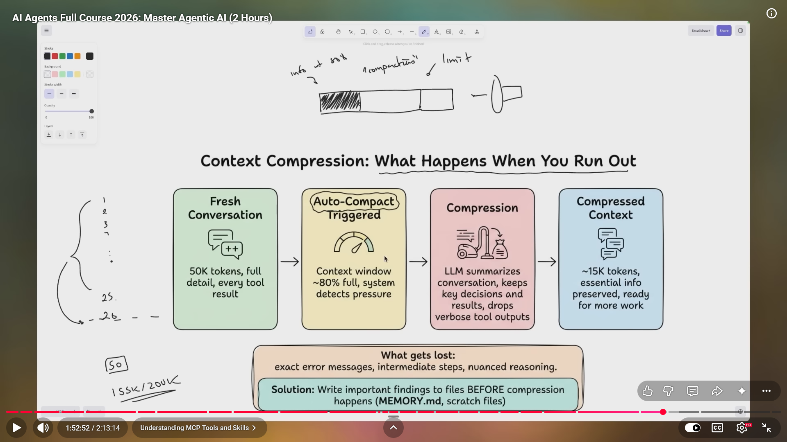

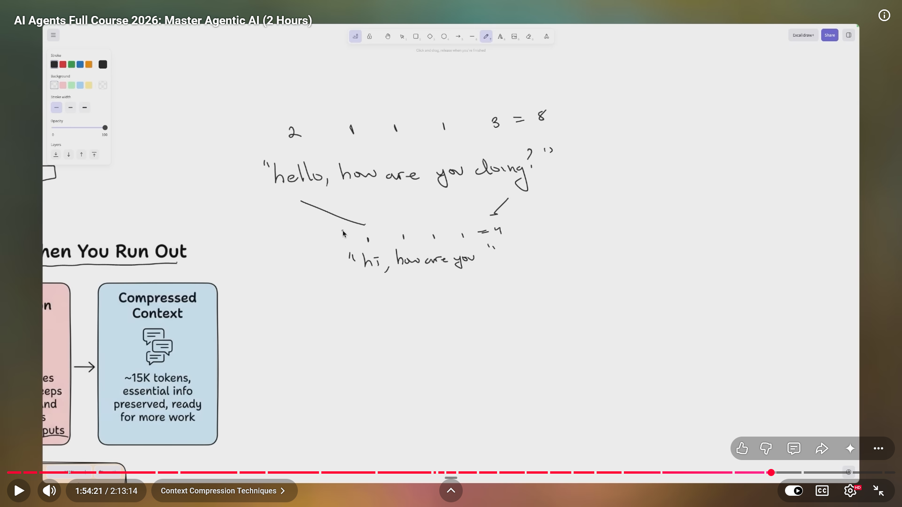

### 🛠️ Developer Tools That Can Show Token Usage

If you're building applications, several frameworks provide token accounting, including:

* LangSmith
* OpenAI Agents SDK tracing
* Anthropic SDK usage metrics
* LiteLLM
* Helicone
* OpenRouter dashboards

These are aimed at developers rather than end users.

---

# ----Strategic Context Loading

**Strategic Context Loading** is an AI technique where the system  **intelligently decides what information to load into the model's context window for a particular task instead of loading everything available** .

The key idea is:

> **Give the AI exactly what it needs—no more, no less.**

It's one of the most important techniques behind modern AI coding assistants like GitHub Copilot, Cursor, Claude Code, Gemini CLI, OpenHands, and other agentic systems.

### 🧠 The Core Idea

Imagine your project contains:

* 📄 12,000 source files
* 📄 8,000 documentation pages
* 📄 50,000 Git commits
* 📄 Hundreds of terminal logs

No AI model can efficiently process all of that for every request.

Instead:

```text
Entire Project

        ↓

Find Relevant Information

        ↓

Load Only What Matters

        ↓

AI
```

That's Strategic Context Loading.

### 📦 Real-Life Analogy

Imagine you ask a senior developer:

> "Fix the login bug."

They don't read the entire codebase.

Instead, they look at:

* Authentication module
* Login page
* User model
* Session management
* Error logs

They ignore:

* Payment system
* Chat module
* Admin dashboard
* Analytics

AI works the same way.

### ❌ Without Strategic Loading

```text
Entire Repository

↓

LLM

↓

Slow
Expensive
Confusing
```

The model receives huge amounts of irrelevant information.

### ✅ With Strategic Loading

```text
Repository

↓

Search

↓

Relevant Files

↓

LLM

↓

Better Answer
```

Much faster.

Much cheaper.

Usually more accurate.

### 🧩 Why Is It Necessary?

Modern projects are enormous.

Example:

```text
Hospital ERP

Backend
Frontend
Admin
Patient Portal
Billing
Inventory
HR
Payroll
Reports
AI
Mobile
```

Thousands of files.

If you ask:

> Fix login.

The inventory module is probably irrelevant.

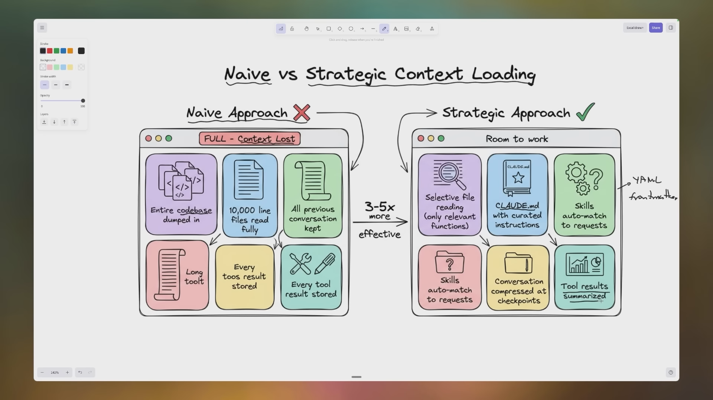

### 🔍 How Strategic Loading Works

A typical pipeline looks like this:

```text
User Question

↓

Understand Intent

↓

Search Repository

↓

Rank Results

↓

Load Best Matches

↓

LLM
```

The AI first decides what information is likely to matter.

---

# ----Iceberg Technique

🧊 Iceberg Technique (in AI Prompting)

The **Iceberg Technique** is a prompt engineering and AI system design concept where  **only a small portion of the instructions or information is visible in the prompt, while a much larger amount of hidden knowledge, rules, memory, and context exists beneath the surface** .

It's called the **Iceberg Technique** because, just like a real iceberg:

* 🧊 **10% is visible above the water**
* 🌊 **90% is hidden below the surface**

The AI's response is influenced by both the visible and hidden parts.

### 🌊 Why Is It Called an Iceberg?

Imagine an iceberg:

```text
           Visible
              ▲
              │
         __________
        /          \
       /  Prompt    \
------/--------------\------ Water
     /                \
    / System Prompt    \
   / Developer Rules    \
  / User Memory          \
 / Retrieved Documents    \
/ Project Instructions     \
----------------------------
```

The user only sees the  **prompt** , but the AI often has much more context.

### 🧠 The Core Idea

A user might type only:

> Build a login page.

That's a tiny instruction.

But internally, the AI may also know:

* Use React
* Use TypeScript
* Use Tailwind CSS
* Follow company coding standards
* Use the existing design system
* Use App Router
* Prefer Prisma
* Never expose secrets

The visible prompt is only the "tip of the iceberg."

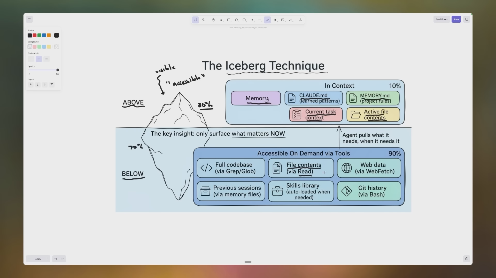

### 🏗️ Example

Visible prompt:

```text
Create a user dashboard.
```

Hidden context:

```text
Project uses:

- Next.js
- Tailwind
- Prisma
- PostgreSQL
- Dark theme
- Existing component library
- Company style guide
```

The final result reflects  **both** .

### 🆚 Traditional Prompting vs Iceberg Technique

**📄 Traditional Prompt**

Everything is written explicitly:

```text
Build a login page.
Use React.
Use TypeScript.
Use Tailwind.
Use Auth.js.
Use Prisma.
Use PostgreSQL.
Use dark mode.
Follow accessibility guidelines.
```

Very long.

**🧊 Iceberg Prompt**

Visible:

```text
Build a login page.
```

Hidden:

```text
System Prompt

Developer Instructions

Project Rules

Memory

Retrieved Docs
```

Much shorter for the user, but the AI still has the necessary guidance.

### 🧠 Where Does the Hidden Part Come From?

Modern AI systems assemble hidden context from multiple sources.

```text
User Prompt
        ↓
System Prompt
        ↓
Developer Instructions
        ↓
Long-Term Memory
        ↓
Project Instructions
        ↓
Retrieved Documents
        ↓
Tool Results
        ↓
Final Prompt
```

This assembled prompt is what the model actually processes.

### 💻 Coding Example

You type:

> Add authentication.

Hidden context might include:

```text
Use:

Next.js App Router
TypeScript
Prisma
Auth.js
Tailwind
ESLint
Company architecture
```

The generated code follows these rules even though you never repeated them.

### 🏢 Enterprise Example

Imagine a company with coding standards.

The developer simply writes:

> Create a customer module.

The AI already knows:

* Naming conventions
* Folder structure
* Security rules
* API standards
* Logging requirements
* Testing framework

Those hidden standards are the submerged part of the iceberg.

### 📚 Iceberg Technique in Multi-Agent AI

Suppose you have:

```text
Planner

↓

Coder

↓

Tester
```

Each agent receives:

Visible task:

```text
Implement login.
```

Hidden context:

* Its own role
* Project documentation
* Previous decisions
* Team standards
* Tool permissions

So even though all agents see the same task, each has a different "underwater" context.

### 🧩 Iceberg Technique with RAG

Suppose you ask:

> Explain OAuth.

The system might:

```text
Question

↓

Search Knowledge Base

↓

Retrieve OAuth Documentation

↓

Attach Retrieved Chunks

↓

LLM
```

You only see the question, but the retrieved documents become part of the hidden context.

### 🧠 Iceberg Technique with Memory

You ask:

> Continue my CRM project.

Hidden memory might include:

* Project name
* Database schema
* Previous discussions
* Your preferences
* Technology stack

You don't need to repeat all of that every time.

### 📄 Iceberg Technique with Prompt Contracts

Visible:

```text
Create an API.
```

Hidden contract:

```text
Use REST.

Use TypeScript.

No GraphQL.

Use Prisma.

Return JSON.

Write tests.
```

The contract shapes the output even though it isn't visible in the current prompt.

### 🤖 Iceberg Technique in GitHub Copilot

You ask:

> Create a component.

Copilot may silently use:

* Current file
* Nearby code
* Open tabs
* Project instructions
* Repository structure
* Coding conventions

The visible prompt is tiny, but the context is much larger.

### 💬 Iceberg Technique in ChatGPT

If memory and custom instructions are enabled, a request like:

> Explain Kubernetes.

May also be influenced by:

* Your preferred response style
* Saved preferences (for example, using emoji headings)
* Relevant conversation history
* Uploaded documents in the current chat

Again, the visible prompt is only part of the full context.

### 🎯 Why Use the Iceberg Technique?

**✅ Shorter Prompts**

You don't need to repeat the same instructions every time.

**✅ Consistency**

Hidden rules ensure consistent behavior across tasks.

**✅ Better User Experience**

The conversation feels more natural because you aren't constantly restating background information.

**✅ Reusable Standards**

Teams can encode shared practices once instead of copying them into every prompt.

### ⚠️ Challenges

**❌ Hidden Assumptions**

Because some instructions are invisible, users may not understand why the AI responded a certain way.

**❌ Conflicting Hidden Context**

For example:

Project instructions:

```text
Use PostgreSQL.
```

Current task:

```text
Use MongoDB.
```

The system needs a way to resolve the conflict.

**❌ Debugging**

When the output isn't what you expected, it can be difficult to know whether the cause was:

* Your prompt
* A system instruction
* Memory
* Retrieved documents
* A project rule

---
