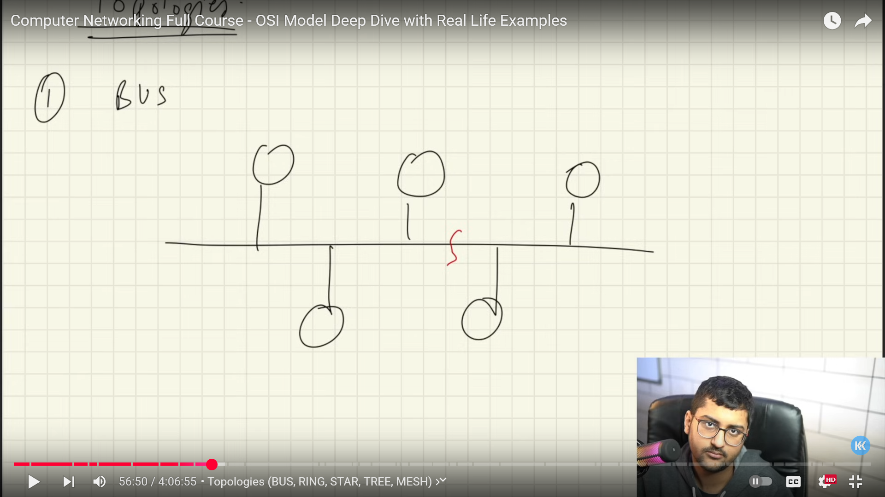
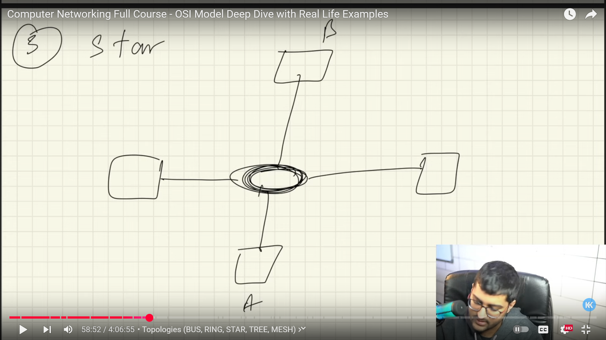
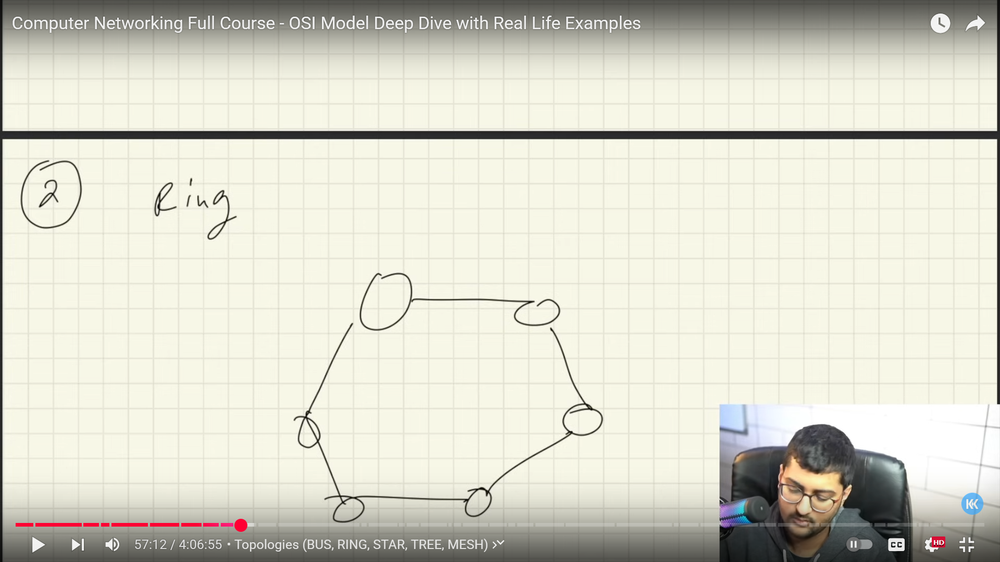
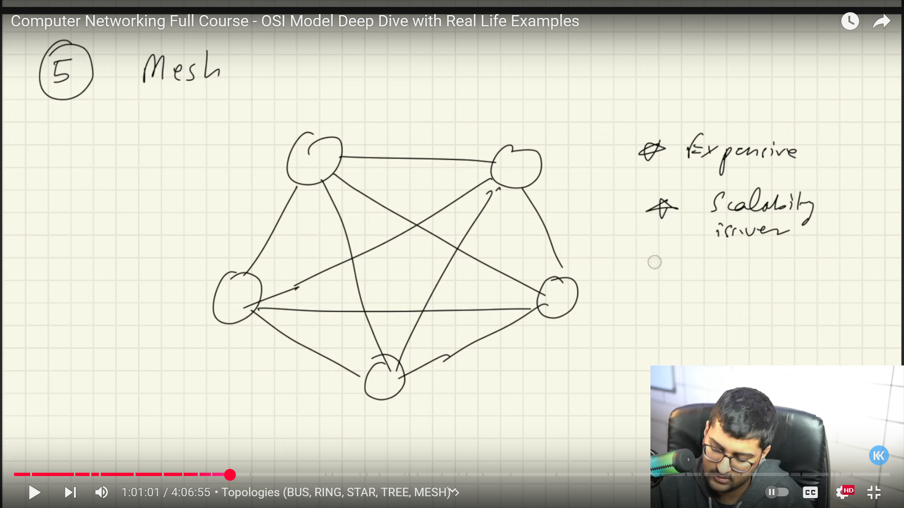
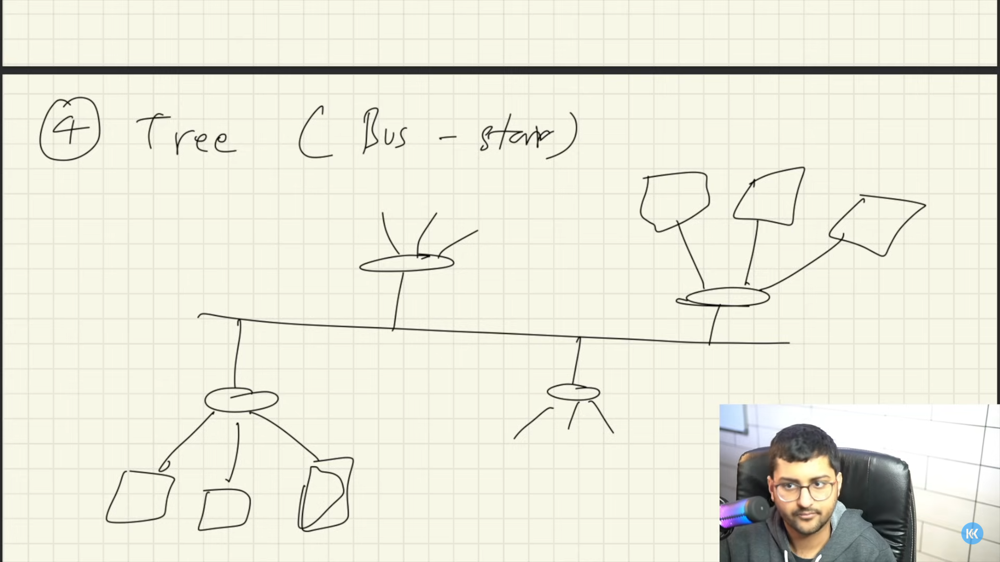
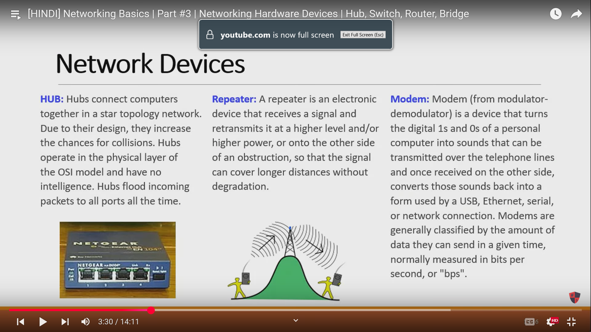
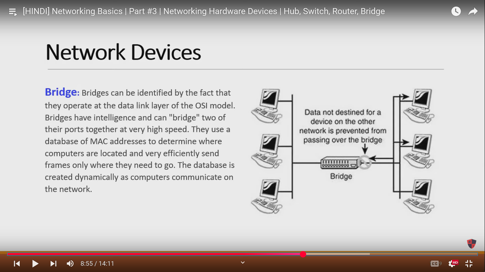
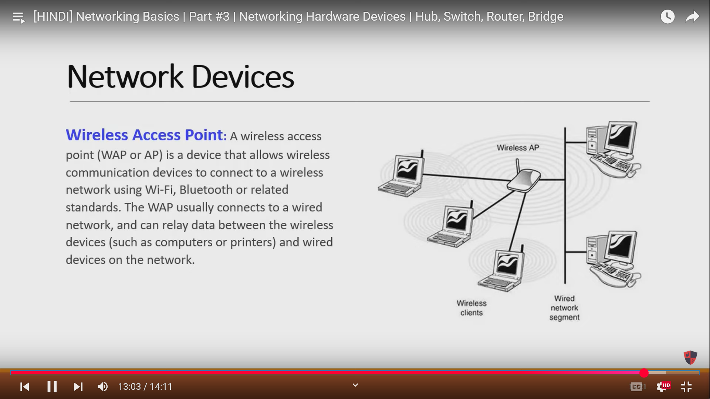
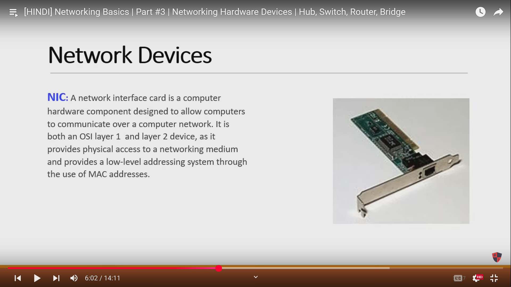

# Computer Networks and Internet

### 🌐 What is a  **Computer Network** ?

#### 🔹 Definition:

A **computer network** is a group of **interconnected computing devices** (like computers, servers, routers, etc.) that can communicate and **share resources** (like files, printers, internet access) with each other using  **communication links** .

#### 🔹 Key Purpose:

* **Communication** (email, chat, calls)
* **Resource sharing** (printers, files, storage)
* **Data access** (centralized databases, websites)
* **Efficiency** (cost and time-saving)

#### 🧠 Real-Life Analogy:

Imagine a  **school** :

* Every classroom has a  **computer** .
* All computers are connected to a **central server** in the principal's office.
* This setup allows teachers to:
  * Share lesson plans.
  * Print documents from any room.
  * Access student records stored on the server.

That setup is a **local area network (LAN)** — a type of computer network.

#### 🛠️ Basic Components of a Computer Network

| Component                 | Role                                                 |
| ------------------------- | ---------------------------------------------------- |
| **Devices (Nodes)** | Computers, phones, servers                           |
| **Medium**          | Cables or wireless (Wi-Fi) to transmit data          |
| **Switch/Router**   | Directs data traffic                                 |
| **Protocols**       | Rules for communication (like languages for devices) |

### 🌍 What is the  **Internet** ?

#### 🔹 Definition:

The **Internet** is a  **global network of interconnected networks** . It allows devices worldwide to communicate using standard protocols like  **TCP/IP** .

> In simpler terms, the internet is just a  **giant network of networks** .

#### 🔹 How it works:

* Your home network (LAN) connects to your **ISP** (Internet Service Provider).
* ISP connects to  **larger networks** , eventually reaching any server in the world.
* These servers host websites, files, services like Google, YouTube, etc.

#### 🧩 Internet vs Intranet vs LAN

| Term                              | Meaning                                    |
| --------------------------------- | ------------------------------------------ |
| **LAN**(Local Area Network) | Small network (e.g., office or home)       |
| **Intranet**                | Private internet used within organizations |
| **Internet**                | Public global network                      |

#### 🧭 Summary:

| Term                       | Summary                                                                        |
| -------------------------- | ------------------------------------------------------------------------------ |
| **Computer Network** | Interconnected devices that share resources and data                           |
| **Internet**         | A huge global network connecting billions of devices via many smaller networks |
| **Network Medium**   | The path used (wired or wireless) to send data                                 |
| **Protocols**        | The rules for communication between devices                                    |

---

# **History of Computer Networking**

### 📜 History of Computer Networking: Timeline & Evolution

#### 🧪 **1. 1950s–1960s: Early Experiments**

##### 🔹 Background

* Computers were  **large, expensive** , and  **isolated** .
* Used primarily in **military, academic, and research** settings.

##### 🔹 Key Events:

* **Modems (1950s)** : Developed to allow digital data to travel over analog telephone lines.
* **Packet Switching (1960s)** :
* Invented by **Paul Baran** (USA) and **Donald Davies** (UK).
* Broke data into small **packets** for efficient transfer across networks.
* Foundation for all modern networking.

#### 🌐 **2. 1969: ARPANET – The Birth of the Internet**

##### 🔹 What was ARPANET?

* First  **operational packet-switching network** .
* Funded by **ARPA (Advanced Research Projects Agency)** in the US.
* Connected 4 universities:
  1. UCLA
  2. Stanford
  3. UC Santa Barbara
  4. University of Utah

##### 🔹 First Message (October 29, 1969)

* Sent from UCLA to Stanford.
* Intended: "LOGIN"
* Result: System crashed after "LO"

➡️ Still considered the **first internet message** ever sent.

#### 🧱 **3. 1970s: Protocols and Expansions**

##### 🔹 NCP (Network Control Protocol)

* Early protocol used in ARPANET for communication.

##### 🔹 Email Invented (1971)

* By **Ray Tomlinson**
* Used **@** symbol for the first time.

##### 🔹 TCP/IP Protocols (1973–1978)

* Invented by **Vint Cerf** and **Bob Kahn**
* Allowed networks to connect globally.
* Became the  **foundation of the Internet** .

#### 🛜 **4. 1983: Birth of the Internet**

##### 🔹 Key Event:

* ARPANET officially switched to **TCP/IP** protocol on  **Jan 1, 1983** .
* Known as **“Flag Day”** of the internet.

##### 🔹 Other milestones:

* **DNS (Domain Name System)** introduced (1984)
  * Translates domain names (like google.com) into IP addresses.
* Networks beyond ARPANET began to interconnect.

#### 🌎 **5. 1990s: Public Internet & Web Revolution**

##### 🔹 1990:

* **ARPANET shut down** (mission completed).

##### 🔹 1991:

* **World Wide Web** invented by  **Tim Berners-Lee** .
* Introduced:
  * **HTML** (HyperText Markup Language)
  * **HTTP** (HyperText Transfer Protocol)
  * First web browser (WorldWideWeb)

##### 🔹 1993:

* **Mosaic** , the first graphical browser, made the web popular.
* Commercial websites started appearing.

#### 📶 **6. 2000s–Present: High-Speed & Wireless Internet**

##### 🔹 Key Developments:

* **Broadband Internet** replaces dial-up (faster speeds)
* **Wi-Fi** becomes mainstream.
* **Mobile Internet (3G/4G/5G)** enables smartphones to access the web.
* **Fiber-optic** and **satellite internet** (e.g., Starlink) bring faster and wider coverage.

##### 🔹 Modern Trends:

* Cloud Computing
* Internet of Things (IoT)
* Smart homes and AI integration
* IPv6 adoption (due to IPv4 address exhaustion)

### 🗺️ Summary Timeline

| Year     | Event                                  |
| -------- | -------------------------------------- |
| 1950s    | Modems, early computers                |
| 1969     | ARPANET created                        |
| 1971     | Email invented                         |
| 1973–78 | TCP/IP protocols developed             |
| 1983     | Internet born (TCP/IP)                 |
| 1989–91 | World Wide Web created                 |
| 1993     | Mosaic browser launched                |
| 2000s+   | Broadband, Wi-Fi, smartphones, 5G, IoT |

# Client-Server Architecture

Let's explore **Client-Server Architecture** — one of the foundational models in computer networking and web systems.

### 🧠 What is Client-Server Architecture?

#### 🔹 Definition:

**Client-Server Architecture** is a network design model where multiple **clients** (users/devices) request and receive services or resources from a centralized  **server** .

#### 🧩 Basic Structure

```
    [Client] <--Request--      [Server]
         --> Response -->
```

#### 🔄 The Flow:

1. **Client** sends a **request** (e.g., for a webpage or file).
2. **Server** processes the request.
3. **Server** sends back a **response** (e.g., the requested data).

#### 🖥️ Components

| Component         | Description                                                     |
| ----------------- | --------------------------------------------------------------- |
| **Client**  | The device/user that initiates the request (browser, app, etc.) |
| **Server**  | A powerful system that listens for and processes requests       |
| **Network** | The medium (like the Internet or LAN) that connects them        |

### 📦 Examples in Real Life

| Client       | Server                           |
| ------------ | -------------------------------- |
| Web browser  | Web server (e.g., Apache, Nginx) |
| Email app    | Email server (SMTP, IMAP)        |
| Mobile app   | Cloud-based backend server       |
| FTP software | FTP server                       |

### 🧱 Characteristics

* **Centralized** control (the server is the main authority).
* **Scalable** — more clients can be added.
* **Secure** — easier to manage security centrally.
* **Maintainable** — updates happen on the server side.

### 🎮 Real-World Analogy

Imagine a  **restaurant** :

* You (client) ask for food from a **waiter** (interface).
* The waiter gives your order to the **kitchen** (server).
* The kitchen prepares and sends the food back via the waiter.

### 🔁 Request/Response Cycle (Web Example)

Let’s say you visit `www.google.com`:

1. **Client** : Your browser (Chrome, Firefox) sends an HTTP request.
2. **Server** : Google’s server receives the request, processes it.
3. **Response** : Sends back an HTML page.
4. **Client** : Browser renders the page for you.

### 🏗️ Types of Servers

| Server Type                     | Role                             |
| ------------------------------- | -------------------------------- |
| **Web Server**            | Serves web pages (HTML, CSS, JS) |
| **Database Server**       | Handles queries and stores data  |
| **Application Server**    | Runs application logic           |
| **File Server**           | Manages file storage and access  |
| **Authentication Server** | Validates user credentials       |

### 🔄 Client vs Server (Comparison)

| Feature                  | Client            | Server                      |
| ------------------------ | ----------------- | --------------------------- |
| Role                     | Requests services | Provides services           |
| Initiates communication? | ✅ Yes            | ❌ Usually waits            |
| Hardware power           | Usually less      | Usually more                |
| Examples                 | Browser, app      | Web server, database server |

### 📡 Advantages of Client-Server Model

* Centralized **data management**
* Easier **security and access control**
* **Scalable** (you can add more servers or balance load)
* Efficient **maintenance and backup**

### ⚠️ Disadvantages

* **Single point of failure** — if the server goes down, clients can’t access services.
* Needs more **network bandwidth** and powerful  **server hardware** .
* Can become **bottlenecked** under heavy client load.

### ✅ Common Use Cases

* Websites (HTML/CSS/JS from server to browser)
* Online banking apps
* Cloud storage (Google Drive, Dropbox)
* Multiplayer online games (central game server)

---

# Protocols in Computer Networks

Let’s dive deep into  **Protocols in Computer Networks** , which are **rules and standards** that allow devices to communicate effectively.

### 📜 What is a Protocol?

#### 🔹 Definition:

A **protocol** is a **set of rules** or **agreements** that define how data is formatted, transmitted, and received across a network.

> Just like people need a language to understand each other, computers use **protocols** to communicate.

#### 🧠 Why Are Protocols Important?

* Ensure **data integrity** (accurate transmission)
* Enable **interoperability** between different devices/systems
* Handle  **errors** , retransmissions, and timing
* Define  **addressing** ,  **routing** , and **security** mechanisms

#### 🧱 Categories of Protocols

| Category                    | Examples             |
| --------------------------- | -------------------- |
| **Application Layer** | HTTP, FTP, DNS, SMTP |
| **Transport Layer**   | TCP, UDP             |
| **Network Layer**     | IP, ICMP             |
| **Data Link Layer**   | Ethernet, ARP        |
| **Security**          | HTTPS, SSL/TLS       |
| **Routing**           | RIP, OSPF, BGP       |

### 🧩 Key Protocols by Layer (Using OSI/TCP-IP Model)

#### 🔸 1. Application Layer Protocols

> Interfaces for end-users (top of the network stack)

| Protocol                                      | Purpose                                 |
| --------------------------------------------- | --------------------------------------- |
| **HTTP**(Hypertext Transfer Protocol)   | Transfers web pages (used by browsers)  |
| **HTTPS**(Secure HTTP)                  | HTTP over SSL/TLS (secure browsing)     |
| **FTP**(File Transfer Protocol)         | Uploading/downloading files             |
| **SMTP**(Simple Mail Transfer Protocol) | Sending emails                          |
| **POP3/IMAP**                           | Receiving emails                        |
| **DNS**(Domain Name System)             | Translates domain names to IP addresses |

#### 🔸 2. Transport Layer Protocols

> Manages **end-to-end delivery** of data between devices.

| Protocol                                     | Purpose                                                                |
| -------------------------------------------- | ---------------------------------------------------------------------- |
| **TCP**(Transmission Control Protocol) | Reliable, connection-based communication (e.g., file transfer, emails) |
| **UDP**(User Datagram Protocol)        | Unreliable, fast, connectionless (e.g., video streaming, online games) |

#### TCP Features:

* 3-way handshake (connect before data)
* Error detection and correction
* Flow control and congestion control

#### UDP Features:

* No connection needed
* Faster, but no guarantee of delivery
* Used in real-time apps (VoIP, video calls)

#### 🔸 3. Network Layer Protocols

> Handles  **routing** ,  **addressing** , and  **logical communication** .

| Protocol                                           | Purpose                                                  |
| -------------------------------------------------- | -------------------------------------------------------- |
| **IP**(Internet Protocol)                    | Assigns logical addresses (IPv4/IPv6) and routes packets |
| **ICMP**(Internet Control Message Protocol)  | Sends error/diagnostic messages (used in ping)           |
| **IGMP**(Internet Group Management Protocol) | Manages multicast groups                                 |

#### 🔸 4. Data Link Layer Protocols

> Defines how data is physically transmitted on the medium (Ethernet, Wi-Fi, etc.)

| Protocol                                   | Purpose                                                    |
| ------------------------------------------ | ---------------------------------------------------------- |
| **Ethernet**                         | Most common wired LAN protocol                             |
| **PPP**(Point-to-Point Protocol)     | Used in direct connections (e.g., over dial-up)            |
| **ARP**(Address Resolution Protocol) | Converts IP to MAC address                                 |
| **MAC Protocols**                    | Determine how devices share a medium (CSMA/CD in Ethernet) |

#### 🔸 5. Physical Layer (standards more than protocols)

> Deals with actual electrical or light signal transmission (not much logic/protocols here).

* Examples: USB, Bluetooth, IEEE 802.11 (Wi-Fi standard)

#### 🔒 6. Security Protocols

> Ensure confidentiality, integrity, and authentication

| Protocol          | Purpose                                          |
| ----------------- | ------------------------------------------------ |
| **SSL/TLS** | Encrypts data sent over networks (used in HTTPS) |
| **IPSec**   | Secures IP communication (used in VPNs)          |
| **SSH**     | Secure remote login (replaces Telnet)            |

### 🌐 Protocols Working Together (Example: Loading a Webpage)

Let’s say you visit `https://www.example.com`:

1. **DNS** resolves the domain name to an IP address.
2. **TCP** creates a connection to the server.
3. **HTTPS** (HTTP + SSL/TLS) ensures secure data transmission.
4. **IP** routes the data to the correct destination.
5. **Ethernet/Wi-Fi** handles data transfer over the physical medium.
6. **ARP** finds MAC address to deliver the frame on LAN.

### ⚠️ Protocol Stack = Layers Working Together

In any real-world networking scenario, **multiple protocols from different layers** work together as a  **stack** .

**Example Stack (Accessing a Website):**

```
Application Layer:     HTTP / HTTPS
Transport Layer:       TCP
Network Layer:         IP
Data Link Layer:       Ethernet
Physical Layer:        Cables/Wi-Fi
```

### ✅ Summary Table of Popular Protocols

| Protocol   | Layer       | Use Case               |
| ---------- | ----------- | ---------------------- |
| HTTP/HTTPS | Application | Web browsing           |
| FTP        | Application | File transfer          |
| DNS        | Application | Domain to IP mapping   |
| SMTP/IMAP  | Application | Email                  |
| TCP        | Transport   | Reliable data transfer |
| UDP        | Transport   | Fast, real-time apps   |
| IP         | Network     | Addressing and routing |
| ICMP       | Network     | Ping, error reporting  |
| ARP        | Data Link   | IP to MAC resolution   |
| SSL/TLS    | Security    | Encryption             |

---

# Web Server and File Server

Let’s clearly explain the difference between a **File Server** and a  **Web Server** , especially from the perspective of someone building and deploying a **MERN stack eCommerce app** like you are.

### 🗃️ 1. What is a  **File Server** ?

> A **File Server** is a server that stores and manages files so that users or applications can **upload, download, share, or access files** over a network.

#### 🧠 Key Features:

* Acts like a **central hard drive** accessible over LAN or internet
* Typically accessed via **FTP, SMB, NFS, or HTTP**
* Can store:
  * Documents (PDF, Word, etc.)
  * Images (for Cloudinary backups or uploads)
  * Static files (your React build)
  * Backups and media

#### 🛠️ Example:

* You upload product images from your frontend → backend → **file server**
* Cloudinary (in your case) is a **cloud-based file server**

#### 📦 Tools:

* Local: Samba (Windows File Sharing), NFS, FTP servers
* Cloud: Cloudinary, AWS S3, Google Cloud Storage

### 🌐 2. What is a  **Web Server** ?

> A **Web Server** delivers **web content (HTML, CSS, JS, APIs)** over the internet using  **HTTP/HTTPS** .

#### 🧠 Key Features:

* Handles browser requests (like `GET /products`)
* Serves **webpages, APIs, or static files**
* Processes incoming HTTP(S) requests and sends responses

#### 🛠️ Example:

* Your Node/Express backend handles API calls → it’s a **web server**
* Your frontend (React) deployed on EC2 or S3 is also served by a **web server**
* NGINX, Apache, Express.js, or AWS Elastic Beanstalk serve web apps

#### 📦 Tools:

* NGINX (acts as a reverse proxy or static site server)
* Express.js (in your MERN app — serves APIs)
* Apache
* AWS CloudFront, Elastic Beanstalk (in cloud)

### ⚖️ Comparison Table

| Feature   | File Server                        | Web Server                       |
| --------- | ---------------------------------- | -------------------------------- |
| Purpose   | Store and share files              | Serve websites and APIs          |
| Protocols | FTP, SMB, NFS, SFTP                | HTTP, HTTPS                      |
| Used for  | File access & sharing              | Hosting web apps / APIs          |
| Example   | AWS S3, Cloudinary                 | Express.js, NGINX                |
| Access    | Often restricted to internal users | Public (internet-facing)         |
| Data Type | Raw files                          | Web responses (HTML, JSON, etc.) |

### 🧱 In Your MERN App (eCommerce):

| Component                            | Role                                      |
| ------------------------------------ | ----------------------------------------- |
| **Cloudinary**                 | File server (stores product images)       |
| **Express.js backend**         | Web server (serves your APIs)             |
| **NGINX (optional)**           | Web server/reverse proxy (for production) |
| **React build (in S3 or EC2)** | Web server (serves static site)           |

---

# World Wide Web (www)

**WWW (World Wide Web)** is a  **system of interlinked documents and resources** , accessible via the internet using  **web browsers** , and delivered using the  **HTTP/HTTPS protocols** .

It’s basically **everything you see in a browser** — websites, web apps, videos, blogs, etc.

### 🧠 What’s the difference between **WWW** and the  **Internet** ?

| Term               | What it means                                                                |
| ------------------ | ---------------------------------------------------------------------------- |
| **Internet** | The global network of connected computers and devices                        |
| **WWW**      | A**service on the internet**— used to access websites and web content |

👉 The Internet includes the WWW, but also things like email, FTP, cloud storage, online games, VoIP, etc.

### 🛠️ Components of the WWW

1. **Web browser** (e.g., Chrome, Firefox)

   👉 Used to request and display websites
2. **Web server** (e.g., NGINX, Express.js)

   👉 Responds to browser requests with HTML, JSON, etc.
3. **HTTP/HTTPS**

   👉 The protocol used to deliver data from server to browser securely
4. **URLs (Uniform Resource Locators)**

   👉 Web addresses like `https://www.fitlab.in/products`
5. **DNS (Domain Name System)**

   👉 Translates human-readable domains like `fitlab.in` to IP addresses

### 🌍 What does “www” in a URL mean?

* **“www” is just a subdomain** , like `blog.example.com` or `api.example.com`.
* Originally, websites used `www.example.com` to indicate it's a  **web server** .
* Today, it’s optional — many sites drop it (`example.com`) or redirect both to the same place.

> For example:
>
> `https://www.amazon.com` and `https://amazon.com` usually go to the same server.

### 🤖 How WWW works — A simplified flow

```
You → Browser → URL → DNS → IP Address → HTTP Request → Web Server → Response → Page is shown
```

Example for your FitLab app:

```
User types: https://www.fitlab.in
→ DNS resolves to EC2 IP
→ HTTP request sent to NGINX or Express
→ Server sends back your React app or API JSON
→ Browser renders it
```

### 🧱 In your MERN stack project

| Layer                  | WWW Component                                                     |
| ---------------------- | ----------------------------------------------------------------- |
| React Frontend         | Sent to users via HTTP(S) — part of WWW                          |
| Express Backend        | Responds to web requests — part of WWW                           |
| Domain (`fitlab.in`) | Part of WWW infrastructure                                        |
| Cloudinary (images)    | Served over HTTPS — part of WWW                                  |
| WebRTC/Socket.io       | Not strictly WWW (they use different protocols, e.g., WebSockets) |

### ✅ Summary

| Term                                    | What it is                                                        |
| --------------------------------------- | ----------------------------------------------------------------- |
| **WWW**                           | Web system that allows users to access websites over the internet |
| **“[www.”](http://www.%E2%80%9D)** | Optional subdomain for websites                                   |
| **Internet ≠ WWW**               | Internet is the network; WWW is just one service on it            |

---

# Types Of Networks

Let's explore the **Types of Networks in Computer Networking** — classified based on  **geographical range** ,  **ownership** , and  **functionality**

### Broad Classification:

| Type               | Full Form                 | Scope                               |
| ------------------ | ------------------------- | ----------------------------------- |
| **PAN**      | Personal Area Network     | Few meters (person-level)           |
| **LAN**      | Local Area Network        | Building-level                      |
| **WLAN**     | Wireless LAN              | Wireless version of LAN             |
| **MAN**      | Metropolitan Area Network | City or campus-level                |
| **WAN**      | Wide Area Network         | Country or global level             |
| **SAN**      | Storage Area Network      | High-speed storage access           |
| **CAN**      | Campus Area Network       | Multi-building (e.g., universities) |
| **VPN**      | Virtual Private Network   | Secure tunnel over public internet  |
| **Internet** | -                         | Global network of all networks      |

### 🧑‍💼1. **PAN (Personal Area Network)**

🔹 Scope:

* Covers a **very small area** (1–10 meters)
* Used by **a single person**

🔹 Devices:

* Smartphones, tablets, laptops, smartwatches, Bluetooth earbuds

🔹 Communication:

* **Bluetooth** ,  **Infrared** ,  **NFC** , USB

🔹 Examples:

* Connecting phone to Bluetooth headphones
* Transferring files via AirDrop

### 🏠 2. **LAN (Local Area Network)**

🔹 Scope:

* Covers a **home, office, or small building**
* **Privately owned**

🔹 Medium:

* Ethernet cables, Wi-Fi

🔹 Devices:

* Computers, printers, servers, routers

🔹 Features:

* **High speed** (100 Mbps to 10+ Gbps)
* **Low latency**
* **Cost-efficient** for small setups

🔹 Examples:

* Office network sharing files and printers
* Home network with multiple devices accessing the same router

### 📶 3. **WLAN (Wireless LAN)**

🔹 Same as LAN, but wireless

* Uses **Wi-Fi (IEEE 802.11)** standard
* Requires an **Access Point (AP)** or **wireless router**

🔹 Examples:

* Wi-Fi in a home, cafe, airport
* Hotspots

### 🏙️ 4. **MAN (Metropolitan Area Network)**

🔹 Scope:

* Spans a  **city** , town, or large campus
* Interconnects multiple LANs

🔹 Medium:

* Fiber optics, leased telephone lines, microwave

🔹 Managed by:

* ISPs, universities, governments

🔹 Examples:

* Cable TV networks
* College/university campus networks
* Government smart city setups

### 🌍 5. **WAN (Wide Area Network)**

🔹 Scope:

* Covers **countries or continents**
* Largest type = **The Internet**

🔹 Characteristics:

* **Slower speed** than LAN/MAN
* Uses **public transmission systems**
* Highly **distributed and scalable**

🔹 Examples:

* Internet
* Bank branches connected across states
* Airline reservation systems

### 💾 6. **SAN (Storage Area Network)**

🔹 Purpose:

* Specialized high-speed network for **connecting data storage devices to servers**

🔹 Used in:

* Data centers
* Enterprises requiring large storage pools

🔹 Features:

* High throughput
* Low latency
* Dedicated to **data read/write**

### 🎓 7. **CAN (Campus Area Network)**

🔹 Scope:

* Interconnects networks in **multiple buildings** in a **campus-like area**

🔹 Larger than LAN, smaller than MAN

🔹 Examples:

* University or school campus
* Military base
* Corporate headquarters with multiple buildings

### 🔐 8. **VPN (Virtual Private Network)**

🔹 Not a physical network, but a **virtual secure tunnel**

🔹 Purpose:

* Creates **encrypted** connections over public networks

🔹 Use Cases:

* Remote work
* Bypassing geo-restrictions
* Securing data on public Wi-Fi

### 🌐 9. **The Internet**

🔹 The  **largest WAN** , made up of:

* LANs, MANs, WANs, connected globally

🔹 Operates on:

* TCP/IP protocol suite

🔹 Features:

* Public, decentralized
* Billions of interconnected devices

### 📊 Comparison Table

| Feature      | PAN            | LAN            | MAN            | WAN              |
| ------------ | -------------- | -------------- | -------------- | ---------------- |
| Area Covered | Few meters     | Room/Building  | City           | Country/World    |
| Ownership    | Individual     | Private        | ISP/Government | Distributed      |
| Speed        | Medium         | High           | Moderate       | Variable         |
| Setup Cost   | Very Low       | Low            | High           | Very High        |
| Technology   | Bluetooth, USB | Ethernet/Wi-Fi | Fiber, DSL     | Satellite, Fiber |

### 🎯 Summary

| Type     | Best For                               |
| -------- | -------------------------------------- |
| PAN      | Personal device communication          |
| LAN/WLAN | Office, home, or single building       |
| MAN      | Universities, city-wide networks       |
| WAN      | Large-scale global communication       |
| SAN      | Fast data access in enterprise storage |
| CAN      | Campus-wide business or university     |
| VPN      | Secure communication over internet     |
| Internet | Everything, everywhere 🌍              |

---

# Modem

 Let's break down the concept of a **Modem** in a detailed and easy-to-understand manner.

### 📟 What is a  **Modem** ?

🔹 Definition:

A **modem** (short for  **Modulator-Demodulator** ) is a **network device** that converts digital signals from your computer into analog signals for transmission over traditional telephone lines — and vice versa.

> In simple terms: A **modem is a translator** between your digital device and the analog infrastructure of your Internet Service Provider (ISP).

### 🧠 Why Do We Need a Modem?

Most ISPs use **telephone lines, coaxial cables, or fiber** to provide internet. These mediums often carry  **analog signals** , but computers communicate in **digital signals** (1s and 0s).

The modem acts as a  **bridge** :

* Modulates: Digital → Analog (sending)
* Demodulates: Analog → Digital (receiving)

### ⚙️ How a Modem Works

Step-by-Step Process:

1. You open a website (e.g., `www.google.com`).
2. Your **computer sends a digital signal** to the modem.
3. The **modem converts it to analog** and sends it via your ISP's network.
4. When the ISP server responds (in analog), the modem  **demodulates it back to digital** .
5. Your computer receives the response and displays the webpage.

### 🧩 Types of Modems

##### 🔹 1. **Dial-Up Modem**

* Uses  **PSTN (public telephone lines)** .
* Very slow: speeds up to  **56 kbps** .
* Outdated today.

##### 🔹 2. **DSL Modem** (Digital Subscriber Line)

* Uses **telephone lines** but offers **higher speeds** than dial-up.
* Allows  **internet and voice calls simultaneously** .
* Speed:  **1–100 Mbps** .

##### 🔹 3. **Cable Modem**

* Uses **coaxial cables** (same used for cable TV).
* Faster than DSL.
* Speeds:  **100 Mbps to 1+ Gbps** .

##### 🔹 4. **Fiber Optic Modem (ONT – Optical Network Terminal)**

* Uses **fiber optic cables** for ultra-fast speed.
* Required for **FTTH (Fiber To The Home)** connections.
* Speeds:  **100 Mbps to several Gbps** .

##### 🔹 5. **Wireless Modems**

* Use **mobile networks** (3G, 4G, 5G).
* Common in  **USB dongles** ,  **mobile hotspots** , and  **routers with SIM slots** .

### 📶 Modem vs Router

| Feature          | **Modem**       | **Router**               |
| ---------------- | --------------------- | ------------------------------ |
| Function         | Connects to ISP       | Connects devices to each other |
| IP Address       | External/Public       | Internal/Private               |
| Internet Sharing | No (usually)          | Yes                            |
| Connects to      | ISP line              | Modem and local devices        |
| Example          | DSL/Cable/Fiber modem | Wi-Fi Router                   |

> 🔄 Often,  **modern devices combine both modem + router in one box** , provided by ISPs.

### 🛠️ Ports on a Modem

| Port                              | Function                             |
| --------------------------------- | ------------------------------------ |
| **DSL/Coaxial/Fiber Port**  | Connects to ISP line                 |
| **Ethernet Port (LAN)**     | Connects to computer or router       |
| **Power Port**              | For power supply                     |
| **Reset Button**            | To reset to factory settings         |
| **USB Port** *(optional)* | For firmware update or USB tethering |

### 🔐 Does the Modem Handle Security?

* Modems  **do not provide firewall, encryption, or NAT** .
* That’s the job of a  **router** .
* If using just a modem, your computer is **directly exposed to the internet** (not secure).

### 💡 Fun Fact

The classic dial-up modem made a **screeching sound** when connecting. That was the sound of analog tones negotiating and establishing a connection!

### 🎯 Summary

| Aspect                    | Explanation                              |
| ------------------------- | ---------------------------------------- |
| **Full Form**       | Modulator-Demodulator                    |
| **Purpose**         | Converts digital data to analog and back |
| **Used For**        | Accessing internet over ISP lines        |
| **Modern Examples** | DSL, Cable, Fiber, Wireless              |
| **Common Combo**    | Often integrated with routers            |

---

# ISP (Internet Service Providers)

Let's explore **ISP (Internet Service Provider)** in full detail — what it is, how it works, its types, and its role in getting you online.

### 🌐 What is an ISP?

🔹 Full Form:

**ISP = Internet Service Provider**

🔹 Definition:

An **ISP is a company or organization that provides access to the Internet** and related services to individuals, businesses, and institutions.

> Without an ISP, your devices cannot connect to the internet.

### 📡 What Does an ISP Do?

### 🔸 Services Provided by an ISP:

| Service                         | Description                                                                          |
| ------------------------------- | ------------------------------------------------------------------------------------ |
| **Internet Access**       | Provides internet through wired (fiber, DSL, cable) or wireless (4G/5G) technologies |
| **IP Address Assignment** | Assigns public or private IPs to users                                               |
| **Domain Hosting**        | Lets you buy and manage domain names                                                 |
| **Web Hosting**           | Stores websites and makes them accessible                                            |
| **Email Services**        | Offers email accounts and mail servers                                               |
| **Customer Support**      | Helps with troubleshooting connectivity issues                                       |

### 🧠 How ISPs Connect You to the Internet

### 🔁 Step-by-Step Process:

1. **You connect your device** to a modem/router.
2. Your modem/router  **sends a request to the ISP** .
3. The **ISP forwards your request** to the **backbone of the Internet** (main global servers).
4. Data from the website/server comes **back through the ISP** to your device.

> Think of ISPs as  **middlemen between your device and the global internet** .

### 🏗️ ISP Infrastructure

An ISP typically has:

* **Data Centers** : Store user data and services
* **DNS Servers** : Translate domain names to IPs
* **Routing Equipment** : Directs user traffic to correct destinations
* **Internet Backbone Links** : High-speed connections to Tier-1 providers

### 🔢 Types of ISPs (By Function & Size)

#### 🔹 1. **Access ISP** (Retail ISP)

* Provides internet to **home and business users**
* Examples: Airtel, Jio, BSNL, ACT, Spectrum, Comcast

#### 🔹 2. **Hosting ISP**

* Offers **web, email, domain, and cloud hosting** services
* Examples: GoDaddy, Bluehost, HostGator
  ISP Tiers: (Hierarchy)
  > ##### 💡 Why Do Some ISPs Offer Hosting Services?
  >
  > 🔹 You're right in noticing:
  >
  > * Access ISPs (like Jio, Airtel, BSNL)  **provide internet** .
  > * Hosting providers (like GoDaddy, HostGator)  **provide servers/services** .
  >
  > But both are considered "ISPs" — **Internet Service Providers** — because  **they provide services over the internet** , even if it's not the connection itself.
  >
  > ###### 🖥️ What Do Hosting ISPs Actually Provide?
  >
  > Here’s what **Hosting ISPs** offer:
  >
  > | Service                       | Description                                                                    |
  > | ----------------------------- | ------------------------------------------------------------------------------ |
  > | **Web Hosting**         | Space on their server for your website files                                   |
  > | **Domain Registration** | Lets you buy and register a domain name (e.g., yoursite.com)                   |
  > | **Email Hosting**       | Custom email addresses (e.g.,[contact@yoursite.com](mailto:contact@yoursite.com)) |
  > | **Cloud Hosting**       | Scalable server space and services (like AWS, Azure)                           |
  > | **Database Hosting**    | Provide MySQL, MongoDB, etc. services                                          |
  > | **cPanel/SSH Access**   | Control over your server settings, deployments                                 |
  >
  > They own powerful  **data centers full of servers** . You just **rent space or services** on them.
  >
  > ##### 📦 Hosting ISPs vs Access ISPs
  >
  > | Feature                   | Access ISP (Jio, Airtel) | Hosting ISP (GoDaddy, AWS)     |
  > | ------------------------- | ------------------------ | ------------------------------ |
  > | Provides Internet Access? | ✅ Yes                   | ❌ No                          |
  > | Provides Hosting?         | ❌ Usually No            | ✅ Yes                         |
  > | You use them for          | Getting online           | Hosting your website/app/email |
  > | Examples                  | BSNL, Comcast, Jio       | Bluehost, HostGator, AWS       |
  >
  > ##### 🧠 Why Call Hosting Companies "ISPs"?
  >
  > Because:
  >
  > * They are  **service providers on the internet** .
  > * They connect users to **internet-based services** (like a website or cloud server).
  > * The term **ISP** is technically broad — and includes  **both access and service-based roles** .
  >
  > ##### 🔚 TL;DR
  >
  > * **Access ISPs** : Give you internet.
  > * **Hosting ISPs** : Let you rent servers and services **on** the internet (like website hosting).
  > * They're called ISPs because both provide  **internet-based services** , not just raw connectivity.
  >
  > ##### 🧠 Are Hosting Providers Connected Directly to the Internet Backbone Like Access ISPs?
  >
  > ✅  **Yes — most major hosting providers are directly connected to the internet backbone** ,  **just like Tier 1 or Tier 2 access ISPs** .
  >
  > But here's the nuance:
  >
  > ###### 📚 Let’s Define the Backbone First
  >
  > 🔹  **Internet Backbone** :
  >
  > The **Internet Backbone** is made up of **high-capacity, high-speed fiber-optic links** owned by Tier 1 ISPs (like Tata Communications, AT&T, NTT, Level 3, etc.).
  >
  > These providers:
  >
  > * Connect **continents and countries**
  > * Do **not pay** anyone to exchange traffic (they peer with each other)
  > * Operate the **core routes** of the internet
  >
  > 🏗️ Now Compare:
  >
  > | Entity                                     | Connects to Backbone? | How Direct?                                                                 | Why?                                                    |
  > | ------------------------------------------ | --------------------- | --------------------------------------------------------------------------- | ------------------------------------------------------- |
  > | **Access ISP**(Jio, Airtel, BSNL)    | ✅ Yes                | Often through**Tier 1/2 peering**                                     | To deliver internet to homes/businesses                 |
  > | **Hosting ISP**(AWS, Azure, GoDaddy) | ✅ Yes                | Often**directly peered with Tier 1**or**are Tier 1 themselves** | To host websites/services with high speed & low latency |
  >
  > ##### 📡 Why Hosting Providers Need Direct Backbone Connections
  >
  > Hosting providers like:
  >
  > * **AWS, Google Cloud, Azure**
  > * **DigitalOcean, Linode, Hetzner**
  > * **GoDaddy, Bluehost, Hostinger**
  >
  > ...**must be connected to the backbone** because:
  >
  > 1. 🌎 They serve **global customers**
  > 2. 🚀 Need **ultra-low latency & high speed** for fast page loads, APIs, databases
  > 3. 🏢 Host **millions of websites** — imagine all that traffic!
  > 4. 🔁 Need **fast peering** with CDNs, DNS servers, and other ISPs
  >
  >> So yes, their **data centers are connected directly to backbone routers or very high-tier ISP peers** — often via multiple redundant routes.
  >>
  >

#### 🔹 3. **Transit ISP**

* Connects smaller ISPs to the **internet backbone**
* Do not serve end-users directly

#### 🔹 4. **Virtual ISP (VISP)**

* Resells services from another ISP
* Appears as a new ISP brand but uses another company’s infrastructure

### 🌍 ISP Tiers: (Hierarchy)

#### 🔸  **Tier 1 ISP** :

* Large ISPs that own part of the **Internet backbone**
* Can exchange data with other Tier 1 ISPs **without paying**
* Examples: Tata Communications, AT&T, Level 3, NTT, Bharti Airtel (for Asia)
  > **Tier 1 ISPs** don't pay each other for data exchange because they engage in a practice called **"settlement-free peering."**
  >
  > ##### 🔹 What Is Peering?
  >
  > **Peering** is when two networks agree to **exchange traffic directly** between their customers  **without going through a third party** .
  >
  > There are two types:
  >
  > | Type                              | Description                                     | Payment?            |
  > | --------------------------------- | ----------------------------------------------- | ------------------- |
  > | **Settlement-free peering** | Equal-level networks exchange traffic freely    | ❌ No payment       |
  > | **Paid transit**            | One network pays another to reach more networks | ✅ Payment involved |
  >
  > ##### 🔸 Why Tier 1 ISPs Peer Without Paying?
  >
  > Because they are  **equal in size, scale, and reach** .
  >
  > Each Tier 1 ISP:
  >
  > * Has **global infrastructure**
  > * Has millions of **end users, businesses, data centers**
  > * Can **reach all parts of the Internet** using only **its own network + peers**
  >
  > So when two Tier 1s peer:
  >
  > * Neither needs the other to “extend reach” — both already  **have full reach** .
  > * The traffic they exchange is **roughly balanced** in volume and value.
  > * They **mutually benefit** without financial settlement.
  >
  > ##### 🎯 It’s a fair deal:
  >
  >> *“I carry your customers’ traffic for free, and you carry mine for free.”*
  >>
  >
  > ##### 🏗️ Why Paid Transit Exists (Tier 2 or 3)
  >
  > If a **smaller ISP** wants to reach the full internet, it:
  >
  > * Cannot build its own global backbone
  > * Must **buy transit** from a Tier 1 ISP
  >
  > So Tier 2 and Tier 3 ISPs pay **upstream providers** to carry their traffic.
  >
  > ##### 🧾 Summary Table
  >
  > | Type       | Peers With        | Pays?                           | Example               |
  > | ---------- | ----------------- | ------------------------------- | --------------------- |
  > | Tier 1 ISP | Other Tier 1s     | ❌ No (settlement-free peering) | AT&T ↔ NTT           |
  > | Tier 2 ISP | Tier 1s or others | ✅ Pays for transit             | Airtel pays Tata Comm |
  > | Tier 3 ISP | Higher tiers      | ✅ Pays                         | Local ISP pays Airtel |
  >

#### 🔸  **Tier 2 ISP** :

* Buy access from Tier 1 ISPs
* Sell services to Tier 3 ISPs or businesses

#### 🔸  **Tier 3 ISP** :

* Provide **last-mile connectivity** to homes and offices (what you usually subscribe to)

### 📶 Types of Internet Connections Offered by ISPs

| Type                         | Description                     | Speed                        |
| ---------------------------- | ------------------------------- | ---------------------------- |
| **Dial-Up**            | Old telephone line, very slow   | ~56 kbps                     |
| **DSL**                | Digital over telephone lines    | 1–100 Mbps                  |
| **Cable**              | Internet over coaxial TV cables | 50 Mbps–1 Gbps              |
| **Fiber-Optic**        | Fastest, uses light signals     | 100 Mbps–10+ Gbps           |
| **Satellite**          | For remote areas                | Moderate speed, high latency |
| **Mobile (4G/5G)**     | Internet via cellular network   | 10 Mbps–1+ Gbps             |
| **Wireless Broadband** | Radio towers in rural areas     | Varies                       |

### 🔐 ISP and Your Privacy

What can your ISP see?

* Every **website you visit** (unless using encryption/HTTPS/VPN)
* Your **DNS requests**
* **When** and **how long** you use the internet

Security Measures:

* Use **VPNs** to encrypt your data
* Use **HTTPS-only** websites
* Use **private DNS** services

### 💰 ISP Plans and Bandwidth

* ISPs offer  **plans based on speed and data limits** .
* Higher plans offer:
  * Faster download/upload speeds
  * More simultaneous devices
  * Lower latency (better for gaming/video calls)

### 🧾 Example ISP Plan (India - JioFiber):

| Feature      | Value             |
| ------------ | ----------------- |
| Speed        | 150 Mbps          |
| Data         | Unlimited         |
| Monthly Cost | ₹999             |
| Extras       | TV apps, landline |

### ⚖️ Choosing a Good ISP — Factors to Consider:

| Factor                | Why it matters                              |
| --------------------- | ------------------------------------------- |
| **Speed**       | Faster internet for streaming, gaming, etc. |
| **Reliability** | Stable connection without frequent outages  |
| **Support**     | Responsive customer service                 |
| **Latency**     | Important for online gaming & video calls   |
| **Data Limits** | Some plans are capped; others are unlimited |
| **Cost**        | Should match your usage pattern and budget  |

### 🧭 Summary

| Feature      | Description                                  |
| ------------ | -------------------------------------------- |
| Full Form    | Internet Service Provider                    |
| Role         | Provides internet access and services        |
| Users        | Homes, businesses, organizations             |
| Examples     | Airtel, Jio, BSNL, Comcast, AT&T             |
| Key Services | Internet, email, hosting, DNS, IP allocation |
| Types        | Access, Hosting, Transit, Virtual            |

---

# Network Topology

Let's dive into **Network Topologies** — a key concept in computer networking that defines  **how devices are arranged and connected** .

### 🌐 What is Network Topology?

🔹 Definition:

**Network topology** refers to the **physical or logical layout** of connected devices (nodes) in a network.

> It determines how data flows, how devices communicate, and how the network is structured.

### 🧩 Two Types of Topology

| Type                        | Description                                                                  |
| --------------------------- | ---------------------------------------------------------------------------- |
| **Physical Topology** | The **actual layout **of cables, computers, and other hardware             |
| **Logical Topology**  | How **data flows logically **in the network, regardless of physical layout |

### 🏗️ Major Types of Network Topologies

| Topology         | Visual Shape                       | Common In           |
| ---------------- | ---------------------------------- | ------------------- |
| **Bus**    | Single cable backbone              | Small early LANs    |
| **Star**   | Central hub/switch                 | Homes, offices      |
| **Ring**   | Circular                           | Token Ring networks |
| **Mesh**   | Fully or partially connected nodes | Internet, military  |
| **Tree**   | Hierarchical (star of stars)       | Corporate networks  |
| **Hybrid** | Combination of above               | Enterprise setups   |

#### 🔸 1. **Bus Topology**

📌 Structure:

* All devices connected to a **single central cable** (the "bus").
* Data travels **in both directions** until it reaches the destination.
* Only one node can send data at a time

✅ Pros:

* Easy to set up
* Requires less cable

❌ Cons:

* **Single point of failure** (if the bus fails, the whole network fails)
* Limited scalability
* Performance degrades with more devices

💡 Used In:

* Very small or legacy networks



#### 🔸 2. **Star Topology**

📌 Structure:

* All devices connect to a  **central hub, switch, or router** .
* Data passes  **through the central device** .

✅ Pros:

* Easy to manage and troubleshoot
* A failure in one device doesn’t affect others
* Scalable

❌ Cons:

* If the central device fails → entire network fails
* Requires more cable than bus or ring

💡 Used In:

* Homes, offices, Ethernet LANs



#### 🔸 3. **Ring Topology**

#### 📌 Structure:

* Devices are connected in a  **circular loop** .
* Data travels in **one direction (unidirectional)** or  **both (bidirectional)** .
* Each device sends data thru other devices in order to reach its destination device. Hence unwanted data exchange in a node

✅ Pros:

* Performance is consistent under load
* Predictable data path

❌ Cons:

* A break anywhere affects the whole network
* Troubleshooting is harder
* Each device sends data thru other devices in order to reach its destination device. Hence unwanted data exchange in a node

💡 Used In:

* Token Ring networks (now obsolete)
* Some fiber networks (like SONET)



#### 🔸 4. **Mesh Topology**

📌 Structure:

* **Every node is connected to every other node** , directly (full mesh) or selectively (partial mesh).

✅ Pros:

* **High reliability & fault tolerance**
* Data can take multiple paths
* Excellent for mission-critical networks

❌ Cons:

* Expensive and complex to set up
* Requires lots of cabling and configuration

💡 Used In:

* Internet backbone
* Military or aerospace networks
* Blockchain networks



#### 🔸 5. **Tree Topology** (aka Hierarchical)

📌 Structure:

* A combination of  **star and bus** .
* Devices are connected in a hierarchical structure (root, branches, leaves).

✅ Pros:

* Easy to scale
* Easy fault isolation
* Supports subnetting

❌ Cons:

* Central root node becomes a point of failure
* Complex cabling

💡 Used In:

* Large organizational LANs
* Universities, corporations



#### 🔸 6. **Hybrid Topology**

📌 Structure:

* A **mix of two or more topologies** (e.g., star + mesh)

✅ Pros:

* Highly flexible and scalable
* Can be optimized for performance and fault tolerance

❌ Cons:

* High setup cost
* Complex design and management

💡 Used In:

* Data centers
* Large enterprises

### 📊 Topology Comparison Table

| Topology         | Cost      | Reliability | Scalability | Use Case                |
| ---------------- | --------- | ----------- | ----------- | ----------------------- |
| **Bus**    | Low       | Low         | Poor        | Small, temporary setups |
| **Star**   | Moderate  | Medium      | Good        | Offices, LANs           |
| **Ring**   | Moderate  | Low         | Limited     | Rare today              |
| **Mesh**   | High      | High        | Excellent   | Military, WANs          |
| **Tree**   | High      | Medium      | Very Good   | Corporates              |
| **Hybrid** | Very High | Very High   | Excellent   | Data centers            |

### 🧠 Logical vs Physical Topology Example

* In  **Ethernet** , the **physical topology** is often a **star** (devices connected to a switch).
* But the **logical topology** may behave like a **bus** (all devices sharing the medium).

### 🏁 Summary

| Key Idea                 | Meaning                         |
| ------------------------ | ------------------------------- |
| Topology                 | Network layout structure        |
| Logical                  | How data flows                  |
| Physical                 | How cables/devices are arranged |
| Best for Scalability     | Tree, Hybrid                    |
| Best for Fault Tolerance | Mesh                            |
| Most Common              | Star                            |

---

# Network Devices

### 📦 **List of Network Devices**

#### 🔹 1. **Router**

* **Function** : Connects different networks (like LAN ↔ Internet)
* **Works at** : OSI Layer 3 (Network Layer)
* **Extra** : Can assign IP addresses (DHCP), do NAT, and firewall tasks

#### 🔹 2. **Switch**

* **Function** : Connects multiple devices in a LAN and forwards data based on **MAC addresses**
* **Works at** : OSI Layer 2 (Data Link Layer)
* **Extra** : Full-duplex communication; faster and smarter than a hub

#### 🔹 3. **Hub** *(now mostly obsolete)*

* **Function** : Broadcasts incoming data to **all** connected devices
* **Works at** : OSI Layer 1 (Physical Layer)
* **Extra** : No intelligence; causes network congestion

#### 🔹 4. **Bridge**

* **Function** : Connects and filters traffic between **two network segments**
* **Works at** : OSI Layer 2
* **Extra** : Used in older networks before switches became standard

#### 🔹 5. **Modem**

* **Function** : Converts digital ↔ analog signals (for Internet over telephone, cable, or fiber)
* **Works at** : OSI Layer 1 (Physical Layer)
* **Extra** : Essential for connecting to ISP via DSL, cable, or fiber

#### 🔹 6. **Access Point (WAP)**

* **Function** : Provides **wireless (Wi-Fi)** access to a wired LAN
* **Works at** : OSI Layer 2
* **Extra** : Often built into routers

#### 🔹 7. **Gateway**

* **Function** : Connects **two different networks** or protocols (e.g., TCP/IP ↔ AppleTalk)
* **Works at** :  **All 7 OSI Layers** , depending on use
* **Extra** : Can perform protocol translation, IP routing, or security filtering

#### 🔹 8. **Repeater**

* **Function** : Regenerates and amplifies weak signals over long distances
* **Works at** : OSI Layer 1
* **Use** : In long wired/wireless links to extend range

#### 🔹 9. **Firewall**

* **Function** : Filters network traffic based on security rules
* **Works at** : OSI Layer 3–7 (Network to Application)
* **Type** : Hardware or software
* **Extra** : Blocks malicious traffic and unauthorized access

#### 🔹 10. **Network Interface Card (NIC)**

* **Function** : Connects a device (PC, server) to a network
* **Works at** : OSI Layer 2
* **Types** : Wired (Ethernet), Wireless (Wi-Fi)
* **Extra** : Built-in or add-on (PCIe, USB)

#### 🔹 11. **Proxy Server**

* **Function** : Intercepts and forwards requests between client and server
* **Works at** : OSI Layer 7 (Application Layer)
* **Use** : Caching, anonymity, content filtering

#### 🔹 12. **Load Balancer**

* **Function** : Distributes incoming network traffic across multiple servers
* **Works at** : OSI Layer 4 (Transport) or 7 (Application)
* **Use** : High-availability websites, cloud apps

#### 🔹 13. **IDS/IPS (Intrusion Detection/Prevention System)**

* **Function** : Detects (IDS) or blocks (IPS) suspicious activity
* **Works at** : OSI Layer 3–7
* **Use** : Advanced network security monitoring

#### 🔹 14. **Media Converter**

* **Function** : Converts one physical media type to another (e.g., fiber ↔ Ethernet)
* **Works at** : OSI Layer 1
* **Use** : Integrate fiber with copper cabling

#### 🔹 15. **Cloud-Based Network Devices** *(Modern, virtualized)*

| Device                             | Function                                                             |
| ---------------------------------- | -------------------------------------------------------------------- |
| **Virtual Router**           | Software-based routing                                               |
| **Virtual Switch (vSwitch)** | Switch for virtual machines (VMs)                                    |
| **Cloud Gateway**            | Connects on-premises network to the cloud (e.g., AWS Direct Connect) |

#### 🧭 Summary Table

| Device          | OSI Layer         | Main Function                         |
| --------------- | ----------------- | ------------------------------------- |
| Router          | 3                 | Routes packets between networks       |
| Switch          | 2                 | Connects devices in a LAN             |
| Hub             | 1                 | Broadcasts packets to all ports       |
| Bridge          | 2                 | Connects two LAN segments             |
| Modem           | 1                 | Converts analog ↔ digital            |
| Access Point    | 2                 | Wireless connectivity                 |
| Gateway         | All (mainly 3–7) | Connects different networks/protocols |
| Repeater        | 1                 | Signal amplifier/extender             |
| Firewall        | 3–7              | Network security                      |
| NIC             | 2                 | Connects device to network            |
| Proxy Server    | 7                 | Acts as intermediary for requests     |
| Load Balancer   | 4/7               | Distributes traffic to servers        |
| IDS/IPS         | 3–7              | Detect/block intrusions               |
| Media Converter | 1                 | Convert fiber ↔ Ethernet             |

---

# Hub, Switch and Repeater

Understanding **repeater, hub, and switch** is important when learning about  **computer networks** , especially the **Data Link Layer (Layer 2)** of the OSI model.

### 📦 1. Repeater

🧠 What it is:

A **repeater** is a **network device** used to **regenerate and amplify signals** that weaken over distance.

📌 Purpose:

> Used to **extend the physical length** of a network by  **boosting weak signals** .

⚙️ How it works:

* It receives a signal on one port.
* It **cleans** and **boosts** the signal.
* It **retransmits** the exact same signal (bit-by-bit) on another port.

📶 Layer:

**Physical Layer (Layer 1)** of OSI model

🔧 Use Case:

* Long Ethernet cables (>100 meters)
* Extend Wi-Fi signals (Wi-Fi repeaters)

🖼️ Analogy:

> Like a megaphone — it doesn’t change the message, it just makes it louder.

### 🛑 2. Hub

🧠 What it is:

A **hub** is a **basic network device** that connects multiple devices in a LAN and  **broadcasts data to all connected devices** .

📌 Purpose:

> Send data from one device to **all others** in the network — regardless of who it’s meant for.

⚙️ How it works:

* A hub receives data (frames) on one port.
* It **blindly forwards** the data to **all** other ports.
* Devices decide whether the data is for them or not.

⚠️ Drawbacks:

* Causes **network collisions**
* Wastes bandwidth
* Not secure — data sent to all devices

📶 Layer:

**Physical Layer (Layer 1)**

🔧 Use Case (now outdated):

* Used in very small, outdated networks
* Rarely used today; replaced by switches

🖼️ Analogy:

> Like a group chat where everyone receives every message, even if it’s not for them.

### 🔄 3. Switch

🧠 What it is:

A **switch** is a smarter device that connects devices in a LAN and **forwards data only to the intended recipient** based on  **MAC addresses** .

> Most  **modern routers** , especially  **home and small-office routers** , have a **built-in switch** inside them.
>
> A typical **home router** is actually a  **3-in-1 device** :
>
> 1. **Router** (manages network traffic and IP addressing)
> 2. **Switch** (connects wired devices locally)
> 3. **Wireless Access Point (WAP)** (provides Wi-Fi)
>
> 📦 Internal Components of a Home Router
>
> | Component                       | Function                                                                                 |
> | ------------------------------- | ---------------------------------------------------------------------------------------- |
> | **Router**                | Directs data between your local network and the internet                                 |
> | **Switch (4–8 ports)**   | Lets multiple**wired devices**(like PCs, printers) connect and communicate locally |
> | **Wireless Access Point** | Enables wireless devices to connect to the network                                       |
> | **Firewall/NAT**          | Protects your network by controlling traffic and assigning private IPs                   |
>
> #### 🧠 Why Include a Switch Inside?
>
> Because:
>
> * Most users have **multiple devices** (e.g., PC, TV, printer) that need wired connections.
> * A **switch is required** to manage communication between them within the LAN.
> * Instead of making users buy a separate switch, manufacturers  **integrate it** .
>
> #### 🎯 Real Example:
>
> ### Imagine this home setup:
>
> ```text
>           [Internet]
>               ↓
>          [Modem]
>               ↓
>        [Wi-Fi Router]
>       ┌────┬────┬────┬────┐
>       ↓    ↓    ↓    ↓
>     PC1  Printer  Smart TV  NAS
> ```
>
> * All 4 devices are connected via **Ethernet ports on the back** of the router.
> * Inside the router, a **switch handles local traffic** (like copying files from PC1 to NAS).
> * If a device wants to go to the internet, the **router portion** takes over.
>
> #### 🆚 Router vs Switch: Key Differences
>
> | Feature         | **Router**                           | **Switch**                |
> | --------------- | ------------------------------------------ | ------------------------------- |
> | Connects        | Different networks (e.g., LAN ↔ Internet) | Devices within the same network |
> | Assigns IP?     | ✅ Yes (via DHCP)                          | ❌ No                           |
> | Routes data?    | ✅ Yes (based on IP)                       | ✅ Yes (based on MAC)           |
> | Layer           | Layer 3 (Network Layer)                    | Layer 2 (Data Link Layer)       |
> | Internet Access | Provides it                                | Doesn't provide it              |

📌 Purpose:

> Provide efficient and secure communication between devices on the same network.

⚙️ How it works:

* Learns the **MAC address** of each connected device.
* Stores these addresses in a  **MAC address table** .
* Forwards frames **only to the correct device** based on the destination MAC.

✅ Advantages:

* Reduces traffic & collisions
* Increases speed and efficiency
* Supports **full-duplex** communication (send & receive at the same time)

📶 Layer:

**Data Link Layer (Layer 2)**

(Some advanced switches operate at Layer 3 — routing as well.)

🔧 Use Case:

* Common in all modern LANs
* Used in offices, data centers, routers

🖼️ Analogy:

> Like a mail sorter — it sends each letter to the correct mailbox, not to everyone.

### 🧾 Summary Table

| Feature             | Repeater           | Hub                | Switch                         |
| ------------------- | ------------------ | ------------------ | ------------------------------ |
| OSI Layer           | Layer 1 (Physical) | Layer 1 (Physical) | Layer 2 (Data Link)            |
| Intelligence        | None               | None               | Smart (uses MAC address table) |
| Forwards Data To    | Next segment       | All ports          | Specific port                  |
| Prevents Collisions | ❌ No              | ❌ No              | ✅ Yes                         |
| Use Case            | Signal boosting    | Obsolete           | Standard LAN device            |
| Duplex              | N/A                | Half-duplex        | Full-duplex                    |



---

# Bridges

Let's dive into the concept of a **Bridge** in computer networks — a device often confused with switches, but with a specific role and history in LAN design.

### 🌉 What is a  **Bridge** ?

> A **Bridge** is a **network device** that **connects and filters traffic between two or more network segments** at the **Data Link Layer (Layer 2)** of the OSI model.

Its job is to  **divide a large network into smaller, more manageable segments** , and only **forward traffic when necessary** — based on MAC addresses.



### 🧠 Why is it Used?

* To **reduce traffic** on a busy network
* To **segment a LAN** into logical units for better performance
* To **connect two different LANs** (that use the same protocol)

### ⚙️ How Does a Bridge Work?

1. The bridge **learns the MAC addresses** of devices connected to each side.
2. When it receives a frame:
   * It  **checks the destination MAC address** .
   * If it belongs to a device on the  **same segment** , it **blocks** the traffic.
   * If the device is on the  **other segment** , it **forwards** the frame.

It builds a  **MAC address table** , like a switch, but works  **slower and with fewer ports** .

### 🧾 Types of Bridges

| Type                            | Description                                                  |
| ------------------------------- | ------------------------------------------------------------ |
| **Transparent Bridge**    | Common type; works silently and forwards frames based on MAC |
| **Translational Bridge**  | Connects different network types (e.g., Ethernet to Wi-Fi)   |
| **Source-routing Bridge** | Used in Token Ring networks (rare today)                     |

### 🔄 Difference Between **Bridge** and **Switch**

| Feature    | Bridge       | Switch                      |
| ---------- | ------------ | --------------------------- |
| Ports      | 2–4 ports   | Many (dozens)               |
| MAC Table  | Small        | Large                       |
| Speed      | Slower       | Faster (hardware-optimized) |
| Modern Use | Rare         | Standard in LANs            |
| Function   | Segments LAN | Connects entire LAN         |

✅  **Switches are considered multi-port bridges** , but with faster, smarter processing.

### 📶 OSI Layer

* Operates at **Layer 2 (Data Link Layer)**
* Uses **MAC addresses** to forward or filter traffic

### 🏗️ Example Use Case

You have two departments (HR and Finance) on the same network:

* You use a **bridge** to separate them so that their traffic doesn’t flood each other
* The bridge ensures **only relevant traffic** goes across departments

### 🖼️ Analogy

> A **bridge** is like a **toll gate** on a private road — only allowing cars (data) through  **if they are meant to go across** .

### ❓ Why Aren’t **Bridges** Used Much Anymore?

Bridges were very useful in the early days of networking, but they’ve mostly been  **replaced by switches** . Here’s why:

##### ✅ 1. **Switches Do Everything Bridges Do — and Better**

| Bridge                      | Switch                                      |
| --------------------------- | ------------------------------------------- |
| Typically has 2–4 ports    | Has dozens of ports                         |
| Software-based MAC learning | Hardware-optimized, faster                  |
| Slower data forwarding      | High-speed forwarding                       |
| Limited scalability         | Easily handles large networks               |
| Handles only Layer 2        | Many switches also handle Layer 3 (routing) |

> 🔄 **Switch = smarter, faster, multi-port bridge**

##### ✅ 2. **Bridges Are Not Scalable**

* Bridges are fine for  **connecting 2 LAN segments** .
* But as networks grow, managing many bridges becomes inefficient.
* Switches were introduced to  **handle larger, more dynamic networks** .

##### ✅ 3. **Modern LANs Are More Complex**

* Today’s networks have:
  * VLANs (Virtual LANs)
  * Subnets
  * Routers and firewalls
* Bridges **cannot handle** these advanced features.
* **Switches support VLANs** , traffic isolation, and higher throughput.

##### ✅ 4. **Bridges Use Software, Switches Use Hardware (ASICs)**

* Bridges rely on **software** to process each frame → slower
* Switches use **ASICs (Application-Specific Integrated Circuits)** → very fast

##### ✅ 5. **Limited to Layer 2**

* Bridges only forward based on MAC addresses.
* **Modern switches can work at Layer 3** (IP-based routing) — called **Layer 3 switches**
* This allows better routing, subnetting, and security

##### 🛠️ Today’s Reality

| Device           | Still Used? | Why/Why Not                       |
| ---------------- | ----------- | --------------------------------- |
| **Bridge** | ❌ Rare     | Obsolete; replaced by switches    |
| **Switch** | ✅ Standard | Fast, smart, scalable             |
| **Router** | ✅ Standard | Connects different networks       |
| **Hub**    | ❌ Obsolete | Broadcasts blindly — inefficient |

### 🛠️ Summary Table

| Attribute          | Bridge                                       |
| ------------------ | -------------------------------------------- |
| OSI Layer          | Layer 2 (Data Link)                          |
| Purpose            | Segments LANs, filters traffic               |
| Based On           | MAC addresses                                |
| Ports              | Few (2–4)                                   |
| Replaces           | Old repeaters and hubs                       |
| Modern Replacement | Switch                                       |
| Key Feature        | Reduces unnecessary traffic between segments |

### ✅ Final Thoughts

* Bridges were crucial in early LANs, but  **switches have almost completely replaced them** .
* You’ll mostly see bridges **conceptually** or in  **legacy systems** .
* Still important in **networking interviews** and  **OSI model understanding** .

---

# Gateways

### 🔹  **Definition** :

A **gateway** is a **networking device** or software that acts as a **bridge between two different networks** using  **different protocols or architectures** .

> Think of a gateway as a **translator** or **entry/exit point** for your network — it connects  **your local network to the outside world** , such as the Internet.

### 🧠 Why Do We Need a Gateway?

Not all networks speak the same “language” — they may use:

* Different IP ranges
* Different protocols (e.g., TCP/IP vs. older protocols like X.25)
* Different architectures (private LAN vs public Internet)

A **gateway translates and forwards data** from one environment to another, ensuring smooth communication.

### 📶 Common Example:

When you access a website:

1. Your **laptop sends data** to your  **home router** .
2. Your router uses the **gateway** (usually your ISP’s edge router) to send that data  **out to the Internet** .
3. The **gateway device translates** and forwards the data to the appropriate server.

### 🧩 What Exactly Does a Gateway Do?

| Function                       | Explanation                                                               |
| ------------------------------ | ------------------------------------------------------------------------- |
| **Protocol Translation** | Converts data between different formats or network protocols              |
| **Address Translation**  | Uses NAT (Network Address Translation) to convert private IP to public IP |
| **Routing**              | Forwards packets between networks                                         |
| **Firewall/Filtering**   | Can block or filter traffic at the network edge                           |
| **Security**             | Often acts as a checkpoint before entering or leaving a network           |

> #### 🔄 Example of Protocol Translation
>
> ##### ✅ Scenario: Connecting an Old System Using **AppleTalk** with a Modern Network Using **TCP/IP**
>
> 🖥️ Situation:
>
> * A company has an **old printer** that uses the **AppleTalk** protocol.
> * Their current office network runs on **TCP/IP** (standard for modern networks and the internet).
> * The new computers can’t directly communicate with the printer because they speak “different languages.”
>
> 🎯 Solution:
>
> Use a **protocol gateway** (hardware or software) that performs  **protocol translation** .
>
> 🔁 What Happens:
>
> | Step | Action                                                                                         |
> | ---- | ---------------------------------------------------------------------------------------------- |
> | 1    | A user on a Windows computer sends a print job over**TCP/IP** .                          |
> | 2    | The**gateway receives the TCP/IP packet** .                                              |
> | 3    | It**converts the packet**into the**AppleTalk**protocol format.                     |
> | 4    | The packet is sent to the**AppleTalk printer** , which understands it.                   |
> | 5    | The printer responds (AppleTalk), and the gateway**translates back**to TCP/IP if needed. |
>
> #### 🔧 Other Common Examples:
>
> | Source                     | Destination                        | Translation                                                               |
> | -------------------------- | ---------------------------------- | ------------------------------------------------------------------------- |
> | **IPv4**             | **IPv6**                     | Used in networks where some parts support only IPv6 and others only IPv4. |
> | **VoIP (SIP)**       | **Traditional Phone (PSTN)** | VoIP gateway converts voice packets (SIP/RTP) into analog signals         |
> | **Bluetooth Device** | **Wi-Fi Network**            | IoT gateways may convert Bluetooth protocol to IP packets                 |
> | **MQTT (IoT)**       | **HTTP (Web Server)**        | An IoT gateway converts MQTT sensor data to HTTP REST requests            |
>
> #### 🧠 Why Protocol Translation Matters
>
> * It enables **legacy systems** to work with  **modern networks** .
> * It’s essential in  **IoT** ,  **telecom** , and  **cross-platform networking** .
> * Without it, networks would be **incompatible** and  **unable to communicate** .

### 🏠 Gateway in a Home Network

| Component            | Role                                                              |
| -------------------- | ----------------------------------------------------------------- |
| **Device**     | Your Wi-Fi router                                                 |
| **Gateway IP** | Usually something like `192.168.0.1`or `192.168.1.1`          |
| **Function**   | Connects your private LAN to your ISP’s network and the Internet |

> In this case, your **router acts as the default gateway** for all devices in your home.

### 🌍 Gateway in Large Networks or the Internet

* In corporate networks, **gateways can be complex firewall appliances or edge routers** that:
  * Connect internal subnets to the Internet
  * Filter traffic
  * Translate between IPv4 and IPv6
* On the Internet, **Tier 1 routers** also act as **backbone gateways** between massive networks.

### 🔗 Gateway vs. Router vs. Modem

| Device            | Function                                                  |
| ----------------- | --------------------------------------------------------- |
| **Gateway** | Connects**different networks**or**protocols** |
| **Router**  | Forwards packets between**same-protocol**networks   |
| **Modem**   | Converts digital ↔ analog (for ISP communication)        |

> A **router becomes a gateway** when it **connects two networks with different addressing schemes** — such as your private home network and your ISP’s public IP space.

### 📦 Types of Gateways

| Type                       | Use Case                                                                         |
| -------------------------- | -------------------------------------------------------------------------------- |
| **Default Gateway**  | The device a node uses to reach other networks (e.g., your router)               |
| **Protocol Gateway** | Translates between different communication protocols (e.g., TCP/IP ↔ AppleTalk) |
| **Cloud Gateway**    | Connects on-premises networks to cloud services                                  |
| **IoT Gateway**      | Bridges smart devices (ZigBee, Bluetooth) to IP-based networks                   |
| **VoIP Gateway**     | Converts voice data between traditional phones and IP phones                     |
| **API Gateway**      | In web applications, routes and manages API requests (software-level gateway)    |

### 🔢 IP Configuration Example

On a typical home computer:

```bash
IP Address:     192.168.1.5
Subnet Mask:    255.255.255.0
Default Gateway:192.168.1.1
```

* Any request outside the 192.168.1.x network goes to the **default gateway** (`192.168.1.1`).

## 🧭 Real-Life Analogy

> Think of a  **gateway like the entrance gate of your apartment building** :

* Inside: Your private home (LAN)
* Outside: The public road (Internet)
* The **gatekeeper** (gateway device) decides what goes in and out.

### 🏁 Summary

| Feature        | Description                                                             |
| -------------- | ----------------------------------------------------------------------- |
| Role           | Bridge between two networks                                             |
| Protocol       | Converts between different network formats if needed                    |
| Common Example | Your home router as a gateway to the internet                           |
| Used In        | Homes, offices, data centers, cloud services                            |
| Gateway IP     | Usually the router’s private IP in your network (like `192.168.0.1`) |

---

# Wireless Access Point



🔹 Definition:

A **Wireless Access Point** is a **networking device** that allows  **wireless (Wi-Fi) devices to connect to a wired network** .

> It acts as a **bridge between wired Ethernet and wireless Wi-Fi** networks.

### 🧠 Why Do We Need a Wireless Access Point?

* Ethernet (wired) networks are  **fast and reliable** , but  **not mobile** .
* Devices like laptops, smartphones, and tablets use  **Wi-Fi** .
* A **WAP gives wireless devices access** to a wired network, including internet, printers, and servers.

### 🔗 How Does It Work?

1. The **WAP connects to a router or switch** via Ethernet cable.
2. It **broadcasts a Wi-Fi signal** using radio frequencies (2.4GHz or 5GHz).
3. Wireless devices detect this signal and connect using a password (if required).
4. The WAP **forwards traffic** between the devices and the main wired network (LAN).

### 🧩 Example:

Imagine an office:

* It has a **wired LAN** with servers, printers, and internet access.
* Employees use  **laptops and phones** .
* A WAP is installed in the ceiling → employees connect via Wi-Fi and access everything on the LAN.

### 📶 Frequencies Used

| Band                      | Speed     | Range   | Interference                              |
| ------------------------- | --------- | ------- | ----------------------------------------- |
| **2.4 GHz**         | Lower     | Longer  | More interference (microwaves, Bluetooth) |
| **5 GHz**           | Higher    | Shorter | Less interference                         |
| **6 GHz**(Wi-Fi 6E) | Very High | Shorter | Low usage (new tech)                      |

### 🏗️ Types of Wireless Access Points

| Type                               | Description                              | Used In                         |
| ---------------------------------- | ---------------------------------------- | ------------------------------- |
| **Standalone WAP**           | Works independently, manually configured | Small offices                   |
| **Controller-Based WAP**     | Managed by a central wireless controller | Large enterprises, campuses     |
| **Cloud-Managed WAP**        | Managed via cloud dashboard              | Remote offices, modern campuses |
| **Router with Built-in WAP** | Home routers that include Wi-Fi features | Homes, small offices            |

### 🆚 WAP vs Router

| Feature                      | **Wireless Access Point** | **Router**             |
| ---------------------------- | ------------------------------- | ---------------------------- |
| Provides Wi-Fi?              | ✅ Yes                          | ✅ Yes (if wireless router)  |
| Assigns IP addresses?        | ❌ No                           | ✅ Yes                       |
| Connects different networks? | ❌ No                           | ✅ Yes                       |
| Needs to connect to router?  | ✅ Yes                          | ❌ No (is the router)        |
| Role                         | Extends wireless coverage       | Manages entire local network |

> Many home Wi-Fi routers include **router + switch + WAP** in a single box.

### 🔢 Network Example Setup

```
Internet
   ↓
[ Modem ]
   ↓
[ Router ]
   ↓ (Ethernet)
[ Switch ]
   ↓
[ Wireless Access Point ]
   ↓ (Wireless)
[ Laptops / Phones / Tablets ]
```

### 🛠️ Placement Tips

* Place WAPs **centrally** in each area.
* Avoid walls, ceilings with metal beams, or electrical interference.
* Use multiple WAPs for large buildings (e.g., mesh Wi-Fi).

## 🌍 Real-Life Uses

| Environment                 | WAP Usage                                       |
| --------------------------- | ----------------------------------------------- |
| **Home**              | Built into router                               |
| **Office**            | Multiple ceiling-mounted WAPs                   |
| **Campus**            | Dozens/hundreds of WAPs, centrally managed      |
| **Hotels / Airports** | WAPs with captive portals and bandwidth control |
| **Smart Factories**   | Industrial-grade WAPs supporting IoT devices    |

---

# Network Interface Card (NIC)



Let's dive deep into the **Network Interface Card (NIC)** — a foundational component in networking.

### 🧩 What is a Network Interface Card (NIC)?

🔹  **Definition** :

A **Network Interface Card (NIC)** is a **hardware component** — either built-in or add-on — that allows a **computer or device to connect to a network** (wired or wireless).

> It serves as the  **interface between the device and the network** , enabling communication by sending and receiving data packets.

### 🧠 Why Is NIC Important?

Without a NIC:

* A device **cannot access** the internet or any local network.
* It **can’t be identified on a network** (no MAC address).
* **Data communication** is impossible.

NIC is like the **doorway** through which your device enters the networking world.

### 🔌 Types of NICs

| Type                           | Description                                            | Example                              |
| ------------------------------ | ------------------------------------------------------ | ------------------------------------ |
| **Wired NIC (Ethernet)** | Uses RJ-45 port and Ethernet cable                     | Desktop PC Ethernet port             |
| **Wireless NIC (Wi-Fi)** | Connects to wireless access points using radio signals | Laptop Wi-Fi card                    |
| **Fiber NIC**            | Uses fiber optic cables (SFP, LC)                      | Servers or switches with fiber ports |
| **Virtual NIC (vNIC)**   | Software-defined NIC for virtual machines              | Cloud servers, VMware                |
| **USB NIC**              | Plug-and-play NIC via USB port                         | External Wi-Fi or Ethernet dongles   |

### ⚙️ Components of a NIC

| Component                 | Function                                                       |
| ------------------------- | -------------------------------------------------------------- |
| **MAC Address**     | A unique hardware address that identifies the NIC on a network |
| **Transceiver**     | Sends and receives data (over copper, fiber, or air)           |
| **Controller Chip** | Manages the data flow between device and network               |
| **Driver Software** | OS-level software that enables communication with the NIC      |

### 🔁 Functions of NIC

| Function                    | Description                                       |
| --------------------------- | ------------------------------------------------- |
| **Framing**           | Wraps data into Ethernet frames for transmission  |
| **Error Detection**   | Verifies if data is corrupted (e.g., CRC checks)  |
| **Access Control**    | Participates in protocols like CSMA/CD or CSMA/CA |
| **Addressing**        | Uses MAC address for device identification        |
| **Data Transmission** | Sends and receives packets to/from the network    |

### 📡 NIC: Wired vs Wireless

| Feature      | Wired NIC               | Wireless NIC                   |
| ------------ | ----------------------- | ------------------------------ |
| Media        | Ethernet cable (RJ-45)  | Wi-Fi (radio signals)          |
| Speed        | Up to 10 Gbps (or more) | Usually up to 1 Gbps (Wi-Fi 6) |
| Stability    | More stable             | More prone to interference     |
| Installation | Often built-in          | Often built-in or USB-based    |

### 📄 MAC Address (NIC Identity)

Each NIC comes with a **burned-in unique MAC address** (e.g., `00:1A:92:AF:34:5C`) that identifies the device  **within a LAN** .

It:

* Never changes (unless spoofed)
* Is used in Ethernet switching and ARP protocol
* Works at **OSI Layer 2**

### 🧪 OSI Model Placement

* NIC mainly operates at the **Data Link Layer (Layer 2)** and partially at  **Physical Layer (Layer 1)** .
* It works with:
  * MAC addresses (Layer 2)
  * Signals, voltages, frequencies (Layer 1)

### 🛠️ Example Setup

```plaintext
+------------------------+
|   Application Layer    | ← OS, apps, protocols
+------------------------+
|     NIC Driver         | ← Software interface
+------------------------+
|      NIC Hardware      | ← Actual chip/card
+------------------------+
|     Ethernet Cable     | ← (wired) or Wi-Fi signal
+------------------------+
|        Network         | ← LAN, Internet, etc.
```

### 🏢 Use Cases of NIC

| Use Case              | Device                                   |
| --------------------- | ---------------------------------------- |
| Home Internet         | Laptop, Desktop                          |
| Server in Data Center | High-speed Ethernet or fiber NICs        |
| Virtual Machines      | Virtual NIC (vNIC) managed by hypervisor |
| Mobile Devices        | Integrated wireless NIC                  |

### 🏁 Summary

| Feature   | Value                                 |
| --------- | ------------------------------------- |
| Full Name | Network Interface Card                |
| Purpose   | Connects device to a network          |
| Works At  | OSI Layer 2 (and Layer 1)             |
| Types     | Wired, Wireless, Fiber, Virtual, USB  |
| Unique ID | MAC Address                           |
| Found In  | PCs, laptops, servers, VMs, smart TVs |

---

# OSI Model

Absolutely! The **OSI Model** is one of the most important foundational concepts in computer networking. Let’s dive into it  **deeply and clearly** , layer by layer.

### 📌 What Is the OSI Model?

🔹 Definition:

The **OSI (Open Systems Interconnection) Model** is a **conceptual framework** that standardizes the functions of a network into  **seven layers** , allowing different systems to communicate over a network.

> Created by the **ISO (International Organization for Standardization)** in 1984.

It helps:

* Break down network communication into manageable layers
* Standardize network hardware/software development
* Troubleshoot networks layer by layer

### 🧱 The 7 Layers of OSI Model

From top to bottom:

```
7. Application
6. Presentation
5. Session
4. Transport
3. Network
2. Data Link
1. Physical
```

👉 Mnemonic (from top to bottom):

**A**ll **P**eople **S**eem **T**o **N**eed **D**ata **P**rocessing

(or for fun: "Please Do Not Throw Sausage Pizza Away")

### 🧩 Layer-by-Layer Breakdown

#### 🔹 **Layer 7: Application Layer**

| Feature  | Detail                                     |
| -------- | ------------------------------------------ |
| Role     | Interface between the user and the network |
| Function | Provides network services to end-user apps |
| Examples | HTTP, FTP, DNS, SMTP, POP3                 |
| Devices  | Web browsers, email clients                |

✅ It  **doesn't include the actual apps** , but rather **services** they use to communicate over the network.

#### 🔹 **Layer 6: Presentation Layer**

| Feature   | Detail                                              |
| --------- | --------------------------------------------------- |
| Role      | Translates data between the application and network |
| Functions | Data formatting, encryption, compression            |
| Examples  | SSL/TLS, JPEG, MPEG, ASCII, EBCDIC                  |
| Devices   | Gateways (sometimes), encryption systems            |

✅ It ensures the data is in a readable format for the Application Layer.

🛡️ Handles **encryption (like HTTPS)** and **data conversion** (like UTF-8).

#### 🔹 **Layer 5: Session Layer**

| Feature   | Detail                                               |
| --------- | ---------------------------------------------------- |
| Role      | Manages and controls**connections (sessions)** |
| Functions | Session creation, maintenance, termination           |
| Examples  | NetBIOS, RPC, PPTP                                   |
| Devices   | Software-level, not physical devices                 |

✅ It allows **multiple applications to run simultaneously** without interfering.

🎮 Example: Audio + Video stream in Zoom being kept in sync.

#### 🔹 **Layer 4: Transport Layer**

| Feature   | Detail                                    |
| --------- | ----------------------------------------- |
| Role      | End-to-end communication between hosts    |
| Functions | Segmentation, error control, flow control |
| Protocols | **TCP** ,**UDP**              |
| Concepts  | Ports, reliability, retransmission        |

✅ Think of this as the **traffic controller** – it decides **how** and **in what order** data is delivered.

| TCP (Transmission Control Protocol) | UDP (User Datagram Protocol) |
| ----------------------------------- | ---------------------------- |
| Reliable, ordered                   | Unreliable, faster           |
| Connection-oriented                 | Connectionless               |
| Email, Web, FTP                     | Streaming, VoIP, gaming      |

#### 🔹 **Layer 3: Network Layer**

| Feature   | Detail                                           |
| --------- | ------------------------------------------------ |
| Role      | Handles routing and addressing across networks   |
| Functions | Logical addressing, routing, fragmentation       |
| Protocols | **IP (IPv4, IPv6)** , ICMP, ARP, RIP, OSPF |
| Devices   | **Routers**                                |

✅ This is where **IP addressing** and **path selection (routing)** happen.

🧭 It's responsible for **finding the best path** to deliver your data.

#### 🔹 **Layer 2: Data Link Layer**

| Feature   | Detail                                      |
| --------- | ------------------------------------------- |
| Role      | Reliable**node-to-node**data transfer |
| Functions | Framing, MAC addressing, error detection    |
| Protocols | Ethernet, PPP, Wi-Fi (802.11), ARP          |
| Devices   | **Switches** , NICs, Bridges          |

✅ Breaks data into  **frames** , adds  **MAC addresses** , and handles error checking.

🧷 Responsible for  **LAN communication** .

#### 🔹 **Layer 1: Physical Layer**

| Feature   | Detail                                           |
| --------- | ------------------------------------------------ |
| Role      | Transmits raw**bits over physical medium** |
| Functions | Voltages, cables, connectors, signal timing      |
| Mediums   | Ethernet cables, fiber optics, radio waves       |
| Devices   | Hubs, Repeaters, Cables, Modems, NIC (partially) |

✅ It **moves electrical or optical signals** across the wire or air.

💡 A bit here is just a high or low voltage, or a light pulse.

### 📦 Data Encapsulation & Decapsulation

When data moves  **from sender to receiver** , it goes **down the layers (encapsulation)** and then  **up the layers on the receiving end (decapsulation)** .

| Layer                  | Unit of Data                   |
| ---------------------- | ------------------------------ |
| Application to Session | Data                           |
| Transport              | Segment (TCP) / Datagram (UDP) |
| Network                | Packet                         |
| Data Link              | Frame                          |
| Physical               | Bits (0s and 1s)               |

### 🛠️ OSI Model and Real Devices

| Device      | Works At              |
| ----------- | --------------------- |
| Web Browser | Layer 7 (Application) |
| Firewall    | Layer 3–7 (depends)  |
| Router      | Layer 3 (Network)     |
| Switch      | Layer 2 (Data Link)   |
| Hub         | Layer 1 (Physical)    |
| NIC         | Layer 1 & 2           |
| Modem       | Layer 1               |

### 📊 OSI vs TCP/IP Model

| OSI Layer       | TCP/IP Layer      |
| --------------- | ----------------- |
| 7. Application  | Application       |
| 6. Presentation | Application       |
| 5. Session      | Application       |
| 4. Transport    | Transport         |
| 3. Network      | Internet          |
| 2. Data Link    | Network Interface |
| 1. Physical     | Network Interface |

> 🧠 TCP/IP is the  **real-world protocol suite** . OSI is more of a  **theoretical reference model** .

### 🧠 Why Learn the OSI Model?

* Helps you **troubleshoot** (e.g., Is the issue at Layer 1 or Layer 7?)
* Helps you understand **how protocols and devices interact**
* Aids in **network design, certification exams, and interviews**

### 🏁 Summary

| Layer | Name         | Function                     | Keyword        |
| ----- | ------------ | ---------------------------- | -------------- |
| 7     | Application  | Interface with user software | HTTP, FTP      |
| 6     | Presentation | Format, encrypt, compress    | SSL, JPEG      |
| 5     | Session      | Start/end sessions           | NetBIOS        |
| 4     | Transport    | Reliable delivery            | TCP/UDP, ports |
| 3     | Network      | Routing, addressing          | IP, router     |
| 2     | Data Link    | MAC, framing                 | Switch, NIC    |
| 1     | Physical     | Bits over medium             | Cables, hubs   |

---
