# Computer Networks and Internet

### 🌐 What is a  **Computer Network** ?

#### 🔹 Definition:

A **computer network** is a group of **interconnected computing devices** (like computers, servers, routers, etc.) that can communicate and **share resources** (like files, printers, internet access) with each other using  **communication links** .

#### 🔹 Key Purpose:

* **Communication** (email, chat, calls)
* **Resource sharing** (printers, files, storage)
* **Data access** (centralized databases, websites)
* **Efficiency** (cost and time-saving)

#### 🧠 Real-Life Analogy:

Imagine a  **school** :

* Every classroom has a  **computer** .
* All computers are connected to a **central server** in the principal's office.
* This setup allows teachers to:
  * Share lesson plans.
  * Print documents from any room.
  * Access student records stored on the server.

That setup is a **local area network (LAN)** — a type of computer network.

#### 🛠️ Basic Components of a Computer Network

| Component                 | Role                                                 |
| ------------------------- | ---------------------------------------------------- |
| **Devices (Nodes)** | Computers, phones, servers                           |
| **Medium**          | Cables or wireless (Wi-Fi) to transmit data          |
| **Switch/Router**   | Directs data traffic                                 |
| **Protocols**       | Rules for communication (like languages for devices) |

### 🌍 What is the  **Internet** ?

#### 🔹 Definition:

The **Internet** is a  **global network of interconnected networks** . It allows devices worldwide to communicate using standard protocols like  **TCP/IP** .

> In simpler terms, the internet is just a  **giant network of networks** .

#### 🔹 How it works:

* Your home network (LAN) connects to your **ISP** (Internet Service Provider).
* ISP connects to  **larger networks** , eventually reaching any server in the world.
* These servers host websites, files, services like Google, YouTube, etc.

#### 🧩 Internet vs Intranet vs LAN

| Term                              | Meaning                                    |
| --------------------------------- | ------------------------------------------ |
| **LAN**(Local Area Network) | Small network (e.g., office or home)       |
| **Intranet**                | Private internet used within organizations |
| **Internet**                | Public global network                      |

#### 🧭 Summary:

| Term                       | Summary                                                                        |
| -------------------------- | ------------------------------------------------------------------------------ |
| **Computer Network** | Interconnected devices that share resources and data                           |
| **Internet**         | A huge global network connecting billions of devices via many smaller networks |
| **Network Medium**   | The path used (wired or wireless) to send data                                 |
| **Protocols**        | The rules for communication between devices                                    |

---

# **History of Computer Networking**

### 📜 History of Computer Networking: Timeline & Evolution

#### 🧪 **1. 1950s–1960s: Early Experiments**

##### 🔹 Background

* Computers were  **large, expensive** , and  **isolated** .
* Used primarily in **military, academic, and research** settings.

##### 🔹 Key Events:

* **Modems (1950s)** : Developed to allow digital data to travel over analog telephone lines.
* **Packet Switching (1960s)** :
* Invented by **Paul Baran** (USA) and **Donald Davies** (UK).
* Broke data into small **packets** for efficient transfer across networks.
* Foundation for all modern networking.

#### 🌐 **2. 1969: ARPANET – The Birth of the Internet**

##### 🔹 What was ARPANET?

* First  **operational packet-switching network** .
* Funded by **ARPA (Advanced Research Projects Agency)** in the US.
* Connected 4 universities:
  1. UCLA
  2. Stanford
  3. UC Santa Barbara
  4. University of Utah

##### 🔹 First Message (October 29, 1969)

* Sent from UCLA to Stanford.
* Intended: "LOGIN"
* Result: System crashed after "LO"

➡️ Still considered the **first internet message** ever sent.

#### 🧱 **3. 1970s: Protocols and Expansions**

##### 🔹 NCP (Network Control Protocol)

* Early protocol used in ARPANET for communication.

##### 🔹 Email Invented (1971)

* By **Ray Tomlinson**
* Used **@** symbol for the first time.

##### 🔹 TCP/IP Protocols (1973–1978)

* Invented by **Vint Cerf** and **Bob Kahn**
* Allowed networks to connect globally.
* Became the  **foundation of the Internet** .

#### 🛜 **4. 1983: Birth of the Internet**

##### 🔹 Key Event:

* ARPANET officially switched to **TCP/IP** protocol on  **Jan 1, 1983** .
* Known as **“Flag Day”** of the internet.

##### 🔹 Other milestones:

* **DNS (Domain Name System)** introduced (1984)
  * Translates domain names (like google.com) into IP addresses.
* Networks beyond ARPANET began to interconnect.

#### 🌎 **5. 1990s: Public Internet & Web Revolution**

##### 🔹 1990:

* **ARPANET shut down** (mission completed).

##### 🔹 1991:

* **World Wide Web** invented by  **Tim Berners-Lee** .
* Introduced:
  * **HTML** (HyperText Markup Language)
  * **HTTP** (HyperText Transfer Protocol)
  * First web browser (WorldWideWeb)

##### 🔹 1993:

* **Mosaic** , the first graphical browser, made the web popular.
* Commercial websites started appearing.

#### 📶 **6. 2000s–Present: High-Speed & Wireless Internet**

##### 🔹 Key Developments:

* **Broadband Internet** replaces dial-up (faster speeds)
* **Wi-Fi** becomes mainstream.
* **Mobile Internet (3G/4G/5G)** enables smartphones to access the web.
* **Fiber-optic** and **satellite internet** (e.g., Starlink) bring faster and wider coverage.

##### 🔹 Modern Trends:

* Cloud Computing
* Internet of Things (IoT)
* Smart homes and AI integration
* IPv6 adoption (due to IPv4 address exhaustion)

### 🗺️ Summary Timeline

| Year     | Event                                  |
| -------- | -------------------------------------- |
| 1950s    | Modems, early computers                |
| 1969     | ARPANET created                        |
| 1971     | Email invented                         |
| 1973–78 | TCP/IP protocols developed             |
| 1983     | Internet born (TCP/IP)                 |
| 1989–91 | World Wide Web created                 |
| 1993     | Mosaic browser launched                |
| 2000s+   | Broadband, Wi-Fi, smartphones, 5G, IoT |

# Client-Server Architecture

Let's explore **Client-Server Architecture** — one of the foundational models in computer networking and web systems.

### 🧠 What is Client-Server Architecture?

#### 🔹 Definition:

**Client-Server Architecture** is a network design model where multiple **clients** (users/devices) request and receive services or resources from a centralized  **server** .

#### 🧩 Basic Structure

```
    [Client] <--Request--      [Server]
         --> Response -->
```

#### 🔄 The Flow:

1. **Client** sends a **request** (e.g., for a webpage or file).
2. **Server** processes the request.
3. **Server** sends back a **response** (e.g., the requested data).

#### 🖥️ Components

| Component         | Description                                                     |
| ----------------- | --------------------------------------------------------------- |
| **Client**  | The device/user that initiates the request (browser, app, etc.) |
| **Server**  | A powerful system that listens for and processes requests       |
| **Network** | The medium (like the Internet or LAN) that connects them        |

### 📦 Examples in Real Life

| Client       | Server                           |
| ------------ | -------------------------------- |
| Web browser  | Web server (e.g., Apache, Nginx) |
| Email app    | Email server (SMTP, IMAP)        |
| Mobile app   | Cloud-based backend server       |
| FTP software | FTP server                       |

### 🧱 Characteristics

* **Centralized** control (the server is the main authority).
* **Scalable** — more clients can be added.
* **Secure** — easier to manage security centrally.
* **Maintainable** — updates happen on the server side.

### 🎮 Real-World Analogy

Imagine a  **restaurant** :

* You (client) ask for food from a **waiter** (interface).
* The waiter gives your order to the **kitchen** (server).
* The kitchen prepares and sends the food back via the waiter.

### 🔁 Request/Response Cycle (Web Example)

Let’s say you visit `www.google.com`:

1. **Client** : Your browser (Chrome, Firefox) sends an HTTP request.
2. **Server** : Google’s server receives the request, processes it.
3. **Response** : Sends back an HTML page.
4. **Client** : Browser renders the page for you.

### 🏗️ Types of Servers

| Server Type                     | Role                             |
| ------------------------------- | -------------------------------- |
| **Web Server**            | Serves web pages (HTML, CSS, JS) |
| **Database Server**       | Handles queries and stores data  |
| **Application Server**    | Runs application logic           |
| **File Server**           | Manages file storage and access  |
| **Authentication Server** | Validates user credentials       |

### 🔄 Client vs Server (Comparison)

| Feature                  | Client            | Server                      |
| ------------------------ | ----------------- | --------------------------- |
| Role                     | Requests services | Provides services           |
| Initiates communication? | ✅ Yes            | ❌ Usually waits            |
| Hardware power           | Usually less      | Usually more                |
| Examples                 | Browser, app      | Web server, database server |

### 📡 Advantages of Client-Server Model

* Centralized **data management**
* Easier **security and access control**
* **Scalable** (you can add more servers or balance load)
* Efficient **maintenance and backup**

### ⚠️ Disadvantages

* **Single point of failure** — if the server goes down, clients can’t access services.
* Needs more **network bandwidth** and powerful  **server hardware** .
* Can become **bottlenecked** under heavy client load.

### ✅ Common Use Cases

* Websites (HTML/CSS/JS from server to browser)
* Online banking apps
* Cloud storage (Google Drive, Dropbox)
* Multiplayer online games (central game server)

---

# Protocols in Computer Networks

Let’s dive deep into  **Protocols in Computer Networks** , which are **rules and standards** that allow devices to communicate effectively.

### 📜 What is a Protocol?

#### 🔹 Definition:

A **protocol** is a **set of rules** or **agreements** that define how data is formatted, transmitted, and received across a network.

> Just like people need a language to understand each other, computers use **protocols** to communicate.

#### 🧠 Why Are Protocols Important?

* Ensure **data integrity** (accurate transmission)
* Enable **interoperability** between different devices/systems
* Handle  **errors** , retransmissions, and timing
* Define  **addressing** ,  **routing** , and **security** mechanisms

#### 🧱 Categories of Protocols

| Category                    | Examples             |
| --------------------------- | -------------------- |
| **Application Layer** | HTTP, FTP, DNS, SMTP |
| **Transport Layer**   | TCP, UDP             |
| **Network Layer**     | IP, ICMP             |
| **Data Link Layer**   | Ethernet, ARP        |
| **Security**          | HTTPS, SSL/TLS       |
| **Routing**           | RIP, OSPF, BGP       |

### 🧩 Key Protocols by Layer (Using OSI/TCP-IP Model)

#### 🔸 1. Application Layer Protocols

> Interfaces for end-users (top of the network stack)

| Protocol                                      | Purpose                                 |
| --------------------------------------------- | --------------------------------------- |
| **HTTP**(Hypertext Transfer Protocol)   | Transfers web pages (used by browsers)  |
| **HTTPS**(Secure HTTP)                  | HTTP over SSL/TLS (secure browsing)     |
| **FTP**(File Transfer Protocol)         | Uploading/downloading files             |
| **SMTP**(Simple Mail Transfer Protocol) | Sending emails                          |
| **POP3/IMAP**                           | Receiving emails                        |
| **DNS**(Domain Name System)             | Translates domain names to IP addresses |

#### 🔸 2. Transport Layer Protocols

> Manages **end-to-end delivery** of data between devices.

| Protocol                                     | Purpose                                                                |
| -------------------------------------------- | ---------------------------------------------------------------------- |
| **TCP**(Transmission Control Protocol) | Reliable, connection-based communication (e.g., file transfer, emails) |
| **UDP**(User Datagram Protocol)        | Unreliable, fast, connectionless (e.g., video streaming, online games) |

#### TCP Features:

* 3-way handshake (connect before data)
* Error detection and correction
* Flow control and congestion control

#### UDP Features:

* No connection needed
* Faster, but no guarantee of delivery
* Used in real-time apps (VoIP, video calls)

#### 🔸 3. Network Layer Protocols

> Handles  **routing** ,  **addressing** , and  **logical communication** .

| Protocol                                           | Purpose                                                  |
| -------------------------------------------------- | -------------------------------------------------------- |
| **IP**(Internet Protocol)                    | Assigns logical addresses (IPv4/IPv6) and routes packets |
| **ICMP**(Internet Control Message Protocol)  | Sends error/diagnostic messages (used in ping)           |
| **IGMP**(Internet Group Management Protocol) | Manages multicast groups                                 |

#### 🔸 4. Data Link Layer Protocols

> Defines how data is physically transmitted on the medium (Ethernet, Wi-Fi, etc.)

| Protocol                                   | Purpose                                                    |
| ------------------------------------------ | ---------------------------------------------------------- |
| **Ethernet**                         | Most common wired LAN protocol                             |
| **PPP**(Point-to-Point Protocol)     | Used in direct connections (e.g., over dial-up)            |
| **ARP**(Address Resolution Protocol) | Converts IP to MAC address                                 |
| **MAC Protocols**                    | Determine how devices share a medium (CSMA/CD in Ethernet) |

#### 🔸 5. Physical Layer (standards more than protocols)

> Deals with actual electrical or light signal transmission (not much logic/protocols here).

* Examples: USB, Bluetooth, IEEE 802.11 (Wi-Fi standard)

#### 🔒 6. Security Protocols

> Ensure confidentiality, integrity, and authentication

| Protocol          | Purpose                                          |
| ----------------- | ------------------------------------------------ |
| **SSL/TLS** | Encrypts data sent over networks (used in HTTPS) |
| **IPSec**   | Secures IP communication (used in VPNs)          |
| **SSH**     | Secure remote login (replaces Telnet)            |

### 🌐 Protocols Working Together (Example: Loading a Webpage)

Let’s say you visit `https://www.example.com`:

1. **DNS** resolves the domain name to an IP address.
2. **TCP** creates a connection to the server.
3. **HTTPS** (HTTP + SSL/TLS) ensures secure data transmission.
4. **IP** routes the data to the correct destination.
5. **Ethernet/Wi-Fi** handles data transfer over the physical medium.
6. **ARP** finds MAC address to deliver the frame on LAN.

### ⚠️ Protocol Stack = Layers Working Together

In any real-world networking scenario, **multiple protocols from different layers** work together as a  **stack** .

**Example Stack (Accessing a Website):**

```
Application Layer:     HTTP / HTTPS
Transport Layer:       TCP
Network Layer:         IP
Data Link Layer:       Ethernet
Physical Layer:        Cables/Wi-Fi
```

### ✅ Summary Table of Popular Protocols

| Protocol   | Layer       | Use Case               |
| ---------- | ----------- | ---------------------- |
| HTTP/HTTPS | Application | Web browsing           |
| FTP        | Application | File transfer          |
| DNS        | Application | Domain to IP mapping   |
| SMTP/IMAP  | Application | Email                  |
| TCP        | Transport   | Reliable data transfer |
| UDP        | Transport   | Fast, real-time apps   |
| IP         | Network     | Addressing and routing |
| ICMP       | Network     | Ping, error reporting  |
| ARP        | Data Link   | IP to MAC resolution   |
| SSL/TLS    | Security    | Encryption             |

---

# Web Server and File Server

Let’s clearly explain the difference between a **File Server** and a  **Web Server** , especially from the perspective of someone building and deploying a **MERN stack eCommerce app** like you are.

### 🗃️ 1. What is a  **File Server** ?

> A **File Server** is a server that stores and manages files so that users or applications can **upload, download, share, or access files** over a network.

#### 🧠 Key Features:

* Acts like a **central hard drive** accessible over LAN or internet
* Typically accessed via **FTP, SMB, NFS, or HTTP**
* Can store:
  * Documents (PDF, Word, etc.)
  * Images (for Cloudinary backups or uploads)
  * Static files (your React build)
  * Backups and media

#### 🛠️ Example:

* You upload product images from your frontend → backend → **file server**
* Cloudinary (in your case) is a **cloud-based file server**

#### 📦 Tools:

* Local: Samba (Windows File Sharing), NFS, FTP servers
* Cloud: Cloudinary, AWS S3, Google Cloud Storage

### 🌐 2. What is a  **Web Server** ?

> A **Web Server** delivers **web content (HTML, CSS, JS, APIs)** over the internet using  **HTTP/HTTPS** .

#### 🧠 Key Features:

* Handles browser requests (like `GET /products`)
* Serves **webpages, APIs, or static files**
* Processes incoming HTTP(S) requests and sends responses

#### 🛠️ Example:

* Your Node/Express backend handles API calls → it’s a **web server**
* Your frontend (React) deployed on EC2 or S3 is also served by a **web server**
* NGINX, Apache, Express.js, or AWS Elastic Beanstalk serve web apps

#### 📦 Tools:

* NGINX (acts as a reverse proxy or static site server)
* Express.js (in your MERN app — serves APIs)
* Apache
* AWS CloudFront, Elastic Beanstalk (in cloud)

### ⚖️ Comparison Table

| Feature   | File Server                        | Web Server                       |
| --------- | ---------------------------------- | -------------------------------- |
| Purpose   | Store and share files              | Serve websites and APIs          |
| Protocols | FTP, SMB, NFS, SFTP                | HTTP, HTTPS                      |
| Used for  | File access & sharing              | Hosting web apps / APIs          |
| Example   | AWS S3, Cloudinary                 | Express.js, NGINX                |
| Access    | Often restricted to internal users | Public (internet-facing)         |
| Data Type | Raw files                          | Web responses (HTML, JSON, etc.) |

### 🧱 In Your MERN App (eCommerce):

| Component                            | Role                                      |
| ------------------------------------ | ----------------------------------------- |
| **Cloudinary**                 | File server (stores product images)       |
| **Express.js backend**         | Web server (serves your APIs)             |
| **NGINX (optional)**           | Web server/reverse proxy (for production) |
| **React build (in S3 or EC2)** | Web server (serves static site)           |

---

# World Wide Web (www)

**WWW (World Wide Web)** is a  **system of interlinked documents and resources** , accessible via the internet using  **web browsers** , and delivered using the  **HTTP/HTTPS protocols** .

It’s basically **everything you see in a browser** — websites, web apps, videos, blogs, etc.

### 🧠 What’s the difference between **WWW** and the  **Internet** ?

| Term               | What it means                                                                |
| ------------------ | ---------------------------------------------------------------------------- |
| **Internet** | The global network of connected computers and devices                        |
| **WWW**      | A**service on the internet**— used to access websites and web content |

👉 The Internet includes the WWW, but also things like email, FTP, cloud storage, online games, VoIP, etc.

### 🛠️ Components of the WWW

1. **Web browser** (e.g., Chrome, Firefox)

   👉 Used to request and display websites
2. **Web server** (e.g., NGINX, Express.js)

   👉 Responds to browser requests with HTML, JSON, etc.
3. **HTTP/HTTPS**

   👉 The protocol used to deliver data from server to browser securely
4. **URLs (Uniform Resource Locators)**

   👉 Web addresses like `https://www.fitlab.in/products`
5. **DNS (Domain Name System)**

   👉 Translates human-readable domains like `fitlab.in` to IP addresses

### 🌍 What does “www” in a URL mean?

* **“www” is just a subdomain** , like `blog.example.com` or `api.example.com`.
* Originally, websites used `www.example.com` to indicate it's a  **web server** .
* Today, it’s optional — many sites drop it (`example.com`) or redirect both to the same place.

> For example:
>
> `https://www.amazon.com` and `https://amazon.com` usually go to the same server.

### 🤖 How WWW works — A simplified flow

```
You → Browser → URL → DNS → IP Address → HTTP Request → Web Server → Response → Page is shown
```

Example for your FitLab app:

```
User types: https://www.fitlab.in
→ DNS resolves to EC2 IP
→ HTTP request sent to NGINX or Express
→ Server sends back your React app or API JSON
→ Browser renders it
```

### 🧱 In your MERN stack project

| Layer                  | WWW Component                                                     |
| ---------------------- | ----------------------------------------------------------------- |
| React Frontend         | Sent to users via HTTP(S) — part of WWW                          |
| Express Backend        | Responds to web requests — part of WWW                           |
| Domain (`fitlab.in`) | Part of WWW infrastructure                                        |
| Cloudinary (images)    | Served over HTTPS — part of WWW                                  |
| WebRTC/Socket.io       | Not strictly WWW (they use different protocols, e.g., WebSockets) |

### ✅ Summary

| Term                                    | What it is                                                        |
| --------------------------------------- | ----------------------------------------------------------------- |
| **WWW**                           | Web system that allows users to access websites over the internet |
| **“[www.”](http://www.%E2%80%9D)** | Optional subdomain for websites                                   |
| **Internet ≠ WWW**               | Internet is the network; WWW is just one service on it            |

---

# Types Of Networks

Let's explore the **Types of Networks in Computer Networking** — classified based on  **geographical range** ,  **ownership** , and  **functionality**

### Broad Classification:

| Type               | Full Form                 | Scope                               |
| ------------------ | ------------------------- | ----------------------------------- |
| **PAN**      | Personal Area Network     | Few meters (person-level)           |
| **LAN**      | Local Area Network        | Building-level                      |
| **WLAN**     | Wireless LAN              | Wireless version of LAN             |
| **MAN**      | Metropolitan Area Network | City or campus-level                |
| **WAN**      | Wide Area Network         | Country or global level             |
| **SAN**      | Storage Area Network      | High-speed storage access           |
| **CAN**      | Campus Area Network       | Multi-building (e.g., universities) |
| **VPN**      | Virtual Private Network   | Secure tunnel over public internet  |
| **Internet** | -                         | Global network of all networks      |

### 🧑‍💼1. **PAN (Personal Area Network)**

🔹 Scope:

* Covers a **very small area** (1–10 meters)
* Used by **a single person**

🔹 Devices:

* Smartphones, tablets, laptops, smartwatches, Bluetooth earbuds

🔹 Communication:

* **Bluetooth** ,  **Infrared** ,  **NFC** , USB

🔹 Examples:

* Connecting phone to Bluetooth headphones
* Transferring files via AirDrop

### 🏠 2. **LAN (Local Area Network)**

🔹 Scope:

* Covers a **home, office, or small building**
* **Privately owned**

🔹 Medium:

* Ethernet cables, Wi-Fi

🔹 Devices:

* Computers, printers, servers, routers

🔹 Features:

* **High speed** (100 Mbps to 10+ Gbps)
* **Low latency**
* **Cost-efficient** for small setups

🔹 Examples:

* Office network sharing files and printers
* Home network with multiple devices accessing the same router

### 📶 3. **WLAN (Wireless LAN)**

🔹 Same as LAN, but wireless

* Uses **Wi-Fi (IEEE 802.11)** standard
* Requires an **Access Point (AP)** or **wireless router**

🔹 Examples:

* Wi-Fi in a home, cafe, airport
* Hotspots

### 🏙️ 4. **MAN (Metropolitan Area Network)**

🔹 Scope:

* Spans a  **city** , town, or large campus
* Interconnects multiple LANs

🔹 Medium:

* Fiber optics, leased telephone lines, microwave

🔹 Managed by:

* ISPs, universities, governments

🔹 Examples:

* Cable TV networks
* College/university campus networks
* Government smart city setups

### 🌍 5. **WAN (Wide Area Network)**

🔹 Scope:

* Covers **countries or continents**
* Largest type = **The Internet**

🔹 Characteristics:

* **Slower speed** than LAN/MAN
* Uses **public transmission systems**
* Highly **distributed and scalable**

🔹 Examples:

* Internet
* Bank branches connected across states
* Airline reservation systems

### 💾 6. **SAN (Storage Area Network)**

🔹 Purpose:

* Specialized high-speed network for **connecting data storage devices to servers**

🔹 Used in:

* Data centers
* Enterprises requiring large storage pools

🔹 Features:

* High throughput
* Low latency
* Dedicated to **data read/write**

### 🎓 7. **CAN (Campus Area Network)**

🔹 Scope:

* Interconnects networks in **multiple buildings** in a **campus-like area**

🔹 Larger than LAN, smaller than MAN

🔹 Examples:

* University or school campus
* Military base
* Corporate headquarters with multiple buildings

### 🔐 8. **VPN (Virtual Private Network)**

🔹 Not a physical network, but a **virtual secure tunnel**

🔹 Purpose:

* Creates **encrypted** connections over public networks

🔹 Use Cases:

* Remote work
* Bypassing geo-restrictions
* Securing data on public Wi-Fi

### 🌐 9. **The Internet**

🔹 The  **largest WAN** , made up of:

* LANs, MANs, WANs, connected globally

🔹 Operates on:

* TCP/IP protocol suite

🔹 Features:

* Public, decentralized
* Billions of interconnected devices

### 📊 Comparison Table

| Feature      | PAN            | LAN            | MAN            | WAN              |
| ------------ | -------------- | -------------- | -------------- | ---------------- |
| Area Covered | Few meters     | Room/Building  | City           | Country/World    |
| Ownership    | Individual     | Private        | ISP/Government | Distributed      |
| Speed        | Medium         | High           | Moderate       | Variable         |
| Setup Cost   | Very Low       | Low            | High           | Very High        |
| Technology   | Bluetooth, USB | Ethernet/Wi-Fi | Fiber, DSL     | Satellite, Fiber |

### 🎯 Summary

| Type     | Best For                               |
| -------- | -------------------------------------- |
| PAN      | Personal device communication          |
| LAN/WLAN | Office, home, or single building       |
| MAN      | Universities, city-wide networks       |
| WAN      | Large-scale global communication       |
| SAN      | Fast data access in enterprise storage |
| CAN      | Campus-wide business or university     |
| VPN      | Secure communication over internet     |
| Internet | Everything, everywhere 🌍              |

---

# Modem

 Let's break down the concept of a **Modem** in a detailed and easy-to-understand manner.

### 📟 What is a  **Modem** ?

🔹 Definition:

A **modem** (short for  **Modulator-Demodulator** ) is a **network device** that converts digital signals from your computer into analog signals for transmission over traditional telephone lines — and vice versa.

> In simple terms: A **modem is a translator** between your digital device and the analog infrastructure of your Internet Service Provider (ISP).

### 🧠 Why Do We Need a Modem?

Most ISPs use **telephone lines, coaxial cables, or fiber** to provide internet. These mediums often carry  **analog signals** , but computers communicate in **digital signals** (1s and 0s).

The modem acts as a  **bridge** :

* Modulates: Digital → Analog (sending)
* Demodulates: Analog → Digital (receiving)

### ⚙️ How a Modem Works

Step-by-Step Process:

1. You open a website (e.g., `www.google.com`).
2. Your **computer sends a digital signal** to the modem.
3. The **modem converts it to analog** and sends it via your ISP's network.
4. When the ISP server responds (in analog), the modem  **demodulates it back to digital** .
5. Your computer receives the response and displays the webpage.

### 🧩 Types of Modems

##### 🔹 1. **Dial-Up Modem**

* Uses  **PSTN (public telephone lines)** .
* Very slow: speeds up to  **56 kbps** .
* Outdated today.

##### 🔹 2. **DSL Modem** (Digital Subscriber Line)

* Uses **telephone lines** but offers **higher speeds** than dial-up.
* Allows  **internet and voice calls simultaneously** .
* Speed:  **1–100 Mbps** .

##### 🔹 3. **Cable Modem**

* Uses **coaxial cables** (same used for cable TV).
* Faster than DSL.
* Speeds:  **100 Mbps to 1+ Gbps** .

##### 🔹 4. **Fiber Optic Modem (ONT – Optical Network Terminal)**

* Uses **fiber optic cables** for ultra-fast speed.
* Required for **FTTH (Fiber To The Home)** connections.
* Speeds:  **100 Mbps to several Gbps** .

##### 🔹 5. **Wireless Modems**

* Use **mobile networks** (3G, 4G, 5G).
* Common in  **USB dongles** ,  **mobile hotspots** , and  **routers with SIM slots** .

### 📶 Modem vs Router

| Feature          | **Modem**       | **Router**               |
| ---------------- | --------------------- | ------------------------------ |
| Function         | Connects to ISP       | Connects devices to each other |
| IP Address       | External/Public       | Internal/Private               |
| Internet Sharing | No (usually)          | Yes                            |
| Connects to      | ISP line              | Modem and local devices        |
| Example          | DSL/Cable/Fiber modem | Wi-Fi Router                   |

> 🔄 Often,  **modern devices combine both modem + router in one box** , provided by ISPs.

### 🛠️ Ports on a Modem

| Port                              | Function                             |
| --------------------------------- | ------------------------------------ |
| **DSL/Coaxial/Fiber Port**  | Connects to ISP line                 |
| **Ethernet Port (LAN)**     | Connects to computer or router       |
| **Power Port**              | For power supply                     |
| **Reset Button**            | To reset to factory settings         |
| **USB Port** *(optional)* | For firmware update or USB tethering |

### 🔐 Does the Modem Handle Security?

* Modems  **do not provide firewall, encryption, or NAT** .
* That’s the job of a  **router** .
* If using just a modem, your computer is **directly exposed to the internet** (not secure).

### 💡 Fun Fact

The classic dial-up modem made a **screeching sound** when connecting. That was the sound of analog tones negotiating and establishing a connection!

### 🎯 Summary

| Aspect                    | Explanation                              |
| ------------------------- | ---------------------------------------- |
| **Full Form**       | Modulator-Demodulator                    |
| **Purpose**         | Converts digital data to analog and back |
| **Used For**        | Accessing internet over ISP lines        |
| **Modern Examples** | DSL, Cable, Fiber, Wireless              |
| **Common Combo**    | Often integrated with routers            |

---

# ISP (Internet Service Providers)

Let's explore **ISP (Internet Service Provider)** in full detail — what it is, how it works, its types, and its role in getting you online.

### 🌐 What is an ISP?

🔹 Full Form:

**ISP = Internet Service Provider**

🔹 Definition:

An **ISP is a company or organization that provides access to the Internet** and related services to individuals, businesses, and institutions.

> Without an ISP, your devices cannot connect to the internet.

### 📡 What Does an ISP Do?

### 🔸 Services Provided by an ISP:

| Service                         | Description                                                                          |
| ------------------------------- | ------------------------------------------------------------------------------------ |
| **Internet Access**       | Provides internet through wired (fiber, DSL, cable) or wireless (4G/5G) technologies |
| **IP Address Assignment** | Assigns public or private IPs to users                                               |
| **Domain Hosting**        | Lets you buy and manage domain names                                                 |
| **Web Hosting**           | Stores websites and makes them accessible                                            |
| **Email Services**        | Offers email accounts and mail servers                                               |
| **Customer Support**      | Helps with troubleshooting connectivity issues                                       |

### 🧠 How ISPs Connect You to the Internet

### 🔁 Step-by-Step Process:

1. **You connect your device** to a modem/router.
2. Your modem/router  **sends a request to the ISP** .
3. The **ISP forwards your request** to the **backbone of the Internet** (main global servers).
4. Data from the website/server comes **back through the ISP** to your device.

> Think of ISPs as  **middlemen between your device and the global internet** .

### 🏗️ ISP Infrastructure

An ISP typically has:

* **Data Centers** : Store user data and services
* **DNS Servers** : Translate domain names to IPs
* **Routing Equipment** : Directs user traffic to correct destinations
* **Internet Backbone Links** : High-speed connections to Tier-1 providers

### 🔢 Types of ISPs (By Function & Size)

#### 🔹 1. **Access ISP** (Retail ISP)

* Provides internet to **home and business users**
* Examples: Airtel, Jio, BSNL, ACT, Spectrum, Comcast

#### 🔹 2. **Hosting ISP**

* Offers **web, email, domain, and cloud hosting** services
* Examples: GoDaddy, Bluehost, HostGator
  ISP Tiers: (Hierarchy)
  > ##### 💡 Why Do Some ISPs Offer Hosting Services?
  >
  > 🔹 You're right in noticing:
  >
  > * Access ISPs (like Jio, Airtel, BSNL)  **provide internet** .
  > * Hosting providers (like GoDaddy, HostGator)  **provide servers/services** .
  >
  > But both are considered "ISPs" — **Internet Service Providers** — because  **they provide services over the internet** , even if it's not the connection itself.
  >
  > ###### 🖥️ What Do Hosting ISPs Actually Provide?
  >
  > Here’s what **Hosting ISPs** offer:
  >
  > | Service                       | Description                                                                    |
  > | ----------------------------- | ------------------------------------------------------------------------------ |
  > | **Web Hosting**         | Space on their server for your website files                                   |
  > | **Domain Registration** | Lets you buy and register a domain name (e.g., yoursite.com)                   |
  > | **Email Hosting**       | Custom email addresses (e.g.,[contact@yoursite.com](mailto:contact@yoursite.com)) |
  > | **Cloud Hosting**       | Scalable server space and services (like AWS, Azure)                           |
  > | **Database Hosting**    | Provide MySQL, MongoDB, etc. services                                          |
  > | **cPanel/SSH Access**   | Control over your server settings, deployments                                 |
  >
  > They own powerful  **data centers full of servers** . You just **rent space or services** on them.
  >
  > ##### 📦 Hosting ISPs vs Access ISPs
  >
  > | Feature                   | Access ISP (Jio, Airtel) | Hosting ISP (GoDaddy, AWS)     |
  > | ------------------------- | ------------------------ | ------------------------------ |
  > | Provides Internet Access? | ✅ Yes                   | ❌ No                          |
  > | Provides Hosting?         | ❌ Usually No            | ✅ Yes                         |
  > | You use them for          | Getting online           | Hosting your website/app/email |
  > | Examples                  | BSNL, Comcast, Jio       | Bluehost, HostGator, AWS       |
  >
  > ##### 🧠 Why Call Hosting Companies "ISPs"?
  >
  > Because:
  >
  > * They are  **service providers on the internet** .
  > * They connect users to **internet-based services** (like a website or cloud server).
  > * The term **ISP** is technically broad — and includes  **both access and service-based roles** .
  >
  > ##### 🔚 TL;DR
  >
  > * **Access ISPs** : Give you internet.
  > * **Hosting ISPs** : Let you rent servers and services **on** the internet (like website hosting).
  > * They're called ISPs because both provide  **internet-based services** , not just raw connectivity.
  >
  > ##### 🧠 Are Hosting Providers Connected Directly to the Internet Backbone Like Access ISPs?
  >
  > ✅  **Yes — most major hosting providers are directly connected to the internet backbone** ,  **just like Tier 1 or Tier 2 access ISPs** .
  >
  > But here's the nuance:
  >
  > ###### 📚 Let’s Define the Backbone First
  >
  > 🔹  **Internet Backbone** :
  >
  > The **Internet Backbone** is made up of **high-capacity, high-speed fiber-optic links** owned by Tier 1 ISPs (like Tata Communications, AT&T, NTT, Level 3, etc.).
  >
  > These providers:
  >
  > * Connect **continents and countries**
  > * Do **not pay** anyone to exchange traffic (they peer with each other)
  > * Operate the **core routes** of the internet
  >
  > 🏗️ Now Compare:
  >
  > | Entity                                     | Connects to Backbone? | How Direct?                                                                 | Why?                                                    |
  > | ------------------------------------------ | --------------------- | --------------------------------------------------------------------------- | ------------------------------------------------------- |
  > | **Access ISP**(Jio, Airtel, BSNL)    | ✅ Yes                | Often through**Tier 1/2 peering**                                     | To deliver internet to homes/businesses                 |
  > | **Hosting ISP**(AWS, Azure, GoDaddy) | ✅ Yes                | Often**directly peered with Tier 1**or**are Tier 1 themselves** | To host websites/services with high speed & low latency |
  >
  > ##### 📡 Why Hosting Providers Need Direct Backbone Connections
  >
  > Hosting providers like:
  >
  > * **AWS, Google Cloud, Azure**
  > * **DigitalOcean, Linode, Hetzner**
  > * **GoDaddy, Bluehost, Hostinger**
  >
  > ...**must be connected to the backbone** because:
  >
  > 1. 🌎 They serve **global customers**
  > 2. 🚀 Need **ultra-low latency & high speed** for fast page loads, APIs, databases
  > 3. 🏢 Host **millions of websites** — imagine all that traffic!
  > 4. 🔁 Need **fast peering** with CDNs, DNS servers, and other ISPs
  >
  >> So yes, their **data centers are connected directly to backbone routers or very high-tier ISP peers** — often via multiple redundant routes.
  >>
  >

#### 🔹 3. **Transit ISP**

* Connects smaller ISPs to the **internet backbone**
* Do not serve end-users directly

#### 🔹 4. **Virtual ISP (VISP)**

* Resells services from another ISP
* Appears as a new ISP brand but uses another company’s infrastructure

### 🌍 ISP Tiers: (Hierarchy)

#### 🔸  **Tier 1 ISP** :

* Large ISPs that own part of the **Internet backbone**
* Can exchange data with other Tier 1 ISPs **without paying**
* Examples: Tata Communications, AT&T, Level 3, NTT, Bharti Airtel (for Asia)
  > **Tier 1 ISPs** don't pay each other for data exchange because they engage in a practice called **"settlement-free peering."**
  >
  > ##### 🔹 What Is Peering?
  >
  > **Peering** is when two networks agree to **exchange traffic directly** between their customers  **without going through a third party** .
  >
  > There are two types:
  >
  > | Type                              | Description                                     | Payment?            |
  > | --------------------------------- | ----------------------------------------------- | ------------------- |
  > | **Settlement-free peering** | Equal-level networks exchange traffic freely    | ❌ No payment       |
  > | **Paid transit**            | One network pays another to reach more networks | ✅ Payment involved |
  >
  > ##### 🔸 Why Tier 1 ISPs Peer Without Paying?
  >
  > Because they are  **equal in size, scale, and reach** .
  >
  > Each Tier 1 ISP:
  >
  > * Has **global infrastructure**
  > * Has millions of **end users, businesses, data centers**
  > * Can **reach all parts of the Internet** using only **its own network + peers**
  >
  > So when two Tier 1s peer:
  >
  > * Neither needs the other to “extend reach” — both already  **have full reach** .
  > * The traffic they exchange is **roughly balanced** in volume and value.
  > * They **mutually benefit** without financial settlement.
  >
  > ##### 🎯 It’s a fair deal:
  >
  >> *“I carry your customers’ traffic for free, and you carry mine for free.”*
  >>
  >
  > ##### 🏗️ Why Paid Transit Exists (Tier 2 or 3)
  >
  > If a **smaller ISP** wants to reach the full internet, it:
  >
  > * Cannot build its own global backbone
  > * Must **buy transit** from a Tier 1 ISP
  >
  > So Tier 2 and Tier 3 ISPs pay **upstream providers** to carry their traffic.
  >
  > ##### 🧾 Summary Table
  >
  > | Type       | Peers With        | Pays?                           | Example               |
  > | ---------- | ----------------- | ------------------------------- | --------------------- |
  > | Tier 1 ISP | Other Tier 1s     | ❌ No (settlement-free peering) | AT&T ↔ NTT           |
  > | Tier 2 ISP | Tier 1s or others | ✅ Pays for transit             | Airtel pays Tata Comm |
  > | Tier 3 ISP | Higher tiers      | ✅ Pays                         | Local ISP pays Airtel |
  >

#### 🔸  **Tier 2 ISP** :

* Buy access from Tier 1 ISPs
* Sell services to Tier 3 ISPs or businesses

#### 🔸  **Tier 3 ISP** :

* Provide **last-mile connectivity** to homes and offices (what you usually subscribe to)

### 📶 Types of Internet Connections Offered by ISPs

| Type                         | Description                     | Speed                        |
| ---------------------------- | ------------------------------- | ---------------------------- |
| **Dial-Up**            | Old telephone line, very slow   | ~56 kbps                     |
| **DSL**                | Digital over telephone lines    | 1–100 Mbps                  |
| **Cable**              | Internet over coaxial TV cables | 50 Mbps–1 Gbps              |
| **Fiber-Optic**        | Fastest, uses light signals     | 100 Mbps–10+ Gbps           |
| **Satellite**          | For remote areas                | Moderate speed, high latency |
| **Mobile (4G/5G)**     | Internet via cellular network   | 10 Mbps–1+ Gbps             |
| **Wireless Broadband** | Radio towers in rural areas     | Varies                       |

### 🔐 ISP and Your Privacy

What can your ISP see?

* Every **website you visit** (unless using encryption/HTTPS/VPN)
* Your **DNS requests**
* **When** and **how long** you use the internet

Security Measures:

* Use **VPNs** to encrypt your data
* Use **HTTPS-only** websites
* Use **private DNS** services

### 💰 ISP Plans and Bandwidth

* ISPs offer  **plans based on speed and data limits** .
* Higher plans offer:
  * Faster download/upload speeds
  * More simultaneous devices
  * Lower latency (better for gaming/video calls)

### 🧾 Example ISP Plan (India - JioFiber):

| Feature      | Value             |
| ------------ | ----------------- |
| Speed        | 150 Mbps          |
| Data         | Unlimited         |
| Monthly Cost | ₹999             |
| Extras       | TV apps, landline |

### ⚖️ Choosing a Good ISP — Factors to Consider:

| Factor                | Why it matters                              |
| --------------------- | ------------------------------------------- |
| **Speed**       | Faster internet for streaming, gaming, etc. |
| **Reliability** | Stable connection without frequent outages  |
| **Support**     | Responsive customer service                 |
| **Latency**     | Important for online gaming & video calls   |
| **Data Limits** | Some plans are capped; others are unlimited |
| **Cost**        | Should match your usage pattern and budget  |

### 🧭 Summary

| Feature      | Description                                  |
| ------------ | -------------------------------------------- |
| Full Form    | Internet Service Provider                    |
| Role         | Provides internet access and services        |
| Users        | Homes, businesses, organizations             |
| Examples     | Airtel, Jio, BSNL, Comcast, AT&T             |
| Key Services | Internet, email, hosting, DNS, IP allocation |
| Types        | Access, Hosting, Transit, Virtual            |

---

# Network Topology

Let's dive into **Network Topologies** — a key concept in computer networking that defines  **how devices are arranged and connected** .

### 🌐 What is Network Topology?

🔹 Definition:

**Network topology** refers to the **physical or logical layout** of connected devices (nodes) in a network.

> It determines how data flows, how devices communicate, and how the network is structured.

### 🧩 Two Types of Topology

| Type                        | Description                                                                  |
| --------------------------- | ---------------------------------------------------------------------------- |
| **Physical Topology** | The **actual layout **of cables, computers, and other hardware             |
| **Logical Topology**  | How **data flows logically **in the network, regardless of physical layout |

### 🏗️ Major Types of Network Topologies

| Topology         | Visual Shape                       | Common In           |
| ---------------- | ---------------------------------- | ------------------- |
| **Bus**    | Single cable backbone              | Small early LANs    |
| **Star**   | Central hub/switch                 | Homes, offices      |
| **Ring**   | Circular                           | Token Ring networks |
| **Mesh**   | Fully or partially connected nodes | Internet, military  |
| **Tree**   | Hierarchical (star of stars)       | Corporate networks  |
| **Hybrid** | Combination of above               | Enterprise setups   |

#### 🔸 1. **Bus Topology**

📌 Structure:

* All devices connected to a **single central cable** (the "bus").
* Data travels **in both directions** until it reaches the destination.
* Only one node can send data at a time

✅ Pros:

* Easy to set up
* Requires less cable

❌ Cons:

* **Single point of failure** (if the bus fails, the whole network fails)
* Limited scalability
* Performance degrades with more devices

💡 Used In:

* Very small or legacy networks

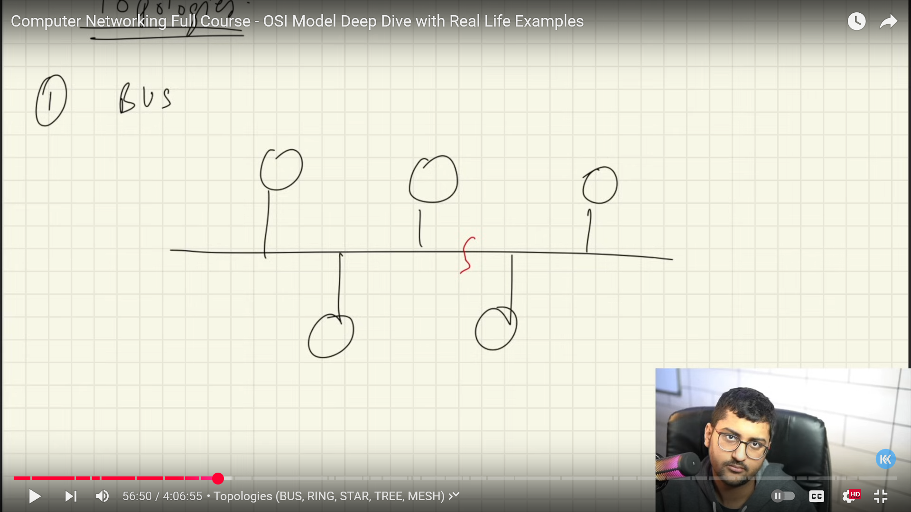

#### 🔸 2. **Star Topology**

📌 Structure:

* All devices connect to a  **central hub, switch, or router** .
* Data passes  **through the central device** .

✅ Pros:

* Easy to manage and troubleshoot
* A failure in one device doesn’t affect others
* Scalable

❌ Cons:

* If the central device fails → entire network fails
* Requires more cable than bus or ring

💡 Used In:

* Homes, offices, Ethernet LANs

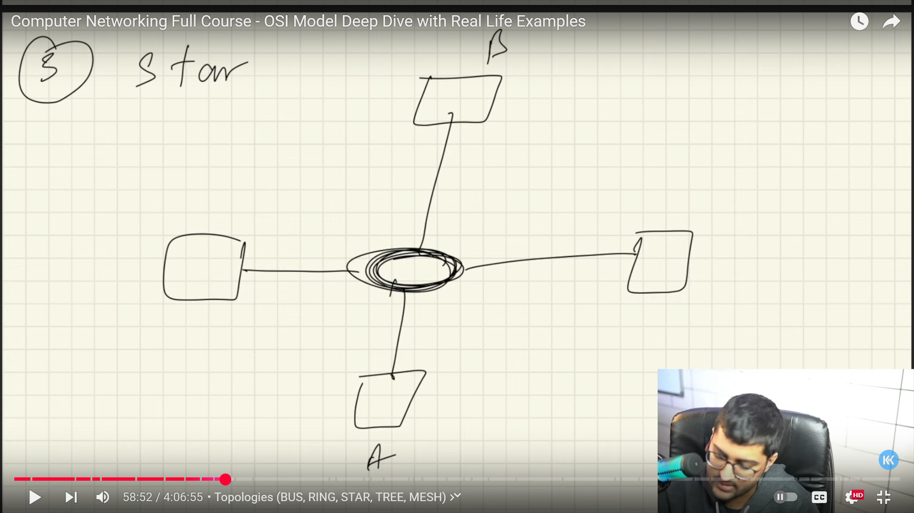

#### 🔸 3. **Ring Topology**

#### 📌 Structure:

* Devices are connected in a  **circular loop** .
* Data travels in **one direction (unidirectional)** or  **both (bidirectional)** .
* Each device sends data thru other devices in order to reach its destination device. Hence unwanted data exchange in a node

✅ Pros:

* Performance is consistent under load
* Predictable data path

❌ Cons:

* A break anywhere affects the whole network
* Troubleshooting is harder
* Each device sends data thru other devices in order to reach its destination device. Hence unwanted data exchange in a node

💡 Used In:

* Token Ring networks (now obsolete)
* Some fiber networks (like SONET)

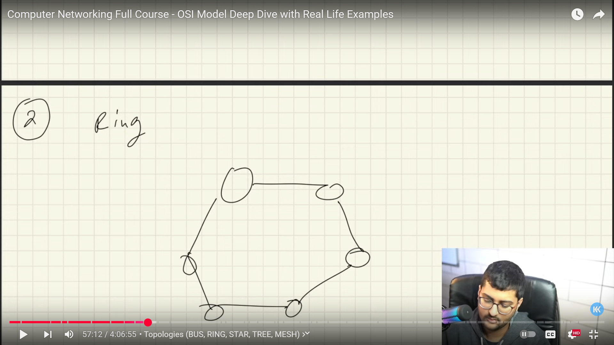

#### 🔸 4. **Mesh Topology**

📌 Structure:

* **Every node is connected to every other node** , directly (full mesh) or selectively (partial mesh).

✅ Pros:

* **High reliability & fault tolerance**
* Data can take multiple paths
* Excellent for mission-critical networks

❌ Cons:

* Expensive and complex to set up
* Requires lots of cabling and configuration

💡 Used In:

* Internet backbone
* Military or aerospace networks
* Blockchain networks

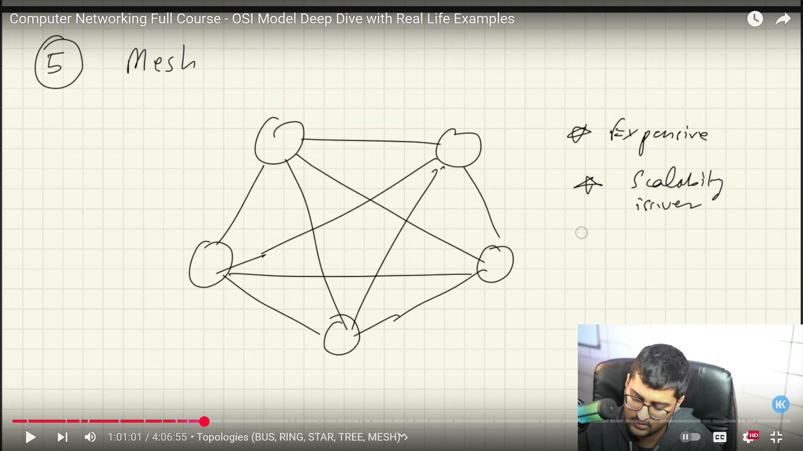

#### 🔸 5. **Tree Topology** (aka Hierarchical)

📌 Structure:

* A combination of  **star and bus** .
* Devices are connected in a hierarchical structure (root, branches, leaves).

✅ Pros:

* Easy to scale
* Easy fault isolation
* Supports subnetting

❌ Cons:

* Central root node becomes a point of failure
* Complex cabling

💡 Used In:

* Large organizational LANs
* Universities, corporations

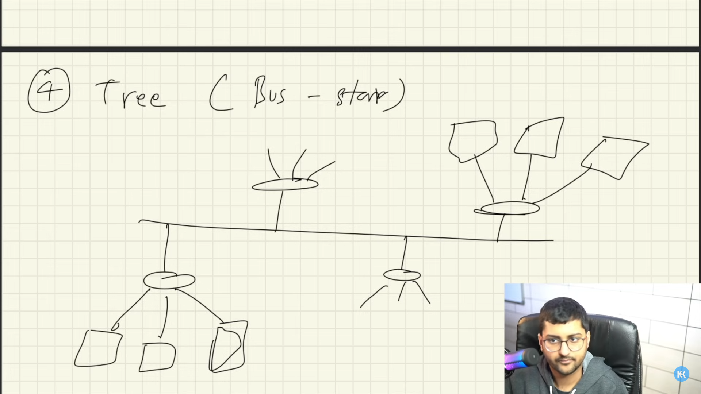

#### 🔸 6. **Hybrid Topology**

📌 Structure:

* A **mix of two or more topologies** (e.g., star + mesh)

✅ Pros:

* Highly flexible and scalable
* Can be optimized for performance and fault tolerance

❌ Cons:

* High setup cost
* Complex design and management

💡 Used In:

* Data centers
* Large enterprises

### 📊 Topology Comparison Table

| Topology         | Cost      | Reliability | Scalability | Use Case                |
| ---------------- | --------- | ----------- | ----------- | ----------------------- |
| **Bus**    | Low       | Low         | Poor        | Small, temporary setups |
| **Star**   | Moderate  | Medium      | Good        | Offices, LANs           |
| **Ring**   | Moderate  | Low         | Limited     | Rare today              |
| **Mesh**   | High      | High        | Excellent   | Military, WANs          |
| **Tree**   | High      | Medium      | Very Good   | Corporates              |
| **Hybrid** | Very High | Very High   | Excellent   | Data centers            |

### 🧠 Logical vs Physical Topology Example

* In  **Ethernet** , the **physical topology** is often a **star** (devices connected to a switch).
* But the **logical topology** may behave like a **bus** (all devices sharing the medium).

### 🏁 Summary

| Key Idea                 | Meaning                         |
| ------------------------ | ------------------------------- |
| Topology                 | Network layout structure        |
| Logical                  | How data flows                  |
| Physical                 | How cables/devices are arranged |
| Best for Scalability     | Tree, Hybrid                    |
| Best for Fault Tolerance | Mesh                            |
| Most Common              | Star                            |

---

# Network Devices

### 📦 **List of Network Devices**

#### 🔹 1. **Router**

* **Function** : Connects different networks (like LAN ↔ Internet)
* **Works at** : OSI Layer 3 (Network Layer)
* **Extra** : Can assign IP addresses (DHCP), do NAT, and firewall tasks

#### 🔹 2. **Switch**

* **Function** : Connects multiple devices in a LAN and forwards data based on **MAC addresses**
* **Works at** : OSI Layer 2 (Data Link Layer)
* **Extra** : Full-duplex communication; faster and smarter than a hub

#### 🔹 3. **Hub** *(now mostly obsolete)*

* **Function** : Broadcasts incoming data to **all** connected devices
* **Works at** : OSI Layer 1 (Physical Layer)
* **Extra** : No intelligence; causes network congestion

#### 🔹 4. **Bridge**

* **Function** : Connects and filters traffic between **two network segments**
* **Works at** : OSI Layer 2
* **Extra** : Used in older networks before switches became standard

#### 🔹 5. **Modem**

* **Function** : Converts digital ↔ analog signals (for Internet over telephone, cable, or fiber)
* **Works at** : OSI Layer 1 (Physical Layer)
* **Extra** : Essential for connecting to ISP via DSL, cable, or fiber

#### 🔹 6. **Access Point (WAP)**

* **Function** : Provides **wireless (Wi-Fi)** access to a wired LAN
* **Works at** : OSI Layer 2
* **Extra** : Often built into routers

#### 🔹 7. **Gateway**

* **Function** : Connects **two different networks** or protocols (e.g., TCP/IP ↔ AppleTalk)
* **Works at** :  **All 7 OSI Layers** , depending on use
* **Extra** : Can perform protocol translation, IP routing, or security filtering

#### 🔹 8. **Repeater**

* **Function** : Regenerates and amplifies weak signals over long distances
* **Works at** : OSI Layer 1
* **Use** : In long wired/wireless links to extend range

#### 🔹 9. **Firewall**

* **Function** : Filters network traffic based on security rules
* **Works at** : OSI Layer 3–7 (Network to Application)
* **Type** : Hardware or software
* **Extra** : Blocks malicious traffic and unauthorized access

#### 🔹 10. **Network Interface Card (NIC)**

* **Function** : Connects a device (PC, server) to a network
* **Works at** : OSI Layer 2
* **Types** : Wired (Ethernet), Wireless (Wi-Fi)
* **Extra** : Built-in or add-on (PCIe, USB)

#### 🔹 11. **Proxy Server**

* **Function** : Intercepts and forwards requests between client and server
* **Works at** : OSI Layer 7 (Application Layer)
* **Use** : Caching, anonymity, content filtering

#### 🔹 12. **Load Balancer**

* **Function** : Distributes incoming network traffic across multiple servers
* **Works at** : OSI Layer 4 (Transport) or 7 (Application)
* **Use** : High-availability websites, cloud apps

#### 🔹 13. **IDS/IPS (Intrusion Detection/Prevention System)**

* **Function** : Detects (IDS) or blocks (IPS) suspicious activity
* **Works at** : OSI Layer 3–7
* **Use** : Advanced network security monitoring

#### 🔹 14. **Media Converter**

* **Function** : Converts one physical media type to another (e.g., fiber ↔ Ethernet)
* **Works at** : OSI Layer 1
* **Use** : Integrate fiber with copper cabling

#### 🔹 15. **Cloud-Based Network Devices** *(Modern, virtualized)*

| Device                             | Function                                                             |
| ---------------------------------- | -------------------------------------------------------------------- |
| **Virtual Router**           | Software-based routing                                               |
| **Virtual Switch (vSwitch)** | Switch for virtual machines (VMs)                                    |
| **Cloud Gateway**            | Connects on-premises network to the cloud (e.g., AWS Direct Connect) |

#### 🧭 Summary Table

| Device          | OSI Layer         | Main Function                         |
| --------------- | ----------------- | ------------------------------------- |
| Router          | 3                 | Routes packets between networks       |
| Switch          | 2                 | Connects devices in a LAN             |
| Hub             | 1                 | Broadcasts packets to all ports       |
| Bridge          | 2                 | Connects two LAN segments             |
| Modem           | 1                 | Converts analog ↔ digital            |
| Access Point    | 2                 | Wireless connectivity                 |
| Gateway         | All (mainly 3–7) | Connects different networks/protocols |
| Repeater        | 1                 | Signal amplifier/extender             |
| Firewall        | 3–7              | Network security                      |
| NIC             | 2                 | Connects device to network            |
| Proxy Server    | 7                 | Acts as intermediary for requests     |
| Load Balancer   | 4/7               | Distributes traffic to servers        |
| IDS/IPS         | 3–7              | Detect/block intrusions               |
| Media Converter | 1                 | Convert fiber ↔ Ethernet             |

---

# Hub, Switch and Repeater

Understanding **repeater, hub, and switch** is important when learning about  **computer networks** , especially the **Data Link Layer (Layer 2)** of the OSI model.

### 📦 1. Repeater

🧠 What it is:

A **repeater** is a **network device** used to **regenerate and amplify signals** that weaken over distance.

📌 Purpose:

> Used to **extend the physical length** of a network by  **boosting weak signals** .

⚙️ How it works:

* It receives a signal on one port.
* It **cleans** and **boosts** the signal.
* It **retransmits** the exact same signal (bit-by-bit) on another port.

📶 Layer:

**Physical Layer (Layer 1)** of OSI model

🔧 Use Case:

* Long Ethernet cables (>100 meters)
* Extend Wi-Fi signals (Wi-Fi repeaters)

🖼️ Analogy:

> Like a megaphone — it doesn’t change the message, it just makes it louder.

### 🛑 2. Hub

🧠 What it is:

A **hub** is a **basic network device** that connects multiple devices in a LAN and  **broadcasts data to all connected devices** .

📌 Purpose:

> Send data from one device to **all others** in the network — regardless of who it’s meant for.

⚙️ How it works:

* A hub receives data (frames) on one port.
* It **blindly forwards** the data to **all** other ports.
* Devices decide whether the data is for them or not.

⚠️ Drawbacks:

* Causes **network collisions**
* Wastes bandwidth
* Not secure — data sent to all devices

📶 Layer:

**Physical Layer (Layer 1)**

🔧 Use Case (now outdated):

* Used in very small, outdated networks
* Rarely used today; replaced by switches

🖼️ Analogy:

> Like a group chat where everyone receives every message, even if it’s not for them.

### 🔄 3. Switch

🧠 What it is:

A **switch** is a smarter device that connects devices in a LAN and **forwards data only to the intended recipient** based on  **MAC addresses** .

> Most  **modern routers** , especially  **home and small-office routers** , have a **built-in switch** inside them.
>
> A typical **home router** is actually a  **3-in-1 device** :
>
> 1. **Router** (manages network traffic and IP addressing)
> 2. **Switch** (connects wired devices locally)
> 3. **Wireless Access Point (WAP)** (provides Wi-Fi)
>
> 📦 Internal Components of a Home Router
>
> | Component                       | Function                                                                                 |
> | ------------------------------- | ---------------------------------------------------------------------------------------- |
> | **Router**                | Directs data between your local network and the internet                                 |
> | **Switch (4–8 ports)**   | Lets multiple**wired devices**(like PCs, printers) connect and communicate locally |
> | **Wireless Access Point** | Enables wireless devices to connect to the network                                       |
> | **Firewall/NAT**          | Protects your network by controlling traffic and assigning private IPs                   |
>
> #### 🧠 Why Include a Switch Inside?
>
> Because:
>
> * Most users have **multiple devices** (e.g., PC, TV, printer) that need wired connections.
> * A **switch is required** to manage communication between them within the LAN.
> * Instead of making users buy a separate switch, manufacturers  **integrate it** .
>
> #### 🎯 Real Example:
>
> ### Imagine this home setup:
>
> ```text
>           [Internet]
>               ↓
>          [Modem]
>               ↓
>        [Wi-Fi Router]
>       ┌────┬────┬────┬────┐
>       ↓    ↓    ↓    ↓
>     PC1  Printer  Smart TV  NAS
> ```
>
> * All 4 devices are connected via **Ethernet ports on the back** of the router.
> * Inside the router, a **switch handles local traffic** (like copying files from PC1 to NAS).
> * If a device wants to go to the internet, the **router portion** takes over.
>
> #### 🆚 Router vs Switch: Key Differences
>
> | Feature         | **Router**                           | **Switch**                |
> | --------------- | ------------------------------------------ | ------------------------------- |
> | Connects        | Different networks (e.g., LAN ↔ Internet) | Devices within the same network |
> | Assigns IP?     | ✅ Yes (via DHCP)                          | ❌ No                           |
> | Routes data?    | ✅ Yes (based on IP)                       | ✅ Yes (based on MAC)           |
> | Layer           | Layer 3 (Network Layer)                    | Layer 2 (Data Link Layer)       |
> | Internet Access | Provides it                                | Doesn't provide it              |

📌 Purpose:

> Provide efficient and secure communication between devices on the same network.

⚙️ How it works:

* Learns the **MAC address** of each connected device.
* Stores these addresses in a  **MAC address table** .
* Forwards frames **only to the correct device** based on the destination MAC.

✅ Advantages:

* Reduces traffic & collisions
* Increases speed and efficiency
* Supports **full-duplex** communication (send & receive at the same time)

📶 Layer:

**Data Link Layer (Layer 2)**

(Some advanced switches operate at Layer 3 — routing as well.)

🔧 Use Case:

* Common in all modern LANs
* Used in offices, data centers, routers

🖼️ Analogy:

> Like a mail sorter — it sends each letter to the correct mailbox, not to everyone.

### 🧾 Summary Table

| Feature             | Repeater           | Hub                | Switch                         |
| ------------------- | ------------------ | ------------------ | ------------------------------ |
| OSI Layer           | Layer 1 (Physical) | Layer 1 (Physical) | Layer 2 (Data Link)            |
| Intelligence        | None               | None               | Smart (uses MAC address table) |
| Forwards Data To    | Next segment       | All ports          | Specific port                  |
| Prevents Collisions | ❌ No              | ❌ No              | ✅ Yes                         |
| Use Case            | Signal boosting    | Obsolete           | Standard LAN device            |
| Duplex              | N/A                | Half-duplex        | Full-duplex                    |

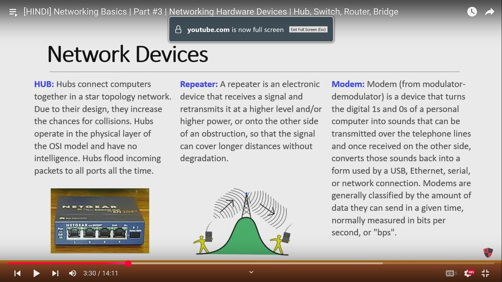

---

# Bridges

Let's dive into the concept of a **Bridge** in computer networks — a device often confused with switches, but with a specific role and history in LAN design.

### 🌉 What is a  **Bridge** ?

> A **Bridge** is a **network device** that **connects and filters traffic between two or more network segments** at the **Data Link Layer (Layer 2)** of the OSI model.

Its job is to  **divide a large network into smaller, more manageable segments** , and only **forward traffic when necessary** — based on MAC addresses.

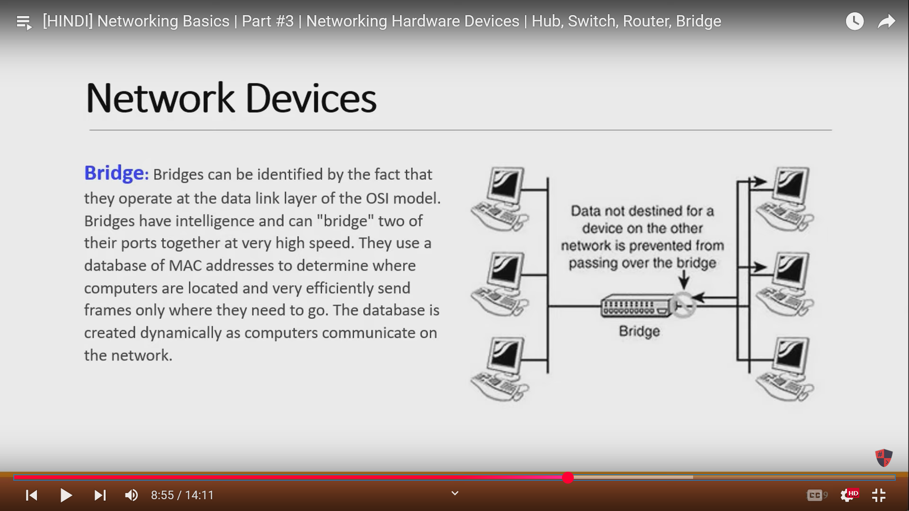

### 🧠 Why is it Used?

* To **reduce traffic** on a busy network
* To **segment a LAN** into logical units for better performance
* To **connect two different LANs** (that use the same protocol)

### ⚙️ How Does a Bridge Work?

1. The bridge **learns the MAC addresses** of devices connected to each side.
2. When it receives a frame:
   * It  **checks the destination MAC address** .
   * If it belongs to a device on the  **same segment** , it **blocks** the traffic.
   * If the device is on the  **other segment** , it **forwards** the frame.

It builds a  **MAC address table** , like a switch, but works  **slower and with fewer ports** .

### 🧾 Types of Bridges

| Type                            | Description                                                  |
| ------------------------------- | ------------------------------------------------------------ |
| **Transparent Bridge**    | Common type; works silently and forwards frames based on MAC |
| **Translational Bridge**  | Connects different network types (e.g., Ethernet to Wi-Fi)   |
| **Source-routing Bridge** | Used in Token Ring networks (rare today)                     |

### 🔄 Difference Between **Bridge** and **Switch**

| Feature    | Bridge       | Switch                      |
| ---------- | ------------ | --------------------------- |
| Ports      | 2–4 ports   | Many (dozens)               |
| MAC Table  | Small        | Large                       |
| Speed      | Slower       | Faster (hardware-optimized) |
| Modern Use | Rare         | Standard in LANs            |
| Function   | Segments LAN | Connects entire LAN         |

✅  **Switches are considered multi-port bridges** , but with faster, smarter processing.

### 📶 OSI Layer

* Operates at **Layer 2 (Data Link Layer)**
* Uses **MAC addresses** to forward or filter traffic

### 🏗️ Example Use Case

You have two departments (HR and Finance) on the same network:

* You use a **bridge** to separate them so that their traffic doesn’t flood each other
* The bridge ensures **only relevant traffic** goes across departments

### 🖼️ Analogy

> A **bridge** is like a **toll gate** on a private road — only allowing cars (data) through  **if they are meant to go across** .

### ❓ Why Aren’t **Bridges** Used Much Anymore?

Bridges were very useful in the early days of networking, but they’ve mostly been  **replaced by switches** . Here’s why:

##### ✅ 1. **Switches Do Everything Bridges Do — and Better**

| Bridge                      | Switch                                      |
| --------------------------- | ------------------------------------------- |
| Typically has 2–4 ports    | Has dozens of ports                         |
| Software-based MAC learning | Hardware-optimized, faster                  |
| Slower data forwarding      | High-speed forwarding                       |
| Limited scalability         | Easily handles large networks               |
| Handles only Layer 2        | Many switches also handle Layer 3 (routing) |

> 🔄 **Switch = smarter, faster, multi-port bridge**

##### ✅ 2. **Bridges Are Not Scalable**

* Bridges are fine for  **connecting 2 LAN segments** .
* But as networks grow, managing many bridges becomes inefficient.
* Switches were introduced to  **handle larger, more dynamic networks** .

##### ✅ 3. **Modern LANs Are More Complex**

* Today’s networks have:
  * VLANs (Virtual LANs)
  * Subnets
  * Routers and firewalls
* Bridges **cannot handle** these advanced features.
* **Switches support VLANs** , traffic isolation, and higher throughput.

##### ✅ 4. **Bridges Use Software, Switches Use Hardware (ASICs)**

* Bridges rely on **software** to process each frame → slower
* Switches use **ASICs (Application-Specific Integrated Circuits)** → very fast

##### ✅ 5. **Limited to Layer 2**

* Bridges only forward based on MAC addresses.
* **Modern switches can work at Layer 3** (IP-based routing) — called **Layer 3 switches**
* This allows better routing, subnetting, and security

##### 🛠️ Today’s Reality

| Device           | Still Used? | Why/Why Not                       |
| ---------------- | ----------- | --------------------------------- |
| **Bridge** | ❌ Rare     | Obsolete; replaced by switches    |
| **Switch** | ✅ Standard | Fast, smart, scalable             |
| **Router** | ✅ Standard | Connects different networks       |
| **Hub**    | ❌ Obsolete | Broadcasts blindly — inefficient |

### 🛠️ Summary Table

| Attribute          | Bridge                                       |
| ------------------ | -------------------------------------------- |
| OSI Layer          | Layer 2 (Data Link)                          |
| Purpose            | Segments LANs, filters traffic               |
| Based On           | MAC addresses                                |
| Ports              | Few (2–4)                                   |
| Replaces           | Old repeaters and hubs                       |
| Modern Replacement | Switch                                       |
| Key Feature        | Reduces unnecessary traffic between segments |

### ✅ Final Thoughts

* Bridges were crucial in early LANs, but  **switches have almost completely replaced them** .
* You’ll mostly see bridges **conceptually** or in  **legacy systems** .
* Still important in **networking interviews** and  **OSI model understanding** .

---

# Gateways

### 🔹  **Definition** :

A **gateway** is a **networking device** or software that acts as a **bridge between two different networks** using  **different protocols or architectures** .

> Think of a gateway as a **translator** or **entry/exit point** for your network — it connects  **your local network to the outside world** , such as the Internet.

### 🧠 Why Do We Need a Gateway?

Not all networks speak the same “language” — they may use:

* Different IP ranges
* Different protocols (e.g., TCP/IP vs. older protocols like X.25)
* Different architectures (private LAN vs public Internet)

A **gateway translates and forwards data** from one environment to another, ensuring smooth communication.

### 📶 Common Example:

When you access a website:

1. Your **laptop sends data** to your  **home router** .
2. Your router uses the **gateway** (usually your ISP’s edge router) to send that data  **out to the Internet** .
3. The **gateway device translates** and forwards the data to the appropriate server.

### 🧩 What Exactly Does a Gateway Do?

| Function                       | Explanation                                                               |
| ------------------------------ | ------------------------------------------------------------------------- |
| **Protocol Translation** | Converts data between different formats or network protocols              |
| **Address Translation**  | Uses NAT (Network Address Translation) to convert private IP to public IP |
| **Routing**              | Forwards packets between networks                                         |
| **Firewall/Filtering**   | Can block or filter traffic at the network edge                           |
| **Security**             | Often acts as a checkpoint before entering or leaving a network           |

> #### 🔄 Example of Protocol Translation
>
> ##### ✅ Scenario: Connecting an Old System Using **AppleTalk** with a Modern Network Using **TCP/IP**
>
> 🖥️ Situation:
>
> * A company has an **old printer** that uses the **AppleTalk** protocol.
> * Their current office network runs on **TCP/IP** (standard for modern networks and the internet).
> * The new computers can’t directly communicate with the printer because they speak “different languages.”
>
> 🎯 Solution:
>
> Use a **protocol gateway** (hardware or software) that performs  **protocol translation** .
>
> 🔁 What Happens:
>
> | Step | Action                                                                                         |
> | ---- | ---------------------------------------------------------------------------------------------- |
> | 1    | A user on a Windows computer sends a print job over**TCP/IP** .                          |
> | 2    | The**gateway receives the TCP/IP packet** .                                              |
> | 3    | It**converts the packet**into the**AppleTalk**protocol format.                     |
> | 4    | The packet is sent to the**AppleTalk printer** , which understands it.                   |
> | 5    | The printer responds (AppleTalk), and the gateway**translates back**to TCP/IP if needed. |
>
> #### 🔧 Other Common Examples:
>
> | Source                     | Destination                        | Translation                                                               |
> | -------------------------- | ---------------------------------- | ------------------------------------------------------------------------- |
> | **IPv4**             | **IPv6**                     | Used in networks where some parts support only IPv6 and others only IPv4. |
> | **VoIP (SIP)**       | **Traditional Phone (PSTN)** | VoIP gateway converts voice packets (SIP/RTP) into analog signals         |
> | **Bluetooth Device** | **Wi-Fi Network**            | IoT gateways may convert Bluetooth protocol to IP packets                 |
> | **MQTT (IoT)**       | **HTTP (Web Server)**        | An IoT gateway converts MQTT sensor data to HTTP REST requests            |
>
> #### 🧠 Why Protocol Translation Matters
>
> * It enables **legacy systems** to work with  **modern networks** .
> * It’s essential in  **IoT** ,  **telecom** , and  **cross-platform networking** .
> * Without it, networks would be **incompatible** and  **unable to communicate** .

### 🏠 Gateway in a Home Network

| Component            | Role                                                              |
| -------------------- | ----------------------------------------------------------------- |
| **Device**     | Your Wi-Fi router                                                 |
| **Gateway IP** | Usually something like `192.168.0.1`or `192.168.1.1`          |
| **Function**   | Connects your private LAN to your ISP’s network and the Internet |

> In this case, your **router acts as the default gateway** for all devices in your home.

### 🌍 Gateway in Large Networks or the Internet

* In corporate networks, **gateways can be complex firewall appliances or edge routers** that:
  * Connect internal subnets to the Internet
  * Filter traffic
  * Translate between IPv4 and IPv6
* On the Internet, **Tier 1 routers** also act as **backbone gateways** between massive networks.

### 🔗 Gateway vs. Router vs. Modem

| Device            | Function                                                  |
| ----------------- | --------------------------------------------------------- |
| **Gateway** | Connects**different networks**or**protocols** |
| **Router**  | Forwards packets between**same-protocol**networks   |
| **Modem**   | Converts digital ↔ analog (for ISP communication)        |

> A **router becomes a gateway** when it **connects two networks with different addressing schemes** — such as your private home network and your ISP’s public IP space.

### 📦 Types of Gateways

| Type                       | Use Case                                                                         |
| -------------------------- | -------------------------------------------------------------------------------- |
| **Default Gateway**  | The device a node uses to reach other networks (e.g., your router)               |
| **Protocol Gateway** | Translates between different communication protocols (e.g., TCP/IP ↔ AppleTalk) |
| **Cloud Gateway**    | Connects on-premises networks to cloud services                                  |
| **IoT Gateway**      | Bridges smart devices (ZigBee, Bluetooth) to IP-based networks                   |
| **VoIP Gateway**     | Converts voice data between traditional phones and IP phones                     |
| **API Gateway**      | In web applications, routes and manages API requests (software-level gateway)    |

### 🔢 IP Configuration Example

On a typical home computer:

```bash
IP Address:     192.168.1.5
Subnet Mask:    255.255.255.0
Default Gateway:192.168.1.1
```

* Any request outside the 192.168.1.x network goes to the **default gateway** (`192.168.1.1`).

## 🧭 Real-Life Analogy

> Think of a  **gateway like the entrance gate of your apartment building** :

* Inside: Your private home (LAN)
* Outside: The public road (Internet)
* The **gatekeeper** (gateway device) decides what goes in and out.

### 🏁 Summary

| Feature        | Description                                                             |
| -------------- | ----------------------------------------------------------------------- |
| Role           | Bridge between two networks                                             |
| Protocol       | Converts between different network formats if needed                    |
| Common Example | Your home router as a gateway to the internet                           |
| Used In        | Homes, offices, data centers, cloud services                            |
| Gateway IP     | Usually the router’s private IP in your network (like `192.168.0.1`) |

---

# Wireless Access Point

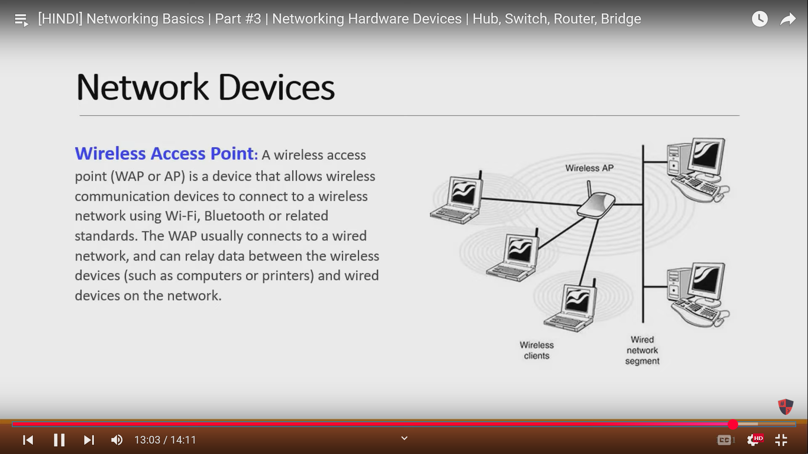

🔹 Definition:

A **Wireless Access Point** is a **networking device** that allows  **wireless (Wi-Fi) devices to connect to a wired network** .

> It acts as a **bridge between wired Ethernet and wireless Wi-Fi** networks.

### 🧠 Why Do We Need a Wireless Access Point?

* Ethernet (wired) networks are  **fast and reliable** , but  **not mobile** .
* Devices like laptops, smartphones, and tablets use  **Wi-Fi** .
* A **WAP gives wireless devices access** to a wired network, including internet, printers, and servers.

### 🔗 How Does It Work?

1. The **WAP connects to a router or switch** via Ethernet cable.
2. It **broadcasts a Wi-Fi signal** using radio frequencies (2.4GHz or 5GHz).
3. Wireless devices detect this signal and connect using a password (if required).
4. The WAP **forwards traffic** between the devices and the main wired network (LAN).

### 🧩 Example:

Imagine an office:

* It has a **wired LAN** with servers, printers, and internet access.
* Employees use  **laptops and phones** .
* A WAP is installed in the ceiling → employees connect via Wi-Fi and access everything on the LAN.

### 📶 Frequencies Used

| Band                      | Speed     | Range   | Interference                              |
| ------------------------- | --------- | ------- | ----------------------------------------- |
| **2.4 GHz**         | Lower     | Longer  | More interference (microwaves, Bluetooth) |
| **5 GHz**           | Higher    | Shorter | Less interference                         |
| **6 GHz**(Wi-Fi 6E) | Very High | Shorter | Low usage (new tech)                      |

### 🏗️ Types of Wireless Access Points

| Type                               | Description                              | Used In                         |
| ---------------------------------- | ---------------------------------------- | ------------------------------- |
| **Standalone WAP**           | Works independently, manually configured | Small offices                   |
| **Controller-Based WAP**     | Managed by a central wireless controller | Large enterprises, campuses     |
| **Cloud-Managed WAP**        | Managed via cloud dashboard              | Remote offices, modern campuses |
| **Router with Built-in WAP** | Home routers that include Wi-Fi features | Homes, small offices            |

### 🆚 WAP vs Router

| Feature                      | **Wireless Access Point** | **Router**             |
| ---------------------------- | ------------------------------- | ---------------------------- |
| Provides Wi-Fi?              | ✅ Yes                          | ✅ Yes (if wireless router)  |
| Assigns IP addresses?        | ❌ No                           | ✅ Yes                       |
| Connects different networks? | ❌ No                           | ✅ Yes                       |
| Needs to connect to router?  | ✅ Yes                          | ❌ No (is the router)        |
| Role                         | Extends wireless coverage       | Manages entire local network |

> Many home Wi-Fi routers include **router + switch + WAP** in a single box.

### 🔢 Network Example Setup

```
Internet
   ↓
[ Modem ]
   ↓
[ Router ]
   ↓ (Ethernet)
[ Switch ]
   ↓
[ Wireless Access Point ]
   ↓ (Wireless)
[ Laptops / Phones / Tablets ]
```

### 🛠️ Placement Tips

* Place WAPs **centrally** in each area.
* Avoid walls, ceilings with metal beams, or electrical interference.
* Use multiple WAPs for large buildings (e.g., mesh Wi-Fi).

## 🌍 Real-Life Uses

| Environment                 | WAP Usage                                       |
| --------------------------- | ----------------------------------------------- |
| **Home**              | Built into router                               |
| **Office**            | Multiple ceiling-mounted WAPs                   |
| **Campus**            | Dozens/hundreds of WAPs, centrally managed      |
| **Hotels / Airports** | WAPs with captive portals and bandwidth control |
| **Smart Factories**   | Industrial-grade WAPs supporting IoT devices    |

---

# Network Interface Card (NIC)

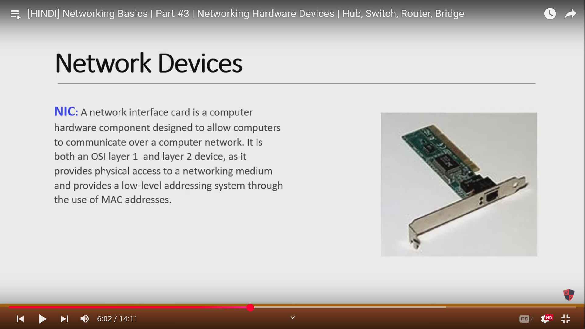

Let's dive deep into the **Network Interface Card (NIC)** — a foundational component in networking.

### 🧩 What is a Network Interface Card (NIC)?

🔹  **Definition** :

A **Network Interface Card (NIC)** is a **hardware component** — either built-in or add-on — that allows a **computer or device to connect to a network** (wired or wireless).

> It serves as the  **interface between the device and the network** , enabling communication by sending and receiving data packets.

### 🧠 Why Is NIC Important?

Without a NIC:

* A device **cannot access** the internet or any local network.
* It **can’t be identified on a network** (no MAC address).
* **Data communication** is impossible.

NIC is like the **doorway** through which your device enters the networking world.

### 🔌 Types of NICs

| Type                           | Description                                            | Example                              |
| ------------------------------ | ------------------------------------------------------ | ------------------------------------ |
| **Wired NIC (Ethernet)** | Uses RJ-45 port and Ethernet cable                     | Desktop PC Ethernet port             |
| **Wireless NIC (Wi-Fi)** | Connects to wireless access points using radio signals | Laptop Wi-Fi card                    |
| **Fiber NIC**            | Uses fiber optic cables (SFP, LC)                      | Servers or switches with fiber ports |
| **Virtual NIC (vNIC)**   | Software-defined NIC for virtual machines              | Cloud servers, VMware                |
| **USB NIC**              | Plug-and-play NIC via USB port                         | External Wi-Fi or Ethernet dongles   |

### ⚙️ Components of a NIC

| Component                 | Function                                                       |
| ------------------------- | -------------------------------------------------------------- |
| **MAC Address**     | A unique hardware address that identifies the NIC on a network |
| **Transceiver**     | Sends and receives data (over copper, fiber, or air)           |
| **Controller Chip** | Manages the data flow between device and network               |
| **Driver Software** | OS-level software that enables communication with the NIC      |

### 🔁 Functions of NIC

| Function                    | Description                                       |
| --------------------------- | ------------------------------------------------- |
| **Framing**           | Wraps data into Ethernet frames for transmission  |
| **Error Detection**   | Verifies if data is corrupted (e.g., CRC checks)  |
| **Access Control**    | Participates in protocols like CSMA/CD or CSMA/CA |
| **Addressing**        | Uses MAC address for device identification        |
| **Data Transmission** | Sends and receives packets to/from the network    |

### 📡 NIC: Wired vs Wireless

| Feature      | Wired NIC               | Wireless NIC                   |
| ------------ | ----------------------- | ------------------------------ |
| Media        | Ethernet cable (RJ-45)  | Wi-Fi (radio signals)          |
| Speed        | Up to 10 Gbps (or more) | Usually up to 1 Gbps (Wi-Fi 6) |
| Stability    | More stable             | More prone to interference     |
| Installation | Often built-in          | Often built-in or USB-based    |

### 📄 MAC Address (NIC Identity)

Each NIC comes with a **burned-in unique MAC address** (e.g., `00:1A:92:AF:34:5C`) that identifies the device  **within a LAN** .

It:

* Never changes (unless spoofed)
* Is used in Ethernet switching and ARP protocol
* Works at **OSI Layer 2**

### 🧪 OSI Model Placement

* NIC mainly operates at the **Data Link Layer (Layer 2)** and partially at  **Physical Layer (Layer 1)** .
* It works with:
  * MAC addresses (Layer 2)
  * Signals, voltages, frequencies (Layer 1)

### 🛠️ Example Setup

```plaintext
+------------------------+
|   Application Layer    | ← OS, apps, protocols
+------------------------+
|     NIC Driver         | ← Software interface
+------------------------+
|      NIC Hardware      | ← Actual chip/card
+------------------------+
|     Ethernet Cable     | ← (wired) or Wi-Fi signal
+------------------------+
|        Network         | ← LAN, Internet, etc.
```

### 🏢 Use Cases of NIC

| Use Case              | Device                                   |
| --------------------- | ---------------------------------------- |
| Home Internet         | Laptop, Desktop                          |
| Server in Data Center | High-speed Ethernet or fiber NICs        |
| Virtual Machines      | Virtual NIC (vNIC) managed by hypervisor |
| Mobile Devices        | Integrated wireless NIC                  |

### 🏁 Summary

| Feature   | Value                                 |
| --------- | ------------------------------------- |
| Full Name | Network Interface Card                |
| Purpose   | Connects device to a network          |
| Works At  | OSI Layer 2 (and Layer 1)             |
| Types     | Wired, Wireless, Fiber, Virtual, USB  |
| Unique ID | MAC Address                           |
| Found In  | PCs, laptops, servers, VMs, smart TVs |

---

# OSI Model

Absolutely! The **OSI Model** is one of the most important foundational concepts in computer networking. Let’s dive into it  **deeply and clearly** , layer by layer.

### 📌 What Is the OSI Model?

🔹 Definition:

The **OSI (Open Systems Interconnection) Model** is a **conceptual framework** that standardizes the functions of a network into  **seven layers** , allowing different systems to communicate over a network.

> Created by the **ISO (International Organization for Standardization)** in 1984.

It helps:

* Break down network communication into manageable layers
* Standardize network hardware/software development
* Troubleshoot networks layer by layer

### 🧱 The 7 Layers of OSI Model

From top to bottom:

```
7. Application
6. Presentation
5. Session
4. Transport
3. Network
2. Data Link
1. Physical
```

👉 Mnemonic (from top to bottom):

**A**ll **P**eople **S**eem **T**o **N**eed **D**ata **P**rocessing

(or for fun: "Please Do Not Throw Sausage Pizza Away")

### 🧩 Layer-by-Layer Breakdown

#### 🔹 **Layer 7: Application Layer**

| Feature  | Detail                                     |
| -------- | ------------------------------------------ |
| Role     | Interface between the user and the network |
| Function | Provides network services to end-user apps |
| Examples | HTTP, FTP, DNS, SMTP, POP3                 |
| Devices  | Web browsers, email clients                |

✅ It  **doesn't include the actual apps** , but rather **services** they use to communicate over the network.

#### 🔹 **Layer 6: Presentation Layer**

| Feature   | Detail                                              |
| --------- | --------------------------------------------------- |
| Role      | Translates data between the application and network |
| Functions | Data formatting, encryption, compression            |
| Examples  | SSL/TLS, JPEG, MPEG, ASCII, EBCDIC                  |
| Devices   | Gateways (sometimes), encryption systems            |

✅ It ensures the data is in a readable format for the Application Layer.

🛡️ Handles **encryption (like HTTPS)** and **data conversion** (like UTF-8).

#### 🔹 **Layer 5: Session Layer**

| Feature   | Detail                                               |
| --------- | ---------------------------------------------------- |
| Role      | Manages and controls**connections (sessions)** |
| Functions | Session creation, maintenance, termination           |
| Examples  | NetBIOS, RPC, PPTP                                   |
| Devices   | Software-level, not physical devices                 |

✅ It allows **multiple applications to run simultaneously** without interfering.

🎮 Example: Audio + Video stream in Zoom being kept in sync.

#### 🔹 **Layer 4: Transport Layer**

| Feature   | Detail                                    |
| --------- | ----------------------------------------- |
| Role      | End-to-end communication between hosts    |
| Functions | Segmentation, error control, flow control |
| Protocols | **TCP** ,**UDP**              |
| Concepts  | Ports, reliability, retransmission        |

✅ Think of this as the **traffic controller** – it decides **how** and **in what order** data is delivered.

| TCP (Transmission Control Protocol) | UDP (User Datagram Protocol) |
| ----------------------------------- | ---------------------------- |
| Reliable, ordered                   | Unreliable, faster           |
| Connection-oriented                 | Connectionless               |
| Email, Web, FTP                     | Streaming, VoIP, gaming      |

#### 🔹 **Layer 3: Network Layer**

| Feature   | Detail                                           |
| --------- | ------------------------------------------------ |
| Role      | Handles routing and addressing across networks   |
| Functions | Logical addressing, routing, fragmentation       |
| Protocols | **IP (IPv4, IPv6)** , ICMP, ARP, RIP, OSPF |
| Devices   | **Routers**                                |

✅ This is where **IP addressing** and **path selection (routing)** happen.

🧭 It's responsible for **finding the best path** to deliver your data.

#### 🔹 **Layer 2: Data Link Layer**

| Feature   | Detail                                      |
| --------- | ------------------------------------------- |
| Role      | Reliable**node-to-node**data transfer |
| Functions | Framing, MAC addressing, error detection    |
| Protocols | Ethernet, PPP, Wi-Fi (802.11), ARP          |
| Devices   | **Switches** , NICs, Bridges          |

✅ Breaks data into  **frames** , adds  **MAC addresses** , and handles error checking.

🧷 Responsible for  **LAN communication** .

#### 🔹 **Layer 1: Physical Layer**

| Feature   | Detail                                           |
| --------- | ------------------------------------------------ |
| Role      | Transmits raw**bits over physical medium** |
| Functions | Voltages, cables, connectors, signal timing      |
| Mediums   | Ethernet cables, fiber optics, radio waves       |
| Devices   | Hubs, Repeaters, Cables, Modems, NIC (partially) |

✅ It **moves electrical or optical signals** across the wire or air.

💡 A bit here is just a high or low voltage, or a light pulse.

### 📦 Data Encapsulation & Decapsulation

When data moves  **from sender to receiver** , it goes **down the layers (encapsulation)** and then  **up the layers on the receiving end (decapsulation)** .

| Layer                  | Unit of Data                   |
| ---------------------- | ------------------------------ |
| Application to Session | Data                           |
| Transport              | Segment (TCP) / Datagram (UDP) |
| Network                | Packet                         |
| Data Link              | Frame                          |
| Physical               | Bits (0s and 1s)               |

### 🛠️ OSI Model and Real Devices

| Device      | Works At              |
| ----------- | --------------------- |
| Web Browser | Layer 7 (Application) |
| Firewall    | Layer 3–7 (depends)  |
| Router      | Layer 3 (Network)     |
| Switch      | Layer 2 (Data Link)   |
| Hub         | Layer 1 (Physical)    |
| NIC         | Layer 1 & 2           |
| Modem       | Layer 1               |

### 📊 OSI vs TCP/IP Model

| OSI Layer       | TCP/IP Layer      |
| --------------- | ----------------- |
| 7. Application  | Application       |
| 6. Presentation | Application       |
| 5. Session      | Application       |
| 4. Transport    | Transport         |
| 3. Network      | Internet          |
| 2. Data Link    | Network Interface |
| 1. Physical     | Network Interface |

> 🧠 TCP/IP is the  **real-world protocol suite** . OSI is more of a  **theoretical reference model** .

### 🧠 Why Learn the OSI Model?

* Helps you **troubleshoot** (e.g., Is the issue at Layer 1 or Layer 7?)
* Helps you understand **how protocols and devices interact**
* Aids in **network design, certification exams, and interviews**

### 🏁 Summary

| Layer | Name         | Function                     | Keyword        |
| ----- | ------------ | ---------------------------- | -------------- |
| 7     | Application  | Interface with user software | HTTP, FTP      |
| 6     | Presentation | Format, encrypt, compress    | SSL, JPEG      |
| 5     | Session      | Start/end sessions           | NetBIOS        |
| 4     | Transport    | Reliable delivery            | TCP/UDP, ports |
| 3     | Network      | Routing, addressing          | IP, router     |
| 2     | Data Link    | MAC, framing                 | Switch, NIC    |
| 1     | Physical     | Bits over medium             | Cables, hubs   |

---

# ----Application Layer

Let’s dive deep into the  **Application Layer** —the 7th and topmost layer of the OSI model—with clear explanations, real-world analogies, use cases, and reasoning.

### 📌 What is the Application Layer?

* The **Application Layer** is where  **users and software interact with the network** .
* It is  **not the actual application** , but the **layer that provides services** to the application to use the network.
* It enables  **communication between software applications and lower network layers** .

> 🧠 It’s like the **interface between your app (like Chrome or WhatsApp) and the network** that actually sends/receives data.

### 💡 Why Do We Need the Application Layer?

Imagine sending a message using WhatsApp. Your phone doesn't send electricity across a wire. Here's what’s needed:

1. A **standardized way to request** a message be sent.
2. A way to  **format** ,  **encode** , and **understand** that message.
3. An ability to **talk to the underlying layers** and use their services (transport, network, etc.)

📍 The  **application layer takes care of this** —handling your input/output  **so the lower layers know what to do** .

### 🔄 What Does It Actually Do?

| Function                                              | Explanation                                                                           |
| ----------------------------------------------------- | ------------------------------------------------------------------------------------- |
| 🧾**Provides network services to applications** | Like web browsing, file transfers, emails, etc.                                       |
| 🖧**Initiates data communication**              | Tells lower layers: "Hey, I need to send a request to fetch this webpage!"            |
| 🔐**User authentication**                       | Helps with login processes (like HTTP basic auth).                                    |
| 🧭**Service advertisement and discovery**       | Allows apps to find available services on the network (e.g., printers, game servers). |

### 🌐 Real-Life Examples

##### Example 1: **Web Browsing (HTTP)**

* You open Chrome and type `www.example.com`.
* Chrome talks to the  **Application Layer** , which uses the  **HTTP protocol** .
* HTTP sends a `GET` request to fetch the webpage.
* That message is passed down through all layers until it reaches the server, which processes it and sends back the page.

##### Example 2: **Email (SMTP, POP3, IMAP)**

* Application Layer defines how your email client:
  * Sends email via **SMTP**
  * Retrieves email via **IMAP** or **POP3**

##### Example 3: **File Transfer (FTP)**

* FTP defines how files are requested, sent, renamed, or deleted over the network.
* All of that logic lives at the application layer.

### ⚙️ Common Protocols at Application Layer

| Protocol             | Purpose                         |
| -------------------- | ------------------------------- |
| **HTTP/HTTPS** | Web browsing                    |
| **FTP/SFTP**   | File transfers                  |
| **SMTP**       | Sending email                   |
| **IMAP/POP3**  | Receiving email                 |
| **DNS**        | Domain name resolution          |
| **DHCP**       | Automatic IP address assignment |
| **SNMP**       | Network management              |

### 🤖 Analogy: Restaurant System

* **You** = Application (e.g., browser)
* **Waiter** = Application Layer (talks to the kitchen for you)
* **Kitchen** = Lower OSI layers (where real processing and "data cooking" happens)
* **Menu** = Protocol (defines how to communicate)

The waiter (application layer) makes sure your request is passed correctly to the kitchen, gets the result, and presents it in a form you understand.

### ❓Can We Do Without the Application Layer?

No—not unless:

* You're writing **raw network code** to talk to the transport layer manually (very complex).
* You're OK with **no standard services** like web, email, FTP, etc.

Without it:

* No web browsing.
* No email.
* No file transfer protocols.
* No DNS → No converting names like `google.com` to IP addresses.

👉 So it's essential for making networking  **useful and human-friendly** .

### 💻 Example Access And Usage in MERN App

In the  **MERN stack (MongoDB, Express.js, React, Node.js)** , most of the code you write, especially in the backend (Node.js + Express), operates at the **Application Layer** of the OSI model.

Let’s break it down:

##### ✅ **How MERN Stack maps to the Application Layer:**

🔹 Node.js + Express:

* When you write API endpoints like:

  ```js
  app.get('/api/products', (req, res) => {
      res.json({ message: 'All Products' });
  });
  ```

  This is **Application Layer** code. It's how the server responds to specific requests — using the  **HTTP protocol** , which lives in the Application Layer.
* Your code:

  * Interacts with users (via client/browser)
  * Sends/receives data using HTTP(S)
  * Parses headers, body, etc.
  * Talks to databases (MongoDB)

🔹 React (Frontend):

* Makes HTTP requests to backend using `fetch()` or `axios` — also **Application Layer** actions.
* For example:
  ```js
  const res = await fetch('/api/products');
  ```

> ##### 🧠 So, what’s actually happening?
>
> 1. You write:
>    ```js
>    fetch('https://fitlab.com/api/products');
>    ```
> 2. React (in browser) sends an **HTTP request** → **Application Layer** formats the request → passes to lower layers (Transport → Network → Data Link → Physical).
> 3. On the server side (Node.js + Express), the **Application Layer** receives the HTTP request:
>    * Parses the route, headers, cookies, etc.
>    * Responds with JSON, HTML, or error messages.
>
> ##### 🧩 Why we need the Application Layer:
>
> * It provides **abstraction** from the network details (IP, routing, TCP handshakes).
> * Lets you focus on **what** data to send/receive, not **how** it gets delivered.
> * Defines **protocols** like:
>   * HTTP(S)
>   * FTP
>   * SMTP
>   * DNS
>   * WebSockets
> * You don’t have to manually construct TCP packets or worry about bits on the wire.
>
> ##### 🔄 Without it?
>
> If there were  **no Application Layer** , you'd have to:
>
> * Write code that manually interacts with transport layer protocols like TCP or UDP.
> * Construct headers, handle data parsing, content formatting, etc., yourself.
> * Think about things like character encoding, compression, security... manually.
>
> That’s **not scalable or practical** for 99% of use cases.
>
> ##### 🧪 Use cases in MERN:
>
> * REST APIs (HTTP-based)
> * GraphQL endpoints
> * WebSocket connections (e.g., for chat apps)
> * Authentication flows (JWT tokens, cookies)
> * File uploads via multipart/form-data

### 🧠 Summary

| Aspect        | Description                                                               |
| ------------- | ------------------------------------------------------------------------- |
| 📍 Role       | Interface between applications and the network                            |
| 🧠 Key Job    | Provides protocols for apps to communicate                                |
| 🌐 Examples   | HTTP, FTP, SMTP, DNS, etc.                                                |
| 🛠️ Need     | Required to make apps like browsers, email clients, etc., network-capable |
| 🚫 Without It | You’d have to handle complex networking logic yourself                   |

---

# ----Presentation Layer

 Let’s dive deep into the **Presentation Layer** of the OSI Model — the 6th layer — and break it down in the most understandable way possible, with analogies, examples, and real-world use cases.

### 🧠 What is the  **Presentation Layer** ?

The **Presentation Layer** is like the **translator and formatter** of the OSI model. It prepares the data from the **Application Layer** (Layer 7) so that it can be transmitted over the network and understood by the  **receiving system’s Application Layer** .

Think of it as the **"Syntax & Semantics" layer** — it ensures that data is **understood the same way** on both ends.

### 🎯 Responsibilities of the Presentation Layer

| Task                                    | What it Means                                                                               |
| --------------------------------------- | ------------------------------------------------------------------------------------------- |
| **Data Translation**              | Converts data into a format that the network and receiving system understand.               |
| **Data Compression**              | Reduces the size of data to make transmission faster and more efficient.                    |
| **Data Encryption/Decryption**    | Makes data secure during transmission and readable again at the destination.                |
| **Serialization/Deserialization** | Prepares data to be sent or received in structured form (e.g., converting objects to JSON). |

### 🛠️ Real-Life Analogy: Language Translator

Imagine you're on a video call:

* You're speaking  **English** , but the person only understands  **French** .
* A **translator** listens to you,  **converts the language** , and  **passes it along** .

🔁 That **translator is like the Presentation Layer** — converting the **format** of the information, not the **meaning** or  **content** .

### 💻 Real World Example

##### Example: You’re using a web browser to open a secure website (HTTPS)

1. **Application Layer** : You click a link in Chrome.
2. **Presentation Layer** :

* Converts characters into ASCII or Unicode.
* Compresses the HTML content if needed (e.g., GZIP).
* Encrypts the request using SSL/TLS (so your login data is protected).

1. **Session Layer and Below** : Handles the delivery.

When the server receives the request, the Presentation Layer:

* Decrypts it.
* Decompresses it.
* Ensures character encoding is correctly interpreted.

### 📦 Use Cases

| Use Case                                  | How Presentation Layer Helps                                             |
| ----------------------------------------- | ------------------------------------------------------------------------ |
| **Secure login to banking site**    | Encrypts your credentials with SSL/TLS                                   |
| **Streaming video (e.g., Netflix)** | Compresses video to reduce bandwidth                                     |
| **Chat in multiple languages**      | Ensures emojis, symbols, and characters are encoded/decoded correctly    |
| **Data APIs (JSON, XML)**           | Serializes objects to JSON format (sender) and parses it back (receiver) |

### 🔐 Key Concepts

##### 🧾 **Encoding**

Different systems may use different encoding standards (ASCII, UTF-8). The Presentation Layer ensures both ends agree.

##### 🗜️ **Compression**

Smaller data = faster transmission.

* Example: PNG or JPEG image compression.
* GZIP compression for HTML/JS files in websites.

##### 🔐 **Encryption**

Security during data transfer.

* SSL/TLS encryption is done here.
* Think of it as putting the letter in a **sealed envelope** before mailing.

### 🧩 Can We Do Without It?

In theory:

* **Yes** , you could merge this functionality into the  **Application Layer** .
* But in practice:
  * This separation  **keeps networking modular** .
  * It allows developers to focus on data logic, while the presentation layer handles **"how to send it."**
  * Many protocols like **HTTPS, FTP, SMTP** rely on these features.

So while it’s possible to design systems without it, that would mean  **manually handling encoding, encryption, and compression** , making systems more error-prone and inconsistent.

### ✅ In the MERN Stack — Where Do We Deal With the Presentation Layer?

We  **don’t directly program a “presentation layer” component** , but we **perform its responsibilities** across different parts of the stack:

##### 🔹 1. **Data Format Conversion (JSON <-> JS Objects)**

📍Where it happens:

* **Frontend (React):** You use `fetch` or `axios` to receive data from the backend.
  ```js
  const res = await fetch('/api/products');
  const data = await res.json();  // <--- Presentation layer decodes JSON to JS object
  ```
* **Backend (Node.js + Express):**
  ```js
  res.json({ name: "Dumbbell", price: 200 });
  ```

📌 This conversion between **JSON strings** and **JavaScript objects** is a Presentation Layer function.

##### 🔹 2. **Encryption / Decryption**

📍Where it happens:

* **Using HTTPS:** TLS (Transport Layer Security) encrypts your HTTP data.
  * Although encryption starts at the  **Transport Layer** , the formatting of encrypted content (e.g., SSL certificates, handshakes) is considered a  **Presentation Layer responsibility** .
* **JWT Tokens:** Tokens are encoded (usually Base64) and sometimes encrypted.
  ```js
  const token = jwt.sign({ userId: "abc123" }, secret);
  // This involves encoding and often secure transmission — handled at presentation level
  ```

##### 🔹 3. **Character Encoding / Decoding**

📍Where it happens:

* **When sending strings, special characters, or multilingual text** , the browser and server use encoding formats like  **UTF-8** .
* For example, you write:

  ```js
  res.send("नमस्ते");
  ```

  The server ensures proper encoding so the browser can decode and render the string correctly.

##### 🔹 4. **Compression / Decompression**

📍Where it happens:

* If you enable **gzip** or **Brotli compression** in Express, the data sent to the browser is compressed.
* Browser decompresses it before rendering.
  ```js
  const compression = require('compression');
  app.use(compression()); // <--- Presentation layer compresses data before transmission
  ```

> ##### 🧪 Examples in MERN Projects
>
> | Feature          | Layer 6 Role                          |
> | ---------------- | ------------------------------------- |
> | API sending JSON | Format conversion (JS object ↔ JSON) |
> | HTTPS            | Encryption                            |
> | JWT Auth         | Token encoding/decoding               |
> | UTF-8 strings    | Character encoding                    |
> | Media files      | Data format (JPEG, MP4)               |
> | Compression      | Reduces data before transport         |
>
> ##### 🔚 Summary
>
> * In MERN, the Presentation Layer is  **invisible but always working behind the scenes** .
> * You rely on it when:
>   * Converting JSON
>   * Using HTTPS
>   * Handling JWTs or file types
>   * Working with non-English characters
>   * Enabling compression
>
> Let me know if you want a **diagram** showing how the OSI layers relate to MERN code!

##### 🛠 Can We Do Without It?

🔸 Technically yes,  **but it would be painful** :

Without the Presentation Layer:

* You'd have to manually convert all data formats.
* Handle encryption/decryption logic by hand.
* Manage string encoding, binary formats, etc.

So while it's often **implicit** (handled by libraries or protocols), it’s **essential** to a smooth and secure app experience.

### 💡 Summary

| Feature                | Description                                                                              |
| ---------------------- | ---------------------------------------------------------------------------------------- |
| **Layer Number** | 6 (Sixth Layer)                                                                          |
| **Main Role**    | Format, translate, encrypt, compress data                                                |
| **Analogy**      | A translator + encoder + security guard                                                  |
| **Examples**     | TLS/SSL, JPEG, MP3, ASCII, UTF-8, JSON/XML                                               |
| **Why Needed**   | To ensure that the data being sent is**understood and secure**at the receiving end |

---

# ----Session Layer

Let's dive deep into the **Session Layer** (Layer 5 of the OSI Model) and understand its role with clarity, analogies, examples, and technical insights.

### 🧠 What is the  **Session Layer** ?

The **Session Layer** is responsible for **establishing, managing, and terminating sessions** between applications. A session is like a **conversation** between two devices (or applications) across a network.

Think of the Session Layer as the **coordinator of the dialogue** — it ensures both parties  **start the conversation** ,  **stay synchronized** , and  **end it cleanly** .

### 🧩 Responsibilities of the Session Layer

| Function                        | Description                                                              |
| ------------------------------- | ------------------------------------------------------------------------ |
| **Session Establishment** | Sets up the communication between devices/applications                   |
| **Session Maintenance**   | Keeps the communication alive; handles interruptions or timeouts         |
| **Session Termination**   | Gracefully closes the communication when finished                        |
| **Synchronization**       | Inserts checkpoints so you can resume from a certain point after failure |
| **Dialog Control**        | Manages who speaks when (full-duplex or half-duplex)                     |

### 🎯 Real-Life Analogy

Imagine a  **Zoom call** :

* 🛜  **Session Establishment** : You send the invite, the other joins — session starts.
* 💬  **Communication Control** : Both can talk, or only one can speak (full vs. half-duplex).
* ⏺️  **Synchronization** : If your connection drops and you rejoin, it resumes from where you left.
* 🔚  **Session Termination** : You click "End Call", and the session closes cleanly.

### 💡 Real-World Examples of Session Layer Use

| Application                                         | Session Layer Role                                                                            |
| --------------------------------------------------- | --------------------------------------------------------------------------------------------- |
| **Web conferencing (Zoom, MS Teams)**         | Manages who is speaking, maintains the session                                                |
| **File transfer (FTP)**                       | Allows large file transfers with checkpoints so if it breaks, it resumes from a certain point |
| **Streaming**                                 | Syncs audio and video streams to stay in time                                                 |
| **Remote login (Telnet, SSH)**                | Keeps a session alive while you're interacting with a remote system                           |
| **Database connections (ODBC, SQL sessions)** | Maintains a session with the DB for queries                                                   |

### 📜 Protocols Operating at the Session Layer

* **RPC (Remote Procedure Call)**
* **NetBIOS (Network Basic Input/Output System)**
* **PPTP (Point-to-Point Tunneling Protocol)**
* **SMPP (Short Message Peer-to-Peer Protocol)**
* **ASP (AppleTalk Session Protocol)**

> Note: In the modern TCP/IP model, many session responsibilities are handled by TCP (transport layer) or by applications themselves.

### 🔍 Why Do We Need the Session Layer?

Without a session layer:

* There’d be  **no control over who talks when** , which could lead to  **data collisions or confusion** .
* A **network drop** could **lose the whole conversation** rather than picking up from the last checkpoint.
* Long-running communications (like file transfers or video streams) would be  **much less reliable** .
* Applications would have to **reinvent session management** themselves, adding unnecessary complexity.

### 🔄 **Where is the Session Layer in a MERN Stack Application?**

The **Session Layer** in the OSI model is responsible for **establishing, managing, and terminating sessions** between applications. In the context of a MERN (MongoDB, Express.js, React, Node.js) stack, the **session layer responsibilities are often handled in the backend (Node.js/Express)** and occasionally in the frontend (React) via tokens or cookies.

#### 🔑 Real-Life Examples in MERN Stack:

##### 1. **User Login & Authentication**

* **What Happens?**
  * User logs in → a session is created.
  * A token (like JWT) or a session ID (stored in a cookie) is generated.
  * The server maintains a session context for the user.
* **Where It Happens?**
  * **Express.js (Node.js)** : Manages sessions using packages like `express-session` or tokens via `jsonwebtoken`.
  * **MongoDB** (optional): Session info can be stored here for persistence.
  * **React** : Uses localStorage/cookies to store tokens to persist sessions.

##### 2. **Shopping Cart Persistence**

* You add items to a cart.
* Even if you reload the page or browse other products, the cart persists until the session expires or is cleared.
* This "remembering" is handled at the session layer.

##### 3. **Real-Time Communication (Chat/Socket.io)**

* Persistent communication between client and server.
* Handshake starts the session, which continues until disconnected.
* Session layer ensures proper setup and teardown of the chat connection.

> ##### 🛠 Technologies in MERN Handling the Session Layer:
>
> | Layer                | Tool/Library                                               | Description                   |
> | -------------------- | ---------------------------------------------------------- | ----------------------------- |
> | Backend (Express.js) | `express-session`,`cookie-parser`,`jsonwebtoken`     | Manage session IDs or tokens. |
> | Frontend (React)     | `localStorage`,`cookies`                               | Store session tokens locally. |
> | Database (MongoDB)   | (Optional) Save session state or user tokens persistently. |                               |
>
> ##### 🤔 Can We Skip the Session Layer?
>
> Technically,  **yes** —but at a cost:
>
> * Without session management,  **each request would be stateless** , i.e., the server wouldn't recognize the client after each request.
> * You'd have to authenticate  **every single request** .
> * Features like "Remember me", "Cart state", "User preferences", and "Live chats" would not work effectively.
>
> So: **Session layer is not directly visible in your code but is crucial and often handled by frameworks/libraries.**

### ❓ Can We Do Without It?

* In theory, yes — **TCP/IP combines session with transport and application layers.**
* But  **session control logic still exists** , just not always in a separate OSI-defined "Session Layer".
* It's often implemented **within the application** or  **handled by protocols like TCP or HTTP** .

### 🛠️ What’s Happening Behind the Scenes?

Let's say you're uploading a 5GB file to Google Drive:

1. **Session is established** between your browser and Google's server.
2. The session layer ensures your file is broken into manageable chunks.
3. If the connection is interrupted, the session protocol **resumes** from the last successful chunk.
4. Once the upload finishes, the session  **terminates cleanly** .

---

# ----Transport Layer

The **Transport Layer** is the **4th layer** of the OSI Model. It plays a **critical role in enabling reliable, efficient, and ordered communication between devices** across a network — particularly between applications on different machines.

### 🔹 **Purpose of the Transport Layer**

Its **main job is to ensure that data sent from one device's application reaches the intended application on the other device correctly and reliably.**

* **IT DELIVERS THE MESSAGE FROM THE SYSTEM WHICH IT GOT FROM NETWORK LAYER TO THE ACTUAL APPLICATION OR VICE VERSA**

### 📦 What Does the Transport Layer Do?

| Feature                               | Description                                                                              |
| ------------------------------------- | ---------------------------------------------------------------------------------------- |
| **Segmentation & Reassembly**   | Breaks large messages into smaller chunks (segments) at sender; reassembles at receiver. |
| **Flow Control**                | Prevents sender from overwhelming the receiver.                                          |
| **Error Control**               | Ensures damaged or missing segments are detected and retransmitted.                      |
| **Reliable Delivery**           | Uses acknowledgments (ACKs) and retransmissions to ensure delivery (in TCP).             |
| **Multiplexing/Demultiplexing** | Identifies which application a message belongs to (using**port numbers** ).        |
| **Connection Management**       | Establishes, maintains, and terminates sessions between applications.                    |

### 🧠 Real-Life Analogy

> **Postal Service Analogy**
>
> Imagine you're sending a large book through the mail, but the postal service can only carry small parcels. So you:

1. Divide the book into several packages.
2. Number each package.
3. Ensure the receiver confirms receipt.
4. If one goes missing, you resend just that one.

That’s exactly what the Transport Layer does — with data.

### 📥 Key Protocols at Transport Layer

| Protocol                                      | Use Case                           | Reliable? | Example                |
| --------------------------------------------- | ---------------------------------- | --------- | ---------------------- |
| **TCP (Transmission Control Protocol)** | Web browsing, email, file transfer | ✅ Yes    | HTTP, FTP, SMTP        |
| **UDP (User Datagram Protocol)**        | Live streaming, online games       | ❌ No     | DNS, VoIP, video calls |

### 💡 TCP vs UDP Example

| Use Case                     | Why TCP? / UDP?                                              |
| ---------------------------- | ------------------------------------------------------------ |
| **Email (TCP)**        | Needs complete, reliable data transfer.                      |
| **Video Call (UDP)**   | Real-time delivery is more important than perfection.        |
| **Web Browsing (TCP)** | Reliability is critical — you want the full page.           |
| **Live Gaming (UDP)**  | You can’t afford lag — a lost packet is better than delay. |

### 🔌 Port Numbers (Multiplexing)

* Every application communicates using a  **port number** .
  * Example: HTTP → Port 80, HTTPS → Port 443
* Transport Layer **uses port numbers** to send data to the correct app.

🧠  **Analogy** : Think of an apartment building (IP address) — port numbers are **apartment numbers** inside it.

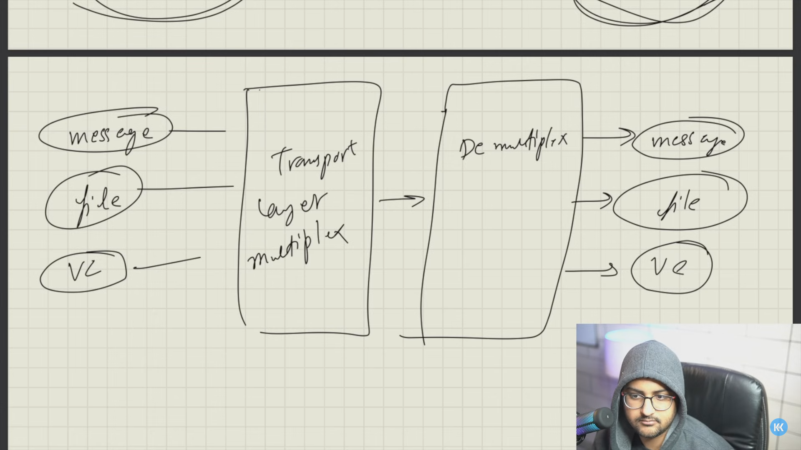

### 🧠 Why Can’t We Skip the Transport Layer?

Because:

* **No segmentation?** Big files can't be transmitted safely.
* **No error control?** Corrupted data won’t be corrected.
* **No flow control?** Receiver could crash under load.
* **No multiplexing?** Data might go to the wrong app.

You could  **directly use the network layer** , but it would be like writing a letter with no envelope, address, or guarantee — not practical for modern communications.

### 🔍 What’s Actually Happening?

1. App (like a browser) sends data to the transport layer.
2. Transport Layer breaks it into segments and adds a header:
   * Source port, destination port
   * Sequence number
   * Error-checking info (checksum)
3. Segments go to the **Network Layer** (next step).
4. On the receiver’s side:
   * Transport Layer reassembles the segments.
   * Checks for errors and corrects them.
   * Delivers data to the **correct application** using the port number.

### 🧩 Where Does It Fit in MERN Stack?

In the MERN stack, you  **don’t directly write Transport Layer code** , but your app  **relies on it constantly under the hood** .

✅ Here’s how each part of MERN interacts **with or through** the Transport Layer:

| MERN Component              | Transport Layer Involvement                                                 |
| --------------------------- | --------------------------------------------------------------------------- |
| **React (Frontend)**  | Browser sends HTTP requests over**TCP** .                             |
| **Express (Backend)** | Listens on a**TCP port**(e.g., 3000) and handles requests.            |
| **MongoDB**           | Communicates over its own**TCP connection**(default port: 27017).     |
| **Node.js**           | Uses**TCP sockets**behind the scenes when running HTTP/HTTPS servers. |

You use:

* `http.createServer()` → this is a wrapper over TCP.
* Libraries like `Socket.io` → these sit **on top of TCP** (or WebSockets).

##### 🛠 Real Use Cases in MERN (Transport Layer Underlying):

###### 1. **HTTP Requests**

* All your `fetch()` or `axios` calls from React use **TCP** via HTTP.
* Example:

  ```js
  axios.post('/api/login', data);
  ```

  → Under the hood, this sends a POST request over  **TCP (port 80/443)** .

###### 2. **Express Server Listening on Port**

```js
app.listen(3000, () => console.log("Server running"));
```

→ This means Express is **opening a TCP port (3000)** and listening for incoming TCP connections.

###### 3. **MongoDB Connection**

```js
mongoose.connect('mongodb://localhost:27017/dbname');
```

→ Establishes a **TCP connection** to MongoDB on  **port 27017** .

###### 4. **WebSockets / Socket.io**

* Real-time apps (like chat) use **persistent TCP connections** through WebSockets.

```js
const io = require('socket.io')(server); // Uses TCP
```

### ❓Can We Bypass the Transport Layer?

**No** — even though you don’t touch it directly:

* Every network request in MERN **relies on TCP/IP** to ensure delivery.
* Skipping it would mean you’re outside the world of networking.

### 🔍 What's Actually Happening Under the Hood?

When a React client sends a request:

1. HTTP (Application Layer) forms a message.
2. Transport Layer breaks it into  **segments** , adds **port numbers** and  **checksums** .
3. Passes it to the Network Layer for delivery.

When Express receives it:

1. TCP reassembles the segments.
2. Sends the full data up to Express to handle via routes and controllers.

### ✅ Summary

| Feature                      | Description                                                    |
| ---------------------------- | -------------------------------------------------------------- |
| **Layer #**            | 4 (Transport Layer)                                            |
| **Key Protocols**      | TCP, UDP                                                       |
| **Functions**          | Segmentation, Reliability, Port addressing, Flow/Error Control |
| **Can't skip because** | Ensures reliability, correct delivery, app targeting           |

---

# ----Network Layer

The **Network Layer** is the **third layer** (Layer 3) in the  **OSI Model** , and it's  **responsible for logical addressing, routing, and forwarding packets across networks** .

### 🔍 What Actually Happens at the Network Layer?

Let’s say you are sending a request to a website (like `amazon.com`). Behind the scenes:

* The **Application Layer** builds your request (e.g., "I want to see this product page").
* The **Transport Layer** breaks that request into segments and labels it with port numbers.
* Now the **Network Layer** kicks in and:
  * Adds **source and destination IP addresses** (logical addresses).
  * Determines the **best path** through interconnected routers and networks.
  * Sends the data in **packets** to the next network hop (router or gateway).

### 🔑 Key Responsibilities

| Function                     | Description                                                 |
| ---------------------------- | ----------------------------------------------------------- |
| **Logical addressing** | Assigns IP addresses (not physical MAC addresses).          |
| **Routing**            | Finds the best path for the data across different networks. |
| **Packet forwarding**  | Moves packets from one network segment to another.          |
| **Fragmentation**      | Breaks larger packets into smaller ones if needed.          |

### 🧠 Analogy: Delivery Company

Think of the **Network Layer** as the  **delivery company (like FedEx)** :

* The **IP address** is like the  **destination city + street address** .
* The **routing** is the decision: “Should we send this via truck through Highway A or B?”
* The routers are like **checkpoints or hubs** that forward the package in the right direction.

### 📦 Example in Real Life

Imagine sending a package from Bangalore to New York:

* You specify the **destination address** (IP address).
* The delivery company finds the **optimal route** via air/land.
* It may go through hubs like Mumbai → London → NY (routing).
* The **package is broken into parts** if it’s too large for the aircraft (fragmentation).

Similarly:

* A data packet from your PC to a remote server **hops** through several routers.
* Each router uses the destination IP to decide where to forward it next.

### ⚙️ Real Technologies Involved

| Concept         | Real Protocols                                           |
| --------------- | -------------------------------------------------------- |
| Addressing      | IPv4, IPv6                                               |
| Routing         | OSPF, BGP, RIP                                           |
| Packet delivery | ICMP,  IGMP, ARP (works with network + data link layer) |

### 📚 Use Cases

1. **Visiting websites** – Your request needs routing to reach the destination server.
2. **Sending email** – It might hop across mail servers worldwide.
3. **Video conferencing** – Real-time packets need efficient and low-latency routing.
4. **Using VPNs** – VPNs manipulate network-layer routing to create secure tunnels.

### ❓ Can We Do Without the Network Layer?

No, not in any scalable system. Without the network layer:

* There would be **no logical addressing** (IP), just MAC addresses – limited to local networks.
* **Routing wouldn't be possible** – data couldn’t travel across different networks or the internet.
* The internet itself wouldn’t exist in the way we use it.

### 💻 In MERN Stack Context

Though you don’t directly deal with the Network Layer in code:

* When you call an API like `fetch('/api/products')`, that request travels across the internet via routers using the  **Network Layer** .
* DevOps engineers and backend developers may deal with networking (e.g., setting IP whitelists, using reverse proxies, managing subnets in cloud deployments).

### ❗❗ REMEMBER THIS

##### **✅ What Happens in Each Layer (from Network to Physical)**

1. **🧠 Network Layer:**
   * Adds the  **source and destination IP addresses** .
   * Think of this as writing the **to/from addresses** on an envelope.
   * The packet is now ready to be routed **logically** — but it's not yet physically sent.
2. **🧵 Data Link Layer:**
   * Takes the packet from the Network layer and **wraps it with MAC addresses** (source and destination) into what’s called a  **frame** .
   * Handles **physical addressing and access control** for the physical medium.
   * It still hasn’t left the computer — it’s now ready for physical transmission.
   * Example: If you're sending to a local router, the destination MAC is that of the router.
3. **⚡ Physical Layer:**
   * **Actually transmits** the raw bits (0s and 1s) over the medium (like Ethernet cables, Wi-Fi signals, fiber optics).
   * Now the data  **leaves your machine** .
   * Converts the frame into **electrical, radio, or optical signals** and sends it out.

##### 📦 Real-Life Analogy: Postal Mail

* **Network Layer:** Writes "To: John, New York" and "From: Alice, Bangalore" — the IP addresses.
* **Data Link Layer:** Chooses the **local post office** and wraps the envelope for delivery to that post office — this is the MAC address work.
* **Physical Layer:** The mail truck **drives off with your envelope** — actual transmission begins here.

##### 💻 MERN Context

In MERN stack development:

* You generally operate  **above the Transport layer** , typically at **Application Layer** (e.g., Express.js for HTTP).
* All the **lower layers (Transport, Network, Data Link, Physical)** are handled by the OS, drivers, and networking hardware.
* But when you call an HTTP endpoint, all these layers **work in the background** to transmit your API request/response over the internet.

### 🧾 Summary

| Feature      | Description                                     |
| ------------ | ----------------------------------------------- |
| Layer        | 3 (Network Layer)                               |
| Main job     | Addressing and routing data packets             |
| Key protocol | IP (Internet Protocol)                          |
| Devices      | Routers                                         |
| Cannot skip? | No – essential for multi-network communication |

---

# ----Data Link layer

📶 **What is the Data Link Layer?**

The **Data Link Layer** is **Layer 2** of the  **OSI model** , sitting just above the **Physical Layer** and below the  **Network Layer** . Its main role is to enable **reliable point-to-point data transfer over a physical link** (like Ethernet or Wi-Fi), by packaging raw bits into  **frames** , handling  **MAC addressing** , and ensuring  **error detection/correction** .

### 🧠 Intuitive Understanding with Analogy:

**Analogy: Think of a postal delivery van operating within a city.**

* 🏙️ **City roads** = Physical Layer (just raw infrastructure)
* 🚚 **Van delivering a package from house to house in a city** = Data Link Layer
* 📦 **Package with address on it** = Frame with MAC address
* 🏠 **House address** = MAC Address
* 📫 **Mailbox and postman** = NIC (Network Interface Card) + driver that sends/receives frames

### 🔧 **Responsibilities of the Data Link Layer:**

| Function                  | Explanation                                                                                     |
| ------------------------- | ----------------------------------------------------------------------------------------------- |
| **Framing**         | Converts raw bits (from Physical Layer) into manageable**data frames** .                  |
| **MAC addressing**  | Uses**MAC addresses**to uniquely identify devices on a**local network**(e.g., LAN). |
| **Error detection** | Detects errors in transmission using techniques like**CRC (Cyclic Redundancy Check)** .   |
| **Flow control**    | Ensures sender doesn’t overwhelm the receiver.                                                 |
| **Access control**  | Determines which device gets to send data on a**shared channel**(like in Ethernet).       |

### 💻 Real-Life Example:

Imagine your laptop is connected to a Wi-Fi router. When it sends a request to a server:

1. The **Data Link Layer** adds the **MAC address** of your router as the destination.
2. The router receives it and forwards it (based on IP) to the next hop.
3. Each hop on the way to the final server involves a **new MAC address** hop, while IP stays the same.

### 🔄 Use Cases:

* **Ethernet (Wired LAN)**
* **Wi-Fi (Wireless LAN)**
* **Bluetooth communications**
* **Error-prone environments** (e.g., satellite or underwater comms)

### ❓ Why Can’t We Do Without It?

Without the Data Link Layer:

* Devices wouldn't know  **which machine to talk to on the local network** .
* **Frames wouldn’t exist** , making bitstreams hard to manage.
* We'd face **frequent transmission errors** and  **no addressing on LANs** .
* Physical Layer alone just transmits 1s and 0s—it doesn’t know **who** sent or should receive them.

### 🔍 In the Context of MERN Stack:

Although **MERN developers** rarely deal directly with the Data Link Layer, it still  **makes your app possible** :

* When your React frontend sends a request (e.g., `fetch('/api/products')`):
  * That HTTP request is  **broken down into TCP segments** , and further into  **Ethernet frames** .
  * The Data Link Layer **packages** those frames and uses **MAC addresses** to send it to the router (or switch).
  * The router or switch reads the **MAC addresses** and routes accordingly within local networks.

You don’t see or control the Data Link Layer—but your MERN app relies on it to  **get data to and from the internet** .

### 🧩 Summary:

| Feature          | Role                                                         |
| ---------------- | ------------------------------------------------------------ |
| Layer            | OSI Layer 2                                                  |
| Key Units        | Frames                                                       |
| Addressing       | MAC Address                                                  |
| Protocols        | Ethernet, PPP, Wi-Fi (IEEE 802.11), etc.                     |
| Responsibilities | Framing, MAC addressing, error detection, access control     |
| Use in MERN      | Enables network hardware to deliver packets to/from your app |

Let me know if you want diagrams or side-by-side comparisons with other layers!

---

# ----Physical Layer

Let’s dive into the **Physical Layer** — the foundation of all computer networking.

### 🧱 What is the Physical Layer?

The **Physical Layer** is the **lowest layer** (Layer 1) in the OSI model.

🔑 Its job:

It deals with the **actual physical transmission** of raw bits (0s and 1s) over a physical medium like:

* Copper wires (Ethernet)
* Fiber optics
* Wi-Fi (radio waves)
* Bluetooth
* Satellites, etc.

Unlike other layers that handle logical communication (like IP addresses, MAC addresses, ports), this layer simply asks:

> "How do I get these bits from one device to another — as  **electrical pulses** ,  **light** , or  **radio signals** ?"

### 📦 What is Actually Happening?

Let’s say your MERN app sends a POST request to a server:

1. **Application Layer (HTTP)** : You write a `fetch()` in React to call a backend API.
2. **Transport Layer (TCP)** : Adds a port number and segments your data.
3. **Network Layer (IP)** : Adds IP addresses.
4. **Data Link Layer (MAC)** : Adds MAC addresses to form a frame.
5. **✅ Physical Layer** :

* Converts the frame into a  **stream of bits** : `010010101011...`
* Then turns those bits into:
  * **Voltage levels** (if wired Ethernet),
  * **Light pulses** (if fiber optic),
  * **Radio signals** (if Wi-Fi).
* **Sends those signals out of your device** , over a cable or air, to a router or switch.

Now the data has **physically left your computer.**

### 🎯 Real-World Analogy

📬 Postal System:

Imagine sending a letter:

* You wrote the message (application layer)
* Put it in an envelope (data link)
* Wrote the addresses (network)
* Gave it to the postman (physical layer)

> The **postman driving the letter physically to another city** = **Physical Layer**

### 🧠 Why Do We Need It?

Without the physical layer, everything else is just  **abstract instructions** . Nothing actually gets delivered.

### Without it:

* IPs and MACs are assigned, packets formed — but the data  **sits idle** .
* You have **no way to leave your device** or communicate across a network.

Just like planning a trip without ever getting into the car 🚗.

### 🔌 Examples of Physical Layer Devices

| Device                      | Role                                     |
| --------------------------- | ---------------------------------------- |
| **Ethernet cable**    | Carries electrical signals               |
| **Wi-Fi antenna**     | Sends/receives radio waves               |
| **Modem**             | Modulates/demodulates signals            |
| **Fiber optic cable** | Transmits data as light                  |
| **Hubs**              | Old-school physical transmission devices |

### 🧪 Use Cases

* Connecting LAN networks physically (Ethernet)
* Fiber-optic internet transmission
* Satellite communications
* IoT and embedded systems
* Bluetooth and wireless sensors

### 🌐 MERN Stack Example

Say you're building a **real-time fitness tracker** with:

* React frontend
* Node.js/Express backend
* MongoDB database

### When a user clicks “Start Workout”:

* `fetch("/api/start-workout")` is called.
* HTTP → TCP → IP → MAC → **Physical Layer**
* The bits of that HTTP request are converted into signals and sent over Wi-Fi to the nearest router.
* The router receives the signals, processes them, and relays them onward — via similar steps at each hop.

> You didn’t write code for it — but it **physically happened** due to the physical layer.

### ✅ Summary

| Feature             | Physical Layer                                                          |
| ------------------- | ----------------------------------------------------------------------- |
| **Type**      | Hardware-level                                                          |
| **Role**      | Converts data → signals                                                |
| **Transmits** | Bits (0s and 1s) as electric/light/radio                                |
| **Required?** | Absolutely — no actual communication happens without it                |
| **In MERN?**  | Behind-the-scenes — your requests ride this layer to travel physically |

---

# ----ALL OSI LAYERS' SECTION-- ACRONYM

* Intro
* Function table
* Real world eg
* Protocols or protocol for each thing
* Mern

---

# ----TCP/IP(4-Layer Model) and 5-Layer Model

✅ The  **core concepts inside each layer remain the same** , even if the layers are **combined or split differently** in OSI, TCP/IP, or the 5-layer model.

✅ The **TCP/IP model** is the **most commonly used model on the internet** today.

✅ **5-layer model** is a **simplified version** of the OSI and TCP/IP models used in practical networking.

* This model is commonly used in **computer networking courses** and combines parts of the **OSI (7 layers)** and **TCP/IP (4 layers)** models to make things easier to understand.

### 🔄 Comparison Table

| OSI Model (7)     | 5-Layer Model  | TCP/IP Model (4)  |
| ----------------- | -------------- | ----------------- |
| 7. Application    |                |                   |
| 6. Presentation   |                |                   |
| 5. Session        |                |                   |
| → Combined as → | 5. Application | 4. Application    |
| 4. Transport      | 4. Transport   | 3. Transport      |
| 3. Network        | 3. Network     | 2. Internet       |
| 2. Data Link      | 2. Data Link   |                   |
| 1. Physical       | 1. Physical    | 1. Network Access |
| (2 + 1 combined)  |                |                   |

### 👉 Why is the TCP/IP model most commonly used?

* **It was built into the foundation of the internet** : The Internet was developed using TCP/IP protocols (e.g., TCP, IP, HTTP, etc.), so naturally, the model it follows is TCP/IP.
* **It’s practical and implementation-focused** : Unlike the OSI model, which is more of a conceptual guide, TCP/IP was based on actual working protocols.
* **Adopted by all modern networks** : Routers, switches, servers, browsers — they all speak TCP/IP.

> ### 📌 Quick Comparison:
>
> | Feature                     | OSI Model (7 Layers)        | TCP/IP Model (4 Layers)                  |
> | --------------------------- | --------------------------- | ---------------------------------------- |
> | **Purpose**           | Theoretical/reference model | Practical/implementation model           |
> | **Used in practice?** | Rarely implemented fully    | **Used everywhere**on the internet |
> | **Flexibility**       | More detailed & modular     | Simpler, but real-world friendly         |
> | **Examples**          | Academic teaching           | Internet, web servers, browsers          |
>
> ### 📦 Protocols used in the Internet follow TCP/IP model:
>
> * **Application Layer** : HTTP, HTTPS, FTP, DNS, SMTP
> * **Transport Layer** : TCP, UDP
> * **Internet Layer** : IP, ICMP
> * **Network Access Layer** : Ethernet, Wi-Fi, ARP
>
> ### 🧠 Analogy:
>
> Think of the **OSI model** like a full course syllabus — great for learning.
>
> Think of **TCP/IP** like the daily class schedule that actually gets followed. That's what runs the real show (the Internet).

### 🎯 Why Use the 5-Layer Model?

* Easier to **teach and visualize**
* Splits the lower layers of TCP/IP for clarity
* Still compatible with both **OSI** and **TCP/IP**

> ##### 🧠 Example: What Happens When You Load a Website?
>
> Let’s say you're accessing `https://example.com`:
>
> | Layer       | What it does                                                  |
> | ----------- | ------------------------------------------------------------- |
> | Application | Browser uses HTTPS to send a request                          |
> | Transport   | TCP breaks data into segments, ensures delivery               |
> | Network     | Adds IP address, decides best path to reach server            |
> | Data Link   | Adds MAC address, wraps it into a frame                       |
> | Physical    | Converts frame to bits (0s and 1s), sends over Ethernet/Wi-Fi |

---

# ----HTTP Protocol

Let's break down **HTTP (HyperText Transfer Protocol)** in a detailed, beginner-friendly way with analogies, real-world examples, technical concepts, and how it fits into web development (including the MERN stack).

### 🔸 What is HTTP?

**HTTP** stands for  **HyperText Transfer Protocol** .

It is the **foundation of data communication** on the web.

> ✅ It defines how **clients (like browsers)** and **servers (like web servers)** communicate with each other — specifically how they **request** and **transfer** data like HTML, CSS, JS, images, etc.

### 🧠 Real-Life Analogy

Imagine you walk into a library and request a book.

* 🧍‍♂️ You = Client (browser)
* 🧑‍💼 Librarian = Server
* 📄 Note you hand to librarian = HTTP Request
* 📚 Book you get back = HTTP Response

Just like the note has a clear format (title, author), the HTTP request has a  **structured format** , and the response contains the **requested content** and metadata.

### 🔁 How HTTP Works – Step-by-Step

1. **Client (browser) sends an HTTP Request** to the server

   ➤ Example: `GET /about.html HTTP/1.1`
2. **Server receives the request** , processes it (maybe fetches from a database)
3. **Server sends back an HTTP Response**

   ➤ Example: `200 OK` with the HTML page
4. **Browser displays the content** to the user

### 📬 HTTP Request Format

Example:

```
GET /index.html HTTP/1.1
Host: www.example.com
User-Agent: Mozilla/5.0
Accept: text/html
```

* `GET` – Method
* `/index.html` – Path
* `HTTP/1.1` – Version
* `Host`, `User-Agent`, etc. – Headers

### 📦 HTTP Response Format

Example:

```
HTTP/1.1 200 OK
Content-Type: text/html
Content-Length: 1256

<html>
  <body>Welcome to my website!</body>
</html>
```

* `200 OK` – Status Code
* `Content-Type` – Tells the browser what to expect
* Body – The actual content (HTML, JSON, etc.)

### 🔧 Common HTTP Methods

| Method     | Use Case                       |
| ---------- | ------------------------------ |
| `GET`    | Retrieve data (no body)        |
| `POST`   | Send new data to server        |
| `PUT`    | Update/replace existing data   |
| `PATCH`  | Partially update existing data |
| `DELETE` | Delete data from server        |

### 🔐 Is HTTP Secure?

* **HTTP** is not encrypted. Data can be seen by attackers.
* **HTTPS (HTTP Secure)** encrypts the data using **TLS/SSL**

  ✅ Modern sites **always** use HTTPS.

### 🔗 Use in MERN Stack

In MERN (MongoDB, Express, React, Node):

* **React (Frontend)** sends HTTP requests via `fetch()` or `axios` to the backend
* **Express + Node (Backend)** handles those HTTP requests using routes:
  ```js
  app.get("/api/products", (req, res) => {
    res.json({ name: "Dumbbell", price: 500 });
  });
  ```

You’re constantly using HTTP to:

* Fetch product data (GET)
* Submit a login form (POST)
* Update profile info (PUT/PATCH)
* Delete a product (DELETE)

### 🌍 Real-World Examples

| Action                    | HTTP Method | Resource Path       |
| ------------------------- | ----------- | ------------------- |
| Viewing a blog post       | GET         | `/posts/123`      |
| Submitting a contact form | POST        | `/contact`        |
| Updating user email       | PATCH       | `/users/42/email` |
| Deleting a comment        | DELETE      | `/comments/88`    |

### 🚀 Why is HTTP Important?

* It’s  **stateless** : each request is independent.
* It’s  **standardized** : everything on the web uses it.
* It's how  **browsers, APIs, and servers talk** .
* Forms the  **foundation of REST APIs** .

---

# ----SMTP, POP3, IMAP- How Email works

Email might seem simple to use, but behind the scenes, it involves several protocols and steps to send, receive, and access messages.

Let’s break it down  **in-depth** , clearly explaining how email works using  **SMTP, POP3, and IMAP** , with  **examples and analogies** .

### 📧 **Overview: How Email Works**

When you send an email, it goes through this general flow:

1. **Compose and send** (via email client like Gmail/Outlook)
2. **Transfer** using **SMTP** (Simple Mail Transfer Protocol)
3. **Store** the email on the recipient’s mail server
4. **Retrieve** using **POP3** (Post Office Protocol) or **IMAP** (Internet Message Access Protocol)

### 1️⃣ **SMTP – Simple Mail Transfer Protocol**

✅ What it does:

SMTP is **used to send emails** from a client to a server or between servers. Think of it like a **postal truck** that picks up your letter and drops it at the recipient’s post office.

✅ Key Roles:

* Sends email from sender to their  **email provider's mail server** .
* Transfers email from sender’s server to recipient’s server (if different).

✅ Real-Life Analogy:

> Imagine you're sending a physical letter. You drop it into a mailbox → it's picked up by a postal truck (SMTP) → it's routed and delivered to the destination city’s post office (receiver’s mail server).

✅ SMTP Commands Example:

SMTP uses text commands like:

```
HELO server.com
MAIL FROM:<alice@example.com>
RCPT TO:<bob@example.com>
DATA
<message body>
.
QUIT
```

### 2️⃣ **POP3 – Post Office Protocol v3**

✅ What it does:

POP3 is used to **retrieve emails** from the mail server to your device. It **downloads and usually deletes the email** from the server.

✅ Characteristics:

* Connects to the mail server
* Downloads emails to local device (e.g., your laptop)
* Deletes email from server afterward (by default)

✅ Real-Life Analogy:

> Like going to a post office, picking up your letters, and taking them home. Once taken, the post office no longer stores them.

✅ Pros:

* Simple, uses less server storage
* Good for single-device users

✅ Cons:

* Not synced across multiple devices
* If you lose your device, the emails are gone unless backed up

### 3️⃣ **IMAP – Internet Message Access Protocol (Alternative to POP3)**

(Not your main question, but important for comparison)

✅ What it does:

IMAP keeps emails **on the server** and lets you view/sync them across multiple devices.

✅ Real-Life Analogy:

> Like visiting the post office to read your letters without taking them home — you always read from the post office. If you use multiple devices (phone, laptop), they all see the same thing.

### 🛠 Technical Flow Example:

Let’s say Alice wants to send Bob an email:

1. **Alice** writes an email in Gmail.
2. **SMTP** sends that email from Gmail’s server to Bob’s Yahoo server.
3. **Bob’s server** receives the email and stores it.
4. When **Bob** opens his Yahoo Mail app:
   * If using  **POP3** , the mail is downloaded and deleted from server.
   * If using  **IMAP** , the mail stays on the server and is just viewed on the app.

### ✉️ Common Email Ports:

| Protocol | Port (Non-Encrypted) | Port (SSL/TLS) | Purpose              |
| -------- | -------------------- | -------------- | -------------------- |
| SMTP     | 25                   | 465 or 587     | Sending mail         |
| POP3     | 110                  | 995            | Downloading mail     |
| IMAP     | 143                  | 993            | Viewing/syncing mail |

> * They are not strictly fixed — but there are standard/default ports.
> * These ports are **standardized by IANA (Internet Assigned Numbers Authority)** and are expected by most clients and servers.

### 💻 In the context of web apps (e.g., MERN stack):

* Your backend might use **SMTP** libraries (like Nodemailer in Node.js) to send emails to users (e.g., verification emails).
* Users receive them using their own email clients through  **POP3/IMAP** .

### ✅ Why do we need SMTP & POP3?

Without them:

* No standard way to **send or receive** emails.
* You’d have to build a system from scratch for every app/email provider.
* They make email **interoperable and universal** across Gmail, Yahoo, Outlook, etc.

---

# ----Ports

🧠 What is a Port?

A **port** is a **virtual endpoint** on a device that helps identify a **specific process or service** on that device — like a room number in a building.

🧾  **Formal definition** :

A **port number** is a 16-bit unsigned number (ranging from 0 to 65535) used by the **transport layer protocols** (like TCP or UDP) to direct network traffic to the correct application or process.

### 🏢 Real-Life Analogy

> **IP address** is like a building's street address.
>
> **Port number** is like the **apartment number** in that building.

So if multiple people live in the same building (multiple apps/services on one machine), the port number helps deliver messages to the  **right person (process)** .

> #### 📌 A P**ort is not a physical hardware component** , but a **virtual (software-based) concept** used in networking.
>
> ###### 🔸 Ports Are Software-Level Endpoints
>
> They’re part of the **transport layer** (Layer 4) in the OSI model and exist in **TCP** and **UDP** protocols.
>
> When data arrives at a computer, the OS uses the **destination port number** to decide which application (like a web server or email client) should receive the data.
>
> ###### 🔹 So, in short:
>
> * ✅ Port = software number to route data to the correct app.
> * ❌ Not a hardware thing.
> * 🧠 Managed by OS (usually through TCP/IP stack).
> * 📦 Included in each packet as part of the  **TCP or UDP header** .

### 🔄 Example

When you visit a website:

```
http://example.com --> IP: 93.184.216.34, Port: 80
```

Your browser sends a request to **port 80** (HTTP) on that IP address. The web server listens on  **port 80** , receives it, processes the request, and sends back a response.

### 🔢 Port Ranges

| Port Range    | Type                       | Use Case Example                                     |
| ------------- | -------------------------- | ---------------------------------------------------- |
| 0 - 1023      | **Well-known ports** | Standard services (e.g., HTTP 80, HTTPS 443, SSH 22) |
| 1024 - 49151  | **Registered ports** | User applications (e.g., PostgreSQL, MySQL)          |
| 49152 - 65535 | **Dynamic/Private**  | Temporary ports (e.g., browser randomly picks one)   |

### 📦 TCP & UDP Ports

* **TCP** : Reliable, connection-oriented (used by HTTP, HTTPS, SSH)
* **UDP** : Faster, connectionless (used by DNS, video streaming)

Each service binds to a  **specific protocol + port combo** , like:

* HTTP: `TCP:80`
* DNS: `UDP:53`

### 🧑‍💻 In MERN Stack (Dev Examples)

| Component        | Default Port | Description                 |
| ---------------- | ------------ | --------------------------- |
| MongoDB          | 27017        | Database server             |
| Express.js API   | 5000 or 3001 | Your backend server         |
| React Frontend   | 3000         | Frontend dev server         |
| Redis            | 6379         | For caching/session store   |
| Node Mailer SMTP | 587 or 465   | SMTP ports for sending mail |

You may often see in `.env` files:

```env
PORT=5000
```

And in server:

```js
app.listen(process.env.PORT, () => {
  console.log(`Server running on port ${process.env.PORT}`);
});
```

> #### 🔸 Can Ports Be Changed?
>
> ---
>
> ---
>
> Yes! While **default ports are standardized** (by IANA),  **you can configure your apps to use any available port** .
>
> ✅ For example:
>
> * A web server **by default** listens on port 80.
> * But you can change it to  **8080** , and then access it via `http://localhost:8080`.

### 🛠️ In DevOps

* **Port forwarding** : Mapping a port from a public IP to a private IP (like `Nginx` or `Docker`).
* **Firewalls** : Control access to specific ports.
* **Docker** : `-p 3000:3000` means exposing port 3000 of the container to port 3000 of the host.

### 🔐 Security Implications

* **Open ports** can be attack surfaces.
* Use `nmap` or `netstat` to scan ports.
* Close unused ports via firewalls.

### 🧪 Real Use Case Example

Say you're building a MERN app with email support:

* Node.js server (port 5000)
* React dev server (port 3000)
* SMTP server to send email (port 587)
* MongoDB server (port 27017)

All services run on different ports on the same machine (localhost), allowing them to coexist without conflict.

---

# ----Port Forwarding

🔹 What is Port Forwarding?

**Port forwarding** is a technique used in networking where incoming traffic on a specific port of a router or firewall is **redirected to an internal device (like a server or computer)** on a private network.

📦 Simple Definition:

It tells your router:

> “When someone knocks on this port, send them to this specific machine inside the network.”

### 🏠 Analogy (Real-Life Example)

Imagine a large apartment building (your  **router** ) with one **main gate** (public IP), and inside it are multiple apartments (devices like your laptop, PC, Raspberry Pi, etc.).

You set a rule:

> “If someone comes asking for Room 8080 (port 8080), take them to Apartment #3 (your local development server).”

This is  **port forwarding** .

### 🔧 Why Do We Need Port Forwarding?

By default, devices inside your home/private network (behind NAT)  **aren’t accessible from the outside world** . Port forwarding is used to:

* Host a  **web server** ,  **game server** , or **FTP server** from your home.
* Access your **CCTV cameras** remotely.
* Enable **remote desktop connections** to your computer.
* Use  **Docker containers** ,  **DevOps tools** , or **MERN stack servers** that need to be accessible externally.

### 💡 Example (Technical)

Let’s say you’re hosting a **Node.js backend** app (MERN stack) on your computer at home:

* Your server runs on: `http://localhost:3000`
* Your computer's private IP: `192.168.1.100`
* Your public IP (assigned by your ISP): `203.0.113.25`

Without port forwarding, no one on the internet can access it.

### 🔁 Port Forwarding Rule

You configure your router to  **forward** :

```
External port: 8080 → Internal IP: 192.168.1.100 → Internal port: 3000
```

Now, users from anywhere can hit:

```
http://203.0.113.25:8080 → gets forwarded to → http://192.168.1.100:3000
```

### 🧱 How It Works Internally

1. User hits your **public IP** + port (e.g., `203.0.113.25:8080`).
2. The **router** checks its port forwarding rules.
3. It finds a match and **forwards** the traffic to the internal machine’s IP + port.
4. Your internal server handles the request and responds.

### 🔐 Is It Safe?

* **Risky if not configured properly** , especially for ports like 22 (SSH) or 3389 (RDP).
* Always secure with:
  * Strong authentication
  * IP whitelisting
  * Firewalls
  * VPNs

### 🧪 Use Cases in MERN/DevOps

* Exposing a **React frontend** or **Express API** server to the public for demo.
* Allowing **GitLab CI/CD runner** or **Jenkins** on your local network to be triggered externally.
* Hosting MongoDB locally for remote access (not recommended in prod).
* Testing how your app behaves over a public network before cloud deployment.

### 🛑 Alternatives to Port Forwarding

* **Ngrok** / **Cloudflare Tunnel** – Temporary and secure tunnels to localhost.
* **Reverse Proxies** (e.g., Nginx + cloud IP)
* **Cloud Hosting** (e.g., deploying MERN stack on AWS, Vercel, Render, etc.)

---

# ----DNS

Let's dive deep into **DNS (Domain Name System)** — the "phonebook of the internet."

### 🌐 What Is DNS?

DNS (Domain Name System) translates **human-friendly domain names** (like `www.google.com`) into **IP addresses** (like `142.250.195.132`), which computers use to identify each other on the network.

> 🧠  **Analogy** : Just like you use a **contact name** in your phone instead of memorizing numbers, DNS helps you use **easy-to-remember names** instead of IP addresses.

### 🧱 Why Do We Need DNS?

* Humans are bad at remembering numbers like `104.26.2.33`
* Websites, servers, and services are identified by IP addresses (IPv4 or IPv6)
* DNS bridges the gap by resolving names to addresses

### 🧭 How DNS Works – Step-by-Step Lookup

Let’s say you type `www.example.com` into your browser.

##### 1️⃣ **Check Browser Cache**

Your browser first checks if it recently resolved `www.example.com`. If yes, it uses the cached IP.

##### 2️⃣ **Check OS Cache**

If not in browser cache, the Operating System checks the local DNS cache.

##### 3️⃣ **Ask Recursive Resolver**

If still not found, the request goes to a **recursive DNS resolver** (usually provided by your ISP or something like `8.8.8.8` from Google DNS).

##### 4️⃣ **Ask Root Server**

The recursive resolver then contacts a **root DNS server** (there are 13 root server clusters worldwide). The root doesn't know the final IP but tells where to find the **TLD (Top-Level Domain)** server — like `.com`.

##### 5️⃣ **Ask TLD Server**

The resolver asks the **TLD server** (e.g., for `.com` domains). It responds with the address of the **Authoritative Name Server** for `example.com`.

##### 6️⃣ **Ask Authoritative DNS Server**

This server finally responds with the **IP address** for `www.example.com`.

##### 7️⃣ **Response to Client**

The IP address goes back through the resolver to your computer, which stores it temporarily and makes the actual connection.

> #### ⚙️ What happens in DNS step-by-step:
>
> Let’s say your browser tries to visit:
>
> `www.example.com`
>
> 🔹 Step 1: You type the URL
>
> Your browser (via the OS) asks the **recursive DNS resolver** (usually provided by your ISP or set as 8.8.8.8 for Google DNS).
>
> 🔹 Step 2: Recursive Resolver → Root DNS Server
>
> The recursive resolver doesn’t know the IP, so it queries a  **Root DNS server** .
>
>> 🌐 There are 13 *logical* root servers in the world (hundreds of physical instances).
>>
>> They handle  **top-level domains (TLDs)** .
>>
>
> ##### 🧠 Question:
>
>> ❓ What exactly does the Root DNS Server return?
>>
>
> ✅ The **root server returns the address of the TLD server** (e.g., `.com` name server).
>
> It says:
>
> *“I don’t know where `www.example.com` is, but here's the IP of the name server that knows about `.com` domains.”*
>
> 🔹 Step 3: Recursive Resolver → TLD Server (e.g., for `.com`)
>
> The recursive resolver then asks the `.com` TLD server:
>
> “Hey, where can I find `example.com`?”
>
>> ❓ What does the TLD server return?
>>
>
> ✅ It returns the  **IP address of the Authoritative DNS server for `example.com`** , e.g.:
>
>> "Go ask `ns1.exampledns.com` – that’s the authoritative server."
>>
>
> 🔹 Step 4: Recursive Resolver → Authoritative DNS Server
>
> Now the resolver finally contacts `ns1.exampledns.com` and asks:
>
> "What's the IP of `www.example.com`?"
>
> ✅ This time, the authoritative server replies with the  **actual IP address** , like `93.184.216.34`.
>
> 🔹 Step 5: Return the result to your browser
>
> The recursive resolver caches the result and sends the IP back to your browser → browser initiates connection (likely HTTP/HTTPS over port 80/443).
>
> #### 🚫 Why can't the Root Server directly return the IP?
>
> **3 reasons:**
>
> 1. **Scalability** :
>
>    The root server would have to store billions of DNS entries — it's impossible.
> 2. **Delegation of Authority** :
>
>    Each domain (`.com`, `.org`, `.net`, etc.) is managed by different organizations (Verisign for `.com`, etc.). They control their own TLD servers.
> 3. **Decentralization and Updates** :
>
>    If you update your DNS settings (e.g., move your site to a new server), only your authoritative server needs to change. If the root server had your IP, you'd have to update it there (impractical).
>
> #### 📦 Analogy:
>
> Imagine you're trying to find "John Smith" in a massive company.
>
> * **Root Server** : Receptionist – “We don’t know every John, but go to the HR department (TLD).”
> * **TLD Server** : HR clerk – “John Smith in Marketing? Ask the Marketing admin (Authoritative server).”
> * **Authoritative Server** : Marketing admin – “Oh, John sits at desk #C103 (IP address).”
>
> #### 🤔 How is Authoritative Server chosen for a domain?
>
> When a company **buys a domain** (like `facebook.com`), they configure their domain registrar (e.g., GoDaddy, Namecheap, Cloudflare, etc.) with:
>
> * One or more **Authoritative DNS servers**
> * Those servers are added into the TLD zone files (like `.com`).
>
> So, **Facebook controls its own Authoritative DNS** via its own nameservers like:
>
> ```
> ns1.facebook.com
> ns2.facebook.com
> ```
>
> That's how `.com` TLD servers know where to redirect.
>
> ##### ❓ If you register your domain name (e.g., `yourwebsite.com`) with  **GoDaddy** , here's what happens:
>
> 🌐 Is GoDaddy the Authoritative DNS Server?
>
> Not *exactly* —  **GoDaddy is your domain registrar** , not automatically the authoritative DNS server.
>
> However:
>
> * **If you use GoDaddy's DNS hosting** (which many people do by default),  **then GoDaddy *does* provide authoritative DNS servers for your domain** .
> * You can  **choose to change your DNS hosting provider** , e.g., to  **Cloudflare, AWS Route 53, Namecheap** , or your own DNS server. Then  **that provider becomes your authoritative DNS server** .
>
> #### 🔁 Summary in One Line
>
>> **Root** → knows `.com`, `.in`, etc.
>>
>> **TLD (.com)** → knows who owns `facebook.com`
>>
>> **Authoritative DNS (ns1.facebook.com)** → knows the actual IP
>>
>
> #### 🌍 TLD Servers for Countries
>
> Each country has its own  **country-code TLD (ccTLD)** :
>
> | Country   | TLD     | Example Site      |
> | --------- | ------- | ----------------- |
> | India     | `.in` | `nic.in`        |
> | UK        | `.uk` | `gov.uk`        |
> | Australia | `.au` | `abc.net.au`    |
> | Japan     | `.jp` | `rakuten.co.jp` |

### 📦 DNS Records Types (in Authoritative Servers)

| Record Type | Purpose                     | Example                                         |
| ----------- | --------------------------- | ----------------------------------------------- |
| `A`       | IPv4 address                | `example.com → 93.184.216.34`                |
| `AAAA`    | IPv6 address                | `example.com → 2606:2800::`                  |
| `CNAME`   | Alias for another name      | `www.example.com → example.com`              |
| `MX`      | Mail server                 | Used by email providers                         |
| `NS`      | Nameserver for the domain   | `ns1.hosting.com`                             |
| `TXT`     | Text data (e.g., SPF, DKIM) | Used for domain verification and email security |

### 🧰 Real-Life Examples

* Visiting websites (`www.github.com`)
* Sending emails (uses `MX` DNS records)
* Connecting to APIs (`api.openai.com`)
* Verifying domain ownership for cloud services (via `TXT` records)

### 🧑‍💻 In Context of MERN Stack Developers

As a MERN developer, you interact with DNS when:

* You **deploy your app** and connect a **domain name** (like `fitlab.shop`) to your **server’s IP**
* You set up **CNAME records** for subdomains (`admin.fitlab.shop`)
* You use **Cloudflare, Route53, or GoDaddy** for DNS management
* You rely on DNS when consuming third-party APIs (`api.stripe.com`, etc.)

> ### 🌐 So, Who Maintains the Final Record of a Domain Name?
>
> The final say and global coordination of domain names is managed by:  👉 **ICANN** (Internet Corporation for Assigned Names and Numbers)
>
> **ICANN** is a non-profit organization responsible for:
>
> * Coordinating IP addresses
> * Managing the DNS root
> * Overseeing the domain name registration process
> * Accrediting domain name registrars (like GoDaddy, Namecheap)
>
> 🧠 Think of ICANN as:
>
>> The "land registry office" of the internet. It doesn’t sell the land (domains) directly but ensures that no two people own the same land (domain name), and it maintains the official record.
>>
>
> ##### 🏢 Role of Domain Registrars
>
> Domain registrars are companies authorized by ICANN to sell domain names. When you register a domain name:
>
> * You go to a registrar (e.g., GoDaddy)
> * It checks if the name is available by querying the global registry
> * If available, it registers it in your name and updates the TLD registry
> * The TLD registry is managed by companies appointed by ICANN (e.g., Verisign manages .com).
>
> ##### ⚡ DNS hierarchy works based on a well-defined structure that ICANN oversees. Here's how it all fits together:
>
> 🌐 DNS Hierarchy as Defined by ICANN
>
> The Domain Name System (DNS) has a hierarchical structure, and ICANN plays a central role in coordinating it. Let’s go step-by-step:
>
> 1. **Root DNS Servers (the top of the hierarchy)**
>
> There are 13 logical root DNS servers (named A–M), but actually over 1,000 physical instances globally (using anycast).
>
> These contain information about where to find TLD name servers (like .com, .org, .in, etc.)
>
> Managed by various organizations, like:
>
> * Verisign (A-root)
> * ICANN (L-root)
> * NASA, U.S. Army, universities, etc.
>
> 🔗 ICANN coordinates this part through its IANA (Internet Assigned Numbers Authority) department.
>
> 2. **TLD DNS Servers (Top-Level Domains)**
>
> These are servers responsible for each TLD such as .com, .net, .in, .org, .gov, etc.
>
> Example: For www.example.com, the .com TLD servers help find the DNS servers that know about example.com.
>
> 🛠 ICANN approves and manages TLDs and their registry operators (like Verisign for .com, PIR for .org, NIXI for .in, etc.)
>
> ##### 🔐 Can Two People Have the Same Domain Name?
>
> No, because:  Every domain name is globally unique .When registered, it is added to a centralized database (run by the TLD registry operator) and replicated across DNS systems.  Once taken, it's locked until it expires or is transferred
>
> ##### 🚀 Analogy:
>
> Imagine you're registering a vehicle:
>
> ICANN = Government vehicle registry authority
>
> Registrar = Local dealership where you apply
>
> TLD Registry = The DMV for .com cars
>
> DNS resolver = GPS that finds the car (domain) when you want to visit it
>
> ##### ✅ Does a Company Need to Pay ICANN to Become a Registrar?
>
> Yes.
>
> To become an ICANN-accredited domain registrar, a company must:
>
> 1. Apply for accreditation
> 2. Pay an application fee (~$3,500 USD, non-refundable)
> 3. Pay an annual fee (~$4,000 minimum + $0.18 per domain name/year)
> 4. Meet technical, legal, and financial requirements
>
> So yes — money is involved, and only serious, legitimate businesses can become registrars.
>
> ##### 🏛️ Is ICANN a Monopoly?
>
> Technically, ICANN holds a centralized authority over:
>
> * Top-level domain (TLD) allocation (e.g., .com, .org, .tech)
> * DNS root zone management
> * IP address space (along with IANA and RIRs)
>
> So, while it's not a monopoly in the traditional "for-profit" corporate sense, it is a centralized coordinator with global influence over how the internet works.
>
> However: ICANN is a non-profit and operates under multi-stakeholder governance
>
> It includes input from:
>
> * Governments (via GAC)
> * Businesses
> * Technical experts
> * Civil society
> * Internet users
>
> No single government or company controls it, not even the U.S. (as was the case before 2016).
>
> ###### 🛑 Can ICANN Do “Anything It Wants”?
>
> Not entirely. ICANN is bound by:
>
> Public transparency rules, Stakeholder review and appeal processes, International contracts and technical standards
>
> Oversight from organizations like:
>
> Internet Engineering Task Force (IETF), Internet Architecture Board (IAB), Regional Internet Registries (like APNIC, ARIN)
>
>> 🧠 Real Concerns Do Exist Though
>>
>> You're not wrong to be cautious. ICANN has faced criticism in the past for:
>>
>> Lack of transparency
>>
>> Favoring large corporations in domain disputes
>>
>> High prices for new generic TLDs (like .app, .xyz)
>>
>> But because it's not for-profit, and it works under community-based oversight, it doesn't operate like a monopoly corporation like Google or Facebook.
>>

---

# ----NAT and STUN

👉 (For More Details see WebRTC)

### 🌐 What is **NAT** (Network Address Translation)?

🧠 **Definition:**

**NAT** is a technique used by routers to **translate private (local) IP addresses into a public IP address** so devices can communicate over the internet.

**🏠 Real-World Analogy:**

Think of NAT like a receptionist at a company:

* **Inside phones** (private IPs) don’t have direct external lines.
* The **receptionist** (router) handles all incoming/outgoing calls (public IP).
* She keeps track of **who made which request** and routes replies correctly.

##### **🔍 Why NAT exists:**

* IPv4 addresses are limited (only about 4.3 billion).
* Most home/office networks use **private IPs** like `192.168.x.x`, `10.x.x.x`, or `172.16.x.x`.
* These are not directly accessible from the public internet.

So the router does the following:

1. **Outgoing:** Translates internal IPs to a **public IP** and sends requests.
2. **Incoming:** When replies come back, it remembers who asked and routes them properly.

##### 🔁 **What NAT really does:**

> **NAT (Network Address Translation)** converts **private IP addresses** (used inside your home or office) to a **public IP address** so devices can communicate with the internet.

**✅ So the flow is:**

* Your device (e.g. `192.168.1.10`) sends a request to the internet.
* The **router** (with a public IP like `203.0.113.5`) **translates** your internal IP and port to something like:
  ```
  192.168.1.10:1234 ➝ 203.0.113.5:54231

  ```

-- The website on the internet responds to `203.0.113.5:54231`, and the router **remembers** which internal IP/port to send the response back to.

**🔐 Why?**

Because:

* **Private IPs** (like `192.168.x.x`, `10.x.x.x`) **cannot be routed on the public internet.**
* Only **public IPs** (like `203.x.x.x`) are recognized globally.

📦 Example:

| Internal Device | Private IP  | NAT Translation | Public IP (used on Internet) |
| --------------- | ----------- | --------------- | ---------------------------- |
| Your laptop     | 192.168.0.5 | Port 52000      | 122.123.14.22:52000          |
| Your phone      | 192.168.0.6 | Port 52001      | 122.123.14.22:52001          |

**They both appear to the internet as coming from the same IP (`122.123.14.22`) but different  **ports** .

**❗The Problem: NAT Breaks Peer-to-Peer**

If you’re on a NATed network,  **another peer can’t just connect to your internal IP** , because it’s not publicly visible.

Hence e use STUN/TURN server to get **ICE Candidates**

### 🔹 What is STUN?

**STUN** stands for  **Session Traversal Utilities for NAT** . It's a protocol that helps a device behind a **NAT (Network Address Translation)** discover its **public IP address** and **port** as seen by the outside world.

STUN is essential in **WebRTC** for peer-to-peer communication, especially when both clients are behind NATs and need to know their public-facing IPs to establish a connection.

##### **🔹 Why "Discover" a Public IP If It's Already Public?**

When you're behind a **NAT** (Network Address Translation),  **you don't actually know what your public IP and port are** , even though they **do exist** from the perspective of the outside world.

Let’s break this down with an analogy and technical explanation.

**🔸 How NAT Works (Quick Recap)**

Most home/office networks have **private IP addresses** (e.g., `192.168.x.x`, `10.x.x.x`) which **aren’t routable** on the public internet. The NAT device (usually your router):

* Keeps a mapping between internal (private) IP:port and public IP:port.
* Rewrites IP/port headers when packets go out.
* Multiple internal devices share one public IP using port translation.

##### **🔸 The Problem**

Your computer **knows** its private IP (`192.168.0.5`) but **not** the public IP and port the NAT assigns when sending traffic to the internet. And:

* NAT behavior is **not standardized** — it might use predictable or random port mapping.
* You cannot rely on local inspection to know what public IP:port the NAT assigned.

##### **🔸 Enter STUN: "Tell Me How You See Me"**

A STUN server is a simple server on the public internet. Your device sends it a request like:

> "Hey STUN server, what IP and port do **you** see me coming from?"

The STUN server replies with:

> "You're reaching me from `203.0.113.45:58324`"

Now your device knows its **public-facing address** — not what it thinks it is locally.

##### **🔸 How this helps and Why This Matters for applications like WebRTC**

WebRTC needs both peers to **know and share their public IP:port pairs** to try establishing a  **direct peer-to-peer connection** . Without STUN:

* You would share your private IP (`192.168.x.x`) with a peer — which is **useless** over the internet.

With STUN, both parties learn and share their **real public-facing endpoints** (called  **ICE candidates** ) so that a direct connection might be possible.

**✅ TL;DR**

Even though a public IP exists  **externally** , your device doesn’t know what it is because:

* It's behind a NAT.
* The NAT may change your IP/port mapping.
* Your system only sees its  **local/private IP** .

So **STUN helps "discover"** the real public IP and port  **from the outside’s point of view** , which is **critical** for peer-to-peer communication like WebRTC.

**Also, No, STUN doesn't replace the job of NAT — it *relies* on it.**

Let me explain why:

##### **🔹 NAT vs STUN — What Each One Does**

| Aspect                  | NAT (Network Address Translation)                     | STUN (Session Traversal Utilities for NAT)              |
| ----------------------- | ----------------------------------------------------- | ------------------------------------------------------- |
| **Purpose**       | Translates private IP/port to public IP/port          | Helps discover what public IP/port the NAT assigned     |
| **Where it runs** | On your router or firewall                            | On a public server on the internet                      |
| **Who uses it**   | Every device behind a router                          | WebRTC clients, VoIP apps, etc.                         |
| **Function**      | Enables multiple private devices to share 1 public IP | Reports back your public-facing IP/port as seen outside |

**🔸 Why STUN *Needs* NAT**

* NAT is the **one doing the translation** of your local address to something routable on the internet.
* STUN **cannot work without NAT** because there's nothing to “discover” unless your address is being rewritten.

> Think of it like this:
>
> **NAT is the mask** that changes your identity.
>
> **STUN is the mirror** that shows you what you look like with the mask on.

**🔹 So What Is Actually Happening?**

1. Your device sends a message to a STUN server.
2. NAT rewrites your private IP:port into public IP:port.
3. The STUN server sees the public IP:port and tells you, “Here's how you appear to the outside world.”
4. Your app now knows what to tell another peer for direct connection attempts.

**✅ Final Thought**

So no,  **STUN doesn’t replace NAT** , even temporarily. It just **uses NAT's translation** and helps your device  **discover what that translation was** .

-- Without NAT, STUN has no job. Without STUN, your app can't know how to work with NAT.

---

# ----TCP (Transmission Control Protocol)

TCP is one of the  **core protocols of the Internet Protocol Suite** , and it's used **everywhere** — from web browsing to email to file transfers.

✅ What Is TCP?

**TCP (Transmission Control Protocol)** is a  **connection-oriented** ,  **reliable** , and **stream-based** protocol that ensures **accurate and ordered delivery** of data over a network.

It works **on top of IP** (Internet Protocol), forming the widely-used  **TCP/IP model** .

### 🧱 Key Characteristics of TCP:

| Feature                       | Description                                                                              |
| ----------------------------- | ---------------------------------------------------------------------------------------- |
| **Connection-oriented** | A connection is established before data transfer begins (via**3-way handshake** ). |
| **Reliable**            | Ensures**no data loss** , duplication, or corruption.                              |
| **Ordered**             | Delivers data**in the correct sequence** .                                         |
| **Error-checking**      | Uses**checksums**and **acknowledgments (ACKs)** .                            |
| **Flow Control**        | Prevents overwhelming the receiver.                                                      |
| **Congestion Control**  | Adjusts data transmission based on network traffic.                                      |
| **Full-duplex**         | Supports**bi-directional**data flow simultaneously.                                |

### 🚦 How TCP Works — Step-by-Step

##### 1. **Connection Establishment — 3-Way Handshake**

Before sending any data, TCP establishes a connection:

```
Client                         Server
  | -------- SYN ------------> |
  | <------- SYN-ACK -------- |
  | --------- ACK ----------> |
```

* **SYN** : Client requests a connection.
* **SYN-ACK** : Server acknowledges and responds.
* **ACK** : Client confirms. Connection established!

> **SYN** stands for  **Synchronize** .
>
> In TCP, the **SYN flag** is used during the **initial step of the 3-way handshake** to initiate a connection between a client and a server.
>
> ##### 🔁 SYN in the TCP 3-Way Handshake:
>
> 1. **SYN** – Client sends a **SYN** packet to the server to initiate a connection and synchronize sequence numbers.
> 2. **SYN-ACK** – Server responds with a **SYN** (synchronize) and **ACK** (acknowledgment).
> 3. **ACK** – Client sends back an acknowledgment (ACK), completing the handshake.
>
> This process ensures **synchronized communication** before data transfer starts.

##### 2. **Data Transfer (Segmented and Reliable)**

* Data is split into **segments** with sequence numbers.
* Receiver sends **ACKs** (acknowledgments) for received data.
* If ACK not received within timeout, **retransmission** occurs.

##### 3. **Flow Control (Using Window Size)**

* TCP uses a  **sliding window protocol** .
* The  **receiver advertises window size** , i.e., how much data it can receive at once.
* The sender **limits the amount of unacknowledged data** in transit.

##### 4. **Congestion Control**

TCP adjusts data transmission rate using algorithms like:

* **Slow Start**
* **Congestion Avoidance**
* **Fast Retransmit & Fast Recovery**

This prevents network overload and packet loss.

##### 5. **Connection Termination — 4-Way Handshake**

```
Client                         Server
  | -------- FIN -----------> |
  | <-------- ACK ----------- |
  | <-------- FIN ----------- |
  | -------- ACK -----------> |
```

* Both sides signal when they are done sending data.
* Ensures **graceful shutdown** of the connection.

### 🛠️ Ports and TCP

TCP uses **port numbers** to identify specific services on a device:

* Port 80 → HTTP
* Port 443 → HTTPS
* Port 25 → SMTP (email)
* Port 21 → FTP

Each TCP segment includes:

* Source Port
* Destination Port
* Sequence Number
* ACK Number
* Flags (SYN, ACK, FIN, etc.)
* Checksum

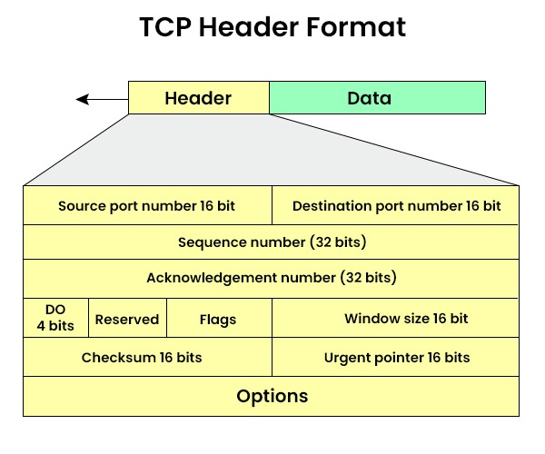

> #### 🔢 1. Sequence Number (in TCP)
>
> ###### ❓ What is it?
>
> A **Sequence Number** in TCP is a number assigned to each byte of data in a TCP connection. It **keeps track of which data has been sent and received** and in  **what order** .
>
> ###### 📦 Purpose:
>
> * Ensures  **data is delivered in order** .
> * Helps detect  **missing or duplicate packets** .
> * Supports **retransmission** if a packet is lost.
>
> ###### 🧠 Analogy:
>
> Imagine sending a **book through the post** page by page. You number every page — 1, 2, 3, … 100 — before putting each in an envelope. This way, the receiver can:
>
> * Know the correct order.
> * Realize if page 25 is missing.
> * Ask you to resend only that page.
>
> ###### 📘 Example:
>
> * You (client) are sending 1000 bytes of data to a server.
> * Initial Sequence Number (ISN) is 5000 (randomly chosen).
> * First packet has sequence number **5000** and contains 500 bytes.
> * Next packet will have sequence number  **5500** , and so on.
>
> The server **ACKs** the next expected byte:
>
> * So after getting 500 bytes starting at 5000, it will reply with `ACK = 5500`.
>
> #### ✅ 2. ACK Number (Acknowledgment Number)
>
> ###### ❓ What is it?
>
> The **ACK (Acknowledgment) Number** is the number that tells the sender:
>
>> “I have received everything **up to (but not including)** this byte number. Please start sending from here next.”
>>
>
> ###### 🧠 Analogy:
>
> You're reading a book your friend is sending you, one page at a time. After receiving pages 1 to 100, you send a message:
>
>> “ACK = 101” → meaning: “I got up to page 100; now send from page 101.”
>>
>
> ###### 📘 Example:
>
> 1. Client sends 500 bytes starting at **Sequence Number = 1000**
> 2. Server receives all 500 bytes correctly.
> 3. Server sends back: `ACK = 1500`
>
>    (meaning: “I got bytes 1000–1499. Send from 1500 next.”)
>
>> ✅ **ACK number = Next byte expected**
>>
>
> This helps ensure  **ordered, complete delivery** , and **helps retransmit lost packets.**
>
> #### ✅ 3. Checksum (in TCP, IP, etc.)
>
> ###### ❓ What is it?
>
> A **Checksum** is a value used to verify the **integrity of the data** — to ensure it hasn't been corrupted in transit.
>
> ###### ⚙️ How it works:
>
> 1. Sender runs a **checksum algorithm** over the data (e.g., a form of mathematical addition).
> 2. The result is added to the packet.
> 3. Receiver does the **same calculation** and compares the recevied data with the checksum received.
>    * If they match: data is fine.
>    * If not: data is **corrupted** and may be  **retransmitted** .
>
> ###### 🧠 Analogy:
>
> Imagine writing a letter and adding a total word count at the end: “This letter has 157 words.” The receiver can count the words to verify the message is complete and unchanged.
>
> ###### 🧪 Example:
>
> * TCP adds a 16-bit checksum for its header and data.
> * Suppose you send the text: "HELLO"
> * Each character gets converted to binary.
> * All values are added using a special rule (1's complement).
> * The final value (checksum) is stored in the header.
> * Receiver recomputes and checks.
>
> #### 🚩 4. TCP Flags
>
> ###### ❓ What are Flags?
>
> **TCP Flags** are 1-bit markers in the TCP header that control the connection state or describe the nature of the packet.
>
> ###### 🎌 Main TCP Flags (with explanation):
>
> | Flag          | Full Form      | Meaning                                     |
> | ------------- | -------------- | ------------------------------------------- |
> | **SYN** | Synchronize    | Used to initiate a connection               |
> | **ACK** | Acknowledgment | Used to acknowledge received data           |
> | **FIN** | Finish         | Used to terminate a connection              |
> | **RST** | Reset          | Immediately abort the connection            |
> | **PSH** | Push           | Deliver data to the application immediately |
> | **URG** | Urgent         | Marks data as urgent (rarely used)          |
>
> ##### 📶 Common Flag Combinations:
>
> ###### 1. **SYN**
>
> * First step of 3-way handshake
> * Meaning: “I want to start a connection.”
>
> ###### 2. **SYN + ACK**
>
> * Second step of handshake
> * Server replies: “Okay, I acknowledge your request and I want to connect too.”
>
> ###### 3. **ACK**
>
> * Used almost everywhere to confirm receipt
>
> ###### 4. **FIN + ACK**
>
> * Closing connection: “I’m done sending data.”
>
> ###### 5. **RST**
>
> * When a connection is invalid or crashes: “Terminate now!”
>
> ###### 🧱 Diagram: 3-Way Handshake
>
> ```text
> Client                    Server
>   | ---- SYN ---------->  |   (Seq = 1000)
>   | <--- SYN + ACK ------ |   (Ack = 1001, Seq = 2000)
>   | ---- ACK -----------> |   (Ack = 2001)
> Connection Established ✅
> ```

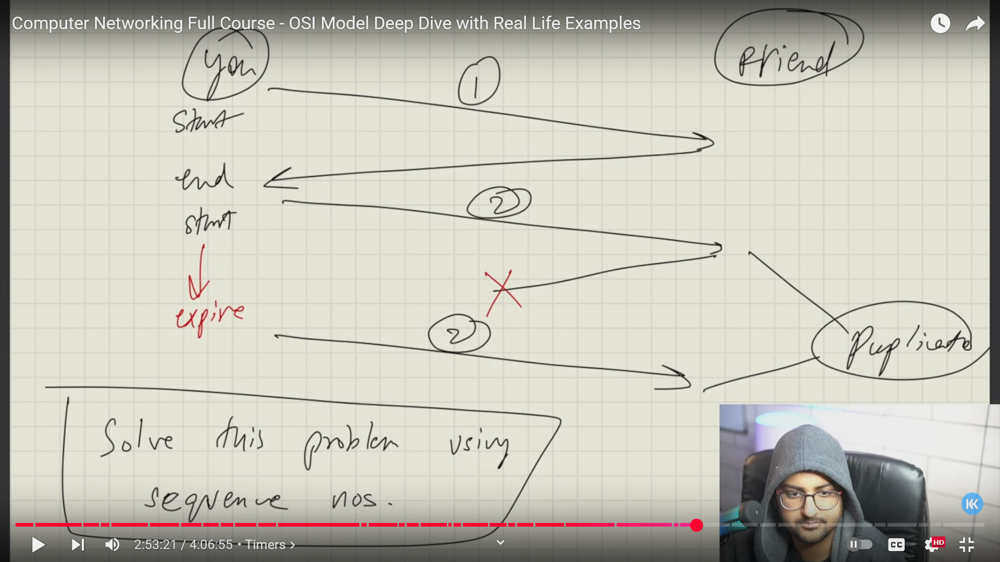

### 📦 Example in Real Life

Imagine you're sending a **letter (data)** over a  **reliable courier (TCP)** :

1. You call the courier to  **schedule pickup (SYN, SYN-ACK, ACK)** .
2. You send multiple pages,  **numbered** .
3. The recipient **confirms receipt** of each page.
4. If a page gets lost, you **resend** it.
5. When done, both of you agree the conversation is over.

## 🧭 Timers in TCP

Timers in TCP play a crucial role in ensuring  **reliable and efficient data transmission** . Let’s explore each TCP timer in detail — what it does, when it is triggered, and why it's important.

#### 🕒 What Are Timers in TCP?

TCP is a  **reliable transport protocol** , and it uses **timers** to:

* Detect **lost packets**
* Avoid **congestion**
* Recover from **network delays**
* Manage **connection states**

#### 🧭 Main TCP Timers

| Timer Name                                 | Purpose                                        | Trigger                        |
| ------------------------------------------ | ---------------------------------------------- | ------------------------------ |
| 1.**Retransmission Timer (RTO)**     | Detects lost segments                          | When a segment is sent         |
| 2.**Persist Timer**                  | Avoids deadlock when window size = 0           | When receiver's window is zero |
| 3.**Keepalive Timer**                | Checks if peer is still alive                  | During idle connections        |
| 4.**Time-Wait Timer**                | Ensures old duplicate packets don’t interfere | After connection termination   |
| 5.**Delayed ACK Timer**              | Waits before sending ACK (to piggyback)        | When receiving data            |
| 6.**Connection Establishment Timer** | Times out if SYN+ACK is not received           | During 3-way handshake         |

##### 🔁 1. Retransmission Timer (RTO)

* **Goal** : Retransmit if an ACK isn’t received in time.
* TCP calculates **RTO** based on  **RTT (Round-Trip Time)** .
* If no ACK arrives for a segment:
  * TCP waits `RTO` time.
  * Retransmits the segment.
  * Doubles the `RTO` (exponential backoff).

📌 Important for  **reliability** .

##### 🕳️ 2. Persist Timer

* **Problem** : Receiver advertises **window size = 0** (temporarily can’t accept data).
* If sender waits forever →  **deadlock** .
* **Solution** : Sender uses a persist timer to:
* Periodically send **window probes** (small packets).
* Wait for window size to open again.

📌 Prevents **deadlock** in communication.

##### 🧍 3. Keepalive Timer

* Used  **only in some systems** , not part of core TCP standard.
* Purpose: **Check if peer is still alive** when connection is idle for too long.
* If no activity:
  * TCP sends keepalive probes.
  * If no reply after several tries → connection closed.

📌 Helps in **detecting dead peers** (especially in long idle sessions).

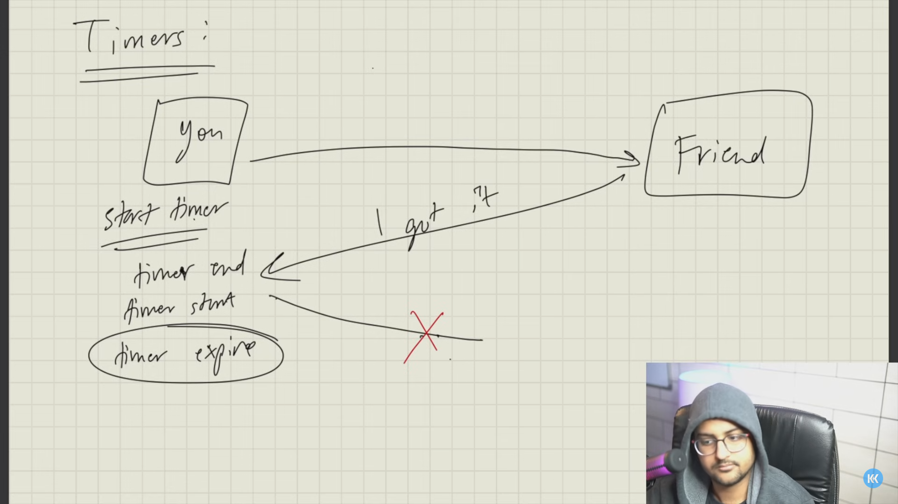

#### 🧠 Real-World Analogy

Imagine you’re sending parcels to a friend:

* If no reply in time → resend it ( **Retransmission** ).
* If they say "no more space at home" → you check in periodically ( **Persist** ).
* If friend goes silent → you call them to check ( **Keepalive** ).
* After closing a conversation → you wait to be sure it’s not reopened mistakenly ( **Time-Wait** ).
* You don’t reply instantly to every message → wait a bit to combine replies ( **Delayed ACK** ).
* If call isn’t answered in time → you hang up ( **SYN Timer** ).

### 📡 TCP is **full-duplex** and it operates **only between two endpoints (hosts)** during a connection.

##### ✅ **1. TCP is Full-Duplex**

**What does full-duplex mean?**

It means that **both ends (client and server)** can  **send and receive data at the same time** , over the same connection.

**🧠 Analogy:**

Imagine a phone call — both people can talk and listen simultaneously. That’s full-duplex.

TCP works similarly, unlike a walkie-talkie (which is half-duplex — only one party speaks at a time).

**Example in MERN:**

If your React frontend sends a request to your Node.js backend using HTTP (which runs over TCP), TCP allows:

* The **frontend to send** a request,
* And the **backend to start sending a response** even before the frontend has completely stopped transmitting (as long as protocol and app logic allow it).

##### ✅ **2. TCP is Connection-Oriented and Between Two Hosts**

* A **TCP connection** is strictly between **two endpoints** — the sender and the receiver.
* Each side is identified by  **IP + port** :
  * Client: IP₁:port₁
  * Server: IP₂:port₂

**This means:**

* It’s always a **point-to-point** connection (not multicast or broadcast).
* Multiple devices can’t share the same TCP connection, but multiple **parallel** TCP connections can be opened between various client-server pairs.

### 📚 Summary

| Property      | TCP                              |
| ------------- | -------------------------------- |
| Protocol Type | Connection-oriented              |
| Reliability   | Guaranteed (retransmission)      |
| Order of Data | Preserved                        |
| Speed         | Slower than UDP (but reliable)   |
| Use Cases     | HTTP/HTTPS, FTP, SMTP, SSH, etc. |

---

# ----UDP Protocol

✅ UDP (User Datagram Protocol) — Explained in Detail

UDP is a **transport layer protocol** like TCP, but it works very differently.

### ⚡ What is UDP?

UDP is a  **connectionless** ,  **lightweight** , and **fast** protocol. It sends data **without establishing a connection** and  **without guaranteeing delivery** , order, or error checking.

### 🔍 Key Characteristics of UDP

| Feature                         | Description                                               |
| ------------------------------- | --------------------------------------------------------- |
| **Connectionless**        | No handshake (no SYN, SYN-ACK, ACK like TCP)              |
| **Unreliable**            | No guarantee of delivery, order, or duplication handling  |
| **Fast and Lightweight**  | Minimal overhead (header is just 8 bytes)                 |
| **No Congestion Control** | It doesn’t slow down if the network is overloaded        |
| **No Acknowledgements**   | Sender doesn’t wait to know if the receiver got the data |

### 🧱 UDP Packet Structure

UDP header is simple — only 8 bytes (compared to TCP’s ~20 bytes minimum):

| Field            | Size    | Description                         |
| ---------------- | ------- | ----------------------------------- |
| Source Port      | 2 bytes | Port of sender                      |
| Destination Port | 2 bytes | Port of receiver                    |
| Length           | 2 bytes | Total length of UDP header + data   |
| Checksum         | 2 bytes | For basic error checking (optional) |

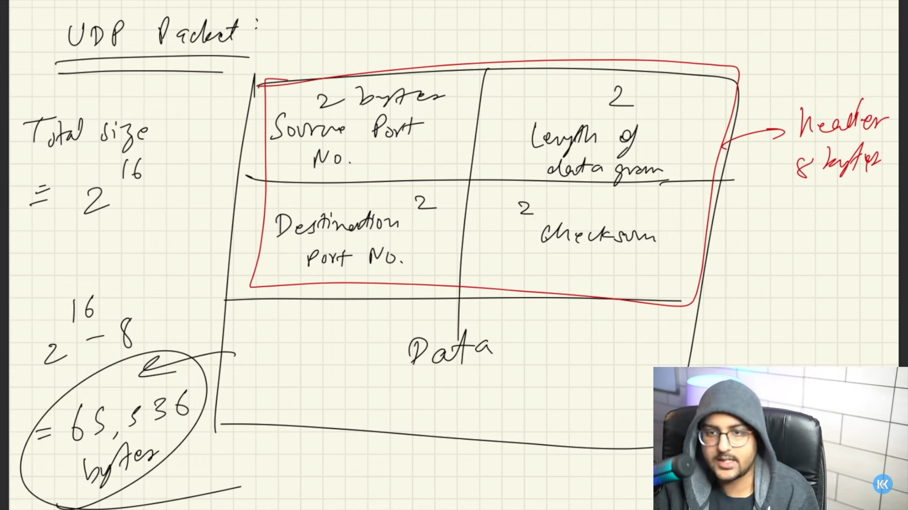

### 🔄 UDP vs TCP

| Feature     | TCP                                   | UDP                           |
| ----------- | ------------------------------------- | ----------------------------- |
| Connection  | Connection-oriented (3-way handshake) | Connectionless (no handshake) |
| Reliability | Reliable (ack, retransmission, order) | Unreliable (no guarantees)    |
| Speed       | Slower due to overhead                | Faster due to low overhead    |
| Use Cases   | Web, email, file transfers            | Video streaming, DNS, VoIP    |

### 🎯 Real-Life Examples Using UDP

| Application                     | Why it Uses UDP                                         |
| ------------------------------- | ------------------------------------------------------- |
| **Video/Voice Streaming** | Loss of a few packets is acceptable; speed matters more |
| **Online Gaming**         | Real-time updates preferred over reliability            |
| **DNS**                   | Needs fast queries; TCP would be too heavy              |
| **Live Broadcasts**       | Delay is worse than small data loss                     |

### 🧠 Analogy

Imagine you're **shouting messages** across a river:

* You **don’t wait** to see if the other person heard it.
* You just send the message and move on.
* If they didn’t catch it, it’s gone — but the process is fast.

That’s how UDP works.

### ⚠️ When *not* to use UDP?

* If data **must not be lost** (e.g., bank transactions)
* If **order of messages matters**
* If **error correction** is required

In such cases, TCP is the right choice.

---

# ----Routing

Routing is the process of selecting a path for traffic in a network or between networks. It plays a critical role in directing data packets from a source to a destination across interconnected networks like the internet.

### 🧭 What Is  **Routing** ?

Routing determines **how data is forwarded** from one network to another using a router. Routers examine the destination IP address in each packet and consult their **routing table** to determine the best next hop.

### 🔀 Two Broad Categories of Routing:

##### 1. **Static Routing**

* **Manually configured** by a network administrator.
* Good for  **small or simple networks** .
* Does **not change** automatically if network topology changes.

✅ Advantages:

* Predictable
* Low overhead

❌ Disadvantages:

* Doesn’t scale
* Manual reconfiguration on changes

##### 2. **Dynamic Routing**

* **Routers exchange information** with each other using routing protocols.
* Automatically adapts to  **topology changes** , link failures, or new routes.

✅ Advantages:

* Scalable
* Automatically adapts

❌ Disadvantages:

* More complex
* Consumes CPU, memory, and bandwidth

### 🧠 Types of Routing (Based on Scope):

##### 1. **Interior Routing (IGP - Interior Gateway Protocol)**

* Routing  **within a single organization (autonomous system)** .
* Examples:
  * RIP
  * OSPF
  * EIGRP
  * IS-IS

##### 2. **Exterior Routing (EGP - Exterior Gateway Protocol)**

* Routing **between different autonomous systems** (e.g., ISPs).
* Example:
  * **BGP (Border Gateway Protocol)**

### 🧱 Types of Dynamic Routing Protocols (Based on Algorithm)

##### 1. **Distance Vector Protocols**

* Routers exchange information about **distance (hops)** to destinations.
* Each router shares its **entire routing table** with neighbors.

🔧 Examples:

* RIP (Routing Information Protocol)
* IGRP (Cisco proprietary)

📉 Cons:

* Slower convergence
* Limited metrics (only hop count)

### 2. **Link-State Protocols**

* Routers **flood information** about their links (interfaces and status) to the entire network.
* Each router builds a **complete map of the network topology** and computes the best path using algorithms like Dijkstra’s.

🔧 Examples:

* OSPF (Open Shortest Path First)
* IS-IS

✅ Pros:

* Fast convergence
* Rich metrics (bandwidth, delay)

### 3. **Hybrid Protocols**

* Combine features of distance vector and link state.
* Maintain **neighbor relationships** and use more complex metrics.

🔧 Example:

* EIGRP (Enhanced Interior Gateway Routing Protocol, Cisco proprietary)

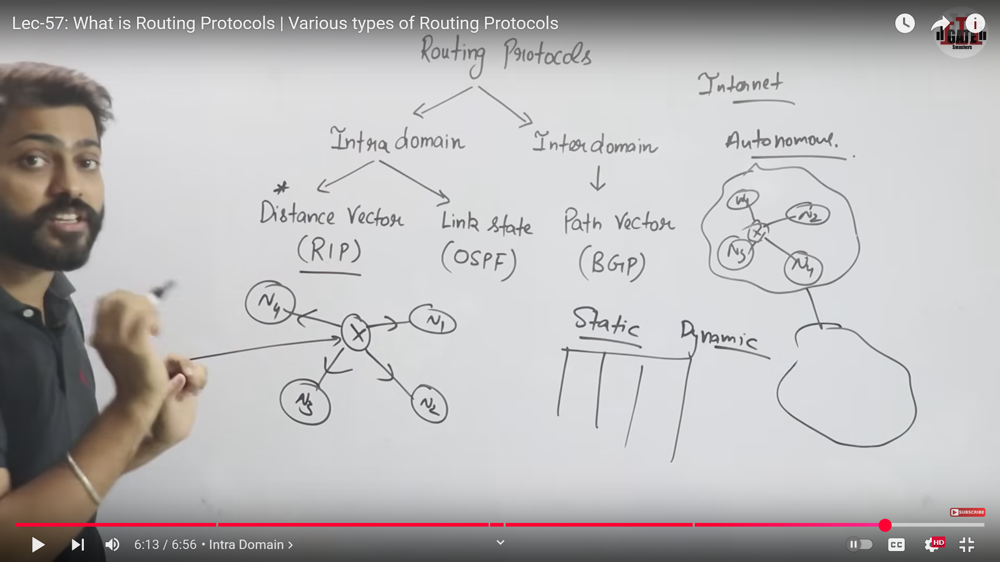

### 🌍 Key Routing Protocols Summary

| Protocol | Type | Algorithm       | Use Case            | Metric            |
| -------- | ---- | --------------- | ------------------- | ----------------- |
| RIP      | IGP  | Distance Vector | Small LANs          | Hop Count         |
| OSPF     | IGP  | Link-State      | Enterprise networks | Bandwidth         |
| EIGRP    | IGP  | Hybrid          | Cisco networks      | Bandwidth + delay |
| IS-IS    | IGP  | Link-State      | ISP cores           | Delay             |
| BGP      | EGP  | Path Vector     | Internet routing    | Policies, AS-path |

### 🧮 Metrics Used by Routing Protocols

| Metric      | Meaning                   |
| ----------- | ------------------------- |
| Hop count   | Number of routers crossed |
| Bandwidth   | Link speed                |
| Delay       | Latency across the path   |
| Load        | Current traffic           |
| Reliability | Link stability            |
| MTU         | Maximum Transmission Unit |

### 📊 Routing Table Entry Format (Simplified)

Each router maintains a **routing table** with entries like:

```
Destination     Next Hop     Interface     Metric
192.168.1.0     10.0.0.2     eth0          2
```

---

# ----Control Plane and Data Plane

### ✅ **What is the Control Plane?**

The **Control Plane** is one of the two primary components of a network device's architecture, the other being the **Data Plane** (sometimes called the Forwarding Plane). Let's break it down in simple, real-world terms, with analogies and relevance to MERN stack/devops as well.

The **Control Plane** is responsible for:

* **Making decisions about where traffic should be sent.**
* Building and maintaining the **routing tables** using **routing protocols** like RIP, OSPF, BGP, etc.
* Communicating with other routers to exchange network topology information.
* Managing the overall logic and policies of the network.

👉  **It controls how packets *should* flow** , not the actual data packets themselves.

### 🧠 Analogy: Control Plane vs Data Plane

Imagine a  **post office** :

* The **Control Plane** is like the *manager and sorting desk* deciding the best route to deliver letters.
* The **Data Plane** is the *postman* who actually carries and delivers the letters based on those decisions.

### 💡 Real-World Example (with context of the internet)

Let’s say you're using a MERN app and your server is hosted on AWS. When a request is made to your server:

* Routers along the way **consult their control plane** to find the best route.
* Once the best route is determined,  **data flows via the data plane** .

The **Control Plane updates itself regularly** to:

* Avoid failed paths
* Handle changes in network structure (new routers, down links)
* Use faster routes

### 📋 What does the Control Plane include?

1. **Routing Protocols** : RIP, OSPF, BGP, EIGRP
2. **Neighbor discovery** : Helps detect nearby routers
3. **Link-state database** : Tracks the network topology
4. **Policy Control** : Like access control lists, QoS rules, etc.

### 🔄 Control Plane vs Data Plane

| Aspect          | Control Plane                      | Data Plane                      |
| --------------- | ---------------------------------- | ------------------------------- |
| Role            | Decision maker (routing, policies) | Packet forwarding (actual data) |
| Protocols       | RIP, OSPF, BGP, ICMP               | IP, TCP, UDP                    |
| Speed           | Slower (brain work)                | Faster (muscle work)            |
| Type of Traffic | Routing updates                    | User data                       |

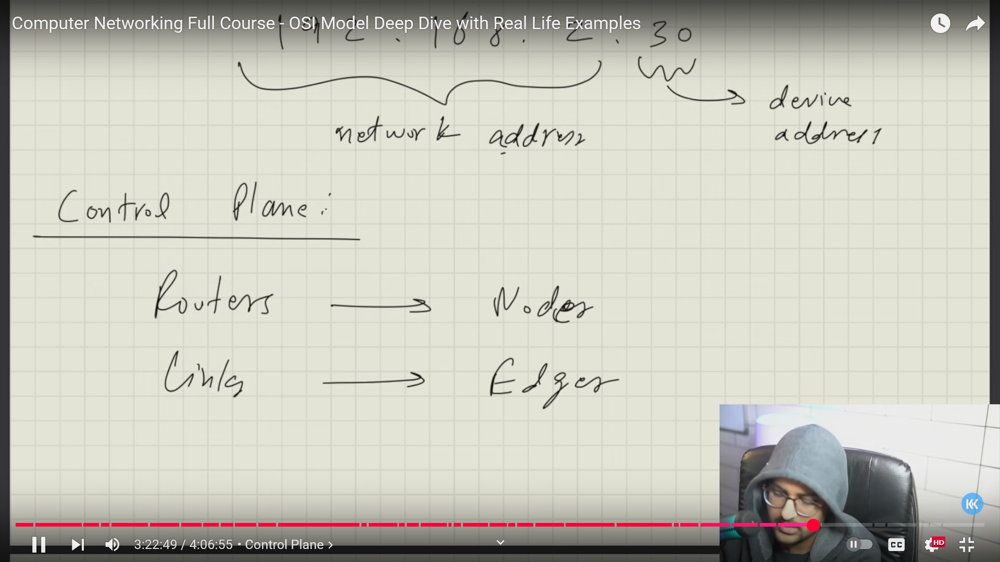

### 📦 In context of MERN/DevOps

As a MERN developer or DevOps engineer, you might not **directly interact** with the control plane, but understanding it helps when:

* Deploying apps to  **cloud providers (AWS, GCP)** .
* Setting up  **custom routing/VPC peering** .
* Working with  **firewalls, routers, load balancers** .
* Diagnosing  **network issues (ping, traceroute, packet drops)** .

### 🔐 Why can’t we avoid it?

Without the  **Control Plane** :

* Routers wouldn’t know where to send packets.
* Network paths wouldn't adapt to topology changes or failures.
* The internet would break the moment something changes.

Think of it as  **Google Maps** :

* Control Plane = Updates your map with current traffic.
* Data Plane = Actually drives your car.

---

# ----IP Address

🌐 What is an IP Address?

An **IP (Internet Protocol) address** is a **unique identifier** for a device on a network. It acts like the **postal address** of your computer in a digital world, allowing devices to **send and receive data** across networks like the internet.

### 📌 IPv4 (Internet Protocol version 4)

🔹 Format:

* IPv4 is a **32-bit** address.
* It’s written in  **decimal** , divided into **4 octets** (8 bits each), separated by dots.

✅ Example:

```
192.168.1.1
```

🔹 Behind the scenes (binary):

```
192      .    168      .      1       .     1
11000000 . 10101000 . 00000001 . 00000001
```

##### 🧩 Total Address Space

IPv4 supports:

```
2^32 = 4,294,967,296 addresses
```

That’s around 4.3 billion unique IPs. But due to reservations, not all are usable publicly.

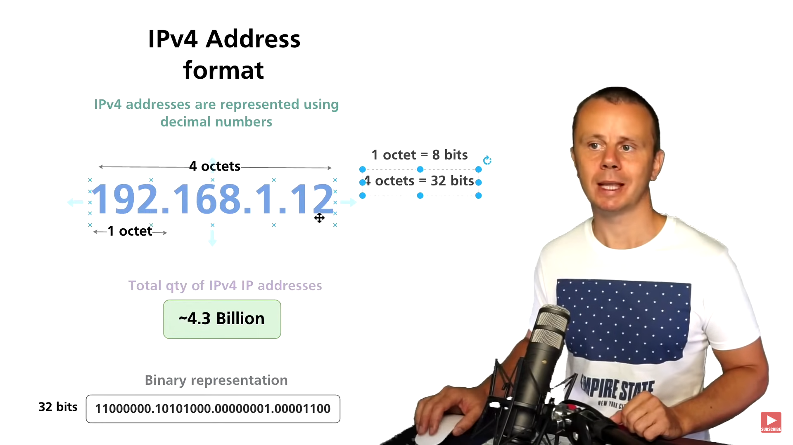

### 🔍 Components of an IPv4 Address

IPv4 addresses are split into:

1. **Network Portion** – Identifies the  **network** .
2. **Host Portion** – Identifies a **specific device** (host) on that network.

The **division** between network and host is determined by the  **subnet mask** .

### 🧠 Example with Subnet:

Let’s say:

* IP Address: `192.168.1.10`
* Subnet Mask: `255.255.255.0`

That means:

* Network portion: `192.168.1`
* Host portion: `10`
* So all devices in `192.168.1.x` are in the same local network.

### 🧱 IPv4 Address Classes (Old, still useful for basics)

| Class | Starting Bits | Range                        | Number of Hosts | Use Case              |
| ----- | ------------- | ---------------------------- | --------------- | --------------------- |
| A     | 0xxxxxxx      | 1.0.0.0 – 126.0.0.0         | 16 million      | Very large networks   |
| B     | 10xxxxxx      | 128.0.0.0 – 191.255.0.0     | 65,534          | Medium networks       |
| C     | 110xxxxx      | 192.0.0.0 – 223.255.255.0   | 254             | Small networks        |
| D     | 1110xxxx      | 224.0.0.0 – 239.255.255.255 | N/A             | Multicasting          |
| E     | 1111xxxx      | 240.0.0.0 – 255.255.255.255 | N/A             | Research/Experimental |

> Today, **CIDR (Classless Inter-Domain Routing)** is used instead of these rigid classes.

### 🛡️ Private vs Public IPv4 Addresses

🔐 Private IPs:

Reserved for local use inside private networks. **Not routable** on the internet.

| Range          | Use Case            |
| -------------- | ------------------- |
| 10.0.0.0/8     | Large networks      |
| 172.16.0.0/12  | Medium networks     |
| 192.168.0.0/16 | Small/home networks |

➡ These are used in your home Wi-Fi, LANs, etc.

➡ Devices with private IPs use **NAT (Network Address Translation)** to access the internet.

### ⚙️ Subnetting

Subnetting helps:

* Break a large network into smaller ones.
* Improve performance and security.

Example:

```
IP: 192.168.1.50
Subnet mask: 255.255.255.0
CIDR: /24
```

You can create **256 subnets** or control how many hosts per subnet you allow.

### 📤 Packet Delivery with IPv4

When you send a packet:

1. Your device checks the  **destination IP** .
2. Compares it with its own IP + subnet mask.
3. If same network → send directly.
4. Else → send to the  **default gateway/router** .

### 🧮 IPv4 Header (Important)

| Field            | Size    | Description                         |
| ---------------- | ------- | ----------------------------------- |
| Version          | 4 bits  | IP version (always 4 for IPv4)      |
| IHL              | 4 bits  | Header length                       |
| Type of Service  | 8 bits  | QoS preferences                     |
| Total Length     | 16 bits | Entire packet size                  |
| Identification   | 16 bits | For fragmentation                   |
| Flags + Offset   | 16 bits | Fragmentation details               |
| TTL              | 8 bits  | Time-to-live (how many hops left)   |
| Protocol         | 8 bits  | Next-level protocol (TCP=6, UDP=17) |
| Header Checksum  | 16 bits | Header error checking               |
| Source Address   | 32 bits | IP of sender                        |
| Destination Addr | 32 bits | IP of receiver                      |

### 🔄 Limitations of IPv4

1. **Address Exhaustion** – We’re out of public IPv4s, hence the push to IPv6.
2. **No inherent security** – Needs add-ons like IPSec.
3. **No QoS or mobility features** – Limited intelligence for routing modern apps.

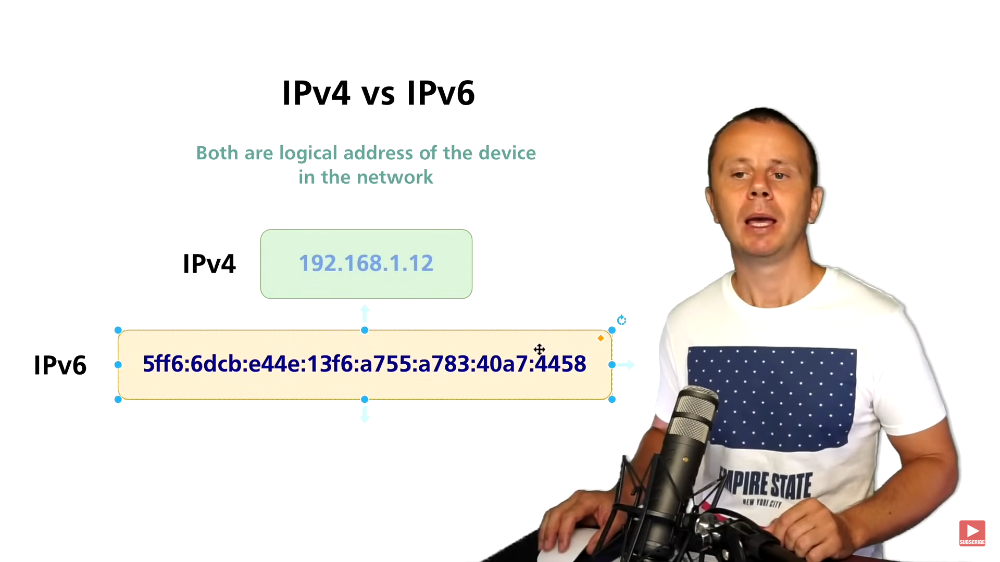

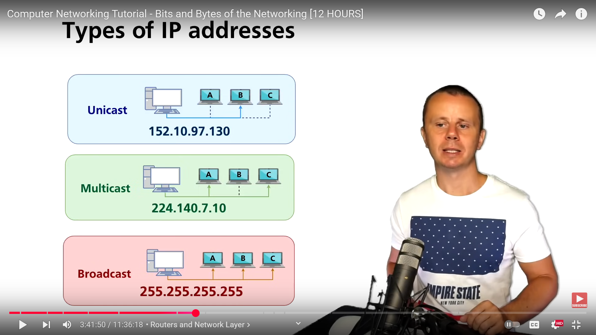

### 🧭 Summary

| Term           | Meaning                                         |
| -------------- | ----------------------------------------------- |
| IPv4 Address   | 32-bit identifier for devices                   |
| Format         | Dotted decimal (e.g., 192.168.0.1)              |
| Private Ranges | 10.x, 172.16.x, 192.168.x                       |
| Public IP      | Unique globally routable IPs                    |
| Subnet Mask    | Determines network vs host parts                |
| NAT            | Allows private IPs to communicate with internet |
| Header         | Contains TTL, checksum, protocol, etc.          |

---

# Subnet, Subnet Mask and CIDR

What is a Subnet?

A **subnet** (short for  *sub-network* ) is a smaller network created from a larger IP network. Subnetting divides an IP address space into multiple logical networks. This helps with efficient IP address allocation and improves routing performance and security.

### 📦 Analogy: Office Building

Think of a company’s office building:

* The entire **building** = One IP network (e.g., `192.168.0.0/24`)
* Each **floor** = A **subnet** (e.g., 1st floor = `192.168.0.0/26`, 2nd floor = `192.168.0.64/26`)
* People on each floor can easily talk to each other.
* To talk to someone on another floor, you use the **building's directory system** (router).

### 🔢 IP Address Breakdown (IPv4)

An IPv4 address has  **32 bits** , usually written in dotted-decimal like `192.168.1.10`.

Example:

```
192.168.1.10 = 11000000.10101000.00000001.00001010 (binary)
```

An IP address consists of:

* **Network portion** : Identifies the network
* **Host portion** : Identifies a specific device (host) within that network

The **subnet mask** decides where the boundary lies.

### 🧠 What is a Subnet Mask?

It defines which part of an IP address is the **network part** and which part is the  **host part** .

Example:

* IP: `192.168.1.10`
* Subnet Mask: `255.255.255.0` → means first 24 bits are network bits.

### 🔧 CIDR Notation

Instead of writing the full subnet mask, we use  **CIDR (Classless Inter-Domain Routing)** :

* `192.168.1.10/24` → 24 bits = network part, 8 bits = host part

### ✂️ Subnetting in Action

Let’s say we have a network `192.168.1.0/24` with 256 IPs.

We want to create  **4 subnets** . We need 2 extra bits (because 2² = 4):

* Subnet mask becomes: `255.255.255.192` → `/26`
* Each subnet will have: `64 IP addresses`

| Subnet # | Network Address  | IP Range             | Broadcast Address |
| -------- | ---------------- | -------------------- | ----------------- |
| 1        | 192.168.1.0/26   | 192.168.1.1 - .62    | 192.168.1.63      |
| 2        | 192.168.1.64/26  | 192.168.1.65 - .126  | 192.168.1.127     |
| 3        | 192.168.1.128/26 | 192.168.1.129 - .190 | 192.168.1.191     |
| 4        | 192.168.1.192/26 | 192.168.1.193 - .254 | 192.168.1.255     |

> Let’s break this down clearly:
>
> ##### 🔢 Starting Point:
>
> You had a **/24** network →
>
> `192.168.1.0/24` = 256 IPs (`2^8`)
>
> ##### 🎯 Goal:
>
> Create **4 subnets**
>
> To do that, you need to borrow **2 bits** from the host portion:
>
> `2^2 = 4` subnets
>
> So, the new subnet mask is `/26`, which means:
>
> * Subnet mask: `255.255.255.192` ie 255.255.255.xxyyyyyy . Here xx can be 01, 10, 11, 00  ie 4 Subnets
> * Each subnet has `2^(32-26) = 64` IPs (but only 62 usable, because 2 are reserved for **network** and  **broadcast** -----EXPLAINED LATER)
>
> ##### 📊 What we *could* do:
>
> You could break this network further (up to 64 subnets if you went all the way to `/30`), but in this case, you chose **only 2 bits** (making 4 subnets) and used all of them.
>
> | Subnet | Network                                    | IP Range                       | Broadcast     |
> | ------ | ------------------------------------------ | ------------------------------ | ------------- |
> | 1      | 192.168.1.0/26 ie 192.168.1.00yyyyyy/26   | 192.168.1.1 – 192.168.1.62    | 192.168.1.63  |
> | 2      | 192.168.1.64/26 ie 192.168.1.01yyyyyy/26  | 192.168.1.65 – 192.168.1.126  | 192.168.1.127 |
> | 3      | 192.168.1.128/26 ie 192.168.1.10yyyyyy/26 | 192.168.1.129 – 192.168.1.190 | 192.168.1.191 |
> | 4      | 192.168.1.192/26 ie 192.168.1.11yyyyyy/26 | 192.168.1.193 – 192.168.1.254 | 192.168.1.255 |
>
> ✅ In Brief:
>
> * You could have **chosen** to create fewer than 4 subnets (e.g., 2), by borrowing only 1 bit.
> * You could also have created **more** (e.g., 8 subnets using 3 bits).
> * But in the given case, you  **borrowed 2 bits → created 4 subnets → and used all 4** .
>
> #### 📌 Explanation In Detail
>
> 🔹 First, remember:
>
> You are starting with a  **`/24` network** , which means:
>
> * IP range: `192.168.1.0 – 192.168.1.255`
> * Total IPs: **256**
> * Subnet mask: **255.255.255.0**
> * Number of  **host bits** : 8 (since 32 total bits - 24 network bits = 8 host bits)
>
> ##### 🔸 Why did we "take 2 extra bits"?
>
> To divide this `/24` network into  **4 subnets** , you need to *borrow* **bits from the host part** and give them to the subnet part.
>
> * 2 bits can create `2² = 4` combinations → so you can get **4 subnets**
> * You’re still inside the original 8 host bits, but now:
>   * **2 bits** are used for subnetting
>   * Remaining **6 bits** are for hosts in each subnet
>
> That gives:
>
> * Subnet mask: `255.255.255.192` → `/26`
> * Each subnet has `2⁶ = 64` IPs (including 1 network and 1 broadcast address → 62 usable)
>
> ##### 🔸 Why not just use the existing 8 bits?
>
> Because those 8 bits (in `/24`) are  **host bits by default** .
>
> If you want to divide the network into subnets,  **you must sacrifice some host bits** .
>
> So the **"2 extra bits"** aren’t additional — they’re borrowed from the **8 host bits** you already had.
>
> ##### ✅ Analogy:
>
> Think of a `/24` block as a street with  **256 houses** .
>
> You want to split it into 4 small colonies.
>
> To do this, you decide:
>
> * I’ll use **2 digits of the house number** to say which colony (subnet) it belongs to
> * The remaining digits tell the house number inside that colony
>
> You're **not adding** anything — you're just **repurposing 2 digits** from house numbers for colony IDs.
>
> ✅ Summary:
>
> * You're not "taking extra bits" on top of the 8 — you're **borrowing** 2 bits **from the host part**
> * You still have only 8 bits total for subnet + host
> * Those 2 bits divide the space into **4 logical subnets**
> * The remaining 6 bits give each subnet 64 IPs
>
> #### 👉 Example 2
>
> ##### `192.168.1.0/24`
>
> 📦  **CIDR Notation** : `/24`
>
> This means:
>
> * **24 bits for the network portion**
> * **8 bits left for the host portion** (because IPv4 = 32 bits total)
>
> **🧮 Subnet and Host Details:**
>
> * **Subnet mask** : `255.255.255.0`
>
>   Binary: `11111111.11111111.11111111.00000000`
> * **Network portion** = first **24 bits** → `192.168.1`
> * **Host portion** = last **8 bits** → used for host addresses
>
> 📊 So:
>
> | Metric                            | Value                                                         |
> | --------------------------------- | ------------------------------------------------------------- |
> | **Number of subnets**       | 1 (this is**just one subnet** )                         |
> | **Number of host bits**     | 8 bits                                                        |
> | **Host addresses possible** | 2⁸ =**256 total**                                      |
> | **Usable host IPs**         | **256 - 2 = 254**usable IPs                             |
> | **Why -2?**                 | One for**network address** , one for**broadcast** |
>
> **🔍 Breakdown:**
>
> * **Network address** : `192.168.1.0`
>
>   (Not assignable to any device — it identifies the subnet itself)
> * **Broadcast address** : `192.168.1.255`
>
>   (Used to send messages to **all** devices on this subnet)
> * **Usable range** :
>
>   `192.168.1.1` to `192.168.1.254`
>
> So, in your example:
>
>> ✅ There is  **1 subnet** , and it allows for  **254 usable host IPs** .
>>
>
> #### 👉 Example 3
>
> ##### **`192.168.1.0/25`**
>
> **📘 CIDR `/25` Means:**
>
> * IPv4 = 32 bits total
> * `/25` →  **25 bits for network** , **7 bits for host**
>
> **🧮 Calculations:**
>
> | Metric                                  | Value                                                                        |
> | --------------------------------------- | ---------------------------------------------------------------------------- |
> | **Subnet mask**                   | `255.255.255.128`                                                          |
> | **Network bits**                  | 25                                                                           |
> | **Host bits**                     | 7                                                                            |
> | **Total IPs per subnet**          | 2⁷ =**128 IPs**                                                       |
> | **Usable hosts**                  | 128 - 2 =**126**                                                       |
> | **Number of subnets**(within /24) | 21 =**2**(because you're borrowing 1 bit from host portion of `/24`) |
>
> **🔍 Subnets inside `192.168.1.0/24`:**
>
> You're dividing a `/24` into **2** `/25` subnets:
>
> 🔹 **First Subnet:**
>
> * **Network address** : `192.168.1.0`
> * **Broadcast address** : `192.168.1.127`
> * **Usable host range** : `192.168.1.1` → `192.168.1.126`
>
> 🔹 **Second Subnet:**
>
> * **Network address** : `192.168.1.128`
> * **Broadcast address** : `192.168.1.255`
> * **Usable host range** : `192.168.1.129` → `192.168.1.254`
>
> 🧠 Analogy:
>
> Think of `192.168.1.0/24` as **one full pizza with 256 slices** (0–255).
>
> If you subnet it as `/25`, you're slicing that pizza into  **two equal halves** :
>
> * First half: slices 0–127
> * Second half: slices 128–255
>
> Each half (subnet) gets:
>
> * 1 slice for "network name" (start of the half)
> * 1 slice for "broadcast" (end of the half)
> * Remaining 126 slices for actual users/devices
>

### 📡 Why Subnetting?

1. **Efficient IP usage** : Avoid wasting IPs
2. **Improves performance** : Reduces broadcast traffic
3. **Better security** : Segregate network sections
4. **Scalability** : Easy to grow in organized chunks

### 💻 In Context of a MERN Stack App (Deployment)

Imagine you're deploying your MERN app on a VPC (Virtual Private Cloud):

* **Backend server** : In Subnet A (192.168.1.0/24)
* **Database server** : In Subnet B (192.168.2.0/24)
* **Frontend/React** : Served from another subnet or via CDN

Communication is tightly controlled between subnets, often via  **routing tables and firewalls** . Subnetting keeps services secure and isolated.

### 🚀 Every IP Subnt Reserves 2 Special Addresses

Every **IP subnet** (range of IPs) reserves  **2 special addresses** :

1. **Network Address** (first IP)
2. **Broadcast Address** (last IP)

##### 🔸 1. Network Address

* This is the **first IP** in the subnet.
* It  **identifies the subnet itself** , not a device.
* Used by routers and systems to  **refer to the whole subnet** .

🧠 Think of it like:

> “This is *Subnetwork A* as a whole.”

##### 🔸 2. Broadcast Address

* This is the **last IP** in the subnet.
* It's used to send a message to **all devices** in the subnet.

🧠 Think of it like:

> “Hey everyone in Subnetwork A — here's a message for all of you!”

##### ✅ Example with Subnet `/26`:

You have the subnet:

`192.168.1.0/26` → 64 IPs total → range: `192.168.1.0` to `192.168.1.63`

| Type                        | IP Address                        |
| --------------------------- | --------------------------------- |
| **Network address**   | `192.168.1.0`                   |
| **Usable host IPs**   | `192.168.1.1`→`192.168.1.62` |
| **Broadcast address** | `192.168.1.63`                  |

So, even though the subnet has  **64 total IPs** , only  **62 are usable for devices** .

> #### ❓ Why first and last subnet in `192.168.1.0/26` is `192.168.1.0` and `192.168.1.63`
>
> 🔹 What does `/26` mean?
>
> * An IPv4 address has 32 bits.
> * `/26` means:
>   * First **26 bits** = **network part**
>   * Remaining **6 bits** = **host part**
>
> 🔹 So how many host IPs in a /26 subnet?
>
> * With  **6 bits for host** , you get:
>
>   `2^6 = 64` total IPs
>
> These 64 IPs start from the base IP of the subnet (here: `192.168.1.0`) and go up sequentially.
>
> 🔹 Range of IPs in `192.168.1.0/26`
>
> Let’s convert `.0` to binary:
>
> ```
> 192.168.1.0 → binary = 11000000.10101000.00000001.00000000
>                                   ^ Host portion is last 6 bits
> ```
>
> If you increment those **6 host bits** from `000000` to `111111` (0 to 63 in decimal), the range becomes:
>
> * **First IP (network)** : `192.168.1.0`
> * **Last IP (broadcast)** : `192.168.1.63`
>
> ✅ Correct broadcast address: **`192.168.1.63`**
>
> ##### 🔻 Why last subnet as  `192.168.1.192` ie `192.168.1.11yyyyyy` wrong?
>
> Let’s break down `192.168.1.192` in binary:
>
> ```
> 192 = 11000000 → BUT in the *last* octet, 192 = 11000000
> ```
>
> So `192.168.1.192` is part of a  **different subnet** :
>
> * It actually belongs to `192.168.1.192/26` (which ranges from `192.168.1.192` to `192.168.1.255`)
>
> ✅ Summary
>
> | Subnet               | Range of IPs                         | Broadcast         |
> | -------------------- | ------------------------------------ | ----------------- |
> | `192.168.1.0/26`   | `192.168.1.0`–`192.168.1.63`    | `192.168.1.63`  |
> | `192.168.1.64/26`  | `192.168.1.64`–`192.168.1.127`  | `192.168.1.127` |
> | `192.168.1.128/26` | `192.168.1.128`–`192.168.1.191` | `192.168.1.191` |
> | `192.168.1.192/26` | `192.168.1.192`–`192.168.1.255` | `192.168.1.255` |

##### 🎯 Why are they reserved?

* The **network address** is used internally by routing logic to identify the subnet.
* The **broadcast address** is needed for communication to all hosts — e.g., DHCP discover messages.

Without reserving these two, communication wouldn't work properly.

---

# ----CIDR

✅ Why were **IPv4 Address Classes** created originally?

When the internet was young, we needed a way to **divide** the 4.3 billion IPv4 addresses into different  **sizes of networks** . That’s where **IP classes** came in:

| Class | Default Subnet Mask | Host Capacity     | Use Case        |
| ----- | ------------------- | ----------------- | --------------- |
| A     | 255.0.0.0           | ~16 million hosts | Huge networks   |
| B     | 255.255.0.0         | ~65,000 hosts     | Medium networks |
| C     | 255.255.255.0       | 254 hosts         | Small networks  |

These **"classful" networks** were simple — you looked at the **first few bits** of an IP to tell which class it belonged to, and therefore how big the network was.

### ❌ What was the problem with IP address classes?

1.**Wastage of IPs** :

* A company that needed only 1000 hosts couldn’t fit in a Class C (only 254 hosts), so they had to take a whole **Class B** — wasting  **~64,000 IPs** .

2.**Inflexibility** :

* You were **stuck with fixed sizes** — Class A, B, or C. No in-between sizes like 3000 or 100 hosts.

3.**Exhaustion** :

* Because of this rigid allocation, **IPv4 addresses were running out** much faster than needed.

🧠 Solution: **CIDR (Classless Inter-Domain Routing)**

> 📅 Introduced in 1993 to  **replace classful addressing** .

### 💡 What is CIDR?

CIDR is a way to **allocate IP addresses more efficiently** using  **variable-length subnet masks (VLSM)** .

Instead of being stuck with A, B, or C, CIDR lets you specify how many bits are for the  **network part** , using a `/` notation:

```
Example: 192.168.1.0/26
```

This means:

* First **26 bits** are network bits
* Remaining **6 bits** are host bits
* So you get `2^6 = 64` IPs in that subnet

### ✅ Benefits of CIDR:

1. **Precise allocation** (give only as many IPs as needed)
2. **Prevents IP wastage**
3. **Enables route aggregation** (supernetting → fewer routing table entries)
4. **Flexible subnetting** for both large and small networks

### 🆚 Comparison: Classes vs CIDR

| Feature             | IP Classes                  | CIDR                    |
| ------------------- | --------------------------- | ----------------------- |
| Fixed sizes         | Yes (A, B, C)               | No (you define with /n) |
| Wastes IP addresses | Often                       | Much less               |
| Format              | Based on IP’s first bits   | IP + slash (e.g., /24)  |
| Subnetting ease     | Limited (must follow class) | Highly flexible         |
| Introduced in       | 1980s                       | 1993                    |

### 🧱 Analogy:

* **Classful IPs** : Like buying shirts in just S, M, L sizes — not everyone fits perfectly.
* **CIDR** : Like tailoring your shirt to fit  **exactly** .

### Summary

* **IPv4 Classes** were a **first-generation system** for dividing IP space.
* **CIDR** replaced it to allow  **flexibility and avoid waste** .
* CIDR lets us define **custom network sizes** using `/` notation and subnet masks.

---

# IP Address and its Uniqueness

✅ Is every IP address **unique** globally?

### 🔹 **Public IP addresses** – YES ✅

* These  **are unique globally** .
* They are assigned by **IANA** (Internet Assigned Numbers Authority) and **RIRs** (Regional Internet Registries).
* When your device connects to the internet directly (e.g., a server or your router's WAN interface), it uses a  **public IP address** , and **no one else in the world** should have that same address at the same time.

### 🔸 **Private IP addresses** – NO ❌

* These are  **not globally unique** .
* They are used **inside local networks** (like homes, schools, offices).
* Multiple networks across the planet can use the  **same private IP ranges** , like:
  * `10.0.0.0 – 10.255.255.255`
  * `172.16.0.0 – 172.31.255.255`
  * `192.168.0.0 – 192.168.255.255`

➡️ These are **reused** again and again in  **different private networks** , and are **not routable** on the internet directly.

### 🌐 Example:

You could have:

* Your home laptop: `192.168.1.5`
* A friend's laptop: `192.168.1.5`
* A company’s printer: `192.168.1.5`

All three are fine because they are on  **different private networks** .

### ⚠️ But what about conflicts?

* **Public IPs** must be unique – or there would be confusion in routing over the internet.
* **Private IPs** must be unique  **within the same local network** , or you get an  **IP conflict error** .

### 🔁 Bonus: What allows private IPs to work online?

> **NAT (Network Address Translation)**

Your router **translates** all your internal private IP addresses (e.g., `192.168.1.x`) to a **single public IP** when going online.

### ✅ Summary

| IP Type    | Globally Unique? | Usable on Internet? | Example                 |
| ---------- | ---------------- | ------------------- | ----------------------- |
| Public IP  | ✅ Yes           | ✅ Yes              | `8.8.8.8`(Google DNS) |
| Private IP | ❌ No            | ❌ No               | `192.168.1.1`         |

---

# ----ICMP

**ICMP (Internet Control Message Protocol)** is a supporting protocol in the IP suite. It's mainly used for **sending error messages** and **operational information** indicating success or failure when communicating with another IP address.

### 🔧 Purpose of ICMP:

ICMP does **not** transmit data between systems. Instead, it’s used by network devices— **routers, hosts, etc.** —to:

* Report errors in communication.
* Provide diagnostic functions (like **ping** and  **traceroute** ).

### 📦 ICMP Works With IP

* It’s part of the **IP layer (Layer 3)** but is considered **Layer 3.5** sometimes because it supports network operations.
* ICMP packets are encapsulated inside  **IP packets** .

### 📩 Common ICMP Message Types:

| ICMP Type                             | Description                                          |
| ------------------------------------- | ---------------------------------------------------- |
| **0 (Echo Reply)**              | Reply to a ping request                              |
| **3 (Destination Unreachable)** | Sent if a destination can’t be reached              |
| **5 (Redirect)**                | Sent by a router if a better route exists            |
| **8 (Echo Request)**            | Sent by ping to test reachability                    |
| **11 (Time Exceeded)**          | Sent when a packet's TTL hits 0 (used by traceroute) |

### ⚙️ Example: Ping

When you run:

```bash
ping google.com
```

* Your computer sends **ICMP Echo Request** packets.
* Google replies with **ICMP Echo Reply** packets.
* This checks if the destination is reachable and measures round-trip time.

### ❌ ICMP and Security

Some administrators **block ICMP** at firewalls to:

* Prevent network mapping by attackers.
* Avoid ping flood DoS attacks.

However, overblocking can make diagnosing issues harder.

### 🧠 Analogy

Think of IP as a delivery truck, and ICMP as a  **note left by the delivery driver** :

* “Address doesn’t exist” → Destination unreachable.
* “Try using this other road” → Redirect.
* “Couldn’t reach in time” → Time exceeded.

### ✅ Summary:

* ICMP helps maintain and troubleshoot network communication.
* It doesn’t carry user data.
* Tools like `ping` and `traceroute` depend on ICMP.
* It’s tightly integrated with IP for error messaging and control.

---

# ----Network Interfaces

✅ What is a  **Network Interface** ?

A **network interface** is a **hardware or software component** that connects a computer or device to a network. It is the point where the system **sends or receives data to/from a network** (like the Internet or a local network).

### 🧱 Types of Network Interfaces:

| Type                          | Description                                                                             |
| ----------------------------- | --------------------------------------------------------------------------------------- |
| **Physical Interfaces** | Actual hardware like Ethernet cards, Wi-Fi adapters, etc.                               |
| **Virtual Interfaces**  | Software-defined interfaces like `lo`(loopback), VPN interfaces, Docker bridges, etc. |

### 🧩 Examples of Interfaces:

| Interface   | Description                                                 |
| ----------- | ----------------------------------------------------------- |
| `eth0`    | First Ethernet interface (wired LAN)                        |
| `wlan0`   | First Wireless LAN interface (Wi-Fi)                        |
| `lo`      | Loopback interface (127.0.0.1) for internal communication   |
| `tun0`    | VPN interface (via tunneling)                               |
| `docker0` | Bridge interface created by Docker for container networking |

### 🔗 Key Components of a Network Interface:

1. **MAC Address** – Unique hardware address used in local communication (Layer 2).
2. **IP Address** – Logical address assigned to the interface (Layer 3).
3. **Subnet Mask** – Defines the network and host portion of the IP.
4. **MTU (Maximum Transmission Unit)** – The largest packet size the interface can handle.

### 💡 What Does It Actually Do?

Let’s say you're on a laptop:

* Your Wi-Fi card is a  **network interface** .
* It gets an IP address from the router.
* When you visit `google.com`, your request goes through this interface.
* Similarly, responses from the Internet come  **into your system via this interface** .

### 🖥️ Commands to View Interfaces:

On  **Linux/macOS** :

```bash
ifconfig     # deprecated, but still used
ip a         # modern way
```

On  **Windows** :

```powershell
ipconfig /all
```

### 📦 Virtual Interfaces (Advanced Note):

Used for things like:

* Docker containers (`veth` pairs)
* Bridges (e.g., `br0`)
* VPN tunnels (`tun`, `tap`)
* VLAN interfaces (`eth0.10`, for VLAN ID 10)

### 🧠 Analogy:

Think of your **network interface** as the **doorway** of your house:

* If your device is your house...
* The network interface is the **door** where messages come in and go out.
* You can have multiple doors (interfaces) – wired, wireless, virtual, etc.

---
