# ----Introduction

### 🔹 What is GitHub Actions?

GitHub Actions is  **GitHub’s built-in CI/CD (Continuous Integration / Continuous Deployment) system** .

It lets you **automate workflows** directly inside your GitHub repository.

* Whenever something happens in your repo (like a `push`, `pull request`, or `issue created`), GitHub Actions can automatically **run jobs** like:
  * Run tests
  * Build the app
  * Deploy to AWS/Heroku/Vercel
  * Run linting/security scans
  * Send notifications (Slack, email, etc.)

### 🔹 Core Concepts

##### 1. **Workflow**

* A **workflow** is an automated process defined in a YAML file inside `.github/workflows/`.
* Each workflow has:
  * **Triggers (events)** → when it runs
  * **Jobs** → what tasks it does
  * **Steps** → actual commands to execute

**👉 Example workflow file: `.github/workflows/ci.yml`**

```yaml
name: CI Workflow

on: [push, pull_request]   # Triggers: runs on every push and PR

jobs:
  build-and-test:
    runs-on: ubuntu-latest  # Runner (machine where job runs)
    steps:
      - name: Checkout code
        uses: actions/checkout@v3

      - name: Setup Node.js
        uses: actions/setup-node@v4
        with:
          node-version: 18

      - name: Install dependencies
        run: npm install

      - name: Run tests
        run: npm test
```

##### 2. **Events (Triggers)**

Workflows start based on  **events** :

* `push` → code pushed to branch
* `pull_request` → PR opened/updated
* `schedule` → CRON jobs (e.g., run daily)
* `workflow_dispatch` → manually triggered
* `release` → when a GitHub Release is created
* `issue_comment`, `pull_request_review`, etc.

**👉 Example:**

```yaml
on:
  push:
    branches: [main]
  pull_request:
    branches: [develop]
  schedule:
    - cron: "0 0 * * 1" # Runs every Monday at 00:00 UTC
```

##### 3. **Jobs**

* Each **job** is a collection of  **steps** .
* Jobs **run in parallel by default** (but you can define dependencies).
* Each job runs on a **runner** (VM/container).

👉 Example:

```yaml
jobs:
  build:
    runs-on: ubuntu-latest
    steps:
      - run: echo "Building app"

  test:
    runs-on: ubuntu-latest
    needs: build    # run only after 'build' job finishes
    steps:
      - run: echo "Running tests"
```

##### 4. **Steps**

* A step is a single task (shell command or prebuilt action).
* Steps can **reuse actions** (from GitHub Marketplace) or run custom shell commands.

👉 Example:

```yaml
steps:
  - name: Checkout repository
    uses: actions/checkout@v3

  - name: Run custom script
    run: echo "Hello World"
```

##### 5. **Runners**

* A **runner** is the server that executes your workflow jobs.
* Types:
  * **GitHub-hosted runners** (default) → Ubuntu, Windows, macOS VMs provided by GitHub
  * **Self-hosted runners** → Your own machine or server

👉 Example:

```yaml
runs-on: ubuntu-latest   # GitHub-hosted runner
```

##### 6. **Actions**

* **Actions** are reusable units of code.
* Example: `actions/checkout`, `actions/setup-node`
* You can write your own custom actions in JavaScript or Docker.

##### 7. **Artifacts & Caching**

* **Artifacts** → files created during jobs that can be uploaded/downloaded later.
* **Cache** → speeds up workflows by caching dependencies.

👉 Example cache for Node.js:

```yaml
- name: Cache node modules
  uses: actions/cache@v3
  with:
    path: ~/.npm
    key: ${{ runner.os }}-node-${{ hashFiles('**/package-lock.json') }}
    restore-keys: |
      ${{ runner.os }}-node-
```

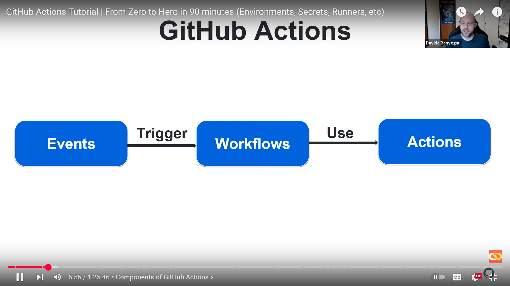

### 🔹 Example CI/CD Flow

Imagine a Node.js app:

1. Run on every `push` to `main`
2. Install deps → Run tests → Build app → Deploy to Heroku

```yaml
name: CI/CD Pipeline

on:
  push:
    branches: [main]

jobs:
  test:
    runs-on: ubuntu-latest
    steps:
      - uses: actions/checkout@v3
      - uses: actions/setup-node@v4
        with:
          node-version: 18
      - run: npm install
      - run: npm test

  build:
    runs-on: ubuntu-latest
    needs: test
    steps:
      - uses: actions/checkout@v3
      - run: npm run build

  deploy:
    runs-on: ubuntu-latest
    needs: build
    steps:
      - uses: actions/checkout@v3
      - name: Deploy to Heroku
        run: echo "Deployment script here"
```

### 🔹 Advantages of GitHub Actions

✅ Native integration with GitHub (no external CI tool needed)

✅ Huge library of prebuilt actions (Marketplace)

✅ Supports any language (Node, Python, Java, Go, etc.)

✅ Works for both private & public repos

✅ Can automate  **anything** , not just CI/CD (like issues, labels, notifications)

### 👉 So, in simple terms:

**GitHub Actions = Automation tool inside GitHub for CI/CD + general workflows.**

---

# ----Some GUI elements

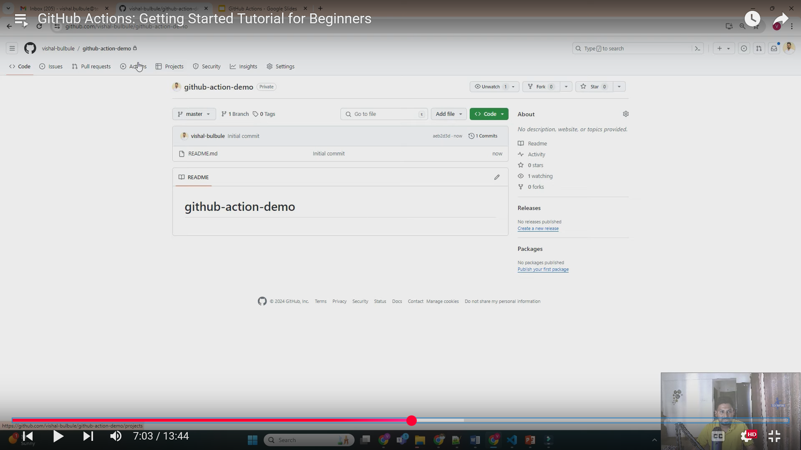

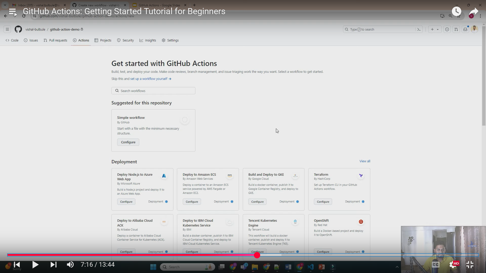

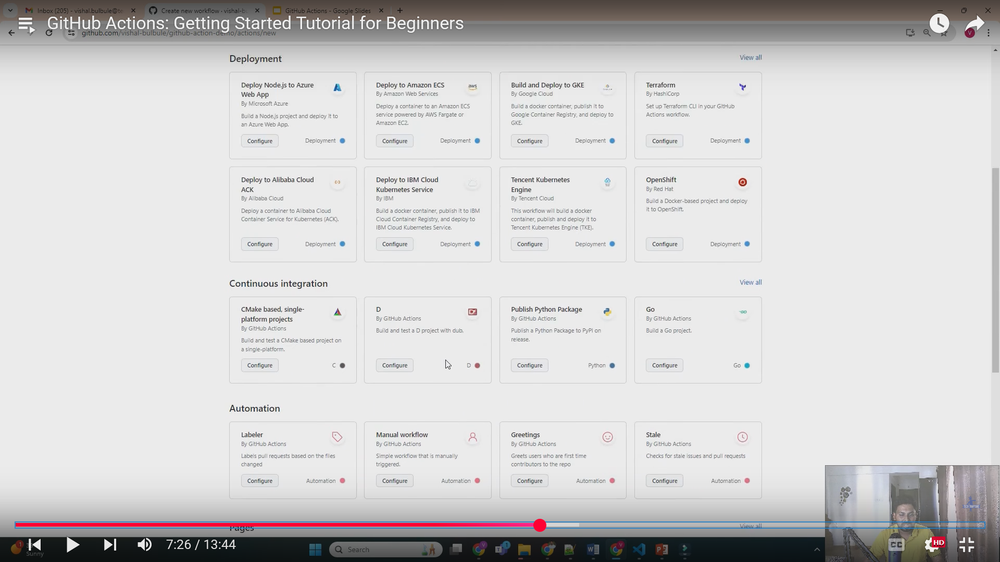

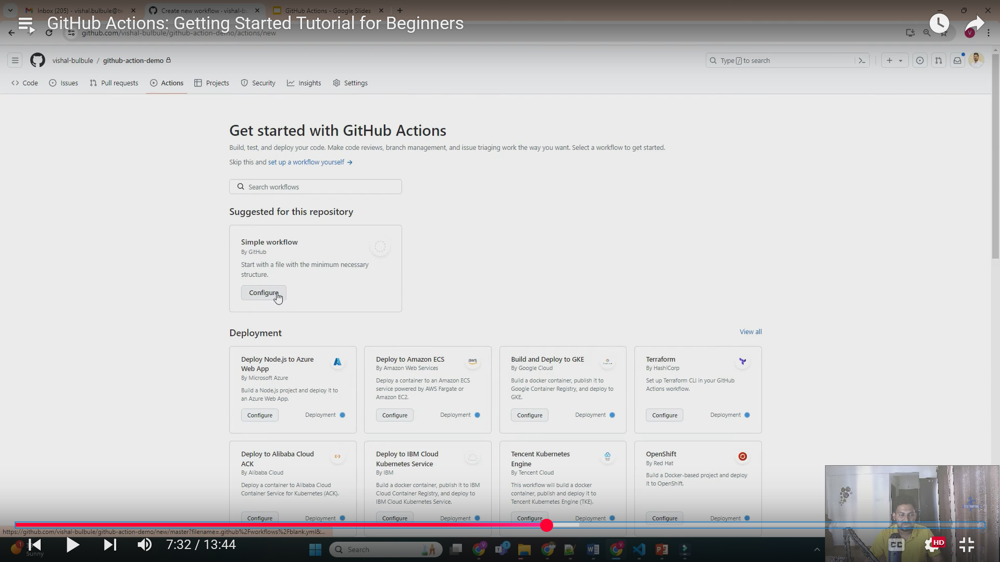

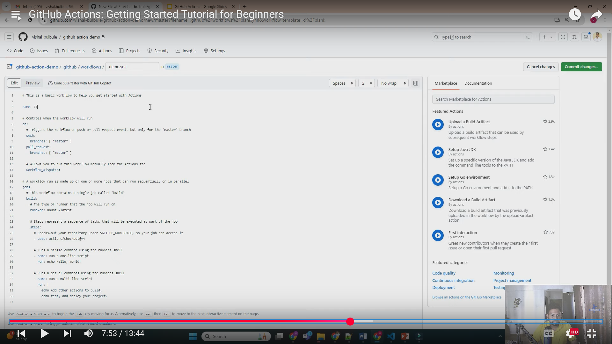

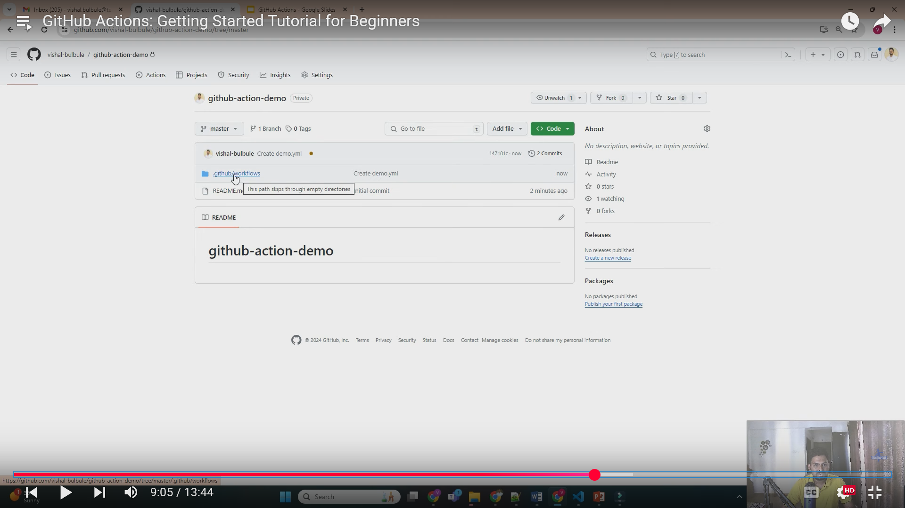

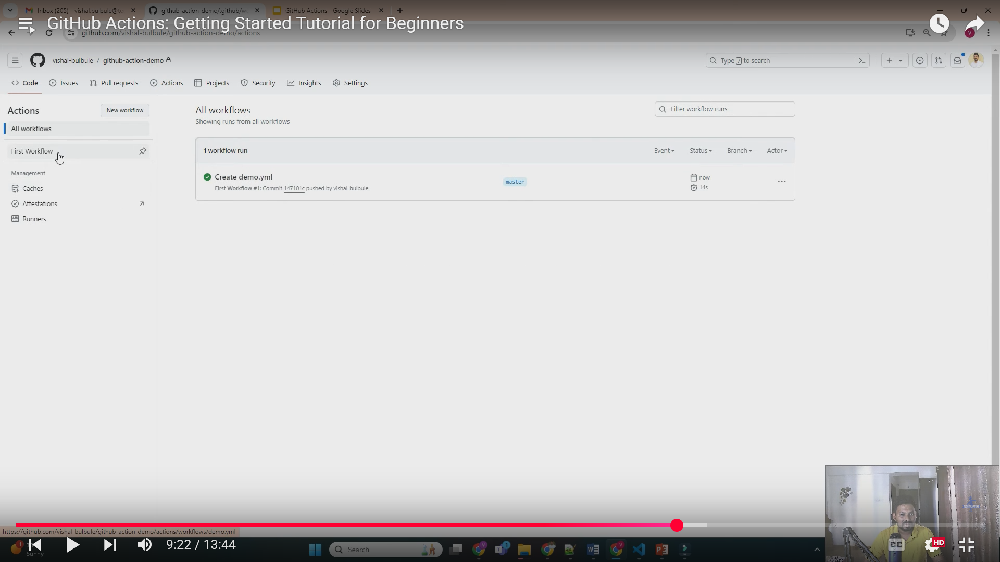

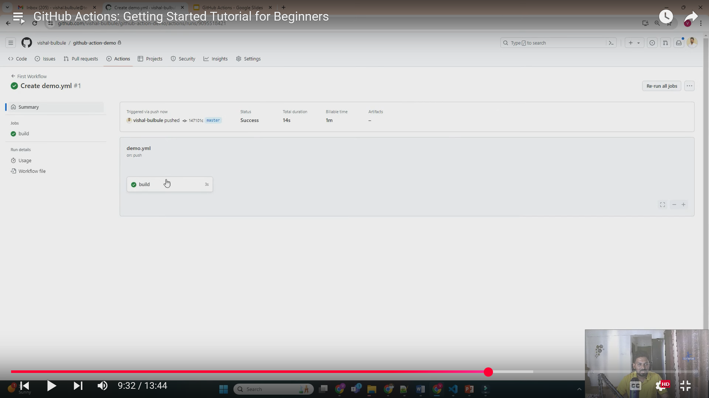

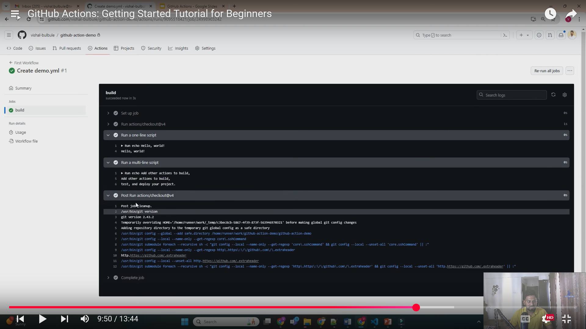

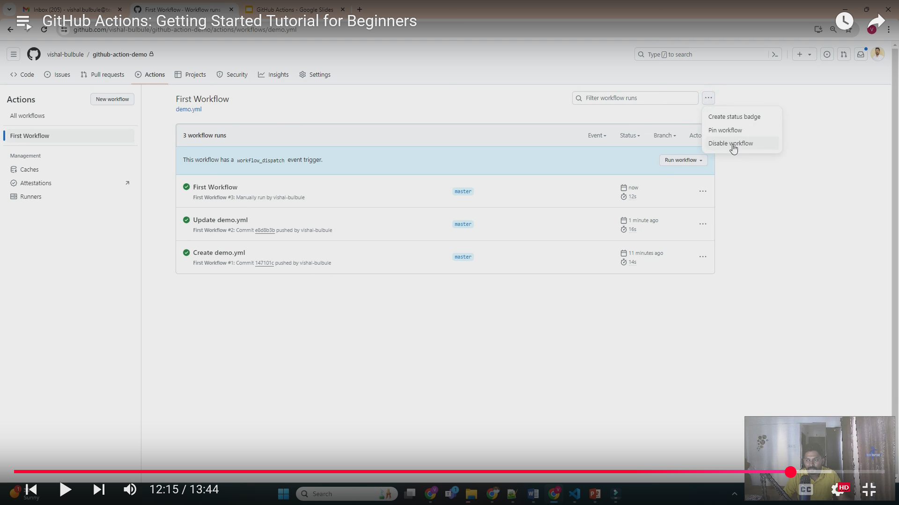

---

# ----Some GUI elements - 2

#### 🔹 Where to Find GitHub Actions in GitHub GUI

* Open your repository → Go to the **"Actions"** tab (next to Code, Issues, Pull requests, etc.).
* This page lists all workflows (CI/CD pipelines) you’ve defined in `.github/workflows/*.yml`.

#### 🔹 Main Sections in the Actions GUI

1. **Workflows List (Left Sidebar)**
   * Shows all workflows defined in your repo (`ci.yml`, `deploy.yml`, `lint.yml`, etc.).
   * Each workflow is identified by its name (set under `name:` in the YAML).
   * You can click each workflow to see only its runs.
2. **Workflow Runs (Main Panel)**
   * Shows every execution ("run") of the selected workflow.
   * Columns:
     * ✅ / ❌ / ⏳ → Status of the run (success, failure, in progress).
     * Branch & commit → The branch and commit hash that triggered it.
     * Actor → The GitHub user or system that triggered the workflow.
     * Time → When it was executed and how long it took.
3. **Run Details Page (when you click a run)**
   * Shows logs step-by-step for each **job** and **step** inside the workflow.
   * Options:
     * **Re-run jobs** → Run the workflow again.
     * **Download logs** → Save logs locally.
     * **Cancel workflow** (if it’s still running).

#### 🔹 Workflow Controls in GUI

1. **Enable / Disable Workflow**

   * Top-right of a workflow page → Toggle switch.
   * **Enabled** → Will run automatically on triggers (`push`, `pull_request`, schedule, etc.).
   * **Disabled** → Workflow file stays in repo, but it won’t run until re-enabled.

   ✅ Useful when you want to **pause CI/CD temporarily** without deleting the workflow file.
2. **Manual Dispatch (Run Workflow Button)**

   * If your workflow has:
     ```yaml
     on:
       workflow_dispatch:
         inputs:
           env:
             description: "Environment to deploy"
             required: true
             default: "staging"
     ```
   * Then in GUI you’ll see a **"Run workflow"** button (top-right).
   * You can select:
     * **Branch** to run it on.
     * **Inputs** (custom parameters defined in YAML).
   * This lets you trigger jobs manually — e.g., deploy only when you click "Run".
3. **Re-run Workflow**

   * Inside a failed run, you’ll see:
     * **Re-run all jobs** → Runs the entire workflow again.
     * **Re-run failed jobs** → Runs only jobs that failed (saves time).
4. **Concurrency & Cancel**

   * If you’ve set concurrency in YAML, GitHub will cancel older runs when a new one starts.
   * In GUI, you can also  **cancel a run manually** .
5. **Artifacts**

   * If your workflow produces files (`artifacts`), you can download them from the run details page.
   * Example: test reports, build output, logs.
6. **Secrets & Variables (Settings → Secrets and variables)**

   * GUI lets you store sensitive values like `API_KEY`, `DOCKER_PASSWORD`.
   * You can also define **variables** (non-secret, like `ENV=production`).
   * They are injected into workflows when referenced.
7. **Security Warnings**

   * If your repo is public, GitHub sometimes shows warnings about:
     * Untrusted code running in pull requests.
     * Deprecated runners.
     * Secrets exposure risks.
   * These appear in the Actions run logs and sometimes in yellow warnings.
8. **Workflows Permissions**

   * In  **Settings → Actions → General** , you can control:
     * Who can trigger workflows.
     * Whether workflows from forks are allowed.
     * Whether actions from outside marketplaces are permitted.

#### ✅  **Summary in Interview/Practical Terms** :

GitHub Actions GUI gives you:

* **Control over workflows** (enable/disable, manual triggers).
* **Visibility into runs** (logs, statuses, artifacts).
* **Flexibility** (manual dispatch, re-runs, secrets injection).
* **Security controls** (permissions, secrets, policies).

---

# ----Variables and its Types

**Variables in GitHub Actions** carefully — including  **normal variables, configuration variables, and context variables** , since they often confuse people.

### 🔹 **Variables in GitHub Actions**

In GitHub Actions, variables are values you can define and reuse across jobs and workflows. They can hold things like usernames, paths, versions, or API keys.

They help make workflows **dynamic, DRY (don’t repeat yourself), and configurable.**

**Types of Variables:**

* **Configuration Variables (`vars`)**
* **Context Variables (`context`)**
* **Secrets (`secrets`)**
* **Environment Variables (`env`)**

#### 🔹 1. **Configuration Variables (`vars`)**

These are **custom variables** you define at different levels:

* **Repository level** → visible to all workflows in that repo
* **Environment level** → scoped only to a specific environment (e.g., `production`, `staging`)
* **Organization level** → available across multiple repos

👉 You define them in GitHub’s **Settings → Variables** section (not inside YAML).

Example:

* Repo settings → `vars.PROJECT_NAME = "FitLab"`

Usage inside workflow:

```yaml
jobs:
  build:
    runs-on: ubuntu-latest
    steps:
      - name: Print project name
        run: echo "Project is ${{ vars.PROJECT_NAME }}"
```

✅ Best for: non-sensitive values (like version numbers, project name, toggle flags).

#### 🔹 2. **Context Variables (`context`)**

Contexts are **special objects** GitHub provides at runtime.

They expose **metadata** about the workflow, repo, job, runner, events, etc.

Examples of contexts:

* `github` → info about repo, branch, PR, commit, etc.
* `env` → environment variables in current scope
* `vars` → configuration variables you set in repo settings
* `secrets` → encrypted secrets
* `runner` → info about the VM runner (OS, arch, etc.)

Example:

```yaml
steps:
  - name: Show GitHub context
    run: echo "Repo: ${{ github.repository }} | Actor: ${{ github.actor }}"
```

This might output:

```
Repo: ArunS/FitLab | Actor: ArunS
```

✅ Best for: Accessing metadata dynamically.

> ##### Some Commonly Used Context Variables
>
> * `github.repository` → `"owner/repo"`
> * `github.repository_owner` → `"owner"`
> * `github.event_name` → The event that triggered the workflow (e.g., `push`, `pull_request`, `workflow_dispatch`)
> * `github.ref` → Git ref (e.g., `refs/heads/main`, `refs/tags/v1.0.0`)
> * `github.sha` → The commit SHA that triggered the workflow
> * `github.actor` → Username of the person/actor that triggered the workflow
> * `github.workflow` → The workflow’s name
> * `github.run_id` → Unique ID of the workflow run
> * `github.run_number` → Incremental run number for this workflow
> * `github.head_ref` → Head branch for PRs
> * `github.base_ref` → Base branch for PRs

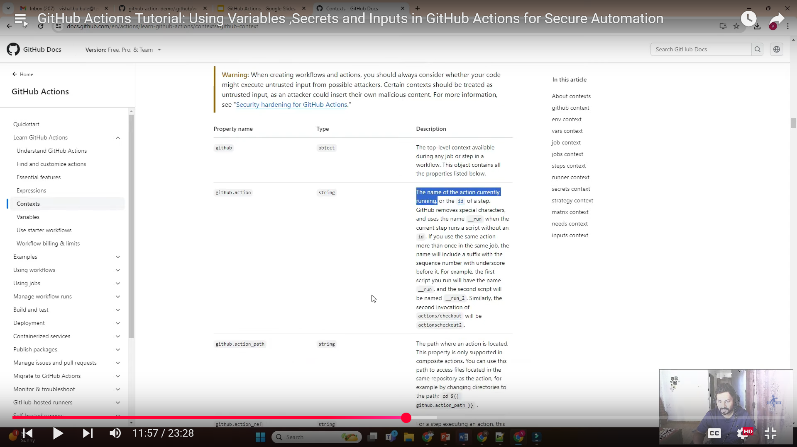

#### 🔹 3. **Secrets (`secrets`)**

Secrets are **encrypted values** (like API keys, tokens, passwords).

* Stored in `Settings → Secrets`
* Accessed in workflow as `${{ secrets.MY_SECRET }}`

Example:

```yaml
steps:
  - name: Use API Key
    run: echo "Using ${{ secrets.API_KEY }}"
```

Secrets are **masked** in logs (GitHub won’t print them).

#### 🔹 4. **Environment Variables (`env`)**

These are **runtime variables** you define directly in YAML (per job/step/workflow).

Example:

```yaml
jobs:
  build:
    runs-on: ubuntu-latest
    env:
      NODE_ENV: production
    steps:
      - run: echo "Env = $NODE_ENV"
```

### 🔹 Summary Table

| Type                                    | Where Defined                                            | Use Case                                       |
| --------------------------------------- | -------------------------------------------------------- | ---------------------------------------------- |
| **Configuration vars (`vars`)** | Repo/Org/Env Settings                                    | Non-sensitive configs (flags, names, versions) |
| **Context vars**                  | Built-in GitHub contexts (`github`,`env`,`runner`) | Metadata about repo, events, runner            |
| **Secrets**                       | Repo/Org/Env Settings (encrypted)                        | Sensitive info (tokens, passwords, keys)       |
| **Env vars (`env`)**            | Inside workflow/job/step                                 | Temporary runtime variables                    |

### ⚡ Example combining all:

```yaml
name: Deploy
on: push

jobs:
  deploy:
    runs-on: ubuntu-latest
    env:
      NODE_ENV: production   # env variable
    steps:
      - name: Checkout
        uses: actions/checkout@v3

      - name: Print Config Vars
        run: echo "Project = ${{ vars.PROJECT_NAME }}"

      - name: Print Context Vars
        run: echo "Branch = ${{ github.ref }}"

      - name: Use Secret
        run: echo "Deploying with API Key: ${{ secrets.API_KEY }}"
```

### 👉 So basically:

* `vars` = you configure manually in repo settings → static configs
* `context` = GitHub automatically provides runtime metadata
* `secrets` = encrypted sensitive info
* `env` = temporary variables defined inside YAML

---

# ----Runners

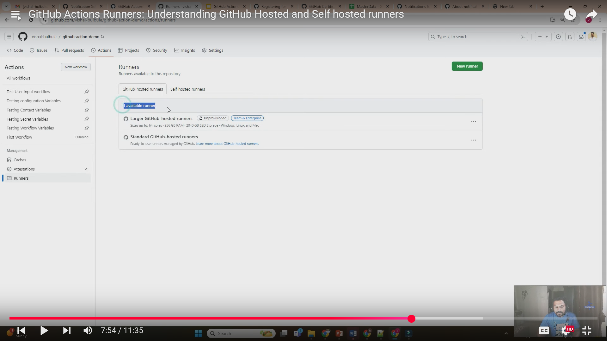

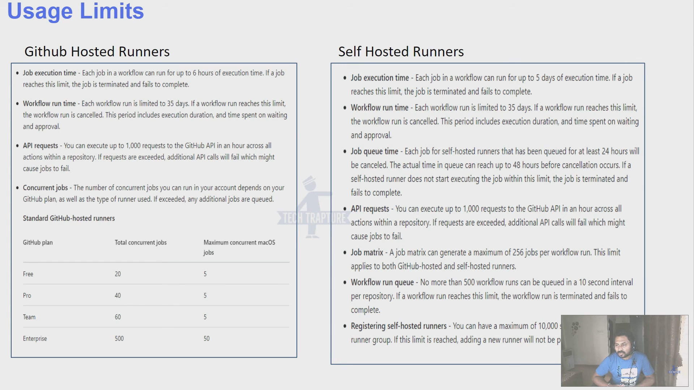

---

# ----Keyword - `uses`

The `uses` keyword is how you **reference and reuse pre-built actions** (or your own) inside a workflow.

Instead of writing all steps from scratch, you can "use" actions published in the **GitHub Marketplace** or from repositories, Docker containers, or even local files.

### 🔹 General Syntax

```yaml
steps:
  - name: Example step
    uses: {owner}/{repo}@{ref}
```

* **`owner/repo`** → The repository containing the action.
* **`@ref`** → The version, tag, branch, or commit SHA of the action. (Best practice: use a version tag or commit SHA for stability).

### 🔹 Where `uses` Can Point To

1. **GitHub Marketplace / public repo actions**

   ```yaml
   uses: actions/checkout@v4
   ```

   → Uses the official **checkout** action to pull your repo code.
2. **A local action inside your repo**

   ```yaml
   uses: ./path/to/action
   ```

   → Useful if you write your own custom action.
3. **A Docker container action**

   ```yaml
   uses: docker://alpine:3.8
   ```

   → Runs directly inside the specified Docker image.

### 🔹 Examples of `uses`

✅ Example 1: Using Marketplace Actions

```yaml
steps:
  - name: Checkout repo
    uses: actions/checkout@v4
  
  - name: Set up Node.js
    uses: actions/setup-node@v3
    with:
      node-version: 18
```

Here:

* First step checks out code.
* Second step sets up Node.js.

✅ Example 2: Using a Local Action

If you have a local action in `.github/actions/my-action`, you can use:

```yaml
steps:
  - name: Run local action
    uses: ./github/actions/my-action
```

✅ Example 3: Using a Docker Action

```yaml
steps:
  - name: Run alpine container
    uses: docker://alpine:3.8
```

### 🔹 Why `uses` is important

* **Reusability** → Don’t repeat scripts across workflows.
* **Community-powered** → Leverage thousands of open-source actions.
* **Standardization** → Keep workflows clean and modular.
* **Flexibility** → Can point to repo, branch, tag, commit, Docker image, or local path.

👉 So, in short: **`uses` = plug in pre-built or custom actions into your workflow instead of writing everything yourself.**

---

# ----Keyword - `with`

In GitHub Actions, the **`with` keyword** is used to pass **input parameters** (key-value pairs) to an **action** (or sometimes to a `uses` step).

It’s basically how you configure the behavior of an action.

Think of it as  **arguments you pass to a function** .

### 🔹 General Structure

```yaml
jobs:
  example-job:
    runs-on: ubuntu-latest
    steps:
      - name: Checkout repo
        uses: actions/checkout@v4
        with:
          fetch-depth: 0    # input parameter
          ref: main         # checkout a specific branch
```

Here:

* `uses: actions/checkout@v4` → specifies which action is being used.
* `with:` → defines input parameters for that action.

### 🔹 Common Examples of `with`

**1. Checkout Action**

```yaml
- name: Checkout code
  uses: actions/checkout@v4
  with:
    fetch-depth: 1   # shallow clone for performance
    ref: develop     # checkout the 'develop' branch
```

**2. Setup Node.js**

```yaml
- name: Setup Node
  uses: actions/setup-node@v4
  with:
    node-version: '18'
    cache: 'npm'
```

**3. Upload Artifact**

```yaml
- name: Upload build output
  uses: actions/upload-artifact@v4
  with:
    name: my-artifact
    path: dist/
```

**4. Custom Action (your own repo)**

```yaml
- name: Run custom action
  uses: my-org/my-action@v1
  with:
    username: ${{ secrets.MY_USER }}
    environment: production
```

### 🔹 Notes

* Each action **defines what inputs it accepts** in its `action.yml` file.
* If you pass an input not listed there → GitHub will give an error.
* `with:` is **not for scripts or run steps** — it’s only for `uses` steps.

✅ In short:

* **`uses`** → calls an action.
* **`with`** → passes configuration (inputs) into that action.

---

# ----Actions

An **Action** is the smallest reusable building block in a GitHub Actions workflow.

* Think of an Action as a **step with predefined logic** (like installing dependencies, deploying, sending a Slack message, or testing code).
* Actions can be **created by you** or  **reused from the GitHub Marketplace** .

They are written in  **JavaScript/TypeScript** ,  **Docker** , or as  **composite actions (YAML)** .

### 🔹 Types of Actions

1. **JavaScript Actions**
   * Written in Node.js (runs directly on runner).
   * Fast since no container overhead.
   * Example: [actions/checkout](https://github.com/actions/checkout) (clones repo into runner).
2. **Docker Actions**
   * Runs inside a container.
   * Good if you need custom OS dependencies.
   * Example: custom action for running `ffmpeg` inside a container.
3. **Composite Actions**
   * Written in YAML.
   * Lets you combine multiple steps into one reusable action.
   * Example: A single action that lints + tests + builds.

### 🔹 The `uses:` Keyword

In a workflow, `uses` tells GitHub which action to run.

**Example 1: Using a public marketplace action**

```yaml
jobs:
  build:
    runs-on: ubuntu-latest
    steps:
      - name: Checkout repo
        uses: actions/checkout@v4

      - name: Setup Node.js
        uses: actions/setup-node@v3
        with:
          node-version: 18
```

✅ `actions/checkout@v4` → Official action maintained by GitHub.

✅ `actions/setup-node@v3` → Official action to install Node.js.

**Example 2: Using a local action (inside your repo)**

```yaml
jobs:
  myjob:
    runs-on: ubuntu-latest
    steps:
      - name: Run my local action
        uses: ./my-actions/hello-world
```

Here, the action lives in your repo under `my-actions/hello-world/`.

**Example 3: Using an action from another repo**

```yaml
jobs:
  test:
    runs-on: ubuntu-latest
    steps:
      - name: Use action from another repo
        uses: octocat/super-action@v1
```

👉 You can use actions from **any public repo** (or private repo with permission).

**Example 4: Using a Docker action**

```yaml
jobs:
  run-docker-action:
    runs-on: ubuntu-latest
    steps:
      - name: Run dockerized action
        uses: docker://alpine:3.18
        with:
          args: echo "Hello from Docker"
```

👉 This directly pulls an image from Docker Hub and runs it.

### 🔹 Action Inputs & Outputs

Actions can define **inputs** (parameters) and  **outputs** .

**Example**

```yaml
jobs:
  greet:
    runs-on: ubuntu-latest
    steps:
      - name: Greet
        uses: actions/hello-world-javascript-action@main
        with:
          who-to-greet: "Arun"
```

Inside that action’s `action.yml`:

```yaml
name: "Hello World"
inputs:
  who-to-greet:
    description: "Who to greet"
    required: true
    default: "World"
outputs:
  time:
    description: "The time we greeted you"
runs:
  using: "node16"
  main: "index.js"
```

### 🔹 Why Actions are Important

* **Reusability** → Write once, use everywhere.
* **Modularity** → Workflows stay clean (you don’t rewrite logic in every repo).
* **Community-driven** → Thousands of ready-made actions exist (deploy to AWS, send Telegram msg, run tests, etc.).
* **Customization** → You can publish your own actions for team/company use.

### 👉 In short:

* A **workflow** is a whole CI/CD pipeline.
* A **job** is a group of steps.
* A **step** can run a shell command (`run:`) or an **action** (`uses:`).
* An **action** is reusable logic packaged for GitHub Actions.

---

# ---Custom Actions

A **custom action** is your own reusable piece of automation logic that can be shared across multiple workflows or repositories.

Instead of writing the same steps again and again, you encapsulate them into an  **Action** .

Custom Actions come in  **3 types** :

1. **Docker actions** – run inside a container (useful when you need specific tools/environments).
2. **JavaScript/Node.js actions** – run directly on the runner, fast and common.
3. **Composite actions** – combine multiple workflow steps into a single action (no extra runtime needed).

### 🔹 Basic Structure of a Custom Action

Every action has:

* A folder (usually `.github/actions/my-action` or its own repo).
* An `action.yml` (metadata file) – defines inputs, outputs, and how it runs.
* Source code (script, JS, or Dockerfile).

### 1️⃣ Creating a **JavaScript Action**

**📂 Repo Structure**

```
.github/actions/hello-world/
 ├── action.yml
 ├── index.js
 ├── package.json
 └── node_modules/
```

**`action.yml`**

```yaml
name: "Hello World Action"
description: "Prints Hello World with a custom name"
inputs:
  name:
    description: "Your name"
    required: true
    default: "World"
runs:
  using: "node16"
  main: "index.js"
```

**`index.js`**

```js
const core = require('@actions/core');

try {
  const name = core.getInput('name');
  console.log(`👋 Hello, ${name}!`);
} catch (error) {
  core.setFailed(error.message);
}
```

📌 In workflow:

```yaml
jobs:
  hello:
    runs-on: ubuntu-latest
    steps:
      - uses: actions/checkout@v4
      - uses: ./.github/actions/hello-world
        with:
          name: "Arun"
```

### 2️⃣ Creating a **Composite Action**

These are **YAML-only actions** – they wrap multiple steps into one.

**`action.yml`**

```yaml
name: "Setup Project"
description: "Install dependencies and run build"
inputs:
  node-version:
    required: true
    default: "18"
runs:
  using: "composite"
  steps:
    - name: Setup Node.js
      uses: actions/setup-node@v4
      with:
        node-version: ${{ inputs.node-version }}
    - name: Install Dependencies
      run: npm install
      shell: bash
    - name: Run Build
      run: npm run build
      shell: bash
```

📌 In workflow:

```yaml
jobs:
  build:
    runs-on: ubuntu-latest
    steps:
      - uses: actions/checkout@v4
      - uses: ./.github/actions/setup-project
        with:
          node-version: "20"
```

### 3️⃣ Creating a **Docker Action**

Useful if you need a custom environment.

**📂 Repo Structure**

```
my-docker-action/
 ├── action.yml
 ├── Dockerfile
 └── entrypoint.sh
```

**`action.yml`**

```yaml
name: "Docker Hello Action"
description: "Runs inside a container"
inputs:
  who-to-greet:
    required: true
    default: "World"
runs:
  using: "docker"
  image: "Dockerfile"
  args:
    - ${{ inputs.who-to-greet }}
```

**`Dockerfile`**

```dockerfile
FROM alpine:3.18
COPY entrypoint.sh /entrypoint.sh
RUN chmod +x /entrypoint.sh
ENTRYPOINT ["/entrypoint.sh"]
```

**`entrypoint.sh`**

```bash
#!/bin/sh
echo "👋 Hello $1"
```

📌 In workflow:

```yaml
jobs:
  docker-job:
    runs-on: ubuntu-latest
    steps:
      - uses: actions/checkout@v4
      - uses: ./my-docker-action
        with:
          who-to-greet: "Arun"
```

### 🔹 Publishing Your Action

If you want others (or future employers 😉) to use your action:

1. Create a **separate repo** just for the action.
2. Add a **release tag** (`v1`, `v1.0.0`, etc).
3. People can use it like:
   ```yaml
   - uses: username/my-action@v1
   ```

### ✅ **Summary**

* **Custom Actions** let you package automation into reusable components.
* **Composite** = YAML only (simple wrappers).
* **JavaScript** = Node.js (fast & flexible).
* **Docker** = isolated environment (heavy but powerful).
* Store in `.github/actions` for internal use, or publish as a repo for global use.

---

# ----Action Marketplace

The **GitHub Actions Marketplace** is a public directory of pre-built **actions** created by GitHub, third-party developers, and the open-source community.

Think of it as an **app store for automation tasks** in CI/CD pipelines. Instead of writing everything from scratch, you can **reuse existing actions** for common tasks (like checking out code, caching dependencies, running tests, building, deploying, etc.).

### 🔹 Where to Find It

* On GitHub: [https://github.com/marketplace?type=actions](https://github.com/marketplace?type=actions)
* Inside a repository, when you create/edit a workflow YAML file, you can search for actions directly in the  **editor suggestions** .

### 🔹 Types of Actions Available

1. **Official GitHub Actions**
   * Example: `actions/checkout`, `actions/setup-node`, `actions/upload-artifact`
2. **Verified Publisher Actions**
   * Marked with a ✅ (from trusted organizations like AWS, Google, Microsoft).
3. **Community Actions**
   * Open-source contributors publish reusable actions.

### 🔹 How Actions Marketplace Fits in Workflows

Inside your workflow YAML, you reference an action from the Marketplace using the **`uses`** keyword:

```yaml
jobs:
  build:
    runs-on: ubuntu-latest
    steps:
      - name: Checkout source code
        uses: actions/checkout@v4   # Official GitHub Action

      - name: Set up Node.js
        uses: actions/setup-node@v4
        with:
          node-version: '18'

      - name: Run tests
        run: npm test
```

Here:

* `actions/checkout@v4` and `actions/setup-node@v4` are  **Marketplace actions** .

### 🔹 Key Features of Actions Marketplace

1. **Search & Filters**
   * Search by name, keyword (e.g., "docker", "AWS deploy").
   * Filters: Official, Verified, Most Popular, Recently Updated.
2. **Action Pages**
   * Each action has its own page with:
     * Documentation (how to use it).
     * Example workflows.
     * Inputs/outputs (`with:` parameters, secrets, etc.).
     * Maintainer info.
3. **Versioning**
   * Actions are versioned (`@v1`, `@v2`, `@main`).
   * **Best practice:** Use a specific version tag instead of `main` to avoid breaking changes.
4. **Security**
   * **Verified badge** ✅ means GitHub trusts the publisher.
   * Using unverified community actions requires caution (check the code).

### 🔹 Benefits

* Saves time (no need to reinvent the wheel).
* Ensures consistency and best practices.
* Easier integration with  **cloud providers (AWS, Azure, GCP)** , testing tools, build tools, deployment platforms, etc.
* Huge ecosystem — thousands of ready-to-use actions.

### 🔹 When to Use Marketplace Actions vs Custom

* ✅ Use **Marketplace actions** for **common tasks** (checkout, test runners, deployments).
* ✅ Create **custom actions** if:
  * You have internal workflows (specific company logic).
  * No action exists for your use case.
  * You want more control/security.

**👉 Example: If you want to  deploy to AWS , you don’t need to write everything. You can just use:**

```yaml
- name: Deploy to AWS
  uses: aws-actions/configure-aws-credentials@v2
  with:
    aws-access-key-id: ${{ secrets.AWS_ACCESS_KEY_ID }}
    aws-secret-access-key: ${{ secrets.AWS_SECRET_ACCESS_KEY }}
    aws-region: us-east-1
```

### ⚡ In short:

The **GitHub Actions Marketplace** = A library of reusable automation building blocks for workflows → saves time, increases reliability, and helps integrate with external services.

---

# ----Artifacts

* In  **GitHub Actions** , **artifacts** are files or data generated during a workflow run that you want to  **save and share** .
* Normally, when a job finishes, everything inside the runner’s environment is destroyed.

  👉 Artifacts let you  **persist files beyond a single job run** .
* Common examples:

  * Test reports (e.g., JUnit XML, Jest results).
  * Compiled binaries or build outputs (e.g., `.exe`, `.jar`, `.zip`).
  * Logs and coverage reports.
  * Temporary data to be passed between jobs.

### 🔹 Key Features

1. **Stored Per Workflow Run**
   * Artifacts are attached to a specific run.
   * They are visible and downloadable in the workflow run’s  **GUI in GitHub Actions** .
2. **Cross-Job Sharing**
   * Jobs can **upload artifacts** and later **download them** in the same workflow run.
   * Useful for splitting builds and tests across jobs.
3. **Retention Period**
   * By default:  **90 days** .
   * Can be configured between **1 – 90 days** per artifact or globally in repo settings.

### 🔹 Uploading Artifacts

You use the `actions/upload-artifact` action.

**Example:**

```yaml
jobs:
  build:
    runs-on: ubuntu-latest
    steps:
      - uses: actions/checkout@v4
      - run: |
          mkdir output
          echo "Hello Artifact" > output/result.txt
      - name: Upload build output
        uses: actions/upload-artifact@v4
        with:
          name: my-build-artifact
          path: output/result.txt
```

* `name`: the artifact’s name (how it will appear in the UI).
* `path`: file or directory to upload.

### 🔹 Downloading Artifacts

Use `actions/download-artifact`.

**Example:**

```yaml
jobs:
  test:
    runs-on: ubuntu-latest
    needs: build
    steps:
      - name: Download artifact
        uses: actions/download-artifact@v4
        with:
          name: my-build-artifact
          path: ./artifact
      - run: cat ./artifact/result.txt
```

### 🔹 Multiple Files / Directories

You can upload **entire folders** or multiple files:

```yaml
with:
  name: logs
  path: |
    logs/
    reports/*.xml
```

### 🔹 Where Do You See Them in GitHub?

* Go to your repo → **Actions tab** → select a workflow run.
* Scroll down to **Artifacts** section.
* You can **download artifacts** as `.zip` from the GUI.

### 🔹 Typical Use Cases

1. **Sharing Build Outputs**
   * One job builds a binary → another job tests it → another job deploys it.
2. **Test & Coverage Reports**
   * Generate reports → store them as artifacts for future analysis.
3. **Logs for Debugging**
   * Upload logs if a job fails, so you can inspect later.
4. **Data Hand-off Between Jobs**
   * Job A produces data → Job B consumes it → Job C deploys.

### ✅ In short:  **Artifacts = persistent storage of workflow run outputs** .

They make multi-job pipelines possible, and they give you a way to  **download results directly from the GitHub UI** .

---

# ----Parallel and Serial Job Execution

### 🔹 1. **Serial Execution (Default inside a Job)**

* **Definition** :

  Steps **inside the same job** run **sequentially (one after another)** by default.

* **Why?** Because steps often depend on outputs, installed dependencies, or environments prepared in earlier steps.
* **Example:**

  ```yaml
  jobs:
    build:
      runs-on: ubuntu-latest
      steps:
        - name: Checkout code
          uses: actions/checkout@v4

        - name: Install dependencies
          run: npm install   # Runs after checkout

        - name: Run tests
          run: npm test      # Runs after install
  ```

  ✅ Here, steps run in  **serial** :

  1. Checkout → 2. Install → 3. Test.

### 🔹 2. **Parallel Execution (Across Jobs)**

* **Definition** :

  By default, **jobs in the same workflow run in parallel** unless you explicitly define dependencies (`needs:`).

* **Why?** To speed up pipelines by splitting tasks.
* **Example:**

  ```yaml
  jobs:
    lint:
      runs-on: ubuntu-latest
      steps:
        - uses: actions/checkout@v4
        - run: npm run lint

    test:
      runs-on: ubuntu-latest
      steps:
        - uses: actions/checkout@v4
        - run: npm test
  ```

  ✅ Here, `lint` and `test` run **at the same time** on two separate runners.

  → Saves CI/CD time.

### 🔹 3. **Serial Execution Across Jobs (Using `needs`)**

* You can make jobs **dependent** on others → enforces  **serial job execution** .
* **Example:**

  ```yaml
  jobs:
    build:
      runs-on: ubuntu-latest
      steps:
        - uses: actions/checkout@v4
        - run: npm install
        - run: npm run build

    test:
      needs: build   # Runs only after build finishes
      runs-on: ubuntu-latest
      steps:
        - uses: actions/checkout@v4
        - run: npm test
  ```

  ✅ Here:

  1. `build` runs first
  2. Only when `build` succeeds → `test` runs

### 🔹 4. **Parallel Execution Within a Job (Matrix Strategy)**

* You can split a **single job into multiple parallel runs** with a  **matrix** .
* **Example:**

  ```yaml
  jobs:
    test:
      runs-on: ubuntu-latest
      strategy:
        matrix:
          node: [14, 16, 18]   # Run tests on 3 Node.js versions
      steps:
        - uses: actions/checkout@v4
        - uses: actions/setup-node@v3
          with:
            node-version: ${{ matrix.node }}
        - run: npm install
        - run: npm test
  ```

  ✅ This creates **3 parallel jobs** testing Node 14, 16, and 18.

### 🔹 5. **Mixing Parallel & Serial**

You can mix both:

* Some jobs run  **in parallel** .
* Others run **serially** by using `needs:`.

Example pipeline:

```yaml
jobs:
  lint:
    runs-on: ubuntu-latest
    steps:
      - run: npm run lint

  build:
    runs-on: ubuntu-latest
    steps:
      - run: npm run build

  test:
    needs: [lint, build]   # Waits for both
    runs-on: ubuntu-latest
    steps:
      - run: npm test
```

✅ Here:

* `lint` and `build` run  **parallel** .
* `test` runs  **serially after both succeed** .

### ⚖️ When to Use What

* **Parallel** : Speed up (tests, builds, linting, multi-env).
* **Serial** : When one step/job **depends on outputs** of the previous.

---

# ----Keyword - `strategy` and `matrix`

### 🔹 What is `strategy` in GitHub Actions?

In a GitHub Actions  **workflow** , the `strategy` keyword is used inside a `job` to  **run multiple variations of that job automatically** .

It’s mostly used for  **matrix builds** , where you want to test the same code across multiple environments (different OS, versions, or configurations).

### 🔹 Syntax Example

```yaml
jobs:
  build:
    runs-on: ubuntu-latest
    strategy:
      matrix:
        node-version: [14, 16, 18]
        os: [ubuntu-latest, windows-latest]
      fail-fast: false
      max-parallel: 2

    steps:
      - uses: actions/checkout@v3
      - name: Use Node.js ${{ matrix.node-version }}
        uses: actions/setup-node@v3
        with:
          node-version: ${{ matrix.node-version }}
      - run: npm install
      - run: npm test
```

### 🔹 Key Parts of `strategy`

**1. `matrix`**

* Defines a set of  **variables and their possible values** .
* GitHub Actions will generate a  **job for every combination** .
* Example:

  ```yaml
  matrix:
    node-version: [14, 16]
    os: [ubuntu-latest, windows-latest]
  ```

  → Creates 4 jobs:

  * Node 14 on Ubuntu
  * Node 16 on Ubuntu
  * Node 14 on Windows
  * Node 16 on Windows

👉 This helps test  **cross-platform and multi-version compatibility** .

**2. `fail-fast`**

* Default: `true`.
* If one job in the matrix  **fails** , it  **cancels all the other jobs** .
* If you set `false`,  **all jobs run independently** , even if one fails.

Example:

```yaml
strategy:
  fail-fast: false
```

**3. `max-parallel`**

* Limits the  **number of jobs running in parallel** .
* Useful to avoid exhausting resources or rate limits.

Example:

```yaml
strategy:
  max-parallel: 2
```

→ Runs only 2 jobs at a time, queues the rest.

**4. `include`**

* Lets you **add extra job configurations** that aren’t part of the basic combinations.

Example:

```yaml
matrix:
  node-version: [14, 16]
  os: [ubuntu-latest, windows-latest]
  include:
    - node-version: 18
      os: ubuntu-latest
```

👉 Adds a **special job** with Node 18 on Ubuntu, in addition to the matrix.

**5. `exclude`**

* Lets you  **remove unwanted combinations** .

Example:

```yaml
matrix:
  node-version: [14, 16]
  os: [ubuntu-latest, windows-latest]
  exclude:
    - node-version: 14
      os: windows-latest
```

👉 Skips Node 14 on Windows.

### 🔹 Why is `strategy` useful?

* ✅ Test on **multiple versions** (Node.js, Python, Java, etc.)
* ✅ Test on **different operating systems** (Linux, Windows, macOS)
* ✅ Run **cross-browser tests**
* ✅ Ensure **backward compatibility**
* ✅ Save time with **parallel jobs**

### ⚡ In short:

`strategy` helps automate **multi-environment testing** by running jobs **in parallel or controlled order** with `matrix`, `fail-fast`, `include/exclude`, and `max-parallel`.

---
