# Some of the best Hosting Platforms

The **best hosting platform for a MERN (MongoDB, Express, React, Node.js)** stack website depends on your priorities (e.g., ease of deployment, cost, scalability, control, performance). Here’s a breakdown of the **top platforms** across different criteria:

## 🔥 **Best Overall (for Most Developers)**

#### **Render**

* **Why it's good:** Super easy to set up full-stack apps, free tier available, supports Node.js, Express, MongoDB integration.
* **Features:** Auto-deploy from GitHub, custom domains, cron jobs, background workers.
* **MongoDB:** Use MongoDB Atlas (Render doesn’t host DBs natively).
* **Best for:** Beginners to mid-level developers who want quick deployments with good control.

## 🚀 **Best for High Performance / Scalability**

#### **Vercel (Frontend) + Railway / Render / Backend API on EC2**

* **Why it's good:** Use Vercel for React frontend (blazing fast CDN), and host Express/Node backend elsewhere (like Railway or EC2).
* **Best for:** Projects needing fast global frontend delivery and scalable backends.

## 💼 **Best for Production-Grade Projects**

#### **AWS (EC2 + S3 + MongoDB Atlas)**

* **Why it's good:** Full control, autoscaling, enterprise-grade infra.
* **MongoDB Atlas:** Official MongoDB cloud service integrates well.
* **Best for:** Advanced users/teams who need flexibility, security, and full DevOps.

## 🔧 **Easiest to Use (All-in-One)**

#### **Railway**

* **Why it's good:** Simple, unified dashboard for backend (Node), PostgreSQL/MongoDB, and frontend hosting.
* **One-click deploy** , GitHub integration, environment variables.
* **Best for:** Developers who want to deploy quickly and still scale later.

## 🧪 **For Hobby Projects or Prototyping**

#### **Glitch / Replit / Cyclic**

* **Why it's good:** Great for testing, quick prototyping, free tiers.
* **Downside:** Not recommended for production or custom domain scalability.
* **Best for:** Learning, demos, short-term testing.

## 🧠 **Quick Comparison Table**

| Platform          | Ease of Use                | Full MERN Support | Free Tier | Best For              |
| ----------------- | -------------------------- | ----------------- | --------- | --------------------- |
| **Render**  | ✅✅✅                     | ✅✅              | ✅        | Full-stack deployment |
| **Railway** | ✅✅✅                     | ✅✅✅            | ✅        | Backend + DB + CI/CD  |
| **Vercel**  | ✅✅✅                     | (Frontend only)   | ✅✅      | React apps            |
| **Netlify** | ✅✅✅                     | (Frontend only)   | ✅✅      | React frontend        |
| **AWS EC2** | ⚠️ Complex               | ✅✅✅            | ⚠️      | Production use        |
| **Glitch**  | ✅✅                       | ✅✅              | ✅        | Prototyping           |
| **Heroku**  | ⚠️ Phasing out free tier | ✅✅              | ❌        | Small/medium apps     |

## ✅ Recommended Stack for a MERN Project (2025) (Not Production Level):

* **Frontend:** React on **Vercel** or **Netlify**
* **Backend:** Node/Express on **Render** or **Railway**
* **Database:** **MongoDB Atlas**
* **Domain:** Buy from **Namecheap** /  **GoDaddy** , connect via platform settings
* **CI/CD:** GitHub + platform integration

##### 🖥️ **Frontend (React)**

* **Host on:** [**Vercel**](https://vercel.com/)
* **Why:** Instant deployment, blazing fast CDN, GitHub integration, free tier.
* **Bonus:** Custom domains, SEO support, environment variables.
* **What you'll show:** Production-grade frontend delivery, CI/CD integration.

##### 🔌 **Backend (Node.js + Express)**

* **Host on:** [**Render**](https://render.com/) or [**Railway**](https://railway.app/)
* **Why:** Easy setup, GitHub deploys, auto HTTPS, scalable, free tier.
* **What you'll show:** Real-world backend hosting, ability to connect frontend, env variables, secure API.

##### 🗃️ **Database (MongoDB)**

* **Use:** [**MongoDB Atlas**](https://www.mongodb.com/cloud/atlas)
* **Why:** Free tier, cloud-hosted, highly reliable, real-world usage.
* **What you'll show:** Cloud database integration, connection string management, secure storage.

##### 🎯 Your Deployment Stack At a Glance

| Component          | Platform             | Features to Highlight               |
| ------------------ | -------------------- | ----------------------------------- |
| **Frontend** | Vercel               | CI/CD, custom domain, fast load     |
| **Backend**  | Render/Railway       | REST APIs, secure routes, Node env  |
| **Database** | MongoDB Atlas        | Secure cloud DB, connection strings |
| **Domain**   | Namecheap (optional) | Custom domain mapping               |
| **Auth**     | JWT/Auth Middleware  | Realistic user login/roles          |
| **Payments** | Razorpay / PayPal    | Real-world integration              |

##### 🔗 Example URLs You Might End Up With

| What                  | Example URL                                  |
| --------------------- | -------------------------------------------- |
| **Frontend**    | `https://fitlab-frontend.vercel.app/`      |
| **Backend API** | `https://fitlab-api.onrender.com/api/`     |
| **Admin Panel** | `https://fitlab-frontend.vercel.app/admin` |
| **Database**    | (MongoDB Atlas – hidden, but referenced)    |

---

# Production Level Platform

**AWS is the best platform** —  *but only if you know how to use it right* .

Here’s a  **full breakdown of using AWS for hosting your MERN eCommerce project** , and whether **you should go with AWS** over other platforms like Vercel + Render.

#### 🧠 Why Use AWS?

✅ **Enterprise-level infrastructure** (used by companies like Netflix, Airbnb, etc.)

✅ Highly  **scalable** ,  **secure** , and **customizable**

✅ Interviewers love AWS experience — especially **EC2, S3, IAM, RDS/Atlas, Route 53**

✅ Looks *very impressive* if you can manage it yourself

#### ⚙️ AWS-Based Deployment Architecture for MERN

| Component          | AWS Service                                                           | Purpose                             |
| ------------------ | --------------------------------------------------------------------- | ----------------------------------- |
| **Frontend** | S3 + CloudFront                                                       | Static React app, globally cached   |
| **Backend**  | EC2 or AWS Elastic Beanstalk, Basic Linux, Nginx, SSH, PM2, firewalls | Runs Node.js + Express + Socket     |
| **Database** | MongoDB Atlas (preferred)                                             | Managed MongoDB in the cloud        |
| **Media**    | Cloudinary (still best for images)                                    | Or use S3 if needed                 |
| **Auth**     | JWT in your app                                                       | You can integrate AWS Cognito later |
| **Domain**   | Route 53                                                              | Domain + SSL setup                  |
| **Security** | IAM Roles + Security Groups                                           | Protect EC2, S3, and DB access      |

## ✅ What You’ll Show Interviewers If You Use AWS

| Skill                          | Interviewer Impression               |
| ------------------------------ | ------------------------------------ |
| EC2 setup, SSH, PM2, firewalls | Real-world server management         |
| S3 + CloudFront                | Understand global static delivery    |
| MongoDB Atlas connection       | Cloud DB integration skills          |
| Environment config             | Knows how to manage `.env`securely |
| Socket/WebRTC on EC2           | Handling real-time comm on VPS       |
| SSL + domain setup             | Full-stack deployment knowledge      |

#### 🆚 AWS vs Vercel + Render

| Feature               | **AWS**         | **Vercel + Render** |
| --------------------- | --------------------- | ------------------------- |
| 🔥 Skill showcase     | ✅✅✅ (very high)    | ✅✅ (good)               |
| ⚙️ Setup difficulty | ⚠️ Medium-Hard      | ✅ Easy                   |
| 💸 Cost (Free Tier)   | ✅ (12 months)        | ✅ Free forever (limits)  |
| 🧠 DevOps exposure    | ✅✅✅                | ✅ Basic CI/CD            |
| 🗣️ Interview appeal | ✅✅✅                | ✅✅                      |
| ⚡ Performance        | ✅✅✅ (if optimized) | ✅✅ (CDN-backed)         |
| 🧼 Maintenance        | ⚠️ Manual updates   | ✅ Auto-deploy            |

#### 🚀 When to Choose AWS (in Your Case)

✅ You want **resume gold**

✅ You are **comfortable with DevOps basics** (SSH, Linux, ports, envs)

✅ You want full control (WebRTC, Socket scaling, reverse proxy)

✅ You can spend a little time maintaining the setup

#### 🛠️ Quick Setup Plan (If You Choose AWS)

###### 1. **Frontend (React)**

* Build with `npm run build`
* Upload to **S3**
* Serve via **CloudFront** (CDN)
* Optional: Automate with GitHub Actions

###### 2. **Backend (Express + Socket.io + WebRTC)**

* Launch **EC2 instance (Ubuntu)**
* SSH into instance
* Install Node, Git, Nginx, PM2
* Clone your backend repo
* Set env variables
* Run using **PM2**
* Setup **Nginx reverse proxy** (for HTTPS + port 80 forwarding)

###### 3. **MongoDB Atlas**

* Create project, cluster
* Whitelist EC2 IP
* Connect using URI in backend

###### 4. **Domain + SSL**

* Use **Route 53** or connect from Namecheap
* Install free **Let's Encrypt SSL** on EC2 (if using custom domain)

---

# Hosting vs Deployment

The terms **hosting** and **deployment** are often used interchangeably, but they’re **not the same** — especially when you're building full-stack projects like a MERN app.

Here’s a clear breakdown:

#### ⚙️ Hosting vs Deployment — What's the Difference?

| Term                 | Definition                                                                | Analogy                                                      | Tools/Platforms                         |
| -------------------- | ------------------------------------------------------------------------- | ------------------------------------------------------------ | --------------------------------------- |
| **Hosting**    | The** location/environment ** where your app runs (server, storage, DB) | Like**renting a house**where your app "lives"          | EC2, Vercel, Render, S3, MongoDB Atlas  |
| **Deployment** | The **process **of putting your app into a hosted environment           | Like**moving into the house**and setting everything up | GitHub Actions, FTP, SSH, Docker, CI/CD |

#### 🔍 More Detailed View

###### 🏡 **Hosting** = *“Where does my app live?”*

* A **host** provides:
  * CPU, RAM, bandwidth
  * Domain/DNS, HTTPS
  * Server (e.g., EC2), file storage (e.g., S3), or DB (e.g., MongoDB Atlas)
* Types of hosting:
  * **Shared Hosting** : Like GoDaddy, Bluehost (not suitable for MERN)
  * **Cloud Hosting** : AWS, GCP, Azure
  * **Platform Hosting** : Vercel, Render, Railway

> Example: "I hosted my frontend on Vercel and my backend on Render."

###### 🚀 **Deployment** = *“How do I get my app onto the host?”*

* Steps involved:
  * Push code from GitHub
  * Build the app (React, Node, etc.)
  * Set environment variables
  * Run start commands (`npm start`, `pm2 start`, etc.)
  * Configure domains, SSL, logs

> Example: "I deployed my Express API to EC2 using GitHub + PM2 + SSH."

#### ✅ In Your Context (MERN Project):

| Task                                         | Is it Hosting or Deployment? |
| -------------------------------------------- | ---------------------------- |
| Spinning up an EC2 instance                  | **Hosting**            |
| Uploading React build files to S3            | **Deployment**         |
| Running `pm2 start server.js`on EC2        | **Deployment**         |
| Setting up MongoDB Atlas cluster             | **Hosting**            |
| Connecting frontend to backend using API URL | **Deployment task**    |

#### 🔁 Hosting + Deployment Work Together

You **deploy** your app **to** a  **host** .

Example:

> I deployed my MERN stack app to AWS, where the frontend is hosted on S3/CloudFront, and the backend is hosted on EC2. MongoDB Atlas is my database host.

#### ✅ Summary

| 🔑 Term              | 📌 Simple Definition                                      |
| -------------------- | --------------------------------------------------------- |
| **Hosting**    | Where your app runs (the cloud/computer it lives on)      |
| **Deployment** | The process of putting your app into that environment     |
| **CI/CD**      | Automated way to deploy continuously on every code change |

---

---

# -----------------------------------------------------------------------------------------------------------

# ---------AWS, NVM, PM2----------------

**AWS (Amazon Web Services)** is a **cloud computing platform** created by Amazon.

#### ✅ Simple Definition:

> **AWS is like renting computers, storage, and tools on the internet instead of owning them.**

So instead of buying your own physical server, setting up routers, storage, etc., you **rent only what you need** from AWS, and only for as long as you need it.

#### 📦 What Does AWS Offer?

AWS gives you everything needed to:

| Need                    | AWS Service                                    | Example Use                             |
| ----------------------- | ---------------------------------------------- | --------------------------------------- |
| 🖥️ Run servers        | EC2 (Elastic Compute Cloud)                    | Host backend, deploy Node.js            |
| 📦 Store files          | S3 (Simple Storage Service)                    | Store images, videos, React build files |
| 🛢️ Host databases     | RDS (Relational DBs), MongoDB Atlas (external) | Store user/product data                 |
| 🌐 Serve frontend       | S3 + CloudFront                                | Host React frontend with CDN            |
| 🔐 Secure everything    | IAM (Identity & Access Management)             | Control who can access what             |
| ⚙️ Auto deploy apps   | Elastic Beanstalk                              | Quick app deployment (like Render)      |
| 📊 Monitor resources    | CloudWatch                                     | Logs, performance, alerts               |
| 🗂️ Manage domains     | Route 53                                       | Custom domain + DNS setup               |
| 📡 Serverless functions | Lambda                                         | Run functions without a server          |
| 📁 File transfer        | AWS Transfer or API Gateway                    | Handle file uploads, APIs               |

#### 🧱 AWS = Infrastructure as a Service (IaaS)

Instead of setting up your own physical hardware (CPU, disk, memory), AWS gives you:

* **Virtual computers (EC2)**
* **Virtual storage (S3, EBS)**
* **Virtual networking (VPC, Route 53)**
* **DevOps tools (CodePipeline, CodeDeploy)**
* **Managed services (Elastic Beanstalk, Lambda)**

#### 💡 Why is AWS So Popular?

| Benefit                 | What It Means for You                                     |
| ----------------------- | --------------------------------------------------------- |
| **Scalable**      | Your app can handle 1 or 1 million users automatically    |
| **Pay-as-you-go** | You pay only for what you use (no upfront hardware costs) |
| **Reliable**      | 99.99% uptime — trusted by Netflix, NASA, Adobe, etc.    |
| **Global**        | Fast CDN, multiple data centers worldwide                 |
| **Secure**        | Used by banks, hospitals — very secure                   |
| **Flexible**      | Supports almost any programming language or tech stack    |

#### 🔍 AWS in Real Life: MERN E-commerce Example

| App Component         | Hosted on AWS Service                   |
| --------------------- | --------------------------------------- |
| Frontend React App    | S3 + CloudFront                         |
| Backend Node API      | EC2 (or Elastic Beanstalk)              |
| Images (product/user) | S3 or Cloudinary                        |
| Database              | MongoDB Atlas (external, or RDS if SQL) |
| Custom domain         | Route 53                                |
| Deployment pipeline   | GitHub Actions or AWS CodePipeline      |

#### 📌 How You Use AWS

Here’s the process you’ll follow:

1. Create a **free AWS account**
2. Launch an **EC2 instance** (Ubuntu Linux server)
3. SSH into it and install Node.js, MongoDB client, Nginx, PM2
4. Deploy your backend using Git + PM2
5. Host your frontend build on **S3**
6. Use **CloudFront** for CDN
7. Set up **Route 53** to map a domain
8. Optionally use **GitHub Actions** for CI/CD

#### 🧠 What Interviewers Expect You to Know About AWS

| Level           | What to Know                                      |
| --------------- | ------------------------------------------------- |
| 🟢 Basic        | EC2, S3, IAM, MongoDB Atlas, CloudFront           |
| 🟡 Intermediate | Nginx config, PM2, env variables, SSH, Route 53   |
| 🔴 Advanced     | Load balancers, VPC, Docker on EC2, Lambda, CI/CD |

#### 🆓 Is AWS Free?

✅ Yes — there's a  **Free Tier for 12 months** , which includes:

* 750 hours/month of EC2 (enough for one instance running 24/7)
* 5 GB of S3 storage
* 1M requests/month for Lambda
* Free CloudWatch logs, and more

After 12 months, it’s pay-as-you-go — and still cheap for small projects.

---

## ------- EC2 (Elastic Compute Cloud) -------

**Amazon EC2 (Elastic Compute Cloud)** — one of the **most important and powerful services** on AWS. It’s the core of many real-world deployments, including for example a MERN eCommerce project.

## ----- Introduction

#### 🧠 What is EC2?

**EC2 (Elastic Compute Cloud)** is Amazon's service that provides **virtual servers** in the cloud.

> ✅ Think of EC2 as a **rentable computer in the cloud** that you control — just like your own Linux or Windows system, but hosted on Amazon’s infrastructure.


#### 💡 Why Use EC2?

* You can **deploy your backend** here (Node.js, Express, sockets, WebRTC, etc.)
* You can  **host full websites** , APIs, file servers, etc.
* You pay only for what you use
* You have **full control** over the OS, software, networking, and security

#### 🧱 Key Components of EC2

| Component                | Description                                                 |
| ------------------------ | ----------------------------------------------------------- |
| **Instance**       | A single virtual machine (VM) you launch                    |
| **AMI**            | Amazon Machine Image – the OS (e.g., Ubuntu, Amazon Linux) |
| **Instance Type**  | Hardware config – CPU, RAM, etc. (e.g.,`t2.micro`)       |
| **Key Pair**       | SSH key to securely access your EC2 server                  |
| **Security Group** | Virtual firewall – controls ports (HTTP, SSH, etc.)        |
| **Elastic IP**     | Static public IP address for your EC2 instance              |
| **EBS Volume**     | Storage (like your system drive) for EC2 instance           |
| **User Data**      | Script that runs at launch (for auto-setup)                 |

#### 🛠️ How EC2 Works (In Simple Steps)

1. You **launch** an EC2 instance (pick OS, size, settings)
2. You **SSH into the instance** (like using a remote Linux machine)
3. You  **install Node.js** , your backend app, MongoDB client, PM2, etc.
4. You **open ports** (like 80, 3000) in the security group
5. You **run your server** (e.g., `pm2 start server.js`)
6. You can  **set up Nginx** , domains, SSL, etc.

#### ⚙️ Example: Hosting MERN Backend on EC2

| Task                              | Tool or Command                         |
| --------------------------------- | --------------------------------------- |
| Launch Ubuntu EC2                 | From AWS Console                        |
| SSH into server                   | `ssh -i mykey.pem ubuntu@<public-ip>` |
| Install Node.js, Git              | `apt install nodejs git`              |
| Clone your backend repo           | `git clone <your-repo>`               |
| Run server                        | `pm2 start server.js`                 |
| Expose port                       | Open 3000 in Security Group             |
| Optional: Set up Nginx            | `apt install nginx`                   |
| Optional: Add SSL (Let's Encrypt) | `certbot`                             |

#### 💸 EC2 Pricing (Free Tier Available)

###### Free Tier:

* `t2.micro` or `t3.micro` = **750 hours/month for 12 months**
* Enough to run **1 server 24/7 for free** (great for projects)

###### After free tier:

* Pay-per-second pricing (e.g., $7–$10/month for small instance)
* Can stop and restart to save cost

#### 🔐 Security in EC2

* **SSH Key Pair:** Used to securely connect (private key stays on your laptop)
* **Security Groups:** Acts like a firewall — you must open ports like:
  * `22` → SSH
  * `80` → HTTP
  * `443` → HTTPS
  * `3000` (or any custom port for Node.js)

#### 🗺️ EC2 Instance Lifecycle

| State                | Meaning                                                  |
| -------------------- | -------------------------------------------------------- |
| **Running**    | Your server is active and billed                         |
| **Stopped**    | You’re not billed for compute, but storage costs remain |
| **Terminated** | Deleted permanently                                      |
| **Reboot**     | Restarts the OS, like rebooting a PC                     |

#### 📦 EC2 vs Other AWS Compute Options

| Service                     | Control           | Complexity  | Use Case                |
| --------------------------- | ----------------- | ----------- | ----------------------- |
| **EC2**               | 🔥 Full control   | 🟡 Medium   | Full apps, real servers |
| **Elastic Beanstalk** | ⚠️ Less control | 🟢 Easy     | Auto-managed Node apps  |
| **Lambda**            | ❌ No server      | 🟢 Easy     | Short functions, APIs   |
| **ECS/EKS**           | ✅ Docker/K8s     | 🔴 Advanced | Scalable container apps |

#### 🧠 What You'll Learn by Using EC2

* Linux CLI: SSH, file management, permissions
* Networking: ports, firewalls (security groups)
* Process management: `pm2`, systemctl, startup scripts
* Hosting practices: Nginx, domains, SSL
* Deployment: Manual → CI/CD (GitHub Actions)

#### ✅ Summary: EC2 = Your Personal Cloud Server

| Feature                | Benefit                                |
| ---------------------- | -------------------------------------- |
| Launch Linux server    | Build like in real world               |
| Custom setup           | Install anything (Node, Mongo, Python) |
| Secure connection      | SSH with key                           |
| Custom ports/firewalls | Security groups                        |
| Handles any traffic    | Scale later with load balancers        |
| Resume-ready skill     | Interviewers love EC2 knowledge        |

---

## Deploying Backend in EC2

1. Create an AWS account
2. Set up an EC2 instance **

   If at some point in the future, you wanted to create an applicationusing the resources you’ve stored on S3, you’ll need to create an
   instance EC2.

**
    2a) Choosing an AMI (Amazon Machine Image):**

    An AMI is a template that is used to create a new instance—or virtual machine—based on user requirements. The AMI will contain 			information  about the software, operating system, volume, and access permissions.
	There are two types of AMIs:

    i) Predefined AMIs: Amazon creates these, and the user can modify them.

    ii) Custom AMIs: The user also creates these, and they can be reused. These AMIs are also available in the AMI Marketplace

**


 2b) Choosing an instance type:**

    An instance type specifies the hardware specifications that are required in the machine from the previous step. Instance types belong to
 five main families:

    i) Compute-optimized: For situations that require a lot of high processing power. Good for scientific modeling, ML, gaming, etc

    ii) Memory-optimized: For setting up something to do with your in-memory cache. Good for sites that requres lot of cach memory

    iii) GPU optimized: For setting up a gaming system, or something with the requirement of a large graphic. Good for gaming sites

    iv) Storage optimized: When you need to set up a storage server

    v) General-purpose: When everything is equally balanced

    Instance types are fixed, and their configurations cannot be altered.

**


    2c) Configure Instance:**

    You have to specify the number of instances, purchasing options, the kind of network, the subnet, assign a public IP, set the[IAM](https://www.simplilearn.com/tutorials/aws-tutorial/aws-iam "IAM")
 role, the shutdown behavior, etc. On that note, stopping the system and terminating the system under ‘Shutdown behavior’ are completely
different things.

    Stopping = Temporarily shutting down the system

    Terminating = Returning control to Amazon

    Under the advanced details, users can also add bootstrap scripts that  are executed when the virtual machine starts up. It also offers
multiple payment options, such as:

    i) On-demand instances: Can be launched whenever the user requires normal rates

    ii) Reserved instances: These instances are reserved for one year or three years. The entire amount has to be paid upfront or over a span of a few months.

    iii) Spot instances: Bidding goes to the bidder with the highest bid.  These instances are available at a lesser cost than on-demand instances.


    **2d) Adding Storage:**

    You’re tasked with deciding the type of storage, which could be:

    i) Ephemeral Storage (temporary and free)

    ii) Amazon Elastic Block Store (permanent and paid)

    iii) Amazon S3

    The size (in GBs), volume type, where the disk is mounted, and whether the volume needs to be encrypted needs to be specified. Freeusers get to access up to 30 GBs of SSD or magnetic storage (which can be found under ‘Volume Type’).


**2e) Adding tags:**

    This helps to identify instances more quickly.

**
**2f) Configuring security groups:**

    These are used to specify rules based on which users are given access  to the EC2 instance. You set up the type of security, protocol, the
port range, and source (from where the incoming traffic is coming from). Incoming traffic has to be explicitly specified, and outgoing traffic
is open.

**
 **2g) Review**

    Click on ‘Launch’ and the instance is created. However, there’s a little more work to be done.


    Fig: This dialog will pop up

    **Private key** : The user downloads the private key

    **Public key** : AWS uses the public key to confirm the identity of the user.

    After choosing to create a new pair, a new private key is downloaded as a .pem file.

    For the next step, we need to use the following tools: PuTTY and PuTTYgen. PuTTY is generally used when you need to connect a Windows  system with a Linux system, which is what we’re doing now. PuTTY doesn’t  accept .pem files.

    So, using the PuTTY Key Generator, you create a new .ppk file, an another format

    Conversion (PuTTYgen can be used for this ). Then insrt the .ppk key

    Now pen PUTTY,

    Select “Save Private Key” and find a location to save the key.


    Fig: In the PuTTY configuration tool, provide your[IP address](https://www.simplilearn.com/tutorials/cyber-security-tutorial/what-is-an-ip-address "IP address") and click on “Connection-Auth”. In browse for private ky for authntication. Clikc browse and find the .ppk file


    After clicking on "Open", will open for example the linux instance using CLI ie a terminal will open up where you can log in as ec2-user for example


---

## Connecting Linux instance in EC2

To  **get inside your EC2 instance** , you use **SSH (Secure Shell)** — this lets you open a terminal session directly on your cloud server.

Once you gets inside the Linux or Ubuntu Instance, you will see only a terminal so as to communicate with the instance

### ✅ Prerequisites Before You Connect

Make sure you’ve done the following in AWS:

1. ✅ **Launched an EC2 instance**
2. ✅ Selected an **Amazon Linux** or **Ubuntu** AMI
3. ✅ Chosen a `t2.micro` or `t3.micro` (for free tier)
4. ✅ Created and downloaded a **Key Pair** (`.pem` file)
5. ✅ Your **Security Group** has **port 22 (SSH)** open

### -----🚀 3 WAYS TO CONNECT -----

#### 🔥 1. Using SSH

##### 🔑 Step 1: Locate Your `.pem` Key File

* When you launched your EC2 instance, you were prompted to  **create or select a key pair** .
* You must have downloaded a file like:
  ```
  my-key.pem
  ```

> Keep this safe. You **can't connect** without this file.

##### 📍 Step 2: Find Your EC2 Instance Public IP

* Go to the **AWS EC2 Dashboard**
* Click **Instances**
* Note the **Public IPv4 address** (e.g., `3.108.22.55`)

##### 🖥️ Step 3: Open Terminal and Connect

🔹 On **Linux/Mac** (or Windows with WSL or Git Bash):

```bash
chmod 400 my-key.pem  # give proper permissions (only once)

ssh -i my-key.pem ubuntu@<your-ip>
# For Ubuntu AMI: use "ubuntu"
# For Amazon Linux: use "ec2-user"
```

**Example:**

```bash
ssh -i my-key.pem ubuntu@3.108.22.55
```

If your instance uses Amazon Linux:

```bash
ssh -i my-key.pem ec2-user@3.108.22.55
```

> Only if you're on Mac, Linux, or WSL/Git Bash on Windows:
>
> ```bash
> chmod 400 my-key.pem
> ```
>
> This command restricts file access to keep it secure
>
> ###### 🔍 Breakdown
>
> | Part           | Meaning                                     |
> | -------------- | ------------------------------------------- |
> | `chmod`      | Change file**mode**(i.e. permissions) |
> | `400`        | Permission code (read-only for owner)       |
> | `my-key.pem` | The file whose permissions you're changing  |
>
> 🧠 What `400` Means
>
> In Linux, file permissions are represented using 3 digits:
>
> **Owner | Group | Others**
>
> Each digit is a sum of:
>
> * `4` = read
> * `2` = write
> * `1` = execute
>
> So:
>
> | Value   | Permission    | Meaning                                                                    |
> | ------- | ------------- | -------------------------------------------------------------------------- |
> | `400` | `r--------` | Only the owner can**read the file. Everyone else gets**no access** |
>
> ✅ Why is `chmod 400` Used for `.pem` Files?
>
> Because `.pem` key files are  **private SSH keys** , and they must be:
>
> * Not **writable** or **readable** by others (for security)
> * **Read-only** by the owner
>
> If the key file has wrong permissions, SSH will reject it and give this error:
>
> ```
> UNPROTECTED PRIVATE KEY FILE!
> ```
>
> So `chmod 400` is required to make the `.pem` secure enough for SSH to use.
>
> ##### **⚡ Connect to Your Instance via SSH**
>
> Use this format:
>
> ```bash
> ssh -i /path/to/my-key.pem ubuntu@<public-ip>
> ```
>
> ✅ Examples:
>
> | AMI Type     | Command                                    |
> | ------------ | ------------------------------------------ |
> | Ubuntu       | `ssh -i my-key.pem ubuntu@3.108.22.55`   |
> | Amazon Linux | `ssh -i my-key.pem ec2-user@3.108.22.55` |

#### 🔥 2. Using PuTTY (In your Windows System)

###### 🔹 On **Windows (No WSL/Git Bash)?**

Use **PuTTY** (Windows SSH client):

1. Convert `.pem` to `.ppk` using **PuTTYgen**
2. Open PuTTY → Host: `ubuntu@<your-ip>`
3. Load the `.ppk` key under SSH > Auth > Private Key File

✅ You’re In!

If successful, you'll see:

```bash
Welcome to Ubuntu 22.04 LTS
ubuntu@ip-172-31-xx-xx:~$
```

This is your  **remote Linux machine in the cloud** . You can now:

* Install Node.js
* Clone your repo
* Start your app
* Install nginx or PM2

#### 🛠️ Common Errors & Fixes

| Error                             | Fix                                                                                              |
| --------------------------------- | ------------------------------------------------------------------------------------------------ |
| `Permission denied (publickey)` | Check you're using correct `-i`file with right user (`ubuntu`,`ec2-user`)                  |
| `Unprotected private key`       | Run `chmod 400 my-key.pem`                                                                     |
| `Connection timed out`          | Make sure**port 22 is open**in EC2 Security Group                                          |
| Can't find `.pem`file           | Must download it**at the time of instance creation**— or recreate instance with a new key |

#### 🧠 Tip

Use `pm2` to keep your app running in the background:

```bash
npm install -g pm2
pm2 start index.js
pm2 save
```

#### 🔥 3. EC2 Instance Connect

Select the required linux instance from the dashboard and press "Connect". It goes to "EC2 instance Connect" and click connect

---

## Connecting Windows instance in EC2

If your  **EC2 AMI is a Windows Server** , you  **don’t use SSH like you do with Ubuntu/Linux** . Instead, you connect using  **Remote Desktop Protocol (RDP)** .

##### 🖥️ Connecting to a Windows EC2 Instance (Step-by-Step)

✅ 1. Open AWS Console → EC2 → Instances

* Select your **Windows instance**
* Wait until its **status is "Running"**

✅ 2. Get the Public IPv4 Address

* In the instance details pane, note the **Public IPv4 address**
  > Example: `3.108.22.55`
  >

✅ 3. Select the Instance → Click **Connect** Button (Top Right)

* In the popup:
  * Choose **RDP Client**
  * Click **"Get Password"**

    (Wait ~4 minutes after instance starts)

✅ 4. Decrypt Windows Password

* Upload your `.pem` key file
* AWS will decrypt the **Administrator password**
* Copy it (you'll use it to log in)

✅ 5. Use Remote Desktop (RDP) to Connect

🟢 On Windows:

* Press `Win + R` → type `mstsc` → hit Enter
* In the RDP client:
  * Computer: `3.108.22.55`
  * Username: `Administrator`
  * Password: (paste the decrypted one)

🟢 On Mac:

* Use the **Microsoft Remote Desktop** app (from App Store)
* Add a new PC using:
  * PC name: `3.108.22.55`
  * User: `Administrator`
  * Password: (paste the password)---

> #### 💻 What is  **RDP** ?
>
> **RDP (Remote Desktop Protocol)** is a proprietary protocol developed by Microsoft that allows you to  **remotely connect to another Windows computer/server with a full graphical interface** .
>
> * Developed by: Microsoft
> * Port used: **TCP 3389**
> * Common use: Remotely manage a Windows Server or PC from another device
>
> #### 🧠 What Happens During an RDP Session?
>
> * Your **keyboard/mouse inputs** are sent to the remote machine.
> * The remote machine sends **visual output** (GUI screen) back to your device.
> * It feels like you’re using the remote machine physically.

---

## Elastic IP

Let’s clearly understand **Elastic IP** in AWS — it’s one of those small but important concepts, especially when hosting web apps like your MERN eCommerce project.

#### 🧠 What is an Elastic IP (EIP)?

> **Elastic IP is a static public IPv4 address** that you can  **attach to your EC2 instance** , so your server's **public IP doesn’t change** — even if you restart or stop the instance.

#### 🤔 Why Do You Need It?

By default:

* Every EC2 instance gets a **public IP** (e.g., `13.233.20.12`)
* But this IP **changes** every time you **stop/start** the instance

That’s a problem if:

* You're using a **domain name**
* Your **frontend app or users** need a consistent backend URL

### ✅ Elastic IP solves this by giving you:

* A **fixed IP address** that **doesn’t change**
* The ability to **reassign it** to another instance if needed

#### 🧱 Real-World Example (Your MERN Project)

### Without Elastic IP:

1. Deploy backend on EC2
2. IP is `13.233.10.10`
3. You stop the instance → IP is now `3.108.11.12`
4. Your frontend breaks, Postman breaks, domain mapping breaks

### With Elastic IP:

1. You associate `54.200.100.123` (EIP) to your EC2
2. Even after stopping/restarting the instance — IP stays the same
3. Frontend, Postman, domain DNS all continue to work

#### 🔁 How It Works

1. You **allocate** an Elastic IP (from AWS pool — it’s free if in use)
2. You **associate** it to your EC2 instance
3. If needed, you can **detach** it and assign to another instance

#### 💸 Cost & Billing

| Case                                  | Charged?                            |
| ------------------------------------- | ----------------------------------- |
| EIP**attached**to a running EC2 | ❌ Free                             |
| EIP**not attached**to anything  | ⚠️**Charged**(~$0.005/hour) |

> **✅ Rule of thumb** : Always associate your EIP. If you’re not using it, release it!

## 🔧 How to Allocate & Attach an Elastic IP (from Console)

###### Step 1: Allocate EIP

* Go to **EC2 Dashboard** → Elastic IPs → **Allocate Elastic IP**

###### Step 2: Associate it

* Select the new EIP → Click **Actions > Associate**
* Choose your **Instance** (and optionally a private IP)

---

## Instance type Naming Convention

An EC2 **instance type** defines the **hardware configuration** (CPU, memory, network, etc.) of your virtual server.

Each instance type is made of:

```plaintext
[family][generation].[size]
```

#### 🔤 Format: `family` + `generation` + `size`

#### Example:

```bash
t2.micro
```

* `t` → **Family** (e.g., general purpose)
* `2` → **Generation** (version number of that family)
* `micro` → **Size** (defines CPU/memory)

#### 🔍 EC2 Instance Families (What the Letter Means)

| Letter        | Family Name          | Use Case                                      |
| ------------- | -------------------- | --------------------------------------------- |
| **t**   | General Purpose      | Balanced CPU + RAM (✅ ideal for MERN dev)    |
| **m**   | General Purpose      | More predictable CPU than `t`, better perf. |
| **c**   | Compute Optimized    | High CPU for heavy compute tasks              |
| **r**   | Memory Optimized     | Large RAM (databases, caching)                |
| **g**   | GPU Instances        | Machine learning, graphics, video processing  |
| **i**   | Storage Optimized    | High IOPS (disk I/O)                          |
| **a/z** | ARM-based (Graviton) | Cost-efficient, good for scale                |
| **x**   | Extreme Memory       | SAP, huge DBs                                 |
| **d/h** | Dense Storage        | Big data, Hadoop                              |

#### 🧬 Generation (The Number)

| Number                                                             | Meaning                                          |
| ------------------------------------------------------------------ | ------------------------------------------------ |
| `1`,`2`,`3`,`4`...                                         | Newer = more efficient, better price/performance |
| Example:`t3`is newer than `t2`and often cheaper for more power |                                                  |

#### 📏 Size (The `.micro`, `.small`, `.medium`...)

| Size         | vCPUs | RAM (approx) | Notes                                |
| ------------ | ----- | ------------ | ------------------------------------ |
| `nano`     | 1     | 0.5 GB       | Very tiny — only for testing        |
| `micro`    | 1     | 1 GB         | ✅ Free tier eligible (`t2.micro`) |
| `small`    | 1     | 2 GB         | Slightly better than `micro`       |
| `medium`   | 2     | 4 GB         | Good for light real-world apps       |
| `large`    | 2     | 8 GB         | Can run backend + DB together        |
| `xlarge`   | 4–8  | 16+ GB       | For serious backend workloads        |
| `2xlarge+` | 8+    | 32–512 GB+  | For enterprise needs                 |


#### ✅ Best Types for Your MERN Project

| Use Case                    | Recommended Type           | Notes                          |
| --------------------------- | -------------------------- | ------------------------------ |
| Learning + Free Tier        | `t2.micro`,`t3.micro`  | ✅ Free, fine for testing      |
| Lightweight production app  | `t3.small`,`t3.medium` | Cheaper but faster than `t2` |
| Medium traffic + backend/db | `t3.large`,`m5.large`  | Stable                         |
| Heavy sockets / CPU usage   | `c5.large`               | Compute optimized              |
| MongoDB self-hosted         | `r5.large`               | Memory optimized               |

#### 💡 Spot Instances & Savings Plans

If you're doing test deployments, you can use:

* **Spot instances** → up to 90% cheaper (preemptible)
* **Savings plans** or **reserved instances** → cheaper for long term

#### 🧠 Summary

| Term       | Example             | Meaning                    |
| ---------- | ------------------- | -------------------------- |
| Family     | `t`               | General purpose (balanced) |
| Generation | `2`,`3`,`5`   | Version of that family     |
| Size       | `micro`,`large` | Resource level (CPU, RAM)  |

So:

```plaintext
t3.medium = General purpose, 3rd gen, medium size (~2 vCPUs, 4GB RAM)
```

---

## UserData in EC2

🧠 What Is EC2  **User Data** ?

> **User Data is a script you attach to an EC2 instance that runs automatically on first boot** (when the instance is created).

#### ✅ Use cases:

* Install software (Node.js, Nginx, Mongo client, etc.)
* Clone and start your backend repo
* Set environment variables
* Configure system settings
* Start your server automatically

#### 🛠️ How Does It Work?

When you launch an EC2 instance, you’ll see this optional section:

```
[Advanced Details] → User data (Add script)
```

There, you paste a shell script (Bash).

On first boot, AWS executes it  **as root** , so it can install packages, update the system, etc.

#### 📦 Example: Auto-Install Node.js + Run Express Server

```bash
#!/bin/bash
sudo apt update -y
sudo apt install nodejs npm -y
git clone https://github.com/arun/my-backend.git
cd my-backend
npm install
node index.js
```

This will:

* Update the package manager
* Install Node
* Clone your backend repo
* Install dependencies
* Start your server!

> ✅ You can make your EC2  **self-configuring** , no manual login needed.

#### ⚙️ Example: PM2 Setup for MERN Backend

```bash
#!/bin/bash
sudo apt update -y
sudo apt install nodejs npm git -y

# Clone your repo
git clone https://github.com/arun/my-backend.git
cd my-backend

# Set up Node app
npm install -g pm2
npm install

# Set env variables (for quick test — not production safe)
echo 'PORT=3000' >> .env
echo 'MONGO_URI=your-mongo-uri' >> .env
echo 'JWT_SECRET=secret' >> .env

# Start app
pm2 start index.js --name fitlab-backend
pm2 startup
pm2 save
```


#### 📍 Where to Add User Data?

When launching an EC2 instance:

1. Go to **Step 3 – Configure Instance**
2. Scroll to **Advanced Details**
3. Paste your **Bash script** in **User data** box

You can also pass it through Terraform, CloudFormation, or Boto3 if you automate things.

#### 🔁 Notes

| Rule                                                            | Description                                                   |
| --------------------------------------------------------------- | ------------------------------------------------------------- |
| 🟢**Runs only on first boot**                             | After that, it won't run again unless you manually trigger it |
| ⚠️**Must start with `#!/bin/bash`**                   | It’s a Linux shell script                                    |
| 🧪 You can log its output at `/var/log/cloud-init-output.log` | Helpful for debugging                                         |

#### ✅ Why It's Amazing for Your Use Case

For your  **MERN eCommerce project** , `User Data` lets you:

* Spin up new backend servers **fully configured**
* Auto-start backend on launch (even with PM2)
* Build staging/prod environments **faster**
* Practice **DevOps automation** (which impresses in interviews)

#### 💡 Bonus Use Case: Deploy React App from S3

In a user data script, you could even:

```bash
aws s3 cp s3://your-bucket-name/build/ /var/www/html/ --recursive
```

---

## Inbound Rules in EC2

**Inbound rules** in EC2 **control what traffic is allowed *into* your instance** — like who can access your backend, SSH, or frontend.

They are defined in a  **Security Group** , which acts like a virtual firewall.

#### 🧠 Think of It Like This:

* Without inbound rules → 🔒 **your EC2 is invisible** to the outside world
* With proper rules → 🔓 **you allow the right ports in**

#### 🔤 Common Inbound Rules for a MERN App

| Port            | Protocol | Purpose                         | Source                              |
| --------------- | -------- | ------------------------------- | ----------------------------------- |
| **22**    | TCP      | SSH (to connect via terminal)   | `My IP`or `0.0.0.0/0`(dev only) |
| **80**    | TCP      | HTTP (for Nginx/React frontend) | `0.0.0.0/0`                       |
| **443**   | TCP      | HTTPS (SSL)                     | `0.0.0.0/0`                       |
| **3000**  | TCP      | React frontend (dev only)       | `0.0.0.0/0`                       |
| **5000**  | TCP      | Express backend (API)           | `0.0.0.0/0`or React IP            |
| **6000+** | TCP      | WebRTC or Socket.io             | Optional, if needed                 |

> `0.0.0.0/0` means  **accessible from anywhere** .
>
> 🔐 For production, use **your IP** or **CloudFront’s IP range** for better security.

#### 📍 How to Add Inbound Rules

1. Go to **EC2 Console**
2. Click **Instances** → Select your instance
3. Under  **Description** , find **Security groups** → click the group
4. Go to **Inbound rules** → Click **Edit inbound rules**
5. Add rules like:

| Type       | Protocol | Port Range | Source    |
| ---------- | -------- | ---------- | --------- |
| SSH        | TCP      | 22         | My IP     |
| HTTP       | TCP      | 80         | 0.0.0.0/0 |
| HTTPS      | TCP      | 443        | 0.0.0.0/0 |
| Custom TCP | TCP      | 5000       | 0.0.0.0/0 |

#### 🚫 What Happens Without Inbound Rules?

* You’ll get:
  * `Connection refused`
  * `Timeout` when visiting the IP
  * Can’t SSH or access your backend
* Your server works locally on EC2 but **is unreachable from outside**

#### 🔐 Security Tip

* Use `My IP` (your actual public IP) instead of `0.0.0.0/0` for **SSH (port 22)**
* For APIs (port 5000), if you only want frontend to access it, **whitelist only the frontend IP/domain**
* For production, use **Nginx (port 80/443)** and reverse proxy


#### 🧠 Summary

| Thing           | Means                                         |
| --------------- | --------------------------------------------- |
| Inbound Rule    | Allows external traffic**into**your EC2 |
| Port            | Specific service (22 = SSH, 80 = HTTP)        |
| Source          | Who is allowed to connect                     |
| Where to set it | Inside**Security Group**attached to EC2 |

---

## IAM -  (Identity Access Management)

🛡️ What is AWS IAM?

> **AWS IAM (Identity and Access Management)** is the **central security service** in AWS that controls  **who can access what** , and  **how** .

It lets you:

* **Create users, groups, and roles**
* **Attach permissions** to control access to AWS services
* **Secure your cloud infrastructure**

**✅ Its just permissions granted to some SERVICES, USERS OR GROUPS**

Let's dive into **AWS IAM (Identity and Access Management)** in full detail — in a way that’s useful for your  **MERN + DevOps goals** , and that helps you  **speak confidently in interviews** .

#### 🔑 Why IAM Is Crucial

Think of IAM as the **security gate** for everything in AWS:

| Without IAM                    | With IAM                                                        |
| ------------------------------ | --------------------------------------------------------------- |
| Everyone can access everything | Only authorized users/resources can access what they're allowed |
| Hard to audit                  | Every action is logged in CloudTrail                            |
| Easy to make costly mistakes   | You can restrict what users and services can do                 |

#### 🔧 IAM Core Components

Let’s break down the  **building blocks** :

##### 1. **IAM Users**

> A user is **a person or a service** that needs to log in or make API requests.

* Used for  **developers, admins** , or scripts
* Each user can have:
  * **Username + password** (for AWS Console login)
  * **Access keys** (for CLI/SDK/API access)
* Example: `arun_admin`, `backend_deploy_bot`

##### 2. **IAM Groups**

> A **group** is a collection of users that share the same permissions.

* Useful for managing teams like:
  * `DevOpsTeam`
  * `FrontendTeam`
  * `QAEngineers`
* You attach **policies** (permissions) to groups

##### 3. **IAM Policies (Permissions)**

> Policies define **what actions are allowed or denied** on  **which resources** .
>
> A policy is an object in AWS that defines permissions.

* Written in **JSON**
* Attached to:
  * Users
  * Groups
  * Roles

#### 🔹 Example Policy: Read-only access to S3

```json
{
  "Effect": "Allow",
  "Action": ["s3:GetObject"],
  "Resource": ["arn:aws:s3:::my-bucket/*"]
}
```

You can also use:

* AWS **Managed Policies** (prebuilt by AWS)
* Or **custom policies** (more fine-tuned)

##### 4. **IAM Roles**

> Roles are like **temporary permission sets** assigned to AWS **resources** or  **trusted entities** .
>
> An  IAM role is an identity you can create that has specific permissions with credentials that are valid for short durations. Roles can be  assumed by entities that you trust.

* Used by:
  * **EC2** (to access S3, DynamoDB, etc.)
  * **Lambda** ,  **ECS** , etc.
  * **Cross-account access**
* Roles have:
  * A **trust policy** (who can assume it)
  * A **permission policy** (what it can do)

🔑 Roles  **do not need passwords or access keys** . AWS handles credentials internally.

##### 5. **IAM Access Keys**

> For **programmatic access** (CLI, SDK, API)

* Format:
  * `AWS_ACCESS_KEY_ID`
  * `AWS_SECRET_ACCESS_KEY`
* **Avoid using access keys on EC2** — use IAM **roles** instead

#### 🔐 Common Real-World Use Cases (for You)

| Task                               | IAM Setup Needed                        |
| ---------------------------------- | --------------------------------------- |
| Upload images from EC2 to S3       | Attach role to EC2 with S3 permissions  |
| Deploy backend with GitHub Actions | Use IAM user with limited access        |
| Allow frontend to call API Gateway | Add `execute-api`permission           |
| Log errors to CloudWatch           | Attach `logs:PutLogEvents`to EC2 role |

<pre class="vditor-reset" placeholder="" contenteditable="true" spellcheck="false"><p data-block="0"></p><p data-block="0"></p><p data-block="0"></p><p data-block="0"></p><p data-block="0"></p><p data-block="0"></p><p data-block="0"></p><p data-block="0"></p><p data-block="0"></p><p data-block="0"></p></pre>

#### 📋 IAM Best Practices

| Best Practice                   | Why It Matters                           |
| ------------------------------- | ---------------------------------------- |
| 🔒 Use**least privilege** | Grant only what’s needed                |
| 👤 No root user for daily work  | Use**IAM users/roles**instead      |
| 🧑‍🤝‍🧑 Use groups           | Easier to manage teams                   |
| 🛑 Rotate access keys regularly | Prevent long-term credential leaks       |
| ✅ Use MFA (Multi-Factor Auth)  | Protect login against breaches           |
| 🚫 Don’t hardcode AWS keys     | Use IAM**roles**on EC2/Lambda etc. |

#### 🔍 How IAM Works Under the Hood

When you make a request to AWS:

1. IAM checks **who** is making the request (user/role)
2. IAM checks **what permissions** they have via policies
3. IAM **allows or denies** the action

✅ IAM is **global** (not region-specific)

#### 📁 IAM in Practice: For Your MERN App

| Component     | IAM Usage                                                             |
| ------------- | --------------------------------------------------------------------- |
| EC2 Instance  | Attach IAM role to access S3/CloudWatch                               |
| S3 Bucket     | Use bucket policy + IAM permissions                                   |
| GitHub CI/CD  | Create IAM user with `deploy`policy                                 |
| MongoDB Atlas | IAM not needed (external), but good to know when integrating services |


---

## IAM Roles in EC2

Understanding **IAM roles in EC2** is essential for securely using AWS services like  **S3, CloudWatch, DynamoDB, etc.** ,  **without hardcoding credentials** .

Let’s break it down clearly. 👇

#### 🧠 What is an IAM Role?

> An **IAM Role** is a set of **permissions** (policies) that you can **assign to an AWS resource** like an  **EC2 instance** , so it can access other AWS services  **securely and temporarily** .

#### 📌 Why Use an IAM Role for EC2?

Without a role, your EC2 instance **can’t access** other AWS servsices unless you:

* Manually configure `AWS_ACCESS_KEY_ID` and `AWS_SECRET_ACCESS_KEY`
* Risk exposing secrets in your `.env` or code (⚠️ Bad Practice)

#### ✅ With a role:

* EC2 gets **temporary credentials** injected automatically
* No need to store secrets
* Fully secure and manageable🧱 Real-Life Examples (Your Use Case)

| Task You Want to Do from EC2     | IAM Role Permissions Needed                    |
| -------------------------------- | ---------------------------------------------- |
| Upload product images to S3      | `s3:PutObject`,`s3:GetObject`              |
| Log errors to CloudWatch         | `logs:CreateLogStream`,`logs:PutLogEvents` |
| Read config from SSM Param Store | `ssm:GetParameter`                           |
| Write data to DynamoDB           | `dynamodb:PutItem`, etc.                     |

#### 🔐 How IAM Role Works with EC2

1. You **create a role** with the needed permissions
2. You **attach that role** to your EC2 instance
3. EC2 automatically receives **temporary credentials**
4. Your app inside EC2 can access AWS services without needing keys

#### 🛠 How to Create and Attach an IAM Role to EC2

##### Step 1: Go to IAM → Roles → Create Role

* **Trusted entity** : Choose **EC2**
* **Permissions policies** : Select needed ones

  (e.g., `AmazonS3FullAccess`, `CloudWatchAgentServerPolicy`)
* **Role name** : e.g., `FitLabEC2S3Role`

##### Step 2: Attach Role to EC2 Instance

* Go to EC2 → Select your instance
* **Actions** → Security → Modify IAM Role
* Choose `FitLabEC2S3Role` → Save

##### Step 3: Use AWS SDK (No Keys Required)

In Node.js, the SDK will automatically detect the instance role:

```js
const AWS = require('aws-sdk');
const s3 = new AWS.S3();

s3.upload({ Bucket: 'fitlab-bucket', Key: 'image.jpg', Body: fileStream }, ...);
```

No need to configure keys — it just works ✅

#### 🔒 Benefits of IAM Roles

| Benefit                    | Explanation                                                 |
| -------------------------- | ----------------------------------------------------------- |
| 🔐 Secure                  | No hardcoded secrets                                        |
| 🔄 Temporary credentials   | Auto-rotated and short-lived                                |
| 🧼 Cleaner code            | No `.env`AWS keys                                         |
| 📈 Scalable                | Works with autoscaling, Lambda, etc.                        |
| 🧩 Centralized permissions | You can update the role anytime without restarting instance |

#### 💡 Bonus: Attach Role at Launch Time

While creating an EC2 instance, in  **Step 3: Configure Instance** , you can choose a role under  **IAM role** .

#### 🔐 **Use Cases**

Attaching an **IAM role to an EC2 instance** allows the instance to access AWS services securely  **without needing to hard-code credentials** . Here's a real-world example to illustrate this:

##### 📘 Scenario: EC2 Instance Uploading Files to S3

You have a web application running on an **EC2 instance** that processes user-uploaded files and then stores them in an **S3 bucket** for durability and global access.

If you don't want to store AWS access keys directly on the instance (which is insecure), you can **attach an IAM role** with specific permissions to the instance.

##### ✅ Steps and How the Role Helps:

###### 1.  **Create an IAM Role** :

* **Trusted entity** : EC2
* **Permissions policy** : e.g., `AmazonS3FullAccess` (or preferably a custom policy like below)

```json
{
  "Version": "2012-10-17",
  "Statement": [
    {
      "Effect": "Allow",
      "Action": [
        "s3:PutObject",
        "s3:GetObject",
        "s3:ListBucket"
      ],
      "Resource": [
        "arn:aws:s3:::my-app-bucket",
        "arn:aws:s3:::my-app-bucket/*"
      ]
    }
  ]
}
```

###### 2.  **Attach the Role to the EC2 Instance** :

* When launching the instance, or by modifying the instance settings in the EC2 console later.

###### 3.  **Inside the EC2 Instance** :

Your app (say in Node.js, Python, etc.) can now use AWS SDKs or CLI **without** specifying any credentials.

```bash
aws s3 cp /path/to/file.jpg s3://my-app-bucket/
```

> The EC2 instance will use the **temporary credentials** provided via the IAM role to authenticate the `aws` command.

##### 🔐  **Why This is Important** :

* **No need to store access/secret keys** in code or on disk.
* IAM role credentials are  **automatically rotated** .
* Access is limited based on policies, following  **principle of least privilege** .
* Works with  **CloudWatch** ,  **S3** ,  **DynamoDB** ,  **SSM** , etc.

##### 🧠 Other Common Use Cases:

| Use Case                     | Service Accessed                                         | IAM Permissions                                        |
| ---------------------------- | -------------------------------------------------------- | ------------------------------------------------------ |
| Logs shipping                | CloudWatch Logs                                          | `logs:PutLogEvents`,`logs:CreateLogStream`         |
| Auto scaling lifecycle hooks | Auto Scaling, Lambda                                     | Depends on hook                                        |
| App config fetch             | Systems Manager (SSM) Parameter Store or Secrets Manager | `ssm:GetParameter`,`secretsmanager:GetSecretValue` |
| Monitoring                   | CloudWatch Agent                                         | `cloudwatch:PutMetricData`                           |

---

## EC2 Instance Purchasing Options


---

## AWS Security Groups and ICMP (Ping Testing)

#### 🔐 What Is a Security Group?

> A **Security Group (SG)** is a virtual **firewall** for your EC2 instance that  **controls inbound and outbound traffic** .

* **Inbound rules** : Who can connect **to** your EC2 (e.g., SSH, HTTP, etc.)
* **Outbound rules** : Where your EC2 can connect **out to** (e.g., APIs, internet, DB)

✅ Think of it like:

> “Only allow port 22 (SSH) from my laptop”
>
> “Only allow HTTP traffic on port 80 from anywhere”

#### 🧪 What is ICMP and Why Test with It?

> **ICMP** is the protocol used for **pinging** an instance to check connectivity.

So when you do:

```bash
ping <IP address>
```

Your computer sends  **ICMP Echo Requests** , and expects an  **Echo Reply** .

This is useful when:

* You want to check if 2 EC2 instances can talk to each other
* You're debugging network/firewall issues between machines

#### 🛠 How to Allow ICMP in a Security Group

##### Step-by-Step:

1. Go to **EC2 Console**
2. Click **Security Groups** on the left sidebar
3. Choose the security group of your EC2 instance
4. Click **Edit Inbound Rules**
5. Click **Add Rule**
   * Type: `All ICMP - IPv4`
   * Protocol: `ICMP`
   * Port Range: (auto-filled)
   * Source: Choose `Anywhere (0.0.0.0/0)` or a specific security group
6. Click **Save Rules**

✅ Now the instance can **receive ping requests**

#### 📦 Real Use Case: Ping Between Two EC2 Instances

Let’s say you launched:

* `EC2-A` with IP `172.31.1.10` in `SecurityGroup-A`
* `EC2-B` with IP `172.31.1.20` in `SecurityGroup-B`

To test if `EC2-A` can ping `EC2-B`:

###### 1. **Add inbound ICMP rule to SecurityGroup-B:**

* Type: `All ICMP - IPv4`
* Source: `SecurityGroup-A`

  (Means: only EC2-A can ping EC2-B)

###### 2. SSH into `EC2-A`, run:

```bash
ping 172.31.1.20
```

If allowed, you’ll see:

```
64 bytes from 172.31.1.20: icmp_seq=1 ttl=255 time=1.34 ms
```

If blocked:

```
Request timed out
```

#### Example


#### ❗Note:

* ICMP is blocked **by default** in security groups
* Ping is **not the same as port access** (e.g., even if ping works, port 5000 might still be blocked)

#### 🧠 Summary

| Term                          | Meaning                                                   |
| ----------------------------- | --------------------------------------------------------- |
| **Security Group**      | A virtual firewall that controls inbound/outbound traffic |
| **ICMP**                | Internet Control Message Protocol — used by `ping`     |
| **Why test with ICMP?** | To check network reachability between instances           |
| **Default behavior**    | ICMP is blocked unless explicitly allowed                 |

---

## **Access EC2 Instance Metadata**

🧠 What Is EC2 Instance Metadata?

> **Instance Metadata** is  **information about your EC2 instance** , made available  **from inside the instance** , without using the AWS Console or CLI.

You can access this data using **HTTP requests** from within the instance itself —  **no authentication needed** .

#### 🌐 Access URL

To access metadata from your EC2 instance:

```bash
curl http://169.254.169.254/latest/meta-data/
```

This IP (`169.254.169.254`) is **reserved by AWS** to expose **local metadata** from within EC2 instances.

#### 📦 What Kind of Data Can You Get?

| Metadata Type     | Example Value / Path                              |
| ----------------- | ------------------------------------------------- |
| Instance ID       | `/latest/meta-data/instance-id`                 |
| AMI ID            | `/latest/meta-data/ami-id`                      |
| Public IPv4       | `/latest/meta-data/public-ipv4`                 |
| Private IP        | `/latest/meta-data/local-ipv4`                  |
| Hostname          | `/latest/meta-data/hostname`                    |
| Availability Zone | `/latest/meta-data/placement/availability-zone` |
| IAM Role attached | `/latest/meta-data/iam/security-credentials/`   |
| User Data         | `/latest/user-data`                             |

#### 🔧 Common Commands

##### Get instance ID

```bash
curl http://169.254.169.254/latest/meta-data/instance-id
```

##### Get public IP

```bash
curl http://169.254.169.254/latest/meta-data/public-ipv4
```

##### Get IAM role name (if any)

```bash
curl http://169.254.169.254/latest/meta-data/iam/security-credentials/
```

##### Get entire IAM role credentials (⚠️ for scripts, not sharing)

```bash
curl http://169.254.169.254/latest/meta-data/iam/security-credentials/YourRoleName
```

##### Get the full metadata tree

```bash
curl http://169.254.169.254/latest/meta-data/ -s | sort
```

#### 🛠 Real-World Use Cases

| Use Case                        | Why Metadata Helps                               |
| ------------------------------- | ------------------------------------------------ |
| Auto-tagging EC2s via script    | Grab instance ID, then use it in tagging API     |
| Automate region-aware configs   | Get region/zone dynamically                      |
| Access IAM credentials securely | No need for hardcoded access keys                |
| Debug why an EC2 isn't behaving | Verify instance details (role, IP, region, etc.) |
| Use in User Data scripts        | Pull data at runtime like IP, zone, etc.         |

#### 🔐 Security Note

* This metadata service is **internal to the instance only**
* External users **cannot** access it
* AWS added **v2 metadata** with token-based protection (for extra security)

#### ⚙️ EC2 Metadata Service Versions

| Version      | Access Method               | Notes                   |
| ------------ | --------------------------- | ----------------------- |
| **v1** | Just curl the IP            | Older, still supported  |
| **v2** | Requires a token for access | More secure (preferred) |

**Example (v2):**

```bash
TOKEN=$(curl -X PUT "http://169.254.169.254/latest/api/token" \
  -H "X-aws-ec2-metadata-token-ttl-seconds: 21600")

curl -H "X-aws-ec2-metadata-token: $TOKEN" \
  http://169.254.169.254/latest/meta-data/
```

#### Example--


#### Or Install ec2-metadata

🔧 What is `ec2-metadata`?

> The `ec2-metadata` tool is a **CLI utility** provided by AWS that simplifies **retrieving metadata** from within an EC2 instance.

Instead of using long `curl` commands to fetch data from `http://169.254.169.254/latest/meta-data`, you can just type simple commands like:

```bash
ec2-metadata -i     # get instance ID
ec2-metadata -p     # get public IP
```

🔍 Why Use It?

✅ **Cleaner syntax**

✅ **Faster debugging**

✅ **Supports multiple metadata types**

✅ Helpful in  **init scripts** ,  **user-data** , and **diagnostics**

⚙️ How to Install It

If it's not pre-installed on your EC2 Linux instance:

```bash
sudo yum install -y ec2-instance-connect   # Amazon Linux
```

Or on Ubuntu:

```bash
sudo apt install -y cloud-utils
```

On Ubuntu/Debian-based EC2s, the tool might be installed as:

```bash
ec2metadata  # note: no dash!
```

📋 Common Commands

| Command             | Output               |
| ------------------- | -------------------- |
| `ec2-metadata -i` | Instance ID          |
| `ec2-metadata -p` | Public IPv4 address  |
| `ec2-metadata -o` | Private IPv4 address |
| `ec2-metadata -a` | AMI ID               |
| `ec2-metadata -z` | Availability Zone    |
| `ec2-metadata -n` | Hostname             |
| `ec2-metadata -h` | Show help info       |
| `ec2-metadata -v` | Shows tool version   |

You can also get **all metadata** in one go:

```bash
ec2-metadata
```

🧪 Example Output

```bash
$ ec2-metadata -i -p -z

instance-id: i-0a1234567890abcd1
public-ipv4: 13.233.124.56
availability-zone: ap-south-1a
```

---

## **Accessing EC2 Instance User Data**

#### 🧠 What Is EC2 User Data?

> **User Data** is a script (usually a shell script) you pass to an EC2 instance **during launch** that runs **automatically the first time** the instance boots.

It's used for:

* Installing packages (Node.js, MongoDB, etc.)
* Cloning your GitHub repo
* Starting your backend
* Setting up environment variables
* Automating server setup (no manual SSH needed)

🟢 **One-time auto-configuration when the instance starts.**

#### 🛠 Example User Data Script

```bash
#!/bin/bash
sudo apt update -y
sudo apt install nodejs npm -y
git clone https://github.com/arun/fitlab-backend.git
cd fitlab-backend
npm install
npm start
```

This will:

* Update the system
* Install Node.js
* Clone your repo
* Install dependencies
* Start the server

#### 🌐 Where to Add User Data?

When launching an EC2 instance via the AWS Console:

1. Go to **Step 3: Configure Instance Details**
2. Scroll to **Advanced Details**
3. In  **User data** , paste your shell script
4. Launch the instance

#### 👀 How to Access User Data *After* Launch

Once the EC2 is running, you can check what script it received.

##### ✅ From inside the instance (Linux):

```bash
curl http://169.254.169.254/latest/user-data
```

This command:

* Contacts the **instance metadata service**
* Returns the exact user-data script used during launch

> ⚠️ Note: This only works  **if user-data was set** , and hasn't been cleared.

#### 🔁 Re-running User Data (Optional)

By default, **user data runs only once** — during the first boot.

To make it re-run on every boot:

* You must modify the script to be re-entrant
* Or configure cloud-init to allow that (advanced)

#### 🧠 Why It Matters (Your Use Case)

For your **FitLab MERN eCommerce** backend:

* You can spin up an EC2 and **have it auto-deploy your backend**
* No manual SSH or setup needed
* Makes you look **very professional in interviews**
* Teaches you basics of **DevOps & automation**

#### 🔒 Tip for Debugging

You can see logs of user-data execution in:

```bash
cat /var/log/cloud-init-output.log
```

It shows:

* If installation commands succeeded or failed
* Any errors during first boot

## ✅ Summary

| Topic                        | Explanation                                         |
| ---------------------------- | --------------------------------------------------- |
| **User Data**          | Script passed to EC2 on launch to run at first boot |
| **Used for**           | Auto-installing packages, setting up servers        |
| **Access it from EC2** | `curl http://169.254.169.254/latest/user-data`    |
| **Debug logs**         | `/var/log/cloud-init-output.log`                  |
| **Runs only once?**    | Yes, unless configured otherwise                    |

---

## **EC2 Status Checks and Monitoring**

This is crucial for ensuring your EC2 instance is  **healthy** , especially when it's running important services like your  **MERN backend, WebRTC, or real-time sockets** .

#### 🔍 What Are EC2 Status Checks?

When an EC2 instance runs, AWS automatically performs  **two types of health checks** :

| Type                            | What It Checks                                                                  | Who Is Responsible       |
| ------------------------------- | ------------------------------------------------------------------------------- | ------------------------ |
| **System Status Check**   | Underlying AWS infrastructure (host hardware, power, network)                   | ✅ AWS’s responsibility |
| **Instance Status Check** | Issues**inside your OS**(e.g., high CPU, disk full, networking misconfig) | ✅ Your responsibility   |

#### 🛠 Where to View Status Checks?

1. Go to the **EC2 Dashboard**
2. Click on your **Instance**
3. In the  **"Status check" tab** , you'll see:

```
✔ 2/2 checks passed
```

Or

```
⚠ 1/2 checks passed (e.g., Instance check failed)
```

#### 🔄 How Often Are They Run?

* AWS runs both status checks **every minute**
* If they fail, they’re **automatically retried** for some time
* AWS can reboot or stop the instance if you’ve set **recovery actions**

#### 🚑 Common Failure Scenarios

| Issue Type         | What Fails     | Example Cause                        |
| ------------------ | -------------- | ------------------------------------ |
| AWS hardware issue | System check   | Host failure, power/network loss     |
| App/server crashed | Instance check | Node.js crashed, OOM, wrong firewall |
| Disk full          | Instance check | App generated logs without rotation  |
| Boot issue         | Instance check | Bad user-data script broke boot      |

## 📈 EC2 Monitoring (CloudWatch)

EC2 sends **basic monitoring metrics** to  **Amazon CloudWatch** :

| Metric              | What it shows            |
| ------------------- | ------------------------ |
| CPU Utilization     | Backend overloaded?      |
| Disk I/O            | Uploads/downloads heavy? |
| Network In/Out      | Socket traffic usage     |
| Status Check Failed | System or instance issue |

#### 🔧 Recovery & Actions

You can set **CloudWatch alarms** to:

* Auto-reboot instance if checks fail
* Notify via SNS/email
* Trigger auto-scaling actions (advanced)

#### Example


#### ✅ Summary

| Concept                         | Details                      |
| ------------------------------- | ---------------------------- |
| **System Status Check**   | AWS hardware/network check   |
| **Instance Status Check** | Your OS/app-level issue      |
| **2/2 checks passed**     | Instance is healthy          |
| **Monitored in**          | EC2 Console and CloudWatch   |
| **Alerts/Recovery**       | Set up via CloudWatch alarms |

#### 🔥 For Your Project (FitLab MERN App):

You can:

* Use EC2 status checks to detect crashes automatically
* Reboot or replace failing instances
* Add CloudWatch alarms (e.g., alert if CPU > 80%)

---

## Public vs Private vs Elastic IP Addresses

#### 📦 Quick Definitions

| Type                 | Definition                                                                      |
| -------------------- | ------------------------------------------------------------------------------- |
| **Private IP** | Internal IP used**within AWS (VPC)**— not accessible from the internet   |
| **Public IP**  | External IP**temporarily**assigned by AWS to access EC2 from the internet |
| **Elastic IP** | A**permanent public IP**you can assign to an EC2 (even after reboot/stop) |

#### 🌐 1. **Private IP**

> Internal IP used for communication  **within the VPC (AWS's private network)** .

Characteristics:

* Looks like `172.31.x.x` (default VPC range)
* Assigned when EC2 launches
* Doesn't change unless you terminate the instance
* Used to connect between EC2s, RDS, etc.
* **Not reachable from the internet**

🧠 Example: Your backend EC2 talks to MongoDB (in private subnet) using **Private IP**

#### 🌍 2. **Public IP**

> Temporary IP assigned by AWS for internet access when instance is launched in a  **public subnet** .

Characteristics:

* Looks like: `13.235.12.91`, etc.
* Allows HTTP access (`http://public-ip`)
* **Changes every time** you stop/start the EC2
* Automatically assigned only if you:
  * Put EC2 in public subnet
  * Enable “Auto-assign Public IP: Yes” during launch

🧠 Example: You're testing your backend or React app — you access it via the public IP

#### 📌 3. **Elastic IP**

> A **static public IP** you can attach to an EC2 and it  **won’t change** , even if the instance is stopped, restarted, or replaced.

Characteristics:

* Allocated manually from AWS pool
* Remains yours until you release it
* Can be **re-attached to other EC2s**
* Useful for production — **consistent endpoint**
* You get  **1 free Elastic IP** , but AWS **charges** if:
  * It's **unattached**
  * Or you have more than 1

🧠 Example: Deploying your **FitLab backend in production** — assign an Elastic IP and connect your domain to it (`api.fitlab.in` → Elastic IP)


#### 🆚 Key Differences Table

| Feature                  | Private IP          | Public IP               | Elastic IP                   |
| ------------------------ | ------------------- | ----------------------- | ---------------------------- |
| Reachable from internet? | ❌ No               | ✅ Yes                  | ✅ Yes                       |
| Changes on reboot?       | ❌ No               | ✅ Yes                  | ❌ No                        |
| Free?                    | ✅ Always           | ✅ Always               | ✅ 1 free (billed if unused) |
| Use case                 | Internal networking | Temporary public access | Permanent public access      |

#### 🔧 Typical Setup for MERN App

| Component               | IP Type                  | Reason                            |
| ----------------------- | ------------------------ | --------------------------------- |
| React Frontend (S3/EC2) | Public or Elastic        | So users can visit your site      |
| Node/Express Backend    | Public or Elastic        | Needed if frontend calls backend  |
| MongoDB (Atlas)         | External                 | Atlas handles IP for you          |
| MongoDB (Self-hosted)   | Private IP + NAT/Bastion | For secure access only within VPC |

---

## **Private IP Addresses in EC2 (AWS)**

#### 🧠 What Is a Private IP?

> A **private IP address** is an internal IP address  **used inside a Virtual Private Cloud (VPC)** . It allows AWS resources (like EC2 instances) to  **communicate privately with each other** ,  **without going over the public internet** .

#### 🧭 Where Do You See Private IPs?

* Every EC2 instance in AWS gets **at least one Private IP** when launched.
* Looks like this:
  * `172.31.23.45` (Default VPC range)
  * `10.0.1.5` or `192.168.x.x` in custom VPCs

You can view it in the  **EC2 Console → Instances → Private IP address** .

#### 💡 Why Use Private IPs?

✅ For Internal Communication

* EC2 to EC2 (e.g., backend talking to DB)
* EC2 to RDS (your MongoDB/Postgres hosted in private subnet)
* Application tiers communicating securely

✅ Saves Cost

* No need for NAT or internet routing
* Private data stays internal, **reducing exposure**

✅ Security Best Practice

* Don’t expose databases, backend admin panels, etc. to public internet
* Use **private subnets** + **bastion hosts** if needed

#### 🧱 Practical Example (FitLab MERN App)

Let’s say you have:

* `EC2-Frontend`: Runs React app (public subnet)
* `EC2-Backend`: Node.js/Express API (private subnet)
* `MongoDB EC2`: DB server (private subnet)

These all use **private IPs** to talk to each other:

```bash
React → API via Public IP (or API Gateway)
API → DB via Private IP (172.31.x.x)
```

If your backend and DB are in  **same VPC** , private IP is all you need.

#### 🔧 How to Use Private IPs

##### Inside EC2 (Linux):

```bash
hostname -I
# or
ip a
# or check in AWS console
```

Use that IP in your app configs:

```js
mongoose.connect("mongodb://172.31.22.5:27017/mydb")
```

##### From One EC2 to Another:

```bash
ping 172.31.1.9
curl http://172.31.1.9:3000/api/products
```

✅ No internet required, if they're in same VPC and security groups allow it.

#### ❗Things to Keep in Mind

| Limitation                         | Fix                            |
| ---------------------------------- | ------------------------------ |
| Can't access from outside AWS      | Use public or elastic IP       |
| Might be blocked by security group | Add correct inbound rules      |
| DNS doesn't work unless configured | Use private DNS (via Route 53) |

#### 🧠 Summary

| Feature             | Description                                |
| ------------------- | ------------------------------------------ |
| What it is          | Internal-only IP for EC2 inside a VPC      |
| Format              | `172.x.x.x`,`10.x.x.x`,`192.168.x.x` |
| Accessible from     | EC2s in same VPC or peered VPCs            |
| Publicly reachable? | ❌ No                                      |
| Common use          | Backend <-> DB, app-tier <-> cache         |

---

## Elastic Network Interface (ENI)

✅ **What Is It?**

An **ENI** is a **virtual network interface** that you can attach to an EC2 instance.

It contains:

* A **primary private IP address**
* One or more **secondary private IPs**
* A **public IP** (or Elastic IP)
* MAC address
* Security groups

### 🔧 **Use Case**

* Move an IP configuration from one EC2 to another (failover)
* Use multiple NICs for complex networking setups (e.g., firewalls, dual-subnet apps)
* Assign multiple private IPs to a single instance

### 🧠 Example:

Suppose you're building a failover system.

If your EC2 crashes, you can **detach the ENI** and  **re-attach it to a backup instance** , and traffic resumes instantly without DNS changes.

### 💡 Key Points:

| Feature                       | Description                                   |
| ----------------------------- | --------------------------------------------- |
| **Attach/Detach**       | Can attach ENIs to instances in the same AZ   |
| **Multiple ENIs**       | Instances can have more than one ENI          |
| **Backup and failover** | Used in high availability systems             |
| **Primary ENI**         | Created automatically when an EC2 is launched |
| **Secondary ENIs**      | You can create more via the console or API    |

### 🔁 **EIP vs ENI – Key Differences**

| Feature  | Elastic IP                     | Elastic Network Interface          |
| -------- | ------------------------------ | ---------------------------------- |
| Type     | IP address                     | Virtual network interface          |
| Scope    | Public Internet Access         | Internal VPC communication + more  |
| Use Case | Fixed public IP                | Advanced networking, failover      |
| Movement | Can be reassigned between EC2s | Can be attached/detached from EC2s |

### ✅ Quick Summary:

| Concept              | Description                                         |
| -------------------- | --------------------------------------------------- |
| **Elastic IP** | Static public IP for EC2                            |
| **ENI**        | Virtual network card with IPs and security settings |


---

## ----NVM (Node Version Manager)

💻 What is NVM?

**NVM (Node Version Manager)** is a **tool used to manage multiple versions of Node.js** on a single machine.

> Think of it as a version switcher for Node.js — useful when you work on different projects that require different Node versions.

#### ✅ Why Use NVM?

* Install and use **multiple versions** of Node.js easily.
* **Switch** between Node versions per project.
* **Test** your app across different Node.js versions.
* No need to use `sudo` or mess with system-wide Node installation.

#### 🔧 Key Features

| Feature                   | Description                     |
| ------------------------- | ------------------------------- |
| 📦 Install Node versions  | `nvm install <version>`       |
| 🔁 Switch Node versions   | `nvm use <version>`           |
| 🧪 Set default version    | `nvm alias default <version>` |
| 🗑️ Remove versions      | `nvm uninstall <version>`     |
| 🔍 See installed versions | `nvm ls`                      |

#### 🛠️ How to Install NVM

On  **Linux/macOS** :

1. Open terminal and run:
   ```bash
   curl -o- https://raw.githubusercontent.com/nvm-sh/nvm/v0.39.7/install.sh | bash
   ```
2. Restart terminal or run:
   ```bash
   source ~/.nvm/nvm.sh
   ```
3. Verify:
   ```bash
   nvm --version
   ```

#### 🚀 Common NVM Commands

| Task                        | Command                  |
| --------------------------- | ------------------------ |
| Install Node.js v18         | `nvm install 18`       |
| Use Node.js v16             | `nvm use 16`           |
| Show all installed versions | `nvm ls`               |
| List all available versions | `nvm ls-remote`        |
| Set Node.js v18 as default  | `nvm alias default 18` |
| Uninstall Node.js v16       | `nvm uninstall 16`     |
| Check current Node version  | `node -v`              |

#### 📦 NVM for Windows?

* Windows doesn’t support the standard `nvm` natively.
* Use: [**nvm-windows**](https://github.com/coreybutler/nvm-windows)

#### Install (for Windows):

1. Download from: [https://github.com/coreybutler/nvm-windows/releases](https://github.com/coreybutler/nvm-windows/releases)
2. Install and use via Command Prompt or PowerShell:
   ```bash
   nvm install 18.16.0
   nvm use 18.16.0
   ```

#### 🧠 Example Workflow

```bash
nvm install 18
nvm install 16

nvm use 18         # Uses Node.js v18
node -v            # Prints v18.x.x

nvm use 16         # Switches to Node.js v16
node -v            # Prints v16.x.x
```

#### 🧼 Tip:

Each version of Node.js you install via NVM has  **its own `npm`** , so packages are kept separate per version.

#### 🔧 **Complete List of Useful `nvm` Commands**

Yes! In addition to the commonly used commands, **NVM (Node Version Manager)** has several more commands and options that are helpful for managing Node.js versions more effectively.

##### 📥 **Installing Node**

| `nvm install <version>` | Install a specific Node.js version (e.g. `nvm install 18`) |

| `nvm install node`       | Install the latest **stable** version of Node.js |

| `nvm install --lts`      | Install the latest **LTS** (Long Term Support) version |

| `nvm install <version> --reinstall-packages-from=<oldVersion>` | Installs new version & reinstalls npm packages from another version |

##### 🔁 **Using / Switching Versions**

| `nvm use <version>`      | Switch to a specific installed Node.js version |

| `nvm use system`         | Switch back to the system-installed Node.js |

| `nvm run <version> <file.js>` | Run a JS file with a specific Node version, e.g. `nvm run 16 app.js` |

##### 🧼 **Uninstalling / Cleaning Up**

| `nvm uninstall <version>` | Uninstall a specific version |

| `nvm clear-cache`         | Clears the download cache |

##### 🔍 **Listing Versions**

| `nvm ls` or `nvm list`   | List installed Node versions |

| `nvm ls-remote`          | Show all versions available for install |

| `nvm ls-remote --lts`    | Show only LTS versions available |

| `nvm current`            | Show currently active Node.js version |

| `nvm which <version>`    | Show path of specific version’s Node.js binary |

##### 📌 **Aliasing**

| `nvm alias <name> <version>` | Create an alias, e.g. `nvm alias dev 18.17.0` |

| `nvm unalias <name>`         | Remove an alias |

| `nvm alias default <version>`| Set default version to use in new shells |

##### 🧰 **Other Commands**

| `nvm reinstall-packages <version>` | Reinstall global packages from one version to another |

| `nvm exec <version> <command>`     | Run a shell command using a specific Node version, e.g., `nvm exec 18 npm -v` |

| `nvm version`                      | Show the current nvm version |

#### 📝 **Bonus: `.nvmrc` File**

You can create a `.nvmrc` file in your project directory:

```bash
echo "18" > .nvmrc
```

Then in any shell:

```bash
nvm use     # automatically uses the version from .nvmrc
```

---

## ----PM2 (Process Manager 2)

**PM2** (Process Manager 2) is a  **production-grade process manager for Node.js applications** . It makes it easy to keep your Node.js apps  **alive forever** ,  **reload them without downtime** , and  **monitor their resource usage** .

#### 🔧 **What PM2 Does**

PM2 helps you:

| Feature               | Description                                    |
| --------------------- | ---------------------------------------------- |
| 🔁 Process Management | Start, stop, restart, delete Node.js apps      |
| 📈 Monitoring         | Real-time metrics (CPU, memory)                |
| 💥 Crash Recovery     | Auto-restarts apps on failure                  |
| 🌐 Cluster Mode       | Load-balancing across CPU cores                |
| 🔄 Zero Downtime      | Reload apps without downtime (graceful reload) |
| ☁️ Deployment       | Simple CLI deployment system (optional)        |

#### 📦 Installation

```bash
npm install -g pm2
```

#### ✅ Basic PM2 Commands

| Command              | Description            |
| -------------------- | ---------------------- |
| `pm2 start app.js` | Starts your Node app   |
| `pm2 list`         | Lists all running apps |
| `pm2 stop <id        | name>`                 |
| `pm2 restart <id     | name>`                 |
| `pm2 delete <id      | name>`                 |

Example:

```bash
pm2 start server.js --name my-api
pm2 restart my-api
```

#### ⚙️ Run with Arguments or Env

```bash
pm2 start app.js --name my-app --watch
```

* `--watch`: Restarts app on file changes

Using environment:

```bash
pm2 start app.js --env production
```

#### 🔁 Autostart on System Reboot

```bash
pm2 startup      # Generates startup script
pm2 save         # Saves current process list
```

This ensures your app restarts after a system reboot.

#### 📄 Logs

| Command                 | Description            |
| ----------------------- | ---------------------- |
| `pm2 logs`            | View combined logs     |
| `pm2 logs <app-name>` | Logs of a specific app |
| `pm2 flush`           | Clears logs            |

#### 🧠 Cluster Mode (Multi-core CPU usage)

```bash
pm2 start app.js -i max
```

* `-i max`: Runs one process per CPU core
* Helps handle high traffic by load balancing across cores

#### 📦 JSON Configuration (`ecosystem.config.js`)

```js
module.exports = {
  apps: [
    {
      name: "my-api",
      script: "./app.js",
      instances: "max",
      env: {
        NODE_ENV: "development",
      },
      env_production: {
        NODE_ENV: "production",
      },
    },
  ],
};
```

Start with:

```bash
pm2 start ecosystem.config.js --env production
```

#### 🌐 Deployment with PM2 (Optional)

You can define servers and run deployment:

```bash
pm2 deploy ecosystem.config.js production setup
pm2 deploy ecosystem.config.js production
```

#### 🧼 Cleanup

* `pm2 delete all`: Delete all processes
* `pm2 kill`: Kill the PM2 daemon

#### 🔍 Monitor Dashboard

```bash
pm2 monit
```

Real-time CLI dashboard with memory and CPU usage per app.

#### 🟢 Why PM2 Is Popular for Production

* Keeps your app running even if it crashes
* Easy to scale horizontally across cores
* Built-in monitoring
* Easy integration with logs, metrics, and deployment flows

#### 🔥 Comprehensive list of **PM2 commands** grouped by functionality:

##### 🔹 **Process Management**

| Command                             | Description                                                         |
| ----------------------------------- | ------------------------------------------------------------------- |
| `pm2 start <file>`                | Start an application (e.g.,`pm2 start app.js`)                    |
| `pm2 start <file> --name <name>`  | Start an application with a custom name                             |
| `pm2 start <file> -i max`         | Start the app in**cluster mode**using all available CPU cores |
| `pm2 restart <name or id>`        | Restart a specific process by name or ID                            |
| `pm2 stop <name or id>`           | Stop a specific process by name or ID                               |
| `pm2 delete <name or id>`         | Delete a specific process from PM2                                  |
| `pm2 reload <name or id>`         | Reload an app (zero-downtime reload if in cluster mode)             |
| `pm2 gracefulReload <name or id>` | Gracefully reload an app (useful for cluster mode)                  |
| `pm2 scale <name> <instances>`    | Scale app up/down to a specific number of instances                 |

##### 🔹 **Listing & Info**

| Command                       | Description                                                                                         |
| ----------------------------- | --------------------------------------------------------------------------------------------------- |
| `pm2 list`or `pm2 ls`     | Display a list of all PM2-managed processes with status, uptime, CPU, memory usage, etc.            |
| `pm2 status`                | Alias for `pm2 list`— shows the current status of all processes                                  |
| `pm2 describe <name or id>` | Show detailed metadata for a specific process, including environment variables, restart count, etc. |
| `pm2 show <name or id>`     | Alias for `pm2 describe`— gives process details                                                  |

##### 🔹 **Monitoring**

| Command             | Description                       |
| ------------------- | --------------------------------- |
| `pm2 monit`       | Real-time dashboard (CPU, memory) |
| `pm2 logs`        | Combined logs of all apps         |
| `pm2 logs <name>` | Logs of a specific app            |
| `pm2 flush`       | Clear all logs                    |
| `pm2 reloadLogs`  | Reload logs                       |

##### 🔹 **Startup & Reboot Persistence**

| Command           | Description                                                |
| ----------------- | ---------------------------------------------------------- |
| `pm2 save`      | Save current process list for auto-start                   |
| `pm2 startup`   | Generate startup script (for auto-run on reboot)           |
| `pm2 unstartup` | Remove startup script                                      |
| `pm2 resurrect` | Restore processes from last `pm2 save`                   |
| `pm2 update`    | Update in-memory PM2 runtime with latest code/process list |

##### 🔹 **Configuration**

| Command                           | Description                            |
| --------------------------------- | -------------------------------------- |
| `pm2 init`                      | Create default `ecosystem.config.js` |
| `pm2 start ecosystem.config.js` | Start apps using ecosystem file        |
| `pm2 ecosystem`                 | Generate ecosystem template            |

##### 🔹 **Deployment (Advanced)**

| Command                            | Description               |
| ---------------------------------- | ------------------------- |
| `pm2 deploy <file> <env> setup`  | Set up remote environment |
| `pm2 deploy <file> <env>`        | Deploy to remote server   |
| `pm2 deploy <file> <env> update` | Update remote server      |
| `pm2 deploy <file> <env> revert` | Rollback last deployment  |
| `pm2 deploy <file> <env> list`   | List deployments          |

##### 🔹 **Miscellaneous**

| Command                    | Description                                                                       |
| -------------------------- | --------------------------------------------------------------------------------- |
| `pm2 kill`               | Stops all running processes and shuts down the PM2 daemon completely.             |
| `pm2 delete all`         | Deletes all processes from the PM2 process list (they will no longer be managed). |
| `pm2 restart all`        | Restarts all currently managed applications.                                      |
| `pm2 stop all`           | Stops all currently running applications without deleting them from the list.     |
| `pm2 updatePM2`          | Updates PM2 itself to the latest version.                                         |
| `pm2 reset <name or id>` | Resets the process logs and restart count for the specified app.                  |
| `pm2 ping`               | Checks if the PM2 daemon is alive and responsive (returns "pong" if successful).  |
| `pm2 version`            | Displays the current PM2 version.                                                 |
| `pm2 env <name or id>`   | Shows environment variables associated with the specified application.            |

---

## ----Deploying Node Application in EC2

#### Step 1: Install NodeJS and NPM using nvm

[](https://github.com/yeshwanthlm/nodejs-on-ec2?tab=readme-ov-file#step-1-install-nodejs-and-npm-using-nvm)

Install node version manager (nvm) by typing the following at the command line.

```shell
sudo su -
curl -o- https://raw.githubusercontent.com/nvm-sh/nvm/v0.34.0/install.sh | bash
```

Activate nvm by typing the following at the command line.

```shell
. ~/.nvm/nvm.sh   # OR source ~/.nvm/nvm.sh  
```

> The command:
>
> ```bash
> . ~/.nvm/nvm.sh
> ```
>
> means:
>
> **✅ What it does:**
>
> This **loads the `nvm` (Node Version Manager) script** into your current shell session.
>
> **🔍 Breakdown:**
>
> * `.` (dot) is shorthand for the `source` command in bash. It  **executes a script in the current shell** , not a new one.
> * `~/.nvm/nvm.sh` is the **path to the main script** of `nvm`, typically located in the user's home directory.
>
> So this command tells your shell:
>
>> "Run the `nvm.sh` script from the `.nvm` directory so I can use `nvm` commands like `nvm install`, `nvm use`, etc."
>>
>
> **🧠 Why you need this:**
>
> If `nvm` isn't already loaded (like in some login shells or scripts), running this command manually makes `nvm` available  **without restarting the terminal** .
>
> ##### 🔄 Alternative:
>
> You can also add this line to your shell config file (`~/.bashrc`, `~/.zshrc`, etc.) to auto-load `nvm` every time a new shell session starts.
>
> ```bash
> export NVM_DIR="$HOME/.nvm"
> [ -s "$NVM_DIR/nvm.sh" ] && \. "$NVM_DIR/nvm.sh"
> ```

Use nvm to install the latest version of Node.js by typing the following at the command line.

```shell
nvm install node
```

Test that node and npm are installed and running correctly by typing the following at the terminal:

```shell
node -v
npm -v
```

#### Step 2: Install Git and clone repository from GitHub

[](https://github.com/yeshwanthlm/nodejs-on-ec2?tab=readme-ov-file#step-2-install-git-and-clone-repository-from-github)

To install git, run below commands in the terminal window:

```shell
sudo apt-get update -y
sudo apt-get install git -y
```

Just to verify if system has git installed or not, please run below command in terminal:

```shell
git — version
```

This command will print the git version in the terminal.

Run below command to clone the code repository from Github:

```shell
git clone https://github.com/yeshwanthlm/nodejs-on-ec2.git
  
```

Get inside the directory and Install Packages

```shell
cd nodejs-on-ec2
npm install
```

Start the application
To start the application, run the below command in the terminal:

```shell
npm start
```

---

---

# ----------------------------------------------------------------------------------------

# --------------NGNIX-----------------------

## ----Introduction

Nginx (pronounced "engine-x") is a **high-performance, open-source web server** and **reverse proxy** server. Originally designed for handling high concurrency, it's now widely used in modern web architectures for  **serving static content** ,  **load balancing** ,  **reverse proxying** ,  **SSL termination** , and more.

#### 🔍 **What Is Nginx Exactly?**

Nginx is a **web server software** that can:

* Serve **static files** (like HTML, CSS, JS, images)
* Act as a **reverse proxy** (forward client requests to other servers like Node.js)
* Handle **HTTPS/SSL termination**
* Perform **load balancing**
* Function as a  **mail proxy** ,  **API gateway** , or **content cache**

It's known for:

* **Asynchronous** , **event-driven architecture** (more efficient than Apache for concurrency)
* Very **low memory usage**
* **High scalability and speed**

#### 🧠 **Key Concepts**

1. **Web Server**

* Serves static files directly (HTML, JS, images).
* E.g., A static website hosted on EC2 or S3 behind Nginx.

2. **Reverse Proxy**

* Receives requests from the client and **forwards them to another server** (e.g., a Node.js backend running on `localhost:3000`).
* Hides internal architecture from the outside world.
* Useful for  **security, load distribution, and HTTPS handling** .

3. **Load Balancer**

* Distributes incoming traffic to multiple backend servers.
* Used for  **horizontal scaling** .

4. **SSL/TLS Termination**

* Nginx can handle HTTPS connections using certificates (via Let’s Encrypt or AWS ACM).
* It decrypts SSL traffic and forwards plain HTTP traffic to internal servers.

#### ✨ **Features of Nginx**

| Feature                | Description                                                    |
| ---------------------- | -------------------------------------------------------------- |
| ✅ High performance    | Handles thousands of concurrent connections efficiently        |
| ✅ Reverse proxy       | Forwards requests to backend servers like Node.js, Python, PHP |
| ✅ Load balancing      | Supports round-robin, IP-hash, and least-connected algorithms  |
| ✅ Static file serving | Fast, direct delivery of HTML, CSS, JS, images                 |
| ✅ TLS/SSL             | Easily handles HTTPS using Certbot or other tools              |
| ✅ Gzip compression    | Reduces response size for faster client delivery               |
| ✅ Caching             | Static and dynamic content caching options                     |
| ✅ Security features   | Rate limiting, request filtering, header control               |
| ✅ Logging             | Access logs and error logs for analytics/debugging             |
| ✅ Virtual Hosts       | Host multiple domains/subdomains on the same server            |

#### 💡 **Common Use Cases / Scenarios**

1. **Serve a Node.js Backend**

* Your Express app runs on port 3000
* Nginx listens on port 80 and proxies traffic to `localhost:3000`

2. **Host a React Frontend**

* Build the React app → Upload to `/var/www/html`
* Nginx serves the `index.html`, CSS, and JS files

3. **Combine Both**

* Serve React frontend (on `/`)
* Proxy API requests (e.g., `/api`) to Node.js backend

4. **Use with SSL/HTTPS**

* Set up Let's Encrypt with Nginx to secure your site with HTTPS
* All requests go through HTTPS via Nginx, keeping your backend HTTP

5. **Host Multiple Sites**

* Use `server_name` and `listen` directives to serve multiple apps or domains from one EC2

#### 🛠️ **Typical Configuration Examples**

**🌐 Serve Static Frontend:**

```nginx
server {
    listen 80;
    server_name yourdomain.com;

    root /var/www/html;
    index index.html;

    location / {
        try_files $uri $uri/ =404;
    }
}
```

**🔁 Reverse Proxy to Node.js Backend:**

```nginx
server {
    listen 80;
    server_name api.yourdomain.com;

    location / {
        proxy_pass http://localhost:3000;
        proxy_http_version 1.1;
        proxy_set_header Host $host;
        proxy_set_header X-Real-IP $remote_addr;
    }
}
```

**🔒 HTTPS Setup (with Certbot)**

```nginx
server {
    listen 443 ssl;
    server_name yourdomain.com;

    ssl_certificate /etc/letsencrypt/live/yourdomain.com/fullchain.pem;
    ssl_certificate_key /etc/letsencrypt/live/yourdomain.com/privkey.pem;

    location / {
        root /var/www/html;
        index index.html;
    }
}
```

#### 🚀 When to Use Nginx in MERN Stack Projects

| Purpose                        | Role of Nginx                                       |
| ------------------------------ | --------------------------------------------------- |
| Deploying a fullstack MERN app | Serve React frontend and reverse proxy Node backend |
| Static React only              | Serve from Nginx or host on S3                      |
| Scaling backend                | Add Nginx as a load balancer                        |
| Domain + HTTPS                 | Handle SSL for free with Let’s Encrypt             |
| Clean URLs                     | Redirect or rewrite routes using `location`blocks |

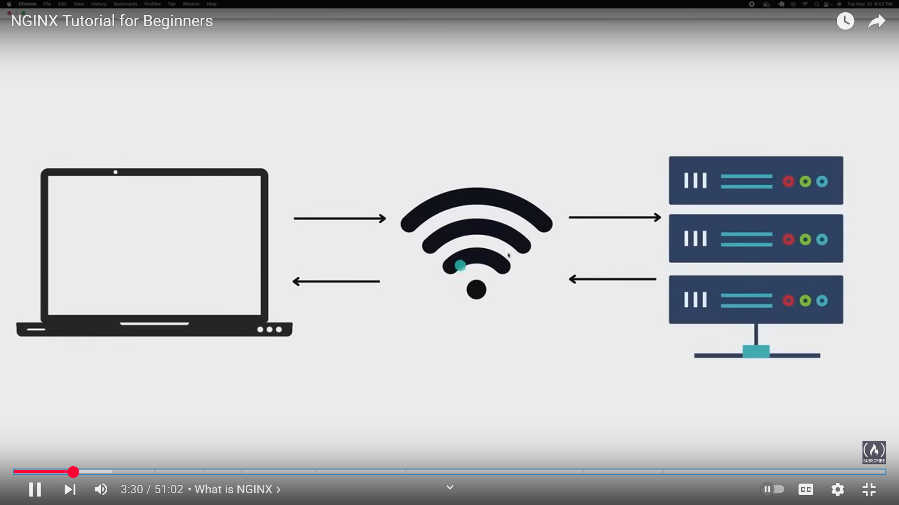

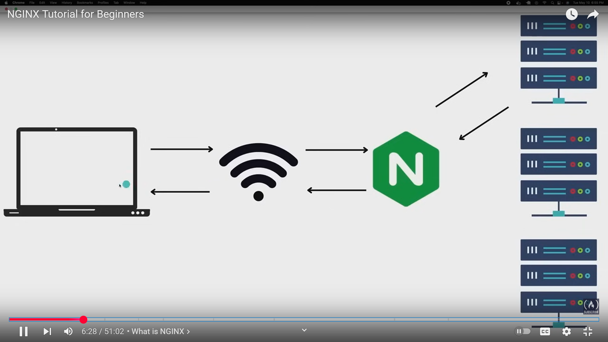

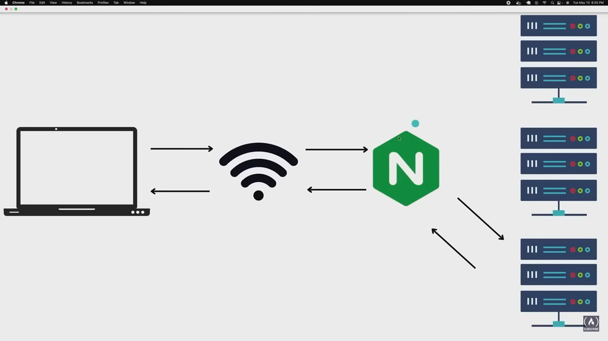

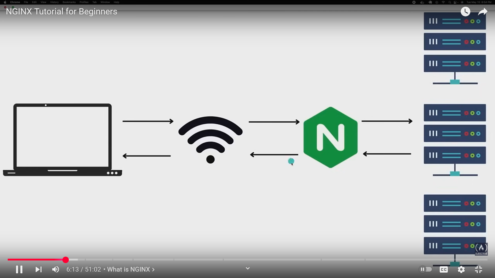

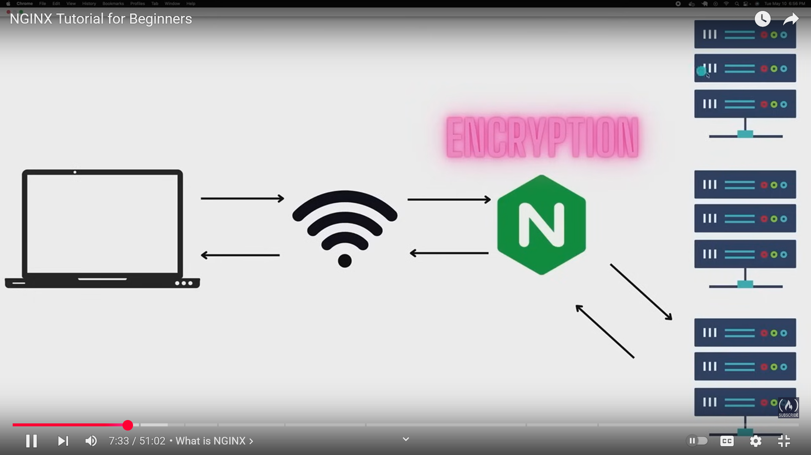

**TRADITIONAL WEB SERVER ISSUES-------**

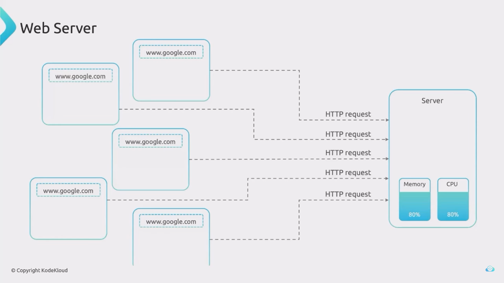

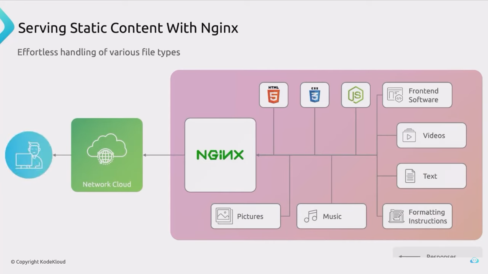

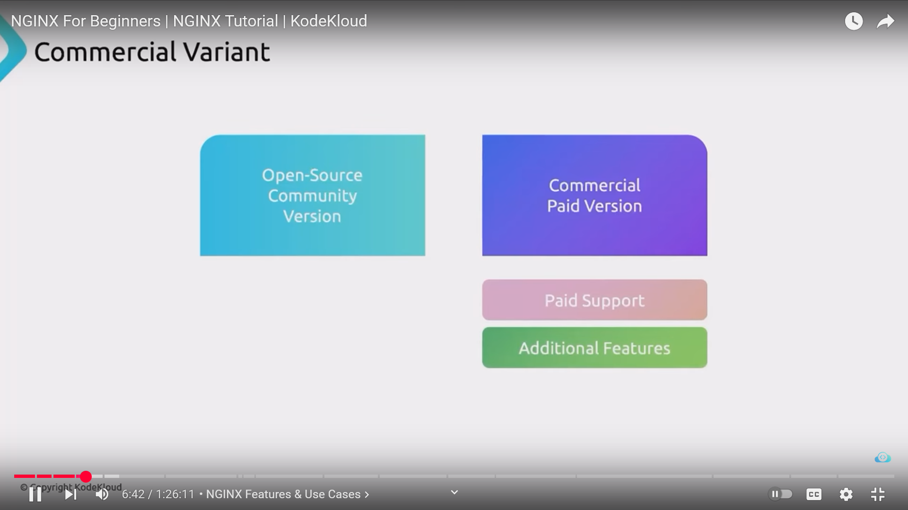

#### 📌 Summary

* ✅ **Nginx is essential** for modern web deployment.
* ✅ It can  **serve your frontend** ,  **proxy backend** ,  **secure with HTTPS** , and  **scale with load balancing** .
* ✅ Learning Nginx early gives you strong deployment and DevOps skills.

---

## ----Nginx vs Traditional Web Servers

✅ **What is a traditional web server?**

Traditional web servers, like  **Apache HTTP Server** , were designed primarily to serve web content using the  **process/thread-per-connection model** . For every request or connection, a new thread or process is created to handle it.

#### ✅ **Nginx vs Traditional Web Servers (like Apache)**

| Feature / Aspect                  | **Nginx**                                                         | **Apache (Traditional Web Server)**                                                 |
| --------------------------------- | ----------------------------------------------------------------------- | ----------------------------------------------------------------------------------------- |
| **Architecture**            | Event-driven, asynchronous, non-blocking                                | Process- or thread-based, blocking                                                        |
| **Performance under Load**  | Handles thousands of concurrent connections efficiently                 | Struggles as connections increase<br /> due to process/thread overhead                    |
| **Static Content Handling** | Extremely fast and efficient                                            | Slower compared to Nginx                                                                  |
| **Dynamic Content**         | Relies on external processors (e.g., PHP-FPM)                           | Built-in (mod_php or other modules)                                                       |
| **Configuration**           | Declarative, concise, fast reloads                                      | Verbose, flexible, but slower reloads                                                     |
| **Reverse Proxy Support**   | First-class support, highly performant                                  | Available but not the primary focus                                                       |
| **Memory Usage**            | Very low even with many connections                                     | High when many threads/processes<br />are active                                          |
| **Security**                | Smaller attack surface due to fewer modules                             | More features = larger surface for<br />vulnerabilities                                   |
| **Use Case Preference**     | Best for high concurrency, reverse proxy, load balancing, microservices | Useful when extensive module support<br />and in-process dynamic content <br />is needed |

#### ✅ **Nginx is typically preferred when:**

* You need to serve **static files (HTML, JS, CSS, images)** at high speed.
* You're acting as a **reverse proxy** or **load balancer** for backend servers.
* Your application must handle  **tens of thousands of concurrent users** .
* You're using **microservices** or  **containerized services** .
* You want an **API gateway** for routing requests efficiently.

#### ✅ **Apache is better suited when:**

* You have legacy applications that rely heavily on **.htaccess** files.
* You're running **PHP-heavy** apps (though Nginx + PHP-FPM is better today).
* You need specific modules only available in Apache.

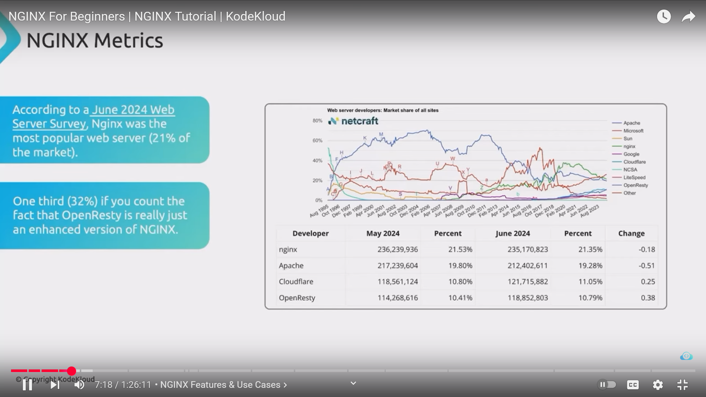

#### ✅ **Summary**

* **Nginx = Lightweight, high performance, ideal for modern web apps.**
* **Apache = Versatile and feature-rich, but heavier and less performant at scale.**

For our learning path (since you’re working with EC2, PM2, and deploying apps), **Nginx is an essential modern skill** for:

* Serving frontend files
* Reverse proxying Node apps
* SSL termination
* Load balancing

---

## ----Nginx Architecture

🧠 **Nginx Architecture Overview**

Nginx is  **event-driven** ,  **asynchronous** , and  **non-blocking** . Unlike traditional web servers that spawn a new thread or process for each request, Nginx handles many requests in a **SINGLE THREAD** using a  **reactor pattern** .

#### 🔧 **Key Components of Nginx Architecture**

1. **Master Process**

* **Responsible for:**
  * Reading and evaluating configuration files (`nginx.conf`)
  * Spawning and controlling worker processes
  * Managing signals (e.g., for reload or stop)
* Think of it as the **orchestrator** of everything in Nginx.

2. **Worker Processes**

* **Main workers that handle actual client requests** .
* Each worker is  **single-threaded** ,  **non-blocking** , and uses  **asynchronous I/O** .
* **All workers are equal** — they accept requests from the shared queue.
* Nginx can scale well because **a small number of workers (even 1-4)** can handle  **thousands of concurrent connections** .

3. **Event Loop / Event-Driven Model**

* Core of Nginx performance.
* Uses the **epoll** (Linux), **kqueue** (BSD), or **select/poll** (others) system calls.
* Handles multiple events (e.g., new connection, read/write data, timeout)  **without blocking** .
* This model allows Nginx to efficiently manage:
  * Static file serving
  * Proxying to backend apps (like Node.js or PHP-FPM)
  * SSL/TLS
  * Load balancing

4. **Modules (Dynamic or Static)**

* Nginx functionality is built using  **modules** .
* Common types:
  * **HTTP modules** (e.g., gzip compression, static file serving, proxy_pass)
  * **Stream modules** (for TCP/UDP)
  * **Mail modules** (for IMAP/SMTP)
  * **3rd-party modules** (like rate limiting, JWT auth, Lua scripting)

5. **Shared Memory Zones**

* Used for:
  * Caching
  * Rate limiting
  * Session persistence
* Allows **worker processes to share data** without duplicating memory.

#### 🔄 **How a Request is Handled (Request Lifecycle)**

1. **Client sends a request** to Nginx.
2. **OS routes it** to one of the Nginx **worker processes** via the event loop.
3. Worker parses the request using **configured rules** (from `nginx.conf`).
4. Nginx woker processes:
   * Serves a  **static file** ,
   * Proxies to a **backend server** (e.g., Node.js via PM2),
   * Or returns an error/redirect/cached response.
5. Response is sent back to the client —  **all using non-blocking I/O** .

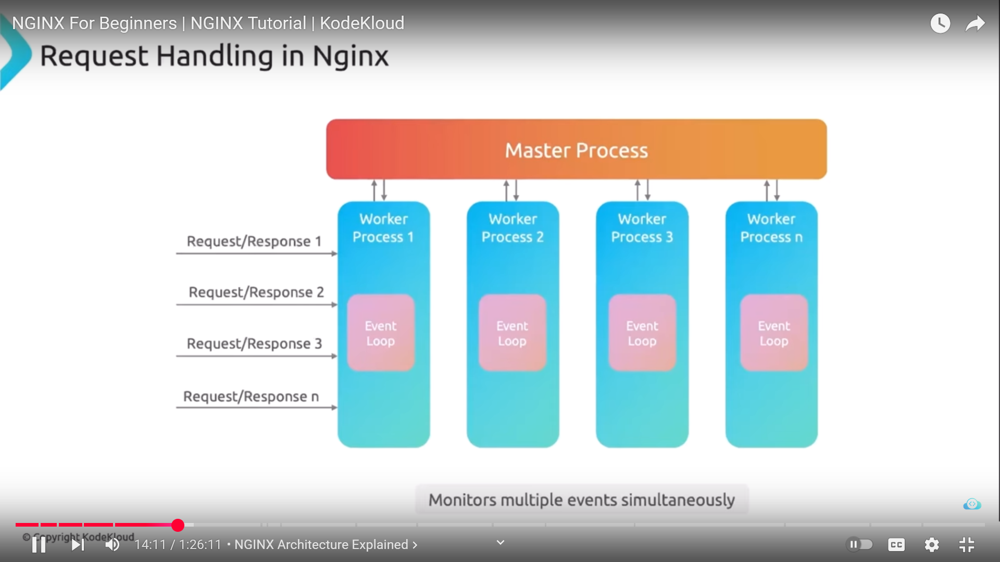

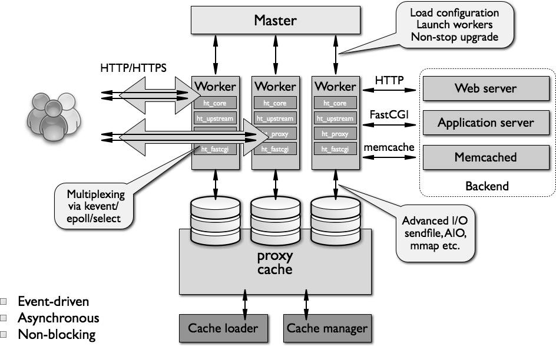

#### ✨ **Why This Architecture is Powerful**

* **Scalable** : One Nginx server can handle 10,000+ connections easily.
* **Efficient** : Low memory usage and CPU footprint.
* **Stable** : Worker crashes don’t bring down the master or other workers.
* **Modular** : You can add/enable only the modules you need.
* **Flexible** : Can act as a web server, reverse proxy, load balancer, cache, etc.

#### ✅ Use Cases Enabled by This Architecture

* Serving static content blazingly fast
* Acting as a **reverse proxy** for Node.js, Django, PHP apps
* SSL termination and HTTPS redirection
* **Load balancing** traffic across backend servers
* API gateway with caching, rate-limiting, auth, etc.

---

## ----Load Balancing

🔵 What is Load Balancing?

**Load balancing** is the process of distributing incoming network traffic across multiple servers (called a  **server pool** ) to ensure no single server becomes overwhelmed. It helps improve:

* **Performance**
* **Availability**
* **Scalability**
* **Fault tolerance**

#### 🧠 Why is Load Balancing Needed?

Imagine a scenario:

* You have 1 server handling 10,000 user requests per second.
* The server slows down or crashes due to overload.
* **Solution:** Use 3 servers, and a **load balancer** that intelligently routes traffic to them evenly.

#### ✅ Benefits of Load Balancing

| Benefit                       | Description                                                          |
| ----------------------------- | -------------------------------------------------------------------- |
| ✅**High Availability** | If one server fails, traffic is rerouted to healthy servers.         |
| ✅**Scalability**       | You can add/remove servers behind the balancer without downtime.     |
| ✅**Performance**       | Prevents one server from being overloaded while others are idle.     |
| ✅**Redundancy**        | Acts as a failover in disaster recovery setups.                      |
| ✅**Security**          | Can hide the identity and IPs of backend servers from public access. |

#### 🔧 Types of Load Balancers

| Type                              | Description                                                           |
| --------------------------------- | --------------------------------------------------------------------- |
| 🔁**Layer 4 (Transport)**   | Works at TCP/UDP level (IP + port). Faster but less intelligent.      |
| 🌐**Layer 7 (Application)** | Understands HTTP, HTTPS, etc., and can inspect URL, cookies, headers. |

#### ⚙️ Load Balancing Algorithms

| Algorithm                        | Description                                                            |
| -------------------------------- | ---------------------------------------------------------------------- |
| 🔄**Round Robin**          | Cycles through each server sequentially. Simple but effective.         |
| ⚖️**Least Connections**  | Chooses the server with the fewest active connections.                 |
| 🧠**IP Hash**              | Hashes client IP to always route to the same server (sticky sessions). |
| 🚦**Weighted Round Robin** | Servers have weights (e.g., more powerful servers get more traffic).   |
| 📈**Resource-Based**       | Routes based on CPU, memory, response time, etc. (advanced setups).    |

#### 🛠️ Tools for Load Balancing

| Tool                 | Type        | Use Case                                    |
| -------------------- | ----------- | ------------------------------------------- |
| **Nginx**      | Layer 7     | HTTP/HTTPS load balancing + reverse proxy   |
| **HAProxy**    | Layer 4 & 7 | High-performance, widely used in production |
| **AWS ELB**    | Layer 4/7   | Load Balancer on Amazon Cloud               |
| **Traefik**    | Layer 7     | Load balancer & dynamic reverse proxy       |
| **Cloudflare** | Layer 7     | CDN + load balancer + security              |

#### 📦 Example: Load Balancing in Nginx

```nginx
http {
  upstream myapp {
    server 127.0.0.1:3000;
    server 127.0.0.1:3001;
    server 127.0.0.1:3002;
  }

  server {
    listen 80;
    location / {
      proxy_pass http://myapp;
    }
  }
}
```

* `upstream` defines the backend pool.
* Requests are balanced across the 3 app servers.

#### 🧪 Common Load Balancing Scenarios

1. **Web Applications** : Distribute traffic to multiple Node.js instances.
2. **Microservices** : Route traffic to specific services using rules.
3. **Global Traffic** : Use Geo-based routing to reduce latency.
4. **Failover Setup** : Route to standby servers if main ones fail.

---

## ----Reverse Proxy vs Forward Proxy

#### 🔸 What is a Proxy?

A **proxy** is a server that sits between a client and a destination server. It helps route, filter, or modify requests.

#### 🟩 **1. Forward Proxy**

🔹 What it does:

* Sits **in front of the client** (user).
* Acts **on behalf of the client** to access the internet.
* Hides the **client’s identity** from the server.

🔹 Use Case:

* Bypass restrictions
* Hide identity
* Content filtering

🔹 More Use Cases:

* Accessing geo-blocked or restricted content.
* Client-side caching.
* Controlling employee internet usage in organizations.
* Hiding client’s IP for anonymity (used in VPNs, Tor).

🔹 Example 1:

A computer in a company network sends a request to `www.youtube.com`. The forward proxy receives this request, forwards it to YouTube, then sends the response back to the computer.

🔹 Diagram:

```
Client → Forward Proxy → Internet Server
```

> Acts  **on behalf of the client** .
>
> Hides the **client** from the  **server** .

🔹 Example 2:

Imagine you're in a school where access to YouTube is blocked.

You configure your browser to use a forward proxy server located outside.

* Your request goes to the **forward proxy** first.
* The proxy then sends the request to YouTube.
* YouTube thinks the proxy is the real client.
* The proxy returns the response to you.

🔹 Flow:

```
[Client] → [Forward Proxy] → [YouTube]
                             ↑
                        Returns data
```

#### 🟦 **2. Reverse Proxy**

🔹 What it does:

* Sits  **in front of the server** .
* Acts **on behalf of the server** to handle client requests.
* Hides the **server’s internal details** from the client.

🔹 Use Cases:

* Load balancing (distributing requests to multiple servers).
* SSL termination (handling HTTPS).
* Serving static content.
* Caching and compression.
* Protecting backend services (security, firewall).

🔹 Example 1:

When a user requests `www.myapp.com`, the reverse proxy (like Nginx) handles the request and forwards it to one of several backend servers based on load.

🔹 Diagram:

```
Client → Reverse Proxy → Backend Server(s)
```

🔹 Example 2:

You visit `www.myapp.com` hosted behind Nginx (a reverse proxy).

That Nginx server:

* Accepts your request.
* Decides which **backend server** to send the request to (e.g., `Node.js`, `Python`, etc.).
* Forwards the request internally.
* Sends the backend's response back to you.

The **client never knows** about the backend structure.

🔹 Flow:

```
[Client] → [Reverse Proxy (e.g., Nginx)] → [Backend Server]
                                           ↑
                                      Returns data
```

🔹 Use Case:

* Load balancing
* SSL termination
* Caching/static file serving
* Hiding internal architecture

#### 🆚 Key Differences

| Feature              | Forward Proxy                 | Reverse Proxy                         |
| -------------------- | ----------------------------- | ------------------------------------- |
| Sits in front of     | Client                        | Server                                |
| Client knows proxy?  | Yes                           | No (often hidden)                     |
| Server knows client? | No (client is hidden)         | Yes                                   |
| Main use             | Privacy, filtering, bypassing | Load balancing, performance, security |

#### ✅ Summary Table

|                    | **Forward Proxy**                     | **Reverse Proxy**                     |
| ------------------ | ------------------------------------------- | ------------------------------------------- |
| Acts on behalf of  | Client                                      | Server                                      |
| Who configures it? | The client or user's browser                | The server admin                            |
| Purpose            | Access control, anonymity, filtering        | Load balancing, caching, security           |
| Hides              | The**client**from the**server** | The**server**from the**client** |
| Example tool       | Squid proxy, Shadowsocks, VPN               | Nginx, HAProxy, Apache HTTPD                |

---

## ----Ngnix Configuration file

The **Nginx configuration file** is typically named `nginx.conf` and is the heart of how Nginx behaves. It's used to configure everything—from serving static files, reverse proxying to Node.js, handling load balancing, SSL, and more.

#### 🔹 Default Location of nginx.conf

* **Linux** (Ubuntu, Debian): `/etc/nginx/nginx.conf`
* **macOS (Homebrew)** : `/usr/local/etc/nginx/nginx.conf`
* **Windows** : `conf/nginx.conf` inside the installation directory

#### 🧱 Overall Structure of `nginx.conf`

Here’s a breakdown of the core structure:

```nginx
# 1. Main Context
user  www-data;
worker_processes  auto;

error_log  /var/log/nginx/error.log warn;
pid        /var/run/nginx.pid;

# 2. Events Context
events {
    worker_connections 1024;
}

# 3. HTTP Context
http {
    include       /etc/nginx/mime.types;
    default_type  application/octet-stream;

    log_format  main  '$remote_addr - $remote_user [$time_local] "$request" '
                      '$status $body_bytes_sent "$http_referer" '
                      '"$http_user_agent" "$http_x_forwarded_for"';

    access_log  /var/log/nginx/access.log  main;

    sendfile        on;
    keepalive_timeout  65;

    # 4. Server Block(s)
    server {
        listen       80;
        server_name  example.com;

        # 5. Location Block(s)
        location / {
            root   /var/www/html;
            index  index.html index.htm;
        }

        location /api/ {
            proxy_pass http://localhost:3000;
        }
    }
}
```

#### 🧩 Structure Components Explained

1. 🔹 **Main Context (Global Settings)**

* Defined **outside** any block.
* Applies globally to Nginx.

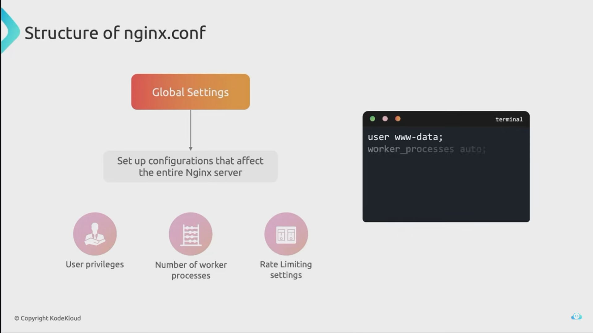

```nginx
worker_processes auto;
user www-data;
```

2. 🔹 **Events Block**

* **Configures how Nginx handles connections.**

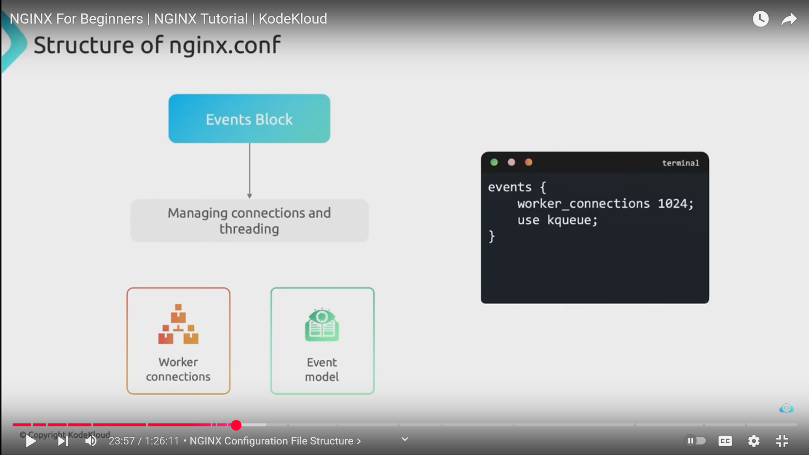

```nginx
events {
    worker_connections 1024;
}
```

3. **🔹 Http Block**

* Required if you’re handling  **HTTP** /web traffic.
* Can contain:

  * `server` blocks (virtual hosts)
  * logging
  * compression
  * MIME types
  * connection settings

  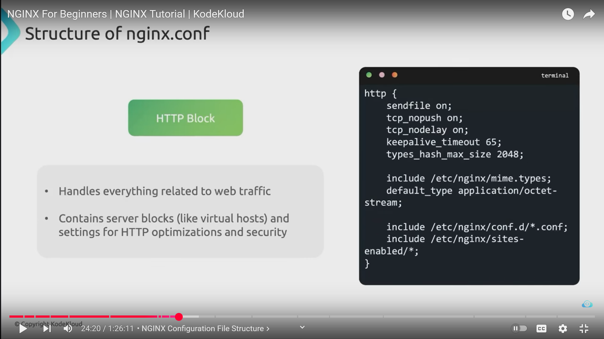

```nginx
http {
    include       mime.types;
    access_log    /var/log/nginx/access.log;
}
```

4. **🔹 Server Block — “Virtual Host”**

* Handles requests for a specific domain or port.
* Multiple `server` blocks can be used to host multiple sites.

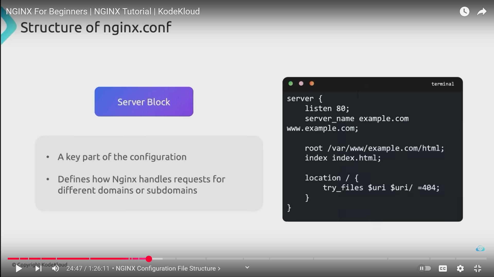

```nginx
server {
    listen 80;
    server_name example.com;
}
```

5. **🔹 Location Block**

* Handles **URI-specific routing** (like `/`, `/api`, `/static`, etc).
* Can be used for:
  * Serving static files
  * Reverse proxying to backend (Node.js, Python, etc.)
  * Redirects

```nginx
location / {
    root /var/www/html;
    index index.html;
}

location /api {
    proxy_pass http://localhost:3000;
}
```

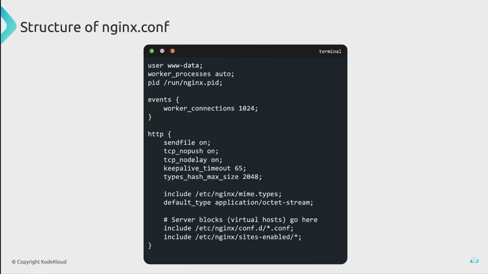

#### 📦 Other Useful Contexts (outside nginx.conf)

* **`sites-available/`** and  **`sites-enabled/`** :
  * Used in distros like Ubuntu
  * You define domain configs in `sites-available`, and symlink to `sites-enabled`.
* **`include` directives** :
* To modularize config and avoid bloated `nginx.conf`.

Example:

```nginx
include /etc/nginx/conf.d/*.conf;
include /etc/nginx/sites-enabled/*;
```

#### ✅ Tips

* After editing the config, always test it:
  ```bash
  sudo nginx -t
  ```
* Then reload:
  ```bash
  sudo systemctl reload nginx
  ```

......................................................................................................................

### -----Config File Code Explanation

🔧 Overall Structure

```nginx
# 1. Main Context
user www-data;
worker_processes auto;
error_log /var/log/nginx/error.log warn;
pid /var/run/nginx.pid;

# 2. Events Context
events {
    worker_connections 1024;
}

# 3. HTTP Context
http {
    include /etc/nginx/mime.types;
    default_type application/octet-stream;

    log_format main '$remote_addr - $remote_user [$time_local] "$request" '
                    '$status $body_bytes_sent "$http_referer" '
                    '"$http_user_agent" "$http_x_forwarded_for"';

    access_log /var/log/nginx/access.log main;

    sendfile on;
    keepalive_timeout 65;

    # 4. Server Block
    server {
        listen 80;
        server_name example.com;

        # 5. Location Blocks
        location / {
            root /var/www/html;
            index index.html index.htm;
        }

        location /api/ {
            proxy_pass http://localhost:3000;
        }
    }
}
```

##### 🧱 1. **Main Context**

These directives apply globally to the Nginx server:

* `user www-data;` → Specifies the Linux user Nginx worker processes run as.
* `worker_processes auto;` → Automatically sets number of worker processes based on CPU cores.
* `error_log` → Path to log file for errors.
* `pid` → Stores the Nginx master process PID.

##### 🔄 2. **Events Context**

Handles how Nginx deals with connections:

* `worker_connections 1024;` → Max number of simultaneous connections per worker process.

##### 🌐 3. **HTTP Context**

Used for HTTP web traffic and contains global web server settings:

* `include /etc/nginx/mime.types;` → Loads MIME type definitions.
* `default_type application/octet-stream;` → Default MIME type if not recognized.
* `log_format main ...` → Defines a custom access log format called `main`.
* `access_log` → Specifies log file and format used.
* `sendfile on;` → Enables efficient file serving (zero-copy).
* `keepalive_timeout 65;` → Timeout for keeping client connections alive.

##### 🌍 4. **Server Block**

Defines a virtual host (e.g., per domain or subdomain):

* `listen 80;` → Listens on port 80 (HTTP).
* `server_name example.com;` → Responds to requests for this domain.

##### 📁 5. **Location Blocks**

Used to match and serve specific URLs or paths:

➤ `location /`

* Matches `/` and all subpaths (except more specific locations like `/api/`).
* `root /var/www/html;` → Files are served from this directory.
* `index` → Default file to serve (if URL path is a folder).

➤ `location /api/`

* Requests to `/api/...` are **proxied** to a backend service (e.g., Node.js on port 3000).
* `proxy_pass http://localhost:3000;` → Acts as a  **reverse proxy** .

##### 💡 Summary

| Component        | Purpose                                        |
| ---------------- | ---------------------------------------------- |
| `main context` | Global Nginx settings                          |
| `events`       | Controls worker connection limits              |
| `http`         | Defines how HTTP traffic is processed          |
| `server`       | Represents a virtual host                      |
| `location`     | Defines routing rules within that server       |
| `proxy_pass`   | Forwards requests to a backend (reverse proxy) |

---

## ----Directiives in Nginx Configuration file

In  **Nginx configuration** , a line like:

```nginx
user www-data;
```

is called a  **directive** .

#### 🔹 What is a directive?

A **directive** is a key-value instruction that tells Nginx  **what to do** . It usually ends with a semicolon (`;`).

#### 🔹 Types of Directives

There are two main types:

1. **Simple Directives**

   These have a **name** and  **value(s)** :

   ```nginx
   worker_processes auto;
   keepalive_timeout 65;
   ```

   * `worker_processes` is the directive name
   * `auto` is the value
2. **Block Directives**

   These contain **nested directives** inside curly braces:

   ```nginx
   http {
       server {
           listen 80;
       }
   }
   ```

   * `http` and `server` are block directives

#### 📌 Example

```nginx
location /api/ {
    proxy_pass http://localhost:3000;
}
```

* `location` is a **block directive**
* `proxy_pass` is a **simple directive** inside it

---

## ----Nginx Installation

Here's a complete and clear explanation of **how to install Nginx** on various systems, along with tips on starting, stopping, and managing it:

#### Nginx Installation by OS

🐧 On Ubuntu / Debian

```bash
sudo apt update
sudo apt install nginx -y
```

Then enable and start Nginx:

```bash
sudo systemctl enable nginx   # Starts Nginx at boot
sudo systemctl start nginx    # Starts Nginx now
```

Check status:

```bash
sudo systemctl status nginx
```

Test in browser:

```
http://<your-server-ip>
```

#### 🪟 On Windows

Nginx is **not installed as a service** by default on Windows, but you can run it manually:

1. Download the zip from [https://nginx.org/en/download.html](https://nginx.org/en/download.html)
2. Extract it
3. Run `nginx.exe` from the terminal or by double-clicking

To stop it:

```cmd
nginx.exe -s stop
```

#### 📂 Nginx Default File Locations

| Item               | Ubuntu/Debian                 | RHEL/CentOS                   |
| ------------------ | ----------------------------- | ----------------------------- |
| Config file        | `/etc/nginx/nginx.conf`     | `/etc/nginx/nginx.conf`     |
| Web root directory | `/var/www/html`             | `/usr/share/nginx/html`     |
| Service command    | `systemctl start              | stop                          |
| Log files          | `/var/log/nginx/access.log` | `/var/log/nginx/access.log` |

#### 🔧 Test and Reload Config

After modifying the config file:

```bash
sudo nginx -t        # Test config syntax
sudo systemctl reload nginx   # Reload Nginx without downtime
```

#### 🌐 Access in Browser

If your server's IP is `54.123.45.67`:

```http
http://54.123.45.67
```

You should see the default Nginx welcome page.

---

## ----Hosting Nginx

✅ In most real-world scenarios:

You **host Nginx on the same for example EC2 instance** as your application **unless** you have a specific reason to separate it.

#### 🔧 1. **Typical Setup (Nginx and App on Same EC2, if for eg using EC2)**

Architecture:

```
[Client] --> [Nginx on EC2] --> [Your backend app on same EC2]
```

Why this is preferred:

* ✅  **Low latency** : Communication between Nginx and backend is internal (via `localhost` or Unix socket).
* ✅  **Simple deployment** : Easy to manage, no networking complications.
* ✅  **Efficient** : Uses fewer cloud resources and less cost.

> Example:

* Nginx listens on port 80/443
* Proxies requests to Node.js on port 3000

#### 🧱 2. **Nginx and App on Different EC2s (Less Common)**

Architecture:

```
[Client] --> [Nginx EC2] --> [Backend App on another EC2]
```

When you’d do this:

* 🧩 You're load balancing across **multiple backend EC2 instances**
* 🔒 You want a **dedicated edge server** (e.g. in DMZ or behind firewall)
* 💼 You’re separating concerns (DevOps vs Backend)

> Nginx reverse proxies to `http://backend-instance-1:3000`, `backend-instance-2:3000`, etc.

#### 🧠 Rule of Thumb

| Scenario                             | Where to host Nginx                |
| ------------------------------------ | ---------------------------------- |
| Single app, single EC2               | Host Nginx on same instance        |
| Load balancing multiple backend EC2s | Host Nginx on separate EC2         |
| Edge caching/CDN-like use            | Separate Nginx (or use Cloudflare) |
| Microservices with a gateway         | Nginx or API Gateway separately    |

---

## ----Serving Static File

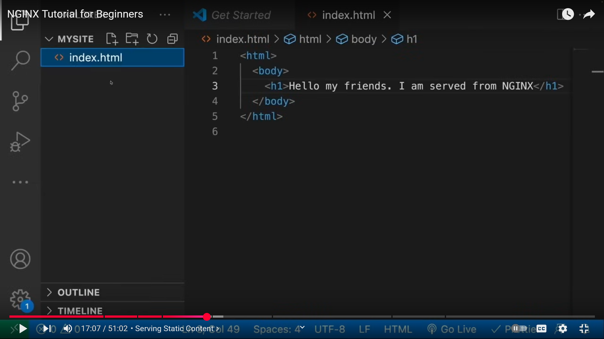

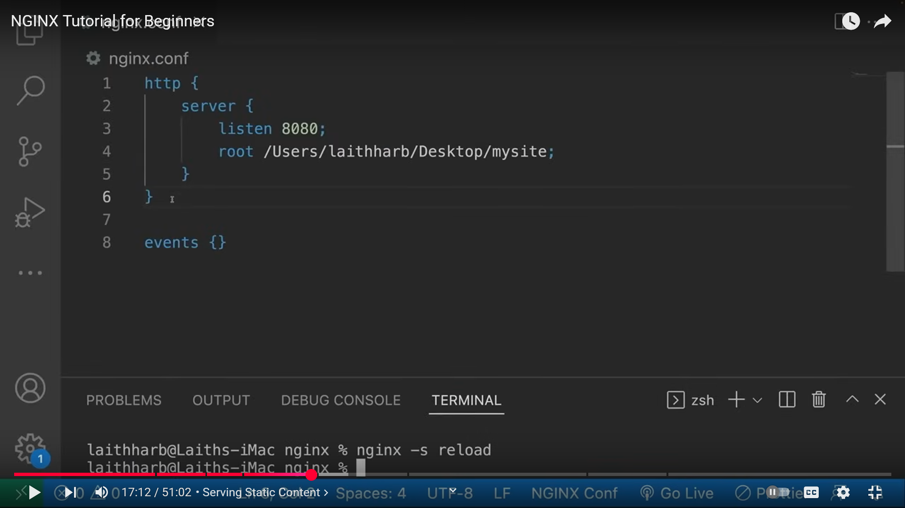


---

## ----Mime Types in Nginx

#### ✅ What is a MIME Type?

**MIME** stands for  **Multipurpose Internet Mail Extensions** .

A **MIME type** (also called a  **media type** ) is a **standard way to describe the type and format of a file** transmitted over the internet — especially in  **HTTP requests and responses** .

#### 🧠 Structure of a MIME type:

```
type/subtype
```

#### Examples:

| MIME Type                  | Description     | File Extension |
| -------------------------- | --------------- | -------------- |
| `text/html`              | HTML document   | `.html`      |
| `text/css`               | CSS stylesheet  | `.css`       |
| `application/json`       | JSON data       | `.json`      |
| `image/png`              | PNG image       | `.png`       |
| `audio/mpeg`             | MP3 audio       | `.mp3`       |
| `video/mp4`              | MP4 video       | `.mp4`       |
| `application/javascript` | JavaScript file | `.js`        |

#### 📦 Why are MIME types important?

They help **clients (browsers)** and **servers** understand how to handle content.

#### For example:

* If a server sends a `.jpg` image with MIME type `text/html`, the browser won’t render the image properly.
* If you upload a `.pdf` to a web app, the backend checks its MIME type to validate it's a real PDF.

#### 🧱 How Nginx uses MIME types:

In `nginx.conf`, Nginx includes a file like:

```nginx
include       mime.types;
```

This file maps file extensions to MIME types.

```nginx
types {
    text/html               html htm shtml;
    text/css                css;
    application/javascript  js;
    image/png               png;
    image/jpeg              jpeg jpg;
    application/json        json;
}
```

So if someone requests `file.js`, Nginx sets the `Content-Type: application/javascript` in the response header.

#### Example

**Here the `index.html` file now has a stylesheet named `style.css` as below--**

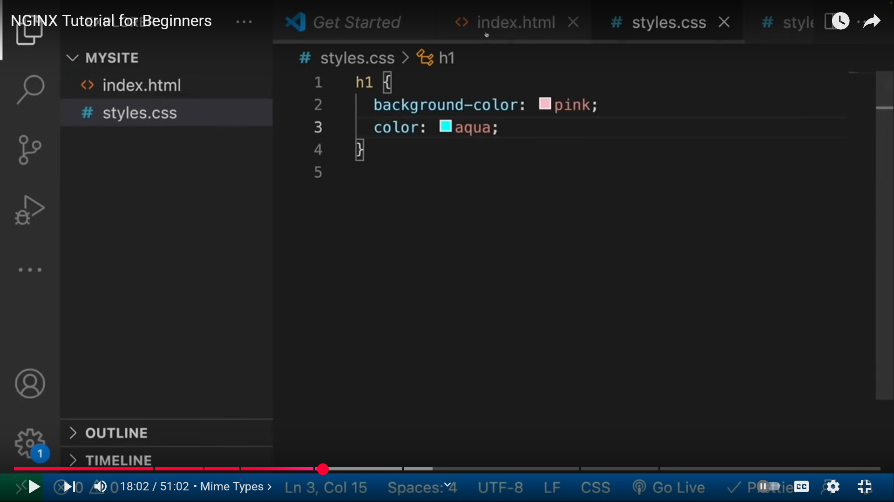

**So in `nginx.conf` ----**

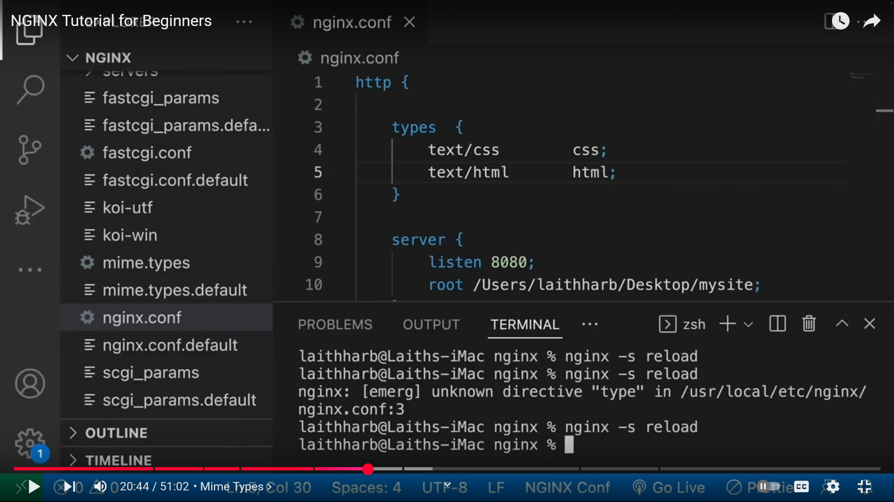

Or one can just include the file named `mime.types` (Can be found in the same folder as ` nginx.conf` ) in the   `nginx.conf` file

Below is `mime.types` -----

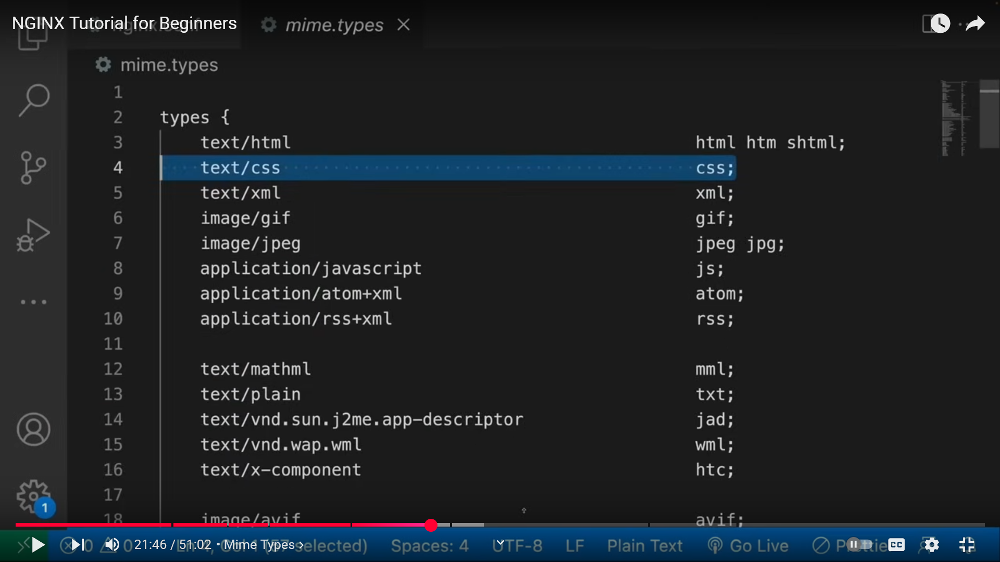

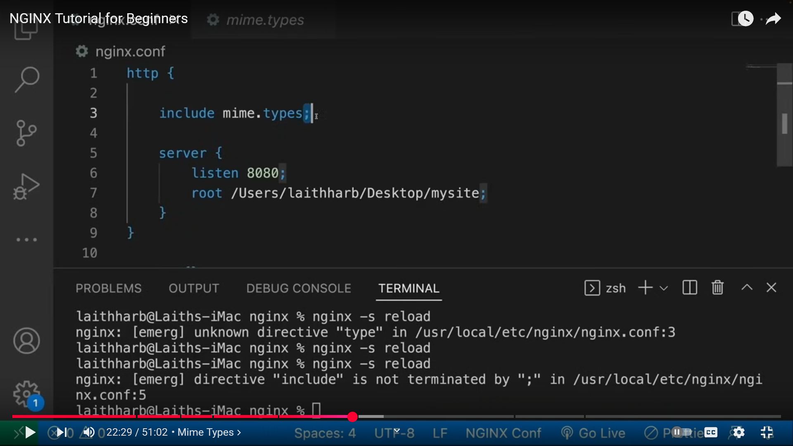

**Now th style in the `index.html` come up else it won't---**

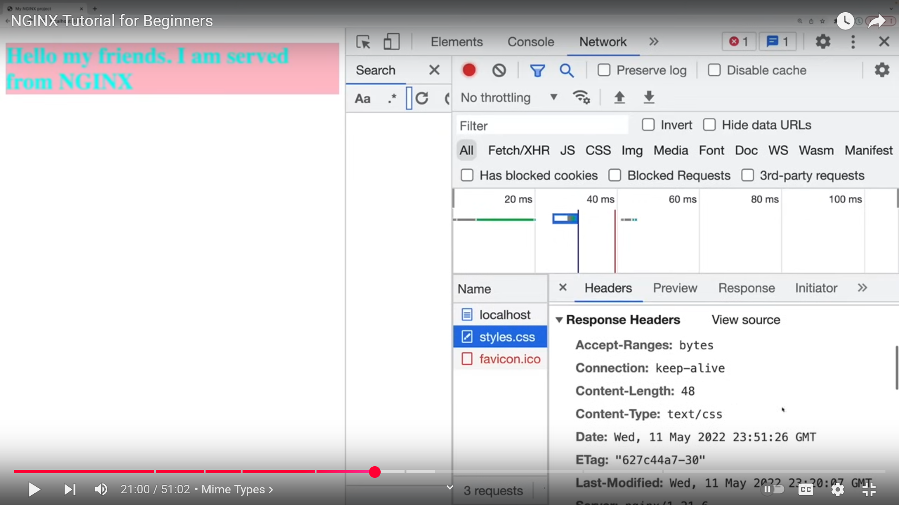

#### 📜 In HTTP headers:

```http
Content-Type: text/html; charset=UTF-8
```

This tells the browser: “The response body is HTML, and it's in UTF-8 encoding.”

#### 🔐 MIME Type Security Note:

Some attacks trick browsers by  **spoofing MIME types** . That’s why:

* Browsers now implement  **MIME sniffing protection** .
* Servers should send correct `Content-Type` headers.
* Nginx config can include:

```nginx
add_header X-Content-Type-Options nosniff;
```

This tells browsers: “Trust the MIME type I send. Don’t guess.”

---

## ----Location Context

In  **Nginx** , the `location` context is one of the most powerful and commonly used parts of the configuration. It defines **how Nginx should respond to requests for specific URIs (Uniform Resource Identifiers)** — such as `/images/`, `/api/`, or `/index.html`.

#### 🔹 Purpose of the `location` block

The `location` block tells Nginx **how to match a request URI** and what **action to take** — such as:

* Serve a static file
* Proxy the request to a backend
* Apply specific headers or rules

#### 🔧 Basic Syntax

```nginx
location [modifier] [URI pattern] {
    # configuration here
}
```

Let's say we want to serve `index.html` from `fruits` folder and the root `index.html` ie the below file---

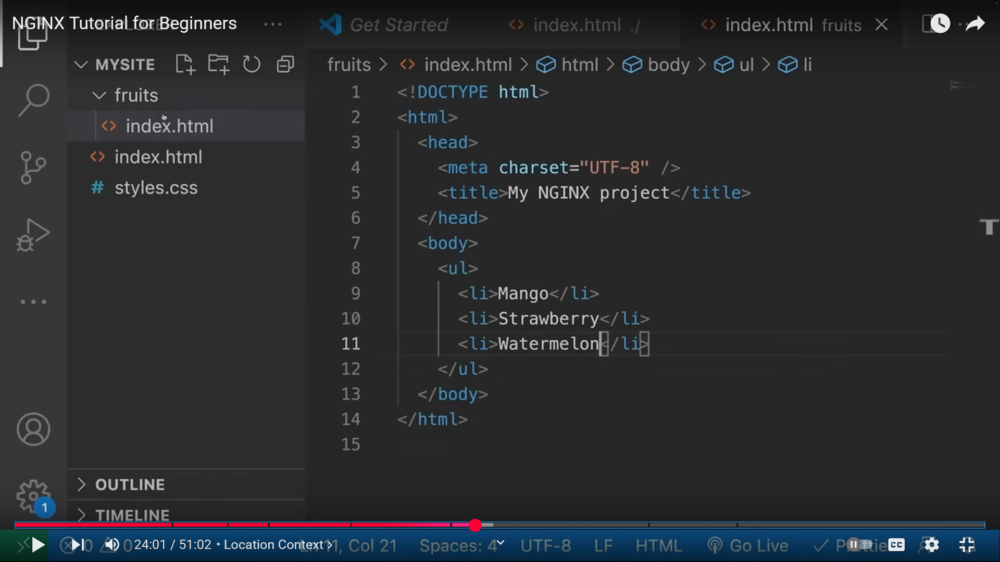

Then in `nginx.conf` ----

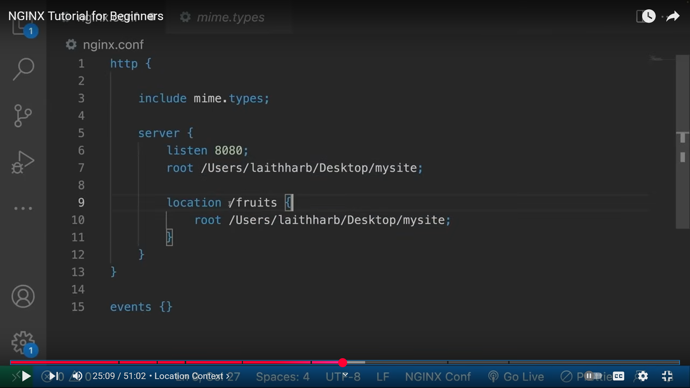

> Here when user types `http://localhost:8080/fruits` the `index.html` inside the `fruits` folder will be served, not the actual root `index.html` When it says `root /Users/laithharb/Desktop/mysite` inside `location /fruits {}`
>
> * it is actually talking about means `root /Users/laithharb/Desktop/mysite/fruits` Now since its prefixed with `root` it checks for `index.html` inside `/Users/laithharb/Desktop/mysite/fruits`


#### **Using `alias`**

**Use `alias` instead of `root` when the request URI shouldn't be appended directly and the aliased URI should also be served at the specified location---**

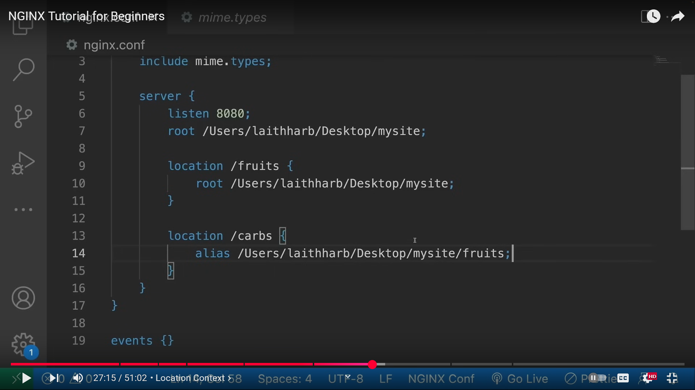


#### Using `try_files`

Now,

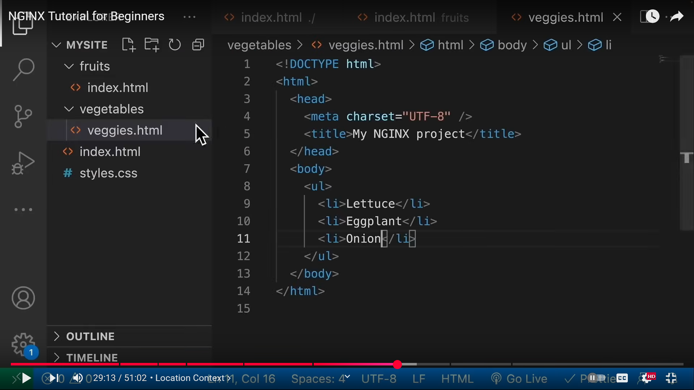

If user tries to access `http//localhost:8080/vegetables/veggies.html` will get error page coz the below says to look for `index.html` from `vegetables` folder which btw not present

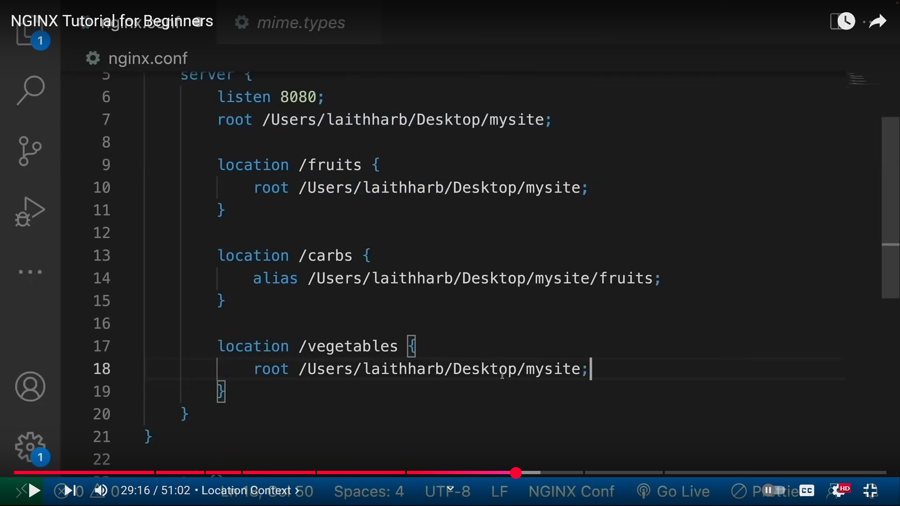

Hence---

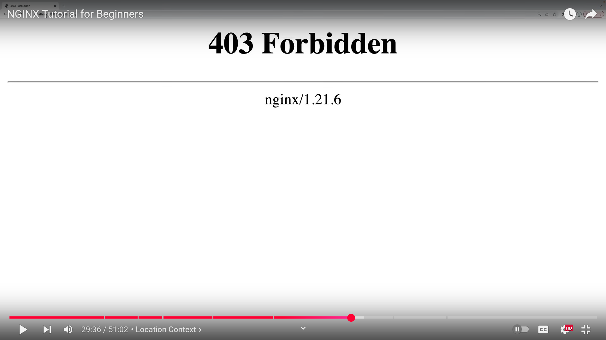

So with directive name `try_files` we tell it try for exactly `veggies.html` inside `vegetables` folder and if error try actual root `index.html`, if error go to `404 error page`

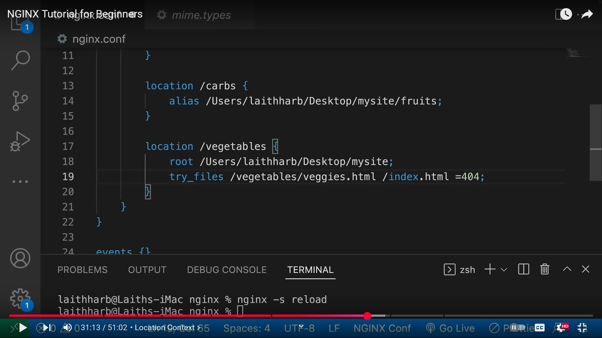

#### Using Regex

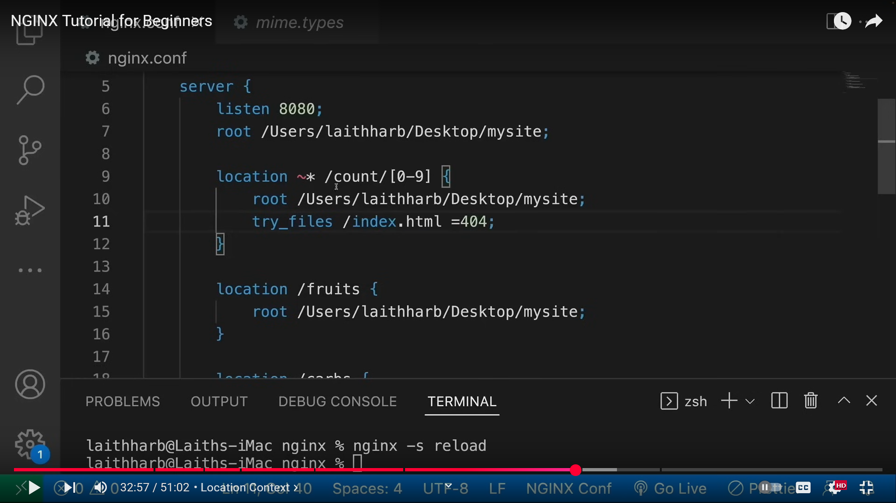

So if the user tries to access for example `http//localhost:8080/count/5` it first tries actual root `index.html` , if error shows 404 error page


#### 🧠 Modifiers in Location

There are **four** main modifiers, which affect how Nginx matches URIs.

| Modifier   | Meaning                                           | Example                    |
| ---------- | ------------------------------------------------- | -------------------------- |
| `= `     | Exact match only                                  | `location = /about.html` |
| `~`      | Case-sensitive regex match                        | `location ~ \.php$`      |
| `~*`     | Case-insensitive regex match                      | `location ~* .(jpg         |
| `^~`     | If this prefix matches, use it and stop searching | `location ^~ /static/`   |
| *(none)* | Prefix match (default)                            | `location /blog/`        |

#### 🔄 Matching Order (Important!)

When a request comes in, Nginx tries to match the URI using this order:

1. **Exact match** (`=`)
2. **Prefix match** with `^~`
3. **Regex matches** (`~` and `~*`) — **first match is used**
4. **Prefix match** without modifier — **longest match wins**

✅ If a match is found,  **no further searching is done** , except in step 4 (prefixes without modifiers).

#### 📦 Examples

**1. Serve a static HTML file**

```nginx
location = /about.html {
    root /var/www/html;
}
```

Matches **only** `/about.html`, not `/about.html?id=1`.

**2. Prefix match (default)**

```nginx
location /images/ {
    root /var/www/static;
}
```

Matches URIs like `/images/dog.jpg`, `/images/cat.png`, etc.

**3. Regex match (case-sensitive)**

```nginx
location ~ \.php$ {
    fastcgi_pass 127.0.0.1:9000;
}
```

Matches any URI ending in `.php` (e.g., `/index.php`, `/user.php`).

**4. Regex match (case-insensitive)**

```nginx
location ~* \.(jpg|jpeg|png|gif)$ {
    root /var/www/images;
}
```

Matches `/img/cat.JPG`, `/images/dog.png`, etc.

**5. Force match priority with `^~`**

```nginx
location ^~ /static/ {
    root /var/www/assets;
}
```

If the URI starts with `/static/`, Nginx will  **not evaluate regex locations** .

#### 🔄 Nested Location Example

```nginx
server {
    listen 80;

    location / {
        root /var/www/html;
        index index.html;
    }

    location /api/ {
        proxy_pass http://localhost:3000;
    }

    location ~ \.php$ {
        fastcgi_pass 127.0.0.1:9000;
        include fastcgi.conf;
    }
}
```

#### 🧪 Tips

* `location` blocks **can’t be nested** inside each other.
* If multiple blocks match, Nginx **uses the one that matches best** according to the rules.
* Use `try_files` inside a location to check multiple fallback options.
* Use `alias` instead of `root` when the request URI shouldn't be appended directly.

#### ⚠️ Common Confusion: `root` vs `alias`

```nginx
location /images/ {
    root /var/www/;  # /images/dog.jpg → /var/www/images/dog.jpg
}

location /static/ {
    alias /var/www/assets/;  # /static/app.js → /var/www/assets/app.js
}
```

---

## ----Redirect and Rewrite

In Nginx, a **redirect** is a way to instruct the client’s browser to go to a different URL than the one originally requested. This is typically used for SEO purposes, to forward traffic to new URLs, enforce HTTPS, domain changes, or cleaner URLs.

To redirect to `http://localhost:8080/fruits` when user tries to access `http://localhost:8080/crops` ----

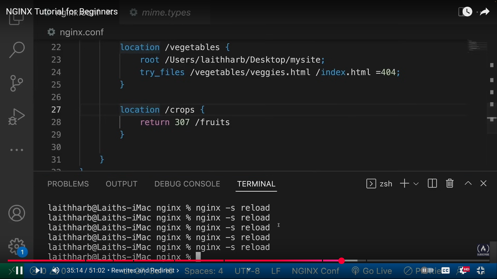

Here 307 is a status code for redirection

#### 🔁 Types of Redirects in Nginx:

**1. Permanent Redirect (301)**

* Tells browsers and search engines that the resource has been moved  **permanently** .
* Syntax:
  ```nginx
  return 301 https://example.com$request_uri;
  ```

**2. Temporary Redirect (302 or 307)**

* Used when the redirection is  **temporary** , e.g., during maintenance.
* Syntax:
  ```nginx
  return 302 https://temp.example.com$request_uri;
  ```

#### 🔧 Basic Redirect Using `return`

```nginx
server {
    listen 80;
    server_name olddomain.com;

    return 301 https://newdomain.com$request_uri;
}
```

* This redirects all traffic from `olddomain.com` to `newdomain.com` with the same path.

#### 🔁 Redirect Using `rewrite`

```nginx
location /old-path/ {
    rewrite ^/old-path/(.*)$ /new-path/$1 permanent;
}
```

* This rewrites `/old-path/something` to `/new-path/something` and returns a 301.

> ✅ Use `rewrite` when you want to **pattern match** or manipulate the URL more dynamically.

Let's break down this Nginx `rewrite` directive:

```nginx
rewrite ^/old-path/(.*)$ /new-path/$1 permanent;
```

🔍 What it does (Plain English):

This tells Nginx:

> "If a request comes in with a URL that starts with `/old-path/`, then take everything after that and rewrite the URL to start with `/new-path/` instead — and tell the client that this is a **permanent (301)** redirect."

> ##### 🔬 Breakdown of Each Part:
>
> ###### ✅ `rewrite`
>
> * This is the directive that tells Nginx to rewrite the incoming request URI.
>
> ###### ✅ `^/old-path/(.*)$`
>
> This is a **regular expression** that matches the incoming URL.
>
> * `^` — Anchor: start of the string.
> * `/old-path/` — The URL must start with `/old-path/`
> * `(.*)` — Capture everything after `/old-path/` and store it in a **capture group** called `$1`
> * `$` — End of string.
>
> So `/old-path/something/file.html` will match, and `something/file.html` will be stored as `$1`.
>
> ###### ✅ `/new-path/$1`
>
> This is the **new URL** pattern.
>
> * It replaces `/old-path/...` with `/new-path/...`
> * The `$1` refers to what was captured from `(.*)` — everything after `/old-path/`.
>
> ➡️ Example:
>
> * Request: `/old-path/images/logo.png`
> * Redirected to: `/new-path/images/logo.png`
>
> ###### ✅ `permanent`
>
> * This means send an HTTP **301 redirect** (permanent redirect).
>
> ##### 🧪 Example in Action
>
> ```nginx
> location /old-path/ {
>     rewrite ^/old-path/(.*)$ /new-path/$1 permanent;
> }
> ```
>
> **Input URL:**
>
> ```
> http://example.com/old-path/user/profile
> ```
>
> **Output (redirects to):**
>
> ```
> http://example.com/new-path/user/profile
> ```
>
> With status code `301 Moved Permanently`.

#### 🌐 Example Use Cases

| Scenario                       | How to Redirect                                     |
| ------------------------------ | --------------------------------------------------- |
| Force HTTPS                    | `return 301 https://$host$request_uri;`           |
| Non-www to www                 | `return 301 https://www.example.com$request_uri;` |
| Redirect outdated URLs         | `rewrite ^/old-page$ /new-page permanent;`        |
| Redirect to a maintenance page | `return 302 /maintenance.html;`                   |

#### ⚠️ Best Practices

* Use `301` for permanent changes only (browsers cache it).
* Use `rewrite` with caution; prefer `return` for simple full URL redirections (it's faster).
* Always test with tools like `curl -I` to check the response code.

Let me know if you want sample redirect configurations for HTTPS, domain changes, or trailing slashes.

---

## ----Important Nginx Commands

Here’s a list of the **most important Nginx commands** you’ll commonly use, especially as a developer or DevOps engineer managing a web server:

##### ✅ 1. **Start Nginx**

```bash
sudo systemctl start nginx
```

Starts the Nginx service.

##### ✅ 2. **Stop Nginx**

```bash
sudo systemctl stop nginx
```

Stops the Nginx service.

##### ✅ 3. **Restart Nginx**

```bash
sudo systemctl restart nginx
```

Stops and starts Nginx again. Use this after major config changes.

##### ✅ 4. **Reload Nginx**

```bash
sudo systemctl reload nginx
```

Reloads configuration  **without downtime** . Use this after editing `nginx.conf` or site files.

🔁 Safer than restart because it keeps the connections alive.

##### ✅ 5. **Check Nginx Status**

```bash
sudo systemctl status nginx
```

Shows if Nginx is running, failed, or inactive.

##### ✅ 6. **Enable Nginx on Boot**

```bash
sudo systemctl enable nginx
```

Ensures Nginx auto-starts when the server reboots.

##### ✅ 7. **Disable Nginx on Boot**

```bash
sudo systemctl disable nginx
```

Prevents auto-start of Nginx on system boot.

##### ✅ 8. **Test Nginx Configuration**

```bash
sudo nginx -t
```

Tests for syntax errors in the config files.

🔧 **Very important** before reloading/restarting.

##### ✅ 9. **Manually Reload (Non-systemd)**

If you're not using `systemctl` (like on some minimal distros), you can use:

```bash
sudo nginx -s reload
```

This sends a signal to the running process to reload config.

Other options:

```bash
sudo nginx -s stop      # Stop the server
sudo nginx -s quit      # Graceful shutdown
sudo nginx -s reopen    # Reopen log files
```

##### ✅ 10. **View Access Logs**

```bash
sudo tail -f /var/log/nginx/access.log
```

##### ✅ 11. **View Error Logs**

```bash
sudo tail -f /var/log/nginx/error.log
```

Use this to debug when something goes wrong.

##### ✅ 12. **Get Nginx Version**

```bash
nginx -v          # Short version
nginx -V          # Full version with compile options
```

##### **✅ 13. Basic Help Command**

```bash
nginx -h
```

**Output:** Lists all basic flags and options:

```bash
nginx version: nginx/1.18.0
Usage: nginx [-?hvVtTq] [-s signal] [-c filename] [-p prefix] [-g directives]

Options:
  -?,-h         : this help
  -v            : show version and exit
  -V            : show version and configure options then exit
  -t            : test configuration and exit
  -T            : test config and dump it
  -q            : suppress non-error messages during config test
  -s signal     : send signal to a master process: stop | quit | reopen | reload
  -p prefix     : set prefix path (default: /etc/nginx/)
  -c filename   : set config file (default: /etc/nginx/nginx.conf)
  -g directives : set global directives outside config file
```

......................................................................................................................

### `sudo systemctl __ nginx` vs `sudo nginx -s __`

**For this let's take an example `sudo systemctl stop nginx `  vs `sudo nginx -s stop`**

##### ✅ `sudo nginx -s stop`

* Sends a **signal directly to the Nginx master process** to stop gracefully.
* It's like saying: “Hey Nginx, shut down your processes now.”

**Usage Context:**

* Works only if Nginx is already running.
* **Does not use systemd/service manager** .
* Useful in  **manual, script-based setups** .

```bash
sudo nginx -s stop      # Gracefully stops Nginx
sudo nginx -s reload    # Gracefully reloads config
```

##### ✅ `sudo systemctl stop nginx`

* Asks **systemd (the system service manager)** to stop the Nginx service.
* It’s the “official” way to manage services on modern Linux systems (like Ubuntu 20+).

**Usage Context:**

* Works whether Nginx was started manually or by systemd.
* Can be used in automation, service restarts, reboots.

```bash
sudo systemctl stop nginx
sudo systemctl start nginx
sudo systemctl restart nginx
```

##### 🔍 Key Differences

| Feature                   | `nginx -s stop`        | `systemctl stop nginx`      |
| ------------------------- | ------------------------ | ----------------------------- |
| Uses systemd/service unit | ❌ No                    | ✅ Yes                        |
| Graceful shutdown         | ✅ Yes                   | ✅ Yes (via systemd)          |
| Service status check      | ❌ Can't check status    | ✅`systemctl status nginx`  |
| Auto-start on boot        | ❌ No effect             | ✅ Can enable/disable on boot |
| Best for production       | ❌ Not recommended alone | ✅ Preferred                  |

##### ✅ Recommendation

> Use `sudo systemctl stop nginx` in  **most cases** , especially for production, auto-starting on reboot, and service monitoring.

Use `nginx -s stop` only for quick dev testing or inside Nginx-specific scripts.

Let me know if you want to try both and inspect the behavior.

---

## ----Main Context

#### 📌Directive -- `user www-data`

It is a **directive** in the Nginx config file (`/etc/nginx/nginx.conf`) that defines:

> 🧑‍💻 **Which system user account Nginx worker processes should run as.**

📌 **Syntax:**

```nginx
user <username> [<groupname>];
```

For example:

```nginx
user www-data;
```

or

```nginx
user nginx nginx;
```

##### ⚙️ **Why `www-data`?**

* `www-data` is a **common default user** for web services (used by Apache, Nginx, PHP-FPM, etc.) on  **Debian/Ubuntu-based systems** .
* It is a **low-privilege user** created specifically for serving web content.
* Helps isolate Nginx processes from the rest of the system for security reasons.

##### 🧱 **How it works**

When you start Nginx:

* The **master process** runs as **root** (needed to bind to low ports like 80, 443).
* It **spawns worker processes** to handle actual HTTP requests.
* These worker processes drop privileges and run as **`www-data`** (or whatever user you specify).

##### 🔐 Why? **Security**

Running network-facing services as `root` would be dangerous. So:

* `root` starts Nginx (so it can bind to ports < 1024),
* Then it hands off the request-handling work to worker processes running as `www-data` for  **privilege separation** .

##### 📁 What does `www-data` have access to?

Limited access. Usually only:

* Files under `/var/www/`
* Nginx config files
* Log directories like `/var/log/nginx`

You need to **give read/execute permissions** to this user for any static files or directories Nginx needs to serve.

##### ⚠️ What if `user` is omitted?

If you **omit** the directive:

* On Debian/Ubuntu: defaults to `www-data`
* On CentOS: usually defaults to `nginx`
* Otherwise: may fallback to  **user ID of the process starter** , which could be unsafe

............................................................................................................................................................................................................................................

#### 📌Directive -- `worker_processes auto`

The `worker_processes` directive in Nginx is used to define **how many worker processes** should be spawned by the  **master process** . These worker processes handle incoming HTTP connections.

##### 🔧 **Syntax:**

```nginx
worker_processes <number|auto>;
```

##### 🔍 **What does it do?**

Each worker can handle **thousands of connections** due to Nginx’s event-driven, asynchronous architecture. However, setting the right number depends on:

* **CPU cores** available
* **Workload** (I/O bound vs CPU bound)

##### 🧪 **1. Basic Example (Single worker)**

```nginx
worker_processes 1;
```

* Best for small-scale dev environments or lightweight apps.
* All work handled by 1 process, regardless of CPU cores.

##### ⚡ **2. Optimized for CPU cores**

```nginx
worker_processes 4;
```

* Good if your server has 4 CPU cores.
* Manual setting to match the number of logical CPU cores.

> 📌 Tip: You can find how many cores your system has using:

```bash
nproc
```

##### 🔄 **3. Auto-detect number of CPU cores**

```nginx
worker_processes auto;
```

* Best practice in modern configurations.
* Nginx automatically detects the number of available cores.
* Works well across environments (local, cloud, container, etc.)

##### 🧠 Additional Notes

* `worker_processes` sets how many OS-level processes are spawned.
* `worker_connections` sets how many **simultaneous connections** each worker can handle.

> **Max connections = `worker_processes × worker_connections`**

E.g., if:

```nginx
worker_processes 4;
worker_connections 1024;
```

Then  **max connections ≈ 4096** , depending on system limits (e.g., `ulimit -n`).

............................................................................................................................................................................................................................................

#### 📌Directive -- `error_log /var/log/nginx/error.log warn;`

`🔍 **Purpose**

This directive tells Nginx **where** to store error messages and **what severity level** to log.

##### 🧩 **Explanation of Components**

✅ 1. `error_log`

* This is the Nginx directive used to  **define the location and level of the error log** .

✅ 2. `/var/log/nginx/error.log`

* This is the  **path to the log file** .
* Nginx will write error logs to this file.
* Common location in Linux-based systems.
* Must be writable by the Nginx user (`www-data`, typically).

✅ 3. `warn`

* This is the  **logging level** , which controls the **minimum severity** of errors that will be logged.

##### 📊 **Logging Levels (in order of severity)**

From **most critical** to  **least** :

| Level      | Description                          |
| ---------- | ------------------------------------ |
| `emerg`  | Emergency — system is unusable      |
| `alert`  | Immediate action needed              |
| `crit`   | Critical conditions                  |
| `error`  | Standard errors                      |
| `warn`   | Warning messages                     |
| `notice` | Normal but significant condition     |
| `info`   | Informational messages               |
| `debug`  | Debug-level messages (very detailed) |

> So in your example:

```nginx
error_log /var/log/nginx/error.log warn;
```

Nginx will log:

* `warn`
* `error`
* `crit`
* `alert`
* `emerg`

But **not** `notice`, `info`, or `debug`.

> ##### 🔥 **So Why Are `error`, `crit`, `alert`, and `emerg` Still Logged When You Set `warn`?**
>
> Because `warn` is the  **threshold** .
>
> * Think of it as: " **log everything that is `warn` or more severe** ."
> * So yes, `error`, `crit`, `alert`, and `emerg` are **more severe** than `warn`, so  **they’re included** .

............................................................................................................................................................................................................................................

#### 📌Directive -- `pid /var/run/nginx.pid;`

✅ **What It Means**

This tells Nginx to **store its master process PID (Process ID)** in the file:

```
/var/run/nginx.pid
```

##### 📌 **Why It Matters**

When Nginx starts, it creates a  **master process** . This process controls all worker processes and handles configuration reloads, graceful shutdowns, etc.

The `pid` directive saves the **process ID of this master process** into a file, so:

* System tools and scripts can easily locate and control the Nginx process.
* Commands like `nginx -s reload` use this file to find the process to signal.
* It helps manage Nginx with tools like `systemctl`, `kill`, and others.

##### 📁 **Location: `/var/run/nginx.pid`**

* It's the **standard location** for PID files on Linux.
* The directory `/var/run` (or `/run` in newer systems) is used to store runtime info like PIDs and sockets.

##### ⚠️ Notes

* If the file is missing or corrupted, Nginx may fail to reload or stop properly using `nginx -s` commands.
* You may need root or `sudo` privileges to access or modify this file.

............................................................................................................................................................................................................................................

#### 📌Directive -- `daemon on;`

🔹 `daemon`

Controls whether Nginx runs as a daemon (in the background).

```nginx
daemon on;   # default
daemon off;  # useful in Docker or debugging
```

##### ✅ When to Use `daemon off;`

You need `daemon off;` **in special use cases** where Nginx must  **stay in the foreground** , such as:

1. 🐳 **Running Nginx in a Docker container**

In containers, the main process **must run in the foreground** to keep the container alive.

So you usually write in your `nginx.conf` or Dockerfile:

```nginx
daemon off;
```

Or override with:

```Dockerfile
CMD ["nginx", "-g", "daemon off;"]
```

##### 🚫 When NOT to Use `daemon off;`

You should **NOT** use `daemon off;` when running Nginx in a **normal system service** context like:

```bash
sudo systemctl start nginx
```

In this case, `daemon on;` or just omitting it entirely is the standard.

............................................................................................................................................................................................................................................

#### 📌Directive -- `env MY_CUSTOM_ENV=production;`

🔹 `env`

Passes environment variables to Nginx workers.

```nginx
env MY_CUSTOM_ENV=production;
```

Great — you're referring to the `env` directive in Nginx configuration, which is used like this:

```nginx
env MY_ENV_VAR;
```

##### ✅ Why You Need to Pass Environment Variables in Nginx

By default,  **Nginx master process receives all environment variables** , but the  **worker processes do not** . If your app or reverse proxy setup relies on specific environment variables, you'll need to explicitly pass them using `env`.

##### 🔹 Use Cases for `env`

**1. Accessing sensitive configuration securely**

You can keep secrets or API keys outside your `nginx.conf` using environment variables:

```bash
export API_KEY=abc123
```

And in Nginx:

```nginx
env API_KEY;
```

Now inside a script or `fastcgi_param`, Nginx can use this variable.

**2. Conditional behavior in dynamic modules / scripts**

If you use Nginx to proxy to scripts (via FastCGI, uWSGI, etc.), you might want to pass certain config flags:

```nginx
env APP_ENV;
```

So that downstream services know if it’s `production`, `staging`, etc.

**3. Docker / Kubernetes setups**

You often use environment variables to configure apps in container environments. When running Nginx in Docker, and passing env vars via `-e` or `env:` block, you must tell Nginx to expose them to worker processes:

```nginx
env NODE_ENV;
env PORT;
```

##### 🔒 Important Notes

* You **must** define `env` directives in the **main context** (i.e., top-level, not inside `http`, `server`, or `location` blocks).
* You can only use simple variable names, **not values** (no `env MY_VAR=value`).
* Nginx **does not reload env vars** on `nginx -s reload`; you must restart the process to apply new env var values.

............................................................................................................................................................................................................................................

---

## ----Event Context

The `events` context in the Nginx configuration is used to define directives that affect how Nginx handles **connections** at a low level — especially for performance and concurrency.

* It is a **top-level context** in `nginx.conf`, usually right after the `main` (global) context and before the `http` block.

#### ✅ Common Directives in `events` Context

##### 1. **`worker_connections`**

* **Defines** : The maximum number of simultaneous connections a **single worker process** can handle.
* **Syntax** :

```nginx
  worker_connections 1024;
```

* **Effect** : If you have `worker_processes 4`, the total possible concurrent connections = `4 * 1024 = 4096`.

##### 2. **`multi_accept`**

* **Defines** : Whether a worker process should accept **multiple connections** at once (instead of one per event loop iteration).
* **Syntax** :

```nginx
  multi_accept on;
```

* **Default** : `off`
* **When to use** : Useful for high-traffic sites to improve throughput under load.

##### 3. **`use`**

* **Defines** : The **event method** Nginx should use on the system — like `epoll`, `kqueue`, `select`, etc.
* **Syntax** :

```nginx
  use epoll;
```

* **Note** : Normally, Nginx auto-selects the best available method based on OS.

##### 4. **`accept_mutex`**

* **Defines** : Whether to use a **lock** to prevent multiple workers from accepting connections at the same time.
* **Syntax** :

```nginx
  accept_mutex on;
```

* **Default** : `on`
* **Use case** : Helps avoid **"thundering herd"** problem where all workers try to accept at once.

##### 5. **`accept_mutex_delay`**

* **Defines** : Time (in ms) a worker waits before retrying to acquire accept mutex.
* **Syntax** :

```nginx
  accept_mutex_delay 500ms;
```

#### 🧱 Example `events` Block

```nginx
events {
    worker_connections 2048;
    multi_accept on;
    use epoll;
    accept_mutex on;
    accept_mutex_delay 300ms;
}
```

#### 🧠 Summary

| Directive              | Purpose                                          |
| ---------------------- | ------------------------------------------------ |
| `worker_connections` | Max connections per worker                       |
| `multi_accept`       | Accept multiple connections at once              |
| `use`                | Select event processing method (`epoll`, etc.) |
| `accept_mutex`       | Serialize accept across workers                  |
| `accept_mutex_delay` | Wait time before retrying accept mutex           |

Would you like a breakdown of how these affect real-world performance or how to test configurations for your setup?

---

## ----Http Context

#### 📌Directive -- `default_type application/octet-stream;`

It is a configuration used in the  **`http`** ,  **`server`** , or **`location`** context in Nginx.

🔍 What It Does

`default_type` sets the **MIME type** (also known as the content type) for files **when Nginx cannot determine the type** based on the file extension or content.

So if a request is made to a file that doesn't have a known or recognized extension (or no extension at all), this directive tells Nginx what **`Content-Type` header** to send in the HTTP response.

##### 🧪 Example

```nginx
http {
    default_type application/octet-stream;

    server {
        ...
    }
}
```

##### 🔸 Behavior:

Suppose you serve a file like:

```
/files/mydata
```

That has **no extension** (`.txt`, `.jpg`, etc.), and Nginx doesn't recognize it. The response header will be:

```
Content-Type: application/octet-stream
```

##### 📦 What is `application/octet-stream`?

It is the  **default binary stream MIME type** , meaning:

* The browser should **not try to render** the file.
* It is treated as a **raw binary** file.
* The browser may **prompt a download** instead.

That makes it safe for unknown or non-displayable file types.

##### 💡 When Should You Use It?

* When you **serve raw files** like backups, logs, or blobs that browsers shouldn’t interpret directly.
* As a **fallback** MIME type for unrecognized files to  **prevent guessing or incorrect rendering** .

##### 🔁 Common Alternative

You could also use:

```nginx
default_type text/plain;
```

Which would tell the browser to **display** unknown files as plain text instead of downloading them — depends on your use case.

............................................................................................................................................................................................................................................

#### 📌Directive -- ` log_format` and  `access_log /var/log/nginx/access.log main;`

This directive defines a **custom log format** in Nginx. Let’s break it down in detail.

##### 🔍 What it does:

This tells Nginx to create a log format named `main`, which will be used to structure the  **access logs** . Each part of this format records specific information about an incoming HTTP request.

```nginx
log_format main '$remote_addr - $remote_user [$time_local] "$request" '
                '$status $body_bytes_sent "$http_referer" '
                '"$http_user_agent" "$http_x_forwarded_for"';
```

You can then use this format with:

```nginx
access_log /var/log/nginx/access.log main;
```

##### 🔧 Full Directive:

```nginx
log_format main '$remote_addr - $remote_user [$time_local] "$request" '
                '$status $body_bytes_sent "$http_referer" '
                '"$http_user_agent" "$http_x_forwarded_for"';
```

##### 🧩 Breakdown of the format fields:

| Variable                  | Description                                                                 |
| ------------------------- | --------------------------------------------------------------------------- |
| `$remote_addr`          | IP address of the client (visitor)                                          |
| `$remote_user`          | Username supplied via basic authentication (if any), otherwise a dash `-` |
| `$time_local`           | Local time of the request (e.g.,`29/Jul/2025:16:42:01 +0530`)             |
| `$request`              | Full request line, e.g.,`GET /index.html HTTP/1.1`                        |
| `$status`               | HTTP response status code (e.g., 200, 404, 500)                             |
| `$body_bytes_sent`      | Number of bytes sent to the client (excluding headers)                      |
| `$http_referer`         | The "Referer" header from the client, indicating the previous page          |
| `$http_user_agent`      | The User-Agent string (browser or client info)                              |
| `$http_x_forwarded_for` | IP of the original client if Nginx is behind a proxy/load balancer          |

##### 🧪 Example log entry:

```
192.168.1.10 - - [29/Jul/2025:16:42:01 +0530] "GET /index.html HTTP/1.1" 200 512 "-" "Mozilla/5.0 (Windows NT 10.0; Win64; x64)" "-"
```

##### 💡 Why use a custom log format?

* **Monitoring** : Analyze client IPs, usage patterns, performance.
* **Debugging** : Check referers, agents, forwarded IPs to detect attacks or misconfigurations.
* **Auditing** : Track authenticated users or bots.
* **Analytics** : For custom metrics in tools like ELK, Graylog, or Prometheus.

##### 📌 Summary:

* `log_format` creates a **named format** for logs.
* This format is used with `access_log` to define  **how logs look** .
* Variables like `$request`, `$status`, etc., give insights into each request.

............................................................................................................................................................................................................................................

#### 📌Directive -- `sendfile on;`

It is used in the  **`http`** ,  **`server`** , or **`location`** context in Nginx to improve the performance of serving **static files** (like images, CSS, JS, etc.).

##### 🔧 What does `sendfile` do?

It tells Nginx to use the `sendfile()` system call to  **send file contents directly from disk to the network socket** , **bypassing user space** (i.e., not copying data into user memory buffers).

##### 📈 Why is it useful?

* **Faster static file delivery**
* **Lower CPU usage**
* **Fewer memory copies between kernel and user space**
* **Better overall throughput**

It's especially useful when Nginx is used as a **static file server** or reverse proxy with caching.

##### ⚠️ When *not* to use `sendfile on;`?

* If you are using  **virtual file systems** , like NFS or some network-mounted drives — `sendfile` can fail or corrupt responses.
* When you need to **modify** response content before sending (e.g., gzip compression) — sendfile might interfere.

##### ✅ Example use case

```nginx
server {
    listen 80;
    server_name example.com;

    root /var/www/html;
    sendfile on;           # Enables zero-copy file transfers
    autoindex on;
}
```

Here, static files from `/var/www/html` will be sent efficiently using the OS’s `sendfile()` system call.

##### 🧪 With `sendfile off;` vs. `sendfile on;`

| Mode             | Behavior                                                                |
| ---------------- | ----------------------------------------------------------------------- |
| `sendfile off` | File is read into user memory and then written to the network — slower |
| `sendfile on`  | OS sends file from disk to socket directly — faster, more efficient    |

............................................................................................................................................................................................................................................

#### 📌Directive -- `keepalive_timeout 65;`

This controls **how long a connection between the client and server is kept open (alive)** after the last request before being closed.

##### 🔍 What It Does

When a client (like a browser) sends a request to your Nginx server, the connection (TCP socket) can be:

* Closed immediately after the response is sent (no keep-alive), or
* **Kept open** for a short time, allowing the client to reuse the connection for more requests (keep-alive).

The `keepalive_timeout` directive tells Nginx **how many seconds** to keep that connection open  **after the last request** .

##### 🔧 Syntax

```nginx
keepalive_timeout <timeout> [header_timeout];
```

* `<timeout>` – time (in seconds) to keep the connection alive.
* `[header_timeout]` – optional. Time to wait for the next request’s headers.

##### ✅ Example

```nginx
http {
    keepalive_timeout 65;
}
```

This means:

* Nginx will keep the client connection open for **65 seconds** after the last response.
* If the client sends another request within that time, the same connection is reused (faster).
* After 65 seconds of inactivity, the connection is closed.

##### 🔄 Performance Impact

✅ Pros of Keep-Alive:

* Reduces TCP handshake overhead (faster).
* Reuses connections (fewer sockets, lower latency).
* Good for serving assets (like images, JS, CSS) that need multiple requests.

⚠️ Cons:

* Idle connections consume memory/resources.
* Can be risky under high traffic if too many connections are kept open too long.

##### 🛠 Best Practices

* Common values are between  **15–75 seconds** .
* For high-traffic servers or APIs: use lower timeouts (like `15s`) to reduce idle resource use.
* For static asset-heavy sites: `60–75s` is common.

............................................................................................................................................................................................................................................

#### 📌Directive --  `server_name example.com;`

It is used **inside a `server` block** in Nginx configuration to define the **domain names (hostnames)** that this particular server block should respond to.

##### 🧠 What It Does

When a client (like a browser) makes a request to your server, it includes a `Host` header (e.g., `Host: example.com`). Nginx checks the `server_name` in each `server` block to decide  **which block should handle the request** .

##### ✅ Example

```nginx
server {
    listen 80;
    server_name example.com www.example.com;

    location / {
        root /var/www/example;
        index index.html;
    }
}
```

In this case:

* Requests with `Host: example.com` or `Host: www.example.com` will match this block.
* Nginx will serve files from `/var/www/example`.

##### 🔄 Matching Behavior

* `server_name` can contain:
  * Exact names: `example.com`
  * Wildcards: `*.example.com`, `www.*`
  * Regex (rare): `~^www\d+\.example\.com$`
* If multiple `server` blocks match, Nginx chooses based on:
  1. **Exact match** first.
  2. Then  **longest wildcard match** .
  3. Then  **regex match** .
  4. If none match, it uses the **default server block** for the port.

##### 📌 Use Case

You use `server_name` to:

* Host **multiple websites** on the same server (called  *virtual hosting* ).
* Set up  **www and non-www redirects** .
* Handle **subdomains** like `api.example.com` or `blog.example.com`.

##### 🛠 Common Pitfall

* If you forget to set `server_name`, the server block may never be selected unless it’s the default.
* Wildcards only work at the  **start or end** , like `*.example.com`, not in the middle.

##### 🔐 Example for SSL

```nginx
server {
    listen 443 ssl;
    server_name example.com;

    ssl_certificate     /etc/ssl/example.crt;
    ssl_certificate_key /etc/ssl/example.key;

    ...
}
```

This ensures the SSL certificate is used  **only for `example.com`** .

............................................................................................................................................................................................................................................

#### 📌Directive -- `autoindex on;`

This is used in Nginx to **automatically generate and serve a directory listing** (index page)  **when no `index.html` or default file is found in a directory** .

##### 🔍 What does it do?

If a client (e.g., browser) requests a **directory path** (like `http://example.com/files/`) and there is no `index.html` or other index file in that folder, then:

* With `autoindex on;` → Nginx will return an **HTML listing of the files and directories** in that folder.
* With `autoindex off;` (default) → Nginx will return **403 Forbidden** or another error.

##### ✅ Example:

```nginx
server {
    listen 80;
    server_name localhost;

    location /files/ {
        root /var/www/html;
        autoindex on;
    }
}
```

If `/var/www/html/files/` has:

```
image.jpg
report.pdf
notes/
```

Then visiting `http://localhost/files/` in a browser will show an auto-generated list with clickable links for:

* `image.jpg`
* `report.pdf`
* `notes/`

##### 🛠 Related Directives

* `autoindex_exact_size on;`

  → Shows exact file sizes (default)

  → `off` shows in human-readable format (e.g., KB/MB)
* `autoindex_localtime on;`

  → Displays file timestamps in server's local time (default is UTC)

##### 🔒 Security Note

* Be **careful** when enabling `autoindex`, especially on production or public servers.
* It can unintentionally  **expose sensitive files or folder structures** .
* It's best used in **dev environments** or for **public file sharing** purposes only.

##### 📌 Summary

| Directive          | Behavior                        |
| ------------------ | ------------------------------- |
| `autoindex on;`  | Shows directory listing         |
| `autoindex off;` | Returns 403 or default behavior |

............................................................................................................................................................................................................................................

#### 📌More Directive -- `gzip, gzip_types, send_timeout, client_max_body_size, tcp_nodelay, tcp_nopush`

##### 1. **`gzip`**

* **Purpose:** Enables or disables GZIP compression.
* **Usage:** Reduces the size of HTTP responses, making page loads faster and saving bandwidth.
* **Syntax:**
  ```nginx
  gzip on;
  ```
* **Values:** `on` or `off`
* **Example:**
  ```nginx
  gzip on;
  ```

##### 2. **`gzip_types`**

* **Purpose:** Specifies which MIME types should be compressed when `gzip` is enabled.
* **Syntax:**
  ```nginx
  gzip_types MIME_type1 MIME_type2 ...;
  ```
* **Example:**
  ```nginx
  gzip_types text/plain application/json text/css application/javascript;
  ```
* **Note:** Nginx will only compress responses with these MIME types.

##### 3. **`send_timeout`**

* **Purpose:** Sets a timeout for transmitting a response to the client.
* **Usage:** If the client stops reading data and the timeout expires, Nginx closes the connection.
* **Syntax:**
  ```nginx
  send_timeout time;
  ```
* **Example:**
  ```nginx
  send_timeout 30s;
  ```

##### 4. **`client_max_body_size`**

* **Purpose:** Limits the maximum allowed size of the client request body.
* **Usage:** Often used to restrict large file uploads.
* **Syntax:**
  ```nginx
  client_max_body_size size;
  ```
* **Example:**
  ```nginx
  client_max_body_size 10M;
  ```
* **Note:** If a client tries to upload a file larger than this, Nginx will return a `413 Request Entity Too Large`.

##### 5. **`tcp_nodelay`**

* **Purpose:** Controls Nagle's algorithm for TCP connections.
* **Usage:** When enabled (`on`), it disables Nagle's algorithm and forces data to be sent immediately, reducing latency for small packets (e.g., real-time apps).
* **Syntax:**
  ```nginx
  tcp_nodelay on;
  ```

##### 6. **`tcp_nopush`**

* **Purpose:** Optimizes sending headers and large files together in one packet (on systems supporting `sendfile`).
* **Usage:** Works with `sendfile` to send full packets and reduce the number of network packets.
* **Syntax:**
  ```nginx
  tcp_nopush on;
  ```
* **Note:** Should be used together with `sendfile on;` for maximum effect.

##### 💡 Summary Table

| Directive                | Purpose                                    | Typical Use Case                  |
| ------------------------ | ------------------------------------------ | --------------------------------- |
| `gzip`                 | Enable GZIP compression                    | Speed up response transmission    |
| `gzip_types`           | Define MIME types to compress              | Compress text, JSON, CSS, etc.    |
| `send_timeout`         | Set timeout for sending response to client | Kill slow/stalled clients         |
| `client_max_body_size` | Limit size of client request body          | Restrict large file uploads       |
| `tcp_nodelay`          | Send packets immediately                   | Low-latency apps (chat, etc.)     |
| `tcp_nopush`           | Optimize sending headers + file together   | Improve file transfer performance |

---

## ----Nginx Reverse Proxy

Setting up a **reverse proxy** in NGINX allows NGINX to receive client requests and  **forward them to another server** , typically an application server (like Node.js, Django, Flask, etc.) running on a different port or machine. Here's a **clear, step-by-step explanation** with an example.

#### 🔄 What Is a Reverse Proxy?

A **reverse proxy** sits between the client and backend servers, forwarding client requests to appropriate backend services and then returning the response to the client.

**Use cases:**

* Load balancing
* Hiding internal server details
* SSL termination
* Caching
* Serving static + dynamic content

#### 🧠 How It Works (Simple Diagram)

```
Client --> NGINX (port 80) --> Backend App Server (e.g., localhost:3000)
```

#### 📁 Example Scenario

Let's say:

* You have a **Node.js app** running on `http://localhost:3000`
* You want to expose it through NGINX at `http://example.com/`

#### 📝 Full `nginx.conf` Reverse Proxy Setup

```nginx
http {
    include       mime.types;
    default_type  application/octet-stream;

    sendfile        on;
    keepalive_timeout  65;

    server {
        listen 80;
        server_name example.com;

        location / {
            proxy_pass http://localhost:3000;
            proxy_http_version 1.1;

            # Forward headers
            proxy_set_header Host $host;
            proxy_set_header X-Real-IP $remote_addr;
            proxy_set_header X-Forwarded-For $proxy_add_x_forwarded_for;
            proxy_set_header X-Forwarded-Proto $scheme;
        }
    }
}
```

> #### 🔍 Breakdown of Important Directives
>
> | Directive                                                        | Purpose                                         |
> | ---------------------------------------------------------------- | ----------------------------------------------- |
> | `proxy_pass http://localhost:3000;`                            | Forwards request to your backend (Node.js here) |
> | `proxy_http_version 1.1;`                                      | Uses HTTP/1.1 to support keep-alive             |
> | `proxy_set_header Host $host;`                                 | Sends original Host header to the backend       |
> | `proxy_set_header X-Real-IP $remote_addr;`                     | Sends client IP                                 |
> | `proxy_set_header X-Forwarded-For $proxy_add_x_forwarded_for;` | Adds proxy chain info                           |
> | `proxy_set_header X-Forwarded-Proto $scheme;`                  | Sends protocol (http/https)                     |
>
> ##### ❓1. Can I name the header anything instead of for example `X-Real-IP`?
>
> ✅ Yes — you can name it anything.
>
> Nginx allows you to set **any custom header name** in `proxy_set_header`.
>
> For example:
>
> ```nginx
> proxy_set_header My-Custom-IP $remote_addr;
> ```
>
> However:
>
> | Header Name      | Use Case                            | Note                                          |
> | ---------------- | ----------------------------------- | --------------------------------------------- |
> | `X-Real-IP`    | Conventionally used to pass real IP | Widely supported and recognized               |
> | `My-Custom-IP` | Custom-defined header               | Backend must be explicitly coded to read this |
>
> ###### 🔎 So why use `X-Real-IP`?
>
> * It's a **de facto standard** — many frameworks (e.g., Express.js, Django) or middleware (like `helmet`, `request-ip`) are already aware of it.
> * Avoids reinventing or duplicating logic.
>
> ##### ❓2. How is the value like `$host` interpreted?
>
> `$host` is a  **built-in Nginx variable** .
>
> ✅ `$host` is evaluated dynamically per request:
>
> It resolves to:
>
> * The **host name from the `Host` header** of the client request (i.e., what the user typed in the browser).
> * If that’s missing, Nginx falls back to the **server name** from the configuration.
>
> 🔍 Example:
>
> If a user sends this request:
>
> ```
> GET /something HTTP/1.1
> Host: example.com
> ```
>
> Then:
>
> ```nginx
> proxy_set_header Host $host;
> ```
>
> Means Nginx forwards:
>
> ```
> Host: example.com
> ```
>
> ### 🔁 Other related Nginx variables:
>
> | Variable                       | Meaning                                         |
> | ------------------------------ | ----------------------------------------------- |
> | `$host`                      | Hostname from the request header or server_name |
> | `$remote_addr`               | Client’s IP address                            |
> | `$scheme`                    | `http`or `https`                            |
> | `$proxy_add_x_forwarded_for` | Appends client IP to `X-Forwarded-For`chain   |
>
> Without Customer Header, infos won't  be readable to you ie like below--
>
> 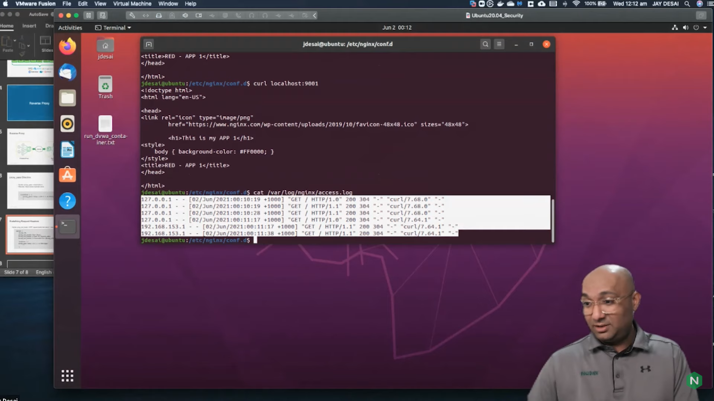
>
> 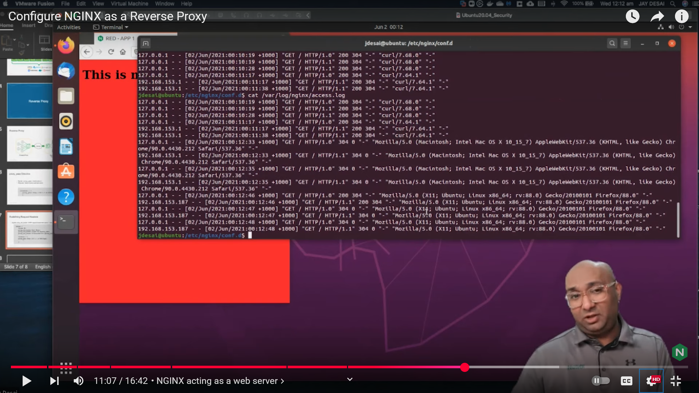
>
> With Custom Headers,
>
> 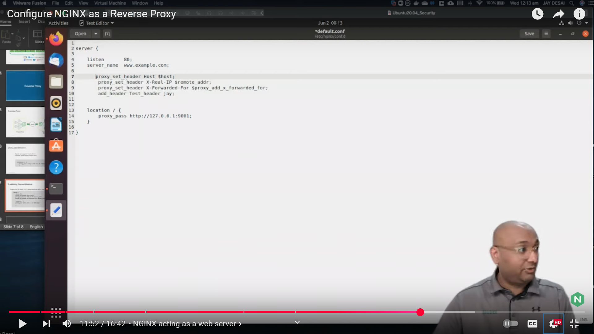
>
> 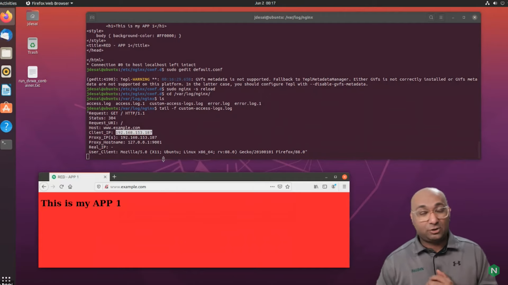

#### ✅ Steps to Enable Reverse Proxy

1. **Install NGINX** if not already:
   ```bash
   sudo apt install nginx
   ```
2. **Update config** (usually in `/etc/nginx/nginx.conf` or `/etc/nginx/sites-available/default`):
   * Use the config provided above.
3. **Test config** :

```bash
   sudo nginx -t
```

1. **Reload NGINX** :

```bash
   sudo systemctl reload nginx
```

---

## ----Getting SSL/TLS Cerificate for the Server and Configuring for Nginx

To get an **SSL/TLS certificate** (`.crt` and `.key`) for your server, you have two main options:

#### ✅ Option 1: **Free Certificate from Let's Encrypt (Recommended)**

Let’s Encrypt is a free, automated Certificate Authority (CA).

##### 🔧 Steps (Using Certbot with Nginx on Ubuntu):

1. **Install Certbot and Nginx Plugin**

```bash
sudo apt update
sudo apt install certbot python3-certbot-nginx
```

2. **Make Sure Your Domain Points to Your Server**

* Ensure your DNS `A` record points to your server's IP.
* Example:
  ```
  example.com → 203.0.113.25
  ```

3. **Request the Certificate**

```bash
sudo certbot --nginx -d example.com -d www.example.com
```

* Certbot will:
  * Configure Nginx for SSL
  * Automatically get `.crt` and `.key` files
  * Set up auto-renewal

4. **Auto-Renew (Optional but recommended)**

```bash
sudo certbot renew --dry-run
```

This confirms that the renewal process is working.

##### 📁 Certificate File Locations (after Certbot)

Certbot stores them typically in:

```
/etc/letsencrypt/live/example.com/
```

Files:

* `fullchain.pem` → This is your **certificate chain** (`.crt`)
* `privkey.pem` → This is your **private key** (`.key`)

You’d use them in Nginx like:

```nginx
ssl_certificate /etc/letsencrypt/live/example.com/fullchain.pem;
ssl_certificate_key /etc/letsencrypt/live/example.com/privkey.pem;
```

#### 🔒 Option 2: **Self-Signed Certificate (For Testing Only)**

**1. Generate a Key and Certificate**

```bash
openssl req -x509 -nodes -days 365 -newkey rsa:2048 \
-keyout selfsigned.key -out selfsigned.crt
```

* This creates:
  * `selfsigned.key` → private key
  * `selfsigned.crt` → self-signed certificate

**2. Configure Nginx**

```nginx
ssl_certificate     /path/to/selfsigned.crt;
ssl_certificate_key /path/to/selfsigned.key;
```

⚠️ Browsers will show warnings for self-signed certs. Use only for internal testing.

#### 🧾 Option 3: **Buy a Commercial Certificate**

Use a provider like:

* GoDaddy
* DigiCert
* Namecheap
* Comodo

They’ll give you:

* `.crt` certificate
* `.key` private key (or you generate it)
* Sometimes `.ca-bundle` file (certificate chain)

You manually configure Nginx with those files.

#### ✅ What is  **SSL Termination** ?

**SSL Termination** means that  **Nginx handles the HTTPS (SSL/TLS) decryption** , and then **forwards unencrypted HTTP traffic** to the backend server (e.g., Node.js app running on port 3000).

In short:

```
Client (HTTPS) → NGINX (decrypts) → Backend (HTTP)
```

This offloads the expensive SSL work from the backend and centralizes certificate handling in Nginx.

#### 🔐 Example:

```nginx
server {
  listen 443 ssl;
  server_name example.com;

  ssl_certificate     /etc/nginx/ssl/example.crt;
  ssl_certificate_key /etc/nginx/ssl/example.key;

  location / {
    proxy_pass http://localhost:3000;
    proxy_set_header Host $host;
    proxy_set_header X-Real-IP $remote_addr;
    proxy_set_header X-Forwarded-For $proxy_add_x_forwarded_for;
  }
}
```

---

## ----Nginx as Load Balancer

You can do full  load balancing with Nginx . Nginx as a reverse proxy/load balancer sits in front of multiple backend servers (they can be separate EC2s, VMs, or processes) and distributes incoming traffic among them.

#### 🔄 Core Concept

```
Client → Nginx (load balancer) → multiple backend app servers
```

Nginx accepts requests and forwards them to one of the backends defined in an `upstream` block, using a chosen balancing method.

#### 🧱 Basic Load Balancing Configuration (No Docker)

**Example: Round-Robin across three backends**

```nginx
http {
    upstream backend_pool {
        server 10.0.1.10:3000;
        server 10.0.1.11:3000;
        server 10.0.1.12:3000;
    }

    server {
        listen 80;
        server_name example.com;

        location / {
            proxy_pass http://backend_pool;

            proxy_set_header Host $host;
            proxy_set_header X-Real-IP $remote_addr;
            proxy_set_header X-Forwarded-For $proxy_add_x_forwarded_for;
            proxy_set_header X-Forwarded-Proto $scheme;

            proxy_http_version 1.1;
            proxy_connect_timeout 5s;
            proxy_read_timeout 30s;
        }
    }
}
```

* **Default algorithm** : Round-robin (cycles through servers evenly).
* Headers preserve original client info (`X-Real-IP`, etc.).
* Timeouts protect against hung backends.

#### 🧠 Alternative Balancing Methods

###### 1. **Least Connections**

```nginx
upstream backend_pool {
    least_conn;
    server 10.0.1.10:3000;
    server 10.0.1.11:3000;
    server 10.0.1.12:3000;
}
```

Traffic goes to the server with the fewest active connections — helpful when backend load per connection varies.

###### 2. **IP Hash (Sticky by Client IP)**

```nginx
upstream backend_pool {
    ip_hash;
    server 10.0.1.10:3000;
    server 10.0.1.11:3000;
}
```

Same client IP consistently goes to the same backend (basic session affinity). Not perfect for clients behind NAT or changing IPs.

###### 3. **Weighted Round-Robin**

```nginx
upstream backend_pool {
    server 10.0.1.10:3000 weight=3;
    server 10.0.1.11:3000 weight=1;
}
```

More powerful servers get proportionally more requests.

#### 🧪 Handling Failures & Health

* **Passive health checks** : Nginx marks a backend as unavailable if it fails to respond (errors/timeouts). You can tune this:

```nginx
upstream backend_pool {
    server 10.0.1.10:3000 max_fails=3 fail_timeout=30s;
    server 10.0.1.11:3000 max_fails=3 fail_timeout=30s;
}
```

If a server fails 3 times within 30s, it's temporarily skipped.

* **Active health checks** (requires paid Nginx Plus or third-party modules) periodically probe backends.

#### Combining with SSL Termination

```nginx
server {
    listen 443 ssl;
    server_name example.com;

    ssl_certificate /etc/letsencrypt/live/example.com/fullchain.pem;
    ssl_certificate_key /etc/letsencrypt/live/example.com/privkey.pem;

    location / {
        proxy_pass http://backend_pool;
        # same proxy_set_header lines...
    }
}

# Optional: redirect HTTP → HTTPS
server {
    listen 80;
    server_name example.com;
    return 301 https://$host$request_uri;
}
```

#### Common Real-World Use Cases

* Multiple Node.js instances on different machines behind one public endpoint.
* Blue/green or canary deployments by adjusting upstream membership.
* API gateway distributing to microservice instances.

---

## ----Common Directives

```nginx

# 1. Main Context
user  www-data;
worker_processes  auto;
error_log  /var/log/nginx/error.log warn;
pid        /var/run/nginx.pid;
daemon  on;    # On by default
env  MY_ENV_VAR;     # Works only if that env var exists before Nginx starts.

# 2. Events Context
events {
    worker_connections 1024;
    multi_accept on;
    use  epoll;   # Assuming you’re on Linux (since epoll is Linux-specific).
}

# 3. HTTP Context
http {
    include       /etc/nginx/mime.types;
    default_type  application/octet-stream;

    log_format  main  '$remote_addr - $remote_user [$time_local] "$request" '
                      '$status $body_bytes_sent "$http_referer" '
                      '"$http_user_agent" "$http_x_forwarded_for"';

    access_log  /var/log/nginx/access.log  main;

    sendfile        on;
    keepalive_timeout  65;
    send_timeout  30s;
    tcp_nodelay  on;
    client_max_body_size  10M;


    # 4. Server Block(s)
    server {
        listen       443 ssl;       # Since we need SSL and SSL only works on HTTPS (port 443).
        server_name  example.com;
	ssl_certificate     /etc/nginx/ssl/example.crt;
  	ssl_certificate_key /etc/nginx/ssl/example.key;

        # 5. Location Block(s)
        location / {
            root   /var/www/html;
            index  index.html index.htm;
	    autoindex  on;        # Autoindex will expose directory listings — which is a security risk unless you really need it.
        }

	location /xyz {
            root   /var/www/html/ts;
	    gzip  on;
	    gzip_types text/plain application/json text/css application/javascript;
        }

	upstream backend_api {
        	server 10.0.1.10:3000;
        	server 10.0.1.11:3000;
        	server 10.0.1.12:3000;
    	}

	location /api/ {
            proxy_pass http://backend_api;
            proxy_http_version 1.1;

            # Forward headers
            proxy_set_header Host $host;
            proxy_set_header X-Real-IP $remote_addr;
            proxy_set_header X-Forwarded-For $proxy_add_x_forwarded_for;
            proxy_set_header X-Forwarded-Proto $scheme;
        }
    }
}

```

---

## ----Deployment of MERN App using EC2 + PM2 + NGINX

Deploying a **MERN (MongoDB, Express, React, Node.js)** app on **AWS EC2** using **Nginx** involves several clear steps. Here's a **detailed guide** that takes you from setup to deployment, including **reverse proxying using Nginx** and serving your React frontend.

#### 🧾 OVERVIEW

You’ll be:

1. Creating and configuring an EC2 instance (Ubuntu)
2. Installing Node.js, MongoDB (optional), and Nginx
3. Hosting the **backend (Node.js + Express)** server
4. Building and hosting the **frontend (React)** using Nginx
5. Configuring **Nginx as a reverse proxy**
6. Optionally setting up a **custom domain** and **SSL**

#### ✅ STEP 1: Launch EC2 & Connect

1. Go to [AWS EC2 Console](https://console.aws.amazon.com/ec2).
2. Launch Ubuntu Server (preferably 22.04 LTS).
3. Choose instance type (t2.micro for free tier).
4. Configure security group:
   * Allow  **port 22 (SSH)** ,  **port 80 (HTTP)** , and **port 3000** (Node) temporarily.
5. Download your `.pem` key and connect:
   ```bash
   chmod 400 your-key.pem
   ssh -i your-key.pem ubuntu@your-ec2-public-ip
   ```

#### ✅ STEP 2: Install Dependencies

**Node.js (latest LTS)**

```bash
curl -fsSL https://deb.nodesource.com/setup_18.x | sudo -E bash -
sudo apt install -y nodejs
node -v && npm -v
```

**MongoDB (optional, if hosted locally)**

You can use [MongoDB Atlas](https://www.mongodb.com/cloud/atlas) instead.

**Nginx**

```bash
sudo apt update
sudo apt install nginx
sudo ufw allow 'Nginx Full'
```

#### ✅ STEP 3: Setup Your MERN App

**Backend (Express + Node)**

1. Upload your backend code to EC2 (`scp`, Git, or GitHub clone).
2. Install dependencies:
   ```bash
   cd backend
   npm install
   ```
3. Test:
   ```bash
   node server.js # or nodemon or pm2
   ```

Use a **process manager** like `pm2`:

```bash
sudo npm install -g pm2
pm2 start server.js
pm2 startup
pm2 save
```

#### ✅ STEP 4: Setup React Frontend

1. Upload or clone your frontend code.
2. Build:
   ```bash
   cd frontend
   npm install
   npm run build
   ```
3. Copy the build to Nginx’s public directory:
   ```bash
   sudo cp -r build/* /var/www/html/
   ```

#### ✅ STEP 5: Nginx as a Reverse Proxy

Open config:

```bash
sudo nano /etc/nginx/sites-available/default
```

Replace it with:

```nginx
server {
    listen 80;
    server_name your-ec2-public-ip;

    location / {
        root /var/www/html;
        index index.html;
        try_files $uri $uri/ /index.html;
    }

    location /api/ {
        proxy_pass http://localhost:3000/;
        proxy_http_version 1.1;
        proxy_set_header Upgrade $http_upgrade;
        proxy_set_header Connection 'upgrade';
        proxy_set_header Host $host;
        proxy_cache_bypass $http_upgrade;
    }
}
```

* `/api/` routes are forwarded to Express backend.
* React frontend is served from `/`.

**Reload Nginx:**

```bash
sudo nginx -t
sudo systemctl restart nginx
```

#### ✅ STEP 6: Optional Enhancements

###### A. Custom Domain (via Route 53 or any registrar)

* Point your domain to EC2’s public IP via A record.
* Update `server_name` in nginx config.

###### B. Enable SSL (HTTPS) using Let’s Encrypt

```bash
sudo apt install certbot python3-certbot-nginx
sudo certbot --nginx -d yourdomain.com -d www.yourdomain.com
```

#### ✅ Folder Structure on Server (Example)

```
/home/ubuntu/backend    ← Express app
/home/ubuntu/frontend   ← React app
/var/www/html/          ← React build
```

#### ✅ Summary

| Component       | Where it Runs               | Port     |
| --------------- | --------------------------- | -------- |
| React Frontend  | Nginx (serves static files) | :80      |
| Express Backend | Node.js (behind proxy)      | :3000    |
| Nginx           | Front-facing proxy          | :80/:443 |

#### ✅ Tips

* Use `pm2` to ensure backend auto-starts after reboot.
* Use `scp` or Git to upload code.
* Use `.env` files to manage environment variables securely.
* Use MongoDB Atlas instead of hosting MongoDB on EC2.

---

---

# ----------------------------------------------------------------------------------------

# --------------AWS S3-----------------------

## ----Introduction

🔸 What is Amazon S3?

**Amazon S3** is an object storage service offered by AWS. It allows you to store and retrieve any amount of data at any time, from anywhere on the web.

* **S3 is NOT a file system** like your local disk.
* It stores **objects** (files) in **buckets** (containers).
* It’s highly scalable, durable (99.999999999% durability), and secure.

#### 🔸 Core Concepts

**✅ 1. Buckets**

* Think of buckets like folders.
* Each bucket must have a **unique name globally** across AWS.
* You can create multiple buckets, and each bucket can hold any number of objects.

**✅ 2. Objects**

* An object is the **actual file/data** you store in S3.
* Each object consists of:
  * **Key** (like a file path or name)
  * **Data** (binary content)
  * **Metadata** (data about the object)
  * **Version ID** (if versioning is enabled)

**✅ 3. Keys**

* A key is the unique name that identifies an object in a bucket.
* Example:
  * `photos/image1.jpg` is a key
  * You can simulate folder structures by using slashes (`/`) in keys.
    > ##### `photos/image1.jpg`
    >
    > In Amazon S3:
    >
    > * **`photos` is not a "folder" or "directory"** in the traditional filesystem sense.
    > * It is part of the  **object key** , which in your example is:
    >   ```
    >   photos/image1.jpg
    >   ```
    >
    > Explanation:
    >
    > In S3:
    >
    > * **Buckets** are the top-level containers (like a drive).
    > * **Object keys** are the full path+filename string that uniquely identifies a file in a bucket.
    > * So, `photos/image1.jpg` is a **single object key** stored in the bucket.
    >
    > There’s no real folder structure in S3 — what looks like folders (like `photos/`) is just a  **prefix in the key name** . The AWS console simulates a folder view by splitting on slashes (`/`).
    >
    > ### Summary:
    >
    > | Term                | Example                              | Meaning                         |
    > | ------------------- | ------------------------------------ | ------------------------------- |
    > | Bucket              | `my-bucket`                        | The top-level storage container |
    > | Key                 | `photos/image1.jpg`                | The unique ID for the object    |
    > | Prefix (optional)   | `photos/`                          | Simulates a folder (not real)   |
    > | Full Object Address | `s3://my-bucket/photos/image1.jpg` | The complete S3 path            |
    >

**✅ 4. Region**

* Buckets are created in **specific AWS regions** (e.g., `us-east-1`, `ap-south-1`).
* You should create buckets near your target users to reduce latency.

#### 🔸 Common Use Cases

* Hosting **static websites** (HTML, CSS, JS files)
* Storing and serving **images, videos, PDFs**
* **Backup and restore**
* **Data lake** for analytics
* **Cloud-native file uploads**

#### 🔸 S3 Storage Classes

You can choose how your files are stored based on access frequency and cost:

| Storage Class             | Use Case                                | Cost     |
| ------------------------- | --------------------------------------- | -------- |
| S3 Standard               | General-purpose, frequent access        | High     |
| S3 Intelligent-Tiering    | Automatically moves data based on usage | Medium   |
| S3 Standard-IA            | Infrequent Access                       | Low      |
| S3 One Zone-IA            | Infrequent, single AZ (less durable)    | Lower    |
| S3 Glacier / Deep Archive | Archive, long-term storage              | Very Low |

#### 🔸 Key Features

🔐 1. **Security**

* Supports  **encryption** : SSE-S3, SSE-KMS
* **Access control** :
* **IAM policies** : for users
* **Bucket policies** : for public/private access
* **ACLs** : legacy method
* Supports  **MFA delete** , versioning, and logging.

🚀 2. **Performance**

* **High throughput** : can handle thousands of requests per second.
* **Multipart Uploads** : for large files (over 5MB+)

🔄 3. **Versioning**

* Keeps **multiple versions** of objects.
* Useful for rollback and recovery.

#### 🌐 4. **Static Website Hosting**

* You can configure a bucket to  **serve static websites** .
* You provide an **index document** and optionally an  **error document** .

#### 🔸 How to Upload/Access Files

**📁 AWS Console:**

1. Go to S3 dashboard.
2. Create a bucket.
3. Upload files via UI.

**🖥️ AWS CLI:**

```bash
aws s3 cp myfile.txt s3://my-bucket-name/myfolder/myfile.txt
```

#### 🌍 Accessing Files:

* By default, S3 objects are  **private** .
* To make public:
  * Update the object ACL or bucket policy.
  * Example public URL:
    ```
    https://<bucket-name>.s3.<region>.amazonaws.com/<key>
    ```

#### 🔸 Static Website Hosting Example

To host a website:

1. Create a bucket **named exactly as your domain** (e.g., `mydomain.com`)
2. Upload your static files.
3. Enable "Static website hosting" in bucket settings.
4. Set index and error documents.
5. (Optional) Use **Route 53** + **CloudFront** for custom domain + HTTPS.

#### 🔸 Pricing (as of now)

* **Storage cost** per GB/month.
* **Request costs** (e.g., GET, PUT, DELETE).
* **Data transfer out** of AWS incurs additional costs.

Free tier:

* 5 GB storage
* 20,000 GET, 2,000 PUT
* 15 GB data transfer out

---

## ----Object Storage

📦 Object = Data + Metadata + Key

For example:

You upload a file `product1.png` to a bucket named `fitlab-images`.

This object might look like:

| Component           | Example                                         |
| ------------------- | ----------------------------------------------- |
| **Key**(name) | `products/product1.png`                       |
| **Data**      | Binary image file                               |
| **Metadata**  | `Content-Type: image/png``Uploaded-By: admin` |

So when you access this file, S3 retrieves it using the  **key** .

#### 🪣 Where Do Objects Live?

All objects are stored inside  **buckets** .

* Think of a bucket as a container for files.
* Each object inside a bucket must have a  **unique key** .

#### 📁 Folders in S3?

S3  **does not have real folders** . It *simulates* folder structure using the  **key name** .

For example:

* `images/profile/user1.png`
* `images/profile/user2.png`
* `docs/manual.pdf`

These are all just keys, but they look like folders due to `/`.

#### ⚙️ Key Features of Object Storage in S3

| Feature                           | Description                                                             |
| --------------------------------- | ----------------------------------------------------------------------- |
| **Scalable**                | Stores millions or billions of objects. No size limit on total storage. |
| **Durable**                 | 99.999999999% (11 nines) durability. S3 keeps multiple copies.          |
| **No hierarchy**            | Flat structure (no nested folders like in traditional file systems).    |
| **Metadata support**        | Custom metadata per object.                                             |
| **Immutable by default**    | Objects don’t change — instead, you overwrite or version them.        |
| **Accessed via HTTP/HTTPS** | Using REST APIs, AWS SDKs, or presigned URLs.                           |

#### 📌 How It Differs From Traditional File Storage

| Traditional File System     | S3 Object Storage               |
| --------------------------- | ------------------------------- |
| Hierarchical folders        | Flat key-based structure        |
| File = data only            | Object = data + metadata        |
| Changes file in place       | Must upload a new object        |
| Local disk, mounted volumes | Accessed over web via endpoints |

#### 🔁 Example: Uploading an Object

Let’s say your Node.js backend uploads an image using AWS SDK:

```js
const s3Client = new S3Client({ region: "ap-south-1" });

await s3Client.send(new PutObjectCommand({
  Bucket: "fitlab-images",
  Key: "products/treadmill-1.jpg",
  Body: fs.readFileSync("treadmill.jpg"),
  ContentType: "image/jpeg",
}));
```

Here, the object:

* Is stored inside the `fitlab-images` bucket.
* Has the key `products/treadmill-1.jpg`.
* Has metadata: `Content-Type: image/jpeg`.

#### 🧠 When Should You Use Object Storage?

Perfect for:

* Static assets (product images, documents, avatars)
* Frontend hosting (React apps)
* Backups
* Logs
* Media files (videos, audio)

---

## ----S3 Availability and Scalability

✅ Amazon S3 — Availability & Scalability (in simple and detailed terms):

#### 🔷 1. **What is Availability in S3?**

**Availability** means **how accessible and online your data is** — how often your data can be read/written when you try to access it.

🟢 S3's Availability:

Amazon S3 offers **"99.99% availability"** (for the **Standard** storage class).

That means it's expected to be  **available 99.99% of the time in a given year** .

➡️ That’s less than 1 hour of potential downtime per year — extremely high reliability.

#### 🔷 2. **What is Scalability in S3?**

**Scalability** means **how well the system handles growing amounts of data or requests** — without needing manual intervention.

🟢 S3’s Scalability:

* S3 **automatically scales** — you don’t need to configure or manage anything.
* You can store  **billions of objects** , or petabytes (PB) of data.
* There’s **no limit on number of objects or total storage** in a bucket (though individual object size is up to  **5TB** ).
* It also scales for **concurrent requests** — many users or services can access your S3 objects at once.

#### 🧠 How Amazon Achieves This:

🔹 For  **Availability** :

* S3 stores your data **redundantly across multiple Availability Zones (AZs)** within a region.
* So if one data center goes down, another has your data.
* **Durability of 99.999999999% (11 9’s)** — meaning data loss is nearly impossible.

🔹 For  **Scalability** :

* Amazon uses **distributed systems** and **load balancing** under the hood.
* You don’t need to provision or scale anything manually —  **it’s managed automatically** .
* Ideal for large websites, video streaming, backup systems, and more.

#### 📌 Example:

You host user-uploaded product images in your MERN e-commerce site:

* 100 users upload 10,000 images? ✅ S3 handles it.
* Later, 100,000 users upload 1 million images? ✅ Still works.
* All users trying to view/download simultaneously? ✅ Handled smoothly.

---

## ----S3 CLI

🔷 1. **What is the S3 CLI?**

The **S3 CLI** is part of the **AWS Command Line Interface (CLI)** tool that allows you to interact with Amazon S3 directly from your terminal or command prompt.

You can use it to:

* Upload/download files
* Create/delete buckets
* Manage permissions
* List contents
* Sync files between local machine and S3

#### 🔧 2. **How to Set It Up**

1. **Install AWS CLI** (if not already):

```bash
# macOS / Linux:
curl "https://awscli.amazonaws.com/awscli-exe-linux-x86_64.zip" -o "awscliv2.zip"
unzip awscliv2.zip
sudo ./aws/install

# Windows: Use the .exe installer from AWS website.
```

2. **Configure AWS CLI** with your IAM credentials:

```bash
aws configure
```

It will ask:

```
AWS Access Key ID [None]: <your-access-key>
AWS Secret Access Key [None]: <your-secret-key>
Default region name [None]: ap-south-1 (or your region)
Default output format [None]: json
```

✅ Now you're ready to run S3 commands.

#### 🧾 3. **Basic S3 CLI Commands (Grouped by Purpose)**

##### 📁 Bucket Management

| Command                                   | Description                       |
| ----------------------------------------- | --------------------------------- |
| `aws s3 ls`                             | List all buckets                  |
| `aws s3 mb s3://my-bucket-name`         | Make a new bucket                 |
| `aws s3 rb s3://my-bucket-name`         | Remove an empty bucket            |
| `aws s3 rb s3://my-bucket-name --force` | Remove a**non-empty**bucket |

##### 📂 List Bucket Contents

| Command                                   | Description                            |
| ----------------------------------------- | -------------------------------------- |
| `aws s3 ls s3://my-bucket-name`         | List objects inside the bucket         |
| `aws s3 ls s3://my-bucket-name/folder/` | List contents of a specific folder/key |

##### ⬆️ Upload Files

| Command                                                       | Description                         |
| ------------------------------------------------------------- | ----------------------------------- |
| `aws s3 cp file.txt s3://my-bucket-name/`                   | Upload a file                       |
| `aws s3 cp ./folder s3://my-bucket-name/folder --recursive` | Upload a**folder**recursively |

##### ⬇️ Download Files

| Command                                                             | Description                        |
| ------------------------------------------------------------------- | ---------------------------------- |
| `aws s3 cp s3://my-bucket-name/file.txt ./local/`                 | Download file from bucket to local |
| `aws s3 cp s3://my-bucket-name/folder ./local-folder --recursive` | Download folder recursively        |

##### 🔄 Sync Local with S3

| Command                                                   | Description             |
| --------------------------------------------------------- | ----------------------- |
| `aws s3 sync ./local-folder s3://my-bucket-name/folder` | Sync local folder to S3 |
| `aws s3 sync s3://my-bucket-name/folder ./local-folder` | Sync S3 folder to local |

##### 🔧 Other Useful Operations

| Command                                               | Description                                               |
| ----------------------------------------------------- | --------------------------------------------------------- |
| `aws s3 rm s3://my-bucket-name/file.txt`            | Delete a file from bucket                                 |
| `aws s3 rm s3://my-bucket-name/folder/ --recursive` | Delete a folder (all files inside)                        |
| `aws s3 presign s3://my-bucket-name/file.txt`       | Generate a**temporary URL**to access private object |

#### ⚠️ S3 Command Prefix Types

* Use `aws s3` for **high-level** commands (sync, cp, rm, ls etc.)
* Use `aws s3api` for **low-level REST API commands** (bucket policies, versioning, etc.)

For example:

```bash
# Enable versioning (s3api required)
aws s3api put-bucket-versioning --bucket my-bucket-name --versioning-configuration Status=Enabled
```

#### ✅ Tips

* You can use `--profile my-profile-name` to use a specific AWS profile.
* You can use `--dryrun` with `sync` or `cp` to preview changes without doing anything.

............................................................................................................................................................................................................................................

#### ----MORE CLI COMMANDS

Here are  **more important AWS S3 CLI commands** , grouped by purpose:

##### 🔍 **Bucket-Level Operations**

1. **List buckets**

   ```bash
   aws s3 ls
   ```
2. **Create a new bucket**

   ```bash
   aws s3 mb s3://my-bucket-name
   ```
3. **Delete a bucket**

   ```bash
   aws s3 rb s3://my-bucket-name
   ```

   Add `--force` to delete even if non-empty.
4. **List contents of a bucket**

   ```bash
   aws s3 ls s3://my-bucket-name/
   ```
5. **Enable versioning**

   ```bash
   aws s3api put-bucket-versioning --bucket my-bucket-name \
     --versioning-configuration Status=Enabled
   ```
6. **Enable static website hosting**

   ```bash
   aws s3 website s3://my-bucket-name/ --index-document index.html --error-document error.html
   ```

##### 📂 **File/Folder Upload and Download**

7. **Upload a single file**
   ```bash
   aws s3 cp localfile.txt s3://my-bucket-name/
   ```
8. **Upload a folder recursively**
   ```bash
   aws s3 cp my-folder/ s3://my-bucket-name/ --recursive
   ```
9. **Download a file**
   ```bash
   aws s3 cp s3://my-bucket-name/file.txt ./local-folder/
   ```
10. **Sync entire local folder to bucket**
    ```bash
    aws s3 sync ./local-folder/ s3://my-bucket-name/
    ```
11. **Sync S3 bucket to local**
    ```bash
    aws s3 sync s3://my-bucket-name/ ./local-folder/
    ```

##### ❌ **Deleting Files/Objects**

12. **Delete a single object**

```bash
aws s3 rm s3://my-bucket-name/file.txt
```

13. **Delete multiple files (e.g. all in a folder)**

```bash
aws s3 rm s3://my-bucket-name/my-folder/ --recursive
```

##### 🔐 **Permissions and Access**

14. **Set object to public-read**

```bash
aws s3api put-object-acl --bucket my-bucket-name \
  --key filename.jpg --acl public-read
```

15. **Generate a pre-signed URL (valid for 1 hour)**

```bash
aws s3 presign s3://my-bucket-name/file.txt --expires-in 3600
```

##### 📦 **Versioning and Metadata**

16. **List object versions**

```bash
aws s3api list-object-versions --bucket my-bucket-name
```

17. **Get object metadata**

```bash
aws s3api head-object --bucket my-bucket-name --key file.txt
```

##### **📄 AWS CLI version** on your system.

The command:

```bash
aws --version
```

**Displays the installed AWS CLI version** on your system.

✅ Example Output:

```bash
aws-cli/2.15.1 Python/3.11.6 Linux/5.15.0-106-generic exe/x86_64.ubuntu.22 prompt/off
```

📝 What it tells you:

* `aws-cli/2.15.1` → AWS CLI version (here, v2.15.1)
* `Python/3.11.6` → Python version used by AWS CLI
* `Linux/...` or `Windows/...` → OS and kernel info
* `exe/x86_64` → Architecture
* `prompt/off` → CLI prompting behavior

If you're using it for the first time, make sure you've also configured credentials:

```bash
aws configure
```

##### 📌 Help

To get **help or the manual** for AWS CLI commands, you can use the `help` keyword.

General Help:

```bash
aws help
```

Shows a full list of available AWS services supported by the CLI.

Help for a Specific Service:

```bash
aws s3 help
```

Gives help and subcommands available for the `s3` service.

Help for a Specific Command:

```bash
aws s3 cp help
```

Explains the `cp` (copy) command for S3, its syntax, parameters, and examples.

🧠 Quick Tip:

You can also use `--help` after any command:

```bash
aws s3 ls --help
```

This is useful when you forget options or want syntax/examples on the fly.

Let me know which S3 command you'd like help with.

---

## ----Storage Classes

Amazon S3 **Storage Classes** are designed to let you **optimize cost, performance, and durability** based on how you access your data. Here's a breakdown of the main S3 storage classes:

#### 🏷️ Overview of S3 Storage Classes

| Storage Class                                        | Description                                         | Ideal Use Case                   | Durability    | Availability | Min Storage Duration   | Retrieval      |
| ---------------------------------------------------- | --------------------------------------------------- | -------------------------------- | ------------- | ------------ | ---------------------- | -------------- |
| **S3 Standard**                                | Default class for frequent access                   | Frequently accessed data         | 99.999999999% | 99.99%       | None                   | Instant        |
| **S3 Intelligent-Tiering**                     | Auto-moves data between frequent & infrequent tiers | Unknown/Changing access patterns | 99.999999999% | 99.9–99.99% | 30 days for some tiers | Instant        |
| **S3 Standard-IA (Infrequent Access)**         | For less frequently accessed data                   | Backups, disaster recovery       | 99.999999999% | 99.9%        | 30 days                | Instant        |
| **S3 One Zone-IA**                             | Like Standard-IA but only in one AZ                 | Re-creatable, non-critical data  | 99.999999999% | 99.5%        | 30 days                | Instant        |
| **S3 Glacier Instant Retrieval**               | Low-cost with immediate access                      | Archives needing quick access    | 99.999999999% | 99.9%        | 90 days                | Instant        |
| **S3 Glacier Flexible Retrieval**              | Cheaper, slower retrieval (minutes–hours)          | Cold archives                    | 99.999999999% | 99.9%        | 90 days                | Minutes–hours |
| **S3 Glacier Deep Archive**                    | Cheapest, for rarely accessed data                  | Regulatory archives              | 99.999999999% | 99.9%        | 180 days               | Hours          |
| **S3 Reduced Redundancy (RRS)**⚠️ Deprecated | Lower durability, not recommended now               | Legacy                           | 99.99%        | 99.99%       | N/A                    | Instant        |

#### 🔄 Intelligent-Tiering – How it Works

* Monitors your data access.
* Moves objects **automatically** between tiers:
  * Frequent access
  * Infrequent access
  * Archive tiers (optional)

✅ No retrieval fee

✅ Great if access pattern is unpredictable

💰 Small monthly monitoring fee per object

#### 🔍 Which One Should You Use?

| Situation                           | Recommended Class              |
| ----------------------------------- | ------------------------------ |
| Website images, product data        | **S3 Standard**          |
| User uploads, unknown access        | **Intelligent-Tiering**  |
| Backups, logs                       | **Standard-IA**          |
| Re-creatable non-critical data      | **One Zone-IA**          |
| Archived reports or compliance docs | **Glacier Deep Archive** |

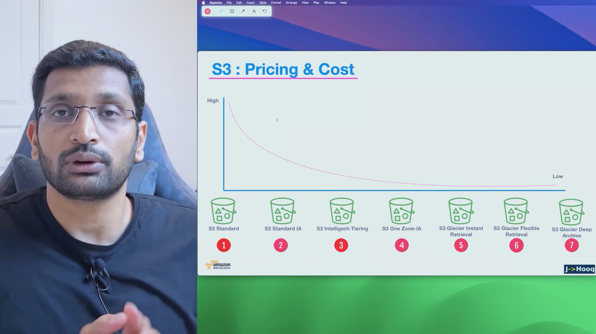

#### 🔑 Your Account and Storage Classes

**When a user creates an AWS account and starts using Amazon S3** , they automatically get access to **all S3 storage classes** — there is **no need for separate activation** or configuration for each class.

Here's how it works:

* All storage classes are part of the  **same S3 service** .
* When you  **upload an object** , you simply specify the `StorageClass` you want (or let it default to `STANDARD`).
* You can **change the storage class** later by:
  * **Copying the object** to the same bucket with a new storage class.
  * Using **lifecycle rules** to automatically transition data between classes.

###### 💡 Example via AWS SDK / CLI:

```bash
aws s3 cp myfile.txt s3://mybucket/ --storage-class STANDARD_IA
```

Or in the S3 web console, you can select the storage class from a dropdown when uploading.

###### 🔒 Permissions

While  **all classes are available** , access can be restricted using  **IAM policies** . For example, an admin could block users from using `GLACIER` or `DEEP_ARCHIVE` if needed.

Would you like an IAM policy example that restricts or allows certain storage classes?

---

## ----AWS Pricing Calculator

The **AWS Pricing Calculator** is a **free online tool** provided by AWS that helps you:

* **Estimate your monthly costs** for AWS services.
* **Plan your cloud budget** before deploying.
* Compare **different service configurations** and their costs.

#### 🔗 URL

You can access it here:

👉 [https://calculator.aws.amazon.com/](https://calculator.aws.amazon.com/)

#### 🧩 **What You Can Do With It:**

1. **Add Services**

   Choose from AWS services like EC2, S3, RDS, Lambda, CloudFront, etc.
2. **Configure Details**

   For each service:

   * Choose region
   * Instance/storage types
   * Usage amount (e.g. GBs, hours, requests)
   * Storage class (e.g. S3 Standard vs Glacier)
   * Duration and pricing model (On-demand vs Reserved)
3. **Get Price Breakdown**

   * View total monthly cost
   * Cost per service
   * Export detailed reports (PDF/CSV)

#### 📘 Example: Estimate Cost for S3

Let’s say you want to calculate cost for storing **100 GB in S3 Standard** and  **10,000 PUT requests per month** :

1. Go to the calculator.
2. Click **“Create estimate”** →  **“Amazon S3”** .
3. Input:
   * Storage amount: 100 GB
   * Storage class: Standard
   * PUT requests: 10,000
4. It will show:
   * **Storage cost (per GB)**
   * **Request cost (per 1,000 requests)**
   * **Total monthly cost**

#### 🛠 Features

| Feature               | Description                                      |
| --------------------- | ------------------------------------------------ |
| 🔍 Service Filtering  | Choose only the services you use                 |
| 📈 Cost Forecasting   | Monthly + annual cost projection                 |
| 💼 Multiple Estimates | Create and save estimates for different projects |
| 🧮 Cost Inputs        | Customize usage amount, data transfer, etc.      |
| 🌎 Region Specific    | Shows pricing based on AWS region (e.g. Mumbai)  |

#### 🔒 No Login Needed

You don’t need to log in to use it, but **you can save estimates to your AWS account** if logged in.

---

## -----Requestor Pays

💰 **What is "Requester Pays" in Amazon S3?**

**"Requester Pays"** is a feature in Amazon S3 that shifts the **data transfer and request costs** from the **bucket owner** to the  **person (requester) accessing the data** .

#### ✅ **Why it Exists**

If you host large, publicly accessible datasets (like research data, logs, or software downloads), and many people download it,  **you—the bucket owner—normally pay for all data transfer** .

To avoid paying for others’ usage, **you enable Requester Pays** so  **each user pays for their own download** .

#### 📦 **How It Works**

| Action                       | Who Pays?                |
| ---------------------------- | ------------------------ |
| Bucket owner stores the data | Bucket owner             |
| Someone accesses the data    | **Requester pays** |

* Storage charges: **Still paid by the bucket owner**
* **GET, PUT, LIST requests & data transfer (downloads): Paid by requester**

#### 🔧 **How to Enable It**

```bash
aws s3api put-bucket-request-payment --bucket your-bucket-name --request-payment-configuration Payer=Requester
```

To verify:

```bash
aws s3api get-bucket-request-payment --bucket your-bucket-name
```

#### 🔓 **How Requester Accesses It**

To download from a "Requester Pays" bucket, the requester must explicitly state they agree to pay:

```bash
aws s3 cp s3://bucket-name/object-name local-file --request-payer requester
```

Without `--request-payer requester`, the request is denied.

#### ✅ **Steps to Enable Requester Pays from the AWS Console**

1. **Go to the S3 Console** :

   [https://s3.console.aws.amazon.com/s3/](https://s3.console.aws.amazon.com/s3/)
2. **Select the Bucket** you want to enable Requester Pays for.
3. Go to the **“Properties”** tab.
4. Scroll down to the **“Permissions”** section.
5. Click on  **“Requester pays”** .
6. Enable the checkbox:

   ✅ **Enable Requester pays**
7. Click  **Save changes** .

#### 📌 Notes

* **Only works for authenticated requests.** Anonymous users can't access Requester Pays buckets.
* Mostly used in  **open data programs** ,  **government or research datasets** .
* Useful when you host large datasets but don’t want to bear download costs.

---

## ----Object Tagging

✅ What is **Object Tagging** in S3?

**Object tagging** in Amazon S3 is a way to assign **key-value metadata** to individual objects in a bucket. These tags help with:

* 🔍 **Organizing and managing data**
* 💸 **Cost allocation (via billing groups)**
* 🔐 **Fine-grained access control (IAM policies)**
* 🧾 **Lifecycle rules (e.g., delete objects with a tag)**
* 📊 **Filtering for analytics and inventory**

#### 🔖 Tag Format

Each object can have  **up to 10 tags** .

Each tag is a  **key-value pair** , like:

```json
{
  "Key": "project",
  "Value": "fitlab"
}
```

* **Key** and **value** must be:
  * UTF-8 encoded
  * Key ≤ 128 characters
  * Value ≤ 256 characters

#### 🧠 Use Cases

| Use Case                         | Example Tag              |
| -------------------------------- | ------------------------ |
| Cost allocation                  | `department = finance` |
| Lifecycle policy filtering       | `archive = true`       |
| IAM access control               | `confidential = yes`   |
| Organizing multi-project storage | `project = ecommerce`  |

#### 🛠️ How to Add Tags

1. **From AWS Console**

* Go to your bucket
* Open an object
* Under the **“Properties”** tab → Find **Tags**
* Add key-value pairs

2. **Using AWS CLI**

```bash
aws s3api put-object-tagging \
  --bucket your-bucket-name \
  --key path/to/object.jpg \
  --tagging 'TagSet=[{Key=project,Value=fitlab}]'
```

3. **Using SDK (e.g., JavaScript, Python)**

#### 🔁 Lifecycle Rule Example (based on tag)

You can write a rule like:

> Delete all objects with tag `{"archive": "true"}` after 30 days.

This lets you  **apply lifecycle policies only to specific objects** , not entire buckets.

#### ❗ Important Notes

* Tags are stored **per version** (if versioning is enabled).
* Replacing tags  **overwrites the old ones** .
* Tags are not inherited; each object must be tagged individually.

---

## ----Permission Policies in S3

✅ **S3 Permission Policies in AWS: Explained Simply**

In Amazon S3, **permission policies** determine  **who can access what** , and **what actions** they can perform on  **which resources** . These policies are written in **JSON format** and control access to **buckets** and  **objects** .

#### 🔐 **Types of Permission Policies in S3**

| Type                                    | Attached To              | Controls Access To                  | Managed By             |
| --------------------------------------- | ------------------------ | ----------------------------------- | ---------------------- |
| 1.**IAM Policies**                | IAM Users, Groups, Roles | Any S3 resources                    | Account admin          |
| 2.**Bucket Policies**             | S3 Buckets               | The specific bucket and its objects | Bucket owner           |
| 3.**ACLs (Access Control Lists)** | Buckets or Objects       | Fine-grained access (legacy)        | Bucket or object owner |
| 4.**S3 Access Point Policies**    | Access Points            | Specific subsets of S3 data         | Admin-defined          |

#### 🔸 **1. IAM Policies**

* **Who defines** : AWS account administrators.
* **Where used** : Attached to IAM users/roles.
* **Purpose** : Grant/deny access to S3 buckets or objects.
* **Example** : Give a user permission to upload files to a specific bucket.

```json
{
  "Version": "2012-10-17",
  "Statement": [
    {
      "Effect": "Allow",
      "Action": ["s3:PutObject"],
      "Resource": "arn:aws:s3:::my-bucket/*"
    }
  ]
}
```

#### 🔸 **2. Bucket Policies**

* **Who defines** : Bucket owner.
* **Where used** : Directly attached to a bucket.
* **Purpose** : Manage access from **outside your account** or  **public access** .
* **Example** : Allow read-only public access to all files in a bucket.

```json
{
  "Effect": "Allow",
  "Principal": "*",
  "Action": ["s3:GetObject"],
  "Resource": "arn:aws:s3:::my-public-bucket/*"
}
```

#### 🔸 **3. ACLs (Access Control Lists)**

* **Older system** , still supported.
* Assigns **grants** to specific AWS accounts (e.g., READ/WRITE).
* **Not recommended** for most use cases—use IAM/bucket policies instead.

#### 🔸 **4. S3 Access Point Policies**

* Used for **large datasets** or  **shared environments** .
* Define fine-grained access control on subsets of data.
* Makes access control simpler in **multi-tenant** scenarios.

### 🔒 **Policy Evaluation Logic**

When a request is made to S3:

* **IAM policies** and **Bucket policies** are both evaluated.
* If **any policy denies** the action,  **it's denied** .
* If  **no policy allows** ,  **it's denied by default** .

#### ✅ **Best Practices**

* Use **IAM roles** instead of user credentials.
* Prefer **bucket policies** for cross-account access.
* Enable **block public access** unless explicitly needed.
* Use  **least privilege principle** —only allow what’s necessary.

---

## ----Pesigned URL

A **pre-signed URL** in Amazon S3 is a time-limited, secure URL that you can generate to **grant temporary access** to an S3 object to anyone, **without needing to make the object public** or share AWS credentials. It allows users to  **upload** ,  **download** , or **delete** a specific object, depending on the permissions defined when creating the URL.

#### ✅ When to Use Pre-Signed URLs

* Grant limited-time download access to private files (e.g., invoices, PDFs).
* Allow users to upload directly to S3 without giving them S3 permissions.
* Temporarily allow access to delete or modify an object.

#### 🔐 How Pre-Signed URLs Work

A pre-signed URL:

* Includes authentication parameters (AWS Access Key, Signature, Expiry).
* Is generated using your credentials and permissions.
* Becomes invalid after the expiration time.

#### 🛠️ How to Create a Pre-Signed URL

You can create it using:

* AWS SDKs (recommended)
* AWS CLI (for basic operations)

#### 1. **Using AWS SDK (e.g., Node.js)**

```javascript
const AWS = require('aws-sdk');
const s3 = new AWS.S3({
  region: 'ap-south-1', // example
  accessKeyId: 'YOUR_ACCESS_KEY',
  secretAccessKey: 'YOUR_SECRET_KEY',
});

const params = {
  Bucket: 'your-bucket-name',
  Key: 'path/to/your/file.txt',
  Expires: 60 // seconds
};

const url = s3.getSignedUrl('getObject', params);
console.log('Pre-signed URL:', url);
```

Use `'putObject'` to allow **uploads** instead of downloads.

#### 2. **Using AWS CLI**

Generate a pre-signed URL (for download):

```bash
aws s3 presign s3://your-bucket-name/path/to/file.txt --expires-in 300
```

This generates a pre-signed URL valid for 300 seconds (5 minutes).

#### 3. **Important Notes**

* You must have permission to perform the intended operation (like `s3:GetObject` or `s3:PutObject`).
* The URL only works until the specified expiry time.
* Anyone with the URL can access the object within that time.

---

## ----**S3 Encryption in AWS – Types and How to Use (Both CLI and GUI)**

Amazon S3 supports encryption **at rest** and **in transit** to protect your data.

#### 🔐 **1. Encryption at Rest – Types**

This means the data is encrypted **when stored** in S3.

##### 🔸 A. **SSE-S3 (Server-Side Encryption with Amazon S3-Managed Keys)**

* AWS encrypts each object with a unique key.
* Keys are stored and managed by S3.
* **No configuration needed** , just enable it.

##### 🔸 B. **SSE-KMS (Server-Side Encryption with AWS KMS)**

* Uses AWS Key Management Service (KMS).
* Lets you control access to the encryption key.
* Supports key rotation and auditing.
* Needs IAM permissions for KMS key access.
  > 
  > **KMS** stands for  **AWS Key Management Service** .
  >
  > ##### 🔐 What is AWS KMS?
  >
  > AWS KMS is a **fully managed encryption service** that allows you to **create, manage, and control cryptographic keys** used to encrypt your data across AWS services, including Amazon S3.
  >
  > ##### 🔑 Use cases:
  >
  > * Encrypt data in S3, EBS, RDS, Lambda, etc.
  > * Generate and store encryption keys securely.
  > * Audit key usage using  **CloudTrail** .
  >
  > ##### 🧠 Key Concepts:
  >
  > | Term                                | Description                                                                       |
  > | ----------------------------------- | --------------------------------------------------------------------------------- |
  > | **CMK (Customer Master Key)** | A logical representation of a master key. Can be AWS-managed or customer-managed. |
  > | **AWS-managed CMK**           | Created, owned, and managed by AWS (e.g.,`aws/s3`).                             |
  > | **Customer-managed CMK**      | Created and managed by you. Offers full control over permissions and rotation.    |
  > | **Data key**                  | A key used to encrypt data, generated by KMS and encrypted with a CMK.            |
  >

##### 🔸 C. **SSE-C (Server-Side Encryption with Customer-Provided Keys)**

* You provide your own encryption key.
* AWS does not store your key.
* You must send the key with each request.
* Rarely used due to complexity and security risk.

##### 🔸 D. **Client-Side Encryption**

* You encrypt data  **before uploading to S3** .
* You manage encryption/decryption yourself.
* Libraries like AWS SDK or third-party tools can help.

#### 🧭 **How to Use S3 Encryption (GUI and CLI)**

##### 💻 **A. Using the AWS Management Console (GUI)**

**➤ To Enable Encryption by Default:**

1. Go to the  **S3 bucket** .
2. Choose **Properties** tab.
3. Scroll to  **Default encryption** .
4. Choose one:
   * **AES-256 (SSE-S3)**
   * **AWS-KMS (SSE-KMS)** → Select a key or create a new one.
5. Save changes.

**➤ To Manually Encrypt a File on Upload:**

1. Go to  **S3 bucket > Upload** .
2. Under  **Properties** , find  **Server-side encryption** .
3. Select:
   * **AES-256** → SSE-S3
   * **AWS-KMS** → Pick or create a KMS key

##### 📟 **B. Using AWS CLI**

**➤ Upload with SSE-S3**

```bash
aws s3 cp file.txt s3://your-bucket-name/ --sse AES256
```

**➤ Upload with SSE-KMS**

```bash
aws s3 cp file.txt s3://your-bucket-name/ --sse aws:kms --sse-kms-key-id <KMS_KEY_ID>
```

**➤ Upload with SSE-C**

```bash
aws s3 cp file.txt s3://your-bucket-name/ \
  --sse-c AES256 \
  --sse-c-key fileb://my_encryption_key.bin
```

> For SSE-C, the `my_encryption_key.bin` file should contain a 256-bit key (32 bytes).

#### 🔒 **2. Encryption in Transit**

S3 supports **HTTPS (SSL/TLS)** by default for all operations.

* No configuration needed.
* Always use `https://` in requests.
  > ##### ✅ In Amazon S3:
  >
  > * **HTTPS (TLS/SSL)** is  **automatically enabled by default** .
  > * You **do not need to set up or manage SSL certificates** like you do in a custom web server (e.g., NGINX).
  > * All S3 requests over the internet **must** go through  **`https://`** , ensuring data is encrypted in transit.
  >
  > ##### 🔧 In contrast, in NGINX or self-hosted setups:
  >
  > * You **manually install** an SSL certificate (e.g., via Let's Encrypt).
  > * You **configure TLS settings** yourself in the server configuration.
  > * You must  **renew certificates** , handle  **TLS versions** , etc.
  >
  > ##### 🟢 TL;DR:
  >
  > | Feature                | S3                | NGINX (Self-hosted)    |
  > | ---------------------- | ----------------- | ---------------------- |
  > | SSL/TLS setup required | ❌ No             | ✅ Yes                 |
  > | HTTPS by default       | ✅ Yes            | ❌ No (must configure) |
  > | Certificate management | ❌ AWS handles it | ✅ You manage manually |
  >
  > So yes —  **S3 provides HTTPS/TLS by default** . You don't need to worry about certificates or TLS configuration — just make sure to use `https://` in your requests.
  >

#### 📌 Summary Table

| Type        | Key Managed By | CLI Option        | GUI Support | Notes                        |
| ----------- | -------------- | ----------------- | ----------- | ---------------------------- |
| SSE-S3      | AWS S3         | `--sse AES256`  | ✅ Yes      | Easiest, default option      |
| SSE-KMS     | AWS KMS        | `--sse aws:kms` | ✅ Yes      | Fine-grained access control  |
| SSE-C       | You            | `--sse-c`flags  | ❌ No       | Rarely used                  |
| Client-side | You            | N/A               | ❌ No       | You encrypt/decrypt manually |

---

## ----S3 Versioning

To enable **versioning** in an Amazon S3 bucket, you can do it either via **GUI (AWS Console)** or  **CLI** . Here's how to do both:

#### 🖥️ GUI Way (AWS Console)

1. **Log in** to your [AWS Management Console](https://console.aws.amazon.com/s3/).
2. Click on **“Buckets”** from the left sidebar.
3. Select the bucket for which you want to enable versioning.
4. Click the **“Properties”** tab.
5. Scroll down to the **“Bucket Versioning”** section.
6. Click  **“Edit”** .
7. Select  **“Enable”** , then click  **“Save changes”** .

✅ Done — your bucket now keeps multiple versions of the same object when you upload with the same key.

#### 💻 CLI Way

If you prefer using the  **AWS CLI** , here’s the command:

```bash
aws s3api put-bucket-versioning \
  --bucket your-bucket-name \
  --versioning-configuration Status=Enabled
```

You can confirm it by running:

```bash
aws s3api get-bucket-versioning --bucket your-bucket-name
```

#### 🧠 Notes on Versioning:

* When you upload a file with the same name (key), it doesn't overwrite — instead, a **new version** is created.
* You can **retrieve, restore, or delete** specific versions.
* You’ll see a **`VersionId`** field when listing or retrieving objects.
* Deleting an object creates a  **"delete marker"** , but doesn't actually remove all versions unless you explicitly delete those versions.

#### **🔑 S3 versioning** works **only for objects with the same key (i.e., same name and path)** .

✅ **Key Concepts:**

* When versioning is **enabled** on a bucket:
  * Every time you upload a new file  **with the same name** , S3 **doesn’t overwrite** it. Instead, it creates a **new version** of that object.
  * Each version has a unique  **version ID** .
  * You can  **retrieve** ,  **delete** , or **restore** any version using its ID.

🔁 Example:

Let’s say versioning is enabled on your bucket:

1. Upload `file.txt` ➝ S3 assigns version `v1`.
2. Upload `file.txt` again ➝ S3 assigns new version `v2` (both versions exist).
3. Delete `file.txt` ➝ S3 places a  **delete marker** , but old versions (`v1`, `v2`) are still available.
4. You can remove the delete marker to  **restore the object** .

##### ⚠️ If the object has a  **different name or key** , it’s treated as a  **completely separate object** , not a version.

---

## ----Bucket Replication and Batch Job

Let's break down **S3 Bucket Replication** and **Batch Operations (Batch Job)** — both are powerful features in Amazon S3, but they serve different purposes.

#### 🪣 1. **S3 Bucket Replication**

**🔄 What It Is:**

S3 **replication** automatically copies objects from one bucket ( **source** ) to another ( **destination** ), typically across regions or accounts.

**✅ Use Cases:**

* Cross-region disaster recovery
* Data locality (closer to users in another region)
* Centralized logging or backup
* Compliance (e.g., storing data in a separate AWS account)

**📌 Requirements:**

* **Versioning** must be enabled on both the source and destination buckets.
* IAM role with replication permissions.
* Destination bucket must allow writes from the source account.

**🧭 Types:**

| Type                                    | Description                                      |
| --------------------------------------- | ------------------------------------------------ |
| **Same-Region Replication**(SRR)  | Replicate within the same region.                |
| **Cross-Region Replication**(CRR) | Replicate to a bucket in a different AWS region. |

**⚙️ How It Works:**

1. You enable **replication** in the source bucket's  **Management > Replication rules** .
2. Set filters (prefix/tags) and destination bucket.
3. Once enabled, **new uploads** get replicated automatically.
4. You can also **replicate delete markers** and **existing objects** (if opted).

#### 🛠️ 2. **S3 Batch Operations (Batch Job)**

**🧰 What It Is:**

S3 **Batch Operations** allow you to perform **bulk actions** on many (even millions or billions) of S3 objects  **in a single job** .

**✅ Use Cases:**

* Apply tags to thousands of files
* Restore archived objects from Glacier
* Run **Lambda functions** on each object
* Replace metadata
* Copy or delete large numbers of objects
* Enable/disable object lock or legal holds

**⚙️ How It Works:**

1. **Create a manifest file** – a CSV/JSON list of S3 object keys.
   * You can generate this using S3 Inventory or write it yourself.
2. Choose the  **operation type** :
   * PUT, COPY, DELETE
   * Restore from Glacier
   * Invoke Lambda
   * Change object tags or ACLs
3. Configure **IAM role** and **reporting** options.
4. Submit the job – AWS processes the job  **asynchronously** .

**🧾 Job Reports:**

* AWS can generate completion reports that tell you which actions succeeded/failed.

#### 🔍 Comparison Table:

| Feature             | S3 Replication                             | S3 Batch Operations                              |
| ------------------- | ------------------------------------------ | ------------------------------------------------ |
| Purpose             | Automatically copy files to another bucket | Perform actions on existing objects in bulk      |
| Triggered By        | New object creation                        | Manual job (once-off or scheduled)               |
| Target              | One destination bucket                     | Many objects (same or different buckets)         |
| Versioning Required | ✅ Yes                                     | ❌ No (depends on operation)                     |
| Common Use Cases    | Backups, DR, cross-region sync             | Tagging, deletion, metadata changes, restoration |


---


## ----Hosting Static Website and React Application using S3

Here's a **detailed explanation** of how to host:

#### ✅ A. Static Website Hosting in Amazon S3

**🔸 Step 1: Create an S3 Bucket**

* Bucket name **must be globally unique** and **match the domain name** (e.g., `mywebsite.com`).
* Region: Choose your preferred AWS region.

**🔸 Step 2: Enable Static Website Hosting**

1. Go to the **S3 console** > open your bucket.
2. Go to **Properties** tab.
3. Scroll down to  **Static website hosting** .
4. Choose: `Enable`.
5. Specify:
   * **Index document** : `index.html`
   * (Optional)  **Error document** : `error.html`
6. Click  **Save changes** .

**🔸 Step 3: Upload Website Files**

* Go to the **Objects** tab.
* Click  **Upload** , add all your static files (like `index.html`, `style.css`, etc.).
* Click  **Upload** .

**🔸 Step 4: Make Files Public (for access via browser)**

1. Go to **Permissions** >  **Block public access**  and  disable block public access
2. Go to **Permissions** >  **Bucket Policy** .
3. Paste a policy like below, Or you can you can cret this in the Policy Generator (Type of policy- S3, Principal- *, Effect- allow, Actions- getObject,)
   > Get ARN just below Bucket policy, **"Bucket ARN"**
   >

```json
{
  "Version": "2012-10-17",
  "Statement": [
    {
      "Sid": "PublicReadGetObject",
      "Effect": "Allow",
      "Principal": "*",
      "Action": "s3:GetObject",
      "Resource": "arn:aws:s3:::your-bucket-name/*"
    }
  ]
}
```

> Replace `your-bucket-name` with your actual bucket name.

3. Save policy.
4. Alternatively: Select files > **Actions** > Make public (if using individual object access).

**🔸 Step 5: Access Website**

* Go to **Properties** > scroll to "Static Website Hosting".
* Copy the  **endpoint URL** .
* Paste in browser – your static site is now live!

#### ✅ B. Hosting a React App in Amazon S3

React apps are  **Single Page Applications (SPA)** . You need to handle routing for deep links like `/about`.

**🔸 Step 1: Build the App**

```bash
npm run build
```

* This generates a `build/` folder with `index.html`, CSS, JS, etc.

**🔸 Step 2: Create an S3 Bucket**

* Follow steps from  **Static Website Hosting** .
* Bucket name can be anything (match domain if planning to use Route 53).

**🔸 Step 3: Enable Static Website Hosting**

* As above:
  * Index document: `index.html`
  * Error document: `index.html` (important for SPAs)

> This makes sure that deep links (e.g., `/about`) return the same app.

**🔸 Step 4: Upload `build/` files to S3**

* Upload contents of the `build/` folder to the bucket root.

**🔸 Step 5: Make Files Public**

* Either add a bucket policy (as explained above), or make individual files public.

**🔸 Step 6: Access React App**

* Use the static site endpoint URL from the bucket.

#### 🔸 Optional: Use Custom Domain + HTTPS

1. Use **Route 53** for DNS + domain management.
2. Use **CloudFront** for HTTPS (SSL/TLS).
3. Attach **SSL certificate** from  **AWS Certificate Manager (ACM)** .

### 🔁 Summary

| Step            | Static Website | React App              |
| --------------- | -------------- | ---------------------- |
| Build Required? | ❌             | ✅ (`npm run build`) |
| Index.html      | ✅             | ✅                     |
| Error.html      | Optional       | Use `index.html`     |
| Routing Support | Basic          | SPA-aware              |
| Custom Domain   | Optional       | Recommended            |
| HTTPS           | Via CloudFront | Via CloudFront         |

---

# ----------------------------------------------------------------------------------------

# --------AWS Cloudfront-----------------------

## ----Introduction

#### 🌐 What is AWS CloudFront?

**Amazon CloudFront** is a **Content Delivery Network (CDN)** service that **delivers data, videos, applications, and APIs** to users globally with  **low latency and high transfer speeds** .

It uses a network of **edge locations** (servers distributed globally) to cache and serve content closer to users, improving performance and reducing load on your origin server (like S3, EC2, or custom origin).

#### 🛠️ How CloudFront Works

1. **You create a CloudFront distribution** and specify the **origin** (like an S3 bucket, EC2 instance, or a custom HTTP server).
2. When a user requests content (like a `.jpg` or `.html` file):
   * CloudFront checks if it has a **cached copy** at the nearest edge location.
   * If yes → It  **serves it directly** .
   * If not → It  **fetches it from the origin** , caches it at the edge, and **then serves** it to the user.
3. For  **subsequent users** , the content is delivered directly from the edge location.

#### 📍 Edge Locations & Regional Edge Caches

* **Edge locations** : Global CDN endpoints that cache content close to users.
* **Regional Edge Caches** : Located between edge locations and your origin to handle cache-misses more efficiently.

#### 🔑 Key Features

| Feature                           | Description                                                  |
| --------------------------------- | ------------------------------------------------------------ |
| **Global distribution**     | Over 600+ edge locations across the world.                   |
| **Caching**                 | Stores content close to users, reducing latency and load.    |
| **Custom origin support**   | Can connect to S3, EC2, API Gateway, or custom HTTP origins. |
| **HTTPS Support**           | Secure content delivery using SSL/TLS.                       |
| **Geo-restriction**         | Restrict access by geographic location.                      |
| **Signed URLs and Cookies** | Restrict content access to authenticated users.              |
| **Lambda@Edge**             | Run custom code (Node.js or Python) at edge locations.       |
| **Access Logs**             | Logs all requests to monitor and analyze usage.              |

#### 📦 Types of Content Delivered

* Static files: HTML, CSS, JS, images, videos
* Dynamic content: APIs or database-driven content
* Live and on-demand video streaming
* Software downloads and updates

## 🔒 CloudFront Security

**AWS Shield Standard** : DDoS protection is built-in.

**WAF (Web Application Firewall)** : Protects against common threats (SQLi, XSS).

**Access Control** :

* Signed URLs/cookies
* Origin access control (restrict access to S3 using OAI or OAC)

**Encryption** :

* HTTPS support
* Field-level encryption (e.g., sensitive form fields)

#### 💸 CloudFront Pricing (Simplified)

You pay for:

* **Data Transfer Out** (to users)
* **Requests** (per 10,000 HTTP/HTTPS requests)
* **Invalidations** (first 1,000/month are free)
* **Additional services** (e.g., Lambda@Edge if used)

Use the [AWS Pricing Calculator](https://calculator.aws.amazon.com) to estimate costs.

#### 🧩 Use Cases

| Use Case              | How CloudFront Helps                               |
| --------------------- | -------------------------------------------------- |
| Website Hosting       | Speeds up delivery, protects origin, reduces cost. |
| Video Streaming       | Supports progressive and adaptive streaming.       |
| API Acceleration      | Caches GETs, reduces load on API Gateway or EC2.   |
| Software Delivery     | Faster downloads worldwide.                        |
| Multi-region Web Apps | Reduces latency for global users.                  |

## ⚙️ How to Set Up CloudFront (Example: With S3)

1. Create an S3 bucket with your website content.
2. Make the bucket objects public (or use OAC).
3. Create a CloudFront distribution:
   * Choose the S3 bucket as the origin.
   * Enable caching, HTTPS, logging as needed.
4. Use the CloudFront distribution’s domain name (e.g., `d12345.cloudfront.net`) as your site’s URL.

---

## 🆚 CloudFront vs Other CDNs

| Feature              | CloudFront                    | Others (e.g., Cloudflare, Akamai) |
| -------------------- | ----------------------------- | --------------------------------- |
| Integration          | Deeply integrated with AWS    | May require manual integration    |
| Security             | AWS Shield, WAF, IAM, OAI/OAC | Varies                            |
| Serverless Functions | Lambda@Edge                   | Some support                      |
| Pricing              | Pay-as-you-go                 | Some offer free plans             |

---

Let me know if you want a  **diagram** ,  **tutorial** , or setup with **S3/static site** or  **React app** .
