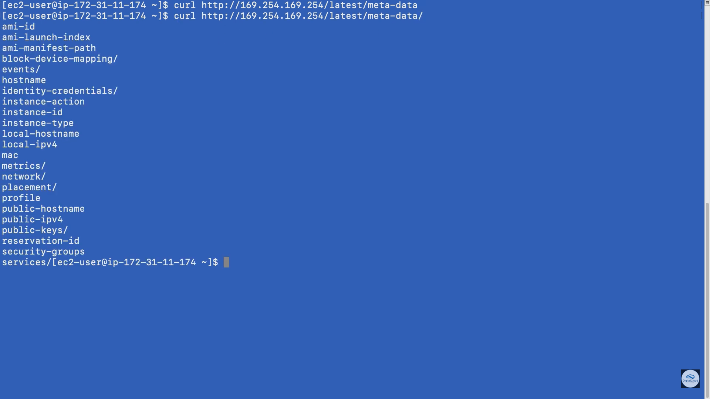

# Some of the best Hosting Platforms

The **best hosting platform for a MERN (MongoDB, Express, React, Node.js)** stack website depends on your priorities (e.g., ease of deployment, cost, scalability, control, performance). Here’s a breakdown of the **top platforms** across different criteria:

## 🔥 **Best Overall (for Most Developers)**

#### **Render**

* **Why it's good:** Super easy to set up full-stack apps, free tier available, supports Node.js, Express, MongoDB integration.
* **Features:** Auto-deploy from GitHub, custom domains, cron jobs, background workers.
* **MongoDB:** Use MongoDB Atlas (Render doesn’t host DBs natively).
* **Best for:** Beginners to mid-level developers who want quick deployments with good control.

## 🚀 **Best for High Performance / Scalability**

#### **Vercel (Frontend) + Railway / Render / Backend API on EC2**

* **Why it's good:** Use Vercel for React frontend (blazing fast CDN), and host Express/Node backend elsewhere (like Railway or EC2).
* **Best for:** Projects needing fast global frontend delivery and scalable backends.

## 💼 **Best for Production-Grade Projects**

#### **AWS (EC2 + S3 + MongoDB Atlas)**

* **Why it's good:** Full control, autoscaling, enterprise-grade infra.
* **MongoDB Atlas:** Official MongoDB cloud service integrates well.
* **Best for:** Advanced users/teams who need flexibility, security, and full DevOps.

## 🔧 **Easiest to Use (All-in-One)**

#### **Railway**

* **Why it's good:** Simple, unified dashboard for backend (Node), PostgreSQL/MongoDB, and frontend hosting.
* **One-click deploy** , GitHub integration, environment variables.
* **Best for:** Developers who want to deploy quickly and still scale later.

## 🧪 **For Hobby Projects or Prototyping**

#### **Glitch / Replit / Cyclic**

* **Why it's good:** Great for testing, quick prototyping, free tiers.
* **Downside:** Not recommended for production or custom domain scalability.
* **Best for:** Learning, demos, short-term testing.

## 🧠 **Quick Comparison Table**

| Platform          | Ease of Use                | Full MERN Support | Free Tier | Best For              |
| ----------------- | -------------------------- | ----------------- | --------- | --------------------- |
| **Render**  | ✅✅✅                     | ✅✅              | ✅        | Full-stack deployment |
| **Railway** | ✅✅✅                     | ✅✅✅            | ✅        | Backend + DB + CI/CD  |
| **Vercel**  | ✅✅✅                     | (Frontend only)   | ✅✅      | React apps            |
| **Netlify** | ✅✅✅                     | (Frontend only)   | ✅✅      | React frontend        |
| **AWS EC2** | ⚠️ Complex               | ✅✅✅            | ⚠️      | Production use        |
| **Glitch**  | ✅✅                       | ✅✅              | ✅        | Prototyping           |
| **Heroku**  | ⚠️ Phasing out free tier | ✅✅              | ❌        | Small/medium apps     |

## ✅ Recommended Stack for a MERN Project (2025) (Not Production Level):

* **Frontend:** React on **Vercel** or **Netlify**
* **Backend:** Node/Express on **Render** or **Railway**
* **Database:** **MongoDB Atlas**
* **Domain:** Buy from **Namecheap** /  **GoDaddy** , connect via platform settings
* **CI/CD:** GitHub + platform integration

##### 🖥️ **Frontend (React)**

* **Host on:** [**Vercel**](https://vercel.com/)
* **Why:** Instant deployment, blazing fast CDN, GitHub integration, free tier.
* **Bonus:** Custom domains, SEO support, environment variables.
* **What you'll show:** Production-grade frontend delivery, CI/CD integration.

##### 🔌 **Backend (Node.js + Express)**

* **Host on:** [**Render**](https://render.com/) or [**Railway**](https://railway.app/)
* **Why:** Easy setup, GitHub deploys, auto HTTPS, scalable, free tier.
* **What you'll show:** Real-world backend hosting, ability to connect frontend, env variables, secure API.

##### 🗃️ **Database (MongoDB)**

* **Use:** [**MongoDB Atlas**](https://www.mongodb.com/cloud/atlas)
* **Why:** Free tier, cloud-hosted, highly reliable, real-world usage.
* **What you'll show:** Cloud database integration, connection string management, secure storage.

##### 🎯 Your Deployment Stack At a Glance

| Component          | Platform             | Features to Highlight               |
| ------------------ | -------------------- | ----------------------------------- |
| **Frontend** | Vercel               | CI/CD, custom domain, fast load     |
| **Backend**  | Render/Railway       | REST APIs, secure routes, Node env  |
| **Database** | MongoDB Atlas        | Secure cloud DB, connection strings |
| **Domain**   | Namecheap (optional) | Custom domain mapping               |
| **Auth**     | JWT/Auth Middleware  | Realistic user login/roles          |
| **Payments** | Razorpay / PayPal    | Real-world integration              |

##### 🔗 Example URLs You Might End Up With

| What                  | Example URL                                  |
| --------------------- | -------------------------------------------- |
| **Frontend**    | `https://fitlab-frontend.vercel.app/`      |
| **Backend API** | `https://fitlab-api.onrender.com/api/`     |
| **Admin Panel** | `https://fitlab-frontend.vercel.app/admin` |
| **Database**    | (MongoDB Atlas – hidden, but referenced)    |

---

# Production Level Platform

**AWS is the best platform** —  *but only if you know how to use it right* .

Here’s a  **full breakdown of using AWS for hosting your MERN eCommerce project** , and whether **you should go with AWS** over other platforms like Vercel + Render.

#### 🧠 Why Use AWS?

✅ **Enterprise-level infrastructure** (used by companies like Netflix, Airbnb, etc.)

✅ Highly  **scalable** ,  **secure** , and **customizable**

✅ Interviewers love AWS experience — especially **EC2, S3, IAM, RDS/Atlas, Route 53**

✅ Looks *very impressive* if you can manage it yourself

#### ⚙️ AWS-Based Deployment Architecture for MERN

| Component          | AWS Service                                                           | Purpose                             |
| ------------------ | --------------------------------------------------------------------- | ----------------------------------- |
| **Frontend** | S3 + CloudFront                                                       | Static React app, globally cached   |
| **Backend**  | EC2 or AWS Elastic Beanstalk, Basic Linux, Nginx, SSH, PM2, firewalls | Runs Node.js + Express + Socket     |
| **Database** | MongoDB Atlas (preferred)                                             | Managed MongoDB in the cloud        |
| **Media**    | Cloudinary (still best for images)                                    | Or use S3 if needed                 |
| **Auth**     | JWT in your app                                                       | You can integrate AWS Cognito later |
| **Domain**   | Route 53                                                              | Domain + SSL setup                  |
| **Security** | IAM Roles + Security Groups                                           | Protect EC2, S3, and DB access      |

## ✅ What You’ll Show Interviewers If You Use AWS

| Skill                          | Interviewer Impression               |
| ------------------------------ | ------------------------------------ |
| EC2 setup, SSH, PM2, firewalls | Real-world server management         |
| S3 + CloudFront                | Understand global static delivery    |
| MongoDB Atlas connection       | Cloud DB integration skills          |
| Environment config             | Knows how to manage `.env`securely |
| Socket/WebRTC on EC2           | Handling real-time comm on VPS       |
| SSL + domain setup             | Full-stack deployment knowledge      |

#### 🆚 AWS vs Vercel + Render

| Feature               | **AWS**         | **Vercel + Render** |
| --------------------- | --------------------- | ------------------------- |
| 🔥 Skill showcase     | ✅✅✅ (very high)    | ✅✅ (good)               |
| ⚙️ Setup difficulty | ⚠️ Medium-Hard      | ✅ Easy                   |
| 💸 Cost (Free Tier)   | ✅ (12 months)        | ✅ Free forever (limits)  |
| 🧠 DevOps exposure    | ✅✅✅                | ✅ Basic CI/CD            |
| 🗣️ Interview appeal | ✅✅✅                | ✅✅                      |
| ⚡ Performance        | ✅✅✅ (if optimized) | ✅✅ (CDN-backed)         |
| 🧼 Maintenance        | ⚠️ Manual updates   | ✅ Auto-deploy            |

#### 🚀 When to Choose AWS (in Your Case)

✅ You want **resume gold**

✅ You are **comfortable with DevOps basics** (SSH, Linux, ports, envs)

✅ You want full control (WebRTC, Socket scaling, reverse proxy)

✅ You can spend a little time maintaining the setup

#### 🛠️ Quick Setup Plan (If You Choose AWS)

###### 1. **Frontend (React)**

* Build with `npm run build`
* Upload to **S3**
* Serve via **CloudFront** (CDN)
* Optional: Automate with GitHub Actions

###### 2. **Backend (Express + Socket.io + WebRTC)**

* Launch **EC2 instance (Ubuntu)**
* SSH into instance
* Install Node, Git, Nginx, PM2
* Clone your backend repo
* Set env variables
* Run using **PM2**
* Setup **Nginx reverse proxy** (for HTTPS + port 80 forwarding)

###### 3. **MongoDB Atlas**

* Create project, cluster
* Whitelist EC2 IP
* Connect using URI in backend

###### 4. **Domain + SSL**

* Use **Route 53** or connect from Namecheap
* Install free **Let's Encrypt SSL** on EC2 (if using custom domain)

---

# Hosting vs Deployment

The terms **hosting** and **deployment** are often used interchangeably, but they’re **not the same** — especially when you're building full-stack projects like a MERN app.

Here’s a clear breakdown:

#### ⚙️ Hosting vs Deployment — What's the Difference?

| Term                 | Definition                                                                | Analogy                                                      | Tools/Platforms                         |
| -------------------- | ------------------------------------------------------------------------- | ------------------------------------------------------------ | --------------------------------------- |
| **Hosting**    | The** location/environment ** where your app runs (server, storage, DB) | Like**renting a house**where your app "lives"          | EC2, Vercel, Render, S3, MongoDB Atlas  |
| **Deployment** | The **process **of putting your app into a hosted environment           | Like**moving into the house**and setting everything up | GitHub Actions, FTP, SSH, Docker, CI/CD |

#### 🔍 More Detailed View

###### 🏡 **Hosting** = *“Where does my app live?”*

* A **host** provides:
  * CPU, RAM, bandwidth
  * Domain/DNS, HTTPS
  * Server (e.g., EC2), file storage (e.g., S3), or DB (e.g., MongoDB Atlas)
* Types of hosting:
  * **Shared Hosting** : Like GoDaddy, Bluehost (not suitable for MERN)
  * **Cloud Hosting** : AWS, GCP, Azure
  * **Platform Hosting** : Vercel, Render, Railway

> Example: "I hosted my frontend on Vercel and my backend on Render."

###### 🚀 **Deployment** = *“How do I get my app onto the host?”*

* Steps involved:
  * Push code from GitHub
  * Build the app (React, Node, etc.)
  * Set environment variables
  * Run start commands (`npm start`, `pm2 start`, etc.)
  * Configure domains, SSL, logs

> Example: "I deployed my Express API to EC2 using GitHub + PM2 + SSH."

#### ✅ In Your Context (MERN Project):

| Task                                         | Is it Hosting or Deployment? |
| -------------------------------------------- | ---------------------------- |
| Spinning up an EC2 instance                  | **Hosting**            |
| Uploading React build files to S3            | **Deployment**         |
| Running `pm2 start server.js`on EC2        | **Deployment**         |
| Setting up MongoDB Atlas cluster             | **Hosting**            |
| Connecting frontend to backend using API URL | **Deployment task**    |

#### 🔁 Hosting + Deployment Work Together

You **deploy** your app **to** a  **host** .

Example:

> I deployed my MERN stack app to AWS, where the frontend is hosted on S3/CloudFront, and the backend is hosted on EC2. MongoDB Atlas is my database host.

#### ✅ Summary

| 🔑 Term              | 📌 Simple Definition                                      |
| -------------------- | --------------------------------------------------------- |
| **Hosting**    | Where your app runs (the cloud/computer it lives on)      |
| **Deployment** | The process of putting your app into that environment     |
| **CI/CD**      | Automated way to deploy continuously on every code change |

---

# AWS **(Amazon Web Services)**

**AWS (Amazon Web Services)** is a **cloud computing platform** created by Amazon.

#### ✅ Simple Definition:

> **AWS is like renting computers, storage, and tools on the internet instead of owning them.**

So instead of buying your own physical server, setting up routers, storage, etc., you **rent only what you need** from AWS, and only for as long as you need it.

#### 📦 What Does AWS Offer?

AWS gives you everything needed to:

| Need                    | AWS Service                                    | Example Use                             |
| ----------------------- | ---------------------------------------------- | --------------------------------------- |
| 🖥️ Run servers        | EC2 (Elastic Compute Cloud)                    | Host backend, deploy Node.js            |
| 📦 Store files          | S3 (Simple Storage Service)                    | Store images, videos, React build files |
| 🛢️ Host databases     | RDS (Relational DBs), MongoDB Atlas (external) | Store user/product data                 |
| 🌐 Serve frontend       | S3 + CloudFront                                | Host React frontend with CDN            |
| 🔐 Secure everything    | IAM (Identity & Access Management)             | Control who can access what             |
| ⚙️ Auto deploy apps   | Elastic Beanstalk                              | Quick app deployment (like Render)      |
| 📊 Monitor resources    | CloudWatch                                     | Logs, performance, alerts               |
| 🗂️ Manage domains     | Route 53                                       | Custom domain + DNS setup               |
| 📡 Serverless functions | Lambda                                         | Run functions without a server          |
| 📁 File transfer        | AWS Transfer or API Gateway                    | Handle file uploads, APIs               |

#### 🧱 AWS = Infrastructure as a Service (IaaS)

Instead of setting up your own physical hardware (CPU, disk, memory), AWS gives you:

* **Virtual computers (EC2)**
* **Virtual storage (S3, EBS)**
* **Virtual networking (VPC, Route 53)**
* **DevOps tools (CodePipeline, CodeDeploy)**
* **Managed services (Elastic Beanstalk, Lambda)**

#### 💡 Why is AWS So Popular?

| Benefit                 | What It Means for You                                     |
| ----------------------- | --------------------------------------------------------- |
| **Scalable**      | Your app can handle 1 or 1 million users automatically    |
| **Pay-as-you-go** | You pay only for what you use (no upfront hardware costs) |
| **Reliable**      | 99.99% uptime — trusted by Netflix, NASA, Adobe, etc.    |
| **Global**        | Fast CDN, multiple data centers worldwide                 |
| **Secure**        | Used by banks, hospitals — very secure                   |
| **Flexible**      | Supports almost any programming language or tech stack    |

#### 🔍 AWS in Real Life: MERN E-commerce Example

| App Component         | Hosted on AWS Service                   |
| --------------------- | --------------------------------------- |
| Frontend React App    | S3 + CloudFront                         |
| Backend Node API      | EC2 (or Elastic Beanstalk)              |
| Images (product/user) | S3 or Cloudinary                        |
| Database              | MongoDB Atlas (external, or RDS if SQL) |
| Custom domain         | Route 53                                |
| Deployment pipeline   | GitHub Actions or AWS CodePipeline      |

#### 📌 How You Use AWS

Here’s the process you’ll follow:

1. Create a **free AWS account**
2. Launch an **EC2 instance** (Ubuntu Linux server)
3. SSH into it and install Node.js, MongoDB client, Nginx, PM2
4. Deploy your backend using Git + PM2
5. Host your frontend build on **S3**
6. Use **CloudFront** for CDN
7. Set up **Route 53** to map a domain
8. Optionally use **GitHub Actions** for CI/CD

#### 🧠 What Interviewers Expect You to Know About AWS

| Level           | What to Know                                      |
| --------------- | ------------------------------------------------- |
| 🟢 Basic        | EC2, S3, IAM, MongoDB Atlas, CloudFront           |
| 🟡 Intermediate | Nginx config, PM2, env variables, SSH, Route 53   |
| 🔴 Advanced     | Load balancers, VPC, Docker on EC2, Lambda, CI/CD |

#### 🆓 Is AWS Free?

✅ Yes — there's a  **Free Tier for 12 months** , which includes:

* 750 hours/month of EC2 (enough for one instance running 24/7)
* 5 GB of S3 storage
* 1M requests/month for Lambda
* Free CloudWatch logs, and more

After 12 months, it’s pay-as-you-go — and still cheap for small projects.

---

---

# ------- EC2 (Elastic Compute Cloud) -------

**Amazon EC2 (Elastic Compute Cloud)** — one of the **most important and powerful services** on AWS. It’s the core of many real-world deployments, including for example a MERN eCommerce project.

## ----- Introduction

#### 🧠 What is EC2?

**EC2 (Elastic Compute Cloud)** is Amazon's service that provides **virtual servers** in the cloud.

> ✅ Think of EC2 as a **rentable computer in the cloud** that you control — just like your own Linux or Windows system, but hosted on Amazon’s infrastructure.


#### 💡 Why Use EC2?

* You can **deploy your backend** here (Node.js, Express, sockets, WebRTC, etc.)
* You can  **host full websites** , APIs, file servers, etc.
* You pay only for what you use
* You have **full control** over the OS, software, networking, and security

#### 🧱 Key Components of EC2

| Component                | Description                                                 |
| ------------------------ | ----------------------------------------------------------- |
| **Instance**       | A single virtual machine (VM) you launch                    |
| **AMI**            | Amazon Machine Image – the OS (e.g., Ubuntu, Amazon Linux) |
| **Instance Type**  | Hardware config – CPU, RAM, etc. (e.g.,`t2.micro`)       |
| **Key Pair**       | SSH key to securely access your EC2 server                  |
| **Security Group** | Virtual firewall – controls ports (HTTP, SSH, etc.)        |
| **Elastic IP**     | Static public IP address for your EC2 instance              |
| **EBS Volume**     | Storage (like your system drive) for EC2 instance           |
| **User Data**      | Script that runs at launch (for auto-setup)                 |

#### 🛠️ How EC2 Works (In Simple Steps)

1. You **launch** an EC2 instance (pick OS, size, settings)
2. You **SSH into the instance** (like using a remote Linux machine)
3. You  **install Node.js** , your backend app, MongoDB client, PM2, etc.
4. You **open ports** (like 80, 3000) in the security group
5. You **run your server** (e.g., `pm2 start server.js`)
6. You can  **set up Nginx** , domains, SSL, etc.

#### ⚙️ Example: Hosting MERN Backend on EC2

| Task                              | Tool or Command                         |
| --------------------------------- | --------------------------------------- |
| Launch Ubuntu EC2                 | From AWS Console                        |
| SSH into server                   | `ssh -i mykey.pem ubuntu@<public-ip>` |
| Install Node.js, Git              | `apt install nodejs git`              |
| Clone your backend repo           | `git clone <your-repo>`               |
| Run server                        | `pm2 start server.js`                 |
| Expose port                       | Open 3000 in Security Group             |
| Optional: Set up Nginx            | `apt install nginx`                   |
| Optional: Add SSL (Let's Encrypt) | `certbot`                             |

#### 💸 EC2 Pricing (Free Tier Available)

###### Free Tier:

* `t2.micro` or `t3.micro` = **750 hours/month for 12 months**
* Enough to run **1 server 24/7 for free** (great for projects)

###### After free tier:

* Pay-per-second pricing (e.g., $7–$10/month for small instance)
* Can stop and restart to save cost

#### 🔐 Security in EC2

* **SSH Key Pair:** Used to securely connect (private key stays on your laptop)
* **Security Groups:** Acts like a firewall — you must open ports like:
  * `22` → SSH
  * `80` → HTTP
  * `443` → HTTPS
  * `3000` (or any custom port for Node.js)

#### 🗺️ EC2 Instance Lifecycle

| State                | Meaning                                                  |
| -------------------- | -------------------------------------------------------- |
| **Running**    | Your server is active and billed                         |
| **Stopped**    | You’re not billed for compute, but storage costs remain |
| **Terminated** | Deleted permanently                                      |
| **Reboot**     | Restarts the OS, like rebooting a PC                     |

#### 📦 EC2 vs Other AWS Compute Options

| Service                     | Control           | Complexity  | Use Case                |
| --------------------------- | ----------------- | ----------- | ----------------------- |
| **EC2**               | 🔥 Full control   | 🟡 Medium   | Full apps, real servers |
| **Elastic Beanstalk** | ⚠️ Less control | 🟢 Easy     | Auto-managed Node apps  |
| **Lambda**            | ❌ No server      | 🟢 Easy     | Short functions, APIs   |
| **ECS/EKS**           | ✅ Docker/K8s     | 🔴 Advanced | Scalable container apps |

#### 🧠 What You'll Learn by Using EC2

* Linux CLI: SSH, file management, permissions
* Networking: ports, firewalls (security groups)
* Process management: `pm2`, systemctl, startup scripts
* Hosting practices: Nginx, domains, SSL
* Deployment: Manual → CI/CD (GitHub Actions)

#### ✅ Summary: EC2 = Your Personal Cloud Server

| Feature                | Benefit                                |
| ---------------------- | -------------------------------------- |
| Launch Linux server    | Build like in real world               |
| Custom setup           | Install anything (Node, Mongo, Python) |
| Secure connection      | SSH with key                           |
| Custom ports/firewalls | Security groups                        |
| Handles any traffic    | Scale later with load balancers        |
| Resume-ready skill     | Interviewers love EC2 knowledge        |

---

## Deploying Backend in EC2

1. Create an AWS account
2. Set up an EC2 instance **

   If at some point in the future, you wanted to create an applicationusing the resources you’ve stored on S3, you’ll need to create an
   instance EC2.

**
    2a) Choosing an AMI (Amazon Machine Image):**

    An AMI is a template that is used to create a new instance—or virtual machine—based on user requirements. The AMI will contain 			information  about the software, operating system, volume, and access permissions.
	There are two types of AMIs:

    i) Predefined AMIs: Amazon creates these, and the user can modify them.

    ii) Custom AMIs: The user also creates these, and they can be reused. These AMIs are also available in the AMI Marketplace

**


 2b) Choosing an instance type:**

    An instance type specifies the hardware specifications that are required in the machine from the previous step. Instance types belong to
 five main families:

    i) Compute-optimized: For situations that require a lot of high processing power. Good for scientific modeling, ML, gaming, etc

    ii) Memory-optimized: For setting up something to do with your in-memory cache. Good for sites that requres lot of cach memory

    iii) GPU optimized: For setting up a gaming system, or something with the requirement of a large graphic. Good for gaming sites

    iv) Storage optimized: When you need to set up a storage server

    v) General-purpose: When everything is equally balanced

    Instance types are fixed, and their configurations cannot be altered.

**


    2c) Configure Instance:**

    You have to specify the number of instances, purchasing options, the kind of network, the subnet, assign a public IP, set the[IAM](https://www.simplilearn.com/tutorials/aws-tutorial/aws-iam "IAM")
 role, the shutdown behavior, etc. On that note, stopping the system and terminating the system under ‘Shutdown behavior’ are completely
different things.

    Stopping = Temporarily shutting down the system

    Terminating = Returning control to Amazon

    Under the advanced details, users can also add bootstrap scripts that  are executed when the virtual machine starts up. It also offers
multiple payment options, such as:

    i) On-demand instances: Can be launched whenever the user requires normal rates

    ii) Reserved instances: These instances are reserved for one year or three years. The entire amount has to be paid upfront or over a span of a few months.

    iii) Spot instances: Bidding goes to the bidder with the highest bid.  These instances are available at a lesser cost than on-demand instances.


    **2d) Adding Storage:**

    You’re tasked with deciding the type of storage, which could be:

    i) Ephemeral Storage (temporary and free)

    ii) Amazon Elastic Block Store (permanent and paid)

    iii) Amazon S3

    The size (in GBs), volume type, where the disk is mounted, and whether the volume needs to be encrypted needs to be specified. Freeusers get to access up to 30 GBs of SSD or magnetic storage (which can be found under ‘Volume Type’).


**2e) Adding tags:**

    This helps to identify instances more quickly.

**
**2f) Configuring security groups:**

    These are used to specify rules based on which users are given access  to the EC2 instance. You set up the type of security, protocol, the
port range, and source (from where the incoming traffic is coming from). Incoming traffic has to be explicitly specified, and outgoing traffic
is open.

**
 **2g) Review**

    Click on ‘Launch’ and the instance is created. However, there’s a little more work to be done.


    Fig: This dialog will pop up

    **Private key** : The user downloads the private key

    **Public key** : AWS uses the public key to confirm the identity of the user.

    After choosing to create a new pair, a new private key is downloaded as a .pem file.

    For the next step, we need to use the following tools: PuTTY and PuTTYgen. PuTTY is generally used when you need to connect a Windows  system with a Linux system, which is what we’re doing now. PuTTY doesn’t  accept .pem files.

    So, using the PuTTY Key Generator, you create a new .ppk file, an another format

    Conversion (PuTTYgen can be used for this ). Then insrt the .ppk key

    Now pen PUTTY,

    Select “Save Private Key” and find a location to save the key.


    Fig: In the PuTTY configuration tool, provide your[IP address](https://www.simplilearn.com/tutorials/cyber-security-tutorial/what-is-an-ip-address "IP address") and click on “Connection-Auth”. In browse for private ky for authntication. Clikc browse and find the .ppk file


    After clicking on "Open", will open for example the linux instance using CLI ie a terminal will open up where you can log in as ec2-user for example


---

## Connecting instance in EC2

#### ✅ Prerequisites Before You Connect

Make sure you’ve done the following in AWS:

1. ✅ **Launched an EC2 instance**
2. ✅ Selected an **Amazon Linux** or **Ubuntu** AMI
3. ✅ Chosen a `t2.micro` or `t3.micro` (for free tier)
4. ✅ Created and downloaded a **Key Pair** (`.pem` file)
5. ✅ Your **Security Group** has **port 22 (SSH)** open

#### 🔑 Step 1: Locate Your `.pem` Key File

* When you launched your EC2 instance, you were prompted to  **create or select a key pair** .
* You must have downloaded a file like:
  ```
  my-key.pem
  ```

> Keep this safe. You **can't connect** without this file.

#### 📍 Step 2: Find Your EC2 Instance Public IP

* Go to the **AWS EC2 Dashboard**
* Click **Instances**
* Note the **Public IPv4 address** (e.g., `3.108.22.55`)

#### 🖥️ Step 3: Open Terminal and Connect

###### 🔹 On **Linux/Mac** (or Windows with WSL or Git Bash):

```bash
chmod 400 my-key.pem  # give proper permissions (only once)

ssh -i my-key.pem ubuntu@<your-ip>
# For Ubuntu AMI: use "ubuntu"
# For Amazon Linux: use "ec2-user"
```

**Example:**

```bash
ssh -i my-key.pem ubuntu@3.108.22.55
```

If your instance uses Amazon Linux:

```bash
ssh -i my-key.pem ec2-user@3.108.22.55
```

###### 🔹 On **Windows (No WSL/Git Bash)?**

Use **PuTTY** (Windows SSH client):

1. Convert `.pem` to `.ppk` using **PuTTYgen**
2. Open PuTTY → Host: `ubuntu@<your-ip>`
3. Load the `.ppk` key under SSH > Auth > Private Key File

#### ✅ Step 4: You’re In!

If successful, you'll see:

```bash
Welcome to Ubuntu 22.04 LTS
ubuntu@ip-172-31-xx-xx:~$
```

This is your  **remote Linux machine in the cloud** . You can now:

* Install Node.js
* Clone your repo
* Start your app
* Install nginx or PM2

#### 🛠️ Common Errors & Fixes

| Error                             | Fix                                                                                              |
| --------------------------------- | ------------------------------------------------------------------------------------------------ |
| `Permission denied (publickey)` | Check you're using correct `-i`file with right user (`ubuntu`,`ec2-user`)                  |
| `Unprotected private key`       | Run `chmod 400 my-key.pem`                                                                     |
| `Connection timed out`          | Make sure**port 22 is open**in EC2 Security Group                                          |
| Can't find `.pem`file           | Must download it**at the time of instance creation**— or recreate instance with a new key |

#### 🧠 Tip

Use `pm2` to keep your app running in the background:

```bash
npm install -g pm2
pm2 start index.js
pm2 save
```

---

## Get Inside the Instance (How to SSH into your Instance)

To  **get inside your EC2 instance** , you use **SSH (Secure Shell)** — this lets you open a terminal session directly on your cloud server.

Once you gets inside the Linux or Ubuntu Instance, you will see only a terminal so as to communicate with the instance

#### ✅ Step-by-Step: How to Get Inside Your EC2 Instance

##### 🟢 **1. Get Your EC2 Public IP Address**

* Go to the **AWS EC2 Dashboard** → **Instances**
* Find your instance and copy its **Public IPv4 address**

  (e.g., `3.108.22.55`)

##### 🟢 **2. Find Your `.pem` Key File**

* When you launched your instance, you downloaded a **key pair** (e.g., `my-key.pem`)
* This is the **private key** used to connect securely

##### 🟢 **3. Set Permissions for `.pem` File**

> Only if you're on Mac, Linux, or WSL/Git Bash on Windows:

```bash
chmod 400 my-key.pem
```

> This command restricts file access to keep it secure
>
> ###### 🔍 Breakdown
>
> | Part           | Meaning                                     |
> | -------------- | ------------------------------------------- |
> | `chmod`      | Change file**mode**(i.e. permissions) |
> | `400`        | Permission code (read-only for owner)       |
> | `my-key.pem` | The file whose permissions you're changing  |
>
> 🧠 What `400` Means
>
> In Linux, file permissions are represented using 3 digits:
>
> **Owner | Group | Others**
>
> Each digit is a sum of:
>
> * `4` = read
> * `2` = write
> * `1` = execute
>
> So:
>
> | Value   | Permission    | Meaning                                                                    |
> | ------- | ------------- | -------------------------------------------------------------------------- |
> | `400` | `r--------` | Only the owner can**read the file. Everyone else gets**no access** |
>
> ✅ Why is `chmod 400` Used for `.pem` Files?
>
> Because `.pem` key files are  **private SSH keys** , and they must be:
>
> * Not **writable** or **readable** by others (for security)
> * **Read-only** by the owner
>
> If the key file has wrong permissions, SSH will reject it and give this error:
>
> ```
> UNPROTECTED PRIVATE KEY FILE!
> ```
>
> So `chmod 400` is required to make the `.pem` secure enough for SSH to use.

##### 🟢 **4. Connect to Your Instance via SSH**

Use this format:

```bash
ssh -i /path/to/my-key.pem ubuntu@<public-ip>
```

✅ Examples:

| AMI Type     | Command                                    |
| ------------ | ------------------------------------------ |
| Ubuntu       | `ssh -i my-key.pem ubuntu@3.108.22.55`   |
| Amazon Linux | `ssh -i my-key.pem ec2-user@3.108.22.55` |

> If your  **EC2 AMI is a Windows Server** , you  **don’t use SSH like you do with Ubuntu/Linux** . Instead, you connect using  **Remote Desktop Protocol (RDP)** .
>
> ###### 🖥️ Connecting to a Windows EC2 Instance (Step-by-Step)
>
> ✅ 1. Open AWS Console → EC2 → Instances
>
> * Select your **Windows instance**
> * Wait until its **status is "Running"**
>
> ✅ 2. Get the Public IPv4 Address
>
> * In the instance details pane, note the **Public IPv4 address**
>   > Example: `3.108.22.55`
>   >
>
> ✅ 3. Select the Instance → Click **Connect** Button (Top Right)
>
> * In the popup:
>   * Choose **RDP Client**
>   * Click **"Get Password"**
>
>     (Wait ~4 minutes after instance starts)
>
> ✅ 4. Decrypt Windows Password
>
> * Upload your `.pem` key file
> * AWS will decrypt the **Administrator password**
> * Copy it (you'll use it to log in)
>
> ✅ 5. Use Remote Desktop (RDP) to Connect
>
> 🟢 On Windows:
>
> * Press `Win + R` → type `mstsc` → hit Enter
> * In the RDP client:
>   * Computer: `3.108.22.55`
>   * Username: `Administrator`
>   * Password: (paste the decrypted one)
>
> 🟢 On Mac:
>
> * Use the **Microsoft Remote Desktop** app (from App Store)
> * Add a new PC using:
>   * PC name: `3.108.22.55`
>   * User: `Administrator`
>   * Password: (paste the password)

##### 🟢 **5. You're In! 🎉**

If successful, you'll see something like:

```bash
Welcome to Ubuntu 22.04 LTS
ubuntu@ip-172-31-xx-xx:~$
```

Now you are  *inside your EC2 instance terminal* . You can:

* Run Linux commands
* Install Node.js, PM2, Git, etc.
* Clone your backend repo
* Start servers

#### 🛠 Common Errors & Fixes

| Error                             | Fix                                                                                                            |
| --------------------------------- | -------------------------------------------------------------------------------------------------------------- |
| `Permission denied (publickey)` | Wrong user or key file; make sure you're using the correct username (`ubuntu`,`ec2-user`) and `.pem`file |
| `Unprotected private key file`  | Run `chmod 400 my-key.pem`                                                                                   |
| `Connection timed out`          | Check that**port 22 is open**in the**Security Group**                                              |
| `.pem`file not found            | Must be downloaded during EC2 creation; recreate instance if lost                                              |

---

## Elastic IP

Let’s clearly understand **Elastic IP** in AWS — it’s one of those small but important concepts, especially when hosting web apps like your MERN eCommerce project.

#### 🧠 What is an Elastic IP (EIP)?

> **Elastic IP is a static public IPv4 address** that you can  **attach to your EC2 instance** , so your server's **public IP doesn’t change** — even if you restart or stop the instance.

#### 🤔 Why Do You Need It?

By default:

* Every EC2 instance gets a **public IP** (e.g., `13.233.20.12`)
* But this IP **changes** every time you **stop/start** the instance

That’s a problem if:

* You're using a **domain name**
* Your **frontend app or users** need a consistent backend URL

### ✅ Elastic IP solves this by giving you:

* A **fixed IP address** that **doesn’t change**
* The ability to **reassign it** to another instance if needed

#### 🧱 Real-World Example (Your MERN Project)

### Without Elastic IP:

1. Deploy backend on EC2
2. IP is `13.233.10.10`
3. You stop the instance → IP is now `3.108.11.12`
4. Your frontend breaks, Postman breaks, domain mapping breaks

### With Elastic IP:

1. You associate `54.200.100.123` (EIP) to your EC2
2. Even after stopping/restarting the instance — IP stays the same
3. Frontend, Postman, domain DNS all continue to work

#### 🔁 How It Works

1. You **allocate** an Elastic IP (from AWS pool — it’s free if in use)
2. You **associate** it to your EC2 instance
3. If needed, you can **detach** it and assign to another instance

#### 💸 Cost & Billing

| Case                                  | Charged?                            |
| ------------------------------------- | ----------------------------------- |
| EIP**attached**to a running EC2 | ❌ Free                             |
| EIP**not attached**to anything  | ⚠️**Charged**(~$0.005/hour) |

> **✅ Rule of thumb** : Always associate your EIP. If you’re not using it, release it!

## 🔧 How to Allocate & Attach an Elastic IP (from Console)

###### Step 1: Allocate EIP

* Go to **EC2 Dashboard** → Elastic IPs → **Allocate Elastic IP**

###### Step 2: Associate it

* Select the new EIP → Click **Actions > Associate**
* Choose your **Instance** (and optionally a private IP)

---

## Instance type Naming Convention

An EC2 **instance type** defines the **hardware configuration** (CPU, memory, network, etc.) of your virtual server.

Each instance type is made of:

```plaintext
[family][generation].[size]
```

#### 🔤 Format: `family` + `generation` + `size`

#### Example:

```bash
t2.micro
```

* `t` → **Family** (e.g., general purpose)
* `2` → **Generation** (version number of that family)
* `micro` → **Size** (defines CPU/memory)

#### 🔍 EC2 Instance Families (What the Letter Means)

| Letter        | Family Name          | Use Case                                      |
| ------------- | -------------------- | --------------------------------------------- |
| **t**   | General Purpose      | Balanced CPU + RAM (✅ ideal for MERN dev)    |
| **m**   | General Purpose      | More predictable CPU than `t`, better perf. |
| **c**   | Compute Optimized    | High CPU for heavy compute tasks              |
| **r**   | Memory Optimized     | Large RAM (databases, caching)                |
| **g**   | GPU Instances        | Machine learning, graphics, video processing  |
| **i**   | Storage Optimized    | High IOPS (disk I/O)                          |
| **a/z** | ARM-based (Graviton) | Cost-efficient, good for scale                |
| **x**   | Extreme Memory       | SAP, huge DBs                                 |
| **d/h** | Dense Storage        | Big data, Hadoop                              |

#### 🧬 Generation (The Number)

| Number                                                             | Meaning                                          |
| ------------------------------------------------------------------ | ------------------------------------------------ |
| `1`,`2`,`3`,`4`...                                         | Newer = more efficient, better price/performance |
| Example:`t3`is newer than `t2`and often cheaper for more power |                                                  |

#### 📏 Size (The `.micro`, `.small`, `.medium`...)

| Size         | vCPUs | RAM (approx) | Notes                                |
| ------------ | ----- | ------------ | ------------------------------------ |
| `nano`     | 1     | 0.5 GB       | Very tiny — only for testing        |
| `micro`    | 1     | 1 GB         | ✅ Free tier eligible (`t2.micro`) |
| `small`    | 1     | 2 GB         | Slightly better than `micro`       |
| `medium`   | 2     | 4 GB         | Good for light real-world apps       |
| `large`    | 2     | 8 GB         | Can run backend + DB together        |
| `xlarge`   | 4–8  | 16+ GB       | For serious backend workloads        |
| `2xlarge+` | 8+    | 32–512 GB+  | For enterprise needs                 |


#### ✅ Best Types for Your MERN Project

| Use Case                    | Recommended Type           | Notes                          |
| --------------------------- | -------------------------- | ------------------------------ |
| Learning + Free Tier        | `t2.micro`,`t3.micro`  | ✅ Free, fine for testing      |
| Lightweight production app  | `t3.small`,`t3.medium` | Cheaper but faster than `t2` |
| Medium traffic + backend/db | `t3.large`,`m5.large`  | Stable                         |
| Heavy sockets / CPU usage   | `c5.large`               | Compute optimized              |
| MongoDB self-hosted         | `r5.large`               | Memory optimized               |

#### 💡 Spot Instances & Savings Plans

If you're doing test deployments, you can use:

* **Spot instances** → up to 90% cheaper (preemptible)
* **Savings plans** or **reserved instances** → cheaper for long term

#### 🧠 Summary

| Term       | Example             | Meaning                    |
| ---------- | ------------------- | -------------------------- |
| Family     | `t`               | General purpose (balanced) |
| Generation | `2`,`3`,`5`   | Version of that family     |
| Size       | `micro`,`large` | Resource level (CPU, RAM)  |

So:

```plaintext
t3.medium = General purpose, 3rd gen, medium size (~2 vCPUs, 4GB RAM)
```

---

## UserData in EC2

🧠 What Is EC2  **User Data** ?

> **User Data is a script you attach to an EC2 instance that runs automatically on first boot** (when the instance is created).

#### ✅ Use cases:

* Install software (Node.js, Nginx, Mongo client, etc.)
* Clone and start your backend repo
* Set environment variables
* Configure system settings
* Start your server automatically

#### 🛠️ How Does It Work?

When you launch an EC2 instance, you’ll see this optional section:

```
[Advanced Details] → User data (Add script)
```

There, you paste a shell script (Bash).

On first boot, AWS executes it  **as root** , so it can install packages, update the system, etc.

#### 📦 Example: Auto-Install Node.js + Run Express Server

```bash
#!/bin/bash
sudo apt update -y
sudo apt install nodejs npm -y
git clone https://github.com/arun/my-backend.git
cd my-backend
npm install
node index.js
```

This will:

* Update the package manager
* Install Node
* Clone your backend repo
* Install dependencies
* Start your server!

> ✅ You can make your EC2  **self-configuring** , no manual login needed.

#### ⚙️ Example: PM2 Setup for MERN Backend

```bash
#!/bin/bash
sudo apt update -y
sudo apt install nodejs npm git -y

# Clone your repo
git clone https://github.com/arun/my-backend.git
cd my-backend

# Set up Node app
npm install -g pm2
npm install

# Set env variables (for quick test — not production safe)
echo 'PORT=3000' >> .env
echo 'MONGO_URI=your-mongo-uri' >> .env
echo 'JWT_SECRET=secret' >> .env

# Start app
pm2 start index.js --name fitlab-backend
pm2 startup
pm2 save
```


#### 📍 Where to Add User Data?

When launching an EC2 instance:

1. Go to **Step 3 – Configure Instance**
2. Scroll to **Advanced Details**
3. Paste your **Bash script** in **User data** box

You can also pass it through Terraform, CloudFormation, or Boto3 if you automate things.

#### 🔁 Notes

| Rule                                                            | Description                                                   |
| --------------------------------------------------------------- | ------------------------------------------------------------- |
| 🟢**Runs only on first boot**                             | After that, it won't run again unless you manually trigger it |
| ⚠️**Must start with `#!/bin/bash`**                   | It’s a Linux shell script                                    |
| 🧪 You can log its output at `/var/log/cloud-init-output.log` | Helpful for debugging                                         |

#### ✅ Why It's Amazing for Your Use Case

For your  **MERN eCommerce project** , `User Data` lets you:

* Spin up new backend servers **fully configured**
* Auto-start backend on launch (even with PM2)
* Build staging/prod environments **faster**
* Practice **DevOps automation** (which impresses in interviews)

#### 💡 Bonus Use Case: Deploy React App from S3

In a user data script, you could even:

```bash
aws s3 cp s3://your-bucket-name/build/ /var/www/html/ --recursive
```

---

## Inbound Ruless in EC2

**Inbound rules** in EC2 **control what traffic is allowed *into* your instance** — like who can access your backend, SSH, or frontend.

They are defined in a  **Security Group** , which acts like a virtual firewall.

#### 🧠 Think of It Like This:

* Without inbound rules → 🔒 **your EC2 is invisible** to the outside world
* With proper rules → 🔓 **you allow the right ports in**

#### 🔤 Common Inbound Rules for a MERN App

| Port            | Protocol | Purpose                         | Source                              |
| --------------- | -------- | ------------------------------- | ----------------------------------- |
| **22**    | TCP      | SSH (to connect via terminal)   | `My IP`or `0.0.0.0/0`(dev only) |
| **80**    | TCP      | HTTP (for Nginx/React frontend) | `0.0.0.0/0`                       |
| **443**   | TCP      | HTTPS (SSL)                     | `0.0.0.0/0`                       |
| **3000**  | TCP      | React frontend (dev only)       | `0.0.0.0/0`                       |
| **5000**  | TCP      | Express backend (API)           | `0.0.0.0/0`or React IP            |
| **6000+** | TCP      | WebRTC or Socket.io             | Optional, if needed                 |

> `0.0.0.0/0` means  **accessible from anywhere** .
>
> 🔐 For production, use **your IP** or **CloudFront’s IP range** for better security.

#### 📍 How to Add Inbound Rules

1. Go to **EC2 Console**
2. Click **Instances** → Select your instance
3. Under  **Description** , find **Security groups** → click the group
4. Go to **Inbound rules** → Click **Edit inbound rules**
5. Add rules like:

| Type       | Protocol | Port Range | Source    |
| ---------- | -------- | ---------- | --------- |
| SSH        | TCP      | 22         | My IP     |
| HTTP       | TCP      | 80         | 0.0.0.0/0 |
| HTTPS      | TCP      | 443        | 0.0.0.0/0 |
| Custom TCP | TCP      | 5000       | 0.0.0.0/0 |

#### 🚫 What Happens Without Inbound Rules?

* You’ll get:
  * `Connection refused`
  * `Timeout` when visiting the IP
  * Can’t SSH or access your backend
* Your server works locally on EC2 but **is unreachable from outside**

#### 🔐 Security Tip

* Use `My IP` (your actual public IP) instead of `0.0.0.0/0` for **SSH (port 22)**
* For APIs (port 5000), if you only want frontend to access it, **whitelist only the frontend IP/domain**
* For production, use **Nginx (port 80/443)** and reverse proxy


#### 🧠 Summary

| Thing           | Means                                         |
| --------------- | --------------------------------------------- |
| Inbound Rule    | Allows external traffic**into**your EC2 |
| Port            | Specific service (22 = SSH, 80 = HTTP)        |
| Source          | Who is allowed to connect                     |
| Where to set it | Inside**Security Group**attached to EC2 |

---

## IAM -  (Identity Access Management)

🛡️ What is AWS IAM?

> **AWS IAM (Identity and Access Management)** is the **central security service** in AWS that controls  **who can access what** , and  **how** .

It lets you:

* **Create users, groups, and roles**
* **Attach permissions** to control access to AWS services
* **Secure your cloud infrastructure**

Absolutely! Let's dive into **AWS IAM (Identity and Access Management)** in full detail — in a way that’s useful for your  **MERN + DevOps goals** , and that helps you  **speak confidently in interviews** .

#### 🔑 Why IAM Is Crucial

Think of IAM as the **security gate** for everything in AWS:

| Without IAM                    | With IAM                                                        |
| ------------------------------ | --------------------------------------------------------------- |
| Everyone can access everything | Only authorized users/resources can access what they're allowed |
| Hard to audit                  | Every action is logged in CloudTrail                            |
| Easy to make costly mistakes   | You can restrict what users and services can do                 |

#### 🔧 IAM Core Components

Let’s break down the  **building blocks** :

##### 1. **IAM Users**

> A user is **a person or a service** that needs to log in or make API requests.

* Used for  **developers, admins** , or scripts
* Each user can have:
  * **Username + password** (for AWS Console login)
  * **Access keys** (for CLI/SDK/API access)
* Example: `arun_admin`, `backend_deploy_bot`

##### 2. **IAM Groups**

> A **group** is a collection of users that share the same permissions.

* Useful for managing teams like:
  * `DevOpsTeam`
  * `FrontendTeam`
  * `QAEngineers`
* You attach **policies** (permissions) to groups

##### 3. **IAM Policies (Permissions)**

> Policies define **what actions are allowed or denied** on  **which resources** .

* Written in **JSON**
* Attached to:
  * Users
  * Groups
  * Roles

#### 🔹 Example Policy: Read-only access to S3

```json
{
  "Effect": "Allow",
  "Action": ["s3:GetObject"],
  "Resource": ["arn:aws:s3:::my-bucket/*"]
}
```

You can also use:

* AWS **Managed Policies** (prebuilt by AWS)
* Or **custom policies** (more fine-tuned)

##### 4. **IAM Roles**

> Roles are like **temporary permission sets** assigned to AWS **resources** or  **trusted entities** .

* Used by:
  * **EC2** (to access S3, DynamoDB, etc.)
  * **Lambda** ,  **ECS** , etc.
  * **Cross-account access**
* Roles have:
  * A **trust policy** (who can assume it)
  * A **permission policy** (what it can do)

🔑 Roles  **do not need passwords or access keys** . AWS handles credentials internally.

##### 5. **IAM Access Keys**

> For **programmatic access** (CLI, SDK, API)

* Format:
  * `AWS_ACCESS_KEY_ID`
  * `AWS_SECRET_ACCESS_KEY`
* **Avoid using access keys on EC2** — use IAM **roles** instead

#### 🔐 Common Real-World Use Cases (for You)

| Task                               | IAM Setup Needed                        |
| ---------------------------------- | --------------------------------------- |
| Upload images from EC2 to S3       | Attach role to EC2 with S3 permissions  |
| Deploy backend with GitHub Actions | Use IAM user with limited access        |
| Allow frontend to call API Gateway | Add `execute-api`permission           |
| Log errors to CloudWatch           | Attach `logs:PutLogEvents`to EC2 role |

<pre class="vditor-reset" placeholder="" contenteditable="true" spellcheck="false"><p data-block="0"></p><p data-block="0"></p><p data-block="0"></p><p data-block="0"></p><p data-block="0"></p><p data-block="0"></p><p data-block="0"></p><p data-block="0"></p><p data-block="0"></p><p data-block="0"></p></pre>

#### 📋 IAM Best Practices

| Best Practice                   | Why It Matters                           |
| ------------------------------- | ---------------------------------------- |
| 🔒 Use**least privilege** | Grant only what’s needed                |
| 👤 No root user for daily work  | Use**IAM users/roles**instead      |
| 🧑‍🤝‍🧑 Use groups           | Easier to manage teams                   |
| 🛑 Rotate access keys regularly | Prevent long-term credential leaks       |
| ✅ Use MFA (Multi-Factor Auth)  | Protect login against breaches           |
| 🚫 Don’t hardcode AWS keys     | Use IAM**roles**on EC2/Lambda etc. |

#### 🔍 How IAM Works Under the Hood

When you make a request to AWS:

1. IAM checks **who** is making the request (user/role)
2. IAM checks **what permissions** they have via policies
3. IAM **allows or denies** the action

✅ IAM is **global** (not region-specific)

#### 📁 IAM in Practice: For Your MERN App

| Component     | IAM Usage                                                             |
| ------------- | --------------------------------------------------------------------- |
| EC2 Instance  | Attach IAM role to access S3/CloudWatch                               |
| S3 Bucket     | Use bucket policy + IAM permissions                                   |
| GitHub CI/CD  | Create IAM user with `deploy`policy                                 |
| MongoDB Atlas | IAM not needed (external), but good to know when integrating services |


---

## IAM Roles in EC2

Understanding **IAM roles in EC2** is essential for securely using AWS services like  **S3, CloudWatch, DynamoDB, etc.** ,  **without hardcoding credentials** .

Let’s break it down clearly. 👇

#### 🧠 What is an IAM Role?

> An **IAM Role** is a set of **permissions** (policies) that you can **assign to an AWS resource** like an  **EC2 instance** , so it can access other AWS services  **securely and temporarily** .

#### 📌 Why Use an IAM Role for EC2?

Without a role, your EC2 instance **can’t access** other AWS services unless you:

* Manually configure `AWS_ACCESS_KEY_ID` and `AWS_SECRET_ACCESS_KEY`
* Risk exposing secrets in your `.env` or code (⚠️ Bad Practice)

#### ✅ With a role:

* EC2 gets **temporary credentials** injected automatically
* No need to store secrets
* Fully secure and manageable🧱 Real-Life Examples (Your Use Case)

| Task You Want to Do from EC2     | IAM Role Permissions Needed                    |
| -------------------------------- | ---------------------------------------------- |
| Upload product images to S3      | `s3:PutObject`,`s3:GetObject`              |
| Log errors to CloudWatch         | `logs:CreateLogStream`,`logs:PutLogEvents` |
| Read config from SSM Param Store | `ssm:GetParameter`                           |
| Write data to DynamoDB           | `dynamodb:PutItem`, etc.                     |

#### 🔐 How IAM Role Works with EC2

1. You **create a role** with the needed permissions
2. You **attach that role** to your EC2 instance
3. EC2 automatically receives **temporary credentials**
4. Your app inside EC2 can access AWS services without needing keys

#### 🛠 How to Create and Attach an IAM Role to EC2

##### Step 1: Go to IAM → Roles → Create Role

* **Trusted entity** : Choose **EC2**
* **Permissions policies** : Select needed ones

  (e.g., `AmazonS3FullAccess`, `CloudWatchAgentServerPolicy`)
* **Role name** : e.g., `FitLabEC2S3Role`

##### Step 2: Attach Role to EC2 Instance

* Go to EC2 → Select your instance
* **Actions** → Security → Modify IAM Role
* Choose `FitLabEC2S3Role` → Save

##### Step 3: Use AWS SDK (No Keys Required)

In Node.js, the SDK will automatically detect the instance role:

```js
const AWS = require('aws-sdk');
const s3 = new AWS.S3();

s3.upload({ Bucket: 'fitlab-bucket', Key: 'image.jpg', Body: fileStream }, ...);
```

No need to configure keys — it just works ✅

#### 🔒 Benefits of IAM Roles

| Benefit                    | Explanation                                                 |
| -------------------------- | ----------------------------------------------------------- |
| 🔐 Secure                  | No hardcoded secrets                                        |
| 🔄 Temporary credentials   | Auto-rotated and short-lived                                |
| 🧼 Cleaner code            | No `.env`AWS keys                                         |
| 📈 Scalable                | Works with autoscaling, Lambda, etc.                        |
| 🧩 Centralized permissions | You can update the role anytime without restarting instance |

#### 💡 Bonus: Attach Role at Launch Time

While creating an EC2 instance, in  **Step 3: Configure Instance** , you can choose a role under  **IAM role** .

---

## EC2 Instance Purchasing Options


---

## AWS Security Groups and ICMP (Ping Testing)

#### 🔐 What Is a Security Group?

> A **Security Group (SG)** is a virtual **firewall** for your EC2 instance that  **controls inbound and outbound traffic** .

* **Inbound rules** : Who can connect **to** your EC2 (e.g., SSH, HTTP, etc.)
* **Outbound rules** : Where your EC2 can connect **out to** (e.g., APIs, internet, DB)

✅ Think of it like:

> “Only allow port 22 (SSH) from my laptop”
>
> “Only allow HTTP traffic on port 80 from anywhere”

#### 🧪 What is ICMP and Why Test with It?

> **ICMP** is the protocol used for **pinging** an instance to check connectivity.

So when you do:

```bash
ping <IP address>
```

Your computer sends  **ICMP Echo Requests** , and expects an  **Echo Reply** .

This is useful when:

* You want to check if 2 EC2 instances can talk to each other
* You're debugging network/firewall issues between machines

#### 🛠 How to Allow ICMP in a Security Group

##### Step-by-Step:

1. Go to **EC2 Console**
2. Click **Security Groups** on the left sidebar
3. Choose the security group of your EC2 instance
4. Click **Edit Inbound Rules**
5. Click **Add Rule**
   * Type: `All ICMP - IPv4`
   * Protocol: `ICMP`
   * Port Range: (auto-filled)
   * Source: Choose `Anywhere (0.0.0.0/0)` or a specific security group
6. Click **Save Rules**

✅ Now the instance can **receive ping requests**

#### 📦 Real Use Case: Ping Between Two EC2 Instances

Let’s say you launched:

* `EC2-A` with IP `172.31.1.10` in `SecurityGroup-A`
* `EC2-B` with IP `172.31.1.20` in `SecurityGroup-B`

To test if `EC2-A` can ping `EC2-B`:

###### 1. **Add inbound ICMP rule to SecurityGroup-B:**

* Type: `All ICMP - IPv4`
* Source: `SecurityGroup-A`

  (Means: only EC2-A can ping EC2-B)

###### 2. SSH into `EC2-A`, run:

```bash
ping 172.31.1.20
```

If allowed, you’ll see:

```
64 bytes from 172.31.1.20: icmp_seq=1 ttl=255 time=1.34 ms
```

If blocked:

```
Request timed out
```

#### Example


#### ❗Note:

* ICMP is blocked **by default** in security groups
* Ping is **not the same as port access** (e.g., even if ping works, port 5000 might still be blocked)

#### 🧠 Summary

| Term                          | Meaning                                                   |
| ----------------------------- | --------------------------------------------------------- |
| **Security Group**      | A virtual firewall that controls inbound/outbound traffic |
| **ICMP**                | Internet Control Message Protocol — used by `ping`     |
| **Why test with ICMP?** | To check network reachability between instances           |
| **Default behavior**    | ICMP is blocked unless explicitly allowed                 |

---

## **Access EC2 Instance Metadata**

🧠 What Is EC2 Instance Metadata?

> **Instance Metadata** is  **information about your EC2 instance** , made available  **from inside the instance** , without using the AWS Console or CLI.

You can access this data using **HTTP requests** from within the instance itself —  **no authentication needed** .

#### 🌐 Access URL

To access metadata from your EC2 instance:

```bash
curl http://169.254.169.254/latest/meta-data/
```

This IP (`169.254.169.254`) is **reserved by AWS** to expose **local metadata** from within EC2 instances.

#### 📦 What Kind of Data Can You Get?

| Metadata Type     | Example Value / Path                              |
| ----------------- | ------------------------------------------------- |
| Instance ID       | `/latest/meta-data/instance-id`                 |
| AMI ID            | `/latest/meta-data/ami-id`                      |
| Public IPv4       | `/latest/meta-data/public-ipv4`                 |
| Private IP        | `/latest/meta-data/local-ipv4`                  |
| Hostname          | `/latest/meta-data/hostname`                    |
| Availability Zone | `/latest/meta-data/placement/availability-zone` |
| IAM Role attached | `/latest/meta-data/iam/security-credentials/`   |
| User Data         | `/latest/user-data`                             |

#### 🔧 Common Commands

##### Get instance ID

```bash
curl http://169.254.169.254/latest/meta-data/instance-id
```

##### Get public IP

```bash
curl http://169.254.169.254/latest/meta-data/public-ipv4
```

##### Get IAM role name (if any)

```bash
curl http://169.254.169.254/latest/meta-data/iam/security-credentials/
```

##### Get entire IAM role credentials (⚠️ for scripts, not sharing)

```bash
curl http://169.254.169.254/latest/meta-data/iam/security-credentials/YourRoleName
```

##### Get the full metadata tree

```bash
curl http://169.254.169.254/latest/meta-data/ -s | sort
```

#### 🛠 Real-World Use Cases

| Use Case                        | Why Metadata Helps                               |
| ------------------------------- | ------------------------------------------------ |
| Auto-tagging EC2s via script    | Grab instance ID, then use it in tagging API     |
| Automate region-aware configs   | Get region/zone dynamically                      |
| Access IAM credentials securely | No need for hardcoded access keys                |
| Debug why an EC2 isn't behaving | Verify instance details (role, IP, region, etc.) |
| Use in User Data scripts        | Pull data at runtime like IP, zone, etc.         |

#### 🔐 Security Note

* This metadata service is **internal to the instance only**
* External users **cannot** access it
* AWS added **v2 metadata** with token-based protection (for extra security)

#### ⚙️ EC2 Metadata Service Versions

| Version      | Access Method               | Notes                   |
| ------------ | --------------------------- | ----------------------- |
| **v1** | Just curl the IP            | Older, still supported  |
| **v2** | Requires a token for access | More secure (preferred) |

**Example (v2):**

```bash
TOKEN=$(curl -X PUT "http://169.254.169.254/latest/api/token" \
  -H "X-aws-ec2-metadata-token-ttl-seconds: 21600")

curl -H "X-aws-ec2-metadata-token: $TOKEN" \
  http://169.254.169.254/latest/meta-data/
```

#### Example--





#### Or Install ec2-metadata

🔧 What is `ec2-metadata`?

> The `ec2-metadata` tool is a **CLI utility** provided by AWS that simplifies **retrieving metadata** from within an EC2 instance.

Instead of using long `curl` commands to fetch data from `http://169.254.169.254/latest/meta-data`, you can just type simple commands like:

```bash
ec2-metadata -i     # get instance ID
ec2-metadata -p     # get public IP
```

🔍 Why Use It?

✅ **Cleaner syntax**

✅ **Faster debugging**

✅ **Supports multiple metadata types**

✅ Helpful in  **init scripts** ,  **user-data** , and **diagnostics**

⚙️ How to Install It

If it's not pre-installed on your EC2 Linux instance:

```bash
sudo yum install -y ec2-instance-connect   # Amazon Linux
```

Or on Ubuntu:

```bash
sudo apt install -y cloud-utils
```

On Ubuntu/Debian-based EC2s, the tool might be installed as:

```bash
ec2metadata  # note: no dash!
```

📋 Common Commands

| Command             | Output               |
| ------------------- | -------------------- |
| `ec2-metadata -i` | Instance ID          |
| `ec2-metadata -p` | Public IPv4 address  |
| `ec2-metadata -o` | Private IPv4 address |
| `ec2-metadata -a` | AMI ID               |
| `ec2-metadata -z` | Availability Zone    |
| `ec2-metadata -n` | Hostname             |
| `ec2-metadata -h` | Show help info       |
| `ec2-metadata -v` | Shows tool version   |

You can also get **all metadata** in one go:

```bash
ec2-metadata
```

🧪 Example Output

```bash
$ ec2-metadata -i -p -z

instance-id: i-0a1234567890abcd1
public-ipv4: 13.233.124.56
availability-zone: ap-south-1a
```

---

## **Accessing EC2 Instance User Data**

#### 🧠 What Is EC2 User Data?

> **User Data** is a script (usually a shell script) you pass to an EC2 instance **during launch** that runs **automatically the first time** the instance boots.

It's used for:

* Installing packages (Node.js, MongoDB, etc.)
* Cloning your GitHub repo
* Starting your backend
* Setting up environment variables
* Automating server setup (no manual SSH needed)

🟢 **One-time auto-configuration when the instance starts.**

#### 🛠 Example User Data Script

```bash
#!/bin/bash
sudo apt update -y
sudo apt install nodejs npm -y
git clone https://github.com/arun/fitlab-backend.git
cd fitlab-backend
npm install
npm start
```

This will:

* Update the system
* Install Node.js
* Clone your repo
* Install dependencies
* Start the server

#### 🌐 Where to Add User Data?

When launching an EC2 instance via the AWS Console:

1. Go to **Step 3: Configure Instance Details**
2. Scroll to **Advanced Details**
3. In  **User data** , paste your shell script
4. Launch the instance

#### 👀 How to Access User Data *After* Launch

Once the EC2 is running, you can check what script it received.

##### ✅ From inside the instance (Linux):

```bash
curl http://169.254.169.254/latest/user-data
```

This command:

* Contacts the **instance metadata service**
* Returns the exact user-data script used during launch

> ⚠️ Note: This only works  **if user-data was set** , and hasn't been cleared.

#### 🔁 Re-running User Data (Optional)

By default, **user data runs only once** — during the first boot.

To make it re-run on every boot:

* You must modify the script to be re-entrant
* Or configure cloud-init to allow that (advanced)

#### 🧠 Why It Matters (Your Use Case)

For your **FitLab MERN eCommerce** backend:

* You can spin up an EC2 and **have it auto-deploy your backend**
* No manual SSH or setup needed
* Makes you look **very professional in interviews**
* Teaches you basics of **DevOps & automation**

#### 🔒 Tip for Debugging

You can see logs of user-data execution in:

```bash
cat /var/log/cloud-init-output.log
```

It shows:

* If installation commands succeeded or failed
* Any errors during first boot

## ✅ Summary

| Topic                        | Explanation                                         |
| ---------------------------- | --------------------------------------------------- |
| **User Data**          | Script passed to EC2 on launch to run at first boot |
| **Used for**           | Auto-installing packages, setting up servers        |
| **Access it from EC2** | `curl http://169.254.169.254/latest/user-data`    |
| **Debug logs**         | `/var/log/cloud-init-output.log`                  |
| **Runs only once?**    | Yes, unless configured otherwise                    |

---

## **EC2 Status Checks and Monitoring**

This is crucial for ensuring your EC2 instance is  **healthy** , especially when it's running important services like your  **MERN backend, WebRTC, or real-time sockets** .

#### 🔍 What Are EC2 Status Checks?

When an EC2 instance runs, AWS automatically performs  **two types of health checks** :

| Type                            | What It Checks                                                                  | Who Is Responsible       |
| ------------------------------- | ------------------------------------------------------------------------------- | ------------------------ |
| **System Status Check**   | Underlying AWS infrastructure (host hardware, power, network)                   | ✅ AWS’s responsibility |
| **Instance Status Check** | Issues**inside your OS**(e.g., high CPU, disk full, networking misconfig) | ✅ Your responsibility   |

#### 🛠 Where to View Status Checks?

1. Go to the **EC2 Dashboard**
2. Click on your **Instance**
3. In the  **"Status check" tab** , you'll see:

```
✔ 2/2 checks passed
```

Or

```
⚠ 1/2 checks passed (e.g., Instance check failed)
```

#### 🔄 How Often Are They Run?

* AWS runs both status checks **every minute**
* If they fail, they’re **automatically retried** for some time
* AWS can reboot or stop the instance if you’ve set **recovery actions**

#### 🚑 Common Failure Scenarios

| Issue Type         | What Fails     | Example Cause                        |
| ------------------ | -------------- | ------------------------------------ |
| AWS hardware issue | System check   | Host failure, power/network loss     |
| App/server crashed | Instance check | Node.js crashed, OOM, wrong firewall |
| Disk full          | Instance check | App generated logs without rotation  |
| Boot issue         | Instance check | Bad user-data script broke boot      |

## 📈 EC2 Monitoring (CloudWatch)

EC2 sends **basic monitoring metrics** to  **Amazon CloudWatch** :

| Metric              | What it shows            |
| ------------------- | ------------------------ |
| CPU Utilization     | Backend overloaded?      |
| Disk I/O            | Uploads/downloads heavy? |
| Network In/Out      | Socket traffic usage     |
| Status Check Failed | System or instance issue |

#### 🔧 Recovery & Actions

You can set **CloudWatch alarms** to:

* Auto-reboot instance if checks fail
* Notify via SNS/email
* Trigger auto-scaling actions (advanced)

#### Example


#### ✅ Summary

| Concept                         | Details                      |
| ------------------------------- | ---------------------------- |
| **System Status Check**   | AWS hardware/network check   |
| **Instance Status Check** | Your OS/app-level issue      |
| **2/2 checks passed**     | Instance is healthy          |
| **Monitored in**          | EC2 Console and CloudWatch   |
| **Alerts/Recovery**       | Set up via CloudWatch alarms |

#### 🔥 For Your Project (FitLab MERN App):

You can:

* Use EC2 status checks to detect crashes automatically
* Reboot or replace failing instances
* Add CloudWatch alarms (e.g., alert if CPU > 80%)

---

## Public vs Private vs Elastic IP Addresses

#### 📦 Quick Definitions

| Type                 | Definition                                                                      |
| -------------------- | ------------------------------------------------------------------------------- |
| **Private IP** | Internal IP used**within AWS (VPC)**— not accessible from the internet   |
| **Public IP**  | External IP**temporarily**assigned by AWS to access EC2 from the internet |
| **Elastic IP** | A**permanent public IP**you can assign to an EC2 (even after reboot/stop) |

#### 🌐 1. **Private IP**

> Internal IP used for communication  **within the VPC (AWS's private network)** .

Characteristics:

* Looks like `172.31.x.x` (default VPC range)
* Assigned when EC2 launches
* Doesn't change unless you terminate the instance
* Used to connect between EC2s, RDS, etc.
* **Not reachable from the internet**

🧠 Example: Your backend EC2 talks to MongoDB (in private subnet) using **Private IP**

#### 🌍 2. **Public IP**

> Temporary IP assigned by AWS for internet access when instance is launched in a  **public subnet** .

Characteristics:

* Looks like: `13.235.12.91`, etc.
* Allows HTTP access (`http://public-ip`)
* **Changes every time** you stop/start the EC2
* Automatically assigned only if you:
  * Put EC2 in public subnet
  * Enable “Auto-assign Public IP: Yes” during launch

🧠 Example: You're testing your backend or React app — you access it via the public IP

#### 📌 3. **Elastic IP**

> A **static public IP** you can attach to an EC2 and it  **won’t change** , even if the instance is stopped, restarted, or replaced.

Characteristics:

* Allocated manually from AWS pool
* Remains yours until you release it
* Can be **re-attached to other EC2s**
* Useful for production — **consistent endpoint**
* You get  **1 free Elastic IP** , but AWS **charges** if:
  * It's **unattached**
  * Or you have more than 1

🧠 Example: Deploying your **FitLab backend in production** — assign an Elastic IP and connect your domain to it (`api.fitlab.in` → Elastic IP)

#### 🆚 Key Differences Table

| Feature                  | Private IP          | Public IP               | Elastic IP                   |
| ------------------------ | ------------------- | ----------------------- | ---------------------------- |
| Reachable from internet? | ❌ No               | ✅ Yes                  | ✅ Yes                       |
| Changes on reboot?       | ❌ No               | ✅ Yes                  | ❌ No                        |
| Free?                    | ✅ Always           | ✅ Always               | ✅ 1 free (billed if unused) |
| Use case                 | Internal networking | Temporary public access | Permanent public access      |

#### 🔧 Typical Setup for MERN App

| Component               | IP Type                  | Reason                            |
| ----------------------- | ------------------------ | --------------------------------- |
| React Frontend (S3/EC2) | Public or Elastic        | So users can visit your site      |
| Node/Express Backend    | Public or Elastic        | Needed if frontend calls backend  |
| MongoDB (Atlas)         | External                 | Atlas handles IP for you          |
| MongoDB (Self-hosted)   | Private IP + NAT/Bastion | For secure access only within VPC |

---

## **Private IP Addresses in EC2 (AWS)**

#### 🧠 What Is a Private IP?

> A **private IP address** is an internal IP address  **used inside a Virtual Private Cloud (VPC)** . It allows AWS resources (like EC2 instances) to  **communicate privately with each other** ,  **without going over the public internet** .

#### 🧭 Where Do You See Private IPs?

* Every EC2 instance in AWS gets **at least one Private IP** when launched.
* Looks like this:
  * `172.31.23.45` (Default VPC range)
  * `10.0.1.5` or `192.168.x.x` in custom VPCs

You can view it in the  **EC2 Console → Instances → Private IP address** .

#### 💡 Why Use Private IPs?

✅ For Internal Communication

* EC2 to EC2 (e.g., backend talking to DB)
* EC2 to RDS (your MongoDB/Postgres hosted in private subnet)
* Application tiers communicating securely

✅ Saves Cost

* No need for NAT or internet routing
* Private data stays internal, **reducing exposure**

✅ Security Best Practice

* Don’t expose databases, backend admin panels, etc. to public internet
* Use **private subnets** + **bastion hosts** if needed

#### 🧱 Practical Example (FitLab MERN App)

Let’s say you have:

* `EC2-Frontend`: Runs React app (public subnet)
* `EC2-Backend`: Node.js/Express API (private subnet)
* `MongoDB EC2`: DB server (private subnet)

These all use **private IPs** to talk to each other:

```bash
React → API via Public IP (or API Gateway)
API → DB via Private IP (172.31.x.x)
```

If your backend and DB are in  **same VPC** , private IP is all you need.

#### 🔧 How to Use Private IPs

##### Inside EC2 (Linux):

```bash
hostname -I
# or
ip a
# or check in AWS console
```

Use that IP in your app configs:

```js
mongoose.connect("mongodb://172.31.22.5:27017/mydb")
```

##### From One EC2 to Another:

```bash
ping 172.31.1.9
curl http://172.31.1.9:3000/api/products
```

✅ No internet required, if they're in same VPC and security groups allow it.

#### ❗Things to Keep in Mind

| Limitation                         | Fix                            |
| ---------------------------------- | ------------------------------ |
| Can't access from outside AWS      | Use public or elastic IP       |
| Might be blocked by security group | Add correct inbound rules      |
| DNS doesn't work unless configured | Use private DNS (via Route 53) |

#### 🧠 Summary

| Feature             | Description                                |
| ------------------- | ------------------------------------------ |
| What it is          | Internal-only IP for EC2 inside a VPC      |
| Format              | `172.x.x.x`,`10.x.x.x`,`192.168.x.x` |
| Accessible from     | EC2s in same VPC or peered VPCs            |
| Publicly reachable? | ❌ No                                      |
| Common use          | Backend <-> DB, app-tier <-> cache         |

---
