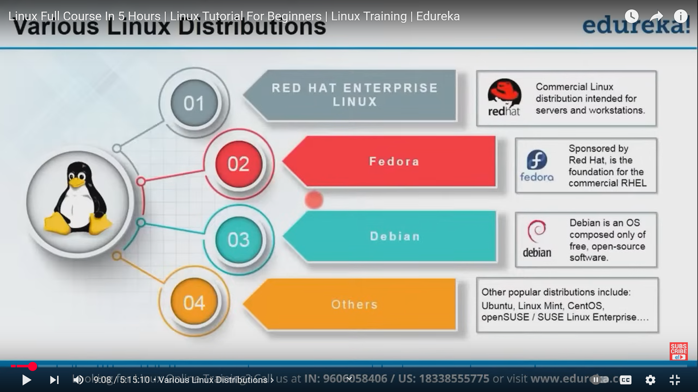
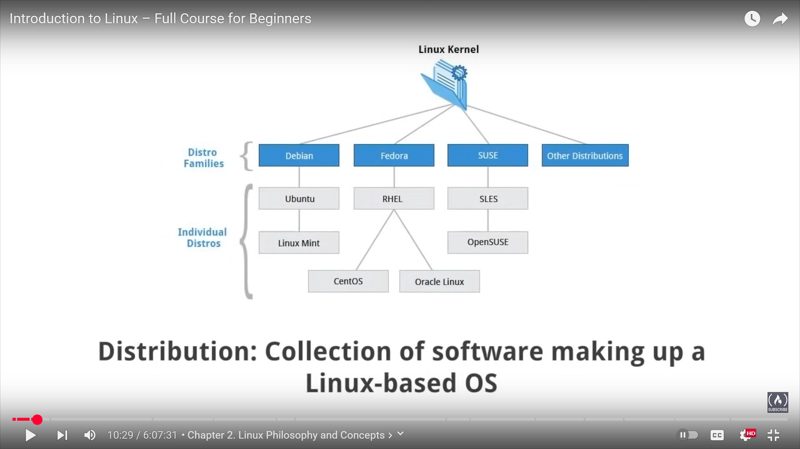
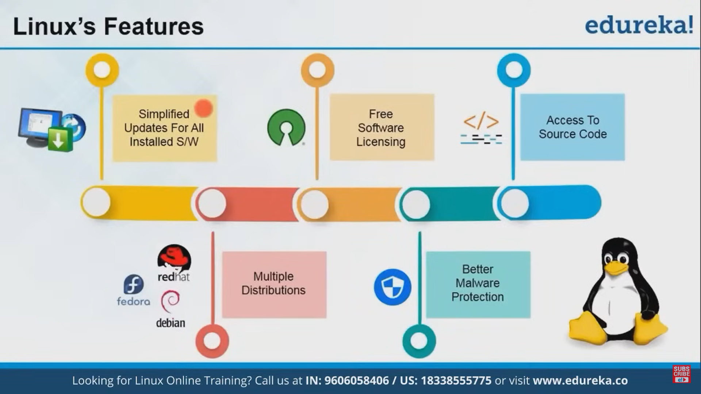
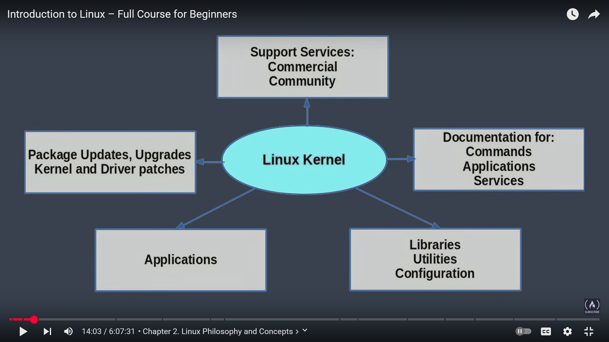
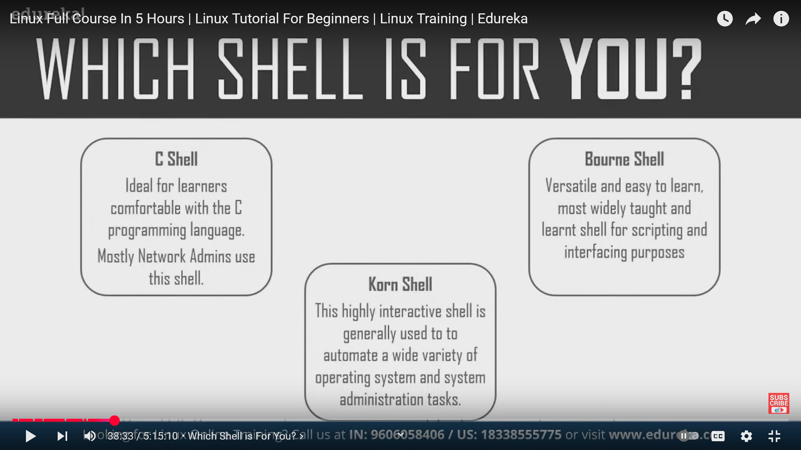
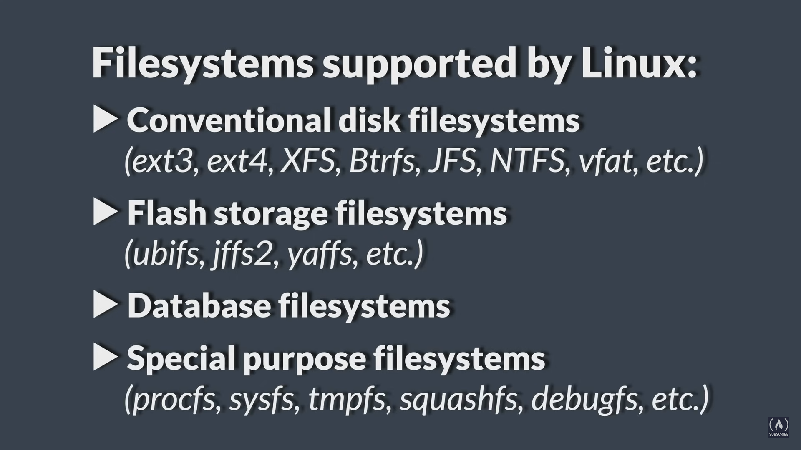
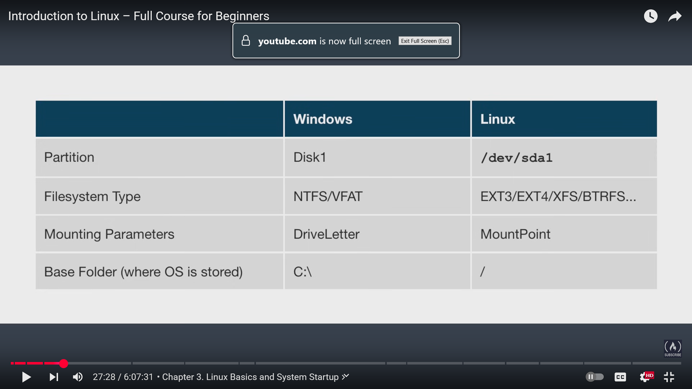

# Introduction

## 🐧 **What is Linux?**

**Linux** is a  **free** ,  **open-source** , and **Unix-like operating system kernel** created by **Linus Torvalds** in  **1991** . It forms the core of many complete OSes called **Linux distributions** (Ubuntu, Fedora, Debian, etc.).

Unlike Windows or macOS, Linux follows the  **Unix philosophy** : modular, flexible, command-line friendly, and built for multi-user, multitasking environments.

## 🌱 **Introduction and Early Days of Linux**

#### 📍 **The Problem (Late 1980s – Early 1990s)**

* Linus Torvalds, a Finnish computer science student, used  **MINIX** —a small, educational Unix-like OS created by Andrew Tanenbaum.
* MINIX was  **not open for modification** , and lacked many real-world features.
* Linus wanted something better and more personal.

#### 📍 **The Creation (1991)**

* Linus began writing his own kernel from scratch for Intel’s 80386 processor.
* He combined it with GNU tools (compiler, shell, utilities) to create a full operating system.

#### 📅 **August 25, 1991 – The Famous Announcement**

Linus posted to the MINIX newsgroup:

> "Hello everybody out there using minix -
>
> I'm doing a (free) operating system (just a hobby, won’t be big and professional like gnu)..."

This was the  **birth of Linux** .

## 📜 **History and Evolution of Linux**

#### 📍 **1991: Linux Kernel v0.01 Released**

* Very basic functionality: limited device drivers, no networking.
* Released under custom license.

#### 📍 **1992: Linux Licensed Under GPL (Free Software)**

* Linux adopts the  **GNU General Public License (GPL)** .
* Now truly open-source – anyone can view, modify, and distribute it.

#### 📍 **1993: First Distributions Appear**

* Slackware and Debian – the first user-friendly, installable Linux OS packages.
* Developers start bundling kernel + GNU tools + installer = full Linux distributions.

#### 📍 **1990s – Rapid Growth**

* More distros: Red Hat (1995), SUSE, Mandrake.
* Companies and developers adopt Linux for servers, research, and education.
* Becomes popular with hobbyists, hackers, and universities.

#### 📍 **2000s – Linux in Servers and Supercomputing**

* Dominates the **web server market** (Apache on Linux).
* Used in high-performance computing, cloud, data centers.

#### 📍 **2007–2010s – Android and Consumer Growth**

* **Android** (based on Linux kernel) released in 2008 → powers smartphones, tablets, smart TVs.
* Consumer distros (Ubuntu, Linux Mint) make Linux desktop-friendly.
* Cloud platforms (AWS, Azure, GCP) rely heavily on Linux-based VMs.

#### 📍 **Today – Linux is Everywhere**

* Powers  **over 90% of supercomputers** .
* Used in  **smartphones** ,  **servers** ,  **IoT devices** ,  **TVs** ,  **automobiles** ,  **routers** , and more.
* Backbone of the  **cloud, DevOps, cybersecurity, AI, and embedded systems** .

## 🧱 **How Unix Led to the Development of Linux**

| Unix                                    | Linux                                                          |
| --------------------------------------- | -------------------------------------------------------------- |
| Developed in 1970s by Bell Labs         | Inspired by Unix, built from scratch by Linus Torvalds in 1991 |
| Proprietary and fragmented in the 1980s | Fully open-source and community-driven                         |
| Coded in C, portable across systems     | Linux also written in C, portable, and flexible                |
| Had shells, permissions, processes      | Linux adopted and improved these Unix concepts                 |
| Basis for BSD, macOS, Solaris           | Linux became the base for Android, Ubuntu, Red Hat, etc.       |

## Summary:

🔹  **Linux did not derive code from Unix** , but

🔹 **It follows Unix principles** and

🔹  **Fulfills the vision of a free Unix-like OS** , which was started by the  **GNU Project** .

## 💡 Why Linux Became So Important

* ✅ Free and Open Source
* ✅ Customizable and Secure
* ✅ Reliable for servers
* ✅ Lightweight for embedded systems
* ✅ Supported by a global developer community
* ✅ Scales from a wristwatch to a supercomputer

---

# Unix and its History

### 🧠 **What is Unix?**

**Unix** is a **powerful, multiuser, multitasking operating system** originally developed in the **late 1960s and early 1970s** at **Bell Labs** (AT&T).

It introduced core concepts like:

* **Files and directories as the basic building blocks**
* **Everything is a file (including devices)**
* **Simple tools that can be combined via the shell**
* **Process control and user permissions**
* A **command-line interface (CLI)** and later, graphical ones

Unix became the foundation and **philosophical blueprint** for many operating systems that came after it—including  **Linux** ,  **macOS** ,  **BSD** , and even parts of  **Windows** .

### 🕰️ **How Unix Came Around: The Origin Story**

#### 📍 1. **The Failure of Multics (1960s)**

* Bell Labs collaborated on  **Multics** , a very ambitious OS project with MIT and GE.
* Multics was too complex and slow.
* Bell Labs pulled out around  **1969** .

#### 📍 2. **Birth of Unix (1969–1971)**

* **Ken Thompson** and  **Dennis Ritchie** , working at Bell Labs, created a much simpler OS for internal use.
* Initially called **Unics** (a pun on Multics) → became  **Unix** .
* Originally Unix ran on a **PDP-7** machine in assembly.
  > Before Unix was rewritten in  **C** , it was originally written in  **assembly language** .
  >
  > ##### 🔧 Original Language of Unix
  >
  > ###### 🖥️ **Assembly Language**
  >
  > * The very first versions of Unix (around  **1969–1971** ) were written in  **PDP-7 assembly language** , specific to the **PDP-7 computer** from DEC (Digital Equipment Corporation).
  > * Assembly is  **low-level** , tightly coupled to the hardware—fast but not portable.
  >
  > ###### ➕ Why Assembly?
  >
  > * At the time, high-level languages were limited or inefficient.
  > * Writing an operating system required  **precise hardware control** , which was possible with assembly.
  >
  > ##### 🔁 Rewritten in C – Why That Mattered
  >
  > ###### 📅 In  **1973** , Unix was  **rewritten in the C programming language** .
  >
  > * C was developed by  **Dennis Ritchie** , also at Bell Labs.
  > * This move made Unix:
  >   * **Portable** (could run on different hardware)
  >   * **Easier to maintain and expand**
  >   * A model for future OS development
  >
  > This decision to switch to C made Unix one of the  **most influential OSes in computing history** —and it directly influenced the creation of Linux, which is also written in  **C** .
  >

#### 📍 3. **The C Language (1973)**

* Dennis Ritchie developed the  **C programming language** .
* Unix was rewritten in  **C** , making it **portable** across hardware platforms—this was revolutionary.

#### 📍 4. **Spreading to Universities (1970s–1980s)**

* AT&T licensed Unix to universities for low cost.
* The **University of California, Berkeley** modified and extended it → gave rise to **BSD Unix** (Berkeley Software Distribution).

#### 🧬 **How Unix Led to Linux**

| **Unix**                             | **Linux**                                                     |
| ------------------------------------------ | ------------------------------------------------------------------- |
| Proprietary and fragmented by the 1980s    | Open-source from the start                                          |
| Inspired BSD, SunOS, AIX, HP-UX            | Inspired by Unix, but coded from scratch                            |
| Needed licenses and had legal restrictions | Free to use, modify, and distribute (GPL license)                   |
| Unix-like tools and philosophies           | Adopted Unix-like file systems, commands, permissions, shells, etc. |

#### 🚨 Problem in the Early 1990s

* **GNU Project** (by Richard Stallman) was building a free Unix-like system.
* Tools like `gcc`, `bash`, and coreutils existed—but  **no kernel** .
* > #### 🧨 **The Core Problem: Why Not Just Use Unix?**
  >
  > ##### 🚫 **1. Unix Was Not Free or Open Source**
  >
  > * Most Unix systems (like AT&T System V, BSD, SunOS) were  **commercial or restricted** .
  > * Even  **BSD** , although technically more open, was caught in **legal battles** (AT&T sued BSD over Unix code).
  > * You  **couldn’t legally or freely modify or redistribute Unix** .
  >
  > ##### 🔐 Licensing Problems:
  >
  > * **Unix licenses were expensive.**
  > * Educational Unix (like MINIX) had  **source code** , but was  **not free to modify** .
  > * The Free Software Foundation (FSF) wanted a **completely free and open** Unix-like system.
  >
  > #### 🧱 **The GNU Project: Almost a Full OS, but Missing One Key Piece**
  >
  > * **GNU** = *GNU’s Not Unix* → started by **Richard Stallman** in  **1983** .
  > * FSF created many components:
  >   * `gcc` (compiler)
  >   * `bash` (shell)
  >   * `coreutils` (ls, cp, mv, etc.)
  >   * `glibc` (C standard library)
  >
  > ✅ They had **everything** for a Unix-like OS—
  >
  > ❌  **Except the kernel** .
  >
  > They started a kernel project called  **Hurd** , but:
  >
  >> 🔴 **GNU Hurd was too complex and slow to develop.**
  >>
  >> It wasn’t usable even after years of effort.
  >>
  >
  > #### 🧑‍💻 **Enter Linus Torvalds (1991): Solving the Missing Kernel Problem**
  >
  > * Linus used MINIX but wanted something better and more open.
  > * He built the **Linux kernel** from scratch and released it under the **GPL license** (free and open source).
  > * People quickly combined **Linux + GNU tools** → a fully functional Unix-like OS.
  >
  > 🧩 The pieces finally fit:
  >
  > ```
  > GNU tools + Linux kernel = a free Unix-like OS
  > ```
  >
  > #### 🔁 So Why Not Unix?
  >
  > | Reason                                           | Explanation                                       |
  > | ------------------------------------------------ | ------------------------------------------------- |
  > | 💸**Unix wasn't free**                     | Required costly licenses                          |
  > | 🔒**Not open source**                      | Couldn't see or modify source                     |
  > | ⚖️**Legal risks**                        | BSD Unix had lawsuits                             |
  > | 🐢**GNU Hurd was too slow**                | Couldn't complete GNU OS without a working kernel |
  > | 👨‍💻**Linux was fast, simple, and free** | Fit perfectly with GNU tools                      |
  >
  > ✅ Result: Linux Becomes the Free Unix Everyone Needed
  >
  > * Not based on Unix code (so no legal issues)
  > * Unix-like in philosophy, structure, commands
  > * Grew into the most widely used open-source OS
  >
  > If GNU Hurd had succeeded earlier,  **Linux might never have become the standard** . But because Unix was closed and GNU lacked a kernel,  **Linux filled the gap perfectly** .
  >

#### 💡 Linux (1991)

* **Linus Torvalds** creates the  **Linux kernel** .
* Combined with GNU tools → forms a full  **Unix-like OS** .
* It follows the **Unix philosophy** but is  **not Unix** .

So Linux exists today as a  **Unix-like operating system** , inspired heavily by Unix concepts and architecture.

### 💻 **Does Unix Still Exist and Is It Used Today?**

#### ✅ Yes — Unix still exists, but in fewer places.

### Modern, Certified Unix Systems:

| OS                | Vendor          | Still Used In                                   |
| ----------------- | --------------- | ----------------------------------------------- |
| **AIX**     | IBM             | Enterprise servers (banks, telcos)              |
| **HP-UX**   | Hewlett-Packard | Legacy systems                                  |
| **Solaris** | Oracle          | High-end servers (declining)                    |
| **macOS**   | Apple           | Yes! It is a certified Unix (based on BSD Unix) |

🧩 **macOS** is the most widely used **Unix-certified OS** today.

### 🌐 **Where Unix-like Systems Dominate Today**

Even if original Unix is fading, its spirit dominates:

* **Linux** (used in servers, Android, embedded systems)
* **BSD variants** (FreeBSD, OpenBSD)
* **macOS** (Unix-certified)
* **Cloud infrastructure, routers, IoT, firewalls** —all often run Unix-like OSes

## 🔚 **Summary:**

| **Question**           | **Answer**                                                                                                  |
| ---------------------------- | ----------------------------------------------------------------------------------------------------------------- |
| What is Unix?                | A powerful OS developed at Bell Labs in the late 60s.                                                             |
| How did it come around?      | It was created after Bell Labs left the failed Multics project.                                                   |
| How did it lead to Linux?    | It inspired Linux’s design; Linux recreated a Unix-like OS from scratch, combined with GNU tools.                |
| Does Unix still exist today? | Yes, but mostly in legacy enterprise systems and macOS. Unix-like systems (especially Linux) are far more common. |

---

# **Linux Distributions**

### 🧩 **What is a Linux Distribution?**

A **Linux distribution (distro)** is a **complete operating system** built around the  **Linux kernel** , combined with:

* GNU tools (bash, gcc, coreutils, etc.)
* Package managers (like `apt`, `dnf`, `pacman`)
* Desktop environments (like GNOME, KDE, XFCE)
* Software repositories and support tools

In short:

> 🔧 **Linux Kernel** + 🧱 **GNU Tools** + 📦 **Software** = 🐧 **Linux Distro**

### 🎯 **Why So Many Distributions?**

Because Linux is open source,  **anyone can create their own flavor** :

* For different use cases (servers, desktops, hacking, privacy)
* With different package systems or UIs
* To meet personal, community, or organizational needs

### 🏆 **Popular Linux Distributions (and What They’re Known For)**

| Distro                                                                  | Based On    | Best For                     | Highlights                                   |
| ----------------------------------------------------------------------- | ----------- | ---------------------------- | -------------------------------------------- |
| **Ubuntu**                                                        | Debian      | Beginners, Desktops, Servers | Most popular, user-friendly, huge community  |
| **Debian**                                                        | Independent | Stability                    | Very stable, used as base for Ubuntu         |
| **Fedora**                                                        | Red Hat     | Developers                   | Bleeding edge, upstream for RHEL             |
| **Red Hat Enterprise Linux (RHEL)**<br />**[MOST POPULAR]** | Fedora      | Enterprises                  | Commercial support, used in businesses       |
| **CentOS / Rocky Linux / AlmaLinux**                              | RHEL        | Servers                      | Free alternatives to RHEL                    |
| **Arch Linux**                                                    | Independent | Advanced users               | Rolling release, minimalist, full control    |
| **Manjaro**                                                       | Arch        | Beginners who want Arch      | User-friendly Arch with GUI installer        |
| **Linux Mint**                                                    | Ubuntu      | Desktop users                | Windows-like UI, simple and clean            |
| **Pop!_OS**                                                       | Ubuntu      | Developers, Gamers           | Built by System76, performance-focused       |
| **Kali Linux**                                                    | Debian      | Ethical hacking              | Preloaded with security and pentesting tools |
| **Zorin OS**                                                      | Ubuntu      | Windows switchers            | Familiar UI for Windows users                |
| **Elementary OS**                                                 | Ubuntu      | macOS-like UI                | Minimalist, beautiful design                 |
| **Tails**                                                         | Debian      | Privacy-focused              | Routes traffic through Tor, amnesic OS       |
| **Slackware**                                                     | Independent | Traditionalists              | Oldest active distro, manual configuration   |

### 🧱 **Types of Distros (By Purpose)**

#### 🖥️ Desktop-Focused:

* **Ubuntu**
* **Linux Mint**
* **Zorin OS**
* **Pop!_OS**

#### 🏢 Server/Enterprise:

* **RHEL**
* **Debian**
* **CentOS / Rocky / AlmaLinux**
* **Ubuntu Server**

#### 🔐 Security and Privacy:

* **Kali Linux** (hacking/pentesting)
* **Parrot OS** (security)
* **Tails** (anonymous use)

#### 🛠️ DIY / Customization:

* **Arch Linux**
* **Gentoo**
* **Slackware**

### 🧪 **Package Managers by Family**

| Distro Family                | Package Format | Package Manager         |
| ---------------------------- | -------------- | ----------------------- |
| Debian-based (Ubuntu, Mint)  | `.deb`       | `apt`,`dpkg`        |
| Red Hat-based (Fedora, RHEL) | `.rpm`       | `dnf`,`yum`,`rpm` |
| Arch-based (Arch, Manjaro)   | Native         | `pacman`              |
| Gentoo                       | Source-based   | `portage`,`emerge`  |

### 🎓 **Which Distro Should You Use?**

| Goal                      | Suggested Distro                   |
| ------------------------- | ---------------------------------- |
| 🔰 Beginner               | Ubuntu, Linux Mint, Zorin OS       |
| 💻 Developer              | Fedora, Pop!_OS, Arch (advanced)   |
| 🖥️ Older PCs            | Linux Lite, MX Linux, Puppy Linux  |
| 🎮 Gaming                 | Pop!_OS, Nobara, SteamOS           |
| 🔐 Hacking                | Kali Linux, Parrot OS              |
| 🏢 Server                 | Debian, Ubuntu Server, Rocky Linux |
| 🛠️ Customize Everything | Arch, Gentoo, Slackware            |





### 📌 Summary

* **Linux distros** are complete operating systems built around the Linux kernel.
* They vary in package management, desktop experience, and use case.
* There’s **no one-size-fits-all** — choose based on  **your goals and skill level** .

---

# Features of Linux

 Here's a **complete overview** of  **Linux features** , a comparison with other operating systems like **Windows** and  **macOS** , along with  **advantages and disadvantages** .

### 🐧 **Features of Linux**

| Feature                               | Description                                                                           |
| ------------------------------------- | ------------------------------------------------------------------------------------- |
| 🔓**Open Source**               | The source code is free to view, modify, and distribute.                              |
| 💻**Multiuser**                 | Multiple users can use the system simultaneously without interfering with each other. |
| 🔄**Multitasking**              | Can run multiple processes efficiently at the same time.                              |
| 🔐**Security**                  | Built-in permissions, user roles, and a strong security model.                        |
| 🧩**Modularity**                | Everything is built in layers—kernel, shell, utilities—each can be replaced.        |
| 🧠**Stability and Reliability** | Rarely crashes; used in servers for uptime-critical tasks.                            |
| 🌐**Networking Support**        | Strong TCP/IP stack, great for servers and cloud applications.                        |
| 📦**Package Management**        | Easily install, update, and remove software using `apt`,`dnf`,`pacman`, etc.    |
| 💡**Customization**             | You can change everything—from kernel to desktop environment.                        |
| 🔁**Portability**               | Runs on many platforms: PCs, servers, phones, routers, etc.                           |
| 👩‍💻**CLI-Powered**           | Powerful command-line interface (bash, zsh) for scripting and automation.             |
| 🔁**File System Hierarchy**     | Organized and consistent file system structure (/, /home, /etc, etc.).                |



### ⚖️ **Comparison: Linux vs Windows vs macOS**

| Feature                         | **Linux**                 | **Windows**                   | **macOS**                        |
| ------------------------------- | ------------------------------- | ----------------------------------- | -------------------------------------- |
| **License**               | Free and Open Source            | Commercial                          | Commercial (with BSD core)             |
| **Source Code Access**    | Yes                             | No                                  | No                                     |
| **Cost**                  | Free                            | Paid                                | Paid (bundled with Mac hardware)       |
| **Security**              | Very secure, permissions-driven | Targeted by malware                 | Secure, fewer threats                  |
| **Performance**           | Lightweight and fast            | Heavy on resources                  | Optimized for Mac hardware             |
| **Customization**         | Highly customizable             | Limited                             | Very limited                           |
| **CLI Usage**             | Powerful and essential          | Optional, weak CLI                  | Unix-style CLI available               |
| **Software Availability** | Large open-source library       | Massive commercial software support | Focused on creative/professional tools |
| **Gaming**                | Improving (Steam, Proton)       | Best support                        | Limited support                        |
| **Stability**             | Very stable (used in servers)   | May lag/crash after updates         | Generally stable                       |
| **Community Support**     | Strong global community         | Microsoft support forums            | Apple support, forums                  |
| **System Updates**        | User-controlled                 | Often forced updates                | Controlled updates                     |

### ✅ **Advantages of Linux**

| Advantage                                   | Explanation                                               |
| ------------------------------------------- | --------------------------------------------------------- |
| 💸**Free to use**                     | No cost to download, install, or use.                     |
| 🔧**Highly customizable**             | From desktop environment to kernel-level tweaks.          |
| 🧱**Lightweight options available**   | Runs well on old or low-spec hardware.                    |
| 🔐**Security-focused**                | Minimal malware, strong user access control.              |
| 🧑‍💻**Ideal for developers**        | Comes with compilers, bash, SSH, git, etc.                |
| 💻**Great for servers and cloud**     | Powers most servers, VMs, and containers.                 |
| 🌐**Active global community**         | Tons of forums, tutorials, open-source contributors.      |
| 🖥️**Multiple desktop environments** | GNOME, KDE, XFCE, LXQt—you choose how your system looks. |
| 📦**Package managers**                | Easy to install/update/remove software via terminal.      |
| 📈**Rolling or fixed release**        | Choose stability or latest updates (Arch vs Ubuntu).      |

### ❌ **Disadvantages of Linux**

| Disadvantage                            | Explanation                                                             |
| --------------------------------------- | ----------------------------------------------------------------------- |
| 🎮**Limited commercial software** | Popular tools like Photoshop, MS Office may not run natively.           |
| 🧩**Learning curve**              | CLI-heavy tasks can be intimidating for beginners.                      |
| 🕹️**Gaming support**            | Improving, but still behind Windows in native support.                  |
| 📦**Hardware support issues**     | Some devices (e.g., Wi-Fi cards, printers) may not work out-of-the-box. |
| 🤝**Software compatibility**      | .exe and .dmg files won’t work—need alternatives or Wine.             |
| 🔍**Fragmentation**               | So many distros can confuse new users.                                  |
| 🛠️**Lack of vendor support**    | Some companies don't officially support Linux.                          |

### 📌 **Use Cases Where Linux Shines**

| Use Case                          | Why Linux?                                                           |
| --------------------------------- | -------------------------------------------------------------------- |
| **Web servers & Hosting**   | Apache/Nginx on Linux is the industry standard.                      |
| **Cloud computing**         | All major clouds (AWS, Azure, GCP) use Linux VMs.                    |
| **Cybersecurity & Hacking** | Tools like Kali, Wireshark, Metasploit are Linux-first.              |
| **Programming**             | Comes with languages, compilers, and scripting tools out-of-the-box. |
| **Embedded systems & IoT**  | Lightweight and scalable.                                            |
| **Privacy and anonymity**   | Distros like Tails route everything through Tor.                     |

### 🎯 **Conclusion**

* **Linux is powerful, secure, and highly customizable** .
* It's best for  **developers, server admins, privacy lovers, and advanced users** .
* It has a  **learning curve** , but offers complete freedom and control over your system.
* **Windows** is better for general users, gaming, and commercial apps.
* **macOS** offers great performance for creatives in a polished, closed environment.

---

# Linux Kernal

### 🧠 **What is a Kernel?**

A **kernel** is the **core component** of an operating system.

It acts as a  **bridge between hardware and software** .

Think of it like a **translator or manager** that lets apps (like browsers or games) talk to your computer’s hardware (like CPU, RAM, disk, etc.).

### 🏗️ **What Does the Kernel Do?**

| Role                               | What It Means                                                                |
| ---------------------------------- | ---------------------------------------------------------------------------- |
| 🧠**Memory management**      | Controls how RAM is used and shared among apps.                              |
| ⚙️**Process management**   | Runs, schedules, and switches between multiple processes.                    |
| 💬**Device communication**   | Talks to devices like your keyboard, mouse, hard drive, etc., using drivers. |
| 🔐**Access control**         | Manages user permissions and enforces security.                              |
| 📨**System calls interface** | Lets programs request services from the hardware via the kernel.             |

### 🧩 **Kernel in the OS Stack**

```plaintext
+-------------------------+
|  Applications           |  ← You interact here (Chrome, Terminal, etc.)
+-------------------------+
|  Shell / System Libraries |
+-------------------------+
|  🔧 Kernel (Core)        |  ← This is the main control system
+-------------------------+
|  Hardware               |  ← CPU, RAM, Disk, etc.
+-------------------------+
```

### 🧱 **Types of Kernels**

| Type                        | Description                                                | Example           |
| --------------------------- | ---------------------------------------------------------- | ----------------- |
| **Monolithic Kernel** | All core functions run in one big program in kernel space  | Linux, Unix       |
| **Microkernel**       | Minimal core functions in kernel; others run in user space | Minix, QNX        |
| **Hybrid Kernel**     | Mix of both (modular monolithic)                           | Windows NT, macOS |
| **Exokernel**         | Very lightweight; apps manage hardware directly            | Research OSes     |

### 🐧 **Linux Kernel**

* Created by **Linus Torvalds** in  **1991** .
* Written in  **C** .
* It's a **monolithic kernel** (but modular, meaning you can add/remove parts like drivers).
* Used in:
  * Android phones
  * Servers
  * Supercomputers
  * Embedded systems
  * Desktop OSes (Ubuntu, Fedora, etc.)



### ✅ **Advantages of Linux Kernel**

* Stable and secure
* Supports **multitasking and multiuser**
* Runs on a wide range of hardware
* Modular: drivers and filesystems can be loaded/unloaded at runtime

### 🔁 Summary

| Term                    | Meaning                                                               |
| ----------------------- | --------------------------------------------------------------------- |
| **Kernel**        | The core software that controls hardware and enables software to work |
| **Why important** | Without the kernel, your apps can’t talk to your hardware            |
| **Linux kernel**  | The most widely used open-source kernel in the world today            |

---

# Shell

Let’s dive into the **Shell** — one of the most powerful and important parts of any Unix/Linux-based system.

### 🐚 **What is a Shell?**

A **shell** is a  **program that provides an interface between the user and the operating system (kernel)** .

In short:

> 🧑 You (user) ↔ 🐚 Shell ↔ 🧠 Kernel ↔ 💻 Hardware

It interprets your **commands** and tells the operating system  **what to do** .

### 💡 **Two Main Types of Shells**

| Type                             | Description                               | Example                          |
| -------------------------------- | ----------------------------------------- | -------------------------------- |
| 🖥️**Command-line Shell** | Text-based interface; user types commands | `bash`,`zsh`,`sh`,`fish` |
| 🖱️**Graphical Shell**    | GUI (Windows, icons, menus)               | GNOME Shell, KDE Plasma          |

When we say “shell” in Linux, we usually mean the  **command-line shell** .

### 🔧 **What Does a Shell Do?**

| Function                           | Description                                                         |
| ---------------------------------- | ------------------------------------------------------------------- |
| 📝**Command Interpreter**    | Reads and executes user commands like `ls`,`cd`,`mkdir`, etc. |
| 🛠️**Script Execution**     | Allows users to run shell scripts (.sh files) to automate tasks     |
| 🔁**Job Control**            | Manages foreground and background processes                         |
| 📜**Command History**        | Stores previously run commands for easy reuse                       |
| 🌐**Environment Management** | Handles environment variables (`PATH`,`HOME`, etc.)             |
| 🧠**Program Execution**      | Locates and runs executable programs                                |

### 📦 **Popular Shells in Linux/Unix**

| Shell    | Full Name                  | Features                                                |
| -------- | -------------------------- | ------------------------------------------------------- |
| `sh`   | Bourne Shell               | Original Unix shell; simple, limited                    |
| `bash` | Bourne Again Shell         | Default in most distros; scripting, tab-completion      |
| `zsh`  | Z Shell                    | Bash-compatible but with better auto-complete, theming  |
| `fish` | Friendly Interactive Shell | User-friendly, rich UI, no need to learn bash scripting |
| `ksh`  | Korn Shell                 | High scripting capabilities; used in legacy systems     |
| `tcsh` | Tenex C Shell              | C-like syntax; less common today                        |



### 🧪 **Common Shell Commands**

| Command          | Function                     |
| ---------------- | ---------------------------- |
| `ls`           | List files                   |
| `cd`           | Change directory             |
| `pwd`          | Show current directory       |
| `mkdir`        | Create a directory           |
| `rm`           | Remove files or folders      |
| `cp`           | Copy files                   |
| `mv`           | Move or rename               |
| `echo`         | Print text or variable value |
| `cat`          | Read file content            |
| `grep`         | Search text                  |
| `top`/`htop` | Monitor system resources     |

### 📜 **Shell Scripts**

A shell script is a  **file containing a series of shell commands** .

Example: `hello.sh`

```bash
#!/bin/bash
echo "Hello, $USER!"
date
```

* `#!/bin/bash` is called a **shebang** — it tells the system to use Bash to run the script.
* To run:

```bash
chmod +x hello.sh
./hello.sh
```

### ⚙️ **How the Shell Works (Step-by-Step)**

1. **You type a command** (e.g., `ls -l`)
2. Shell **parses** it (splits it into command and options)
3. Shell **looks up the program** using the `PATH` environment variable
4. **Executes** the program by invoking the kernel
5. **Displays the result/output** in your terminal

### ✅ **Advantages of Using a Shell**

| Benefit          | Why It Matters                                             |
| ---------------- | ---------------------------------------------------------- |
| 🧠 Powerful      | You can automate complex tasks with just a few lines       |
| 🛠️ Scriptable  | Create reusable scripts to save time                       |
| ⚡ Efficient     | Faster than using GUI for repetitive or system-level tasks |
| 🔐 Remote access | Useful for servers via SSH                                 |
| 🧩 Customizable  | Aliases, functions, colors, themes, prompt edits           |

### ❌ **Disadvantages**

| Limitation                       | Why It’s an Issue                                 |
| -------------------------------- | -------------------------------------------------- |
| 🧩 Steep learning curve          | Beginners may find it hard to memorize commands    |
| ❗ Command mistakes can be risky | A wrong `rm`command can delete your system files |
| 📱 Not as intuitive as GUI       | Requires typing and syntax knowledge               |

### 🧠 Summary

| Aspect                  | Description                                                                            |
| ----------------------- | -------------------------------------------------------------------------------------- |
| **Shell**         | A command interpreter that lets users interact with the OS                             |
| **Common Shells** | bash, zsh, fish, sh, ksh                                                               |
| **Used For**      | Running commands, automating tasks via scripts, managing processes                     |
| **Why Important** | It's how users and scripts control the system, especially on servers and Linux systems |

---

# History of Shells

Here's a  **brief history of the Unix/Linux shell** , highlighting its key developments over time:

### 📜 **Brief History of the Shell**

#### 🏁 **1. 1969 – Thompson Shell (`sh`)**

* **Creator:** Ken Thompson at Bell Labs
* **System:** Early Unix
* **Written in:** Assembly
* Very basic: supported I/O redirection and simple command execution.

#### 🔄 **2. 1979 – Bourne Shell (`sh`)**

* **Creator:** Stephen Bourne
* **System:** UNIX Version 7
* **Written in:** C
* Introduced features like:
  * Variables
  * Control structures (`if`, `for`, `while`)
  * Scripting capability
* Became the **standard shell for Unix** systems.

#### 🧠 **3. 1983 – C Shell (`csh`)**

* **Creator:** Bill Joy (co-founder of Sun Microsystems)
* Designed with **C-like syntax**
* Introduced:
  * Command history
  * Aliases
  * Job control
* Popular among BSD Unix users

#### 🔗 **4. 1983 – Korn Shell (`ksh`)**

* **Creator:** David Korn (AT&T Bell Labs)
* Combined features of:
  * Bourne Shell (compatibility)
  * C Shell (interactivity)
* Used in enterprise and scripting-heavy environments

#### 🔁 **5. 1989 – Bourne Again Shell (`bash`)**

* **Creator:** Brian Fox, as part of the GNU Project
* Backward compatible with Bourne Shell, but added:
  * Command-line editing
  * Command history
  * Brace expansion
  * Auto-completion
* Became **default shell** in most Linux distributions

#### 💫 **6. 1990s–2000s – Rise of Alternatives**

| Shell                                          | Known For                                     |
| ---------------------------------------------- | --------------------------------------------- |
| **`zsh`**(Z Shell)                     | Powerful completion, theming (Oh My Zsh)      |
| **`fish`**(Friendly Interactive Shell) | User-friendly syntax, autosuggestions         |
| **`dash`**(Debian Almquist Shell)      | Lightweight shell for faster script execution |

#### 📌 **Timeline Summary**

| Year   | Shell                 | Key Feature                          |
| ------ | --------------------- | ------------------------------------ |
| 1969   | Thompson Shell        | First Unix shell                     |
| 1979   | Bourne Shell (`sh`) | Introduced scripting                 |
| 1983   | C Shell (`csh`)     | Command history, C-like syntax       |
| 1983   | Korn Shell (`ksh`)  | Combined Bourne + C features         |
| 1989   | Bash (`bash`)       | GNU-compatible, modern Linux default |
| 1990s+ | Zsh, Fish             | Advanced, user-friendly alternatives |

### 🐚 **What Shell Do We Use Today (In Most Systems)?**

#### 🧰 **1. `bash` – Bourne Again Shell**

> ✅ **Default in most Linux distributions** (Ubuntu, Fedora, CentOS, Debian, etc.)

* Created by the GNU Project in **1989**
* Still the **most widely used shell** today
* Supports:
  * Command history
  * Tab completion
  * Job control (background/foreground)
  * Scripting with `if`, `while`, `for`, etc.
* Filename: `/bin/bash`

📌 You probably use **Bash** if you're on:

* Most Linux systems
* WSL (Windows Subsystem for Linux)
* Git Bash on Windows

#### 🍎 **2. `zsh` – Z Shell**

> ✅ **Default shell in macOS since Catalina (2019)**

* Compatible with Bash but more user-friendly
* Features:
  * Advanced auto-completion
  * Spelling correction
  * Rich theming and plugin system (with tools like  **Oh My Zsh** )
  * Inline suggestions (like GitHub Copilot for CLI)

📌 Preferred by:

* Developers who want a **more interactive and beautiful CLI**
* macOS users
* Power users using frameworks like **Oh My Zsh**

#### 🐟 **3. `fish` – Friendly Interactive Shell**

> ✅ A newer shell focused on **usability and simplicity**

* Not compatible with Bash scripts (uses its own syntax)
* Features:
  * Autosuggestions (like typing prediction)
  * Syntax highlighting
  * Works out-of-the-box — no need to configure plugins
* Great for beginners who want a **modern terminal experience**

#### 🧩 Other Shells Still Used Today

| Shell                           | Use Case                                                       |
| ------------------------------- | -------------------------------------------------------------- |
| `sh`(POSIX shell)             | Script compatibility across Unix systems                       |
| `dash`(Debian Almquist Shell) | Lightweight, used for system boot scripts (Ubuntu `/bin/sh`) |
| `ksh`(Korn Shell)             | Legacy systems, some enterprise Unix setups                    |
| `tcsh`(C Shell)               | Still used in BSD systems or for legacy scripts                |

#### Which Shell Are You Using?

You can check your current shell with:

```bash
echo $SHELL
```

Or see available shells:

```bash
cat /etc/shells
```

#### 🎯 Recommendation: Which Shell to Use Today?

| You Are...               | Suggested Shell                               |
| ------------------------ | --------------------------------------------- |
| 🐧 Linux User            | `bash`or `zsh`                            |
| 🍎 macOS User            | `zsh`(default) or switch to `bash`        |
| 👩‍💻 DevOps/Power User | `zsh`+`Oh My Zsh`                         |
| 🧪 New CLI User          | `fish`for simplicity                        |
| 🧾 Writing Scripts       | Stick with `bash`or `sh`for compatibility |

---

# Linux Families

Let’s explore the **Linux families** — or more precisely, the **Linux distribution families** — so you can understand how different distros are organized and which one might be right for you.

### 🧬 What Are Linux Families?

Think of Linux families like **"lineages"** or **"branches"** that descended from early Linux distributions.

Each family shares:

* Similar **package managers**
* Similar **directory structures**
* Similar **tools and philosophies**

### 🏠 Major Linux Families (with Examples)

#### 1. 🟥 **Debian Family**

* 🧬 One of the oldest and most stable families
* Package manager: `apt` (Advanced Package Tool)
* Packages end in `.deb`

**Popular members:**

| Distro               | Description                                   |
| -------------------- | --------------------------------------------- |
| **Debian**     | The base — extremely stable, used on servers |
| **Ubuntu**     | User-friendly, desktop-focused, most popular  |
| **Linux Mint** | Beginner-friendly, great for Windows users    |
| **Pop!_OS**    | Dev/designer-friendly Ubuntu-based OS         |

💡 **Best for:** Beginners, developers, long-term stability

#### 2. 🟦 **Red Hat Family**

* Common in enterprise environments
* Uses the `rpm` package format
* Package managers: `dnf` (new) or `yum` (old)

**Popular members:**

| Distro                                    | Description                                           |
| ----------------------------------------- | ----------------------------------------------------- |
| **Red Hat Enterprise Linux (RHEL)** | Paid, certified for servers                           |
| **CentOS Stream**                   | Free rolling version of RHEL                          |
| **Fedora**                          | Bleeding-edge, supported by Red Hat, used for testing |
| **Rocky Linux / AlmaLinux**         | Community-driven RHEL alternatives                    |

💡 **Best for:** Servers, enterprise use, DevOps, Docker/Kubernetes

#### 3. 🟨 **Arch Family**

* Rolling release (always up-to-date)
* Do-it-yourself approach
* Package manager: `pacman`
* Minimal by default — you build it your way

**Popular members:**

| Distro                | Description                                 |
| --------------------- | ------------------------------------------- |
| **Arch Linux**  | Hardcore, DIY from scratch                  |
| **Manjaro**     | Beginner-friendly Arch with GUI installer   |
| **EndeavourOS** | Arch with helpful tooling, terminal-focused |

💡 **Best for:** Advanced users, tinkerers, latest software

#### 4. 🟩 **Slackware Family**

* One of the earliest Linux distributions (1993)
* Minimalist, manual configuration
* No dependency resolution by default

**Members:**

| Distro              | Description                                 |
| ------------------- | ------------------------------------------- |
| **Slackware** | Pure UNIX-like, for purists                 |
| **Salix OS**  | Lightweight, Slackware-based, easier to use |

💡 **Best for:** Learning traditional UNIX-like systems

#### 5. 🟪 **Gentoo Family**

* Source-based: you compile everything from source
* Highly customizable
* Uses `portage` package manager

**Popular member:**

| Distro                      | Description                              |
| --------------------------- | ---------------------------------------- |
| **Gentoo**            | For performance geeks and control freaks |
| **Sabayon (defunct)** | User-friendly Gentoo variant             |

💡 **Best for:** Hardcore performance tuning, learning internals

#### 6. ⚫ **Independent Distros**

Some distros don’t belong to any major family but are built from scratch or completely reimagined.

| Distro          | Notes                                                      |
| --------------- | ---------------------------------------------------------- |
| **NixOS** | Uses the Nix package manager and declarative configuration |
| **Solus** | Built from scratch, very desktop-focused                   |
| **Tails** | Privacy/security-focused (based on Debian)                 |

#### 🗺️ Visual Map

```
Linux Kernel
 ├── Debian
 │   ├── Ubuntu
 │   │   ├── Mint
 │   │   ├── Pop!_OS
 │
 ├── Red Hat
 │   ├── Fedora
 │   ├── CentOS Stream
 │   ├── Rocky/AlmaLinux
 │
 ├── Arch
 │   ├── Manjaro
 │   ├── EndeavourOS
 │
 ├── Slackware
 │   └── Salix
 │
 ├── Gentoo
 │   └── Sabayon
 │
 └── Independent
     ├── NixOS
     └── Solus
```

## ✅ Summary

| Family                | Known For                    | Examples             |
| --------------------- | ---------------------------- | -------------------- |
| **Debian**      | Stability, ease              | Ubuntu, Mint         |
| **Red Hat**     | Enterprise, servers          | RHEL, Fedora, Rocky  |
| **Arch**        | Customization, bleeding edge | Manjaro, EndeavourOS |
| **Slackware**   | Simplicity, UNIX purity      | Slackware            |
| **Gentoo**      | Performance, source-based    | Gentoo               |
| **Independent** | Unique philosophy            | NixOS, Solus         |

---

# Services in Linux

Let's dive into **services in Linux** — a core concept for anyone learning  **Linux administration, DevOps, or backend development** .

### 🧠 What is a **Service** in Linux?

A **service** in Linux is a **background process (daemon)** that runs continuously to perform a specific task, like:

* Web server (e.g., Apache, Nginx)
* SSH server
* Database (e.g., MySQL, MongoDB)
* Cron scheduler
* Docker daemon

These services:

* Start automatically at boot (if enabled)
* Run without user interaction
* Are managed by the **init system** (like `systemd`)
  > Let’s break down what an **init system** is in Linux — it’s foundational to understanding how the system starts and manages services.
  >
  > ##### 🧠 What Is an  **Init System** ?
  >
  > The **init system** (short for “ **initialization** ”) is the **first process** that runs when a Linux system boots up.
  >
  > * It has **PID 1** (process ID 1)
  > * It  **initializes the system** : sets up your environment, starts services, and prepares everything before you log in
  > * It remains running to **manage system services** until the system shuts down
  >
  > ##### 🔥 Responsibilities of an Init System:
  >
  > | Task                         | Description                                    |
  > | ---------------------------- | ---------------------------------------------- |
  > | 🧠 Launch essential services | Networking, logging, SSH, system logging       |
  > | ⚙️ Manage service states   | Start, stop, restart, monitor                  |
  > | 🔁 Boot targets or runlevels | Like "multi-user mode", "graphical mode", etc. |
  > | 🔒 Handle dependencies       | Ensures services start in the right order      |
  > | 📦 Load kernel modules       | If needed before services                      |
  > | 📉 Graceful shutdown         | Stops services cleanly on reboot/shutdown      |
  >
  > ##### 🧬 Popular Init Systems in Linux
  >
  > | Init System                           | Used By                            | Notes                                      |
  > | ------------------------------------- | ---------------------------------- | ------------------------------------------ |
  > | **systemd**✅ (modern standard) | Ubuntu, Fedora, Debian, Arch, etc. | Fast, parallel startup, service management |
  > | **SysVinit**(classic)           | Old Debian, RHEL, Slackware        | Script-based, sequential startup           |
  > | **Upstart**                     | Ubuntu (pre-15.04)                 | Event-based, transitional system           |
  > | **OpenRC**                      | Alpine, Gentoo                     | Lightweight, used in minimal systems       |
  > | **runit**/**s6**          | Void Linux, antiX                  | Very lightweight, for minimal distros      |
  >
  > ##### 🧪 systemd: The Current Standard
  >
  > Most major Linux distros now use **`systemd`** as the init system.
  >
  > ###### Key features:
  >
  > * Parallel startup (faster boot)
  > * Dependency-aware service management
  > * Unified toolset (`systemctl`, `journalctl`)
  > * Targets (replace old runlevels)
  > * Built-in logging, timers, and more
  >
  > When you run:
  >
  > ```bash
  > systemctl start nginx
  > ```
  >
  > You're interacting with `systemd`, the init system.
  >

### 🔥 Common Examples of Services

| Service               | Purpose                      |
| --------------------- | ---------------------------- |
| `sshd`              | Allows remote access via SSH |
| `apache2`/`nginx` | Hosts websites               |
| `mysql`/`mongod`  | Manages databases            |
| `docker`            | Runs containers              |
| `cron`              | Runs scheduled tasks         |
| `NetworkManager`    | Manages networking           |

### 🧩 Service Management with `systemd`

Most modern Linux distros (Ubuntu, Debian, Fedora, etc.) use **`systemd`** to manage services.

The tool you use is:

```bash
systemctl
```

### 🛠️ Common `systemctl` Commands

| Task                    | Command                                 |
| ----------------------- | --------------------------------------- |
| ✅ Start a service      | `sudo systemctl start <service>`      |
| ❌ Stop a service       | `sudo systemctl stop <service>`       |
| 🔄 Restart a service    | `sudo systemctl restart <service>`    |
| 🔍 Check service status | `sudo systemctl status <service>`     |
| ⚙️ Enable at boot     | `sudo systemctl enable <service>`     |
| 🚫 Disable at boot      | `sudo systemctl disable <service>`    |
| 📃 List all services    | `systemctl list-units --type=service` |
| 🔍 Check if active      | `systemctl is-active <service>`       |
| 🧠 Check if enabled     | `systemctl is-enabled <service>`      |

### ✅ Example: Managing the SSH Service

```bash
# Check status
sudo systemctl status ssh

# Start the service
sudo systemctl start ssh

# Enable it on boot
sudo systemctl enable ssh
```

### ⚙️ Behind the Scenes: What is a Daemon?

A **daemon** is a program that runs in the background, usually ending in `d`.

Examples:

* `sshd` = SSH Daemon
* `httpd` = Apache Web Server
* `crond` = Cron scheduler
* `systemd` = The main system/service manager itself

### 🧠 Alternative Init Systems (older)

| Init System        | Found In               |
| ------------------ | ---------------------- |
| **SysVinit** | Older Debian, CentOS   |
| **Upstart**  | Old Ubuntu (pre-15.04) |
| **OpenRC**   | Alpine Linux, Gentoo   |
| **runit/s6** | Lightweight distros    |

Most modern distros now default to  **`systemd`** .

### ✅ Summary

| Concept                  | Details                                          |
| ------------------------ | ------------------------------------------------ |
| What is a service?       | A background program managed by the system       |
| Managed by?              | `systemd`using `systemctl`                   |
| Start/Stop/Enable/Check? | Use `sudo systemctl ...`                       |
| Examples?                | `sshd`,`docker`,`mysql`,`cron`,`nginx` |

---

# File System in Linux

The **Linux file system** is a key concept in learning how Linux works — especially for development, DevOps, administration, or ethical hacking.

Let’s break it down step by step:

### 📁 What Is a File System in Linux?

A **file system** is the way Linux **organizes and manages files and directories** on your storage device (SSD/HDD).

It defines  **how data is stored, retrieved, and structured** .

### 🧱 Common Linux File Systems (Types)

| File System           | Description                                             |
| --------------------- | ------------------------------------------------------- |
| **ext4**        | Most common in modern Linux distros — fast, reliable   |
| **ext3/ext2**   | Older versions; ext3 added journaling                   |
| **xfs**         | High-performance, used in Red Hat, good for large files |
| **btrfs**       | Advanced features (snapshots, checksums)                |
| **vfat / ntfs** | Used for USB drives, Windows compatibility              |
| **tmpfs**       | Temporary file system in RAM (for `/tmp`, etc.)       |

### 🗂️ Linux File System Hierarchy (Directory Structure)

Unlike Windows (which uses `C:\`, `D:\`, etc.), Linux uses a  **single-rooted hierarchy** , with everything under `/`.

Here's a breakdown of the  **important top-level directories** :

| Directory           | Description                                                      |
| ------------------- | ---------------------------------------------------------------- |
| `/`               | Root directory — top of the hierarchy                           |
| `/home`           | User directories (`/home/arun`,`/home/alice`, etc.)          |
| `/root`           | Home directory for the**root**user                         |
| `/bin`            | Essential command binaries (`ls`,`cp`,`mkdir`, etc.)       |
| `/sbin`           | System binaries (admin tools like `shutdown`,`mount`)        |
| `/usr`            | Secondary hierarchy for user-installed software                  |
| `/etc`            | System-wide configuration files (`/etc/ssh/sshd_config`, etc.) |
| `/var`            | Variable data: logs, databases, mail queues                      |
| `/opt`            | Optional packages/software                                       |
| `/tmp`            | Temporary files (often cleared on reboot)                        |
| `/dev`            | Device files (disks, USBs, etc.)                                 |
| `/proc`           | Virtual file system for processes and kernel info                |
| `/mnt`&`/media` | Mount points for external drives or partitions                   |
| `/lib`,`/lib64` | Shared libraries needed for binaries to run                      |

### 📦 Example File Paths and Their Meaning

| Path                   | Meaning                                            |
| ---------------------- | -------------------------------------------------- |
| `/etc/passwd`        | System file containing user account info           |
| `/home/arun/Desktop` | Arun’s Desktop folder                             |
| `/var/log/syslog`    | System log file                                    |
| `/dev/sda`           | First hard disk device                             |
| `/proc/cpuinfo`      | Info about CPU — from the virtual `/proc`system |

### 🧭 Commands to Work with the File System

| Task                     | Command                  |
| ------------------------ | ------------------------ |
| Navigate                 | `cd /path`             |
| List contents            | `ls -l`                |
| Make a directory         | `mkdir foldername`     |
| View disk usage          | `df -h`                |
| View file or folder size | `du -sh filename`      |
| Mount a drive            | `mount /dev/sdb1 /mnt` |
| See file system types    | `lsblk -f`,`df -T`   |

### 🔐 File Permissions in Linux

Linux uses a **permission system** to control who can read/write/execute files.

Example output of `ls -l`:

```bash
-rwxr-xr-- 1 arun users 1234 Jun 28  file.sh
```

| Section         | Meaning              |
| --------------- | -------------------- |
| `rwx`(owner)  | Read, write, execute |
| `r-x`(group)  | Read, execute        |
| `r--`(others) | Read only            |

Use `chmod`, `chown`, `ls -l` to manage file permissions and ownership.

### 🧠 Summary

| Concept        | Explanation                                        |
| -------------- | -------------------------------------------------- |
| File system    | The structure that stores and organizes data       |
| Type           | ext4 (most common), xfs, btrfs, etc.               |
| Root directory | `/`is the top; all files and folders hang off it |
| Home directory | `/home/username`— where your personal files go  |
| Configurations | Found in `/etc`                                  |
| Devices        | Represented as files in `/dev`                   |
| System info    | Exposed in virtual files in `/proc`and `/sys`  |

---

# Virtual CD- ISO (Not a Linux Concept, but has its context in Linux)

 Understanding **why virtual CDs (ISO files)** are used is important — not just in VMs but across real-world scenarios too.

### 📀 What is a Virtual CD (ISO)?

A **virtual CD** (or ISO image) is a **single file** that contains the  **complete contents of a CD/DVD** , including its file system.

It behaves like a **digital clone of a disc** — and when “mounted,” it acts just like you inserted a physical CD.

### ✅ Real-World Use Cases of Virtual CDs / ISO Images

| 💼 Use Case                               | 📘 Explanation                                                                                                   |
| ----------------------------------------- | ---------------------------------------------------------------------------------------------------------------- |
| **1. Installing Operating Systems** | You download Linux, Windows, etc. as an `.iso`and boot from it in a VM or real PC — no physical disc needed   |
| **2. Virtual Machines (VMs)**       | Used to mount installer disks (like Lubuntu, Guest Additions) in virtualization software (VirtualBox, VMware)    |
| **3. Software Distribution**        | Some large applications (e.g., games, Adobe tools) are distributed as `.iso`to preserve structure and security |
| **4. Backup and Archiving**         | You can create ISO files of important CDs/DVDs to store digitally and reuse later                                |
| **5. Bootable USBs**                | Tools like Rufus use `.iso`files to create bootable USB drives for OS installation or recovery tools           |
| **6. Secure Read-Only Media**       | ISO files can act as tamper-proof, read-only media for compliance or security tools (e.g., antivirus boot CDs)   |
| **7. Testing Environments**         | Developers test software against specific environments by booting ISO files in VMs — no need to burn real media |

### 💡 Bonus Tip:

You can even **create your own ISO** of any folder, DVD, or installation package and share it across systems — especially useful in DevOps and enterprise setups.

### 🧠 Why It’s So Useful

| Benefit         | Description                                       |
| --------------- | ------------------------------------------------- |
| 💾 Portable     | One file can be copied and shared easily          |
| 🔁 Reusable     | Mount/unmount without wasting physical discs      |
| 💻 Works in VMs | Essential for headless/cloud/virtual environments |
| ✅ Secure       | ISO can be checksum-verified to detect tampering  |

### TL;DR

> A **virtual CD (ISO)** is a digital version of a physical disc.
>
> It is used widely for  **installing OS** ,  **distributing software** ,  **backups** , and  **VM tools** , making it **essential** in development, IT, and DevOps workflows.

### Why use ISO when we have Folder ?

That's a  **very logical question** :

> “Why use an ISO? Isn’t just using a regular folder enough?”

#### ✅ Short Answer:

A **folder** is often enough for casual use, but **an ISO offers things a folder can't** — like bootability, structure preservation, and consistency across systems.

#### 🔍 Folder vs ISO — Why Use an ISO Instead?

| 🔸 Feature                               | 📁 Folder          | 📀 ISO File           |
| ---------------------------------------- | ------------------ | --------------------- |
| ✅ Can be opened/viewed                  | ✅ Yes             | ✅ Yes (when mounted) |
| 🔄 Preserves file structure, permissions | ❌ No              | ✅ Yes                |
| 💻 Can boot a system (OS install)        | ❌ No              | ✅ Yes                |
| 🧩 Cross-platform portable archive       | ❌ No              | ✅ Yes                |
| 🔐 Read-only                             | ❌ No              | ✅ Yes                |
| ☁️ One single file to share            | ❌ No (many files) | ✅ Yes (1 file)       |
| ✅ Used as virtual CD in VM              | ❌ No              | ✅ Yes                |
| 🔁 Consistency across systems            | ❌ No              | ✅ Yes                |
| 🧰 Used by installers/software           | ❌ No              | ✅ Yes                |

#### 🧠 When is a **folder** enough?

You can use just a folder if:

* You're just storing simple files locally
* You don’t care about booting, read-only access, or metadata
* You’re not distributing software or an OS

#### 🧠 When is an **ISO** better (or required)?

| Scenario                              | Why ISO is better                                          |
| ------------------------------------- | ---------------------------------------------------------- |
| 🔧**Installing an OS**          | It needs to be bootable, structured, and portable          |
| 💻**Mounting in VM**            | VirtualBox/VMware require ISO to simulate a CD             |
| 📦**Packaging software**        | Ensures consistent file hierarchy + permissions            |
| 🔐**Read-only archive**         | ISO is like a sealed CD — ideal for security/compliance   |
| 📤**Sharing**with others        | Easier to share 1 `.iso`file than a folder full of files |
| 🧪**Testing boot environments** | Only ISO can simulate boot sectors and OS environments     |

#### 🧪 Developer/DevOps Real World Example:

You want to:

* Create a custom Linux installer (e.g. for your company or Docker host)
* Include preconfigured scripts, tools, configs

👉 You’d create a **custom ISO** using tools like `mkisofs`, so it boots and installs the same way  **every time** .

#### ✅ TL;DR:

> A folder is good for  **everyday file storage** .
>
> An **ISO** is needed when you want:
>
> * **Portability**
> * **Structure and metadata**
> * **Bootability**
> * **Consistency across platforms**

### ISO in Booting

Let’s explore the  **concept of booting** , and **why a folder can’t do it** but an  **ISO can** .

#### 🚀 What Do You Mean by **"Booting a System"?**

> **Booting** is the process where a computer starts up and loads the operating system (OS) so you can use it.

When you power on your computer:

1. BIOS/UEFI runs first (the firmware)
2. It looks for a **bootable device** (like HDD, USB, or CD)
3. That device must contain a **bootloader** (e.g. GRUB for Linux)
4. The bootloader loads the **kernel** of the OS
5. The OS starts running and shows the login screen or desktop

#### ⚙️ Why a Folder Can’t Boot a System

| Reason                              | Explanation                                        |
| ----------------------------------- | -------------------------------------------------- |
| ❌ No Bootloader                    | A folder is just data — no boot sector or GRUB    |
| ❌ No ISO9660/El Torito format      | BIOS/UEFI requires specific formats to boot        |
| ❌ No system image structure        | OS expects boot files in certain layout & metadata |
| ❌ Not mountable as a virtual drive | A plain folder can’t be mounted like a CD/USB     |

So even if you copy all OS files into a folder, your computer won't recognize it as  **bootable** .

#### ✅ Why an ISO Can Boot a System

An **ISO** (like `ubuntu.iso`, `lubuntu.iso`) is:

* A **disk image** (not just a folder)
* Contains:
  * Bootloader (like GRUB)
  * Boot sector (MBR or EFI info)
  * OS kernel and init files
  * File system structure (like ISO9660)

And it's designed to be:

* **Bootable** via USB, CD, or VM
* **Recognized** by BIOS/UEFI as a real system
* **Portable** , so every system sees and boots it the same way

📦 You can think of an ISO as a **self-contained box** that includes everything needed to power on a system and run Linux, Windows, etc.

#### 🧪 Example: Using ISO to Boot a System

* When you create a **bootable USB** using an `.iso` file (e.g. with Rufus), it:
  * Writes the ISO's bootloader to the USB's **boot sector**
  * Copies the kernel and init files
  * Makes the system bootable on any machine

### 🔥 Is ISO file Read-Only ?

Let's clear up the **truth about `.iso` files** and whether you can write into them:

#### 📀 Can You Write Into a `.iso` File?

    🔴**No, not directly. ISO files are by nature read-only.**

    They are designed to**mimic a CD/DVD** , which are  **write-protected once burned** .

#### 💡 Why Are ISO Files Read-Only?

| Reason                            | Explanation                                                                          |
| --------------------------------- | ------------------------------------------------------------------------------------ |
| 🔐**Preserve integrity**    | Ensures the contents are exact, unmodified — great for OS installers, backup images |
| 🔁**Repeatable behavior**   | When booting from ISO or mounting it, you always get the same structure/content      |
| 📦**Standard format**       | ISO 9660 (used by ISOs) is a read-only file system format, like a sealed archive     |
| 🧪**Used for distribution** | OSes, tools, or recovery systems use ISO so users can't tamper with or break them    |

#### ✅ Can You *Modify* an ISO?

Not directly — but here's how to do it  **indirectly** :

###### 1. **Extract → Modify → Rebuild**

You can:

1. Extract ISO contents to a folder
2. Add or change files
3. Repackage it back into a new ISO

🔧 Tools:

* On Linux:
  ```bash
  mkdir iso_contents  
  7z x original.iso -oiso_contents  
  # make your changes  
  mkisofs -o new.iso iso_contents/
  ```
* On Windows: Use tools like:
  * PowerISO (commercial)
  * UltraISO
  * ISO Master (Linux GUI tool)

#### 🧠 What About Writable Alternatives?

| Format                         | Writable?     | Use case                                                                    |
| ------------------------------ | ------------- | --------------------------------------------------------------------------- |
| 📁 Folder                      | ✅ Yes        | Use for everyday editing, but not bootable                                  |
| 🗃️`.img`                   | ✅ Sort of    | Raw disk images (like Raspberry Pi OS `.img`) can be mounted and modified |
| 🔄`.squashfs`(compressed FS) | ✅ with tools | Used in live Linux systems, can be unpacked and rebuilt                     |

### ❓ Does **every ISO** have a **bootloader** and  **boot sector** ?

    🔴**No — only **bootable ISOs** have a bootloader and boot sector.**

An `.iso` file is just a **disk image** — it **may** or **may not** include what's needed to boot a system.

#### 🧠 So What’s the Difference?

| Type of ISO                                                 | Bootable? | Has Bootloader + Boot Sector?                 |
| ----------------------------------------------------------- | --------- | --------------------------------------------- |
| ✅**OS Installers**(Ubuntu, Windows, Fedora)          | ✅ Yes    | ✅ Yes — required for booting                |
| ✅**Rescue/Live CDs**(GParted, Clonezilla)            | ✅ Yes    | ✅ Yes                                        |
| ❌**Software ISOs**(e.g. Adobe Suite, games, drivers) | ❌ No     | ❌ No — just files for installation or setup |
| ❌**Backups or ISO Archives**                         | ❌ No     | ❌ No — acts like a file archive only        |

#### 🧩 What Makes an ISO Bootable?

To boot a system, an ISO  **must include** :

| Component                    | Description                                                   |
| ---------------------------- | ------------------------------------------------------------- |
| **Boot Sector**        | Special first bytes that tell BIOS/UEFI "this disk can boot"  |
| **Bootloader**         | Software like GRUB or ISOLINUX that knows how to start the OS |
| **Kernel & Initramfs** | The OS itself (e.g.,`vmlinuz`,`initrd.img`)               |
| **ISO Boot Format**    | El Torito boot catalog (for CDs) or hybrid MBR (for USB/CD)   |

> Without these, it's just a file container — not bootable.

#### 🧪 How to Check if an ISO is Bootable?

🔧 On Linux:

```bash
isoinfo -d -i yourfile.iso | grep -i boot
```

If it mentions `El Torito boot catalog`, it's bootable.

🧰 GUI Tools:

* On Windows: **Rufus** will say "This image is not bootable" if it lacks a bootloader.
* On Linux: Mount the ISO and check for files like `/boot/grub`, `/isolinux`, or `/efi`.

---

# Linux Boot Process

The **Linux boot process** is one of the most important things to understand when learning systems and DevOps. It’s the **step-by-step journey** from **powering on the computer** to seeing the  **Linux login screen or terminal** .

### 🧠 Overview: The 6 Key Stages of the Linux Boot Process

```text
BIOS/UEFI → Bootloader → Kernel → Initramfs → Init system → User Space
```

Let’s go step by step:

#### 🔧 1. **BIOS/UEFI (Firmware Stage)**

* **What happens:**

  When you power on your machine, the **BIOS (Basic Input-Output System) or UEFI** runs first.
* **It does:**

  * Hardware checks (RAM, CPU, disk), tests the main memory
  * Looks for a **bootable device** (HDD, SSD, USB, CD)
  * Transfers control to the **bootloader** on that device (like GRUB)

> Think of this like the ignition in your car — it turns everything on.

> Let’s break down  **BIOS** ,  **UEFI** , and **Firmware** — terms that are often confused but  **essential to understanding how a computer starts** .
>
> ##### 🧠 First: What is Firmware?
>
> ###### 🔧 **Firmware** = Permanent low-level software stored in hardware
>
> ⭐ Stored in a ROM chip on the Motherboard
>
> | Feature      | Description                                            |
> | ------------ | ------------------------------------------------------ |
> | 🔌 Stored in | A chip on your motherboard (e.g., ROM or Flash)        |
> | 🎯 Purpose   | Initializes hardware before the OS loads               |
> | 📘 Examples  | BIOS, UEFI, Embedded Controller firmware, SSD firmware |
>
>> 🧠 So BIOS and UEFI are **types of firmware** — just different generations.
>>
>
> ##### 🏁 BIOS (Basic Input/Output System)
>
> ###### 🕰️ Legacy firmware used in most PCs before ~2012
>
> | Feature        | Description                                                              |
> | -------------- | ------------------------------------------------------------------------ |
> | 🧠 Role        | POST (Power-On Self-Test), initialize hardware, load bootloader from MBR |
> | 📦 Boot type   | 16-bit real mode                                                         |
> | 📏 Limitation  | Max 2.2 TB drives (MBR limit), slow                                      |
> | ⌨️ Interface | Blue/black keyboard-only config screen                                   |
> | 🧓 Status      | Legacy (still used on older PCs)                                         |
>
>> BIOS looks for a bootloader in the **first sector** of the disk (Master Boot Record or MBR). Size is jus 512 Bytes
>>
>> ⭐COZ THAT IS WHERE THE BOOTOADER IS PRESENT
>>
>
> ##### 🚀 UEFI (Unified Extensible Firmware Interface)
>
> ###### 💡 Modern replacement for BIOS — **faster, safer, and more flexible**
>
> | Feature         | Description                                                       |
> | --------------- | ----------------------------------------------------------------- |
> | 💻 Role         | POST, hardware init, loads bootloader from**EFI partition** |
> | 🧠 Architecture | 32/64-bit, uses drivers, faster boot                              |
> | 💾 Supports     | GPT disks (can boot from >2 TB), Secure Boot                      |
> | 🖥️ Interface  | GUI-based, mouse-friendly config menus                            |
> | 🔐 Security     | Secure Boot, signed kernels                                       |
> | 📈 Adoption     | All modern PCs use UEFI (especially since Windows 8)              |
>
>> UEFI loads bootloaders like  **GRUB** ,  **Windows Boot Manager** , etc. from a special  **FAT32 EFI System Partition (ESP)** .
>>
>
> ##### 📊 BIOS vs UEFI vs Firmware — Comparison
>
> | Feature       | BIOS            | UEFI            | Firmware                          |
> | ------------- | --------------- | --------------- | --------------------------------- |
> | What it is    | Legacy firmware | Modern firmware | General term                      |
> | Boot style    | MBR             | GPT             | N/A                               |
> | Max disk size | ~2.2 TB         | ~9.4 ZB         | N/A                               |
> | Secure Boot   | ❌ No           | ✅ Yes          | Depends on firmware               |
> | Speed         | Slower          | Faster          | Depends                           |
> | Mouse UI      | ❌ No           | ✅ Yes          | Depends                           |
> | Used in       | Old PCs         | Modern PCs      | All devices (even printers, SSDs) |
>
> ##### 🧠 TL;DR
>
> | Term               | Meaning                                            |
> | ------------------ | -------------------------------------------------- |
> | **Firmware** | Software embedded in hardware (e.g., BIOS or UEFI) |
> | **BIOS**     | Legacy firmware that boots older systems           |
> | **UEFI**     | Modern, secure, and fast firmware for new PCs      |
>
> ##### ✅ Why This Matters to You
>
> | If you're...             | Here's why it's important                                                                |
> | ------------------------ | ---------------------------------------------------------------------------------------- |
> | Installing Linux         | You must know if your PC uses BIOS or UEFI (affects how you install GRUB and partitions) |
> | Using a VM               | You can choose BIOS or UEFI mode when setting up the virtual machine                     |
> | Doing DevOps or Sysadmin | Recovery, boot failures, and disk partitioning depend on this knowledge                  |

#### 🥾 2. **Bootloader (e.g., GRUB)**

* **What it is:**

  Small program in the **MBR (BIOS)** or  **EFI partition (UEFI)** .
* **What it does:**

  * Displays a boot menu (if multiple OS exists, allows you to choose)
  * Loads the **Linux kernel** and **initramfs**
  * Passes control to the kernel

> Example: `GRUB-(Grand Unified Bootloader)` is the most common bootloader on Linux.

#### 🧬 3. **Kernel**

* **What it is:**

  The **core** of the Linux operating system (`vmlinuz`). In compressed state hence has to decompress itself first
* **What it does:**

  * Initializes system hardware (CPU, memory, I/O)
  * Sets up drivers, process scheduling, etc.
  * Mounts the **root filesystem** in memory
  * Hands over control to the **init system**

> The kernel is like the operating system’s brain.

#### 📦 4. **initramfs (Initial RAM Filesystem)**

* **What it is:**

  A **temporary in-memory filesystem** that contains essential tools and drivers.
* **What it does:**

  * Loads early userspace programs (like tools for disk decryption, LVM, RAID)
  * Helps mount the actual root filesystem (e.g., `/`)
  * Once root is mounted, it discards itself

> Without `initramfs`, your system might not boot on complex storage setups.

> ##### 🧠 Recap of the Confusion:
>
> You asked:
>
>> If the **kernel** mounts the  **root filesystem** , then why do we need  **initramfs** , which as said above helps mount the actual root filesystem?
>>
>
> The key lies in understanding:
>
> 1. What exactly is the  **"root filesystem"** ?
> 2. What is  **initramfs** , and what role it plays?
> 3. What does the **kernel** actually mount first?
>
> ##### 📁 What is the **Root Filesystem** (`/`)?
>
> * The **root filesystem** is what Linux uses as its  **main operating system file tree** :
>
>   `/bin`, `/etc`, `/home`, `/usr`, etc.
> * It's  **physically located on your disk** , often in a partition like `/dev/sda1` or LVM volume.
> * It’s the place your OS lives **after boot** — i.e., the real Linux system.
>
> ##### 🔄 But During Boot, That Root Filesystem Isn't Readily Available
>
> Why? Because:
>
> * It might be **encrypted**
> * It might be part of an  **LVM** , RAID, or network storage
> * It may require **kernel modules** (drivers) to access your disk (e.g., NVMe, ext4, Btrfs)
>
> ##### 🔥 Enter `initramfs` (Initial RAM Filesystem)
>
> `initramfs` is a **temporary root filesystem loaded into memory** alongside the kernel.
>
> | Purpose of `initramfs`                  | Why It’s Needed                                       |
> | ----------------------------------------- | ------------------------------------------------------ |
> | Contains**tools, drivers, scripts** | To detect and mount the real root filesystem           |
> | Loads**kernel modules**             | Like `ext4`,`btrfs`,`nvme`, or `crypto`support |
> | Handles**LVM, RAID, decryption**    | Without this, kernel can't access the real disk        |
> | Mounts the**actual rootfs**         | Then switches from initramfs to real system (`/`)    |
>
> ##### 📂 Example Scenario:
>
> Imagine your Linux system’s real root filesystem is encrypted and stored in an LVM:
>
> * The  **kernel boots** , but it **can't read LVM or encrypted volumes yet**
> * So it uses `initramfs`, which:
>   * Contains LVM and crypto tools
>   * Prompts you for a decryption passphrase
>   * Activates LVM volumes
>   * Mounts the real root filesystem (e.g., `/dev/mapper/ubuntu-root`)
> * Then the **control is switched to the real root** (with `switch_root` or `pivot_root`)
>
> ##### ✅ Clarifying the Boot Flow
>
> ```text
> 1. BIOS/UEFI
> 2. GRUB (Bootloader)
> 3. Kernel + initramfs loaded into RAM
> 4. Kernel uses initramfs (temporary rootfs in memory)
> 5. Initramfs mounts the real rootfs (e.g., /dev/sda2 or /dev/mapper/luks-xyz)
> 6. Kernel switches to the real root filesystem
> 7. systemd or init runs as PID 1 from the real root
> ```
>
> ---
>
> ## 🔍 To directly answer your question:
>
> | Concept                                         | Explanation                                                                             |
> | ----------------------------------------------- | --------------------------------------------------------------------------------------- |
> | **Kernel mounts rootfs**                  | Initially, it mounts `initramfs`as root (`/`) — because that’s all it can see yet |
> | **initramfs helps mount the real rootfs** | It runs scripts and loads modules to make `/dev/sdX`,`/dev/mapper/XYZ`accessible    |
> | **"Real rootfs"**                         | The actual OS —`/etc`,`/bin`,`/home`— the Linux system on your hard disk        |
>
> ##### 🧠 TL;DR
>
> * **Kernel mounts `initramfs` as a *temporary* rootfs**
> * **`initramfs` mounts the *actual* rootfs** from disk (ext4, LVM, encrypted, etc.)
> * Then the system switches from initramfs to the **real OS**
>
> ---

#### ⚙️ 5. **Init System (Systemd located at `sbin/init` )**

* **What it is:**

  The **first user-space process** (PID 1)
* **What it does:**

  * Launches system services (networking, display manager, etc.)
  * Reads configuration from `/etc`
  * Starts login services or display manager (GUI)
  * Responsibilty-- Keeping the system running and shutting down the system cleanly

> Modern systems use **`systemd`** by default, older ones used `SysVinit` or `Upstart`. Older ones resided at `sbin/init` and `systemmd` at `lib/systmed/systemd`
>
> `systemd` alows mutiples services t be initialized parallely. Before it was synchrounous

#### 👤 6. **User Space (Login Prompt / Desktop)**

* **What it is:**

  The normal Linux environment — your shell or GUI desktop.
* **What it does:**

  * Lets you log in via TTY or GUI
  * Starts your session
  * Runs startup apps, etc.

> Now you're in full control — typing commands, running apps, etc.

### 📊 Visual Summary

```text
[BIOS/UEFI]
    ↓
[Bootloader (GRUB)]
    ↓
[Kernel + initramfs]
    ↓
[Init system (systemd)]
    ↓
[Login or Desktop Environment]
```

### 🧠 Why Should You Know This?

| For What                         | Why It Matters                                       |
| -------------------------------- | ---------------------------------------------------- |
| 🛠 Troubleshooting boot failures | Know where it’s failing (GRUB, initramfs, kernel?)  |
| 🐧 DevOps / Sysadmin             | Critical for recovery, server management, automation |
| 💻 Custom kernels or distros     | You may need to tweak GRUB or rebuild initramfs      |
| 🧪 Understanding startup speed   | Learn which services delay boot and optimize them    |

---

# Linux Filesystem

The **Linux file system** is a critical concept for any developer, system administrator, or DevOps engineer. Let's break it down in a **detailed but digestible** way.

### 🧠 What Is a File System?

A **file system** is the way an OS **organizes, stores, and retrieves data** on storage devices (like HDDs, SSDs).

* In Linux, everything is treated as a **file** — even devices, sockets, and processes.

### 🗂️ Linux File System Layout (Directory Structure)

Unlike Windows (which uses `C:\`, `D:\`, etc.), Linux has a **single unified directory tree** starting from the  **root directory `/`** .

#### 📁 Top-Level Directories

| Directory              | Purpose                                                     |
| ---------------------- | ----------------------------------------------------------- |
| `/`                  | Root directory — everything starts here                    |
| `/bin`               | Essential**user binaries**(e.g.`ls`,`cp`,`rm`)  |
| `/sbin`              | Essential**system binaries**(e.g.`fsck`,`reboot`) |
| `/etc`               | System-wide**configuration files**                    |
| `/dev`               | Device files (e.g.`/dev/sda`,`/dev/null`)               |
| `/proc`              | Virtual filesystem —**process and kernel info**      |
| `/sys`               | Virtual filesystem —**hardware info**                |
| `/run`               | Runtime data (PIDs, sockets)                                |
| `/tmp`               | Temporary files (auto-deleted at reboot)                    |
| `/var`               | Variable data (logs, mail, spool, cache)                    |
| `/usr`               | User programs and data (read-only)                          |
| `/usr/bin`           | Most user commands (`vim`,`python`, etc.)               |
| `/usr/lib`           | Shared libraries for programs                               |
| `/lib`               | Essential system libraries                                  |
| `/boot`              | Bootloader files, kernel images                             |
| `/home`              | User home directories (e.g.,`/home/arun`)                 |
| `/mnt`and `/media` | Temporary mount points (USBs, CDs)                          |
| `/opt`               | Optional 3rd-party software                                 |
| `/root`              | Root user’s home directory (not `/home/root`)            |

> #### ------🚀 Linux commands are just Executable Binary Files ------
>
> ✅ These Linux commands like `bin/ls`, `bin/mkdir`, `bin/rm` are **actual files** on your system — specifically,  **executable binary files** .
>
>> In Linux, a  **command = an executable file stored somewhere in your file system** .
>>
>
> ##### 🔍 Let's break this down:
>
> 📁 For example:
>
> ```bash
> which ls
> ```
>
> Will output:
>
> ```
> /bin/ls
> ```
>
> So when you type `ls` in the terminal, you're really telling the shell:
>
>> "Run the file located at `/bin/ls`"
>>
>
> That file is a  **compiled C program** , not a script.
>
> ##### 🛠️ More Examples
>
> | Command       | Actual File                                 | Type   |
> | ------------- | ------------------------------------------- | ------ |
> | `ls`        | `/bin/ls`                                 | binary |
> | `mkdir`     | `/bin/mkdir`                              | binary |
> | `rm`        | `/bin/rm`                                 | binary |
> | `systemctl` | `/bin/systemctl`or `/usr/bin/systemctl` | binary |
> | `nano`      | `/bin/nano`or `/usr/bin/nano`           | binary |
> | `top`       | `/usr/bin/top`                            | binary |
>
> ##### 💬 So What Happens When You Type a Command?
>
> 1. The **shell** looks for it in your **`$PATH`** (a list of directories to search)
> 2. It finds the file (`/bin/ls`)
> 3. It executes that file
>
> You can confirm this by running:
>
> ```bash
> file /bin/ls
> ```
>
> You’ll see something like:
>
> ```
> /bin/ls: ELF 64-bit LSB executable, x86-64, ...
> ```
>
> That tells you it’s a compiled  **binary** , not a shell script.
>
> #### ------🚀  `bin` and `sbin` ------
>
> ##### 🧱 What is a "binary"?
>
> A **binary** is simply a **compiled executable program** — like:
>
> * `ls`, `mkdir`, `rm` → programs used from the command line
> * Stored as files (e.g., `/bin/ls`, `/usr/bin/top`)
> * They're not scripts — they're actual **machine code**
>
> ##### 📁 So what's the difference between **User Binaries** and  **System Binaries** ?
>
> | Type                      | Directory               | Used by                               | Example Commands                           | Purpose                            |
> | ------------------------- | ----------------------- | ------------------------------------- | ------------------------------------------ | ---------------------------------- |
> | **User Binaries**   | `/bin`,`/usr/bin`   | All users (even non-admins)           | `ls`,`cat`,`cp`,`echo`,`grep`    | Basic everyday commands            |
> | **System Binaries** | `/sbin`,`/usr/sbin` | **Only root**(or with `sudo`) | `fsck`,`reboot`,`iptables`,`mount` | System-level tools for admin tasks |
>
> ##### 🔹 `/bin` – User Binaries (Essential Commands)
>
> * Used by **regular users**
> * Basic tools needed for **everyday use** and booting the system
>
> 📄 Examples:
>
> ```bash
> /bin/ls      → list files
> /bin/cp      → copy files
> /bin/mv      → move files
> /bin/sh      → shell (Bourne shell)
> ```
>
> 💡 This folder is usually  **included in every Linux recovery/rescue system** , even in early boot stages.
>
> ##### 🔹 `/sbin` – System Binaries (Admin Tools)
>
> * Contains **critical system utilities**
> * Mostly used by the **root user** or with `sudo`
>
> 📄 Examples:
>
> ```bash
> /sbin/reboot    → reboot the system
> /sbin/fsck      → check/repair a filesystem
> /sbin/mkfs      → format a partition
> /sbin/ifconfig  → configure network interfaces
> ```
>
> 🛡️ These are **not intended for everyday users** — they configure low-level system features.
>
> ###### 📁 Summary of Binaries by Location
>
> | Directory           | Contains                                           | Who Uses It    |
> | ------------------- | -------------------------------------------------- | -------------- |
> | `/bin`            | Essential**user**commands                    | All users      |
> | `/sbin`           | Essential**system**commands                  | Root only      |
> | `/usr/bin`        | Most other user programs                           | All users      |
> | `/usr/sbin`       | Advanced system tools                              | Root/sudo only |
> | `/usr/local/bin`  | User-installed tools (from source, custom scripts) | All users      |
> | `/usr/local/sbin` | User-installed admin tools                         | Root/sudo only |
>
> ##### 🔐 Why the separation?
>
> 1. **Security:** Prevent normal users from running system-level tools.
> 2. **Clarity:** Easier to find what's for users vs. system administrators.
> 3. **Boot safety:** `/bin` and `/sbin` are needed even in minimal environments (e.g., rescue mode).
>
> #### ------🚀  `usr/bin` and `usr/sbin` ------
>
> ##### 🧠 Meaning of “Most User Commands”
>
> These are the  **non-essential** , but still very important, **command-line programs** and tools that regular users and developers use  **after the system has booted** .
>
> ##### 📁 Location: `/usr/bin`
>
> * This directory contains the **bulk of commonly used programs**
> * It's part of the system-wide `PATH` so users can run these tools without typing the full path
>
> ##### ✅ Examples of Commands in `/usr/bin`:
>
> | Command                      | Purpose                           |
> | ---------------------------- | --------------------------------- |
> | `vim`,`nano`             | Text editors                      |
> | `python`,`perl`,`node` | Programming language interpreters |
> | `git`                      | Version control                   |
> | `gcc`,`g++`              | Compilers                         |
> | `curl`,`wget`            | Download files from web           |
> | `top`,`htop`             | View running processes            |
> | `man`                      | View manual pages                 |
> | `diff`,`patch`           | File comparison & patching        |
> | `tar`,`zip`,`gzip`     | Compression utilities             |
> | `make`                     | Build tool for compiling software |
>
> ##### 📊 Compared to `/bin`
>
> | Folder       | Contains                                                                                                   |
> | ------------ | ---------------------------------------------------------------------------------------------------------- |
> | `/bin`     | Only**essential**commands needed during**boot**and single-user mode (e.g.`ls`,`cp`,`sh`) |
> | `/usr/bin` | **All other user programs**and utilities used during normal operations                               |
>
> ##### 🧠 TL;DR
>
> | Term                           | Meaning                                                      |
> | ------------------------------ | ------------------------------------------------------------ |
> | **"Most user commands"** | Programs that you (the user) commonly run from the terminal  |
> | **Stored in**            | `/usr/bin`                                                 |
> | **Used for**             | Text editing, coding, compiling, networking, scripting, etc. |
> | **Available to**         | All users (not just root)                                    |
>
>> #### 🔥 Some of commands in in `/usr/bin`:
>>
>> ##### 📝 TEXT EDITORS
>>
>> ###### 1. `vim`
>>
>> * **What it is:** A powerful and efficient text editor based on `vi`
>> * **Use:** Writing or editing code and configuration files in the terminal
>> * **Key Features:** Modes (Insert, Normal), fast navigation, macros, scripting
>> * **Example:**
>>   ```bash
>>   vim myfile.txt
>>   ```
>>
>>> 🔸 *Great for power users and sysadmins.*
>>>
>>
>> ###### 2. `nano`
>>
>> * **What it is:** A simple, beginner-friendly terminal text editor
>> * **Use:** Quick and easy editing of files from the command line
>> * **Example:**
>>   ```bash
>>   nano config.txt
>>   ```
>>
>>> 🔹 *Ideal for new users or quick edits.*
>>>
>>
>> ##### 🐍 PROGRAMMING LANGUAGE INTERPRETERS
>>
>> ###### 3. `python`
>>
>> * **What it is:** Interpreter for the Python programming language
>> * **Use:** Run Python scripts, REPL (interactive prompt), scripting
>> * **Example:**
>>   ```bash
>>   python script.py
>>   ```
>>
>>> 🔹 *Popular in automation, data science, web dev, scripting.*
>>>
>>
>> ###### 4. `perl`
>>
>> * **What it is:** Interpreter for the Perl programming language
>> * **Use:** Text processing, scripting, legacy automation
>> * **Example:**
>>   ```bash
>>   perl script.pl
>>   ```
>>
>>> 🔹 *Less used today, but still common in older scripts and sysadmin tools.*
>>>
>>
>> ###### 5. `node`
>>
>> * **What it is:** Runs JavaScript outside the browser (Node.js runtime)
>> * **Use:** Web servers, APIs, JavaScript tooling (e.g., with `npm`)
>> * **Example:**
>>   ```bash
>>   node server.js
>>   ```
>>
>>> 🔹 *Essential in modern JavaScript/TypeScript development.*
>>>
>>
>> ##### 🧠 VERSION CONTROL
>>
>> ###### 6. `git`
>>
>> * **What it is:** A distributed version control system
>> * **Use:** Tracks code changes, collaboration via branches and repositories
>> * **Examples:**
>>   ```bash
>>   git clone https://github.com/user/repo.git
>>   git commit -m "Update README"
>>   git push origin main
>>   ```
>>
>>> 🔹 *Core tool for all developers working on projects.*
>>>
>>
>> ##### 🧱 COMPILERS
>>
>> ###### 7. `gcc` (GNU Compiler Collection)
>>
>> * **What it is:** Compiles C programs
>> * **Use:** Turn `.c` files into executable programs
>> * **Example:**
>>   ```bash
>>   gcc hello.c -o hello
>>   ```
>>
>>> 🔹 *Used in system-level development and Linux kernel work.*
>>>
>>
>> ###### 8. `g++`
>>
>> * **What it is:** GNU compiler for C++
>> * **Use:** Compile `.cpp` C++ source code into binaries
>> * **Example:**
>>   ```bash
>>   g++ main.cpp -o app
>>   ```
>>
>>> 🔹 *Used in game dev, embedded systems, and competitive programming.*
>>>
>>
>> ##### 🌐 DOWNLOAD TOOLS
>>
>> ###### 9. `curl`
>>
>> * **What it is:** Client tool to transfer data from URLs (supports HTTP, FTP, etc.)
>> * **Use:** Fetch web pages, APIs, files from command line
>> * **Example:**
>>   ```bash
>>   curl https://example.com
>>   curl -O https://example.com/file.zip
>>   ```
>>
>>> 🔹 *Powerful tool in scripting, automation, and DevOps.*
>>>
>>
>> ###### 10. `wget`
>>
>> * **What it is:** Command-line file downloader
>> * **Use:** Download files recursively, resume downloads
>> * **Example:**
>>   ```bash
>>   wget https://example.com/file.tar.gz
>>   ```
>>
>>> 🔹 *Simple and robust — good for downloading large files or websites.*
>>>
>>
>> ##### 🧠 TL;DR TABLE
>>
>> | Command    | Category     | Main Use                        |
>> | ---------- | ------------ | ------------------------------- |
>> | `vim`    | Text Editor  | Efficient editing, scripting    |
>> | `nano`   | Text Editor  | Beginner-friendly editing       |
>> | `python` | Interpreter  | Python scripts and REPL         |
>> | `perl`   | Interpreter  | Legacy scripting and automation |
>> | `node`   | Interpreter  | Run JavaScript (Node.js)        |
>> | `git`    | VCS          | Track and manage code changes   |
>> | `gcc`    | Compiler     | Compile C code                  |
>> | `g++`    | Compiler     | Compile C++ code                |
>> | `curl`   | Network Tool | Fetch data from URLs, APIs      |
>> | `wget`   | Downloader   | Download files from web         |
>>
>> ---
>>
>> Would you like a hands-on mini project using these tools (e.g., write → compile → version → upload a file)? Let me know!
>>
>
> #### ------🚀  `/etc` ------
>
> In Linux, **configuration files** are what control how the system and applications behave — and most of them live in the `/etc` directory.
>
> Let’s look at clear and practical examples 👇
>
> ##### 📁 What is `/etc/`?
>
> * It stands for **"Editable Text Configuration"**
> * It contains system-wide  **configuration files** , usually in plain text
> * Only root can modify most of them
>
> ##### 🧾 Examples of Important Configuration Files
>
> | File or Folder                                                   | Purpose                                           |
> | ---------------------------------------------------------------- | ------------------------------------------------- |
> | `/etc/passwd`                                                  | User account info (username, UID, home dir)       |
> | `/etc/shadow`                                                  | Encrypted user passwords (restricted)             |
> | `/etc/group`                                                   | Defines groups and their members                  |
> | `/etc/hostname`                                                | Stores the system’s hostname                     |
> | `/etc/hosts`                                                   | Maps IP addresses to hostnames locally            |
> | `/etc/fstab`                                                   | Defines auto-mountable filesystems at boot        |
> | `/etc/resolv.conf`                                             | Sets DNS servers                                  |
> | `/etc/network/interfaces`(Debian) or `/etc/netplan/`(Ubuntu) | Configures network interfaces                     |
> | `/etc/crontab`                                                 | System-wide scheduled tasks (cron jobs)           |
> | `/etc/sudoers`                                                 | Who can use `sudo`and how                       |
> | `/etc/profile`                                                 | Global shell config (runs for all users at login) |
> | `/etc/bash.bashrc`                                             | Global interactive shell config                   |
> | `/etc/systemd/`                                                | Systemd service/unit files and configurations     |
> | `/etc/os-release`                                              | OS version and ID info                            |
>
> ##### 🗂️ Example: `/etc` Directory Structure (Partial)
>
> ```bash
> /etc
> ├── apache2/         → Apache web server config
> ├── ssh/             → SSH server/client config
> ├── systemd/         → Service units and system targets
> ├── network/         → Network config (depending on distro)
> ├── default/         → Default environment values for services
> ├── passwd           → User accounts
> ├── shadow           → Passwords (hashed)
> ├── fstab            → Mount config
> ├── hostname         → Hostname of the system
> ├── hosts            → IP ↔ name mapping
> └── resolv.conf      → DNS settings
> ```
>
> ##### 🧠 TL;DR
>
> | Term                         | Meaning                                                     |
> | ---------------------------- | ----------------------------------------------------------- |
> | **Configuration file** | A plain-text file that defines how something behaves        |
> | **Located in**         | Mostly `/etc/`                                            |
> | **Editable by**        | Root user                                                   |
> | **Examples**           | `passwd`,`fstab`,`hosts`,`hostname`,`resolv.conf` |
>
> #### ------🚀 Virtual Filesystem ------
>
> This is a brilliant topic to understand how Linux exposes **internal system information** as if they were files.
>
> Let’s break it down properly.
>
> ##### 📂 What is a  **Virtual Filesystem** ?
>
> A **Virtual Filesystem (VFS)** is a **fake filesystem** provided by the Linux kernel that does  **not reside on a disk** .
>
> * It **looks and behaves like a normal directory tree**
> * But it is dynamically **generated by the kernel in RAM**
> * It’s used to expose **live system, hardware, or process info**
>
> 🧠 VFS = A way for the kernel to make system data  **accessible as files** .
>
> ##### ✅ Common Virtual Filesystems in Linux
>
> | Mount Point | Filesystem Type | Purpose                                          |
> | ----------- | --------------- | ------------------------------------------------ |
> | `/proc`   | `procfs`      | Info about running processes & kernel            |
> | `/sys`    | `sysfs`       | Info about hardware, kernel modules, devices     |
> | `/dev`    | `devtmpfs`    | Interface to device nodes (e.g.`/dev/sda`)     |
> | `/run`    | `tmpfs`       | Runtime data (PIDs, sockets)                     |
> | `/tmp`    | `tmpfs`       | Temporary storage (RAM-based, cleared at reboot) |
>
> ##### 📁 `/proc` — The Most Common Virtual FS
>
> * Created by the kernel when the system boots
> * Exposes **process-related and kernel-related info**
> * It’s like a live window into the kernel
>
> ### 🔍 Useful examples:
>
> | File              | Info it gives                                           |
> | ----------------- | ------------------------------------------------------- |
> | `/proc/cpuinfo` | CPU model, cores, frequency                             |
> | `/proc/meminfo` | RAM and swap usage                                      |
> | `/proc/uptime`  | How long the system has been running                    |
> | `/proc/[PID]/`  | Info about a specific process (like `/proc/1/status`) |
> | `/proc/version` | Kernel version                                          |
> | `/proc/mounts`  | Mounted filesystems                                     |
> | `/proc/modules` | Loaded kernel modules                                   |
>
> ✅ Try this:
>
> ```bash
> cat /proc/cpuinfo
> cat /proc/uptime
> ls /proc/1/
> ```
>
> ##### 🧩 `/sys` — Kernel to Hardware Interface
>
> * Another virtual FS introduced with **sysfs**
> * Reflects kernel info about **devices, buses, modules**
>
> Example:
>
> ```bash
> cat /sys/class/net/eth0/address   # Show MAC address
> ```
>
> ##### 🎯 Why Virtual Filesystems Exist
>
> | Reason                | Explanation                                                                   |
> | --------------------- | ----------------------------------------------------------------------------- |
> | 🧠 Easy Access        | Lets users and programs read system info like a file                          |
> | 💡 Transparency       | You can inspect running processes, RAM, hardware in real time                 |
> | ⚙️ Kernel Interface | Tools like `top`,`htop`,`ps`, and `df`read from `/proc`and `/sys` |
> | 🧹 RAM-based          | Doesn’t consume disk space, cleans itself up on reboot                       |
>
> ##### 🚫 Can You Write to Virtual FS?
>
> Mostly: **No**
>
> * These are **read-only** or **controlled interfaces**
> * Some `/proc` and `/sys` files are writable — used for runtime tuning
>
> Example:
>
> ```bash
> echo 1 > /proc/sys/net/ipv4/ip_forward
> ```
>
> ✅ This enables IP forwarding (for routing/firewall setup).
>
> ✅ TL;DR
>
> | Concept              | Summary                                          |
> | -------------------- | ------------------------------------------------ |
> | **Virtual FS** | Filesystem not on disk, created by kernel in RAM |
> | **`/proc`**  | Process and kernel info (CPU, memory, processes) |
> | **`/sys`**   | Hardware and kernel objects                      |
> | **`/dev`**   | Device files (disks, terminals, USBs)            |
> | **Useful For** | Debugging, tuning, system monitoring             |
>
> #### ------🚀  `/run` ------
>
> 📁 `/run` — **Runtime Data**
>
> * **Purpose:** Holds **transient (temporary)** files used while the system is running.
> * **Created fresh on each boot** (in RAM).
> * Typically a `tmpfs` (RAM-based filesystem).
>
> ##### 💡 What's stored in `/run`?
>
> | Type       | Example                                                              |
> | ---------- | -------------------------------------------------------------------- |
> | PIDs       | `/run/nginx.pid`,`/run/sshd.pid`(track which process is running) |
> | Sockets    | `/run/docker.sock`,`/run/systemd/`                               |
> | Lock files | `/run/lock/`(to prevent race conditions)                           |
> | Mount info | `/run/mount/`                                                      |
>
> 🧠 **Use case:** System daemons and services drop files here to communicate with each other.
>
> #### ------🚀  `/tmp` ------
>
> 📁 `/tmp` — **Temporary Files**
>
> * **Purpose:** Holds **temporary files created by programs** and users.
> * Automatically cleaned on reboot (in most distros).
> * Accessible to all users.
>
> ### 💡 What's stored in `/tmp`?
>
> | Type                       | Example                                     |
> | -------------------------- | ------------------------------------------- |
> | App cache                  | When Firefox or editors save temporary data |
> | Downloaded install scripts | During package installations                |
> | User-created scratch files | Like `touch /tmp/test.txt`                |
>
> ⚠️ Don't store important data here — it may be wiped at any time.
>
> #### ------🚀  `/var` ------
>
> 📁 `/var` — **Variable Data**
>
> * **Purpose:** Holds **data that changes frequently** while the system is running.
> * This is a persistent location (unlike `/run` and `/tmp`).
> * Used by system services and applications.
>
> ##### 💡 Subdirectories in `/var`:
>
> | Subdirectory    | Purpose                                                |
> | --------------- | ------------------------------------------------------ |
> | `/var/log/`   | System and service logs (e.g.,`syslog`,`auth.log`) |
> | `/var/mail/`  | Incoming user mail (for local mail systems)            |
> | `/var/spool/` | Queued jobs — e.g., print jobs, cron tasks            |
> | `/var/cache/` | Cached files (e.g., package managers)                  |
> | `/var/tmp/`   | Like `/tmp`but not auto-deleted on reboot            |
> | `/var/lib/`   | App state data (e.g.,`dpkg`,`docker`,`mysql`)    |
>
> 🧠 **Use case:** Persistent runtime data and logs. If you’re checking logs or caching behavior, you look here.

### 📘 File Types in Linux

Linux recognizes  **more than just files and folders** :

| Symbol | Type                                          |
| ------ | --------------------------------------------- |
| `-`  | Regular file                                  |
| `d`  | Directory                                     |
| `l`  | Symbolic link                                 |
| `c`  | Character device (e.g. keyboard, serial port) |
| `b`  | Block device (e.g. HDD, SSD)                  |
| `s`  | Socket                                        |
| `p`  | Named pipe (FIFO)                             |

You can see these with:

```bash
ls -l
```

### 📦 File System Types (Formats)

These are the **formats** for how data is written to the disk — like **NTFS** on Windows.

| Format             | Description                                         |
| ------------------ | --------------------------------------------------- |
| `ext4`           | Most common Linux file system (fast, reliable)      |
| `xfs`            | High-performance, scalable — used in servers       |
| `btrfs`          | Advanced (snapshots, checksumming, RAID)            |
| `vfat`/`exFAT` | USB-friendly, cross-platform                        |
| `ntfs`           | Windows format (read/write support in Linux)        |
| `tmpfs`          | RAM-based temporary FS (used for `/run`,`/tmp`) |
| `iso9660`        | CD-ROM/ISO image format                             |





### 🔐 Permissions & Ownership

Each file has:

* **User (owner)**
* **Group**
* **Others**

And permissions:

* `r` = read
* `w` = write
* `x` = execute

Example:

```bash
-rwxr-xr--  1 user group  myscript.sh
```

This means:

* Owner can read/write/execute
* Group can read/execute
* Others can read only

Change using:

```bash
chmod, chown, chgrp
```

> #### 📘 File Types in Linux
>
> In Linux,  **everything is treated as a file** , including devices and communication endpoints. You can see the file type using:
>
> ```bash
> ls -l
> ```
>
> In the first column of the output, the **first character** represents the file type:
>
> ```
> -rw-r--r--  → regular file
> drwxr-xr-x  → directory
> lrwxrwxrwx  → symbolic link
> crw-------  → character device
> brw-rw----  → block device
> srwxrwxrwx  → socket
> prw-------  → named pipe (FIFO)
> ```
>
> #### 🔠 File Type Symbols & Uses
>
> | Symbol | Type                              | Where You Use It                          | Example Path                            | What It Does                                  |
> | ------ | --------------------------------- | ----------------------------------------- | --------------------------------------- | --------------------------------------------- |
> | `-`  | **Regular file**            | Programs, documents, scripts              | `/etc/passwd`,`/home/user/note.txt` | Default type for text, binary files           |
> | `d`  | **Directory**               | Folder structure                          | `/home`,`/etc`,`/usr/bin`         | Stores other files                            |
> | `l`  | **Symbolic link (symlink)** | Shortcuts, aliases                        | `/bin/sh → /bin/bash`                | Points to another file or dir                 |
> | `c`  | **Character device**        | Hardware I/O (keyboard, serial ports)     | `/dev/tty`,`/dev/random`            | Reads/writes**one character at a time** |
> | `b`  | **Block device**            | Disk access (HDD, SSD, USB)               | `/dev/sda`,`/dev/loop0`             | Reads/writes**in blocks**               |
> | `s`  | **Socket**                  | Inter-process communication               | `/run/docker.sock`                    | Enables processes to talk to each other       |
> | `p`  | **Named pipe (FIFO)**       | Temporary communication between processes | `/tmp/myfifo`                         | Sends data from one process to another        |
>
> #### 🧠 How to See File Types?
>
> Use the long list `ls`:
>
> ```bash
> ls -l /dev /etc /tmp
> ```
>
> Or to check a single file:
>
> ```bash
> file filename
> ```
>
> #### ✅ Permissions, `chmod` , `chown` , `chgrp`
>
> ##### 🔒 Linux File Permissions = `rwx` (Read, Write, Execute)
>
> Each file or directory has 3 permission sets:
>
> | User Type | Symbol       | Who                        |
> | --------- | ------------ | -------------------------- |
> | `u`     | User (owner) | The file’s owner          |
> | `g`     | Group        | Users in the file’s group |
> | `o`     | Others       | Everyone else              |
>
> Each can have:
>
> * `r` → read
> * `w` → write
> * `x` → execute
>
> 🧠 In Linux, "execute" means:
>
>> **The ability to run a file as a program or script.**
>>
>
> | File Type                          | Meaning of "execute"                             |
> | ---------------------------------- | ------------------------------------------------ |
> | **Binary file**(`/bin/ls`) | The program can be run                           |
> | **Shell script**(`.sh`)    | The script can be interpreted and executed       |
> | **Directory**                | You can**enter**the directory (`cd dir`) |
>
> 🔍 Examples:
>
> ```bash
> chmod +x script.sh     # Gives execute permission
> ./script.sh            # Runs the script if it's executable
> ```
>
> If a file is  **not executable** , you'll get:
>
> ```
> Permission denied
> ```
>
> ##### 🔧 `chmod` — Change Permissions
>
> 🔹 Syntax:
>
> ```bash
> chmod [permissions] [file]
> ```
>
> ##### 🔸 Modes:
>
> ###### 1. **Symbolic Mode** (Recommended for clarity)
>
> ```bash
> chmod u+x script.sh     # Give execute to owner
> chmod g-w file.txt      # Remove write from group
> chmod o=r myfile        # Set others to read-only
> ```
>
> ###### 2. **Numeric (Octal) Mode**
>
> To set permissions, add the numbers:
>
> | Permission | Value |
> | ---------- | ----- |
> | `r`      | 4     |
> | `w`      | 2     |
> | `x`      | 1     |
> | `-`      | 0     |
>
> Then you add up the values  **per user type** .
>
> Examples:
>
> * `7` = 4 + 2 + 1 → **rwx**
> * `6` = 4 + 2 → **rw-**
> * `5` = 4 + 1 → **r-x**
> * `0` = No permissions → `---`
>
> ```bash
> chmod 755 script.sh     # rwx for user, rx for group/others
> chmod 644 file.txt      # rw for user, r for group/others
> ```
>
> Great question! You can change the **permissions (mode)** of a file or directory in Linux using **numbers** with the `chmod` command.
>
> 📌 Example 1: Full permissions to everyone
>
> ```bash
> chmod 777 myfile.txt
> ```
>
> Means:
>
> * Owner: `rwx` (7)
> * Group: `rwx` (7)
> * Others: `rwx` (7)
>
> 📌 Example 2: Owner can read/write, others can only read
>
> ```bash
> chmod 644 myfile.txt
> ```
>
> * Owner: `rw-` (6)
> * Group: `r--` (4)
> * Others: `r--` (4)
>
> 📌 Example 3: Owner full, others no access
>
> ```bash
> chmod 700 script.sh
> ```
>
> * Owner: `rwx` (7)
> * Group: `---` (0)
> * Others: `---` (0)
>
> 📌 Example:
>
> ```bash
> ls -l script.sh
> # -rw-r--r-- → no execute
>
> chmod +x script.sh
> # Now: -rwxr--r--
> ```
>
> ##### 👤 `chown` — Change Owner
>
> ### 🔹 Syntax:
>
> ```bash
> chown [user] [file]
> chown [user]:[group] [file]
> ```
>
> ### 🧪 Example:
>
> ```bash
> sudo chown arun myfile.txt         # Changes owner to 'arun'
> sudo chown arun:devs myfile.txt    # Changes owner and group
> ```
>
> 💡 Must be **root** or file owner to use `chown`.
>
> ##### 👥 `chgrp` — Change Group
>
> ### 🔹 Syntax:
>
> ```bash
> chgrp [group] [file]
> ```
>
> ### 🧪 Example:
>
> ```bash
> sudo chgrp devs report.txt
> ```
>
> Used when you want to change group ownership  **without changing the user** .
>
> 🧠 Example with All 3
>
> ```bash
> ls -l myscript.sh
> # -rw-r--r-- 1 arun devs 123 Jun 28 myscript.sh
>
> chmod +x myscript.sh          # Add execute
> chown root:admin myscript.sh  # Change owner/group
> chgrp sudo myscript.sh        # Just change group
> ```
>
> #### ......................................
>
> #### 👥 What is a **Group** in Linux?
>
> A **group** is a way to **organize users** into logical collections for managing  **shared access** .
>
> Think of a group like a  **team** :
>
> * Everyone in the group can be given **common access rights** to certain files, directories, or resources.
> * This avoids having to assign permissions to each user individually.
>
> ###### 📁 Example Use Case
>
> Suppose you have three users:
>
> * `alice`
> * `bob`
> * `charlie`
>
> You want all of them to access a shared project directory: `/project`.
>
> You can:
>
> 1. Create a group called `devs`
> 2. Add all three users to the group
> 3. Set the group ownership of `/project` to `devs`
> 4. Grant group permissions (like `rwx`)
>
> Result:
>
> ✅ All three users can collaborate on files inside `/project`
>
> ###### 🧠 Every File Has:
>
> 1. **Owner** (a user)
> 2. **Group** (a group the file belongs to)
> 3. **Others** (everyone else)
>
> When you run:
>
> ```bash
> ls -l file.txt
> ```
>
> You'll see:
>
> ```
> -rwxrwxr-- 1 alice devs 123 Jun 28 file.txt
> ```
>
> This tells you:
>
> * **Owner:** `alice`
> * **Group:** `devs`
> * Group members can **read, write, execute** this file
>
> ###### 🔍 Breakdown of Each Column:
>
> | Field | Example Value  | Meaning                                       |
> | ----- | -------------- | --------------------------------------------- |
> | 1️⃣ | `-rwxrwxr--` | File type and permissions (already discussed) |
> | 2️⃣ | `1`          | **Hard link count**                     |
> | 3️⃣ | `alice`      | **Owner (user)**                        |
> | 4️⃣ | `devs`       | **Group**                               |
> | 5️⃣ | `123`        | **File size in bytes**                  |
> | 6️⃣ | `Jun 28`     | **Last modified date**                  |
> | 7️⃣ | `file.txt`   | **File name**                           |
>
> ###### 🔹 `1` → **Hard Link Count**
>
> * This tells you **how many names (links)** this file has on the system.
> * Most regular files have `1`, meaning it has **only one name** (no other aliases).
> * If multiple filenames point to the same inode (via `ln`), this number goes up.
>
> ###### 📘 Structure of Permissions
>
> A Linux permission string looks like this for example:
>
> ```
> -rwxrwxr--
> ```
>
> Let’s break it down:
>
> | Section | Represents             | Explanation                                               |
> | ------- | ---------------------- | --------------------------------------------------------- |
> | `-`   | File type              | `-`= regular file,`d`= directory,`l`= symlink, etc. |
> | `rwx` | **User (owner)** | What the file owner can do                                |
> | `rwx` | **Group**        | What users in the file's group can do                     |
> | `r--` | **Others**       | What everyone else can do                                 |
>
> ✅ In Detail:
>
> ```
> -rwxrwxr--
>  ||| ||| |||
>  ||| ||| |└── Others: read only
>  ||| ||└──── Group: read, write, execute
>  ||| └────── User (owner): read, write, execute
>  └────────── Regular file
> ```
>
> 🔍 Real Example
>
> Suppose we have:
>
> ```bash
> ls -l script.sh
> # -rwxr-x---
> ```
>
> | Role         | Permissions                    |
> | ------------ | ------------------------------ |
> | User (owner) | `rwx`→ read, write, execute |
> | Group        | `r-x`→ read, execute only   |
> | Others       | `---`→ no permission        |
>
> This means:
>
> * The **owner** can do anything.
> * Members of the **group** can run and read it, but not edit it.
> * **Others** can't access the file at all.
>
> 🧠 Why this design?
>
> This allows fine-grained control:
>
> * Let the **owner** edit and run a file
> * Let **team members (group)** run it, but not change it
> * Block **everyone else (others)**
>
> ###### ✅ Only **3 sets** of `rwx` permissions are repeated — not 4.
>
> ###### ✅ TL;DR Summary
>
> | Field        | Meaning                                               |
> | ------------ | ----------------------------------------------------- |
> | `rwx`(1st) | Permissions for**owner**                        |
> | `rwx`(2nd) | Permissions for**group**                        |
> | `r--`(3rd) | Permissions for**others**                       |
> | Repeated?    | Yes — for**separate control**of access by role |
>
> #### .........................................
>
> #### 🔧 Managing Groups
>
> 🔹 Create a Group:
>
> ```bash
> sudo groupadd devs
> ```
>
> 🔹 Add a User to a Group:
>
> ```bash
> sudo usermod -aG devs bob
> ```
>
> 🔹 Change Group Ownership of a File:
>
> ```bash
> sudo chgrp devs file.txt
> ```
>
> ###### 🔍 View Groups
>
> 🔹 See all groups:
>
> ```bash
> cut -d: -f1 /etc/group
> ```
>
> 🔹 See groups a user belongs to:
>
> ```bash
> groups bob
> ```
>
> ##### 🧠 Special Group Types
>
> | Type                          | Example                      | Purpose                      |
> | ----------------------------- | ---------------------------- | ---------------------------- |
> | **Primary Group**       | `bob`→`bob`             | Default group for user files |
> | **Supplementary Group** | `devs`,`docker`,`sudo` | Extra groups the user is in  |

### 🧩 Mounting and Partitions

Linux mounts different file systems into the directory tree:

| Command          | Description                            |
| ---------------- | -------------------------------------- |
| `mount`        | Attaches a filesystem to a mount point |
| `umount`       | Detaches a mounted file system         |
| `/etc/fstab`   | Static mount config file               |
| `/proc/mounts` | Shows current mounts                   |

Example:

```bash
mount /dev/sdb1 /mnt/usb
```

### 🧠 Virtual File Systems

| Filesystem   | Purpose                                         |
| ------------ | ----------------------------------------------- |
| `/proc`    | Provides process info (e.g.`/proc/cpuinfo`)   |
| `/sys`     | Provides hardware info (e.g.`/sys/class/net`) |
| `tmpfs`    | Temporary RAM-based FS                          |
| `devtmpfs` | Auto-created `/dev`entries                    |

These aren’t on a physical disk — they’re generated by the kernel.

### 🧪 Important Linux Commands (Filesystems)

| Command              | What it does                            |
| -------------------- | --------------------------------------- |
| `lsblk`            | Lists block devices (disks, partitions) |
| `df -h`            | Disk usage                              |
| `du -sh`           | Folder size                             |
| `mount`,`umount` | Mount/unmount devices                   |
| `mkfs`             | Create a new filesystem (format disk)   |
| `fsck`             | File system check (like chkdsk)         |

### 📊 Visual Summary

```
/               (root)
├── bin         (essential commands)
├── boot        (kernel, GRUB)
├── dev         (devices)
├── etc         (config files)
├── home        (user directories)
├── lib         (shared libraries)
├── media       (auto-mounted USB, CDs)
├── mnt         (manual mount point)
├── proc        (virtual: kernel + process info)
├── root        (root user’s home)
├── run         (runtime data)
├── sbin        (system binaries)
├── tmp         (temporary files)
├── usr         (user software)
└── var         (logs, spool, mail)
```

### 🔥 TL;DR

| Concept                 | Summary                                    |
| ----------------------- | ------------------------------------------ |
| Linux FS = unified tree | Starts at `/`, everything lives under it |
| Everything is a file    | Devices, sockets, configs, binaries        |
| Mounting needed         | Devices must be mounted to use             |
| ext4 is most common     | But Linux supports many formats            |
| `/proc`,`/sys`      | Virtual files for kernel/hardware info     |

---

# Partitions in Linux

let’s dive into  **partitions in Linux** , which is a crucial topic for understanding storage management, system setup, and installation.

### 🧱 What is a Partition?

> A **partition** is a **logically separated section of a physical storage device** (like a hard disk or SSD).
>
> Each partition can store:

* A filesystem (like ext4, xfs)
* A Linux directory (like `/`, `/home`)
* Or act as swap space

### 🔧 Why Partitions?

Partitions help to:

* Organize data
* Isolate system files from user files
* Improve security (e.g., separate `/home` or `/var`)
* Create multi-boot setups (Linux + Windows)
* Recover from system failure more easily

### 🧩 Common Linux Partition Types

| Mount Point | Description                   | Typical Size                        |
| ----------- | ----------------------------- | ----------------------------------- |
| `/`(root) | Core system files             | 15–25 GB                           |
| `/home`   | User data, configs, downloads | Remainder of disk                   |
| `/boot`   | Kernel, GRUB bootloader files | 512 MB – 1 GB                      |
| `swap`    | Virtual memory                | 1–2× RAM (or none if lots of RAM) |
| `/var`    | Logs, mail, databases         | Optional (2–4 GB)                  |
| `/tmp`    | Temporary files               | Optional (1–2 GB)                  |

> 🔸 Mount points like `/home` or `/var` can be **separate partitions** or just folders under `/`.

### 📂 Filesystem vs Partition

* **Partition** = raw space
* **Filesystem** = how data is organized inside that space (e.g., ext4, xfs)

You format a partition with a filesystem:

```bash
mkfs.ext4 /dev/sda1
```

### 🧠 Linux Partition Naming

Linux names disks and partitions like this:

| Name          | Meaning                          |
| ------------- | -------------------------------- |
| `/dev/sda`  | First disk (a = 1st, b = 2nd...) |
| `/dev/sda1` | 1st partition on first disk      |
| `/dev/sdb3` | 3rd partition on second disk     |

🧪 Use `lsblk` or `fdisk -l` to see partitions.

### 🧰 Tools for Managing Partitions

| Tool        | Use                                    |
| ----------- | -------------------------------------- |
| `fdisk`   | For MBR (older partition scheme)       |
| `parted`  | For GPT (modern partition scheme)      |
| `gparted` | GUI-based partition manager            |
| `lsblk`   | List block devices and mount points    |
| `df -h`   | Check disk usage by mounted partitions |

### 🧠 Partitioning During Installation

When installing Linux (e.g., Ubuntu, Lubuntu), you'll usually get options:

* **Erase disk and install** : creates `/`, `/swap`, `/boot` automatically
* **Manual partitioning (Something Else)** : lets you create custom layout like `/home`, `/var`, etc.

### 🧪 Example: Custom Partition Layout

If you want control, here's a basic structure:

```
/dev/sda1 → /boot   → ext4, 1 GB
/dev/sda2 → /       → ext4, 25 GB
/dev/sda3 → /home   → ext4, remaining space
/dev/sda4 → swap    → 4 GB
```

This layout:

* Keeps system files and user files separate
* Improves safety and upgrade flexibility

.........................................................................

### 🔌 What Happens When a Flash Drive is Connected?

##### 1. **Linux Detects It Automatically**

When you plug in the USB drive:

* The Linux kernel detects the device.
* It appears as a new  **block device** , usually `/dev/sdb`, `/dev/sdc`, etc.
* Its **partitions** show up as `/dev/sdb1`, `/dev/sdb2`, etc.

##### 2. **Auto-Mount (GUI Systems)**

If you're using a desktop environment like GNOME, KDE, or Lubuntu:

* It will likely **auto-mount** to a path like `/media/username/USB_LABEL`.

#### 🧪 How to View USB Drive in Terminal

🔍 Check Devices:

```bash
lsblk
```

Output:

```
NAME   MAJ:MIN RM SIZE RO TYPE MOUNTPOINT
sda      8:0    0 100G  0 disk 
├─sda1   8:1    0  30G  0 part /
└─sda2   8:2    0  70G  0 part /home
sdb      8:16   1  16G  0 disk 
└─sdb1   8:17   1  16G  0 part /media/arun/MYUSB
```

Here:

* `sdb` = Your USB drive
* `sdb1` = Its partition

📌 `RM` = 1 → removable device

#### 🔧 What You Can Do With It

| Task               | Command                                                       |
| ------------------ | ------------------------------------------------------------- |
| View contents      | `ls /media/yourname/USBNAME`                                |
| Copy files to/from | `cp file.txt /media/yourname/USBNAME/`                      |
| Unmount safely     | `umount /dev/sdb1`or `/media/...`                         |
| Format it          | `mkfs.vfat /dev/sdb1`(for FAT32),`mkfs.ext4`for Linux use |
| Create partition   | `sudo fdisk /dev/sdb`or use `gparted`                     |

#### 🛡️ Caution: You **Can Partition** a Flash Drive

You can:

* Create multiple partitions
* Format them as ext4, FAT32, NTFS, etc.
* Mount them manually to directories like `/mnt/usb1`

BUT ⚠️ — don’t partition or format unless you're sure, or you'll **erase** its contents.

---

# **Why does it show "File System" instead of folders directly in Lubuntu via VirtualBox(VM)?**

What you're seeing is **normal behavior** in many Linux file managers (especially lightweight ones like PCManFM used in Lubuntu). Here's what’s going on:

* When you click  **“Computer”** , it shows  **storage devices** , not folders.
* That’s why it lists:
  * ✅ `File System` → The **root partition** of your installed OS (`/`)
  * ✅ `VBOX CD-ROM` → The inserted **virtual ISO** (like Guest Additions)
  * ✅ `VBOX HARDDISK` → The **virtual hard disk** used by your VM

📦 To access actual folders like `/home`, `/etc`, `/usr`, etc., you need to **click into "File System"** — that's your root directory `/`.

### 📂 Is `File System` an ISO file?

No — it  **is not an ISO file** .

✅  **Explanation** :

* `File System` here represents the **mounted root filesystem** of the OS — typically the virtual hard disk (like `/dev/sda1`) where Lubuntu is installed.
* It appears as a single icon named “File System,” not as a folder, because **Linux separates devices and mount points** conceptually.

Think of it like this:

> 💾 Devices (disks) are shown first. You click them to "enter" their filesystem.

So this is your real Linux file system — not a live ISO.

### 💿 What *is* the VBox_GAs_7.1.10 on the left?

That *is* a mounted **ISO file** — the VirtualBox Guest Additions ISO. It shows up as:

```
VBOX CD-ROM: VBox_GAs_7.1.10
```

This is a virtual CD/DVD drive that loads `VBoxGuestAdditions.iso`. It lets you:

* Enable shared clipboard
* Enable drag & drop
* Improve screen resolution
* Enable shared folders

### ✅ Summary

| Item                       | What It Is                                            |
| -------------------------- | ----------------------------------------------------- |
| **File System**      | The root directory `/`of your OS (not an ISO)       |
| **VBOX HARDDISK**    | Your main Lubuntu virtual disk (e.g.`/dev/sda`)     |
| **VBOX CD-ROM**      | A mounted ISO (VBox Guest Additions)                  |
| **Why not folders?** | Because "Computer" shows**devices** , not files |

---

# Shortcut -- ctrl + l

Shows the exact path on top of the window when pressed ctrl + I in the file system windows

---

# Terminals in Lubuntu, Shortcut

✅ **1. QTerminal**

* **What it is:** The **default terminal emulator** in Lubuntu (LXQt desktop environment).
* **Use case:** It’s the full-featured graphical terminal where you type commands.
* **Look & feel:** Tab support, customizable appearance, history, etc.
* ✅ This is the **actual main terminal** you'll use in Lubuntu.

In  **Lubuntu (LXQt)** , the default **keyboard shortcut to open QTerminal** is:

> 🎯 **`Ctrl` + `Alt` + `T`**

This will open the regular **QTerminal** window (not the dropdown).

🔽 **2. QTerminal Dropdown**

* **What it is:** A **dropdown version** of QTerminal (also called  *quake-style terminal* ).
* **Shortcut:** Usually toggled with a key like `F12`.
* **Use case:** Quickly pull down the terminal from the top like a developer console in games.
* ✅ Still a real terminal, just more focused on  **quick access** .

🖥️ **3. Xterm**

* **What it is:** The **original and very basic terminal emulator** for X Window System (GUI in Linux).
* **Look & feel:** Very minimal, old-school style, less customizable than QTerminal.
* ✅ It’s also a real terminal — just older and lighter.

**💡 So, which is the “actual terminal”?**

👉 **All three are real terminal emulators** — they give you access to the shell (e.g., Bash or Zsh) and let you interact with Linux via command-line.

But:

| Terminal                     | Modern GUI          | Tab Support  | Lightweight | Default in Lubuntu |
| ---------------------------- | ------------------- | ------------ | ----------- | ------------------ |
| **QTerminal**          | ✅ Yes              | ✅ Yes       | ⚪ Medium   | ✅ Yes             |
| **QTerminal Dropdown** | ✅ Yes (slide-down) | ❌ (usually) | ✅ Yes      | ✅ Installed       |
| **Xterm**              | ❌ Basic            | ❌ No        | ✅ Very     | ⚪ Not default     |

✅ **Recommendation:**

Use **QTerminal** or **QTerminal Dropdown** for daily work. Use **Xterm** only if you're troubleshooting or need a fallback.

Let me know if you'd like to set a keyboard shortcut for dropdown terminal or set a default shell!

---

# Desktop Environments

Let’s go deep but clear — understanding the **Desktop Environment (DE)** is essential for mastering Linux usability, especially if you're transitioning from Windows or macOS.

### 🖥️ **What is a Desktop Environment (DE)?**

A **Desktop Environment (DE)** in Linux is the **graphical layer** that provides the visual elements and user interface you interact with — windows, panels, icons, menus, file managers, and graphical applications.

While Linux itself is just the  **kernel** , the DE gives you a full **GUI (Graphical User Interface)** that makes using Linux more user-friendly — like Windows or macOS.

### 🔧 **Key Components of a Desktop Environment**

A DE isn't just one program. It's a **collection of several integrated components** that work together:

| Component                           | Purpose                                                             |
| ----------------------------------- | ------------------------------------------------------------------- |
| **Window Manager**            | Controls how windows behave — move, resize, minimize, close, etc.  |
| **Panel/Taskbar**             | Displays open apps, menu, system tray, clock, etc.                  |
| **Application Launcher**      | Like the Start Menu — lets you launch apps                         |
| **File Manager**              | GUI app for browsing files/folders (e.g., Dolphin, Thunar, PCManFM) |
| **System Settings**           | GUI to configure themes, keyboard, users, displays, etc.            |
| **Notifications**             | Visual alerts (e.g., volume changes, updates)                       |
| **Wallpaper & Theme Manager** | Customize background, icons, UI theme                               |

Each DE integrates these smoothly to give a  **consistent and complete experience** .

### 💡 **Popular Linux Desktop Environments**

| DE                   | Lightweight | Visual Style                   | Best For                         |
| -------------------- | ----------- | ------------------------------ | -------------------------------- |
| **GNOME**      | ❌ No       | Modern, clean (used by Ubuntu) | General use, modern UX           |
| **KDE Plasma** | ⚪ Medium   | Highly customizable            | Users who want features + beauty |
| **XFCE**       | ✅ Yes      | Classic, simple                | Older systems, stable setups     |
| **LXQt/LXDE**  | ✅ Yes      | Ultra-lightweight              | Very low-end or old hardware     |
| **Cinnamon**   | ⚪ Medium   | Familiar (Windows-like)        | Beginners, Linux Mint users      |
| **MATE**       | ✅ Yes      | GNOME 2 style                  | Simplicity + performance         |
| **Budgie**     | ❌ No       | Elegant, modern                | Solus, Ubuntu Budgie users       |

🔹 **Lubuntu** uses **LXQt**

🔹 **Xubuntu** uses **XFCE**

🔹 **Kubuntu** uses **KDE Plasma**

🔹 **Ubuntu** uses **GNOME**

### ⚙️ Desktop Environment vs Window Manager

* A **Window Manager (WM)** just handles window behavior (tiling, floating, borders).
* A **Desktop Environment (DE)** includes a WM **plus a full GUI suite** for usability.

💡 Some users use only a WM (like i3 or Openbox) for minimal setups.

### 🧪 Can You Use Multiple DEs?

Yes, you can install multiple DEs on one Linux system, but:

* It **increases disk usage**
* May cause **conflicts** or duplicated apps/settings
* Not recommended for beginners

---

# Some Tips in GUI

* Can Change theme in appearence from configration center in start menu (Beside the shut down button)
* Can change Background- right click in the desktop and choose desktop preferences

---

# Suspend in Linux

In Linux (and other operating systems), **Suspend** is a **power-saving mode** that pauses your system while keeping your current session in memory (RAM), allowing you to **quickly resume** work where you left off.

### 🔧 What Happens When You Suspend?

* 🔋  **Power to RAM is maintained** , everything else (CPU, display, hard disk, etc.) is powered down.
* 🧠 Your open applications, terminal sessions, browser tabs, etc., are kept in  **memory** .
* 🔌 Minimal power usage — it's ideal for short breaks (e.g., stepping away for lunch).
* 🔁 When you **wake** the system (e.g., by pressing a key or the power button), it **resumes instantly** from where you left off.

### 🧊 Suspend vs Hibernate vs Shutdown

| Mode                | Stored In   | Power Usage             | Resume Time   | Use Case                        |
| ------------------- | ----------- | ----------------------- | ------------- | ------------------------------- |
| **Suspend**   | RAM         | Very low (but not zero) | Very fast     | Short breaks                    |
| **Hibernate** | Disk (swap) | None (fully off)        | Slower        | Long downtime, power off needed |
| **Shutdown**  | None        | None                    | Boot required | Complete stop                   |

> **Suspend** keeps RAM powered — so if battery dies, you’ll lose unsaved work (unlike hibernate).

### 🛠️ GUI Context

In most Linux desktop environments (like GNOME, KDE, LXQt), **Suspend** is available in:

* The **power menu**
* The **shutdown dialog**
* Sometimes via **power button settings**

You’ll typically see options like:

🔘 **Suspend** | ⏻ Shutdown | 🔁 Restart | 💾 Hibernate

### **Suspend in Linux** is functionally equivalent to  **Sleep in Windows** .

### 🧠 Bonus Tips

* On laptops, closing the lid often triggers **Suspend** (can be changed in power settings).
* In terminals, you can suspend via:
  ```bash
  systemctl suspend
  ```

---

# Hibernate

In  **both Linux and Windows** , **Hibernate** saves your entire session (RAM contents) to the **disk** and completely powers off the system.

> When you power it back on, the OS loads that saved session from disk and resumes exactly where you left off.

### 🔍 Hibernate vs Sleep (Suspend)

| Feature          | **Hibernate**            | **Sleep / Suspend**         |
| ---------------- | ------------------------------ | --------------------------------- |
| Saves session to | Disk (swap or hiberfil.sys)    | RAM                               |
| Power usage      | 🔌 None (fully off)            | 🔋 Low (RAM stays powered)        |
| Resume speed     | 🐢 Slower than suspend         | ⚡ Fast                           |
| Battery safe?    | ✅ Yes (survives battery loss) | ❌ No (loss of power = data loss) |
| Use case         | Long idle, overnight           | Short breaks                      |

### 💻 Where it's stored:

* In  **Windows** , session data is saved in:
  ```plaintext
  C:\hiberfil.sys
  ```
* In  **Linux** , it’s stored in the **swap partition** or **swap file**

### 🛠️ Enabling Hibernate in Windows:

In newer Windows versions:

* Hibernate may be disabled by default.
* Enable it with:

  ```powershell
  powercfg /hibernate on
  ```
* Then it shows up in:

  **Start → Power → Hibernate**

### ⚠️ In Linux:

Hibernate  **may not always work out-of-the-box** :

* Requires a properly sized swap partition/file (at least as large as RAM)
* Needs kernel and firmware support
* You may need to manually configure it in `grub` and `systemd`

### 🧠 Hibernate vs Shutdown — Why Not Always Hibernate?

| Reason                                            | Explanation                                                                                                                                    |
| ------------------------------------------------- | ---------------------------------------------------------------------------------------------------------------------------------------------- |
| 🔧**Not always reliable**                   | Hibernate may not work correctly on all systems, especially on laptops or<br />VMs without proper swap setup or hardware support.            |
| 🐌**Slower than shutdown+boot on SSDs**     | Modern systems with SSDs can**boot very fast**— often faster than <br />resuming from hibernate.                                        |
| 💾**Uses disk space (hiberfil.sys / swap)** | It writes the entire RAM contents to disk. If you have 16 GB of RAM,<br />that’s 16 GB written and read — can wear SSDs slightly over time. |
| ⚠️**Old or bloated sessions**             | Hibernate resumes**everything** , even bugs, memory leaks, or stuck apps<br /> from the previous session. A fresh boot is cleaner.       |
| 🔌**Hardware reinitialization issues**      | Some devices (Wi-Fi, GPU, USB) may not wake correctly from hibernate.<br /> Especially true in Linux with proprietary drivers.                 |
| 🧹**Shutdown = full reset**                 | Shutdown gives you a clean state, helps apply updates, release memory,<br /> and avoid subtle long-term performance issues.                    |

### ✅ When is Hibernate Useful?

| Scenario                                   | Why Hibernate Helps                                                 |
| ------------------------------------------ | ------------------------------------------------------------------- |
| 🧳 You're**traveling with a laptop** | Power is precious, but you want to keep everything open.            |
| 🌙**Overnight break**                | You don’t want to close work but don’t need full power-on either. |
| ⚡ Battery's low but session must be saved | Hibernate preserves your work**even if the battery dies** .   |
| 🖥️ You open 20+ windows & hate reopening | Hibernate skips reloading workspaces, terminals, editors, etc.      |

### 🔋 TL;DR Decision Guide

| You want to...                        | Use this:                     |
| ------------------------------------- | ----------------------------- |
| Save battery + quickly resume later   | **Suspend (Sleep)**     |
| Save battery and power off fully      | **Hibernate**           |
| Start fresh + apply updates           | **Shutdown**            |
| Avoid bugs, memory leaks, and clutter | **Shutdown or Restart** |
| Use minimal disk, avoid SSD wear      | **Suspend or Shutdown** |

### 💡 Final Thoughts

* ✅ Hibernate = great  **in specific cases** .
* ❌ Hibernate ≠ a complete replacement for shutdown.
* 🔁 Many users use a  **mix** :
  * Suspend for short breaks
  * Hibernate for overnight
  * Shutdown weekly or when needed

---

# Switching users in linux

Switching users in Linux can be done in  **multiple ways** , depending on whether you're in a **terminal (CLI)** or a  **graphical desktop (GUI)** .

### 🧑‍💻 **1. Switching Users in the Terminal (CLI)**

#### 🔁 a. `su` (Switch User)

```bash
su - username
```

* Switches to another user.
* You’ll be prompted for  **that user’s password** .
* The `-` ensures full environment variables are loaded (like logging in fresh).

> To switch to root:

```bash
su -   # or just su
```

#### 🔁 b. `sudo` (Superuser Do)

```bash
sudo -i     # Switch to root shell
sudo -u username command  # Run a command as another user
```

> Example:

```bash
sudo -u bob ls /home/bob
```

#### 🧠 Difference:

| Command  | Requires Password Of            | Loads Env | Notes                   |
| -------- | ------------------------------- | --------- | ----------------------- |
| `su`   | Target user                     | ✅ Yes    | Full login shell        |
| `sudo` | Current user (with sudo rights) | ✅/❌     | More secure & preferred |

### 🖥️ **2. Switching Users in the GUI (Desktop Environment)**

#### 📥 a. Log Out and Log In as Another User

* Click the **start menu → Logout**
* On the login screen, choose another user account.

#### 🔄 b. "Switch User" (If Supported by DE)

* Some desktop environments (like GNOME, KDE, XFCE) offer a **“Switch User”** button.
* This **locks the current session** and opens a new login session — both sessions remain running in the background.

> 🔸 Lubuntu (LXQt) may **not** have built-in switch-user support by default — you usually log out and log in as another user.

### 🧪 To See All Users:

```bash
cut -d: -f1 /etc/passwd
```

### ➕ To Add a New User (for testing):

```bash
sudo adduser testuser
```

Then switch with:

```bash
su - testuser
```

---

# Make Default Applications

In  **Lubuntu (using LXQt)** , you can set **default applications** (like default browser, file manager, terminal, etc.) through both GUI and terminal.

Here’s how to do it step-by-step:

### 🖥️ **1. Using the GUI:**

#### ✅ Option 1: To set default applications in Lubuntu (LXQt):

1. Click on the **start/menu button** →

   Go to **Preferences** → **LXQt Settings** → **Default Applications**
2. You'll see sections like:

   * **Web browser**
   * **Email client**
   * **File manager**
   * **Terminal emulator**
   * **Text editor**
   * **Image viewer**
   * **Video player** , etc.
3. Click the **drop-down menu** next to each, and choose your preferred app.
4. Click **Apply** (if needed) or just close the window — settings are saved.

#### ✅  Option 2: **Use `lxqt-config-session` (Session Settings)**

1. Open the  **application menu** .
2. Go to:

   **Preferences** → **LXQt Settings** → **Session Settings**
3. In the  **Session Settings window** :

   * Switch to the **Default Applications** tab (if available).
   * Set defaults for:
     * Web browser
     * File manager
     * Terminal emulator
     * Email client, etc.

> ⚠️ If the  **Default Applications tab is missing** , proceed to the next options.

#### ✅ Option 3: **Set file associations (right-click method)**

If you're dealing with individual file types:

1. **Right-click** any file (e.g., `.txt`, `.pdf`) in the file manager.
2. Choose **“Open With...”**
3. Select your preferred app.
4. Check the box: **“Set selected application as default”**
5. Click OK.

This updates the `mimeapps.list` under the hood.

### 🧑‍💻 **2. Using Terminal (for Advanced Users)**

LXQt stores default application settings in a configuration file:

```
~/.config/lxqt/session.conf
```

You can edit it with:

```bash
nano ~/.config/lxqt/session.conf
```

Look for the `[General]` section and set your preferred apps like:

```
file_manager=/usr/bin/pcmanfm-qt
browser=/usr/bin/firefox
```

Then **logout and log back in** to apply changes.

> ⚠️ Be cautious: incorrect paths can break default behavior.

##### 🧪 To check available app commands:

If you're not sure what the app's binary is, you can use:

```bash
which firefox
which thunar
which lxterminal
```

---

# Session Settings

🔍  **Session Settings in LXQt** :

* **Purpose** : Controls what programs and services **automatically start** or are **defaulted** when your desktop session begins.
* Found at:

  `Preferences → LXQt Settings → Session Settings`

It includes:

| Tab                            | Purpose                                                                |
| ------------------------------ | ---------------------------------------------------------------------- |
| **Basic Settings**       | Configure LXQt session behavior (e.g., confirmation prompts, autolock) |
| **Autostart**            | Manage apps that launch on login (like Startup apps in Windows)        |
| **Default Applications** | Set preferred apps (browser, terminal, file manager, etc.)             |
| **Environment**          | Set environment variables                                              |

✅ Think of it more like **Startup Manager + Default Apps** in Windows.

---

# Htop

💻 **Task Manager (Windows) --- **Shows running apps, background processes, CPU/memory usage.

🔁 Linux equivalent:

In Lubuntu, that's **LXTask** (or another system monitor).

You can open it via:

```bash
lxqt-task-manager
```

or

```
lxtask
```

It shows:

* Running processes
* CPU/memory usage
* Allows you to kill processes (like Task Manager)

---

# Download And Install New Package

##### 🔥 In  **Linux** , any software you install — whether it's built-in, official, or third-party — is typically referred to as a  ***package*** .

To  **download and install new packages in Lubuntu** , you can use either the **GUI (graphical interface)** or the  **terminal** . Here's how both methods work:

### ✅ **1. GUI Method (Beginner-Friendly)**

#### 🔸 a. Use **Muon Package Manager** (if available)

1. Open **Menu → System Tools → Muon Package Manager**
2. Search for the package or app you want (e.g.,  *vlc* ,  *gimp* )
3. Check the box next to the package
4. Click **Apply** to install

> 🧠 Muon is like a visual version of `apt`.

#### 🔸 b. Use **Discover** (if installed)

Some Lubuntu versions come with  **KDE Discover** :

* Go to **Menu → System → Discover**
* Browse apps (GUI Software Center style)

### 🧑‍💻 **2. Terminal Method (Recommended for control & speed)**

Lubuntu uses the **APT package manager** (just like Ubuntu/Debian), so you can install packages using the following command:

#### 🔹 a. Update your package list first:

So that the system **retrieves the latest list of available software and versions** from the package repositories (online software sources). This is called **refreshing the package index** or  **updating the local cache** .

```bash
sudo apt update
```

The full form of **`apt`** is:

> **A**dvanced **P**ackaging **T**ool

> ##### 🔄 `sudo apt update` **vs** `sudo apt upgrade`
>
> | Feature                  | `sudo apt update`                                                  | `sudo apt upgrade`                                      |
> | ------------------------ | -------------------------------------------------------------------- | --------------------------------------------------------- |
> | ✅**What it does** | Updates the**local package index**(list of available versions) | Installs the**newer versions**of installed packages |
> | 📦 Affects packages?     | ❌ No packages are installed/updated                                 | ✅ Yes — upgrades installed packages                     |
> | 📁 Downloads?            | ✅ Downloads**metadata**(not actual packages)                  | ✅ Downloads and installs updated packages                |
> | ❓ User prompts?         | ❌ No prompt                                                         | ✅ Prompts for confirmation (can skip with `-y`)        |
> | 📅 When to run?          | Run**first** , to get the latest list                          | Run**after update** , to apply new versions         |
> | 🧠 Think of it as…      | "Check what's available"                                             | "Apply available updates"                                 |
>
> ✅ Example Flow:
>
> ```bash
> sudo apt update       # Step 1: Refresh list of available updates
> sudo apt upgrade      # Step 2: Actually apply the updates
> ```
>
> 🔁 Analogy:
>
>> `apt update` is like checking what groceries are in stock at the store.
>>
>> `apt upgrade` is like buying the newer versions of the groceries you already have at home.
>>
>
> Bonus:
>
> If you run `upgrade` **without** `update`, you may:
>
> * Not see the latest versions
> * Miss security or software patches
>
> ⚠️ Tip:
>
> You can automate both safely:
>
> ```bash
> sudo apt update && sudo apt upgrade -y
> ```
>
> Would you like to also know the difference between `apt upgrade` and `apt full-upgrade`?

#### 🔹 b. Then install a package:

```bash
sudo apt install package-name
```

> Example:

```bash
sudo apt install vlc
```

This will download and install VLC media player and its dependencies.

### 💡 Bonus Tips

#### 🧪 To search for a package:

```bash
apt search keyword
```

#### 📦 To remove a package:

```bash
sudo apt remove package-name
```

#### 📦 To **update a specific package**:

```bash
sudo apt install --only-upgrade package-name
```

✅ Example:

```bash
sudo apt install --only-upgrade vlc
```

This will upgrade **VLC** if a newer version is available, without reinstalling it completely.

#### **📦 Update All Packages**

If you want to update  **all installed packages** , use:

```bash
sudo apt update      # Refresh package list
sudo apt upgrade     # Upgrade all upgradable packages
```

**🔍 To Check If a Package Is Upgradable**

```bash
apt list --upgradable
```

> ##### 🧾 `sudo apt update` vs `sudo apt list --upgradable`
>
> | Feature                                 | `sudo apt update`                           | `apt list --upgradable`                            |
> | --------------------------------------- | --------------------------------------------- | ---------------------------------------------------- |
> | 📌**Purpose**                     | Updates the local package index               | Lists packages that**can be upgraded**         |
> | 📦 Downloads package info?              | ✅ Yes<br />(but not the packages themselves) | ❌ No                                                |
> | 📋 Shows which packages are upgradable? | ❌ No (just updates the list)                 | ✅ Yes                                               |
> | 🧠 Think of it as…                     | "Check for updates"                           | "Show me what updates are available"                 |
> | 🔧 Needs `sudo`?                      | ✅ Yes                                        | ❌ No (unless system is restricted)                  |
> | 📅 When to use?                         | Run first (before listing or upgrading)       | Run**after** `apt update`to see what changed |
>
> ✅ Typical Flow Example:
>
> ```bash
> sudo apt update                      # Step 1: Refresh package info
> apt list --upgradable               # Step 2: See what can be upgraded
> sudo apt upgrade                    # Step 3: Upgrade them
> ```

#### 🧹 To clean up unused packages:

```bash
sudo apt autoremove
```

### 🧾 Example Packages You Might Want:

| App                 | Command                   |
| ------------------- | ------------------------- |
| VLC Player          | `sudo apt install vlc`  |
| GIMP                | `sudo apt install gimp` |
| htop (task monitor) | `sudo apt install htop` |
| Git                 | `sudo apt install git`  |
| curl                | `sudo apt install curl` |

.......................................................................

# Packages - more Info

### 📦 What is a Package?

A **package** in Linux is a **compressed file archive** that contains:

* The software program (binaries, scripts)
* Metadata (name, version, description)
* Dependency information
* Installation instructions

### 🧩 Types of Packages

| Type                          | Description                                       | Example                   |
| ----------------------------- | ------------------------------------------------- | ------------------------- |
| **Official package**    | Comes from the distro’s repositories             | `sudo apt install vlc`  |
| **Third-party package** | Comes from an external source (not official repo) | Downloaded `.deb`, PPAs |
| **Local package**       | A `.deb`file you've downloaded manually         | `google-chrome.deb`     |

### 📦 **Common Linux Package Formats by Distribution**

| Distro Family             | Common Distros                             | Package Format                          | Package Manager             |
| ------------------------- | ------------------------------------------ | --------------------------------------- | --------------------------- |
| **Debian-based**    | Ubuntu, Lubuntu, Linux Mint, Kali, Pop!_OS | `.deb`                                | `apt`,`dpkg`,`gdebi`  |
| **Red Hat-based**   | RHEL, CentOS, Fedora, Rocky, AlmaLinux     | `.rpm` (Red Hat Package Manager)      | `dnf`,`yum`,`rpm`     |
| **Arch-based**      | Arch Linux, Manjaro, EndeavourOS           | PKGBUILD (compiled to `.pkg.tar.zst`) | `pacman`                  |
| **SUSE-based**      | openSUSE, SUSE Linux Enterprise            | `.rpm`                                | `zypper`,`rpm`          |
| **Slackware-based** | Slackware, Salix                           | `.tgz`/`.txz`                       | `slackpkg`,`installpkg` |
| **Gentoo-based**    | Gentoo                                     | Source code                             | `emerge`, Portage system  |
| **Void Linux**      | Void Linux                                 | `.xbps`                               | `xbps-install`            |
| **NixOS**           | NixOS                                      | Nix packages                            | `nix-env`,`nix`         |

### 🔧 Universal / Cross-Distro Package Formats

These work across most Linux distributions:

| Format             | Description                                | Installer               |
| ------------------ | ------------------------------------------ | ----------------------- |
| **Snap**     | Sandboxed universal package from Canonical | `snap`                |
| **Flatpak**  | Cross-distro apps (usually GUI)            | `flatpak`             |
| **AppImage** | Portable, no-install-needed executable     | No install; just run it |
| **Docker**   | Containerized apps/environment             | `docker`              |

> #### 🧠 Key Differences:
>
> * `.deb` and `.rpm` are **binary packages** (precompiled).
> * Arch uses **source recipes (PKGBUILD)** that are compiled locally.
> * Gentoo builds almost  **everything from source** .
> * Snap/Flatpak/AppImage contain **all dependencies** bundled → great for newer apps but larger in size.
>
> #### 🧪 Example Use Cases
>
> | Task                             | Preferred Format/Tool                |
> | -------------------------------- | ------------------------------------ |
> | Installing VLC on Ubuntu         | `.deb`via `sudo apt install vlc` |
> | Installing VLC on Fedora         | `.rpm`via `sudo dnf install vlc` |
> | Installing Spotify on any distro | Flatpak via `flathub`              |
> | Running Krita as portable        | AppImage                             |

### 💡 Example: Install Google Chrome (third-party)

```bash
wget https://dl.google.com/linux/direct/google-chrome-stable_current_amd64.deb
sudo apt install ./google-chrome-stable_current_amd64.deb
```

---

# Package - Building from Source (In case of Distros like- Gentoo, Arch Linux, LFS, etc)

When you install software  in case of Distros like- Gentoo, Arch Linux, LFS, etc , you're downloading the **raw source code** written by developers (in C, C++, Python, etc.) — and **compiling it yourself** into an executable program that your system can run.

### 🔍 Compare It Like This:

| Method                | What You Get                  | Example Format                          |
| --------------------- | ----------------------------- | --------------------------------------- |
| **From binary** | Precompiled, ready-to-run app | `.deb`,`.rpm`,`.exe`              |
| **From source** | Raw code → you compile it    | `.tar.gz`, source repo (GitHub, etc.) |

### 💡 Analogy:

> It's like the difference between **buying a fully built car** vs  **buying all the parts and assembling it yourself** .

### 🧪 Example: Installing From Source

1. **Download the source code**

   Example:

   ```bash
   wget https://example.com/app.tar.gz
   ```
2. **Extract it**

   ```bash
   tar -xzf app.tar.gz
   cd app/
   ```
3. **Configure the build**

   (Check system requirements, paths, dependencies)

   ```bash
   ./configure
   ```
4. **Compile it**

   ```bash
   make
   ```
5. **Install it**

   ```bash
   sudo make install
   ```

### ✅ Advantages of Building From Source:

| Benefit                      | Why it matters                               |
| ---------------------------- | -------------------------------------------- |
| 🛠️ Highly customizable     | Add/remove features during compile time      |
| 💡 Educational               | Understand how the software is built         |
| 📦 Latest version            | You’re not limited by package manager delay |
| 💻 Optimized for your system | Especially in distros like**Gentoo**   |

### ❌ Disadvantages:

| Limitation              | Why it can be annoying                    |
| ----------------------- | ----------------------------------------- |
| ⌛ Time-consuming       | Compilation can take minutes to hours     |
| 🔧 Dependency hell      | You may need to install lots of libraries |
| ❌ No automatic updates | You must track and rebuild manually       |
| ⚠️ Risk of mistakes   | One misstep = broken build                |

### 🧠 Distros Known for Building From Source

| Distro                            | How it uses source code                                              |
| --------------------------------- | -------------------------------------------------------------------- |
| **Gentoo**                  | Almost everything is built from source (via `emerge`)              |
| **LFS**(Linux From Scratch) | You manually build your entire Linux system                          |
| **Arch**                    | Prebuilt packages, but has AUR where you build from PKGBUILD recipes |

---

# Most Popular and Common Apllications (Packages)

 Here's a detailed list of  **popular and widely-used Linux applications** , grouped by category — perfect for general use, productivity, media, and development.

### 🏢 **Office & Productivity**

| App                   | Description                                              |
| --------------------- | -------------------------------------------------------- |
| **LibreOffice** | Full office suite (Word, Excel, PowerPoint alternatives) |
| **OnlyOffice**  | MS Office-compatible modern suite                        |
| **WPS Office**  | MS Office-like UI; supports DOCX, XLSX, PPTX             |
| **Evince**      | Lightweight PDF reader                                   |
| **Okular**      | Advanced PDF + ebook reader                              |
| **Zathura**     | Keyboard-driven document viewer                          |

### 📧 **Email Clients**

| App                   | Description                          |
| --------------------- | ------------------------------------ |
| **Thunderbird** | Most popular open-source mail client |
| **Geary**       | Simple and clean Gmail-like UI       |
| **Evolution**   | Advanced with calendar + contacts    |
| **Claws Mail**  | Lightweight and fast                 |

### 🌐 **Web Browsers**

| App                     | Based On       | Notes                                    |
| ----------------------- | -------------- | ---------------------------------------- |
| **Firefox**       | Gecko          | Open-source, default on many distros     |
| **Chromium**      | Blink          | Open-source version of Chrome            |
| **Google Chrome** | Blink          | Popular, but proprietary                 |
| **Brave**         | Chromium-based | Privacy-focused with built-in ad blocker |
| **Vivaldi**       | Chromium-based | Highly customizable                      |
| **Tor Browser**   | Firefox-based  | For anonymous browsing                   |

### 🖼️ **Image Viewers & Editors**

| App                                       | Type          | Description                            |
| ----------------------------------------- | ------------- | -------------------------------------- |
| **Eye of GNOME** ,**LXImage** | Viewers       | Lightweight image viewers              |
| **GIMP**                            | Editor        | Photoshop alternative                  |
| **Krita**                           | Editor        | Professional painting and drawing tool |
| **Inkscape**                        | Vector Editor | Illustrator alternative (SVG)          |
| **Pinta**                           | Simple Editor | Paint.NET-like                         |

### 🎵 **Audio Players / Editors**

| App                 | Type         | Description                            |
| ------------------- | ------------ | -------------------------------------- |
| **Rhythmbox** | Music player | iTunes-style library manager           |
| **Audacious** | Lightweight  | Winamp-like                            |
| **VLC**       | Universal    | Supports music and video               |
| **Audacity**  | Editor       | Multitrack audio editing and recording |
| **MuseScore** | Composer     | Music notation & sheet music           |

### 🎬 **Video Players / Editors**

| App                  | Type     | Description                       |
| -------------------- | -------- | --------------------------------- |
| **VLC**        | Player   | Most powerful media player        |
| **MPV**        | Player   | Minimal, high-quality playback    |
| **Kdenlive**   | Editor   | Professional-level video editing  |
| **Shotcut**    | Editor   | Free, open-source editor          |
| **OpenShot**   | Editor   | Beginner-friendly video editor    |
| **OBS Studio** | Recorder | Screen recording + live streaming |

### 🧰 **Development Tools & Editors**

| App                                          | Type            | Description                          |
| -------------------------------------------- | --------------- | ------------------------------------ |
| **VS Code**                            | IDE/editor      | Popular code editor with extensions  |
| **Vim / Neovim**                       | Terminal editor | Highly customizable                  |
| **Emacs**                              | Editor          | Programmer’s paradise               |
| **Geany**                              | Lightweight IDE | Great for C, Python, etc.            |
| **Atom**                               | Editor          | Discontinued but still available     |
| **Gedit / Xed / Mousepad**             | Simple editors  | Basic text editing                   |
| **IntelliJ IDEA / PyCharm / WebStorm** | JetBrains IDEs  | Professional IDEs (community & paid) |
| **Git**                                | Version control | `sudo apt install git`             |
| **Docker**                             | Containers      | Lightweight virtualization           |
| **Postman**                            | API testing     | Flatpak/Snap available               |

### 💬 **Other Useful Tools**

| Tool                | Use Case                   |
| ------------------- | -------------------------- |
| **Timeshift** | System backup              |
| **GParted**   | Disk partitioning          |
| **BleachBit** | System cleaner             |
| **Peek**      | Screen recording (GIFs)    |
| **Flameshot** | Screenshot with annotation |
| **Synaptic**  | Advanced package manager   |

### 🧾 Want a Minimal Set for Daily Use?

| Purpose       | Recommended App  |
| ------------- | ---------------- |
| Office        | LibreOffice      |
| Email         | Thunderbird      |
| Web           | Firefox or Brave |
| PDF           | Okular or Evince |
| Media (A/V)   | VLC              |
| Image Editing | GIMP or Krita    |
| Video Editing | Kdenlive         |
| Code Editing  | VS Code + Git    |
| Screenshot    | Flameshot        |

---

# Command Line Operations

🔥 Software Linux system administrators spend a significant amount of their time at a command line prompt they often automate and troubleshoot tasks in this text environment

> There's a saying graphical user interfaces make easy tasks easier while command line interfaces make
> difficult tasks possible

 🚀 Linux relies heavily on the abundance of command line tools the command line interface provides the following advantages- ---

* No GUI overhead is incurred virtually any and every task can be accomplished while sitting at the command line
* You can Implement scripts for often used or easy to forget tasks and series of procedure.
* You can sign into remote machines anywhere on the internet
* While graphical tools may vary among distros, the command line interface does not
* You can initiate graphical applications directly from the command line instead of hunting through menus while graphical tools may vary among Linux distributions.

The **command line (CLI)** and **graphical user interface (GUI)** each have strengths and weaknesses in Linux, and understanding both will make you much more powerful as a user or developer.

### ✅ **Advantages of Command Line (CLI) in Linux**

| Advantage                            | Explanation                                                                                                     |
| ------------------------------------ | --------------------------------------------------------------------------------------------------------------- |
| ⚡**Speed & Efficiency**       | Once you're familiar, CLI is faster for many tasks<br /> (installing apps, editing files, searching logs, etc.) |
| 🔄**Automation & Scripting**   | You can write shell scripts to automate repetitive tasks                                                        |
| 🧠**More Powerful & Flexible** | CLI tools often expose more features and options than their GUI equivalents                                     |
| 🐚**Remote Access Friendly**   | Works well over SSH (e.g., managing servers remotely)                                                           |
| 🧩**Low Resource Usage**       | No graphical overhead — great for low-spec systems or headless servers                                         |
| 🧰**Advanced Troubleshooting** | You can view logs, kill processes, edit system files easily                                                     |
| 🧬**Composable**               | Tools like `grep`,`awk`,`sed`,`xargs`, and `find`can be chained together in powerful ways             |

> #### ❓ Why is GUI **not considered remote-friendly** in Linux?
>
> It's  **not because it's impossible** , but because it’s  **less efficient, more resource-heavy** , and not typically **preferred** in most remote use cases.
>
> ##### ⚙️ Reason 1: GUI Requires a Lot More Resources
>
> * GUI uses graphics, mouse interactions, and window systems (like X11 or Wayland).
> * Transmitting all that visual data over a network is **much heavier** than just sending text.
>
> ✅ CLI = fast and lightweight
>
> ❌ GUI = slow and bandwidth-hungry over remote connections
>
> ##### ⚙️ Reason 2: Command Line Is Built for Remote Use
>
> * Tools like `ssh` (Secure Shell) are **optimized for remote login** and control.
> * You get full system control with just a terminal, with minimal data transfer.
>
> That’s why **servers, DevOps, sysadmin, cloud tools, Docker, etc.** are CLI-first.
>
> #### ❓ Is GUI **used at all** remotely?
>
> ✅ **Yes, it can be used — but in specific cases.**
>
> ##### 🧠 Common Remote GUI Options:
>
> | Tool/Protocol                                | Use Case                          | Notes                                  |
> | -------------------------------------------- | --------------------------------- | -------------------------------------- |
> | **VNC**(e.g.,`TigerVNC`,`RealVNC`) | Full desktop remote control       | Graphical, but slow over weak networks |
> | **RDP**(Remote Desktop Protocol)       | Windows-like remote desktop       | Works well with `xrdp`on Linux       |
> | **X11 forwarding**(`ssh -X`)         | Forward GUI apps over SSH         | For single app windows (e.g., Gedit)   |
> | **NoMachine**or**AnyDesk**       | GUI-based remote desktop software | Smooth and user-friendly               |
> | **Web-based GUIs**                     | Tools like `Cockpit`,`Webmin` | Browser-based Linux management         |
>
> 🧾 Example:
>
> ```bash
> ssh -X username@server-ip
> gedit
> ```
>
> This command opens the **Gedit GUI editor** on your  **local screen** , running from the  **remote machine** .
>
> ##### 📌 Why GUI Is Still Used Remotely (Sometimes)
>
> | Scenario                              | Why GUI is used remotely                   |
> | ------------------------------------- | ------------------------------------------ |
> | Desktop support for Linux users       | GUI tools help troubleshooting             |
> | Media editing work                    | CLI tools can't match GIMP, Kdenlive       |
> | Novice users managing remote machines | Easier to click than type complex commands |
> | Thin clients in offices/schools       | Centralized GUI from a server              |
>
> #### 🚀 TL;DR
>
> | Feature          | Command Line (CLI)          | GUI (Graphical Interface)       |
> | ---------------- | --------------------------- | ------------------------------- |
> | Remote-friendly? | ✅ Yes, very                | ⚠️ Possible, but heavier      |
> | Resource use     | 🟢 Minimal                  | 🔴 High (graphics, input, etc.) |
> | Speed            | 🟢 Fast over any network    | 🔴 Slower over weak networks    |
> | Preferred for    | Servers, DevOps, automation | Desktops, visual tasks          |

### ❌ **Disadvantages of CLI**

| Disadvantage                             | Explanation                                                         |
| ---------------------------------------- | ------------------------------------------------------------------- |
| 🧱**Steep Learning Curve**         | Beginners may find commands hard to remember                        |
| 💥**Risk of Mistakes**             | A wrong command (like `rm -rf`) can cause serious damage quickly  |
| 🕵️‍♂️**No Visual Feedback**   | You don’t see dialogs or visual structure — everything is text    |
| 🚫**Not Ideal for All Apps**       | Image editing, video editing, browsing — GUI is often better       |
| 🔐**Less Intuitive for New Users** | Typing commands is intimidating at first compared to clicking icons |

### ✅ **Advantages of GUI in Linux**

| Advantage                             | Explanation                                                   |
| ------------------------------------- | ------------------------------------------------------------- |
| 👀**User-Friendly & Intuitive** | Great for beginners; visual layout is easy to navigate        |
| 🖱️**Good for Visual Tasks**   | Ideal for media editing, web browsing, file management        |
| 📊**Multi-tasking**             | Easy to work with multiple apps/windows at once               |
| 📸**Preview Support**           | See thumbnails of images, documents, videos, etc.             |
| 🧰**Better Discoverability**    | Menus and icons expose features you might not know by command |

### ❌ **Disadvantages of GUI**

| Disadvantage                                  | Explanation                                                     |
| --------------------------------------------- | --------------------------------------------------------------- |
| 🐢**Slower for Repetitive Tasks**       | Takes more time than typing a command for bulk tasks            |
| 🧠**Limited Automation**                | Can’t script complex workflows easily through GUI              |
| 💻**Resource-Heavy**                    | Uses more RAM/CPU, especially with modern desktop environments  |
| 🚫**Less Powerful in Some Areas**       | Some system settings or log access are hidden or limited in GUI |
| 💻**Not Available on Headless Servers** | Most Linux servers don’t have a GUI installed at all           |

### 🔁 **When to Use What?**

| Task                        | CLI or GUI?                            |
| --------------------------- | -------------------------------------- |
| Installing software         | ✅ CLI (`apt install`) or GUI (Muon) |
| Editing config files        | ✅ CLI (nano, vim)                     |
| Changing wallpapers         | ✅ GUI                                 |
| Managing remote servers     | ✅ CLI (via SSH)                       |
| Burning ISO to USB          | ✅ GUI (like Etcher)                   |
| Automating backups          | ✅ CLI with `cron`                   |
| File browsing               | ✅ GUI                                 |
| Working on low-RAM machines | ✅ CLI preferred                       |

### 🧠 Summary

| Aspect             | Command Line (CLI) | GUI             |
| ------------------ | ------------------ | --------------- |
| Speed              | ✅ Fast            | ❌ Slower       |
| Learning curve     | ❌ Steep           | ✅ Easy         |
| Automation         | ✅ Excellent       | ❌ Very limited |
| Resource usage     | ✅ Low             | ❌ Higher       |
| Visual interaction | ❌ None            | ✅ Excellent    |
| Remote access      | ✅ Ideal           | ❌ Not suitable |

---

# Advantages, Disadvantages of CLI vs GUI in windows  + CLI in Linux vs CLI in Windows

### ✅ **Advantages of CLI in Windows**

| Advantage                               | Description                                                                                           |
| --------------------------------------- | ----------------------------------------------------------------------------------------------------- |
| ⚡**Fast for some tasks**         | Commands like `ipconfig`,`ping`, or `choco install`can be quicker than navigating menus.        |
| 🔁**Scriptable**                  | PowerShell and batch scripts can automate tasks (backups, app installs, etc.)                         |
| 🧰**Access to advanced features** | Some system settings and tools are only accessible or easier via CLI (e.g.,`sfc /scannow`,`DISM`) |
| 💻**Low resource usage**          | CLI tools consume minimal RAM and CPU                                                                 |
| 🔐**Remote administration**       | With PowerShell Remoting, you can manage other machines over a network                                |
| 💡**Less clicking**               | Ideal for repetitive administrative tasks                                                             |

### ❌ **Disadvantages of CLI in Windows**

| Disadvantage                              | Description                                                                                                 |
| ----------------------------------------- | ----------------------------------------------------------------------------------------------------------- |
| ❗**Limited compared to Linux CLI** | Many CLI tools are not as powerful or script-friendly as Linux’s                                           |
| 🧱**Steep learning curve**          | PowerShell syntax is more complex than Bash                                                                 |
| ❌**Less consistent tools**         | Different tools (CMD, PowerShell, Windows Terminal) work differently                                        |
| 📦**Not package-focused**           | Windows didn’t have built-in package management for years (recently improved with `winget`and `choco`) |
| 🖥️**GUI is still dominant**       | Most users still rely on the GUI for nearly everything                                                      |
| 🤖**Scripting quirks**              | Batch scripts are old; PowerShell is powerful but verbose and less intuitive                                |

### ✅ **Advantages of GUI in Windows**

| Advantage                               | Description                                                |
| --------------------------------------- | ---------------------------------------------------------- |
| 🎯**User-friendly**               | Easy to learn for beginners with clear visuals             |
| 📁**File management**             | Windows Explorer is powerful for dragging/dropping files   |
| 🎨**Better for media and design** | Ideal for image/video editing, office work, browsing       |
| 🖱️**No commands to remember**   | Just point, click, and navigate                            |
| 🖥️**Strong software support**   | Most software is made for Windows GUI (games, Adobe, etc.) |

### ❌ **Disadvantages of GUI in Windows**

| Disadvantage                         | Description                                                 |
| ------------------------------------ | ----------------------------------------------------------- |
| 🐢**Slower for bulk tasks**    | Installing 10 apps via GUI takes longer than one CLI script |
| 🔁**Hard to automate**         | Clicking is not automatable — scripting via GUI is rare    |
| 🐘**More resource-heavy**      | GUI tools consume more memory and CPU                       |
| 💥**Fewer admin capabilities** | Some system-level tasks require CLI (e.g.,`bcdedit`)      |

.......................................

### 🔄 **Windows CLI vs Linux CLI**

| Feature                      | Windows CLI (CMD / PowerShell)      | Linux CLI (Bash / Zsh)                   |
| ---------------------------- | ----------------------------------- | ---------------------------------------- |
| **Command power**      | 🔸 Decent (PowerShell is powerful)  | ✅ Very powerful and UNIX-native         |
| **Package management** | ⚠️ Recent (`winget`,`choco`)  | ✅ Mature (`apt`,`dnf`, etc.)        |
| **Tool consistency**   | ❌ Inconsistent (CMD vs PowerShell) | ✅ Bash is standard across distros       |
| **Scripting**          | ⚠️ Verbose (PowerShell scripts)   | ✅ Simple and clean (shell scripts)      |
| **Admin use**          | ✅ Common for IT admins             | ✅ Universal: devs, admins, sysops       |
| **Remote use**         | ✅ PowerShell Remoting, SSH         | ✅ SSH standard, seamless remote control |

---

# Terminal and Types of Terminal

In Linux, the term **"terminal"** can refer to several related but distinct things — from physical terminals to virtual software-based terminal emulators. Here's a breakdown of the **main types of terminals** in Linux:

### 🧩 1. **Physical Terminal (TTY)**

* **TTY** stands for  **Teletypewriter** .
* Originally referred to actual physical terminals connected to mainframes.
* In modern Linux, it refers to **text-based console sessions** you can access using `Ctrl + Alt + F1` through `F6`.

✅ Examples:

* `tty1`, `tty2`, ..., `tty6` — basic text consoles without a GUI.
* Switch between them with `Ctrl + Alt + Fn` (F1 to F6).

### 💻 2. **Virtual Console (VC)**

* These are software-based **text interfaces** that emulate the old hardware terminals.
* When you're not using the GUI, you're likely in a VC (e.g., on a server or recovery mode).

### 🖼️ 3. **Terminal Emulators (GUI)**

These are programs that simulate a terminal inside your graphical desktop environment. Most people mean **"terminal"** in this context.

| Terminal Emulator        | Desktop Environment | Notes                             |
| ------------------------ | ------------------- | --------------------------------- |
| **Gnome Terminal** | GNOME               | Feature-rich, default for GNOME   |
| **Konsole**        | KDE                 | Tabbed, highly configurable       |
| **XFCE Terminal**  | XFCE                | Lightweight                       |
| **LXTerminal**     | LXDE, Lubuntu       | Lightweight, fast                 |
| **Xterm**          | X Window System     | Very basic, always available      |
| **QTerminal**      | LXQt                | Often default in Lubuntu          |
| **Tilix**          | GNOME-based         | Tiling terminal emulator          |
| **Alacritty**      | Independent         | GPU-accelerated, very fast        |
| **Kitty**          | Independent         | Fast, modern, with graphics       |
| **Terminology**    | Enlightenment DE    | Fancy terminal with media preview |

### 🧠 4. **Pseudo-Terminals (PTYs)**

* Special terminals used **internally by software** to handle shell processes.
* For example, when you open a terminal emulator, it connects to a **PTY** which acts like a terminal.

### 🌐 5. **Remote Terminals**

Used to access Linux systems over a network.

| Tool                    | Type              | Description                                  |
| ----------------------- | ----------------- | -------------------------------------------- |
| **SSH (`ssh`)** | Secure Shell      | Most common CLI remote access tool           |
| **Telnet**        | Insecure terminal | Legacy; rarely used today                    |
| **Mosh**          | Mobile Shell      | Better performance over unstable connections |

---

# Parts of Command Line

Let’s break down the **parts of a Linux command line** — understanding the structure will make it much easier to write, read, and debug shell commands.

A typical command line looks like this:

```bash
command [options] [arguments] [redirection] [pipes] [control operators]
```

Let’s go through each part:

### 1. ✅ **Command**

This is the program or utility you want to run.

```bash
ls
echo
tar
cat
```

### 2. ⚙️ **Options (flags or switches)**

Options modify the behavior of the command.

* Short form: starts with `-` (single dash)
* Long form: starts with `--` (double dash)

```bash
ls -l           # short option: long listing format
ls --all        # long option: show hidden files
```

### 3. 📦 **Arguments**

Arguments are inputs to the command (files, directories, patterns, etc.).

```bash
ls -l /home/arun
cat notes.txt
tar -xf archive.tar.gz
```

### 4. 🔁 **Redirection**

Redirect input/output to or from files or devices.

| Symbol | Meaning                  | Example                   |
| ------ | ------------------------ | ------------------------- |
| `>`  | Redirect stdout to file  | `ls > file.txt`         |
| `>>` | Append stdout to file    | `echo hi >> log.txt`    |
| `<`  | Redirect input from file | `sort < data.txt`       |
| `2>` | Redirect stderr          | `command 2> errors.log` |
| `&>` | Redirect stdout + stderr | `command &> all.log`    |

### 5. 🔗 **Pipes**

Use `|` to send output of one command as input to another.

```bash
ls -l | grep ".txt"
cat file.txt | wc -l
```

### 6. 🧮 **Control Operators**

Used to combine multiple commands or define execution flow.

| Operator | Meaning                           | Example                   |
| -------- | --------------------------------- | ------------------------- |
| `;`    | Run commands sequentially         | `echo A; echo B`        |
| `&&`   | Run second only if first succeeds | `mkdir test && cd test` |
| `        |                                   | `                         |
| `&`    | Run in background                 | `sleep 10 &`            |

### 📋 **Command Substitution**

Use `$(...)` to use the output of a command as an argument.

```bash
echo "Today is $(date)"
```

### 🔧 **Variables**

You can define and use variables.

```bash
name="Arun"
echo "Hello, $name"
```

### 🧪 Full Example (with everything!)

```bash
tar -czf backup.tar.gz /home/arun | tee log.txt
```

Breakdown:

* `tar` → command
* `-czf` → options
* `backup.tar.gz /home/arun` → arguments
* `| tee log.txt` → pipe + redirection (log output)

### 🧠 Summary Table

| Part             | Purpose                               | Example                   |
| ---------------- | ------------------------------------- | ------------------------- |
| Command          | What to execute                       | `ls`,`cat`,`echo`   |
| Option/Flag      | Modify behavior                       | `-l`,`--help`         |
| Argument         | What to apply command to              | `file.txt`,`/home/`   |
| Redirection      | Redirect input/output                 | `>`,`>>`,`<`,`2>` |
| Pipe             | Pass output to another command        | `                         |
| Control operator | Combine or conditionally run commands | `;`,`&&`, `           |
| Substitution     | Insert result of a command            | `$(date)`               |
| Variable         | Store and reuse values                | `$HOME`,`$USER`       |

---

# Sudo

Great! Let's dive into one of the most commonly used (and powerful) commands in Linux:

### 🔐 What is `sudo`?

`sudo` stands for:

> **"Superuser Do"**

It allows a **normal user** to execute **commands as the root user** (or another user with elevated privileges),  **without logging in as root** .

### ✅ Why is `sudo` used?

* 🔐 To **perform administrative tasks** (installing software, modifying system files, changing ownership, etc.)
* 🛡️ Provides **security** by logging and controlling who can run what
* 👤 Keeps root account disabled or rarely used — safer and less risky

### 🧠 Basic Syntax

```bash
sudo [options] command [arguments]
```

### 🧪 Example:

```bash
sudo apt update
sudo rm -rf /opt/some-folder
sudo nano /etc/hosts
```

### 🔧 Common `sudo` Options

| Option      | Description                                      |
| ----------- | ------------------------------------------------ |
| `-v`      | Validate your credentials (refresh sudo timeout) |
| `-k`      | Kill the current sudo session (force re-auth)    |
| `-l`      | List allowed commands for current user           |
| `-u user` | Run command as**another user**             |
| `-s`      | Run shell with superuser privileges              |
| `-i`      | Run full interactive login shell as root         |

### 🔄 Example Use Cases

##### ✔️ 1. Run a command as root

```bash
sudo apt install nginx
```

##### 👤 2. Run a command as another user

```bash
sudo -u john ls /home/john
```

##### 💻 3. Open a root shell

```bash
sudo -i
```

##### 🗒️ 4. Edit protected files

```bash
sudo nano /etc/fstab
```

##### 🔒 5. Re-authenticate session

```bash
sudo -k   # Will prompt for password next time
```

### ✅ What does `sudo -s` do?

* It starts a new **shell session** (like bash or sh)  **as root** .
* But it doesn't simulate a full login (unlike `sudo -i`).
* You're still using your  **user's environment** , but with  **root permissions** .

##### 💡 Example:

```bash
sudo -s
```

Output:

Now your prompt changes from:

```bash
arun@lubuntu:~$
```

To:

```bash
root@lubuntu:/home/arun#
```

You’re now in a  **root shell** , and can run commands  **without prefixing `sudo`** :

```bash
# No need for sudo now:
apt update
rm /tmp/somefile
nano /etc/hosts
```

##### ✅ To exit root shell:

Just type:

```bash
exit
```

##### 🧠 When to use `sudo -s`?

| Situation                               | Use `sudo`or `sudo -s`? |
| --------------------------------------- | --------------------------- |
| One admin command                       | `sudo <command>`          |
| Running**several admin commands** | `sudo -s`(or `sudo -i`) |
| Full root login shell (profile too)     | `sudo -i`                 |

> ### `sudo -i` vs  `sudo -s`
>
> ###### 🔍 Overview
>
> | Command     | What it does                                               |
> | ----------- | ---------------------------------------------------------- |
> | `sudo -i` | Starts a**login shell**as root (like root logged in) |
> | `sudo -s` | Starts a**non-login shell**as root                   |
>
> * `sudo -i` → **i = interactive login** → root's full environment
> * `sudo -s` → **s = shell** → your environment with root powers
>
> ###### 🧠 The Key Differences
>
> | Feature                      | `sudo -i`                                  | `sudo -s`                               |
> | ---------------------------- | -------------------------------------------- | ----------------------------------------- |
> | 🧑 User                      | Root                                         | Root                                      |
> | 📂 Starts in which directory | Root's home (`/root`)                      | Current user’s directory (`/home/you`) |
> | 🧬 Environment loaded        | Root’s environment (`.profile`,`$PATH`) | User's environment (minimal changes)      |
> | 📑 Shell type                | **Login shell**                        | **Non-login shell**                 |
> | 🔁 Behaves like root login   | ✅ Yes                                       | ❌ No                                     |
> | 🔄 Preserves your env        | ❌ No (uses root’s env)                     | ✅ Yes (inherits yours)                   |
>
> ###### 🔧 Example Outputs
>
> ###### `sudo -i`
>
> ```bash
> arun@lubuntu:~$ sudo -i
> root@lubuntu:~# pwd
> /root
> root@lubuntu:~# echo $HOME
> /root
> ```
>
> ###### `sudo -s`
>
> ```bash
> arun@lubuntu:~$ sudo -s
> root@lubuntu:~# pwd
> /home/arun
> root@lubuntu:~# echo $HOME
> /home/arun
> ```
>
> ###### ✅ When to Use
>
> | Use Case                                         | Recommended |
> | ------------------------------------------------ | ----------- |
> | You want a**true root login shell**        | `sudo -i` |
> | You want root power**but your env**        | `sudo -s` |
> | Running system admin tasks (root user context)   | `sudo -i` |
> | Running a script as root, but want current paths | `sudo -s` |

### 🔐 How Does `sudo` Work?

* When you run a `sudo` command, you're asked for  **your own password** , not root's.
* If you're allowed to use sudo (based on `/etc/sudoers`), the command runs with elevated rights.
* By default, sudo access is  **cached for 15 minutes** .
  > ##### 🔐 What is `sudo visudo`?
  >
  > `visudo` is a  **safe editor for the sudoers file** , which controls **who can use `sudo`** and  **what they can do with it** .
  >
  > You always use it as:
  >
  > ```bash
  > sudo visudo
  > ```
  >
  > It opens the file:
  >
  > ```
  > /etc/sudoers
  > ```
  >
  > …but it does it **safely** by:
  >
  > * 💥 Checking for syntax errors before saving
  > * ⛔ Preventing you from saving an invalid config that could lock you out of `sudo`
  >
  > ##### 🔎 Why not just use `sudo nano /etc/sudoers`?
  >
  > You **should NOT** edit `/etc/sudoers` manually with regular editors like `nano` or `vim`, because:
  >
  > * A single typo can break `sudo` completely
  > * If that happens, **you lose administrative access** 😱
  >
  > `visudo` avoids this by:
  >
  > ✅ Locking the file
  >
  > ✅ Syntax-checking before saving
  >
  > ✅ Protecting you from breaking the system
  >
  > ##### 🧠 How It Works
  >
  > When you run:
  >
  > ```bash
  > sudo visudo
  > ```
  >
  > It:
  >
  > 1. Opens `/etc/sudoers` in the default editor (usually `vi`, `nano`, or `vim`)
  > 2. Lets you make safe changes
  > 3. Performs syntax check on save
  > 4. Rejects invalid changes
  >
  > ##### 👤 Example: Grant `arun` passwordless sudo
  >
  > 1. Run:
  >    ```bash
  >    sudo visudo
  >    ```
  > 2. Add this line at the bottom:
  >    ```bash
  >    arun ALL=(ALL) NOPASSWD: ALL
  >    ```
  >
  > This means:
  >
  > ✅ User `arun` can run **all commands** on **all hosts** as  **any user** ,  **without being prompted for a password** .
  >
  > ##### 🧪 Real-World Example: Give limited `sudo` rights
  >
  > Only allow `arun` to restart `nginx`:
  >
  > ```bash
  > arun ALL=(ALL) NOPASSWD: /bin/systemctl restart nginx
  > ```
  >

### ⚠️ Be Careful!

* `sudo` gives full root power — you can **break your system** if used carelessly.
* Be cautious with commands like:
  ```bash
  sudo rm -rf /
  sudo chmod -R 777 /
  ```

### 🔒 `sudo` Permissions and Sudoers File

* Controlled by: `/etc/sudoers`
* To edit it safely:
  ```bash
  sudo visudo
  ```
* Admin group (like `sudo` or `wheel`) controls who can use sudo.

---

# Command Utilities

 In Linux, **command-line utilities** (or command-line tools) are small, focused programs that perform specific tasks. They're the **core building blocks** of most Linux workflows and scripts — and mastering them makes you highly productive.

### 🧰 **What Are Command Utilities?**

Command utilities are preinstalled (or installable) CLI programs used for:

* File management
* Process control
* Networking
* Text processing
* System monitoring
* Archiving
* Package management
* User and permission control

### 🔹 **Essential Command Utilities by Category**

#### 📁 **File and Directory Management**

| Command   | Use                              |
| --------- | -------------------------------- |
| `ls`    | List files and directories       |
| `cd`    | Change directory                 |
| `pwd`   | Print current directory path     |
| `cp`    | Copy files/directories           |
| `mv`    | Move or rename files/directories |
| `rm`    | Delete files/directories         |
| `touch` | Create empty file                |
| `mkdir` | Create directories               |
| `rmdir` | Remove empty directories         |
| `stat`  | Show file metadata               |
| `file`  | Detect file type                 |

> #### ✅ `ls` — **List Directory Contents**
>
> Displays files and directories in the current or specified directory.
>
> **Common options:**
>
> * `ls -l` → Long listing format (permissions, size, date, etc.)
> * `ls -a` → Includes hidden files (those starting with `.`)
> * `ls -lh` → Human-readable file sizes (e.g., KB, MB)
> * `ls -R` → Recursively list all subdirectories
> * `ls -lt` → Sort by modification time (newest first)
> * `ls --author` → Display the author of each file , if available. (This is available in ls -l ie long listing format)
>
> #### ✅ `cd` — **Change Directory**
>
> Used to navigate between directories.
>
> **Examples:**
>
> * `cd folder_name` → Enter `folder_name`
> * `cd ..` → Go up one directory
> * `cd ~` or just `cd` → Go to home directory
> * `cd /` → Go to root directory
>
> #### ✅ `pwd` — **Print Working Directory**
>
> Shows the **absolute path** of your current directory.
>
> ```bash
> $ pwd
> /home/arun/projects/fitlab
> ```
>
> #### ✅ `cp` — **Copy Files and Directories**
>
> **Basic usage:**
>
> `cp [options] source destination`
>
> **Common options:**
>
> * `cp file.txt new.txt` → Copy file
> * `cp -r folder/ backup/` → Recursively copy directories
> * `cp -v` → Verbose mode (shows what is being copied)
> * `cp -i` → Prompt before overwrite
>
> #### ✅ `mv` — **Move or Rename Files**
>
> **Usage:**
>
> `mv [options] source destination`
>
> **Common use cases:**
>
> * `mv file.txt backup/` → Move file
> * `mv old.txt new.txt` → Rename file
> * `mv -i` → Prompt before overwrite
> * `mv -v` → Verbose output
>
> #### ✅ `rm` — **Remove Files or Directories**
>
> **Be careful with this!**
>
> **Common options:**
>
> * `rm file.txt` → Delete file
> * `rm -i file.txt` → Ask before deleting
> * `rm -r folder/` → Recursively delete folder
> * `rm -rf folder/` → Force delete folder **(DANGEROUS)**
>
> #### ......................................................................................................................
>
> #### 🧩 Why named `touch`?
>
> The `touch` command originally meant:
>
>> **"Touch the timestamp of a file"** — i.e., update its last modified/accessed time.
>>
>
> Just like physically "touching" something updates its state slightly, `touch` updates the **file metadata** without changing its content.
>
> ##### ✅ Main Behaviors of `touch`
>
> | Scenario                         | What it does                                                              |
> | -------------------------------- | ------------------------------------------------------------------------- |
> | File**does not exist**     | Creates an**empty file**with current timestamp                      |
> | File**already exists**     | Updates its**modification time (mtime)**                            |
> | Used with `-a`or `-m`options | You can update access (`atime`) or modify (`mtime`) time specifically |
>
> 📜 Example
>
> ```bash
> touch myfile.txt
> ```
>
> * If `myfile.txt` doesn’t exist → creates an empty file
> * If it exists → updates the timestamp
>
> ##### 🧠 Why it matters:
>
> Before modern GUI file explorers, **updating timestamps** was often used in:
>
> * **Build systems** like `make` to trigger rebuilds
> * **Backup scripts** to track changes
> * **Sorting** files by "recently touched"
>
> ##### 💡 Mnemonic
>
>> Think: *“I just touched this file, so it's marked as recently touched/used.”*
>>
>
> So, it’s not named for creating files originally — that’s just a useful  **side effect** .
>
> ##### **Common usage:**
>
> * `touch file.txt` → Create empty file
> * `touch file1 file2 file3` → Create multiple files
> * `touch -c file.txt` → Don’t create the file if it doesn’t exist
> * `touch -t 202405261230 file.txt` → Set specific timestamp (YYMMDDhhmm
>
> ......................................................................................................................
>
> #### 📁 `mkdir` — **Make directories**
>
> Creates a new directory (folder).
>
> ✅ Basic Usage:
>
> ```bash
> mkdir new_folder
> ```
>
> 🔧 Common Options: (acronym-- pavam oz its jusa a directory)
>
> | Option | Description                                                      |
> | ------ | ---------------------------------------------------------------- |
> | `-p` | Create**parent directories**if needed (no error if exists) |
> | `-v` | Verbose — shows messages for each created directory             |
> | `-m` | Set**permissions**(mode) during creation (e.g.,`-m 755`) |
>
> 🔍 Example:
>
> ```bash
> mkdir -p -v newdir/subdir
> ```
>
> #### ❌ `rmdir` — **Remove empty directories (acronym-- pavam oz its jusa a directory)**
>
> Deletes **only empty** directories.
>
> ✅ Basic Usage:
>
> ```bash
> rmdir empty_folder
> ```
>
> 🔧 Common Options:
>
> | Option | Description                                              |
> | ------ | -------------------------------------------------------- |
> | `-p` | Remove parent directories as well (if they become empty) |
> | `-v` | Verbose — show each directory being removed             |
>
> 🔍 Example:
>
> ```bash
> rmdir -p -v dir1/dir2/dir3  # Removes dir3, dir2, dir1 (if all empty)
> ```
>
>> 🔔 Can't remove non-empty dirs. Use `rm -r` instead for those.
>>
>
> #### 🧾 `stat` — **View file or directory metadata**
>
> Displays detailed **file status** (size, permissions, timestamps, etc.)
>
> ✅ Basic Usage:
>
> ```bash
> stat filename
> ```
>
> 🔧 Useful Options:
>
> | Option          | Description                         |
> | --------------- | ----------------------------------- |
> | `-c <format>` | Use a custom**output format** |
> | `--printf`    | More flexible custom output         |
> | `-t`          | Print in terse format (no labels)   |
>
> 🔍 Example:
>
> ```bash
> stat file.txt
> ```
>
> Shows:
>
> * File size
> * Last access/change time
> * Permissions
> * Ownership
> * Inode number
>
> 🧠 Custom format example:
>
> ```bash
> stat -c "Size: %s bytes, Owner: %U, Modified: %y" file.txt
> ```
>
> #### 📄 `file` — **Identify file type**
>
> Tells you **what type** of file it is by  **examining the contents** , not just extension.
>
> ✅ Basic Usage:
>
> ```bash
> file myfile
> ```
>
> ### 🔧 Common Options:
>
> | Option | Description                                                      |
> | ------ | ---------------------------------------------------------------- |
> | `-b` | Brief — omit filename in output                                 |
> | `-i` | Show**MIME type**(e.g.,`text/plain`,`application/zip`) |
> | `-z` | Try to look inside compressed files                              |
> | `-f` | Read filenames from a file                                       |
>
> 🔍 Example:
>
> ```bash
> file -i image.png        # → image/png; charset=binary
> file -b script.sh        # → Bourne-Again shell script
> ```

#### 🧾 **Text Viewing and Editing**

| Command        | Use                                    |
| -------------- | -------------------------------------- |
| `cat`        | Display file contents                  |
| `less`       | Scroll through large files (read-only) |
| `more`       | Similar to `less`(older)             |
| `head`       | Show first N lines of a file           |
| `tail`       | Show last N lines of a file            |
| `nano`       | Terminal-based text editor (easy)      |
| `vim`/`vi` | Advanced text editor                   |
| `echo`       | Print text or variable value           |

> #### 📦 Why named `cat`?
>
> Because its original and primary purpose is to:
>
>> **Concatenate files and print their content to standard output.**
>>
>
> That means:
>
> * It takes one or more files,
> * Joins them together ("concatenates"),
> * And displays the result in your terminal.
>
> 📜 Example:
>
> ```bash
> cat file1.txt file2.txt
> ```
>
> This  **doesn't just show the files** , it **merges** their contents and prints them as one continuous stream:
>
> ```
> (contents of file1)
> (contents of file2)
> ```
>
> So the name `cat` =  **"concatenate"** .
>
> ##### 🧠 Why we often use it to view a file?
>
> Even though `cat` was designed for joining files, it’s also super handy for:
>
> * Viewing short files:
>   ```bash
>   cat notes.txt
>   ```
> * Piping file content into other commands:
>   ```bash
>   cat notes.txt | grep "error"
>   ```
>
> ##### ✅ Most Common `cat` Options:
>
> | Option     | Description                                                                         |
> | ---------- | ----------------------------------------------------------------------------------- |
> | `-A`     | Show**all characters** , including non-printing characters (`-vET`combined) |
> | `-b`     | Number**non-empty**output lines (ie wont number empty lines)                 |
> | `-e`     | Display a**`$`at the end of each line**and non-printing characters (except tabs)  |
> | `-E`     | Show**`$`at end of each line**                                                    |
> | `-n`     | Number**all lines** , including blank lines                                   |
> | `-s`     | **Suppress empty lines**                                                      |
> | `-T`     | Show**TAB characters**as `^I`                                               |
> | `-v`     | Show**non-printing characters**(except TAB, LF) using `^`and `M-`notation |
> | `--help` | Show help message                                                                   |
>
> ###### ....................................................................................................
>
> #### 📚 What are `less` and `more`?
>
> They are **file pagers** — tools used to **view (not edit)** large files or command outputs **one screen at a time** in the terminal.
>
> | Tool     | What it does                                                          |
> | -------- | --------------------------------------------------------------------- |
> | `more` | Shows the file**page by page**(older tool)                      |
> | `less` | Shows the file**with better scrolling & search**(improved tool) |
>
> They are especially useful when viewing:
>
> * Large text files (logs, configs, scripts)
> * Long command outputs (e.g., `ls -lR /`, `dmesg`)
>
> ##### 🧩 Why are they named `more` and `less`?
>
> ###### 🔹 `more` — because it shows you "more" of the file/page
>
> * You type `more filename.txt` → it shows a screenful
> * Then prompts: `--More--` → press space to see more
>
> ###### 🔹 `less` — joke on `more`:
>
>> **“Less is more.”**
>>
>> It was created as an  **improved pager** , so the name is a witty reversal.
>>
>
> ##### 🛠️ Basic Usage
>
> 📄 View a file with `less` or `more`:
>
> ```bash
> less filename.txt
> more filename.txt
> ```
>
> ##### 🎮 Controls / Shortcuts
>
> | Action               | `less`            | `more`           |
> | -------------------- | ------------------- | ------------------ |
> | Scroll down one line | ↓ or `j`         | Enter              |
> | Scroll down one page | Space               | Space              |
> | Scroll up            | ↑ or `k`         | ❌ (not supported) |
> | Search forward       | `/text`then Enter | `/text`          |
> | Search backward      | `?text`           | ❌                 |
> | Quit                 | `q`               | `q`              |
>
> ##### ✅ Why `less` is better than `more`
>
> | Feature                  | `less` | `more` |
> | ------------------------ | -------- | -------- |
> | Scroll up                | ✅ Yes   | ❌ No    |
> | Search forward           | ✅ Yes   | ✅ Yes   |
> | Search backward          | ✅ Yes   | ❌ No    |
> | Works on pipes           | ✅ Yes   | ✅ Yes   |
> | Faster and more flexible | ✅       | ❌       |
>
> ##### 🧪 Examples
>
>> ```bash
>> less /etc/passwd            # Scroll through file
>> cat largefile.txt | less    # Pipe into less
>> dmesg | less                # View long output from kernel logs
>> ```
>>
>
> #### ............................................
>
> #### ✅ **How to define `N` (number of lines) in `head` and `tail`**
>
> You use the `-n` option like this:
>
> 🔹 `head` — First N lines
>
> ```bash
> head -n 5 filename.txt
> ```
>
> ➡️ Shows the **first 5 lines** of the file.
>
> 🔹 `tail` — Last N lines
>
> ```bash
> tail -n 10 filename.txt
> ```
>
> ➡️ Shows the **last 10 lines** of the file.
>
> ##### 📜 Default behavior:
>
> * If you **don’t** specify `-n`, both `head` and `tail` default to  **10 lines** .
>
> ```bash
> head filename.txt      # shows first 10 lines
> tail filename.txt      # shows last 10 lines
> ```
>
> ##### 🧠 Bonus Tips:
>
> 🔄 `tail -f`
>
> ```bash
> tail -f /var/log/syslog
> ```
>
> ➡️ "Follow" the file as it grows — useful for watching logs in real-time.
>
> Would you like a quick cheat sheet of all `head`, `tail`, `less`, `cat`, `more` usage?
>
> .......................................................................................................
>
> #### 🔤 Why is it called  **`echo`** ?
>
> The name **comes from the idea of sound echoing** — when you speak, it repeats back.
>
> So in the same way:
>
>> `echo` = **Repeat or output whatever you give it**
>>
>
> It **"echoes"** your input back to the terminal (stdout).
>
> ##### 🧰 **What does `echo` do?**
>
> It  **prints text** ,  **variable values** , or **results of expressions** to the screen or to a file.
>
> ##### ✅ Basic Usage
>
> ### 🔹 Print plain text:
>
> ```bash
> echo Hello World
> ```
>
> **Output:**
>
> ```
> Hello World
> ```
>
> ##### 🔹 Print variable values:
>
> ```bash
> name="Arun"
> echo $name
> ```
>
> **Output:**
>
> ```
> Arun
> ```
>
> ##### 🔹 Use with special characters:
>
> ```bash
> echo "Today is $(date)"
> ```
>
> **Output:**
>
> ```
> Today is Sat Jun 29 22:00:00 IST 2025
> ```
>
>> 🔄 What’s really happening in this command?
>>
>> ```bash
>> echo "Today is $(date)"
>> ```
>>
>> This uses a shell feature called  **command substitution** .
>>
>> ##### 🧠 What is  **Command Substitution** ?
>>
>> It means:
>>
>>> "Run this command inside `$(...)`, take its  **output** , and substitute it right into the place."
>>>
>>
>> So in this case:
>>
>> * `$(date)` runs the **`date`** command.
>> * That command returns something like:
>>
>>   `Sat Jun 29 22:15:00 IST 2025`
>> * Then the shell **replaces `$(date)` with that output** before executing `echo`.
>>
>> So internally, it becomes:
>>
>> ```bash
>> echo "Today is Sat Jun 29 22:15:00 IST 2025"
>> ```
>>
>> ##### 🧪 Try it yourself:
>>
>> ```bash
>> echo "Time now: $(date +%T)"
>> ```
>>
>> Will output:
>>
>> ```
>> Time now: 22:16:01
>> ```
>>
>> You can substitute **any command** inside `$(...)`, not just `date`.
>>
>> ##### ✅ Why it’s powerful
>>
>> You can dynamically insert output of:
>>
>> * `whoami` → current user
>> * `pwd` → current path
>> * `uptime` → system uptime
>> * `df -h` → disk usage
>>   > 🔹 1. `df` — **Disk Free**
>>   >
>>   > * `df` stands for  **disk free** .
>>   > * It shows you the **amount of disk space used and available** on file systems.
>>   >
>>   > ```bash
>>   > df
>>   > ```
>>   >
>>   > ➡️ Shows raw numbers in  **blocks** , which are hard to read.
>>   >
>>   > 🔹 2. `-h` — **Human-readable**
>>   >
>>   > * The `-h` flag stands for  **"human-readable"** .
>>   > * It changes the output from blocks to something readable like `KB`, `MB`, `GB`.
>>   >
>>   > 🧪 Example:
>>   >
>>   > ```bash
>>   > df
>>   > ```
>>   >
>>   > | Filesystem | 1K-blocks | Used    | Available | Use% |
>>   > | ---------- | --------- | ------- | --------- | ---- |
>>   > | /dev/sda1  | 10240000  | 5824000 | 4416000   | 57%  |
>>   >
>>   > ```bash
>>   > df -h
>>   > ```
>>   >
>>   > | Filesystem | Size | Used | Avail | Use% |
>>   > | ---------- | ---- | ---- | ----- | ---- |
>>   > | /dev/sda1  | 10G  | 5.6G | 4.4G  | 57%  |
>>   >
>>
>> Example:
>>
>> ```bash
>> echo "You are in $(pwd)"
>> ```
>>
>
> ##### 🧠 Common Options
>
> | Option | Meaning                                       |
> | ------ | --------------------------------------------- |
> | `-n` | Don’t print the newline at the end           |
> | `-e` | Enable escape sequences (`\n`,`\t`, etc.) |
> | `-E` | Disable escape sequences (default)            |
>
> Example:
>
> ```bash
> echo -e "Line1\nLine2"
> ```
>
> **Output:**
>
> ```
> Line1
> Line2
> ```
>
>> # `-n` of echo
>>
>> `-n` **does not** mean “enable newline” even though that sounds intuitive.
>>
>> Let me clarify:
>>
>> 🧠 Meaning of `-n` in `echo`
>>
>> | Option | What it does                                                     |
>> | ------ | ---------------------------------------------------------------- |
>> | `-n` | **Suppresses**the**newline**at the end of the output |
>>
>> 🔹 Without `-n`:
>>
>> ```bash
>> echo "Hello"
>> ```
>>
>> **Output:**
>>
>> ```
>> Hello⏎
>> ```
>>
>> (the cursor moves to the next line)
>>
>> 🔹 With `-n`:
>>
>> ```bash
>> echo -n "Hello"
>> ```
>>
>> **Output:**
>>
>> ```
>> Hello▊
>> ```
>>
>> (no newline — the cursor stays on the same line)
>>
>> ###### 🧪 Example comparison:
>>
>> ```bash
>> echo "One"
>> echo "Two"
>> ```
>>
>> **Output:**
>>
>> ```
>> One
>> Two
>> ```
>>
>> ```bash
>> echo -n "One "
>> echo "Two"
>> ```
>>
>> **Output:**
>>
>> ```
>> One Two
>> ```
>>
>> ##### 🔁 Why it's not `+n` to enable newline?
>>
>> Because:
>>
>> * Newline is  **enabled by default** .
>> * So there's no need for an option to enable it.
>> * `-n` is a flag to **turn off** the newline behavior when needed.
>>
>
> ##### 📂 Redirecting output
>
> You can also  **send echo output to a file** :
>
> ```bash
> echo "Log started" > logfile.txt   # Overwrites
> echo "Next entry" >> logfile.txt   # Appends
> ```
>
> ##### Empty Arguement
>
> The command:
>
> ```bash
> echo > file1
> ```
>
> is a simple but powerful one-liner. Here's exactly what it does:
>
> 🔍 Breakdown
>
> ✅ `echo`
>
> * By default, `echo` outputs a blank line (i.e., an empty string) if **no arguments** are given.
>
> 📁 Result of `echo > file1`
>
> * If `file1`  **doesn’t exist** : it will be **created** as an empty file.
> * If `file1`  **already exists** : it will be **emptied** (its contents erased).
>
> ⚠️ Warning
>
> This is a common way to  **clear a file** , so be cautious — **you won’t be prompted** before overwriting.
>
> ##### 🔁 Summary
>
> | Task          | Command Example           |
> | ------------- | ------------------------- |
> | Print text    | `echo Hello`            |
> | Show variable | `echo $USER`            |
> | Newline/tab   | `echo -e "A\nB"`        |
> | No newline    | `echo -n "Hello"`       |
> | Save to file  | `echo "Hi" >> file.txt` |

#### ✂️ **Text Processing**

| Command   | Use                                    |
| --------- | -------------------------------------- |
| `grep`  | Search text using patterns (regex)     |
| `awk`   | Pattern scanning and text processing   |
| `sed`   | Stream editor for text transformations |
| `cut`   | Cut sections from lines of text        |
| `sort`  | Sort lines in a file                   |
| `uniq`  | Remove duplicate lines                 |
| `wc`    | Word/line/char count                   |
| `tr`    | Translate/replace characters           |
| `paste` | Merge lines side-by-side               |

#### 🖥️ **System Monitoring**

| Command    | Use                                    |
| ---------- | -------------------------------------- |
| `top`    | Live process viewer                    |
| `htop`   | Better version of `top`(installable) |
| `ps`     | View running processes                 |
| `free`   | Show RAM usage                         |
| `df`     | Show disk usage of file systems        |
| `du`     | Show disk usage of directories/files   |
| `uptime` | Show system uptime and load            |
| `who`    | Who is logged in                       |
| `uname`  | Kernel and system info                 |

> #### 🧠 Why named `top`?
>
> Because it shows the **"top" (highest)** resource-consuming processes running on your system —  **in real time** .
>
> ##### 🔹 `top` = Top of the process list
>
> By default, it ranks all currently running processes by  **CPU usage** , so the most resource-hungry processes float to the **top** of the list.
>
> ##### 🔍 What does `top` show?
>
> When you run:
>
> ```bash
> top
> ```
>
> You get a live dashboard showing:
>
> * CPU usage
> * Memory usage
> * Running processes
> * System uptime
> * Load average
> * And more
>
> ##### 📊 Sample Output:
>
> ```
> top - 14:55:01 up 3 days,  4:21,  2 users,  load average: 0.12, 0.10, 0.05
> Tasks: 185 total,   1 running, 184 sleeping,   0 stopped,   0 zombie
> %Cpu(s):  2.0 us,  1.0 sy,  0.0 ni, 96.7 id,  0.3 wa,  0.0 hi,  0.0 si,  0.0 st
> KiB Mem :  8000000 total,  3000000 free,  1000000 used,  4000000 buff/cache
> PID USER      PR  NI    VIRT    RES    SHR S  %CPU %MEM     TIME+ COMMAND
> 1234 root      20   0  500000  50000  30000 S   5.0  0.6   0:12.34 firefox
> ```
>
> Here, the `COMMAND` column shows the **top processes** using resources.
>
> ........................................................................................................
>
> #### 🧠 Why named `ps`?
>
> `ps` stands for:
>
>> **“Process Status”**
>>
>
> It’s a shorthand from early Unix systems when most command names were **just 2–3 characters long** to save memory and typing effort.
>
> So:
>
> * `p` = process
> * `s` = status
>
> Together: `ps` = **show me the current status of running processes**
>
> ##### 🔍 What does `ps` do?
>
> It lists processes that are currently running — that is, **programs or commands being executed** on the system.
>
> By default, it only shows  **your processes in the current terminal** , but you can use flags to see everything.
>
> ##### 🧪 Examples:
>
> 🔹 Basic usage:
>
> ```bash
> ps
> ```
>
> Shows processes running  **in your current shell** .
>
> 🔹 Show all processes:
>
> ```bash
> ps aux
> ```
>
> | Column  | Meaning              |
> | ------- | -------------------- |
> | USER    | Owner of the process |
> | PID     | Process ID           |
> | %CPU    | CPU usage            |
> | %MEM    | Memory usage         |
> | COMMAND | What was run         |
>
> ##### 🧠 Options:
>
> First, there are two styles of options:
>
> ###### 🔸 1. **UNIX-style (`-`)**
>
> Examples: `ps -e`, `ps -f`, `ps -u username`
>
> ###### 🔸 2. **BSD-style (no dash)**
>
> Examples: `ps aux`, `ps ux`
>
> You can  **combine both** , but it's best to know what each flag means.
>
> ###### 📌 Most Commonly Used `ps` Flags
>
> | Flag           | Meaning                                                                |
> | -------------- | ---------------------------------------------------------------------- |
> | `a`          | Show processes of**all users**with terminals (not just your own) |
> | `u`          | Show user-oriented format (adds columns like `%CPU`,`%MEM`, etc.)  |
> | `x`          | Show processes**without a terminal**(like background services)   |
> | `e`or `-e` | Show**every**process on the system (all users, all terminals)    |
> | `f`or `-f` | Show**full format**(tree-like command hierarchy with PPID info)  |
> | `-u USER`    | Show processes owned by a specific user                                |
> | `-p PID`     | Show a specific process ID                                             |
> | `-C name`    | Show processes by command name (e.g.,`ps -C nginx`)                  |
> | `-o`         | Customize output format (e.g.,`ps -eo pid,cmd,%mem`)                 |
>
>> ###### 🧠 What does `x` in `ps aux` mean?
>>
>> * The `x` flag tells `ps` to  **include processes that do NOT have a controlling terminal** .
>> * These are often:
>>   * **Background processes**
>>   * **System daemons**
>>   * **Startup services**
>>   * **Graphical programs started at login**
>>
>> 🧪 Example:
>>
>> Let’s compare:
>>
>> 🔹 Without `x`:
>>
>> ```bash
>> ps au
>> ```
>>
>> Shows only processes that:
>>
>> * Belong to you **AND**
>> * Are connected to a terminal (TTY)
>>
>> 🔹 With `x`:
>>
>> ```bash
>> ps aux
>> ```
>>
>> Includes:
>>
>> * Everything above **PLUS**
>> * GUI programs, background services, cron jobs, and system daemons
>>
>
> ###### 🧪 Common `ps` Commands (ready to use)
>
> 🔹 Show **all processes** in full detail:
>
> ```bash
> ps aux
> ```
>
> 🔹 Same as above, but using UNIX-style:
>
> ```bash
> ps -e -f
> ```
>
> 🔹 Show only processes of a specific user:
>
> ```bash
> ps -u your_username
> ```
>
> 🔹 Show a  **specific PID** :
>
> ```bash
> ps -p 1234
> ```
>
> 🔹 Show process tree (with hierarchy):
>
> ```bash
> ps -ef --forest
> ```
>
> 📊 Sample Output of `ps aux`
>
> ```
> USER       PID %CPU %MEM    VSZ   RSS TTY      STAT START   TIME COMMAND
> root         1  0.0  0.1  92128  7800 ?        Ss   10:00   0:01 /sbin/init
> youruser   123  0.3  1.2 123456 45600 pts/0    Sl   10:10   0:05 /usr/lib/firefox/firefox
> ```
>
> ###### ✅ Summary of the Most Useful `ps` Flags
>
> | Command            | What it does                        |
> | ------------------ | ----------------------------------- |
> | `ps`             | Your processes in this terminal     |
> | `ps -ef`         | All system processes (UNIX style)   |
> | `ps aux`         | All system processes (BSD style)    |
> | `ps -u root`     | All root-owned processes            |
> | `ps -p 1234`     | Show info about PID 1234            |
> | `ps -C nginx`    | Find processes named `nginx`      |
> | `ps -eo pid,cmd` | Custom output: just PID and command |
>
> ......................................................................................................................
>
> #### 🧠 Why is it called `free`?
>
> Because originally, its main purpose was to show:
>
>> ✅ **How much free memory (RAM) is available** in your system.
>>
>
> So `free` = **free memory** (that’s it — simple and literal).
>
> ##### 🔍 What does `free` really show?
>
> Even though it’s called `free`, it shows  **a full summary of memory usage** , not just what's free:
>
> ```bash
> free -h
> ```
>
> You’ll see something like:
>
> ```
>               total        used        free      shared  buff/cache   available
> Mem:           8.0G        2.5G        1.2G        200M        4.3G        5.1G
> Swap:          2.0G        0.0G        2.0G
> ```
>
> ###### 🔹 Column meanings:
>
> | Column               | Meaning                                                                      |
> | -------------------- | ---------------------------------------------------------------------------- |
> | **total**      | Total physical RAM                                                           |
> | **used**       | RAM actively used by processes                                               |
> | **free**       | Completely unused RAM (almost always small)                                  |
> | **buff/cache** | RAM used by Linux to cache files (can be reclaimed anytime)                  |
> | **available**  | How much memory is**really available**for programs (the best to trust) |
>
>> 🧠 Modern Linux uses free RAM to **cache** files, so “free” doesn’t mean “wasted” — it’s smart usage.
>>
>
> ##### 🔧 Common Options
>
> | Option   | What it does                             |
> | -------- | ---------------------------------------- |
> | `-h`   | Human-readable (MB/GB)                   |
> | `-m`   | Show in MB                               |
> | `-g`   | Show in GB                               |
> | `-t`   | Show total row (Mem + Swap)              |
> | `-s N` | Refresh every N seconds (like `watch`) |
>
> 🔹 Example:
>
> ```bash
> free -h -s 2
> ```
>
> Shows RAM usage every 2 seconds.
>
> ......................................................................................................................
>
> #### `du`
>
> `du` stands for:
>
>> **"Disk Usage"**
>>
>
> It reports the **amount of disk space used** by files and directories.
>
> ##### 🔍 What does `du` do?
>
> It **summarizes** how much disk space is being used by:
>
> * A single file
> * A directory (and all its subdirectories recursively)
>
> ##### 🧪 Example:
>
> ```bash
> du -h /home/arun
> ```
>
> Might output:
>
> ```
> 4.0K    /home/arun/Documents
> 256M    /home/arun/Downloads
> 2.3G    /home/arun
> ```
>
> This means `/home/arun/Downloads` is using 256 MB, and the entire `/home/arun` folder is using 2.3 GB.
>
> 🔧 Common `du` Options
>
> | Option            | Meaning                                  |
> | ----------------- | ---------------------------------------- |
> | `-h`            | Human-readable (KB, MB, GB)              |
> | `-s`            | Summary (just show total, not each file) |
> | `-a`            | Show**all**files and directories   |
> | `--max-depth=N` | Limit recursion to N levels              |
> | `-c`            | Include a grand total at the end         |
>
> 📜 Example for summary:
>
> ```bash
> du -sh *
> ```
>
> Shows the disk usage for each item in the current directory:
>
> ```
> 12M  folder1
> 4.0K file1.txt
> 56M  folder2
> ```
>
> ✅ Summary
>
> | Command | Stands For           | Purpose                           |
> | ------- | -------------------- | --------------------------------- |
> | `du`  | **Disk Usage** | Show how much space is being used |
> | `df`  | **Disk Free**  | Show how much space is available  |
>
> .............................................................................................................................
>
> #### `uptime`
>
> The `uptime` command is a simple yet very useful Linux/Unix utility that tells you  **how long your system has been running** , along with some  **basic load information** .
>
> ###### 🧠 Why is it called `uptime`?
>
> Because it literally shows the **"up time"** of your system — i.e., how long the system has been continuously running  **since the last boot** .
>
>> `uptime` = "System uptime"
>>
>
> ##### 📜 Basic Usage
>
> ```bash
> uptime
> ```
>
> ##### 🧪 Sample Output:
>
> ```
> 14:35:26 up 2 days,  3:10,  2 users,  load average: 0.23, 0.45, 0.52
> ```
>
> ##### 🧩 Breakdown of the Output:
>
> | Part                               | Meaning                                                         |
> | ---------------------------------- | --------------------------------------------------------------- |
> | `14:35:26`                       | Current system time                                             |
> | `up 2 days, 3:10`                | System has been up for**2 days and 3 hours 10 minutes**   |
> | `2 users`                        | Number of**currently logged-in users**                    |
> | `load average: 0.23, 0.45, 0.52` | System load average over the**last 1, 5, and 15 minutes** |
>
> ##### 📊 What is Load Average?
>
> * It represents how **busy your CPU(s)** are.
> * A load of **1.00** means  **1 CPU core is fully used** .
> * So on a  **4-core CPU** , a load of `4.00` means  **full usage** .
>
> If load average is:
>
> * **< number of cores** ➝ your system is fine.
> * **> number of cores** ➝ your system might be under load.
>
> Excellent follow-up! That’s a very good question — and an important concept in Linux system monitoring.
>
> -- 🧠 Why are there**three values** in `load average`?
>
> The three numbers in the output of `uptime`, `top`, or `w` represent:
>
>> **System load average over the last:**
>>
>
> * **1 minute**
> * **5 minutes**
> * **15 minutes**
>
> Example:
>
> ```bash
> load average: 0.23, 0.45, 0.52
> ```
>
> | Value    | Time window     | Meaning               |
> | -------- | --------------- | --------------------- |
> | `0.23` | Last 1 minute   | Immediate system load |
> | `0.45` | Last 5 minutes  | Short-term average    |
> | `0.52` | Last 15 minutes | Long-term average     |
>
> These are averages of how many  **processes were either running or waiting for CPU** .
>
> ###### --- 🔧 Why 3 different timeframes?
>
> It gives you a  **trend** :
>
> * 📉 **Decreasing** numbers → load is dropping
> * 📈 **Increasing** numbers → system is getting busier
>
> For example:
>
> ```
> load average: 0.23, 0.45, 0.52
> ```
>
> The **numbers are increasing** from **left to right**:
>
> → `0.23` (1 min) → `0.45` (5 min) → `0.52` (15 min)
>
> → Load is  **falling** , which means system is  **getting less busy** .
>
> ###### 🧠 What's a "good" load value?
>
> It depends on **how many CPU cores** you have:
>
> | Cores | Max "safe" load average |
> | ----- | ----------------------- |
> | 1     | 1.00                    |
> | 2     | 2.00                    |
> | 4     | 4.00                    |
> | 8     | 8.00                    |
>
> If any of the 3 values consistently  **exceeds the number of CPU cores** , your system is  **overloaded** .
>
> ##### 🔧 More options (via `w`, `top`, or `uptime` itself)
>
> * `w` also shows uptime, users, and what each is doing:
>   ```bash
>   w
>   ```
> * `top` shows uptime at the top left corner.
>
> ......................................................................................................................
>
> #### 🧑‍💻 1. `who` — **Who is logged in**
>
> 🔹 What it does:
>
> Displays a  **list of users currently logged into the system** .
>
> ✅ Example:
>
> ```bash
> who
> ```
>
> **Output:**
>
> ```
> arun     tty7         2025-06-29 10:45 (:0)
> ```
>
> 📘 When to use:
>
> * To see **all currently active users**
> * Useful in multi-user or remote systems
>
> #### 🧍 2. `whoami` — **Who am I (as current user)**
>
> 🔹 What it does:
>
> Returns the  **username of the user running the command** .
>
> ✅ Example:
>
> ```bash
> whoami
> ```
>
> **Output:**
>
> ```
> arun
> ```
>
> 📘 When to use:
>
> * To confirm **your current user**
> * Especially useful after using `sudo` or switching users with `su`
>
>> ✅ `whoami` = shortcut for `id -un`
>>
>
> ......................................................................................................................
>
> #### 💻 3. `uname` — **Unix Name (system info)**
>
> 🔹 What it does:
>
> Displays  **system and kernel-related information** .
>
> ✅ Example:
>
> ```bash
> uname
> ```
>
> **Output:**
>
> ```
> Linux
> ```
>
> ```bash
> uname -a
> ```
>
> **Output:**
>
> ```
> Linux lubuntu 5.15.0-92-generic #102~20.04.1-Ubuntu SMP Wed Jan 10 11:31:21 UTC 2024 x86_64 x86_64 x86_64 GNU/Linux
> ```
>
> 📘 Useful flags:
>
> | Flag   | What it shows               |
> | ------ | --------------------------- |
> | `-s` | Kernel name (default)       |
> | `-n` | Hostname                    |
> | `-r` | Kernel release version      |
> | `-v` | Kernel version              |
> | `-m` | Machine hardware (e.g. x86) |
> | `-a` | All the above               |

#### 🌐 **Networking Tools**

| Command              | Use                                         |
| -------------------- | ------------------------------------------- |
| `ping`             | Test network connection                     |
| `curl`             | Fetch data from a URL (e.g., API)           |
| `wget`             | Download files from internet                |
| `ifconfig`/`ip`  | Show/set network config                     |
| `netstat`          | Network connections and ports               |
| `ss`               | Socket statistics (replacement for netstat) |
| `nslookup`/`dig` | DNS lookup tools                            |

> #### 🧠 1. `ping` — Check if a host is reachable
>
> 🔹 Purpose:
>
> * Tests **connectivity** between your machine and another (host, IP, or domain)
> * Sends **ICMP Echo Requests** and waits for replies
>
> ✅ Example:
>
> ```bash
> ping google.com
> ```
>
> 📘 Output:
>
> ```
> 64 bytes from google.com: icmp_seq=1 ttl=115 time=28.5 ms
> ```
>
> 🧾 When to use:
>
> * Check if a server/website is **online**
> * Diagnose **network issues**
> * Test **latency (response time)**
>
> #### 🧠 2. `curl` — Transfer data over the internet (client for APIs, URLs)
>
> 🔹 Purpose:
>
> * **Fetch, send, or interact** with URLs
> * Works with many protocols: `HTTP`, `HTTPS`, `FTP`, `SCP`, `SMTP`, etc.
> * Often used in **APIs, scripting, testing REST endpoints**
>
> ✅ Example:
>
> ```bash
> curl https://example.com
> ```
>
> Fetches and prints the HTML of `example.com`.
>
> 🧾 Other examples:
>
> ```bash
> curl -O https://file.com/image.jpg     # download file
> curl -I https://example.com            # show headers only
> curl -X POST -d "name=arun" https://api.com/form  # send data
> ```
>
> ###### 🔹 Most Useful `curl` Options:
>
> | Option               | Description                                                                                            |
> | -------------------- | ------------------------------------------------------------------------------------------------------ |
> | `-O`               | Save file with**original filename**from URL                                                      |
> | `-o filename`      | Save file with**custom name**                                                                    |
> | `-I`               | Fetch only HTTP**headers**(like `HEAD`request)  I for-- **"Include only the headers"** |
> | `-L`               | Follow**redirects**(like 301/302)                                                                |
> | `-X`               | Specify HTTP**request method**(`GET`,`POST`, etc.)                                           |
> | `-d`               | Send**POST data**                                                                                |
> | `-H`               | Add**custom headers**                                                                            |
> | `-u`               | Use HTTP**basic authentication**(e.g.,`user:pass`)                                             |
> | `-s`               | **Silent mode**(no progress or errors)                                                           |
> | `-k`               | Allow**insecure**SSL connections (not recommended unless needed)                                 |
> | `-v`               | **Verbose**mode (see full request/response)                                                      |
> | `--http2`          | Force use of**HTTP/2**                                                                           |
> | `--data-urlencode` | URL-encode the POST data automatically                                                                 |
>
> ✅ Examples:
>
> ```bash
> curl -O https://example.com/file.zip
> ```
>
> → Downloads file and keeps original name
>
> ```bash
> curl -o myfile.zip https://example.com/file.zip
> ```
>
> → Downloads and renames it
>
> ```bash
> curl -X POST -d "name=arun&age=21" https://example.com/form
> ```
>
> → Sends POST data
>
> ```bash
> curl -H "Authorization: Bearer TOKEN" https://api.example.com/user
> ```
>
> → Sends API request with custom header
>
> ```bash
> curl -I https://example.com
> ```
>
> → View only HTTP headers (like server type, status code, etc.)
>
> #### 🧠 3. `wget` — Download files from web (simpler, heavier than curl)
>
> 🔹 Purpose:
>
> * **Download files or entire websites**
> * Supports  **resuming downloads** , recursive downloads
>
> ✅ Example:
>
> ```bash
> wget https://example.com/file.zip
> ```
>
> 🧾 Features:
>
> * Save directly to disk (no need for `-O`)
> * Useful for **mirroring** sites:
>
> ```bash
> wget -r https://example.com
> ```
>
> ###### 🔹 Most Useful `wget` Options:
>
> | Option                          | Description                                                             |
> | ------------------------------- | ----------------------------------------------------------------------- |
> | `-O filename`                 | Save as custom name                                                     |
> | `-c`                          | **Resume**a partial download                                      |
> | `-q`                          | Quiet mode (no output)                                                  |
> | `-r`                          | **Recursive**download (e.g., whole website)                       |
> | `--no-check-certificate`      | Ignore SSL errors                                                       |
> | `--limit-rate=200k`           | Limit download speed                                                    |
> | `--user=user --password=pass` | Basic auth                                                              |
> | `-N`                          | Download only if**newer**version exists                           |
> | `-P`                          | Save to specific**directory**                                     |
> | `-np`                         | **No parent**– don't go to upper directories when mirroring      |
> | `--mirror`                    | Website mirror mode (like `-r`+`-N`+`-l inf`+`--convert-links`) |
>
> ✅ Examples:
>
> ```bash
> wget https://example.com/file.zip
> ```
>
> ```bash
> wget -c https://example.com/largefile.zip
> ```
>
> → Resume interrupted download
>
> ```bash
> wget -O myfile.zip https://example.com/file.zip
> ```
>
> → Save with custom name
>
> ```bash
> wget -r -np -k https://example.com/docs/
> ```
>
> → Recursively download docs folder and convert links to local
>
> ```bash
> wget --limit-rate=500k https://example.com/video.mp4
> ```
>
> → Throttle download speed
>
> ✅ Summary Table
>
> | Feature               | `curl`                | `wget`                    |
> | --------------------- | ----------------------- | --------------------------- |
> | Downloads files       | ✅ Yes                  | ✅ Yes                      |
> | POST requests/API     | ✅ Full support         | 🚫 No (basic HTTP GET only) |
> | Resume download       | 🚫 Manual with `-C -` | ✅`-c`                    |
> | Recursive download    | 🚫 No                   | ✅`-r`,`--mirror`       |
> | Follow redirects      | ✅`-L`                | ✅ Default                  |
> | Add headers/auth/data | ✅ Full support         | 🚫 Very limited             |
>
> ......................................................................................................................
>
> #### 🔧 `ifconfig` — Show or configure network interfaces
>
>> 🧠  **Old tool** , replaced by `ip` command in newer systems
>>
>
> ✅ Purpose:
>
> * View or configure IP addresses, interfaces, MAC address, etc.
>
> 📘 Basic Usage:
>
> ```bash
> ifconfig
> ```
>
> #### 🔧 `ip` — Modern replacement for `ifconfig`
>
>> 🧠 Part of `iproute2`. Powerful and flexible.
>>
>
> ✅ Purpose:
>
> * Manage interfaces, routing, IPs, ARP, etc.
>
> 📘 Basic Usage:
>
> ```bash
> ip a
> ```
>
> (same as `ip address show`)
>
> ###### 🔹 Most Common `ip` Commands:
>
> | Command                                  | Meaning                           |
> | ---------------------------------------- | --------------------------------- |
> | `ip a`or `ip addr`                   | Show all addresses and interfaces |
> | `ip link`                              | Show/modify network interfaces    |
> | `ip route`                             | Show routing table                |
> | `ip link set eth0 up`                  | Enable interface                  |
> | `ip link set eth0 down`                | Disable interface                 |
> | `ip addr add 192.168.1.10/24 dev eth0` | Add IP                            |
> | `ip addr del ...`                      | Remove IP                         |
>
> ##### ✅ `ip` vs `ifconfig`
>
> | Feature      | `ifconfig`(legacy) | `ip`(modern)   |
> | ------------ | -------------------- | ---------------- |
> | Deprecated   | ✅ Yes               | ❌ No            |
> | Feature-rich | ❌ Limited           | ✅ Yes           |
> | Availability | Not default          | Always installed |
> | Recommended  | ❌ No                | ✅ Yes           |
>
> #### 📡 `netstat` — Show network connections, ports, routing (old tool)
>
>> ⚠️ **Deprecated** — replaced by `ss` and `ip route`
>>
>
> ✅ Basic Usage:
>
> ```bash
> netstat -tuln
> ```
>
> #### ⚡ `ss` — **Socket Statistics** (modern netstat)
>
>> 🧠 Much faster, cleaner, and more powerful than `netstat`.
>>
>
> ✅ Purpose:
>
> * Show current  **network connections** , ports, sockets
>
> 📘 Basic Usage:
>
> ```bash
> ss -tuln
> ```
>
> ###### 🔹 Common `ss` Options:
>
> | Option | Meaning                         |
> | ------ | ------------------------------- |
> | `-t` | TCP connections                 |
> | `-u` | UDP connections                 |
> | `-l` | Listening ports only            |
> | `-n` | Don't resolve IP/port names     |
> | `-p` | Show process info (PID/command) |
> | `-a` | All sockets                     |
> | `-r` | Show routing table              |
>
> ##### ✅ `netstat` vs `ss`
>
> | Feature             | `netstat`(legacy) | `ss`(modern)    |
> | ------------------- | ------------------- | ----------------- |
> | Speed               | ❌ Slower           | ✅ Faster         |
> | Actively maintained | ❌ No               | ✅ Yes            |
> | Socket stats        | ✅ Basic            | ✅ Full, detailed |
> | Filtering           | ❌ Limited          | ✅ Advanced       |
>
> #### 🧪 Example Commands You’ll Use Often:
>
> ```bash
> ip a                           # Show IPs and interfaces (modern)
> ss -tulnp                      # Show listening ports + programs
> netstat -rn                   # Show routing table (if ss not available)
> ifconfig -a                   # (only on older systems)
> ```
>
> ......................................................................................................................
>
> We're diving into  **DNS tools** , which are essential for understanding how domain names get translated into IP addresses.
>
> Let’s break down and compare:
>
> * `nslookup`
> * `dig`
>
> #### 🌐 `nslookup` — Name Server Lookup (simpler DNS tool)
>
> ✅ Purpose:
>
> Used to **query DNS records** (like A, MX, NS) of a domain from the command line.
>
> 🔹 Basic Usage:
>
> ```bash
> nslookup example.com
> ```
>
> Returns:
>
> * IP address of the domain
> * Default DNS server used
>
> ###### 🔧 Common `nslookup` Options/Usage:
>
> | Command                           | Purpose                           |
> | --------------------------------- | --------------------------------- |
> | `nslookup`                      | Interactive mode                  |
> | `nslookup example.com`          | Get IP for domain                 |
> | `nslookup 8.8.8.8`              | Reverse DNS lookup                |
> | `nslookup -type=MX gmail.com`   | Find mail servers                 |
> | `nslookup -type=NS google.com`  | Show name servers                 |
> | `nslookup -type=TXT openai.com` | Show TXT records (e.g., SPF/DKIM) |
>
> 🧪 Example:
>
> ```bash
> nslookup -type=MX gmail.com
> ```
>
> → Shows Google’s mail servers
>
> #### 🧠 2. `dig` — Domain Information Groper (powerful DNS tool)
>
> ✅ Purpose:
>
> A more **modern and detailed DNS tool** than `nslookup`.
>
> 🔹 Basic Usage:
>
> ```bash
> dig example.com
> ```
>
> Returns:
>
> * A full DNS response
> * Answer + query time + server info + TTL + sections
>
> ###### 🔧 Useful `dig` Options:
>
> | Option / Format              | Meaning                              |
> | ---------------------------- | ------------------------------------ |
> | `dig example.com`          | Query A record (default)             |
> | `dig example.com MX`       | Query MX record                      |
> | `dig example.com NS`       | Query NS record                      |
> | `dig @8.8.8.8 example.com` | Use specific DNS server (Google DNS) |
> | `+short`                   | Clean, IP-only output                |
> | `+noall +answer`           | Show only the answer section         |
> | `-x 8.8.8.8`               | Reverse lookup (IP ➝ domain)        |
>
> 🧪 Examples:
>
> ```bash
> dig google.com +short
> ```
>
> → Just gives you the IP address
>
> ```bash
> dig openai.com TXT +noall +answer
> ```
>
> → Show only TXT records (e.g., SPF, DKIM)
>
> ```bash
> dig @1.1.1.1 example.com
> ```
>
> → Query Cloudflare’s DNS server
>
> ##### ✅ `dig` vs `nslookup` — Comparison
>
> | Feature            | `nslookup`                    | `dig`                    |
> | ------------------ | ------------------------------- | -------------------------- |
> | Output             | Basic                           | Detailed + customizable    |
> | Interactive mode   | ✅ Yes                          | ❌ No                      |
> | Reverse lookup     | ✅ Yes                          | ✅ Yes (`dig -x IP`)     |
> | Query specific DNS | ✅ Yes                          | ✅ Yes                     |
> | Use in scripts     | ❌ Messy                        | ✅ Cleaner with `+short` |
> | Maintained         | ⚠️ Deprecated on some distros | ✅ Fully supported         |
> | Preferred tool     | ❌ No (legacy)                  | ✅ Yes (modern)            |

#### 🔐 **User and Permission Management**

| Command                                                          | Use                                                    |
| ---------------------------------------------------------------- | ------------------------------------------------------ |
| `whoami`                                                       | Current logged-in user                                 |
| `id`                                                           | Show user and group IDs                                |
| `adduser`/`useradd`, `userdel`, `groupadd`, `groupdel` | Add new user, Delete user, Add new group, Delete group |
| `passwd`                                                       | Change user password                                   |
| `chmod`                                                        | Change file permissions                                |
| `chown`                                                        | Change file ownership                                  |
| `groups`                                                       | Show group membership                                  |

> #### 🔐 `id` — Show User Identity
>
> ✅ Purpose:
>
> Displays the  **user ID (UID), group ID (GID)** , and group memberships of the current or specified user.
>
> 🔹 Basic Usage:
>
> ```bash
> id
> ```
>
> Shows identity for the  **current user** .
>
> ```bash
> id username
> ```
>
> Shows identity for a  **specific user** .
>
> ###### 🔧 Example Output:
>
> ```bash
> id arun
> ```
>
> ```
> uid=1000(arun) gid=1000(arun) groups=1000(arun),27(sudo)
> ```
>
> 🔹 What it means:
>
> * `uid=1000` → User ID for `arun`
> * `gid=1000` → Primary group ID
> * `groups=...` → All groups this user belongs to
>
> ##### 🔧 Common `id` Options:
>
> | Option | Description                               |
> | ------ | ----------------------------------------- |
> | `-u` | Show only UID                             |
> | `-g` | Show only GID                             |
> | `-G` | Show all**supplementary group IDs** |
> | `-n` | Show**names**instead of numbers     |
> | `-r` | Show real IDs instead of effective ones   |
>
> ##### ✅ Examples:
>
> ```bash
> id -u            # Only UID
> id -g            # Only GID
> id -Gn arun      # Group names
> ```
>
> #### 👤  `adduser` — Add a New User
>
> ✅ Purpose:
>
> Creates a **new user account** interactively. It’s a **friendlier front-end** to the lower-level `useradd` command.
>
>> 💡 `adduser` handles more setup automatically — home directory, password, shell, etc.
>>
>
> 🔹 Basic Usage:
>
> ```bash
> sudo adduser newusername
> ```
>
> This will prompt you to:
>
> * Set a password
> * Enter full name (optional)
> * Confirm creation
>
> ##### 🔧 Common Options:
>
> | Option                  | Description                                 |
> | ----------------------- | ------------------------------------------- |
> | `--home DIR`          | Specify custom home directory               |
> | `--shell SHELL`       | Set default login shell (e.g.`/bin/bash`) |
> | `--uid UID`           | Set custom UID                              |
> | `--gid GID`           | Set primary group by GID or name            |
> | `--disabled-password` | Don’t set a password (for system users)    |
> | `--gecos "INFO"`      | Set full name and info non-interactively    |
> | `--quiet`             | Run with minimal output                     |
>
> ##### ✅ Example:
>
> ```bash
> sudo adduser devuser --shell /bin/bash --home /opt/devuser
> ```
>
> → Adds `devuser` with specified shell and home directory
>
> ##### 🧠 `adduser` vs `useradd`
>
> | Feature           | `adduser` | `useradd`(low-level)      |
> | ----------------- | ----------- | --------------------------- |
> | Interactive       | ✅ Yes      | ❌ No (requires options)    |
> | Creates home      | ✅ Yes      | ❌ Only with `-m`         |
> | Sets password     | ✅ Prompts  | ❌ Use `passwd`separately |
> | Beginner-friendly | ✅          | ❌                          |
>
> ......................................................................................................................
>
> #### 👤 `userdel` — Delete a User
>
> Used to remove a **user account** from the system.
>
> 🔧 Syntax:
>
> ```bash
> sudo userdel [options] username
> ```
>
> ###### ✅ Common Options:
>
> | Option      | Description                                                                 |
> | ----------- | --------------------------------------------------------------------------- |
> | `-r`      | Remove the user's**home directory and mail spool**too                 |
> | `--force` | Force removal (even if the user is logged in or has running processes) ⚠️ |
> | `--help`  | Show help message                                                           |
>
> 📌 Example:
>
> ```bash
> sudo userdel -r arun
> ```
>
> Deletes user `arun`, along with `/home/arun`.
>
> #### 👥 `groupadd` — Create a New Group
>
> Used to create a  **new user group** .
>
> 🔧 Syntax:
>
> ```bash
> sudo groupadd [options] groupname
> ```
>
> ###### ✅ Common Options:
>
> | Option     | Description                                    |
> | ---------- | ---------------------------------------------- |
> | `-g GID` | Specify a group ID manually                    |
> | `-f`     | Exit**silently if group already exists** |
> | `-o`     | Allow duplicate GIDs (used with `-g`)        |
> | `--help` | Show help message                              |
>
> 📌 Example:
>
> ```bash
> sudo groupadd devs
> ```
>
> Creates a new group called `devs`.
>
> #### ❌ `groupdel` — Delete a Group
>
> Used to delete a  **user group** .
>
> 🔧 Syntax:
>
> ```bash
> sudo groupdel [options] groupname
> ```
>
>> No major options for `groupdel`, it's pretty straightforward.
>>
>
> 📌 Example:
>
> ```bash
> sudo groupdel devs
> ```
>
> Deletes the group `devs`.
>
> 🔐 Safety Notes
>
> * You cannot delete a **primary group** of any **existing user** using `groupdel`.
> * Deleting a user with `userdel` **doesn't delete** their primary group by default.
>
> .....................................................................................................................
>
> #### 🔐 `passwd` — Change User Passwords
>
> ✅ Purpose:
>
> * Used to **set or change a user's password**
> * Used to **lock/unlock accounts.**
>
> 🔹 Basic Usage:
>
> ```bash
> passwd             # Change your own password
> sudo passwd user1  # Change another user’s password (admin only)
> ```
>
> ###### 🔧 Common `passwd` Options:
>
> | Option      | Description                                               |
> | ----------- | --------------------------------------------------------- |
> | `-l`      | Lock a user account (disables login)                      |
> | `-u`      | Unlock a locked user account                              |
> | `-d`      | Delete the user’s password (login without password)      |
> | `-e`      | Expire password immediately (forces change on next login) |
> | `-n DAYS` | Set minimum number of days between password changes       |
> | `-x DAYS` | Set maximum number of days a password is valid            |
> | `-w DAYS` | Set number of days before expiry to warn user             |
> | `-i DAYS` | Set number of days after expiry before disabling account  |
>
> ✅ Examples:
>
> ```bash
> passwd                 # Change your own password
> sudo passwd john       # Admin sets password for user `john`
> sudo passwd -l john    # Lock user account
> sudo passwd -u john    # Unlock account
> sudo passwd -d john    # Remove password (no password login)
> ```
>
> #### 👥  `groups` — Show Group Memberships
>
> ✅ Purpose:
>
> Shows which groups a user belongs to.
>
> 🔹 Basic Usage:
>
> ```bash
> groups               # Shows groups for current user
> groups username      # Shows groups for specified user
> ```
>
> 🔧 Notes:
>
> * No advanced options — it’s a  **simple command** .
> * Useful for checking if a user is part of important groups (e.g., `sudo`, `docker`, etc.)
>
> ✅ Example:
>
> ```bash
> groups
> ```
>
> Might return:
>
> ```
> arun : arun sudo docker
> ```
>
> → This means the user `arun` is in the `arun`, `sudo`, and `docker` groups.
>
> #### 🔐 Admin Tip:
>
> You can use this to **secure or inspect** your Linux system:
>
> ```bash
> sudo passwd -l olduser     # Disable unused accounts
> groups newuser             # Ensure correct group access
> ```

#### 📦 **Package Management** *(Debian/Ubuntu-based)*

| Command         | Use                               |
| --------------- | --------------------------------- |
| `apt update`  | Refresh package index             |
| `apt upgrade` | Upgrade all packages              |
| `apt install` | Install new packages              |
| `apt remove`  | Remove installed packages         |
| `dpkg`        | Low-level .deb package management |

> #### 📦 `sudo apt update` — Update package lists
>
> 🔧 Common Options:
>
> | Option                         | Description                                                         |
> | ------------------------------ | ------------------------------------------------------------------- |
> | `-q`                         | Quiet mode (less output)                                            |
> | `-qq`                        | Super quiet (no progress output)                                    |
> | `--allow-releaseinfo-change` | Accept changes in repository metadata (used when repo info changes) |
>
> ✅ Example:
>
> ```bash
> sudo apt update -q
> ```
>
> #### 📦 `sudo apt upgrade` — Upgrade installed packages
>
> 🔧 Common Options:
>
> | Option              | Description                                       |
> | ------------------- | ------------------------------------------------- |
> | `-y`              | Automatically answer**yes**to prompts       |
> | `--dry-run`       | Simulate the upgrade without applying             |
> | `--with-new-pkgs` | Also install**new dependencies**if required |
>
> ✅ Example:
>
> ```bash
> sudo apt upgrade -y
> ```
>
> #### 📦 `sudo apt install` — Install packages
>
> 🔧 Common Options:
>
> | Option                      | Description                                           |
> | --------------------------- | ----------------------------------------------------- |
> | `-y`                      | Automatic yes to all prompts                          |
> | `--no-install-recommends` | Don’t install recommended extras                     |
> | `--reinstall`             | Reinstall the package even if it’s already installed |
> | `--download-only`         | Just download the package, don’t install             |
> | `--fix-broken`            | Fix broken dependencies and try to install again      |
>
> ✅ Examples:
>
> ```bash
> sudo apt install vlc -y
> sudo apt install --reinstall curl
> ```
>
> #### 📦 `sudo apt remove` — Remove packages
>
> 🔧 Common Options:
>
> | Option        | Description                                 |
> | ------------- | ------------------------------------------- |
> | `-y`        | Assume "yes" to all prompts                 |
> | `--purge`   | Remove package**and**its config files |
> | `--dry-run` | Simulate removal without actually doing it  |
>
> ✅ Examples:
>
> ```bash
> sudo apt remove firefox -y
> sudo apt remove --purge nano
> ```
>
> ##### ✅ Bonus Options for all APT commands:
>
> | Option                       | Description                                   |
> | ---------------------------- | --------------------------------------------- |
> | `-y`                       | Auto-confirm prompts (use with care)          |
> | `-q`,`-qq`               | Reduce or suppress output                     |
> | `--simulate`/`--dry-run` | Preview what would happen                     |
> | `--allow-downgrades`       | Allow installing older versions               |
> | `--only-upgrade`           | Upgrade only if already installed             |
> | `--fix-missing`            | Fix missing packages (during install/upgrade) |
>
> ##### ✅ Example Real-World Commands
>
> ```bash
> # Update and upgrade quietly with no user prompts
> sudo apt update -qq && sudo apt upgrade -y
>
> # Install curl but skip recommended packages
> sudo apt install curl --no-install-recommends
>
> # Remove VLC and its config
> sudo apt remove --purge vlc
>
> # Fix and reinstall broken packages
> sudo apt install --fix-broken
> ```
>
> ##### ✅ Typical Flow Example for updating:
>
> ```bash
> sudo apt update                      # Step 1: Refresh package info
> apt list --upgradable               # Step 2: See what can be upgraded
> sudo apt upgrade                    # Step 3: Upgrade them
> ```
>
> #### ......................................................................................................................
>
> #### `dpkg`
>
> Let's explore  **`dpkg`** , the low-level Debian package manager used under the hood of tools like `apt`.
>
> ###### 📦 What is `dpkg`?
>
> * `dpkg` stands for  **Debian Package** .
> * It's used to **install, remove, query, and inspect `.deb` packages** directly.
> * Unlike `apt`, it doesn’t handle dependencies automatically.
>
> ###### 🧰 Basic Syntax
>
> ```bash
> sudo dpkg [options] [package-name or .deb file]
> ```
>
> ##### ✅ Common `dpkg` Commands & Options
>
> ###### 🔹 1. Install a `.deb` package
>
> ```bash
> sudo dpkg -i package.deb
> ```
>
> * `-i` = **Install**
> * If dependencies are missing, it will warn you (use `apt -f install` to fix)
>
> ###### 🔹 2. Remove a package
>
> ```bash
> sudo dpkg -r <package-name>
> ```
>
> * `-r` = **Remove**
> * Keeps configuration files (like `apt remove`)
>
> ###### 🔹 3. Purge a package (remove config too)
>
> ```bash
> sudo dpkg -P <package-name>
> ```
>
> * `-P` = **Purge**
> * Removes package and all config files
>
> ###### 🔹 4. Query installed packages
>
> ```bash
> dpkg -l
> ```
>
> * Lists **all installed packages**
>
> ```bash
> dpkg -l | grep firefox
> ```
>
> * Filter for a specific package
>
> ###### 🔹 5. Check if a package is installed
>
> ```bash
> dpkg -s <package-name>
> ```
>
> * `-s` = **Status**
> * Shows details if installed
>
> ###### 🔹 6. Get contents of a `.deb` file
>
> ```bash
> dpkg -c package.deb
> ```
>
> * Lists all files inside the `.deb` archive
>
> ###### 🔹 7. List files installed by a package
>
> ```bash
> dpkg -L <package-name>
> ```
>
> * Shows full file paths added to system
>
> ###### 🔹 8. Find which package owns a file
>
> ```bash
> dpkg -S /path/to/file
> ```
>
> * `-S` = **Search**
> * Tells you which installed package the file belongs to
>
> 🧠 Summary Table
>
> | Command                | Purpose                         |
> | ---------------------- | ------------------------------- |
> | `dpkg -i file.deb`   | Install a `.deb`file          |
> | `dpkg -r package`    | Remove a package                |
> | `dpkg -P package`    | Purge (remove + config)         |
> | `dpkg -l`            | List all installed packages     |
> | `dpkg -s package`    | Show package status/details     |
> | `dpkg -L package`    | List files installed by package |
> | `dpkg -S /file/path` | Find package that owns a file   |
> | `dpkg -c file.deb`   | List contents of a `.deb`file |
>
> ⚠️ Reminder:
>
> * `dpkg`  **does not resolve dependencies** . If install fails due to missing dependencies:
>
> ```bash
> sudo apt -f install
> ```
>
> This will fix broken installs by fetching dependencies.

#### 🗃️ **Archiving & Compression**

| Command               | Use                                          |
| --------------------- | -------------------------------------------- |
| `tar`               | Archive/unarchive `.tar`,`.tar.gz`, etc. |
| `gzip`/`gunzip`   | Compress/decompress files                    |
| `bzip2`/`bunzip2` | Alternative compression tools                |
| `zip`/`unzip`     | Compress/uncompress zip archives             |

> ### `tar`
>
> ###### 📦 What is `tar`?
>
> * `tar` stands for **"Tape Archive"**
> * It's used to  **create** ,  **extract** , and **compress** archives (usually with `.tar`, `.tar.gz`, `.tgz`, or `.tar.bz2` extensions)
> * Common in backups, packaging, transfers, etc.
>
> ###### 🧰 Basic Syntax
>
> ```bash
> tar [options] [archive-name] [file(s)/directory]
> ```
>
> ###### ✅ Most Commonly Used Options
>
> | Option       | Long Form     | Description                                                                                                                                                                                                                                                                                                |
> | ------------ | ------------- | ---------------------------------------------------------------------------------------------------------------------------------------------------------------------------------------------------------------------------------------------------------------------------------------------------------- |
> | `-c`       | `--create`  | Create a new archive                                                                                                                                                                                                                                                                                       |
> | `-x`       | `--extract` | Extract files from archive                                                                                                                                                                                                                                                                                 |
> | `-t`       | `--list`    | List contents of archive<br />Stands for **"table of contents" (use just 't' to list without decompression)**                                                                                                                                                                                        |
> | `-v`       | `--verbose` | Show progress while working                                                                                                                                                                                                                                                                                |
> | `-f`       | `--file`    | Specify archive file name                                                                                                                                                                                                                                                                                  |
> | `-z`       | `--gzip`    | Use gzip compression (`.tar.gz`)                                                                                                                                                                                                                                                                         |
> | `-j`       | `--bzip2`   | Use bzip2 compression (`.tar.bz2`)<br />👉 Stands for **"j" = `bzip2`**<br />👉 Because "b" was already taken in old UNIX tools, they chose "j" for **"**                                                                                                                                 |
> | `-J`       | `--xz`      | Use xz compression (`.tar.xz`)<br />👉 Capital `J` stands for **"xz" compression**<br />👉 `xZ` could be confusing (conflict with older `compress`), so **`J`** was chosen as distinct<br />⭐ `xz` is a newer and more efficient compression tool than `gzip` and `bzip2`. |
> | `--delete` |               | Delete file(s) from the archive (rare)                                                                                                                                                                                                                                                                     |
>
>> 🧠 You often combine options like `cvf`, `xvf`, etc.
>>
>> #### ✅ `tar -z` — **Not for compressing** directly
>>
>>> `-z`  **does not compress** , but rather tells `tar` to  **filter the archive through `gzip`** .
>>>
>>
>> 🔍 What does that mean?
>>
>> * `tar` is an **archiving tool** — it collects multiple files into a single `.tar` file (without compression).
>> * The `-z` flag says:
>>
>>   ➤ “Hey `tar`, the input (or output) is gzip-compressed — use `gzip` to decompress or compress it while archiving.”
>>
>> 🔧 Examples:
>>
>> 🔸 To create a gzip-compressed tarball:
>>
>> ```bash
>> tar -czf archive.tar.gz folder/
>> ```
>>
>> * `-c`: create
>> * `-z`: use gzip compression
>> * `-f`: file name
>>
>> 🔸 To extract it:
>>
>> ```bash
>> tar -xzf archive.tar.gz
>> ```
>>
>> * `-x`: extract
>> * `-z`: decompress using gzip
>>
>> 🔸 To list its contents:
>>
>> ```bash
>> tar -tzf archive.tar.gz
>> ```
>>
>> #### ❌ So is `-z` a compression flag?
>>
>> Not directly. It's better to think of it as:
>>
>>> “Use `gzip` **alongside** tar.”
>>>
>>
>> If you want  **pure compression** , you'd use tools like:
>>
>> * `gzip` → for `.gz`
>> * `bzip2` → for `.bz2`
>> * `xz` → for `.xz`
>> * `zip` → for `.zip` (which handles both archiving + compression)
>>
>> #### 🧠 The how does `tar -z` "know" whether to compress or decompress?
>>
>> Yes, it **figures it out based on the operation mode** you're telling it (`-c`, `-x`, or `-t`):
>>
>> | Operation | What it does             | What `-z`means here          |
>> | --------- | ------------------------ | ------------------------------ |
>> | `-c`    | **Create**archive  | Compress output with `gzip`  |
>> | `-x`    | **Extract**archive | Decompress input with `gzip` |
>> | `-t`    | **List contents**  | Decompress to read file list   |
>>
>> So:
>>
>> * `tar -czf archive.tar.gz folder/`
>>
>>   ➝ **Creates** a `.tar.gz` file using gzip.
>> * `tar -xzf archive.tar.gz`
>>
>>   ➝ **Extracts** the `.tar.gz` file by automatically using `gzip` to decompress.
>> * `tar -tzf archive.tar.gz`
>>
>>   ➝ **Lists** the contents by first decompressing with `gzip`.
>>
>> ###### ✅ How does it "figure it out"?
>>
>> Because `tar` is a smart wrapper — it sees:
>>
>> * `-c`: I’m creating → use `gzip` to compress
>> * `-x` or `-t`: I’m reading → use `gzip` to decompress
>>
>> It doesn't decide by the output path or filename — it uses the  **mode flags (`-c`, `-x`, `-t`) you provide** .
>>
>
> ##### 🔧 Common Tar Commands (Examples)
>
> ###### 📦 Create an archive:
>
> ```bash
> tar -cvf archive.tar folder/
> ```
>
> * `c` → create
> * `v` → verbose
> * `f` → filename
>
> ###### 📦 Create a gzip-compressed archive:
>
> ```bash
> tar -czvf archive.tar.gz folder/
> ```
>
> ###### 📦 Create a bzip2-compressed archive:
>
> ```bash
> tar -cjvf archive.tar.bz2 folder/
> ```
>
> ###### 📤 Extract an archive:
>
> ```bash
> tar -xvf archive.tar
> ```
>
> ###### 📤 Extract a `.tar.gz` file:
>
> ```bash
> tar -xzvf archive.tar.gz
> ```
>
> ###### 📤 Extract to a specific directory:
>
> ```bash
> tar -xvf archive.tar -C /path/to/destination/
> ```
>
> ###### 📋 List contents of an archive:
>
> ```bash
> tar -tvf archive.tar
> ```
>
> ##### 🎯 Cheat Sheet: Tar Modes Summary
>
> | Task                       | Command Example                             |
> | -------------------------- | ------------------------------------------- |
> | Create `.tar`            | `tar -cvf file.tar dir/`                  |
> | Create `.tar.gz`         | `tar -czvf file.tar.gz dir/`              |
> | Create `.tar.bz2`        | `tar -cjvf file.tar.bz2 dir/`             |
> | Extract `.tar`           | `tar -xvf file.tar`                       |
> | Extract `.tar.gz`        | `tar -xzvf file.tar.gz`                   |
> | Extract `.tar.bz2`       | `tar -xjvf file.tar.bz2`                  |
> | List archive contents      | `tar -tvf file.tar`                       |
> | Extract to specific folder | `tar -xvf file.tar -C /target/directory/` |
>
> ##### 🔍 Why use `tar`?
>
> * Easy to **bundle many files** into one.
> * Useful for  **backups** ,  **software packaging** ,  **transfers** .
> * Combined with `gzip`, it's very space-efficient.
>
> ......................................................................................................................
>
>> ✅ **`tar` can handle compression with `gzip`, `bzip2`, `xz`, etc.**
>>
>> So, you don’t need to run `gzip`, `bzip2`, or `xz` separately in most cases.
>>
>
> #### 📦 `gzip` — Compress files (acronym-- kvr)
>
> 🔧 Purpose:
>
> Compresses a file using the  **GNU zip algorithm** , creating a `.gz` file.
>
> ✅ Basic Usage:
>
> ```bash
> gzip filename
> ```
>
> This replaces `filename` with `filename.gz`.
>
> ###### 🔧 Common Options:  (acronym-- kvr-cover)
>
> | Option          | Description                                               |
> | --------------- | --------------------------------------------------------- |
> | `-k`          | Keep original file (don’t delete after compressing)      |
> | `-v`          | Verbose — shows compression info                         |
> | `-r`          | Recursively compress all files in a directory             |
> | `-d`          | Decompress (same as `gunzip`)                           |
> | `-1`to `-9` | Compression level (`-1`= fast/less,`-9`= slow/better) |
>
> ###### 🧪 Example:
>
> ```bash
> gzip -k -v file.txt
> ```
>
> → Compresses `file.txt` to `file.txt.gz` and keeps the original.
>
> #### 📤  `gunzip` — Decompress `.gz` files (acronym-- kvf)
>
> ✅ Basic Usage:
>
> ```bash
> gunzip file.txt.gz
> ```
>
> → Restores the original `file.txt`
>
> ###### 🔧 Options:
>
> | Option | Description                             |
> | ------ | --------------------------------------- |
> | `-k` | Keep `.gz`file after decompression    |
> | `-v` | Verbose mode                            |
> | `-f` | Force decompression even if file exists |
>
> ###### Example:
>
> ```bash
> gunzip -k -v file.txt.gz
> ```
>
> #### 🗜️ `bzip2` — Compress files with better compression
>
> 🔧 Purpose:
>
> Compresses using the  **Burrows-Wheeler algorithm** , better compression than `gzip` but slower.
>
> ✅ Basic Usage:
>
> ```bash
> bzip2 filename
> ```
>
> → Produces `filename.bz2`
>
> ###### 🔧 Common Options:
>
> | Option          | Description                      |
> | --------------- | -------------------------------- |
> | `-k`          | Keep original file               |
> | `-v`          | Verbose                          |
> | `-d`          | Decompress (same as `bunzip2`) |
> | `-z`          | Force compression                |
> | `-1`to `-9` | Compression levels               |
> | `-f`          | Force overwrite                  |
>
> ###### Example:
>
> ```bash
> bzip2 -k -v file.txt
> ```
>
> #### 🔓 4. `bunzip2` — Decompress `.bz2` files
>
> ✅ Basic Usage:
>
> ```bash
> bunzip2 file.txt.bz2
> ```
>
> 🔧 Options:
>
> | Option | Description            |
> | ------ | ---------------------- |
> | `-k` | Keep original `.bz2` |
> | `-v` | Verbose                |
> | `-f` | Force overwrite        |
>
> #### 🧠 Real-world Use Example:
>
> Combine with `tar`:
>
> ```bash
> tar -czvf backup.tar.gz folder/
> tar -cjvf backup.tar.bz2 folder/
> ```
>
> #### 📦 `zip` — Compress files into a `.zip` archive
>
> ✅ Basic Syntax:
>
> ```bash
> zip [options] archive_name.zip file(s)/folder(s)
> ```
>
> ##### 🔧 Common Options for `zip`:
>
> | Option | Description                                                |
> | ------ | ---------------------------------------------------------- |
> | `-r` | **Recursive**— include directories and contents     |
> | `-v` | **Verbose**— show progress during compression       |
> | `-9` | Maximum compression level                                  |
> | `-q` | Quiet — suppress output                                   |
> | `-e` | Encrypt archive (prompts for password)                     |
> | `-x` | Exclude files or folders                                   |
> | `-m` | Move files into archive (delete originals after archiving) |
>
> ##### ✅ Examples:
>
> ###### Compress files:
>
> ```bash
> zip myfiles.zip file1.txt file2.txt
> ```
>
> ###### Compress a folder (recursively):
>
> ```bash
> zip -r myfolder.zip myfolder/
> ```
>
> ###### Compress and encrypt:
>
> ```bash
> zip -e secret.zip file.txt
> ```
>
> ###### Exclude a file:
>
> ```bash
> zip -r project.zip myproject/ -x "*.log"
> ```
>
> #### 📤 `unzip` — Extract `.zip` files
>
> ✅ Basic Syntax:
>
> ```bash
> unzip [options] file.zip
> ```
>
> ##### 🔧 Common Options for `unzip`:
>
> | Option            | Description                                     |
> | ----------------- | ----------------------------------------------- |
> | `-l`            | List contents (like `tar -t`)                 |
> | `-v`            | Verbose output                                  |
> | `-d`            | Specify target**directory**for extraction |
> | `-o`            | Overwrite files without prompting               |
> | `-n`            | Never overwrite existing files                  |
> | `-q`            | Quiet mode                                      |
> | `-P <password>` | Provide password for encrypted zip              |
>
> ##### ✅ Examples:
>
> ###### Extract a zip file:
>
> ```bash
> unzip myfiles.zip
> ```
>
> ###### Extract to specific directory:
>
> ```bash
> unzip myfiles.zip -d /path/to/target/
> ```
>
> ###### List contents without extracting:
>
> ```bash
> unzip -l myfiles.zip
> ```
>
> ###### Extract encrypted zip:
>
> ```bash
> unzip -P yourpassword secret.zip
> ```
>
> ......................................................................................................................
>
> #### 🧮 Tar vs Gzip vs Bzip2 vs Zip and `.tgz`
>
> ##### Tar vs Gzip vs Bzip2 vs Zip — Technical Comparison
>
> | Feature/Property                          | `tar`                      | `gzip`    | `bzip2`                | `zip`                       |
> | ----------------------------------------- | ---------------------------- | ----------- | ------------------------ | ----------------------------- |
> | 🔧**Type**                          | Archiver only                | Compressor  | Compressor               | Archiver + Compressor         |
> | 📦**Combines files?**               | ✅ Yes (without compressing) | ❌ No       | ❌ No                    | ✅ Yes                        |
> | 🧱**Compression**                   | ❌ None                      | ✅ Moderate | ✅ High                  | ✅ Moderate                   |
> | ⚡**Speed (Compression)**           | ✅ Fast                      | ✅ Fast     | ❌ Slower                | ✅ Fast                       |
> | 🔄**Speed (Decompression)**         | ✅ Fast                      | ✅ Fast     | ❌ Slower                | ✅ Fast                       |
> | 📉**Compression Ratio**             | —                           | ~2.5:1      | ~3–4:1                  | ~2.5:1                        |
> | 🖥️**Cross-platform**              | Linux/Unix mostly            | Linux/Unix  | Linux/Unix               | ✅ Windows, Linux,<br />macOS |
> | 🛠️**Error recovery**              | ❌ Poor                      | ❌ Poor     | ✅ Better block recovery | ✅ Better than tar.gz         |
> | 🔐**Password support (Encryption)** | ❌ No                        | ❌ No       | ❌ No                    | ✅ Yes                        |
> | 📁**File extension**                | `.tar`                     | `.gz`     | `.bz2`                 | `.zip`                      |
>
> ##### 🔍 In Simple Terms:
>
> | Format      | What it does                               | Best for                         |
> | ----------- | ------------------------------------------ | -------------------------------- |
> | `tar`     | Just combines files (no compression)       | Bundling files on Linux          |
> | `tar.gz`  | Combines + fast compression                | Quick backups                    |
> | `tar.bz2` | Combines + better compression (slower)     | Saving space with better ratio   |
> | `zip`     | Compress + archive in one (cross-platform) | Sharing with Windows/macOS users |
>
> ##### 📦 What is `.tgz`?
>
> `.tgz` is **just a shorter alternative name** for `.tar.gz`.
>
> * It stands for:
>
>   **T**ape archive + **GZ**ip compression → `.tgz`
>
> ##### 🧠 When to Use What?
>
> | Scenario                         | Recommended Tool          |
> | -------------------------------- | ------------------------- |
> | Fast backups on Linux            | `tar.gz`(`tar -czf`)  |
> | Better compression for archiving | `tar.bz2`(`tar -cjf`) |
> | Sharing files with Windows users | `zip`                   |
> | Compress single file only        | `gzip file.txt`         |
> | Need password protection         | `zip -e`                |
>
> ##### 🎯 Key Takeaways
>
> * `tar` = **just a container** — often paired with gzip or bzip2.
> * `gzip` =  **fast** , widely supported, decent compression.
> * `bzip2` =  **better compression** , but  **slower** .
> * `zip` =  **all-in-one** , with **cross-platform and encryption** support.

#### 🔧 **System Utilities & Misc**

| Command                          | Use                            |
| -------------------------------- | ------------------------------ |
| `man`                          | Show manual/help for a command |
| `alias`                        | Create command shortcuts       |
| `history`                      | Show command history           |
| `cron`/`crontab`             | Schedule repeated tasks        |
| `shutdown`,`reboot`,`halt` | Power management               |

> #### 📘  `man` — **Manual pages**
>
> Displays help documents (manual pages) for Linux commands.
>
> ✅ Usage:
>
> ```bash
> man [command_name]
> ```
>
> ###### 🔧 Common Options:
>
> | Option        | Description                                                                                  |
> | ------------- | -------------------------------------------------------------------------------------------- |
> | `-k`        | Search man pages by keyword (like help search)                                               |
> | `-f`        | Show short description (like `whatis`) ("filename" or "function" (summary of the command)) |
> | `-a`        | View all man pages matching the name                                                         |
> | `-M <path>` | Specify custom man page directory                                                            |
>
> ###### 🧪 Examples:
>
> ```bash
> man ls             # Shows full documentation for `ls`
> man -k copy        # Search for commands related to "copy"
> man -f echo        # Show a short one-line description
> ```
>
>> Use `q` to quit the manual viewer.
>>
>
> #### 🏷️ `alias` — **Create shortcut commands**
>
> Lets you define your own **shortcuts** for longer or complex commands.
>
> ✅ Usage:
>
> ```bash
> alias name='command'
> ```
>
> ###### 🔧 Common Usage:
>
> | Purpose                       | Example                             |
> | ----------------------------- | ----------------------------------- |
> | Create alias                  | `alias ll='ls -lah'`              |
> | Temporary for current session | Run directly in terminal            |
> | Permanent alias               | Add to `~/.bashrc`or `~/.zshrc` |
> | View all aliases              | `alias`                           |
> | Remove alias                  | `unalias ll`                      |
>
> ###### 🧪 Example:
>
> ```bash
> alias gs='git status'
> alias update='sudo apt update && sudo apt upgrade'
> update        # RUNNING ALIAS
> ```
>
> 💡 To make it  **permanent** , add it to:
>
> ```bash
> nano ~/.bashrc      # or ~/.zshrc for Zsh users
> ```
>
> Then run:
>
> ```bash
> source ~/.bashrc
> ```
>
> #### 🕘 `history` — **View past commands**
>
> Shows a list of previously entered commands (by number).
>
> ✅ Usage:
>
> ```bash
> history
> ```
>
> ### 🔧 Common Options:
>
> | Option      | Description                                   |
> | ----------- | --------------------------------------------- |
> | `-c`      | Clear entire command history                  |
> | `-d N`    | Delete history entry at line `N`            |
> | `!N`      | Run command at history number `N`           |
> | `!!`      | Run the last command again                    |
> | `!string` | Run the last command starting with `string` |
>
> 🧪 Examples:
>
> ```bash
> history                 # Show previous commands
> history -d 100          # Delete entry number 100
> !!                      # Repeat last command
> !ls                     # Run last command that started with "ls"
> ```
>
>> The history is stored in the file `~/.bash_history` (for bash shell).
>>
>
> #### ......................................................................................................................
>
> #### 🚀 Cronjob using `cron` and `crontab`
>
> Let's dive into **`cron`** and  **`crontab`** , two powerful tools in Linux used for **automating tasks** (aka "scheduling jobs").
>
> ##### 🕒 What is `cron`?
>
> * `cron` is a **time-based job scheduler** in Unix-like systems.
> * It runs **background processes** (called  **cron jobs** ) at specified times or intervals.
> * Think of it as  **Linux's version of Windows Task Scheduler** .
>
> ##### 🗂️ What is `crontab`?
>
> * `crontab` (short for " **cron table** ") is a **text file** containing a list of commands meant to be run on a schedule.
> * Each user (even root) can have their own crontab file.
>
> ##### 📄 Syntax of a Crontab Line
>
> Each line represents one scheduled job:
>
> ```bash
> * * * * * command_to_run
> ┬ ┬ ┬ ┬ ┬
> │ │ │ │ └── Day of week (0-7) (Sun = 0 or 7)
> │ │ │ └──── Month (1 - 12)
> │ │ └────── Day of month (1 - 31)
> │ └──────── Hour (0 - 23)
> └────────── Minute (0 - 59)
> ```
>
> ##### ✅ Example Cron Jobs:
>
> ```bash
> 0 5 * * * /home/user/backup.sh         # Every day at 5:00 AM
> 30 14 * * 1-5 echo "Work reminder"     # Weekdays at 2:30 PM
> */10 * * * * echo "Runs every 10 min"  # Every 10 minutes
> ```
>
> ##### 🔧 `crontab` Command Options
>
> | Command               | What it does                                    |
> | --------------------- | ----------------------------------------------- |
> | `crontab -e`        | Edit your current user's crontab file           |
> | `crontab -l`        | List your current crontab jobs                  |
> | `crontab -r`        | Remove your crontab entirely                    |
> | `crontab -i`        | Same as `-r`but**asks before deleting** |
> | `crontab -u <user>` | View/edit crontab for a specific user (as root) |
>
> ##### 🔎 Where are these stored?
>
> * Crontabs are usually saved in:
>   ```bash
>   /var/spool/cron/crontabs/
>   ```
>
>> The word **"spool"** in `/var/spool/cron/crontabs/` comes from a historical computing term:
>>
>> ##### 🧾 What Does **"Spool"** Mean?
>>
>> **SPOOL** stands for:
>>
>>> **S**imultaneous **P**eripheral **O**peration **O**n **L**ine
>>>
>>
>> In simpler terms, "spooling" refers to:
>>
>> * Temporarily storing data **in a queue** before it's processed by another system component (like a printer, mailer, or scheduler).
>>
>> ###### 📦 Why `/var/spool/cron/crontabs/`?
>>
>> * In the case of  **cron** , the crontab files are **stored temporarily** in `/var/spool/cron/crontabs/`.
>> * These files are **read by the cron daemon** at regular intervals or on reboot.
>> * The **spool directory** is a traditional place where services (like `cron`, `at`, `mail`) keep jobs or data waiting to be processed.
>>
>> Think of it like a **task inbox** for the system service.
>>
>> 🗂️ Other Examples of Spool Usage
>>
>> | Path                 | Used By       | Purpose                        |
>> | -------------------- | ------------- | ------------------------------ |
>> | `/var/spool/mail/` | Mail daemon   | Stores incoming mail for users |
>> | `/var/spool/at/`   | `at`jobs    | One-time scheduled tasks       |
>> | `/var/spool/lpd/`  | Line printers | Print jobs waiting in queue    |
>>
>
> ##### 🧪 Cron Job Output Handling
>
> * By default, cron sends output to your **local mail.**
> * You can redirect output manually:
>
> ```bash
> 0 3 * * * /path/script.sh >> /path/log.txt 2>&1
> ```
>
> ##### ✅ Special Cron Strings
>
> You can also use **@ keywords** instead of numbers:
>
> | Keyword      | Meaning                 |
> | ------------ | ----------------------- |
> | `@reboot`  | Run once at system boot |
> | `@daily`   | Every day at midnight   |
> | `@hourly`  | Every hour              |
> | `@weekly`  | Every week              |
> | `@monthly` | Every month             |
> | `@yearly`  | Every year              |
>
> Example:
>
> ```bash
> @reboot /home/user/startup.sh
> ```
>
> ##### 🔐 Permissions
>
> * Only users listed in `/etc/cron.allow` can use `cron`
> * Or not listed in `/etc/cron.deny` if `cron.allow` doesn’t exist
>
> ##### ✅ Common Crontab Examples
>
> 1. 🔁 Run a script every day at 5:30 AM
>
> ```bash
> 30 5 * * * /home/user/backup.sh
> ```
>
> 2. 🕒 Run every hour on the hour
>
> ```bash
> 0 * * * * /home/user/hourly_check.sh
> ```
>
> 3 🗑️ Clear temp files every Sunday at 3:00 AM
>
> ```bash
> 0 3 * * 0 rm -rf /home/user/temp/*
> ```
>
> 4. 🖥️ Run a Python script on system boot
>
> ```bash
> @reboot /usr/bin/python3 /home/user/startup_script.py
> ```
>
> 5. ✉️ Send a mail at 8:00 AM on Mondays
>
> ```bash
> 0 8 * * 1 mail -s "Weekly Report" someone@example.com < /home/user/report.txt
> ```
>
> 6. 💬 Echo a message every 2 hours
>
> ```bash
> 0 */2 * * * echo "Take a break!" >> /home/user/break_log.txt
> ```
>
> 7. 📊 Save system stats to a log every 10 minutes
>
> ```bash
> */10 * * * * top -b -n 1 >> /home/user/syslog.txt
> ```
>
> ---
>
> Let's go through **practical examples** using the `crontab` command with the most useful options:
>
> ###### 📘 1. `crontab -e` → **Edit current user's crontab**
>
> Opens the crontab in a text editor (usually nano or vim):
>
> ```bash
> crontab -e
> ```
>
> 🔹 Example: Add this line to run a backup script every day at 2 AM:
>
> ```cron
> 0 2 * * * /home/user/backup.sh >> /home/user/backup.log 2>&1
> ```
>
>> ###### 🔁 Output redirection:
>>
>> ```bash
>>>> /path/log.txt 2>&1
>> ```
>>
>> Let’s break this into 2 parts:
>>
>> ✅ `>> /path/log.txt`
>>
>> * **Append** standard output (`stdout`) to `log.txt`
>> * If the file doesn't exist, it's created.
>>
>> ✅ `2>&1`
>>
>> * Send **standard error (`stderr`)** to the **same place as `stdout`**
>> * So **both normal output and errors** go to `log.txt`
>>
>> ###### 🔍 Final Meaning:
>>
>>> **Run the script** `/path/script.sh` every day at  **3:00 AM** , and **append** both its output and errors to `/path/log.txt`.
>>>
>>
>
> ###### 📜 2. `crontab -l` → **List current user's cron jobs**
>
> ```bash
> crontab -l
> ```
>
> 🔹 Output:
>
> ```
> 0 2 * * * /home/user/backup.sh >> /home/user/backup.log 2>&1
> @weekly /home/user/scripts/cleanup.sh
> ```
>
> ###### ❌ 3. `crontab -r` → **Remove all current user's cron jobs (no warning!)**
>
> ```bash
> crontab -r
> ```
>
> 🚨 This will delete the entire crontab immediately. Use `-i` for safety.
>
> ###### ⚠️ 4. `crontab -i` → **Safely remove crontab (asks before deleting)**
>
> ```bash
> crontab -i
> ```
>
> 🔹 Output:
>
> ```
> crontab: really delete the crontab? (y/n)
> ```
>
> ✅ Choose `y` to confirm, or `n` to cancel.
>
> ###### 👥 5. `crontab -u <user>` → **View or edit another user's crontab (requires sudo/root)**
>
> 🔸 To view another user's crontab:
>
> ```bash
> sudo crontab -u arun -l
> ```
>
> 🔸 To edit another user's crontab:
>
> ```bash
> sudo crontab -u arun -e
> ```
>
>> Only root can use the `-u` flag.
>>
>
> 8. 💡 Turn off Wi-Fi automatically at night
>    ```
>    0 23 * * * nmcli radio wifi off
>    ```
>
> #### ......................................................................................................................
>
> #### 🛑  `shutdown` , `reboot` and `halt`
>
> Let’s break down the Linux commands:  **`shutdown`** ,  **`reboot`** , and **`halt`** — what they do, how they differ, and how to use them safely.
>
> ##### 🧱 1. `shutdown` – Graceful system power-off
>
> ###### 🔍 What it does:
>
> * Safely stops all running processes and services.
> * Notifies logged-in users.
> * Unmounts filesystems properly.
> * Powers off or restarts the system at a  **scheduled time** .
>
> ###### 🔧 Syntax:
>
> ```bash
> sudo shutdown [OPTION] [TIME] [MESSAGE]
> ```
>
> ###### ✅ Common Examples:
>
> ```bash
> sudo shutdown now            # Shutdown immediately
> sudo shutdown -h now         # Halt and power off now
> sudo shutdown -r now         # Reboot now
> sudo shutdown +10            # Shutdown in 10 minutes
> sudo shutdown -c             # Cancel scheduled shutdown
> ```
>
> ###### ⏰ Optional TIME Formats:
>
> * `now` – immediately
> * `+m` – in m minutes (e.g., `+5`)
> * `HH:MM` – absolute time (e.g., `22:30`)
>
> ##### 🔁 2. `reboot` – Restart the system
>
> ###### 🔍 What it does:
>
> * Calls the `shutdown` process internally to reboot the system cleanly.
> * Stops all processes and restarts the system.
>
> ###### 🔧 Syntax:
>
> ```bash
> sudo reboot
> ```
>
> ###### ✅ Optional:
>
> ```bash
> sudo halt
> sudo reboot now
> sudo reboot --force
> ```
>
> ##### ❌ `reboot now` or `halt now`
>
> Technically, **`now` is not required or meaningful** for `reboot` or `halt`.
>
> Why?
>
> * `reboot` and `halt` **always happen immediately** unless otherwise specified.
> * Writing `sudo reboot now`  **does not hurt** , but `now` is  **ignored** .
>
> ##### 🛑 3. `halt` – Stops all CPUs (halt the machine)
>
> ###### 🔍 What it does:
>
> * Tells the CPU to  **stop executing** .
> * Does **not** necessarily power off or reboot the machine.
> * In modern systems, it typically **powers off** the hardware unless overridden.
>
> ###### 🔧 Syntax:
>
> ```bash
> sudo halt
> sudo --force halt
> ```
>
> ###### ❌ `reboot now` or `halt now`
>
> Technically, **`now` is not required or meaningful** for `reboot` or `halt`.
>
> Why?
>
> * `reboot` and `halt` **always happen immediately** unless otherwise specified.
> * Writing `sudo reboot now`  **does not hurt** , but `now` is  **ignored** .
>
> ###### ⚠️ When to use:
>
> Rarely used alone. It's more of a **low-level stop command** used by shutdown or power managers.
>
> ##### 🧠 Comparison Table
>
> | Command      | Action                   | Powers Off                | Reboots          | Use Case                          |
> | ------------ | ------------------------ | ------------------------- | ---------------- | --------------------------------- |
> | `shutdown` | Graceful shutdown/reboot | ✅ (with `-h`)          | ✅ (with `-r`) | Preferred for controlled shutdown |
> | `reboot`   | Graceful reboot          | ❌                        | ✅               | Restarting system                 |
> | `halt`     | Stop CPU execution       | ✅/❌ (depends on system) | ❌               | Very low-level, rarely needed     |
>
> ##### 🚨 Tips
>
> * Always **use `sudo`** for these commands.
> * Prefer `shutdown` when users or services need  **safe termination** .
> * `reboot` is quicker but still clean.
> * Avoid `halt` unless you know what you're doing — it's more raw and direct.
>
> ##### 🧪 Example Scenarios
>
> * Shut down system in 1 hour:
>   ```bash
>   sudo shutdown +60 "System will shut down in 1 hour"
>   ```
> * Cancel that shutdown:
>   ```bash
>   sudo shutdown -c
>   ```
> * Reboot after updates:
>   ```bash
>   sudo reboot
>   ```

---

# ✂️**Text Processing**

| Command   | Use                                    |
| --------- | -------------------------------------- |
| `grep`  | Search text using patterns (regex)     |
| `awk`   | Pattern scanning and text processing   |
| `sed`   | Stream editor for text transformations |
| `cut`   | Cut sections from lines of text        |
| `sort`  | Sort lines in a file                   |
| `uniq`  | Remove duplicate lines                 |
| `wc`    | Word/line/char count                   |
| `tr`    | Translate/replace characters           |
| `paste` | Merge lines side-by-side               |

ACRONYM-- GAS CUT SORT - since sorting, hence be UNIQUE, WhAt?(wc + tr), ok now PASTE

............................................................................................................................................................................................................................................

### 🔍 1. `grep` — **Global Regular Expression Print**

📛 Name Origin:

> **`g/re/p`** comes from the **ed** editor command:
>
> `g/re/p` = “**globally search for a regular expression and print** the matching lines”

#### 📘 What it does:

Searches **text patterns** (using regular expressions) in files or output and prints matching lines.

#### 🔧 Syntax:

```bash
grep [options] pattern [file...]
```

#### ✅ Common Options:

| Option | Description                                    |
| ------ | ---------------------------------------------- |
| `-i` | Ignore case                                    |
| `-v` | Invert match (show lines**not**matching) |
| `-r` | Recursive search through directories           |
| `-n` | Show line numbers                              |
| `-l` | List only filenames with matches               |
| `-c` | Count matches                                  |
| `-e` | Specify multiple patterns                      |

#### 💡 Examples:

```bash
grep "error" logfile.txt            # Find lines with "error"
grep -i "user" file.txt             # Case-insensitive search
grep -v "root" users.txt            # Show lines NOT containing "root"
grep -rn "TODO" .                   # Search recursively with line numbers
```

............................................................................................................................................................................................................................................

### 🦾 2. `awk` — **Aho, Weinberger, and Kernighan**

📛 Name Origin:

> Named after its creators:
>
> **Alfred Aho** ,  **Peter Weinberger** , **Brian Kernighan**

#### 📘 What it does:

* Pattern scanning and **report generation**
* Best for extracting  **columns** , filtering, and doing small calculations

#### 🔧 Syntax:

```bash
awk 'pattern { action }' filename
```

#### ✅ Common Options:

| Option        | Description                                                    |
| ------------- | -------------------------------------------------------------- |
| `-F`        | Set field separator (default is whitespace)                    |
| `NR`        | Built-in var for current line number (Number of Records)       |
| `NF`        | Built-in var for number of fields in a line (Number of Fields) |
| `$1`,`$2` | First, second field (column), etc.                             |

#### 💡 Examples:

```bash
awk '{ print $1 }' file.txt           # Print first column
awk -F: '{ print $1 }' /etc/passwd    # Print usernames
awk '$3 > 1000' users.txt             # Show lines where 3rd column > 1000
```

> ## 🦾 `awk` Basics
>
> `awk` is a tool used in Linux to  **read files line-by-line** , split each line into  **columns (called fields)** , and then **perform actions** on those fields.
>
> Think of it like Excel for the terminal — each row is a line, and each column is a field.
>
> 📁 Let's say you have a file like this (called `data.txt`):
>
> ```
> john  25  engineer
> maya  30  designer
> ali   22  student
> ```
>
> Each line has 3 **fields** (columns):
>
> * Name
> * Age
> * Profession
>
> #### 🧠 Key `awk` Concepts
>
> ##### ✅ `-F` → Field Separator
>
> By default, `awk` splits lines by **spaces** or  **tabs** .
>
> But if your data uses something else (like commas or colons), you can tell `awk` how to split using `-F`.
>
> ```bash
> awk -F ':' '{ print $1 }' /etc/passwd
> ```
>
> In the file `/etc/passwd`, fields are separated by `:`. So this command prints the **first field (column)** of every line.
>
> ##### ✅ `$1`, `$2`, `$3`, ... → Field Variables
>
> These are like column references.
>
> | Code   | Meaning                  |
> | ------ | ------------------------ |
> | `$1` | First field (column 1)   |
> | `$2` | Second field (column 2)  |
> | `$3` | Third field (column 3)   |
> | `$0` | Entire line (all fields) |
>
> **Example:**
>
> ```bash
> awk '{ print $1 }' data.txt
> ```
>
> ➡️ This prints the **first column** (name) from each line.
>
> ```bash
> awk '{ print $1, $3 }' data.txt
> ```
>
> ➡️ This prints the name and profession.
>
> ##### **✅ `NR` → Number of Records (i.e., line number)**
>
> `NR` means **line number** (record number). It automatically counts how many lines `awk` has processed.
>
> ```bash
> awk '{ print NR, $1 }' data.txt
> ```
>
> ➡️ Output:
>
> ```
> 1 john
> 2 maya
> 3 ali
> ```
>
> ##### ✅ `NF` → Number of Fields
>
> `NF` means the **Number of Fields** in the current line. It tells how many columns there are in that line.
>
> ```bash
> awk '{ print NF }' data.txt
> ```
>
> ➡️ Output:
>
> ```
> 3
> 3
> 3
> ```
>
> If a line has 5 words, `NF` would be 5.
>
> ##### 🔁 Real Example:
>
> ```bash
> awk '{ print "Name:", $1, "| Age:", $2, "| Job:", $3 }' data.txt
> ```
>
> **Output:**
>
> ```
> Name: john | Age: 25 | Job: engineer
> Name: maya | Age: 30 | Job: designer
> Name: ali  | Age: 22 | Job: student
> ```

............................................................................................................................................................................................................................................

### 🛠️ 3. `sed` — **Stream Editor**

📛 Name Origin:

> Short for **Stream Editor** — processes text **stream-by-stream**

#### 📘 What it does:

* Edits text **in place**
* Can substitute, delete, insert, transform lines without opening a file in an editor

#### 🔧 Syntax:

```bash
sed [options] 'command' file
```

#### ✅ Common Options & Commands:

| Option / Cmd   | Description                    |
| -------------- | ------------------------------ |
| `-n`         | Suppress automatic printing    |
| `-e`         | Use multiple sed scripts       |
| `s/old/new/` | Substitute `old`with `new` |
| `d`          | Delete lines                   |
| `p`          | Print lines                    |
| `i`/`a`    | Insert / Append lines          |

ACRONYM-- IAS pd(pedi) -- for options of - i, a, s, p, d

#### 💡 Examples:

```bash
sed 's/apple/orange/' file.txt       # Replace first "apple" with "orange"
sed 's/apple/orange/g' file.txt      # Replace ALL "apple"s
sed '/^#/d' config.conf              # Delete all comment lines
sed -n '/error/p' log.txt            # Print only lines with "error"
```

............................................................................................................................................................................................................................................

### ✂️ 4. `cut` – *Extract sections (columns) of each line*

📛 **Why is it called `cut`?**

Because it **"cuts out" specific parts** (fields or characters) from a line of text.

#### 📘 **What it does:**

* Extracts **columns (fields)** or specific **characters** from each line in a file or output.

#### 🔧 **Syntax:**

```bash
cut [OPTION] [FILE]
```

#### ✅ **Common Options:**

| Option           | Meaning                                                        |
| ---------------- | -------------------------------------------------------------- |
| `-d`           | Delimiter (what separates fields, e.g.`:`or `,`)           |
| `-f`           | Field number(s) to extract                                     |
| `-c`           | Character position(s) to extract                               |
| `--complement` | Invert selection (everything***except*** fields/chars) |

#### 💡 **Examples:**

```bash
cut -d ":" -f 1 /etc/passwd
```

➡️ Cuts out the **first field (username)** from lines where `:` is the separator.

```bash
cut -c 1-5 filename.txt
```

➡️ Cuts **first 5 characters** of each line.

#### 📌 More Examples:

1️⃣ Extract the **first column** from a comma-separated file:

```bash
cut -d ',' -f 1 data.csv
```

* `-d ','`: fields are separated by commas
* `-f 1`: print the first field

2️⃣ Extract multiple fields (say, name and age)

```bash
cut -d ',' -f 1,3 users.csv
```

* Gets 1st and 3rd columns

4️⃣ Get all but the second field:

```bash
echo "a,b,c,d" | cut -d ',' -f 2 --complement
```

➡️ Output: `a,c,d`

............................................................................................................................................................................................................................................

### 🔢 5. `sort` – *Sort lines of text alphabetically or numerically*

📛 **Why is it called `sort`?**

Because it **sorts** data — like a list, table, or lines in a file.

#### 📘 **What it does:**

* Sorts lines alphabetically, numerically, by field, or reverse order.

#### 🔧 **Syntax:**

```bash
sort [OPTIONS] [FILE]
```

#### ✅ **Common Options:**

| Option | Meaning                                   |
| ------ | ----------------------------------------- |
| `-r` | Reverse order                             |
| `-n` | Numeric sort (instead of alphabetic)      |
| `-k` | Sort by field number (key)                |
| `-u` | Remove duplicate lines (same as `uniq`) |
| `-t` | Set custom delimiter (default is space)   |

#### 💡 **Examples:**

```bash
sort names.txt
```

➡️ Sorts lines alphabetically.

```bash
sort -n marks.txt
```

➡️ Sorts **numerically** (for numbers like marks).

```bash
sort -k2 -t "," data.csv
```

➡️ Sorts CSV data  **by the 2nd column** , using `,` as the delimiter.

............................................................................................................................................................................................................................................

### 📌  6. `uniq` – *Remove or detect duplicate lines*

📛 **Why is it called `uniq`?**

Short for **"unique"** — it finds and/or filters  **unique or duplicate lines** .

#### 📘 **What it does:**

* Removes **repeated (consecutive) duplicate lines** from output.
* Can also **count duplicates** or show only repeated lines.

⚠️ **Important:** It only works on  **consecutive duplicates** , so it's often used  **with `sort`** .

#### 🔧 **Syntax:**

```bash
uniq [OPTIONS] [FILE]
```

#### ✅ **Common Options:**

| Option | Meaning                                |
| ------ | -------------------------------------- |
| `-c` | Count how many times each line appears |
| `-d` | Only show**duplicate**lines      |
| `-u` | Only show**unique**lines         |
| `-i` | Ignore case when comparing             |

#### 💡 **Examples:**

```bash
sort data.txt | uniq
```

➡️ Removes  **duplicate lines** , after sorting.

```bash
sort data.txt | uniq -c
```

➡️ Shows how many times each line appears.

```bash
uniq -d sorted.txt
```

➡️ Shows  **only the lines that are repeated** .

............................................................................................................................................................................................................................................

### 🔸 7. `wc` – Word Count

Let's break down the `wc` command — it stands for  **"word count"** , but it does more than just count words.

🧠 What is `wc`?

`wc` is a **text-processing command-line utility** in Linux/UNIX used to  **count** :

* **Lines**
* **Words**
* **Characters**
* **Bytes**
* **Maximum line length**

##### 🔧 Syntax:

```bash
wc [options] [file...]
```

If no file is specified, it reads from standard input.

##### ✅ Common Options:

| Option | Description                                                            |
| ------ | ---------------------------------------------------------------------- |
| `-l` | Count**lines**                                                   |
| `-w` | Count**words**                                                   |
| `-c` | Count**bytes** ("bytes counted" (originally: "character count")) |
| `-m` | Count**characters**(multibyte-aware)                             |
| `-L` | **Max line length**(in characters)                               |

##### 🔍 Examples:

📄 Count lines, words, and bytes in a file:

```bash
wc file.txt
```

Output:

```
  20  150 1024 file.txt
```

> `20` lines, `150` words, `1024` bytes

##### 🔠 Count characters only:

```bash
wc -m file.txt
```

##### 🧮 Count lines only:

```bash
wc -l file.txt
```

##### ⌨️ Use with piped input:

```bash
echo "Hello Linux World" | wc -w
```

Output: `3` (3 words)

##### 📏 Maximum line length:

```bash
wc -L file.txt
```

##### 📘 Summary Table

| Task             | Command                  |
| ---------------- | ------------------------ |
| Count lines      | `wc -l file.txt`       |
| Count words      | `wc -w file.txt`       |
| Count bytes      | `wc -c file.txt`       |
| Count characters | `wc -m file.txt`       |
| Max line length  | `wc -L file.txt`       |
| Count from stdin | `echo "hello" \| wc -w` |

##### 🧠 Bonus Tip: Combine with other tools

```bash
grep "error" logfile.txt | wc -l
```

➡️ Counts the number of lines with the word "error".

............................................................................................................................................................................................................................................

### 🔁 8. `tr` – Translate

The `tr` command in Linux is a **character translation, substitution, and deletion** tool. It’s short for **"translate"** and is part of core Unix/Linux utilities.

#### 🧠 What is `tr`?

`tr` stands for  **translate** . It reads from **stdin** and writes to **stdout** — and is used to:

* Replace characters
* Delete characters
* Compress repeated characters

It **doesn't** work on files directly — it needs to be used with piping or redirection.

#### 🔧 Syntax:

```bash
tr [options] SET1 [SET2]
```

#### ✅ Common Use Cases:

###### 1. 🔤  **Convert lowercase to uppercase** :

```bash
echo "hello" | tr 'a-z' 'A-Z'
# Output: HELLO
```

###### 2. 🔄  **Replace characters** :

```bash
echo "banana" | tr 'a' 'o'
# Output: bonono
```

Replaces every `'a'` with `'o'`.

###### 3. ❌ **Delete characters** (`-d`):

```bash
echo "hello123" | tr -d '0-9'
# Output: hello
```

Deletes all digits from the string.

###### 4. 🧹 **Remove duplicate characters** (`-s`, squeeze):

```bash
echo "aaabbbccc" | tr -s 'a-c'
# Output: abc
```

Squeezes repeated `'a'`-`'c'` into a single character.

###### 5. 🧼  **Remove all whitespace** :

```bash
echo "s p a c e s" | tr -d ' '
# Output: spaces
```

#### 🔠 Character Classes (`[:class:]`)

You can use character classes like this:

```bash
tr '[:lower:]' '[:upper:]'
```

→ Converts lowercase to uppercase, just like `'a-z'` to `'A-Z'`.

Common classes:

* `[:lower:]` – lowercase letters
* `[:upper:]` – uppercase letters
* `[:digit:]` – numbers
* `[:alpha:]` – alphabet letters
* `[:space:]` – whitespace (tabs, spaces, etc.)

#### ❗ `tr` works only on characters (not strings or words)

```bash
echo "hello world" | tr "hello" "HELLO"
```

* It matches  **individual characters** , not entire words.
* `'h' → 'H'`, `'e' → 'E'`, etc.

#### ⚠️ Important:

* `tr` only works with **standard input/output**
* You cannot do this: `tr file1.txt` — use redirection or pipe

```bash
tr 'a-z' 'A-Z' < file.txt
```

............................................................................................................................................................................................................................................

### 🔁 8. `paste` – To paste contents

Let's explore the `paste` command in Linux — it's super handy when working with **columns of data** from multiple files or lines.

#### 🧠 What is `paste`?

`paste` is a **command-line utility** that **merges lines** of files **horizontally** (i.e., side by side), using a **delimiter** (default is a tab).

> It’s the opposite of `cut`, which extracts columns.
>
> `paste` *joins* them.

#### 🔧 Syntax

```bash
paste [OPTION]... [FILE]...
```

#### ✅ Basic Example

Say we have two files:

**names.txt**

```
Alice
Bob
Charlie
```

**scores.txt**

```
85
92
78
```

```bash
paste names.txt scores.txt
```

**Output:**

```
Alice   85
Bob     92
Charlie 78
```

(Default delimiter is  **tab** )

#### 🧩 Common Options

| Option       | Description                                                             |
| ------------ | ----------------------------------------------------------------------- |
| `-d DELIM` | Use custom delimiter (instead of tab)                                   |
| `-s`       | Paste**serially** , one file at a time (combine lines vertically) |
| `--help`   | Show help                                                               |

🔸 Example: Use a comma delimiter

```bash
paste -d ',' names.txt scores.txt
```

**Output:**

```
Alice,85
Bob,92
Charlie,78
```

🔸 Example: Use multiple delimiters

```bash
paste -d ',:' names.txt scores.txt
```

It will alternate: first delimiter is `,`, second is `:`, then repeats.

#### 🔹 Serial paste (combine one file's lines into one row)

```bash
paste -s names.txt
```

**Output:**

```
Alice   Bob     Charlie
```

#### 🔄 Combine multiple files

```bash
paste file1.txt file2.txt file3.txt
```

Each line from all files is joined side by side.

#### ⚠️ Notes

* If files have different number of lines, `paste` fills the missing fields with blanks.
* If you use `-` instead of a filename, `paste` will read from  **stdin** .

Example:

```bash
paste names.txt -
```

Then type manually or pipe another file.

---

# 💻 Clear and Exit

To **clear** the screen in terminal:

```bash
clear
```

To **exit**the terminal or a shell session:

```bash
exit
```

If you ever want to dive back into Linux or DevOps, I’m here. Happy learning! 🐧🚀

---

# 💻 Command - Zcat

Let's dive into **`zcat`** — a handy command when working with compressed files in Linux.

### 🧾 What is `zcat`?

`zcat` is a command that:

> **Displays the content of `.gz` (gzip-compressed) files without extracting them to disk** .

#### 📌 Syntax:

```bash
zcat [options] file.gz
```

It behaves like `cat`, but for `.gz` files.

### ✅ Example:

Suppose you have:

```
log.txt.gz
```

You can view its contents using:

```bash
zcat log.txt.gz
```

It will output the decompressed content directly to the terminal — without creating an intermediate `.txt` file.

### 🔧 Options (commonly supported):

| Option     | Description                                           |
| ---------- | ----------------------------------------------------- |
| `-f`     | Force decompression, even if output is not a terminal |
| `-v`     | Verbose mode — show details                          |
| `--help` | Show help text                                        |

> ⚠️ Note: `zcat` is equivalent to `gzip -dc`
>
> (e.g. `gzip -dc file.gz` = `zcat file.gz`)

### 🧠 Fun fact:

* On some systems (like macOS or BSD), `zcat` is an alias to:
  ```bash
  gzip -cd
  ```
* On GNU/Linux, `zcat` is a separate executable.

### 💡 Bonus (Piping another command):

Want to pipe output into another command?

```bash
zcat access.log.gz | grep "404"
```

This searches for `404` errors  **within the compressed log** , without needing to decompress it.

### ❗ Similarly how to display contents in compressions other han `.gz`

##### 📁 1. **`.tar`** (uncompressed tar archive)

To list contents:

```bash
tar -tf file.tar
```

* `-t` = list (table of contents)
* `-f` = file name

🧠 Shows all files inside without extracting. Coz we dont need to coz its uncompressed and just archived

##### 📦 2. **`.tar.gz` or `.tgz`** (gzip-compressed tar archive)

To list contents:

```bash
tar -ztf file.tar.gz
```

or

```bash
tar -ztf file.tgz
```

* `-z` = use gzip decompression

##### 📦 3. **`.tar.bz2`**

```bash
tar -jtf file.tar.bz2
```

* `-j` = use bzip2 decompression

##### 📦 4. **`.tar.xz`**

```bash
tar -Jtf file.tar.xz
```

* `-J` = use xz decompression

##### 📂 5. **`.zip`**

To list contents:

```bash
unzip -l file.zip
```

* `-l` = list contents (do not extract)

> #### ❗ Can you read `.tar.gz`, `.tar.bz2`, `.tar.xz` **without** `-z`, `-j`, or `-J`?
>
> ###### ❌ No — you **cannot** read the contents of a compressed tar archive **without** telling `tar` how to decompress it.
>
> The `-z`, `-j`, and `-J` flags are **essential** when:
>
> * Listing contents: `tar -tf` alone won’t work on a `.tar.gz` file
> * Extracting data
> * Piping input/output
>
> ##### 🔍 Why?
>
> Because `.tar.gz`, `.tar.bz2`, etc. are  **compressed binary files** , not raw `.tar` archives.
>
> Without the right flag:
>
> ```bash
> tar -tf file.tar.gz
> ```
>
> ❌ You’ll get:
>
> ```
> gzip: stdin: not in gzip format
> tar: Child returned status 1
> tar: Error is not recoverable: exiting now
> ```
>
> ##### ✅ What the flags actually do:
>
> | Flag   | Compression Tool | Needed Because...                           |
> | ------ | ---------------- | ------------------------------------------- |
> | `-z` | `gzip`         | `.tar.gz`or `.tgz`uses gzip compression |
> | `-j` | `bzip2`        | `.tar.bz2`uses bzip2 compression          |
> | `-J` | `xz`           | `.tar.xz`uses xz compression              |
>
> They tell `tar` **how to decode the input** before it can read the archive structure.
>
> ##### 🔧 Exception:
>
> If the archive is already decompressed (just `.tar`), then:
>
> ```bash
> tar -tf file.tar
> ```
>
> ✅ Works fine — no `-z`, `-j`, or `-J` needed.
>
> ##### 🧠 Summary:
>
> | File Type    | Needs extra flag? | Why?                  |
> | ------------ | ----------------- | --------------------- |
> | `.tar`     | ❌ No             | Not compressed        |
> | `.tar.gz`  | ✅`-z`          | Compressed with gzip  |
> | `.tar.bz2` | ✅`-j`          | Compressed with bzip2 |
> | `.tar.xz`  | ✅`-J`          | Compressed with xz    |

---

# 💻 Random Command  `ls -LS > file1.txt`

Ah, got it! Let's now break down the corrected command:

```bash
ls -LS > file1.txt
```

### 🧩 Step-by-Step Breakdown

✅ `ls`

* The command to **list files and directories** in the current working directory.

✅ `-L`

* **Follow symbolic links** .
* If a symlink (shortcut) is present, `ls` shows the **actual target file's** details instead of just the link info.

✅ `-S`

* **Sort files by size** (largest to smallest).
  * It compares file sizes in **bytes** and orders them accordingly.

✅ `>` (Redirection)

* Redirects the output into a file (`file1.txt`) instead of printing it to the screen.

### 🔍 So, what does the full command do?

```bash
ls -LS > file1.txt
```

> * ist the files and folders in the current directory
> * Follow symbolic links to show real file info
> * Sort the output by **file size (descending)**
> * Save the output into a file called `file1.txt`

### 🧪 Example Output (in `file1.txt`)

If your directory has:

```
3.2M  video.mp4
250K  photo.jpg
 15K  notes.txt
```

Then `file1.txt` will contain:

```
video.mp4
photo.jpg
notes.txt
```

(if `-lh` was added, it would show sizes too)

---

# 💻 Other Important Commands

## Command - `lsof`

**`lsof`** , is a powerful and often underrated tool in Linux and Unix systems.

#### 📘 What is `lsof`?

`lsof` stands for:

> **List Open Files**

In Unix-like systems, **everything is a file** — files, directories, sockets, pipes, devices, etc.

So `lsof` shows you:

* Which files are  **open** ,
* **Which processes** opened them,
* **Users** using those files,
* And **network ports** in use too!

#### 📌 Basic Syntax:

```bash
lsof [options] [file|path|command|PID]
```

#### 🧰 Why is it Useful?

* Find which process is using a file (`file is busy` issue)
* See who’s using a mount point
* Check open ports and their owning processes
* Diagnose file descriptor leaks

#### ✅ Common Use Cases & Options

| Command                     | What it Does                                                                                                   |
| --------------------------- | -------------------------------------------------------------------------------------------------------------- |
| `lsof`                    | Lists all open files system-wide (huge list!)                                                                  |
| `lsof /path/to/file`      | Shows which process is using a specific file                                                                   |
| `lsof -u username`        | Shows all open files by a user                                                                                 |
| `lsof -p PID`             | Lists files opened by a process ID                                                                             |
| `lsof -i`                 | Lists all network connections (IPv4/IPv6, TCP/UDP)                                                             |
| `lsof -i :80`             | Who is using port 80                                                                                           |
| `lsof -iTCP -sTCP:LISTEN` | Show only listening TCP sockets (used in server checks)                                                        |
| `lsof +D /some/dir`       | Shows files opened in a directory (recursive)                                                                  |
| `lsof /dev/sda1`          | See if any process is using that disk or partition                                                             |
| `lsof -t /path/to/file`   | Just outputs the PID(s) — great for scripting  (**Terse** — meaning “short” or “minimal” output.) |

#### 🧠 Example:

Let’s say you’re trying to unmount a USB but it says:

```
device is busy
```

You can run:

```bash
lsof +D /media/usb
```

This tells you **which process is using a file/folder inside** the USB.

#### 🔐 Run as Root if Needed

Some files opened by system processes or other users may **not be visible** unless you use `sudo`:

```bash
sudo lsof -i
```

#### 🧼 Tip: Kill the Process Using a File

You can combine with `kill`:

```bash
kill -9 $(lsof -t /path/to/locked/file)
```

............................................................................................................................................................................................................................................

## 💻 Command - `watch`

The `watch` command is a very handy utility in Linux for **repeating a command at fixed intervals** and  **watching its output in real-time** .

#### 📘 What is `watch`?

`watch` repeatedly runs a command **every N seconds** (default: 2 seconds) and displays the output on your terminal. It’s great for  **monitoring changes over time** .

#### 🧾 Basic Syntax:

```bash
watch [options] command
```

#### 🛠️ Common Options:

| Option        | Meaning                                    |
| ------------- | ------------------------------------------ |
| `-n <secs>` | Interval in seconds (default is 2 seconds) |
| `-d`        | Highlight differences between updates      |
| `-t`        | Turn off header (cleaner output)           |
| `-c`        | Interpret ANSI color codes                 |
| `--help`    | Show help message                          |

#### ✅ Common Use Cases:

| Use Case                     | Example                      |
| ---------------------------- | ---------------------------- |
| Monitor disk space           | `watch df -h`              |
| Track memory usage           | `watch free -m`            |
| Watch running processes      | `watch ps aux`             |
| Monitor directory file count | `watch 'ls                   |
| Check port usage             | `watch 'lsof -i :8080'`    |
| Track file size growth       | `watch du -sh logfile.log` |

#### 🔍 Example: Check disk usage every 5 seconds

```bash
watch -n 5 df -h
```

#### 🎯 Example: Watch number of files in a folder

```bash
watch 'ls -1 /myfolder | wc -l'
```

Note: Use **single quotes** if your command has pipes or special symbols.

#### 🔎 Example: Highlight changing output

```bash
watch -d free -m
```

Highlights RAM/Swap usage differences over time.

#### 📦 Bonus: Watch with color output (for `ls`, etc.)

```bash
watch -c ls --color=always
```

............................................................................................................................................................................................................................................

## 💻 Command - `locate`

 Let’s dive into the **`locate`** command — one of the fastest ways to find files in Linux.

#### 📘 What is `locate`?

`locate` is a Linux command used to:

> 🔍 **Quickly search for file or directory names** across the entire filesystem.

It is much faster than `find` because it **uses a prebuilt index/database** instead of scanning directories in real time.

#### 🧾 Basic Syntax:

```bash
locate [options] pattern
```

#### ✅ Example:

```bash
locate config.json
```

This will instantly list  **all files or paths that match `config.json`** .

#### ⚡ Why is it so fast?

Because `locate` doesn't search the actual disk every time — it looks into a database file:

```
/var/lib/mlocate/mlocate.db
```

which is periodically updated using:

```bash
sudo updatedb
```

#### 🛠️ Common `locate` Options:

| Option       | Description                                           |
| ------------ | ----------------------------------------------------- |
| `-i`       | Case-insensitive search                               |
| `-c`       | Only print the**count**of matching files        |
| `-n N`     | Show only the**first N**matches                 |
| `-r REGEX` | Use**regular expressions**instead of plain text |
| `--help`   | Show help message                                     |

#### 🔍 Examples:

🔸 Case-insensitive search:

```bash
locate -i readme.txt
```

🔸 Limit results to 5:

```bash
locate -n 5 file.txt
```

🔸 Search with regex:

```bash
locate -r '\.mp3$'
```

Finds all files ending with `.mp3`

#### 🔸 Just count the matches:

```bash
locate -c log
```

#### 🔄 Keeping it up to date:

If you’ve recently added/deleted files and `locate` isn't showing them, run:

```bash
sudo updatedb
```

This updates the internal database.

#### ⚠️ Notes:

* Some sensitive/system files may not appear unless run with elevated permissions or updatedb was run as root.
* `locate` is part of the **mlocate** or **slocate** package (you can install it if missing).

🧠 Comparison: `locate` vs `find`

| Feature       | `locate`                | `find`                |
| ------------- | ------------------------- | ----------------------- |
| Speed         | Very fast (uses database) | Slower (real-time scan) |
| Accuracy      | May be outdated           | Always up-to-date       |
| Syntax        | Simpler                   | More flexible           |
| Need updatedb | Yes                       | No                      |

............................................................................................................................................................................................................................................

## 💻 Command - `find`

`find` is used to:

> 🔍  **Search for files and directories in a directory hierarchy** , based on name, size, time, permissions, type, ownership, and much more.

It  **searches in real-time** , so it's always up-to-date (unlike `locate`, which uses a database).

#### 🧾 Basic Syntax:

```bash
find [path] [expression]
```

#### 🧠 Useful Options:

| Option      | Description                                     |
| ----------- | ----------------------------------------------- |
| `-name`   | Match exact name                                |
| `-iname`  | Case-insensitive name                           |
| `-type f` | Match files                                     |
| `-type d` | Match directories                               |
| `-size`   | Match file size (`+`,`-`,`M`,`k`,`G`) |
| `-mtime`  | Modified time (in days)                         |
| `-atime`  | Last accessed time                              |
| `-perm`   | File permission                                 |
| `-user`   | Owner                                           |
| `-group`  | Group                                           |
| `-empty`  | Find empty files or directories                 |
| `-exec`   | Run a command on each match                     |
| `-delete` | Delete matched files (⚠️ use carefully)       |

#### ✅ Common Examples:

| Task                               | Command Example                   |
| ---------------------------------- | --------------------------------- |
| Find file by name                  | `find /home -name "file.txt"`   |
| Case-insensitive match             | `find /home -iname "readme.md"` |
| Find all `.log`files             | `find /var/log -name "*.log"`   |
| Find directories only              | `find . -type d`                |
| Find files only                    | `find . -type f`                |
| Find empty files                   | `find . -type f -empty`         |
| Find files > 10MB                  | `find . -type f -size +10M`     |
| Find modified in last 2 days       | `find . -mtime -2`              |
| Find accessed more than 5 days ago | `find . -atime +5`              |
| Find by permission (e.g. 777)      | `find . -perm 0777`             |

#### 🚀 Advanced Usage

🔸 Delete matching files (BE CAREFUL):

```bash
find . -name "*.tmp" -delete
```

🔸 Run a command on each file:

```bash
find . -name "*.log" -exec rm {} \;
```

* `{} = placeholder for file`
* `\; = end of command`

🔸 Print file sizes with `du`:

```bash
find . -name "*.mp4" -exec du -h {} \;
```

#### 🧾 Real-world example:

Find all `.log` files larger than 50MB modified in last 3 days:

```bash
find /var/log -name "*.log" -size +50M -mtime -3
```

............................................................................................................................................................................................................................................

## 💻 Command - `diff`

The `diff` command is a fundamental tool in Linux for comparing files — especially useful for developers, system admins, and anyone working with configurations or versions.

#### 📘 What is `diff`?

`diff` stands for:

> **"Difference"** — it compares **two files or directories** line by line and shows  **how they differ** .

It’s widely used to:

* Compare text files (like source code)
* Track changes in configuration files
* Generate patches

#### 🧾 Basic Syntax:

```bash
diff [options] file1 file2
```

#### 🧪 Example:

Suppose you have two files:

**file1.txt**

```
Hello
This is file one.
Have a good day!
```

**file2.txt**

```
Hello
This is file two.
Have a good day!
```

Run:

```bash
diff file1.txt file2.txt
```

Output:

```
2c2
< This is file one.
---
> This is file two.
```

💡 It tells you:

* Line 2 changed (`c` = change)
* What it was (`<`)
* What it became (`>`)

#### 🔧 Common Options:

| Option                      | What It Does                                   |
| --------------------------- | ---------------------------------------------- |
| `-y`                      | Side-by-side comparison                        |
| `--suppress-common-lines` | Hide lines that are the same                   |
| `-u`                      | Unified format (used in patches, Git, etc.)    |
| `-c`                      | Context format (older alternative to `-u`)   |
| `-q`                      | Brief output: only says if files differ or not |
| `-r`                      | Recursively compare directories                |

> The `-y` option stands for:
>
>> 📝 **"You" see both files side-by-side.**
>>
>
> But more technically:
>
>> ✅ It comes from the word **"sYmmary"** or **"side-bY-side"** output in historical utilities — where the letter `y` was  **not already taken** , and it was short, unique, and easy to remember.
>>

#### 🔹 Example: Side-by-side comparison

```bash
diff -y file1.txt file2.txt
```

Output:

```
Hello                       Hello
This is file one.       |   This is file two.
Have a good day!          Have a good day!
```

#### 🔹 Example: Unified format

```bash
diff -u file1.txt file2.txt
```

Output:

```diff
--- file1.txt
+++ file2.txt
@@ -1,3 +1,3 @@
 Hello
-This is file one.
+This is file two.
 Have a good day!
```

This is the format tools like `git diff` and `patch` use.

#### 📁 Compare Directories

```bash
diff -r dir1/ dir2/
```

* Compares each file in both directories recursively
* Reports file differences or if a file exists only in one directory

#### 🧠 Summary of Symbols in `diff` Output

| Symbol | Meaning               |
| ------ | --------------------- |
| `<`  | Line from first file  |
| `>`  | Line from second file |
| `c`  | Changed line          |
| `a`  | Added line            |
| `d`  | Deleted line          |

#### 🔄 Patch Creation

You can generate a patch using:

```bash
diff -u oldfile newfile > changes.patch
```

Then apply it with:

```bash
patch oldfile < changes.patch
```

............................................................................................................................................................................................................................................

## 💻Command - `eval`

**`eval`** is one of the most powerful (and dangerous!) shell built-in commands in Linux.

#### 📘 What is `eval`?

The `eval` command takes a string as input,  **evaluates it as a shell command** , and then  **executes the result** .

> 🧠 Think of it as:
>
> **eval** = **evaluate → parse → run again**

#### 🧾 Syntax:

```bash
eval [string...]
```

* It **concatenates** all arguments into a single string
* Parses it **as a shell command**
* Executes the result **in the current shell**

#### 🧪 Simple Example:

```bash
cmd="ls -l"
eval $cmd
```

* Without `eval`, `$cmd` just echoes the string.
* With `eval`, it runs the actual `ls -l` command.

#### 🌀 Why not just use `$cmd` directly?

Good question! You can do this:

```bash
$cmd
```

But in cases with  **multiple levels of substitution** , `eval` is needed.

#### 🔍 Example:

```bash
a="echo"
b="Hello"
eval "$a $b"
```

This evaluates to:

```bash
echo Hello
```

And prints:

```
Hello
```

If you just did `$a $b`, it might not resolve both properly depending on quoting.

#### 🔧 Real-World Uses

🔸 Dynamically build variable names:

```bash
var1="Linux"
index=1
eval value=\$var$index
echo $value   # → Linux
```

🔸 Dynamically build commands:

```bash
for i in {1..3}; do
  eval "echo Line $i"
done
```

Output:

```
Line 1
Line 2
Line 3
```

#### ⚠️ Caution: Dangerous if misused

`eval` executes strings  **as code** , so:

```bash
input="rm -rf /"
eval "$input"
```

☠️ That’s dangerous.

It’s especially risky when handling **untrusted input** (like user input, file contents, web data, etc.)

#### ✅ When to Use

Use `eval`  **only when absolutely necessary** , such as:

* Dynamic variable/command resolution
* Parsing nested or complex strings
* Special scripting tools (like in Bash completion scripts or autoloaders)

............................................................................................................................................................................................................................................

## 💻 Command - `sestatus`

📘 What is `sestatus`?

The `sestatus` command is used in Linux to:

> 🔍 **Check the current status of SELinux (Security-Enhanced Linux)** on your system.

It tells you whether SELinux is:

* Enabled or disabled
* In  **Enforcing** ,  **Permissive** , or **Disabled** mode
* Using which policy (e.g., `targeted`, `mls`)

> ##### 🛡️ What is  **SELinux** ?
>
> **SELinux** stands for:
>
>> 🔐 **Security-Enhanced Linux**
>>
>
> It’s a **mandatory access control (MAC)** security system built into Linux to  **enforce strict control over what users, programs, and services can do** , even if they are already running with root or elevated permissions.
>
> ##### 📖 A Quick Overview:
>
> * Developed originally by the **NSA** (yes, the U.S. National Security Agency)
> * Now maintained by the  **open-source community** , integrated into  **Red Hat** ,  **CentOS** ,  **Fedora** , and more
> * It provides **fine-grained, context-based** access control
>
> ##### 🔍 Why SELinux Exists
>
> Traditional Linux security uses **Discretionary Access Control (DAC)** — like permissions (`rwx`, `chmod`, etc.) — which **trusts the user or process** not to misbehave.
>
> 🧨 But if a process is compromised (e.g. Apache exploited), it can access anything its user can.
>
> ✅ SELinux enforces **Mandatory Access Control (MAC)** — policies that cannot be bypassed even by root unless explicitly allowed.
>
> ##### 🧠 Key Concepts in SELinux:
>
> | Concept                   | Description                                                                                 |
> | ------------------------- | ------------------------------------------------------------------------------------------- |
> | **Labels/Contexts** | Every file, process, and port is labeled with an SELinux**context**(like a tag)       |
> | **Policies**        | Rules that define what contexts can access others (e.g., can Apache read `/var/www/html`) |
> | **Modes**           | SELinux can operate in 3 modes:                                                             |
> |                           | `enforcing`: actively blocks violations                                                   |
> |                           | `permissive`: logs but allows actions                                                     |
> |                           | `disabled`: turns SELinux off                                                             |

#### 🧾 Syntax:

```bash
sestatus
```

> No extra flags needed — just run it as is.

#### 🧪 Example Output:

```bash
SELinux status:                 enabled
SELinuxfs mount:                /sys/fs/selinux
SELinux root directory:         /etc/selinux
Loaded policy name:             targeted
Current mode:                   enforcing
Mode from config file:          enforcing
Policy MLS status:              enabled
Policy deny_unknown status:     allowed
Max kernel policy version:      31
```

#### 🔍 Key Fields Explained:

| Field                     | Meaning                                           |
| ------------------------- | ------------------------------------------------- |
| `SELinux status`        | Whether SELinux is enabled/disabled on the system |
| `Current mode`          | Mode SELinux is running in:                       |
|                           | -`enforcing`: actively blocks violations        |
|                           | -`permissive`: logs but doesn’t block          |
|                           | -`disabled`: not in use                         |
| `Mode from config file` | What mode is set in `/etc/selinux/config`       |
| `Loaded policy name`    | Policy in use —`targeted`,`mls`, etc.        |
| `SELinuxfs mount`       | Filesystem used by SELinux (used internally)      |

#### 💡 Why is it Useful?

* Quickly check if SELinux is blocking your services (like Apache, Docker, etc.)
* Debug permission-denied errors related to access control
* Confirm SELinux configuration changes took effect

#### 🔧 Changing SELinux Mode

Temporary (until reboot):

```bash
sudo setenforce 0   # switch to permissive
sudo setenforce 1   # switch to enforcing
```

Permanent (edit the config):

```bash
sudo nano /etc/selinux/config
```

Set:

```
SELINUX=enforcing    # or permissive or disabled
```

............................................................................................................................................................................................................................................

## 💻 Command - `sudo bash`

The command:

```bash
sudo bash
```

means:

> 🚀 **Run a new Bash shell** with **superuser (root)** privileges.

#### 🧠 Breakdown:

| Part     | Meaning                                       |
| -------- | --------------------------------------------- |
| `sudo` | Run a command as another user (default: root) |
| `bash` | Start a new interactive Bash shell            |

So, you're saying:

**"Hey sudo, launch a new instance of the Bash shell as root."**

#### 🧪 Example:

```bash
whoami       # → your username
sudo bash
whoami       # → root
```

After `sudo bash`, you’re now in a root shell (prompt may change to `#`), and every command you run inside this shell will have  **root privileges** .

#### 🎯 Why Use `sudo bash`?

### 🔹 Temporary root shell

Instead of prefixing each command with `sudo`, you can:

```bash
sudo bash
```

Then run all commands in root mode until you're done.

#### 🚫 Danger!

Running `sudo bash` gives you  **persistent root access** , so:

* You can easily break your system if you're careless
* Every command runs as root without needing confirmation

➡️  **Use only when needed** , and **exit** when done.

#### 🔄 Alternative:

If you only want to run  **a single root command** , better to use:

```bash
sudo some_command
```

Or if you want a full root login shell:

```bash
sudo -i     # Simulates root login shell
```

#### 🔧 Comparison:

| Command          | Behavior                                                  |
| ---------------- | --------------------------------------------------------- |
| `sudo command` | Run just**one**command as root                      |
| `sudo bash`    | Open**new bash shell**as root (no login env)        |
| `sudo -i`      | Open**login shell**as root (loads root env/profile) |
| `sudo -s`      | Open**interactive shell**as root (uses your env)    |

> ##### 🧠 Why is `sudo -i` considered an *alternative* to `sudo bash`?
>
> They both give you  **root shell access** , but they differ in how they treat the environment and user context. Here’s how:
>
> | Feature            | `sudo bash`                                                            | `sudo -i`                                           |
> | ------------------ | ------------------------------------------------------------------------ | ----------------------------------------------------- |
> | Shell type         | Starts a root**bash shell**                                        | Starts root’s**login shell**(usually bash)     |
> | Loads root’s env? | ❌ No (inherits user's env)                                              | ✅ Yes (loads root’s `.profile`,`.bashrc`, etc.) |
> | PATH changes?      | May use user's `$PATH`         | Replaces with root's proper `$PATH` |                                                       |
> | Safer environment? | ❌ Less predictable                                                      | ✅ Matches root’s actual login setup                 |
>
> ##### 🔐 So is one **safer** than the other?
>
> **Neither is "safe" by default** , because both:
>
> * Give you unrestricted root access
> * Can modify/delete system-critical files
> * Can accidentally break the OS
>
> The **danger** is in the  **root access itself** , not the command specifically.
>
> ✅ But  **`sudo -i` is *more consistent* with how root is expected to behave** , because it loads root's environment (e.g., correct `PATH`, user-specific settings).
>
> ##### 🔍 When to use which?
>
> | Task                                 | Best Option      |
> | ------------------------------------ | ---------------- |
> | Run one root command                 | `sudo command` |
> | Temporary elevated shell (non-login) | `sudo bash`    |
> | Full root session (like logging in)  | `sudo -i`      |
>
> ##### ⚠️ Bottom Line:
>
> | Command       | Dangerous? | Safer Alternative?                              |
> | ------------- | ---------- | ----------------------------------------------- |
> | `sudo bash` | ✅ Yes     | `sudo command`,`sudo -i`(context-dependent) |
> | `sudo -i`   | ✅ Yes     | Only safer in terms of environment correctness  |
> | `sudo`      | ⚠️ Less  | Best for one-off commands                       |
>
> **All root shells are dangerous — just use them intentionally and exit when done.**

#### ✅ To Exit Root Shell

Just type:

```bash
exit
```

It will bring you back to your normal user shell.

............................................................................................................................................................................................................................................

## 💻 Command - `kill`

Let’s dive into the **`kill`** command — it’s simple but very powerful in Linux.

#### 🔪 What is `kill`?

Despite its dramatic name, the `kill` command in Linux is  **used to send signals to processes** , not necessarily to “kill” them.

> 🧠 So "kill" really means: **send a signal to a process** — that signal might stop, pause, restart, or terminate it.

#### 🧾 Syntax:

```bash
kill [options] <PID>
```

* `PID` = **Process ID**
* Default signal = `SIGTERM` (signal 15)

#### 📌 Common Use:

```bash
kill 1234
```

This sends the default **SIGTERM (terminate)** to process with PID `1234`.

#### 🧠 Common Signals:

| Signal      | Number | Shorthand | Meaning                            |
| ----------- | ------ | --------- | ---------------------------------- |
| `SIGTERM` | 15     | `TERM`  | Graceful stop (default)            |
| `SIGKILL` | 9      | `KILL`  | Force kill (cannot be ignored)     |
| `SIGHUP`  | 1      | `HUP`   | Reloads config or restarts process |
| `SIGSTOP` | 19     | `STOP`  | Pause process (like Ctrl+Z)        |
| `SIGCONT` | 18     | `CONT`  | Resume a paused process            |

#### 🔧 `kill` Command Flags / Options

Here are the most common and useful flags for `kill`:

###### ✅ `-s <signal>` or `--signal <signal>`

Use this to  **specify the signal by name or number** :

```bash
kill -s SIGKILL 1234
kill -s HUP 2345   # OR kill -s SIGHUP 2345 
```

Or You can use commands like:

```bash
kill -s KILL <pid>     # Same as SIGKILL
kill -s STOP <pid>     # Pause a process
kill -s CONT <pid>     # Resume it
```

Or with numbers:

```bash
kill -9 1234
```

###### ✅ `-l` or `--list`

**List all available signals** that `kill` can send:

```bash
kill -l
```

Output:

```
 1) SIGHUP   2) SIGINT   3) SIGQUIT   9) SIGKILL   15) SIGTERM ...
```

You can also do:

```bash
kill -l 9   # → SIGKILL
```

###### ✅ `-L`

Show signal list in **long (more readable) format** on some systems (like `procps` version):

```bash
kill -L
```

(Not supported in all distros — try `kill -l` if this doesn’t work.)

#### 🔥 Examples Summary:

| Command                  | What it does                              |
| ------------------------ | ----------------------------------------- |
| `kill -9 1234`         | Sends SIGKILL to PID 1234                 |
| `kill -s SIGTERM 5678` | Sends SIGTERM (graceful stop) to PID 5678 |
| `kill -l`              | Lists all available signals               |
| `kill -l 15`           | Shows name of signal 15 (→ SIGTERM)      |
| `kill -- -1234`        | Sends SIGTERM to process group -1234      |

#### 🧪 Examples:

🔸 Kill gracefully:

```bash
kill 1234
```

🔸 Kill forcefully (cannot be caught or ignored):

```bash
kill -9 1234
```

🔸 Send custom signal:

```bash
kill -s HUP 1234  # NOT kill -s UP 1234 
```

#### 🔍 Find PID of a process:

You need a process ID to use `kill`.

Use:

```bash
ps aux | grep <program>
```

Or:

```bash
pidof firefox
```

Then:

```bash
kill <PID>
```

#### 🔁 Killing multiple processes:

```bash
kill 1234 2345 3456
```

#### ⚙️ Related commands:

| Command     | Purpose                            |
| ----------- | ---------------------------------- |
| `kill`    | Send a signal to specific PIDs     |
| `killall` | Kill by process name               |
| `pkill`   | Kill by pattern/regex              |
| `xkill`   | Click on a window to kill it (GUI) |

> #### 🧨 1. `killall`
>
> ###### 🔹 What it does:
>
> Sends a signal to  **all processes by name** .
>
> ```bash
> killall firefox
> ```
>
> This kills  **all processes named `firefox`** .
>
> ###### 🔧 Syntax:
>
> ```bash
> killall [options] <process-name>
> ```
>
> ###### ✅ Examples:
>
> ```bash
> killall -9 chrome         # Force kill all chrome processes
> killall -s KILL chrome
> killall -u arun           # Kill all processes run by user arun
> ```
>
> ###### 🔥 Common Options:
>
> | Option        | Description                    |
> | ------------- | ------------------------------ |
> | `-9`        | Send SIGKILL                   |
> | `-u <user>` | Target processes owned by user |
> | `-v`        | Verbose                        |
> | `-e`        | Match exact process name       |
> | `-q`        | Quiet — suppress messages     |
>
> #### 🧬 2. `pkill`
>
> ###### 🔹 What it does:
>
> Sends signals to  **processes matching a pattern or regex** .
>
> ```bash
> pkill -f node
> ```
>
> Kills any process whose full command contains `node`.
>
> ###### 🔧 Syntax:
>
> ```bash
> pkill [options] <pattern>
> ```
>
> ###### ✅ Examples:
>
> ```bash
> pkill firefox              # Kill by name
> pkill -u arun              # Kill all for user arun
> pkill -9 -f "python3 app"  # Force kill matching full command
> ```
>
> ###### 🔥 Common Options:
>
> | Option        | Description                            |
> | ------------- | -------------------------------------- |
> | `-9`        | SIGKILL                                |
> | `-u <user>` | Kill for specific user                 |
> | `-f`        | Match full command line, not just name |
> | `-n`        | Newest matching process                |
> | `-o`        | Oldest matching process                |
>
> #### 🖱️ 3. `xkill`
>
> ###### 🔹 What it does:
>
> Kills a **GUI window** by clicking on it.
>
> ```bash
> xkill
> ```
>
> Then click on the window you want to close. Boom — it's gone.
>
>> 🖼️ This is useful when a graphical app freezes.
>>
>
> ###### 🛠️ Requirements:
>
> * Works only in a **GUI environment**
> * Must have `x11-utils` or similar package installed
>
> ###### 🎯 Sumary
>
> * ✅ Use **`killall`** for exact process names.
> * ✅ Use **`pkill`** for flexible, pattern-based killing.
> * ✅ Use **`xkill`** for frozen windows in the GUI.

#### ⚠️ Caution:

* Don’t `kill -9` unless absolutely necessary — it skips cleanup.
* Killing system processes can crash your session or OS.

............................................................................................................................................................................................................................................

## 💻 Command - `dd`

The `dd` command is one of the most powerful (and dangerous) utilities in Linux — often referred to as the **"disk destroyer"** if used incorrectly. But it's also **extremely useful** for low-level data copying and backup.

#### 🧰 What is `dd`?

`dd` is a command-line tool for **copying and converting raw data** at the byte level.

> You can use it to:

* Create bootable USBs
* Clone disks or partitions
* Backup the MBR
* Wipe disks
* Convert between formats (e.g., ASCII ↔ EBCDIC)

#### 🧠 Why is it called `dd`?

* It's a play on the  **IBM JCL command `DD` (Data Definition)** .
* Unlike normal Unix tools (`cp`, `mv`), `dd` uses `if=`, `of=`, etc. for compatibility with that syntax.

#### 🧾 Syntax:

```bash
dd if=<input> of=<output> [options]
```

| Parameter | Meaning                 |
| --------- | ----------------------- |
| `if=`   | Input file (or device)  |
| `of=`   | Output file (or device) |

#### 🔧 Common Options:

| Option              | Description                                               |
| ------------------- | --------------------------------------------------------- |
| `if=`             | Input file or device (`/dev/sda`,`file.iso`, etc.)    |
| `of=`             | Output file or device (`/dev/sdb`,`backup.img`, etc.) |
| `bs=`             | Block size (e.g.,`bs=4M`) — affects speed              |
| `count=`          | Number of blocks to copy                                  |
| `status=progress` | Show progress (newer versions of `dd`)                  |
| `conv=`           | Specify conversions (e.g.,`notrunc`,`sync`)           |

> #### ❓ 1. **Can’t size be automatically found out in `dd`?**
>
> ✅ *Yes and No:*
>
> * `dd`  **can read until the end of the file or device** , so  **you don’t have to specify the size or count** .
> * But you do usually set the **block size** (`bs=`), not the total size.
>
> 🧠 Example:
>
> ```bash
> sudo dd if=ubuntu.iso of=/dev/sdX bs=4M
> ```
>
> → It will continue until the entire ISO is copied — no need to specify `count`.
>
> So:
>
> * `count` = optional (used when you want to limit how much is copied)
> * It automatically stops at EOF (End of File) for regular files
>
> #### ❓ 2. **Why explicitly give `status=progress`?**
>
> ✅ Because by default, `dd` is  **silent** .
>
> * It won’t show anything unless:
>   * There's an error, **or**
>   * You add `status=progress` (or use `pv` as a wrapper)
>
> ```bash
> sudo dd if=ubuntu.iso of=/dev/sdX bs=4M status=progress
> ```
>
> This shows:
>
> * Number of bytes copied
> * Speed
> * Time taken
>
> 🔧 Without `status=progress`:
>
> ```bash
> sudo dd if=ubuntu.iso of=/dev/sdX bs=4M
> # ... nothing appears until it finishes
> ```
>
> Which can be nerve-wracking 😬 if you're copying a multi-GB file and nothing shows up for 10 minutes.
>
> #### 🧱 What is `bs=` in `dd`?
>
> `bs` stands for  **block size** , i.e., the number of bytes that `dd` reads/writes at a time.
>
> ###### ⚙️ Does `dd` need `bs=`?
>
> ❌ No, it doesn't *require* it — but:
>
> * If you  **don’t provide `bs=`** , it **defaults to `512` bytes** (1 sector size).
> * That means it copies just 512 bytes at a time — which is **very slow** for large files or disks.
>
> ###### ✅ Why you should provide `bs=`
>
> ✅ 1.  **Performance** :
>
> * Larger `bs` values mean **fewer read/write operations** =  **faster copy** .
>
> ```bash
> # Slow — default block size
> dd if=bigfile of=copy
>
> # Fast — large block size
> dd if=bigfile of=copy bs=4M status=progress
> ```
>
> ✅ `bs=4M` (4 megabytes) is a common "sweet spot" for disk/ISO writing.
>
> ✅ 2.  **Tuning for use case** :
>
> | `bs`Value   | Use Case                         |
> | ------------- | -------------------------------- |
> | `512`       | Byte-perfect cloning (MBR, boot) |
> | `4K`        | SSD/HDD sector alignment         |
> | `1M`/`4M` | Large file/disk/ISO copying      |
> | `128K`      | General use if unsure            |
>
> ###### 🔍 Why `dd` doesn’t auto-adjust `bs`?
>
> Because:
>
> * `dd` is an old, low-level Unix utility.
> * It’s meant to behave  **deterministically** , so the user **must specify** behavior explicitly.
> * Auto-detecting `bs` could break predictable scripting.

#### ✅ Examples:

1. 🔥 Create a bootable USB from ISO:

```bash
sudo dd if=ubuntu.iso of=/dev/sdX bs=4M status=progress
```

Replace `/dev/sdX` with your USB device (not a partition like `/dev/sdX1`).

> What happens?
>
> * You're copying a **bootable ISO image** (which already contains a bootloader and OS files).
> * `dd` just writes that raw image **as-is** onto the USB stick.
> * Since the ISO already includes a bootloader (like GRUB or ISOLINUX), your USB becomes bootable.
>
> ➡️ Remember it’s not `dd` that makes it bootable — it’s the **ISO file** you give it. `dd` It **just copies raw bytes** — it's a dumb but powerful byte-level tool.

2. 📦 Backup a hard drive:

```bash
sudo dd if=/dev/sda of=~/sda-backup.img bs=64K status=progress
```

> What happens?
>
> * You're telling `dd` to read all bytes from the disk `/dev/sda` and write them into a file `backup.img`.
> * It copies  **everything** : boot sector, partitions, filesystem, even empty space.

    3. 🔄 Restore an image to a disk:

```bash
sudo dd if=~/sda-backup.img of=/dev/sda bs=64K status=progress
```

> What happens ?
>
> * It writes the saved bytes back to disk — byte-for-byte.
> * This recreates the original disk state exactly.

5. 🧹 Wipe a disk (overwrite with zeros):

```bash
sudo dd if=/dev/zero of=/dev/sdX bs=1M status=progress
```

> ⚠️ Be very careful — this will destroy all data on the disk!

> Wha happens ?
>
> * You're overwriting the entire disk with  **zeros** .
> * `dd` reads from `/dev/zero` (a special device that gives infinite zeros).
> * This destroys all previous data — gone forever.

6. 🔐 Wipe a disk with random data:

```bash
sudo dd if=/dev/urandom of=/dev/sdX bs=1M status=progress
```

6. 🕹️ Copy part of a file:

```bash
dd if=input.txt of=output.txt bs=1 count=100
```

→ Copies first 100 bytes.

#### ⚠️ Important Warnings

* `dd` doesn’t ask for confirmation — one mistake and you can wipe your entire system.
* Always double-check your `if=` and `of=` paths before running.
* Consider using `lsblk` to check your device names.

............................................................................................................................................................................................................................................

## 💻 Command - `merge`

This is a **standalone command-line tool** used to **combine changes from multiple versions** of a file.

#### 🔧 Syntax:

```bash
merge [options] file1 file2 file3
```

| File      | Description                             |
| --------- | --------------------------------------- |
| `file1` | Your version (often called "mine")      |
| `file2` | Base version (common ancestor)          |
| `file3` | Other version (e.g., from someone else) |

#### ✅ What does it do?

* Tries to automatically **merge changes** made in `file1` and `file3`, using `file2` as the base.
* If changes conflict, it **inserts conflict markers** like:
  ```text
  <<<<<<< file1
  your changes
  =======
  other changes
  >>>>>>> file3
  ```

#### 🧠 Example:

```bash
merge my.txt base.txt their.txt
```

This will try to merge `my.txt` and `their.txt` using `base.txt` as the reference.

> Note: This is different from Git's `merge`, but the idea is the same — resolving changes.

#### 🔀  `git merge`

This is the more **commonly used "merge"** in real-world Linux development work.

👉 What it does:

* Combines changes from **another Git branch** into your current branch.

Example:

```bash
git checkout main
git merge feature-branch
```

Git will:

* Try to **merge commits** from `feature-branch` into `main`
* If no conflicts, it does so automatically
* If there are conflicts, it asks you to **resolve them manually** (usually inside a code editor)

#### 🧰 Common `merge` Options:

| Option        | Description                                                                |
| ------------- | -------------------------------------------------------------------------- |
| `-A`        | Output**all changes** , with conflict markers if needed              |
| `-E`        | Use `ed`script conflict markers (`ed`is a text editor)                 |
| `-L label`  | Set custom**labels**for conflict markers (used with `<<<<<<<`etc.) |
| `-p`        | Output merge result to**stdout**(default)                            |
| `-q`        | **Quiet mode**— suppress warnings                                   |
| `--version` | Show version of `merge`                                                  |
| `--help`    | Show help information                                                      |

............................................................................................................................................................................................................................................

## 💻 Command - `env`

`env` stands for  **environment** . It’s used to **view, modify, or run commands with a custom environment** in the shell.

#### 🔧 Syntax

```bash
env [OPTION]... [NAME=VALUE]... [COMMAND [ARG]...]
```

#### ✅ Common Uses of `env`

###### 1. 📜 **Print current environment variables**

```bash
env
```

This lists all current environment variables, like:

```bash
PATH=/usr/local/sbin:/usr/local/bin:/usr/sbin:/usr/bin
HOME=/home/arun
USER=arun
```

These variables are used by the shell and programs to determine how to behave.

###### 2. 🚀 **Run a command with temporary environment variables**

```bash
env VAR=value command
```

For example:

```bash
env DEBUG=true node app.js
```

This sets `DEBUG=true` **only for the `node app.js` command** — it doesn't affect your global environment.

###### 3. ⚠️ **Run a command with an empty environment**

```bash
env -i command
```

`-i` stands for "ignore environment"

```bash
env -i bash
```

Starts a new shell with  **no environment variables** .

###### 4. 🛠 **Use in Shebang (`#!`) Lines**

Some scripts use `env` to locate the interpreter:

```bash
#!/usr/bin/env python3
```

✅ Why? It ensures that Python is run from your current environment’s `PATH` — more portable across systems.

#### 🧰 Common Options

| Option        | Description                            |
| ------------- | -------------------------------------- |
| `-i`        | Ignore inherited environment variables |
| `-u VAR`    | Unset a variable                       |
| `--help`    | Show help message                      |
| `--version` | Show version info                      |

📌 Example with unset:

```bash
env -u HOME bash
```

Starts a bash shell without the `HOME` variable.

............................................................................................................................................................................................................................................

## 💻Command - `tee`

The `tee` command is a **super useful tool** in Linux that helps you  **view and save output at the same time** . Here's a clear breakdown:

#### 🧠 What is `tee`?

`tee` **reads from standard input (stdin)** and **writes to standard output (stdout)** **and** to one or more **files** simultaneously.

> 📌 It's like a **T-pipe** in plumbing — splitting the flow of data into two directions.

#### 🔧 Syntax

```bash
command | tee [options] [file(s)]
```

#### ✅ What it Does

| Task                | How `tee`Helps                     |
| ------------------- | ------------------------------------ |
| View command output | Prints to terminal (stdout)          |
| Save output to file | Writes same output to file(s)        |
| Do both at once     | You can watch it**and**save it |

#### 📌 Basic Example

```bash
ls -l | tee filelist.txt
```

* Shows the directory listing on screen ✅
* Saves it to `filelist.txt` ✅

#### 🔁 Append Instead of Overwrite

By default, `tee` **overwrites** the file.

To **append** instead:

```bash
ls -l | tee -a filelist.txt
```

#### 📂 Write to Multiple Files

```bash
echo "Log Entry" | tee log1.txt log2.txt log3.txt
```

Saves to all three files and prints to screen.

#### 🔐 Example with `sudo`

If you need elevated permissions to write:

```bash
echo "alias cls='clear'" | sudo tee -a /etc/bash.bashrc
```

> You can't do `sudo echo` reliably due to redirection permissions. So we use `tee`.

#### 🔁 Common Options

| Option        | Description                                  |
| ------------- | -------------------------------------------- |
| `-a`        | Append to the file(s) instead of overwriting |
| `--help`    | Show help message                            |
| `--version` | Show version info                            |

#### 🔧 Use Case Examples

1. **Log output while running a script** :

```bash
   ./deploy.sh | tee deploy.log
```

1. **Append system info to log** :

```bash
   uname -a | tee -a system.log
```

1. **Capture and inspect errors** :

```bash
   some-command 2>&1 | tee error.log
```

............................................................................................................................................................................................................................................

## 💻 Command - `nohup`

Let’s explore the `nohup` command — it’s especially useful when running long-running processes in Linux.

#### 🧠 What is `nohup`?

`nohup` stands for  **"no hang up"** .

It allows you to  **run a command immune to hangups** , meaning:

* It  **keeps running even if you log out** , close the terminal, or get disconnected.
* It **redirects the output to a file** by default (usually `nohup.out`), so your process doesn't crash due to missing terminal.

#### 🔧 Syntax

```bash
nohup command [arguments] &
```

> The `&` at the end runs the command in the  **background** .

#### ✅ Why use `nohup`?

Without `nohup`, if you close the terminal or get logged out, the command or script  **gets terminated** .

### Use cases:

* Running **long scripts** or **server processes**
* Executing jobs over **SSH** that must **continue after logout**

#### 📄 Example

```bash
nohup python3 myscript.py &
```

* ✅ Script runs in background.
* ✅ Even if you log out or close the terminal, it  **keeps running** .
* ✅ Output is saved to `nohup.out`.

#### 🔁 Redirecting Output

###### By default:

* **stdout** → `nohup.out`
* **stderr** → also goes to `nohup.out`

###### Custom output:

```bash
nohup ./myscript.sh > output.log 2>&1 &
```

* `> output.log` → standard output
* `2>&1` → standard error goes to the same file

#### 🛠️ Monitor the Process

```bash
ps aux | grep myscript
```

Or get the process ID directly:

```bash
echo $!
```

#### 🛑 Kill the Process (if needed)

```bash
kill -9 <pid>
```

#### 📝 Summary Table

| Feature              | Description                                     |
| -------------------- | ----------------------------------------------- |
| Name                 | `nohup`=**no hang up**                  |
| Purpose              | Run commands that**survive logout**       |
| Default output       | `nohup.out`                                   |
| Background execution | Add `&`at the end                             |
| Output redirection   | Use `> logfile 2>&1`                          |
| Useful with SSH      | Yes — keeps process running if SSH disconnects |

............................................................................................................................................................................................................................................

## 💻 Command - `vmstat`

`vmstat` is a **very useful command-line tool** for monitoring **system performance** in Linux/Unix.

#### 🧠 What is `vmstat`?

`vmstat` stands for  **Virtual Memory Statistics** .

It reports **real-time information** about system performance, including:

* CPU usage
* Memory usage (physical and virtual)
* Paging/swapping
* Processes
* I/O (input/output)
* System activity

#### 🔧 Syntax

```bash
vmstat [options] [delay] [count]
```

* `delay`: interval (in seconds) between updates
* `count`: number of updates to display

#### ✅ Example Usage

➤ View current snapshot (since last boot):

```bash
vmstat
```

➤ Monitor system every 2 seconds (continuous):

```bash
vmstat 2
```

➤ Monitor system every 1 sec, 5 times:

```bash
vmstat 1 5
```

#### 📊 Output Columns Explained

Here's what the output looks like:

```
procs -----------memory---------- ---swap-- -----io---- -system-- ------cpu-----
 r  b   swpd   free   buff  cache   si   so    bi    bo   in   cs  us  sy  id  wa
 1  0      0 500000  20000 300000    0    0     1     2  120  300  10   5  80   5
```

🔹 `procs`

| Field | Meaning                                   |
| ----- | ----------------------------------------- |
| `r` | Running/ready processes (waiting for CPU) |
| `b` | Blocked processes (waiting for I/O)       |

🔹 `memory`

| Field     | Meaning                              |
| --------- | ------------------------------------ |
| `swpd`  | Amount of virtual memory used (swap) |
| `free`  | Free physical memory                 |
| `buff`  | Memory used for buffers              |
| `cache` | Memory used for file cache           |

🔹 `swap`

| Field  | Meaning                     |
| ------ | --------------------------- |
| `si` | Swapped in from disk (KB/s) |
| `so` | Swapped out to disk (KB/s)  |

🔹 `io`

| Field  | Meaning                          |
| ------ | -------------------------------- |
| `bi` | Blocks received from disk (read) |
| `bo` | Blocks sent to disk (write)      |

🔹 `system`

| Field  | Meaning                            |
| ------ | ---------------------------------- |
| `in` | Number of interrupts per second    |
| `cs` | Number of context switches per sec |

🔹 `cpu`

| Field  | Meaning                      |
| ------ | ---------------------------- |
| `us` | User CPU time (%)            |
| `sy` | System (kernel) CPU time (%) |
| `id` | Idle CPU time (%)            |
| `wa` | Waiting on I/O (%)           |

> High `wa` means slow disks or I/O bottlenecks.

#### 📌 Common Flags

| Option | Description                      |
| ------ | -------------------------------- |
| `-s` | Show event counters (since boot) |
| `-m` | Show memory stats in megabytes   |
| `-d` | Show disk statistics             |
| `-a` | Show active/inactive memory      |

Example:

```bash
vmstat -s
```

Shows a full snapshot in summary format.

> #### Some Important Concepts
>
> ##### 🧠 1. **Virtual Memory**
>
> **Definition:**
>
> Virtual memory is an abstraction that gives processes the  **illusion of having their own large, private memory space** , even if physical RAM is limited.
>
> 📌 Key Points:
>
> * It's managed by the  **OS and hardware (MMU)** .
> * It uses **disk space** (like swap) to extend RAM.
> * Allows:
>   * Memory protection between processes
>   * Efficient memory usage
>   * Running larger programs than actual RAM
>
>> **Example:**
>>
>> You have 4 GB RAM, but your program needs 6 GB → OS moves parts to **disk (swap)** temporarily using virtual memory.
>>
>
> ##### 📄 2. **Paging**
>
> **Definition:**
>
> Paging is how virtual memory is implemented — by dividing memory into fixed-size blocks:
>
> * **Pages** (in virtual memory)
> * **Frames** (in physical memory)
>
> 📌 What Happens:
>
> * When your program accesses data not in RAM, the OS **fetches the page** from disk (swap) into RAM.
>
>   This is called a  **page fault** .
>
>> Think of it like loading small parts of a large book into memory when needed.
>>
>
> ##### 🔁 3. **Swapping**
>
> **Definition:**
>
> Swapping is the process of **moving entire processes or memory pages** between RAM and disk (swap space) to free up memory.
>
> * If RAM is full, the OS **swaps inactive memory** to disk.
> * If that memory is needed again, it’s  **swapped back in** .
>
> 🔥 Cost:
>
> * Disk is much slower than RAM.
> * Excessive swapping =  **“thrashing”** , which slows down the system.
>
>> `vmstat` shows swap activity using `si` (swap in) and `so` (swap out).
>>
>
> ##### 📊 4. **Event Counters**
>
> **Definition:**
>
> These are **cumulative counters** maintained by the kernel for system events like:
>
> * Number of **page faults**
> * Number of **swaps**
> * Number of **interrupts**
> * Number of **context switches**
>
> How to see it:
>
> ```bash
> vmstat -s
> ```
>
>> Shows total system stats since boot — great for diagnosing performance trends.
>>
>
> ##### 🧠 5. **Buffers**
>
> **Definition:**
>
> Buffers are temporary memory areas used by the kernel to **store raw block data** from I/O devices (like disk or USB), **before** processing or writing.
>
> Difference:
>
> | Type             | Description                                     |
> | ---------------- | ----------------------------------------------- |
> | **Buffer** | Stores**raw blocks**from disk temporarily |
> | **Cache**  | Stores**file contents**(processed data)   |
>
>> Buffers help reduce I/O wait time by storing data before sending it to the CPU or disk.
>>
>
> ##### 🧠 Visual Analogy:
>
> Imagine you're baking a cake:
>
> * **Virtual memory** = recipe says you need 10 ingredients, but you have room for 5 at a time → others stored nearby (swap).
> * **Paging** = you bring in one ingredient at a time.
> * **Swapping** = you put the unused items back in the pantry (disk) to make space.
> * **Buffers** = the kitchen counter holding flour before use.
> * **Event counters** = a notepad where you track how many cakes you've made.
>
> ✅ Summary Table
>
> | Term                     | What It Means                                              |
> | ------------------------ | ---------------------------------------------------------- |
> | **Virtual Memory** | Abstraction layer to extend RAM using disk                 |
> | **Paging**         | Divides memory into pages/frames, loads only what's needed |
> | **Swapping**       | Moves memory between RAM and disk when RAM is full         |
> | **Event Counters** | OS statistics like page faults, swaps, interrupts          |
> | **Buffers**        | Temporary storage for raw disk data before processing      |

#### 🛠️ Real-World Use Cases

* Monitor **CPU usage** in real-time
* Track **memory or swap usage**
* Detect **I/O bottlenecks**
* Troubleshoot **slow systems**
* Use in **scripts for performance logs**

............................................................................................................................................................................................................................................

## 💻 Command - `which and whereis`

 Let's break down the **`which`** and **`where`** (or `whereis`) commands — they're often confused, but serve slightly different purposes in Linux.

#### 🧭 1. `which`

##### 🔹 **Purpose:**

`which` shows the **full path** of the executable that **would be run** if you type a command.

##### 📌 Syntax:

```bash
which <command>
```

##### 📄 Example:

```bash
which python
```

**Output:**

```
/usr/bin/python
```

It tells you: “When you run `python`, the shell actually runs this file.”

##### 📌 Common Flags:

| Flag          | Meaning                                                                        |
| ------------- | ------------------------------------------------------------------------------ |
| `-a`        | Show**all instances**of the command in `$PATH`, not just the first one |
| `--help`    | Display help message                                                           |
| `--version` | Display version info (if available)                                            |

##### ✅ Use Case:

* Check **where a command is coming from** (useful when multiple versions are installed)
* Debug **PATH** issues

#### 🧭 2. `whereis`

##### 🔹 **Purpose:**

`whereis` locates:

* **binary**
* **source**
* **manual pages** of a command

##### 📌 Syntax:

```bash
whereis <command>
```

##### 📄 Example:

```bash
whereis ls
```

**Output:**

```
ls: /bin/ls /usr/share/man/man1/ls.1.gz
```

It shows:

* `/bin/ls` → the binary
* `/usr/share/man/...` → the man page location

##### 📌 Common Flags:

| Flag   | Meaning                                        |
| ------ | ---------------------------------------------- |
| `-b` | Search**only for binaries**              |
| `-s` | Search**only for source files**          |
| `-m` | Search**only for manual sections**       |
| `-u` | Show commands**that have unusual files** |
| `-B` | Followed by path(s) to search for binaries     |
| `-M` | Path(s) to search for man pages                |
| `-S` | Path(s) to search for source files             |
| `-f` | Terminates `-B`,`-M`, or `-S`path lists  |

> Advanced flags (`-B`, `-M`, `-S`) are used to **customize** search locations.

##### ✅ Use Case:

* Find **binaries + docs**
* Use when `which` returns nothing (e.g., command aliases, built-ins)

#### 🧠 Comparison Table

| Feature       | `which`              | `whereis`                        |
| ------------- | ---------------------- | ---------------------------------- |
| Shows binary? | ✅ Yes                 | ✅ Yes                             |
| Shows docs?   | ❌ No                  | ✅ Yes (manual pages)              |
| Shows source? | ❌ No                  | ✅ Yes (if available)              |
| Looks where?  | Only in `$PATH`      | Searches predefined system folders |
| Simpler?      | ✅ Yes                 | 🔄 More comprehensive              |
| Built-in?     | Often external command | External command                   |

#### 🔁 Bonus Tip: `command -v`

This is a **built-in shell** alternative to `which`.

```bash
command -v python
```

More portable and recommended in scripts.

🧪 Examples:

```bash
which ls
```

→ `/bin/ls` (shows the first match)

```bash
which -a ls
```

→

```
/bin/ls  
/usr/bin/ls  
```

............................................................................................................................................................................................................................................

## 💻 Command - `pushd` and `popd` and `dirs`

Great! `pushd` and `popd` are powerful but often overlooked shell built-in commands in Linux (and Unix-like systems) that help you **navigate directories more efficiently** using a  **directory stack** .

#### 🧠 What Are `pushd` and `popd`?

| Command   | Purpose                                                                     |
| --------- | --------------------------------------------------------------------------- |
| `pushd` | **Push**a directory onto a stack and go there                         |
| `popd`  | **Pop**the top directory off the stack and return to the previous one |

They work together to help you **"bookmark" directories** as you move around.

#### 📦 How It Works: Directory Stack

Think of the directory stack like a  **pile of books** :

* You **push** a book onto the top with `pushd`
* You **pop** the top book off with `popd`
* The shell always **uses the topmost directory** as your current working directory

You can see this stack using:

```bash
dirs
```

#### 🔧 Syntax

`pushd`:

```bash
pushd [directory]
```

`popd`:

```bash
popd
```

#### 📌 Example

```bash
pwd
# /home/user

pushd /etc
# Goes to /etc and adds /home/user to the stack

pwd
# /etc

popd
# Returns to /home/user

pwd
# /home/user
```

#### 📚 Another Example with Multiple Directories

```bash
pushd /var/log
pushd /usr/bin
pushd /tmp

dirs
# /tmp /usr/bin /var/log /home/user

popd
# Returns to /usr/bin

popd
# Returns to /var/log

popd
# Returns to /home/user
```

#### 🔁 Bonus: `dirs`

* Lists the current **directory stack**

```bash
dirs -v
```

This will number the stack for reference, like:

```
0  /tmp
1  /usr/bin
2  /var/log
3  /home/user
```

#### 🔁 `pushd` Flags

```bash
pushd [+N | -N] [directory]
```

📌 Flags and Usage:

| Flag   | Meaning                                                                                                          |
| ------ | ---------------------------------------------------------------------------------------------------------------- |
| `+N` | Rotate the directory stack so that the directory at position `N`is at the top (count from left, starting at 0) |
| `-N` | Same as `+N`, but count from right                                                                             |

> These options are mainly for  **rotating the stack** , not pushing new directories.

🧪 Example:

Suppose your directory stack looks like:

```bash
dirs -v
 0  /tmp
 1  /usr/bin
 2  /home/user
```

```bash
pushd +1
```

Now `/usr/bin` is on top, and you `cd` into it.

#### 🔁 `popd` Flags

```bash
popd [+N | -N]
```

📌 Flags and Usage:

| Flag   | Meaning                                               |
| ------ | ----------------------------------------------------- |
| `+N` | Remove the directory at position `N`(from the left) |
| `-N` | Remove from the right side                            |

> Default behavior (`popd`) removes the **top** of the stack.

🧪 Example:

```bash
dirs -v
 0  /tmp
 1  /usr/bin
 2  /home/user
```

```bash
popd +1
```

Removes `/usr/bin` from the stack.

#### ✅ Use Cases

* Navigating deep folder structures without losing your original location
* Temporarily jumping to config/log/code dirs while scripting
* Simplifies directory traversal in shell scripts

#### 📝 Summary Table

| Command       | What It Does                          |
| ------------- | ------------------------------------- |
| `pushd DIR` | Push DIR onto stack and `cd`into it |
| `popd`      | Pop top dir off stack and `cd`back  |
| `dirs`      | Show current directory stack          |

............................................................................................................................................................................................................................................

## 💻 Command - `tree`

The `tree` command is used in Unix/Linux systems (also available in Windows with some shells or via installation) to display the **directory structure** of a path in a  **tree-like format** .

#### 🔧 Basic Syntax:

```bash
tree [options] [directory]
```

If no directory is given, it defaults to the current directory.

#### 📁 Example Output:

```bash
$ tree
.
├── index.js
├── package.json
├── routes
│   └── userRoutes.js
└── controllers
    └── userController.js
```

#### 🛠️ Most Useful Options:

| Option          | Description                                                  |
| --------------- | ------------------------------------------------------------ |
| `-L <level>`  | Limits the depth of the directory traversal.                 |
| `-d`          | Lists directories only.                                      |
| `-a`          | Includes hidden files (like `.gitignore`).                 |
| `-f`          | Prints full path prefix for each file.                       |
| `-i`          | Prints without indentation lines (just indents with spaces). |
| `-s`          | Shows the size of each file in bytes.                        |
| `-h`          | Displays sizes in human-readable format (used with `-s`).  |
| `-p`          | Shows permissions like `ls -l`.                            |
| `-u`          | Shows the owner of the file.                                 |
| `-g`          | Shows the group of the file.                                 |
| `--dirsfirst` | Lists directories before files.                              |
| `-C`          | Enables colorized output (usually on by default).            |

#### 📌 Common Examples:

* **Display full tree including hidden files:**
  ```bash
  tree -a
  ```
* **Show only directories:**
  ```bash
  tree -d
  ```
* **Limit depth to 2 levels:**
  ```bash
  tree -L 2
  ```
* **Show file sizes in human-readable format:**
  ```bash
  tree -sh
  ```
* **Print full paths:**
  ```bash
  tree -f
  ```
* **List directories before files, only 2 levels deep:**
  ```bash
  tree --dirsfirst -L 2
  ```

#### 📦 Install Tree (if not installed):

* **Ubuntu/Debian:**
  ```bash
  sudo apt-get install tree
  ```
* **Fedora:**
  ```bash
  sudo dnf install tree
  ```
* **MacOS (with Homebrew):**
  ```bash
  brew install tree
  ```

............................................................................................................................................................................................................................................

## 💻 Command - `tac`

 The `tac` command is the **reverse of `cat`** — it's very simple but useful in scripting and text processing.

#### 🐱‍👓 What is `tac`?

`tac` stands for " **cat** " spelled  **backward** .

#### 🔹 Purpose:

It **reads a file and displays its contents in reverse order** —  **by lines** .

> In other words, the  **last line becomes the first** , the second-last becomes the second, and so on.

#### ✅ Basic Syntax:

```bash
tac [OPTION]... [FILE]...
```

#### 📄 Example:

**File `example.txt`:**

```
Line 1
Line 2
Line 3
```

**Command:**

```bash
tac example.txt
```

**Output:**

```
Line 3
Line 2
Line 1
```

#### ⚙️ Options of `tac`

| Option           | Description                                                               |
| ---------------- | ------------------------------------------------------------------------- |
| `-b`           | **Attach the separator** **before**each line (default: after) |
| `-r`           | Interpret the**separator as a regular expression**                  |
| `-s SEPARATOR` | Use a custom**separator**instead of newline (`\n`)                |

🔹 `-s` (Custom Separator)

If a file has values separated by `,`, you can use:

```bash
echo "one,two,three" | tac -s ','
```

**Output:**

```
three,two,one
```

🔹 `-b` (Separator Before)

Used with `-s` to **place the separator before** instead of after.

```bash
echo "one,two,three" | tac -s ',' -b
```

**Output:**

```
,three,two,one
```

🔹 `-r` (Regex Separator)

This is useful if you want to split using a  **regular expression** .

```bash
echo "one::two::three" | tac -s '::' -r
```

**Output:**

```
three::two::one
```

............................................................................................................................................................................................................................................

## 💻 Command - `iptables`

Great! `iptables` is a powerful tool in Linux used for **setting up, maintaining, and inspecting the packet filtering rules** in the Linux kernel firewall.

#### 🛡️ What is `iptables`?

* `iptables` is the **userspace command-line utility** to configure the  **Linux kernel firewall** .
* It allows you to  **filter network traffic** ,  **forward packets** ,  **block IPs** ,  **set up NAT** , and more.
* Works on the **netfilter framework** in the Linux kernel.

#### 🧱 Structure of iptables

`iptables` works with 3 core components:

##### 🔹 1. **Tables**

* Group of rules for specific purposes.

| Table        | Purpose                                                                 |
| ------------ | ----------------------------------------------------------------------- |
| `filter`   | Default table — used for**packet filtering**(ACCEPT, DROP, etc.) |
| `nat`      | Used for**Network Address Translation**(e.g., port forwarding)    |
| `mangle`   | Used to**modify packet headers**                                  |
| `raw`      | Used for**exceptions to connection tracking**                     |
| `security` | Used for**MAC-level**filtering (SELinux)                          |

##### 🔹 2. **Chains**

Each table has built-in  **chains** , which are  **sets of rules applied at different stages** .

| Chain           | Purpose                               |
| --------------- | ------------------------------------- |
| `INPUT`       | Incoming traffic to the system        |
| `OUTPUT`      | Outgoing traffic from the system      |
| `FORWARD`     | Traffic being routed through system   |
| `PREROUTING`  | Before routing decision (used in NAT) |
| `POSTROUTING` | After routing decision                |

##### 🔹 3. **Rules**

Each **chain** has  **rules** , and each rule has:

* **Match conditions** (e.g., source IP, port, protocol)
* **Target/action** (e.g., `ACCEPT`, `DROP`, `REJECT`, `LOG`)

##### ⚙️ Syntax

```bash
iptables [OPTION] [CHAIN] [RULE_SPECIFICATION] [JUMP_TARGET]
```

#### ✅ Common iptables Commands

| Command                                           | Description                                |
| ------------------------------------------------- | ------------------------------------------ |
| `iptables -L`                                   | List all rules in all chains               |
| `iptables -L -v`                                | Verbose listing                            |
| `iptables -F`                                   | Flush (delete) all rules                   |
| `iptables -A INPUT -p tcp --dport 80 -j ACCEPT` | Allow HTTP traffic on port 80              |
| `iptables -D INPUT 3`                           | Delete 3rd rule in INPUT chain             |
| `iptables -I INPUT 1 -s 192.168.1.1 -j DROP`    | Insert rule at top to drop packets from IP |
| `iptables -R INPUT 2 -p icmp -j ACCEPT`         | Replace rule #2 in INPUT chain             |

#### 🔧 Common Options

| Option      | Description                            |
| ----------- | -------------------------------------- |
| `-A`      | Append a rule                          |
| `-I`      | Insert a rule                          |
| `-D`      | Delete a rule                          |
| `-R`      | Replace a rule                         |
| `-F`      | Flush all rules                        |
| `-L`      | List rules                             |
| `-N`      | Create a new chain                     |
| `-X`      | Delete a user-defined chain            |
| `-P`      | Set default policy                     |
| `-p`      | Protocol (tcp, udp, icmp)              |
| `--dport` | Destination port                       |
| `--sport` | Source port                            |
| `-s`      | Source IP                              |
| `-d`      | Destination IP                         |
| `-j`      | Jump (action: ACCEPT, DROP, LOG, etc.) |
| `-v`      | Verbose output                         |
| `-n`      | Numeric output (no DNS lookup)         |

#### 🎯 Common Jump Targets (Actions)

| Target     | Description                            |
| ---------- | -------------------------------------- |
| `ACCEPT` | Allow the packet                       |
| `DROP`   | Silently drop the packet               |
| `REJECT` | Drop the packet and send an error back |
| `LOG`    | Log the packet info                    |
| `DNAT`   | Destination NAT                        |
| `SNAT`   | Source NAT                             |

#### 🧪 Examples

🔹 Allow SSH (port 22)

```bash
iptables -A INPUT -p tcp --dport 22 -j ACCEPT
```

🔹 Block an IP

```bash
iptables -A INPUT -s 192.168.1.10 -j DROP
```

🔹 List with line numbers

```bash
iptables -L --line-numbers -v
```

🔹 Flush all rules

```bash
iptables -F
```

#### ⚠️ Important Notes

* Changes are **not persistent** after reboot unless saved.
* Save rules with:
  ```bash
  sudo iptables-save > /etc/iptables/rules.v4
  ```
* Newer systems may use **`nftables`** instead of `iptables`.

---

---

# 🔑 Absolute path  vs Relative path

Understanding **absolute vs relative paths** is essential in Linux and any file system.

#### 📂 What is a Path?

A **path** is the **location** of a file or directory in the filesystem.

There are two types:

| Type                    | Example                           |
| ----------------------- | --------------------------------- |
| **Absolute path** | `/home/user/Documents/file.txt` |
| **Relative path** | `../Documents/file.txt`         |

#### 🧭 1. Absolute Path

📌 Definition:

An **absolute path** starts from the **root directory `/`** and includes the **complete path** to a file or folder.

✅ Always the same regardless of where you are.

🔹 Example:

```bash
cd /home/arun/Pictures
```

* Starts from `/` (root)
* Full route to `Pictures` folder

#### 🔄 2. Relative Path

📌 Definition:

A **relative path** starts from your **current working directory** (`pwd`) and describes how to reach the file  **relative to your position** .

✅ Changes depending on where you are.

🔹 Example:

If you're in:

```bash
/home/arun/
```

Then:

```bash
cd Documents
```

is the same as:

```bash
cd /home/arun/Documents
```

##### 🧠 Special Relative Symbols:

| Symbol | Meaning                   |
| ------ | ------------------------- |
| `.`  | Current directory         |
| `..` | Parent directory          |
| `~/` | Home directory (shortcut) |

🔹 Examples:

```bash
cd ./Downloads     # Same as "cd Downloads"
cd ../Pictures     # Go up and enter Pictures
cd ~/Videos        # Go to Videos in home folder
```

#### 🆚 Summary Table

| Feature            | Absolute Path            | Relative Path               |
| ------------------ | ------------------------ | --------------------------- |
| Starts from        | `/`(root)              | Current directory           |
| Begins with `/`? | ✅ Yes                   | ❌ No                       |
| Context-sensitive? | ❌ No, always the same   | ✅ Yes, depends on `pwd`  |
| Portability        | More reliable in scripts | Shorter, good for quick nav |
| Example            | `/etc/hosts`           | `../etc/hosts`            |

---

# ⭐ Hard Link vs Soft Link

Understanding **hard links vs soft (symbolic) links** is important when working with files in Linux or Unix-like systems — especially for file referencing, backups, and scripting.

### 🧮 What Are Links?

In Linux, a **link** is a  **pointer or reference to a file** . There are two types:

| Type                | Alias             | Description                      |
| ------------------- | ----------------- | -------------------------------- |
| **Hard link** | —                | Another name for the same file   |
| **Soft link** | **Symlink** | A shortcut/reference to the file |

##### 🔗 1. Hard Link

📌 Definition:

A **hard link** is an **exact copy** of the original file’s  **inode** . It points directly to the same data on disk.

✅ Properties:

* **Same inode number**
* **Same file content**
* Deleting the **original** file doesn't delete the data
* Changes made via either link reflect on both
* Only works for **files** (not directories, by default)
* Must be on the **same filesystem**

🔹 Example:

```bash
ln file1.txt file2.txt
```

Creates a hard link `file2.txt` pointing to the same inode as `file1.txt`.

##### 🔗 2. Soft Link (Symbolic Link)

📌 Definition:

A **soft link** is like a **shortcut** — it points to the **path** of the original file, not the data.

✅ Properties:

* **Different inode**
* Can point to **files or directories**
* Works **across filesystems**
* If the original file is deleted, the symlink becomes **broken**
* Identified with `l` (link) in `ls -l`

🔹 Example:

```bash
ln -s file1.txt link1.txt
```

Creates a symbolic (soft) link named `link1.txt` pointing to `file1.txt`.

### 🔁 What Happens When You Delete the Original File?

##### 🔹 1. **Hard Link**

✅ **The data is NOT lost.**

* **Hard links share the same inode (data on disk)** .
* If the original file is deleted, the **data remains** as long as  **any hard link exists** .
* The hard-linked file works just like before — no effect.

**Example:**

```bash
ln original.txt hard.txt
rm original.txt
cat hard.txt  # ✅ Still shows content
```

> **Why?** Because the data is only deleted when the **last link to the inode** is removed.

##### 🔹 2. **Soft Link (Symbolic Link)**

❌ **The link breaks.**

* A soft link points to the  **path of the original file** , not the data.
* If the original file is deleted, the symlink points to **nothing** — it's broken.
* Accessing the symlink will give a **"No such file"** error.

**Example:**

```bash
ln -s original.txt soft.txt
rm original.txt
cat soft.txt  # ❌ Error: No such file or directory
```

### 🆚 Hard Link vs Soft Link: Comparison

| Feature                     | Hard Link           | Soft Link (Symlink)          |
| --------------------------- | ------------------- | ---------------------------- |
| Inode                       | Same as original    | Different inode              |
| File content                | Points to data      | Points to file**path** |
| Cross-filesystem            | ❌ Not allowed      | ✅ Allowed                   |
| Broken if original deleted? | ❌ No               | ✅ Yes (becomes broken)      |
| Used for directories?       | ❌ Not by default   | ✅ Yes                       |
| Command                     | `ln file newlink` | `ln -s file newlink`       |
| Shown as link in `ls`     | ❌ No               | ✅ Yes (`l`type)           |

### 🧪 Example:

```bash
echo "hello" > original.txt

ln original.txt hardlink.txt
ln -s original.txt softlink.txt

ls -li
```

Output will show:

* Same inode for `original.txt` and `hardlink.txt`
* Different inode for `softlink.txt`
* An arrow like `softlink.txt -> original.txt`

### 🔍 How to Identify:

```bash
ls -li             # Show inodes
ls -l              # Show symbolic links
file softlink.txt  # Describe file type
```

### 🧠 Visual Summary:

```
Hard Link:
[ inode 1234 ] → Data
      ↑      ↑
 original   hardlink

Soft Link:
[ inode 5678 ] → "original.txt" (path string)
      ↓
[ inode 1234 ] → Data
```

---

# 🔥 SSH (Secure Shell)

Let’s dive into **SSH (Secure Shell)** — a foundational tool for remote Linux administration, file transfer, automation, and more.

### 🔐 What is SSH?

📌 **SSH (Secure Shell)** is a **network protocol** used to:

* **Securely connect** to a remote computer over an insecure network
* **Login** to shell/terminal remotely
* **Transfer files securely**
* **Run commands remotely**
* Use tools like  **scp** ,  **sftp** ,  **rsync** ,  **Git** ,  **Ansible** , etc.

It **encrypts** all data (login credentials, commands, output) to prevent eavesdropping.

##### 🧠 SSH in Simple Terms

If you're on your Linux machine and you want to access another system remotely:

```bash
ssh user@remote_ip
```

Example:

```bash
ssh arun@192.168.1.20
```

### ✅ Requirements

| On Local Machine (Client) | On Remote Machine (Server)               |
| ------------------------- | ---------------------------------------- |
| `ssh`command installed  | `sshd`service (OpenSSH server) running |
| IP address or hostname    | Must be reachable from your network      |
| Username & Password       | Or SSH key-based access                  |

### 🔧 Installing SSH

On  **client** :

Most Linux distros already include it.

```bash
sudo apt install openssh-client
```

On  **server** :

```bash
sudo apt install openssh-server
sudo systemctl enable ssh
sudo systemctl start ssh
```

To check status:

```bash
sudo systemctl status ssh
```

> #### 🔄 **sshd vs openssh-server**
>
> | Term                         | What it is                 | Description                                                                                                                                        |
> | ---------------------------- | -------------------------- | -------------------------------------------------------------------------------------------------------------------------------------------------- |
> | **`sshd`**           | **Daemon (service)** | The actual running program that listens for and handles incoming<br /> SSH connections on the server. It stands for**Secure Shell Daemon** . |
> | **`openssh-server`** | **Package**          | A software**package**that contains `sshd`and other components required to run an SSH server on a Linux system.                             |
>
> 🧠 Think of it this way:
>
> * `openssh-server` is  **what you install** .
> * `sshd` is **what actually runs** after installation.
>
> ##### 🔍 More Details
>
> ##### 🔹 `openssh-server`
>
> * A **Debian/Ubuntu package** (or similarly named in other distros).
> * Installing it does:
>   * Installs `sshd`
>   * Configures systemd unit: `ssh.service` or `sshd.service`
>   * Sets up config file: `/etc/ssh/sshd_config`
>
> Command:
>
> ```bash
> sudo apt install openssh-server
> ```
>
> This installs:
>
> * `sshd` (the daemon)
> * Startup scripts
> * Man pages
> * Related tools
>
> ##### 🔹 `sshd`
>
> * The **binary/service** that actually handles SSH connections.
> * Listens on **port 22 by default**
> * Controlled via:
>   ```bash
>   sudo systemctl start ssh
>   sudo systemctl status ssh
>   ```
> * Configuration file:
>   ```bash
>   /etc/ssh/sshd_config
>   ```
>
> ##### 🧪 To Check if `sshd` is Running:
>
> ```bash
> ps aux | grep sshd
> ```
>
> or
>
> ```bash
> sudo systemctl status ssh
> ```

### 🔑 Basic SSH Command

```bash
ssh username@hostname_or_ip
```

Example:

```bash
ssh arun@192.168.0.100
```

It will prompt:

* First time: Ask to verify host authenticity
* Then: Ask for the user password or would need keys, etc depending on the ssh authentication methods of the remote server

  > The server admin controls which method is allowed via these settings in `sshd_config`
  >
  > ✅ Common SSH authentication methods:
  >
  > | Method                         | Description                                  |
  > | ------------------------------ | -------------------------------------------- |
  > | **Password**             | Asks for username & password                 |
  > | **Public Key**           | Matches your private key with its public key |
  > | **Keyboard-Interactive** | Can include 2FA or OTPs                      |
  > | **GSSAPI/Kerberos**      | For enterprise login setups (less common)    |
  >
  >
  >

### 🔑 Public and Private key for SSH

Understanding **public and private keys in SSH** is *essential* for secure, passwordless remote logins and is widely used in DevOps, Git, Linux server administration, etc.

##### 🔐 What Are SSH Keys?

**SSH keys** are a **pair of cryptographic keys** used for secure authentication:

| Key Type                | Purpose                                                                          |
| ----------------------- | -------------------------------------------------------------------------------- |
| 🔒**Private Key** | Stays on your**local machine** , secret, never shared.                     |
| 🔓**Public Key**  | Shared with the**remote server** ; used to match against your private key. |

Together they enable  **key-based authentication** , which is more secure than passwords.

##### 🧠 How It Works (In Simple Terms)

1. You generate an SSH key pair:

   🔐 Private key stays on **your machine**

   🔓 Public key is **sent to the server**
2. When you connect:

   * The server **encrypts a challenge** using the public key
   * Only your **private key can decrypt** it
   * If decrypted correctly, you’re logged in — no password needed

📌 THIS IS DONE SO THAT THE SERVER CAN KNOW THAT THE REQUEST IS COMING FROM YOU ONLY

##### ⚙️ How to Generate SSH Keys

```bash
ssh-keygen
```

You’ll be prompted:

* Where to save the key (`~/.ssh/id_rsa`)
* Optionally, enter a passphrase for extra protection

##### 🎯 Result:

* `~/.ssh/id_rsa` → **Private Key**
* `~/.ssh/id_rsa.pub` → **Public Key**

##### 📤 Copy Public Key to Server

Use:

```bash
ssh-copy-id user@remote_ip
```

Or manually:

```bash
cat ~/.ssh/id_rsa.pub >> ~/.ssh/authorized_keys  # on remote server
```

Then:

```bash
ssh user@remote_ip
# No password required (if setup correctly)
```

> #### 🔑 If you have **multiple SSH keys** on your system, you need to make sure the correct one is being used when you run:
>
> ```bash
> ssh-copy-id user@remote_ip
> ```
>
> Let’s break this down clearly:
>
> 🔍 By Default: `ssh-copy-id` Behavior
>
> When you run:
>
> ```bash
> ssh-copy-id user@remote_ip
> ```
>
> It **by default** copies the contents of your  **default public key file** :
>
> ```bash
> ~/.ssh/id_rsa.pub
> ```
>
> to the remote server’s:
>
> ```bash
> ~/.ssh/authorized_keys
> ```
>
> #### 🧩 Problem: What if you have multiple keys?
>
> You may have these files:
>
> ```bash
> ~/.ssh/id_rsa.pub         ← default RSA key
> ~/.ssh/id_ed25519.pub     ← Ed25519 key
> ~/.ssh/work_key.pub       ← a custom key
> ```
>
> In such cases, **ssh-copy-id will use only the default key (`id_rsa.pub`)** unless told otherwise.
>
> ##### ✅ Solution: Specify the key manually
>
> You can explicitly tell `ssh-copy-id` which key to use:
>
> ```bash
> ssh-copy-id -i ~/.ssh/work_key.pub user@remote_ip
> ```
>
> This ensures you’re copying the correct public key to the remote server.
>
> This command:
>
> * Copies the **public key** (`work_key.pub`) to the remote server’s `~/.ssh/authorized_keys`
> * Assumes that the **corresponding private key** (`~/.ssh/work_key`) is present on your local machine
>
> 🔁 What Happens During SSH Login?
>
> When you later connect using:
>
> ```bash
> ssh user@remote_ip
> ```
>
> * SSH tries to **match the public key on the server** (`authorized_keys`) with the **private key(s) available locally**
> * If you didn’t tell SSH which private key to use, it will try all available private keys in `~/.ssh/`
>
> So:
>
> * If you copied `work_key.pub` to the server
> * But your system uses `id_rsa` (default private key), it **won’t match** and **authentication will fail**
>
> ##### ✅ How to Fix That?
>
> Option 1: Use `-i` on login
>
> ```bash
> ssh -i ~/.ssh/work_key user@remote_ip
> ```
>
> Option 2: Add it to `~/.ssh/config`:
>
> ```ini
> Host myserver
>     HostName remote_ip
>     User user
>     IdentityFile ~/.ssh/work_key
> ```
>
> Now just:
>
> ```bash
> ssh myserver
> ```
>
> ✅ and the correct private key will be used automatically.

##### 🔐 Example Use Case: GitHub

To use Git over SSH:

* Add your **public key** to GitHub → Settings → SSH keys
* GitHub will authenticate you using your **private key**

##### 🔥 Why Use SSH Keys?

✅ **More secure** than passwords

✅ Avoids brute-force attacks

✅ Needed for GitHub, CI/CD, remote administration

✅ Can add passphrase for double protection

### 🧰 SSH Features

🔹 Run a command remotely:

```bash
ssh user@remote_ip 'ls -l /var/www'
```

🔹 Port forwarding (for secure tunneling):

```bash
ssh -L 8080:localhost:80 user@remote_ip
```

🔹 SSH key-based login (passwordless):

1. On client:
   ```bash
   ssh-keygen
   ```
2. Copy the public key to the remote server:
   ```bash
   ssh-copy-id user@remote_ip
   ```

Then you can connect without a password:

```bash
ssh user@remote_ip
```

### 📁 File Transfer with SSH

🔹 Using `scp` (Secure Copy):

```bash
scp file.txt user@remote:/home/user/
scp user@remote:/etc/hosts ./myhosts
```

🔹 Using `sftp` (Secure FTP):

```bash
sftp user@remote
```

### 🔐 SSH Options

| Option         | Description                                    |
| -------------- | ---------------------------------------------- |
| `-p PORT`    | Use specific port (default: 22)                |
| `-i keyfile` | Use specific private key file                  |
| `-v`         | Verbose output (for debugging)                 |
| `-X`         | Enable X11 GUI forwarding (e.g., open apps)    |
| `-t`         | Force pseudo-terminal allocation (for scripts) |
| `-N`         | Don’t run command, just open connection       |
| `-f`         | Run in background                              |

### 🔒 SSH Security Best Practices

| Practice                 | Benefit                     |
| ------------------------ | --------------------------- |
| Disable password login   | Use keys only               |
| Change default port (22) | Reduce basic attack surface |
| Use firewall             | Allow only trusted IPs      |
| Disable root SSH login   | Use non-root users          |

### 🔄 Quick SSH Example Flow

1. **Client:**
   ```bash
   ssh-keygen
   ssh-copy-id arun@192.168.1.100
   ssh arun@192.168.1.100
   ```
2. **Remote Server:**
   * Accepts connection
   * Authenticates using public key
   * Gives you remote shell access

### 🆚 SSH vs Telnet

| Feature    | SSH    | Telnet        |
| ---------- | ------ | ------------- |
| Encryption | ✅ Yes | ❌ No         |
| Port       | 22     | 23            |
| Secure     | ✅ Yes | ❌ Not secure |

### 🧪 Want to Practice?

Try running:

```bash
ssh localhost
```

(Enable SSH on your system first.)

Or use two VMs and connect from one to another using SSH.

---
