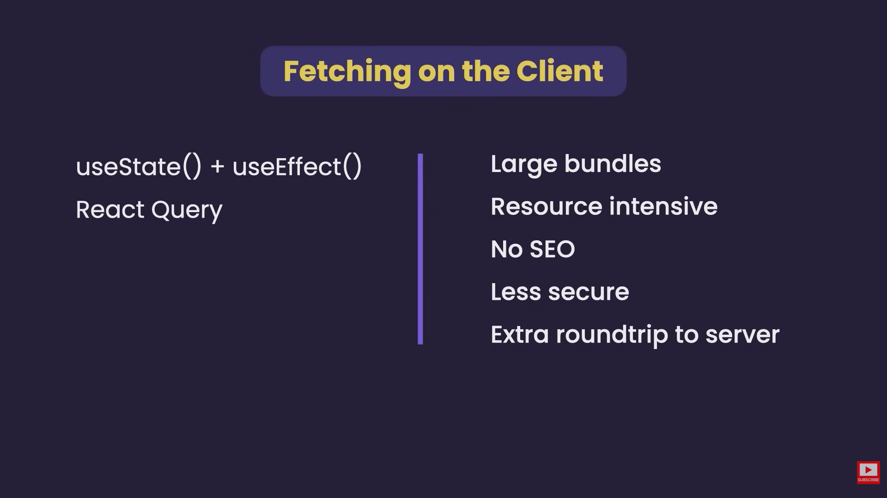
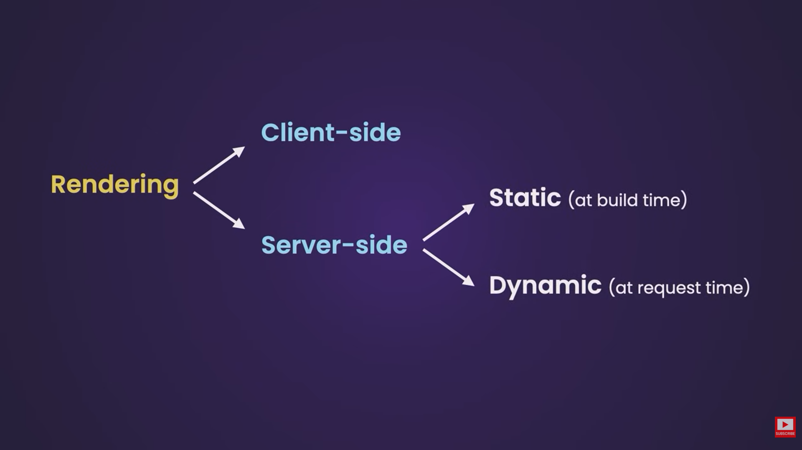

# ----Introduction, Benefits, Improvements from React.js

### 🚀 Next.js

Since you already know React well, think of Next.js as:

> **"A production-ready framework built on top of React that solves many real-world problems React alone doesn't solve well."**

React is just a UI library.

Next.js is a  **full-stack React framework** .

### 🤔 Why React Isn't Enough?

Imagine you build a MERN app using React.

You immediately need:

* Routing
* Authentication
* SEO
* Server-side rendering
* API backend
* Image optimization
* Code splitting
* Deployment optimization
* Metadata management
* Performance optimization

React gives you:

```jsx
function App() {
  return <h1>Hello</h1>;
}
```

Everything else?

You install packages and configure them manually.

**-- In React**

You need:

```txt
react-router-dom
axios
express
cors
helmet
dotenv
redux
react-query
...
```

Lots of setup.

**-- In Next.js**

Most things are already built-in.

```txt
Routing ✅
Backend APIs ✅
SSR ✅
SSG ✅
Image Optimization ✅
SEO ✅
Performance Optimization ✅
Code Splitting ✅
Deployment Ready ✅
```

### 🏗️ What Exactly Is Next.js?

Next.js is a framework that allows:

```txt
Frontend (React)
+
Backend APIs
+
Rendering Strategies
+
Optimization
```

inside one project.

##### 🔥 Traditional React Flow

```txt
Browser
   ↓
React App
   ↓
API Call
   ↓
Node Backend
   ↓
Database
```

##### 🔥 Next.js Flow

```txt
Browser
   ↓
Next.js
   ↓
Database
```

or

```txt
Browser
   ↓
Next.js API Route
   ↓
Database
```

or

```txt
Browser
   ↓
Server Component
   ↓
Database
```

Many possibilities.

### 🧠 Biggest Concept To Understand

The biggest React mindset change:

**-- React**

Everything runs in browser.

```txt
Client Side
```

-- **Next.js**

Code can run:

```txt
Server
OR
Client
```

This is the core concept.

### 🌍 Client Side Rendering (CSR)

React's default behavior.

```txt
Browser loads HTML
Browser loads JS
React renders page
```

Example:

```jsx
useEffect(() => {
  fetch("/api/users")
})
```

Browser fetches data.

**-- Problem?**

Google initially sees:

```html
<div id="root"></div>
```

Bad SEO.

Slower initial load.

### ⚡ Server Side Rendering (SSR)

Next.js can render page on server.

```txt
Server fetches data
Server builds HTML
Browser receives ready HTML
```

Result:

```html
<h1>Products</h1>
```

already exists.

**-- Benefits**

✅ Better SEO

✅ Faster first load

✅ Better performance

### 📰 Static Site Generation (SSG)

Page generated during build time.

```txt
Build
 ↓
HTML Created
 ↓
Stored
 ↓
Served instantly
```

Perfect for:

* Blogs
* Documentation
* Landing pages

### 🔄 Incremental Static Regeneration (ISR)

Mix of SSR + SSG.

Generate page once.

Regenerate later.

Example:

```txt
News Website
```

Update every hour.

### 📁 Routing

React:

```jsx
<Route />
```

using React Router.

Next.js:

Create file.

```txt
app/
 ├─ about
 │   └─ page.tsx
```

Automatically becomes:

```txt
/about
```

No route configuration.

### 📂 App Router (Most Important Modern Feature)

Interviewers love this.

Current Next.js uses:

```txt
app/
```

instead of

```txt
pages/
```

Example:

```txt
app
 ├─ page.tsx
 ├─ about
 │   └─ page.tsx
 └─ blog
     └─ page.tsx
```

Routes become:

```txt
/
about
blog
```

automatically.

### 🖥️ Server Components

The biggest Next.js feature.

By default:

```jsx
export default async function Page() {
  const users = await prisma.user.findMany()

  return <div>{users.length}</div>
}
```

Runs on server.

No API call needed.

No useEffect needed.

No loading spinner needed.

**🤯 Why Server Components Are Powerful**

React way:

```txt
Browser
 ↓
API
 ↓
Server
 ↓
Database
```

Next.js Server Component:

```txt
Server Component
 ↓
Database
```

One less network request.

Faster.

### 📱 Client Components

When you need:

* useState
* useEffect
* Event handlers

Add:

```jsx
"use client";
```

Example:

```jsx
"use client";

const [count, setCount] = useState(0);
```

### ⚠️ Common Interview Question

**-- Why doesn't useState work in Server Components?**

Because Server Components run on server.

No browser.

No state.

No events.

### 🔥 API Routes

You can create backend APIs inside Next.

```txt
app
 └─ api
      └─ users
            └─ route.ts
```

Example:

```ts
export async function GET() {
  return Response.json(users)
}
```

Endpoint:

```txt
/api/users
```

### 🗄️ Prisma + Next.js

This is why everyone teaches them together.

Server Component:

```tsx
const users = await prisma.user.findMany();
```

No Express required.

No Axios required.

No separate backend required.

### 🔐 Authentication

Usually:

**-- > Auth.js (formerly NextAuth)**

Most common.

Features:

* Google Login
* GitHub Login
* Credentials Login
* Session Management

For your assignment:

✅ Learn Auth.js

Don't learn other auth libraries first.

### 🖼️ Image Optimization

React:

```jsx

```

Next.js:

```jsx
<Image />
```

Benefits:

* Lazy loading
* Compression
* Responsive images
* Faster performance

### ⚡ Automatic Code Splitting

React bundle:

```txt
Everything downloaded
```

Next.js:

```txt
Only route-specific code downloaded
```

Smaller bundle.

Faster app.

### 📦 Rendering Strategies Interview Favorite

Know these 4:

| Type | When Generated   |
| ---- | ---------------- |
| CSR  | Browser          |
| SSR  | Every Request    |
| SSG  | Build Time       |
| ISR  | Revalidate Later |

If an interviewer asks:

> "Difference between CSR and SSR?"

This table is usually enough.

### ❌ Downsides Of Next.js

Nothing is free.

**1️⃣ More Complexity**

Need to understand:

* Client Components
* Server Components
* Routing
* Rendering

React alone is simpler.

**2️⃣ Hydration Issues**

Very common interview topic.

Server renders:

```html
<h1>5</h1>
```

Browser renders:

```html
<h1>6</h1>
```

Mismatch.

Hydration error.

**3️⃣ Server/Client Confusion**

Beginners constantly ask:

```txt
Can I use useState?
Can I access window?
Can I access localStorage?
```

Depends on component type.

**4️⃣ Vendor Lock-In**

You start thinking in Next.js patterns.

Not pure React patterns.

### 🎯 Most Important Interview Questions

**-- What is Next.js?**

Framework built on React providing routing, rendering strategies, backend APIs, SEO and performance optimizations.

**-- Difference between React and Next.js?**

React is a UI library.

Next.js is a full-stack framework built on React.

**-- What is SSR?**

Server generates HTML on every request before sending it to browser.

**-- What is SSG?**

Pages are generated at build time and served as static HTML.

**-- What is ISR?**

Static pages regenerated periodically without rebuilding the entire application.

**-- What are Server Components?**

Components that execute on the server and never ship their JavaScript to the browser.

**-- What are Client Components?**

Components running in browser that support state, effects and event handlers.

**-- Why use `"use client"`?**

To tell Next.js that component should run in browser and can use React hooks.

**-- Why are Server Components faster?**

Because they:

* Reduce JS sent to browser
* Remove unnecessary API requests
* Access database directly

**-- Can Server Components use useState?**

No.

**-- Can Server Components access database?**

Yes.

**--Can Client Components access database directly?**

No.

---

# ---- In Depth:  Lifecycle, Why React to Next, SSR, SSG, ISR, Routing, Controller, Next Diagram

### 🚀 First, Forget All the Buzzwords

The biggest mistake people make when learning Next.js is thinking:

> "React and Next.js are competing approaches."

They're not.

Think of it like:

```txt
React = Engine

Next.js = Car built using that engine
```

React is still doing the UI work.

Next.js is deciding:

```txt
Where should this React code run?

Browser?
Server?
Build time?
```

### 🏠 Let's Understand Mount, Update and Unmount First

**-- Client Component**

Imagine a counter:

```jsx
"use client";

function Counter() {
  const [count, setCount] = useState(0);

  return (
    <button onClick={() => setCount(count + 1)}>
      {count}
    </button>
  );
}
```

**Mount**

When page first appears:

```txt
Browser
  ↓
Creates Counter component
  ↓
UI appears
```

React says:

```txt
"Counter is now mounted"
```

**Update**

User clicks:

```txt
0
↓ click
1
↓ click
2
```

React:

```txt
Re-renders component
```

This is update.

**Unmount**

User leaves page:

```txt
/dashboard
     ↓
/profile
```

Counter removed.

React:

```txt
Destroy Counter
```

Unmount.

### 🖥️ What About Server Components?

This is where people get confused.

Server Components do NOT stay alive.

Think carefully.

Server Component:

```jsx
export default async function Page() {
  const users = await prisma.user.findMany();

  return <Users users={users}/>
}
```

When request comes:

```txt
Browser requests page
        ↓
Server Component runs
        ↓
Gets data
        ↓
Produces HTML
        ↓
Sends result
        ↓
DONE
```

After sending:

```txt
Server Component dies
```

No mounting in browser.

No state.

No useEffect.

No updates.

No lifecycle.

Think:

```txt
Server Component
=
Function call
```

not

```txt
Interactive React Component
```

### 🤯 So How Do Updates Happen?

Example:

```txt
Product Page
```

Server Component fetches products.

User clicks button.

Button is Client Component.

```txt
Server Component
    ↓
Initial page

Client Component
    ↓
Interactions
```

So:

```txt
Initial Render = Server

Interactions = Client
```

Most of the time.

### 🎯 Didn't React Become Popular To Avoid SSR?

YES.

But also NO.

Let's understand history.

##### 🌍 Before React

Old websites:

```txt
Request page
 ↓
Server builds HTML
 ↓
Send HTML
```

Every click:

```txt
Reload whole page
```

Terrible UX.

Example:

Facebook 2008

Click Like:

```txt
Entire page reload
```

Slow.  Then React arrived.

##### ⚡ React Revolution

React said:

```txt
Load JS once

Then update only changed parts
```

Example:  Instagram.

Like a photo:

```txt
❤️ count changes

Only that section updates
```

Amazing. No full reload.  Everyone loved it.

##### 😬 Then Problems Appeared

Pure React apps became:

```txt
index.html

<div id="root"></div>
```

Initially.

Google crawler sees:

```html
<div id="root"></div>
```

Bad SEO.  Also:

```txt
Download JS
Execute JS
Fetch API
Render UI
```

Can be slow.  Especially:

* Blogs
* Ecommerce
* Marketing pages

##### 🎯 Industry Realization

People realized:

```txt
Interactivity needs Client

Content needs Server
```

Not:

```txt
Everything Client
```

Not:

```txt
Everything Server
```

That's why Next.js exists.

Modern strategy:

```txt
First render -> Server

Interactions -> Client
```

Best of both worlds.

##### 🎬 Example

Amazon Product Page

You open:

```txt
iPhone Product Page
```

Server renders:

```txt
Product name
Price
Description
Images
Reviews
```

Immediately.

Client handles:

```txt
Add to Cart
Image Zoom
Quantity Change
Wishlist
```

Without reload. Perfect.

### 📦 SSG Explained Like A Shop

Static Site Generation.

Imagine:

```txt
Company Website
```

Content changes rarely.

Without SSG:

Every visitor:

```txt
Request
 ↓
Generate page
 ↓
Send page
```

1000 visitors:

```txt
Generate page 1000 times
```

Waste.

With SSG:

At build time:

```txt
Generate page once
```

Store:

```txt
about.html
pricing.html
```

Now visitors get:

```txt
Ready-made page
```

Instant.  Example:

```txt
Portfolio
Documentation
Blog
Terms Page
```

**🍕 Real Life Analogy**

Restaurant.

Without SSG:

```txt
Customer orders pizza
 ↓
Chef cooks
```

every time.

With SSG:

```txt
Chef prepared pizzas already
```

Customer receives instantly.

### 🔄 ISR Explained

Problem:  What if content changes?

Example:  News website.

SSG page generated at:

```txt
10:00 AM
```

News changes at:

```txt
10:30 AM
```

Page stale.

ISR solves this.

Example:

```js
export const revalidate = 3600;
```

Meaning:

```txt
Regenerate every hour
```

Flow:

```txt
10:00 page generated

10:30 visitors still get old page

11:00 first visitor arrives

Server regenerates in background

11:01 everyone gets fresh page
```

**🍔 Real Life Example**

Restaurant Menu.  SSG:

```txt
Printed menu.
```

Never changes.

ISR:

```txt
Printed menu updated every hour.
```

Mostly static.

Occasionally refreshed.

### 🛣️ Routing - Why Not Just React Router?

Excellent question.

Because honestly:

```txt
React Router is already very good.
```

For routing alone:

```txt
React Router ≈ Next Router
```

So why Next?  Because routing is connected with:

```txt
Server Rendering
Data Fetching
Layouts
Caching
Streaming
Code Splitting
```

all together.  Example:

React Router

```txt
Create route
Fetch data manually
Manage loading manually
```

Next

```txt
Create file
Fetch data in component
Server renders automatically
Cache automatically
```

Less plumbing.

### 🎯 Layouts Are The Real Upgrade

React:

```txt
Navbar
Sidebar
Footer
```

Need to manually structure.

Next:

```txt
app
 ├ layout.tsx
 ├ dashboard
 │   └ page.tsx
```

Dashboard pages automatically inherit layout.

Navigate:

```txt
dashboard/users
→ dashboard/settings
```

Navbar stays.

Sidebar stays.

Only page content changes.

Very efficient.

### 🔥 Biggest Misunderstanding About Backend

You asked:

> Is backend controller written in Next?

**YES**.  Example:

```txt
app
 └ api
     └ users
         └ route.ts
```

Acts like:

```txt
Express Controller
```

Equivalent:  Express:

```js
app.get("/users", ...)
```

Next:

```js
export async function GET() {}
```

Same idea.

##### 😨 Is Business Logic Exposed?

This is the MOST IMPORTANT question.

**Answer:  NO**

Server Component code NEVER reaches browser.

Example:

```jsx
const users = await prisma.user.findMany();
```

Browser receives:

```html
<h1>Users</h1>
```

ONLY.

Not:

```txt
Prisma query
Database password
Secret keys
```

**Think:**

```txt
Server Component
=
Runs on backend machine
```

Client never sees:

```txt
Database code
Business logic
Environment variables
```

**-- Example**

Server Component:

```jsx
export default async function Page() {
  const users = await prisma.user.findMany();

  return <Users users={users}/>
}
```

Browser sees:

```html
<ul>
  <li>John</li>
  <li>Alex</li>
</ul>
```

Not source code.  Exactly same as Express.

##### 🔥 Then Why Use API Routes At All?

Because not everything is page rendering.

Example:

```txt
Add Product
Delete User
Upload File
Payment
```

Need endpoints.

So:

```txt
Server Components
=
Read data

API Routes / Server Actions
=
Modify data
```

Usually.

### 🏗️ The Mental Model That Makes Everything Click

Think of Next.js as:

```txt
Next.js

         ┌──────────────────────┐
         │      Browser         │
         │                      │
         │ Client Components    │
         │ useState             │
         │ useEffect            │
         │ Click Events         │
         └──────────┬───────────┘
                    │
                    │
                    ▼
         ┌──────────────────────┐
         │      Server          │
         │                      │
         │ Server Components    │
         │ Prisma               │
         │ Auth                 │
         │ Business Logic       │
         │ Database Access      │
         └──────────┬───────────┘
                    │
                    ▼
              Database
```

### 🎯 The One-Sentence Summary

If an interviewer asks:

> "Why Next.js when React already exists?"

Answer:

> React solves UI rendering and interactivity. Next.js adds server rendering, routing, backend APIs, SEO, caching, performance optimizations, and server-side data fetching while still using React for interactive parts.

And the key modern idea is:

```txt
Initial UI → Server

User Interactions → Client

Database Access → Server

State & Events → Client
```

Once this clicks, 80% of Next.js becomes much easier to understand. 🚀

---

# ---- Next.js comes with Node.js Runtime

Yes, but the wording can be confusing. Let's unpack it carefully. 🚀

### 🏗️ What is a Runtime?

A runtime is simply:

> **The environment where your JavaScript code actually executes.**

For example:

**Browser Runtime**

```js
console.log("Hello");
window.alert("Hi");
```

Runs inside:

```txt
Chrome
Firefox
Edge
```

The browser provides:

```txt
window
document
localStorage
```

**Node.js Runtime**

```js
const fs = require("fs");
```

Runs inside:

```txt
Node.js
```

Node provides:

```txt
fs
path
process
http
```

### 🤔 Where Does React Run?

Traditional React:

```txt
Browser
   ↓
React
```

Almost everything runs in browser.

That's why you can use:

```js
window
document
localStorage
```

### 🤔 Where Does Next.js Run?

Next.js has two environments:

```txt
Client Components
    ↓
Browser Runtime

Server Components
    ↓
Node.js Runtime
```

Example:

**-- Client Component**

```jsx
"use client";

console.log(window.location.href);
```

Runs:

```txt
Browser
```

Works.

**-- Server Component**

```jsx
export default async function Page() {
  console.log(process.env.DB_URL);
}
```

Runs:

```txt
Node.js
```

Works.

### 🎯 What People Mean By

> "Next.js comes with a Node.js runtime"

They mean:

```txt
Next.js server code executes inside Node.js
```

When you run:

```bash
npm run dev
```

Next starts a Node server.

Something like:

```txt
Node.js
   ↓
Next.js Server
   ↓
Your App
```

You don't manually create:

```js
const express = require("express");
```

but Node is still underneath.

### 🖥️ What Happens When Someone Visits Your Site?

Suppose user opens:

```txt
/products
```

Flow:

```txt
Browser
   ↓ Request
Next.js Server (Node.js)
   ↓
Server Component Executes
   ↓
Database Query
   ↓
HTML Generated
   ↓
Response Sent
```

All of that happens in Node.js.

### 🔥 Why Is This Powerful?

Because inside Server Components you can do:

```js
await prisma.user.findMany();
```

or

```js
await User.find();
```

with Mongoose.

Because you're on the server.

You can also access:

```js
process.env.JWT_SECRET
```

because Node.js provides:

```txt
Environment Variables
Filesystem
Network Access
Database Access
```

### ⚠️ Why Can't Client Components Do That?

Imagine:

```jsx
"use client";

const users = await prisma.user.findMany();
```

Disaster 😅

Because then:

```txt
Database code
Database credentials
Secrets
```

would be sent to every user's browser.

So Next prevents this.

### 🌍 Is Node.js Always Used?

Interesting question.

Historically:

```txt
Next.js
   ↓
Node.js Runtime
```

always.

Today there are two possible runtimes:

**-- Node Runtime**

Default.

```txt
Next.js
   ↓
Node.js
```

Supports:

✅ Prisma

✅ Mongoose

✅ Filesystem

✅ Most npm packages

**-- Edge Runtime**

```txt
Next.js
   ↓
Edge Server
```

Closer to user.

Faster globally.

But:

❌ No filesystem

❌ Some Node APIs unavailable

❌ Some libraries don't work

For beginners:

Just assume:

```txt
Next.js Server Components
Route Handlers
Server Actions

=
Running inside Node.js
```

because that's true for 95% of apps.

### 🎬 Real-Life Analogy

Imagine a restaurant.

**-- Browser**

Customer table.

```txt
Can click buttons
Can see menu
Cannot access kitchen
```

**--Node.js Runtime**

Kitchen.

```txt
Can access ingredients
Can cook food
Can access inventory
```

**-- Next.js**

Waiter.

```txt
Customer
   ↓
Waiter (Next.js)
   ↓
Kitchen (Node.js)
   ↓
Food
   ↓
Customer
```

The waiter lets some code run at the table (Client Components) and some code run in the kitchen (Server Components).

### 🎯 Interview Answer

If asked:

> "What does it mean that Next.js uses the Node.js runtime?"

A good answer is:

> "Next.js runs server-side code such as Server Components, Route Handlers, and Server Actions inside a Node.js runtime. This allows direct access to databases, environment variables, and server resources while client-side code continues to run in the browser."

That's the level of understanding interviewers are usually looking for. 🚀


---

# ----Routing, Dynamic routing, Navigation & Special route files

If you already know React Router, think:

```txt
React Router:
You CREATE routes

Next.js:
You CREATE files
Routes are created automatically
```

That's the biggest difference.

### 🤔 React Router

You manually define routes:

```jsx
<Routes>
  <Route path="/" element={<Home />} />
  <Route path="/about" element={<About />} />
  <Route path="/contact" element={<Contact />} />
</Routes>
```

Every route must be declared.

### 🚀 Next.js

You create folders and files:

```txt
app/
 ├ page.tsx
 ├ about/
 │   └ page.tsx
 └ contact/
     └ page.tsx
```

Automatically becomes:

```txt
/
/about
/contact
```

No route configuration.

### 🏗️ The App Router Structure

Modern Next.js uses:

```txt
app/
```

Inside it:

```txt
app/
 ├ page.tsx
 ├ about/
 │   └ page.tsx
 └ dashboard/
     └ page.tsx
```

Result:

```txt
page.tsx           → /
about/page.tsx     → /about
dashboard/page.tsx → /dashboard
```

**🎯 Why `page.tsx`?**

Think:

```txt
Folder = URL segment

page.tsx = Actual page
```

Example:

```txt
app/
 └ products/
      └ page.tsx
```

becomes:

```txt
/products
```

### 📦 Nested Routes

Example:

```txt
app/
 └ dashboard/
      └ settings/
           └ page.tsx
```

URL:

```txt
/dashboard/settings
```

Visualize:

```txt
app
 └ dashboard
      └ settings
           └ page.tsx
```

↓

```txt
/dashboard/settings
```

### 🔥 Dynamic Routes

Suppose:

```txt
/products/1
/products/2
/products/3
```

You don't want:

```txt
products/
 ├ 1/page.tsx
 ├ 2/page.tsx
 └ 3/page.tsx
```

That would be insane 😅

Instead:

```txt
app/
 └ products/
      └ [id]/
           └ page.tsx
```

`[id]` means dynamic.

Now:

```txt
/products/1
/products/25
/products/999
```

all use same page.

Access parameter:

```tsx
export default function ProductPage({
  params,
}: {
  params: { id: string };
}) {
  return <h1>{params.id}</h1>;
}
```

For:

```txt
/products/25
```

Output:

```txt
25
```

**🎬 Real-Life Example**

E-commerce:

```txt
amazon.com/product/123
amazon.com/product/456
amazon.com/product/789
```

One dynamic route:

```txt
app/
 └ product/
      └ [id]/
           └ page.tsx
```

### 📁 Multiple Dynamic Params

Example:

```txt
/blog/web-development/react
```

Structure:

```txt
app/
 └ blog/
      └ [category]/
           └ [slug]/
                └ page.tsx
```

Result:

```txt
category = web-development
slug = react
```

### 🌍 Catch-All Routes

Suppose:

```txt
/docs/react/hooks/useeffect
```

Depth can vary.

Use:

```txt
app/
 └ docs/
      └ [...slug]/
           └ page.tsx
```

For:

```txt
/docs/react/hooks/useeffect
```

You get:

```js
slug = [
  "react",
  "hooks",
  "useeffect"
]
```

### 🏠 Layouts (Most Important Feature)

This is where Next.js shines.

Suppose dashboard has:

```txt
Navbar
Sidebar
Content
```

React Router usually:

```txt
Render page
Manage layout manually
```

Next:

```txt
app/
 └ dashboard/
      ├ layout.tsx
      ├ page.tsx
      ├ users/
      │   └ page.tsx
      └ settings/
          └ page.tsx
```

Layout:

```tsx
export default function Layout({
  children,
}: {
  children: React.ReactNode;
}) {
  return (
    <>
      <Navbar />
      <Sidebar />
      {children}
    </>
  );
}
```

Now:

```txt
/dashboard
/dashboard/users
/dashboard/settings
```

all automatically share:

```txt
Navbar
Sidebar
```

**🎯 Why Layouts Are Powerful**

Navigate:

```txt
/dashboard/users
     ↓
/dashboard/settings
```

Only content changes.

Navbar stays.

Sidebar stays.

State can stay.

Much more efficient.

### 🔄 Navigation

React Router:

```jsx
<Link to="/about">
```

Next:

```jsx
<Link href="/about">
```

Example:

```tsx
import Link from "next/link";

<Link href="/about">
  About
</Link>
```

**⚡ Why Use Next's Link?**

Normal HTML:

```html
<a href="/about">
```

causes:

```txt
Full page reload
```

Next Link:

```jsx
<Link href="/about">
```

causes:

```txt
Client-side navigation
```

No reload.

Faster.

### 🚀 Prefetching (Huge Benefit)

When link enters viewport:

```jsx
<Link href="/products">
```

Next often starts loading route in background.

So when user clicks:

```txt
Instant navigation
```

This is built-in.

React Router doesn't do this automatically.

### Special route files

##### ❌ Route Not Found

Create:

```txt
app/
 └ not-found.tsx
```

Example:

```tsx
export default function NotFound() {
  return <h1>404 Not Found</h1>;
}
```

##### ⏳ Loading UI

Create:

```txt
app/
 └ loading.tsx
```

Example:

```tsx
export default function Loading() {
  return <h1>Loading...</h1>;
}
```

Shows automatically while server data loads.

##### 🚨 Error Handling

Create:

```txt
app/
 └ error.tsx
```

Example:

```tsx
"use client";

export default function Error() {
  return <h1>Something went wrong</h1>;
}
```

Acts like route-level error boundary.

### 📊 React Router vs Next Router

| Feature        | React Router | Next.js            |
| -------------- | ------------ | ------------------ |
| Route Creation | Manual       | File Based         |
| Nested Routes  | Yes          | Yes                |
| Dynamic Routes | Yes          | Yes                |
| Layouts        | Yes          | Better Integration |
| SSR            | Manual Setup | Built In           |
| SSG            | No           | Built In           |
| Prefetching    | Limited      | Built In           |
| Loading UI     | Manual       | Built In           |
| Error Pages    | Manual       | Built In           |

### 🎯 Interview Questions

**--What is file-based routing?**

Routes are automatically generated from folders and files inside the `app` directory.

**--What is a dynamic route?**

A route that accepts URL parameters using brackets:

```txt
[id]
```

Example:

```txt
/products/123
/products/456
```

**--What is a layout?**

A shared UI wrapper that persists across multiple routes.

**--Difference between `<Link>` and `<a>`?**

`<Link>` performs client-side navigation and supports prefetching, while `<a>` triggers a full page reload.

**--What are `loading.tsx`, `error.tsx`, and `not-found.tsx`?**

Special route files for loading states, error boundaries, and 404 pages.

---

# ----Special Routing in detail- Loading, Not found, Error

This is actually one of the coolest things in Next.js because React normally makes you do all of this manually. 🚀

Let's understand it from a real-world perspective first.

### 🏢 Imagine a Shopping Mall

You enter a mall.

Three things can happen:

✅ Everything works

```txt
You enter
↓
Shop opens
↓
See products
```

⏳ Shop is preparing

```txt
You enter
↓
Products not ready yet
↓
"Please wait..."
```

This is:

```txt
loading.tsx
```

❌ Shop crashes

```txt
Database failed
Server error
Unexpected bug
```

This is:

```txt
error.tsx
```

**🚫 Shop doesn't exist**

```txt
You ask for Shop #999
No such shop
```

This is:

```txt
not-found.tsx
```

### 🔥 Before Next.js

In React Router you typically do:

```jsx
if (loading) {
  return <Spinner />
}

if (error) {
  return <Error />
}
```

for every page.

And:

```jsx
<Route path="*" element={<NotFound />} />
```

for 404.

Next.js automates much of this.

### 🚫 not-found.tsx

Let's start with the easiest.

Suppose:

```txt
/products/123
```

exists.

But user enters:

```txt
/products/999999
```

which doesn't exist.

Your page:

```tsx
export default async function ProductPage({
  params
}) {
  const product = await getProduct(params.id);

  return <Product product={product}/>
}
```

What if:

```txt
product = null
```

?

You can do:

```tsx
import { notFound } from "next/navigation";

if (!product) {
  notFound();
}
```

Next immediately renders:

```txt
not-found.tsx
```

Create:

```txt
app
 └ not-found.tsx
```

```tsx
export default function NotFound() {
  return (
    <h1>Product Not Found</h1>
  );
}
```

Flow:

```txt
Request
 ↓
Fetch Product
 ↓
Not Found
 ↓
notFound()
 ↓
not-found.tsx
```

**-- Real Example**

Instagram:

```txt
instagram.com/user123
```

exists.

User visits:

```txt
instagram.com/randomfakeuser999999
```

Result:

```txt
User not found
```

That's basically Next's:

```txt
notFound()
```

### ⚡ loading.tsx

This one is magical.

Suppose page takes:

```txt
3 seconds
```

to load.

Without loading.tsx

User sees:

```txt
Blank screen
```

for 3 seconds.

Bad UX.

With loading.tsx

Create:

```txt
app
 ├ loading.tsx
 └ page.tsx
```

```tsx
export default function Loading() {
  return <h1>Loading...</h1>;
}
```

Now:

```txt
Request page
      ↓
Loading UI appears
      ↓
Data finishes
      ↓
Real page appears
```

**-- Real Example**

Netflix.

When opening a movie:

```txt
Gray placeholders
```

appear.

These are called:

```txt
Skeleton Loaders
```

Example:

```tsx
export default function Loading() {
  return (
    <>
      <Skeleton />
      <Skeleton />
      <Skeleton />
    </>
  );
}
```

**🤯 What's Actually Happening?**

Suppose:

```tsx
export default async function Page() {
  const users = await fetchUsers();
}
```

and

```txt
fetchUsers()
```

takes:

```txt
5 seconds
```

Next detects:

```txt
Server Component still loading
```

and automatically shows:

```txt
loading.tsx
```

until finished.

No need for:

```jsx
const [loading, setLoading]
```

No:

```jsx
useEffect()
```

No:

```jsx
isLoading
```

### Nested Loading

This is where Next becomes powerful.

Structure:

```txt
app
 └ dashboard
      ├ loading.tsx
      ├ page.tsx
      └ users
          └ page.tsx
```

Loading only affects:

```txt
dashboard
```

section.

Not the whole app.

User still sees:

```txt
Navbar
Sidebar
```

while content loads.

This feels much smoother.

### ❌ error.tsx

This handles unexpected crashes.

Imagine:

```tsx
const users = await prisma.user.findMany();
```

Database crashes.

Error:

```txt
Database Connection Failed
```

Without error.tsx:

```txt
White screen
```

or ugly stack trace.

With error.tsx:

```txt
app
 └ error.tsx
```

```tsx
"use client";

export default function Error({
  error,
  reset,
}) {
  return (
    <>
      <h1>Something went wrong</h1>

      <button onClick={() => reset()}>
        Try Again
      </button>
    </>
  );
}
```

**-- Why "use client"?**

Because:

```txt
Button Click
```

needs browser interaction.

Error component must be a:

```txt
Client Component
```

##### What is reset()?

Very interview-worthy question.

Suppose:

```txt
Database temporarily down
```

User sees:

```txt
Something went wrong
```

Clicks:

```txt
Try Again
```

Next reruns:

```txt
Server Component
```

again.

Equivalent to:

```txt
Refresh page
```

but smarter.

**--Real Example**

Imagine:

```txt
Payment API timeout
```

for one request.

User gets:

```txt
Error Page
```

Clicks:

```txt
Retry
```

API works now.

Page loads successfully.

### Route-Level Error Handling

Structure:

```txt
app
 ├ error.tsx
 └ dashboard
      ├ error.tsx
      └ page.tsx
```

Dashboard crashes.

Only dashboard error page shows.

Not:

```txt
Whole application crashes
```

This is similar to:

```jsx
<ErrorBoundary>
```

in React.

# 🔥 The Magic Combination

Imagine:

```txt
app
 └ products
      ├ page.tsx
      ├ loading.tsx
      ├ error.tsx
      └ not-found.tsx
```

Now product route automatically gets:

### While waiting

```txt
loading.tsx
```

### If crashed

```txt
error.tsx
```

### If product missing

```txt
not-found.tsx
```

### If successful

```txt
page.tsx
```

**-- Flow:**

```txt
User visits product

        ↓

   Loading...
        ↓

 ┌──────────────┐
 │ Product Found│──────► page.tsx
 └──────────────┘

        OR

 ┌──────────────┐
 │ Product Null │──────► not-found.tsx
 └──────────────┘

        OR

 ┌──────────────┐
 │ Crash/Error  │──────► error.tsx
 └──────────────┘
```

### 🎯 Interview Answers

**Difference Between Error and Not Found?**

```txt
not-found.tsx
=
Resource doesn't exist

Example:
Product 999 not found
```

```txt
error.tsx
=
Something broke

Example:
Database crashed
API failed
Code threw exception
```

This distinction is something interviewers frequently ask because many beginners confuse a missing resource with an application failure. 🚀

---

# ----Client Component & Server Component

If you understand  **Server Components vs Client Components** , you've understood the hardest conceptual shift from React → Next.js.

Most interviewers ask at least one question from this area.

### 🧠 First Forget React For A Moment

In React, every component is basically:

```txt
Browser
  ↓
Component Runs
```

Example:

```jsx
function Profile() {
  return <h1>Arjun</h1>;
}
```

Runs in browser.

In Next.js, a component can run in:

```txt
Browser (Client Component)

OR

Server (Server Component)
```

The question becomes:

> Where should this component execute?

### 🏢 Real-Life Analogy

Imagine a restaurant.

Customer Area

```txt
Click buttons
See menu
Interact
```

This is:

```txt
Client Component
```

Kitchen

```txt
Cook food
Access ingredients
Access inventory
```

This is:

```txt
Server Component
```

Customers shouldn't enter the kitchen.

Kitchen shouldn't handle button clicks.

Same idea.

### 🔥 Server Component

Default in Next.js.

Example:

```tsx
export default async function Page() {
  const users = await prisma.user.findMany();

  return (
    <div>
      {users.map(user => (
        <p key={user.id}>{user.name}</p>
      ))}
    </div>
  );
}
```

Question:

Where does this execute?

```txt
Server
```

Flow:

```txt
Request Page
     ↓
Server Component Runs
     ↓
Database Query
     ↓
HTML Generated
     ↓
Browser Receives HTML
```

Browser never sees:

```txt
Prisma Code
Database Password
Business Logic
```

Only receives:

```html
<p>John</p>
<p>Alex</p>
```

### 🎯 Why Server Components Exist

Suppose React app:

```txt
Browser
   ↓
Fetch API
   ↓
Backend
   ↓
Database
```

Example:

```jsx
useEffect(() => {
  fetch("/api/users");
}, []);
```

Network request required.

With Server Component:

```txt
Server Component
      ↓
Database
```

Direct access. One network request removed. Faster.

### Client Component

Example:

```tsx
"use client";

import { useState } from "react";

export default function Counter() {
  const [count, setCount] = useState(0);

  return (
    <button onClick={() => setCount(count + 1)}>
      {count}
    </button>
  );
}
```

Runs in:

```txt
Browser
```

because of:

```tsx
"use client";
```

Flow:

```txt
Browser Downloads JS
      ↓
Component Hydrates
      ↓
User Clicks
      ↓
State Updates
```

### Why Not Make Everything Client Components?

Because browser must download all JS.

Imagine:

```txt
Dashboard
Users
Products
Orders
Reports
```

All become JS bundles. Large download. Slow.

Server Components send:

```txt
HTML
```

instead of:

```txt
Huge JavaScript
```

This is the biggest performance benefit.

### 🤯 Important Interview Question

**-- Is There Such A Thing As "use server"?**

People often think:

```txt
"use client"
```

and

```txt
"use server"
```

are opposites. Not exactly.

By default:

```txt
All Components
=
Server Components
```

unless marked:

```txt
"use client"
```

**Example**

```tsx
export default function Page() {
  return <h1>Hello</h1>;
}
```

This is already:

```txt
Server Component
```

No special directive needed.

### What Can Server Components Do?

**Access Database**

```tsx
await prisma.user.findMany()
```

**Access Secrets**

```tsx
process.env.JWT_SECRET
```

**Access Filesystem**

```tsx
fs.readFile()
```

**Fetch Data**

```tsx
await fetch(...)
```

### What Can Server Components NOT Do?

**useState ❌**

```tsx
const [count, setCount] = useState(0);
```

Why?  State exists in browser.

Server has no persistent UI state.

**useEffect ❌**

```tsx
useEffect(...)
```

Because:

```txt
No browser lifecycle
```

**Event Handlers ❌**

```tsx
<button onClick={handleClick}>
```

Why?  Server can't listen to browser clicks.

**Browser APIs ❌**

```tsx
window
document
localStorage
navigator
```

No browser exists on server.

### What Can Client Components Do?

Everything React normally does.

**useState ✅**

```tsx
useState()
```

**useEffect ✅**

```tsx
useEffect()
```

**Event Handlers ✅**

```tsx
onClick
onChange
```

**Browser APIs ✅**

```tsx
window
document
localStorage
```

### Most Common Beginner Mistake

```tsx
export default async function Page() {
  const [count, setCount] = useState(0);
}
```

Error.

Because:

```txt
Server Component
```

cannot use:

```txt
useState
```

Fix:

```tsx
"use client";
```

### Another Common Mistake

```tsx
"use client";

const users = await prisma.user.findMany();
```

Bad idea. Why?  Now database code goes into browser bundle. Next will complain.

Remember:

```txt
Database
=
Server
```

Always.

### The Most Powerful Pattern

Server Component parent.

Client Component child.

Example:

```txt
Page
 ├ Fetch Users
 └ Pass Data To Table
```

Server Component:

```tsx
import UserTable from "./UserTable";

export default async function Page() {
  const users = await prisma.user.findMany();

  return (
    <UserTable users={users}/>
  );
}
```

Client Component:

```tsx
"use client";

export default function UserTable({ users }) {
  const [search, setSearch] = useState("");

  return ...
}
```

Flow:

```txt
Server
 ↓
Fetch Data
 ↓
Pass Props
 ↓
Client Component
 ↓
Interactivity
```

This is the preferred architecture.

### Visual Diagram

```txt
Browser Requests Page
          ↓

┌──────────────────┐
│ Server Component │
└──────────────────┘
          ↓
     Fetch Data
          ↓
    Generate HTML
          ↓
   Send To Browser
          ↓

┌──────────────────┐
│ Client Component │
└──────────────────┘
          ↓
     User Clicks
          ↓
      Re-renders
```

### Hydration (Interview Favorite)

Suppose server sends:

```html
<h1>Hello</h1>
```

Browser displays immediately.

Then React attaches:

```txt
Event Handlers
State
Interactivity
```

This process is:

```txt
Hydration
```

Interview Question:

**-- What is Hydration?**

Hydration is the process where React attaches JavaScript behavior to server-rendered HTML.

### Hydration Error Example

Server:

```tsx
const random = Math.random();
```

Generated:

```txt
0.52
```

Browser:

```txt
0.91
```

Mismatch. Error:

```txt
Hydration Failed
```

Very common interview topic.

### Another Tricky Thing

This surprises many people.

Server Component:

```tsx
<Page>
   <Counter />
</Page>
```

where:

```tsx
Counter
```

is client component.

Result: ✅

```txt
Server Component
      ↓
Can import Client Component
```

But reverse:

```txt
Client Component
      ↓
Import Server Component
```

Usually not allowed directly. Reason:

Server code cannot suddenly run in browser.

### When Should I Use Server Components?

Use when:

✅ Fetching database data

✅ Fetching API data

✅ Reading files

✅ SEO content

✅ Product pages

✅ Blogs

✅ Dashboards

### When Should I Use Client Components?

Use when:

✅ Forms

✅ Modals

✅ Search bars

✅ Dropdowns

✅ Tabs

✅ State

✅ Effects

✅ Event handlers

### Golden Rule

Ask:

> "Does this component need user interaction?"

If YES:

```txt
Client Component
```

If NO:

```txt
Server Component
```

### Interview Questions

**-- What is a Server Component?**

A component rendered on the server that can access databases and server resources but cannot use React hooks like `useState` or browser APIs.

**-- What is a Client Component?**

A component rendered and hydrated in the browser that supports state, effects, event handlers, and browser APIs.

**-- Why are Server Components faster?**

* Less JavaScript sent to browser
* Direct database access
* Fewer API calls
* Better initial page load

### 🎯 The One Mental Model To Remember

```txt
Server Components
=
Data + HTML

Client Components
=
State + Events + Interactivity
```

Or even simpler:

```txt
Server Component
=
Kitchen

Client Component
=
Dining Table
```

The kitchen prepares the food (data and HTML), and the dining table handles the customer's interactions (clicks, typing, state changes). Once this mental model clicks, most Next.js architecture decisions become obvious. 🚀

---

# ---- Server Components & Re-render

**Yes, Server Components absolutely can re-render.**

> But they **don't re-render the same way Client Components do.**

This distinction confuses almost everyone initially. 🚀

### 🧠 Client Component Re-render

You're already familiar with this from React.

```tsx
"use client";

function Counter() {
  const [count, setCount] = useState(0);

  return (
    <button onClick={() => setCount(count + 1)}>
      {count}
    </button>
  );
}
```

Click:

```txt
0
↓
1
↓
2
↓
3
```

Each click:

```txt
setState()
 ↓
Component re-renders
```

inside the browser.

No server involved.



### 🖥️ Server Component Re-render

Example:

```tsx
export default async function Page() {
  const users = await prisma.user.findMany();

  return <Users users={users} />;
}
```

Question:  When does this run?

Answer:

```txt
Page Request
 ↓
Server Component Executes
```

Suppose you refresh:

```txt
F5
```

Flow:

```txt
Request
 ↓
Server Component Runs Again
 ↓
Database Query Again
```

So yes:

```txt
Server Component re-executed
```

### 🎯 Important Difference

**Client Component:**

```txt
Mounted Once
 ↓
Updates Via State
 ↓
Re-renders In Browser
```

**Server Component:**

```txt
Request
 ↓
Execute
 ↓
Send Result
 ↓
Finished
```

-- Then later:

```txt
New Request
 ↓
Execute Again
```

It's more accurate to think:

```txt
Server Components are re-executed
```

rather than:

```txt
Server Components stay alive and re-render
```

### Restaurant Analogy 🍽️

Server Component:

```txt
Customer orders food
 ↓
Kitchen cooks
 ↓
Food served
 ↓
Kitchen done
```

Another customer orders:

```txt
New order
 ↓
Kitchen cooks again
```

The kitchen isn't sitting there tracking state.

It simply executes whenever needed.

### 🤯 What If A Client Component Updates State?

Example:

```tsx
<Page>
   <Counter />
</Page>
```

Server Component:

```tsx
export default async function Page() {
  const users = await prisma.user.findMany();

  return <Counter />;
}
```

Client Component:

```tsx
"use client";

const [count, setCount] = useState(0);
```

User clicks:

```txt
Count = 1
Count = 2
Count = 3
```

Question: Does Server Component run again?

Answer: ❌ No.

Only:

```txt
Counter re-renders
```

in browser.  Flow:

```txt
Server Component
    ↓
Initial HTML

Client Component
    ↓
State Changes
    ↓
Client Re-renders
```

Server untouched.

### When DOES a Server Component Run Again?

**1. Refresh Page**

```txt
F5
```

↓

```txt
Server Component executes again
```

**2. Navigate To Route Again**

Example:

```txt
/products
   ↓
/about
   ↓
/products
```

Server Component may execute again.

**3. Data Revalidation**

Example:

```tsx
fetch(url, {
  next: { revalidate: 60 }
})
```

After cache expires:

```txt
Server Component runs again
```

**4. Server Action**

Example:

```tsx
await createUser()
```

After mutation:

```tsx
revalidatePath("/users");
```

Now:

```txt
Server Component re-executes
```

to fetch fresh data.

**Example That Feels Like Re-rendering**

Users page:

```tsx
export default async function Page() {
  const users = await prisma.user.findMany();

  return (
    <div>{users.length}</div>
  );
}
```

Initially:

```txt
5 users
```

User creates another user.

Database:

```txt
6 users
```

Call:

```tsx
revalidatePath("/users");
```

Now:

```txt
Server Component executes again
 ↓
Fetches updated data
 ↓
Shows 6 users
```

Looks like a re-render.

But technically:

```txt
Old execution ended
New execution started
```

### The Interview Answer

If asked:

> "Do Server Components re-render?"

A strong answer is:

> "Server Components don't re-render due to client-side state changes like Client Components do. Instead, they are re-executed on the server when a new request, navigation, revalidation, or server-triggered update occurs."

### The Mental Model

Don't think:

```txt
Server Component
=
Alive React Component
```

Think:

```txt
Server Component
=
Function that runs on the server
```

Every time Next.js needs fresh output:

```txt
Run Function
 ↓
Generate HTML
 ↓
Send Result
 ↓
Done
```

No persistent state.  No browser lifecycle.  No `useState`. No `useEffect`.

That's why Server Components feel more like **backend functions that return UI** than traditional React components. 🚀

---

# ----Data Fetching and Caching

This is where many React developers suddenly feel lost because Next.js changes the way we think about fetching data.

In React, the usual mindset is:

```txt
Render Page
   ↓
useEffect()
   ↓
Fetch Data
   ↓
setState()
   ↓
Re-render
```

In Next.js, the preferred mindset is:

```txt
Fetch Data
   ↓
Render Page
```

The order is reversed.

### 🏗️ React Way (Client-Side Fetching)

Example:

```tsx
"use client";

function Users() {
  const [users, setUsers] = useState([]);

  useEffect(() => {
    fetch("/api/users")
      .then(res => res.json())
      .then(setUsers);
  }, []);

  return users.map(...);
}
```

Flow:

```txt
Open Page
    ↓
Empty UI
    ↓
JS Downloads
    ↓
API Call
    ↓
Response
    ↓
Render Data
```

Problems:

❌ Extra network request

❌ Loading spinner needed

❌ Worse SEO

❌ Slower first render

### 🚀 Next.js Preferred Way

Server Component:

```tsx
export default async function Page() {
  const users = await fetch("https://api.com/users");

  return <div>...</div>;
}
```

Flow:

```txt
Request Page
     ↓
Fetch Data
     ↓
Generate HTML
     ↓
Send HTML
```

Browser receives:

```html
John
Alex
Sarah
```

already rendered.  No useEffect. No loading state. No extra API request.

### 🤯 Why Is This Faster?

React:

```txt
Browser
   ↓
API Request
   ↓
Server
```

Two trips:

```txt
Page Request
+
API Request
```

Server Component:

```txt
Browser
   ↓
Server Component
   ↓
Database/API
```

One trip.

### 🎯 The Most Common Pattern

Database query directly inside Server Component:

```tsx
export default async function Page() {
  const users = await prisma.user.findMany();

  return (
    <div>
      {users.map(user => (
        <p key={user.id}>{user.name}</p>
      ))}
    </div>
  );
}
```

No route handler.  No Axios. No useEffect.

### 🤔 Then Why Do Route Handlers Exist?

Because fetching and mutating are different things.

Reading data:

```txt
Server Component
```

Example:

```tsx
await prisma.user.findMany()
```

Writing data:

```txt
Route Handler
Server Action
```

Example:

```txt
Create User
Delete User
Update User
```

### 🧠 Now Let's Talk About Caching

This is where Next.js becomes really powerful.

Imagine a blog.

```txt
100,000 visitors
```

Everyone opens:

```txt
/blog/react-hooks
```

Without caching:

```txt
Visitor 1 → DB Query
Visitor 2 → DB Query
Visitor 3 → DB Query
...
```

100,000 database hits.

Expensive.

**--What Is Caching?**

Caching means:

```txt
Fetch Once
Store Result
Reuse Result
```

Real life:

Restaurant menu.

Instead of printing:

```txt
100,000 menus
```

You print:

```txt
1 menu
```

and everyone reads it.

##### Default Fetch Caching

Example:

```tsx
await fetch(
  "https://api.com/posts"
);
```

Next may cache the result.

Meaning:

```txt
First Request
      ↓
Fetch API
      ↓
Store Result
```

Later:

```txt
Second Request
```

↓

```txt
Use Cached Result
```

No API call.

##### Visual Flow

Without Cache:

```txt
User 1 → API
User 2 → API
User 3 → API
User 4 → API
```

With Cache:

```txt
User 1 → API
           ↓
        Cache

User 2 → Cache

User 3 → Cache

User 4 → Cache
```

Much faster.

##### 🚨 Sometimes Cache Is Bad

Imagine:

```txt
Bank Balance
Stock Price
Live Cricket Score
```

Need fresh data.

Use:

```tsx
fetch(url, {
  cache: "no-store"
});
```

Meaning:

```txt
Never Cache
```

Every request:

```txt
User
 ↓
Fresh API Call
```

Example:

```tsx
const balance = await fetch(
  "/api/balance",
  {
    cache: "no-store"
  }
);
```

Always fresh.

**--Interview question:**

What does `cache: "no-store"` do?

Answer: Disables caching and fetches fresh data on every request.

### 🔥 ISR (Revalidation)

Middle ground.

Not:

```txt
Always Cache
```

Not:

```txt
Never Cache
```

Instead:

```txt
Cache For A While
```

Example:

```tsx
fetch(url, {
  next: {
    revalidate: 60
  }
});
```

Meaning:

```txt
Keep cache for 60 seconds
```

**--Real Example**

News Website At:

```txt
10:00 AM
```

First request.  Fetch API. Cache result.

Until:

```txt
10:59
```

Use cache. At:

```txt
11:00
```

Refresh cache. Benefits:

```txt
Fast
+
Fresh enough
```

Perfect for:

```txt
Blogs
Products
Documentation
News
```

##### Database Caching

Same idea.

Example:

```tsx
const users = await prisma.user.findMany();
```

Next can cache the result depending on how the route is configured.

Without caching:

```txt
Every visitor
 ↓
Database Query
```

With caching:

```txt
One Query
 ↓
Store Result
 ↓
Reuse Result
```

### Dynamic vs Static Pages

Very important interview topic.

**-- Static**

Example:

```txt
About Page
Privacy Policy
Blog Post
```

Can be cached.

**-- Dynamic**

Example:

```txt
User Dashboard
Bank Account
Shopping Cart
```

Must be fresh.

Next automatically tries to detect this.

### Server Component Fetching vs Client Component Fetching

**-- Server Component**

```tsx
const users = await fetch(...)
```

Advantages:

✅ SEO

✅ Faster first load

✅ Less JS

✅ Can access secrets

**-- Client Component**

```tsx
useEffect(() => {
  fetch(...)
});
```

Advantages:

✅ Real-time updates

✅ User-triggered fetching

✅ Browser-only data

---

# ----Static & Dynamic Rendering

This is one of the most important Next.js concepts because it determines:

```txt
Performance
Caching
SEO
Server Load
Freshness of Data
```

Many interviewers directly ask:

> "What's the difference between static and dynamic rendering?"

### 🧠 First Understand The Core Question

Whenever a user requests a page:

```txt
/products
```

Next.js must answer:

> "Should I generate this page once and reuse it?"

or

> "Should I generate this page every time someone visits?"

That's literally the difference.

📦 Static Rendering

Think:

```txt
Generate Once
Reuse Many Times
```

Suppose you have:

```txt
/About Us
/Privacy Policy
/Terms
```

These pages rarely change.

During build:

```bash
npm run build
```

Next generates:

```html
about.html
privacy.html
terms.html
```

already. Flow:

```txt
Build Time
    ↓
Generate HTML
    ↓
Store HTML
    ↓
Serve Same HTML To Everyone
```

### 🎬 Example

Page:

```tsx
export default function AboutPage() {
  return (
    <h1>About Us</h1>
  );
}
```

Build time:

```txt
Generate HTML
```

Result:

```html
<h1>About Us</h1>
```

stored. Visitors:

```txt
Visitor 1
Visitor 2
Visitor 3
Visitor 10000
```

all receive same HTML.

### ⚡ Why Static Is Fast

No database.  No API. No server work.

Just:

```txt
Give Stored HTML
```

Flow:

```txt
User
 ↓
CDN
 ↓
HTML
```

Very fast.

**--- 🎯 Perfect For**

✅ Blogs  ✅ Documentation  ✅ Landing Pages  ✅ Company Website  ✅ Terms Page  ✅ Privacy Policy

### 🔥 Dynamic Rendering

Think:

```txt
Generate Every Request
```

Example:

```txt
Bank Account Page
```

My balance:

```txt
₹5,000
```

Your balance:

```txt
₹50,000
```

Cannot reuse same page. Need fresh data every time. Flow:

```txt
Request
   ↓
Fetch Data
   ↓
Generate HTML
   ↓
Send HTML
```

Every visit.

##### 🎬 Example

```tsx
export default async function Page() {
  const users = await prisma.user.findMany();

  return <div>{users.length}</div>;
}
```

Request 1:

```txt
10 Users
```

New user joins.

Database:

```txt
11 Users
```

Request 2:

```txt
11 Users
```

Page generated again.

### 📊 Static vs Dynamic

| Feature        | Static     | Dynamic       |
| -------------- | ---------- | ------------- |
| Generated      | Build Time | Request Time  |
| Speed          | Very Fast  | Slower        |
| Server Work    | None       | Every Request |
| Fresh Data     | No         | Yes           |
| SEO            | Excellent  | Excellent     |
| Scalability    | Excellent  | Lower         |
| Database Calls | Rare       | Frequent      |

### 🤯 How Does Next Decide?

Next analyzes your code.

Example:

```tsx
export default function About() {
  return <h1>About</h1>;
}
```

No database.  No user-specific data. Next thinks:

```txt
Static
```

### 🔥 What Makes A Route Dynamic?

Example:

```tsx
const users = await prisma.user.findMany();
```

or

```tsx
const data = await fetch(url, {
  cache: "no-store"
});
```

or

```tsx
cookies()
headers()
```

Next sees:

```txt
Needs Fresh Data
```

and makes route dynamic.

### 🍪 Why Cookies Force Dynamic Rendering

Example:

```tsx
const cookieStore = cookies();

const theme = cookieStore.get("theme");
```

User A:

```txt
Dark Theme
```

User B:

```txt
Light Theme
```

Cannot pre-generate one page.  Must render per request. Therefore:

```txt
Dynamic
```

### ⚡ Dynamic Doesn't Mean Client Side

Very common confusion.

People think:

```txt
Dynamic = Client Component
```

Wrong.  Dynamic rendering still happens on server.

Example:

```tsx
export default async function Page() {
  const user = await getUser();
}
```

### 🔄 ISR — The Middle Ground

Suppose blog updates every hour.

Static:

```txt
Too stale
```

Dynamic:

```txt
Too expensive
```

Solution:

```txt
ISR
```

Example:

```tsx
export const revalidate = 3600;
```

Meaning:

```txt
Regenerate every hour
```



### 🏗️ Visual Comparison

📦 Static

```txt
Build
 ↓
Generate HTML
 ↓
Store
 ↓
Users
```

🔥 Dynamic

```txt
User
 ↓
Request
 ↓
Generate HTML
 ↓
Send
```

Every request.

🔄 ISR

```txt
User
 ↓
Cached HTML
 ↓
After Expiry
 ↓
Regenerate
 ↓
Update Cache
```

### 🎯 Real Project Examples (FitLab)

📦 Static

```txt
About Page
Pricing Page
Terms Page
```

Generate once.

🔄 ISR

```txt
Workout Articles
Trainer Listings
Exercise Library
```

Update occasionally.

🔥 Dynamic

```txt
User Dashboard
Calories
Workout Progress
Notifications
```

Need fresh data.

### ⚠️ Tricky Interview Question

> "Is static rendering the same as caching?"

No.

Static rendering means:

```txt
HTML generated beforehand.
```

Caching means:

```txt
Store previously generated result.
```

Static pages are cached, but caching can also be used with dynamic content.

---

# ---- Async Server Component

This is one of the coolest features in Next.js because  **React components traditionally could not be async** .

In Next.js Server Components, they can.

Example:

```tsx
export default async function Page() {
  const users = await prisma.user.findMany();

  return <div>{users.length}</div>;
}
```

Notice:

```tsx
async function Page()
```

This is an  **Async Server Component** .

### 🧠 Why Is This Special?

In traditional React:

```tsx
function Page() {
  const users = await fetchUsers(); // ❌ Error

  return <div></div>;
}
```

You cannot use:

```txt
await
```

inside a normal React component.

Instead, React developers had to do:

```tsx
useEffect()
```

and

```tsx
useState()
```

### 😫 React Way

Example:

```tsx
"use client";

function Users() {
  const [users, setUsers] = useState([]);

  useEffect(() => {
    fetch("/api/users")
      .then(res => res.json())
      .then(setUsers);
  }, []);

  return (
    <div>
      {users.length}
    </div>
  );
}
```

Flow:

```txt
Render Empty Page
       ↓
Run useEffect
       ↓
Fetch Data
       ↓
Update State
       ↓
Re-render
```

Lots of steps.

### ⚡ Async Server Component Way

```tsx
export default async function Users() {
  const users = await prisma.user.findMany();

  return (
    <div>
      {users.length}
    </div>
  );
}
```

Flow:

```txt
Fetch Data
      ↓
Render Page
      ↓
Send HTML
```

Much simpler.

### 🏗️ Why Can Server Components Be Async?

Because they run on the server.

Think:

```txt
Server Component
=
Backend Function
```

And backend functions can obviously do:

```js
await databaseQuery();
```

No problem.

### 🎬 Real Example

Suppose database contains:

```txt
John
Sarah
Alex
```

Server Component:

```tsx
export default async function Page() {
  const users = await prisma.user.findMany();

  return (
    <>
      {users.map(user => (
        <p key={user.id}>{user.name}</p>
      ))}
    </>
  );
}
```

Flow:

```txt
Request Page
      ↓
Run Query
      ↓
Get Users
      ↓
Generate HTML
      ↓
Send HTML
```

Browser receives:

```html
<p>John</p>
<p>Sarah</p>
<p>Alex</p>
```

already rendered.

### 🤯 What Does async Actually Mean Here?

Let's remove Next.js.

Normal JavaScript:

```js
async function getUsers() {
  const users = await fetchUsers();

  return users;
}
```

Flow:

```txt
Call Function
     ↓
Pause At await
     ↓
Wait For Data
     ↓
Continue
```

Same thing happens in Server Components.

```tsx
export default async function Page() {
  const users = await prisma.user.findMany();

  return ...
}
```

Flow:

```txt
Start Component
      ↓
Pause At await
      ↓
Wait For Database
      ↓
Continue Rendering
```

### ❌ Can Client Components Be Async?

This is a famous interview question.

Example:

```tsx
"use client";

export default async function Counter() {
}
```

Not allowed.

Or at least not in the same way.

Why?

Client Components run in browser.

React expects:

```txt
Component
   ↓
Return JSX Immediately
```

not:

```txt
Wait
 ↓
Then Return JSX
```

That's why Client Components use:

```tsx
useEffect()
```

for async work.

### 📊 Server vs Client Data Fetching

🖥️ Server Component

```tsx
export default async function Page() {
  const data = await fetch(...);
}
```

Flow:

```txt
Server
 ↓
Fetch Data
 ↓
Render UI
```

🌐 Client Component

```tsx
"use client";

useEffect(() => {
  fetch(...);
}, []);
```

Flow:

```txt
Render UI
 ↓
Fetch Data
 ↓
Update State
 ↓
Re-render UI
```

### 🔥 Multiple Awaits

Example:

```tsx
export default async function Page() {
  const users = await getUsers();

  const products = await getProducts();

  return ...
}
```

Works.

But:

```txt
Users
 ↓
Then Products
```

Sequential.

Can be slow.

**⚡ Better Way**

```tsx
export default async function Page() {
  const [users, products] = await Promise.all([
    getUsers(),
    getProducts()
  ]);

  return ...
}
```

Flow:

```txt
Users Query
      ↘

       Run Together

      ↗
Products Query
```

Much faster.

### ⚠️ Tricky Interview Question

**-- Does Async Mean The Browser Waits?**

Not exactly.

The server waits.

Flow:

```txt
Browser
   ↓
Request
   ↓
Server waits for DB
   ↓
Server builds HTML
   ↓
Response
```

Browser isn't running the query.

Server is.

**-- Is Every Server Component Async?**

No.

Example:

```tsx
export default function About() {
  return <h1>About</h1>;
}
```

Perfectly valid.

Use async only when needed.

Example:

```tsx
export default async function Page() {
  const users = await getUsers();
}
```

### 🎯 Most Common Real Example

Dashboard:

```tsx
export default async function Dashboard() {
  const workouts =
    await prisma.workout.findMany();

  return (
    <WorkoutList workouts={workouts}/>
  );
}
```

Flow:

```txt
Request Dashboard
        ↓
Database Query
        ↓
Generate HTML
        ↓
Send Ready Dashboard
```

No:

```txt
useEffect
Loading State
Axios
```

required.

---

# ----Image Component in Next.js

### 🖼️ What Is the Next.js Image Component?

In React, you normally do:

```jsx

```

In Next.js, the recommended way is:

```jsx
import Image from "next/image";

<Image
  src="/profile.jpg"
  alt="Profile"
  width={300}
  height={300}
/>
```

This component is called:

```txt
<Image />
```

and it's one of Next.js's built-in performance optimizations.

### 🤔 Why Not Just Use ``?

Because `` is dumb 😄

It simply does:

```txt
Download Image
Display Image
```

No optimization.

No intelligence.

**🚀 What Problems Does `` Have?**

Imagine this image:

```txt
4000 × 3000 pixels
10 MB
```

But you're displaying:

```txt
200 × 200 pixels
```

on a phone.

With ``:

```txt
Download entire 10 MB image
```

Wasteful.

### ⚡ What Does `<Image />` Do?

Next.js automatically:

✅ Resizes images

✅ Compresses images

✅ Lazy loads images

✅ Serves modern formats

✅ Prevents layout shifts

Think:

```txt

=
Basic Delivery Boy

<Image>
=
Smart Delivery System
```

### 🎬 Example

Normal image:

```jsx

```

Next Image:

```jsx
<Image
  src="/hero.jpg"
  alt="Hero"
  width={800}
  height={500}
/>
```

Next analyzes:

```txt
Device Size
Screen Resolution
Network
```

and serves the best image.

### 📱 Responsive Images

Imagine:

**Mobile**

```txt
400px width
```

**Laptop**

```txt
1200px width
```

4K Monitor

```txt
2500px width
```

Using ``:

```txt
Same image to everyone
```

Using `<Image>`:

```txt
Small image → Mobile
Medium image → Laptop
Large image → Desktop
```

Automatically.

### 🚀 Lazy Loading

This is huge.

Suppose page contains:

```txt
100 images
```

Using ``:

```txt
Load all 100 immediately
```

Even if user never scrolls.  Using `<Image>`:

```txt
Load visible images
```

Only.  User scrolls:

```txt
Load more images
```

Result:

```txt
Faster page load
Less bandwidth
```

### 🎯 Real Example

Instagram Feed

Imagine:

```txt
50 posts
50 images
```

You only see:

```txt
First 5 posts
```

Why load:

```txt
Other 45 images?
```

No reason. Lazy loading solves this.

### ⚠️ Layout Shift Problem

One of Google's Core Web Vitals.  Without width and height:

```html

```

Browser doesn't know image size. Initially:

```txt
Text
Text
Text
```

Then image loads:

```txt
Image
Text moves down
```

Page jumps. Annoying.  This is called:

```txt
Layout Shift
```

##### 🖼️ How Image Component Fixes It

```jsx
<Image
  src="/photo.jpg"
  width={500}
  height={300}
  alt="Photo"
/>
```

Browser knows:

```txt
500 × 300
```

before image arrives. Space reserved. No jumping.

**🎬 Real Example**

Without dimensions:

```txt
Loading...

Text Here

Image Loads

Text Moves Down
```

With dimensions:

```txt
Loading...

Reserved Space

Text Stays Fixed
```

Much better UX.

### 🔥 Image Optimization

Suppose image:

```txt
5 MB
```

Next may compress it to:

```txt
400 KB
```

while maintaining visual quality.

Result:

```txt
Faster website
```

without changing code.

### 🌐 Remote Images

Local image:

```jsx
<Image
  src="/profile.jpg"
  ...
/>
```

Remote image:

```jsx
<Image
  src="https://site.com/photo.jpg"
  ...
/>
```

Requires configuration. In:

```js
next.config.js
```

you allow domains.

Example:

```js
images: {
  remotePatterns: [
    {
      protocol: "https",
      hostname: "images.unsplash.com"
    }
  ]
}
```

Security measure.

### 📏 Why Width & Height Are Required?

Interview favorite. This:

```jsx
<Image
  src="/profile.jpg"
  alt="Profile"
/>
```

❌

This:

```jsx
<Image
  src="/profile.jpg"
  alt="Profile"
  width={300}
  height={300}
/>
```

✅

Reason:

```txt
Prevent Layout Shift
```

### 🔥 Fill Mode

Sometimes you don't know exact size.

Example:

```jsx
<Image
  src="/hero.jpg"
  alt="Hero"
  fill
/>
```

Meaning:

```txt
Fill Parent Container
```

Parent:

```jsx
<div className="relative h-[500px]">
```

Image fills entire container.

Used heavily for:

```txt
Hero Sections
Banners
Cards
```

### 🏗️ objectFit Equivalent

Suppose image:

```txt
1000 × 1000
```

container:

```txt
300 × 100
```

Use:

```jsx
<Image
  fill
  style={{
    objectFit: "cover"
  }}
/>
```

Like CSS:

```css
object-fit: cover;
```

### ⚠️ Common Beginner Mistake

```jsx
<Image
  src="/hero.jpg"
/>
```

Error. Need:

```jsx
width
height
```

or

```jsx
fill
```

### ⚠️ Another Mistake

Using Image for every tiny icon.

Example:

```txt
16px icon
```

Often:

```html

```

or SVG is perfectly fine.

Use `<Image>` mainly for:

```txt
Photos
Banners
Product Images
Avatars
```

### 📊 img vs Image

| Feature                 | img   | Image  |
| ----------------------- | ----- | ------ |
| Works Everywhere        | ✅    | ✅     |
| Lazy Loading            | ❌    | ✅     |
| Responsive Images       | ❌    | ✅     |
| Optimization            | ❌    | ✅     |
| Layout Shift Prevention | ❌    | ✅     |
| Compression             | ❌    | ✅     |
| Performance             | Lower | Higher |

---

# ----Server Actions

### 🚀 What Are Server Actions?

Server Actions are one of the biggest features introduced in modern Next.js.

Think of them as:

```txt
Functions that run on the server
but can be called directly from your UI.
```

Without creating:

```txt
Express Route
REST API
Controller
Axios Call
Fetch Call
```

### 🧠 Why Were Server Actions Created?

Before Server Actions, if a user clicked:

```txt
Create User
```

the flow was:

```txt
React Form
    ↓
fetch("/api/users")
    ↓
API Route
    ↓
Controller
    ↓
Database
```

Lots of layers.

### 😫 Traditional MERN Flow

```txt
Client
 ↓
Axios/Fetch
 ↓
Express Route
 ↓
Controller
 ↓
Service
 ↓
Database
```

Example:

```tsx
await fetch("/api/users", {
  method: "POST",
  body: JSON.stringify(data)
});
```

Then:

```js
app.post("/users", createUser);
```

Then:

```js
User.create(...)
```

Multiple files. Multiple hops.

### ⚡ Server Action Flow

```txt
Client
 ↓
Server Action
 ↓
Database
```

Direct. Example:

```tsx
"use server";

async function createUser(formData) {
  await prisma.user.create(...);
}
```

That's it.

### 🎬 First Example

```tsx
"use server";

async function createUser() {
  console.log("Running on server");
}
```

This:

```txt
"use server"
```

tells Next:

> Execute this function on the server.

Not in browser.

### 🏗️ Real Example

Suppose form:

```txt
Name
Email
Submit
```

**Server Action:**

```tsx
"use server";

async function createUser(formData: FormData) {

  const name = formData.get("name");

  await prisma.user.create({
    data: { name }
  });
}
```

**Form:**

```tsx
<form action={createUser}>
  <input name="name" />

  <button>
    Create User
  </button>
</form>
```

**Flow:**

```txt
Submit Form
      ↓
Server Action
      ↓
Database
      ↓
Done
```

No API route.

**--- 🤯 What Actually Happens?**

This confuses many developers.

People think:

```txt
Client Component
     ↓
Direct Database Access
```

No. Never. Actual flow:

```txt
Browser
   ↓
Next Internal Request
   ↓
Server Action
   ↓
Database
```

Next creates the communication automatically.

### 🔥 Why Server Actions Are Powerful

Because they can:

✅ Insert data  ✅ Update data  ✅ Delete data  ✅ Access secrets  ✅ Access database ✅ Access filesystem

Example:

```tsx
"use server";

async function deleteUser(id) {

  await prisma.user.delete({
    where: { id }
  });
}
```

Perfectly valid.

### ❌ What Server Actions Cannot Do

Server Actions run on server.

Therefore: ❌

```tsx
window.localStorage
```

❌

```tsx
document.querySelector()
```

❌

```tsx
navigator.geolocation
```

❌ No browser APIs.

### 🧠 Why Not Just Use API Routes?

Interview favorite.

Both work. API Route:

```txt
Client
 ↓
Fetch
 ↓
API Route
 ↓
Database
```

Server Action:

```txt
Client
 ↓
Server Action
 ↓
Database
```

Less boilerplate. Less code. Better integration.

### 🎬 Example Comparison

**🌐 API Route Way**

Frontend:

```tsx
await fetch("/api/users", {
  method: "POST"
});
```

Backend:

```tsx
export async function POST() {
}
```

Database:

```tsx
await prisma.user.create(...)
```

**3 pieces.**

**⚡ Server Action Way**

```tsx
"use server";

async function createUser() {

  await prisma.user.create(...);
}
```

Single place.

### 📂 Where Do Server Actions Live?

**Option 1**

Inside component file.

```tsx
async function createUser() {
  "use server";
}
```

Useful for small actions.

**Option 2**

Separate file.

```tsx
actions/user-actions.ts
```

```tsx
"use server";

export async function createUser() {
}
```

Used in production apps.

**🏗️ Production Structure**

```txt
app
 ├ users
 │   └ page.tsx

 ├ actions
 │   └ user-actions.ts
```

Example:

```tsx
"use server";

export async function createUser() {
}
```

Import:

```tsx
import {
  createUser
} from "@/actions/user-actions";
```

Cleaner.

### 🚀 revalidatePath()

Example:

```tsx
"use server";

export async function createUser() {
  await prisma.user.create(...);

  revalidatePath("/users");
}
```

**Flow:**

```txt
Insert User
      ↓
Invalidate Cache
      ↓
Re-run Server Component
      ↓
Show New Data
```

Very important.

### 🔥 useActionState()

Modern pattern.

Example:

```tsx
const [state, action] =
  useActionState(createUser, null);
```

Useful for:

```txt
Success Messages
Validation Errors
Loading States
```

Instead of:

```txt
useState
Axios
Manual Error Handling
```

### 🎬 Form Validation Example

Server Action:

```tsx
"use server";

export async function createUser(
  prevState,
  formData
) {
  const email =
    formData.get("email");

  if (!email) {
    return {
      error: "Email required"
    };
  }

  return {
    success: true
  };
}
```

Client:

```tsx
const [state, action] =
  useActionState(createUser, null);
```

Display:

```tsx
{state?.error}
```

Very clean.

### 🏗️ Server Actions vs Route Handlers

**⚡ Server Actions**

Best for:

```txt
Forms
CRUD
Mutations
Buttons
```

Examples:

```txt
Create User
Delete User
Update Profile
Submit Form
```

**🌐 Route Handlers**

Best for:

```txt
Public APIs
Mobile Apps
Third-party Integrations
Webhooks
```

Examples:

```txt
Stripe Webhook
REST API
Mobile Backend
```

### 🎯 Interview Questions

**❓ Can Server Actions access environment variables?**

Yes. Example:

```tsx
process.env.JWT_SECRET
```

**❓ How do you refresh UI after a mutation?**

Using:

```tsx
revalidatePath()
```

or

```tsx
revalidateTag()
```

**❓ Are Server Actions replacing APIs completely?**

No.

APIs are still needed for:

* Mobile applications
* Third-party consumers
* Public endpoints
* Webhooks

### 🧠 The Mental Model

Think:

```txt
Server Component
=
Read Data
```

Example:

```tsx
await prisma.user.findMany()
```

```txt
Server Action
=
Change Data
```

Example:

```tsx
await prisma.user.create(...)
```

---

# ----Hook - useActionState()

### ⚡ What is `useActionState` in Next.js / React?

`useActionState` is a React (and Next.js App Router) hook that helps you handle **Server Actions + UI state (loading, success, error)** in a clean way.

Think of it as:

```txt
Server Action + useState + form handling
= useActionState
```

It removes a lot of boilerplate you normally write for forms.

### 🧠 Why was it introduced?

Before `useActionState`, you had to do this:

```txt
form submit
  ↓
loading state (useState)
  ↓
fetch/server action
  ↓
error state
  ↓
success state
  ↓
manual UI updates
```

Too much wiring.

**🚀 Basic Idea**

You connect:

```txt
Form
 ↓
Server Action
 ↓
State returned to UI
```

All in one flow.

### 🧪 Basic Syntax

```tsx
const [state, formAction] = useActionState(actionFn, initialState);
```

Where:

```txt
state → current result (error/success/data)
formAction → function you attach to form
actionFn → server action function
initialState → starting value
```

### 🏗️ Simple Example (User Creation)

🖥️ Server Action

```tsx
"use server";

export async function createUser(prevState, formData) {
  const name = formData.get("name");

  if (!name) {
    return { error: "Name is required" };
  }

  // pretend DB insert
  return { success: "User created!" };
}
```

⚛️ Client Component

```tsx
"use client";

import { useActionState } from "react";
import { createUser } from "./actions";

export default function UserForm() {
  const [state, formAction] =
    useActionState(createUser, null);

  return (
    <form action={formAction}>
      <input name="name" placeholder="Enter name" />

      <button type="submit">
        Create User
      </button>

      {state?.error && (
        <p style={{ color: "red" }}>
          {state.error}
        </p>
      )}

      {state?.success && (
        <p style={{ color: "green" }}>
          {state.success}
        </p>
      )}
    </form>
  );
}
```

**🔄 What Happens Internally?**

```txt
User types input
     ↓
Clicks submit
     ↓
formAction runs
     ↓
Server Action executes (server)
     ↓
Returns state
     ↓
UI updates automatically
```

### 🎯 Key Concept

Unlike normal forms:

```txt
You don’t manually setState
You don’t manually fetch
You don’t manually handle loading
```

Instead:

```txt
Server Action returns state
→ React updates UI automatically
```

### ⚡ What is `prevState`?

This is very important.

```tsx
export async function action(prevState, formData)
```

It allows:

```txt
Access previous state
→ useful for incremental updates
```

Example:

```tsx
return {
  count: prevState.count + 1
};
```

### 🧠 Mental Model

Think of it like this:

```txt
Traditional React:
UI → event → fetch → setState → UI

useActionState:
UI → formAction → server → return state → UI
```

### 🔥 Why It’s Powerful

✅ 1. No useState needed for forms

```txt
No loading state boilerplate
No error state boilerplate
```

✅ 2. Works directly with Server Actions

```txt
Client UI ↔ Server logic seamless
```

✅ 3. Cleaner forms

Before:

```txt
handleSubmit
useState
useEffect
fetch
error handling
```

After:

```txt
useActionState + Server Action
```

### ⚠️ Common Mistakes

**❌ 1. Using it without `"use server"`**

Server action must include:

```tsx
"use server";
```

**❌ 2. Expecting browser APIs**

You CANNOT do:

```tsx
window.alert()
localStorage
```

inside server action.

**❌ 3. Confusing it with useState**

It does NOT replace useState fully.

It only manages:

```txt
server-driven state (forms, mutations)
```

### 📊 When to Use `useActionState`

👍 Good use cases:

```txt
Forms
Login / Signup
CRUD operations
Server mutations
```

👎 Not needed:

```txt
UI toggles
Dropdown open/close
Modals
Animations
```

(useState is better there)

---

# ----Middlewares in Next.js

Middleware is code that runs:

```txt
Before a request reaches your route/page
```

Think:

```txt
Browser
   ↓
Middleware
   ↓
Page / API Route / Server Component
```

Middleware gets a chance to:

✅ Allow request

✅ Block request

✅ Redirect request

✅ Modify request

before the actual page runs.

### 🏢 Real-Life Analogy

Imagine entering a company office.

Before reaching:

```txt
Manager's Room
```

you pass through:

```txt
Security Guard
```

The security guard can:

```txt
Check ID
Allow Entry
Deny Entry
Redirect Visitor
```

without involving the manager.

Middleware is that security guard.

### 🎬 Normal Request Flow

Without middleware:

```txt
Browser
   ↓
Next.js Route
   ↓
Response
```

With middleware:

```txt
Browser
   ↓
Middleware
   ↓
Next.js Route
   ↓
Response
```

### 📂 Where Does Middleware Live?

Traditionally:

```txt
middleware.ts
```

at project root.

Example:

```txt
app/
components/
middleware.ts
```

### ⚡ Simplest Middleware

```ts
import { NextResponse } from "next/server";

export function middleware() {
  console.log("Middleware Running");

  return NextResponse.next();
}
```

What does:

```ts
NextResponse.next()
```

mean?

It means:

```txt
Everything okay
Continue request
```

Flow:

```txt
Request
   ↓
Middleware
   ↓
next()
   ↓
Page Loads
```

### 🚀 Most Common Use Case: Authentication

Suppose:

```txt
/dashboard
/admin
/settings
```

should only be visible to logged-in users.

Without middleware:

Every page must check:

```txt
Is User Logged In?
```

Again. Again. Again. Again.

Bad. Middleware checks once.

🎬 Example

```ts
import { NextResponse } from "next/server";

export function middleware(req) {
  const token =
    req.cookies.get("token");

  if (!token) {
    return NextResponse.redirect(
      new URL("/login", req.url)
    );
  }

  return NextResponse.next();
}
```

Flow:

```txt
Visit Dashboard
      ↓
Check Cookie
      ↓
No Token
      ↓
Redirect Login
```

### 🍪 Accessing Cookies

Middleware can read:

```ts
req.cookies.get("token")
```

Useful for:

```txt
Authentication
Authorization
Theme
Language
Preferences
```

### 🌍 Localization Example

Suppose:

```txt
India → English

France → French
```

Middleware can detect:

```txt
Country
Language
```

and redirect.

Example:

```txt
/
 ↓
/en
```

or

```txt
/
 ↓
/fr
```

before page loads.

### 🔥 Redirects

Middleware can redirect users.

Example:

```ts
return NextResponse.redirect(
  new URL("/login", req.url)
);
```

Flow:

```txt
User
 ↓
Dashboard
 ↓
Middleware
 ↓
Login Page
```

### ⚡ Rewrites

Interview favorite.

People confuse:

```txt
Redirect
Rewrite
```

**--🔀 Redirect**

Changes browser URL.

Example:

```txt
/dashboard
```

↓

```txt
/login
```

Browser URL becomes:

```txt
/login
```

**-- 🔄 Rewrite**

Changes destination internally.

Browser still sees:

```txt
/dashboard
```

but Next serves:

```txt
/login
```

under the hood.

Example:

```ts
return NextResponse.rewrite(
  new URL("/login", req.url)
);
```

**🎯 Redirect vs Rewrite**

Redirect: Browser URL changes

Rewrite: Browser URL stays same

Interviewers love this question.

### 🛡️ Role-Based Access

Suppose:

```txt
User
Admin
Super Admin
```

Middleware:

```txt
Read JWT
 ↓
Extract Role
 ↓
Allow or Deny
```

Flow:

```txt
/admin
 ↓
Middleware
 ↓
Role Check
 ↓
Access Granted?
```

### ⚡ Matcher

Without configuration:

```txt
Middleware runs
for every request
```

Including:

```txt
Images
CSS
JS
Fonts
API Routes
```

Not ideal.

Use:

```ts
export const config = {
  matcher: ["/dashboard/:path*"]
};
```

Now middleware only runs on:

```txt
/dashboard
/dashboard/profile
/dashboard/settings
```

Huge performance improvement.

**🎬 Example**

```ts
export const config = {
  matcher: [
    "/dashboard/:path*",
    "/admin/:path*"
  ]
};
```

Flow:

```txt
/dashboard
 ↓
Middleware Runs

/admin
 ↓
Middleware Runs

/about
 ↓
Middleware Skipped
```

### 🤯 Middleware Runs Before Everything

Many beginners think:

```txt
Page
 ↓
Middleware
```

Wrong.

Actual order:

```txt
Request
 ↓
Middleware
 ↓
Route
 ↓
Server Component
```

Middleware always goes first.

### 🚀 Middleware vs Server Component

Suppose:

```txt
Need Auth Check
```

Could do:

```tsx
const user = await getUser();

if (!user) redirect("/login");
```

inside Server Component. Works.

But:  Page already started executing

Middleware:  Check before page runs.  More efficient.

### 🎯 Middleware vs Route Handler

**-- Middleware**

```txt
Pre-processing
```

Examples:

```txt
Auth
Redirects
Localization
Rate Limiting
```

**-- Route Handler**

```txt
Business Logic
```

Examples:

```txt
Create User
Update Product
Delete Order
```

### ⚠️ Important Limitation

Middleware cannot:

```txt
Query Database Easily
Run Heavy Logic
Perform Long Operations
```

because it should remain fast.

Think:  Security Guard

not:  Entire Management Department

**⚠️ Another Limitation**

You generally should not do:

```ts
await prisma.user.findMany();
```

inside middleware.

Why?  Because middleware executes for many requests.  Could slow entire app.

Keep middleware:

```txt
Fast
Lightweight
Simple
```

### 🏗️ Typical Production Flow

```txt
User Opens Dashboard
         ↓
Middleware
         ↓
Check JWT Cookie
         ↓
Token Valid?
         │
         ├─ No → Login
         │
         └─ Yes
                 ↓
          Server Component
                 ↓
            Database
                 ↓
           Render UI
```

### 🎤 Interview Questions

**❓ Common Use Cases?**

✅ Authentication

✅ Authorization

✅ Redirects

✅ Localization

✅ Rate Limiting

---

# ----API Routes in Next Js

🚀 What Are API Routes in Next.js?

API Routes (called **Route Handlers** in App Router) allow you to create backend endpoints inside your Next.js application.

Think:

```txt
React UI
+
Backend API
=
Next.js
```

Instead of creating a separate Express server, Next.js lets you write API endpoints directly inside the project.

### 🧠 Why Do We Need API Routes?

Suppose the browser wants to:

```txt
Create User
Get Users
Delete User
Update User
```

The browser cannot directly talk to the database.

❌ Bad:

```txt
Browser
 ↓
Database
```

Need a server in between:

```txt
Browser
 ↓
API Route
 ↓
Database
```

That's where API Routes come in.

### 🏗️ Traditional MERN

```txt
Frontend (React)
        ↓
fetch()
        ↓
Backend (Express)
        ↓
Controller
        ↓
Database
```

Example:

```js
app.get("/users", ...)
```

**🚀 Next.js**

```txt
Frontend
      ↓
API Route
      ↓
Database
```

Inside the same project.

### 📂 Where Are API Routes?

In App Router:

```txt
app
│
└── api
    │
    └── users
        │
        └── route.ts
```

Example URL:

```txt
/api/users
```

File:

```txt
app/api/users/route.ts
```

### 🎬 Simple GET Route

```ts
export async function GET() {
  return Response.json({
    message: "Hello World"
  });
}
```

Visit:

```txt
/api/users
```

Response:

```json
{
  "message": "Hello World"
}
```

**🧠 Why Function Name GET?**

HTTP methods.

```txt
GET
POST
PUT
PATCH
DELETE
```

Each method is a separate function.

**📖 GET Example**

Fetch users.

```ts
export async function GET() {
  const users =
    await User.find();

  return Response.json(users);
}
```

Flow:

```txt
Browser
   ↓
GET /api/users
   ↓
Database
   ↓
JSON Response
```

### ✍️ POST Example

Create user.

```ts
export async function POST(req: Request) {
  const body = await req.json();

  const user =
    await User.create(body);

  return Response.json(user);
}
```

Flow:

```txt
Browser
   ↓
POST /api/users
   ↓
Read Body
   ↓
Create User
   ↓
JSON Response
```

### 🗑️ DELETE Example

```ts
export async function DELETE() {
}
```

Example:

```ts
export async function DELETE(req: Request) {
  const { id } =
    await req.json();

  await User.deleteOne({
    _id: id
  });

  return Response.json({
    success: true
  });
}
```

### 🔄 PUT Example

Update whole resource.

```ts
export async function PUT(req: Request) {
}
```

Example:

```ts
const body = await req.json();

await User.updateOne(
  { _id: body.id },
  body
);
```

### 🎯 Dynamic API Routes

Just like pages.

Example:

```txt
/api/users/123
```

Structure:

```txt
app
└── api
    └── users
        └── [id]
            └── route.ts
```

Code:

```ts
export async function GET(
  req: Request,
  { params }
) {
  const user =
    await User.findById(
      params.id
    );

  return Response.json(user);
}
```

### 🏗️ Real Folder Structure

```txt
app
│
└── api
    │
    ├── auth
    │   └── route.ts
    │
    ├── users
    │   ├── route.ts
    │   │
    │   └── [id]
    │       └── route.ts
    │
    └── workouts
        └── route.ts
```

### 🤯 How Is This Different From Server Components?

Very common interview question.

**🖥️ Server Component**

Returns:

```txt
HTML / UI
```

Example:

```tsx
export default async function Page() {
  const users =
    await User.find();

  return <Users />;
}
```

### 🌐 API Route

Returns:

```txt
JSON
```

Example:

```ts
export async function GET() {
  return Response.json(users);
}
```

Big difference.

### 🎯 Server Component vs API Route

| Feature   | Server Component | API Route      |
| --------- | ---------------- | -------------- |
| Returns   | UI               | JSON           |
| Used By   | Pages            | Clients / Apps |
| Purpose   | Rendering        | Data API       |
| Access DB | Yes              | Yes            |

### 📱 Why APIs Still Matter?

Many beginners think:

```txt
Server Components
+
Server Actions
=
No APIs Needed
```

Not true.

Imagine:

```txt
Mobile App
Flutter App
React Native App
```

Those apps cannot use:

```tsx
Server Component
```

Need:

```txt
REST API
```

Example:

```txt
Android App
      ↓
API Route
      ↓
Database
```

### 🔥 Perfect Use Cases For API Routes

**🌐 Public APIs**

Example:

```txt
/api/products
```

**📱 Mobile Apps**

Example:

```txt
Flutter
React Native
iOS
Android
```

consume APIs.

**💳 Stripe Webhooks**

Example:

```txt
Stripe
   ↓
Webhook
   ↓
API Route
```

**🤖 Third-Party Integrations**

Example:

```txt
Google
OpenAI
Slack
GitHub
```

### ⚡ Server Actions vs API Routes

This is one of the most asked Next.js interview questions.

**--🚀 Server Action**

```txt
Client
 ↓
Server Action
 ↓
Database
```

Best for:

```txt
Forms
CRUD
Buttons
Mutations
```

**--🌐 API Route**

```txt
Client
 ↓
API Endpoint
 ↓
Database
```

Best for:

```txt
Public APIs
Webhooks
Mobile Apps
External Consumers
```

### 🎬 Example Comparison

-- API Route

```tsx
await fetch("/api/users");
```

Backend:

```ts
export async function GET() {}
```

Returns:

```json
{
  "users": []
}
```

-- Server Action

```tsx
await createUser();
```

Returns:

```txt
Server-side result
```

No public endpoint needed.

### 🛡️ Authentication Example

API Route:

```ts
export async function GET(req: Request) {
  const token =
    req.headers.get(
      "Authorization"
    );

  if (!token) {
    return Response.json(
      { error: "Unauthorized" },
      { status: 401 }
    );
  }
}
```

Works exactly like Express.

### 🔥 Next.js Route Handlers Are Basically Express Routes

This mental model helps a lot.

Express:

```js
app.get("/users", ...)
```

Next:

```ts
export async function GET() {
}
```

Express:

```js
app.post("/users", ...)
```

Next:

```ts
export async function POST() {
}
```

Very similar.

### ⚠️ Common Beginner Mistake

People create:

```txt
Server Component
      ↓
fetch("/api/users")
      ↓
API Route
      ↓
Database
```

inside the same Next.js app.

This works. But often it's unnecessary.

Better:

```tsx
export default async function Page() {
  const users =
    await User.find();
}
```

Direct database access.

Less overhead.

### 🎯 When Should You Use Direct DB Access Instead?

Inside:

```txt
Server Components
Server Actions
```

Usually:

```txt
Server Component
      ↓
Database
```

is preferred.

No need for your own API.

### 🧠 The Mental Model

Think of the three backend tools in Next.js like this:

```txt
Server Component
=
Read Data + Render UI

Server Action
=
Mutate Data (Create/Update/Delete)

API Route
=
Expose Data To Other Systems
```

Example:

```txt
Dashboard Page
      ↓
Server Component

Submit Workout
      ↓
Server Action

Mobile App Requests Workouts
      ↓
API Route
```

Once you separate them into those responsibilities, it becomes much easier to decide which tool to use in a real Next.js application. 🚀

---

# ----Folder Structure

### 🚀 First: There Is No Single "Best" Folder Structure

A small project:

```txt
app/
components/
```

is fine.

But for a **large production-grade application** (like your FitLab), you'll eventually have:

```txt
50+ pages
100+ components
Server Actions
Authentication
Database
Middleware
API Integrations
Admin Panel
User Dashboard
Payments
AI Features
```

If everything goes into:

```txt
components/
actions/
```

it becomes a nightmare 😭

### 🎯 Recommended Enterprise Structure

```txt
src/
│
├── app/
│
├── components/
│
├── features/
│
├── actions/
│
├── lib/
│
├── hooks/
│
├── providers/
│
├── services/
│
├── validations/
│
├── types/
│
├── constants/
│
├── middleware.ts
│
└── config/
```

This scales extremely well.

### 🏗️ Complete Visual Diagram

```txt
src
│
├── app
│   ├── (public)
│   ├── (auth)
│   ├── dashboard
│   ├── admin
│   ├── api
│   ├── layout.tsx
│   ├── loading.tsx
│   ├── error.tsx
│   └── not-found.tsx
│
├── features
│   ├── auth
│   ├── users
│   ├── workouts
│   ├── nutrition
│   ├── payments
│   ├── ai
│   └── chat
│
├── components
│   ├── ui
│   ├── forms
│   ├── layout
│   └── shared
│
├── actions
│
├── services
│
├── lib
│
├── hooks
│
├── providers
│
├── validations
│
├── types
│
├── constants
│
├── config
│
└── middleware.ts
```

### 📁 app/

This is routing.

Example:

```txt
app
│
├── page.tsx
├── about
│   └── page.tsx
│
├── dashboard
│   ├── page.tsx
│   ├── workouts
│   └── profile
│
└── admin
    └── page.tsx
```

Contains:

```txt
Pages
Layouts
Loading
Error
Route Handlers
```

Only routing-related stuff.

### 📁 components/

Only reusable UI.

Example:

```txt
components
│
├── ui
│   ├── Button.tsx
│   ├── Input.tsx
│   └── Modal.tsx
│
├── forms
│   ├── LoginForm.tsx
│   └── RegisterForm.tsx
│
├── layout
│   ├── Navbar.tsx
│   └── Sidebar.tsx
│
└── shared
    └── EmptyState.tsx
```

Rule:

```txt
No database code
No server actions
No business logic
```

Only UI.

### 📁 features/

This is where large apps become beautiful.

Most developers don't learn this early.

Instead of:

```txt
users scattered everywhere
```

Group by feature.

Example:

```txt
features
│
├── auth
├── workouts
├── nutrition
├── payments
└── ai
```

**🏋️ Example Feature Folder**

```txt
features
│
└── workouts
    │
    ├── components
    ├── actions
    ├── services
    ├── validations
    ├── hooks
    └── types
```

Everything related to workouts lives together.

Beautiful.

### 🚀 actions/

Global server actions.

Example:

```txt
actions
│
├── auth-actions.ts
├── user-actions.ts
├── payment-actions.ts
└── workout-actions.ts
```

Example:

```tsx
"use server";

export async function createWorkout() {
}
```

### 📁 services/

Business logic.

This folder is hugely underrated.

Many beginners do:

```tsx
Server Action
   ↓
Database
```

directly.

Works.

But becomes messy.

Better:

```txt
Server Action
      ↓
Service
      ↓
Database
```

Example:

```txt
services
│
├── user.service.ts
├── workout.service.ts
└── payment.service.ts
```

Example:

```ts
export async function createUser() {
}
```

Now:

```ts
Server Action
```

just calls:

```ts
createUser()
```

Cleaner.

### 📁 lib/

Utilities.

Example:

```txt
lib
│
├── prisma.ts
├── mongoose.ts
├── auth.ts
├── stripe.ts
├── openai.ts
└── redis.ts
```

Think:

```txt
Third-party integrations
Configuration
Clients
```

### 📁 hooks/

Custom React hooks.

Example:

```txt
hooks
│
├── useDebounce.ts
├── useModal.ts
├── useWorkout.ts
└── usePagination.ts
```

### 📁 providers/

React Providers.

Example:

```txt
providers
│
├── ThemeProvider.tsx
├── QueryProvider.tsx
└── AuthProvider.tsx
```

### 📁 validations/

For Zod.

Example:

```txt
validations
│
├── login.schema.ts
├── register.schema.ts
└── workout.schema.ts
```

Example:

```ts
export const LoginSchema =
  z.object({...})
```

### 📁 types/

Centralized TypeScript types.

Example:

```txt
types
│
├── user.ts
├── workout.ts
└── payment.ts
```

### 📁 constants/

Static values.

Example:

```txt
constants
│
├── roles.ts
├── routes.ts
└── plans.ts
```

Example:

```ts
export const USER_ROLES = {
  ADMIN: "admin",
  USER: "user"
}
```

### 📁 config/

Application configuration.

Example:

```txt
config
│
├── auth.config.ts
├── app.config.ts
└── payment.config.ts
```

### 🛡️ middleware.ts

Project root.

Example:

```txt
src
│
└── middleware.ts
```

Handles:

```txt
Authentication
Authorization
Redirects
Localization
```

### 🎯 How A Request Flows

Imagine:

```txt
User Opens Dashboard
```

Flow:

```txt
Browser
   ↓
Middleware
   ↓
Route (app/dashboard/page.tsx)
   ↓
Server Component
   ↓
Service
   ↓
Prisma/Mongoose
   ↓
Database
```

This is the architecture used in many serious apps.

### 🚀 Example FitLab Structure

```txt
src
│
├── app
│   ├── dashboard
│   ├── workouts
│   ├── nutrition
│   ├── ai-coach
│   ├── profile
│   └── admin
│
├── features
│   ├── auth
│   ├── workouts
│   ├── nutrition
│   ├── ai
│   ├── chat
│   └── payments
│
├── components
│   ├── ui
│   ├── forms
│   └── layout
│
├── services
│
├── actions
│
├── lib
│
├── validations
│
├── hooks
│
├── providers
│
├── types
│
└── middleware.ts
```

### ⚠️ Common Beginner Mistake

Many people create:

```txt
components/
actions/
utils/
```

and put everything there.

After 6 months:

```txt
components
  ├── UserCard
  ├── WorkoutCard
  ├── PaymentCard
  ├── AdminCard
  ├── AIChat
  ├── ...
```

500 files 😭

Impossible to navigate.

### 🏆 What Most Senior Developers Prefer

For large applications:

```txt
app/
+
features/
+
shared components/
+
services/
```

This is usually the sweet spot.

Think:

```txt
app
=
Routing

components
=
Reusable UI

features
=
Business Domains

services
=
Business Logic

actions
=
Server Mutations

lib
=
Infrastructure
```

If you follow this structure from day one, a project can comfortably grow from **10 pages to 500+ pages** without turning into a mess. 🚀

---

# ----Metadata & SEO

### 🚀 Why SEO Matters First

Suppose you build FitLab.

You create a page:

```txt
/workouts
```

You want:

```txt
Google
Bing
DuckDuckGo
ChatGPT Search
AI Search Engines
```

to understand:

```txt
What this page is about
```

That's where SEO and Metadata come in.

### 🧠 What is Metadata?

Metadata is:

```txt
Data about your page
```

that users usually don't see directly.

Example:

```txt
Page Title
Description
Keywords
Open Graph Image
Twitter Card
Canonical URL
```

All these help search engines understand your page.

**🌐 Without Metadata**

Imagine Google visits:

```html
<html>
  <body>
    <h1>Workout Plans</h1>
  </body>
</html>
```

Google sees content.

But it doesn't know:

```txt
Official title
Description
Preview image
```

Very limited information.

**🚀 With Metadata**

```html
<title>
Best Workout Plans - FitLab
</title>

<meta
  name="description"
  content="Personalized workout plans"
/>
```

Now Google understands much more.

### 🎯 Traditional React Problem

In CRA/Vite React:

```txt
React App
      ↓
Blank HTML
      ↓
JS Loads
      ↓
Content Appears
```

Historically this caused SEO challenges because crawlers had less immediate content to work with.

Next.js solves this because:

```txt
Server
      ↓
Generates HTML
      ↓
Metadata Included
      ↓
Google Reads Everything
```

### 📦 Basic Metadata

In App Router:

```tsx
export const metadata = {
  title: "FitLab",
  description: "AI Fitness Platform"
};
```

Example:

```tsx
export const metadata = {
  title: "Workout Plans",
  description:
    "Personalized workout programs"
};
```

### 🏗️ Where Does Metadata Live?

Usually:

```txt
app
│
├── layout.tsx
│
├── page.tsx
│
└── workouts
    └── page.tsx
```

Example:

```tsx
app/workouts/page.tsx
```

```tsx
export const metadata = {
  title: "Workout Plans"
};
```

Only affects:

```txt
/workouts
```

**🎬 Generated HTML**

Next automatically creates:

```html
<title>
Workout Plans
</title>
```

for you.

No manual head tags needed.

### 🌍 Global Metadata

Usually in:

```tsx
app/layout.tsx
```

Example:

```tsx
export const metadata = {
  title: "FitLab",
  description:
    "AI Fitness Ecosystem"
};
```

Applies to whole application.

### ⚡ Nested Metadata

Example:  Global:

```txt
FitLab
```

Workout page:

```txt
Workout Plans
```

Workout page overrides:

```txt
Global Title
```

for that route.

### 🎯 Important Metadata Fields

##### 📝 title

Most important SEO field.

Example:

```tsx
title: "Workout Plans"
```

Generates:

```html
<title>
Workout Plans
</title>
```

Shown in:

```txt
Browser Tab
Google Search
Bookmarks
```

##### 📄 description

Example:

```tsx
description:
  "AI-generated workout plans"
```

Generates:

```html
<meta
 name="description"
 content="AI-generated workout plans"
/>
```

Often appears under Google results.

##### 🏷️ keywords

Example:

```tsx
keywords: [
  "fitness",
  "workouts",
  "gym"
]
```

Historically used more heavily by search engines. Today it's generally much less important than content quality, titles, descriptions, and site authority.

##### 🖼️ Open Graph

Controls social sharing previews.

Example:

```tsx
openGraph: {
  title: "FitLab",
  description:
    "AI Fitness Platform"
}
```

When someone shares:

```txt
https://fitlab.com
```

on social platforms, this information can be used for the preview card.

**🎬 Without Open Graph**

```txt
Random Link
```

Ugly.

**🎬 With Open Graph**

```txt
Image
Title
Description
```

Professional.

### 🐦 Twitter Cards

Example:

```tsx
twitter: {
  card: "summary_large_image"
}
```

Used for richer previews on platforms that support Twitter/X card metadata.

### 🌐 Canonical URLs

Huge SEO topic.

Suppose:

```txt
/products?id=1
```

and

```txt
/products/1
```

show same content.

Google may see duplicates.

Solution:

```tsx
alternates: {
  canonical:
    "https://fitlab.com/products/1"
}
```

Tells search engines:

```txt
This is the official URL
```

### 🤯 Dynamic Metadata

Very important interview topic.

Suppose:

```txt
/products/123
/products/456
/products/789
```

Each product needs unique SEO.

Cannot do:

```tsx
title: "Product"
```

for all.

Use:

```tsx
generateMetadata()
```

**🚀 Example**

```tsx
export async function generateMetadata(
  { params }
) {
  const product =
    await getProduct(params.id);

  return {
    title: product.name,
    description:
      product.description
  };
}
```

Now:  Product A  gets: title A and  Product B gets: Title B Automatically.

### 🖼️ Open Graph Images

Example:

```tsx
openGraph: {
  images: [
    "/og-image.jpg"
  ]
}
```

When someone shares:

```txt
fitlab.com
```

the image appears automatically.

Very important for:

```txt
LinkedIn
Facebook
X
WhatsApp
```

shares.

### 🤯 Metadata Is Server Side

Many people ask:

> Why can metadata fetch data?

Because metadata generation runs on the server.

Example:

```tsx
export async function generateMetadata() {
  const product =
    await getProduct();

  return {
    title: product.name
  };
}
```

Perfectly valid.

### 📊 Traditional React vs Next

**-- React**

Usually:

```txt
react-helmet
```

or similar libraries.

Example:

```tsx
<Helmet>
  <title>FitLab</title>
</Helmet>
```

**-- Next**

```tsx
export const metadata = {
  title: "FitLab"
}
```

Much simpler.

### ⚡ Special SEO Files

Next.js supports special files.

##### 🤖 robots.txt

Controls crawler behavior.

Example:

```txt
Allow:
Disallow:
```

Location:

```txt
app/robots.ts
```

Example:

```tsx
export default function robots() {
  return {
    rules: {
      userAgent: "*",
      allow: "/"
    }
  };
}
```

##### 🗺️ sitemap.xml

Helps search engines discover pages.

Location:

```txt
app/sitemap.ts
```

Example:

```tsx
export default function sitemap() {
  return [
    {
      url:
      "https://fitlab.com"
    }
  ];
}
```

Google uses this to find pages faster.

### 🔥 SEO Advantages of Next.js

Because pages can be:

```txt
Server Rendered
Static
ISR
```

search engines receive:

```txt
Complete HTML
```

immediately.  Instead of:

```txt
Loading...
```

and waiting for JavaScript.

### 🧠 Mental Model

Think of SEO in Next.js like this:

```txt
Page Content
      +
Metadata
      +
Sitemap
      +
Robots Rules
      =
Search Engine Understanding
```

And think of metadata as the **label on a product box** 📦:

```txt
The page content
=
What's inside the box

Metadata
=
The label describing the box
```

Without the label, Google has to guess.

With proper metadata, Google, Bing, social platforms, and AI-powered search tools can understand your page much more accurately. 🚀

---

# ----Route Groups

### 🚀 What Are Folders in Parentheses `()` in Next.js?

One of the most confusing features in Next.js App Router is seeing folders like:

```txt
app
├── (auth)
├── (dashboard)
├── (marketing)
```

Many beginners think these become URLs.

**They do not.**

Folders wrapped in parentheses are called  **Route Groups** .

They help you **organize routes** without affecting the URL.

### 🎯 Why Were Route Groups Introduced?

Imagine a large application like FitLab.

You may have:

```txt
Home
About
Pricing
Login
Register
Dashboard
Admin
Profile
Settings
Workouts
Nutrition
```

If everything is directly inside `app/`, it quickly becomes messy.

Without Route Groups:

```txt
app
│
├── about
├── pricing
├── login
├── register
├── dashboard
├── workouts
├── nutrition
├── profile
├── settings
├── admin
```

Hundreds of folders in one place 😵‍💫

**-- 🚀 With Route Groups**

```txt
app
│
├── (public)
│   ├── about
│   ├── pricing
│   └── contact
│
├── (auth)
│   ├── login
│   └── register
│
├── (dashboard)
│   ├── profile
│   ├── settings
│   └── workouts
│
└── admin
```

Much cleaner.

**-- 🤯 Does `(auth)` Become Part of the URL?**

No.

Example:

```txt
app
│
└── (auth)
      └── login
            └── page.tsx
```

URL is:

```txt
/login
```

NOT:

```txt
/auth/login
```

The parentheses folder is completely ignored when generating URLs.

**-- 🎬 More Examples**

Folder:

```txt
app
│
└── (dashboard)
      └── profile
```

URL:

```txt
/profile
```

Not:

```txt
/ dashboard /profile
```

Folder:

```txt
app
│
└── (marketing)
      └── pricing
```

URL:

```txt
/pricing
```

### 🧠 Why Is This Useful?

Because folders have  **two different purposes** :

1. Organizing your code.
2. Defining your URL structure.

Normally, one folder does both.

Route Groups let you separate those concerns.

### 🏗️ The Biggest Advantage: Different Layouts

This is the real reason Route Groups exist.

Suppose you want:

**Public pages**

```txt
Navbar
Footer
```

**Dashboard**

```txt
Sidebar
Top Navigation
```

**Authentication**

```txt
No Navbar
No Footer
```

How do you achieve that?

Using Route Groups.

**--🎬 Example Structure**

```txt
app
│
├── (public)
│   ├── layout.tsx
│   ├── page.tsx
│   └── about
│
├── (auth)
│   ├── layout.tsx
│   ├── login
│   └── register
│
└── (dashboard)
    ├── layout.tsx
    ├── profile
    └── settings
```

Each group has its own layout.

**--🖥️ Result**

Public Pages

```txt
Navbar
──────────────
Home
Footer
```

Login

```txt
Login Form
```

No navbar.

No footer.

Dashboard

```txt
Sidebar
│
├── Dashboard
├── Profile
└── Settings
```

Different layout.

Same application.

**--🎯 URL Comparison**

Folder Structure:

```txt
app
│
├── (website)
│   └── about
│
├── (dashboard)
│   └── profile
│
└── (auth)
    └── login
```

Generated URLs:

```txt
/about
/profile
/login
```

Notice:

```txt
(website)
(dashboard)
(auth)
```

completely disappear.

### Can Route Groups Be Nested?

Yes.

Example:

```txt
app
│
└── (dashboard)
      │
      ├── profile
      └── (settings)
            └── notifications
```

Still generates:

```txt
/profile
/notifications
```

The grouped folders are ignored in the URL.

### 🚀 Real Enterprise Example

```txt
app
│
├── (marketing)
│   ├── page.tsx
│   ├── pricing
│   ├── blog
│   └── contact
│
├── (auth)
│   ├── login
│   ├── register
│   └── forgot-password
│
├── (dashboard)
│   ├── dashboard
│   ├── profile
│   ├── workouts
│   └── nutrition
│
└── admin
    ├── users
    └── analytics
```

URLs:

```txt
/
/pricing
/blog
/login
/register
/dashboard
/profile
/workouts
/nutrition
/admin/users
```

Notice that `admin` is a normal folder because it **should** appear in the URL.

### ⚖️ When Should You Use Route Groups?

✅ Use them when you want:

* Better organization
* Different layouts for different sections
* Cleaner project structure
* To keep URLs unchanged

❌ Don't use them if you want the folder name to be part of the URL.

---

# ----CSS Animations and Framer motion in Server component

A **Server Component can render JSX that uses CSS animations** without any problem.

The key thing to remember is:

> **Server Components cannot run JavaScript in the browser, but they can render HTML that the browser animates using CSS.**

### 🧠 Why Does This Work?

Remember what a Server Component does.

```txt
Server Component
        ↓
Generates HTML
        ↓
Sends HTML to Browser
```

Once the browser receives the HTML, it doesn't care whether it came from:

* a Server Component
* a Client Component
* plain HTML

The browser simply renders it and applies CSS.

### 🎬 Example

🖥️ Server Component

```tsx
export default function Page() {
  return (
    <div className="box">
      Hello
    </div>
  );
}
```

CSS:

```css
.box {
  animation: bounce 1s infinite;
}

@keyframes bounce {
  from {
    transform: translateY(0);
  }

  to {
    transform: translateY(-20px);
  }
}
```

Flow:

```txt
Server Component
      ↓
HTML
      ↓
Browser
      ↓
CSS Animation Starts
```

Works perfectly.

### 🚀 Another Example (Tailwind)

```tsx
export default function Page() {
  return (
    <h1 className="animate-bounce">
      Welcome
    </h1>
  );
}
```

Even though it's a Server Component:

```txt
Server
    ↓
HTML with class="animate-bounce"
    ↓
Browser
    ↓
Tailwind CSS animates it
```

No `"use client"` needed.

### 🎯 What Doesn't Work?

Suppose you want:

```txt
Click Button
↓
Start Animation
```

That requires JavaScript.

Example:

```tsx
const [open, setOpen] = useState(false);
```

❌ This cannot be done in a Server Component because:

* `useState` doesn't work.
* Event handlers like `onClick` don't work.

### 📊 CSS Animation vs JavaScript Animation

**✅ CSS Animation**

```css
animation: spin 2s infinite;
```

Works in:

* ✅ Server Components
* ✅ Client Components

Because the browser handles it.

**❌ JavaScript-Controlled Animation**

```tsx
onClick={() => setOpen(true)}
```

Needs:

```tsx
"use client";
```

Because React must respond to user interaction.

**--🎬 Example Comparison**

✅ Server Component

```tsx
export default function Page() {
  return (
    <div className="animate-pulse">
      Loading...
    </div>
  );
}
```

✔️ Works.

❌ Server Component

```tsx
export default function Page() {
  return (
    <button onClick={() => alert("Hi")}>
      Click
    </button>
  );
}
```

❌ Error.

Because:

```txt
Server
cannot
listen
for
browser
events.
```

### 🎨 What About Framer Motion?

This is where many beginners get confused.

Example:

```tsx
<motion.div
  initial={{ opacity: 0 }}
  animate={{ opacity: 1 }}
/>
```

❌ This **cannot** be used directly in a Server Component.

Why?

Because libraries like **Framer Motion** use:

* React hooks
* browser APIs
* JavaScript execution
* animation lifecycle

Those require a Client Component.

So you'd do:

```tsx
// page.tsx (Server Component)
import Hero from "./Hero";

export default function Page() {
  return <Hero />;
}
```

```tsx
// Hero.tsx
"use client";

import { motion } from "framer-motion";

export default function Hero() {
  return (
    <motion.h1
      initial={{ opacity: 0 }}
      animate={{ opacity: 1 }}
    >
      Welcome
    </motion.h1>
  );
}
```

### 🎯 Interview Question

**❓ Can you use CSS animations inside a Server Component?**

✅ **Yes.**

A Server Component renders HTML, and once that HTML reaches the browser, CSS animations work exactly as they would on any normal webpage.

**❓ Why doesn't Framer Motion work directly in a Server Component?**

Because Framer Motion relies on client-side JavaScript, React hooks, and browser APIs to control animations. Those features require a Client Component.

---

# ----Private Folders

### 🚀 What Are Private Folders in Next.js?

A **Private Folder** is a folder whose name starts with an  **underscore (`_`)** .

Example:

```txt
app
│
├── _components
├── _lib
├── _utils
└── page.tsx
```

The `_` tells Next.js:

> **"This folder is for organizing code only. Do NOT treat it as a route."**

### 🧠 Why Were Private Folders Introduced?

Remember how Next.js App Router works.

Normally, every folder inside `app/` becomes part of the routing system.

Example:

```txt
app
│
├── about
│   └── page.tsx
│
└── profile
    └── page.tsx
```

Generates:

```txt
/about
/profile
```

Now imagine you want a folder just to store helper components.

**-- Without Private Folders:**

```txt
app
│
├── components
│   ├── Navbar.tsx
│   └── Footer.tsx
```

You might accidentally create:

```txt
app
└── components
    └── page.tsx
```

Oops...

Now you've unintentionally created:

```txt
/ components
```

as a route.

**-- 🚀 With Private Folders**

Instead:

```txt
app
│
├── _components
│   ├── Navbar.tsx
│   └── Footer.tsx
│
└── page.tsx
```

Now Next.js knows:

```txt
Don't create routes from this folder.
```

### 🎬 Example

Structure:

```txt
app
│
├── _components
│   ├── Navbar.tsx
│   └── Hero.tsx
│
└── page.tsx
```

Generated routes:

```txt
/
```

Only.

There is  **no** :

```txt
/_components
```

route.

### 🏗️ What Can You Store in Private Folders?

Anything that is  **not a route** .

Examples:

```txt
_components
_lib
_hooks
_utils
_services
_constants
```

Example:

```txt
app
│
├── _components
│   ├── Button.tsx
│   ├── Card.tsx
│   └── Modal.tsx
│
├── _lib
│   └── auth.ts
│
└── dashboard
```

Perfectly valid.

### 🤯 Private Folder vs Route Group

This is where many beginners get confused.

Let's compare them.

**-- 📦 Private Folder (`_folder`)**

Purpose:

```txt
Hide folder from routing
```

Example:

```txt
app
│
├── _components
│
└── page.tsx
```

No route is created.

**--📦 Route Group (`(folder)`)**

Purpose:

```txt
Organize routes
Share layouts
```

Example:

```txt
app
│
├── (auth)
│   └── login
```

Route generated:

```txt
/login
```

The group disappears,  **but the routes inside it still exist** .

##### 📊 Visual Comparison

**-- Private Folder**

```txt
app
│
└── _components
    └── Button.tsx
```

Generated routes:

```txt
/
```

No route from `_components`.

**-- Route Group**

```txt
app
│
└── (auth)
    └── login
        └── page.tsx
```

Generated routes:

```txt
/login
```

The `login` page still exists.

### 🚀 When Should You Use Private Folders?

Good examples:

```txt
_components
_hooks
_lib
_utils
_services
_helpers
```

These folders contain code, not pages.

### 🏗️ Example in a Large App

```txt
app
│
├── _components
│   ├── Navbar.tsx
│   ├── Footer.tsx
│   └── Sidebar.tsx
│
├── _hooks
│   ├── useTheme.ts
│   └── useAuth.ts
│
├── _utils
│   └── formatDate.ts
│
├── dashboard
│
├── login
│
└── profile
```

Only:

```txt
/dashboard
/login
/profile
```

become routes.

### ⚠️ One Important Clarification

You'll often see tutorials placing folders like:

```txt
src
├── components
├── hooks
├── lib
```

**outside** the `app` folder.

In that case, you **don't need** underscores because folders outside `app` are  **never considered routes** .

So these two are both fine:

```txt
src
├── components
├── hooks
└── lib
```

or, if you specifically want helper folders **inside** `app`:

```txt
app
├── _components
├── _hooks
└── _lib
```

The underscore is mainly useful  **inside the `app` directory** , where Next.js is actively looking for routes.

---

# ----Fonts in Next.js

### 🚀 Why Does Next.js Have Its Own Font System?

In a normal React application, you might use Google Fonts like this:

```html
<link
  href="https://fonts.googleapis.com/css2?family=Inter"
  rel="stylesheet"
/>
```

or

```css
@import url("https://fonts.googleapis.com/css2?family=Inter");
```

This works, but it has some drawbacks:

* 🌐 The browser must make an extra request to Google's servers.
* 🐢 Fonts may load a little later, causing a flash of unstyled text (FOUT).
* 🔒 Some organizations prefer not to depend on third-party font servers for privacy reasons.

Next.js solves these problems with  **`next/font`** .

### 🎯 What is `next/font`?

`next/font` is a built-in feature that:

* ✅ Downloads fonts during build time
* ✅ Serves them from **your own app**
* ✅ Optimizes loading automatically
* ✅ Reduces layout shifts (better Core Web Vitals)
* ✅ Doesn't require `<link>` tags

Think of it as:

```txt
Google Fonts
      +
Automatic Optimization
      +
Local Hosting
=
next/font
```

### 🏗️ Basic Example

Suppose you want the **Inter** font.

```tsx
import { Inter } from "next/font/google";

const inter = Inter({
  subsets: ["latin"],
});

export default function RootLayout({
  children,
}: {
  children: React.ReactNode;
}) {
  return (
    <html lang="en">
      <body className={inter.className}>
        {children}
      </body>
    </html>
  );
}
```

### 🔄 What Happens Internally?

```txt
Build Time
      ↓
Next downloads Inter
      ↓
Stores it locally
      ↓
Optimizes it
      ↓
Serves it from your app
```

No runtime request to Google Fonts.

### 📂 Where Should Fonts Be Imported?

Usually:

```txt
app
├── layout.tsx
├── page.tsx
```

Since `layout.tsx` wraps your whole application, it's the best place for global fonts.

### 🌍 Applying Font to Entire App

```tsx
<body className={inter.className}>
  {children}
</body>
```

Everything inherits the font.

### 🎯 Applying Font to One Component

Instead of applying globally:

```tsx
import { Inter } from "next/font/google";

const inter = Inter({
  subsets: ["latin"],
});

export default function Hero() {
  return (
    <h1 className={inter.className}>
      Welcome
    </h1>
  );
}
```

Only that component uses Inter.

### 🔤 Using Multiple Fonts

Example:

```tsx
import {
  Inter,
  Roboto,
} from "next/font/google";

const inter = Inter({
  subsets: ["latin"],
});

const roboto = Roboto({
  subsets: ["latin"],
  weight: "400",
});
```

Use them separately:

```tsx
<h1 className={inter.className}>
  Heading
</h1>

<p className={roboto.className}>
  Paragraph
</p>
```

### ⚖️ Font Weights

Some fonts require specifying weights.

Example:

```tsx
const roboto = Roboto({
  subsets: ["latin"],
  weight: ["400", "700"],
});
```

This downloads only:

```txt
400 (Regular)
700 (Bold)
```

instead of every available weight.

### 🎨 Using CSS Variables (Recommended)

This is the pattern you'll see in many production apps.

```tsx
const inter = Inter({
  subsets: ["latin"],
  variable: "--font-inter",
});
```

Apply it:

```tsx
<body className={inter.variable}>
```

Then in your CSS:

```css
body {
  font-family: var(--font-inter);
}
```

Or in Tailwind:

```js
fontFamily: {
  sans: ["var(--font-inter)"],
}
```

This makes switching fonts much easier.

### 💾 Using Local Fonts

Suppose your designer gives you:

```txt
MyCustomFont.ttf
```

Place it somewhere like:

```txt
src
├── app
├── fonts
│   └── MyFont.ttf
```

Import it:

```tsx
import localFont from "next/font/local";

const myFont = localFont({
  src: "../fonts/MyFont.ttf",
});
```

Use it:

```tsx
<body className={myFont.className}>
```

### 📁 Multiple Local Font Weights

```tsx
const myFont = localFont({
  src: [
    {
      path: "../fonts/Regular.ttf",
      weight: "400",
    },
    {
      path: "../fonts/Bold.ttf",
      weight: "700",
    },
  ],
});
```

Next automatically chooses the correct file based on the CSS font weight.

### 🚀 Why is `next/font` Better Than `<link>`?

**Traditional Way**

```txt
Browser
      ↓
HTML
      ↓
Request Google Fonts
      ↓
Download Font
      ↓
Render Text
```

**Next.js**

```txt
Build
      ↓
Download Font
      ↓
Optimize
      ↓
Serve from your app
      ↓
Render Text
```

Fewer runtime requests and better performance.

### 🎯 Font Display

By default, Next.js chooses sensible loading behavior, but you can customize it.

Example:

```tsx
const inter = Inter({
  subsets: ["latin"],
  display: "swap",
});
```

`swap` means:

```txt
Show fallback font immediately
      ↓
Replace it when the custom font finishes loading
```

This improves perceived loading speed.

### 🚀 `inter.className & inter.variable`

Both `inter.className` and `inter.variable` return  **generated CSS class names** , but they are used for  **different purposes** .

Think of them like this:

* ✅ `inter.className` → **"Use this font here."**
* ✅ `inter.variable` → **"Define a CSS variable for this font."**

This is one of the most common Next.js interview questions.

🧠 Let's Create a Font

```tsx
import { Inter } from "next/font/google";

const inter = Inter({
  subsets: ["latin"],
  variable: "--font-inter",
});
```

Now let's inspect what `inter` actually contains.

🔍 What Does `inter` Look Like?

If you do:

```tsx
console.log(inter);
```

You'll get something conceptually like this (simplified):

```ts
{
  className: "__className_a1b2c3",
  variable: "__variable_d4e5f6",
  style: {
    fontFamily: "'Inter', sans-serif"
  }
}
```

Notice:

Neither value is literally:

```txt
Inter
```

They are  **generated CSS class names** .

**-- 🎯 What Does `inter.className` Return?**

Suppose:

```tsx
console.log(inter.className);
```

Output (approximately):

```txt
__className_a1b2c3
```

Next.js automatically generates something like:

```css
.__className_a1b2c3 {
    font-family: '__Inter_xyz';
}
```

Now:

```tsx
<body className={inter.className}>
```

becomes:

```html
<body class="__className_a1b2c3">
```

Browser reads:

```css
.__className_a1b2c3 {
    font-family: Inter;
}
```

Result:

```txt
Entire body uses Inter
```

**-- 🎯 What Does `inter.variable` Return?**

Suppose:

```tsx
console.log(inter.variable);
```

Output:

```txt
__variable_d4e5f6
```

Next.js generates something like:

```css
.__variable_d4e5f6 {
    --font-inter: '__Inter_xyz';
}
```

Notice something important.

It **doesn't** apply the font.

It only creates a CSS variable.

##### 🏗️ Visual Comparison

🟢 className

```tsx
<body className={inter.className}>
```

Generated CSS:

```css
.__class {
    font-family: Inter;
}
```

Immediately applies the font.

🟢 variable

```tsx
<body className={inter.variable}>
```

Generated CSS:

```css
.__variable {
    --font-inter: Inter;
}
```

Only creates:

```css
--font-inter
```

Nothing uses it yet.

> ##### 🤯 Why Doesn't `variable` Apply the Font?
>
> Because CSS variables don't do anything by themselves.
>
> Example:
>
> ```css
> :root {
>     --primary-color: red;
> }
> ```
>
> Does everything become red?
>
> ❌ No.
>
> You still have to use it.
>
> ```css
> button {
>     color: var(--primary-color);
> }
> ```
>
> Same idea.
>
> **---🎬 Example**
>
> ```tsx
> const inter = Inter({
>     subsets: ["latin"],
>     variable: "--font-inter",
> });
> ```
>
> ```tsx
> <body className={inter.variable}>
> ```
>
> Now CSS contains:
>
> ```css
> --font-inter: Inter;
> ```
>
> Still no font.
>
> Need:
>
> ```css
> body {
>     font-family: var(--font-inter);
> }
> ```
>
> Now it works.
>
> #### 🎯 Why Use `variable` Then?
>
> Because it becomes much more flexible.
>
> Suppose tomorrow you switch fonts.
>
> Old:
>
> ```css
> body {
>     font-family: Inter;
> }
> ```
>
> Need to replace everywhere.
>
> Instead:
>
> ```css
> body {
>     font-family: var(--font-inter);
> }
>
> button {
>     font-family: var(--font-inter);
> }
>
> .card {
>     font-family: var(--font-inter);
> }
> ```
>
> Tomorrow:
>
> ```tsx
> const roboto = Roboto({
>     variable: "--font-inter"
> });
> ```
>
> Everything automatically uses Roboto.
>
> Very scalable.
>
> #### 🚀 Best Practice with Tailwind
>
> This is how most professional Next.js apps do it.
>
> **- layout.tsx**
>
> ```tsx
> import { Inter } from "next/font/google";
>
> const inter = Inter({
>     subsets: ["latin"],
>     variable: "--font-inter",
> });
>
> <body className={inter.variable}>
> ```
>
> **- globals.css**
>
> ```css
> :root {
> }
> ```
>
> Nothing needed.
>
> **- tailwind.config.ts**
>
> ```ts
> fontFamily: {
>     sans: ["var(--font-inter)"],
> }
> ```
>
> Now:
>
> ```tsx
> <p className="font-sans">
> ```
>
> uses:
>
> ```txt
> Inter
> ```
>
> without ever writing:
>
> ```txt
> Inter
> ```
>
> again.
>
> #### 🎬 Another Example
>
> Using `className`
>
> ```tsx
> const inter = Inter({
>     subsets: ["latin"]
> });
>
> <h1 className={inter.className}>
>     Hello
> </h1>
> ```
>
> Result:
>
> ```txt
> Only this heading gets Inter.
> ```
>
> Using `variable`
>
> ```tsx
> <body className={inter.variable}>
> ```
>
> ```css
> .card {
>     font-family: var(--font-inter);
> }
>
> button {
>     font-family: var(--font-inter);
> }
> ```
>
> Result:
>
> ```txt
> Any CSS can reuse the font.
> ```
>
> #### 📊 Difference
>
> | Feature                   | `inter.className` | `inter.variable`      |
> | ------------------------- | ------------------- | ----------------------- |
> | Returns                   | Generated CSS class | Generated CSS class     |
> | Applies font immediately? | ✅ Yes              | ❌ No                   |
> | Creates CSS variable?     | ❌ No               | ✅ Yes                  |
> | Best for                  | Simple usage        | Large scalable projects |
> | Common with Tailwind?     | Sometimes           | ✅ Very common          |
>
> #### ⚠️ Common Beginner Mistake
>
> People think this:
>
> ```tsx
> <body className={inter.variable}>
> ```
>
> automatically applies the font.
>
> It  **does not** .
>
> It only does something like:
>
> ```css
> --font-inter: Inter;
> ```
>
> You still need to reference that variable somewhere, such as:
>
> ```css
> body {
>     font-family: var(--font-inter);
> }
> ```
>
> or in Tailwind:
>
> ```ts
> fontFamily: {
>     sans: ["var(--font-inter)"],
> }
> ```
>
> #### 🎤 Interview Question
>
> **❓ When should you use `className` vs `variable`?**
>
> * Use **`className`** when you simply want to apply the font directly to an element.
> * Use **`variable`** when you want to expose the font as a reusable CSS variable, which is especially useful with Tailwind CSS, design systems, or applications that use multiple fonts.

##### ⚠️ Common Beginner Mistakes

**❌ Importing Fonts in Many Components**

Bad:

```tsx
// Component A
import { Inter } from "next/font/google";

// Component B
import { Inter } from "next/font/google";
```

Instead, define them once (usually in `layout.tsx`) and use them globally unless you genuinely need different fonts.

**❌ Downloading Every Weight**

Bad:

```tsx
weight: [
  "100",
  "200",
  "300",
  "400",
  "500",
  "600",
  "700",
  "800",
  "900",
]
```

Only include the weights your design actually uses.

**❌ Mixing `next/font` with `<link>` for the Same Font**

Choose one approach. If you're using `next/font`, you generally don't need a Google Fonts `<link>` for that same font.

### 🎤 Interview Questions

**❓ What is `next/font`?**

A built-in Next.js feature that optimizes font loading by downloading and serving fonts through your application instead of relying on runtime requests to external font providers.

**❓ Why is `next/font` better than importing Google Fonts with `<link>`?**

* Better performance
* Self-hosted fonts
* Automatic optimization
* Reduced layout shifts
* Improved Core Web Vitals

---

# ----`redirect()`

### 🚀 What is `redirect()` in Next.js?

`redirect()` is a built-in Next.js function that  **immediately navigates the user to another route** .

Think of it as saying:

> **"Don't continue rendering this page. Send the user somewhere else."**

Import:

```tsx
import { redirect } from "next/navigation";
```

### 🎯 Basic Example

```tsx
import { redirect } from "next/navigation";

export default function Page() {
  redirect("/login");
}
```

User visits:

```txt
/dashboard
```

Instead sees:

```txt
/login
```

### 🏗️ Flow

```txt
Browser
     ↓
Server Component Starts
     ↓
redirect("/login")
     ↓
Rendering Stops
     ↓
User Goes To Login
```

Notice:

The page never finishes rendering.

**🚀 Authentication Example**

Suppose only logged-in users should see the dashboard.

```tsx
import { redirect } from "next/navigation";

export default async function Dashboard() {
  const session = await getSession();

  if (!session) {
    redirect("/login");
  }

  return <h1>Dashboard</h1>;
}
```

Flow:

```txt
User
   ↓
Dashboard
   ↓
Session?
      ↓
No
      ↓
Redirect
      ↓
Login
```

Very common in production apps.

### 🎯 Where Can You Use `redirect()`?

**✅ Server Components**

```tsx
export default async function Page() {
  redirect("/");
}
```

✔️ Yes

**✅ Server Actions**

```tsx
"use server";

import { redirect } from "next/navigation";

export async function createUser() {
  // Save user

  redirect("/dashboard");
}
```

✔️ Very common.

**✅ Route Handlers (API Routes)**

```tsx
import { NextResponse } from "next/server";

export function GET() {
  return NextResponse.redirect(
    new URL("/", "https://example.com")
  );
}
```

For Route Handlers, **`NextResponse.redirect()`** is generally used rather than `redirect()`.

**❌ Client Components**

This is a common interview trap.

```tsx
"use client";

redirect("/");
```

❌ Don't use it in response to user events like button clicks.

Instead use:

```tsx
import { useRouter } from "next/navigation";

const router = useRouter();

router.push("/");
```

### 🤯 Why Not `router.push()`?

People often confuse these.

**-- `redirect()`**

```txt
Server
     ↓
Redirect Before Rendering
```

**-- `router.push()`**

```txt
Browser
     ↓
User Clicks Button
     ↓
Navigate
```

**🎬 Comparison**

Server

```tsx
if (!user) {
  redirect("/login");
}
```

Runs before the page is rendered.

Client

```tsx
const router = useRouter();

<button
  onClick={() => router.push("/login")}
>
  Login
</button>
```

Runs after the user clicks.

### 🏗️ What Actually Happens?

Suppose:

```tsx
export default async function Page() {
  redirect("/dashboard");

  return <h1>Hello</h1>;
}
```

Will `"Hello"` render?

❌ No.

Execution stops immediately.

Think:

```txt
redirect()
      ↓
STOP
```

Everything below it is ignored.

### 🚀 Why Not Return JSX?

Imagine:

```tsx
if (!user) {
  return <Login />;
}
```

This renders the login component  **at the current URL** .

The URL remains:

```txt
/dashboard
```

Not ideal.

With:

```tsx
redirect("/login");
```

URL becomes:

```txt
/login
```

Much better.

**🎬 Another Example**

Product page:

```txt
/products/100
```

Database:

```txt
Product not found
```

You can do:

```tsx
redirect("/products");
```

instead of showing an error.

### 🎯 `redirect()` vs `router.push()`

| Feature                | `redirect()`              | `router.push()`     |
| ---------------------- | --------------------------- | --------------------- |
| Runs On                | Server                      | Client                |
| Needs `"use client"` | ❌ No                       | ✅ Yes                |
| Good For               | Auth checks, Server Actions | User interactions     |
| Stops rendering?       | ✅ Yes                      | ❌ No                 |
| Triggered by           | Server logic                | Button clicks, events |

### ⚠️ Common Beginner Mistakes

**❌ Using `redirect()` in Button Clicks**

```tsx
<button
  onClick={() => redirect("/login")}
>
```

Wrong.

Use:

```tsx
router.push("/login");
```

**❌ Returning After `redirect()`**

```tsx
redirect("/");

return <div>Hello</div>;
```

The return is unreachable because `redirect()` ends execution.

**❌ Using `router.push()` in a Server Component**

```tsx
const router = useRouter();
```

Not allowed.

`useRouter()` is a client-side hook.

---

# ---Hook useRouter()

### 🚀 What is `useRouter()`?

`useRouter()` is a **Client Component hook** provided by Next.js that lets you **navigate programmatically** and interact with the browser's history.

Import it like this:

```tsx
"use client";

import { useRouter } from "next/navigation";
```

Then:

```tsx
const router = useRouter();
```

Think of it as your  **remote control for navigation** . 📺

Instead of the user clicking a `<Link>`, your JavaScript decides where to go.

### 🎯 When Do We Need `useRouter()`?

Normally, navigation is done with:

```tsx
import Link from "next/link";

<Link href="/dashboard">
  Dashboard
</Link>
```

This is perfect for navigation initiated by the user.

But what if:

* ✅ Login succeeds
* ✅ Payment succeeds
* ✅ Form submits
* ✅ Timeout occurs
* ✅ User clicks Cancel
* ✅ Redirect after a countdown

There's no `<Link>` involved.

That's when `useRouter()` is useful.

### 🏗️ Basic Example

```tsx
"use client";

import { useRouter } from "next/navigation";

export default function Login() {
  const router = useRouter();

  function login() {
    router.push("/dashboard");
  }

  return (
    <button onClick={login}>
      Login
    </button>
  );
}
```

Flow:

```txt
Click Login
      ↓
login()
      ↓
router.push()
      ↓
Dashboard
```

### 🚀 `router.push()`

The most commonly used method.

```tsx
router.push("/dashboard");
```

Navigates to:

```txt
/dashboard
```

It **adds a new entry** to the browser history.

**-- Browser History**

Before:

```txt
Home
```

After:

```txt
Home
↓

Dashboard
```

Press Back:

```txt
Dashboard
↓

Home
```

Works exactly like clicking a normal link.

### 🎯 `router.replace()`

Example:

```tsx
router.replace("/dashboard");
```

Looks similar to `push()`.

But history changes differently.

**-- `push()`**

History:

```txt
Home

↓

Login

↓

Dashboard
```

Press Back:

```txt
Dashboard

↓

Login
```

**-- `replace()`**

History:

```txt
Home

↓

Dashboard
```

Login is replaced.

Back goes directly to Home.

### 🚀 `router.back()`

Equivalent to the browser Back button.

```tsx
router.back();
```

History:

```txt
Home

↓

Products

↓

Product Details
```

Calling:

```tsx
router.back();
```

Returns to:

```txt
Products
```

### 🚀 `router.forward()`

Equivalent to Forward in the browser.

Example:

History:

```txt
Home

↓

Products

↓

Details
```

Go back:

```txt
Products
```

Now:

```tsx
router.forward();
```

Returns to:

```txt
Details
```

### 🚀 `router.refresh()`

One of the most important Next.js methods.

This  **doesn't reload the whole browser page** .

Instead, it asks Next.js to:

* Re-run Server Components
* Re-fetch server data (according to caching rules)
* Merge the updated UI while preserving client-side state where possible

**Example**

Dashboard:

```txt
Workout Count:
10
```

Database changes.

Call:

```tsx
router.refresh();
```

Next.js:

```txt
Runs Server Component Again
↓

Gets Latest Data
↓

Updates UI
```

without a full browser refresh.

##### 🎯 Difference from `window.location.reload()`

**Browser Reload**

```txt
Entire page reloads
```

Everything restarts.

**`router.refresh()`**

```txt
Refreshes server-rendered data
↓

Keeps client-side React state when possible
↓

Much faster
```

**🚀 Example**

Server Component:

```tsx
async function Dashboard() {
  const workouts = await getWorkouts();

  return <div>{workouts.length}</div>;
}
```

Client Component:

```tsx
"use client";

const router = useRouter();

<button onClick={() => router.refresh()}>
  Refresh
</button>
```

The latest workout count is fetched without a full page reload.

### 🚀 Common Login Example

```tsx
"use client";

const router = useRouter();

async function login() {
  await signIn();

  router.replace("/dashboard");
}
```

### 🚀 Cancel Button

```tsx
<button
  onClick={() => router.back()}
>
  Cancel
</button>
```

### ⚠️ Can We Use `useRouter()` in Server Components?

No.

This is one of the most common interview questions.

Server Components:

```tsx
const router = useRouter();
```

❌ Error.

Why?

Because:

* Server Components don't run in the browser.
* There is no browser history on the server.
* There is no `window` object.

`useRouter()` only makes sense in a Client Component.

### 🚀 `useRouter()` vs `<Link>`

-- **`<Link>`**

```tsx
<Link href="/dashboard">
  Dashboard
</Link>
```

* Declarative
* User clicks
* Best for menus and navigation links

**-- `useRouter()`**

```tsx
router.push("/dashboard");
```

* Imperative
* JavaScript decides
* Best after events or async operations

### 🚀 `redirect()` vs `useRouter()`

| Feature                | `redirect()`                | `useRouter()`   |
| ---------------------- | ----------------------------- | ----------------- |
| Runs On                | Server                        | Client            |
| Stops rendering        | ✅ Yes                        | ❌ No             |
| Used During            | Rendering or server execution | User interactions |
| Needs `"use client"` | ❌ No                         | ✅ Yes            |

---

# ----Hook- use()

### 🚀 What is the `use()` Hook?

The **`use()`** hook is one of the newest React hooks (supported in modern React and used heavily with Next.js App Router).

Its purpose is to  **read the value of a Promise (or certain Context values) directly during rendering** .

Instead of writing:

```tsx
const data = await fetchData();
```

or using:

```tsx
useEffect(...)
```

you can simply write:

```tsx
const data = use(fetchPromise);
```

The amazing part is:

> **If the Promise isn't finished yet, React automatically pauses rendering of that component until it resolves.**

This is called  **Suspense integration** .

### 🤔 Why Was `use()` Introduced?

Before `use()`, React had two common ways to fetch data.

**🟢 Server Component**

```tsx
const users = await getUsers();
```

Easy.

**🟢 Client Component**

```tsx
const [users, setUsers] = useState([]);

useEffect(() => {
    getUsers().then(setUsers);
}, []);
```

Lots of boilerplate:

* useState
* useEffect
* loading state
* error state

React wanted a cleaner way.

That's where `use()` comes in.

### 🎯 Basic Syntax

```tsx
import { use } from "react";

const value = use(promise);
```

### 🏗️ How Does It Work?

Imagine:

```tsx
const promise = fetchUsers();
```

Flow:

```text
Render Component
       ↓
use(promise)
       ↓
Promise finished?
      ↓
    No
      ↓
Pause Rendering
      ↓
Show Suspense Fallback
      ↓
Promise Resolves
      ↓
Continue Rendering
```

React handles all of this automatically.

**-- 🚀 Example**

Suppose:

```tsx
function getUser() {
    return fetch("/api/user")
        .then(res => res.json());
}
```

Then:

```tsx
const promise = getUser();
```

Client Component:

```tsx
"use client";

import { use } from "react";

export default function User() {
    const user = use(promise);

    return <h1>{user.name}</h1>;
}
```

Notice:

No:

* `useEffect`
* `useState`
* `loading`

### 🚀 Most Common Next.js Usage

This is where you'll actually see `use()`.

Suppose a Server Component fetches data.

```tsx
const usersPromise = getUsers();

return (
    <Users usersPromise={usersPromise} />
);
```

Now the Client Component:

```tsx
"use client";

import { use } from "react";

export default function Users({
    usersPromise
}) {
    const users = use(usersPromise);

    return (
        <>
            {users.map(user => (
                <p>{user.name}</p>
            ))}
        </>
    );
}
```

Amazing.

No loading state.

No useEffect.

### 🤯 Wait... Client Components Can't Be Async!

Correct.

This is illegal:

```tsx
"use client";

export default async function Page() {
}
```

Client Components cannot be `async`.

So how can they wait?

Because:

```tsx
use(promise)
```

lets React do the waiting.

The component stays synchronous.

### 🎯 Why Not Just Await?

Server Components:

```tsx
const users = await getUsers();
```

Perfectly fine.

Client Components:

```tsx
const users = await getUsers();
```

❌ Illegal.

Client Components can't use top-level `await` in their component body.

That's why `use()` exists.

### 🚀 Suspense

`use()` works together with Suspense.

Example:

```tsx
<Suspense fallback={<Loading />}>
    <Users />
</Suspense>
```

If:

```tsx
const users = use(usersPromise);
```

takes 3 seconds:

React shows:

```text
Loading...
```

Then:

```text
Users List
```

No manual loading state.

### 🎬 Complete Flow

```text
Users Page
      ↓
use(usersPromise)
      ↓
Promise Pending
      ↓
React Suspends
      ↓
Suspense Fallback
      ↓
Promise Finishes
      ↓
Resume Rendering
```

### 🚀 `use()` vs `useEffect()`

**-- useEffect()**

```tsx
const [users, setUsers] = useState([]);

useEffect(() => {
    getUsers().then(setUsers);
}, []);
```

Needs:

* state
* effect
* loading
* cleanup sometimes

**-- use()**

```tsx
const users = use(usersPromise);
```

Done.

### 🚀 Where Can You Use `use()`?

**✅ Client Components**

Very common for consuming promises passed from Server Components.

**✅ Reading Context**

`use()` can also read a React Context value:

```tsx
const theme = use(ThemeContext);
```

However, today you'll still most commonly see `useContext()` for this. The Promise use case is the primary reason most Next.js developers reach for `use()`.

**✅ Server Components?**

Usually unnecessary.

Server Components already have:

```tsx
await
```

which is simpler.

### ⚠️ Common Beginner Mistakes

**❌ Creating a New Promise on Every Render**

Bad:

```tsx
const users = use(fetchUsers());
```

Every render creates a new Promise.

Better:

```tsx
const promise = fetchUsers();

const users = use(promise);
```

Or receive the promise from a parent Server Component.

**❌ Thinking `use()` Replaces All Hooks**

It doesn't.

It  **doesn't replace** :

* `useState`
* `useReducer`
* `useMemo`

It solves a very specific problem:  **reading asynchronous resources during rendering** .

**❌ Using It Without Suspense**

If a Promise can suspend rendering, there should typically be a `<Suspense>` boundary somewhere above it to provide a loading UI.

### 🚀 `use()` vs `await`

| Feature              | `await`                             | `use()`                |
| -------------------- | ------------------------------------- | ------------------------ |
| Server Components    | ✅ Yes                                | Possible but uncommon    |
| Client Components    | ❌ No (component body can't be async) | ✅ Yes                   |
| Suspense Integration | ❌ No                                 | ✅ Yes                   |
| Pauses Rendering     | JavaScript waits                      | React suspends rendering |

### 🎯 The One-Line Rule

* 🖥️ **Server Component** → `await`
* 💻 **Client Component with an async resource** → `use()`
* ⚙️ **Side effects (timers, subscriptions, DOM APIs, analytics, etc.)** → `useEffect()`

That distinction is one of the key concepts interviewers look for when asking about modern React and Next.js. 🚀

### 🚀 Real-World Scenario: FitLab Dashboard

Let's take a **real production-like example** because that's where `use()` truly shines.

Suppose you're building  **FitLab** .

When the user opens the dashboard:

```text
/dashboard
```

You want to display:

```
👤 Welcome Arjun

🏋️ Workouts Completed : 54

🔥 Calories Burned : 25,600

📅 Today's Workout
```

The data comes from a database.

##### 🎯 Traditional React (Without `use()`)

**📂 Dashboard.tsx**

```tsx
"use client";

import { useState, useEffect } from "react";

export default function Dashboard() {
    const [stats, setStats] = useState(null);
    const [loading, setLoading] = useState(true);

    useEffect(() => {
        fetch("/api/dashboard")
            .then(res => res.json())
            .then(data => {
                setStats(data);
                setLoading(false);
            });
    }, []);

    if (loading)
        return <p>Loading...</p>;

    return (
        <>
            <h1>{stats.name}</h1>
            <p>{stats.workouts}</p>
        </>
    );
}
```

🤔 Problems

Lots of boilerplate.

```text
State

↓

Effect

↓

Loading

↓

Error Handling

↓

Finally UI
```

##### 🚀 Modern Next.js Way

Instead of letting the Client Component fetch data...

The **Server Component** fetches it.

**📂 app/dashboard/page.tsx (Server Component)**

```tsx
import Dashboard from "./Dashboard";

async function getDashboard() {
    const res = await fetch(
        "https://api.fitlab.com/dashboard"
    );

    return res.json();
}

export default function Page() {

    const dashboardPromise =
        getDashboard();

    return (
        <Dashboard
            dashboardPromise={
                dashboardPromise
            }
        />
    );
}
```

Notice something.

We did NOT write:

```tsx
await getDashboard();
```

We intentionally passed the Promise.

🤔 Why?

Because we want the Client Component to consume it.

**📂 Dashboard.tsx**

```tsx
"use client";

import { use } from "react";

export default function Dashboard({
    dashboardPromise,
}) {

    const dashboard =
        use(dashboardPromise);

    return (
        <>
            <h1>
                Welcome
                {dashboard.name}
            </h1>

            <p>
                Workouts:
                {dashboard.workouts}
            </p>

            <p>
                Calories:
                {dashboard.calories}
            </p>
        </>
    );
}
```

No:

❌ useState

❌ useEffect

❌ loading state

##### 🧠 What Actually Happens?

Let's say fetching data takes:

```
3 seconds
```

**Step 1**

Server Component starts.

```text
Page()
```

Calls:

```tsx
const promise = getDashboard();
```

Promise starts.

Server immediately sends the Promise to the Client Component.

**Step 2**

Client renders.

```tsx
const dashboard =
    use(dashboardPromise);
```

React asks:

```
Is Promise finished?
```

Answer:

```
No
```

**Step 3**

React does NOT crash.

Instead:

```text
Pause rendering
```

##### 🚀 This Is Where Suspense Comes In

Suppose parent component is:

```tsx
import { Suspense } from "react";

<Suspense
    fallback={<Loading />}
>
    <Dashboard
        dashboardPromise={
            dashboardPromise
        }
    />
</Suspense>
```

React now shows:

```
Loading...
```

**🎬 Meanwhile**

Database query finishes.

```text
Promise Resolved
```

React automatically continues.

Now:

```tsx
const dashboard =
    use(dashboardPromise);
```

returns:

```ts
{
    name: "Arjun",

    workouts: 54,

    calories: 25600
}
```

Now UI becomes

```
Welcome Arjun

54 workouts

25600 calories
```

##### 🚀 Why Not Just Await?

You may ask:

```tsx
const dashboard =
await getDashboard();
```

Why not?

Because this is a Client Component.

Client Components cannot be:

```tsx
export default async function Dashboard()
```

That's illegal.

So:

```tsx
await
```

is impossible there.

React invented:

```tsx
use()
```

to solve exactly this.

##### 🧠 The Biggest Misconception (Very Important)

Many beginners think:

```
Server Component

↓

Fetches Data

↓

Why not just await?
```

And in many cases...

**You're absolutely right.**

For  **most Server Components** , this is exactly what you should do:

```tsx
export default async function Page() {
    const dashboard =
        await getDashboard();

    return (
        <Dashboard
            dashboard={dashboard}
        />
    );
}
```

No `use()` needed.

So then...

**-- 🤔 Why does `use()` even exist?**

Because sometimes you **intentionally want to pass an unresolved Promise** into a Client Component or a Suspense boundary so React can coordinate when different parts of the UI appear.

This enables advanced streaming and progressive rendering patterns that aren't possible with a simple `await`.

---
