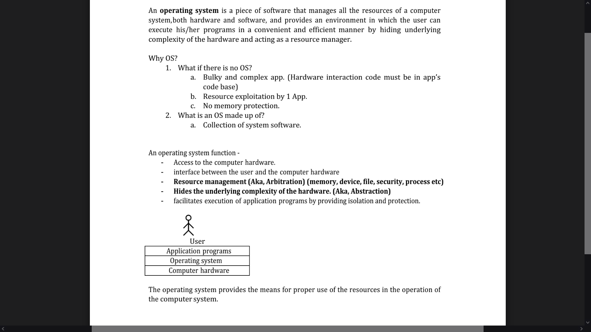
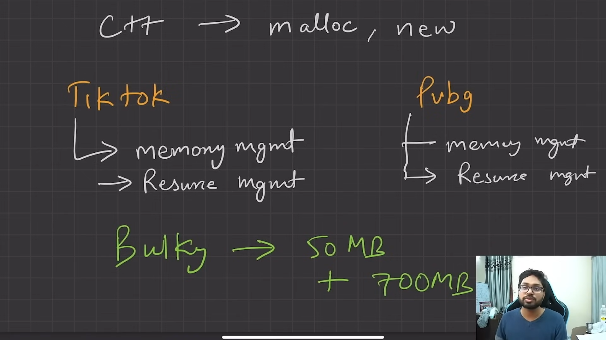
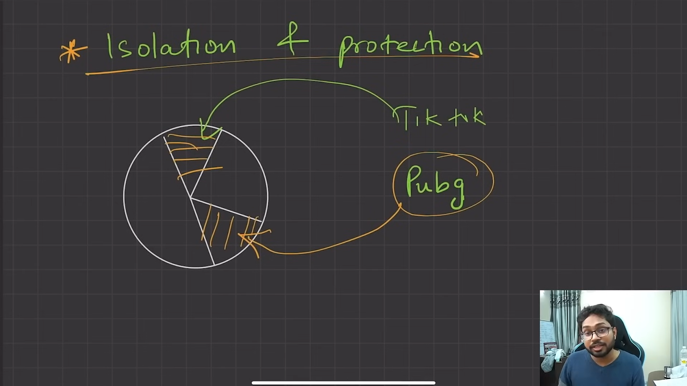
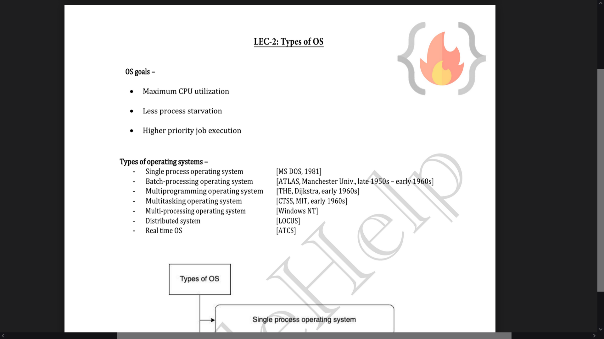
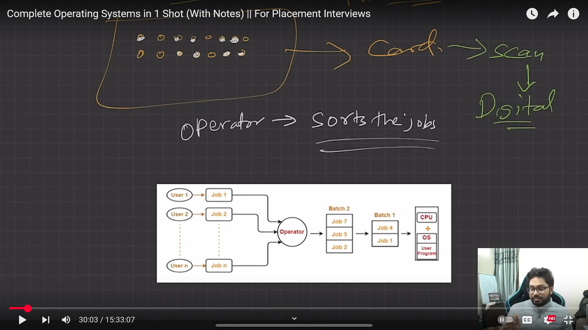
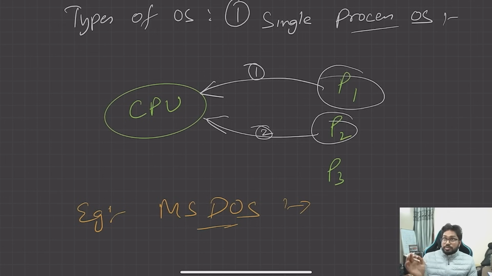
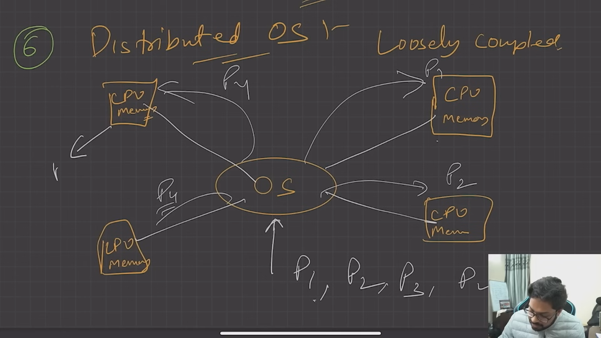
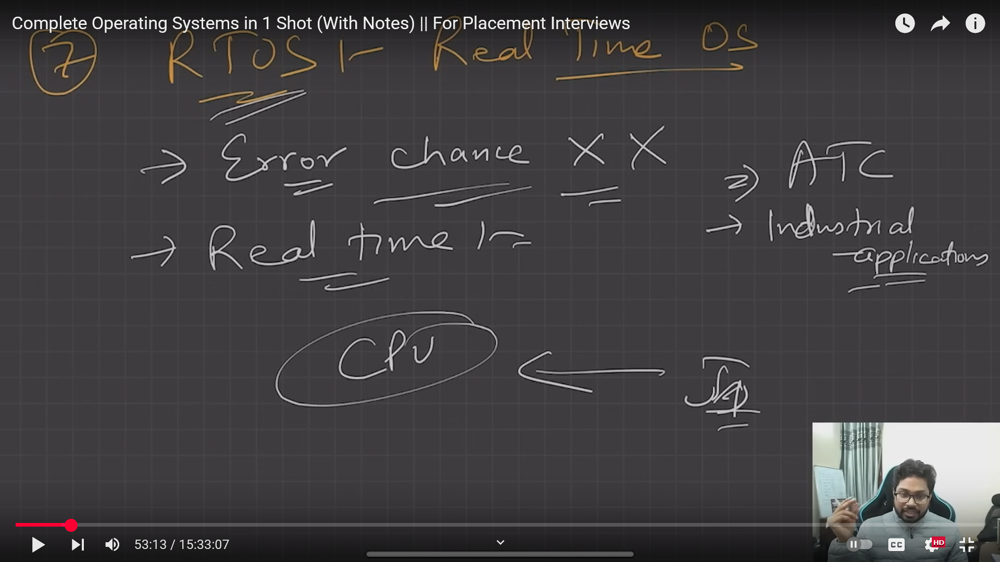

# Operating System and its Need

### ✅ What is an Operating System (OS)?

An **Operating System (OS)** is **system software** that acts as an **intermediary** between the user and the computer hardware. It manages **hardware resources** and provides **services** for running applications.

> 📌 Think of it as the **manager** of the computer: it ensures everything runs smoothly, from programs to hardware interactions.

### ✅ Why Do We Need an Operating System?

Here’s  **why an OS is essential** :

#### 1. **Hardware Management**

* **Controls and coordinates** the use of the CPU, memory, disk drives, printers, etc.
* Without an OS, each app would need to manage all hardware on its own.

#### 2. **Program Execution**

* Loads programs into memory and runs them.
* Handles process creation, scheduling, and termination.

#### 3. **Memory Management**

* Allocates and frees memory space as needed.
* Keeps track of each byte in a system’s memory.

#### 4. **File System Management**

* Provides a way to store, organize, and access data on storage devices.
* Handles file naming, directories, permissions, etc.

#### 5. **User Interface**

* Offers CLI (Command Line Interface) or GUI (Graphical User Interface).
* Makes it easier for users to interact with the computer.

#### 6. **Security and Access Control**

* Protects data and system resources from unauthorized access.
* Manages users and permissions.

#### 7. **Multitasking**

* Allows multiple programs to run at the same time.
* Efficiently switches between tasks using the CPU.

#### 8. **Device Management**

* Manages communication with all input/output devices using drivers.

⭐ As seen above both TikTok and Pubg has to write Memory Mgmt and Resource Mgmt code, therby causing the sytem to software to BULKY + IGNORED the DRY Principle

⭐ Both TikTok and Pubg doesn't know the existance of each other thereby interference of each other 's codebase for max resource utilization, hacking, unethical competition etc

### ✅ Examples of Operating Systems

* **Desktop/Laptop** : Windows, macOS, Linux
* **Mobile** : Android, iOS
* **Server/Cloud** : Ubuntu Server, Red Hat, Windows Server
* **Embedded** : RTOS (Real-time OS), embedded Linux (used in routers, TVs, etc.)

---

# Types of OS

Here's a  **detailed breakdown of the types of Operating Systems** , categorized based on how they handle tasks, users, and hardware:

### ✅ 1. **Batch Operating System**

📌 What it is:

* Users **submit jobs** (programs with data) to the system in a  **batch** .
* The OS **executes jobs one by one** without user interaction during execution.

🛠 How it works:

* Uses **job control language (JCL)** to define job instructions.
* Common in early mainframe systems.

✅ Features:

* No real-time interaction.
* Efficient for processing large volumes of similar jobs.

📍 Example:

* IBM’s early OS like **OS/360**
* ATLAS

🔥 Can it fulfill OS Goals (As shown in Paper)---- No

> ✅ **Batch Operating Systems** **used punch cards** — especially in the early days of computing.
>
> ##### 🟨 What were  **Punch Cards** ?
>
> A **punch card** (also called a  **Hollerith card** ) was a **paper card** where **holes were punched** in specific positions to represent data or instructions. Each card could hold  **one line of code or data** .
>
> ##### 🛠 How Punch Cards Worked in Batch OS:
>
> 1. **Users wrote programs** (e.g., in FORTRAN or COBOL) by **punching holes** into cards — one card per line.
> 2. They submitted a **stack (batch)** of these cards to the computer operator.
> 3. The operator  **fed the cards into a card reader** , which read the holes as input.
> 4. The **Batch OS** stored these jobs, queued them, and ran them  **sequentially** .
> 5. The **output** was printed later, often on **paper printouts** or stored on magnetic tapes.
>
> ##### 🧠 Real-Life Analogy:
>
> Think of punch cards like:
>
> * A **paper version of a USB drive** — you give your "program" to the system.
> * The computer **reads the holes** to understand what to do.
> * But unlike today, you can’t "edit" — you have to **re-punch** a new card if you make a mistake!
>
> ##### 📸 Visual (for imagination):
>
> * A punch card looked like a **rectangular piece of cardboard** with  **rows and columns** .
> * Holes in specific positions = binary code (0s and 1s).

### ✅ 2. **Single-Process Operating System**

* **Meaning** : The OS can execute  **only one process at a time** .
* **Even if a user opens multiple apps** , only  **one can run at a time** .
* No **true multitasking** (not even background processing).

🔸 Examples:

* **MS-DOS** → true single-process OS
  * If you run a program, the entire system is dedicated to that one task.

🔥 Can it fulfill OS Goals (As shown in Paper)---- No

### ✅ 3. Multiprogramming Operating System

A **Multiprogramming Operating System** is an OS that allows **multiple programs** to **reside in memory at the same time** and  **share the CPU** ,  **one at a time** .

> 📌 It increases **CPU utilization** by keeping the CPU  **busy all the time** , switching to another program when one is waiting (e.g., for I/O).

##### 🛠 How Multiprogramming Works:

1. **Multiple programs** are loaded into memory.
2. The **OS picks one program** to run.
3. If the program **needs to wait** (e.g., for input/output), the CPU is **switched** to another ready program.
4. This  **cycle continues** , ensuring the CPU is  **not idle** .

> 🧠 It does **not mean** all programs run  *at the same time* , but they take turns so efficiently that it *feels* like they are.

##### ✅ Key Components in Multiprogramming:

| Component                   | Role                                                      |
| --------------------------- | --------------------------------------------------------- |
| **Job Scheduler**     | Selects which programs to load into memory.               |
| **CPU Scheduler**     | Decides which ready job gets the CPU next.                |
| **Memory Management** | Keeps track of which programs are in memory.              |
| **Context Switching** | Saves and loads the state of processes during CPU switch. |

##### ✅ Features of Multiprogramming OS:

| Feature                                | Description                                                    |
| -------------------------------------- | -------------------------------------------------------------- |
| **Increased CPU Utilization**    | CPU is rarely idle.                                            |
| **Faster Throughput**            | More jobs are completed in less time.                          |
| **Efficient Resource Use**       | Better use of memory, CPU, I/O devices.                        |
| **No user interaction required** | Mainly designed for**batch jobs** , not real-time input. |

##### 📍 Examples of Multiprogramming OS:

* **UNIX (early versions)**
* **IBM OS/360**
* **Windows NT kernel** (also supports multitasking)

🔥 Can it fulfill OS Goals (As shown in Paper)---- Yes, But Not good

### ✅ 4. **Time-Sharing Operating System (Multitasking OS)**

📌 What it is:

* Allows **multiple users** to use a computer  **simultaneously** .
* CPU time is divided into **time slices** and given to each user or task.

✅ Features:

* **Fast switching** between tasks.
* Better CPU utilization.
* Each user gets a quick response.

📍 Example:

* UNIX, Multics, Windows (modern versions), Linux

🔥 Can it fulfill OS Goals (As shown in Paper)---- Yes, better then Multiprogramming

> ##### ✅ Are **Multiprogramming OS** and **Time-Sharing OS** (aka  **Multitasking OS** ) the same?
>
>> **🔸 No, they are not the same — but time-sharing is an **evolution** of multiprogramming.**
>>
>
> They are  **related** , but there are **key differences** in purpose, technology, and user experience.
>
> 🔍 Let's Compare Them:
>
> | Feature                    | **Multiprogramming OS**                             | **Time-Sharing OS (Multitasking)**                                                                                         |
> | -------------------------- | --------------------------------------------------------- | -------------------------------------------------------------------------------------------------------------------------------- |
> | **Purpose**          | Maximize**CPU utilization**                         | Maximize**user interactivity**                                                                                             |
> | **User interaction** | ❌ No direct interaction (batch jobs)                     | ✅ Direct interaction (keyboard, GUI, terminals)                                                                                 |
> | **Switching**        | CPU switches**when a process waits**(e.g., for I/O) | CPU switches**at regular time intervals**(even if process is not waiting)  + when CPU encounters HIGH Priority task |
> | **Response time**    | Not a priority                                            | **Fast response**to users is a goal                                                                                        |
> | **Users supported**  | Usually**one at a time**or in batch                 | **Multiple users at the same time**                                                                                        |
> | **Time slicing**     | ❌ Not used                                               | ✅ Used (each user/process gets a small time slice)                                                                              |
> | **Example**          | IBM OS/360                                                | UNIX, Windows, Linux                                                                                                             |
>
> ##### ⭐Context Switching
>
> **Context switching** is when the CPU **pauses** the current process,  **saves its state** , and **loads the state** of another process.
>
> ##### 🧠 Analogy:
>
> Multiprogramming OS:
>
>> Like a **factory** where a machine works on one product at a time, and only switches when something is blocked (e.g., waiting for a part).
>>
>
> Time-Sharing OS:
>
>> Like a **classroom** where a teacher spends a few seconds answering each student's question in a round-robin fashion — fast switching makes everyone feel engaged.
>>
>
> 🛠 Technical Core:
>
> | Mechanism                                | Multiprogramming     | Time-Sharing                   |
> | ---------------------------------------- | -------------------- | ------------------------------ |
> | **Context switching**              | ✅                   | ✅                             |
> | **Time slicing (clock interrupt)** | ❌                   | ✅                             |
> | **Scheduler**                      | Based on I/O wait    | Based on**quantum time** |
> | **Primary Goal**                   | Keep CPU always busy | Give quick response to users   |
>
> ##### 🔥 Context Switching is present in Time-Sharing OS (Multitasking). But switches only when CPU encounters HIGH Priority task
>
> ##### 🔁 So What’s the Relationship?
>
> * **Time-Sharing OS** is **built on top of** the  **Multiprogramming concept** .
> * Multiprogramming introduced the  **idea of multiple programs in memory** .
> * Time-sharing added  **interactive use** ,  **time slicing** , and  **multi-user support** .

##### ⚖️ Difference Between Related OS Types:

| Type                         | Key Idea                                              | Multitasking?  | Example                      |
| ---------------------------- | ----------------------------------------------------- | -------------- | ---------------------------- |
| **Single-programming** | Only one program in memory                            | ❌             | MS-DOS                       |
| **Multiprogramming**   | Many programs in memory, one runs at a time           | ✅ (simulated) | OS/360                       |
| **Multitasking**       | Programs can be switched rapidly to feel simultaneous | ✅             | Windows, Linux               |
| **Multithreading**     | A single program with multiple threads                | ✅             | Modern OSes                  |
| **Multiprocessing**    | Multiple CPUs process programs truly in parallel      | ✅             | Dual-core/multi-core systems |

> * A **multiprocessing OS** is designed to **simultaneously execute multiple processes** by using  **more than one processing unit (CPU core)** . Hence needs hardware support
> * **Multithreading** is an **OS-level feature** that allows a **single process** to be divided into  **multiple threads** , which can run **concurrently** (i.e., side by side). Hence **Multithreading** OS may or may not have hardware support

### ✅ 5. Multiprocessing Operating System

 ⭐ Multiprocessing OS **does use multiple cores or CPUs**

 ⭐ A **multiprocessing OS** is designed to **simultaneously execute multiple processes** by using  **more than one processing unit (CPU core)** .

##### 🔧 Now OS can do **multiple things at the same time**:

> ✅ If a computer has **multiple CPU cores** (like dual-core, quad-core, octa-core), then the OS can run **true parallel processing** — not just switch quickly, but literally do **multiple things at the same time.**

##### 🔸 Example:

| Term                         | What It Means                                                                     |
| ---------------------------- | --------------------------------------------------------------------------------- |
| **Single-core CPU**    | One process at a time (even in multitasking, only one executes at a time)         |
| **Dual-core CPU**      | Two processes can truly run at the same time                                      |
| **Quad-core CPU**      | Four processes can run in parallel                                                |
| **Multiprocessing OS** | Uses these cores efficiently to**assign tasks/processes**to different cores |

##### ✅ Features of Multiprocessing OS:

* **True parallelism** (not just fast switching)
* Better **performance** and **throughput**
* More efficient use of **multi-core processors**
* Can handle more **complex or resource-intensive** tasks

##### 🧠 Analogy:

> Imagine you're in a kitchen:
>
> * With **1 chef** (single-core): only one dish at a time.
> * With **4 chefs** (quad-core): 4 dishes cooking  **simultaneously** .

##### 🖥 Examples of Multiprocessing OS:

* **Modern OSes** like:
  * **Windows 10/11**
  * **macOS**
  * **Linux distros (Ubuntu, Fedora, etc.)**
* These OSes are built to  **take full advantage of multi-core CPUs** .

### ✅ 6. **Distributed Operating System**

📌 What it is:

* Controls a **group of independent computers** (networked) and makes them appear as  **a single system** .

✅ Features:

* **Resource sharing** (files, CPU, memory) across machines.
* Improved  **fault tolerance** .
* Supports  **load balancing** .

📍 Example:

* Amoeba, Apache Mesos, Plan 9

### ✅ 7. **Real-Time Operating System (RTOS)**

📌 What it is:

* Processes data and responds within  **strict time limits** .
* Used in **embedded systems** and  **critical environments** .

✅ Two types:

* **Hard Real-Time OS** : Must complete tasks **exactly on time** (e.g., in medical or defense systems or Air Traffic Control).
* **Soft Real-Time OS** : Timing is important but **not critical** (e.g., video streaming).

✅ Features:

* Deterministic response.
* Minimal latency.
* Prioritizes critical tasks.

📍 Example:

* VxWorks, FreeRTOS, QNX, RTLinux

### ✅ 8. **Network Operating System (NOS)**

📌 What it is:

* Allows **computers on a network** to communicate, share files, printers, etc.
* Manages  **network resources** .

✅ Features:

* Centralized administration.
* Remote access support.
* Security and multi-user support.

📍 Example:

* Novell NetWare, Windows Server, UNIX/Linux with NFS or Samba

> ##### ✅ Distributed Operating System (DOS)  vs.  ✅ **Network Operating System (NOS)**
>
> ###### 🔹 1. What is a **Network Operating System (NOS)?**
>
> ✅ Definition:
>
> A **Network OS** is a system that allows **independent computers** (clients and servers) to communicate,  **share files** , printers, and other resources  **over a network** .
>
>> But each machine still runs its  **own OS** , and users must  **explicitly log in and access resources remotely** .
>>
>
> 🔧 Key Characteristics:
>
> * Computers are **loosely connected**
> * Each system is **aware it's a separate machine**
> * Resource sharing is **manual** (you choose to connect)
> * Fault tolerance is **limited**
>
> ###### 🔹 2. What is a **Distributed Operating System (DOS)?**
>
> ✅ Definition:
>
> A **Distributed OS** is an OS that manages a **collection of independent computers** and presents them to users as a  **single unified system** .
>
>> It hides the fact that multiple computers are involved. The user sees  **one logical system** .
>>
>
> 🔧 Key Characteristics:
>
> * Strong  **transparency** : access, location, and even failures may be hidden
> * Automatic  **task distribution** ,  **load balancing** , and **resource management**
> * Looks like a **single system** to the user
> * Often more fault-tolerant and scalable
>
> 🔁 Detailed Comparison Table:
>
> | Feature                   | **Network OS**                                  | **Distributed OS**                                             |
> | ------------------------- | ----------------------------------------------------- | -------------------------------------------------------------------- |
> | **System View**     | Many separate systems                                 | One unified system                                                   |
> | **Transparency**    | ❌ Low (user sees the network and must connect to it) | ✅ High (user doesn't need to know where files/programs are located) |
> | **Resource Access** | Manual and explicit                                   | Automatic and often hidden                                           |
> | **Memory & CPU**    | Local to each machine                                 | Treated as a**global pool**                                    |
> | **User Management** | Separate per system                                   | Unified across all systems                                           |
> | **Fault Tolerance** | Limited (failure of one system may disrupt work)      | High (workload can shift to other systems)                           |
> | **Communication**   | Message-passing between systems                       | Built-in OS-level communication mechanisms                           |
> | **Scalability**     | Limited                                               | Highly scalable                                                      |
> | **Examples**        | Windows Server, Novell NetWare                        | Amoeba, Plan 9, Google Borg                                          |
>
> ##### 🧠 Analogy:
>
> | OS Type                  | Analogy                                                                                                                             |
> | ------------------------ | ----------------------------------------------------------------------------------------------------------------------------------- |
> | **Network OS**     | Like**a group of houses**in a neighborhood: each house is independent, but they can visit and borrow things from each other.  |
> | **Distributed OS** | Like**a single smart home**with multiple rooms — no matter where you are, you can control everything from one central panel. |

### ✅ 9. **Mobile Operating System**

📌 What it is:

* Specifically designed to run on **mobile devices** (smartphones, tablets).
* Optimized for  **touch interfaces** , low power consumption, and mobility.

✅ Features:

* Touch input support.
* Cellular connectivity.
* Mobile app ecosystems.

📍 Example:

* Android, iOS, KaiOS

### ✅ 10. **Multi-User Operating System**

📌 What it is:

* Supports **multiple users simultaneously** on one system.
* Keeps user processes and data separate.

🔧 Key Features:

* Each user has their **own session**
* The OS keeps **user data, processes, and permissions isolated**
* **Resource sharing** (CPU, memory, printers) is managed by the OS

✅ Other Features:

* Security between users.
* Resource sharing.
* Used in server environments.

📍 Example:

* UNIX, Linux, Windows Server

### ✅ 11. **Single-User Operating System**

📌 What it is:

* Designed for  **one user at a time** .
* Can be **single-tasking** or  **multi-tasking** .

📍 Example:

* MS-DOS (single-tasking)
* Windows 10, macOS (multi-tasking)

### ✅ 12. **Embedded Operating System**

📌 What it is:

* Built for **specific hardware** devices with limited functions.
* Highly **optimized** and  **lightweight** .

✅ Features:

* Small memory footprint.
* Real-time features.
* Stable and reliable.

📍 Example:

* Embedded Linux, FreeRTOS, Windows IoT, Zephyr

## ✅ Summary Table:

| Type            | Multi-user | Real-time    | Example              | Use Case                     |
| --------------- | ---------- | ------------ | -------------------- | ---------------------------- |
| Batch OS        | ❌         | ❌           | OS/360               | Job processing on mainframes |
| Time-Sharing OS | ✅         | ❌           | UNIX, Linux          | Multi-user environments      |
| Distributed OS  | ✅         | ❌           | Amoeba, Plan 9       | Cluster systems              |
| Real-Time OS    | ✅         | ✅           | FreeRTOS, QNX        | Industrial/medical systems   |
| Network OS      | ✅         | ❌           | Windows Server       | LAN/WAN systems              |
| Mobile OS       | ❌         | ❌           | Android, iOS         | Smartphones, tablets         |
| Multi-user OS   | ✅         | ❌           | UNIX, Windows Server | Shared systems               |
| Single-user OS  | ❌         | ❌           | MS-DOS, Windows 10   | PCs and laptops              |
| Embedded OS     | ❌         | ✅ (usually) | FreeRTOS, Zephyr     | Routers, IoT devices         |

---
