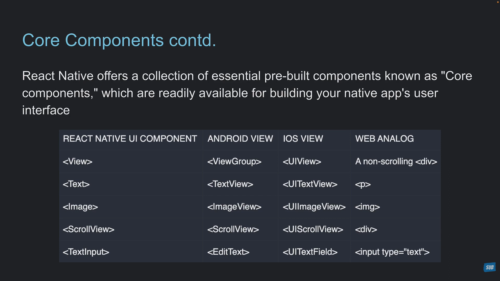

# ----React Native Roadmap (2026)

This roadmap reflects the **modern React Native ecosystem (2026)** with the New Architecture, Expo, TypeScript, and production-ready practices.

### 🟢 Phase 1: Foundations

> Goal: Understand what React Native is and how it works.

**React Native Basics**

* ✅ What is React Native?
* ✅ React Native vs React
* ✅ React Native vs Flutter
* ✅ React Native Architecture
* ✅ JavaScript Runtime (Hermes)
* ✅ JSI
* ✅ Fabric
* ✅ TurboModules
* ✅ React Native New Architecture
* ✅ Native vs Hybrid
* ✅ Metro Bundler
* ✅ Babel
* ✅ Fast Refresh
* ✅ Hot Reload vs Live Reload
* ✅ Hermes Bytecode
* ✅ Expo vs Bare React Native

### 🟢 Phase 2: Environment Setup

**Development Environment**

* Node.js
* npm
* Yarn
* pnpm
* Expo CLI
* Android Studio
* Android Emulator
* Xcode (macOS)
* iOS Simulator
* Physical Device Debugging
* USB Debugging
* ADB
* Environment Variables

### 🟢 Phase 3: React Native Components

**Core Components**

* View
* Text
* Image
* ImageBackground
* Button
* Pressable
* TouchableOpacity
* TextInput
* ScrollView
* FlatList
* SectionList
* SafeAreaView
* Modal
* ActivityIndicator
* Switch
* StatusBar
* KeyboardAvoidingView
* RefreshControl

### 🟢 Phase 4: Styling

* Flexbox
* StyleSheet
* Dimensions
* Responsive UI
* PixelRatio
* Platform API
* Dark Mode
* Themes
* Custom Fonts
* Icons
* SVG
* Linear Gradient

### 🟢 Phase 5: Navigation

**React Navigation**

* Stack Navigation
* Bottom Tabs
* Top Tabs
* Drawer
* Nested Navigation
* Deep Linking
* Authentication Flow
* Navigation Params
* Dynamic Routing
* Expo Router
* File-based Routing

### 🟢 Phase 8: State Management

Local State

* useState

Global State

* Context API
* Redux Toolkit
* Zustand
* Jotai
* MobX
* React Query (TanStack Query)

### 🟢 Phase 9: Networking

* fetch
* Axios
* REST APIs
* GraphQL
* Authentication
* JWT
* Refresh Tokens
* Cookies
* File Upload
* Multipart Form
* WebSocket
* Socket.IO
* SSE

### 🟢 Phase 10: Storage

* AsyncStorage
* MMKV
* SQLite
* Realm
* WatermelonDB
* SecureStore
* Keychain
* Encrypted Storage

### 🟢 Phase 11: Device APIs

Camera

Gallery

GPS

Bluetooth

NFC

Fingerprint

Face ID

Accelerometer

Gyroscope

Compass

Microphone

Contacts

Calendar

SMS

Phone Call

Clipboard

Share API

Push Notifications

Local Notifications

Background Tasks

Foreground Services

Deep Linking

Biometrics

QR Scanner

Barcode Scanner

Files

Downloads

Uploads

Network Detection

Battery Status

Device Info

### 🟢 Phase 12: Permissions

Android Permissions

iOS Permissions

Runtime Permissions

Permission Handling

Permission Recovery

### 🟢 Phase 13: Forms

* React Hook Form
* Formik
* Zod
* Yup
* Validation
* Error Handling

### 🟢 Phase 14: Animations

Basic

* Animated API

Modern

* Reanimated
* Gesture Handler
* Shared Transitions
* Layout Animations
* Bottom Sheets
* Lottie

### 🟢 Phase 15: Performance Optimization

* FlatList Optimization
* Memoization
* Lazy Loading
* Code Splitting
* Image Optimization
* Hermes Optimization
* FlashList
* Fabric Rendering
* Startup Optimization
* Bundle Optimization

### 🟢 Phase 16: Native Modules

* Native Modules
* TurboModules
* JSI
* Native UI Components
* Bridging
* Kotlin Modules
* Swift Modules
* C++ Integration

### 🟢 Phase 17: Expo Ecosystem

* Expo SDK
* Expo CLI
* Expo Router
* Expo Go
* Development Builds
* Config Plugins
* EAS Build
* EAS Update
* EAS Submit
* EAS Hosting
* EAS Workflows
* Expo Orbit
* EAS Observe
* EAS Insights

### 🟢 Phase 18: Authentication

* Email Login
* OTP
* Google Login
* Apple Login
* Facebook Login
* Passkeys
* OAuth
* JWT
* Refresh Tokens
* Secure Storage

### 🟢 Phase 19: Media

* Images
* Video
* Audio
* Streaming
* Compression
* Cropping
* Image Picker
* Camera
* PDF
* Document Picker

### 🟢 Phase 20: Offline Apps

* Offline Storage
* Sync Engine
* Queue System
* Retry Logic
* Conflict Resolution
* Background Sync

### 🟢 Phase 21: Maps

* Google Maps
* Apple Maps
* Markers
* Polylines
* Geofencing
* Live Tracking
* Navigation

### 🟢 Phase 22: Payments

* Stripe
* Razorpay
* Google Pay
* Apple Pay
* In-App Purchases
* Subscriptions

### 🟢 Phase 23: Testing

* Jest
* React Native Testing Library
* Unit Testing
* Integration Testing
* End-to-End Testing (Detox)
* Snapshot Testing

### 🟢 Phase 24: Debugging

* React DevTools
* Flipper (where applicable)
* Expo DevTools
* Network Debugging
* Performance Profiling
* Memory Leaks
* Crash Analysis

### 🟢 Phase 25: Deployment

Android

* APK
* AAB
* Signing
* Play Console
* Internal Testing
* Closed Testing
* Production Release

iOS

* IPA
* Certificates
* Provisioning Profiles
* TestFlight
* App Store Connect

### 🟢 Phase 26: CI/CD

* GitHub Actions
* Bitrise
* Codemagic
* EAS Workflows
* Fastlane
* Automated Builds
* Automated Testing
* Automated Deployment

### 🟢 Phase 27: Monitoring

* Sentry
* Crashlytics
* Expo Observe
* Expo Insights
* Analytics
* Firebase Analytics
* PostHog
* LogRocket
* Performance Monitoring

### 🟢 Phase 28: Security

* Certificate Pinning
* SSL
* HTTPS
* Secure Storage
* Obfuscation
* Root Detection
* Jailbreak Detection
* API Security
* Environment Secrets

### 🟢 Phase 29: Advanced React Native

* Monorepo
* TurboRepo
* Nx
* Module Federation Concepts
* White Label Apps
* OTA Strategy
* Feature Flags
* Micro Frontends (where appropriate)
* Background Processing
* Headless JS

### 🟢 Phase 30: Architecture & Design Patterns

* Feature-Based Architecture
* Clean Architecture
* MVVM
* Repository Pattern
* Dependency Injection
* SOLID Principles
* Scalable Folder Structures
* Error Boundaries

### 🟢 Phase 31: AI Integration (2026)

* OpenAI APIs
* Google Gemini APIs
* Anthropic APIs
* AI Chat UI
* AI Streaming Responses
* Voice AI
* Image Generation APIs
* AI Agents
* MCP Integration (where applicable)
* Local AI Models (when needed)

### 🟢 Phase 32: Production Best Practices

* App Versioning
* OTA Rollouts
* Feature Flags
* Remote Config
* Accessibility (A11y)
* Localization (i18n)
* RTL Support
* Logging
* Error Recovery
* App Performance Budgets
* Release Management

### 🎯 Suggested Learning Order for You

Considering your strong React/MERN background and your goal of building business applications for CreoGrid, I'd recommend this sequence:

1. **Foundation & Architecture** (Phases 1–2)
2. **React Native Components & Styling** (Phases 5–6)
3. **Navigation** (Phase 7)
4. **Networking & Storage** (Phases 9–10)
5. **Device APIs & Permissions** (Phases 11–12)
6. **Expo Ecosystem** (Phase 17)
7. **Authentication & Media** (Phases 18–19)
8. **Animations & Performance** (Phases 14–15)
9. **Deployment, OTA & Monitoring** (Phases 25–27)
10. **Architecture, Security & AI Integration** (Phases 28–32)

By the end of these phases, you'll be equipped to build and maintain production-grade mobile apps comparable to those used by modern SaaS companies.

---

# ----React Native Introduction

### 📱 What is React Native?

**React Native** is an open-source framework developed by **Meta (Facebook)** for building **native mobile applications** using  **JavaScript/TypeScript and React** .

Instead of writing separate apps in:

* Android → **Kotlin/Java**
* iPhone → **Swift/Objective-C**

you write  **one React Native codebase** , and it runs on  **both Android and iOS** .

### 🚀 How React Native Works

```
React Components
        │
        ▼
React Native
        │
        ▼
Native Android UI (Kotlin/Java)
Native iOS UI (Swift)
```

Unlike hybrid frameworks that display a webpage inside an app, React Native renders  **real native UI components** .

For example:

```jsx
<Text>Hello World</Text>
```

becomes

* Android → Native `TextView`
* iPhone → Native `UILabel`

So the app feels like a real native app.

### 🧩 React Native vs React.js

They are very similar but target different platforms.

| React.js    | React Native      |
| ----------- | ----------------- |
| Websites    | Mobile Apps       |
| HTML        | Native Components |
| CSS         | StyleSheet        |
| Browser DOM | Native UI         |
| Chrome      | Android & iPhone  |

React Native uses components like:

```jsx
<View>
<Text>
<Image>
<ScrollView>
<FlatList>
<TextInput>
<Button>
```

instead of

```html
<div>
<p>

<input>
```

### 🏗 Example

**React Web**

```jsx
function App() {
  return (
    <div>
      <h1>Hello</h1>
    </div>
  );
}
```

**React Native**

```jsx
import { View, Text } from "react-native";

export default function App() {
  return (
    <View>
      <Text>Hello</Text>
    </View>
  );
}
```

Notice:

* No HTML
* No CSS files
* Uses React Native components

### 🎨 Styling

Instead of CSS

```css
.container{
  display:flex;
}
```

React Native uses JavaScript objects.

```jsx
const styles = StyleSheet.create({
  container:{
    flex:1,
    justifyContent:"center",
    alignItems:"center"
  }
})
```

### ⚙️ What Languages are Used?

Mostly

* JavaScript
* TypeScript (recommended)
* React

Sometimes native code:

* Kotlin
* Java
* Swift
* Objective-C

only if you need special device features or native modules.

### 📦 Can React Native Access Phone Features?

Yes.

Examples:

* Camera
* GPS
* Bluetooth
* Fingerprint
* Face ID
* Push Notifications
* Contacts
* NFC
* Microphone
* Files
* Sensors

through built-in APIs or libraries.

### 📂 Typical Project Structure

```
my-app/

src/
   components/
   screens/
   navigation/
   hooks/
   services/
   utils/

App.tsx
package.json
```

Very similar to a React project.

### 🧭 Navigation

Since there's no browser, routing is handled by libraries like React Navigation.

Example:

```
Home Screen

↓

Product Screen

↓

Checkout Screen

↓

Payment Screen
```

### 🌐 API Calls

Exactly like React.

```js
fetch("/api")
```

or

```js
axios.get(...)
```

Your existing Node.js backend works without changes.

### 💾 Local Storage

Instead of browser `localStorage`, React Native commonly uses:

* AsyncStorage
* SQLite
* Realm
* MMKV

### 📈 Performance

React Native performance is generally  **very good** .

It's suitable for:

* E-commerce apps
* Chat apps
* Social media
* Banking apps
* Food delivery
* Business apps
* ERP
* CRM
* School apps
* Hospital apps

Very graphics-intensive games are usually better built with game engines like Unity or Unreal.

### 🆚 React Native vs Flutter

| React Native                  | Flutter                     |
| ----------------------------- | --------------------------- |
| JavaScript/TypeScript         | Dart                        |
| Uses React                    | Uses Flutter widgets        |
| Native UI bridge              | Own rendering engine        |
| Easier for React developers   | Requires learning Dart      |
| Large JavaScript ecosystem    | Excellent UI consistency    |
| Strong business app ecosystem | Excellent custom animations |

If you already know React, React Native is usually the quicker path.

### 🏢 Who Uses React Native?

Many well-known companies have used React Native for parts of their mobile apps, including:

* Meta (Facebook)
* Instagram
* Shopify
* Discord
* Microsoft
* Wix

### 💼 Should You Learn React Native?

Based on your background,  **yes** .

You already know:

* ✅ React
* ✅ JavaScript
* ✅ TypeScript
* ✅ Node.js
* ✅ REST APIs
* ✅ MERN architecture

React Native mainly requires learning:

* Mobile-specific UI components (`View`, `Text`, etc.)
* Navigation
* Mobile permissions
* Device APIs
* App publishing for Android and iOS

Because you already have React experience, the learning curve is much smaller than starting mobile development from scratch.

### 🎯 How It Fits with Your MERN Skills

```
MongoDB
     ↑
Node.js API
     ↑
Express
     ↑
React Native Mobile App
```

or

```
MongoDB
     ↑
Node.js API
     ↑
Express
     ↑
React Website
     │
React Native Mobile App
```

You can reuse the **same backend** for both your web app and your mobile app, making it a natural extension of the MERN stack.

### 📚 A Practical Learning Roadmap

1. Learn React Native fundamentals (`View`, `Text`, `Image`, `StyleSheet`)
2. Build layouts with Flexbox
3. Learn React Navigation
4. Handle forms and input
5. Consume REST APIs
6. Use AsyncStorage or another local database
7. Access device features (camera, location, notifications)
8. Build complete apps and publish them

For someone already comfortable with React, you can become productive in React Native much faster than learning native Android (Kotlin) and iOS (Swift) separately.

---

# ----React Native Vs Flutter (as of Jul 2026)

Since you're already a **MERN developer** and are building **CreoGrid** (ERP, CRM, AI automation, hospital, school, restaurant apps), let's compare them from a  **2026 perspective** , not how they were in 2021–2023.

### ⚡ Executive Summary

| Category            | 🟦 React Native                  | 🟦 Flutter      |
| ------------------- | -------------------------------- | --------------- |
| Language            | JavaScript / TypeScript          | Dart            |
| Company             | Meta                             | Google          |
| Learning Curve      | ⭐⭐⭐⭐⭐ Easy (for React devs) | ⭐⭐⭐ Moderate |
| Performance         | 9.2/10                           | 9.6/10          |
| Native Feel         | 10/10                            | 9.5/10          |
| UI Consistency      | 9/10                             | 10/10           |
| Ecosystem           | 10/10                            | 9/10            |
| Hiring Market       | ⭐⭐⭐⭐⭐                       | ⭐⭐⭐          |
| Community           | Larger                           | Large           |
| Startup Adoption    | Very High                        | High            |
| Enterprise Adoption | Very High                        | Medium-High     |
| Long-term Outlook   | Excellent                        | Good-Excellent  |

### 🚀 Performance

This used to be Flutter's biggest advantage.

In 2026...

**🟦 Flutter**

Flutter still wins on raw rendering speed because:

* Own rendering engine
* No dependency on native widgets
* Excellent animation performance
* Very consistent 60/120 FPS
* Lower UI rendering overhead

Flutter is particularly strong for:

* heavy animations
* highly custom interfaces
* graphics-rich apps

**🟦 React Native**

Historically, React Native was slower due to the old JavaScript bridge.

That has changed significantly with the **New Architecture** (Fabric + TurboModules + JSI), reducing bridge overhead and improving startup time, responsiveness, and native integration. ([React Native](https://reactnative.dev/?utm_source=chatgpt.com "React Native · Learn once, write anywhere"))

For most business applications, the performance difference is now small.

Typical business apps:

* CRM
* ERP
* Banking
* Delivery
* Social apps
* Chat
* E-commerce

Users generally won't notice a difference.

**🏆 Winner**

Flutter by a small margin.

### ⚡ Speed of Development

React Native wins.

Why?

Because:

* JavaScript
* TypeScript
* React
* NPM ecosystem
* Reuse React knowledge
* Huge number of libraries

If you're already a React developer...

You can often become productive in React Native within days.

Learning Flutter means learning:

* Dart
* Flutter widgets
* Flutter state management
* Flutter ecosystem

**🏆 Winner**

React Native

### 🎨 UI

**-- Flutter**

* Every pixel is drawn by Flutter.

Meaning

Android

↓

Flutter draws

iPhone

↓

Flutter draws

Same result.

Perfect consistency.

**-- React Native**

* Uses actual platform components.

Android

↓

Android widgets

iPhone

↓

iOS widgets

Looks more naturally native.

**-- Winner?**

Depends.

Want identical UI?

Flutter.

Want apps that feel naturally at home on each platform?

React Native.

### 🏎 Startup Time

**Flutter**

* Slightly faster.

**React Native**

* Much improved since the new architecture.

Difference today is relatively minor for typical business apps. ([React Native](https://reactnative.dev/?utm_source=chatgpt.com "React Native · Learn once, write anywhere"))

### 🧠 Memory Usage

Flutter

Usually slightly higher because:

* carries its rendering engine
* bundles more runtime components

React Native

Usually somewhat lighter because it uses native UI components.

The exact difference depends on the app.

### 🎞 Animations

Flutter wins.

Complex animations are easier.

* Games, Charts,
* Interactive graphics
* Custom transitions

Flutter is outstanding.

### 🔌 Native APIs

Both are excellent.

- Camera,  Bluetooth, GPS, NFC, Biometrics, Push notifications, Files, Sensors, etc

Both have mature solutions.

React Native benefits from its huge JavaScript ecosystem, while Flutter has strong official and community packages.

### 🌍 Web Support

**Flutter**

* Supports Web.
* However Flutter Web is best when you're building a Flutter app that also needs a web target.

**React Native**

* Usually paired with React for the web (or React Native Web in some cases).
* If your company already builds React websites, React Native integrates naturally into that ecosystem.

### 💼 Job Market (2026)

React Native has the larger hiring market overall.

Reasons:

* Massive React ecosystem
* JavaScript dominance
* Easier hiring
* Easier onboarding
* Many companies already use React on the web

Flutter has a healthy market, but React Native generally has broader demand. ([Wikipedia](https://en.wikipedia.org/wiki/React_Native?utm_source=chatgpt.com "React Native"))

### 🏢 Enterprise Adoption

React Native

Large organizations including Meta, Microsoft, Shopify, and others use it in production. ([Wikipedia](https://en.wikipedia.org/wiki/React_Native?utm_source=chatgpt.com "React Native"))

Flutter

Used by many companies as well, especially where consistent UI across platforms is a priority. ([Wikipedia](https://en.wikipedia.org/wiki/Flutter_%28software%29?utm_source=chatgpt.com "Flutter (software)"))

Both are production-ready.

### 🔮 Future

This is the interesting part.

**🟦 React Native**

Positives

✅ Backed by Meta

✅ Huge React ecosystem

✅ New Architecture has addressed many historic performance concerns

✅ TypeScript ecosystem

✅ AI coding tools generate React/TypeScript particularly well

Potential concern

* Mobile isn't Meta's only focus.

Still, React Native continues to receive active investment and ecosystem support. ([React Native](https://reactnative.dev/?utm_source=chatgpt.com "React Native · Learn once, write anywhere"))

**🟦 Flutter**

Positives

✅ Google keeps improving it.

✅ Recent work has focused on rendering, desktop, foldables, and broader platform support. ([Wikipedia](https://en.wikipedia.org/wiki/Flutter_%28software%29?utm_source=chatgpt.com "Flutter (software)"))

Potential concern

* Flutter depends heavily on Dart.

Dart remains far less widely used outside Flutter than JavaScript/TypeScript, which can make hiring and ecosystem breadth more limited.

### 🤖 AI Era

This is something many developers overlook.

AI models generate: JavaScript, TypeScript, React, Node far more frequently than Dart.

That means:

* more examples
* more libraries
* faster debugging
* better AI assistance

This isn't because Dart is inferior—it's because JavaScript/TypeScript has a much larger ecosystem and code corpus.

### 💰 Which is Better for a Startup?

Suppose you build:

* Restaurant ERP
* Hospital ERP
* School ERP
* CRM
* HRMS
* AI Automation
* Inventory
* Sales App

React Native lets you share skills, architecture, and backend knowledge with your existing React and Node stack.

That reduces context switching and hiring complexity.

### 🎯 Recommendation for You

Considering:

* ✅ Strong React and MERN experience
* ✅ Building SaaS products for CreoGrid
* ✅ Existing Node.js backend
* ✅ React web frontends
* ✅ Focus on business software rather than graphics-heavy apps

I would recommend  **React Native** .

Not because Flutter is weaker—it isn't. Flutter still has a slight edge in raw rendering performance and highly customized UI.

But for your goals, React Native offers:

* Faster learning
* Better code reuse
* Larger hiring pool
* Excellent AI assistance
* Strong ecosystem alignment with your existing stack
* Performance that is more than sufficient for ERP, CRM, and automation apps

The productivity gains and ecosystem fit are likely to matter more than Flutter's small performance advantage for the kinds of applications you plan to build.

---

# ----JSI In detail

### 🧠 What is JSI (JavaScript Interface)?

**JSI (JavaScript Interface)** is one of the biggest architectural improvements in React Native.

Its goal is simple:

> **Allow JavaScript and native code (C++, Kotlin/Java, Swift/Objective-C) to communicate directly, without going through the old bridge.**
>
> **ALSO MODULES LOAD ON DEMAND INSTEAD OF LOADING AT START UP**

This is a major reason React Native became much faster and more responsive.

### 🏗️ The Old Architecture (Before JSI)

Before JSI, communication looked like this:

```text
JavaScript
      │
      ▼
React Native Bridge
      │
      ▼
Native Android/iOS
```

Imagine your JavaScript wanted to update 500 items in a list.

It had to:

1. Convert the data into JSON
2. Send it across the bridge
3. Native side deserializes it
4. Execute the work
5. Send results back through the bridge

Every interaction crossed the bridge.

### 🚦 Why Was the Bridge Slow?

Suppose you call:

```javascript
camera.takePhoto()
```

With the old bridge:

```text
JavaScript

↓

Convert to JSON

↓

Bridge

↓

Native Camera

↓

Bridge

↓

JavaScript
```

This added overhead because:

* Serialization (objects → transferable format)
* Deserialization
* Asynchronous message queues
* Thread switching

One call isn't a problem.

Thousands of calls per second become expensive.

Examples:

* Animated lists
* Maps
* Charts
* Gestures
* Camera preview
* Drag & drop

### 🚀 JSI Removes the Bridge

With JSI:

```text
JavaScript

↓

Native Function
```

No JSON bridge.

No message queue.

No serialization for every interaction.

JavaScript can directly invoke native functions exposed through JSI.

### 🏎️ Example

Imagine this native function exists:

```cpp
add(5, 10)
```

With JSI, JavaScript can call it almost like a normal function:

```javascript
NativeMath.add(5, 10)
```

Internally:

```text
JavaScript

↓

C++

↓

Native code
```

Much less overhead than the old bridge model.

### 📊 Old Bridge vs JSI

**-- Old Bridge**

```text
JS

↓

Serialize

↓

Bridge

↓

Deserialize

↓

Native

↓

Serialize

↓

Bridge

↓

Deserialize

↓

JS
```

**--JSI**

```text
JS

↓

Native Function
```

Much shorter path.

> #### 🧠 Whats Happening ?
>
> * **JavaScript is *not* compiled into C++, if you have misunderstood so.**
>
> Instead:
>
> ```text
> Your JavaScript/TypeScript
>           │
>           ▼
> JavaScript Engine (Hermes)
>           │
>           ▼
> Runs JavaScript bytecode
>           │
>           ▼
> JSI (C++ Interface)
>           │
>           ▼
> Native Modules (Kotlin/Java or Swift/Objective-C)
> ```
>
> The **C++** part is the  **JSI layer** , not a translation target for your JavaScript.
>
> #### ⚙️ What Happens to Your JavaScript?
>
> Suppose you write:
>
> ```javascript
> camera.takePhoto();
> ```
>
> This JavaScript is  **not converted into C++** .
>
> Instead:
>
> 1. Your JS/TS is bundled.
> 2. Hermes compiles it into **Javascript bytecode.**
> 3. **Hermes executes that bytecode.**
> 4. **When it reaches `camera.takePhoto()`, Hermes calls into the JSI layer.**
> 5. **JSI invokes the appropriate native implementation.**
>
> #### 🧩 Where Does C++ Come In?
>
> JSI itself is written in  **C++** .
>
> Think of it like this:
>
> ```text
> JavaScript
>      │
>      ▼
> Hermes Runtime
>      │
>      ▼
> JSI (C++)
>      │
>      ▼
> Kotlin / Java (Android)
>
> or
>
> Swift / Objective-C (iOS)
> ```
>
> The C++ layer acts as a common interface between the JavaScript runtime and the platform-specific code.
>
> #### 📱 What Does "Native" Mean?
>
> On  **Android** , native code is typically:
>
> * Kotlin (modern)
> * Java (older code or existing libraries)
>
> On  **iOS** , native code is typically:
>
> * Swift (modern)
> * Objective-C (older frameworks and libraries)
>
> So if you call:
>
> ```javascript
> camera.takePhoto();
> ```
>
> React Native ultimately executes something like:
>
> ```text
> Android
> JS
>  ↓
> Hermes
>  ↓
> JSI (C++)
>  ↓
> Kotlin Camera API
> ```
>
> or
>
> ```text
> iPhone
> JS
>  ↓
> Hermes
>  ↓
> JSI (C++)
>  ↓
> Swift Camera API
> ```
>
> #### 🤔 Why Use C++ Instead of Calling Kotlin or Swift Directly?
>
> Because React Native supports multiple platforms.
>
> Without C++:
>
> ```text
> JS
>  ↓
> Kotlin (Android)
>
> JS
>  ↓
> Swift (iOS)
> ```
>
> You'd need separate communication mechanisms for each platform.
>
> With JSI:
>
> ```text
>            JavaScript
>                 │
>                 ▼
>           Hermes Runtime
>                 │
>                 ▼
>            JSI (C++)
>            /         \
>           ▼           ▼
>  Android (Kotlin)   iOS (Swift)
> ```
>
> One common interface can work across platforms, while each platform still provides its own native implementation.
>
> #### 🏭 Think of It Like a Translator
>
> Imagine:
>
> * You speak **English** (JavaScript).
> * Android speaks  **Kotlin** .
> * iPhone speaks  **Swift** .
>
> JSI is like a professional interpreter.
>
> You don't become the interpreter—you still speak English. The interpreter simply relays your request efficiently to whoever needs to execute it.
>
> #### 🎯 The Correct Mental Model
>
> Instead of thinking:
>
> ```text
> JavaScript
>       ↓
> C++
>       ↓
> Kotlin
> ```
>
> Think:
>
> ```text
> JavaScript
>       │
>       ▼
> Compiled and Executed by Hermes
>       │
>       ▼
> Calls through JSI (implemented in C++)
>       │
>       ▼
> Native platform code
> (Kotlin/Java on Android,
>  Swift/Objective-C on iOS)
> ```
>
> So  **your JavaScript never becomes C++** . The C++ code is part of React Native's runtime infrastructure that enables fast communication with the native platform.

### 🎯 Why This Matters

Think about a scrolling list.

Every frame may involve:

* Position updates
* Touch events
* Layout calculations
* Rendering updates

At 60 FPS:

```text
60 frames

×

Many native interactions

=

Thousands of bridge crossings
```

Removing that bottleneck leads to smoother interactions.

### 🧩 JSI Is More Than Speed

It also enables:

* Faster native modules
* Better memory sharing
* Improved startup
* More efficient rendering
* New React Native architecture

It's a foundational layer that other improvements build upon.

### 🏗️ How JSI Fits Into the New Architecture

The modern React Native architecture looks roughly like this:

```text
React Components
        │
        ▼
JavaScript Runtime (Hermes, for example)
        │
        ▼
JSI
        │
        ▼
TurboModules
        │
        ▼
Native APIs
```

For UI rendering:

```text
React Components
        │
        ▼
React Renderer
        │
        ▼
Fabric
        │
        ▼
Native UI
```

Here:

* **JSI** is the communication layer.
* **TurboModules** are faster native modules built on JSI.
* **Fabric** is the modern rendering system that also benefits from JSI.

### ⚡ Real-World Benefits

Apps using the new architecture can see improvements such as:

* Faster app startup
* Smoother scrolling
* Lower latency for gestures
* Better animation performance
* More responsive native integrations
* Reduced overhead for frequent JS ↔ native interactions

The exact gains depend on the app, but these are the kinds of improvements JSI was designed to enable.

### 🤔 An Analogy

Imagine two offices.

**-- Old Bridge**

Every time Employee A needs something from Employee B:

1. Write a letter
2. Give it to a courier
3. Courier delivers it
4. Employee B replies
5. Courier returns

Even a simple question takes time.

 -- **JSI**

Employee A walks directly to Employee B and asks.

No courier.

No paperwork.

Much faster.

### 🧠 Example

**🏗 Let's Start With a Simple Program**

Suppose you write:

```javascript
function add(a, b) {
    return a + b;
}

const result = add(10, 20);

console.log(result);
```

What happens?

##### Step 1: Your Source Code

```javascript
function add(a, b) {
    return a + b;
}

const result = add(10, 20);
```

Nothing special yet.

##### Step 2: Hermes Compiles It

Hermes does **NOT** generate C++ like this:

❌ It does **NOT** become:

```cpp
int add(int a, int b)
{
    return a+b;
}
```

That never happens.

Instead it becomes something conceptually like this:

```
LOAD_FUNCTION add

PUSH 10

PUSH 20

CALL add

STORE result
```

This is  **bytecode** .

Think of bytecode as instructions for a virtual machine.

**-- 🧠 Similar to Java**

Java

```
Java Source

↓

Bytecode (.class)

↓

JVM executes
```

Hermes

```
JavaScript Source

↓

Hermes Bytecode

↓

Hermes executes
```

Exactly the same idea.

##### 🏗 Where is JSI?

Suppose your JS is

```javascript
camera.takePhoto();
```

Hermes bytecode might conceptually look like

```
LOAD camera

LOAD takePhoto

CALL
```

Hermes executes it.

Now Hermes realizes

> "camera is not a normal JS object."

Instead,

camera is actually registered by React Native.

So Hermes says

```
Ask JSI:

Call camera.takePhoto()
```

JSI then executes

Android

```kotlin
camera.takePhoto()
```

or

iPhone

```swift
camera.takePhoto()
```

##### JSI is NOT Generated

Many people imagine this:

```
JS

↓

Generated C++

↓

Native
```

Wrong.

Reality:

```
Your JS

↓

Hermes Bytecode

↓

Hermes Runtime

↓

Existing JSI Library (C++)

↓

Native
```

Notice something?

JSI already exists.

Your JS never becomes JSI.

##### 🧠 Another Example

Your code

```javascript
const x = 5;
const y = 7;

console.log(x + y);
```

Hermes bytecode might conceptually resemble:

```
LOAD_CONST 5

STORE x

LOAD_CONST 7

STORE y

LOAD x

LOAD y

ADD

CALL console.log
```

Again,

No C++.

##### What if You Render UI?

You write

```jsx
<View>
    <Text>Hello</Text>
</View>
```

Hermes compiles the JSX into JavaScript first (via Babel), then into bytecode.

When the runtime reaches the UI creation code, React Native uses Fabric/JSI to communicate with the native rendering system, which creates the appropriate native views.

On Android, that eventually results in Android UI objects.

On iOS, that results in UIKit/Swift/Objective-C UI objects.

Again—

Your JSX never becomes C++.

##### What Does Every JS Line Become?

Every line is transformed into bytecode instructions.

Example

JS

```javascript
let total = price * quantity;
```

Conceptually

```
LOAD price

LOAD quantity

MULTIPLY

STORE total
```

Another example

```javascript
if(age > 18){
    console.log("Adult");
}
```

Conceptually

```
LOAD age

LOAD 18

COMPARE >

JUMP_IF_FALSE L1

LOAD "Adult"

CALL console.log

L1:
```

This is similar to how many virtual machines execute code.

##### So What is C++ Doing?

Think of React Native itself.

Inside React Native there is already C++ code like this (highly simplified):

```cpp
class CameraModule {
public:
    void takePhoto() {
        // Call Android or iOS camera APIs
    }
};
```

JSI exposes that module to JavaScript.

So when JS executes:

```javascript
camera.takePhoto();
```

Hermes says

```
Execute bytecode

↓

Find object

↓

Object belongs to JSI

↓

Call C++ interface

↓

Call Kotlin/Swift implementation
```

The C++ code was written by the React Native framework or native module authors—not generated from your JavaScript.

##### Complete Flow

```text
Your React Native App

camera.takePhoto();

        │
        ▼
JavaScript Source
        │
        ▼
Hermes Compiler
        │
        ▼
Hermes Bytecode
        │
        ▼
Hermes Runtime Executes It
        │
        ▼
JSI (C++ Runtime Interface)
        │
        ▼
Android: Kotlin/Java
or
iOS: Swift/Objective-C
        │
        ▼
Phone Camera Opens
```

### 🏁 In One Sentence

**JSI (JavaScript Interface) is React Native's low-level communication layer that lets JavaScript interact directly with native code, eliminating the old bridge bottleneck and enabling the faster, more modern React Native architecture.**

---

# ----TurboModules

**TurboModules, built on top of JSI, allow native modules to be loaded on demand instead of eagerly loading them all at startup as in the old bridge architecture.**

### 🏗️ Old Bridge Architecture

When your app started, React Native would initialize many native modules up front.

Imagine your app has:

```text
Camera
GPS
Bluetooth
Contacts
Microphone
File System
Notifications
Payments
```

Even if your first screen only showed:

```text
Login Screen
```

many of those native modules could still be initialized during startup.

Conceptually:

```text
App Starts

↓

Load Camera

↓

Load GPS

↓

Load Contacts

↓

Load Bluetooth

↓

Load Notifications

↓

Load Everything

↓

Show Login Screen
```

This increased startup work.

### 🚀 New Architecture (JSI + TurboModules)

Now suppose the user opens the app.

The first screen only needs:

```text
Login
```

So React Native loads only what's needed.

```text
App Starts

↓

Show Login Screen
```

Later...

User taps:

```text
Take Profile Picture
```

Now React Native initializes the Camera module.

```text
User clicks Camera

↓

Load Camera Module

↓

Take Photo
```

If the user never opens the camera...

```text
Camera Module

Never Loaded
```

This saves startup time and memory.

### 🧠 Why JSI Makes This Possible

With the old bridge, React Native had to register modules through the bridge mechanism.

With JSI, native modules can be exposed more directly and efficiently to the JavaScript runtime. TurboModules build on that capability to instantiate modules lazily when they're first used, rather than eagerly at startup.

So the flow becomes:

```text
JavaScript

↓

Needs Camera?

↓

No

↓

Don't create Camera module
```

Later:

```text
camera.takePhoto()

↓

TurboModule created

↓

JSI connects JS ↔ Native

↓

Camera opens
```

### 🏗️ Real Example

Suppose your app contains:

```javascript
HomeScreen

Camera

Bluetooth

Maps

Payments

NFC
```

The user only visits:

```text
HomeScreen
```

**Old Bridge**

```text
Load HomeScreen

Load Camera

Load Maps

Load NFC

Load Bluetooth

Load Payments
```

**New Architecture**

```text
Load HomeScreen
```

Later...

```text
User opens Maps

↓

Load Maps only
```

Later...

```text
User opens Camera

↓

Load Camera only
```

---

# ----Hot Reload, Live Reload and Fast Refresh

### 🔥 What is Hot Reloading?

**Hot Reloading** is a development feature that lets you  **see code changes almost instantly without rebuilding or restarting the entire app** .

Instead of this:

```text
Change Code

↓

Build App (30–60 sec)

↓

Install App

↓

Launch App

↓

Navigate Back to Screen

↓

See Changes
```

You get:

```text
Change Code

↓

Save (Ctrl + S)

↓

See Changes in 1–2 Seconds
```

This makes development much faster.

### 🏗️ Without Hot Reloading

Suppose you're building a login screen.

```jsx
<Text style={{color: "blue"}}>
    Login
</Text>
```

You decide to change it.

```jsx
<Text style={{color: "red"}}>
    Login
</Text>
```

Without hot reloading:

```text
Save

↓

Rebuild App

↓

Install Again

↓

Launch Again

↓

Go Back to Login Screen

↓

Finally See Red Text
```

Imagine doing that hundreds of times a day!

**🚀 With Hot Reloading**

You simply:

```text
Edit

↓

Save

↓

React Native Updates the Screen
```

Almost immediately.

### 🧠 How Does It Work?

Your app is already running on the phone or emulator.

```text
Phone

↓

React Native App Running
```

You edit a file.

```jsx
<Text>Hello</Text>
```

↓

Save

↓

The development server (Metro) notices the file changed.

↓

It sends **only the updated JavaScript module** to the running app.

↓

React updates just the affected part of the UI.

No reinstall.

No APK rebuild.

### 🧩 Hot Reload vs Live Reload vs Fast Refresh

These terms are often confused.

##### 🔄 Live Reload (Came first)

```text
Save

↓

Reload Entire App

↓

Everything Restarts
```

You lose the app's current state.

##### ♨️ Hot Reload (Later came)

```text
Save

↓

Replace Changed Module

↓

Try to Preserve State
```

This was the original implementation and could behave inconsistently.

##### ⚡ Fast Refresh (Current React Native, Latest)

Modern React Native uses  **Fast Refresh** , which is an improved version of hot reloading.

It:

* Updates only changed modules
* Preserves component state when possible
* Falls back to a full reload if necessary
* Is more reliable than the original Hot Reload feature

Today, when developers say "hot reloading," they often actually mean  **Fast Refresh** .

### 🧠 Example of State Preservation

Suppose you have:

```jsx
const [count, setCount] = useState(25);
```

Phone shows

```text
Counter

25
```

You change only the button color.

Save.

With Fast Refresh:

```text
Counter

25
```

The value stays at  **25** .

A full restart would have reset it to:

```text
0
```

### ❌ When Doesn't It Preserve State?

Sometimes React has to reload everything.

Examples:

* You change the order of Hooks
* You modify a module that's imported by many others
* You change app initialization code
* A syntax error occurs

Then React Native performs a full refresh.

### 🏗️ Does It Work for Kotlin or Swift Changes?

No.

Suppose you change:

```kotlin
CameraModule.kt
```

or

```swift
CameraModule.swift
```

Then you generally need to:

```text
Recompile Native Code

↓

Build Again

↓

Install Again
```

Fast Refresh only applies to JavaScript/TypeScript changes.

### 🎯 In One Sentence

**Hot Reloading (now called Fast Refresh in modern React Native) lets you edit JavaScript/TypeScript code and see the changes almost instantly in the running app by updating only the modified modules, without rebuilding or reinstalling the entire application.**

---

# ---Expo, Expo for Phone Features & OTA

### 📱 What is Expo?

**Expo** is a framework and platform built on top of **React Native** that makes developing, testing, and deploying React Native apps much easier.

Think of it as a **toolkit** around React Native.

A simple analogy:

```text
React Native = The engine

Expo = The complete car
```

React Native gives you the core framework.

Expo gives you:

* Development tools
* Project setup
* Device testing
* Build services
* OTA (Over-the-Air) updates
* Ready-made APIs
* Deployment tools

### 🏗 Without Expo

If you're using "bare" React Native, creating an app involves more native setup.

```text
Create React Native App

↓

Install Android Studio

↓

Install Xcode (macOS for iOS)

↓

Configure Gradle

↓

Configure CocoaPods

↓

Native Build Configuration

↓

Run App
```

When you need camera access:

```text
Install Library

↓

Configure Android

↓

Configure iOS

↓

Edit Native Files

↓

Rebuild
```

### 🚀 With Expo

You can often do:

```bash
npx create-expo-app my-app
```

Run:

```bash
npx expo start
```

Scan the QR code with the **Expo Go** app on your phone.

Your app opens immediately.

No APK.

No Play Store upload.

No manual installation during development.

### 🧠 Expo Isn't React Native?

No.

Expo  **uses React Native** .

Relationship:

```text
Your App

↓

Expo

↓

React Native

↓

Android / iOS
```

Expo adds extra tools and services—it doesn't replace React Native.

### 📦 Expo Provides Many APIs

Instead of installing and configuring separate libraries, Expo includes many commonly used features.

Examples:

```javascript
expo-camera

expo-location

expo-image-picker

expo-notifications

expo-file-system

expo-av

expo-contacts
```

Instead of dealing with native setup yourself, you often just install the Expo package and use it.

Example:

```javascript
import * as Location from "expo-location";
```

That's usually much simpler than wiring up native permissions and modules manually.

> #### 📱 Expo vs Bare React Native for Phone Features
>
> This is one of the biggest questions React Native developers have.
>
> The short answer is:
>
> * **Both Expo and Bare React Native can access almost all phone features.**
> * The main difference is  **how much setup you do** .
>
> Let's take a concrete example.
>
> ##### 📷 Example 1: Camera
>
> ###### **🟦 Expo**
>
> Install:
>
> ```bash
> npx expo install expo-camera
> ```
>
> Use it:
>
> ```tsx
> import { CameraView, useCameraPermissions } from 'expo-camera';
>
> const [permission, requestPermission] = useCameraPermissions();
>
> await requestPermission();
> ```
>
> That's often enough.
>
> Expo already handles much of the native configuration.
>
> ###### **🟩 Bare React Native**
>
> Install:
>
> ```bash
> npm install react-native-vision-camera
> ```
>
> Now you're usually not done.
>
> You may need to:
>
> Android
>
> * Edit AndroidManifest.xml
> * Add camera permission
> * Configure Gradle if required
> * Rebuild app
>
> iOS
>
> * Edit Info.plist
> * Add camera usage description
> * Run CocoaPods
> * Rebuild app
>
> Only then can you write your JavaScript.
>
> ##### 🌍 Example 2: GPS
>
> ###### **-- Expo**
>
> ```bash
> npx expo install expo-location
> ```
>
> Then
>
> ```tsx
> import * as Location from "expo-location";
>
> const location = await Location.getCurrentPositionAsync();
> ```
>
> Done.
>
> ###### **-- Bare**
>
> Usually install a library like:
>
> ```text
> react-native-geolocation-service
> ```
>
> Then
>
> Android
>
> * Add permissions
> * Configure location services
>
> iPhone
>
> * Add Info.plist entries
> * Configure permissions
>
> Then write the same JavaScript.
>
> ##### 🔔 Notifications
>
> Expo
>
> ```bash
> expo-notifications
> ```
>
> Everything is integrated.
>
> Bare
>
> Need libraries like Firebase Cloud Messaging, platform configuration, certificates, Gradle, APNs, etc.
>
> Much more setup.
>
> #### 📊 Why Expo Feels Easier
>
> Imagine React Native needs:
>
> ```text
> Permission
>
> ↓
>
> Native Configuration
>
> ↓
>
> JavaScript API
> ```
>
> Bare React Native
>
> You do all three.
>
> Expo
>
> Expo already prepared most native configuration.
>
> You mainly write JavaScript.
>
> #### 🤔 Does Expo Support Everything?
>
> Today (2026), Expo supports a wide range of capabilities, including:
>
> * ✅ Camera
> * ✅ Gallery
> * ✅ GPS
> * ✅ Compass
> * ✅ Accelerometer
> * ✅ Gyroscope
> * ✅ Magnetometer
> * ✅ Face ID / Fingerprint
> * ✅ Push Notifications
> * ✅ NFC (platform-dependent)
> * ✅ Bluetooth (via supported libraries/workflows)
> * ✅ File System
> * ✅ Audio
> * ✅ Video
> * ✅ Contacts
> * ✅ Calendar
>
> For very specialized native SDKs or proprietary hardware integrations, you may need to add native code.
>
> #### 🏗 What if Expo Doesn't Support Something?
>
> Suppose a company provides only:
>
> ```text
> Native Android SDK
>
> Native iOS SDK
> ```
>
> No Expo package.
>
> Example:
>
> ```
> Hospital Scanner SDK
> ```
>
> In that case
>
> Bare React Native
>
> ↓
>
> Write Kotlin wrapper
>
> ↓
>
> Write Swift wrapper
>
> ↓
>
> Expose to JavaScript
>
> Expo
>
> ↓
>
> Create or use a native module (or access the native project)
>
> ↓
>
> Expose it to JavaScript
>
> Modern Expo supports adding native code when needed—you aren't permanently locked into a "managed only" world.

### 📱 Expo Go

This is one of Expo's most popular features.

Flow:

```text
VS Code

↓

Save Code

↓

Metro Bundler

↓

Expo Go App

↓

Instant Update
```

You don't need to build an APK every time during development.

### 🏗 Native Build?

Eventually you'll want a real Android or iOS app.

Expo provides build tools (commonly through EAS Build) that can produce installable app binaries.

```text
Your Code

↓

Expo Build Service

↓

Android APK / AAB

↓

Google Play Store
```

or

```text
Your Code

↓

Expo Build Service

↓

iOS IPA

↓

Apple App Store
```

### 🔥 OTA Updates

One of Expo's biggest advantages.

Normally:

```text
Bug Fix

↓

Build New APK

↓

Upload to Play Store

↓

Users Update
```

With Expo's Over-the-Air updates (for compatible JavaScript changes):

```text
Bug Fix

↓

Publish Update

↓

Users Open App

↓

JS Update Downloads Automatically
```

No app store review is needed for those JavaScript-only updates, though native code changes still require a new app build.

> #### 🚀 What is OTA?
>
> OTA means
>
> **Over-The-Air Updates**
>
> Instead of downloading a new app from the Play Store,
>
> the app downloads only the updated JavaScript bundle from your server.
>
> ##### Normal Mobile Update
>
> Suppose your app is version 1.0.
>
> You discover
>
> ```text
> Button should be blue instead of red.
> ```
>
> Normally:
>
> ```text
> Fix Code
>
> ↓
>
> Build APK
>
> ↓
>
> Upload Play Store
>
> ↓
>
> Google Reviews
>
> ↓
>
> Users Download Update
>
> ↓
>
> Finally Fixed
> ```
>
> Can take hours or days.
>
> ##### OTA Update
>
> Your app already contains the native code.
>
> Only JavaScript changed.
>
> Flow:
>
> ```text
> Fix Code
>
> ↓
>
> Publish OTA
>
> ↓
>
> User Opens App
>
> ↓
>
> App Downloads New JS
>
> ↓
>
> Bug Fixed
> ```
>
> No Play Store update required.
>
> ##### 📦 What Exactly Gets Downloaded?
>
> Suppose your project contains:
>
> ```text
> App.tsx
>
> Home.tsx
>
> Login.tsx
>
> Profile.tsx
>
> Products.tsx
> ```
>
> You change
>
> ```tsx
> <Button color="blue" />
> ```
>
> You are **not** sending a new APK.
>
> You are sending something like:
>
> ```text
> New JavaScript Bundle
> ```
>
> Maybe a few hundred KB or a few MB, depending on the changes and update strategy.
>
> The native Android and iOS code already installed on the device stays the same.
>
> #### 🏗 Why Does This Work?
>
> Remember:
>
> React Native app
>
> ↓
>
> Native Shell
>
> JavaScript Bundle
>
> Think of the installed app like this:
>
> ```text
> Android App
>
> ──────────────
>
> Native Code
>
> Hermes
>
> React Native
>
> Camera
>
> GPS
>
> Bluetooth
>
> JavaScript Bundle
> ```
>
> OTA replaces only:
>
> ```text
> JavaScript Bundle
> ```
>
> Everything else remains unchanged.
>
> #### 🚫 What OTA Cannot Do
>
> Suppose you add
>
> ```text
> New Camera SDK
> ```
>
> or
>
> ```text
> New Bluetooth SDK
> ```
>
> Those require new native binaries.
>
> OTA cannot update:
>
> * Kotlin code
> * Java code
> * Swift code
> * Objective-C code
> * Native libraries
> * AndroidManifest changes
> * Info.plist changes
> * Gradle/CocoaPods configuration
>
> Those require building and distributing a new app version through the app stores.
>
> #### ✅ OTA Can Update
>
> Examples:
>
> ```tsx
> <Text>Hello World</Text>
> ```
>
> ↓
>
> ```tsx
> <Text>Hello Arun</Text>
> ```
>
> ```tsx
> <Button color="red" />
> ```
>
> ↓
>
> ```tsx
> <Button color="blue" />
> ```
>
> Fix:
>
> ```tsx
> if(age >18)
> ```
>
> ↓
>
> ```tsx
> if(age >=18)
> ```
>
> All of these are JavaScript changes and are suitable for OTA.
>
> #### 🎯 Real Example
>
> Suppose CreoGrid ships version 1.0 to 10,000 customers.
>
> One week later, you notice:
>
> ```
> Invoice total is calculated incorrectly.
> ```
>
> The calculation lives in your JavaScript business logic.
>
> Without OTA:
>
> ```text
> Fix
>
> ↓
>
> Build APK
>
> ↓
>
> Play Store
>
> ↓
>
> Customers Update
> ```
>
> With OTA:
>
> ```text
> Fix
>
> ↓
>
> Publish Update
>
> ↓
>
> Customers Open App
>
> ↓
>
> Updated JS Downloads
>
> ↓
>
> Problem Fixed
> ```
>
> Customers don't have to visit the app store for that JavaScript fix.

### ⚙️ Managed Workflow vs Bare Workflow

Expo offers two main ways to work.

**📦 Managed Workflow**

Expo manages the native Android/iOS projects for you.

You mostly write:

* JavaScript
* TypeScript
* React Native

You don't usually touch:

* Kotlin
* Swift
* Gradle
* CocoaPods

Great for most apps.

**🔧 Bare Workflow**

If you need full native control:

```text
React Native

+

Expo Libraries

+

Native Android/iOS Code
```

You can still use Expo packages while editing native code directly.

### 📊 Expo vs Bare React Native

| Feature                   | Expo                                            | Bare React Native         |
| ------------------------- | ----------------------------------------------- | ------------------------- |
| Easy setup                | ✅ Excellent                                    | ⚠️ More setup           |
| Native configuration      | Minimal                                         | Manual                    |
| Expo Go                   | ✅ Yes                                          | ❌ No                     |
| OTA JS updates            | ✅ Built in                                     | Requires another solution |
| Full native customization | Possible, but may require native project access | ✅ Full control           |
| Learning curve            | Easier                                          | Steeper                   |

### ❌ Common Misconception

People sometimes say:

> "Expo is only for beginners."

That was more accurate years ago.

Today, many production apps use Expo because it has matured significantly and supports a wide range of real-world use cases.

### 🤔 Should You Use Expo?

For the kinds of applications you've described—ERP, CRM, restaurant apps, hospital apps, school systems, and business tools— **Expo is often an excellent starting point** .

Reasons:

* Faster development
* Easier testing on real devices
* Excellent developer experience
* Access to many device APIs
* Easy builds and OTA updates
* You can still add native code later if needed

If, in the future, you need deep native integrations that aren't supported out of the box, you can use Expo's native project capabilities (or move to a bare workflow) without rewriting your React Native app.

### 🎯 In One Sentence

**Expo is a development platform built on top of React Native that simplifies creating, testing, building, and updating mobile apps by providing tools, services, and ready-to-use APIs, while still using React Native under the hood.**

---

# ----AndroidManifest.xml, Info.plist, Gradle and CocoaPods

### 📱 Before We Start

These four files/tools exist because a React Native app is **still a real Android app and a real iOS app** underneath.

When React Native builds your app, it ultimately produces:

```text
React Native App
        │
        ├── Android App
        │      ├── AndroidManifest.xml
        │      └── Gradle
        │
        └── iOS App
               ├── Info.plist
               └── CocoaPods
```

Let's understand each one.

### 📄 1. AndroidManifest.xml

This is probably the  **most important Android configuration file** .

Think of it as the **identity card + permission list + app configuration** for Android.

Without it, Android doesn't know:

* Your app's name
* Which screen opens first
* What permissions it needs
* Which services it uses
* Which activities exist

**Below are the fucntions it provides:**

* **App Components:** Every Activity (screen), Service (background process), Broadcast Receiver, and Content Provider must be registered here. If an Activity is not declared, the app will crash when you try to open it.
* **Launcher Activity:** It defines which screen opens first when a user taps your app icon using an intent filter (`android.intent.action.MAIN`).
* **System Permissions:** This section explicitly requests access to device hardware or sensitive user data, like the `CAMERA`, `INTERNET`, or `ACCESS_FINE_LOCATION`.
* **App Metadata:** It sets global attributes like the app icon, theme, and user-facing name (`android:label`). [[1](https://www.youtube.com/watch?v=aaWbR0Yn3Yk&t=11), [2](https://www.youtube.com/watch?v=Zx5NaO93lXg), [3](https://www.youtube.com/watch?v=QRhsfRo2uYE&t=11), [4](https://medium.com/@eren.mollaoglu/project-directories-in-android-bcaa76d4edf2), [5](https://developer.android.com/guide/topics/manifest/manifest-intro)]

**🏗 Example**

```xml
<manifest>

    <uses-permission android:name="android.permission.CAMERA"/>

    <uses-permission android:name="android.permission.ACCESS_FINE_LOCATION"/>

    <application
        android:label="CreoGrid">

        <activity
            android:name=".MainActivity">

            <intent-filter>

                <action android:name="android.intent.action.MAIN"/>

                <category android:name="android.intent.category.LAUNCHER"/>

            </intent-filter>

        </activity>

    </application>

</manifest>
```

##### 🧠 What does this mean?

Android reads this file before launching the app.

It learns:

```text
App Name

↓

CreoGrid
```

```text
Permissions

↓

Camera

↓

GPS
```

```text
First Screen

↓

MainActivity
```

##### 📷 If You Want Camera

You must declare:

```xml
<uses-permission
android:name="android.permission.CAMERA"/>
```

Otherwise Android says

> "No permission."

Even if your JavaScript is perfect.

##### 🌍 If You Need GPS

```xml
<uses-permission
android:name="android.permission.ACCESS_FINE_LOCATION"/>
```

Again

Without it

↓

Location API fails.

### 🍎 2. Info.plist

This is basically the iPhone equivalent of AndroidManifest.xml.

Think of it as

```text
Android

↓

AndroidManifest.xml
```

becomes

```text
iPhone

↓

Info.plist
```

**Example**

```xml
<key>NSCameraUsageDescription</key>

<string>Need camera for profile picture</string>

<key>NSLocationWhenInUseUsageDescription</key>

<string>Need GPS for delivery tracking</string>
```

##### Why?

Apple requires developers to explain **why** they need permissions.

If you don't provide this,

your app may crash or be rejected.

Suppose user opens Camera.

iPhone shows

```text
CreoGrid

Would like to access Camera.

Need camera for profile picture.
```

That text comes directly from

```text
Info.plist
```

### ⚙️ 3. Gradle

Now imagine you're writing Java.

You install libraries.

How does Android know

* where they are?
* which versions?
* how to compile them?

Gradle solves this.

Think of Gradle as

```text
Android Build Manager
```

It does

* Download libraries
* Compile Kotlin
* Compile Java
* Merge resources
* Create APK
* Create AAB

Functions Gradle does:

* **Dependency Management:** It fetches external libraries and frameworks from online repositories (like Maven Central) with a single line of code.
* **Build Configurations:** Your `build.gradle` (or `build.gradle.kts`) files specify parameters like the target Android API version (`targetSdk`) and minimal required version (`minSdk`).
* **Build Variants:** It easily manages different versions of your app from the same codebase, such as a "free" version with ads and a "paid" version without ads.

**Example**

```gradle
dependencies {

implementation "androidx.camera:camera-core:1.5.0"

implementation "com.google.android.gms:play-services-location:21.0.1"

}
```

Gradle downloads them automatically.

Then

```text
Compile

↓

Link

↓

Build APK
```

Think of it like

```text
package.json

+

npm

+

webpack

+

compiler

=

Gradle
```

Not exactly the same, but a useful analogy.

### 🍎 4. CocoaPods

Now iPhone also needs external libraries.

Apple doesn't use Gradle.

Instead

they use

```text
CocoaPods
```

Think

```text
npm

for

iOS Native Libraries
```

Suppose

React Native Camera

needs

```text
Native Swift Camera Library
```

Instead of downloading manually

you write

```ruby
pod 'GoogleMaps'

pod 'Firebase'

pod 'VisionCamera'
```

Then

```bash
pod install
```

CocoaPods downloads everything.

### 🚀 Why Expo Feels Easy

When using Expo, much of this is handled for you.

Instead of manually editing:

* AndroidManifest.xml
* Info.plist
* Gradle
* CocoaPods

You often just install an Expo package, and Expo generates or updates the native configuration during the build process.

For example:

```bash
npx expo install expo-camera
```

Then in your app configuration you might specify the permission messages, and Expo takes care of adding the correct native entries when building the app.

### 🧩 A Real-World Analogy

Imagine you're opening a restaurant.

**📄 AndroidManifest.xml**

Government registration.

```
Restaurant Name

Owner

License

Opening Hours
```

**📄 Info.plist**

Apple's registration form.

```
Restaurant Name

Reason for Alcohol License

Reason for Music License
```

**⚙️ Gradle**

Construction contractor.

```
Bring bricks

Bring cement

Build restaurant
```

🍎 CocoaPods

iPhone contractor.

```
Bring furniture

Bring kitchen equipment

Assemble restaurant
```

### 🎯 Summary

| File / Tool                   | Purpose                                                                                                         | Platform |
| ----------------------------- | --------------------------------------------------------------------------------------------------------------- | -------- |
| **AndroidManifest.xml** | Declares app metadata, permissions, activities, services, receivers, and other Android-specific configuration.  | Android  |
| **Info.plist**          | Stores app metadata and permission usage descriptions required by iOS.                                          | iOS      |
| **Gradle**              | Android's build system and dependency manager. It downloads libraries, compiles code, and packages the APK/AAB. | Android  |
| **CocoaPods**           | iOS dependency manager. It downloads native iOS libraries and integrates them into the Xcode project.           | iOS      |

The key idea is:

* **AndroidManifest.xml** and **Info.plist** are **configuration files** ("what does my app need and what permissions does it require?").
* **Gradle** and **CocoaPods** are **build/dependency tools** ("download the native libraries and build the app").

---

# ----Expo Ecosystem and EAS

### 🌟 What is the Expo Ecosystem?

Many people think  **Expo = Expo Go** .

That was true years ago.

As of  **2026** , Expo has evolved into a complete ecosystem for building, testing, deploying, updating, monitoring, and maintaining React Native apps.

Think of it like this:

```text
                    Expo Ecosystem

                         Expo
                           │
        ┌──────────────────┼──────────────────┐
        │                  │                  │
     Expo SDK          Expo CLI          Expo Router
        │                  │                  │
        └──────────────────┼──────────────────┘
                           │
                     Expo Go / Dev Builds
                           │
                           ▼
                  Expo Application Services (EAS)
                           │
 ┌──────────┬──────────┬──────────┬──────────┬──────────┐
 │          │          │          │          │          │
Build     Update     Submit   Workflows   Hosting   Observe
 │          │          │
 ▼          ▼          ▼
 APK      OTA JS    Play Store
 IPA      Updates   App Store
```

### 📦 1. Expo SDK

This is the collection of APIs you'll use in your code.

Examples:

```tsx
expo-camera

expo-location

expo-image-picker

expo-notifications

expo-file-system

expo-av
```

Instead of configuring native code yourself, you usually just install the package and import it.

### 💻 2. Expo CLI

The command-line tool.

Examples:

```bash
npx create-expo-app
```

```bash
npx expo start
```

```bash
npx expo install expo-camera
```

```bash
npx expo export
```

You use this every day while developing.

### 🧭 3. Expo Router

Expo's file-based routing system.

Instead of manually defining routes:

```tsx
<Stack.Screen />
```

You simply create folders.

Example:

```
app/

   index.tsx

   profile.tsx

   settings.tsx
```

Automatically becomes

```
/

↓

/profile

↓

/settings
```

Very similar to Next.js.

### 📱 4. Expo Go

Probably the most famous Expo tool.

You write code.

↓

Run

```bash
npx expo start
```

↓

QR Code appears.

↓

Scan it with Expo Go.

↓

Your app runs instantly.

No APK.

No Play Store.

Perfect for development.

### 🔧 5. Development Builds

Think of these as  **your own custom version of Expo Go** .

Expo Go cannot include every native library in the world.

Suppose your app uses:

```
Vision Camera

Bluetooth

Custom SDK

Hospital Scanner
```

Expo Go may not support all of them.

Instead:

```
Build Development Client

↓

Install Once

↓

Now behaves like Expo Go

+

Your Native Libraries
```

This is the recommended workflow for more advanced apps. ([Expo Documentation](https://docs.expo.dev/tutorial/eas/introduction/?utm_source=chatgpt.com "EAS Tutorial: Introduction - Expo Documentation"))

### ☁️ Expo Application Services (EAS)

This is Expo's cloud platform.

Instead of using your own Mac or Windows machine for everything,

Expo provides cloud services.

##### 🏗️ 6. EAS Build

Build Android/iOS apps in the cloud.

Instead of

```
Android Studio

↓

Gradle

↓

APK
```

or

```
Mac

↓

Xcode

↓

IPA
```

you simply run:

```bash
eas build
```

Expo builds everything on its servers.

Perfect if you don't own a Mac.

##### 🚀 7. EAS Update

This is the OTA feature we discussed earlier.

Flow:

```
Bug Found

↓

Fix JS

↓

Publish Update

↓

Users Open App

↓

JS Downloads Automatically
```

No Play Store review for JavaScript-only changes.

Native code changes still require a new build. ([Expo Documentation](https://docs.expo.dev/workflow/overview/?utm_source=chatgpt.com "Develop an app with Expo - Expo Documentation"))

##### 📤 8. EAS Submit

Normally

```
Build APK

↓

Open Play Console

↓

Upload

↓

Fill Forms
```

With EAS

```bash
eas submit
```

Expo uploads the app to Google Play or the App Store for you.

##### 🤖 9. EAS Workflows

This is Expo's CI/CD automation.

Imagine:

```
Git Push

↓

Build

↓

Run Tests

↓

Upload

↓

Notify Team
```

Automatically.

Similar in purpose to GitHub Actions, but focused on Expo apps. ([Expo Documentation](https://docs.expo.dev/eas/?utm_source=chatgpt.com "Expo Application Services - Expo Documentation"))

##### 🌐 10. EAS Hosting

Suppose you're also building a web version using Expo Router.

```
Expo Router

↓

Web Export

↓

Deploy

↓

Website Live
```

EAS Hosting is Expo's hosting platform for Expo Router and React Native Web projects. ([Expo Documentation](https://docs.expo.dev/eas/hosting/introduction/?utm_source=chatgpt.com "Introduction to EAS Hosting - Expo Documentation"))

##### 📈 11. EAS Insights

Think of Google Analytics, but focused on your app.

Shows things like:

```
Daily Users

Platform Split

App Versions

Update Adoption

Workflow Trends
```

It's about  **usage and trends** , not low-level performance. ([Expo Documentation](https://docs.expo.dev/monitoring/services/?utm_source=chatgpt.com "Monitoring services - Expo Documentation"))

##### 👀 12. EAS Observe (Open Beta)

This is one of Expo's newest services.

Think of it as **performance monitoring** for production apps.

It measures:

```
Cold Launch Time

Time to First Render

Time to Interactive

Frame Performance

Slow Screens

Release Comparison
```

For example:

```
Version 1.0

Cold Start

1.8 sec

↓

Version 1.1

Cold Start

3.5 sec

⚠️

Performance Regression
```

Now you know that version 1.1 introduced a slowdown. ([Expo Documentation](https://docs.expo.dev/monitoring/services/?utm_source=chatgpt.com "Monitoring services - Expo Documentation"))

It also lets you drill into individual user sessions and compare releases.

### 🛰️ 13. Expo Orbit

Expo Orbit is a **desktop companion application** for macOS, Windows, and Linux.

Think of it as a control center for development builds.

Without Orbit:

```
Build APK

↓

Find APK

↓

ADB Install

↓

Open Emulator

↓

Launch App
```

With Orbit:

```
Build Ready

↓

Click Install

↓

Phone/Emulator Installs

↓

Click Launch
```

It manages:

* Development builds
* Android emulators
* iOS simulators (macOS)
* Physical devices

Much less terminal work. ([Expo Documentation](https://docs.expo.dev/tutorial/eas/introduction/?utm_source=chatgpt.com "EAS Tutorial: Introduction - Expo Documentation"))

### 📊 14. Third-Party Monitoring

Expo also integrates well with services like:

* Sentry (crash reporting)
* LogRocket (session replay)
* BugSnag
* PostHog
* Vexo

These complement EAS Observe by helping you diagnose crashes, user behavior, and product analytics. ([Expo Documentation](https://docs.expo.dev/monitoring/services/?utm_source=chatgpt.com "Monitoring services - Expo Documentation"))

### 🏁 Typical Professional Expo Workflow (2026)

A modern Expo development lifecycle often looks like this:

```
Create App
      │
      ▼
Expo SDK
      │
      ▼
Expo Router
      │
      ▼
Expo CLI
      │
      ▼
Development Build
      │
      ▼
Test with Expo Orbit
      │
      ▼
EAS Build
      │
      ▼
EAS Submit
      │
      ▼
Play Store / App Store
      │
      ▼
EAS Update (OTA fixes)
      │
      ▼
EAS Observe + Insights
```

### 🎯 Which Expo Features Matter Most for You?

Given that you're building business software (ERP, CRM, AI automation, restaurant, hospital, and school applications), these are the features you'll likely use the most:

| Feature               |                                Importance |
| --------------------- | ----------------------------------------: |
| ✅ Expo SDK           |                                ⭐⭐⭐⭐⭐ |
| ✅ Expo Router        |                                ⭐⭐⭐⭐⭐ |
| ✅ Expo CLI           |                                ⭐⭐⭐⭐⭐ |
| ✅ Development Builds |                                ⭐⭐⭐⭐⭐ |
| ✅ EAS Build          |                                ⭐⭐⭐⭐⭐ |
| ✅ EAS Update         |                                ⭐⭐⭐⭐⭐ |
| ✅ EAS Submit         |                                  ⭐⭐⭐⭐ |
| ✅ Expo Orbit         |                                  ⭐⭐⭐⭐ |
| ✅ EAS Observe        |                                  ⭐⭐⭐⭐ |
| ⚪ EAS Hosting        | ⭐⭐⭐ (only if you use React Native Web) |
| ⚪ EAS Workflows      |             ⭐⭐⭐⭐ (as your team grows) |
| ⚪ EAS Insights       |     ⭐⭐⭐ (useful for product analytics) |

---

# ----Fabric and Metro Bundler

### 🧵 Fabric

Fabric is React Native's **new UI rendering system** (renderer), introduced as part of the  **New Architecture** .

Think of it as the **engine responsible for creating, updating, and managing the UI** on Android and iOS.

##### 🏗️ Before Fabric (Old Architecture)

The rendering flow looked roughly like this:

```text
React Components

↓

Virtual DOM

↓

Bridge

↓

Native UI Manager

↓

Android Views / iOS Views
```

Every UI update had to cross the Bridge.

Example:

```jsx
<Text>Hello</Text>
```

became

```text
JS

↓

Bridge

↓

Create Native TextView

↓

Display on Screen
```

If hundreds of UI updates happened during scrolling or animations, the bridge became a bottleneck.

##### 🚀 With Fabric

Fabric removes much of that overhead.

```text
React Components

↓

React Renderer (Fabric)

↓

JSI

↓

Native UI
```

Notice:

❌ No old Bridge.

Instead:

✅ Fabric + JSI communicate much more efficiently.

##### 🧠 What Exactly Does Fabric Do?

Suppose you write:

```jsx
<View>
    <Text>Hello</Text>
</View>
```

Fabric receives the React tree.

It computes:

* Which views need to be created
* Which ones changed
* Which ones should be removed
* Their layout
* Their properties

Then it creates native UI.

Android

↓

TextView

↓

ViewGroup

iPhone

↓

UILabel

↓

UIView

##### 📦 Example

Initially

```jsx
<Text>Hello</Text>
```

Screen

```
Hello
```

Now you change

```jsx
<Text>Hello Arun</Text>
```

Fabric determines:

```text
Old Text

↓

"Hello"

↓

New Text

↓

"Hello Arun"
```

Instead of recreating the entire screen,

it updates only:

```
Text
```

Very efficiently.

##### ⚡ Why Fabric is Faster

Fabric provides several improvements:

**1. Better Rendering Pipeline**

Less communication overhead.

**2. Synchronous UI Operations (When Needed)**

Some UI interactions that previously had to wait for asynchronous bridge communication can now happen more directly through the new architecture.

**3. Better Concurrency**

Fabric works with modern React features like concurrent rendering, allowing React to prepare UI updates more efficiently.

**4. Better Memory Management**

Reduced duplication and unnecessary object creation.

**5. Faster Large Lists**

Large FlatLists and complex screens generally benefit from the improved renderer.

##### 🏗️ Internal Flow

Suppose you write:

```jsx
<View>
    <Text>Hello</Text>
</View>
```

Internally:

```text
React Components

↓

React Fiber

↓

Fabric

↓

Shadow Tree

↓

Layout Calculation (Yoga)

↓

JSI

↓

Native Views
```

Notice:

Fabric also works with  **Yoga** , React Native's layout engine.

##### 🧩 What is the Shadow Tree?

Think of it as an internal blueprint.

Example:

```jsx
<View>

   <Image/>

   <Text/>

</View>
```

Fabric creates something like

```text
View

├── Image

└── Text
```

This isn't visible on screen.

It's an internal representation.

Fabric compares:

Old tree

↓

New tree

↓

Only updates differences.

### 📬 What is Metro Bundler?

Metro is  **React Native's JavaScript bundler** .

Think of it as the tool that prepares your JavaScript before the app runs.

##### 🧠 What is a Bundler?

Suppose your project has:

```
App.tsx

Home.tsx

Login.tsx

Button.tsx

API.ts

utils.ts
```

The phone cannot simply load dozens or hundreds of files one by one.

Metro collects them.

```text
App.tsx

↓

Imports Home

↓

Imports Button

↓

Imports API

↓

Imports Utils

↓

Creates Bundle
```

One optimized JavaScript bundle.

##### Example

Suppose

App.tsx

```tsx
import Home from "./Home";
```

Home.tsx

```tsx
import Button from "./Button";
```

Button.tsx

```tsx
export default Button;
```

Metro follows every import.

```text
App

↓

Home

↓

Button
```

Then combines everything into one bundle.

##### What Else Does Metro Do?

**-- Transpiles Modern JavaScript**

Suppose you write

```javascript
const add = (a, b) => a + b;
```

Metro uses **Babel** to transform modern JavaScript syntax into code that the JavaScript engine can execute consistently across supported environments.

**-- Builds Dependency Graph**

Metro understands

```text
App

↓

Home

↓

Products

↓

Cart

↓

API
```

It knows exactly which files depend on which others.

**-- Hot Reload / Fast Refresh**

Suppose you change

```tsx
<Button color="red"/>
```

Metro notices

↓

Only Button changed.

It sends only that updated module to the running app.

No full rebuild.

**-- Asset Management**

Metro also bundles

* Images
* Fonts
* SVGs (with appropriate tooling)
* Other static assets

Example

```tsx
<Image

source={require("./logo.png")}
/>
```

Metro includes the image in the bundle process.

**-- Production Build**

Development

```text
Source Files

↓

Metro

↓

JS Bundle

↓

Phone
```

Production

```text
Source Files

↓

Metro

↓

Optimized Bundle

↓

Hermes Bytecode (if Hermes is enabled)

↓

APK / IPA
```

Metro prepares the JavaScript bundle, and Hermes can then compile that bundle into bytecode for execution.

##### 🧠 Analogy

Imagine you're publishing a book.

You have:

```
Chapter 1

Chapter 2

Chapter 3

Pictures

Fonts

Cover
```

Metro is the publisher.

It collects everything.

↓

Creates one finished book.

↓

Prints it.

↓

Ships it.

Without Metro,

the reader would receive hundreds of loose pages.

### 🎯 Complete React Native Pipeline (2026)

```text
Your React Native Code
        │
        ▼
Metro Bundler
(Collects all JS/TS files)
        │
        ▼
Babel
(Transforms modern JS/JSX/TS)
        │
        ▼
JavaScript Bundle
        │
        ▼
Hermes
(Compiles to bytecode and executes it)
        │
        ▼
React Fiber
(Reconciliation)
        │
        ▼
Fabric
(Creates/updates UI)
        │
        ▼
JSI
(Fast communication layer)
        │
        ▼
Android Native Views (Kotlin/Java)
or
iOS Native Views (Swift/Objective-C)
```

A simple way to remember them is:

* **Metro** = *"Packages your app's JavaScript."*
* **Hermes** = *"Executes your JavaScript efficiently."*
* **Fabric** = *"Builds and updates the actual UI."*
* **JSI** = *"Lets JavaScript communicate efficiently with native code."*

---

# ----App.json in detail

### 📄 What is `app.json`?

`app.json` is the **main configuration file** for an Expo project.

Think of it as the **settings/configuration file** for your mobile app.

It defines things like:

* App name
* App icon
* Splash screen
* Version
* Permissions
* Deep links
* Package name
* Bundle identifier
* Orientation
* Plugins
* Updates
* Build behavior

**It is not application code.**

Instead of writing JavaScript, you're telling Expo  **how the app should be configured** .

### 🏗️ Example

A simple `app.json` looks like this:

```json
{
  "expo": {
    "name": "Practise1",
    "slug": "practise1",
    "version": "1.0.0",
    "orientation": "portrait",
    "icon": "./assets/icon.png",
    "userInterfaceStyle": "light",
    "newArchEnabled": true,
    "splash": {
      "image": "./assets/splash-icon.png",
      "resizeMode": "contain",
      "backgroundColor": "#ffffff"
    },
    "ios": {},
    "android": {},
    "web": {}
  }
}
```

Everything is inside the:

```json
"expo": { }
```

object.

### 📛 1. `name`

```json
"name": "CreoGrid ERP"
```

This is the **display name** of the app.

Users see:

```text
CreoGrid ERP
```

under the app icon.

### 🌐 2. `slug`

```json
"slug": "creogrid-erp"
```

Used internally by Expo.

It becomes part of:

* Expo project URL
* OTA updates
* Expo dashboard

Usually:

```text
My Cool App

↓

my-cool-app
```

### 🔢 3. `version`

```json
"version": "1.2.5"
```

This is the version users see.

Example:

```
1.0.0

↓

1.1.0

↓

2.0.0
```

### 📱 4. `orientation`

```json
"orientation": "portrait"
```

Options:

```text
portrait

landscape

default
```

Portrait:

```
📱
```

Landscape:

```
📱➡️
```

### 🎨 5. `icon`

```json
"icon": "./assets/icon.png"
```

Your application icon.

```
📱

⬜

Logo
```

### 🌙 6. `userInterfaceStyle`

```json
"userInterfaceStyle": "automatic"
```

Options

```text
light

dark

automatic
```

Automatic:

Phone in Dark Mode

↓

App becomes Dark Mode

### 🚀 7. `newArchEnabled`

```json
"newArchEnabled": true
```

Enables the modern React Native architecture.

Includes:

* JSI
* Fabric
* TurboModules

Always leave:

```json
true
```

for new projects.

### 🖼️ 8. Splash Screen

```json
"splash": {

"image": "./assets/splash.png",

"backgroundColor": "#ffffff",

"resizeMode": "contain"

}
```

When opening the app:

```
Tap Icon

↓

Splash Screen

↓

App Opens
```

##### resizeMode

```text
contain

cover

native
```

##### Contain

```
Logo

Centered
```

Cover

```
Image fills screen
```

### 🍎 9. iOS

```json
"ios": {

"bundleIdentifier":

"com.creogrid.erp"

}
```

Bundle Identifier

Like:

```
com.company.app
```

Every iOS app must have a unique identifier.

### 🤖 10. Android

```json
"android": {

"package":

"com.creogrid.erp"

}
```

Exactly the same idea.

Play Store identifies apps using:

```
com.creogrid.erp
```

### 🔗 11. Scheme

```json
"scheme": "creogrid"
```

Used for Deep Linking.

Example

```
creogrid://login
```

Opens

↓

Your App

### 🔔 12. Notification Icon

```json
"notification": {

"icon": "./assets/notification.png"

}
```

Android notification icon.

### 🌐 13. Web

```json
"web": {

"favicon": "./assets/favicon.png"

}
```

Used only for

```
Expo Web

React Native Web
```

### 📦 14. Plugins

Very important.

```json
"plugins": [

"expo-camera",

"expo-location"

]
```

Plugins automatically configure native Android/iOS projects.

Without Expo Config Plugins you'd manually edit:

```
AndroidManifest.xml

Info.plist

Gradle
```

Now:

```
Install Package

↓

Add Plugin

↓

Expo Configures Native Code
```

### 📍 15. Permissions

Example

```json
"android": {

"permissions": [

"CAMERA",

"ACCESS_FINE_LOCATION"

]

}
```

Android requests

```
Allow Camera?

Allow Location?
```

### ☁️ 16. Updates (OTA)

```json
"updates": {

"enabled": true

}
```

Enables

```
EAS Update

↓

OTA Updates
```

### 📈 17. Runtime Version

```json
"runtimeVersion": {

"policy": "appVersion"

}
```

Determines which OTA updates are compatible with which native builds.

Example:

```
Version 1.0

↓

Only download updates built for runtime 1.0
```

This prevents incompatible updates from being applied.

### 🔐 18. Extra

```json
"extra": {

"API_URL":

"https://api.creogrid.com"

}
```

Useful for

* API URLs
* Environment values
* Feature flags
* Public config

You can access it from your app using Expo's configuration APIs.

### 📊 19. Experiments

Used for preview or experimental Expo features.

Example

```json
"experiments": {

"typedRoutes": true

}
```

Many users never touch this.

### 🎯 20. Owner

```json
"owner": "creogrid"
```

Specifies the Expo account or organization that owns the project.

Useful with:

* EAS Build
* OTA Updates
* Teams

### 🏢 Real Production Example

```json
{
  "expo": {
    "name": "CreoGrid ERP",
    "slug": "creogrid-erp",
    "version": "1.0.0",
    "orientation": "portrait",
    "icon": "./assets/icon.png",
    "userInterfaceStyle": "automatic",
    "newArchEnabled": true,
    "scheme": "creogrid",

    "ios": {
      "bundleIdentifier": "com.creogrid.erp"
    },

    "android": {
      "package": "com.creogrid.erp"
    },

    "plugins": [
      "expo-camera",
      "expo-location",
      "expo-notifications"
    ],

    "updates": {
      "enabled": true
    },

    "extra": {
      "API_URL": "https://api.creogrid.com"
    }
  }
}
```

### 🧠 The Big Picture

Think of `app.json` as your app's  **control panel** .

```text
                 app.json
                     │
     ┌───────────────┼───────────────┐
     │               │               │
 Appearance      Platform        Features
     │               │               │
 Name          Android          Camera
 Icon          iOS              Location
 Splash         Web             Notifications
 Theme       Package ID         OTA Updates
 Version     Bundle ID          Plugins
 Orientation  Deep Links        Runtime
```

Whenever you want to change  **how your app is identified, displayed, built, or integrated with native features** , `app.json` (or its JavaScript equivalent, `app.config.js`/`app.config.ts`) is usually the first place you'll look.

### More Properties

##### **EXAMPLE**

```json
{
  "expo": {
    "name": "Practise1",
    "slug": "Practise1",
    "version": "1.0.0",
    "orientation": "portrait",
    "icon": "./assets/images/icon.png",
    "scheme": "practise1",
    "userInterfaceStyle": "automatic",
    "newArchEnabled": true,
    "ios": {
      "supportsTablet": true
    },
    "android": {
      "adaptiveIcon": {
        "backgroundColor": "#E6F4FE",
        "foregroundImage": "./assets/images/android-icon-foreground.png",
        "backgroundImage": "./assets/images/android-icon-background.png",
        "monochromeImage": "./assets/images/android-icon-monochrome.png"
      },
      "edgeToEdgeEnabled": true,
      "predictiveBackGestureEnabled": false
    },
    "web": {
      "output": "static",
      "favicon": "./assets/images/favicon.png"
    },
    "plugins": [
      "expo-router",
      [
        "expo-splash-screen",
        {
          "image": "./assets/images/splash-icon.png",
          "imageWidth": 200,
          "resizeMode": "contain",
          "backgroundColor": "#ffffff",
          "dark": {
            "backgroundColor": "#000000"
          }
        }
      ]
    ],
    "experiments": {
      "typedRoutes": true,
      "reactCompiler": true
    }
  }
}

```

##### 📱 1. `ios`

```json
"ios": {
  "supportsTablet": true
}
```

This section contains  **iOS-specific configurations** .

Currently, yours has only one property.

**✅ `supportsTablet`**

```json
"supportsTablet": true
```

This tells iOS whether your app supports  **iPads** .

If `true`

Your app can be installed on:

* ✅ iPhone
* ✅ iPad

```
iPhone ✔

iPad ✔
```

If `false`

Your app only supports:

```
iPhone ✔

iPad ✖
```

Apple won't allow installation on iPads.

Most apps leave this as

```json
true
```

unless they're specifically designed only for phones.

##### 🤖 2. `android`

Everything inside this section only affects Android.

**🎨 `adaptiveIcon`**

Android has used **Adaptive Icons** since Android 8 (Oreo).

Instead of one fixed icon,

Android builds the icon dynamically.

**-- Old Android Icons**

```
+-----------+
|           |
|  Logo     |
|           |
+-----------+
```

One image.

Done.

**-- Adaptive Icons**

Android uses  **multiple layers** .

```
Background Layer

↓

Foreground Layer

↓

(Android combines them)

↓

Final Icon
```

This allows Android launchers to animate, crop, and style icons consistently.

**`backgroundColor`**

```json
"backgroundColor": "#E6F4FE"
```

This is the solid background color **behind** your icon if no background image is used.

Example

```
██████████████

      Logo
```

**`foregroundImage`**

```json
"foregroundImage":
"./assets/images/android-icon-foreground.png"
```

This is the actual logo.

Example

```
Background

↓

CreoGrid Logo
```

Usually this image has a transparent background.

**`backgroundImage`**

```json
"backgroundImage":
"./assets/images/android-icon-background.png"
```

Instead of a plain color,

you can use an image.

Example

```
Pattern

↓

Logo
```

instead of

```
Blue

↓

Logo
```

**`monochromeImage`**

```json
"monochromeImage":
"./assets/images/android-icon-monochrome.png"
```

New Android versions can display monochrome icons.

Example:

Normal

```
🟦 Logo
```

Themed icons

```
⬜ Logo
```

Android recolors the icon automatically to match the device theme.

This is used mainly on Android 13+ for themed launcher icons.

##### 📱 `edgeToEdgeEnabled`

```json
"edgeToEdgeEnabled": true
```

Modern Android phones have

* Camera cutouts
* Rounded corners
* Gesture navigation

Instead of stopping below the status bar, your app can extend underneath it.

Without Edge-to-Edge

```
┌────────────┐

Status Bar

────────────

App starts here
```

With Edge-to-Edge

```
┌────────────┐

Status Bar

App continues behind

the status bar
```

Looks much more modern. Almost every modern app uses this.

**👈 `predictiveBackGestureEnabled`**

```json
"predictiveBackGestureEnabled": false
```

Android 14 introduced

**Predictive Back Gesture.**

Normally, when you swipe back,  the screen immediately disappears.

```
Screen A

↓

Swipe

↓

Screen B
```

Predictive Back

While swiping, Android previews the previous screen.

```
Current Screen

↓

Swipe →

↓

Previous Screen appears

↓

Release

↓

Go Back
```

Very smooth.

If enabled

```json
true
```

your app participates in this animation.

Expo templates currently default to `false` for broader compatibility.

##### 🌐 3. `web`

These settings only affect

 **React Native Web** .

**`output`**

```json
"output": "static"
```

This determines how the web version is built.

-- Static

```
HTML

CSS

JS

Images
```

Everything becomes static files.

Perfect for hosting on services like GitHub Pages, Netlify, or Vercel.

Other possible outputs (depending on framework and configuration) support server-rendered experiences, but the default Expo web template uses `"static"`.

**`favicon`**

```json
"favicon":
"./assets/images/favicon.png"
```

Browser tab icon.

```
Chrome

□ React App
```

That tiny image is the favicon.

##### 🔌 4. `plugins`

Plugins are one of Expo's most powerful features.

Instead of manually editing native Android and iOS files,

plugins do it automatically.

Think of them as  **native configuration installers** .

-- First Plugin

```json
"expo-router"
```

This configures Expo Router.

Without it,

file-based routing won't be properly set up.

It prepares the native project where necessary.

-- Second Plugin

```json
[
  "expo-splash-screen",
  {
      ...
  }
]
```

Notice this is an array.

Why?

Because the plugin needs configuration.

General format:

```text
Plugin Name

+

Plugin Options
```

**-- 🌅 Splash Screen Plugin**

This plugin generates the splash screen resources for Android and iOS.

When you tap the app icon:

```
Tap

↓

Splash Screen

↓

React Native loads

↓

Home Screen
```

**`image`**

```json
"image":
"./assets/images/splash-icon.png"
```

Logo shown on the splash screen.

**`imageWidth`**

```json
"imageWidth": 200
```

Width of the splash image in logical pixels.

Larger number

↓

Larger logo

**`resizeMode`**

```json
"resizeMode": "contain"
```

Like CSS's `object-fit`.

**-- contain**

```
Entire logo visible
```

No cropping.

**-- cover**

```
Image fills area

May crop edges
```

**`backgroundColor`**

```json
"#ffffff"
```

Background while the app loads.

**`dark`**

```json
"dark": {

"backgroundColor": "#000000"

}
```

If the phone is in Dark Mode,

the splash screen background becomes black instead of white.

You can also provide a different splash image in the `dark` configuration if desired.

##### 🧪 5. `experiments`

These enable newer features that Expo considers experimental or recently introduced.

**`typedRoutes`**

```json
"typedRoutes": true
```

This works with Expo Router.

Imagine you type:

```tsx
router.push("/profil")
```

Oops.

You meant

```
profile
```

With typed routes,

TypeScript warns you immediately.

Autocomplete also improves.

```
router.push("/")

↓

Suggestions

/profile

/settings

/login
```

Very useful.

**`reactCompiler`**

```json
"reactCompiler": true
```

This enables the  **React Compiler** .

Traditionally, developers optimize performance manually using hooks like:

```tsx
useMemo()

useCallback()

React.memo()
```

The React Compiler can automatically apply many safe optimizations during compilation.

Example:

Without compiler:

```tsx
function Button({ count }) {
  return <Text>{count}</Text>;
}
```

React may re-render this component more often than necessary.

With the compiler enabled:

```
Compiler analyzes the component

↓

Determines what depends on what

↓

Automatically skips many unnecessary re-renders
```

This reduces the need for manual optimization in many common cases.

> **Important:** The React Compiler doesn't eliminate the need to understand performance. You should still learn `useMemo`, `useCallback`, and `React.memo`, because there are cases where they remain useful and you'll encounter them in existing codebases.

---

# ----Core Components

### 📱 What are React Native Core Components?

Core Components are the **built-in UI building blocks** provided by React Native.

Just as HTML has:

```html
<div>
<p>

<input>
<button>
```

React Native has its own platform-independent components:

```jsx
<View>
<Text>
<Image>
<TextInput>
<Pressable>
```

These components are **translated into native Android and iOS UI elements** by React Native.



### 🏗️ HTML vs React Native

| HTML         | React Native                 | Purpose        |
| ------------ | ---------------------------- | -------------- |
| `<div>`    | `<View>`                   | Container      |
| `<p>`      | `<Text>`                   | Display text   |
| ``    | `<Image>`                  | Display images |
| `<input>`  | `<TextInput>`              | User input     |
| `<button>` | `<Button>`/`<Pressable>` | Button         |
| `<ul>`     | `<FlatList>`               | Lists          |
| `<dialog>` | `<Modal>`                  | Popup          |

### 🧱 1. View

The  **most important component** .

Equivalent to:

```html
<div>
```

Everything in React Native is usually placed inside a View.

Example:

```jsx
import { View } from "react-native";

export default function App() {
  return (
    <View>
    </View>
  );
}
```

**What happens internally?**

Android

```text
View

↓

android.view.View
```

iOS

```text
View

↓

UIView
```

Example

```jsx
<View
  style={{
    width: 200,
    height: 100,
    backgroundColor: "blue",
  }}
/>
```

Produces

```text
+-------------------+

      Blue Box

+-------------------+
```

### 📝 2. Text

Displays text.

Equivalent to

```html
<p>

<span>

<h1>
```

Example

```jsx
<Text>Hello World</Text>
```

Screen

```text
Hello World
```

Internally

Android

↓

TextView

iOS

↓

UILabel

-- **Important**

This is  **invalid** :

```jsx
<View>

Hello

</View>
```

React Native throws an error.

Text **must** be inside:

```jsx
<Text>Hello</Text>
```

### 🖼️ 3. Image

Displays images.

Equivalent to

```html

```

Example

```jsx
<Image
  source={require("./logo.png")}
/>
```

**Remote Image**

```jsx
<Image
  source={{
    uri:
"https://..."
  }}
/>
```

### ✍️ 4. TextInput

Equivalent to

```html
<input>
```

Example

```jsx
<TextInput
  placeholder="Enter name"
/>
```

Produces

```text
____________________

Enter name
```

**-- Password**

```jsx
<TextInput

secureTextEntry

/>
```

Controlled Input

```jsx
const [name, setName] = useState("");

<TextInput

value={name}

onChangeText={setName}

/>
```

### 👆 5. Pressable

Modern button component.

Preferred over TouchableOpacity for most new code.

Example

```jsx
<Pressable
onPress={() => alert("Hi")}
>

<Text>Click</Text>

</Pressable>
```

Internally

Detects

* Press
* Long Press
* Hover
* Focus
* Release

### 🟦 6. Button

Simplest button.

```jsx
<Button

title="Login"

onPress={login}

/>
```

Looks like

Android

```text
LOGIN
```

iOS

```text
Login
```

Limited customization.

Most professional apps prefer

```jsx
Pressable
```

### 📜 7. ScrollView

Makes content scrollable.

Without

```text
Item

Item

Item

Item

↓

Can't scroll
```

With

```jsx
<ScrollView>

...

</ScrollView>
```

You can scroll vertically.

Best for Small content.

### 📋 8. FlatList

One of the most important components.

Shows large lists efficiently.

Example

```jsx
<FlatList

data={users}

renderItem={...}

/>
```

**Unlike ScrollView, FlatList only renders visible items.**

Example

10000 products.

ScrollView

↓

Creates all 10000.

FlatList

↓

Creates only ~10–20 visible items.

Huge performance improvement.

### 📚 9. SectionList

Like FlatList,

but grouped.

Example

```text
A

Apple

Amazon

B

BMW

Bosch
```

Perfect for

* Contacts
* Settings
* Dictionaries

### 🔄 10. ActivityIndicator

Loading spinner.

Example

```jsx
<ActivityIndicator
size="large"
/>
```

Produces

```text
⭮
```

Used while loading data.

### 🔀 11. Switch

Equivalent to

```html
<input type="checkbox">
```

or

iPhone toggle.

Example

```jsx
<Switch

value={dark}

onValueChange={setDark}

/>
```

Produces

```text
OFF ○────

ON  ────●
```

### 📦 12. SafeAreaView

Modern phones have

* Notches
* Dynamic Island
* Camera holes

Without SafeArea

```text
Status Bar

Hello

(hidden)
```

With SafeArea

```text
Status Bar

Hello
```

Automatically adds padding.

### 🪟 13. Modal

Popup window.

Example

```jsx
<Modal

visible={true}

>
```

Produces

```text
+------------+

Login

Username

Password

+------------+
```

### 🔄 14. RefreshControl

Pull to refresh.

Like

Instagram

↓

Pull

↓

Refresh

Example

```jsx
<ScrollView

refreshControl={

...

}

/>
```

### ⌨️ 15. KeyboardAvoidingView

Suppose

```text
TextInput

Keyboard

```

Keyboard hides

TextInput.

With

```jsx
<KeyboardAvoidingView>
```

The screen moves upward automatically.

### 📶 16. StatusBar

Controls

```text
Battery

WiFi

Time
```

Example

```jsx
<StatusBar

barStyle="light-content"

/>
```

### 🖼️ 17. ImageBackground

Instead of

```jsx
<Image/>
```

You can place components on top.

Example

```jsx
<ImageBackground>

<Text>

Hello

</Text>

</ImageBackground>
```

Produces

```text
Image

Hello
```

### 🎯 Which Components Are Used the Most?

In almost every React Native app, you'll constantly use:

| Component                    | Usage                          |
| ---------------------------- | ------------------------------ |
| ⭐⭐⭐⭐⭐`View`           | Layout containers              |
| ⭐⭐⭐⭐⭐`Text`           | Display text                   |
| ⭐⭐⭐⭐⭐`Image`          | Logos, photos, icons           |
| ⭐⭐⭐⭐⭐`TextInput`      | Forms and search               |
| ⭐⭐⭐⭐⭐`Pressable`      | Buttons and touch interactions |
| ⭐⭐⭐⭐⭐`FlatList`       | Lists of data                  |
| ⭐⭐⭐⭐`ScrollView`       | Small scrollable screens       |
| ⭐⭐⭐⭐`SafeAreaView`     | Respect device notches         |
| ⭐⭐⭐⭐`Modal`            | Dialogs and popups             |
| ⭐⭐⭐`ActivityIndicator`  | Loading indicators             |
| ⭐⭐⭐`Switch`             | Settings toggles               |
| ⭐⭐`SectionList`          | Grouped lists                  |
| ⭐⭐`KeyboardAvoidingView` | Forms with keyboard            |
| ⭐⭐`StatusBar`            | Status bar styling             |
| ⭐⭐`ImageBackground`      | Hero sections and backgrounds  |

### 🧠 How They Fit into the React Native Rendering Pipeline

When you write:

```jsx
<View>
  <Text>Hello</Text>
  <Image source={require("./logo.png")} />
  <Pressable>
    <Text>Login</Text>
  </Pressable>
</View>
```

The flow is:

```text
React Component Tree
        │
        ▼
Core Components
(View, Text, Image, Pressable)
        │
        ▼
React Fiber
(Reconciliation)
        │
        ▼
Fabric (Renderer)
        │
        ▼
JSI
        │
        ▼
Native UI

Android:
ViewGroup
TextView
ImageView
Button-like touch handling

or

iOS:
UIView
UILabel
UIImageView
UIButton-like touch handling
```

So,  **core components are the cross-platform API you write** , while React Native's renderer turns them into the appropriate native UI components for Android and iOS.

---

# ----Global Props

### 🌍 What are Global Props in React Native?

Unlike HTML, React Native **does not have a formal concept of "global attributes"** that every component supports.

However, many core components (such as `View`, `Text`, `Image`, `Pressable`, `TextInput`, etc.) share a number of common props. These are often referred to as **common props** or  **shared props** .

Think of it like this:

```text
HTML

Every element has

id
class
style
title
...

↓

Global Attributes
```

In React Native:

```text
Most Components

style
testID
accessible
nativeID
...

↓

Shared/Common Props
```

> **Important:** Not every prop applies to every component. For example, `placeholder` belongs only to `TextInput`, while `source` belongs only to `Image`.

### 🎨 1. `style`

The most commonly used prop.

```jsx
<View
  style={{
    backgroundColor: "red",
    padding: 20,
  }}
/>
```

Controls:

* Colors
* Borders
* Width
* Height
* Flexbox
* Shadows
* Positioning
* Typography (where applicable)

Almost every visual component supports `style`.

### 🧒 2. `children`

Every container component can contain child components.

```jsx
<View>

    <Text>Hello</Text>

</View>
```

Internally,

```jsx
<View children={<Text>Hello</Text>} />
```

React automatically converts nested JSX into the `children` prop.

### 🆔 3. `nativeID`

Gives a native identifier to the component.

```jsx
<View nativeID="header" />
```

Useful when:

* Native code needs to find the component.
* Certain libraries need to reference it.

Think of it as similar to HTML's:

```html
<div id="header">
```

### 🧪 4. `testID`

Used for automated testing.

```jsx
<Button
  testID="login-button"
/>
```

Testing frameworks can locate it:

```text
Find

↓

login-button

↓

Click
```

Users never see this.

### ♿ 5. `accessible`

Marks the component as an accessibility element.

```jsx
<View
  accessible={true}
/>
```

Screen readers can then interact with it.

### 🏷️ 6. `accessibilityLabel`

Provides a spoken description.

```jsx
<Image
  accessibilityLabel="Company logo"
/>
```

Instead of saying:

> "Image"

The screen reader says:

> "Company logo"

### 📝 7. `accessibilityHint`

Provides additional guidance.

```jsx
<Button
  accessibilityHint="Logs you into your account"
/>
```

Screen reader:

> Login button. Logs you into your account.

### 📖 8. `accessibilityRole`

Describes what the component represents.

```jsx
<Pressable
  accessibilityRole="button"
/>
```

Other values include:

```text
button
link
image
header
search
checkbox
switch
tab
menu
progressbar
```

This helps assistive technologies interpret the UI correctly.

### 🚫 9. `importantForAccessibility` (Android)

Controls how accessibility services treat a component.

```jsx
<View
  importantForAccessibility="yes"
/>
```

Values:

```text
yes
no
auto
no-hide-descendants
```

> This prop is  **Android-only** .

It controls whether screen readers (like TalkBack) should interact with a component.

Think of it as telling Android:

> "Should this component be visible to accessibility services?"

**-- Without accessibility**

Imagine:

```text
+----------------+

Logo

Username

Password

Login

+----------------+
```

TalkBack reads everything.

Sometimes that's not what you want.

##### Values

```jsx
importantForAccessibility="auto"
```

Default.

Android decides automatically.

```jsx
importantForAccessibility="yes"
```

Definitely expose this component.

```jsx
importantForAccessibility="no"
```

Ignore this component.

TalkBack skips it.

Example

```jsx
<View importantForAccessibility="no">
    <Image source={logo}/>
</View>
```

Screen reader ignores the logo.

```jsx
importantForAccessibility="no-hide-descendants"
```

This is the strongest option.

Suppose

```jsx
<View>

    <Text>Hello</Text>

    <Button />

</View>
```

Now

```jsx
<View
importantForAccessibility="no-hide-descendants"
>
```

Everything inside becomes invisible to TalkBack.

```text
View

↓

Text

↓

Button

↓

Ignored
```

##### Real-world Example

Suppose you have a decorative background.

```jsx
<Image
source={background}
importantForAccessibility="no"
/>
```

You don't want TalkBack saying:

> "Image"

because it's meaningless.

Another example

Popup behind another popup.

```text
Main Screen

↓

Popup Opens

↓

Old Screen

Should NOT

be accessible.
```

Use

```jsx
importantForAccessibility="no-hide-descendants"
```

on the old screen.

##### 🎯 `accessible` vs `importantForAccessibility`

This is one of the most confusing parts of React Native accessibility. The key difference is:

* **`accessible`** answers: **"Is this component itself an accessibility element?"**
* **`importantForAccessibility`** answers: **"Should Android accessibility services include or ignore this component (and possibly its children)?"**

Think of them as solving different problems.

Imagine a museum.

* **`accessible`** = "Is this object an exhibit that visitors should stop at?"
* **`importantForAccessibility`** = "Should visitors even be allowed into this room?"

##### ♿ `accessible`

What does it do?

It tells React Native whether the component should be treated as  **one accessibility element** .

```jsx
<View accessible={true}>
  <Text>Login</Text>
</View>
```

Now TalkBack/VoiceOver treats the **entire View** as one focusable item.

**-- Example 1**

```jsx
<View accessible={true}>
  <Text>John Doe</Text>
  <Text>Software Engineer</Text>
</View>
```

Instead of focusing twice:

```text
John Doe

↓

Software Engineer
```

The screen reader focuses once:

```text
John Doe, Software Engineer
```

This is useful for cards.

**-- Example 2**

Suppose you have:

```jsx
<View>
    <Image source={avatar}/>
    <Text>John</Text>
</View>
```

Without

```jsx
accessible={true}
```

TalkBack may focus on:

```text
Image

↓

John
```

With

```jsx
accessible={true}
```

It treats them as one item.

##### 📱 `importantForAccessibility`

This is  **Android-only** .

It decides whether Android accessibility services should consider this component at all.

**-- Example**

Decorative background

```jsx
<Image
    source={background}
    importantForAccessibility="no"
/>
```

TalkBack skips it completely.

**-- Another Example**

Popup

```text
Main Screen

↓

Popup Opens
```

You don't want TalkBack reading the screen behind the popup.

```jsx
<View importantForAccessibility="no-hide-descendants">
```

Everything underneath becomes inaccessible.

**--📊 Difference**

`accessible`

Changes **how** a component is exposed.

```text
Component

↓

Accessibility Element
```

`importantForAccessibility`

Changes **whether** Android exposes it.

```text
Component

↓

Included?

↓

Yes / No
```

##### 📦 Example

Suppose

```jsx
<View>

    <Text>Name</Text>

    <Text>Age</Text>

</View>
```

**-- Case 1**

```jsx
<View accessible={true}>
```

TalkBack says

```text
Name

Age
```

as one element.

**-- Case 2**

```jsx
<View
importantForAccessibility="no"
>
```

TalkBack skips it.

**-- Case 3**

```jsx
<View
accessible={true}
importantForAccessibility="yes"
>
```

TalkBack

* Includes it
* Treats it as one accessibility element

These props complement each other.

##### 🎯 Real Login Card

```jsx
<View
    accessible={true}
    accessibilityLabel="John Doe, Premium Member"
>
    <Image source={avatar}/>
    <Text>John Doe</Text>
    <Text>Premium Member</Text>
</View>
```

TalkBack reads:

> "John Doe, Premium Member"

instead of

```text
Image

↓

John Doe

↓

Premium Member
```

### 🖱️ 10. `pointerEvents`

Controls touch behavior.

```jsx
<View
  pointerEvents="none"
/>
```

Values:

```text
auto

none

box-none

box-only
```

Example:

```jsx
<View pointerEvents="none">
```

Touches pass through the View as if it weren't there.

Useful for overlays.

### 🎬 11. `onLayout`

Runs after the component has been laid out.

```jsx
<View
  onLayout={(event) => {
    console.log(event.nativeEvent.layout);
  }}
/>
```

Returns:

```text
x

y

width

height
```

Useful when you need to measure a component.

These three props are **much less commonly used** than `style`, `onPress`, or `accessibilityLabel`, but they're important to understand because they solve very specific problems.

-- `onLayout` is a callback that is fired  **after React Native has finished measuring and positioning a component on the screen** .

In other words:

```text
React creates component
        ↓
Calculates size
        ↓
Calculates position
        ↓
Places it on screen
        ↓
onLayout() fires
```

##### 📦 What information does it provide?

It gives you an object containing the component's layout:

```jsx
{
  nativeEvent: {
    layout: {
      x: 20,
      y: 100,
      width: 300,
      height: 80
    }
  }
}
```

Meaning:

| Property   | Meaning                              |
| ---------- | ------------------------------------ |
| `x`      | Distance from the parent's left edge |
| `y`      | Distance from the parent's top edge  |
| `width`  | Width of the component               |
| `height` | Height of the component              |

##### 📝 Example

```jsx
import { View } from "react-native";

export default function App() {
  return (
    <View
      style={{
        width: 200,
        height: 100,
        backgroundColor: "skyblue",
      }}
      onLayout={(event) => {
        console.log(event.nativeEvent.layout);
      }}
    />
  );
}
```

Console:

```text
{
  x: 0,
  y: 0,
  width: 200,
  height: 100
}
```

##### 📍 Another Example

```jsx
<View
  style={{
    marginTop: 50,
    marginLeft: 30,
    width: 250,
    height: 120,
  }}
  onLayout={(e) => {
    console.log(e.nativeEvent.layout);
  }}
/>
```

Output:

```text
{
  x: 30,
  y: 50,
  width: 250,
  height: 120
}
```

##### 🎯 When do we use `onLayout`?

**Measuring a card**

```text
Card appears

↓

Need its width

↓

onLayout()
```

**Measuring image size**

```text
Image loads

↓

Need height

↓

onLayout()
```

**Custom animations**

Suppose you want a box to slide exactly its own width.

```text
Need width

↓

onLayout

↓

Animation
```

**Responsive UI**

```text
Tablet

↓

Measure width

↓

If width > 600

↓

Use two columns
```

##### ⚠️ Important

`onLayout` runs:

* after the first render
* whenever the component's size or position changes

Not on every frame.

This one is the hardest to understand.

### 🔄 12. `key`

Used when rendering lists.

```jsx
users.map(user =>

<Text key={user.id}>

{user.name}

</Text>

)
```

Helps React efficiently update the UI.

> `key` is a React prop, not a React Native-specific prop.

### 📌 13. `ref`

Used to access a component instance directly.

```jsx
const inputRef = useRef(null);

<TextInput

ref={inputRef}

/>
```

Later:

```jsx
inputRef.current.focus();
```

This gives imperative access to the component.

### ⌨️ 14. Event Props

Many components expose event handlers.

Examples:

```jsx
onPress

onLongPress

onChange

onFocus

onBlur

onScroll

onLayout
```

Each component supports only the events relevant to it.

### 🎨 15. `hitSlop`

Increases the tappable area without changing the visible size.

```jsx
<Pressable
  hitSlop={20}
/>
```

Visible button:

```text
[ OK ]
```

Touchable area:

```text
──────────────

  [ OK ]

──────────────
```

Great for small icons.

### 🔒 16. `collapsable`

Mainly for Android optimizations.

```jsx
<View
  collapsable={false}
/>
```

Normally, React Native removes unnecessary wrapper Views.

Setting this to `false` prevents that optimization, which can be useful for measurement or animations.

Suppose you write

```jsx
<View>

    <View>

        <Text>Hello</Text>

    </View>

</View>
```

The inner View has

* no style
* no events
* no purpose

React Native thinks

> This View is useless.

So internally

```text
Before

View

↓

View

↓

Text

After optimization

View

↓

Text
```

The useless View disappears.

This optimization is called **View Flattening** or  **View Collapsing** .

**-- Why?**

Fewer native Views

↓

Less memory

↓

Faster rendering

##### Problem

Suppose you need to measure that View.

```jsx
<View

onLayout={...}

>
```

or

```jsx
ref.current.measure(...)
```

If React Native removed it,

there's nothing left to measure.

##### Solution

```jsx
<View

collapsable={false}

>
```

This tells React Native:

> Don't optimize this View away.

Keep it in the native hierarchy.

##### Example

```jsx
<View
collapsable={false}
ref={boxRef}
>
```

Later

```jsx
boxRef.current.measure(...)
```

works correctly.

##### Another Example

Imagine

```jsx
<View>

<View>

<View>

<Text>

Hello

</Text>

</View>

</View>

</View>
```

React Native may simplify it to

```text
View

↓

Text
```

if the middle Views do nothing.

With

```jsx
collapsable={false}
```

it becomes

```text
View

↓

View

↓

View

↓

Text
```

Exactly as you wrote.

##### When is `collapsable={false}` needed?

Mostly when using:

* Native modules
* View measurement (`measure()`, `measureInWindow()`)
* Some animation libraries
* Camera overlays
* AR/VR libraries
* Advanced debugging tools

Most application developers rarely need it.

### 📦 17. `needsOffscreenAlphaCompositing`

A rendering optimization used in advanced graphics scenarios.

Most developers never need it.

### 🎯 Props Shared by Many Components

| Prop                   | View | Text | Image | Pressable | TextInput |
| ---------------------- | :--: | :--: | :---: | :-------: | :-------: |
| `style`              |  ✅  |  ✅  |  ✅  |    ✅    |    ✅    |
| `children`           |  ✅  |  ✅  |  ❌  |    ✅    |    ❌    |
| `testID`             |  ✅  |  ✅  |  ✅  |    ✅    |    ✅    |
| `nativeID`           |  ✅  |  ✅  |  ✅  |    ✅    |    ✅    |
| `accessible`         |  ✅  |  ✅  |  ✅  |    ✅    |    ✅    |
| `accessibilityLabel` |  ✅  |  ✅  |  ✅  |    ✅    |    ✅    |
| `pointerEvents`      |  ✅  |  ❌  |  ❌  |    ❌    |    ❌    |
| `onLayout`           |  ✅  |  ✅  |  ✅  |    ✅    |    ✅    |
| `ref`                |  ✅  |  ✅  |  ✅  |    ✅    |    ✅    |
| `key` *(React)*    |  ✅  |  ✅  |  ✅  |    ✅    |    ✅    |

### 🧠 Don't Confuse These Three

It's easy to mix them up:

```jsx
<View
  key="1"          // React: identify elements in a list
  testID="card"    // Testing: locate this element in tests
  nativeID="card"  // Native: identify this view in the native UI
/>
```

They serve completely different purposes.

### 🎯 The Most Frequently Used Shared Props

In day-to-day React Native development, you'll use these far more than the others:

* 🎨 `style`
* 🧒 `children`
* 🆔 `testID` (mainly in testing)
* 📌 `ref`
* 🔄 `key` (when rendering lists)
* 📐 `onLayout`
* ♿ `accessible`
* 🏷️ `accessibilityLabel`

These form the "common vocabulary" you'll encounter across many React Native components, while each specific component also has its own specialized props (for example, `source` for `Image`, `placeholder` for `TextInput`, or `onPress` for `Pressable`).

---

# ----View Component

### 🧱 What is `View`?

`View` is the **most fundamental and most frequently used component** in React Native.

Think of it as a **container** that holds other components.

Almost every screen in a React Native app is built using multiple nested `View`s.

### 🌐 HTML Analogy

If you're familiar with web development:

| HTML      | React Native |
| --------- | ------------ |
| `<div>` | `<View>`   |

Example in HTML:

```html
<div>
  <h1>Hello</h1>
  <button>Login</button>
</div>
```

Equivalent in React Native:

```jsx
<View>
  <Text>Hello</Text>
  <Pressable>
    <Text>Login</Text>
  </Pressable>
</View>
```

### 🏗️ What does View become internally?

You write:

```jsx
<View>
    <Text>Hello</Text>
</View>
```

Internally:

```text
React Native

↓

Fabric

↓

JSI

↓

Android
```

Android creates

```text
android.view.View
```

or

```text
android.view.ViewGroup
```

depending on whether it contains children.

On iOS:

```text
UIView
```

### 🧠 Think of View as a Box

Everything in React Native is built by placing boxes inside boxes.

Example

```jsx
<View>

    <View>

    </View>

</View>
```

Visual representation

```text
+--------------------------+

    +---------------+

    +---------------+

+--------------------------+
```

### 📦 Simplest Example

```jsx
import { View } from "react-native";

export default function App() {
  return (
    <View />
  );
}
```

Nothing appears.

Why?

A View has:

* no width
* no height
* no background

It's invisible by default.

### 🎨 Giving it a Size

```jsx
<View
  style={{
    width: 200,
    height: 100,
    backgroundColor: "skyblue",
  }}
/>
```

Screen

```text
+------------------+

    Sky Blue Box

+------------------+
```

Now you can see it.

### 📍 Positioning Children

Suppose

```jsx
<View>

<Text>A</Text>

<Text>B</Text>

</View>
```

Default

```text
A

B
```

Why?

React Native uses

```text
flexDirection:"column"
```

by default.

**-- Horizontal Layout**

```jsx
<View

style={{

flexDirection:"row"

}}

>

<Text>A</Text>

<Text>B</Text>

</View>
```

Output

```text
A B
```

Very important.

> #### 🎯 View is a FLEXBOX by default
>
> **Every `View` in React Native is a Flexbox container by default.**
>
> However, there's an important distinction from CSS.
>
> **✅ Default Style of `View`**
>
> Conceptually, a `View` behaves like:
>
> ```jsx
> <View
>   style={{
>     display: "flex",
>     flexDirection: "column",
>   }}
>>
> ```
>
> Even if you don't specify these styles.
>
> ##### 🌐 Compare with HTML
>
> **-- HTML**
>
> ```html
> <div>
>     <p>A</p>
>     <p>B</p>
> </div>
> ```
>
> Default CSS:
>
> ```css
> div {
>     display: block;
> }
> ```
>
> Not a flex container.
>
> If you want Flexbox:
>
> ```css
> div {
>     display: flex;
> }
> ```
>
> **-- React Native**
>
> ```jsx
> <View>
>     <Text>A</Text>
>     <Text>B</Text>
> </View>
> ```
>
> You **don't** need to write:
>
> ```jsx
> style={{
>     display: "flex"
> }}
> ```
>
> because React Native already behaves like:
>
> ```jsx
> display: "flex"
> ```
>
> #### 🤔 Can we write `display: "flex"`?
>
> Yes.
>
> ```jsx
> <View
>     style={{
>         display: "flex",
>     }}
>>
> ```
>
> But it's **completely unnecessary** because it's already the default.
>
> Most React Native developers never write it.
>
> #### 🚫 Can we use `display: "block"`?
>
> No. Unlike CSS, React Native supports only a limited set of `display` values.
>
> Typically:
>
> ```jsx
> display: "flex"
> ```
>
> or
>
> ```jsx
> display: "none"
> ```
>
> There is **no** `block`, `inline`, `inline-block`, `grid`, etc.
>
> #### 🧠 What is the actual default style?
>
> You can think of a `View` as having these conceptual defaults:
>
> ```jsx
> {
>   display: "flex",
>   flexDirection: "column",
>   alignItems: "stretch",
>   justifyContent: "flex-start"
> }
> ```
>
> Here's what each means:
>
> * **`display: "flex"`** → Children are laid out using Flexbox.
> * **`flexDirection: "column"`** → Children stack vertically.
> * **`justifyContent: "flex-start"`** → Children start at the top of the main axis.
> * **`alignItems: "stretch"`** → Children stretch across the cross axis if they don't specify their own width.
>
> **-- Visualization**
>
> ```text
> <View>
>
> ┌─────────────────────────┐
> │ Child 1                │
> │────────────────────────│
> │ Child 2                │
> │────────────────────────│
> │ Child 3                │
> └─────────────────────────┘
>
> Default behavior:
> ✓ display: flex
> ✓ flexDirection: column
> ✓ justifyContent: flex-start
> ✓ alignItems: stretch
> ```
>
> So yes,  **a `View` is effectively `display: flex` by default** , which is why you can immediately start using Flexbox properties like `justifyContent`, `alignItems`, and `flexDirection` without enabling Flexbox first.

### 🧩 justifyContent

Controls alignment along the  **main axis** .

Example

```jsx
<View

style={{

height:300,

justifyContent:"center"

}}

>
```

Output

```text
Top


Hello


Bottom
```

Hello appears in the center vertically (because the default main axis is vertical).

**Options**

```text
flex-start

center

flex-end

space-between

space-around

space-evenly
```

### 🧩 alignItems

Controls alignment on the  **cross axis** .

Example

```jsx
alignItems:"center"
```

Result

```text
Left


Hello


Right
```

Hello is centered horizontally (again, because the default layout direction is column).

### 📱 Full Screen View

```jsx
<View

style={{

flex:1

}}

>
```

`flex: 1` tells the View:

> **"Take up all the available space."**

This is why you'll often see:

```jsx
export default function App() {
  return (
    <View style={{ flex: 1 }}>
      ...
    </View>
  );
}
```

### 🎨 Nested Views

```jsx
<View
style={{
backgroundColor:"red",
padding:20
}}
>

<View
style={{
backgroundColor:"blue",
height:100
}}
/>

</View>
```

Visual

```text
+--------------------+

 RED

   +------------+

   BLUE

   +------------+

+--------------------+
```

### 📱 Login Screen Example

```jsx
<View style={{ flex: 1, padding: 20 }}>

  <Text>Login</Text>

  <TextInput />

  <TextInput />

  <Pressable>

      <Text>Login</Text>

  </Pressable>

</View>
```

Layout

```text
Login

_____________

_____________

[ Login ]
```

Everything is inside one parent View.

### 🧠 Best Practices

✅ Use `View` to:

* Group related UI elements.
* Create rows and columns with Flexbox.
* Add spacing, backgrounds, borders, and rounded corners.
* Build layouts by nesting containers.

❌ Don't use `View` just to wrap a single element if it serves no layout or styling purpose—it adds unnecessary nodes to the UI tree.

---

# ----Text Component

`Text` is the React Native component used to display  **any textual content** .

It is equivalent to **all text-related HTML elements** such as:

| HTML         | React Native                        |
| ------------ | ----------------------------------- |
| `<p>`      | `<Text>`                          |
| `<span>`   | `<Text>`                          |
| `<h1>`     | `<Text>`(with larger font styles) |
| `<h2>`     | `<Text>`                          |
| `<strong>` | `<Text>`with `fontWeight`       |
| `<em>`     | `<Text>`with `fontStyle`        |

Unlike HTML, React Native has  **only one text component** . Different appearances are created using styles.

### ❗ Why can't we write plain text?

This is invalid:

```jsx
<View>
    Hello World
</View>
```

Error:

```text
Text strings must be rendered within a <Text> component.
```

React Native does **not** allow raw text nodes.

Correct:

```jsx
<View>
    <Text>Hello World</Text>
</View>
```

### 🎨  Styling Text

```jsx
import { Text } from "react-native";

export default function App() {
  return (
    <Text
  	style={{
    	  fontSize: 30,
    	  color: "blue",
    	  fontWeight: "bold",
  	}}
    >
  	Welcome
    </Text>

  );
}
```

Output:

```text
WELCOME
```

(large, bold, blue)

### 🧩 Nested Text

Unlike `View`, `Text` supports nested text with inherited styles.

```jsx
<Text>
  Hello
  <Text style={{ color: "red" }}>
    World
  </Text>
</Text>
```

Output:

```text
Hello World
```

where **World** is red.

### ✂️ Number of Lines

Suppose

```jsx
<Text>
Very very very very long text...
</Text>
```

Limit it:

```jsx
<Text numberOfLines={2}>
Very very very long text...
</Text>
```

Output

```text
Line 1...

Line 2...
```

Remaining text is truncated.

### 📱 Ellipsize Mode

```jsx
<Text
numberOfLines={1}
ellipsizeMode="tail"
>
```

Output

```text
Welcome to React Nat...
```

Options:

```text
head
middle
tail
clip
```

### 👆 Clickable Text

```jsx
<Text
onPress={() => alert("Clicked")}
>
Click Me
</Text>
```

Useful for:

* Terms & Conditions
* Links
* Forgot Password

### 📋 Selectable Text

```jsx
<Text selectable={true}>
Copy me
</Text>
```

Users can select and copy.

---

# ----Image Component

`Image` displays pictures.

Equivalent to HTML

```html

```

### 📦 Local Image

```jsx
<Image
source={require("./logo.png")}
/>
```

React Native bundles the image with the app.

Folder

```text
assets

logo.png
```

### 🌍 Remote Image

```jsx
<Image
source={{
uri:"https://example.com/logo.png"
}}
/>
```

Downloads from the internet.

### 🎨 Resize Mode

Very important.

**-- contain**

```jsx
resizeMode="contain"
```

Entire image visible.

No cropping.

May leave empty space.

```text
+-------------+

   IMAGE

+-------------+
```

**-- cover**

```jsx
resizeMode="cover"
```

Fills the container.

May crop.

```text
+-------------+

████IMAGE████

+-------------+
```

Default for many use cases.

**-- stretch**

```jsx
resizeMode="stretch"
```

Stretches image.

Can distort.

**-- center**

Image centered.

No scaling unless needed.

**-- repeat**

Repeats image like wallpaper.

**🎯 Example**

```jsx
<Image
source={require("./cat.png")}
style={{
width:300,
height:200
}}
resizeMode="cover"
/>
```

> #### 🖼️ Why does React Native use `resizeMode` instead of CSS `object-fit`?
>
> This is a great question.
>
> The answer is:
>
>> **React Native is not a browser. It doesn't use HTML or CSS.**
>>
>
> `object-fit` is a **CSS property** that browsers understand.
>
> ```html
>  style="object-fit:cover"
> />
> ```
>
> React Native renders  **native Android and iOS views** , not HTML elements.
>
> Instead:
>
> ```jsx
> <Image
>
> resizeMode="cover"
>
> />
> ```
>
> #### 🤔 Are they equivalent?
>
> Almost.
>
> | CSS                     | React Native                                              |
> | ----------------------- | --------------------------------------------------------- |
> | `object-fit: cover`   | `resizeMode="cover"`                                    |
> | `object-fit: contain` | `resizeMode="contain"`                                  |
> | `object-fit: fill`    | `resizeMode="stretch"` *(similar, but not identical)* |
> | `object-fit: none`    | `resizeMode="center"` *(closest equivalent)*          |
>
> #### 📌 Modern Note (React Native 0.78+)
>
> Recent versions of React Native have introduced **limited support for `objectFit` as a style property** to better align with web standards:
>
> ```jsx
> <Image
>   source={{ uri: imageUrl }}
>   style={{
>     width: 200,
>     height: 200,
>     objectFit: "cover",
>   }}
> />
> ```
>
> However:
>
> * `resizeMode` is still  **widely used** , fully supported, and appears throughout existing codebases and tutorials.
> * You'll encounter `resizeMode` much more often when reading older React Native code or documentation.
> * Newer projects may gradually adopt `objectFit`, especially in codebases that share components between React Native and React Native Web.

### ⏳ Placeholder

React Native doesn't have a built-in placeholder image prop.

Many apps implement one by:

* showing an `ActivityIndicator`
* displaying a default avatar
* using libraries like `expo-image` for placeholders and better caching

### ⚠️ Error Handling

```jsx
<Image

onError={() => {

console.log("Failed")

}}

/>
```

Useful if a URL is invalid.

### ⏳ Loading Events

```jsx
<Image

onLoadStart={() => {}}

onLoad={() => {}}

onLoadEnd={() => {}}

/>
```

Lifecycle:

```text
Start

↓

Downloading

↓

Finished

↓

Displayed
```

### 🎯 Real Example

```jsx
const [loading, setLoading] = useState(false);

<Image
  source={{
    uri: "https://picsum.photos/500",
  }}
  style={{
    width: 300,
    height: 200,
  }}
  onLoadStart={() => {
    setLoading(true);
    console.log("Started");
  }}
  onLoad={() => {
    console.log("Loaded Successfully");
  }}
  onError={() => {
    console.log("Failed");
  }}
  onLoadEnd={() => {
    setLoading(false);
    console.log("Finished");
  }}
/>

{loading && <ActivityIndicator />}
```

### 📈 Complete Event Flow of `onLoadStart()`, `onLoad()`, `onLoadEnd()`

```text
           Start

             │

      onLoadStart

             │

     Download Image

        /          \

 Success          Error

    │               │

 onLoad         onError

      \         /

      onLoadEnd
```

### 📊 Comparison of `onLoadStart()`, `onLoad()`, `onLoadEnd()`

| Event           | When it fires                | Success? | Failure? |
| --------------- | ---------------------------- | -------- | -------- |
| `onLoadStart` | Download starts              | ✅       | ✅       |
| `onLoad`      | Resource loaded successfully | ✅       | ❌       |
| `onError`     | Loading failed               | ❌       | ✅       |
| `onLoadEnd`   | Loading process finished     | ✅       | ✅       |

### 🧠 Image Caching

React Native caches many remote images automatically, but behavior depends on the platform.

For better performance and advanced features (disk caching, placeholders, transitions), Expo projects often use  **`expo-image`** , which is more capable than the core `Image` component.

---

# ----Buttons in React Native

Unlike HTML, React Native does **not** have just one button element.

HTML:

```html
<button>Login</button>
```

React Native offers several components for touch interactions:

| Component                    | Customizable | Recommended (2026)                  | Typical Use                       |
| ---------------------------- | ------------ | ----------------------------------- | --------------------------------- |
| `Button`                   | ⭐           | ❌ Rarely                           | Quick prototype, simple apps      |
| `Pressable`                | ⭐⭐⭐⭐⭐   | ✅ Yes                              | Modern apps                       |
| `TouchableOpacity`         | ⭐⭐⭐       | ⚠️ Legacy but still common        | Older codebases                   |
| `TouchableHighlight`       | ⭐⭐         | ⚠️ Rare                           | Highlight effect                  |
| `TouchableWithoutFeedback` | ⭐⭐         | ⚠️ Rare                           | Dismiss keyboard, invisible touch |
| `TouchableNativeFeedback`  | ⭐⭐         | ⚠️ Android only, largely replaced | Ripple effects                    |

**As of 2026, you'll build about 95% of your custom buttons using `Pressable`.**

### 🔘 1. Button

`Button` is React Native's simplest built-in button.

```jsx
<Button
    title="Login"
    onPress={handleLogin}
/>
```

Android

```text
+------------+

LOGIN

+------------+
```

iOS

```text
+------------+

Login

+------------+
```

Notice they look different because they're rendered using  **native platform buttons** .

##### 🏗️ Internally

```
Button

↓

Android

Button

↓

android.widget.Button
```

or

```
Button

↓

iOS UIButton
```

##### 📌 Button Props

###### **⭐ title**

Required.

```jsx
<Button
title="Login"
/>
```

Text shown on button.

###### **⭐ color**

Changes button color.

Android

```jsx
<Button

color="red"

/>
```

Changes background.

iOS

Usually changes text tint.

###### **⭐ disabled**

```jsx
<Button

disabled={true}

/>
```

Button becomes inactive.

```
Login
```

↓

Greyed out

Cannot click.

###### **⭐ onPress**

Required.

```javascript
<Button

title="Login"

onPress={()=>{
alert("Clicked")
}}

/>
```

Runs when tapped.

##### 🚫 Limitations of Button

Cannot easily change:

* Border radius
* Padding
* Shadow
* Font size
* Gradient
* Icons
* Animation
* Loading spinner

That's why professional apps rarely use it.

### 👆 2. Pressable

Introduced to replace most Touchable components.

A `Pressable` is  **not a button** .

It is **any component that can respond to touch.**

Example

```jsx
<Pressable>

<Text>

Login

</Text>

</Pressable>
```

You create your own button.

##### 🏗️ Internally

```
Pressable

↓

Pressability API

↓

Native Gesture System

↓

Android / iOS
```

##### ⭐ onPress

Most common.

```jsx
<Pressable

onPress={()=>{

}}

>
```

Runs when finger lifts.

##### ⭐ onPressIn

Runs immediately when finger touches.

```
Finger Down

↓

onPressIn
```

Example

```jsx
<Pressable

onPressIn={()=>{

console.log("Down")

}}

>
```

##### ⭐ onPressOut

Runs when finger lifts.

```
Finger Down

↓

Finger Up

↓

onPressOut
```

Example

```jsx
<Pressable

onPressOut={()=>{

}}

>
```

> #### 👆 Understanding `onPress`, `onPressIn`, and `onPressOut`
>
> This is one of the most important concepts in React Native because these events happen at  **different moments during a touch interaction** .
>
> The easiest way to understand them is to imagine pressing a physical button.
>
> ##### **🕒 Timeline**
>
> Suppose you press a button with your finger.
>
> ```text
> Time
>
> Finger approaches
>       │
>       ▼
> Finger touches screen
>       │
>       ▼
> Hold finger
>       │
>       ▼
> Lift finger
> ```
>
> React Native events:
>
> ```text
> Finger Down
>      │
>      ▼
> onPressIn
>      │
> Holding...
>      │
> Finger Up
>      │
>      ▼
> onPressOut
>      │
>      ▼
> onPress
> ```
>
>> **Note:** In a normal successful tap, `onPressOut` fires **before** `onPress`.
>>
>
> ##### **🎯 1. `onPressIn`**
>
> This fires **the instant your finger touches the screen.**
>
> Think:
>
>> "The press has started."
>>
>
> Example
>
> ```jsx
> <Pressable
>   onPressIn={() => {
>     console.log("Finger touched");
>   }}
>>
>   <Text>Login</Text>
> </Pressable>
> ```
>
> Timeline
>
> ```text
> Finger touches
>
> ↓
>
> onPressIn
>
> ↓
>
> Holding...
> ```
>
> *Common uses*
>
> * Shrink button
> * Darken button
> * Start animation
> * Haptic feedback
> * Play sound immediately
>
> ##### **🎯 2. `onPressOut`**
>
> This fires  **whenever the finger leaves the screen** , regardless of whether the press succeeds.
>
> Example
>
> ```jsx
> <Pressable
>   onPressOut={() => {
>     console.log("Finger lifted");
>   }}
>>
> ```
>
> Timeline
>
> ```text
> Finger Down
>
> ↓
>
> Holding
>
> ↓
>
> Finger Up
>
> ↓
>
> onPressOut
> ```
>
> *Common uses*
>
> * Restore button size
> * Remove highlight
> * Stop animation
>
> ##### **🎯 3. `onPress`**
>
> This represents a  **successful tap** .
>
> It fires only if the user:
>
> * touched the component
> * didn't move outside enough to cancel
> * released inside the component
>
> Example
>
> ```jsx
> <Pressable
>   onPress={() => {
>     console.log("Login");
>   }}
>>
> ```
>
> This is usually where you:
>
> * navigate
> * submit forms
> * delete items
> * open screens
>
> **🧠 Example Timeline**
>
> Imagine a Login button.
>
> ```text
> User presses
>
> ↓
>
> Button becomes darker
> (onPressIn)
>
> ↓
>
> User keeps finger down
> (holding)
>
> ↓
>
> User releases finger
>
> ↓
>
> Button returns to normal
> (onPressOut)
>
> ↓
>
> Login starts
> (onPress)
> ```
>
> ##### ❌ What if the user cancels?
>
> Suppose:
>
> ```text
> Finger touches
>
> ↓
>
> Moves far away
>
> ↓
>
> Releases outside button
> ```
>
> Timeline
>
> ```text
> Finger Down
>
> ↓
>
> onPressIn
>
> ↓
>
> Move Outside
>
> ↓
>
> Finger Up
>
> ↓
>
> onPressOut
>
> ↓
>
> onPress ❌
> ```
>
> `onPress` does **not** run because the tap was cancelled.

##### ⭐ onLongPress

Triggered after holding.

Default

≈500ms

```jsx
<Pressable

onLongPress={()=>{

}}

>
```

Used in

* WhatsApp
* Gmail
* Gallery

##### ⭐ delayLongPress

```jsx
delayLongPress={1000}
```

Need to hold

1 second.

Instead of

500ms.

##### ⭐ disabled

```jsx
disabled={true}
```

No touch.

##### ⭐ hitSlop

Makes touch area larger.

Visible

```
[OK]
```

Touchable

```
──────────

 [OK]

──────────
```

Example

```jsx
hitSlop={20}
```

Great for small icons.

##### ⭐ pressRetentionOffset

Suppose

```
Finger Down

↓

Moves slightly

↓

Still count?
```

This controls how far the finger can move before the press is cancelled.

```jsx
pressRetentionOffset={20}
```

Useful for forgiving touch interactions.

##### ⭐ android_disableSound

Android click sound.

```jsx
android_disableSound={true}
```

> Android has a built-in **click sound effect** for many touchable controls.
>
> You've probably heard it when tapping buttons in some Android apps.
>
> ```text
> Tap
>
> ↓
>
> Click!
>
> ```
>
> That sound is generated by Android itself—not by your app.
>
> ##### Default behavior
>
> ```jsx
> <Pressable onPress={...}>
> ```
>
> On some Android devices/settings:
>
> ```text
> Tap
>
> ↓
>
> Click sound
> ```
>
> ##### Disable it
>
> ```jsx
> <Pressable
>   android_disableSound={true}
>>
> ```
>
> Now:
>
> ```text
> Tap
>
> ↓
>
> No click sound
> ```
>
> ##### Why would you disable it?
>
> **🎮 Games**
>
> You already play your own sound.
>
> ```text
> Tap
>
> ↓
>
> Laser Sound
> ```
>
> You don't want:
>
> ```text
> Android Click
>
> +
>
> Laser Sound
> ```
>
> **🎵 Music Apps**
>
> Imagine Spotify.
>
> Every button already has custom audio or silent interactions.
>
> The Android click can feel distracting.
>
> **🎨 Premium UI**
>
> Apps like:
>
> * Instagram
> * Notion
> * Airbnb
>
> often prefer complete control over interaction feedback (animations, haptics, custom sounds) instead of the default Android click.

##### ⭐ android_ripple

Native ripple effect.

```jsx
<Pressable

android_ripple={{

color:"red"

}}

>
```

Touch

↓

Ripple animation.

##### ⭐ style as a Function

One of Pressable's most powerful features.

```jsx
<Pressable

style={({pressed})=>({

backgroundColor:

pressed

?

"blue"

:

"red"

})}

>
```

When not pressed

```
RED
```

Finger down

```
BLUE
```

Automatically.

The `pressed` parameter is provided by React Native.

```jsx
style={({ pressed }) => ({
    opacity: pressed ? 0.6 : 1,
})}
```

##### ⭐ Children as Function

Less common.

```jsx
<Pressable>

{({pressed})=>

<Text>

{pressed?

"Pressed"

:

"Normal"}

</Text>

}

</Pressable>
```

Changes content while pressing.

##### ⭐ onHoverIn

Desktop.

Web.

```jsx
onHoverIn={()=>{}}
```

Mouse enters.

##### ⭐ onHoverOut

Mouse leaves.

##### ⭐ onFocus

Keyboard focus.

Useful for

TV

Desktop

Accessibility.

##### ⭐ onBlur

Focus lost.

##### 🎨 Real Custom Button

```jsx
<Pressable
    onPress={() => alert("Login")}
    style={({ pressed }) => ({
        backgroundColor: pressed ? "#0055ff" : "#007bff",
        padding: 15,
        borderRadius: 10,
        alignItems: "center",
    })}
>
    <Text
        style={{
            color: "white",
            fontWeight: "bold",
        }}
    >
        Login
    </Text>
</Pressable>
```

Normal

```
+------------+

Login

+------------+
```

Pressed

```
+------------+

Login

(blue darkens)

+------------+
```

### 📱 TouchableOpacity

Before Pressable, this was the most popular touch component.

```jsx
<TouchableOpacity

onPress={()=>{}}

>

<Text>

Login

</Text>

</TouchableOpacity>
```

Touch

↓

Opacity

1.0

↓

0.3

Creates fade effect.

##### Important Props

* `activeOpacity`
* `disabled`
* `onPress`
* `onLongPress`
* `delayLongPress`

### 📱 TouchableHighlight

Touch

↓

Background highlights.

```jsx
<TouchableHighlight

underlayColor="blue"

>
```

Rare nowadays.

> #### 🌟 `TouchableHighlight` in detail
>
> Before `Pressable` existed, React Native had several specialized touchable components.
>
> One of them is:
>
> ```jsx
> <TouchableHighlight>
> ```
>
> Its defining feature is:
>
>> **When pressed, it shows a colored highlight underneath its child.**
>>
>
> **Example**
>
> ```jsx
> <TouchableHighlight
>   underlayColor="lightgray"
>   onPress={() => {}}
>>
>   <Text>Login</Text>
> </TouchableHighlight>
> ```
>
> Normally
>
> ```text
> +-------------+
>
>  Login
>
> +-------------+
> ```
>
> Finger down
>
> ```text
> +-------------+
> ███████████████
>  Login
> ███████████████
> +-------------+
> ```
>
> The **underlay color** becomes visible.
>
> ##### Why is it called "Highlight"?
>
> Because React Native paints a color  **behind the child** .
>
> Think of it like this:
>
> Normal:
>
> ```text
> Child
> ```
>
> Pressed:
>
> ```text
> Gray Background
>       ↓
>  Child
> ```
>
> The child stays on top while the background color appears underneath.
>
> ##### How does the highlight become visible?
>
> Internally, `TouchableHighlight` temporarily changes the child's opacity.
>
> Imagine:
>
> ```jsx
> <TouchableHighlight underlayColor="blue">
>     <View>
>         <Text>Login</Text>
>     </View>
> </TouchableHighlight>
> ```
>
> When pressed:
>
> ```text
> Before
>
> Blue Background
>
> ↓
>
> White Child
> ```
>
> Press:
>
> ```text
> Blue Background
>
> ↓
>
> Child becomes slightly transparent
>
> ↓
>
> Blue shows through
> ```
>
> The child fades a little, revealing the colored underlay.
>
> ##### 🎨 Compare with `TouchableOpacity`
>
> **TouchableOpacity**
>
> Press:
>
> ```text
> Entire button fades
> ```
>
> Example:
>
> ```text
> ████████
>
> ↓
>
> ▒▒▒▒▒▒▒▒
> ```
>
> Everything becomes semi-transparent.
>
> **TouchableHighlight**
>
> Press:
>
> ```text
> Background color changes
>
> Text remains readable
>
> Looks like:
>
> Gray highlight behind content.
> ```
>
> ##### Example
>
> ```jsx
> <TouchableHighlight
>   underlayColor="#ddd"
>   onPress={() => console.log("Pressed")}
>>
>   <View
>     style={{
>       padding: 16,
>       backgroundColor: "white",
>     }}
>   >
>     <Text>Settings</Text>
>   </View>
> </TouchableHighlight>
> ```
>
> When pressed:
>
> * The `View` becomes slightly transparent.
> * The gray `underlayColor` shows through.
> * Releasing restores the original appearance.
>
> ### 📊 Comparison
>
> | Feature               | Button  | Pressable         | TouchableOpacity |
> | --------------------- | ------- | ----------------- | ---------------- |
> | Highly customizable   | ❌      | ✅                | ✅               |
> | Native appearance     | ✅      | ❌ (you build it) | ❌               |
> | Press state           | ❌      | ✅                | Limited          |
> | Ripple support        | Limited | ✅                | ❌               |
> | Long press            | ❌      | ✅                | ✅               |
> | Hover support         | ❌      | ✅                | ❌               |
> | Focus support         | ❌      | ✅                | ❌               |
> | Modern recommendation | ❌      | ⭐⭐⭐⭐⭐        | Legacy           |

### 📱 TouchableWithoutFeedback

Invisible touch detector.

No ripple.

No opacity.

No animation.

Common usage

Dismiss keyboard.

```jsx
<TouchableWithoutFeedback

onPress={Keyboard.dismiss}

>
```

### 📱 TouchableNativeFeedback

Android only.

Uses Android's native ripple.

```jsx
<TouchableNativeFeedback

background={

TouchableNativeFeedback.Ripple("blue")

}
```

Mostly replaced by

```jsx
Pressable

android_ripple
```

### 📊 Comparison

| Feature                | `Pressable`                           | `TouchableOpacity` | `TouchableHighlight`                        |
| ---------------------- | --------------------------------------- | -------------------- | --------------------------------------------- |
| Modern API             | ✅                                      | Legacy               | Legacy                                        |
| Custom pressed styling | ✅ (via `style={({pressed}) => ...}`) | Limited              | Limited                                       |
| Opacity effect         | If you implement it                     | ✅ Built in          | Child opacity changes only to reveal underlay |
| Background highlight   | If you implement it                     | ❌                   | ✅ Built in (`underlayColor`)               |
| Ripple support         | ✅ (`android_ripple`)                 | ❌                   | ❌                                            |
| Recommended in 2026    | ⭐⭐⭐⭐⭐                              | ⭐⭐⭐               | ⭐⭐                                          |

### 🧠 What should you use today?

In modern React Native, **`Pressable` replaces almost all use cases** of the older touchable components because it gives you complete control.

For example, you can easily recreate both effects:

**TouchableOpacity-style fade:**

```jsx
style={({ pressed }) => ({
  opacity: pressed ? 0.5 : 1,
})}
```

**TouchableHighlight-style background:**

```jsx
style={({ pressed }) => ({
  backgroundColor: pressed ? "#ddd" : "white",
})}
```

So while it's useful to understand `TouchableOpacity` and `TouchableHighlight` (especially when reading older codebases), **`Pressable` is the component you'll typically choose for new React Native apps in 2026.**

---

# ----Input Components in React Native

Unlike HTML, React Native  **does not have one generic `<input>` element** .

HTML:

```html
<input type="text">
<input type="password">
<input type="email">
<input type="number">
<input type="checkbox">
<input type="radio">
<input type="range">
<input type="date">
<input type="file">
```

React Native has **different components** for different purposes.

| HTML                        | React Native                                   |
| --------------------------- | ---------------------------------------------- |
| `<input type="text">`     | `TextInput`                                  |
| `<textarea>`              | `TextInput multiline`                        |
| `<input type="password">` | `TextInput secureTextEntry`                  |
| `<input type="email">`    | `TextInput keyboardType="email-address"`     |
| `<input type="number">`   | `TextInput keyboardType="numeric"`           |
| `<input type="checkbox">` | External library                               |
| `<input type="radio">`    | External library                               |
| `<select>`                | External library                               |
| `<input type="file">`     | `expo-document-picker`/`expo-image-picker` |
| `<input type="date">`     | `@react-native-community/datetimepicker`     |
| `<input type="range">`    | `@react-native-community/slider`             |
| Toggle Switch               | `Switch`                                     |

Notice that many HTML input types **are not built into React Native** because each platform (Android/iOS) provides different native controls.

### 📝 1. TextInput

This is the most important input component.

Internally

```text
TextInput

↓

Fabric

↓

Android → EditText

↓

iOS → UITextField / UITextView
```

⭐ Basic Example

```jsx
import { TextInput } from "react-native";

<TextInput
  placeholder="Enter Name"
/>
```

Output

```text
+----------------------+

Enter Name

+----------------------+
```

### ⭐ value

Controlled input.

```jsx
<TextInput
  value={name}
/>
```

Equivalent to HTML

```html
<input value={name}>
```

### ⭐ onChangeText ⭐⭐⭐⭐⭐

Most commonly used.

```jsx
<TextInput
  onChangeText={(text) => {
    console.log(text);
  }}
/>
```

Typing

```text
A

↓

Ar

↓

Aru

↓

Arun
```

Console

```text
A
Ar
Aru
Arun
```

Unlike HTML

```javascript
event.target.value
```

React Native directly gives

```javascript
text
```

### ⭐ onChange

Lower-level event.

```jsx
<TextInput
  onChange={(event) => {
    console.log(event.nativeEvent.text);
  }}
/>
```

Most developers prefer

```jsx
onChangeText
```

because it's simpler.

### ⭐ placeholder

```jsx
placeholder="Email"
```

Shows hint.

### ⭐ placeholderTextColor

```jsx
placeholderTextColor="gray"
```

### ⭐ secureTextEntry

Password field.

```jsx
<TextInput

secureTextEntry={true}

/>
```

Output

```text
••••••••
```

Equivalent

```html
<input type="password">
```

### ⭐ keyboardType

Controls mobile keyboard.

**-- Default**

```jsx
keyboardType="default"
```

Normal keyboard.

**-- Numeric**

```jsx
keyboardType="numeric"
```

Shows number pad.

Equivalent

```html
<input type="number">
```

**-- Email-address**

```jsx
keyboardType="email-address"
```

Keyboard

```text
@

.

```

appear prominently.

**-- Phone-pad**

Phone keypad.

**-- Decimal-pad**

Decimal numbers.

**-- Url**

Optimized for URLs.

### ⭐ autoCapitalize

```jsx
autoCapitalize="none"
```

Options

```text
none

words

sentences

characters
```

Example

```jsx
autoCapitalize="words"
```

Typing

```text
john doe
```

↓

```text
John Doe
```

### ⭐ autoCorrect

```jsx
autoCorrect={false}
```

Turns autocorrect off.

Useful

* Passwords
* Emails
* Usernames

### ⭐ multiline

```jsx
multiline={true}
```

Behaves like

```html
<textarea>
```

### ⭐ numberOfLines

```jsx
numberOfLines={5}
```

Initial height.

Android only for sizing (behavior differs on iOS).

### ⭐ maxLength

```jsx
maxLength={10}
```

Cannot type beyond limit.

### ⭐ editable

```jsx
editable={false}
```

Read-only.

### ⭐ selectTextOnFocus

```jsx
selectTextOnFocus={true}
```

Tap

↓

Entire text selected.

Useful

Search bars.

### ⭐ selectionColor

Cursor color.

```jsx
selectionColor="red"
```

### ⭐ cursorColor

Android cursor.

```jsx
cursorColor="blue"
```

### ⭐ returnKeyType

Keyboard button.

```jsx
returnKeyType="done"
```

Options

```text
done

next

go

search

send
```

> #### 🤔 What is it?
>
> When the user opens the keyboard on a phone, the **bottom-right key** changes depending on the context.
>
> For example:
>
> ```text
> Normal Keyboard
>
> +----------------------+
> | q w e r t y ...      |
> | a s d f g h ...      |
> | z x c v b n m        |
> |        Space   Return|
> +----------------------+
> ```
>
> If you're searching:
>
> ```text
> +----------------------+
> | q w e r t y ...      |
> | a s d f g h ...      |
> | z x c v b n m        |
> |        Space   Search|
> +----------------------+
> ```
>
> If you're logging in:
>
> ```text
> +----------------------+
> | q w e r t y ...      |
> | a s d f g h ...      |
> | z x c v b n m        |
> |        Space    Done |
> +----------------------+
> ```
>
> `returnKeyType` changes  **only the appearance and meaning of that keyboard key** .
>
> #### Example
>
> ```jsx
> <TextInput
>   placeholder="Search..."
>   returnKeyType="search"
> />
> ```
>
> Keyboard:
>
> ```text
> 🔍 Search
> ```
>
> instead of
>
> ```text
> Return
> ```

### ⭐ onSubmitEditing

Runs when user presses

Done

Search

Go

```jsx
onSubmitEditing={()=>{
login();
}}
```

> #### This event fires when the user presses that keyboard action button.
>
> Suppose
>
> ```jsx
> <TextInput
>
> returnKeyType="search"
>
> />
> ```
>
> User types
>
> ```text
> React Native
> ```
>
> Presses
>
> ```text
> Search
> ```
>
> ↓
>
> ```jsx
> onSubmitEditing()
> ```
>
> runs.
>
> #### Example
>
> ```jsx
> <TextInput
>   returnKeyType="search"
>   onSubmitEditing={() => {
>     console.log("Searching...");
>   }}
> />
> ```
>
> Timeline
>
> ```text
> User Types
>
> ↓
>
> Presses Search
>
> ↓
>
> onSubmitEditing()
>
> ↓
>
> Search API
> ```
>
> #### Real Search Example
>
> ```jsx
> const [query, setQuery] = useState("");
>
> <TextInput
>   value={query}
>   onChangeText={setQuery}
>   returnKeyType="search"
>   onSubmitEditing={() => {
>     searchProducts(query);
>   }}
> />
> ```
>
> Without pressing Search
>
> Nothing happens.
>
> Press Search
>
> ↓
>
> API called.

### ⭐ blurOnSubmit

Whether pressing the return key dismisses focus. Behavior varies with `multiline`, and newer React Native versions increasingly rely on `submitBehavior` for finer control.

### ⭐ autoFocus

```jsx
autoFocus={true}
```

Keyboard opens automatically.

### ⭐ clearButtonMode

iOS only.

```jsx
clearButtonMode="while-editing"
```

Shows

❌

inside input.

### ⭐ textContentType

Helps iOS autofill.

```jsx
textContentType="emailAddress"
```

or

```jsx
"password"
```

### ⭐ importantForAutofill

Android autofill.

```jsx
importantForAutofill="yes"
```

### ⭐ inputMode (Modern)

Preferred over keyboardType in some situations.

```jsx
inputMode="email"
```

Options

```text
text

numeric

decimal

email

url

search
```

### ⭐ enterKeyHint

Modern API.

```jsx
enterKeyHint="search"
```

Controls keyboard button label.

> #### This is a newer, more web-aligned API.
>
> ```jsx
> <TextInput
>   enterKeyHint="search"
> />
> ```
>
> It serves the same goal as `returnKeyType`: suggesting what the keyboard's action key should represent.
>
> Supported hints include:
>
> ```text
> enter
> done
> go
> next
> previous
> search
> send
> ```
>
> ### Why does it exist?
>
> Modern web browsers support:
>
> ```html
> <input enterkeyhint="search">
> ```
>
> React Native added `enterKeyHint` for better consistency across platforms and with React Native Web.
>
> ### Which should you use?
>
> * Existing React Native codebases: `returnKeyType`
> * Newer projects: `enterKeyHint` is increasingly supported.
> * If you need maximum compatibility with older React Native versions, `returnKeyType` is still a safe choice.

### ⭐ onFocus

```jsx
onFocus={()=>{}}
```

Input selected.

### ⭐ onBlur

```jsx
onBlur={()=>{}}
```

Lost focus.

### ⭐ onSelectionChange

Cursor moved.

Useful

Text editors.

### ⭐ onKeyPress

```jsx
onKeyPress={(e)=>{
console.log(e.nativeEvent.key)
}}
```

Detect

Backspace

Enter

etc.

### 🎯 Complete Example

```jsx
const [email, setEmail] = useState("");

<TextInput
  value={email}
  onChangeText={setEmail}
  placeholder="Enter Email"
  keyboardType="email-address"
  autoCapitalize="none"
  autoCorrect={false}
  returnKeyType="done"
  onSubmitEditing={() => {
    console.log(email);
  }}
  style={{
    borderWidth: 1,
    padding: 10,
  }}
/>
```

### 🔘 2. Switch

Equivalent

```html
<input type="checkbox">
```

But looks like iOS/Android switch.

**Example**

```jsx
<Switch

value={enabled}

onValueChange={setEnabled}

/>
```

Output

```text
OFF

────◯
```

↓

Tap

↓

```text
ON

◯────
```

### ⭐ value

```jsx
value={true}
```

Current state.

### ⭐ onValueChange

```jsx
onValueChange={(value)=>{

}}
```

Returns

```text
true

false
```

### ⭐ disabled

```jsx
disabled={true}
```

Cannot toggle.

### ⭐ thumbColor

Circle color.

```jsx
thumbColor="red"
```

### ⭐ trackColor

Background.

```jsx
trackColor={{

false:"gray",

true:"green"

}}
```

### ⭐ ios_backgroundColor

iOS inactive background.

### 🎯 Example

```jsx
const [dark, setDark] = useState(false);

<Switch
  value={dark}
  onValueChange={setDark}
  trackColor={{
    false: "gray",
    true: "green",
  }}
  thumbColor="white"
/>
```

### ☑️ Checkbox

Core React Native **does not include** a Checkbox anymore.

Use

* `expo-checkbox` (Expo)
* `@react-native-community/checkbox`

Example

```jsx
<Checkbox

value={checked}

onValueChange={setChecked}

/>
```

### 🔘 Radio Button

Not built in.

Common libraries

* React Native Paper
* React Native Elements

> #### 🧠 Radio Button in Detail
>
> React Native does **not** include a built-in Radio Button.
>
> The most common choices are:
>
> * `react-native-paper`
> * `react-native-radio-buttons-group`
>
> Example (`react-native-paper`):
>
> ```jsx
> import { RadioButton } from "react-native-paper";
>
> const [checked, setChecked] = useState("male");
>
> <>
>   <RadioButton
>     value="male"
>     status={checked === "male" ? "checked" : "unchecked"}
>     onPress={() => setChecked("male")}
>   />
>
>   <RadioButton
>     value="female"
>     status={checked === "female" ? "checked" : "unchecked"}
>     onPress={() => setChecked("female")}
>   />
> </>
> ```
>
> Result
>
> ```text
> ◉ Male
>
> ○ Female
> ```
>
> Only one option can be selected.

### 📅 Date Picker

Not built in.

Use

```text
@react-native-community/datetimepicker
```

> #### 🧠 Date Picker in Detail
>
> Usually:
>
> ```bash
> npm install @react-native-community/datetimepicker
> ```
>
> Example
>
> ```jsx
> import DateTimePicker from "@react-native-community/datetimepicker";
>
> const [date, setDate] = useState(new Date());
>
> <DateTimePicker
>   value={date}
>   mode="date"
>   onChange={(event, selectedDate) => {
>     if (selectedDate) {
>       setDate(selectedDate);
>     }
>   }}
> />
> ```
>
> Android
>
> ```text
> +------------------+
>
> July 25 2026
>
> Calendar
>
> +------------------+
> ```
>
> iOS
>
> Shows the native iOS date picker (wheel or inline calendar depending on the style and iOS version).

### 📂 File Picker

Use

```text
expo-document-picker
```

or

```text
expo-image-picker
```

> #### 🧠 File Picker (Expo) in Detail
>
> Install
>
> ```bash
> npx expo install expo-document-picker
> ```
>
> Example
>
> ```jsx
> import * as DocumentPicker from "expo-document-picker";
>
> async function pickFile() {
>   const result = await DocumentPicker.getDocumentAsync();
>
>   console.log(result);
> }
> ```
>
> ```jsx
> <Button
>   title="Choose File"
>   onPress={pickFile}
> />
> ```
>
> Press
>
> ↓
>
> Native file manager opens
>
> ↓
>
> User selects
>
> ```text
> Resume.pdf
> ```
>
> Result
>
> ```javascript
> {
>   assets: [
>     {
>       name: "Resume.pdf",
>       size: 185230,
>       mimeType: "application/pdf",
>       uri: "file://..."
>     }
>   ],
>   canceled: false
> }
> ```

### 🎚️ Slider

Use

```text
@react-native-community/slider
```

> #### 🧠 Slider In Detail
>
> Install
>
> ```bash
> npm install @react-native-community/slider
> ```
>
> Example
>
> ```jsx
> import Slider from "@react-native-community/slider";
>
> const [volume, setVolume] = useState(50);
>
> <Slider
>   minimumValue={0}
>   maximumValue={100}
>   value={volume}
>   onValueChange={setVolume}
> />
> ```
>
> Result
>
> ```text
> 0 ----------------●---------100
> ```
>
> Move
>
> ↓
>
> ```text
> Volume = 75
> ```
>
> Useful for:
>
> * Brightness
> * Volume
> * Zoom
> * Price range

#### 📋 Dropdown

Use

```text
@react-native-picker/picker
```

> #### 🧠 Dropdown (Picker) in Detail
>
> Install
>
> ```bash
> npm install @react-native-picker/picker
> ```
>
> Example
>
> ```jsx
> import { Picker } from "@react-native-picker/picker";
>
> const [country, setCountry] = useState("india");
>
> <Picker
>   selectedValue={country}
>   onValueChange={(value) => {
>     setCountry(value);
>   }}
>
>   <Picker.Item
>     label="India"
>     value="india"
>   />
>
>   <Picker.Item
>     label="USA"
>     value="usa"
>   />
>
>   <Picker.Item
>     label="Japan"
>     value="japan"
>   />
> </Picker>
> ```
>
> Closed
>
> ```text
> ▼ India
> ```
>
> Open
>
> ```text
> India
>
> USA
>
> Japan
> ```
>
> Select
>
> ↓
>
> ```javascript
> country = "usa";
> ```

### 🎤 Voice Input

Use

```text
expo-speech

react-native-voice
```

### 📸 Camera Input

Use

```text
expo-camera
```

### 🖼️ Image Picker

Use

```text
expo-image-picker
```

### 📂 Document Picker

Use

```text
expo-document-picker
```

### 📊 HTML vs React Native

| HTML                    | React Native                                           |
| ----------------------- | ------------------------------------------------------ |
| `<input type="text">` | `TextInput`                                          |
| `<textarea>`          | `TextInput multiline`                                |
| Password                | `secureTextEntry`                                    |
| Email                   | `keyboardType="email-address"`/`inputMode="email"` |
| Number                  | `keyboardType="numeric"`/`inputMode="numeric"`     |
| Checkbox                | `expo-checkbox`                                      |
| Radio                   | Library                                                |
| Select                  | Picker library                                         |
| Date                    | DateTimePicker                                         |
| File                    | Document Picker                                        |
| Image                   | Image Picker                                           |
| Camera                  | Expo Camera                                            |
| Slider                  | Community Slider                                       |
| Switch                  | `Switch`                                             |

### 🎯 What You Should Master First (2026)

For everyday React Native development, focus on these in order:

⭐⭐⭐⭐⭐ Essential

* `TextInput`
  * `value`
  * `onChangeText`
  * `placeholder`
  * `secureTextEntry`
  * `keyboardType`
  * `inputMode`
  * `autoCapitalize`
  * `autoCorrect`
  * `multiline`
  * `maxLength`
  * `onFocus`
  * `onBlur`
  * `onSubmitEditing`

⭐⭐⭐⭐ Common

* `Switch`
* `expo-checkbox`
* `@react-native-picker/picker`

⭐⭐⭐ Frequently Used in Real Apps

* `expo-image-picker`
* `expo-document-picker`
* `expo-camera`
* `@react-native-community/datetimepicker`

These components cover the vast majority of form and input scenarios you'll encounter in modern React Native applications.

---

# ----Camera in React Native (Expo)

In React Native, there is  **no built-in Camera component** .

If you're using Expo (recommended), use:

```bash
npx expo install expo-camera
```

This package lets you:

* 📸 Take photos
* 🎥 Record videos
* 🔦 Control flash
* 🔄 Switch front/back camera
* 📷 Scan QR codes & barcodes
* 🎯 Control zoom
* 📍 Read metadata (EXIF)
* 🖼️ Preview camera feed

Internally:

```text
Your React Code

↓

expo-camera

↓

Native Camera API

↓

Android CameraX / Camera2
iOS AVFoundation

↓

Actual Camera Hardware
```

So React Native is  **not implementing camera logic itself** . It calls the platform's native camera APIs.

### 📱 Step 1: Request Permission

You must request camera permission.

```jsx
import { CameraView, useCameraPermissions } from "expo-camera";

const [permission, requestPermission] = useCameraPermissions();

if (!permission?.granted) {
  return (
    <Button
      title="Grant Camera Permission"
      onPress={requestPermission}
    />
  );
}
```

On Android:

```text
Allow Practise1 to access Camera?

Allow
Deny
```

### 📹 Step 2: Show Camera

```jsx
<CameraView
    style={{ flex: 1 }}
/>
```

Output

```text
+---------------------+

Live Camera Preview

+---------------------+
```

Notice:

This is  **not a picture** .

It is a live camera stream.

### 📸 Step 3: Take Photo

```jsx
const cameraRef = useRef(null);

<CameraView
    ref={cameraRef}
/>

<Button
    title="Capture"
    onPress={async () => {
        const photo =
            await cameraRef.current.takePictureAsync();

        console.log(photo);
    }}
/>
```

**Returned object**

```javascript
{
  uri: "file:///storage/emulated/0/photo.jpg",
  width: 4032,
  height: 3024
}
```

### 📷 Important Props

##### ⭐ facing

Choose camera.

```jsx
<CameraView
    facing="back"
/>
```

Options

```text
back

front
```

Example

Selfie

↓

```jsx
facing="front"
```

##### ⭐ flash

```jsx
flash="off"
```

Options

```text
off

on

auto
```

##### ⭐ zoom

```jsx
zoom={0.5}
```

Range

```text
0

↓

1
```

0 = no zoom

1 = maximum supported zoom

##### ⭐ enableTorch

Torch stays ON continuously.

```jsx
enableTorch={true}
```

Useful

* Flashlight apps
* QR scanners

##### ⭐ barcodeScannerSettings

Limit which barcode formats to scan.

```jsx
barcodeScannerSettings={{
  barcodeTypes: ["qr"]
}}
```

##### ⭐ onBarcodeScanned

Runs whenever a code is detected.

```jsx
<CameraView
    onBarcodeScanned={(result)=>{
        console.log(result.data);
    }}
/>
```

Scan

```text
QR Code

↓

https://google.com
```

Console

```text
https://google.com
```

### 📹 Record Video

```jsx
const video =
await cameraRef.current.recordAsync();
```

Stop

```jsx
cameraRef.current.stopRecording();
```

Returned

```javascript
{
uri:"file:///video.mp4"
}
```

### 📸 Take Photo Options

```jsx
const photo =
await cameraRef.current.takePictureAsync({

quality:0.8,

skipProcessing:true

});
```

**-- quality**

```text
1.0

Highest

↓

0.2

Lowest
```

Higher quality

↓

Larger file.

**-- skipProcessing**

Skips native image processing.

Advantages

* Faster capture

Disadvantage

* Less enhancement

### 📂 Save Photo

Usually

```jsx
import * as MediaLibrary
from "expo-media-library";
```

```jsx
await MediaLibrary.saveToLibraryAsync(
photo.uri
);
```

Now image appears in Gallery.

### 🎯 Complete Camera Example

```jsx
import { CameraView } from "expo-camera";
import { useRef } from "react";
import { Button } from "react-native";

const camera = useRef(null);

<CameraView
  ref={camera}
  style={{ flex: 1 }}
  facing="back"
/>

<Button
  title="Take Photo"
  onPress={async () => {
    const photo =
      await camera.current.takePictureAsync();

    console.log(photo.uri);
  }}
/>
```

### 🚀 Real-World Use Cases

* Profile photo capture
* Document scanning (ID cards, passports)
* QR/barcode scanning
* Expense receipt scanning
* Video recording
* AR experiences

---

# ----Voice Input

There are **two different concepts** that beginners often confuse.

| Feature              | Purpose                      |
| -------------------- | ---------------------------- |
| Speech Recognition   | Convert spoken words → text |
| Text-to-Speech (TTS) | Convert text → spoken audio |

These are opposite operations.

### 🎤 1. Speech Recognition (Voice → Text)

Expo does  **not currently include a first-party speech-to-text module** .

Common choices include:

* `@react-native-voice/voice` (most popular)
* Cloud services (Google Speech-to-Text, OpenAI, Azure, etc.)

Internally

```text
Microphone

↓

Native Speech Engine

↓

AI Speech Recognition

↓

Text
```

Example

User says

```text
Hello Arun
```

Result

```javascript
"Hello Arun"
```

##### Example (`@react-native-voice/voice`)

```jsx
import Voice from "@react-native-voice/voice";

Voice.onSpeechResults = (event) => {
    console.log(event.value);
};

await Voice.start("en-US");
```

User says

```text
React Native is awesome
```

Console

```text
[
"React Native is awesome"
]
```

Stop

```jsx
await Voice.stop();
```

##### Common Events

**-- onSpeechStart**

```jsx
Voice.onSpeechStart = () => {
    console.log("Started");
};
```

**-- onSpeechEnd**

```jsx
Voice.onSpeechEnd = () => {
    console.log("Ended");
};
```

**-- onSpeechResults**

Returns final text.

```javascript
[
"Hello World"
]
```

**-- onSpeechPartialResults**

While speaking

```text
Hel

↓

Hello

↓

Hello Wo

↓

Hello World
```

Useful for live captions.

**-- onSpeechError**

Recognition failed.

##### 🎤 Voice Search Example

```jsx
<Button
title="Start Voice Search"
onPress={()=>{
Voice.start("en-US");
}}
```

User

```text
Pizza near me
```

↓

```text
Search

↓

Results
```

Exactly like Google Search.

### 🔊 2. Text-to-Speech (TTS)

This is the opposite.

User types

```text
Hello
```

Phone says

> "Hello"

Expo provides this through `expo-speech`.

Install:

```bash
npx expo install expo-speech
```

Example

```jsx
import * as Speech from "expo-speech";

Speech.speak("Welcome to React Native");
```

Phone speaks

> Welcome to React Native

##### Common Options

**-- rate**

Speaking speed.

```jsx
Speech.speak("Hello",{
rate:0.8
});
```

**-- pitch**

Voice pitch.

```jsx
pitch:1.5
```

Higher

↓

More high-pitched.

**-- language**

```jsx
language:"en-US"
```

or

```jsx
"hi-IN"

"ml-IN"
```

(if available on the device)

**-- voice**

Choose a specific installed voice.

### 🎙️ Recording Audio (Different Again)

Recording your voice is  **not the same as speech recognition** .

For audio recording, use:

```bash
npx expo install expo-audio
```

(or `expo-av` in older projects)

Example flow:

```text
Press Record

↓

Speak

↓

Audio saved as

voice.m4a
```

You now have an  **audio file** , not text.

You can later upload that file to a speech-to-text service if you want transcription.

**Let's build a real voice recorder and understand  every important method and property .**

> **Note:** In newer Expo SDKs, audio APIs are evolving. You'll commonly see `expo-audio` in newer projects, while many existing tutorials and production apps still use `expo-av`. The recording concepts are essentially the same.

##### 🏗️ How It Works Internally

```text
User Presses Record

        ↓

Microphone Opens

        ↓

Raw Audio Samples
(PCM)

        ↓

Native Audio Encoder

        ↓

Compressed Audio

↓

voice.m4a
```

The phone records your voice and saves it as an actual file.

Example:

```text
voice.m4a
```

or

```text
meeting.mp3
```

##### 📦 Installation

(For older/current tutorials)

```bash
npx expo install expo-av
```

##### 📂 Complete Recording Example

```jsx
import { Audio } from "expo-av";
import { Button } from "react-native";
import { useState } from "react";

export default function App() {

  const [recording, setRecording] = useState(null);

  async function startRecording() {

    await Audio.requestPermissionsAsync();

    await Audio.setAudioModeAsync({

      allowsRecordingIOS: true,

      playsInSilentModeIOS: true,

    });

    const { recording } =
      await Audio.Recording.createAsync(

        Audio.RecordingOptionsPresets.HIGH_QUALITY

      );

    setRecording(recording);

  }

  async function stopRecording() {

    await recording.stopAndUnloadAsync();

    const uri = recording.getURI();

    console.log(uri);

    setRecording(null);

  }

  return (

    <>
      <Button

        title="Record"

        onPress={startRecording}

      />

      <Button

        title="Stop"

        onPress={stopRecording}

      />

    </>

  );

}
```

Flow

```text
Press Record

↓

Recording Starts

↓

Speak

↓

Press Stop

↓

voice.m4a saved

↓

Console prints

file:///storage/emulated/0/...
```

##### 🎤 `Audio.requestPermissionsAsync()`

Requests microphone permission.

```jsx
await Audio.requestPermissionsAsync();
```

Android popup

```text
Allow Practise1

to record audio?

Allow

Deny
```

Returns

```javascript
{
  status: "granted",
  granted: true
}
```

##### 🔊 `Audio.setAudioModeAsync()`

Configures how audio behaves.

```jsx
await Audio.setAudioModeAsync({

allowsRecordingIOS:true,

playsInSilentModeIOS:true

});
```

**⭐ allowsRecordingIOS**

```jsx
allowsRecordingIOS:true
```

Without this

↓

iPhone refuses recording.

**⭐ playsInSilentModeIOS**

Suppose

iPhone

Silent Switch

↓

ON

Normally

```text
Videos

Sounds

Music

↓

Muted
```

This setting

```jsx
playsInSilentModeIOS:true
```

lets audio still play.

##### 🎙️ `Audio.Recording.createAsync()`

Creates and starts recording.

```jsx
const { recording } =
await Audio.Recording.createAsync();
```

Think

```text
Create Recorder

↓

Start Recorder

↓

Return Recording Object
```

##### ⭐ Recording Options

```jsx
Audio.Recording.createAsync(

Audio.RecordingOptionsPresets.HIGH_QUALITY

)
```

Preset

```text
HIGH_QUALITY
```

Uses

* better bitrate
* better sample rate
* larger file

Or

```text
LOW_QUALITY
```

Smaller file.

##### 🎙️ Recording Object

This object controls the recording.

```javascript
recording
```

Think

```text
Recording Remote Control
```

It contains methods.

##### ⭐ `stopAndUnloadAsync()`

Stops recording.

```jsx
await recording.stopAndUnloadAsync();
```

Internally

```text
Microphone Stops

↓

Encoder Finishes

↓

Audio File Closed

↓

Saved
```

##### ⭐ `getURI()`

Returns

where the file is stored.

```jsx
const uri =
recording.getURI();
```

Example

```text
file:///storage/emulated/0/

recordings/

voice.m4a
```

This is  **not the audio** .

It's the file location.

##### ⭐ `getStatusAsync()`

Returns recording status.

```jsx
const status =
await recording.getStatusAsync();
```

Example

```javascript
{
isRecording:true,

durationMillis:6532,

canRecord:true
}
```

##### ⭐ `pauseAsync()`

Pause recording.

```jsx
await recording.pauseAsync();
```

Timeline

```text
Recording

↓

Pause

↓

Continue

↓

Stop
```

##### ⭐ `startAsync()`

Resume recording.

```jsx
await recording.startAsync();
```

##### ⭐ `prepareToRecordAsync()`

Prepare recorder.

Doesn't start recording.

Useful

Professional recording apps.

##### 🎵 Playing Recorded Audio

After recording

You have

```text
voice.m4a
```

Now play it.

```jsx
const { sound } =

await Audio.Sound.createAsync({

uri

});
```

Play

```jsx
await sound.playAsync();
```

Pause

```jsx
await sound.pauseAsync();
```

Stop

```jsx
await sound.stopAsync();
```

Unload

```jsx
await sound.unloadAsync();
```

##### 🎵 Sound Object Methods

| Method                 | Purpose                |
| ---------------------- | ---------------------- |
| `playAsync()`        | Play                   |
| `pauseAsync()`       | Pause                  |
| `stopAsync()`        | Stop                   |
| `replayAsync()`      | Restart from beginning |
| `setVolumeAsync()`   | Change volume          |
| `setRateAsync()`     | Playback speed         |
| `setPositionAsync()` | Seek to a position     |
| `unloadAsync()`      | Free memory            |

##### 📊 Recording Object Methods

| Method                   | Purpose                |
| ------------------------ | ---------------------- |
| `startAsync()`         | Start/resume recording |
| `pauseAsync()`         | Pause recording        |
| `stopAndUnloadAsync()` | Stop and save the file |
| `getURI()`             | Get saved file path    |
| `getStatusAsync()`     | Get recording status   |

##### 🎵 Sound Object Properties (Status)

You typically obtain these through status methods rather than reading properties directly.

```javascript
{
  isLoaded: true,
  isPlaying: true,
  durationMillis: 14000,
  positionMillis: 5500,
  volume: 1.0,
  rate: 1.0,
  shouldPlay: true
}
```

##### 🎤 Real Voice Note App

WhatsApp

```text
Press Mic

↓

Recording...

↓

Speak

↓

Stop

↓

voice.m4a

↓

Upload

↓

Server

↓

Friend Downloads

↓

Play
```

##### 🤖 AI Voice Assistant

Imagine ChatGPT Voice.

```text
Press Mic

↓

Recording

↓

voice.m4a

↓

Upload to OpenAI Whisper
(or another speech-to-text model)

↓

Text

↓

LLM

↓

Response

↓

Text-to-Speech

↓

Audio Reply
```

### 🎯 Real Interview Question

**Q: Why do we call `stopAndUnloadAsync()` instead of just `stop()`?**

Because two things need to happen:

1. **Stop recording** (stop capturing audio from the microphone).
2. **Unload/finalize the recording** (flush the encoder, close the file, release the microphone and related resources so the recording is properly saved).

If you stop recording without finalizing it, you can end up with an incomplete or unusable audio file, and the recording resources may remain allocated.

That's why `stopAndUnloadAsync()` is the standard method to finish a recording session before accessing it with `getURI()`.

### 🚀 Real-World Use Cases

**🎤 Speech Recognition**

* Voice search
* Voice notes converted to text
* Hands-free form filling
* AI assistants
* Live meeting transcription

**🎙️ Audio Recording**

* Voice messages (WhatsApp, Telegram)
* Podcast recording
* Customer support recordings
* Interview recording

**🔊 Text-to-Speech**

* Reading articles aloud
* Accessibility for visually impaired users
* Navigation instructions
* Language learning apps
* AI chatbot voice responses

As of  **2026** , many production apps combine these features—for example, recording audio, converting it to text with a speech recognition service, processing it with an AI model, and then replying using text-to-speech. This creates the kind of conversational experience seen in modern AI assistants.

---

# ----ScrollView

A `ScrollView` is a container that allows its children to scroll when their total size is larger than the available screen.

Without it:

```jsx
<View>
  <Text>Item 1</Text>
  <Text>Item 2</Text>
  ...
  <Text>Item 100</Text>
</View>
```

Output

```text
Screen
──────────────────────
Item 1
Item 2
Item 3
Item 4
Item 5
Item 6
...
Item 15
──────────────────────

Everything below this is invisible.
```

The user **cannot reach** the remaining items.

Wrap it in `ScrollView`:

```jsx
<ScrollView>
    <Text>Item 1</Text>
    <Text>Item 2</Text>
    ...
    <Text>Item 100</Text>
</ScrollView>
```

Now

```text
Screen
──────────────────────
Item 1
Item 2
Item 3
Item 4
Item 5
──────────────────────

Swipe ↑

↓

Item 20

↓

Swipe ↑

↓

Item 70

↓

Swipe ↑

↓

Item 100
```

The user can reach every item.

### 🏗️ Internally

```text
ScrollView

↓

Fabric

↓

Native Scroll Container

↓

Android
ScrollView

↓

iOS
UIScrollView
```

It uses the platform's native scrolling widget.

### 📌 Important Difference

A `ScrollView` renders  **all children immediately** .

```jsx
<ScrollView>

1000 Items

</ScrollView>
```

Internally

```text
Item 1

Created

Item 2

Created

Item 3

Created

...

Item 1000

Created
```

Everything exists in memory.

Therefore

* Small forms ✅
* Settings page ✅
* Profile page ✅
* Terms & Conditions ✅

But

* Chat App ❌
* Instagram Feed ❌
* Amazon Products ❌

Those should use  **FlatList** , which renders only visible items.

### ⭐ Basic Example

```jsx
<ScrollView>

<Text>Hello</Text>

<Text>World</Text>

</ScrollView>
```

### ⭐ horizontal

Default

```jsx
horizontal={false}
```

Vertical

↓

```text
↓

↓

↓

```

Horizontal

```jsx
horizontal={true}
```

```text
Item1 → Item2 → Item3
```

Example

Netflix posters.

### ⭐ showsVerticalScrollIndicator

Scrollbar.

```jsx
showsVerticalScrollIndicator={false}
```

Before

```text
█████│
```

After

Scrollbar hidden.

### ⭐ showsHorizontalScrollIndicator

Same idea.

### ⭐ contentContainerStyle ⭐⭐⭐⭐⭐

One of the most important props.

People confuse it with `style`.

Suppose

```jsx
<ScrollView>

100 Views

</ScrollView>
```

Internally

```text
ScrollView

┌───────────────────────┐
│                       │
│ Content Container     │
│                       │
│  View                 │
│  View                 │
│  View                 │
│                       │
└───────────────────────┘
```

`style`

styles

```text
Outer ScrollView
```

`contentContainerStyle`

styles

```text
Inner Container
```

Example

```jsx
<ScrollView

contentContainerStyle={{

padding:20,

gap:15

}}

>
```

Every child gets spacing.

### ⭐ contentInset

Mostly iOS.

Adds padding around scroll content.

### ⭐ scrollEnabled

```jsx
scrollEnabled={false}
```

Scrolling disabled.

### ⭐ pagingEnabled

Each swipe snaps to a page.

Perfect

Image Carousel.

```text
Photo1

↓

Swipe

↓

Photo2

↓

Swipe

↓

Photo3
```

### ⭐ bounces

iOS bounce effect.

Default

```text
↓

↓

↓

Bottom

↓

Stretch

↓

Bounce
```

Disable

```jsx
bounces={false}
```

### ⭐ alwaysBounceVertical

Force bounce even if content is short.

### ⭐ keyboardShouldPersistTaps ⭐⭐⭐⭐

Very important for forms.

Suppose

```text
Keyboard Open

↓

User taps Button
```

Without

```jsx
keyboardShouldPersistTaps="handled"
```

Tap

↓

Keyboard closes

↓

Need another tap

↓

Button clicked

Annoying.

Use

```jsx
keyboardShouldPersistTaps="handled"
```

Now

First tap

↓

Button works immediately.

### ⭐ onScroll

Runs while scrolling.

```jsx
onScroll={(event)=>{

console.log(

event.nativeEvent.contentOffset.y

)

}}
```

Returns

```text
0

30

75

180

400
```

Useful

* Infinite scroll
* Animations
* Sticky header

### ⭐ scrollEventThrottle

Controls how frequently `onScroll` events are delivered.

```jsx
scrollEventThrottle={16}
```

About every 16 ms (~60 FPS), useful for smooth animations.

### ⭐ refreshControl

Pull to refresh.

```text
↓

↓

↓

Loading...

↓

Updated
```

> **See RefreshControl**

### 🎯 Example

```jsx
<ScrollView
  contentContainerStyle={{
    padding:20,
    gap:10,
  }}
  showsVerticalScrollIndicator={false}
>

<Text>One</Text>

<Text>Two</Text>

<Text>Three</Text>

</ScrollView>
```

---

# ----SafeAreaView

Modern phones don't have simple rectangular screens anymore.

They have

* Notches
* Camera holes
* Dynamic Island
* Rounded corners
* Gesture bars

Example

```text
 _______________________

      Camera

███████████████████████

App Starts Here
```

Without Safe Area

```text
Camera

↓

Text Hidden
```

SafeAreaView automatically adds padding.

```text
 _______________________

Camera

↓

Padding

↓

Hello
```

Nothing overlaps.

### Internally

```text
SafeAreaView

↓

Reads Device Insets

↓

Adds Padding

↓

Your Content
```

### Example

```jsx
<SafeAreaView
style={{flex:1}}
>

<Text>Hello</Text>

</SafeAreaView>
```

### Does Android Need It?

Historically it was mainly for iOS, but modern Android devices also have display cutouts and gesture navigation.

Today, many apps use `react-native-safe-area-context`, which provides:

* `SafeAreaProvider`
* `SafeAreaView`
* `useSafeAreaInsets()`

This is the recommended approach for cross-platform apps.

### Props

The core React Native `SafeAreaView` has very few props beyond normal `View` props.

When using  **`react-native-safe-area-context`** , you also get:

##### ⭐ edges

Choose which edges get safe-area padding.

```jsx
<SafeAreaView
edges={["top"]}
>
```

Only top.

or

```jsx
edges={["bottom"]}
```

Only bottom.

##### ⭐ mode

```jsx
mode="padding"
```

or

```jsx
mode="margin"
```

How insets are applied.

---

# ----KeyboardAvoidingView

This solves one of the most common mobile UI problems.

Imagine

```text
Email

Password

Login Button
```

User taps Password.

Keyboard appears.

```text
Email

Password

██████████████

Keyboard

██████████████
```

Oops

```text
Login Button

Hidden
```

User cannot see it.

Wrap everything

```jsx
<KeyboardAvoidingView>

...

</KeyboardAvoidingView>
```

Now

Keyboard

↓

Screen moves upward.

```text
Email

Password

Login

██████████

Keyboard

██████████
```

Everything stays visible.

### Internally

```text
Keyboard Opens

↓

React Native Detects Keyboard Height

↓

Moves Layout

↓

Content Visible
```

### Example

```jsx
<KeyboardAvoidingView
style={{flex:1}}
>

<TextInput/>

<Button/>

</KeyboardAvoidingView>
```

### ⭐ behavior ⭐⭐⭐⭐⭐

Most important prop.

##### padding

```jsx
behavior="padding"
```

Adds bottom padding equal to the keyboard height.

Good for

iOS.

##### height

Changes container height.

```jsx
behavior="height"
```

##### position

Moves entire container upward.

```jsx
behavior="position"
```

### Visual Comparison

**-- padding**

```text
Before

Login

Keyboard
```

↓

```text
After

Login

Padding

Keyboard
```

**-- height**

Container shrinks.

```text
Container

↓

Smaller
```

**-- position**

Whole layout moves.

```text
Entire Screen

↓

Moves Up
```

##### ⭐ keyboardVerticalOffset

Sometimes you have:

```text
Header

↓

Form
```

If the form moves up, it may slide under the header.

Compensate with:

```jsx
keyboardVerticalOffset={70}
```

The value is typically the height of your fixed header or navigation bar.

##### ⭐ enabled

```jsx
enabled={false}
```

Disable automatic adjustment.

### Real Login Example

```jsx
import {
  KeyboardAvoidingView,
  Platform,
  ScrollView,
  TextInput,
  Button,
} from "react-native";

<KeyboardAvoidingView
  style={{ flex: 1 }}
  behavior={
    Platform.OS === "ios"
      ? "padding"
      : "height"
  }
>
  <ScrollView
    keyboardShouldPersistTaps="handled"
    contentContainerStyle={{
      padding: 20,
    }}
  >
    <TextInput placeholder="Email" />

    <TextInput
      placeholder="Password"
      secureTextEntry
    />

    <Button
      title="Login"
      onPress={() => {}}
    />
  </ScrollView>
</KeyboardAvoidingView>
```

---

# ----Use Cases of ScrollView, SafeAreaView and KeyboardAvoidingView

| Component                | Purpose                                               | Native Equivalent                        | Common Use Cases                               |
| ------------------------ | ----------------------------------------------------- | ---------------------------------------- | ---------------------------------------------- |
| `ScrollView`           | Makes content scrollable                              | `UIScrollView`/ Android `ScrollView` | Forms, profile screens, settings, static pages |
| `SafeAreaView`         | Prevents overlap with notches, cutouts, and system UI | Safe area insets                         | Nearly every top-level screen                  |
| `KeyboardAvoidingView` | Moves content when the keyboard appears               | Keyboard inset handling                  | Login, signup, chat input, forms               |

### Why combine them?

Each solves a different problem:

```
SafeAreaView

↓

Avoid Notch

↓

KeyboardAvoidingView

↓

Avoid Keyboard

↓

ScrollView

↓

Allow Scrolling
```

Together they create a screen that:

* Works on phones with notches and camera cutouts.
* Keeps inputs visible when the keyboard opens.
* Lets users scroll if the content doesn't fit.

### 🎯 When Should You Use Them?

##### ✅ `ScrollView`

Use when:

* Settings pages
* Profile pages
* Registration forms
* About/Terms pages

Avoid it for thousands of items; use `FlatList` or `SectionList` instead.

##### ✅ `SafeAreaView`

Use it at the root of almost every screen. In 2026, prefer the implementation from **`react-native-safe-area-context`** for the best cross-platform behavior.

##### ✅ `KeyboardAvoidingView`

Use it whenever a screen contains `TextInput`s that could be covered by the on-screen keyboard, especially login, signup, checkout, and profile-editing screens.

---

# ----RefreshControl

### 🔄 What is `RefreshControl`?

`RefreshControl` adds the familiar **pull-to-refresh** behavior seen in apps like Gmail, WhatsApp, Instagram, and Twitter.

Without it:

```text
┌──────────────────────┐
│ Latest News          │
│                      │
│ Article 1            │
│ Article 2            │
│ Article 3            │
└──────────────────────┘

Pull down ❌ Nothing happens
```

With `RefreshControl`:

```text
┌──────────────────────┐
│ ↓ Pull down          │
│ 🔄 Refreshing...     │
│                      │
│ Fetch new data       │
│                      │
└──────────────────────┘
```

### ⚙️ Step 1: Import

```jsx
import { ScrollView, RefreshControl } from "react-native";
```

### ⚙️ Step 2: Create a Refreshing State

```jsx
const [refreshing, setRefreshing] = useState(false);
```

This controls whether the loading spinner is shown.

### ⚙️ Step 3: Create the Refresh Function

```jsx
const onRefresh = async () => {
  setRefreshing(true);

  // Simulate API call
  await new Promise(resolve => setTimeout(resolve, 2000));

  setRefreshing(false);
};
```

Normally, instead of the timeout, you would fetch data:

```jsx
const onRefresh = async () => {
  setRefreshing(true);

  await fetchLatestProducts();

  setRefreshing(false);
};
```

### ⚙️ Step 4: Attach `RefreshControl`

```jsx
<ScrollView
  refreshControl={
    <RefreshControl
      refreshing={refreshing}
      onRefresh={onRefresh}
    />
  }
>
  {/* Your content */}
</ScrollView>
```

That's it.

### 🎯 Complete Example

```jsx
import { useState } from "react";
import {
  ScrollView,
  RefreshControl,
  Text,
} from "react-native";

export default function App() {
  const [refreshing, setRefreshing] = useState(false);

  const onRefresh = async () => {
    setRefreshing(true);

    await new Promise(resolve =>
      setTimeout(resolve, 2000)
    );

    setRefreshing(false);
  };

  return (
    <ScrollView
      refreshControl={
        <RefreshControl
          refreshing={refreshing}
          onRefresh={onRefresh}
        />
      }
    >
      <Text>News 1</Text>
      <Text>News 2</Text>
      <Text>News 3</Text>
      <Text>News 4</Text>
      <Text>News 5</Text>
    </ScrollView>
  );
}
```

### 🏗️ What Happens Internally?

```text
User Pulls Down

        ↓

ScrollView detects overscroll

        ↓

RefreshControl appears

        ↓

refreshing = true

        ↓

Spinner starts

        ↓

onRefresh()

        ↓

API Request

        ↓

New Data Received

        ↓

refreshing = false

        ↓

Spinner disappears
```

### ⭐ Important Props

##### 🔹 `refreshing` (Required)

Controls whether the spinner is visible.

```jsx
refreshing={refreshing}
```

Example

```javascript
refreshing = true;
```

```text
🔄 Spinner Visible
```

```javascript
refreshing = false;
```

```text
Spinner Hidden
```

##### 🔹 `onRefresh` (Required)

Runs when the user pulls down.

```jsx
onRefresh={onRefresh}
```

Example

```jsx
const onRefresh = async () => {
  await fetchProducts();
};
```

##### 🔹 `colors` (Android)

Changes the spinner colors.

```jsx
<RefreshControl
  colors={["red", "blue", "green"]}
/>
```

Spinner cycles through these colors.

##### 🔹 `tintColor` (iOS)

Changes the spinner color.

```jsx
tintColor="blue"
```

##### 🔹 `title` (iOS)

Shows text below the spinner.

```jsx
title="Refreshing..."
```

Output

```text
🔄

Refreshing...
```

##### 🔹 `titleColor` (iOS)

Changes the title color.

```jsx
titleColor="red"
```

##### 🔹 `progressBackgroundColor` (Android)

Changes the background behind the spinner.

```jsx
progressBackgroundColor="#ffffff"
```

##### 🔹 `enabled`

Enable or disable pull-to-refresh.

```jsx
enabled={false}
```

Now pulling down does nothing.

### 🌐 Real API Example

```jsx
const [users, setUsers] = useState([]);
const [refreshing, setRefreshing] = useState(false);

const loadUsers = async () => {
  const response = await fetch(
    "https://jsonplaceholder.typicode.com/users"
  );

  const data = await response.json();

  setUsers(data);
};

const onRefresh = async () => {
  setRefreshing(true);

  await loadUsers();

  setRefreshing(false);
};
```

```jsx
<ScrollView
  refreshControl={
    <RefreshControl
      refreshing={refreshing}
      onRefresh={onRefresh}
    />
  }
>
  {users.map(user => (
    <Text key={user.id}>
      {user.name}
    </Text>
  ))}
</ScrollView>
```

### 💡 Best Practice

To ensure the spinner disappears even if the API call fails, use `try...finally`:

```jsx
const onRefresh = async () => {
  setRefreshing(true);

  try {
    await loadUsers();
  } catch (error) {
    console.error(error);
  } finally {
    setRefreshing(false);
  }
};
```

### 📋 Components that support RefreshControl

`RefreshControl` can be used with  **any scrollable component that supports the `refreshControl` prop** .

The most common ones are:

| Component             | Supports `RefreshControl` | Typical Usage                      |
| --------------------- | --------------------------- | ---------------------------------- |
| ✅`ScrollView`      | Yes                         | Forms, settings, profile pages     |
| ✅`FlatList`        | Yes                         | Large lists, feeds, products       |
| ✅`SectionList`     | Yes                         | Grouped lists (contacts, settings) |
| ✅`VirtualizedList` | Yes                         | Low-level virtualized lists        |

##### 📑 FlatList

This is even more common because most apps display lists.

```jsx
<FlatList
  data={users}
  renderItem={renderItem}
  refreshControl={
    <RefreshControl
      refreshing={refreshing}
      onRefresh={onRefresh}
    />
  }
/>
```

Examples

* Instagram feed
* Twitter/X timeline
* WhatsApp chats
* Amazon products

##### ⭐ Better Way for FlatList

`FlatList` has built-in support, so you usually don't need to create a separate `RefreshControl`.

Instead:

```jsx
<FlatList
  data={users}
  renderItem={renderItem}
  refreshing={refreshing}
  onRefresh={onRefresh}
/>
```

Internally, `FlatList` creates and manages the `RefreshControl` for you.

This is the recommended approach.

##### 📑 SectionList

```jsx
<SectionList
  sections={sections}
  renderItem={renderItem}
  renderSectionHeader={renderHeader}
  refreshing={refreshing}
  onRefresh={onRefresh}
/>
```

Example

```text
A
 Arun
 Alex

B
 Bob
 Ben
```

##### ⚙️ VirtualizedList

Low-level component used internally by `FlatList` and `SectionList`.

```jsx
<VirtualizedList
  refreshing={refreshing}
  onRefresh={onRefresh}
/>
```

Rarely used directly.

##### 🤔 Why not supported in other Components?

A refresh gesture works by  **pulling down on scrollable content** .

Internally:

```text
User Pulls Down

↓

Scrollable Component Detects Overscroll

↓

RefreshControl Activates

↓

Spinner Appears

↓

onRefresh()
```

For example: A `View` doesn't scroll, so it has no concept of "pulling beyond the top."

### ⚠️ Important Limitation

`RefreshControl` only works when the scrollable content is at the  **top** .

### 📊 `RefreshControl` Summary

| Prop                        | Required | Purpose                            |
| --------------------------- | -------- | ---------------------------------- |
| `refreshing`              | ✅       | Shows or hides the loading spinner |
| `onRefresh`               | ✅       | Function called when pulled        |
| `colors`                  | Android  | Spinner colors                     |
| `tintColor`               | iOS      | Spinner color                      |
| `title`                   | iOS      | Text below spinner                 |
| `titleColor`              | iOS      | Title color                        |
| `progressBackgroundColor` | Android  | Spinner background                 |
| `enabled`                 | No       | Enable/disable pull-to-refresh     |

---

# ----ImageBackground

### 🤔 What is it?

Normally, an `Image` can only display an image.

```jsx
<Image source={require("./beach.jpg")} />
```

You **cannot** place other components inside it.

```jsx
<Image source={...}>
    <Text>Hello</Text> ❌
</Image>
```

React Native provides `ImageBackground` specifically for this purpose.

It lets you place  **children on top of an image** .

```text
+--------------------------------+
|                                |
|     🌅 Background Image         |
|                                |
|      Welcome to My App         |
|                                |
|        [ Login ]               |
|                                |
+--------------------------------+
```

### 🏗️ Internally

```text
ImageBackground

↓

Image

↓

View

↓

Your Children
```

Conceptually it's like:

```jsx
<View>

<Image />

<View>

<Text />

<Button />

</View>

</View>
```

except React Native handles the layering automatically.

### ⭐ Example

```jsx
import { ImageBackground, Text } from "react-native";

<ImageBackground
  source={require("./bg.jpg")}
  style={{
    flex: 1,
    justifyContent: "center",
    alignItems: "center",
  }}
>
  <Text
    style={{
      color: "white",
      fontSize: 28,
    }}
  >
    Welcome
  </Text>
</ImageBackground>
```

Output

```text
+----------------------------+
| 🌄 Background Image         |
|                            |
|        Welcome             |
|                            |
+----------------------------+
```

### ⭐ Props

##### 📌 source ⭐⭐⭐⭐⭐

Required.

```jsx
source={require("./bg.jpg")}
```

or

```jsx
source={{
  uri: "https://..."
}}
```

##### 📌 imageStyle ⭐⭐⭐⭐

Styles  **only the image** .

```jsx
<ImageBackground
  imageStyle={{
    borderRadius: 20,
  }}
/>
```

Without

```text
██████████
██████████
```

With

```text
╭────────╮
│        │
╰────────╯
```

##### 📌 imageRef

Reference to the underlying `Image`.

```jsx
const ref = useRef();

<ImageBackground
  imageRef={ref}
/>
```

Rarely used.

##### 📌 resizeMode

Exactly the same as `Image`.

```jsx
resizeMode="cover"
```

Values

* cover
* contain
* stretch
* repeat
* center

##### 📌 blurRadius

Blur the background.

```jsx
blurRadius={10}
```

Useful

```text
Background

↓

Blurred

↓

White Text
```

Very common in login screens.

##### 📌 defaultSource (iOS and some Android cases)

Placeholder image while loading.

```jsx
defaultSource={require("./placeholder.png")}
```

##### 📌 fadeDuration (Android)

```jsx
fadeDuration={500}
```

Image fades in over 500 ms.

### 🎯 Real Example

```jsx
<ImageBackground
  source={require("./mountain.jpg")}
  blurRadius={5}
  resizeMode="cover"
  style={{ flex: 1 }}
>
  <Text
    style={{
      color: "white",
      fontSize: 30,
    }}
  >
    Travel App
  </Text>
</ImageBackground>
```

### 🚀 When You'll Use Them

* Login screen with a full-screen background image
* Landing pages
* Hero banners
* Profile headers

---

# ----ActivityIndicator

### 🤔 What is it?

A loading spinner.

Instead of freezing the screen

```text
Loading...
```

Show

```text
⟳
```

or

```text
◌
```

depending on platform.

### Internally

```text
ActivityIndicator

↓

Android

ProgressBar

↓

iOS

UIActivityIndicatorView
```

### Example

```jsx
<ActivityIndicator />
```

Android

```text
⟳
```

iOS

```text
◌
```

### ⭐ Props

##### 📌 animating ⭐⭐⭐⭐⭐

Controls whether spinner rotates.

```jsx
animating={true}
```

Spinner rotates.

```jsx
animating={false}
```

Stops animation (the component remains mounted unless you conditionally render it).

##### 📌 color ⭐⭐⭐⭐⭐

```jsx
color="blue"
```

Example

```text
🔵 Spinner
```

##### 📌 size ⭐⭐⭐⭐⭐

```jsx
size="small"
```

or

```jsx
size="large"
```

Android also accepts a number.

```jsx
size={50}
```

iOS officially supports `"small"` and `"large"`.

##### 📌 hidesWhenStopped (iOS)

```jsx
hidesWhenStopped={true}
```

When

```jsx
animating={false}
```

Spinner disappears.

If

```jsx
hidesWhenStopped={false}
```

The spinner stays visible but isn't spinning.

### Example

```jsx
<ActivityIndicator
  size="large"
  color="red"
  animating={loading}
/>
```

### API Loading Example

```jsx
const [loading, setLoading] = useState(true);

if (loading) {
  return (
    <ActivityIndicator
      size="large"
      color="blue"
    />
  );
}
```

Flow

```text
Open App

↓

Loading Spinner

↓

API Complete

↓

Home Screen
```

### 🚀 When You'll Use Them

* API loading
* Login requests
* Upload/download progress (indeterminate)
* Screen initialization

---

# ----StatusBar

### 🤔 What is Status Bar?

The top strip of the phone.

Android

```text
10:30

📶 📡 🔋
```

iPhone

```text
10:30

Dynamic Island

📶 🔋
```

That area is called the  **Status Bar** .

### Why control it?

Imagine

```text
White Header

↓

White Status Bar Icons
```

Impossible to read.

Need

```text
White Header

↓

Black Icons
```

### Example

```jsx
import { StatusBar } from "react-native";

<StatusBar
  barStyle="dark-content"
/>
```

### ⭐ Props

##### 📌 barStyle ⭐⭐⭐⭐⭐

Controls icon/text color.

```jsx
barStyle="light-content"
```

Output

```text
⚪ Battery

⚪ Time

⚪ WiFi
```

```jsx
barStyle="dark-content"
```

Output

```text
⚫ Battery

⚫ Time
```

> Older React Native versions also documented `default`, but `light-content` and `dark-content` are the values you'll typically use.

##### 📌 hidden

Hide status bar.

```jsx
hidden={true}
```

Before

```text
10:30

📶 🔋
```

After

Nothing.

Useful

* Video players
* Games
* Fullscreen gallery

##### 📌 animated

Animate changes.

```jsx
animated={true}
```

Instead of instantly hiding

↓

Smooth animation.

##### 📌 backgroundColor (Android)

```jsx
backgroundColor="red"
```

Status bar becomes red.

```text
██████████████

Battery

Time
```

##### 📌 translucent (Android)

```jsx
translucent={true}
```

Normally

```text
Status Bar

↓

App Starts
```

With translucent

```text
Status Bar

↓

App Draws Under It
```

Useful

Hero images.

##### 📌 networkActivityIndicatorVisible (iOS)

Historically displayed the network activity indicator.

⚠️ This is effectively obsolete because modern iOS versions no longer show the network activity indicator.

##### 📌 showHideTransition (iOS)

Animation when hiding.

```jsx
showHideTransition="fade"
```

Options

```text
fade

slide
```

### Real Example

```jsx
<StatusBar
  barStyle="light-content"
  backgroundColor="#000"
  translucent={false}
  animated
/>
```

### 🌄 Hero Image Example

```jsx
<ImageBackground
  source={require("./hero.jpg")}
  style={{ flex: 1 }}
>
  <StatusBar
    translucent
    backgroundColor="transparent"
    barStyle="light-content"
  />

  <Text
    style={{
      marginTop: 80,
      color: "white",
      fontSize: 32,
    }}
  >
    Travel
  </Text>
</ImageBackground>
```

Result

```text
██████████████████████

Status Bar

(over image)

↓

Mountain Image

↓

Travel
```

### 🚀 When You'll Use Them

* Match the status bar to your screen's theme
* Fullscreen media viewers
* Games
* Immersive image headers
* Dark mode/light mode transitions

---
