##### ----Links & Routing in React Native

Since you're using  **Expo Router** , it's important to distinguish two things:

1. 🔗 **Linking/navigation** — moving from one screen to another.
2. 🗂️ **Routing** — defining which screen corresponds to which URL/path.

In modern Expo apps, **Expo Router** is the recommended routing solution, and it is built on top of React Navigation.

### 🧠 What does "routing" mean?

On the web, you may have:

```text
/                  → Home
/products          → Products
/products/123      → Product 123
/profile           → Profile
/settings          → Settings
```

In a traditional React web application:

```jsx
<Route path="/products" element={<Products />} />
```

React Native doesn't have a browser URL bar on a normal phone.

Instead, you have screens:

```text
Home
  ↓
Products
  ↓
Product Details
  ↓
Cart
```

The router manages:

```text
Current screen
     ↓
Navigation state
     ↓
Which screen is displayed
```

### 📱 React Native has two kinds of navigation

You should understand this distinction.

##### 🧭 In-app navigation

User taps:

```text
Products → Product Details
```

This happens entirely inside the app.

##### 🔗 Deep linking

The user opens something like:

```text
myapp://products/123
```

or potentially:

```text
https://example.com/products/123
```

and the app opens directly to that screen.

So routing isn't only about clicking buttons.

It also establishes a relationship between:

```text
Path
 ↓
Screen
```

### 🏗️ React Native's navigation architecture

With Expo Router, the conceptual architecture is:

```text
                 Your App
                    │
                    ▼
              Expo Router
                    │
                    ▼
             React Navigation
                    │
                    ▼
          Navigation state
                    │
                    ▼
             Native screens
```

Expo Router gives you a  **file-based routing system** .

### 📁 Expo Router's file-based routing

Your project probably has something like:

```text
app/
├── _layout.tsx
├── index.tsx
├── explore.tsx
└── details.tsx
```

The files themselves define routes.

For example:

```text
app/index.tsx
```

becomes:

```text
/
```

And:

```text
app/explore.tsx
```

becomes:

```text
/explore
```

And:

```text
app/details.tsx
```

becomes:

```text
/details
```

This is similar to Next.js App Router, which should feel familiar to you.

##### 🏠 `index.tsx`

`index.tsx` represents the  **index/default route** .

For example:

```text
app/
└── index.tsx
```

means:

```text
/
```

So:

```tsx
export default function HomeScreen() {
  return (
    <View>
      <Text>Home</Text>
    </View>
  );
}
```

is your home screen.

##### 📄 Each file becomes a route

Suppose:

```text
app/
├── index.tsx
├── products.tsx
├── cart.tsx
└── profile.tsx
```

You effectively have:

```text
/           → index.tsx
/products   → products.tsx
/cart       → cart.tsx
/profile    → profile.tsx
```

This is one of the biggest advantages of Expo Router.

You don't need to manually create a route configuration for every basic screen.

### 7️⃣ 🔗 The `<Link>` component

Expo Router provides:

```tsx
import { Link } from "expo-router";
```

Then:

```tsx
<Link href="/products">
  Products
</Link>
```

The user can tap it and navigate to:

```text
/products
```

**🧪 Complete example**

Suppose you have:

```text
app/
├── index.tsx
└── products.tsx
```

`index.tsx`

```tsx
import { View, Text } from "react-native";
import { Link } from "expo-router";

export default function Home() {
  return (
    <View>
      <Text>Home</Text>

      <Link href="/products">
        View Products
      </Link>
    </View>
  );
}
```

`products.tsx`

```tsx
import { View, Text } from "react-native";

export default function Products() {
  return (
    <View>
      <Text>Products</Text>
    </View>
  );
}
```

Flow:

```text
Home
 │
 │ Link href="/products"
 ▼
Products
```

##### 🖱️ `<Link>` isn't just text

You can make another component clickable using:

```tsx
<Link href="/products" asChild>
  <Pressable>
    <Text>Products</Text>
  </Pressable>
</Link>
```

This is extremely useful for custom buttons/cards.

For example:

```tsx
<Link href="/products/123" asChild>
  <Pressable>
    <Text>Gold Ring</Text>
  </Pressable>
</Link>
```

Now tapping the card can navigate to the product.

> #### 🔗 What does `asChild` mean in `<Link>`?
>
> Consider:
>
> ```tsx
> <Link href="/products/123" asChild>
>   <Pressable>
>     <Text>View Product</Text>
>   </Pressable>
> </Link>
> ```
>
> Here `asChild` means:
>
>> **"Don't render the Link as its own visible UI element. Instead, make my child component behave as the Link."**
>>
>
> ##### Without `asChild`
>
> You might have:
>
> ```tsx
> <Link href="/products/123">
>   View Product
> </Link>
> ```
>
> The `Link` itself is the clickable/navigation element.
>
> With:
>
> ```tsx
> <Link href="/products/123" asChild>
>   <Pressable>
>     <Text>View Product</Text>
>   </Pressable>
> </Link>
> ```
>
> the `Pressable` becomes the actual interactive element.
>
> Conceptually:
>
> ```text
> <Link>
>    ↓
>    Pressable
>       ↓
>       Text
> ```
>
> `Link` passes its navigation behavior to the child.
>
> So when the user presses:
>
> ```text
> ┌─────────────────────┐
> │   View Product      │  ← Pressable
> └─────────────────────┘
>           ↓
>     /products/123
> ```

### 🧭 `useRouter()`

Sometimes you don't want navigation to happen simply because a user tapped a `<Link>`.

You want to navigate programmatically.

For that:

```tsx
import { useRouter } from "expo-router";
```

Then:

```tsx
const router = useRouter();
```

and:

```tsx
router.push("/products");
```

Example:

```tsx
function Home() {
  const router = useRouter();

  return (
    <Pressable
      onPress={() => router.push("/products")}
    >
      <Text>Products</Text>
    </Pressable>
  );
}
```

Flow:

```text
onPress
   ↓
router.push()
   ↓
Expo Router
   ↓
Products screen
```

##### 🔀 `push()` vs `replace()`

This is very important.

**`router.push()`**

```tsx
router.push("/products");
```

adds a new route to the navigation history.

Conceptually:

```text
Home
 ↓
Products
 ↓
Details
```

Then Back:

```text
Details
 ↓ Back
Products
 ↓ Back
Home
```

**`router.replace()`**

```tsx
router.replace("/products");
```

replaces the current route.

For example:

```text
Login
```

then:

```tsx
router.replace("/home");
```

becomes:

```text
Home
```

The Login screen isn't left underneath it in the navigation history.

So pressing Back won't normally take the user back to Login.

This is particularly useful for:

```text
Login → Home
Splash → Home
Onboarding → Home
```

##### ⬅️ `router.back()`

To go backwards:

```tsx
router.back();
```

Example:

```tsx
<Pressable onPress={() => router.back()}>
  <Text>Go Back</Text>
</Pressable>
```

Conceptually:

```text
Details
   │
   │ router.back()
   ▼
Products
```

##### 🏠 `router.dismiss()`

Expo Router also provides navigation operations related to dismissing screens/routes, especially when dealing with nested navigation or modal presentations.

For example, a modal route can be dismissed rather than simply navigating backward.

This becomes more relevant when you start using:

```text
Stack
Modal
Tabs
Nested layouts
```

### 📦 Dynamic routes

Now suppose you have products:

```text
/products/1
/products/2
/products/3
```

You obviously don't want to create:

```text
1.tsx
2.tsx
3.tsx
```

Instead:

```text
app/
└── products/
    └── [id].tsx
```

`[id]` means:

> This part of the URL/path is dynamic.

So:

```text
/products/1
/products/25
/products/999
```

can all use:

```text
products/[id].tsx
```

##### 🔢 Reading a dynamic parameter

Use:

```tsx
import { useLocalSearchParams } from "expo-router";
```

Example:

```tsx
export default function ProductDetails() {
  const { id } = useLocalSearchParams();

  return (
    <View>
      <Text>Product ID: {id}</Text>
    </View>
  );
}
```

If the user navigates to:

```text
/products/123
```

then:

```js
id
```

will be:

```text
123
```

##### 🔗 Navigating to a dynamic route

You can do:

```tsx
router.push("/products/123");
```

Or:

```tsx
<Link href="/products/123">
  Product
</Link>
```

Conceptually:

```text
/products/[id].tsx
        │
        │ id = 123
        ▼
/products/123
```

##### 🧩 Dynamic route example

Folder:

```text
app/
├── index.tsx
└── products/
    ├── index.tsx
    └── [id].tsx
```

Routes:

```text
/                 → Home
/products         → Product list
/products/123     → Product details
/products/456     → Product details
```

##### 🔍 Query parameters

You can also have:

```text
/products?category=gold&sort=price
```

Then:

```tsx
const { category, sort } =
  useLocalSearchParams();
```

You might get:

```js
category = "gold"
sort = "price"
```

This is useful for:

```text
Search
Filtering
Sorting
Pagination
```

For example:

```text
/products?category=rings
```

### 📁 Route groups `(group)`

Expo Router has an extremely useful concept called  **route groups** .

Suppose:

```text
app/
├── (auth)/
│   ├── login.tsx
│   └── register.tsx
│
└── (app)/
    ├── home.tsx
    └── profile.tsx
```

The parentheses mean the folder is a  **route group** .

The group itself does  **not appear in the URL/path** .

So:

```text
(auth)/login.tsx
```

corresponds to:

```text
/login
```

not:

```text
/auth/login
```

This lets you organize routes without changing their paths.

##### 🧭 Why route groups are useful

They are particularly useful for authentication.

For example:

```text
app/
│
├── (auth)/
│   ├── login.tsx
│   └── register.tsx
│
└── (protected)/
    ├── _layout.tsx
    ├── dashboard.tsx
    └── profile.tsx
```

You can make `(protected)/_layout.tsx` check authentication.

Conceptually:

```text
                    App
                     │
          ┌──────────┴──────────┐
          ▼                     ▼
       (auth)              (protected)
          │                     │
     Login/Register       Dashboard/Profile
```

##### 2️⃣1️⃣ 🗂️ `_layout.tsx`

This is one of the most important Expo Router concepts.

`_layout.tsx` defines the navigation/layout structure for its directory.

For example:

```text
app/
├── _layout.tsx
├── index.tsx
└── profile.tsx
```

The root layout can contain:

```tsx
<Stack>
  <Stack.Screen
    name="index"
    options={{
      title: "Home",
    }}
  />

  <Stack.Screen
    name="profile"
    options={{
      title: "Profile",
    }}
  />
</Stack>
```

##### 2️⃣2️⃣ 📚 Stack navigation

A Stack behaves like:

```text
Home
 │
 ▼
Products
 │
 ▼
Product Details
```

Each screen gets placed on top of the previous screen.

Then Back removes the top screen:

```text
Product Details
       ↓ Back
Products
       ↓ Back
Home
```

In Expo Router:

```tsx
import { Stack } from "expo-router";

export default function Layout() {
  return <Stack />;
}
```

### 📑 Tabs

You can create a tab layout:

```text
┌──────────────────────────────┐
│                              │
│          Screen              │
│                              │
│                              │
├────────┬────────┬────────────┤
│ Home   │ Search │ Profile    │
└────────┴────────┴────────────┘
```

Structure:

```text
app/
└── (tabs)/
    ├── _layout.tsx
    ├── index.tsx
    ├── search.tsx
    └── profile.tsx
```

Then:

```tsx
import { Tabs } from "expo-router";

export default function TabsLayout() {
  return (
    <Tabs>
      <Tabs.Screen
        name="index"
        options={{ title: "Home" }}
      />

      <Tabs.Screen
        name="search"
        options={{ title: "Search" }}
      />

      <Tabs.Screen
        name="profile"
        options={{ title: "Profile" }}
      />
    </Tabs>
  );
}
```

### 🪟 Modal routes

Expo Router can also present routes as modals.

For example:

```text
Home
 │
 └──────► Settings
             │
             ▼
          Edit Profile
             ↑
           Modal
```

You configure the screen presentation in the Stack:

```tsx
<Stack.Screen
  name="modal"
  options={{
    presentation: "modal",
  }}
/>
```

Then navigating to:

```tsx
router.push("/modal");
```

can present it as a modal-style screen.

### 🔗 Deep linking

This is one of the most powerful parts of routing.

Suppose your app has:

```text
myshop://products/123
```

A user taps that link.

The operating system can launch your application and route the user to:

```text
products/[id].tsx
```

with:

```text
id = 123
```

So:

```text
External link
     ↓
Operating system
     ↓
Your application
     ↓
Expo Router
     ↓
/products/123
     ↓
ProductDetails
```

##### 🌐 Universal Links / App Links

You can also associate your app with normal HTTPS URLs.

For example:

```text
https://myshop.com/products/123
```

Then:

```text
If app installed
      ↓
Open app
      ↓
Product 123

If app isn't installed
      ↓
Open website
```

On Android this is commonly called  **App Links** .

On iOS it's  **Universal Links** .

Expo provides configuration for this through its app configuration and native setup.

### 🔄 Navigation state

Underneath all of this, the navigation system maintains a navigation state.

Imagine:

```text
Home
```

Then:

```text
Home
Products
```

Then:

```text
Home
Products
Details
```

The navigation state knows:

```text
Current route = Details
Previous route = Products
Previous previous = Home
```

This is why:

```tsx
router.back()
```

can work.

### 🆚 `<Link>` vs `router.push()`

A useful rule:

🔗 Use `<Link>` when the navigation itself is part of your UI

```tsx
<Link href="/products">
  Products
</Link>
```

⚙️ Use `router.push()` when navigation happens as part of logic

```tsx
if (loginSuccessful) {
  router.replace("/home");
}
```

or:

```tsx
onPress={() => router.push("/products")}
```

### 🔐 Authentication example

Imagine your app starts with:

```text
Login
```

After successful login:

```tsx
router.replace("/home");
```

Why `replace()`?

You don't want:

```text
Home
 ↑
Login
```

to remain in the navigation history.

Otherwise the user could press Back and potentially return to the login screen.

Instead:

```text
Login
   │
   │ replace
   ▼
Home
```

# 🏗️ A realistic Expo Router structure

For something like your future CreoGrid business applications, you might eventually have:

```text
app/
│
├── _layout.tsx
│
├── (auth)/
│   ├── _layout.tsx
│   ├── login.tsx
│   └── register.tsx
│
├── (app)/
│   ├── _layout.tsx
│   │
│   ├── (tabs)/
│   │   ├── _layout.tsx
│   │   ├── index.tsx
│   │   ├── customers.tsx
│   │   ├── products.tsx
│   │   └── profile.tsx
│   │
│   ├── products/
│   │   └── [id].tsx
│   │
│   └── modal.tsx
```

This gives you a hierarchy like:

```text
                    Root
                     │
          ┌──────────┴──────────┐
          │                     │
        Auth                   App
          │                     │
     Login/Register           Tabs
                                │
                  ┌─────────────┼──────────────┐
                  │             │              │
                Home        Customers       Products
                                               │
                                               ▼
                                         Product [id]
```

### 🧠 Expo Router vs React Navigation

You should understand this because you'll encounter both terms constantly.

**-- React Navigation**

It's the underlying navigation library/framework.

You explicitly configure navigators:

```tsx
<NavigationContainer>
  <Stack.Navigator>
    ...
  </Stack.Navigator>
</NavigationContainer>
```

**-- Expo Router**

Provides a **file-based routing layer** over React Navigation.

Instead of manually describing every route, your filesystem becomes part of the routing configuration:

```text
app/
├── index.tsx
├── products.tsx
└── profile.tsx
```

So think:

```text
React Navigation
       ↑
       │ underlying navigation
       │
Expo Router
       ↑
       │ file-based routing
       │
Your app/
```

### 🧩 The most important APIs to learn

For Expo Router, I'd learn these in roughly this order:

```text
1. <Link>
      ↓
2. useRouter()
      ↓
3. router.push()
      ↓
4. router.replace()
      ↓
5. router.back()
      ↓
6. useLocalSearchParams()
      ↓
7. Dynamic routes [id]
      ↓
8. _layout.tsx
      ↓
9. Stack
      ↓
10. Tabs
      ↓
11. Route groups (group)
      ↓
12. Modal routes
      ↓
13. Nested routes
      ↓
14. Deep linking
      ↓
15. Authentication/protected routes
```

### 🧠 The mental model to remember

The easiest way to understand the whole system is:

```text
                 FILE SYSTEM
                     │
                     ▼
              Expo Router
                     │
        ┌────────────┼────────────┐
        ▼            ▼            ▼
      Stack         Tabs        Modal
        │            │            │
        └────────────┼────────────┘
                     ▼
            Navigation state
                     │
                     ▼
               Native screens
```

And when the user navigates:

```text
<Link>
   │
   ▼
Expo Router
   │
   ▼
Navigation state changes
   │
   ▼
New screen rendered
```

While programmatic navigation is:

```text
onPress / logic
      │
      ▼
router.push()
      │
      ▼
Expo Router
      │
      ▼
Navigation state
      │
      ▼
New screen
```

And deep linking is:

```text
URL / app link
      │
      ▼
Operating System
      │
      ▼
Expo Router
      │
      ▼
Matching route
      │
      ▼
Screen
```

The **single most important thing** to internalize is that Expo Router isn't simply a system for "switching components." It maintains a **navigation state** and maps your filesystem/routes to that state, while React Navigation and the native navigation infrastructure handle the actual screen navigation behavior.

---

# ----Layout, Stack and Tab in detail

### 🧭 1. What exactly is `_layout.tsx` in Expo Router?

Since you're familiar with Next.js, the easiest way to understand it is:

> **Expo Router's `_layout.tsx` is the place where you define the navigation structure and shared wrapper for a group of routes.**

It is **not exactly the same thing** as Next.js `layout.tsx`.

In Expo Router, the `_` is important:

```text
_layout.tsx
```

The underscore tells Expo Router that this is a  **special routing configuration file** , rather than a normal route/screen.

##### 📁 2. A basic Expo Router project

Suppose your project looks like this:

```text
Practise1/
│
├── app/
│   ├── _layout.tsx
│   ├── index.tsx
│   ├── products.tsx
│   └── profile.tsx
│
├── assets/
├── package.json
└── app.json
```

The routes are:

```text
app/index.tsx       → /
app/products.tsx    → /products
app/profile.tsx     → /profile
```

And:

```text
app/_layout.tsx
```

is the  **layout/navigation configuration for these routes** .

##### 🏗️ 3. What does `_layout.tsx` actually do?

Imagine:

```text
                    app/_layout.tsx
                          │
                          ▼
                     <Stack>
                    /    |    \
                   /     |     \
                  ▼      ▼      ▼
               index  products profile
```

`_layout.tsx` tells Expo Router:

> "These screens belong to this navigation container, and I want them to behave as a Stack."

For example:

📄 `app/_layout.tsx`

```tsx
import { Stack } from "expo-router";

export default function RootLayout() {
  return <Stack />;
}
```

That's enough.

Expo Router sees:

```text
<Stack />
```

and automatically uses the routes underneath this layout as Stack screens.

### 📚 4. What is `Stack`?

`Stack` is a **Stack navigator** provided by Expo Router.

```tsx
import { Stack } from "expo-router";
```

Then:

```tsx
<Stack />
```

means:

> "Use stack-based navigation for the routes inside this layout."

Conceptually:

```text
Home
 │
 │ navigate
 ▼
Products
 │
 │ navigate
 ▼
Product Details
```

The screens are stacked:

```text
┌─────────────────┐
│ Product Details │ ← top
├─────────────────┤
│ Products        │
├─────────────────┤
│ Home            │
└─────────────────┘
```

When you call:

```tsx
router.back();
```

the top screen is removed:

```text
Product Details
       ↓
Products
       ↓
Home
```

##### 🎯 5. What happens if you only write `<Stack />`?

Suppose:

📄 `app/_layout.tsx`

```tsx
import { Stack } from "expo-router";

export default function RootLayout() {
  return <Stack />;
}
```

And:

```text
app/
├── _layout.tsx
├── index.tsx
├── products.tsx
└── profile.tsx
```

Expo Router automatically recognizes:

```text
index.tsx      → Stack screen
products.tsx   → Stack screen
profile.tsx    → Stack screen
```

You don't have to manually write:

```tsx
<Stack.Screen name="index" />
<Stack.Screen name="products" />
<Stack.Screen name="profile" />
```

unless you want to customize them.

##### ⚙️ 6. What is `Stack.Screen`?

`<Stack.Screen>` allows you to **configure an individual screen** inside the Stack.

For example:

📄 `app/_layout.tsx`

```tsx
import { Stack } from "expo-router";

export default function RootLayout() {
  return (
    <Stack>
      <Stack.Screen
        name="index"
        options={{
          title: "Home",
        }}
      />

      <Stack.Screen
        name="products"
        options={{
          title: "Products",
        }}
      />

      <Stack.Screen
        name="profile"
        options={{
          title: "My Profile",
        }}
      />
    </Stack>
  );
}
```

Now:

```text
index.tsx
    ↓
title = Home

products.tsx
    ↓
title = Products

profile.tsx
    ↓
title = My Profile
```

##### 🧠 7. `<Stack>` vs `<Stack.Screen>`

This distinction is important.

**`<Stack>`**

Defines the  **navigation type/container** .

```tsx
<Stack>
   ...
</Stack>
```

Meaning:

> "Use Stack navigation."

**`<Stack.Screen>`**

Configures a  **particular route inside the Stack** .

```tsx
<Stack.Screen
  name="products"
  options={{
    title: "Products",
  }}
/>
```

Meaning:

> "Configure the `products` route."

Think:

```text
<Stack>
   │
   ├── <Stack.Screen name="index" />
   ├── <Stack.Screen name="products" />
   └── <Stack.Screen name="profile" />
```

##### 🧩 8. Important `<Stack.Screen>` attributes

The most important props are:

```text
name
options
redirect
initialParams
getId
```

Let's go through them.

###### **9️⃣ `name`**

Specifies which route you're configuring.

Example:

📄 `app/_layout.tsx`

```tsx
<Stack.Screen
  name="products"
  options={{
    title: "Products",
  }}
/>
```

This refers to:

```text
app/products.tsx
```

If you have:

```text
app/products/[id].tsx
```

you can configure:

```tsx
<Stack.Screen
  name="products/[id]"
  options={{
    title: "Product Details",
  }}
/>
```

###### 🔟 `options`

This is where most Stack configuration happens.

For example:

```tsx
<Stack.Screen
  name="products"
  options={{
    title: "Products",
    headerShown: true,
  }}
/>
```

##### 🎨 1️⃣1️⃣ Common `options`

###### `title`

```tsx
options={{
  title: "Products",
}}
```

Controls the screen's title in the navigation header.

###### `headerShown`

```tsx
options={{
  headerShown: false,
}}
```

Hides the header.

For example:

```text
Without:

┌─────────────────────┐
│ Products            │ ← header
├─────────────────────┤
│                     │
│ Content             │
└─────────────────────┘


With headerShown:false:

┌─────────────────────┐
│                     │
│ Content             │
│                     │
└─────────────────────┘
```

> #### 📚 `title` vs `headerTitle`
>
> This is similar but slightly different.
>
> Consider:
>
> ```tsx
> <Stack.Screen
>   name="products"
>   options={{
>     title: "Products",
>   }}
> />
> ```
>
> `title` is the  **screen title** .
>
> The native Stack header will normally use it as the header title.
>
> So:
>
> ```text
> ┌─────────────────────────┐
> │ ←  Products             │
> ├─────────────────────────┤
> │                         │
> │       Content           │
> │                         │
> └─────────────────────────┘
> ```
>
> #### 🎨 What does `headerTitle` do?
>
> `headerTitle` specifically controls  **what is rendered in the header's title area** .
>
> For example:
>
> ```tsx
> <Stack.Screen
>   name="products"
>   options={{
>     title: "Products",
>     headerTitle: "Our Products",
>   }}
> />
> ```
>
> Now the header can display:
>
> ```text
> ┌─────────────────────────┐
> │ ←  Our Products         │
> ├─────────────────────────┤
> ```
>
> while the underlying screen's `title` remains:
>
> ```text
> Products
> ```
>
> #### 🧩 `headerTitle` can be a custom component
>
> This is where `headerTitle` becomes especially powerful.
>
> For example:
>
> ```tsx
> <Stack.Screen
>   name="products"
>   options={{
>     headerTitle: () => (
>       <Text style={{ fontWeight: "bold" }}>
>         CreoGrid
>       </Text>
>     ),
>   }}
> />
> ```
>
> Now you're not merely supplying text.
>
> You're supplying a **React component** to render in the header title area.
>
> You could potentially have:
>
> ```text
> ┌────────────────────────────┐
> │ ←   [Logo] CreoGrid        │
> └────────────────────────────┘
> ```

###### `headerTitle`

You can customize the title component:

```tsx
options={{
  headerTitle: "My Products",
}}
```

###### `headerBackTitle`

Controls the back button's text on platforms where applicable.

```tsx
options={{
  headerBackTitle: "Back",
}}
```

###### `headerTintColor`

Controls header-related tinting such as the back button/icon and title in supported configurations.

```tsx
options={{
  headerTintColor: "blue",
}}
```

###### `headerStyle`

```tsx
options={{
  headerStyle: {
    backgroundColor: "#3A5DE2",
  },
}}
```

###### `headerTitleStyle`

```tsx
options={{
  headerTitleStyle: {
    fontWeight: "700",
  },
}}
```

###### `headerTransparent`

```tsx
options={{
  headerTransparent: true,
}}
```

Makes the header background transparent.

Useful for image-based screens.

###### 🪟 1️⃣2️⃣ `presentation`

One particularly important option is:

```tsx
presentation: "modal"
```

For example:

📄 `app/_layout.tsx`

```tsx
<Stack>
  <Stack.Screen
    name="index"
    options={{
      title: "Home",
    }}
  />

  <Stack.Screen
    name="settings"
    options={{
      presentation: "modal",
    }}
  />
</Stack>
```

Now:

```text
Home
 │
 │ open settings
 ▼
┌─────────────────────┐
│      Settings       │
│                     │
│                     │
└─────────────────────┘
        ↑
      modal
```

Other presentation modes include stack-style and platform-specific variations. The exact behavior can differ between Android and iOS.

###### 🔄 1️⃣3️⃣ `animation`

You can control screen transition animations through Stack screen options.

For example:

```tsx
<Stack.Screen
  name="products"
  options={{
    animation: "slide_from_right",
  }}
/>
```

Depending on the platform/navigation implementation, available animation values include options such as:

```text
default
fade
fade_from_bottom
slide_from_bottom
slide_from_right
slide_from_left
none
```

###### 👆 1️⃣4️⃣ `gestureEnabled`

You can control whether gesture-based dismissal is enabled where supported:

```tsx
<Stack.Screen
  name="products"
  options={{
    gestureEnabled: true,
  }}
/>
```

This is particularly relevant to iOS-style swipe-back behavior.

###### 🔒 1️⃣5️⃣ `gestureDirection`

You can configure the direction of certain gestures/transitions:

```tsx
options={{
  gestureDirection: "horizontal",
}}
```

The available values depend on the underlying native stack/navigation configuration.

###### 🚫 1️⃣6️⃣ `headerBackVisible`

You can control whether the back button is visible:

```tsx
options={{
  headerBackVisible: false,
}}
```

This can be useful when you provide your own navigation UI.

##### 🧠 1️⃣7️⃣ Options can also be functions

This becomes useful with dynamic routes.

For example:

📄 `app/products/[id].tsx`

```tsx
import { Stack, useLocalSearchParams } from "expo-router";

export default function ProductDetails() {
  const { id } = useLocalSearchParams();

  return (
    <>
      <Stack.Screen
        options={{
          title: `Product ${id}`,
        }}
      />

      <Text>Product {id}</Text>
    </>
  );
}
```

So if the route is:

```text
/products/123
```

the header can say:

```text
Product 123
```

This is a very useful Expo Router pattern.

### 📱Now let's move to Tabs

A Stack is:

```text
Screen A
   ↓
Screen B
   ↓
Screen C
```

Tabs are fundamentally different.

Think of apps like:

```text
┌───────────────────────────┐
│                           │
│       Current Screen      │
│                           │
│                           │
├────────┬────────┬─────────┤
│ 🏠     │ 🔍     │ 👤      │
│ Home   │ Search │ Profile │
└────────┴────────┴─────────┘
```

Theuser switches between  **persistent top-level sections** .

##### 📁 Typical Tabs folder structure

A common Expo Router structure is:

```text
app/
│
├── _layout.tsx
│
└── (tabs)/
    ├── _layout.tsx
    ├── index.tsx
    ├── search.tsx
    └── profile.tsx
```

Notice:

```text
(tabs)
```

The parentheses mean this is a  **route group** .

The group name doesn't appear in the route path.

##### 🧭 Tabs `_layout.tsx`

📄 `app/(tabs)/_layout.tsx`

```tsx
import { Tabs } from "expo-router";

export default function TabsLayout() {
  return (
    <Tabs>
      <Tabs.Screen
        name="index"
        options={{
          title: "Home",
        }}
      />

      <Tabs.Screen
        name="search"
        options={{
          title: "Search",
        }}
      />

      <Tabs.Screen
        name="profile"
        options={{
          title: "Profile",
        }}
      />
    </Tabs>
  );
}
```

And:

```text
app/(tabs)/
├── _layout.tsx
├── index.tsx
├── search.tsx
└── profile.tsx
```

becomes:

```text
              Tabs
                │
       ┌────────┼────────┐
       ▼        ▼        ▼
     Home     Search   Profile
```

##### 📱 2️⃣1️⃣ What is `<Tabs>`?

Import:

```tsx
import { Tabs } from "expo-router";
```

Then:

```tsx
<Tabs>
   ...
</Tabs>
```

means:

> "Use a tab navigator for the routes in this directory."

It creates the tab navigation UI and navigation behavior.

##### 🎯 2️⃣2️⃣ What is `<Tabs.Screen>`?

Exactly like:

```tsx
<Stack.Screen>
```

but for a tab.

For example:

```tsx
<Tabs.Screen
  name="search"
  options={{
    title: "Search",
  }}
/>
```

means:

> Configure the `search.tsx` route as a tab.

##### 📄 2️⃣3️⃣ Complete Tabs example

📄 `app/(tabs)/_layout.tsx`

```tsx
import { Tabs } from "expo-router";
import Ionicons from "@expo/vector-icons/Ionicons";

export default function TabsLayout() {
  return (
    <Tabs>
      <Tabs.Screen
        name="index"
        options={{
          title: "Home",
          tabBarIcon: ({ color, size }) => (
            <Ionicons
              name="home"
              size={size}
              color={color}
            />
          ),
        }}
      />

      <Tabs.Screen
        name="search"
        options={{
          title: "Search",
          tabBarIcon: ({ color, size }) => (
            <Ionicons
              name="search"
              size={size}
              color={color}
            />
          ),
        }}
      />

      <Tabs.Screen
        name="profile"
        options={{
          title: "Profile",
          tabBarIcon: ({ color, size }) => (
            <Ionicons
              name="person"
              size={size}
              color={color}
            />
          ),
        }}
      />
    </Tabs>
  );
}
```

Now:

```text
┌─────────────────────────────┐
│                             │
│       Screen content        │
│                             │
├──────────┬────────┬─────────┤
│    🏠    │   🔍   │    👤   │
│   Home   │ Search │ Profile │
└──────────┴────────┴─────────┘
```

> #### 🎨 What exactly is `Ionicons`?
>
> `Ionicons` is  **an icon component** , not something built into React Native itself.
>
> It's provided by the  **Expo vector-icons ecosystem** .
>
> You can import it:
>
> ```tsx
> import Ionicons from "@expo/vector-icons/Ionicons";
> ```
>
> Then:
>
> ```tsx
> <Ionicons
>   name="home"
>   size={24}
>   color="blue"
> />
> ```
>
> renders a home icon.
>
> So:
>
> ```tsx
> name="home"
> ```
>
> is the  **name of the icon inside the Ionicons icon set** .
>
> #### 🧩 So why not for exmaple directly use `<ChevronDown>`?
>
> You absolutely can have something like:
>
> ```tsx
> <ChevronDown />
> ```
>
> **if you're using an icon library that provides `ChevronDown` as a React component.**
>
> For example, depending on the icon library, you might write:
>
> ```tsx
> import { ChevronDown } from "lucide-react-native";
>
> <ChevronDown size={24} />
> ```
>
> That's a different API/design.
>
> With Ionicons:
>
> ```tsx
> <Ionicons name="chevron-down" size={24} />
> ```
>
> With Lucide:
>
> ```tsx
> <ChevronDown size={24} />
> ```
>
> So these are two different ways an icon library can expose icons.
>
> ##### Ionicons
>
> ```tsx
> <Ionicons
>   name="home"
>   size={24}
>   color="black"
> />
> ```
>
> Conceptually:
>
> ```text
> Ionicons component
>        │
>        ├── name = "home"
>        ├── size = 24
>        └── color = black
> ```
>
> ##### Lucide
>
> ```tsx
> <Home size={24} />
> ```
>
> Here the icon itself is represented by the React component.

##### ⚙️ Important `<Tabs.Screen>` attributes

The most important ones are:

```text
name
options
listeners
redirect
initialParams
```

The overwhelming majority of your day-to-day configuration happens through `options`.

##### 🎨 2️⃣5️⃣ Important Tab `options`

###### `title`

```tsx
options={{
  title: "Home",
}}
```

Sets the label associated with the tab.

###### `tabBarLabel`

You can explicitly specify the tab label:

```tsx
options={{
  tabBarLabel: "Dashboard",
}}
```

> #### 🏷️ `title` vs `tabBarLabel`
>
> This is an important distinction.
>
> Consider:
>
> ```tsx
> <Tabs.Screen
>   name="products"
>   options={{
>     title: "Products",
>     tabBarLabel: "Shop",
>   }}
> />
> ```
>
> These aren't exactly the same thing.
>
> #### `title`
>
> `title` is the  **general screen title** .
>
> It can be used by the navigator for things such as the screen's title/header and can also act as a fallback for the tab label.
>
> #### `tabBarLabel`
>
> `tabBarLabel` specifically controls:
>
>> **What text is displayed underneath/alongside the icon in the tab bar.**
>>
>
> So:
>
> ```tsx
> title: "Products"
> tabBarLabel: "Shop"
> ```
>
> can conceptually result in:
>
> ```text
>        Products
>           │
>           │ screen title
>           │
>
> ┌───────────────────────────┐
> │                           │
> │       Product screen      │
> │                           │
> ├───────────────────────────┤
> │     🛍️ Shop     👤 Me     │
> └───────────────────────────┘
>              ↑
>         tabBarLabel
> ```
>
> #### 🤔Then what happens if you only use `title`?
>
> For example:
>
> ```tsx
> <Tabs.Screen
>   name="products"
>   options={{
>     title: "Products",
>   }}
> />
> ```
>
> The tab bar can use `"Products"` as its label.
>
> So for many basic applications:
>
> ```tsx
> title: "Products"
> ```
>
> is enough.
>
> You don't necessarily need:
>
> ```tsx
> tabBarLabel: "Products"
> ```
>
> as well.
>
> #### 🎯 When would you use both?
>
> Suppose you want the screen/header to say:
>
> ```text
> My Products
> ```
>
> but the bottom tab to say:
>
> ```text
> Products
> ```
>
> You could do:
>
> ```tsx
> <Tabs.Screen
>   name="products"
>   options={{
>     title: "My Products",
>     tabBarLabel: "Products",
>   }}
> />
> ```
>
> That's when the distinction becomes useful.
>
> ##### Mental model
>
> ```text
> title
>   ↓
> "What is this screen called?"
>
> tabBarLabel
>   ↓
> "What text should appear in the tab bar?"
> ```

###### `tabBarIcon`

Probably the most commonly used:

```tsx
options={{
  tabBarIcon: ({ color, size }) => (
    <Ionicons
      name="home"
      size={size}
      color={color}
    />
  ),
}}
```

Expo Router/React Navigation supplies information such as:

```text
color
size
focused
```

depending on the navigation configuration.

###### 👁️ 2️⃣6️⃣ `tabBarShowLabel`

You can control whether labels are shown:

```tsx
options={{
  tabBarShowLabel: false,
}}
```

So instead of:

```text
🏠 Home
🔍 Search
👤 Profile
```

you can have:

```text
🏠     🔍     👤
```

###### 🎨 2️⃣7️⃣ `tabBarActiveTintColor`

Controls the color of the active tab:

```tsx
options={{
  tabBarActiveTintColor: "#3A5DE2",
}}
```

###### 🎨 2️⃣8️⃣ `tabBarInactiveTintColor`

Controls inactive tabs:

```tsx
options={{
  tabBarInactiveTintColor: "#999",
}}
```

###### 🖌️ 2️⃣9️⃣ `tabBarStyle`

Controls the tab bar's styling.

For example:

```tsx
options={{
  tabBarStyle: {
    height: 70,
  },
}}
```

You can configure things such as:

```text
height
padding
border
background
position
```

subject to platform/navigation implementation.

###### 📝 3️⃣0️⃣ `tabBarLabelStyle`

Controls the label styling:

```tsx
options={{
  tabBarLabelStyle: {
    fontSize: 12,
    fontWeight: "600",
  },
}}
```

###### 🖼️ 3️⃣1️⃣ `tabBarIconStyle`

Controls the icon container/style:

```tsx
options={{
  tabBarIconStyle: {
    marginTop: 2,
  },
}}
```

###### 👻 3️⃣2️⃣ Hiding a tab

You can hide a tab from the tab bar using:

```tsx
options={{
  href: null,
}}
```

For example:

📄 `app/(tabs)/admin.tsx`

```tsx
export default function Admin() {
  return <Text>Admin</Text>;
}
```

📄 `app/(tabs)/_layout.tsx`

```tsx
<Tabs.Screen
  name="admin"
  options={{
    href: null,
  }}
/>
```

The route can still exist, but it isn't presented as a normal tab link.

This is a very useful Expo Router feature.

### 🧠 Stack + Tabs together

Real applications often combine both.

For example:

```text
app/
│
├── _layout.tsx
│
└── (tabs)/
    ├── _layout.tsx
    ├── index.tsx
    ├── customers.tsx
    ├── products.tsx
    └── profile.tsx
```

Then:

```text
                    Root Stack
                       │
                       ▼
                     Tabs
          ┌────────────┼────────────┐
          ▼            ▼            ▼
        Home       Customers      Profile
                       │
                       │ tap customer
                       ▼
                 Customer Details
```

For example:

```text
Home
Customers
Products
Profile
```

are tabs.

But:

```text
Customers
   ↓
Customer Details
   ↓
Edit Customer
```

can be Stack navigation within/around that structure.

### 🏗️  A realistic business-app example

For a CreoGrid business application, you might have:

```text
app/
│
├── _layout.tsx
│
├── login.tsx
│
└── (app)/
    ├── _layout.tsx
    │
    └── (tabs)/
        ├── _layout.tsx
        ├── index.tsx
        ├── customers.tsx
        ├── products.tsx
        └── settings.tsx
```

Then:

```text
                         Root
                          │
                    Authentication
                          │
                          ▼
                      App Stack
                          │
                          ▼
                        Tabs
                          │
          ┌───────────────┼───────────────┐
          ▼               ▼               ▼
       Dashboard      Customers        Products
                          │
                          ▼
                    Customer Details
```

This is a very common architecture for real-world mobile applications.

### 🆚 Expo `_layout.tsx` vs Next.js `layout.tsx`

This is where your Next.js knowledge can cause confusion.

They have a  **similar philosophy** , but their responsibilities are different.

**-- Next.js**

You have:

```text
app/
├── layout.tsx
├── page.tsx
└── products/
    ├── page.tsx
    └── layout.tsx
```

Next.js:

```tsx
export default function RootLayout({
  children,
}) {
  return (
    <html>
      <body>
        {children}
      </body>
    </html>
  );
}
```

Its primary purpose is:

> **Define a persistent UI/layout wrapper around routes.**

For example:

```text
┌─────────────────────────────┐
│ Header                      │
├─────────────────────────────┤
│                             │
│ Page content                │
│                             │
├─────────────────────────────┤
│ Footer                      │
└─────────────────────────────┘
```

**-- 📱 Expo Router `_layout.tsx`**

Expo's:

```text
app/_layout.tsx
```

can also wrap its child routes,  **but its most important role is configuring navigation** .

For example:

```tsx
import { Stack } from "expo-router";

export default function RootLayout() {
  return (
    <Stack>
      <Stack.Screen
        name="index"
        options={{
          title: "Home",
        }}
      />
    </Stack>
  );
}
```

Here `_layout.tsx` is saying:

> "These routes use a Stack navigator, and here are their navigation configurations."

### 🆚Side-by-side comparison

| Concept                  | Next.js              | Expo Router                 |
| ------------------------ | -------------------- | --------------------------- |
| Layout file              | `layout.tsx`       | `_layout.tsx`             |
| File-based routing       | Yes                  | Yes                         |
| Persistent UI wrapper    | ⭐⭐⭐               | ⭐⭐                        |
| Navigation configuration | Not its primary role | ⭐⭐⭐                      |
| Stack navigator          | ❌                   | `<Stack>`                 |
| Tab navigator            | ❌                   | `<Tabs>`                  |
| Screen configuration     | ❌                   | `<Stack.Screen>`          |
| Route grouping           | `(group)`          | `(group)`                 |
| Dynamic route            | `[id]`             | `[id]`                    |
| Nested layouts           | Yes                  | Yes                         |
| Navigation state         | Next.js router       | React Navigation underneath |
| Native navigation        | ❌                   | ✅                          |

##### 🧠 The biggest conceptual difference

Think of Next.js:

```text
Next.js

layout.tsx
     │
     ▼
Shared UI
     │
     ▼
page.tsx
```

Whereas Expo Router is closer to:

```text
Expo Router

_layout.tsx
     │
     ▼
Navigation structure
     │
 ┌───┴────┐
 ▼        ▼
Stack    Tabs
 │        │
 ▼        ▼
Screens  Screens
```

##### 🔥 But Expo `_layout.tsx` CAN also provide shared UI

This is important.

You aren't restricted to:

```tsx
return <Stack />;
```

You can wrap the navigator:

📄 `app/_layout.tsx`

```tsx
import { Stack } from "expo-router";

export default function RootLayout() {
  return (
    <>
      {/* Providers / other app-level setup */}

      <Stack />
    </>
  );
}
```

And you can use providers such as:

```tsx
<QueryClientProvider>
  <Stack />
</QueryClientProvider>
```

or:

```tsx
<AuthProvider>
  <Stack />
</AuthProvider>
```

So `_layout.tsx` can serve as an important  **application-level composition point** .

### 🧩 The most important mental model

Remember these four things:

```text
📁 _layout.tsx
      ↓
Defines/configures navigation structure


📚 <Stack>
      ↓
Stack navigator


📄 <Stack.Screen>
      ↓
Configures one Stack route


📑 <Tabs>
      ↓
Tab navigator


📄 <Tabs.Screen>
      ↓
Configures one tab route
```

And the file structure drives the routes:

```text
app/
│
├── _layout.tsx       → navigation structure
│
├── index.tsx         → /
│
├── products.tsx      → /products
│
└── (tabs)/
    │
    ├── _layout.tsx   → Tabs navigation
    ├── index.tsx     → tab
    ├── search.tsx    → tab
    └── profile.tsx   → tab
```

The **key distinction from Next.js** is that Expo Router's `_layout.tsx` is much more tightly connected to  **navigation** . `<Stack>` and `<Tabs>` are not merely visual layouts—they establish actual navigation behavior backed by React Navigation and native navigation infrastructure.

---

# ----Tab's screenOptions, options vs screenOptions and `tabBarItemStyle`

### ⚙️ What is `screenOptions` on `<Tabs>`?

This is extremely important.

You can write:

```tsx
<Tabs
  screenOptions={{
    tabBarActiveTintColor: "blue",
    tabBarInactiveTintColor: "gray",
    tabBarShowLabel: true,
  }}
>
```

`screenOptions` defines  **default options for the screens/tabs managed by that `<Tabs>` navigator** .

In other words:

> **Instead of repeating the same options in every `<Tabs.Screen>`, put them in `screenOptions`.**

### 🔁 Without `screenOptions`

Imagine you have:

```tsx
<Tabs>
  <Tabs.Screen
    name="index"
    options={{
      tabBarActiveTintColor: "blue",
      tabBarInactiveTintColor: "gray",
    }}
  />

  <Tabs.Screen
    name="search"
    options={{
      tabBarActiveTintColor: "blue",
      tabBarInactiveTintColor: "gray",
    }}
  />

  <Tabs.Screen
    name="profile"
    options={{
      tabBarActiveTintColor: "blue",
      tabBarInactiveTintColor: "gray",
    }}
  />
</Tabs>
```

That's repetitive.

### ✨ With `screenOptions`

You can instead do:

```tsx
<Tabs
  screenOptions={{
    tabBarActiveTintColor: "blue",
    tabBarInactiveTintColor: "gray",
  }}
>
  <Tabs.Screen
    name="index"
    options={{
      title: "Home",
    }}
  />

  <Tabs.Screen
    name="search"
    options={{
      title: "Search",
    }}
  />

  <Tabs.Screen
    name="profile"
    options={{
      title: "Profile",
    }}
  />
</Tabs>
```

Now:

```text
<Tabs>
   │
   ├── screenOptions
   │      ↓
   │   defaults
   │
   ├── index
   ├── search
   └── profile
```

All three screens inherit those defaults.

### 🧠  `screenOptions` vs `options`

This distinction is fundamental.

**`<Tabs screenOptions={...}>`**

```tsx
<Tabs
  screenOptions={{
    tabBarActiveTintColor: "blue",
  }}
>
```

means:

> **Apply this as the default to the tabs.**

**`<Tabs.Screen options={...}>`**

```tsx
<Tabs.Screen
  name="profile"
  options={{
    title: "My Profile",
  }}
/>
```

means:

> **Configure this particular screen.**

So:

```text
<Tabs>
       │
       ├── screenOptions
       │       ↓
       │   defaults for all
       │
       ├── Screen A
       │
       ├── Screen B
       │
       └── Screen C
               ↑
             options
          overrides/customizes
          this specific screen
```

### 🔥 What if both define the same property?

The screen-specific `options` generally overrides the navigator's `screenOptions`.

For example:

```tsx
<Tabs
  screenOptions={{
    tabBarActiveTintColor: "blue",
  }}
>
  <Tabs.Screen
    name="index"
    options={{
      tabBarActiveTintColor: "red",
    }}
  />
</Tabs>
```

Conceptually:

```text
Default:
all tabs → blue

Exception:
Home → red
```

So:

```text
                 screenOptions
                      │
             ┌────────┼────────┐
             ▼        ▼        ▼
           Home     Search   Profile
             │
             └── options override
```

### 🎨 Common `screenOptions` for `<Tabs>`

You can put many tab options here.

For example:

```tsx
<Tabs
  screenOptions={{
    headerShown: false,

    tabBarShowLabel: true,

    tabBarActiveTintColor: "#3A5DE2",

    tabBarInactiveTintColor: "#777",

    tabBarStyle: {
      height: 70,
    },

    tabBarItemStyle: {
      paddingVertical: 5,
    },
  }}
>
```

This is particularly useful when you want a consistent design across the whole tab navigator.

### 🧩 `tabBarIcon` in `screenOptions`

You can even provide a common icon function:

```tsx
<Tabs
  screenOptions={{
    tabBarIcon: ({ color, size }) => (
      <Ionicons
        name="home"
        size={size}
        color={color}
      />
    ),
  }}
>
```

But normally each tab needs a  **different icon** , so you would usually put `tabBarIcon` inside each `Tabs.Screen`:

```tsx
<Tabs.Screen
  name="index"
  options={{
    tabBarIcon: ({ color, size }) => (
      <Ionicons
        name="home"
        size={size}
        color={color}
      />
    ),
  }}
/>

<Tabs.Screen
  name="profile"
  options={{
    tabBarIcon: ({ color, size }) => (
      <Ionicons
        name="person"
        size={size}
        color={color}
      />
    ),
  }}
/>
```

### ⚡  `screenOptions` can also be a function

This is a more advanced feature.

Instead of:

```tsx
screenOptions={{
  tabBarActiveTintColor: "blue",
}}
```

you can use:

```tsx
screenOptions={({ route }) => ({
  tabBarActiveTintColor: "blue",
})}
```

The function receives navigation-related information, allowing options to depend on the current route/state.

You'll encounter this more when building dynamic navigation.

### 📱  `tabBarItemStyle` in `<Tabs>`

`tabBarItemStyle` controls the **individual tab item's container** inside the tab bar.

For example:

```tsx
// app/(tabs)/_layout.tsx

import { Tabs } from "expo-router";

export default function TabsLayout() {
  return (
    <Tabs
      screenOptions={{
        tabBarItemStyle: {
          height: 60,
        },
      }}
    >
      <Tabs.Screen
        name="index"
        options={{
          title: "Home",
        }}
      />

      <Tabs.Screen
        name="profile"
        options={{
          title: "Profile",
        }}
      />
    </Tabs>
  );
}
```

Think of the hierarchy like this:

```text
Tab Bar
┌────────────────────────────────────────┐
│                                        │
│   ┌────────┐      ┌────────┐           │
│   │  Home  │      │ Profile│           │
│   │  🏠    │      │   👤   │           │
│   └────────┘      └────────┘           │
│      ↑                 ↑               │
│ tabBarItemStyle   tabBarItemStyle      │
└────────────────────────────────────────┘
```

So there is an important distinction:

```text
tabBarStyle
     ↓
The ENTIRE bottom tab bar

tabBarItemStyle
     ↓
One individual tab's container
```

For example:

```tsx
<Tabs
  screenOptions={{
    tabBarStyle: {
      height: 70,
    },

    tabBarItemStyle: {
      paddingVertical: 5,
    },
  }}
>
```

Conceptually:

```text
┌───────────────────────────────────────┐
│             TAB BAR                   │
│         tabBarStyle                   │
│                                       │
│  ┌──────────┐       ┌──────────┐     │
│  │   Home   │       │ Profile  │     │
│  │          │       │          │     │
│  └──────────┘       └──────────┘     │
│    ↑                    ↑             │
│ tabBarItemStyle     tabBarItemStyle  │
└───────────────────────────────────────┘
```

### 🎯  `tabBarItemStyle` vs `tabBarStyle`

This is a very common source of confusion.

**`tabBarStyle`**

Styles the  **whole tab bar** :

```tsx
<Tabs
  screenOptions={{
    tabBarStyle: {
      height: 70,
    },
  }}
>
```

**`tabBarItemStyle`**

Styles the  **individual tab item** :

```tsx
<Tabs
  screenOptions={{
    tabBarItemStyle: {
      paddingVertical: 5,
    },
  }}
>
```

So:

```text
tabBarStyle
    ↓
┌───────────────────────────────┐
│       entire tab bar          │
│                               │
│  [ Home ] [ Search ] [ Me ]   │
└───────────────────────────────┘

tabBarItemStyle
        ↓
┌───────────────────────────────┐
│ [ Home ] [ Search ] [ Me ]    │
│    ↑        ↑         ↑       │
│ individual item containers    │
└───────────────────────────────┘
```

---

# ----Custom Fonts

### 🔤 Using Custom Fonts in React Native with Expo

In Expo/React Native, the usual way to load custom fonts is with **`useFonts()`** from `expo-font`.

The basic idea is:

```text
Font file
   ↓
Load using useFonts()
   ↓
Wait until loaded
   ↓
Use fontFamily in styles
```

### 1️⃣ Add your font files

For example, suppose your project looks like:

```text
Practise1/
├── app/
│   └── index.tsx
├── assets/
│   └── fonts/
│       ├── Poppins-Regular.ttf
│       ├── Poppins-Medium.ttf
│       ├── Poppins-SemiBold.ttf
│       └── Poppins-Bold.ttf
├── app.json
└── package.json
```

You can use `.ttf` or `.otf` font files.

### 2️⃣ Install `expo-font`

With an Expo project:

```bash
npx expo install expo-font
```

This installs the Expo package compatible with your Expo SDK.

### 3️⃣ Import `useFonts`

In your component:

```tsx
import { useFonts } from "expo-font";
```

Then:

```tsx
const [fontsLoaded] = useFonts({
  Poppins: require("../assets/fonts/Poppins-Regular.ttf"),
});
```

This is the basic syntax.

### 4️⃣ Use the font

Once loaded:

```tsx
<Text style={{ fontFamily: "Poppins" }}>
  Hello React Native
</Text>
```

So the complete example could be:

📄 `app/index.tsx`

```tsx
import { Text, View } from "react-native";
import { useFonts } from "expo-font";

export default function HomeScreen() {
  const [fontsLoaded] = useFonts({
    Poppins: require("../assets/fonts/Poppins-Regular.ttf"),
  });

  if (!fontsLoaded) {
    return null;
  }

  return (
    <View>
      <Text style={{ fontFamily: "Poppins", fontSize: 24 }}>
        Hello React Native
      </Text>
    </View>
  );
}
```

### 🧠 What exactly does `useFonts()` return?

This:

```tsx
const [fontsLoaded] = useFonts({
  Poppins: require("../assets/fonts/Poppins-Regular.ttf"),
});
```

returns an array.

The first value tells you whether the fonts have finished loading.

Conceptually:

```text
useFonts()
     ↓
[fontsLoaded, error]
```

For example:

```tsx
const [fontsLoaded, error] = useFonts({
  Poppins: require("../assets/fonts/Poppins-Regular.ttf"),
});
```

You can then do:

```tsx
if (!fontsLoaded) {
  return null;
}
```

The important reason for this is that  **the font isn't necessarily available immediately when your component first renders** .

### ⏳ Why do we wait for the font?

Imagine the app starts:

```text
App starts
   ↓
React renders
   ↓
Font file is loaded
   ↓
Font becomes available
```

During the first render:

```text
Poppins
   ↓
❌ Not loaded yet
```

If you immediately render text using it, you can temporarily get the system/default font.

Then:

```text
Poppins loaded
   ↓
React re-renders
   ↓
Poppins appears
```

This can cause a  **font flash** .

That's why you commonly see:

```tsx
if (!fontsLoaded) {
  return null;
}
```

### 7️⃣ Multiple font weights

This is where you need to be careful.

Suppose you have:

```text
Poppins-Regular.ttf
Poppins-Medium.ttf
Poppins-SemiBold.ttf
Poppins-Bold.ttf
```

You might do:

```tsx
const [fontsLoaded] = useFonts({
  PoppinsRegular: require("../assets/fonts/Poppins-Regular.ttf"),
  PoppinsMedium: require("../assets/fonts/Poppins-Medium.ttf"),
  PoppinsSemiBold: require("../assets/fonts/Poppins-SemiBold.ttf"),
  PoppinsBold: require("../assets/fonts/Poppins-Bold.ttf"),
});
```

Then:

```tsx
<Text style={{ fontFamily: "PoppinsRegular" }}>
  Regular
</Text>

<Text style={{ fontFamily: "PoppinsMedium" }}>
  Medium
</Text>

<Text style={{ fontFamily: "PoppinsSemiBold" }}>
  Semi Bold
</Text>

<Text style={{ fontFamily: "PoppinsBold" }}>
  Bold
</Text>
```

##### ⚠️  `fontWeight` doesn't automatically load your font file

This is a very important point.

You might think you can do:

```tsx
<Text
  style={{
    fontFamily: "Poppins",
    fontWeight: "700",
  }}
>
  Hello
</Text>
```

But if you've loaded only:

```tsx
Poppins-Regular.ttf
```

you haven't necessarily provided a Poppins Bold font.

React Native doesn't magically download:

```text
Poppins-Bold.ttf
```

because you wrote:

```text
fontWeight: "700"
```

Instead, for predictable results, load the actual font variants.

For example:

```tsx
const [fontsLoaded] = useFonts({
  PoppinsRegular: require("../assets/fonts/Poppins-Regular.ttf"),
  PoppinsBold: require("../assets/fonts/Poppins-Bold.ttf"),
});
```

and use:

```tsx
<Text style={{ fontFamily: "PoppinsBold" }}>
  Bold text
</Text>
```

### 🎨 With `StyleSheet`

You don't have to put the styles inline.

📄 `app/index.tsx`

```tsx
import { Text, View, StyleSheet } from "react-native";
import { useFonts } from "expo-font";

export default function HomeScreen() {
  const [fontsLoaded] = useFonts({
    PoppinsRegular: require("../assets/fonts/Poppins-Regular.ttf"),
    PoppinsBold: require("../assets/fonts/Poppins-Bold.ttf"),
  });

  if (!fontsLoaded) {
    return null;
  }

  return (
    <View style={styles.container}>
      <Text style={styles.title}>
        Welcome
      </Text>

      <Text style={styles.description}>
        This uses a custom font.
      </Text>
    </View>
  );
}

const styles = StyleSheet.create({
  container: {
    padding: 20,
  },

  title: {
    fontFamily: "PoppinsBold",
    fontSize: 28,
  },

  description: {
    fontFamily: "PoppinsRegular",
    fontSize: 16,
  },
});
```

### 📱 With Expo Router

Since your current project uses  **Expo Router** , there's an important architectural consideration.

You generally don't want every screen doing:

```tsx
useFonts(...)
```

Instead, load the fonts  **once at the root layout** .

Your project:

```text
Practise1/
├── app/
│   ├── _layout.tsx
│   ├── index.tsx
│   └── search.tsx
└── assets/
    └── fonts/
        ├── Poppins-Regular.ttf
        └── Poppins-Bold.ttf
```

📄 `app/_layout.tsx`

```tsx
import { Stack } from "expo-router";
import { useFonts } from "expo-font";

export default function RootLayout() {
  const [fontsLoaded] = useFonts({
    PoppinsRegular: require("../assets/fonts/Poppins-Regular.ttf"),
    PoppinsBold: require("../assets/fonts/Poppins-Bold.ttf"),
  });

  if (!fontsLoaded) {
    return null;
  }

  return <Stack />;
}
```

Now the font is loaded before the application's routes are displayed.

Your screen:

📄 `app/index.tsx`

```tsx
import { View, Text } from "react-native";

export default function HomeScreen() {
  return (
    <View>
      <Text
        style={{
          fontFamily: "PoppinsBold",
          fontSize: 28,
        }}
      >
        Home
      </Text>
    </View>
  );
}
```

You don't need `useFonts()` again.

### 🚀 Better startup experience: Splash Screen

There is one problem with:

```tsx
if (!fontsLoaded) {
  return null;
}
```

Your app may briefly show nothing while the font loads.

With Expo, you can keep the **splash screen visible** until your fonts are ready.

Conceptually:

```text
App starts
   ↓
Splash screen
   ↓
Load fonts
   ↓
Fonts loaded?
   │
   ├── No → Keep splash screen
   │
   └── Yes
        ↓
   Hide splash
        ↓
   Render app
```

This is especially useful for production apps.

For example:

```tsx
import { Stack } from "expo-router";
import { useFonts } from "expo-font";
import * as SplashScreen from "expo-splash-screen";
import { useEffect } from "react";

SplashScreen.preventAutoHideAsync();

export default function RootLayout() {
  const [fontsLoaded] = useFonts({
    PoppinsRegular: require("../assets/fonts/Poppins-Regular.ttf"),
    PoppinsBold: require("../assets/fonts/Poppins-Bold.ttf"),
  });

  useEffect(() => {
    if (fontsLoaded) {
      SplashScreen.hideAsync();
    }
  }, [fontsLoaded]);

  if (!fontsLoaded) {
    return null;
  }

  return <Stack />;
}
```

The sequence becomes:

```text
                    App starts
                       ↓
             preventAutoHideAsync()
                       ↓
                 Splash screen
                       ↓
                 useFonts()
                       ↓
              ┌────────┴────────┐
              │                 │
          Not loaded          Loaded
              │                 │
              ↓                 ↓
        Keep splash       hideAsync()
                                ↓
                           <Stack />
```

### 🎯 If you're using NativeWind/Tailwind

Since your current Expo project uses classes like:

```tsx
className="text-base font-semibold"
```

you'll eventually want your custom font integrated into your NativeWind configuration.

Conceptually:

```tsx
className="font-poppins-bold"
```

instead of:

```tsx
className="font-semibold"
```

The exact configuration depends on your NativeWind version/configuration, so don't confuse **React Native's `fontFamily`** with NativeWind's font utility classes.

At the React Native level, the fundamental mechanism remains:

```tsx
fontFamily: "PoppinsBold"
```

---

# ----Controlling Splash Screen

### 🚀 `SplashScreen.hideAsync()` in Expo

`SplashScreen.hideAsync()` tells Expo:

> **"The app is ready now. Remove the native splash screen and show my React Native UI."**

It's part of the `expo-splash-screen` package.

```tsx
import * as SplashScreen from "expo-splash-screen";
```

### 1️⃣ What is the splash screen?

When you launch an app, React Native doesn't appear instantly.

There is a short period:

```text
User taps app
      ↓
Android/iOS starts application
      ↓
Native app initializes
      ↓
React Native initializes
      ↓
JavaScript loads
      ↓
React components render
      ↓
App is ready
```

During this initial period, Expo displays the  **native splash screen** .

For example:

```text
┌───────────────────────┐
│                       │
│                       │
│       CREOGRID        │
│         LOGO          │
│                       │
│                       │
└───────────────────────┘
```

This is not your `<View>` or `<Image>` component. It is a **native launch screen** configured through Expo.

### 2️⃣ What does `hideAsync()` actually do?

Suppose you have:

```tsx
SplashScreen.preventAutoHideAsync();
```

This tells Expo:

> Don't automatically remove the splash screen yet.

Then you load something important:

```tsx
const [fontsLoaded] = useFonts({
  Poppins: require("../assets/fonts/Poppins-Regular.ttf"),
});
```

Once ready:

```tsx
if (fontsLoaded) {
  SplashScreen.hideAsync();
}
```

That means:

```text
                    App starts
                       │
                       ▼
                 Splash Screen
                       │
                       │
                 Load resources
                       │
              ┌────────┴────────┐
              │                 │
          Not ready           Ready
              │                 │
              ▼                 ▼
       Keep splash        hideAsync()
                                │
                                ▼
                         React Native UI
```

### 3️⃣ Why not simply use `return null`?

You might have:

```tsx
if (!fontsLoaded) {
  return null;
}
```

This only means:

> React doesn't render anything yet.

It **doesn't mean "show the splash screen."**

Without controlling the native splash screen, you could get something like:

```text
App starts
    ↓
Native splash disappears
    ↓
React hasn't rendered yet
    ↓
┌───────────────────────┐
│                       │
│       BLANK           │
│       SCREEN          │
│                       │
└───────────────────────┘
    ↓
Fonts load
    ↓
Your UI appears
```

That's undesirable.

Instead:

```tsx
SplashScreen.preventAutoHideAsync();
```

keeps the native splash visible.

Then:

```tsx
SplashScreen.hideAsync();
```

removes it  **when you're ready** .

### 4️⃣ Typical Expo Router implementation

For your Expo Router project, you'd normally put this in:

📄 `app/_layout.tsx`

```tsx
import { Stack } from "expo-router";
import { useFonts } from "expo-font";
import * as SplashScreen from "expo-splash-screen";
import { useEffect } from "react";

SplashScreen.preventAutoHideAsync();

export default function RootLayout() {
  const [fontsLoaded] = useFonts({
    PoppinsRegular: require("../assets/fonts/Poppins-Regular.ttf"),
    PoppinsBold: require("../assets/fonts/Poppins-Bold.ttf"),
  });

  useEffect(() => {
    if (fontsLoaded) {
      SplashScreen.hideAsync();
    }
  }, [fontsLoaded]);

  if (!fontsLoaded) {
    return null;
  }

  return <Stack />;
}
```

##### What's happening?

First:

```tsx
SplashScreen.preventAutoHideAsync();
```

```text
"Don't remove the splash yet."
```

Then:

```tsx
useFonts(...)
```

```text
Load custom fonts
```

Then:

```tsx
if (fontsLoaded) {
  SplashScreen.hideAsync();
}
```

```text
"Fonts are ready → remove splash."
```

Finally:

```tsx
return <Stack />;
```

Your actual application appears.

### 5️⃣ Why is it called `hideAsync()`?

Because hiding the native splash screen involves asynchronous native operations.

That's why you see:

```tsx
await SplashScreen.hideAsync();
```

or:

```tsx
SplashScreen.hideAsync();
```

It returns a  **Promise** .

For example:

```tsx
await SplashScreen.hideAsync();
```

means:

> Wait for the native splash screen to finish hiding.

You don't always need `await`:

```tsx
SplashScreen.hideAsync();
```

is also commonly used when you don't need to wait for the operation's completion.

### 6️⃣ `preventAutoHideAsync()` vs `hideAsync()`

These two are closely related.

**`preventAutoHideAsync()`**

Means:

> 🛑 **Don't hide the splash automatically.**

**`hideAsync()`**

Means:

> ✅ **Hide the splash now.**

So:

```tsx
SplashScreen.preventAutoHideAsync();

...

if (fontsLoaded) {
  SplashScreen.hideAsync();
}
```

means:

```text
🛑 Keep splash
       ↓
Load everything required
       ↓
Everything ready
       ↓
✅ Hide splash
       ↓
Show app
```

### 7️⃣ You can wait for more than fonts

This is where the technique becomes particularly useful in a real application.

Suppose your app needs:

```text
Fonts
   +
Authentication
   +
Initial configuration
   +
Some local data
```

You could conceptually do:

```tsx
const [fontsLoaded] = useFonts(...);

const [initializationComplete, setInitializationComplete] =
  useState(false);
```

Then:

```text
App starts
   ↓
Splash remains visible
   ↓
Load fonts
   ↓
Load initial configuration
   ↓
Check authentication
   ↓
Initialize required services
   ↓
Everything ready
   ↓
hideAsync()
   ↓
App appears
```

This prevents users from seeing a half-initialized application.

---

# ----App Build & Deploy

Since you are using  **Expo SDK 54** , the easiest way to understand EAS is to think of it as the pipeline that takes your React Native/Expo project and turns it into an actual installable/store-ready app.


### 🚀 1. First understand the whole EAS pipeline

For your `Practise1` app, the overall process is:

```text
Your Expo Project
       │
       ▼
   eas build
       │
       ▼
  EAS Cloud
       │
       ├── Android build → .aab / .apk
       │
       └── iOS build → .ipa
       │
       ▼
   EAS Submit
       │
       ├── Google Play
       │
       └── App Store / TestFlight
```

Expo describes EAS Build as the service that compiles and signs Android/iOS apps in the cloud, while EAS Submit uploads those binaries to the stores. ([Expo Documentation](https://docs.expo.dev/eas/?utm_source=chatgpt.com "Expo Application Services - Expo Documentation"))

There are actually **three different things** you should distinguish:

| What you want                        | EAS service          |
| ------------------------------------ | -------------------- |
| Build an Android/iOS app             | **EAS Build**  |
| Upload it to Play Store/App Store    | **EAS Submit** |
| Push JS/assets updates after release | **EAS Update** |

So  **EAS Build ≠ deployment to the store** .

### 🧩 2. What you currently have

Your project roughly looks like:

```text
Practise1/
│
├── app/
│   ├── _layout.tsx
│   ├── index.tsx
│   └── ...
│
├── assets/
│   ├── images/
│   └── fonts/
│
├── app.json
├── package.json
├── tsconfig.json
└── ...
```

You already have `app.json`, which contains things like:

```json
{
  "expo": {
    "name": "Practise1",
    "slug": "Practise1",
    "version": "1.0.0",
    "android": {
      ...
    },
    "ios": {
      ...
    }
  }
}
```

Before a production build, you need proper **Android package ID** and  **iOS bundle identifier** .

For example:

```json
{
  "expo": {
    "name": "Practise1",
    "slug": "practise1",

    "android": {
      "package": "com.creogrid.practise1"
    },

    "ios": {
      "bundleIdentifier": "com.creogrid.practise1"
    }
  }
}
```

EAS can actually prompt you for these during initial configuration if they aren't present. ([Expo Documentation](https://docs.expo.dev/build-reference/build-configuration/?utm_source=chatgpt.com "Build configuration process - Expo Documentation"))

### 🔐 3. Create an Expo account

Go to:

[Expo account](https://expo.dev/signup?utm_source=chatgpt.com)

You need an Expo account because EAS Build happens in Expo's cloud.

Then inside your project:

```powershell
eas login
```

Check:

```powershell
eas whoami
```

You should see your Expo username. ([Expo Documentation](https://docs.expo.dev/build/setup/?utm_source=chatgpt.com "Create your first build - Expo Documentation"))

### ⚙️ 4. Install EAS CLI

You can install it globally:

```powershell
npm install -g eas-cli
```

Then:

```powershell
eas --version
```

Now your computer knows the `eas` command.

### 🏗️ 5. Configure the project for EAS

From the root of `Practise1`:

```powershell
eas build:configure
```

You'll be asked which platforms you want:

```text
Android
iOS
All
```

Choose **All** if you eventually want both.

EAS will create:

```text
eas.json
```

in your project root. ([Expo Documentation](https://docs.expo.dev/build-reference/build-configuration/?utm_source=chatgpt.com "Build configuration process - Expo Documentation"))

### 📄 6. Understand `eas.json`

You'll get something similar to:

```json
{
  "build": {
    "development": {
      "developmentClient": true,
      "distribution": "internal"
    },

    "preview": {
      "distribution": "internal"
    },

    "production": {
      "autoIncrement": true
    }
  }
}
```

Think of these as  **different build modes** .

**🧪 Development**

```text
development
```

Used while you're developing the application.

Usually contains:

```json
"developmentClient": true
```

This creates a **development build** containing `expo-dev-client`.

**👀 Preview**

```text
preview
```

Used when you want to give a relatively production-like version to:

* client
* tester
* manager
* friend
* QA

It can produce an installable Android APK when configured for internal distribution.

🚀 Production

```text
production
```

This is the build you eventually submit to:

* Google Play
* Apple App Store

Expo's current default configuration creates development, preview and production profiles. ([Expo Documentation](https://docs.expo.dev/tutorial/eas/configure-development-build/?utm_source=chatgpt.com "Configure a development build in cloud - Expo Documentation"))

### 📱 7. Development build vs Preview vs Production

This is  **very important** .

Imagine you're building a CreoGrid client app.

**- Development**

```text
You
 ↓
Development build
 ↓
You continuously develop/test
```

You might use:

```powershell
eas build --platform android --profile development
```

**-- Preview**

```text
You
 ↓
Preview APK
 ↓
Client
 ↓
"Try this version"
```

This is useful for CreoGrid.

You could send the APK to a restaurant/jewellery-shop owner, for example.

**-- Production**

```text
You
 ↓
Production AAB
 ↓
Google Play
 ↓
Customers
```

Production Android builds normally produce an  **`.aab`** , not an APK. Google Play requires new Android apps to use Android App Bundles. ([Expo Documentation](https://docs.expo.dev/submit/android/?utm_source=chatgpt.com "Submit to the Google Play Store with EAS Submit - Expo Documentation"))

### ☁️ 8. Build your Android app

For your current project, let's say you want an Android production build.

Run:

```powershell
eas build --platform android --profile production
```

EAS will:

```text
Your PC
   │
   │ upload project
   ▼
Expo EAS servers
   │
   ├── install dependencies
   ├── prepare native project
   ├── run Android build
   ├── sign application
   └── generate AAB
          │
          ▼
       Build done
```

You **don't need Android Studio running** for this cloud build.

That's one of the major advantages of EAS Build.

### 🔑 9. What about signing?

This is something beginners often find confusing.

Android apps need signing credentials.

EAS can manage the Android keystore for you.

During the first build, you may see something like:

```text
Generate a new Android Keystore?
```

You can let EAS generate/manage it.

Expo says that when you haven't generated a keystore, EAS CLI can generate one and store it securely on EAS servers. ([Expo Documentation](https://docs.expo.dev/build/setup/?utm_source=chatgpt.com "Create your first build - Expo Documentation"))

So you don't necessarily have to manually create:

```text
keystore.jks
```

yourself.

### 📦 10. What do you get?

After the cloud build finishes, EAS gives you a build page/download link.

For production Android:

```text
Practise1.aab
```

The `.aab` is primarily intended for Google Play.

For a directly installable Android file:

```text
Practise1.apk
```

you need an APK-producing profile.

For example:

```json
{
  "build": {
    "preview": {
      "distribution": "internal",
      "android": {
        "buildType": "apk"
      }
    }
  }
}
```

Then:

```powershell
eas build --platform android --profile preview
```

You'll get an APK that you can install directly on an Android phone.

Expo specifically notes that the default production Android output is `.aab`, while `.apk` is produced when you configure `android.buildType` as `apk`. ([Expo Documentation](https://docs.expo.dev/submit/android/?utm_source=chatgpt.com "Submit to the Google Play Store with EAS Submit - Expo Documentation"))

### 📲 11. Install the APK on your Samsung

Suppose EAS gives you:

```text
https://expo.dev/.../build/...
```

You can download the APK onto your Samsung.

Then:

```text
APK
 ↓
Install
 ↓
Practise1 installed
```

No Play Store is required for that.

This is especially useful for  **CreoGrid client testing** .

### 🏪 12. Now suppose you want Google Play

This is where **EAS Submit** comes in.

The flow becomes:

```text
Expo project
      ↓
EAS Build
      ↓
Practise1.aab
      ↓
EAS Submit
      ↓
Google Play Console
      ↓
Google review/testing
      ↓
Production
```

First, you need a Google Play Developer account and you need to create your application in Google Play Console. EAS Submit also needs the appropriate Google service-account setup. ([Expo Documentation](https://docs.expo.dev/submit/android/?utm_source=chatgpt.com "Submit to the Google Play Store with EAS Submit - Expo Documentation"))

Then:

```powershell
eas submit --platform android
```

EAS will ask you to select the build and upload it.

Expo currently recommends EAS Submit for uploading Android apps to Google Play. ([Expo Documentation](https://docs.expo.dev/submit/android/?utm_source=chatgpt.com "Submit to the Google Play Store with EAS Submit - Expo Documentation"))

### 🍎 13. What about iOS?

Almost exactly the same concept.

Build:

```powershell
eas build --platform ios --profile production
```

You get:

```text
Practise1.ipa
```

Then:

```powershell
eas submit --platform ios
```

The binary goes to:

```text
App Store Connect
        ↓
TestFlight
        ↓
App Review
        ↓
App Store
```

An important advantage for you:  **EAS Submit can submit iOS builds from Windows** , so you don't need a Mac just to perform the EAS submission workflow. You still need the Apple Developer membership and Apple-side setup. ([Expo Documentation](https://docs.expo.dev/submit/ios/?utm_source=chatgpt.com "Submit to the Apple App Store with EAS Submit - Expo Documentation"))

### 🔄 14. What happens when you update the app?

Suppose you released:

```text
Version 1.0
```

Then you change:

```tsx
<Text>Hello</Text>
```

to:

```tsx
<Text>Hello Arun!</Text>
```

For many JS/assets-only changes, you can use **EAS Update** instead of creating a new store binary.

Conceptually:

```text
Old app binary
      │
      │ EAS Update
      ▼
New JS bundle/assets
```

Users can receive the update without downloading an entirely new native application.

But this is  **not a replacement for EAS Build** .

If you change native things such as:

* native dependencies
* native permissions/configuration
* native Android/iOS code
* native SDK changes

you generally need a new binary.

So think:

```text
EAS Build
    ↓
New native app binary

EAS Update
    ↓
New compatible JS/assets
```

### 🧠 15. The complete lifecycle

For your future CreoGrid apps, I'd remember this:

```text
                 DEVELOPMENT
                      │
                      ▼
             Expo Go / Dev Build
                      │
                      ▼
                Code changes
                      │
                      ▼
                 Git commit
                      │
                      ▼
              ┌───────────────┐
              │   EAS Build   │
              └───────────────┘
                      │
          ┌───────────┴───────────┐
          ▼                       ▼
      Android                  iOS
       APK/                 IPA/AAB-ish
       AAB
          │                       │
          ▼                       ▼
      Testing                 TestFlight
          │                       │
          └───────────┬───────────┘
                      ▼
                 Production
                      │
             ┌────────┴────────┐
             ▼                 ▼
        Google Play        App Store
             │                 │
             └────────┬────────┘
                      ▼
                   USERS
                      │
                      ▼
                EAS Update
             JS/assets fixes
```

### 💼 16. How I'd use this for CreoGrid

This is where EAS becomes particularly useful for you.

Imagine CreoGrid creates a **Jewellery Management App** for a shop.

Your workflow could be:

👨‍💻 You developing

```text
Expo
+
Development Build
+
EAS
```

🧪 Client testing

```text
EAS Build
   ↓
Preview APK
   ↓
Send to jewellery shop owner
```

🚀 Public SaaS

```text
EAS Build
   ↓
Production AAB
   ↓
Google Play
   ↓
Customers
```

🔧 Small bug

For a compatible JavaScript-only change:

```text
Code fix
   ↓
EAS Update
   ↓
Users receive update
```

🏗️ Native change

```text
Native dependency/config changed
   ↓
EAS Build again
   ↓
New AAB
   ↓
Google Play
```

### ⭐ 17. The commands you should actually remember

You don't need to memorize dozens of commands.

Initial setup

```powershell
npm install -g eas-cli
```

```powershell
eas login
```

```powershell
eas build:configure
```

Development build

```powershell
eas build --platform android --profile development
```

Preview APK

```powershell
eas build --platform android --profile preview
```

Production Android

```powershell
eas build --platform android --profile production
```

Production iOS

```powershell
eas build --platform ios --profile production
```

Both

```powershell
eas build --platform all --profile production
```

Submit Android

```powershell
eas submit --platform android
```

Submit iOS

```powershell
eas submit --platform ios
```

The current EAS CLI supports `--platform android|ios|all` and build profiles through `--profile`. ([Expo Documentation](https://docs.expo.dev/eas/cli/?utm_source=chatgpt.com "EAS CLI reference - Expo Documentation"))

---

# ----App Publish

Let's focus specifically on  **publishing an Android Expo/React Native app to Google Play using EAS** , from your current `Practise1` project all the way until a normal user can install it.


### 🚀 1. The complete Android publishing process

For your Expo app, the process is essentially:

```text
Your Expo App
     │
     ▼
Configure Android
     │
     ▼
Google Play Developer Account
     │
     ▼
Create app in Play Console
     │
     ▼
EAS Build
     │
     ▼
.aab (Android App Bundle)
     │
     ▼
EAS Submit
     │
     ▼
Google Play Console
     │
     ▼
Internal Testing
     │
     ▼
Closed Testing
     │
     ▼
Production access
     │
     ▼
Production release
     │
     ▼
Google Play Store
```

The important thing is:

> **EAS builds your app; Google Play publishes your app.**

EAS Submit simply uploads your `.aab` to Google Play for you. ([Expo Documentation](https://docs.expo.dev/submit/android/?utm_source=chatgpt.com "Submit to the Google Play Store with EAS Submit - Expo Documentation"))

### 🧩 2. Step 1 — Prepare your Expo app

Your `app.json` should have an Android package name.

For example:

```json
{
  "expo": {
    "name": "Practise1",
    "slug": "practise1",
    "version": "1.0.0",

    "android": {
      "package": "com.creogrid.practise1"
    }
  }
}
```

The important part is:

```json
"package": "com.creogrid.practise1"
```

This is effectively your app's  **unique Android application ID** .

Think of it like:

```text
App name:
Practise1

Package:
com.creogrid.practise1
```

Google Play identifies your application primarily through this package/application ID.

Expo's current Android submission documentation requires a package name in the Expo configuration. ([Expo Documentation](https://docs.expo.dev/submit/android/?utm_source=chatgpt.com "Submit to the Google Play Store with EAS Submit - Expo Documentation"))

### 💳 3. Step 2 — Create your Google Play Developer account

You need a  **Google Play Developer account** .

This is separate from your normal Google account.

You use:

**Google Play Console**

[Google Play Console](https://play.google.com/console/?utm_source=chatgpt.com)

There is a registration fee for a Play Developer account.

Once your developer account is ready, you can create applications.

### 📱 4. Step 3 — Create your application in Play Console

Inside Play Console:

```text
Play Console
    ↓
All apps
    ↓
Create app
```

You'll provide things such as:

* App name
* Default language
* App or game
* Free or paid

Then:

```text
Create app
```

Google creates your application dashboard. ([Google Help](https://support.google.com/googleplay/android-developer/answer/9859152?rd=1&utm_source=chatgpt.com "Create and set up your app - Play Console Help"))

At this point,  **your app isn't published** .

You've only created its listing/project inside Play Console.

### 🏗️ 5. Step 4 — Configure EAS

In your Expo project:

```powershell
eas login
```

Then:

```powershell
eas build:configure
```

This creates:

```text
eas.json
```

You should have a production profile.

Something along the lines of:

```json
{
  "build": {
    "production": {
      "autoIncrement": true
    }
  }
}
```

You don't need to manually create an Android Studio project just to do an EAS cloud build.

### 🏭 6. Step 5 — Build the production Android app

Now:

```powershell
eas build --platform android --profile production
```

EAS uploads your project to Expo's build servers.

It then:

```text
Your PC
   │
   │ Project
   ▼
Expo EAS
   │
   ├── Prepare Android project
   ├── Install dependencies
   ├── Compile
   ├── Sign
   └── Generate App Bundle
             │
             ▼
          .aab
```

The result is:

```text
Practise1.aab
```

The production EAS Android build produces an  **Android App Bundle (`.aab`)** , which is the format Google Play requires for new apps. ([Expo Documentation](https://docs.expo.dev/submit/android/?utm_source=chatgpt.com "Submit to the Google Play Store with EAS Submit - Expo Documentation"))

### 📦 7. Why `.aab` instead of `.apk`?

This is important.

You may already have seen:

```text
.apk
```

and:

```text
.aab
```

**--APK**

```text
APK
 ↓
Download
 ↓
Install directly on Android
```

Useful for:

* your phone
* client testing
* internal distribution

**-- AAB**

```text
AAB
 ↓
Google Play
 ↓
Google generates optimized APKs
 ↓
User's device
```

Google Play uses the App Bundle to generate optimized APKs for different devices/configurations. ([Google Help](https://support.google.com/googleplay/android-developer/answer/9859152?rd=1&utm_source=chatgpt.com "Create and set up your app - Play Console Help"))

So:

> **APK = generally something you install directly.**

> **AAB = something you upload to Google Play.**

### 🧪 8. Step 6 — Start with Internal Testing

Don't immediately publish to everyone.

Google Play gives you testing tracks.

The simplest is:

```text
Internal testing
```

You upload your `.aab` and specify testers.

For example:

```text
Internal Testing

Testers:
arun@gmail.com
friend1@gmail.com
friend2@gmail.com
...
```

Then Google Play gives you a testing link.

Your testers can install the app through Google Play.

Internal testing does **not** make the app publicly discoverable. ([Google Help](https://support.google.com/googleplay/android-developer/answer/9859751?hl=en-IN&utm_source=chatgpt.com "Publish your app - Play Console Help"))

### 🔐 9. Step 7 — EAS Submit

Instead of manually uploading your `.aab`, you can use EAS.

First, EAS needs permission to communicate with your Google Play Console.

This is done using a:

> **Google Service Account**

You create the service account/key and give EAS the JSON key.

Expo's current EAS Submit documentation requires this Google Service Account setup for automated submission. ([Expo Documentation](https://docs.expo.dev/submit/android/?utm_source=chatgpt.com "Submit to the Google Play Store with EAS Submit - Expo Documentation"))

Then:

```powershell
eas submit --platform android
```

EAS asks you which build to submit.

You select your production build.

Then:

```text
EAS
 │
 ▼
Google Play Console
 │
 ▼
Internal testing track
```

Expo recommends EAS Submit as the normal way to upload Android builds to Google Play. ([Expo Documentation](https://docs.expo.dev/submit/android/?utm_source=chatgpt.com "Submit to the Google Play Store with EAS Submit - Expo Documentation"))

### 🧪 10. Internal Testing → Closed Testing

This distinction is important.

You might initially do:

```text
Internal testing
```

with a few people.

Then, if you're using a  **new personal Play Developer account** , there's an additional requirement before production.

Google currently requires new personal developer accounts created after November 13, 2023 to conduct a **closed test with at least 12 testers continuously opted in for 14 days** before applying for production access. ([Google Help](https://support.google.com/googleplay/android-developer/answer/14151465?hl=en-GB&utm_source=chatgpt.com "App testing requirements for new personal developer accounts - Play Console Help"))

So the process can look like:

```text
Internal Testing
       ↓
Test basic functionality
       ↓
Closed Testing
       ↓
12+ testers
       ↓
14 continuous days
       ↓
Apply for Production access
       ↓
Google evaluates
       ↓
Production enabled
```

This requirement is specifically for  **new personal developer accounts** . ([Google Help](https://support.google.com/googleplay/android-developer/answer/14151465?hl=en-GB&utm_source=chatgpt.com "App testing requirements for new personal developer accounts - Play Console Help"))

### 📝 11. Step 8 — Complete your Play Store listing

Before production, you'll need to complete the information Google asks for.

This includes things such as:

Basic information

```text
App name
Short description
Full description
```

Graphics

```text
App icon
Screenshots
Feature graphic
```

App information

```text
Category
Tags
Contact information
```

### Privacy/data information

You'll also have to provide information such as:

```text
Privacy policy
Data safety
Target audience
Content rating
```

The exact tasks depend on your app.

Google's Play Console dashboard guides you through the required setup tasks. ([Google Help](https://support.google.com/googleplay/android-developer/answer/9859152?rd=1&utm_source=chatgpt.com "Create and set up your app - Play Console Help"))

### 🔢 12. Version code vs version name

This is another thing you need to understand.

You might have:

```text
Version:
1.0.0
```

But Android also has:

```text
Version Code:
1
```

Think:

```text
versionName = 1.0.0
versionCode = 1
```

Next release:

```text
versionName = 1.0.1
versionCode = 2
```

Next:

```text
versionName = 1.1.0
versionCode = 3
```

The **version code must increase** for each release.

EAS can automatically increment it when configured with:

```json
"autoIncrement": true
```

Expo's current documentation also notes that every new release must have a unique version code. ([Expo Documentation](https://docs.expo.dev/submit/android-manual/?utm_source=chatgpt.com "Manually submit an Android app to the Google Play Store - Expo Documentation"))

### 🚦 13. Step 9 — Apply for Production access

Once your required closed testing is complete:

```text
Play Console
      ↓
Production
      ↓
Apply for production access
```

Google asks questions about things such as:

* your testing
* app functionality
* production readiness

You submit the request.

Once production access is granted, you can create your production release. ([Google Help](https://support.google.com/googleplay/android-developer/answer/14151465?hl=en-GB&utm_source=chatgpt.com "App testing requirements for new personal developer accounts - Play Console Help"))

### 🚀 14. Step 10 — Release to Production

Now you have:

```text
Production
   ↓
Create new release
   ↓
Select .aab
   ↓
Review
   ↓
Start rollout
```

Google reviews the app.

If approved:

```text
Google Play
      ↓
Your app becomes available
      ↓
Users can install it
```

The Play Console status changes to  **Production** , meaning the app is available to Google Play users in your selected countries/regions. ([Google Help](https://support.google.com/googleplay/android-developer/answer/9859751?hl=en-IN&utm_source=chatgpt.com "Publish your app - Play Console Help"))

### 🔄 15. What happens when you release version 1.1?

Suppose you currently have:

```text
Practise1
Version 1.0.0
Version Code 1
```

You change some functionality.

Then:

```text
Version 1.1.0
Version Code 2
```

Build again:

```powershell
eas build --platform android --profile production
```

Then submit:

```powershell
eas submit --platform android
```

And Google Play receives:

```text
Version 1.1.0
```

After Google's processing/review/rollout, users receive the new version.

### ⚡ 16. Where EAS Update fits

Suppose you have:

```text
Version 1.0.0
```

and change only some JavaScript:

```tsx
<Text>Hello</Text>
```

to:

```tsx
<Text>Welcome!</Text>
```

If the change is compatible with the installed native runtime, you may use:

```text
EAS Update
```

instead of:

```text
EAS Build
→ EAS Submit
→ Google Play
```

Conceptually:

```text
NORMAL NATIVE RELEASE

Code
 ↓
EAS Build
 ↓
AAB
 ↓
EAS Submit
 ↓
Google Play
 ↓
User


OTA UPDATE

JS/assets
 ↓
EAS Update
 ↓
User's existing app
```

But if you change native functionality, you need a new build.

### 💼 17. How this would work for CreoGrid

This is probably the most useful way for you to think about it.

Imagine you build:

**CreoGrid Jewellery**

```text
Development
     ↓
EAS development build
     ↓
You test
     ↓
Preview APK
     ↓
Jewellery shop owner tests
     ↓
Fix bugs
     ↓
Production AAB
     ↓
Google Play
```

Then you have 50 jewellery shops using it:

```text
CreoGrid Jewellery
        │
        ├── Shop A
        ├── Shop B
        ├── Shop C
        ├── Shop D
        └── ...
```

You fix a JS-only bug:

```text
Code fix
   ↓
EAS Update
   ↓
50 shops receive update
```

You add a native capability:

```text
Native change
   ↓
EAS Build
   ↓
New AAB
   ↓
EAS Submit
   ↓
Google Play
   ↓
50 shops update
```

That's a very realistic production workflow for the type of B2B apps you're considering.

### 🧠 18. The whole thing in one picture

Remember this:

```text
                  👨‍💻 YOU
                    │
                    ▼
              Expo / React Native
                    │
                    ▼
              eas build
                    │
                    ▼
                ☁️ EAS
                    │
                    ▼
              📦 app.aab
                    │
                    ▼
             eas submit
                    │
                    ▼
        🏪 Google Play Console
                    │
          ┌─────────┴─────────┐
          ▼                   ▼
     Internal Test       Store Listing
          │                   │
          ▼                   ▼
     Closed Test        App Information
          │                   │
          └─────────┬─────────┘
                    ▼
            Production Access
                    │
                    ▼
              🚀 Production
                    │
                    ▼
              Google Play
                    │
                    ▼
                👥 USERS
```

### ⭐ The 7 things I'd memorize

```text
1. app.json
      ↓
   package name

2. Google Play Developer Account
      ↓
   Play Console

3. eas build
      ↓
   creates .aab

4. Google Service Account
      ↓
   lets EAS submit

5. eas submit
      ↓
   uploads to Play Console

6. Testing
      ↓
   internal / closed

7. Production
      ↓
   app becomes publicly available
```

One particularly important point for  **your situation** : because you're currently using a personal/new developer account rather than an established organization account, don't be surprised by the **12 testers + 14 days closed-testing requirement** before production access. That's a Google Play policy, not an Expo/EAS requirement. ([Google Help](https://support.google.com/googleplay/android-developer/answer/14151465?hl=en-GB&utm_source=chatgpt.com "App testing requirements for new personal developer accounts - Play Console Help"))

---

# ----PostHog

### 📊 1. What exactly is PostHog?

[PostHog](https://posthog.com/?utm_source=chatgpt.com) is a  **product analytics and product-development platform** .

In simple terms:

> **PostHog tells you what users are actually doing inside your app, where they struggle, which features they use, and how different releases affect user behavior.**

It has grown beyond analytics. Its current platform includes  **Product Analytics, Session Replay, Feature Flags, Experiments/A-B testing, Surveys, Error Tracking, Web Analytics, Heatmaps, and more** . ([PostHog](https://posthog.com/?utm_source=chatgpt.com "PostHog – We make your product self-driving"))

Think of your app like this:

```text
                    YOUR APP
                       │
          ┌────────────┼────────────┐
          ▼            ▼            ▼
       User          User         User
          │            │            │
          └────────────┼────────────┘
                       │
                       ▼
                    PostHog
                       │
       ┌───────────────┼────────────────┐
       ▼               ▼                ▼
   Analytics       Session Replay    Feature Flags
       │               │                │
       ▼               ▼                ▼
"What?"           "Why?"          "Who gets it?"
```

### 🎯 2. Why is PostHog important?

Imagine you launch a CreoGrid app.

You might think:

> "The customer is using my app."

But you actually don't know **how** they're using it.

Suppose your jewellery-management app has:

```text
Dashboard
Customers
Products
Sales
Inventory
Reports
WhatsApp
Settings
```

After one month, you could see:

```text
1,000 logins
```

That sounds good.

But PostHog might reveal:

```text
1,000 users logged in
        ↓
800 opened Dashboard
        ↓
600 opened Customers
        ↓
300 added a customer
        ↓
180 created a product
        ↓
70 recorded a sale
        ↓
12 used Reports
        ↓
3 used WhatsApp automation
```

Now you know something much more valuable:

> **People are logging in, but only a small percentage are reaching the features that actually create value.**

That's why product analytics matters.

PostHog itself recommends focusing on **high-value events** rather than vanity metrics such as simply counting logins. ([PostHog Newsletter](https://newsletter.posthog.com/p/measuring-product-market-fit-is-more?utm_source=chatgpt.com "Measuring product-market fit is more than vibes"))

### 🧠 3. The most important concept: Events

Everything starts with an  **event** .

An event basically means:

> **"Something meaningful happened."**

For example:

```text
user_signed_up
user_logged_in
product_created
product_viewed
product_updated
sale_created
invoice_generated
customer_added
whatsapp_message_sent
report_exported
```

Suppose the user clicks:

```text
Add Product
```

You could send:

```text
product_created
```

to PostHog.

Conceptually:

```tsx
posthog.capture("product_created");
```

You can also attach information:

```tsx
posthog.capture("product_created", {
  category: "gold_ring",
  price: 45000,
});
```

Then PostHog can analyze those events.

### 🔎 4. What can you learn from those events?

Suppose you track:

```text
App opened
   ↓
Login
   ↓
Add customer
   ↓
Create product
   ↓
Create sale
```

You can build a  **funnel** .

For example:

```text
10,000 App Opens
       ↓
  7,000 Login
       ↓
  5,000 Add Customer
       ↓
  3,500 Create Product
       ↓
  1,500 Create Sale
```

You immediately see where users drop off.

Maybe:

```text
Create Product
       ↓
Create Sale

3,500 → 1,500
```

That's a huge drop.

You can then investigate  **why** .

That's much more useful than simply knowing:

> "We have 10,000 users."

### 🎥 5. Session Replay — one of PostHog's most useful features

This is especially interesting for you as a developer.

PostHog can record user sessions so you can see how users interact with your product. Its session replay product is designed to help identify bugs, unexpected behavior and UX problems. ([PostHog Newsletter](https://newsletter.posthog.com/p/what-engineers-get-wrong-about-analytics?utm_source=chatgpt.com "What engineers get wrong about analytics - by Ian Vanagas"))

Imagine a customer says:

> "The product isn't working."

Instead of asking:

> "What exactly did you click?"

you can potentially inspect their session.

You might see:

```text
User opens Products
       ↓
Clicks Add Product
       ↓
Fills name
       ↓
Fills price
       ↓
Clicks Save
       ↓
Nothing happens
```

Now you investigate the actual problem.

Analytics tells you:

```text
"500 people clicked Save"
```

Replay can help you understand:

```text
"What were those people actually doing?"
```

That's why PostHog is useful to engineers, not just marketing/product teams. PostHog itself describes session replay as useful for uncovering bugs and unexpected behavior. ([PostHog Newsletter](https://newsletter.posthog.com/p/what-engineers-get-wrong-about-analytics?utm_source=chatgpt.com "What engineers get wrong about analytics - by Ian Vanagas"))

### 🚦 6. Feature Flags

This is another **very important** PostHog feature.

Suppose you're developing:

```text
AI Sales Prediction
```

You don't necessarily want to immediately expose it to all 5,000 customers.

You can create:

```text
ai_sales_prediction = OFF
```

Then:

```text
100% users
     │
     ├── Old experience
     └── AI feature OFF
```

Then turn it on for:

```text
5% users
```

Later:

```text
25%
50%
100%
```

This is called  **gradual rollout** .

PostHog supports feature flags specifically for controlling feature availability and safer releases. ([PostHog Newsletter](https://newsletter.posthog.com/p/how-why-and-when-github-and-gitlab?utm_source=chatgpt.com "How, why, and when GitHub and GitLab use feature flags"))

### 🧪 7. A/B Testing

Suppose you have two versions of a button:

Version A

```text
Create Sale
```

Version B

```text
Record New Sale
```

You don't have to guess which is better.

PostHog can help you run an experiment:

```text
             Users
               │
        ┌──────┴──────┐
        ▼             ▼
       50%           50%
        │             │
        ▼             ▼
     Version A     Version B
        │             │
        ▼             ▼
     100 sales      140 sales
```

Now you have evidence about which version performs better.

PostHog currently includes experiments alongside analytics, feature flags and other product tools. ([PostHog](https://posthog.com/?utm_source=chatgpt.com "PostHog – We make your product self-driving"))

### 🐛 8. Error Tracking

PostHog also offers  **Error Tracking** .

Suppose your React Native app throws:

```text
TypeError:
Cannot read properties of undefined
```

You can monitor errors and investigate them alongside user behavior.

This becomes particularly powerful when combined with analytics/session replay:

```text
User
 ↓
Clicks "Create Invoice"
 ↓
Error occurs
 ↓
Session replay
 ↓
You see what user did
 ↓
Fix bug
```

So you're not merely seeing:

> "There was an error."

You're getting more context around what happened.

### 📱 9. PostHog in your React Native / Expo app

For  **your current Expo learning** , PostHog can be integrated into a React Native application.

Conceptually:

```text
Expo / React Native
       │
       │ PostHog SDK
       ▼
    PostHog
       │
       ├── Events
       ├── Funnels
       ├── Retention
       ├── Session Replay
       ├── Feature Flags
       ├── Experiments
       └── Errors
```

You don't manually send every UI interaction.

Instead, you decide which **meaningful business/product events** should be tracked.

For example:

```tsx
const createProduct = async () => {
  await api.createProduct(data);

  posthog.capture("product_created", {
    category: data.category,
  });
};
```

Now PostHog knows:

```text
A product was created
```

### 🏗️ 10. PostHog vs EAS Observe

This is particularly important because you recently learned about  **EAS Observe** .

They overlap a little, but they're fundamentally different.

|                         | **PostHog**      | **EAS Observe**      |
| ----------------------- | ---------------------- | -------------------------- |
| Main purpose            | Product/user analytics | App performance monitoring |
| User behavior           | ⭐⭐⭐⭐⭐             | Limited                    |
| Funnels                 | ✅                     | ❌                         |
| Feature usage           | ✅                     | Limited                    |
| Session replay          | ✅                     | —                         |
| Feature flags           | ✅                     | ❌                         |
| A/B testing             | ✅                     | ❌                         |
| Product experiments     | ✅                     | ❌                         |
| App startup/performance | Some                   | ⭐⭐⭐⭐⭐                 |
| Expo-specific           | No                     | ⭐⭐⭐⭐⭐                 |
| Crash/error monitoring  | ✅                     | Monitoring-focused         |
| Product decisions       | ⭐⭐⭐⭐⭐             | ⭐⭐                       |

So:

**-- EAS Observe asks:**

> **"Is my app technically performing well?"**

For example:

```text
Startup time
Render performance
Device/network performance
```

**-- PostHog asks:**

> **"Are users actually using my product successfully?"**

For example:

```text
Which features are used?
Where do users drop off?
What do users click?
Which workflow converts?
Why are users struggling?
```

They can therefore  **complement each other** , rather than being direct replacements.

### 🧩 11. PostHog vs Google Analytics

Another common confusion.

**Google Analytics** is traditionally focused heavily on:

```text
Website traffic
Acquisition
Marketing
Page views
Conversions
```

PostHog is much more  **product-focused** :

```text
User behavior
     ↓
Feature usage
     ↓
Funnels
     ↓
Retention
     ↓
Session replay
     ↓
Experiments
     ↓
Feature flags
```

For a SaaS application like the products you're considering for CreoGrid, this product-centric approach can be particularly useful.

### 💼 12. Why PostHog is extremely relevant to CreoGrid

This is where I think you should pay attention.

Suppose CreoGrid launches:

**JewelGrowth**

A jewellery shop SaaS.

You have:

```text
Owner
Manager
Staff
```

and features:

```text
Dashboard
Customers
Inventory
Products
Sales
Purchases
Reports
WhatsApp
```

You could track:

```text
customer_created
product_created
stock_added
sale_created
invoice_generated
report_viewed
whatsapp_campaign_created
whatsapp_message_sent
```

Then your PostHog dashboard could tell you:

```text
Most-used feature
        ↓
Sales

Second
        ↓
Inventory

Third
        ↓
Customers

Almost unused
        ↓
Reports
```

Now you have evidence about what your customers actually value.

### 📈 13. You can also identify your "North Star" behavior

For a SaaS product, don't obsess over:

```text
Number of logins
```

Instead ask:

> **What action indicates that the customer is actually getting value?**

For a jewellery SaaS:

```text
Sale recorded
```

might be more meaningful.

For a gym SaaS:

```text
Member check-in
```

might be more meaningful.

For a restaurant system:

```text
Order completed
```

might be more meaningful.

For an e-commerce platform:

```text
Purchase completed
```

might be meaningful.

PostHog recommends identifying and tracking these **high-value events** rather than relying on vanity metrics. ([PostHog Newsletter](https://newsletter.posthog.com/p/measuring-product-market-fit-is-more?utm_source=chatgpt.com "Measuring product-market fit is more than vibes"))

### 🧠 14. The most important mental model

Think of PostHog as giving you a  **feedback loop** :

```text
                 BUILD
                   ↓
                 SHIP
                   ↓
                 USERS
                   ↓
             PostHog Data
                   ↓
       ┌───────────┼───────────┐
       ▼           ▼           ▼
    Analytics   Replays     Errors
       │           │           │
       └───────────┼───────────┘
                   ▼
             Understand
                   ↓
              Make changes
                   ↓
                 BUILD
                   ↓
                  ...
```

Without analytics, you often operate like:

> **"I think users want this."**

With analytics:

> **"The data shows users do this."**

And with session replay/user feedback:

> **"I can see why they're struggling."**

That's a major difference for a  **product builder** .

### ⭐ 15. Do you need to learn PostHog deeply right now?

**No.**

For where you are currently learning React Native, I'd put it much lower than:

```text
React Native
     ↓
Expo
     ↓
TypeScript
     ↓
Navigation
     ↓
API integration
     ↓
Authentication
     ↓
State management
     ↓
Backend
     ↓
Database
     ↓
Deployment
     ↓
PostHog
```

You don't need to become a PostHog expert.

You mainly need to understand:

1. **What an event is**
2. `capture()`
3. User identification
4. Funnels
5. Retention
6. Session Replay
7. Feature Flags
8. Basic experiments
9. Privacy/data considerations

That's enough to start.

And importantly, **PostHog isn't just "an analytics library."** Today it is closer to a **product-engineering platform** combining analytics, replay, experimentation, feature management, surveys, error tracking and other tooling. ([PostHog](https://posthog.com/?utm_source=chatgpt.com "PostHog – We make your product self-driving"))

For your eventual  **CreoGrid SaaS products** , I'd consider PostHog one of the more valuable third-party tools to learn because you're not merely trying to  *build software* —you're trying to figure out  **which software/features actually create value for businesses** .

---

# ----Coding with AI

**The *AGENTS.md* file is the foundational context for your project. Without it, AI agents may suffer from inconsistent architectural decisions or library drift.**

* **Maintain Consistency:** It forces the AI to adhere to
  your specific tech stack and coding style, preventing it from inventing
  different folder structures or library patterns across sessions.
* **Core Components of the file:**
  * **Role:** Define the AI as an "expert" in your specific stack to filter its responses.
  * **Overview:** A concise summary of the app’s purpose and target user.
  * **Stack definition:** Explicitly list your libraries and services to prevent the AI from suggesting alternatives mid-build.
  * **Rules & Conventions:** Define folder structures, styling tokens, and forbidden patterns.

### Managing AI Knowledge & Prompting

When the AI's internal knowledge reaches its limit, use structured prompting to provide the necessary external context.

* **The Four-Part Prompt Structure(POCD):**
  1. **Reference AGENTS.md:** Always start by commanding the agent to read and follow the file strictly.
  2. **Define a Single Task:** Focus on one specific feature or screen per prompt to ensure accountability if something breaks.
  3. **Apply Constraints:** Explicitly tell the AI what *not* to touch (e.g., "preserve existing UI") to protect working features.
  4. **Provide References:** Use visual design attachments or documentation links to provide the AI with a ground truth.
* **Agent Skills:** Use **Agent Skills** (reusable instruction packs) for tools like  *Expo* ,  *Clerk* , or *Stream* to keep the agent updated on library standards without needing to paste docs manually.
* **Iterative Troubleshooting:** If an error occurs, do
  not paste the whole codebase. State the problem, the desired behavior,
  and a constraint to keep the rest of the project intact.

### POCD(Paused)

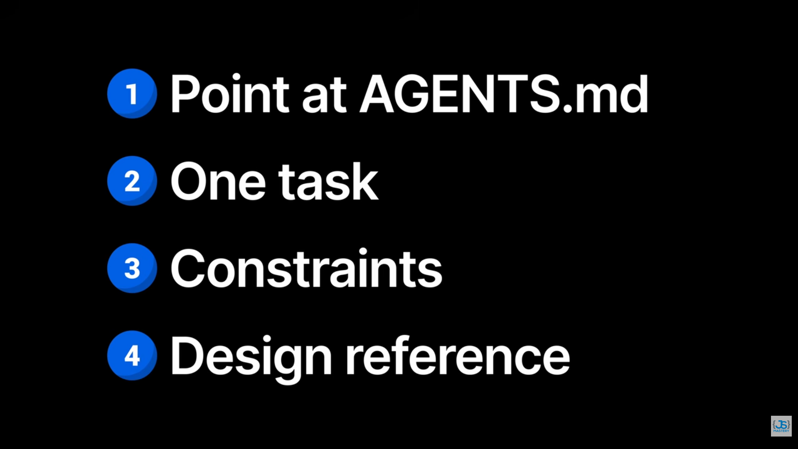

##### ONE TASK

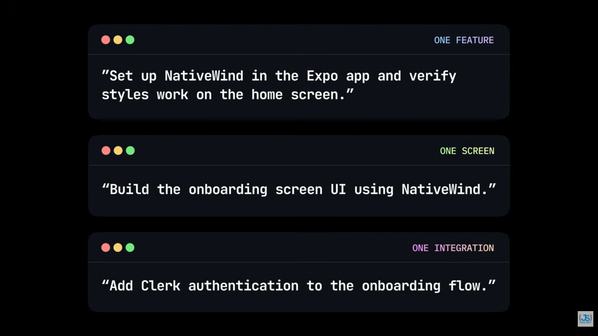

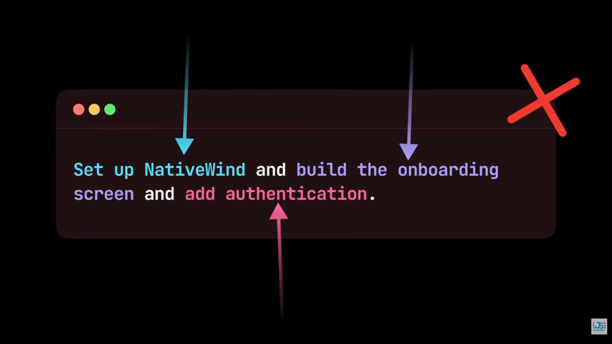

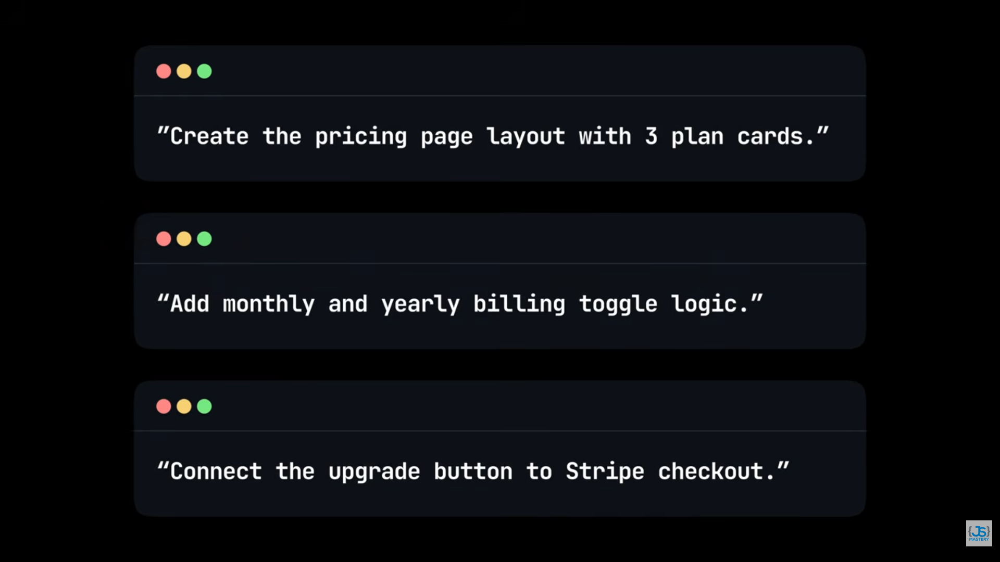

##### CONSTRAINTS

Exmaple-

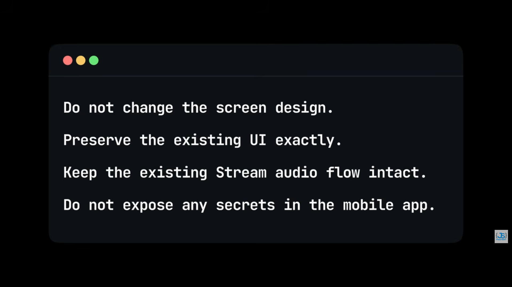

**Hence Constraints means,**

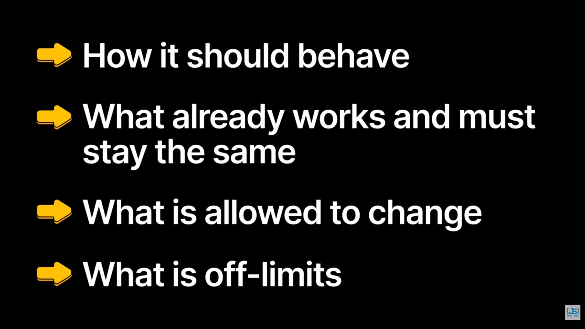

**ALSO**

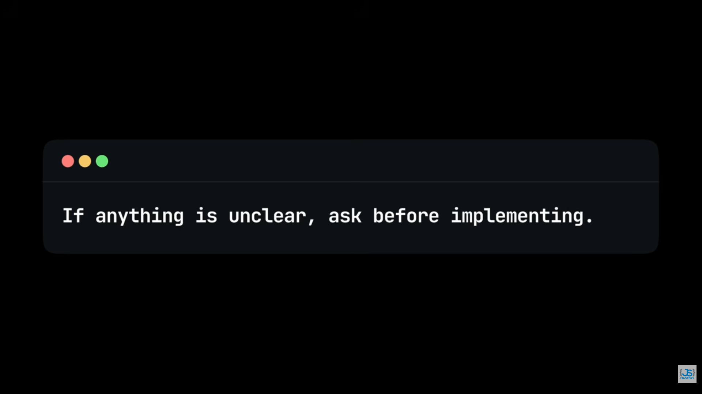

If no constarints, ambuiguity---

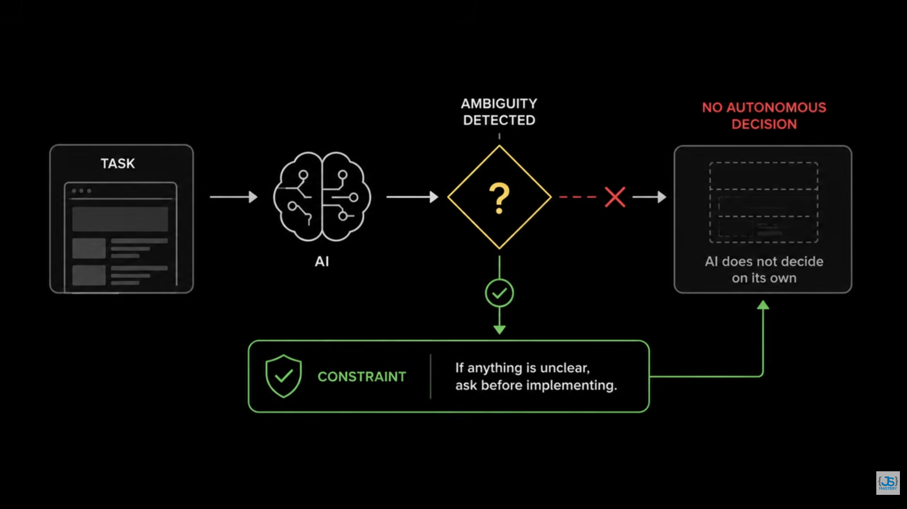

##### If Outdated implmentation

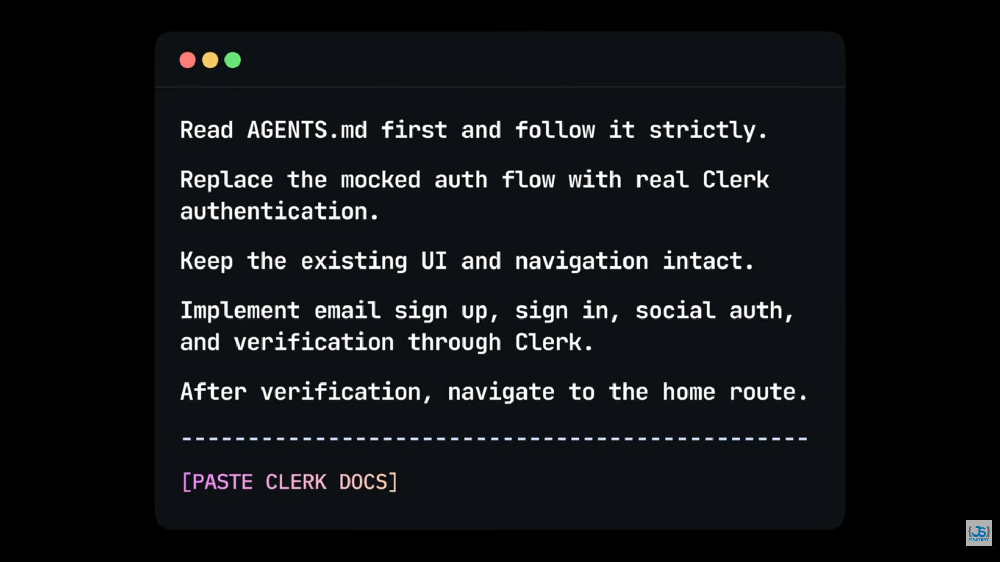

##### DEBUGGING

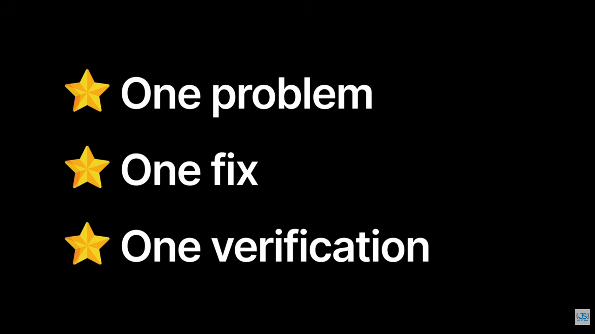

**EXAMPLE---**

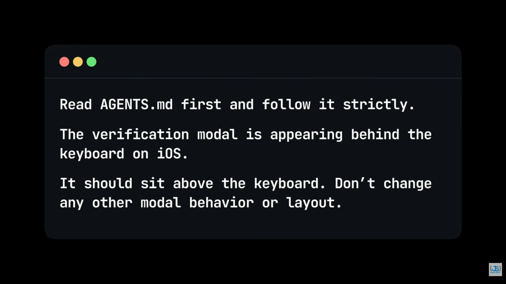

EXAMPLE
