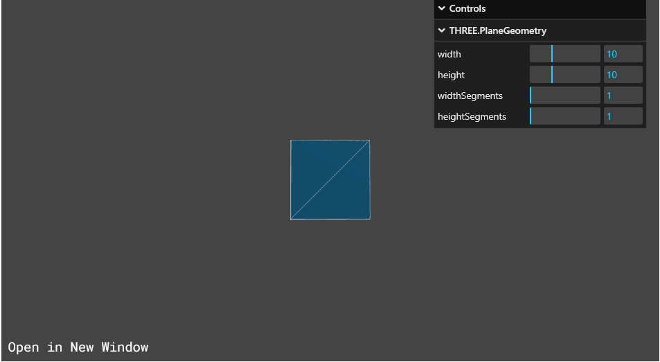
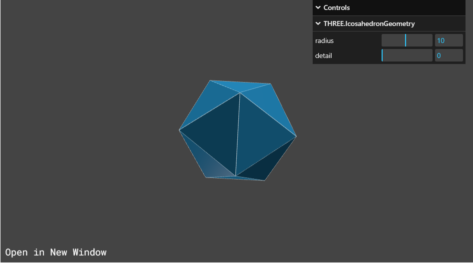
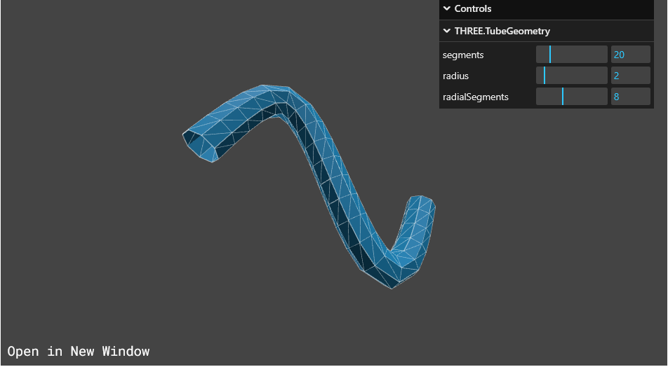

# ThreeJs - Introduction

Three.js is a **JavaScript 3D library** that makes it easy to create and display animated 3D graphics in the browser using  **WebGL** .

-- A high-level JavaScript library for creating and displaying 3D graphics in web browsers

-- Simplifies 3D graphics creation and animation (models, particle systems, lights, cameras) without low-level WebGL code knowledge

> 🧠 What is WebGL?
>
> WebGL (Web Graphics Library) is a low-level API for rendering 2D and 3D graphics in web browsers without using plugins. However, it’s complex and hard to write from scratch — that's where Three.js comes in.
>
> Its a way to communicate with the GPU
>
> 💡 What is Three.js?
>
> **Three.js** is a higher-level library built on top of WebGL. It simplifies 3D rendering, so you can create scenes, objects, lights, and cameras more easily.

### ⚡ Graphics processing

**What is graphics processing?**

* The process of rendering 3D graphics on a computer screen in 👉 **real-time** 👈 which is interactive. For example it should not be like a recorded or created video
* Requires millions of calculations per second for just a basic graphics

**Why is it complex?**

* The computer needs to know information like the position, color, and location of every vertex of an object
* There is a piece of instruction needed for each pixel on the screen

-- Because it is so complex and sophisticated and so much processing happening, we invented GPU

**What is a GPU?**

* Stands for Graphics Processing Unit
* A special type of hardware that can run simple calculations in parallel
* Designed to handle the demands of rendering 3D graphics

### 🛠️ WebGL and Three JS

* WebGL provides a language to talk to the GPU and instruct it on what to render
* WebGL is a JavaScript API for rendering 3D graphics in a web browser using the GPU
* It very complex and takes lot of time to really communicate with and program with

Three.js is built on top of WebGL and implements it under the hood

Three.js abstracts the complicated WebGL language into an easy-to-use JavaScript API allowing for creative focus on projects

### 🧰 What Can You Do with Three.js?

* Create interactive 3D websites or apps
* Build games
* Visualize data in 3D
* Make VR/AR experiences
* Animate 3D models (using GLTF, FBX, etc.)

### 🚀 Advantages

* Abstracts complex WebGL code
* Cross-browser compatible
* Large community and many plugins
* Supports lights, shadows, textures, physics engines, etc.

### 💻 Installation

`npm install three`

# Structure of Three.js App


## 🧩 Core Components in Detail

### 1. **Scene**

A container that holds all 3D objects, lights, and cameras. Think of it like a stage-- Eg-  `const scene = new THREE.Scene();`

Scene itself is a 3D object as well.

### **2. Camera**

Defines what part of the scene is visible. The most common one is the `PerspectiveCamera`.

Eg-  `const camera = new THREE.PerspectiveCamera(fov, aspect, near, far);`

**Common Camera Types:**

* `THREE.PerspectiveCamera`: Like a real-world camera (with FOV).
* `THREE.OrthographicCamera`: For 2D-like rendering without perspective distortion.

### **3. Renderer**

Takes the scene and camera and draws the result to the screen.

Analogy would be some images being shown in 24 fps or 60 fps, etc so as to create a motion picture or a movie. In the same way renderer would be called for like 60 times/sec, etc

```javascript
const renderer = new THREE.WebGLRenderer({ antialias: true });
renderer.setSize(window.innerWidth, window.innerHeight);
document.body.appendChild(renderer.domElement);

```

**What is Anti-Aliasing?**

Aliasing happens when diagonal or curved edges in your 3D models look jagged or pixelated (staircase like sharp-edges), especially at lower resolutions or when we are rotating the object. With hardware using high resolution or pixel ratio monitor, one can avoid that.

Anti-aliasing is a graphics technique used to reduce that effect by blending edge pixels with fader color like gradient to make the lines appear smoother.

Without anti-aliasing:

* Edges look rough and stair-stepped.

With anti-aliasing (`antialias: true`):

* Edges are smoother and more visually appealing.

Should You Always Use It?

* ✅  **Yes** , if you're building for modern devices and want  **better visual quality** .
* ⚠️ **Be cautious** on low-performance or mobile devices, as it can slightly impact performance.

> **`renderer.setPixelRatio`**
>
> ```javascript
> renderer.setPixelRatio(Math.min(window.devicePixelRatio, 2))
> ```
>
> `renderer.setPixelRatio` may work as an Antialisaing strategy(Not for every device) because by default value would be less than 1 or 1. So by above code if at all the pixel ratio is 2 or more one can use the above code to exploit the more pixel ratiio that the monitor has.
>
> You don't want to use the max pixel ratio to avoid cpu usage hence, Math.min()

### 4. **Geometry**

Defines the **shape** of a 3D object.

Examples:

* `BoxGeometry`, `SphereGeometry`, `PlaneGeometry`, `BufferGeometry`

Eg-  `const geometry = new THREE.BoxGeometry(1, 1, 1);`

### 5. **Material**

Defines how the surface of the object looks.

Examples:

* `MeshBasicMaterial`: Unlit, flat color
* `MeshStandardMaterial`: Supports lighting
* `MeshPhongMaterial`, `MeshLambertMaterial`, etc.

Eg- `const material = new THREE.MeshStandardMaterial({ color: 0xff0000 });`

### 6. **Mesh**

Combines a geometry and a material into a renderable object.

```javascript
const mesh = new THREE.Mesh(geometry, material);
scene.add(mesh);

```

One can always change the position of mesh by `mesh.position.set(x, y, z)`  or for example-- `mesh.position.x = 5`

### 7. **Lights**

Illuminate the scene. Some materials (like `MeshStandardMaterial`) require light to be visible.

**Adds realism by simulating light and shadows.**

Common light types:

* `AmbientLight`: Uniform light with no direction
* `PointLight`: Emits light in all directions from a point
* `DirectionalLight`: Sun-like light from a direction

```javascript
const light = new THREE.PointLight(0xffffff, 1);
scene.add(light);

```

### 8. **Controls (Optional)**

Allow user interaction like rotating, panning, or zooming.

```javascript
import { OrbitControls } from 'three/examples/jsm/controls/OrbitControls.js';
const controls = new OrbitControls(camera, renderer.domElement);

```

### 9. **Helpers (Optional)**

Visual aids for debugging or layout.

Examples:

* `AxesHelper`, `GridHelper`, `CameraHelper`

```javascript
const gridHelper = new THREE.GridHelper(10, 10);
scene.add(gridHelper);

```

### 10. **Animation Loop**

Continuously updates and renders the scene.

```javascript
function animate() {
  requestAnimationFrame(animate);
  mesh.rotation.y += 0.01;
  renderer.render(scene, camera);
}
animate();

```

### 11. **Loaders (For Models, Textures)**

Load external assets:

* `GLTFLoader`, `OBJLoader` for 3D models
* `TextureLoader` for image textures

```javascript
const loader = new THREE.TextureLoader();
const texture = loader.load('path/to/image.jpg');

```

> Children of a parent inherits the transformational property of the parent

# 💻 Example Program (With Explanations Inside the code-block)

This Three.js code is a **minimal setup to render a red cube on the screen** using a 3D scene.

```javascript
import * as THREE from "three";

// initialize the scene
const scene = new THREE.Scene();
  //------> The scene is like a container that holds all objects (meshes, lights, cameras). Think of it as your virtual 3D world.

// add objects to the scene
const cubeGeometry = new THREE.BoxGeometry(1, 1, 1);
	//------> This creates a box (1x1x1 units).  It’s a set of vertices and faces.

const cubeMaterial = new THREE.MeshBasicMaterial({ color: "red" });
  //-----> A material defines how the surface of a shape looks. MeshBasicMaterial is a simple unlit material(no lighting effects).

const cubeMesh = new THREE.Mesh(cubeGeometry, cubeMaterial); // Mesh = Geometry + Material.

scene.add(cubeMesh); // You add it to the scene to make it visible in rendering.

// initialize the camera
const camera = new THREE.PerspectiveCamera(
  75,
  window.innerWidth / window.innerHeight, // for aspect ratio
  0.1,
  30
);  //------> This creates a perspective camera, which mimics human eye perception.
			    75 = Field of view (FOV).
			    aspect ratio = important to avoid stretching.
			    0.1 = near clipping plane (anything closer won’t show).
 			    30 = far clipping plane.

camera.position.z = 5; //---> Move the camera 5 units away from the cube on the Z-axis so we can see it.

// HERE-- if written scene.add(camera), will give you a different experience since camera is also a 3D object like for animating the camera like a scene object or parenting it.

// initialize the renderer
const canvas = document.querySelector("canvas.threejs");
const renderer = new THREE.WebGLRenderer({
  canvas: canvas,
});		//---------> Creates the WebGL renderer which converts your 3D scene into pixels and draws it on the canvas.`
renderer.setSize(window.innerWidth, window.innerHeight); //-----> Makes sure the canvas matches the full window size.
renderer.render(scene, camera)    //-----> This actually draws the scene from the perspective of the camera.
```

# Types of Geometry

In  **Three.js** , geometries define the **shape** of 3D objects. There are many built-in geometry types for common shapes. Here's a categorized list:

## 🧱 Common Built-in Geometries (Primitives)

1. PlaneGeometry
2. BoxGeometry
3. CircleGeometry
4. RingGeometry
5. SphereGeometry
6. TubeGeometry
7. TorusGeometry
8. TorusKnotGeometry
9. CylinderGeometry
10. ConeGeometry
11. LatheGeometry
12. Platonic solid shapes
    TetrahedronGeometry, OctahedronGeometry, DodecahedronGeometry, IcosahedronGeometry
13. ShapeGeometry
14. ExtrudeGeometry
15. EdgesGeometry
16. WireframeGeometry
17. BufferGeometry

### 📦 1. **BoxGeometry**

A cube or rectangular box.      SYNTAX-    `new THREE.BoxGeometry(width, height, depth, );`

SYNTAX

```javascript
new THREE.BoxGeometry(
   width, 
   height,
   depth, 
   widthSegments = 1,   // Horizontal segments (subdivisions along width) 
   heightSegments = 1   // Vertical segments (subdivisions along height)
   depthSegments = 1   // Vertical segments (subdivisions along depth)
);
```

### 🪐 2. **SphereGeometry**

A full 3D sphere (e.g., for planets or balls).

SYNTAX

```javascript
new THREE.SphereGeometry(
  radius,
  widthSegments,
  heightSegments,
  phiStart,
  phiLength,
  thetaStart,
  thetaLength
);

```

✅ **`widthSegments`**

* Number of **vertical segments** (like the segments of an orange).
* These go **around** the sphere (longitude).
* Minimum: `3`.
* As you decrease, it looks more of 3d triangle-circle type, esp at 3(min)

✅ **`heightSegments`**

* Number of **horizontal segments** (like layers of a cake).
* These go **from top to bottom** (latitude).
* Minimum: `2`.
* As you decrease, it looks more of 3d rectangle-cone type, esp at 3(min)

⚠️ Performance Note

* **Higher segments** = smoother look, but **more vertices** = heavier to render.
* Use  **low segments for previews** , higher for final rendering.

For phiStart, phiLength, thetaStart and thetaLength, lets see some analogies--

🎯 Analogy: **Slicing a Globe**

Imagine you’re working with a **world globe** and you’re painting or cutting sections of it:

| Parameter       | Analogy on a Globe                                | What It Does                                     |
| --------------- | ------------------------------------------------- | ------------------------------------------------ |
| `phiStart`    | Start turning the globe sideways                  | The**starting longitude**of the cut        |
| `phiLength`   | How much you rotate the globe sideways            | The**longitude sweep**(side-to-side width) |
| `thetaStart`  | Start slicing from the**North Pole**        | Where to start**from top to bottom**       |
| `thetaLength` | How far down toward the**South Pole**you go | The**latitude sweep**(vertical height)     |

🎂 Analogy: **Cutting a Layer Cake**

Now imagine a tall, round cake:

| Parameter       | Analogy with Cake                      | What It Means                             |
| --------------- | -------------------------------------- | ----------------------------------------- |
| `phiStart`    | Where you put your knife on the side   | Starting angle**around**the cake    |
| `phiLength`   | How wide you slice it (side to side)   | Width of the**slice**you cut around |
| `thetaStart`  | If you slice only the top part         | Start**from the top**of the cake    |
| `thetaLength` | How far down you cut (not all the way) | How much**vertical height**to keep  |

> **You can write the angles in terms of `Math.Pi`**
>
> Eg- phiStart- 0 and phiLength- Math.Pi  will give you half cut sphere from left to right
>
> Eg- thetaStart- 0 and thetaLength- Math.Pi/2  will give you half cut sphere from top to bottom

### 🥏 3. **CircleGeometry**

A flat 2D circle in the XY plane.

SYNTAX--

```javascript
new THREE.CircleGeometry(
  radius = 1,           // Radius of the circle
  segments = 8,         // Number of triangle segments (sides)
  thetaStart = 0,       // Starting angle in radians
  thetaLength = Math.PI * 2 // Central angle (how much of the circle to draw)
)

```

`segments` refers to how **finely subdivided** the geometry is — i.e., **how many sections or divisions are used** to construct the shape.

🔍 What "segments" actually means:

Segments are like the **number of lines or faces** used to form a curve or surface.

More segments → smoother, rounder shape

Fewer segments → blockier, low-poly look, 2d  triangle look

### 🍩 4. **TorusGeometry**

A donut shape.

SYNTAX--

```javascript
new THREE.TorusGeometry(
  radius,              // Major radius (distance from center to tube center)
  tube,              // Minor radius (thickness of the tube)
  radialSegments,      // Number of segments around the cross-section
  tubularSegments,     // Number of segments around the torus ring
  arc = Math.PI * 2        // How much of the ring to create (default = full circle)
);

```

✅ 1. `tubularSegments` (🔁 around the  **main ring** )

* Think of  **how many steps you take to go around the donut** .
* It controls the smoothness **around the big circle** (the major radius).

**More tubularSegments = smoother outer ring.**

🧠 Think of it as:

> “How many slices do I divide the whole donut into around its hole?”

✅ 2. `radialSegments` (🔁 around the  **tube** )

* Think of  **how round the tube 👉cross-section👈 is** .
* It controls the smoothness of the  **tube thickness** .

**More radialSegments = rounder tube.**

🧠 Think of it as:

> “How round is the pipe that forms the donut?”

### 🔁 5. **TorusKnotGeometry**

A twisted knot in torus form.

SYNTAX--

```javascript
new THREE.TorusKnotGeometry(
  radius = 1,            // Major radius (distance from center to tube center)
  tube = 0.4,            // Minor radius (thickness of the tube)
  tubularSegments = 64,  // How many segments along the knot path
  radialSegments = 8,    // How round the tube is
  p = 2,                 // Number of times the geometry winds around its axis (longitudinally)
  q = 3                  // Number of times the geometry winds around a circle in the interior (latitudinally)
)

```


### 🏺 6. **CylinderGeometry**

A cylinder or cone.

SYNTAX--

```javascript
new THREE.CylinderGeometry(
  radiusTop = 1,          // Radius of the cylinder at the top
  radiusBottom = 1,       // Radius at the bottom
  height = 1,             // Height of the cylinder
  radialSegments = 8,     // Number of segmented faces around the circumference
  heightSegments = 1,     // Number of rows of faces along the height
  openEnded = false,      // Whether the ends are capped (true = open)
  thetaStart = 0,         // Start angle for first segment (in radians)
  thetaLength = Math.PI * 2 // The central angle, often full circle (2π)
)

```

### 🥥 7. **ConeGeometry**

A cone (just like a cylinder but radiusTop is 0).

```javascript
new THREE.ConeGeometry(
  radius = 1,           // Radius of the base of the cone
  height = 1,           // Height of the cone
  radialSegments = 8,   // Number of segmented faces around the circumference
  heightSegments = 1,   // Number of segmented faces along the height
  openEnded = false,    // Whether the base is open (true = no cap)
  thetaStart = 0,       // Starting angle in radians
  thetaLength = Math.PI * 2  // Central angle (how much of the circle is swept)
)

```

### 🧊 8. **PlaneGeometry**

A 2D flat plane (e.g., ground or screen).

SYNTAX--

```javascript
new THREE.PlaneGeometry(
  width = 1,           // Width of the plane
  height = 1,          // Height of the plane
  widthSegments = 1,   // Horizontal segments (subdivisions along width)
  heightSegments = 1   // Vertical segments (subdivisions along height)
)

```



### 🔷 9. **RingGeometry**

A ring or donut-like 2D shape. Looks like a Toa octagon type

A ring or disc with a hole in the center, like a washer or halo.

SYNTAX--

```javascript
new THREE.RingGeometry(
  innerRadius = 0.5,         // Radius of the hole in the center
  outerRadius = 1,           // Outer radius of the actual solid part of ring
  thetaSegments = 8,         // Number of segments around the circumference, actual edges, hence no of edges inc/dec
  phiSegments = 1,           // Number of segments along the radial direction, on the solid surface
  thetaStart = 0,            // Starting angle in radians (default = 0)
  thetaLength = Math.PI * 2  // Central angle of the ring sweep (default = full circle)
)

```


### 🌐 10. Platonic solid shapes.

##### A.TetrahedronGeometry

* Only 4 triangular faces — the simplest polyhedron.
* `detail` can be used to subdivide and smooth. Setting this to a value greater than 0  adds
  vertices making it no longer a tetrahedron, making at max a kind of sphere

SYNTAX--

```javascript
new THREE.TetrahedronGeometry(
  radius = 1,
  detail = 0
)

```


##### B. OctahedronGeometry

* 8 triangular faces — like two pyramids stuck base-to-base.
* `detail` smooths it toward a sphere-like shape. Default is 0. Setting this to a value greater than zero add
  vertices making it no longer an octahedron.

SYNTAX--

```javascript
new THREE.OctahedronGeometry(
  radius = 1,
  detail = 0
)

```


##### C. DodecahedronGeometry

* A 12-faced shape, each face is a regular pentagon.
* `detail = 0` gives the base dodecahedron.
* Higher `detail` smooths the geometry (useful for spherical variants).

```javascript
new THREE.DodecahedronGeometry(
  radius = 1,        // Size of the geometry
  detail = 0         // Number of times to subdivide faces (increases detail), max value makes it a sphere
)

```


##### D. IcosahedronGeometry

* A 20-faced polyhedron, each face is an equilateral triangle.
* Often used as a base for spherical meshes (e.g., for planets or balls).
* Higher `detail` = more spherical shape.  Default is 0. Setting this to a value greater than 0 adds more vertices making it no longer an icosahedron. When detail is greater than 1, it's effectively a sphere.

SYNTAX--

```javascript
new THREE.IcosahedronGeometry(
  radius = 1,
  detail = 0
)

```



### 🌪️ 11. **LatheGeometry**

Creates a shape by rotating points (like pottery).

-- This geometry is used to create **rotationally symmetrical shapes** by spinning a set of 2D points around the Y-axis — like pottery made on a wheel.

SYNTAX--

```javascript
new THREE.LatheGeometry(
  points,             // Array of Vector2 points (shape outline)
  segments = 12,      // Number of rotational segments
  phiStart = 0,       // Starting angle in radians (default = 0)
  phiLength = 2 * Math.PI  // How much of the circle to sweep (default = full 360°)
)

```


### 🧶 12. **TubeGeometry**

Creates a 3D shape along a path/curve.

* This geometry creates a **tube-shaped mesh** that follows a custom 3D path — like a pipe, roller coaster, or wire.

"2" Shaped

SYNTAX--

```
new THREE.TubeGeometry(
  path,            // A THREE.Curve instance that defines the center line of the tube
  tubularSegments, // Number of segments along the tube
  radius,          // Radius of the tube
  radialSegments,  // Number of segments around the circumference
  closed           // Boolean indicating whether the tube is closed into a loop
)

```

| Parameter           | Type                       | Description                                                    |
| ------------------- | -------------------------- | -------------------------------------------------------------- |
| `path`            | `THREE.Curve`            | The 3D curve path that defines the tube’s central spine       |
| `tubularSegments` | `Integer`(default 64)    | Number of segments along the length of the tube                |
| `radius`          | `Float`(default 1)       | Radius of the tube                                             |
| `radialSegments`  | `Integer`(default 8)     | Number of segments around the circumference of the tube        |
| `closed`          | `Boolean`(default false) | If true, connects the start and end of the tube to form a loop |



### 🔳 13. **ShapeGeometry**

* Is used to generate **2D extruded** flat geometry from one or more custom shapes (made of paths). It's useful for rendering flat icons, cutouts, and custom 2D designs.

SYNTAX--

```javascript
new THREE.ShapeGeometry(
  shapes,            // Shape or array of Shapes (THREE.Shape or [THREE.Shape])
  curveSegments = 12 // Number of segments per curve (resolution/smoothness)
)

```

| Parameter         | Type                                | Description                                                            |
| ----------------- | ----------------------------------- | ---------------------------------------------------------------------- |
| `shapes`        | `THREE.Shape`or `THREE.Shape[]` | The shape(s) to convert to geometry — must be paths defined in 2D     |
| `curveSegments` | `Integer`(default: 12)            | Number of segments per Bézier curve or arc (higher = smoother curves) |

**🧪 Example**

```javascript
const shape = new THREE.Shape();
shape.moveTo(0, 0);
shape.lineTo(0, 10);
shape.lineTo(10, 10);
shape.lineTo(10, 0);
shape.lineTo(0, 0);

const geometry = new THREE.ShapeGeometry(shape, 24);

```

This creates a flat square shape geometry with high curve smoothness (though in this case it's just straight lines).

🧠 Tip

* `THREE.Shape` is created using path commands (`lineTo`, `bezierCurveTo`, `absarc`, etc.).
* You can also use `holes` in shapes (e.g. for making a donut-like ring with a cutout).

### ⚙️ 14. **ExtrudeGeometry**

* Turns a 2D shape into 3D by extruding it.
* This geometry allows you to **extrude a 2D shape into 3D** — perfect for 3D text, logos, or custom objects like walls, gears, and more.

SYNTAX--

```javascript
new THREE.ExtrudeGeometry(
  shapes,      // A Shape or array of Shapes
  options      // Object containing extrusion settings
)

```

📘 Parameters

1. `shapes`

Type: `THREE.Shape` or `THREE.Shape[]`

Description: The 2D shape(s) you want to extrude into 3D. Can include holes.

2. `options` (optional)

Type: `Object`

Description: Configuration object for controlling the extrusion behavior.

🧩 Full `options` Object

| Option             | Type          | Default       | Description                                            |
| ------------------ | ------------- | ------------- | ------------------------------------------------------ |
| `depth`          | `Number`    | `1`         | How far to extrude the shape (Z direction)             |
| `bevelEnabled`   | `Boolean`   | `true`      | Whether to enable beveling                             |
| `bevelThickness` | `Number`    | `0.2`       | How deep the bevel goes                                |
| `bevelSize`      | `Number`    | `0.1`       | How far the bevel extends from shape outline           |
| `bevelOffset`    | `Number`    | `0`         | Distance the bevel starts inset from the edge          |
| `bevelSegments`  | `Integer`   | `3`         | Number of segments in the bevel curve                  |
| `curveSegments`  | `Integer`   | `12`        | Number of segments per curve (for round corners)       |
| `steps`          | `Integer`   | `1`         | Number of steps (layers) along the depth               |
| `extrudePath`    | `CurvePath` | `undefined` | A 3D curve path to extrude along instead of straight Z |
| `UVGenerator`    | `Object`    | Internal      | Custom UV mapping logic (rarely used manually)         |

🧪 Example

```javascript
const shape = new THREE.Shape();
// Draw a square
shape.moveTo(0, 0);
shape.lineTo(0, 5);
shape.lineTo(5, 5);
shape.lineTo(5, 0);
shape.lineTo(0, 0);

const extrudeSettings = {
  steps: 2,
  depth: 10,
  bevelEnabled: true,
  bevelThickness: 1,
  bevelSize: 0.5,
  bevelSegments: 5
};

const geometry = new THREE.ExtrudeGeometry(shape, extrudeSettings);

```

🎯 Use Cases

* 3D logos and text
* Mechanical parts like gears and tracks
* Complex architectural features
* Paths extruded along a curve (e.g., railings, pipes, tracks)

### 🧬 15. **BufferGeometry**

* The base class for all geometries. It’s used for custom or advanced shapes.
* It is a **foundational class** in Three.js used to construct and manage **custom geometries** by defining raw buffer data (positions, normals, uvs, etc.).

> Unlike predefined geometries like `BoxGeometry`, `BufferGeometry` gives you **low-level control** over the structure of your mesh.

SYNTAX--- `const geometry = new THREE.BufferGeometry();`

Unlike other geometries, it takes  **no constructor arguments** , but you manually define attributes and index later.

[BUFFER GEOMETRY - 2 ]

### **🔹 16. EdgesGeometry**

Generates **an outline of the visible edges** of a geometry — like the  **edges of polygons** , useful for clean outlines or wireframe effects.

SYNTAX---   `const edges = new THREE.EdgesGeometry(geometry, thresholdAngle);`

| Parameter          | Type                              | Default            | Description                                                                                              |
| ------------------ | --------------------------------- | ------------------ | -------------------------------------------------------------------------------------------------------- |
| `geometry`       | `Geometry`or `BufferGeometry` | **Required** | The geometry you want to outline                                                                         |
| `thresholdAngle` | `Number`                        | `1`              | Angle in degrees. Edges are shown**only if the angle between face normals is greater than this** . |

> Example: Use a low angle like `1` to only get sharp edges; a higher angle like `90` will include softer edges.

**📦 Example**

```javascript
const box = new THREE.BoxGeometry(1, 1, 1);
const edges = new THREE.EdgesGeometry(box, 30);
const line = new THREE.LineSegments(edges, new THREE.LineBasicMaterial({ color: 0xffffff }));
scene.add(line);

```

HERE-- `const edges = new THREE.EdgesGeometry(box, 30);`

* `EdgesGeometry` extracts **only the visible and sharp edges** of the `box` geometry.
* The second argument `30` is the  **threshold angle in degrees** .
  * **What it means** : If the angle between the normals of two adjacent faces is  **greater than 30°** , an edge between them will be included.
  * For a cube (which has 90° angles at corners), this will result in all outer edges being included — essentially outlining the box.

`const line = new THREE.LineSegments(edges, new THREE.LineBasicMaterial({ color: 0xffffff }));`

* `LineSegments` is used to draw **disconnected straight lines** between vertex pairs (edges).
* `edges` contains the geometry of those line segments.
* `LineBasicMaterial` is a basic material used to define the color (white in this case) of the lines.

🔁 Summary

| Component             | What it does                                |
| --------------------- | ------------------------------------------- |
| `BoxGeometry`       | Creates the cube shape                      |
| `EdgesGeometry`     | Extracts visible, sharp edges               |
| `LineSegments`      | Turns those edges into drawable line pairs  |
| `LineBasicMaterial` | Styles the lines (color, etc.)              |
| `scene.add`         | Adds the wireframe box outline to the scene |

✅ Use Case

* Highlighting sharp edges (like corners of a cube)
* Stylized outlines or hidden line rendering
* Clean non-overlapping wireframes

### 🔸17. WireframeGeometry

Creates a **full wireframe representation** of a geometry — showing  **all edges** , regardless of angle. More like what you see in 3D modeling tools.

SYNTAX-- `const wireframe = new THREE.WireframeGeometry(geometry);`

**📦 Example**

```javascript
const sphere = new THREE.SphereGeometry(1, 8, 8);
const wireframe = new THREE.WireframeGeometry(sphere);
const line = new THREE.LineSegments(wireframe, new THREE.LineBasicMaterial({ color: 0x00ff00 }));
scene.add(line);

```

HERE--

`THREE.WireframeGeometry(geometry)`

* Converts the `sphere` geometry into a **wireframe** version.
* **Shows all edges** (not just sharp ones like `EdgesGeometry`).
* Returns a new geometry with **line segments connecting vertices** across all faces.

✅ Use Case

* Full mesh wireframes (for debugging or style)
* Visualizing geometry topology (e.g., all triangles)
* Creating "X-ray" or transparent mesh effects

# `THREE`.LineSegments()

This class draws **independent pairs of points** as line segments — perfect for rendering  **edges** ,  **wireframes** , or disconnected lines.

SYNTAX--- `const lineSegments = new THREE.LineSegments(geometry, material);`

| Parameter    | Type                                                       | Description                                                                                            |
| ------------ | ---------------------------------------------------------- | ------------------------------------------------------------------------------------------------------ |
| `geometry` | `THREE.BufferGeometry`or `THREE.Geometry`              | The shape data: vertices that define the lines. Every**pair of vertices**becomes a line segment. |
| `material` | `THREE.LineBasicMaterial`or `THREE.LineDashedMaterial` | Defines how the line looks: color, width, dash pattern, etc.                                           |

🧠 How It Works

* The geometry must contain a list of vertices.
* Every **two consecutive vertices** are connected into one line segment.
* For example, vertices `[A, B, C, D, E, F]` will draw line segments:
  * `A → B`
  * `C → D`
  * `E → F`

This is **different from** `THREE.Line()`, which connects vertices **in order** like a polyline.

**🔧 Usage Example**

```javascript
const geometry = new THREE.BufferGeometry();
const points = [
  new THREE.Vector3(0, 0, 0),
  new THREE.Vector3(1, 0, 0),  // line 1
  new THREE.Vector3(0, 1, 0),
  new THREE.Vector3(1, 1, 0),  // line 2
];
geometry.setFromPoints(points);

const material = new THREE.LineBasicMaterial({ color: 0xff0000 });
const lines = new THREE.LineSegments(geometry, material);
scene.add(lines);

```

> Here `.setFromPoints()`  **creates a geometry** (usually a line or shape) by connecting a series of 3D points (or `Vector3`s).
>
> * The `.setFromPoints()` method is used in **Three.js** with geometry classes like `THREE.BufferGeometry` or `THREE.LineGeometry` to create geometry  **from a list of points** .
> * SYNTAX--- `geometry.setFromPoints(pointsArray);`
>   *Here

**🎨 Material Options**

You can use:

* `LineBasicMaterial`: solid lines
* `LineDashedMaterial`: dashed lines (needs `computeLineDistances()` called on geometry)

**📦 Extra Info**

You can also create a custom subclass if you want more control, but `LineSegments` works out of the box for:

* `EdgesGeometry`
* `WireframeGeometry`
* Custom point pairs

# THREE.LineBasicMaterial()

A material for drawing  **simple flat-colored lines** . It  **does not react to lights** , meaning it stays the same color regardless of the scene's lighting setup.

SYNTAX--

```javascript
const material = new THREE.LineBasicMaterial({
  color: 0xff0000,
  linewidth: 2,
  linecap: 'round',
  linejoin: 'round',
});

```

| Parameter        | Type        | Default                  | Description                                                                                                                  |
| ---------------- | ----------- | ------------------------ | ---------------------------------------------------------------------------------------------------------------------------- |
| `color`        | `Color`   | `0xffffff`             | The color of the line. Can be hex (`0xff0000`), CSS color (`'red'`), or `THREE.Color`.                                 |
| `linewidth`    | `Number`  | `1`                    | Width of the line.**Note:**This is ignored in most WebGL implementations (especially in Chrome), which only support `1`.   |
| `linecap`      | `String`  | `'round'`              | Defines the shape at the ends of the lines. Options:`'butt'`,`'round'`,`'square'`. Mostly used in 2D canvas rendering. |
| `linejoin`     | `String`  | `'round'`              | Shape used at corners where two lines join. Options:`'round'`,`'bevel'`,`'miter'`.                                     |
| `vertexColors` | `Boolean` | `false`                | If set to `true`, the color will be taken from each vertex (`geometry.attributes.color`).                                |
| `fog`          | `Boolean` | `true`                 | Whether the material is affected by fog in the scene.                                                                        |
| `transparent`  | `Boolean` | `false`                | Whether to enable transparency. Requires `opacity < 1`or transparent textures.                                             |
| `opacity`      | `Number`  | `1.0`                  | Opacity level;`0`is fully transparent,`1`is fully opaque.                                                                |
| `depthTest`    | `Boolean` | `true`                 | Whether to check depth before drawing (default true for proper occlusion).                                                   |
| `depthWrite`   | `Boolean` | `true`                 | Whether writing to the depth buffer is enabled.                                                                              |
| `blending`     | `Number`  | `THREE.NormalBlending` | Blending mode (additive, subtractive, etc.) for transparency.                                                                |
| `side`         | `Number`  | `THREE.FrontSide`      | Not often used in lines, but defines whether front, back, or both sides are rendered.                                        |

**🚫 Browser Limitations (Important!)**

* `linewidth` is only supported in **Firefox** and some native contexts.
* On  **most platforms (e.g., Chrome/WebGL)** , line width will always be `1`.

**✅ When to Use**

Use `LineBasicMaterial` when:

* You want simple lines (e.g., wireframes, helpers, guides).
* You don’t need lighting effects.
* You care about performance and simplicity.

# THREE.LineDashedMaterial()

This material renders dashed or dotted lines using a pattern of  **dashes and gaps** , and is useful for outlines, grids, or helper visuals.

SYNTAX--

```javascript
const dashedMaterial = new THREE.LineDashedMaterial({
  color: 0xff0000,
  linewidth: 1,
  scale: 1,
  dashSize: 3,
  gapSize: 1,
});

```

Parameters same like that of LineBasicMaterial(). Other than it has theses--

| `scale` | `Number` | `1` | Global scale factor for dash and gap sizes. |
| --------- | ---------- | ----- | ------------------------------------------- |

| `dashSize` | `Number` | `3` | Length of each dash. |
| ------------ | ---------- | ----- | -------------------- |

| `gapSize` | `Number` | `1` | Length of each gap between dashes. |
| ----------- | ---------- | ----- | ---------------------------------- |

**🔧 Important Usage Note**

> To make `LineDashedMaterial` work properly, you **must call** `geometry.computeLineDistances()` before rendering.

EXAMPLE--

```javascript
const points = [
  new THREE.Vector3(0, 0, 0),
  new THREE.Vector3(5, 0, 0),
];
const geometry = new THREE.BufferGeometry().setFromPoints(points);
geometry.computeLineDistances(); // REQUIRED for dashes

const dashedMaterial = new THREE.LineDashedMaterial({
  color: 0x0000ff,
  dashSize: 0.5,
  gapSize: 0.2,
  scale: 1,
});

const line = new THREE.Line(geometry, dashedMaterial);
scene.add(line);

```

**🧠 How Dash Works Visually**

If you think of a line as:

```
------  ------  ------

```

* Each **`dashSize`** is a solid part.
* Each **`gapSize`** is the empty space in between.
* **`scale`** multiplies both.

# THREE.Vector3()

`THREE.Vector3()` is a fundamental class in Three.js used to represent **points or directions in 3D space** using **x, y, z** coordinates.

SYNTAX--- `const vector = new THREE.Vector3(x, y, z);`

* `x`: The x-coordinate (default is `0`)
* `y`: The y-coordinate (default is `0`)
* `z`: The z-coordinate (default is `0`)

Example:

```javascript
const v1 = new THREE.Vector3(1, 2, 3);
const v2 = new THREE.Vector3(4, 5, 6);

// Add vectors
v1.add(v2);  // v1 is now (5, 7, 9)

```

**🔧 Common Methods**

| Method                 | Description                                                                                                                                     |
| ---------------------- | ----------------------------------------------------------------------------------------------------------------------------------------------- |
| `.add(v)`            | Adds another Vector3 to this one.                                                                                                               |
| `.sub(v)`            | Subtracts another Vector3 from this one.                                                                                                        |
| `.multiplyScalar(s)` | Multiplies all components by a scalar `s`.                                                                                                    |
| `.length()`          | Returns the Euclidean length.                                                                                                                   |
| `.normalize()`       | Normalizes the vector (length becomes 1).                                                                                                       |
| `.dot(v)`            | Dot product with another vector.                                                                                                                |
| `.cross(v)`          | Cross product with another vector.                                                                                                              |
| `.distanceTo(v)`     | Euclidean distance to another vector.                                                                                                           |
| `.clone()`           | **Creates a new `Vector3` instance** with the same values.<br />Use when you want a completely separate copy.                           |
| `.copy()`            | **Copies values** from another vector into the **existing** one.<br />Use when you already have an object and want to overwrite it. |
| `.set(x, y, z)`      | Sets all three components.                                                                                                                      |

### 🔁 Usage Examples

###### Setting a position:  `mesh.position = new THREE.Vector3(10, 0, -5);`

###### Direction vector:  `const direction = new THREE.Vector3(1, 0, 0).normalize();`

###### Apply transformation: `v1.applyMatrix4(matrix);  // Applies a transformation matrix`

# Perspective Camera and Field Of View (FOV) (Refer Note)

**Field of View (FOV)** refers to how much of the scene a camera can see at once. It’s like the **angle of vision** for the camera — wider angles mean you see more, narrower angles mean you zoom in more.

#### 📐 In 3D Graphics (like Three.js):

When using a  **Perspective Camera** , FOV is usually the **vertical angle** (in degrees) that defines the viewing area. For example:

`const camera = new THREE.PerspectiveCamera(fov, aspect, near, far);`

* **`fov`** : Field of view in degrees (vertical angle). 35 and 50 are the most common vali
* **`aspect`** : Width / height ratio of the view.
* **`near` & `far`** : How close and how far the camera can see.

**🧠 Think of it like this:**

* **Low FOV (e.g., 30°)** → Zoomed in (like a sniper scope).
* **High FOV (e.g., 90°–120°)** → Wide-angle view (like a GoPro).

**🔍 Real-World Analogy:**

* Your human eyes have an FOV of around  **120–180° horizontally** .
* A phone camera typically has an FOV of  **60–80°** .

#### FOV Range Of Values

* **Typical Range** : `1°` to `179°`
* **Too small (e.g. 1–10°)** → Very  **zoomed-in** , like a telescope.
* **Typical (45–75°)** → Natural camera look.
* **Wide (90–120°)** → Wide-angle lens. Fish-eye at the extreme end.
* **Near 180°** → Unrealistic or distorted.

> 🔴 Values above 179° are not practical because the scene becomes visually unstable and mathematically problematic.

##### 🪟 **`near` – Near Clipping Plane**

**✅ What is it?**

* The **closest distance** from the camera at which objects are  **visible** .
* Anything **closer** than this will be **clipped** (invisible).

**📏 Range of Values:**

* Must be **greater than 0** (never 0).
* Typical range: `0.1` to `1.0` units.
* In Three.js and similar engines, units are arbitrary (could be meters, feet, etc.)

> 📌 A smaller `near` value allows you to see objects closer to the camera, but too small a value can cause **depth buffer precision problems** (more on that below).

##### 🌌 **`far` – Far Clipping Plane**

**✅ What is it?**

* The **farthest distance** the camera can see.
* Anything beyond this will be **clipped** (not rendered).

**📏 Range of Values:**

* Any value  **greater than `near`** .
* Typical range: `100`, `1000`, even `10000`, depending on scene size.

> 📌 The larger the `far` value, the more area the camera can see — but it can cause  **depth precision issues** .

##### ⚠️ Clipping Planes and Depth Precision

The space between `near` and `far` is where the **depth buffer** operates. The **depth buffer** helps determine which objects are in front of others.

* If the range between `near` and `far` is **too large** (e.g., `near = 0.1`, `far = 10000`), it can cause **z-fighting** (objects flickering or rendering incorrectly).
* A **balanced ratio** (like `near = 0.1`, `far = 1000`) is ideal.

##### **Usual Values---- `const camera = new THREE.PerspectiveCamera(35, window.innerWidth/window.innerHeight, 0.1, 200);`**

**🧠 Summary Table**

| Parameter | Meaning                          | Typical Range | Too Low/High Risk                            |
| --------- | -------------------------------- | ------------- | -------------------------------------------- |
| `fov`   | Vertical field of view (degrees) | 30–90°      | Distortion or fish-eye effects               |
| `near`  | Closest visible distance         | 0.1–1.0      | Precision issues if too small                |
| `far`   | Farthest visible distance        | 100–10000    | Z-fighting if too large compared to `near` |

#### 📦 Important Properties

| Property             | Description                                                    |
| -------------------- | -------------------------------------------------------------- |
| `fov`              | Field of view (vertical, in degrees)                           |
| `aspect`           | Aspect ratio (width / height)                                  |
| `near`             | Near clipping plane distance                                   |
| `far`              | Far clipping plane distance                                    |
| `zoom`             | Zoom level (default is 1)                                      |
| `focus`            | Focal length for depth of field (used in some post-processing) |
| `view`             | Used for multi-camera or tiled rendering                       |
| `filmGauge`        | Used for depth-of-field calculations                           |
| `filmOffset`       | Horizontal offset in the film plane                            |
| `position`         | Camera’s position (Vector3)                                   |
| `rotation`         | Euler rotation (pitch, yaw, roll)                              |
| `quaternion`       | Camera rotation in quaternion form                             |
| `up`               | The up direction (default is (0, 1, 0))                        |
| `projectionMatrix` | The 4x4 projection matrix (auto-generated)                     |
| `matrixWorld`      | The world transformation matrix of the camera                  |

> The `view` property of a `PerspectiveCamera` or `OrthographicCamera` is used to define a  **subset of the rendering area** , enabling techniques like:
>
> * **Multi-view rendering**
> * **Split-screen**
> * **Tiled rendering**
> * **Virtual reality (VR) stereo cameras**
>
> 🔍 What is `camera.view`?
>
> The `view` property holds an **object** that defines a custom viewport (a subsection of the full camera frustum). When it's set, the camera will only render a portion of its full frustum.
>
> **Structure of `camera.view`**
>
> ```javascript
> camera.view = {
>   enabled: true,        // must be true to activate the view offset
>   fullWidth: number,    // full width of the virtual screen
>   fullHeight: number,   // full height of the virtual screen
>   offsetX: number,      // x offset of the sub-camera
>   offsetY: number,      // y offset of the sub-camera
>   width: number,        // width of the sub-camera
>   height: number        // height of the sub-camera
> }
>
> ```
>
> **🧠 Why Use It?**
>
> You typically don’t set `view` manually — instead, you use the camera method:
>
> ```
> camera.setViewOffset(fullWidth, fullHeight, offsetX, offsetY, width, height);
> ```
>
> Which internally updates the `camera.view` property and changes the **projection matrix** accordingly.
>
> **📊 Example – Split-Screen View (Left/Right)**
>
> Suppose you want to render two views side-by-side (e.g., for VR or multiplayer):
>
> ```javascript
> // Full virtual screen size
> const fullWidth = window.innerWidth;
> const fullHeight = window.innerHeight;
>
> // Left view
> leftCamera.setViewOffset(fullWidth, fullHeight, 0, 0, fullWidth / 2, fullHeight);
>
> // Right view
> rightCamera.setViewOffset(fullWidth, fullHeight, fullWidth / 2, 0, fullWidth / 2, fullHeight);
> ```
>
> Each camera now renders just **half** of the scene’s view, but from its own perspective.
>
> **🧼 Reset View Offset---- `camera.clearViewOffset();`**
>
> This disables the view offset and reverts the camera to its normal full frustum rendering.

#### 🛠️ Methods

| Method                                                  | Description                                                                                  |
| ------------------------------------------------------- | -------------------------------------------------------------------------------------------- |
| `updateProjectionMatrix()`                            | Recalculates the projection matrix when any of `fov`,`aspect`,`near`, or `far`change |
| `lookAt(x, y, z)`                                     | Makes the camera point at a given position                                                   |
| `setFocalLength(focalLength)`                         | Sets the field of view based on a focal length in mm                                         |
| `getFocalLength()`                                    | Returns the focal length corresponding to the current FOV                                    |
| `setViewOffset(width, height, x, y, width2, height2)` | Used for multi-window or multi-monitor rendering                                             |
| `clearViewOffset()`                                   | Clears any view offset applied                                                               |
| `updateMatrixWorld(force)`                            | Updates the `matrixWorld`recursively                                                       |
| `getWorldDirection(target)`                           | Returns the camera’s viewing direction as a unit vector                                     |

#### 🔄 Common Lifecycle Usage

```javascript
camera.fov = 60;
camera.aspect = window.innerWidth / window.innerHeight;
camera.updateProjectionMatrix(); // Must call this after changes
```

#### 🧪 Example Usage

```javascript
const camera = new THREE.PerspectiveCamera(75, window.innerWidth/window.innerHeight, 0.1, 1000);
camera.position.set(0, 2, 5);
camera.lookAt(0, 0, 0);
```

#### Camera Position

**🔧 By Default:**

When you create a camera like this:

```javascript
const camera = new THREE.PerspectiveCamera(fov, aspect, near, far);
camera.position.set(0, 0, 10);
```

It will **look down the negative Z-axis** by default —  **not necessarily at the origin** .

So in the above case, it's looking toward `(0, 0, 0)` only **if** the object lies in that direction from its position on the positive Z-axis.

**✅ To make the camera face the origin:**

You **must explicitly tell it** to look at the origin:

```javascript
camera.lookAt(0, 0, 0);
```

Or with a vector:

```javascript
camera.lookAt(new THREE.Vector3(0, 0, 0));
```

**📸 Real-Life Analogy**

Just because you’re standing somewhere in a room doesn’t mean you’re  **looking at the center** . You could be looking at the wall, ceiling, or door unless you intentionally face the center.

# Shape

Shape is a **class in Three.js** that represents a **2D shape** defined by lines and curves. It is commonly used to create **custom 2D outlines** which can later be:

* Extruded into 3D with `ExtrudeGeometry`
* Converted into flat geometry with `ShapeGeometry`

#### ✅ Basic Purpose:

To **define 2D paths** (like circles, stars, or custom shapes) that can be rendered or turned into 3D.

#### 📦 Syntax: `const shape = new THREE.Shape();`

You then **use methods like `.moveTo()` and `.lineTo()`** to define the outline.

#### **🧪 Example — Creating a Square Shape:**

```javascript
const shape = new THREE.Shape();
shape.moveTo(0, 0);         // Starting point
shape.lineTo(0, 100);       // Line up
shape.lineTo(100, 100);     // Line right
shape.lineTo(100, 0);       // Line down
shape.lineTo(0, 0);         // Close the shape

```

This defines a **square** from `(0,0)` to `(100,100)`.

#### ✏️ Common Shape Methods:

* `.moveTo(x, y)` → Moves the drawing cursor.
* `.lineTo(x, y)` → Draws a straight line.
* `.bezierCurveTo(...)` / `.quadraticCurveTo(...)` → Draws curves.
* `.absarc(...)` → Draws an arc or circle.

**🎨 Turning Shape into Renderable Geometry:**

```javascript
const geometry = new THREE.ShapeGeometry(shape);
const material = new THREE.MeshBasicMaterial({ color: 0x00ff00 });
const mesh = new THREE.Mesh(geometry, material);
scene.add(mesh);

```

This renders the 2D shape as a **flat green mesh** in your scene.

#### 🛠 Use Cases:

* Custom buttons or icons
* 3D text backgrounds
* Extruded logos or designs
* 2D cutouts for 3D printing

# Line

In  **Three.js** , `THREE.Line` is used to draw **straight or curved lines** in 3D space, using a **geometry** and a  **material** .

#### ✅ Purpose:

To **render lines** (not surfaces) between points in 3D space — useful for:

* Wireframes
* Graphs and grids
* Trajectories
* Visual helpers like axes

#### 🧱 Syntax:

`const line = new THREE.Line(geometry, material);`

* `geometry`: A `THREE.BufferGeometry` that contains the line’s points.
* `material`: A `THREE.LineBasicMaterial` or `THREE.LineDashedMaterial`.

#### 🧪 Example — Drawing a Simple Line Between Two Points:

```javascript
const points = [
  new THREE.Vector3(0, 0, 0),
  new THREE.Vector3(1, 1, 0)
];

const geometry = new THREE.BufferGeometry().setFromPoints(points);

const material = new THREE.LineBasicMaterial({ color: 0xff0000 });

const line = new THREE.Line(geometry, material);
scene.add(line);

```

✅ This creates a red line from (0, 0, 0) to (1, 1, 0).

#### 🧩 Related Types:

* `THREE.LineSegments` → For multiple disconnected lines.
* `THREE.LineLoop` → Like `THREE.Line`, but automatically  **connects last point to first** , forming a loop.

#### 🎨 Materials:

* `THREE.LineBasicMaterial` → Simple colored line.
* `THREE.LineDashedMaterial` → Dashed lines (requires `computeLineDistances()` on geometry).

#### 🛠 Use Cases:

* Drawing outlines and edges
* Creating 3D coordinate axes
* Making dynamic paths (e.g., for animation or movement trails)
* Debugging geometries

# OrbitControls

`THREE.OrbitControls` is a **helper class** in Three.js that allows the **camera to orbit around a target** using mouse or touch input — just like you'd expect in a 3D editor or 3D viewer.

**🔍 What Does `OrbitControls` Do?**

It enables **interactive control** over the camera:

* Rotate/orbit the camera around a target
* Zoom in/out
* Pan the view
* Damping (smooth transition)
* Restrict angles/distance

#### ✅ How to Use It

**1. Import OrbitControls**

If you’re using modules:

`import { OrbitControls } from 'three/examples/jsm/controls/OrbitControls.js';`

**2. Create the Controls**

`const controls = new OrbitControls(camera, renderer.domElement);`

* `camera`: The camera you want to control.
* `renderer.domElement`: The HTML canvas element to listen for events (usually `renderer.domElement`).

#### 🔧 Main Properties

**🔄 Rotation (Orbiting)**

* `controls.target`: A `THREE.Vector3` where the camera orbits around.
* By default: `(0, 0, 0)`
* You can change it:

```javascript
controls.target.set(1, 2, 3);
controls.update();  // Required after changing target

```

🔍 **Zooming**

* **Mouse wheel** or two-finger pinch.
* Controlled by:
  * `controls.enableZoom` → `true` by default
  * `controls.minDistance` & `controls.maxDistance`

**🎮 Panning (Right-click or two-finger drag)**

* Moves the camera and ta rget **together**
* Controlled by:
  * `controls.enablePan` → `true` by default
  * `controls.screenSpacePanning`:
    * `true`: pan parallel to screen (default)
    * `false`: pan along camera's up direction

**🎚 Damping (Smooth Movement)**

* Makes the camera ease into motion

```javascript
controls.enableDamping = true;
controls.dampingFactor = 0.05;

```

* You **must call** `controls.update()` on every frame for damping to work.

**🎯 Limit Rotation**

* `controls.minPolarAngle` & `controls.maxPolarAngle`:

  * Restricts vertical orbiting (0 = top, Math.PI = bottom).
  * Example: Prevent camera from going below the object:  `controls.maxPolarAngle = Math.PI / 2;`
* `controls.minAzimuthAngle` & `controls.maxAzimuthAngle`:

  * Restricts horizontal orbiting (like left-right camera rotation).

**📏 Limit Zoom**

```javascript
controls.minDistance = 5;
controls.maxDistance = 50;

```

**🔒 Disabling Controls Dynamically ---- `controls.enabled = false;`**

#### ⚙ Events

* `controls.addEventListener('change', callback)`:
  * Useful when you want to render only on interaction (e.g., no animation loop).

#### 📱 Mobile Support

Works with touch events:

* One finger drag = rotate
* Two fingers = zoom/pan

#### 🧪 Typical Example Setup

```javascript
import * as THREE from 'three';
import { OrbitControls } from 'three/examples/jsm/controls/OrbitControls';

const scene = new THREE.Scene();
const camera = new THREE.PerspectiveCamera(75, window.innerWidth/window.innerHeight, 0.1, 1000);
camera.position.set(0, 2, 5);

const renderer = new THREE.WebGLRenderer();
renderer.setSize(window.innerWidth, window.innerHeight);
document.body.appendChild(renderer.domElement);

const controls = new OrbitControls(camera, renderer.domElement);
controls.enableDamping = true;
controls.dampingFactor = 0.1;

function animate() {
  requestAnimationFrame(animate);
  controls.update();  // Required if damping is enabled
  renderer.render(scene, camera);
}
animate();

```

📌 Summary Table

| Feature         | Property                            | Default   |
| --------------- | ----------------------------------- | --------- |
| Enable Zoom     | `enableZoom`                      | `true`  |
| Enable Pan      | `enablePan`                       | `true`  |
| Enable Rotate   | `enableRotate`                    | `true`  |
| Enable Damping  | `enableDamping`                   | `false` |
| Damping Speed   | `dampingFactor`                   | `0.05`  |
| Zoom Limits     | `minDistance`,`maxDistance`     | `0`, ∞ |
| Rotation Limits | `minPolarAngle`,`maxPolarAngle` | `0`, π |
| Pan Speed       | `panSpeed`                        | `1.0`   |

> What is `renderer.domElement`?
>
> This creates a WebGL-based renderer. Internally, it creates an HTML `<canvas>` element to render 3D content.
>
> ```javascript
> const renderer = new THREE.WebGLRenderer();
> ```
>
> Now,   `renderer.domElement`   is a **reference to the actual  `<canvas>` HTML element created by `WebGLRenderer`**
>
> You can then use it like this to  **insert the canvas into your webpage** , so users can see the 3D scene.:
>
> ```javascript
> document.body.appendChild(renderer.domElement);
> ```
>
> Also, when you do:
>
> ```javascript
> new OrbitControls(camera, renderer.domElement);
> ```
>
> You're telling the controls to listen for **mouse and touch events** on that canvas. This allows users to rotate, zoom, or pan the camera  **only when interacting with the 3D canvas** , not the rest of the page.
>
> Now in order to use a specific `<canvas>` element from your HTML instead of letting Three.js create one for you.
>
> ```javascript
> const canvas = document.querySelector("canvas.threejs");
> const renderer = new THREE.WebGLRenderer({
>   canvas: canvas,
> });
> ```
>
> you're telling Three.js:
>
> 👉 *"Use this canvas that I already have in the HTML to render the 3D scene."*
>
> This gives you more control over your HTML layout and avoids having to call:   `document.body.appendChild(renderer.domElement);`   because the canvas is already in the DOM.

#### 📋 PROPERTIES

| Property               | Type              | Description                                                                                                  |
| ---------------------- | ----------------- | ------------------------------------------------------------------------------------------------------------ |
| `enabled`            | `Boolean`       | Enable/disable all user interactions. Default:`true`.                                                      |
| `target`             | `THREE.Vector3` | The point the camera orbits around. Default:`(0, 0, 0)`.                                                   |
| `minDistance`        | `Number`        | Minimum distance for dolly/zoom.                                                                             |
| `maxDistance`        | `Number`        | Maximum distance for dolly/zoom.                                                                             |
| `minZoom`            | `Number`        | Minimum zoom (only for OrthographicCamera).                                                                  |
| `maxZoom`            | `Number`        | Maximum zoom (only for OrthographicCamera).                                                                  |
| `minPolarAngle`      | `Number`        | Limits vertical rotation (in radians). Default:`0`.                                                        |
| `maxPolarAngle`      | `Number`        | Limits vertical rotation. Max:`Math.PI`.                                                                   |
| `minAzimuthAngle`    | `Number`        | Limits horizontal rotation. Default:`-Infinity`.                                                           |
| `maxAzimuthAngle`    | `Number`        | Limits horizontal rotation. Default:`Infinity`.                                                            |
| `enableDamping`      | `Boolean`       | Enables inertial movement (smooth). Must call `controls.update()`in the animation loop. Default:`false`. |
| `dampingFactor`      | `Number`        | Damping inertia strength. Default:`0.05`.                                                                  |
| `enableZoom`         | `Boolean`       | Enable/disable zooming. Default:`true`.                                                                    |
| `zoomSpeed`          | `Number`        | Speed of zooming. Default:`1.0`.                                                                           |
| `enableRotate`       | `Boolean`       | Enable/disable rotation. Default:`true`.                                                                   |
| `rotateSpeed`        | `Number`        | Speed of rotation. Default:`1.0`.                                                                          |
| `enablePan`          | `Boolean`       | Enable/disable panning. Default:`true`.                                                                    |
| `panSpeed`           | `Number`        | Speed of panning. Default:`1.0`.                                                                           |
| `screenSpacePanning` | `Boolean`       | If `true`, pan in screen-space. If `false`, pan in world-space. Default:`true`.                        |
| `keyPanSpeed`        | `Number`        | Speed of panning using keyboard. Default:`7.0`.                                                            |
| `autoRotate`         | `Boolean`       | Automatically rotate around the target. Default:`false`.                                                   |
| `autoRotateSpeed`    | `Number`        | Speed of automatic rotation. Default:`2.0`.                                                                |
| `enableKeys`         | `Boolean`       | Enable keyboard controls. Default:`true`.                                                                  |
| `keys`               | `Object`        | Key mapping for keyboard interaction. Default:`{ LEFT: 37, UP: 38, RIGHT: 39, BOTTOM: 40 }`.               |
| `mouseButtons`       | `Object`        | Assign actions to mouse buttons. Default:                                                                    |

> **🔍 What is `screenSpacePanning` in `OrbitControls`?**
>
> `screenSpacePanning` is a boolean property in `OrbitControls` that changes  **how the camera pans** :
>
> * `screenSpacePanning: true` → Panning moves the camera **in the screen’s 2D X-Y direction** (like dragging a piece of paper).
> * `screenSpacePanning: false` → Panning moves **along the camera’s local up/right axes** (more like orbiting/pushing in 3D space).
>
> 🖼️ Real-World Analogy
>
> 1. **Screen-space panning** (`screenSpacePanning: true`)
>
>> Like dragging a photo around with your finger on a touchscreen.
>>
>
> * The image moves **left/right or up/down** exactly as your finger moves, no matter how the camera is tilted.
> * Movement is tied to  **the 2D screen plane** , not the 3D world.
>
> 🟢 Best when you want predictable flat movement – e.g.  **2D maps** ,  **UI overlays** ,  **CAD tools** .
>
> 2. **World-space panning** (`screenSpacePanning: false`)
>
>> Like moving your head while looking at a model – if you're tilted, "up" might move you sideways.
>>
>
> * Movement happens along the **camera's up and right directions** in 3D space.
> * It respects the  **camera’s rotation** , so dragging "up" might push the camera in a diagonal path if the view is tilted.
>
> 🟢 Best when you want movement to feel **natural in 3D space** – e.g.  **3D scenes** ,  **architectural walkthroughs** .
>
> **✅ Can we use an Orthographic Camera instead of `screenSpacePanning: true`?**
>
> **Yes — often!**
>
> If your goal is **flat, screen-aligned movement** (like 2D maps or CAD interfaces), an **orthographic camera** is usually a *better fit* than forcing a perspective camera to behave similarly using `screenSpacePanning`.
>
> 🧠 Why?
>
> #### 🔁 `PerspectiveCamera + screenSpacePanning: true`
>
> * Still uses  **perspective projection** , meaning:
>   * Things closer to the camera look bigger.
>   * Panning mimics 2D movement but in a 3D projection space.
> * You're kind of *fighting* the perspective camera to make it feel 2D.
>
> #### 🟦 `OrthographicCamera`
>
> * Uses  **orthographic projection** :
>   * No perspective distortion.
>   * All objects are the same size regardless of depth.
>   * Movement is inherently **2D-like** and linear.
> * This is the natural camera for:
>   * Maps
>   * 2D games
>   * Architectural plans
>   * CAD tools
>   * UI overlays in 3D environments

#### 🔧 METHODS (with description)

| **Method**                  | **Description**                                                                                                                                                         |
| --------------------------------- | ----------------------------------------------------------------------------------------------------------------------------------------------------------------------------- |
| `update()`                      | Updates the camera position based on user interaction, damping, or auto-rotation.<br />Must be called**each frame**if `enableDamping`or `autoRotate`is enabled.     |
| `reset()`                       | Resets the camera position, target, and zoom to the**initial<br /> state**(when `OrbitControls`was created or last time `saveState()`was called).                   |
| `dispose()`                     | Removes all event listeners from the controls. Call this method when<br /> you’re**cleaning up the scene**(e.g., navigating to another page or destroying the canvas). |
| `saveState()`                   | Saves the current camera and target state so you can later<br />call `reset()`or `restoreState()`to return to this exact view.                                            |
| `restoreState()`                | Restores the camera and target to the last state saved using `saveState()`.                                                                                                 |
| `getPolarAngle()`               | Returns the camera's**polar angle**(vertical angle) in radians. Useful to <br />understand how far up/down the camera is rotated.                                       |
| `getAzimuthalAngle()`           | Returns the camera’s**azimuthal angle**(horizontal angle) in radians. Useful to <br />track how far around the target the camera has moved.                            |
| `listenToKeyEvents(domElement)` | Starts listening for keyboard input on a specific DOM element. Useful when you<br /> want keyboard control to only apply to a certain part of the UI.                         |

# Render Loop

In  **Three.js** , the **render loop** (often called the  **animation loop** ) is the heart of your 3D application. It is what keeps your scene alive — continuously updating the screen by rendering changes in camera, controls, animations, physics, or user interactions.

#### 🧠 What is a Render Loop?

A  **loop that runs continuously** , usually using `requestAnimationFrame()`, to:

* Update object positions (animations, controls)
* Update physics (if using)
* Re-render the scene from the camera's perspective

#### ✅ Basic Structure of a Render Loop

```javascript
function animate() {
  requestAnimationFrame(animate);  // Schedule the next frame
  controls.update();              // If controls like OrbitControls have damping
  renderer.render(scene, camera); // Draw the scene
}

animate();  // Start the loop

```

## 🕹️ Why Use `requestAnimationFrame()`?

`requestAnimationFrame()` is the browser's built-in function for smooth animation:

* Runs at **native refresh rate** (usually 60 FPS)
* Pauses when the tab is inactive → saves performance
* Syncs with the browser’s repaint → smooth animations

#### ❌ DO NOT use `setInterval()` or `setTimeout()` or any selfcalling loops— they are less efficient and less smooth.

#### 🔄 Breakdown of What Happens in the Loop

Each frame, you might do things like:

```
function animate() {
  requestAnimationFrame(animate);

  // 1. Update animations
  mixer.update(deltaTime);           // If using AnimationMixer

  // 2. Update controls
  controls.update();                 // For OrbitControls with damping

  // 3. Custom logic
  cube.rotation.y += 0.01;           // Example: spin an object

  // 4. Physics simulation
  // physicsEngine.step();           // Optional

  // 5. Render the updated scene
  renderer.render(scene, camera);
}

```

#### 🕓 Time-Based Animation (Delta Time)

To make animations consistent regardless of FPS:

```
const clock = new THREE.Clock();

function animate() {
  requestAnimationFrame(animate);

  const delta = clock.getDelta(); // Time since last frame (in seconds)

  cube.rotation.y += 1 * delta;   // Rotate 1 radian/sec regardless of FPS
  renderer.render(scene, camera);
}

```

#### 🧩 Integration with OrbitControls

If you're using `OrbitControls`  **with damping** , you **must** call `controls.update()` every frame in the loop:

```javascript
controls.enableDamping = true;
controls.dampingFactor = 0.05;

function animate() {
  requestAnimationFrame(animate);
  controls.update(); // Required for smooth damping
  renderer.render(scene, camera);
}

```

#### **🧪 Full Example**

```javascript
import * as THREE from 'three';
import { OrbitControls } from 'three/examples/jsm/controls/OrbitControls';

const scene = new THREE.Scene();
const camera = new THREE.PerspectiveCamera(75, window.innerWidth/window.innerHeight, 0.1, 1000);
camera.position.set(0, 1, 5);

const renderer = new THREE.WebGLRenderer({ antialias: true });
renderer.setSize(window.innerWidth, window.innerHeight);
document.body.appendChild(renderer.domElement);

// Add a spinning cube
const geometry = new THREE.BoxGeometry();
const material = new THREE.MeshNormalMaterial();
const cube = new THREE.Mesh(geometry, material);
scene.add(cube);

// Controls
const controls = new OrbitControls(camera, renderer.domElement);
controls.enableDamping = true;
controls.dampingFactor = 0.1;

// Clock for delta time
const clock = new THREE.Clock();

// Render loop
function animate() {
  requestAnimationFrame(animate);

  const delta = clock.getDelta();
  cube.rotation.y += delta;

  controls.update();         // For damping
  renderer.render(scene, camera);
}

animate();

```

###### 📌 `const clock = new THREE.Clock();`

This creates a **clock** that keeps track of time in your animation. Think of it as an internal stopwatch that measures how much time has passed between frames.

> It's mainly used to handle animations smoothly and consistently, regardless of the frame rate.

📌 `const delta = clock.getDelta();`

* This returns the **time in seconds** that has passed  **since the last time `getDelta()` was called** . For example, if the frame rate is 60 FPS, `delta` would be approximately `1/60 ≈ 0.016` seconds.
* If your frame rate drops, `delta` increases (e.g., 0.03 at 30 FPS).

❓Why use `clock.getDelta()` instead of a fixed value?

Using `delta` makes your animations  **frame rate–independent** .

You're doing:   `cube.rotation.y += delta;`

This means:

* If the frame rate is fast, the cube rotates in  **small steps** .
* If the frame rate slows down, the cube rotates in  **larger steps** .

✅ So regardless of how fast or slow the device is, the cube spins at the  **same speed over time** , not per frame.

#### Renderer.SetPixelRatio

To set a pixel ratio. Sometimes you don't want to use the max pixel ratio to avoid cpu usage. Hence,

```javascript
renderer.setPixelRatio(Math.min(window.devicePixelRatio, 2))
```

It also works as an Antialisaing strategy(Not for every device) because by default value would be less than 1 or 1. So by above code if at all the pixel ratio is 2 or more one can use te above code

# Clock

`THREE.Clock` is a **built-in utility class in Three.js** designed to **track time** between frames. It's extremely useful for creating  **time-based animations** , physics simulations, or managing any logic that depends on elapsed time.

#### 🧱 Why not just use `Date.now()` or `performance.now()`?

You *could* — but `THREE.Clock` wraps that functionality in a  **cleaner** , more **consistent** API and makes tracking **frame-to-frame deltas** or **total elapsed time** very easy.

🧠 Basic Usage

```javascript
const clock = new THREE.Clock();
```

This creates a new clock and starts it immediately.

#### Some Methods

1. **🔄 `clock.getDelta()`
   **

```javascript
const delta = clock.getDelta();
```

* Returns the **time in seconds** since the last call to `getDelta()`.
* Also **updates the internal clock time** to "now".
* Usually used inside your `animate()` or `render()` loop.
* Commonly used for  **frame-rate independent animations** .

Example:   `cube.rotation.x += delta;  // consistent rotation speed even if frame rate drops`

2. **⏱ `clock.getElapsedTime()`
   **

```javascript
const elapsed = clock.getElapsedTime();
```

* Returns the **total time (in seconds)** since the clock was started or last reset.
* Does **not update** any internal state.
* Useful for things like:
  * Waving effects: `Math.sin(clock.getElapsedTime())`
  * Showing a timer
  * Looping animations

**3. 🛑 `clock.stop()` and ▶️ `clock.start()`**

* `clock.stop()` → stops the clock (freezes time)
* `clock.start()` → resumes the clock from where it was paused
* Note: `getDelta()` will return 0 after stopping, until the clock is restarted.

**4. 🔄 `clock.running`**

* A boolean that tells you whether the clock is currently running.

#### 🎯 Use Case Example (delta-based rotation)

```javascript
const clock = new THREE.Clock();

function animate() {
  requestAnimationFrame(animate);

  const delta = clock.getDelta();
  cube.rotation.y += delta * 2; // rotate 2 radians per second

  renderer.render(scene, camera);
}
```

Even if FPS drops from 60 → 30, this ensures the cube  **still rotates at a consistent speed** , because `delta` adjusts for the delay between frames.

#### 🧪 Common Mistake to Avoid

Calling `getDelta()` **more than once per frame** (in different parts of your code) will give **different values** and cause inconsistencies.

So:

✅ Call it once per frame, store it in a variable, and reuse that variable.

# Orthographic Camera

An **Orthographic Camera** is a type of camera in 3D graphics that renders  **objects without perspective distortion** . That means:

* Objects **don’t get smaller** as they move farther from the camera.
* Parallel lines stay parallel (they don't converge at vanishing points).

#### 🔍 Real-World Analogy

* **Perspective Camera** (like `THREE.PerspectiveCamera`) is how  **humans see** : things far away look smaller.
* **Orthographic Camera** is like looking at a **blueprint** or  **technical drawing** : everything stays the same size, no matter how far away it is.

#### 📦 Use Cases

* **2D games** and **UIs** inside 3D environments
* **CAD software** (Computer-Aided Design)
* **Architectural visualization**
* **Strategy games** and **map views**
* **Pixel-perfect rendering** , like sprite-based scenes

#### 🧰 Syntax in Three.js

```javascript
const camera = new THREE.OrthographicCamera(
  left,   // min x
  right,  // max x
  top,    // max y
  bottom, // min y
  near,   // near clipping plane
  far     // far clipping plane
);

```

#### 🎯 Example:

```javascript
const aspect = window.innerWidth / window.innerHeight;
const frustumSize = 10;

const camera = new THREE.OrthographicCamera(
  -frustumSize * aspect / 2,  // left
  frustumSize * aspect / 2,   // right
  frustumSize / 2,            // top
  -frustumSize / 2,           // bottom
  0.1,                        // near
  1000                        // far
);
camera.position.set(0, 0, 10);
camera.lookAt(0, 0, 0);

```

🔧 What’s going on here?

* `frustumSize`: Controls how large your view is.
* You calculate the camera’s bounds based on the aspect ratio and size to keep the scaling consistent.

🔹 `camera.position.set(0, 0, 10);`

This sets the **position of the camera** in 3D space.

* `0`: X-axis → center horizontally
* `0`: Y-axis → center vertically
* `10`: Z-axis → 10 units in front of the origin

So, the camera is placed **10 units in front of the center point (0, 0, 0)** of your scene — looking straight toward it from the Z-axis.

Think of it like this:

* The camera is standing at point `(0, 0, 10)` and  **facing inward toward the screen** , down the -Z direction.

🔹 `camera.lookAt(0, 0, 0);`

This tells the camera to **look at a specific point** in 3D space.

* Here, it's set to look at the origin `(0, 0, 0)` — the center of the scene.
* This means whatever object is placed at `(0, 0, 0)` will be directly in the center of the camera's view.

> So: even though the camera is *positioned* at `(0, 0, 10)`, this makes sure it is *facing* `(0, 0, 0)`.

#### ✅ Advantages

* Straight lines stay straight.
* No distortion — great for technical or stylized views.
* Useful when **consistent scale** matters (e.g. 2D grid, overlays).

#### ⚠️ Limitations

* No sense of depth through size (you can't tell how far something is just by looking).
* Not natural for human vision (can look flat or unrealistic if used improperly).

#### 🔄 Switching Cameras

You can switch between an orthographic and perspective camera in the same scene if needed (e.g., for minimaps or toggling views).

```javascript
let isOrtho = true;

function toggleCamera() {
  if (isOrtho) {
    camera = new THREE.PerspectiveCamera(...);
  } else {
    camera = new THREE.OrthographicCamera(...);
  }
  isOrtho = !isOrtho;
}
```

#### 🧱 Properties

| Property             | Description                                                      |
| -------------------- | ---------------------------------------------------------------- |
| `left`             | Left boundary of the view frustum                                |
| `right`            | Right boundary of the view frustum                               |
| `top`              | Top boundary of the view frustum                                 |
| `bottom`           | Bottom boundary of the view frustum                              |
| `near`             | Near clipping plane                                              |
| `far`              | Far clipping plane                                               |
| `zoom`             | Zoom factor (default is `1`)                                   |
| `view`             | Object for view offset (used in tiled rendering, split view, VR) |
| `position`         | Camera's position in 3D space (`THREE.Vector3`)                |
| `rotation`         | Rotation in Euler angles                                         |
| `quaternion`       | Rotation as a quaternion                                         |
| `up`               | "Up" direction (default is `(0, 1, 0)`)                        |
| `projectionMatrix` | The camera’s projection matrix                                  |
| `matrixWorld`      | The camera’s global transformation matrix                       |

#### 🛠️ Methods

| Method                                                        | Description                                                                                 |
| ------------------------------------------------------------- | ------------------------------------------------------------------------------------------- |
| `updateProjectionMatrix()`                                  | Recalculates the projection matrix (must be called after changing `left`,`right`, etc.) |
| `lookAt(vector)`                                            | Makes the camera point at a given position (e.g.,`camera.lookAt(0, 0, 0)`)                |
| `setViewOffset(fullWidth, fullHeight, x, y, width, height)` | Enables and configures view offset                                                          |
| `clearViewOffset()`                                         | Disables view offset                                                                        |
| `updateMatrixWorld(force)`                                  | Updates the camera’s world transformation matrix                                           |
| `getWorldDirection(target)`                                 | Returns a unit vector in the camera's forward direction                                     |
| `clone()`                                                   | Clones the camera and returns a new instance                                                |
| `copy(camera)`                                              | Copies the properties from another camera instance                                          |

#### 🎯 Typical Usage

```javascript
const aspect = window.innerWidth / window.innerHeight;
const camera = new THREE.OrthographicCamera(
  -aspect * 5,  // left
  aspect * 5,   // right
  5,            // top
  -5,           // bottom
  0.1,          // near
  1000          // far
);
camera.position.set(0, 0, 10);
camera.lookAt(0, 0, 0);
```

> 💡 Always call `camera.updateProjectionMatrix()` after changing properties like `left`, `right`, `top`, `bottom`, or `zoom`.

#### 📋 Summary Table

| Feature             | Orthographic Camera                  | Perspective Camera            |
| ------------------- | ------------------------------------ | ----------------------------- |
| View style          | Flat, blueprint-style                | Realistic, human-like         |
| Distant object size | Same as close objects                | Smaller as they get farther   |
| Use cases           | UI, 2D games, CAD, technical visuals | Most 3D games and scenes      |
| Depth perception    | No size-based cues                   | Natural size-based depth cues |

# Controls

In  **Three.js** , *controls* allow you to interactively navigate a scene using mouse, keyboard, or touch input. The most commonly used control types are part of the **`three/examples/jsm/controls`** module.

Here’s a list of the most popular **control types** and what they’re used for

## 🎮 Commonly Used Three.js Controls

> 1. OrbitControls
> 2. TrackballControls
> 3. ArcballControls
> 4. PointerLockControls
> 5. MapControls
> 6. FirstPersonControls
> 7. FlyControls

#### 1. **`OrbitControls`**

* **Purpose** : Orbit around a target.
* **Usage** : Best for general scene navigation (e.g., rotating, zooming, panning).
* **Features** :
* Mouse/touch orbiting
* Zoom in/out
* Pan left/right/up/down
* Damping (inertia-like effect)
* **Example** :

```javascript
import { OrbitControls } from 'three/examples/jsm/controls/OrbitControls';
const controls = new OrbitControls(camera, renderer.domElement);
```

#### 2. **`TrackballControls`**

We can move in 4 directions by dragging, scroll up and down to zoom in/out. But stays in one position as if you are trapped

* **Purpose** : Mimics the feel of a trackball.
* **Usage** : Freeform rotation around the scene.
* **Features** :
* Smooth and fluid control
* Good for object inspection
* **Note** : Less precise than `OrbitControls`
* **Drawback** : Can be disorienting for some users.

Remember this image--


> “Virtual trackball” style — used often in older 3D viewers or modeling tools.
>
> ✅ Characteristics:
>
> * You can rotate  **freely in all directions** .
> * You can **zoom** and  **pan** .
> * You can rotate the scene even  **upside down** .
> * Mouse movement maps to an imaginary "trackball" — intuitive, but can be unpredictable.
>
> ###### 🔁 Rotation Behavior:
>
> * Allows  **unconstrained 360° rotation** .
> * Can easily flip the camera if dragged in certain directions.
>
> ###### ⚠️ Quirks:
>
> * Can feel "too loose" or chaotic if damping is not enabled.
> * Doesn't lock the up-vector → camera up direction can spin.

### 3. **`FlyControls`**

When cursor moved(no need to drag) at center of screen, the image becomes stable else in whichever direction the cursor is the image moves ahead or forward towards that direction automatically. When you click, it moves forwar a little into that particular direction the cursor aims to. One may feel aas if he/she is flying with no gravity as if in space. Can't zoom in/out

* **Purpose** : Fly through the scene like a drone or first-person.
* **Usage** : Ideal for architectural walkthroughs or FPS-like movement.
* **Features** :
* WASD or arrow key movement
* Mouse to look around
* **No gravity** , so camera keeps flying.

Remember this image--


### 4. **`PointerLockControls`**

Looks as if you are inside a shooter stye game. Use mouse to look andkeys to move, space to jump, exacty like in a game.

* **Purpose** : First-person shooter style controls.
* **Usage** : Use mouse to look and keys to move.
* **Requires** : Pointer Lock API (locks the mouse inside the canvas).
* **Features** :
* Realistic FPS camera
* Often used in games
* **Example** :

Remember this image--


> * **You can move forward/backward and jump using keys with `PointerLockControls` in Three.js —  but not out of the box .**
>
> `PointerLockControls` only handles **camera orientation** (i.e., rotating the camera based on mouse movement), **not movement** like walking, jumping, or gravity. So, to get full movement (WASD + jump), you need to implement it  **yourself** , typically by combining it with a **physics engine** or basic math.
>
> ###### ✅ What `PointerLockControls` does:
>
> * Locks the mouse to the screen (so mouse movement rotates the camera).
> * Updates camera rotation based on mouse movement (like an FPS camera).
> * Allows "free look" mode, similar to first-person shooters.
>
> ###### ❌ What it does **not** do (by itself):
>
> * Handle movement (forward, backward, strafe left/right).
> * Apply physics (gravity, jump, collision).

### 5. **`FirstPersonControls`**

Like FlyControls, Simulate walking like in a first-person game

* **Purpose** : Walk through the scene like in an FPS game.
* **Usage** : Basic alternative to `PointerLockControls`.
* **Features** :
* Mouse look
* WASD navigation
* Less realistic than pointer lock

Remember this image---


###### `FlyControls ` vs `FirstPersonControls`

| Feature                           | **FirstPersonControls**                | **FlyControls**                             |
| --------------------------------- | -------------------------------------------- | ------------------------------------------------- |
| **Movement type**           | FPS-style: walk on the ground                | Free-flying in 3D space (like a drone/spacecraft) |
| **Gravity / vertical lock** | Simulates walking; Y-axis can be constrained | No gravity; full 3D movement                      |
| **Look behavior**           | Mouse controls look direction                | Mouse controls pitch/yaw for flying               |
| **Keyboard movement**       | Forward, backward, left, right (WASD)        | Same, plus up/down freely                         |
| **Camera can fly?**         | No (unless `lookVertical`is true)          | Yes, full 6DoF flying                             |
| **Roll rotation**           | No                                           | Optional (not default)                            |
| **Use case**                | Walking simulators, FPS games                | Drone, flight sim, space navigation               |

###### 🧠 Key Differences Explained

🕹️ `FirstPersonControls`

* Simulates human walking:
  * Movement is constrained to ground by default (like walking in a game).
  * Mouse moves the camera view (head turning).
  * Typically used in **FPS-style** games or walkthroughs.
* Has flags like:
  * `lookVertical`: whether to allow vertical mouse look.
  * `constrainVertical`: restrict vertical look range.

🛸 `FlyControls`

* Simulates flying or floating:
  * Camera can  **move and look in any direction** , like flying a drone or spaceship.
  * Mouse controls camera pitch and yaw (fly direction).
  * Keyboard allows movement in all 3 dimensions: forward/backward, left/right,  **up/down** .

###### 📌 Real-World Examples

| Scenario                             | Use This Control        |
| ------------------------------------ | ----------------------- |
| Walking through a virtual museum     | `FirstPersonControls` |
| Exploring a space station in zero-g  | `FlyControls`         |
| Ground-based game character movement | `FirstPersonControls` |
| Drone simulation or aerial flyover   | `FlyControls`         |

### 6. **`ArcballControls`**

Same like TrackballControls but no momentum or inertia after you you release the click. Can zoom in/out

* **Purpose** : Like `OrbitControls` but with more intuitive, sphere-based rotation (like Blender).
* **Usage** : Object inspection, modeling.
* **Features** :
* Rotate by dragging on a virtual sphere
* Zoom and pan
* **Advanced** : Gives precise control over object rotation.

Remember this image--


> Inspired by **modern 3D modeling UIs** like Blender or Maya with better camera up-vector preservation.
>
> ###### ✅ Characteristics:
>
> * Also allows rotation  **around a pivot point** , but:
>   * **Keeps the up direction fixed** (typically the Y axis).
>   * Rotation is often **limited to a sphere** around the object.
> * Built to avoid camera flipping or going upside down.
> * Offers a **more predictable** experience, especially for casual users.
>
> ###### 🔁 Rotation Behavior:
>
> * Constrained, smooth orbiting around an object.
> * Rotations are internally handled using **quaternions** for stability.
>
> ###### ⚠️ Quirks:
>
> * Slightly less freedom than Trackball.
> * Might feel more "locked" if you're trying to view from extreme angles.
>
> ###### 📌 Real-World Examples

| Scenario                       | Recommended Control   |
| ------------------------------ | --------------------- |
| 3D model viewer (full freedom) | `TrackballControls` |
| Product viewer / CAD-like      | `ArcballControls`   |

### 7. **`MapControls`**

When drag from front to back it goes foward with inertia, and when dragged left to right, moves horizontally. That is when emulated push and pull to left or right and top and bottom(top and bottom using scrolling up and scrolling bottom), you get that exact pull/push feel with inertia.

It **disables vertical tilt** rotation by default.

* **Purpose** : Pan/zoom like a 2D map app (e.g., Google Maps).
* **Based on** : `OrbitControls` but restricts rotation to horizontal.
* **Features** :
* Zoom in/out
* Drag (pan)
* No orbiting around a center
* **Use Case** : 2D data visualizations, map applications.

Remember this image--


> **🗺️ What is `MapControls`?**
>
> `MapControls` is an **extension of `OrbitControls`** designed specifically to mimic the interaction model of **map applications** like Google Maps.
>
> ###### 🧠 Key Characteristics of `MapControls`
>
> * It **disables vertical tilt** rotation by default.
> * Rotation is **constrained to horizontal orbiting** (like dragging a map).
> * Panning is intuitive and dominant — like dragging a flat map around.
> * Zooming behaves like zooming in/out on a map (scaling in the view plane).
> * No roll or upside-down camera angles.
>
> ###### 📌 Real-World Examples

| Scenario                       | Recommended Control   |
| ------------------------------ | --------------------- |
| 3D model viewer (full freedom) | `TrackballControls` |
| Product viewer / CAD-like      | `ArcballControls`   |
| Maps, 2D planes, top-down UIs  | `MapControls`       |

## 🧠 Summary Table

| Control Type        | Best For                     | Allows Orbit   | Allows Fly | FPS-Style | Pan | Zoom |
| ------------------- | ---------------------------- | -------------- | ---------- | --------- | --- | ---- |
| OrbitControls       | General 3D navigation        | ✅             | ❌         | ❌        | ✅  | ✅   |
| TrackballControls   | Smooth object inspection     | ✅             | ❌         | ❌        | ✅  | ✅   |
| FlyControls         | Fly-throughs, drones         | ❌             | ✅         | ❌        | ❌  | ✅   |
| PointerLockControls | FPS games                    | ❌             | ✅         | ✅        | ❌  | ❌   |
| FirstPersonControls | Basic walking simulation     | ❌             | ✅         | ✅        | ❌  | ❌   |
| ArcballControls     | Precision object rotation    | ✅ (spherical) | ❌         | ❌        | ✅  | ✅   |
| MapControls         | 2D map-style panning/zooming | ❌             | ❌         | ❌        | ✅  | ✅   |

# Resizing

The 3d graphic needs to resize every time when the user changes the window size. So use the `aspect ` property of camera. But straightaway don't do rederer.set(window.innerWidth, window.innerHeight) inside the rendererLoop because this will cause a unexpected result. Instead change the aspect ratio of camera in renderLoop

> Instead of putting inside the renderLoop, put inside the resize event of windows, coz u don't need to update the apect ratio even when we are in the same window right and renderLoop happens every time we animate it in same window.

```javascript
window.addEventListener('resize', () =>{
  camera.aspect = window.innerWidth / window.innerHeight;
  camera.updateProjectionMatrix()
  renderer.setSize(window.innerWidth, window.innerHeight);
})

// render the scene
const renderloop = () => {
  controls.update();  renderer.render(scene, camera);
  window.requestAnimationFrame(renderloop);
};
```

# Units in Three Js

In  **Three.js** ,  **units are arbitrary** —they don’t correspond to real-world meters, centimeters, or inches. However, they are internally consistent. Here's how they work and how to interpret them:

#### 🔢 **1. Units Are Arbitrary but Consistent**

You decide what **1 unit** means in your scene:

* 1 unit = 1 meter → great for architectural visualizations
* 1 unit = 1 centimeter → maybe for product design
* 1 unit = 1 foot → common in some engineering uses

Example:  `new THREE.BoxGeometry(1, 1, 1)  // A cube of 1x1x1 units `

→ If you say 1 unit = 1 meter, then it’s a **1 meter cube**

#### 🎥 **2. Units and the Camera**

Camera settings like this:

```javascript
new THREE.PerspectiveCamera(75, aspect, 0.1, 1000)
```

* The `near` (0.1) and `far` (1000) values define what **range of units** will be visible to the camera.
* If you place an object  **outside this range** , it won't be rendered.

So if you create a mesh at `position.z = 1200` but `camera.far = 1000`, it will be  **invisible** .

#### 💡 **3. Light Intensity, Distance, and Units**

Light behavior depends on units too:

```javascript
new THREE.PointLight(color, intensity, distance)
```

* `distance` is in scene units → the light fades after this distance.
* Use consistent units across your whole scene so lights behave naturally.

#### 🧍 **4. Real-World Scale Reference**

For realism:

* Average human height = ~1.7–1.8 units (if 1 unit = 1 meter)
* Door height = ~2 units
* Room size = 5–10 units

This is important for accurate camera FoV and user navigation.

#### ✈️ **5. Physics Engines (like Cannon.js, Ammo.js)**

If you use a physics engine, it  **assumes 1 unit = 1 meter** . Scaling too large or too small can break physics simulations. Stick to:

* Object sizes ≈ 0.1 to 10 units
* Masses ≈ 0.1 to 100 kg

#### 📏 Summary

| Concept                    | Interpreted Unit                        |
| -------------------------- | --------------------------------------- |
| `BoxGeometry(1,1,1)`     | 1x1x1 units (your choice: meter, cm...) |
| `camera.position.z = 10` | 10 units away from scene origin         |
| `PointLight(distance=5)` | Light fades after 5 units               |

# Helpers

In  **Three.js** , **helpers** are special visual aids that assist in understanding and debugging your 3D scene. They don’t affect the logic or physics of your objects — they simply help **visualize positions, axes, lights, cameras, etc.**

1. AxesHelper
2. GridHelper
3. CameraHelper
4. DirectionalLighHelper
5. PointLightHelper
6. SpotLightHelper
7. HemisphereLightHelper
8. BoxHelper
9. Box3Helper
10. PlaneHelper
11. SkeletonHelper

Here’s a detailed breakdown of the most commonly used helpers:

#### ✅ 1. **AxesHelper**

**📌 Purpose: Visualizes the X (red), Y (green), and Z (blue) axes.**

```javascript
const axesHelper = new THREE.AxesHelper(5); // length of the axes lines
scene.add(axesHelper);
```

* Useful for knowing orientation and direction.
* X = Red, Y = Green, Z = Blue

#### ✅ 2. **GridHelper**

**📌 Purpose: Creates a grid on the ground (like graph paper).**

```javascript
const gridHelper = new THREE.GridHelper(10, 10); // size, divisions
scene.add(gridHelper);
```

* Useful for understanding ground plane and scale.
* Can be customized to look like floor tiles.

#### ✅ 3. **CameraHelper**

**📌 Purpose: Shows the frustum (visible volume) of a camera.**

```javascript
const cameraHelper = new THREE.CameraHelper(someCamera);
scene.add(cameraHelper);
```

* Helpful when using multiple cameras or debugging camera view.

#### ✅ 4. **DirectionalLightHelper**

**📌 Purpose: Visualizes the direction and origin of a directional light.**

```javascript
const light = new THREE.DirectionalLight(0xffffff, 1);
const helper = new THREE.DirectionalLightHelper(light, 5); // light length
scene.add(helper);
```

* Shows direction with an arrow and light source location.

> A **Directional Light** simulates a light source that is infinitely far away and shines light in a  **single direction** , like the  **sun** .
>
> It illuminates  **all objects equally from that direction** , regardless of their distance from the light.
>
> SYNTAX---
>
> ```javascript
> const light = new THREE.DirectionalLight(color, intensity);
> ```

#### ✅ 5. **PointLightHelper**

**📌 Purpose: Displays the position and range of a point light.**

```javascript
const light = new THREE.PointLight(0xffffff, 1, 10);
const helper = new THREE.PointLightHelper(light, 1); // sphere size
scene.add(helper);
```

#### ✅ 6. **SpotLightHelper**

**📌 Purpose: Shows the spotlight cone.**

```javascript
const spotLight = new THREE.SpotLight(0xffffff);
const helper = new THREE.SpotLightHelper(spotLight);
scene.add(helper);
```

* Good for adjusting the angle and direction of a spotlight.

#### ✅ 7. **HemisphereLightHelper**

**📌 Purpose: Displays a hemisphere light as a dome and ground line.**

```javascript
const hemiLight = new THREE.HemisphereLight(0xffffbb, 0x080820, 1);
const helper = new THREE.HemisphereLightHelper(hemiLight, 5);
scene.add(helper);
```

#### ✅ 8. **BoxHelper**

**📌 Purpose: Draws a bounding box around an object.**

```javascript
const helper = new THREE.BoxHelper(object, 0xffff00);
scene.add(helper);
```

* Dynamically updates if the object moves.

#### ✅ 9. **Box3Helper**

**📌 Purpose: Visualizes a static bounding box.**

```javascript
const box = new THREE.Box3().setFromObject(mesh);
const helper = new THREE.Box3Helper(box, 0xff0000);
scene.add(helper);
```

#### ✅ 10. **SkeletonHelper**

**📌 Purpose: Shows bones in a skinned mesh (used in animations).**

```javascript
const helper = new THREE.SkeletonHelper(skinnedMesh);
scene.add(helper);
```

* Useful for debugging rigging and animations.

#### ✅ 11. **PlaneHelper**

**📌 Purpose: Visualizes a mathematical plane.**

```javascript
const plane = new THREE.Plane(new THREE.Vector3(1, 0, 0), 0);
const helper = new THREE.PlaneHelper(plane, 5, 0xffff00);
scene.add(helper);
```

> In Three.js, `THREE.Plane` and `THREE.PlaneHelper` are useful when you want to work with  **infinite mathematical planes** —like for clipping, debugging geometrical calculations, or visualizing space divisions.
>
> **🔹 `THREE.Plane`**
>
> A `Plane` in Three.js is a  **mathematical concept** , not a visible object. It represents an infinite flat surface defined by:
>
> ```javascript
> const plane = new THREE.Plane(normal, constant);
> ```
>
> 🔸 Parameters:
>
> * `normal`: `THREE.Vector3` – direction  **perpendicular to the plane** .
> * `constant`: `Number` – the **distance from the origin** (along the normal vector) to the plane.
>
>> For example:
>>
>> `new THREE.Plane(new THREE.Vector3(1, 0, 0), 0)` creates a vertical plane that lies along the YZ plane (X = 0).
>>
>
> **🔹 `THREE.PlaneHelper`**
>
> A `PlaneHelper` is a **visible representation** of the mathematical `Plane`.
>
> ```javascript
> const helper = new THREE.PlaneHelper(plane, size, color); // *PSC
> scene.add(helper);
> ```
>
> **🔸 Parameters:**
>
> * `plane`: the `THREE.Plane` to visualize.
> * `size`: visual length of the plane helper (it's finite for visualization).
> * `color`: optional — color of the helper.
>
> **✅ Example**
>
> ```javascript
> const plane = new THREE.Plane(new THREE.Vector3(1, 0, 0), 0);  // Plane X = 0
> const helper = new THREE.PlaneHelper(plane, 5, 0xffff00);      // Yellow plane, length 5
> scene.add(helper);
> ```
>
> This creates a **yellow helper** that represents a vertical plane aligned with the YZ axis, going through the origin.

### 🔁 Updating Helpers

Some helpers (like `SpotLightHelper`) need to be manually updated if the light changes:

```javascript
spotLightHelper.update();
```

### 🧠 Summary Table

| Helper                 | Purpose                              |
| ---------------------- | ------------------------------------ |
| AxesHelper             | Shows X/Y/Z axes                     |
| GridHelper             | Displays a floor/grid                |
| CameraHelper           | Visualizes camera view/frustum       |
| DirectionalLightHelper | Shows direction light angle          |
| PointLightHelper       | Shows point light position and range |
| SpotLightHelper        | Visualizes spotlight cone            |
| HemisphereLightHelper  | Shows hemisphere light source        |
| BoxHelper              | Bounding box around object           |
| Box3Helper             | Static box visualization             |
| SkeletonHelper         | Shows animation bone structure       |
| PlaneHelper            | Visualizes a mathematical plane      |

# Object3D

In  **Three.js** , `Object3D` is the **base class** for almost everything that appears in a 3D scene, including:

* `Mesh`
* `Group`
* `Camera`
* `Light`
* `Scene`
* and even empty objects for transformations

If you understand `Object3D`, you understand the **foundation** of Three.js’s scene graph system.

#### 🧱 What is `Object3D`?

`Object3D` is a **hierarchical node** in a 3D scene — it can:

* Store  **position** ,  **rotation** , and **scale**
* Have **children** and a **parent**
* Be **transformed** (moved, rotated, scaled)
* Be **rendered** if it’s a visible type (like a `Mesh`) or used for organization only (like a `Group`)

#### 🔹 Constructor

```
const obj = new THREE.Object3D();
```

#### 🔹 Key Properties

| Property         | Type                | Description                                                |
| ---------------- | ------------------- | ---------------------------------------------------------- |
| `.position`    | `Vector3`         | Position in local space (default: (0, 0, 0))               |
| `.rotation`    | `Euler`           | Rotation in radians (x, y, z)                              |
| `.quaternion`  | `Quaternion`      | Rotation in quaternion form (alternative to `.rotation`) |
| `.scale`       | `Vector3`         | Scale factors (default: (1, 1, 1))                         |
| `.up`          | `Vector3`         | Up direction for the object (default: (0, 1, 0))           |
| `.visible`     | `Boolean`         | Whether the object is visible                              |
| `.children`    | `Array<Object3D>` | Array of child objects                                     |
| `.parent`      | `Object3D`        | Reference to parent (if any)                               |
| `.matrix`      | `Matrix4`         | Local transformation matrix                                |
| `.matrixWorld` | `Matrix4`         | Global/world transformation matrix                         |
| `.name`        | `String`          | Optional name to identify the object                       |
| `.uuid`        | `String`          | Unique ID assigned automatically                           |

> `.rotation`
>
> Rotation is around a a particular axis . Hence sometime we can't make out the difference in before and after of  a rotation esp in case of cube.
>
> 
>
> 
>
> 
>
> Values--
>
> * `cube.rotation.x = 10` --You are teling it to rotate to 10 degrees
> * Can use Math.PI--- `cube.rotation.x = Math.PI * 0.5`  --You are teling it to rotate to 90 degrees
> * Can use +/- values for clockwise or anticlockwise directions
> * Can use `Three.degToRad()` ThreeJs 's own Utitlity function --- `cube.rotation.x = Three.degToRad(90)` --You are teling it to rotate to 90 degrees
>
> Order of rotation operations---
>
> * The order is important ie
>
>   ```javascript
>   cube.rotation.x = Three.degToRad(90);
>   cube.rotation.z = Three.degToRad(45);
>   //The above and the below resulted look will be diffrent coz the order is different
>   cube.rotation.x = Three.degToRad(90);
>   cube.rotation.z = Three.degToRad(45);
>   ```
> * Hence we use `.reorder() ` method eg--- `cube.rotation.reorder('XYZ'); `  Te string passed dpend on the order of axes -- X, Y, Z in caps ie--
>
>   ```javascript
>   cube.rotation.reorder('YXZ') // DO THIS BEFORE APPYING ROTATIONS
>   cube.rotation.x = Three.degToRad(90);
>   cube.rotation.z = Three.degToRad(45);
>   //Now you can move the cube.rotation codes anywhere and be ensured that the order would remain sam
>   ```

#### 🔹 Key Methods

| Method                          | Description                                        |
| ------------------------------- | -------------------------------------------------- |
| `.add(child)`                 | Adds a child `Object3D`                          |
| `.remove(child)`              | Removes a child                                    |
| `.traverse(callback)`         | Recursively visits this object and all descendants |
| `.traverseVisible(callback)`  | Same as `traverse`, but skips invisible objects  |
| `.getObjectByName(name)`      | Searches for a descendant with a given name        |
| `.getWorldPosition(target)`   | Copies world position into target vector           |
| `.getWorldQuaternion(target)` | Copies world rotation (quaternion)                 |
| `.getWorldScale(target)`      | Copies world scale                                 |

#### 🧭 Transformation

| Method                        | Description                                       |
| ----------------------------- | ------------------------------------------------- |
| `.lookAt(vector)`           | Rotates object to face a point in world space     |
| `.translateX/Y/Z(distance)` | Moves object along its local X, Y, or Z axis      |
| `.rotateX/Y/Z(angle)`       | Rotates object around its local axis              |
| `.applyMatrix4(matrix)`     | Applies a transformation matrix                   |
| `.updateMatrix()`           | Updates local matrix from position/rotation/scale |
| `.updateMatrixWorld(force)` | Updates global matrix                             |
| `.localToWorld(vec3)`       | Converts local to world space                     |
| `.worldToLocal(vec3)`       | Converts world to local space                     |

#### 🔍 Real-Life Analogy

Imagine a **robot arm** with joints:

* The  **shoulder** ,  **elbow** , and **hand** are each `Object3D`s.
* Rotating the **shoulder** affects all the child joints.
* This is how parent-child hierarchies work.

#### 🔧 Usage Examples

###### Grouping Objects

```javascript
const group = new THREE.Object3D();
group.add(mesh1, mesh2);
scene.add(group);
group.position.set(0, 5, 0);

//BTW The aboe code is same as below (Just FYI)

const group = new THREE.Group();
group.add(mesh1, mesh2);
scene.add(group);
group.position.set(0, 5, 0);

//Will See Group later..
```

> **`THREE.Group` is a subclass of `THREE.Object3D` with no additional functionality.**
>
> It's just a **semantic** alias used to improve readability when grouping objects. Internally, it **inherits everything** from `Object3D`.
>
> So you can think of it like:
>
> ```javascript
> class Group extends Object3D {}
> ```

###### Empty Parent for Rotation

```javascript
const pivot = new THREE.Object3D();
pivot.add(camera);
scene.add(pivot);

pivot.rotation.y = Math.PI / 2; // rotates camera around origin
```

#### **`.position`**

* It returns a Vector3 Object

You can use `.position` to:

* **get** the current position vector
* **modify** it directly using `.set(x, y, z)` or arithmetic operations

🧠 Quick Notes:

* `.position` is a `Vector3` object → not just raw coordinates.
* This means you can do:

  ```javascript
  cube.position.add(new THREE.Vector3(1, 0, 0));
  ```

  to move it right by 1 unit.

> ---- `camera.position.x =5 `  We could set any Object3D child like camera's position by single oordinate this way because, `.position ` returns Vector3D Object which has it's own properties---> x, y z, isVector3, etc

**Using Vector3 .copy() method by accessing .position property of Object3D------**


Now this is another way to move the mesh 3 units up (towards y-axis)

#### **`.scale`**

To inc/dec size of any of the size of faces along the axis. Scale factors (default: (1, 1, 1)).

Eg--

```javascript
cubemsh.scale.x = 2 // scale x faces by 2 times
cubemesh.scale.set(3,2,2,) // scale x,y,z faces. Can use .set() coz .scale returns Vector3 object which btw has .set() method 
```

#### 🧠 Tip

* Use `Object3D` or `Group` for  **pivot points** ,  **scene organization** , or  **non-visible logic** .
* You can **nest** as many `Object3D`s as you want to build complex hierarchies.

#### Example-

```javascript
import * as THREE from 'three';

// Setup scene, camera, renderer
const scene = new THREE.Scene();
const camera = new THREE.PerspectiveCamera(75, window.innerWidth/window.innerHeight, 0.1, 1000);
camera.position.z = 10;

const renderer = new THREE.WebGLRenderer({ antialias: true });
renderer.setSize(window.innerWidth, window.innerHeight);
document.body.appendChild(renderer.domElement);

// Create a parent group
const parentGroup = new THREE.Object3D();
parentGroup.name = "parentGroup";
scene.add(parentGroup);

// Create two cubes
const geometry = new THREE.BoxGeometry();
const material1 = new THREE.MeshBasicMaterial({ color: 'red' });
const material2 = new THREE.MeshBasicMaterial({ color: 'green' });

const cube1 = new THREE.Mesh(geometry, material1);
cube1.name = "cube1";
cube1.position.x = -2;

const cube2 = new THREE.Mesh(geometry, material2);
cube2.name = "cube2";
cube2.position.x = 2;

// Add cubes to group
parentGroup.add(cube1, cube2);

// Move the entire group to the right
parentGroup.translateX(1);  // equivalent to parentGroup.position.x += 1

// Rotate the group on X axis
parentGroup.rotateX(Math.PI / 8);

// Traverse all objects (including invisible)
parentGroup.traverse(obj => {
  console.log(`Found: ${obj.name}, Visible: ${obj.visible}`);
});

// Hide one cube and use traverseVisible
cube2.visible = false;

parentGroup.traverseVisible(obj => {
  console.log(`Visible only: ${obj.name}`);
});

// Remove cube2 after 2 seconds
setTimeout(() => {
  parentGroup.remove(cube2);
  console.log("Removed cube2 from the group");
}, 2000);

// Find cube1 by name
const found = parentGroup.getObjectByName("cube1");
console.log("Found by name:", found);

// Animate
function animate() {
  requestAnimationFrame(animate);

  cube1.rotation.y += 0.01;

  renderer.render(scene, camera);
}
animate();
```

# Vector3 - II

#### `.position.x, .position.y `,  `.position.z `--- Written above inside Object3D topic

#### `.distanceTo()`

The `.distanceTo()` method is a **Vector3 method** in Three.js, used to compute the **Euclidean distance** between two 3D points.

**✅ Syntax**

```ja
vectorA.distanceTo(vectorB)
```

**📌 Parameters**

* `vectorB`: A `THREE.Vector3` object.
* Returns: A `Number` representing the straight-line (Euclidean) distance between `vectorA` and `vectorB`.

**📦 Example**

```javascript
const pointA = new THREE.Vector3(0, 0, 0);
const pointB = new THREE.Vector3(3, 4, 0);

const distance = pointA.distanceTo(pointB);
console.log(distance); // 5
```

**🧠 Real-Life Use Cases**

* Distance between camera and object
* Triggering actions when two objects are close
* Calculating proximity-based effects like fading, gravity, or selection radius

Example 2-- ( using `.copy()` and `.distanceTo()` )


Here `console.log(cubeMesh.position.distanceTo(camera.postion)) `  will give 5 coz distance from (0,0,0) to 5 units on z is 5.

# Group

Group is just a **semantic** alias used to improve readability when grouping objects. Internally, it **inherits everything** from `Object3D`.

So you can think of it like:

```javascript
class Group extends Object3D {}
```

#### Example

**🟩 Using `THREE.Object3D`**

```javascript
const group = new THREE.Object3D();
group.add(mesh1, mesh2);
scene.add(group);
group.position.set(0, 5, 0);
```

**🟦 Using `THREE.Group`**

```javascript
const group = new THREE.Group();
group.add(mesh1, mesh2);
scene.add(group);
group.position.set(0, 5, 0);
```

#### ✅ When to use which?

| Use `Object3D`if...                                         | Use `Group`if...                 |
| ------------------------------------------------------------- | ---------------------------------- |
| You want a generic container                                  | You want to organize/group objects |
| You're doing something abstract like attaching a camera/light | You're grouping meshes logically   |

They both support:

* `.position`, `.rotation`, `.scale`
* `.add()`, `.remove()`
* `.traverse()`, `.lookAt()`
* parenting behavior

# Scene Hierarchy

Childrens of a parent mesh/group will inherit the properties or transformational properties of the parent/mesh. So for example the children scale property for example depends on the parent scale ie would have that as the base scale, but the child can then inc/dec scale independantly

* When we set a position/scale of an object, we are setting its LOCAL SCALE /POSITION. THIS WOULD BE RELATIVE TO ITS OWN LOCAL COORDINATE SYSTEM

  > **THE LOCAL COORDINATE SYSTEM IS INHERITED FROM THE PARENT**
  >

  #### EXAMPLE---

  

> In the above code, the position of cubeMesh, cubeMesh2, cubeMesh3 are reative to its own container ie group


> Here the scale of all the mesh inside the group is doubled


> Here the y position of all the mesh inside the group is increased by 2 units + Position of cubeMesh is decreased by in 1unit in the y axis


> Here the scale of cubeMesh increased by 0.5 units into x, y, z axis (using setScale()) + Scale of group increased by 2 units into x, y, z axis

Three.js uses a **scene graph** to represent and manage all 3D content in a structured way. This graph is hierarchical — objects can be **parents** or  **children** , forming a tree-like structure.

#### Another Example--

```javascript
const scene = new THREE.Scene();

const group = new THREE.Group();
scene.add(group); // Group is a child of the Scene

const cube = new THREE.Mesh(new THREE.BoxGeometry(), new THREE.MeshBasicMaterial());
const sphere = new THREE.Mesh(new THREE.SphereGeometry(), new THREE.MeshBasicMaterial());

group.add(cube, sphere); // Both are children of the group
cube.add(new THREE.PointLight()); // Light is child of the cube
```

Transformations **propagate** down the hierarchy--

```javascript
group.position.set(5, 0, 0);
cube.position.set(1, 0, 0);
```

The cube’s final world position becomes:

```javascript
group.position + cube.position = (5, 0, 0) + (1, 0, 0) = (6, 0, 0)
```

#### 🔍 6. Traversing the Graph

You can access all children using `.children`, or loop with `.traverse()`:

```javascript
scene.traverse(object => {
  if (object.isMesh) object.material.wireframe = true;
});
```

This code **recursively visits every object** in the `scene` (and all its children and sub-children), and for every object that is a  **mesh** , it enables **wireframe rendering** for its material.

###### **`object.material.wireframe = true;`**

* For every mesh, it changes the material to render in **wireframe mode** (i.e., only edges, no filled surfaces).

> **🧱 Example Before and After**
>
> Without `wireframe = true`:
>
> You see a solid 3D cube.
>
> With `wireframe = true`:
>
> You see a mesh "cage" — only the edges of the cube are visible.
>
> **✅ When would you use this?**
>
> * **Debugging geometry** (to see how complex or dense a model is)
> * **Stylized visual effects**
> * **Temporarily disabling textures/materials for inspection**

#### 📦 Common Classes in the Hierarchy

| Class                | Inherits From | Used For               |
| -------------------- | ------------- | ---------------------- |
| `Scene`            | `Object3D`  | Root node              |
| `Group`            | `Object3D`  | Logical grouping       |
| `Mesh`             | `Object3D`  | 3D objects             |
| `Camera`           | `Object3D`  | Viewpoints             |
| `Light`            | `Object3D`  | Lighting               |
| `AxesHelper`, etc. | `Object3D`  | Visual debugging tools |

#### 🧠 5. Why This Matters

| Feature                                 | Benefit                    |
| --------------------------------------- | -------------------------- |
| **Grouping objects**              | Organize complex scenes    |
| **Parent-child transforms**       | Easy animation and control |
| **Camera following an object**    | Attach camera to a player  |
| **Light tied to a moving object** | Example: flashlight effect |

# Euler

In  **Three.js** , `Euler` is a class used to **represent 3D rotation** around the X, Y, and Z axes.

#### 🧠 1. What is an Euler rotation?

> A rotation in 3D space  **defined by three angles** , each describing a rotation around one of the axes — usually  **X** ,  **Y** , and **Z** —  **in a specific order** .

Imagine tilting your head:

* Rotate left/right → Y-axis
* Look up/down → X-axis
* Tilt head sideways → Z-axis

These are Euler-style rotations.

#### 🔧 2. Constructor Syntax

```javascript
const euler = new THREE.Euler(x, y, z, order);
```

* `x`, `y`, `z`: Angles in  **radians** .
* `order`: *(optional)* A string defining the rotation order. Default: `"XYZ"`

#### 🔄 3. Common Rotation Orders

* `"XYZ"` (default)
* `"YXZ"`
* `"ZXY"`
* `"ZYX"`
* `"YZX"`
* `"XZY"`

Each rotation order gives  **different results** , because rotations are  **not commutative** .

#### 📦 4. Properties

| Property    | Type        | Description                                 |
| ----------- | ----------- | ------------------------------------------- |
| `x`       | `Number`  | Rotation around**X-axis**(in radians) |
| `y`       | `Number`  | Rotation around**Y-axis**             |
| `z`       | `Number`  | Rotation around**Z-axis**             |
| `order`   | `String`  | Order of rotation axes (`'XYZ'`, etc.)    |
| `isEuler` | `Boolean` | Always `true`— useful for type checking  |

#### 🧰 5. Methods

| Method                                      | Description                                      |
| ------------------------------------------- | ------------------------------------------------ |
| `.set(x, y, z, order?)`                   | Sets all values manually                         |
| `.clone()`                                | Returns a copy of this Euler                     |
| `.copy(euler)`                            | Copies values from another Euler                 |
| `.equals(euler)`                          | Compares with another Euler                      |
| `.setFromRotationMatrix(matrix4, order?)` | Converts a rotation matrix to Euler              |
| `.setFromQuaternion(q, order?)`           | Converts a quaternion to Euler                   |
| `.toVector3()`                            | Returns a `Vector3(x, y, z)`                   |
| `.reorder(order)`                         | Reorders the Euler angles (risk of gimbal lock!) |

#### 🔄 6. Example Usage

```javascript
const object = new THREE.Mesh(geometry, material);
object.rotation.x = Math.PI / 4;  // 45 degrees
object.rotation.set(Math.PI / 4, Math.PI / 4, 0);

// Access Euler object directly
console.log(object.rotation instanceof THREE.Euler);  // true
```

#### ⚠️ 7. Gimbal Lock

> **Gimbal Lock** occurs when two rotation axes align, causing a degree of freedom to be lost.

* Euler rotations can suffer from gimbal lock.
* Use `Quaternion` if you want smooth, continuous 3D rotation (e.g. for cameras, ships).

#### 🔁 8. Euler vs Quaternion

| Feature     | Euler                          | Quaternion                  |
| ----------- | ------------------------------ | --------------------------- |
| Intuitive   | ✅ Easy to understand (X/Y/Z)  | ❌ Less intuitive math      |
| Gimbal Lock | ❌ Can suffer from it          | ✅ Immune                   |
| Animation   | ✅ OK for simple               | ✅ Best for smooth rotation |
| Performance | ✅ Faster for basic transforms | Slightly heavier            |

# Animations

Animation in **Three.js** is the process of updating object properties (like position, rotation, scale, color, etc.) over time to create motion or visual change.

#### 🧠 1. **Types of Animation in Three.js**

| Type                                 | Description                                            |
| ------------------------------------ | ------------------------------------------------------ |
| `Manual animation loop`            | Custom animation logic via `requestAnimationFrame()` |
| `Object3D transformations`         | Animate position, rotation, scale manually             |
| `THREE.Clock`                      | Used to track time deltas between frames               |
| `Keyframe tracks & AnimationMixer` | For predefined model animations (like glTF)            |
| `GSAP or Tween.js`                 | External animation libraries for smoother transitions  |

#### 🔁 2. **Basic Animation Loop**

The simplest animation loop looks like this:

```javascript
function animate() {
  requestAnimationFrame(animate);

  // update object properties
  cube.rotation.y += 0.01;

  // render the scene
  renderer.render(scene, camera);
}
animate();
```

* `requestAnimationFrame` ensures the browser runs at ~60fps.
* Use `.rotation`, `.position`, `.scale`, or material properties inside.

#### ⏱️ 3. Using `THREE.Clock`

```javascript
const clock = new THREE.Clock();

function animate() {
  const delta = clock.getDelta();  // seconds since last frame

  cube.rotation.y += delta;        // time-based animation
  renderer.render(scene, camera);
  requestAnimationFrame(animate);
}
```

✅ Why use `Clock`?

* **Frame-rate independent** animation — smooth on all systems.

Example--

```javascript
const clock = new THREE.Clock()
let previousTime = 0

// render the scene
const renderloop = () => {
  const currentTime = clock.getElapsedTime()
  const delta = currentTime - previousTime
  previousTime = currentTime

  cubeMesh.rotation.y += THREE.MathUtils.degToRad(1) * delta * 20

  cubeMesh.scale.x = (Math.sin(currentTime)) * 20 + 2 
  cubeMesh.position.x = (Math.sin(currentTime)) + 2
  
  controls.update();
  renderer.render(scene, camera);
  window.requestAnimationFrame(renderloop);
};
```

> In the above example if we would have written for example- `cubeMesh.position.x = 0.5 * delta ` , it would animate abruptly and soon it will go out of screen. Because the values are increasing LINEARLY and graphs to high values. Hence we need CYCLIC VALUES
>
> Therefore we use `Math.sin()`
>
> Since multiplying sine value means its x times the sine value whic would be  the amplitude. Adding by 1 or 2 allows you to get values between 0-2/0-3 so that there would be good animations
>
> 

#### 🎥 4. `AnimationMixer` for glTF / FBX animations

When using 3D models with predefined animations (like `.glb` or `.fbx` files):

```javascript
const loader = new GLTFLoader();
loader.load('model.glb', (gltf) => {
  const model = gltf.scene;
  scene.add(model);

  const mixer = new THREE.AnimationMixer(model);
  const action = mixer.clipAction(gltf.animations[0]);
  action.play();

  animate();

  function animate() {
    const delta = clock.getDelta();
    mixer.update(delta);
    renderer.render(scene, camera);
    requestAnimationFrame(animate);
  }
});
```

* `AnimationMixer` updates animations over time.
* `clipAction()` picks which animation to play.

#### 🔧 5. External Animation Libraries (Optional)

* [**GSAP**]() — Smooth, professional-grade animation
* [**Tween.js**](https://github.com/tweenjs/tween.js/) — Simple tweening system

**Example with GSAP:**

```javascript
gsap.to(cube.position, {
  x: 5,
  duration: 2,
  ease: "power1.inOut"
});
```

#### 🧰 6. Helper: `.matrixAutoUpdate`

If you're doing **manual matrix transformations** (rare):

```javascript
mesh.matrixAutoUpdate = false;
mesh.matrix.makeTranslation(2, 3, 4);
mesh.updateMatrix();
```

#### 🎯  Animation Targets

| Target       | Commonly Animated Properties                               |
| ------------ | ---------------------------------------------------------- |
| `Mesh`     | `.position`,`.rotation`,`.scale`,`.material.color` |
| `Camera`   | `.position`,`.lookAt()`                                |
| `Lights`   | `.intensity`,`.position`,`.color`                    |
| `Material` | `.opacity`,`.color`,`.wireframe`                     |

#### 💡 Best Practices

* Use `delta` from `Clock` for  **consistent speed** .
* Group objects using `Object3D` if animating together.
* Offload complex animations to `AnimationMixer` or GSAP.

# BufferGeometry - 2

In  **Three.js** , `BufferGeometry` is the **core class used to represent and render geometric shapes** in the most memory-efficient and performance-optimized way.

* It's the low-level, modern alternative to the older `Geometry` class (which has been removed from recent versions of Three.js).

#### 🧠 What is `BufferGeometry`?

> A structure that stores geometry data (like positions, normals, UVs, colors) in **typed arrays** using  **buffer attributes** .

Everything you see in 3D (a cube, sphere, custom shape) is made up of:

* **Vertices**
* **Faces (triangles)**
* **Normals**
* **UVs (for texture mapping)**
* **Colors**

  These are packed into **buffers** for fast GPU rendering.

#### 🧬 2. Anatomy of BufferGeometry

```javascript
const geometry = new THREE.BufferGeometry();

const verticePoints = new Float32Array([
  0, 0, 0,   // vertex 1
  1, 0, 0,   // vertex 2
  0, 1, 0    // vertex 3
]);

geometry.setAttribute('position', new THREE.BufferAttribute(verticePoints, 3));
```

* `Float32Array`: Typed array of floats
* `.setAttribute('position', ...)`: Defines vertex positions
* The `3` means each vertex has 3 components (x, y, z)

> #### BufferAttribute
>
> This class stores data for an attribute (such as vertex positions, face indices, normals, colors, UVs, and any custom attributes ) associated with
> a BufferGeometry, which allows for more efficient passing of data to the GPU.
>
> ##### **📦 What is `BufferAttribute`?**
>
>> A way to store and organize attribute data (like positions, normals, UVs) in a structured form for rendering.
>>
>
> Think of it like this:
>
> ```javascript
> new THREE.BufferAttribute(typedArray, itemSize)
> ```
>
> * `typedArray`: Flat array of numbers (e.g. `Float32Array`)
> * `itemSize`: Number of elements per vertex (e.g. 3 for `x,y,z`)
>
> **🧪 Example: Storing Vertex Positions**
>
> ```javascript
> const attr = new THREE.BufferAttribute(
>   new Float32Array([...]), // typed array
>   3,                        // itemSize
>   false                     // normalized (optional)
> );
> ```
>
> ##### **Important Properties of BufferAttribute**
>
> | Property         | Description                                          |
> | ---------------- | ---------------------------------------------------- |
> | `.array`       | The underlying `TypedArray`                        |
> | `.count`       | Number of items (vertices = array.length / itemSize) |
> | `.itemSize`    | Number of values per item (e.g., 3 for `x,y,z`)    |
> | `.normalized`  | Whether values should be normalized to [0–1]        |
> | `.needsUpdate` | Must set `true`if you update values manually       |
> | `.usage`       | Buffer usage hint (e.g.`DynamicDrawUsage`)         |
>
> ##### **🔧 Useful Methods of BufferAttribute**
>
> | Method                      | What it does                        |
> | --------------------------- | ----------------------------------- |
> | `.setX(index, value)`     | Set x value of item at given index  |
> | `.setY(index, value)`     | Set y value                         |
> | `.setZ(index, value)`     | Set z value                         |
> | `.setXYZ(index, x, y, z)` | Set x, y, z of one vertex           |
> | `.getX(index)`            | Get x value of item                 |
> | `.copy()`                 | Clone the attribute                 |
> | `.copyAt(i1, attr2, i2)`  | Copy item from another attribute    |
> | `.applyMatrix4(matrix)`   | Apply transformation to each vertex |
> | `.clone()`                | Deep copy of attribute              |
> | `.toJSON()`               | Serialize to JSON                   |
>
> ##### **Dynamic BufferAttributes**
>
> If you update values each frame (e.g., in animations), do this:
>
> ```javascript
> positionAttribute.needsUpdate = true;
> ```
>
> And if you're frequently changing data:
>
> ```javascript
> positionAttribute.setUsage(THREE.DynamicDrawUsage);
> ```

#### 🧰  Common Attributes

| Attribute    | Purpose                           |
| ------------ | --------------------------------- |
| `position` | Vertex positions (required)       |
| `normal`   | Per-vertex normals (for lighting) |
| `uv`       | Texture coordinates (2D)          |
| `color`    | Per-vertex colors (optional)      |
| `index`    | Index buffer (to reuse vertices)  |

Example--

```javascript
const geometry = new THREE.BufferGeometry();

// 🌈 Per-vertex colors
const colors = new Float32Array([
  1, 0, 0, // Red
  0, 1, 0, // Green
  0, 0, 1  // Blue
]);
geometry.setAttribute('color', new THREE.BufferAttribute(colors, 3))
```

#### 🛠️ Useful Methods

| Method                                   | Purpose                                 |
| ---------------------------------------- | --------------------------------------- |
| `.setAttribute(name, bufferAttribute)` | Add position, normal, uv, etc.          |
| `.setIndex(array)`                     | Set index buffer                        |
| `.getAttribute(name)`                  | Get attribute (e.g. position)           |
| `.rotateX/Y/Z(angle)`                  | Rotate geometry                         |
| `.translate(x, y, z)`                  | Move geometry                           |
| `.scale(x, y, z)`                      | Scale geometry                          |
| `.center()`                            | Centers geometry at origin              |
| `.computeVertexNormals()`              | Auto-generates normals (if not present) |
| `.computeBoundingBox()`                | Calculates bounding box                 |
| `.computeBoundingSphere()`             | Calculates bounding sphere              |

#### 🧪  Example — Triangle

```javascript
const geometry = new THREE.BufferGeometry();

const vertices = new Float32Array([
  0, 0, 0,
  1, 0, 0,
  0, 1, 0
]);

geometry.setAttribute('position', new THREE.BufferAttribute(vertices, 3));

const material = new THREE.MeshBasicMaterial({ color: 0xff0000, wireframe: true });
const triangle = new THREE.Mesh(geometry, material);
scene.add(triangle);
```

#### 🧪 Example: Custom Geometry with `position`, `normal`, and `color:`

```javascript
import * as THREE from 'three';
import { OrbitControls } from 'three/examples/jsm/controls/OrbitControls.js';

const scene = new THREE.Scene();

// 📸 Camera
const camera = new THREE.PerspectiveCamera(75, window.innerWidth / window.innerHeight, 0.1, 100);
camera.position.z = 2;

// 🖼 Renderer
const renderer = new THREE.WebGLRenderer({ antialias: true });
renderer.setSize(window.innerWidth, window.innerHeight);
document.body.appendChild(renderer.domElement);

// 🎮 Controls
const controls = new OrbitControls(camera, renderer.domElement);
controls.enableDamping = true;

// 🔺 Triangle Geometry
const geometry = new THREE.BufferGeometry();

// 🟢 Define 3 vertices (triangle)
const positions = new Float32Array([
  0, 1, 0,   // Vertex 1
 -1, -1, 0,  // Vertex 2
  1, -1, 0   // Vertex 3
]);
geometry.setAttribute('position', new THREE.BufferAttribute(positions, 3));

// ☀️ Normals (all pointing +Z for flat surface facing camera)
const normals = new Float32Array([
  0, 0, 1,
  0, 0, 1,
  0, 0, 1
]);
geometry.setAttribute('normal', new THREE.BufferAttribute(normals, 3));

// 🌈 Per-vertex colors
const colors = new Float32Array([
  1, 0, 0, // Red
  0, 1, 0, // Green
  0, 0, 1  // Blue
]);
geometry.setAttribute('color', new THREE.BufferAttribute(colors, 3));

// 🎨 Material using vertex colors + lighting
const material = new THREE.MeshStandardMaterial({
  vertexColors: true,   // <-- use color attribute
  side: THREE.DoubleSide
});

const mesh = new THREE.Mesh(geometry, material);
scene.add(mesh);

// 💡 Light
const light = new THREE.DirectionalLight(0xffffff, 1);
light.position.set(2, 2, 2);
scene.add(light);

// 🔁 Animation loop
function animate() {
  requestAnimationFrame(animate);
  controls.update();
  renderer.render(scene, camera);
}
animate();
```

#### 🧱  Built-in Geometries use BufferGeometry

All built-in shapes (like `BoxGeometry`, `SphereGeometry`) are actually `BufferGeometry`:

```javascript
const geometry = new THREE.BoxGeometry(); // Internally extends BufferGeometry
console.log(geometry instanceof THREE.BufferGeometry);  // true
```

#### 🧯 8. When to use?

| When?                          | Why?                                  |
| ------------------------------ | ------------------------------------- |
| Custom shapes                  | Fine control over vertex data         |
| Dynamic geometry               | Update attributes manually on the fly |
| Performance-critical rendering | Lower memory + faster GPU access      |

# Materials vs texture

In  **Three.js** , both **materials** and **textures** are used to define how 3D objects appear—but they serve  **different purposes** :

#### 🎨 **Materials** — The *"Skin"* of 3D Objects

Materials control **how light interacts** with an object.

They define:

* Color
* Shininess
* Reflectivity
* Transparency
* Wireframe rendering
* Whether to use lighting or not

**🧱 Examples of material types in Three.js:**

| Material Type                            | Description                                                      |
| ---------------------------------------- | ---------------------------------------------------------------- |
| `MeshBasicMaterial`                    | No lighting, flat color or texture                               |
| `MeshStandardMaterial`                 | PBR-based, supports metalness & roughness                        |
| `MeshPhongMaterial`                    | Classic lighting with specular highlights                        |
| `MeshLambertMaterial`                  | Basic diffuse lighting                                           |
| `MeshPhysicalMaterial`                 | More advanced than `Standard`, includes clearcoat, sheen, etc. |
| `MeshToonMaterial`                     | For cartoon/anime-style shading                                  |
| `PointsMaterial`,`LineBasicMaterial` | For particles/lines                                              |

#### 🖼️ **Textures** — The *"Paint"* on Materials

Textures are **images** or **data** that you apply to materials to add surface detail.

They affect:

* Color (diffuse map)
* Surface bumpiness (bump/normal map)
* Roughness/metalness (for PBR)
* Transparency (alpha map)
* Glow (emissive map)

📌 You apply textures  **through materials** :

```javascript
const texture = new THREE.TextureLoader().load('wood.jpg');
const material = new THREE.MeshStandardMaterial({
  map: texture    // ← applying texture to material
});
```

#### 🔁 Relationship Summary

* ✅ **Materials** define *how* the object looks and reacts to light.
* ✅ **Textures** are image-based **inputs** used *inside* materials to define visual detail.

#### 🔍 Real-Life Analogy

Imagine you're designing a chair:

* **Material** is the *type of surface* — matte plastic, shiny metal, soft cloth.
* **Texture** is the *image/graphic pattern* on it — like wood grain, leather cracks, or camo print.

# Materials

#### 🔹 **Common Material Types**

| Material Class                               | Description                                                                                                                              |
| -------------------------------------------- | ---------------------------------------------------------------------------------------------------------------------------------------- |
| `MeshBasicMaterial`                        | Unlit, flat colors or textures. Fastest.                                                                                                 |
| `MeshStandardMaterial`                     | PBR-based, reacts to light realistically (metalness + roughness).                                                                        |
| `MeshPhysicalMaterial`                     | Extension of `StandardMaterial`with added realism (clearcoat, sheen, etc.)                                                             |
| `MeshPhongMaterial`                        | Shiny surfaces with specular highlights.                                                                                                 |
| `MeshLambertMaterial`                      | Diffuse-only lighting (no shiny reflections).                                                                                            |
| `MeshToonMaterial`                         | Stylized shading for cartoon/anime effects.                                                                                              |
| `MeshDepthMaterial`                        | A material for drawing geometry by depth. Depth is based off of the camera<br />near and far plane. White is nearest, black is farthest. |
| `ShaderMaterial`                           | Fully customizable with GLSL shaders.                                                                                                    |
| `RawShaderMaterial`                        | Same as ShaderMaterial but with manual setup.                                                                                            |
| `PointsMaterial`                           | For rendering particles.                                                                                                                 |
| `LineBasicMaterial`/`LineDashedMaterial` | For lines and wireframes.                                                                                                                |


**MeshDepthMaterial----**

A material for drawing geometry by depth. Depth is based off of the camera near and far plane. White is nearest, black is farthest.

`THREE.MeshDepthMaterial` is a special material in **Three.js** that renders the **depth** (distance from the camera) of a mesh instead of its color or texture. It's commonly used in:

* **Shadow mapping**
* **Post-processing (e.g., depth of field)**
* **Debugging or visualizing scene depth**

📏 How Depth is Rendered----

* **Near objects** → rendered as **black** (0.0)
* **Far objects** → rendered as **white** (1.0)
* Intermediate depths are shades of gray between black and white


#### 🔹 **Important Material Properties**

Here’s a list of **universal or commonly used** properties:

| Property                     | Description                                                                                                                                                                                                                                                         |
| ---------------------------- | ------------------------------------------------------------------------------------------------------------------------------------------------------------------------------------------------------------------------------------------------------------------- |
| `color`                    | Base color (ignored if `map`is set).                                                                                                                                                                                                                              |
| `map`                      | Diffuse texture map.                                                                                                                                                                                                                                                |
| `opacity`                  | 0 to 1, requires `transparent: true`.                                                                                                                                                                                                                             |
| `transparent`              | Enables transparency support.                                                                                                                                                                                                                                       |
| `side`                     | `THREE.FrontSide`(default),`BackSide`,`DoubleSide`.                                                                                                                                                                                                           |
| `fog`                      | The `.fog` property determines whether the material **reacts<br /> to the scene’s fog settings** (`scene.fog`). If `true`, the material will  **fade out based on the camera's distance** , using the fog settings. <br />Also [FOG] for details |
| `wireframe`                | Render as wireframe.                                                                                                                                                                                                                                                |
| `visible`                  | Show/hide the material.                                                                                                                                                                                                                                             |
| `alphaMap`                 | Controls transparency per pixel.                                                                                                                                                                                                                                    |
| `depthTest`/`depthWrite` | Control z-buffer behavior.                                                                                                                                                                                                                                          |
| `blending`                 | Controls how the material blends (additive, subtractive, etc.)                                                                                                                                                                                                      |

> ###### **`.side `**
>
> In  **Three.js** , the `.side` property is used in **materials** to control **which side(s)** of a mesh's geometry should be rendered — front, back, or both.
>
> **✅ Why `.side` Is Important**
>
> By default, Three.js **only renders the front side** of faces. If you look at a mesh from the inside, it may appear **invisible** — because the back faces aren't drawn. The `.side` property lets you change that behavior.
>
> These are constants from `THREE`:
>
> | Value | Constant         | Description                                        |
> | ----- | ---------------- | -------------------------------------------------- |
> | 0     | THREE.FrontSide  | **(default)**Only front-facing sides are rendered. |
> | 1     | THREE.BackSide   | Only back-facing sides are rendered.               |
> | 2     | THREE.DoubleSide | Both front and back sides are rendered.            |
>
> **🔁 How It Works (Internally)**
>
> Three.js uses the **winding order** of triangle vertices (clockwise or counter-clockwise) to determine which side is the  **front** . This is known as **backface culling** — it avoids rendering faces not visible to the camera for performance.
>
> **💡 Example**
>
> ```javascript
> const material = new THREE.MeshBasicMaterial({
>   color: 'orange',
>   side: THREE.DoubleSide // Actually the value of constant THREE.DoubleSide is 2
> });
> ```
>
> This will render both the front and back of the geometry’s faces.
>
> **🧪 Example Use Case**
>
> ```javascript
> const geometry = new THREE.PlaneGeometry(5, 5);
> const material = new THREE.MeshStandardMaterial({
>   color: 0x00ff00,
> });
> material.side = THREE.DoubleSide // Makes the plane visible from both sides
>
> const plane = new THREE.Mesh(geometry, material);
> scene.add(plane);
> ```
>
>> 👉 You may wonder why is it only for planes, that the side property used well it's because for a cube the backside of the cube is actually the inside of the cube everything else is technically its front side so that's why you can see a  cube from all angles or the box from all angles but the plane geometomry the actual backside is just right behind it
>>
>
> **⚠️ Performance Note**
>
> `THREE.DoubleSide` may cause **performance hits** in complex scenes because:
>
> * It doubles the number of fragments processed.
> * Lighting calculations are applied to both sides.
>
> Use it only when necessary (e.g., thin surfaces like paper, leaves, flags, etc.).
>
> ###### `.fog` [See FOG for more details]
>
> 
>
> After making `.fog` false:
>
> 

#### ✅ **Common Material Methods**

| Method                         | Description                                                                                             |
| ------------------------------ | ------------------------------------------------------------------------------------------------------- |
| `.clone()`                   | Returns a new material instance with the same properties.                                               |
| `.copy( source )`            | Copies properties from the `source`material to the current one.                                       |
| `.dispose()`                 | Frees GPU memory. Call when you remove a material from the scene.                                       |
| `.toJSON()`                  | Serializes the material to a JSON object (for exporting).                                               |
| `.onBeforeCompile( shader )` | Hook to customize shader code before compiling (used with `ShaderMaterial`or advanced tweaking).      |
| `.customProgramCacheKey()`   | Used internally to differentiate cached shaders for material variants. Override if customizing shaders. |
| `.setValues( values )`       | Applies an object of property values in bulk.                                                           |

#### 🔹 **Special Maps Used in Materials**

| Map Type            | Purpose                                              |
| ------------------- | ---------------------------------------------------- |
| `map`             | Base color map (diffuse).                            |
| `normalMap`       | Fake surface bumps by changing normals.              |
| `bumpMap`         | Older bump simulation, less accurate than normalMap. |
| `roughnessMap`    | Controls how rough a surface is (used in PBR).       |
| `metalnessMap`    | Controls metallic parts (PBR).                       |
| `aoMap`           | Ambient Occlusion for shadowy crevices.              |
| `emissiveMap`     | Adds self-glowing parts.                             |
| `displacementMap` | Actually moves vertices based on brightness.         |
| `envMap`          | Reflection map (used with reflective materials).     |

> 🔸 Not all materials support all maps. For example, `MeshBasicMaterial` doesn’t support lighting or normal maps.

#### 🔹 **Common Usage Example**

```javascript
const texture = new THREE.TextureLoader().load('brick.jpg');

const material = new THREE.MeshStandardMaterial({
  color: 0xffffff,
  map: texture,
  roughness: 0.7,
  metalness: 0.2,
  side: THREE.DoubleSide
});

const cube = new THREE.Mesh(new THREE.BoxGeometry(), material);
scene.add(cube);
```

#### 🔹 **Choosing the Right Material**

| Use Case                        | Material to Use                                   |
| ------------------------------- | ------------------------------------------------- |
| Fastest, unlit objects          | `MeshBasicMaterial`                             |
| Realistic PBR lighting          | `MeshStandardMaterial`/`MeshPhysicalMaterial` |
| Shiny plastic, classic lighting | `MeshPhongMaterial`                             |
| Soft matte with lights          | `MeshLambertMaterial`                           |
| Cartoon-style rendering         | `MeshToonMaterial`                              |
| Full shader customization       | `ShaderMaterial`                                |

#### 🔹 **Modifying Material at Runtime**

You can modify a material anytime:

```javascript
mesh.material.color.set(0x00ff00);
mesh.material.wireframe = true;
mesh.material.opacity = 0.5;
mesh.material.needsUpdate = true; // if changing something like side or wireframe
```

#### 🔹 **Disposing Materials**

To avoid memory leaks when removing a mesh:

```javascript
mesh.geometry.dispose();
mesh.material.dispose();
scene.remove(mesh);
```

# Color

`THREE.Color` is a class in **Three.js** used to represent and manipulate colors in the  **RGB color space** . It plays a central role across Three.js, being used in materials, lights, backgrounds, and more.

#### 🎨 `THREE.Color` — Overview

You can  **create** ,  **set** , and **modify** a color in multiple formats:

* Hex (`0xff0000`)
* CSS-style string (`'red'`, `'#ff0000'`, `'rgb(255,0,0)'`)
* RGB (`new THREE.Color(1, 0, 0)`)

#### ✅ **Creating a Color**

```javascript
const color1 = new THREE.Color(0xff0000);         // Hex
const color2 = new THREE.Color('skyblue');        // CSS color name
const color3 = new THREE.Color('#00ff00');        // CSS hex
const color4 = new THREE.Color(1, 0.5, 0);         // RGB values (range 0 to 1)
```

#### 📦 Properties

| Property | Description              |
| -------- | ------------------------ |
| `.r`   | Red component (0 to 1)   |
| `.g`   | Green component (0 to 1) |
| `.b`   | Blue component (0 to 1)  |

#### 🛠️ Common Methods

| Method                          | Description                                              |
| ------------------------------- | -------------------------------------------------------- |
| `.set(value)`                 | Set color from another color, hex, CSS string, or RGB    |
| `.setRGB(r, g, b)`            | Set using RGB (0–1)                                     |
| `.setHex(hex)`                | Set from hex number                                      |
| `.setHSL(h, s, l)`            | Set from HSL (Hue 0–1, Saturation 0–1, Lightness 0–1) |
| `.getHex()`                   | Get hex representation                                   |
| `.getStyle()`                 | Get CSS-style string                                     |
| `.copy(color)`                | Copy from another THREE.Color                            |
| `.clone()`                    | Clone the color                                          |
| `.equals(color)`              | Compare with another color                               |
| `.lerp(color, alpha)`         | Linearly interpolate toward another color                |
| `.add(color)`                 | Add RGB components from another color                    |
| `.multiply(color)`            | Multiply RGB components with another color               |
| `.convertSRGBToLinear()`      | Convert sRGB to linear space                             |
| `.convertLinearToSRGB()`      | Convert linear to sRGB                                   |
| `.toArray()`/`.fromArray()` | Convert to/from RGB array                                |

#### 🧪 Examples:

###### 🎛️ Setting Color in Material

```javascript
const material = new THREE.MeshStandardMaterial();
material.color = new THREE.Color(0xff8800);
```

Or modify it dynamically:

```javascript
material.color.set('teal');
material.color.setRGB(0.2, 0.4, 0.8);
```

###### 🎛️ Example: Interpolating Between Two Colors

```javascript
const color1 = new THREE.Color(1, 0, 0);  // red
const color2 = new THREE.Color(0, 0, 1);  // blue

color1.lerp(color2, 0.5); // halfway between red and blue
console.log(color1.getStyle()); // RGB string
```

#### 🌈 Tip: Color Conversion

Three.js typically stores color values in  **linear space** , but rendering in sRGB (gamma corrected) is common. You may want to use:

```javascript
color.convertSRGBToLinear()
```

…if you're pulling colors from HTML/CSS sources.

#### ✅ When to Use `THREE.Color`

* Material colors (`material.color`)
* Light colors (`light.color`)
* Scene background (`scene.background = new THREE.Color('#000')`)
* Fog, helper lines, shaders, etc.

# Fog

`THREE.Fog` is a built-in class in **Three.js** used to simulate  **atmospheric fog** , helping create depth, mood, and realism by fading objects based on their distance from the camera.

#### 🧱 Constructor Syntax

```javascript
const fog = new THREE.Fog(color, near, far);
```

| Parameter | Type                  | Description                                                       |
| --------- | --------------------- | ----------------------------------------------------------------- |
| `color` | `THREE.Color`or hex | The fog color (e.g.,`0xcccccc`)                                 |
| `near`  | `Number`            | Distance from camera where fog starts                             |
| `far`   | `Number`            | Distance from camera where fog ends (beyond this, full fog color) |

#### 🧪 Example:

```javascript
const scene = new THREE.Scene();
scene.fog = new THREE.Fog(0x000000, 5, 20);
```

This means:

* At distance  **5** , fog starts appearing.
* At distance  **20** , objects are fully covered in fog color (black in this case).

#### 📦 Properties

| Property   | Description                                 |
| ---------- | ------------------------------------------- |
| `.name`  | Optional string name                        |
| `.color` | `THREE.Color`object for fog color         |
| `.near`  | Start distance for fog to take effect       |
| `.far`   | End distance (full fog here)                |
| `.isFog` | `true`(used internally for type checking) |

#### 🛠️ Methods

| Method        | Description                |
| ------------- | -------------------------- |
| `.clone()`  | Creates a copy of the fog  |
| `.toJSON()` | Serializes the fog to JSON |

#### 🌫️ How It Works

Fog fades object colors to the fog color based on their distance from the camera, creating a  **depth cue** . This is often used in:

* Outdoor environments (mist, haze)
* Stylized effects (low visibility, dreamy scenes)
* Performance optimization (limit what’s visible at long distances)

🖼️ Visual Representation

If `fog = new THREE.Fog(white, 1, 100)`:

* Distance < 1: No fog
* Distance = 50: 50% blend with white
* Distance ≥ 100: Fully white

#### 🔄 Live Scene Example

**Example 1:**

```javascript
const scene = new THREE.Scene();
scene.fog = new THREE.Fog(0xaaaaaa, 10, 50); // not scene.add()

const material = new THREE.MeshStandardMaterial({
  color: 0x3333ff,
  fog: true
});

const geometry = new THREE.BoxGeometry();
const mesh = new THREE.Mesh(geometry, material);
mesh.position.z = -30;  // Inside fog range
scene.add(mesh);
```

> Why `scene.add(fog) ` not possible?
>
> You **cannot** use `scene.add(fog)` in this case. Here's why:
>
> 🧠 `Fog` in Three.js is **not** an Object3D
>
> ```js
> const fog = new THREE.Fog(0xaaaaaa, 10, 50);
> scene.add(fog); // ❌ This will throw an error
> ```
>
> `THREE.Fog` is **not** derived from `THREE.Object3D`, so it can't be added to the scene using `scene.add()` like lights or meshes.
>
> ✅ Correct Way
>
> You must **assign** it directly to the `scene.fog` property:
>
> ```js
> scene.fog = new THREE.Fog(0xaaaaaa, 10, 50);
> ```
>
> This is the proper way to enable fog in a scene.
>
> 🔍 Why?
>
> Three.js uses the `scene.fog` property during rendering to apply the fog effect to materials **that support fog** (like `MeshBasicMaterial`, `MeshStandardMaterial`, etc. with `fog: true`).

**Example 2:**


# MeshLambertMaterial

`THREE.MeshLambertMaterial` is a material in **Three.js** that uses the  **Lambertian reflectance model** , making it ideal for rendering  **non-shiny, matte surfaces** . It reacts to lights (unlike `MeshBasicMaterial`) but  **does not have specular highlights** , which makes it lightweight and efficient.

👉 Without light you won't see anything

With AmbientLight, won't feel any distinction with the faces:


But with PointLIght, you will feel the distinction:


#### 🧱 Constructor

```javascript
const material = new THREE.MeshLambertMaterial([parameters]);
```

You can pass an optional object to configure properties.

#### 🌈 Visual Character

* ✅ **Responds to lights** (`PointLight`, `DirectionalLight`, etc.)
* ❌ **No shiny reflections or highlights**
* ✅ Supports  **vertex colors** ,  **textures** , and **transparency**
* 🧠 Based on  **Lambert lighting** , where brightness depends on the **angle between the surface normal and the light source**

#### 🔧 Common Parameters

Here are the most commonly used properties of `MeshLambertMaterial`:

| Property              | Type                                                         | Description                            |
| --------------------- | ------------------------------------------------------------ | -------------------------------------- |
| `color`             | `THREE.Color`or hex                                        | Diffuse color of the material          |
| `map`               | `Texture`                                                  | Diffuse texture map                    |
| `lightMap`          | `Texture`                                                  | Second set of UVs for baked lighting   |
| `aoMap`             | `Texture`                                                  | Ambient occlusion map                  |
| `emissive`          | `THREE.Color`                                              | Color the material emits (like a glow) |
| `emissiveIntensity` | `Number`                                                   | Intensity of emission                  |
| `emissiveMap`       | `Texture`                                                  | Texture that controls emissive areas   |
| `transparent`       | `Boolean`                                                  | Enables transparency                   |
| `opacity`           | `Number`                                                   | Opacity of the material                |
| `alphaMap`          | `Texture`                                                  | Alpha transparency map                 |
| `wireframe`         | `Boolean`                                                  | Renders mesh as wireframe              |
| `vertexColors`      | `Boolean`or enum                                           | Use vertex coloring                    |
| `side`              | `THREE.FrontSide`(default),`BackSide`, or `DoubleSide` |                                        |
| `skinning`          | `Boolean`                                                  | For use with skinned meshes            |
| `morphTargets`      | `Boolean`                                                  | For morph targets (vertex animation)   |

#### 🧪 Example:

```javascript
const geometry = new THREE.BoxGeometry(1, 1, 1);
const material = new THREE.MeshLambertMaterial({
  color: 0x00ff00,
  emissive: 0x111111
});

const cube = new THREE.Mesh(geometry, material);
scene.add(cube);

// Add a light so Lambert can react
const light = new THREE.PointLight(0xffffff, 1);
light.position.set(2, 3, 4);
scene.add(light);
```

#### ⚙️ Methods

All standard material methods are available:

#### 🎨 Lighting Behavior

The color of a Lambert material depends on:

* The **angle** between the light direction and the surface normal
* The **color and intensity** of the light source
* The **material's base color and emissive values**

No **specular reflections** means the material appears soft and diffuse.

#### 📦 Real-world Usage

Use `MeshLambertMaterial` when:

* You want **efficient, realistic-looking matte surfaces**
* You don't need shiny effects (use `MeshPhongMaterial` or `MeshStandardMaterial` instead)
* You're targeting **lower-performance devices** or large scenes

Examples:

* Walls, terrain, rocks, paper, unpolished wood

# MeshPhongMaterial

`MeshPhongMaterial` is a material in Three.js that supports **specular highlights** and is ideal for rendering  **shiny, glossy surfaces** . It uses the [Phong reflection model](https://en.wikipedia.org/wiki/Phong_reflection_model), making it more visually rich than `MeshLambertMaterial`.

#### 🔧 Constructor

```js
const material = new THREE.MeshPhongMaterial(parameters);
```

You pass an object to configure various visual properties.

#### 🌟 Key Features

* ✅ **Responds to lights** (Point, Spot, Directional)
* ✅ **Specular highlights** (shiny effects)
* ✅ Supports  **textures** ,  **transparency** ,  **vertex colors** ,  **fog** , etc.
* ✅ **Efficient** for most realistic lighting use-cases
* ❌ **Not physically based** (for that, use `MeshStandardMaterial` or `MeshPhysicalMaterial`)

#### 🧱 Common Properties

| Property              | Type                 | Description                                           |
| --------------------- | -------------------- | ----------------------------------------------------- |
| `color`             | `THREE.Color`/ hex | Base/diffuse color of the material                    |
| `specular`          | `THREE.Color`/ hex | Color of the specular highlights                      |
| `shininess`         | `Number`           | Size/strength of the specular highlight (default: 30) |
| `emissive`          | `THREE.Color`/ hex | Color the material emits (glow)                       |
| `emissiveIntensity` | `Number`           | Intensity of emission                                 |
| `emissiveMap`       | `Texture`          | Controls emissive areas via texture                   |
| `map`               | `Texture`          | Diffuse/base color texture                            |
| `specularMap`       | `Texture`          | Per-pixel control of specular highlights              |
| `normalMap`         | `Texture`          | Surface detail using normals                          |
| `bumpMap`           | `Texture`          | Fake surface depth via grayscale                      |
| `bumpScale`         | `Number`           | Intensity of bump map                                 |
| `displacementMap`   | `Texture`          | Moves vertices for real surface displacement          |
| `displacementScale` | `Number`           | Scale of displacement                                 |
| `alphaMap`          | `Texture`          | Transparency mask                                     |
| `transparent`       | `Boolean`          | Enables full transparency                             |
| `opacity`           | `Number`           | Sets opacity level                                    |
| `wireframe`         | `Boolean`          | Renders mesh as lines                                 |
| `vertexColors`      | `Boolean`or enum   | Enables per-vertex coloring                           |
| `flatShading`       | `Boolean`          | Enables flat (low-poly) shading                       |
| `fog`               | `Boolean`          | Material affected by scene fog                        |

#### 💡 Lighting Behavior

`MeshPhongMaterial` calculates lighting using:

* **Ambient**
* **Diffuse**
* **Specular** components

> **💡 What is a  Specular Highlight ?**
>
> A **specular highlight** is the bright spot of light that appears on shiny objects when illuminated. It simulates the reflection of a **light source** directly into the viewer’s eyes.
>
> 📸 Real-World Analogy
>
> Think of:
>
> * A shiny apple 🍎 reflecting a window's light
> * A polished car hood 🚗 showing bright sun spots
> * A ceramic mug ☕ with a white glint
>
> That bright "glint" or "sparkle" is the **specular highlight** — it gives the  **illusion of glossiness and shape** .

The specular highlight is controlled by `specular` and `shininess`. Higher `shininess` → smaller, sharper highlight.

#### 🧪 Example

```js
const geometry = new THREE.SphereGeometry(1, 32, 32);

const material = new THREE.MeshPhongMaterial({
  color: 0x156289,
  emissive: 0x072534,
  shininess: 100,
  specular: 0x111111
});

const sphere = new THREE.Mesh(geometry, material);
scene.add(sphere);

// Add light to see the Phong effect
const light = new THREE.PointLight(0xffffff, 1);
light.position.set(5, 5, 5);
scene.add(light);
```

## 🔁 Related Materials

| Material                 | Specular Highlights      | Physically Accurate | Notes                     |
| ------------------------ | ------------------------ | ------------------- | ------------------------- |
| `MeshBasicMaterial`    | ❌                       | ❌                  | No lighting               |
| `MeshLambertMaterial`  | ❌                       | ❌                  | Diffuse only              |
| `MeshPhongMaterial`    | ✅                       | ❌                  | Good for shiny look       |
| `MeshStandardMaterial` | ✅ (roughness/metalness) | ✅                  | Better realism            |
| `MeshPhysicalMaterial` | ✅ + more                | ✅✅                | Best for advanced realism |

#### 🔄 Methods

Inherits from `THREE.Material`, so it supports:

#### 📌 Real-World Use Cases

* Polished surfaces (e.g., ceramic, plastic, painted metal)
* Shiny UI elements (e.g., futuristic panels, buttons)
* Game objects that need a classic glossy look


# Pane (From UI library- TweekPane)

Tweakpane is a **UI library** often used in conjunction with Three.js to build interactive **control panels** (for changing colors, values, toggles, etc.).

```js
import { Pane } from 'tweakpane';

const pane = new Pane();

const params = {
  color: '#ff0000',
  speed: 1.5,
};

pane.addInput(params, 'color');
pane.addInput(params, 'speed', { min: 0, max: 5 });
```

#### 🔧 Features of `Pane`:

* Easily create  **sliders, checkboxes, color pickers, dropdowns** , etc.
* Good for live tweaking of object properties in DEVELOPMENT.
* Lightweight and customizable.
* Can group controls using folders.

#### Example Use Case:

Changing light intensity in Three.js:

```js
const light = new THREE.PointLight(0xffffff, 1);
scene.add(light);

const pane = new Pane();
pane.addInput(light, 'intensity', { min: 0, max: 5 });
```

#### 🧩 Why `params`?

In this code:

```js
const params = {
  color: '#ff0000',
  speed: 1.5,
};
```

✅ `params` is just a **container object** for values that we want to:

* Display and control in the **Tweakpane** UI.
* Dynamically update in our code (e.g., to change an object's color, speed, visibility, etc.)

🧠 What's Happening:

When you write:

```js
pane.addInput(params, 'speed');
```

Tweakpane:

* **Reads** `params.speed` and shows it as a  **slider** .
* If you move the slider, it **automatically updates** `params.speed` in memory.
* You can then use `params.speed` inside your animation loop, for example:
  ```js
  cube.rotation.x += params.speed;
  ```

🧠 Why use a `params` object and not just variables?

Imagine doing this instead:

```js
let speed = 1.5;
pane.addInput({ speed }, 'speed'); // This won't update `speed` outside!
```

That wouldn't work as expected because:

* Tweakpane creates its own internal copy of the object.
* Changing the slider wouldn't change your original `speed` variable.

But with an object like `params`, it's  **passed by reference** , so:

* Any update in the pane reflects in `params.speed` immediately.
* You always use the **latest value** in your logic.

#### 🎯  **Use Case** : Controlling a rotating cube's position, visibility, and rotation speed

```js
import * as THREE from 'three';
import { Pane } from 'tweakpane';

const scene = new THREE.Scene();

const camera = new THREE.PerspectiveCamera(
  75,
  window.innerWidth / window.innerHeight,
  0.1,
  1000
);
camera.position.z = 5;

const renderer = new THREE.WebGLRenderer({ antialias: true });
renderer.setSize(window.innerWidth, window.innerHeight);
document.body.appendChild(renderer.domElement);

// 🧊 Cube
const geometry = new THREE.BoxGeometry();
const material = new THREE.MeshNormalMaterial();
const cube = new THREE.Mesh(geometry, material);
scene.add(cube);

// 🧪 Tweakpane Controls
const pane = new Pane();

const params = {
  speed: 0.01,
  visible: true,
  position: { x: 0, y: 0, z: 0 },
};

pane.addInput(params, 'speed', { min: 0, max: 0.1, step: 0.001 });
pane.addInput(params, 'visible').on('change', (ev) => {
  cube.visible = ev.value;
});
pane.addInput(params.position, 'x', { min: -5, max: 5 }).on('change', () => {
  cube.position.x = params.position.x;
});
pane.addInput(params.position, 'y', { min: -5, max: 5 }).on('change', () => {
  cube.position.y = params.position.y;
});
pane.addInput(params.position, 'z', { min: -5, max: 5 }).on('change', () => {
  cube.position.z = params.position.z;
});

// 🔁 Animation Loop
function animate() {
  requestAnimationFrame(animate);

  cube.rotation.y += params.speed;
  cube.rotation.x += params.speed;

  renderer.render(scene, camera);
}

animate();
```

> ✅ Question:
>
>> Instead of `params.position` as the first parameter, wouldn't just `params` be fine?
>>
>
> 🧠 Answer:
>
> **No, it wouldn't be functionally the same.**
>
> Here's why:
>
> 🔍 Tweakpane's `addInput()` expects:
>
> ```js
> pane.addInput(object, 'property')
> ```
>
> Where:
>
> * `object` is a **container object** holding the `property` you want to control.
> * `property` is a key in that object (a string).
>
> Your case:
>
> ```js
> const params = {
>   position: { x: 0, y: 0, z: 0 }
> };
> ```
>
> So when you write:
>
> ```js
> pane.addInput(params.position, 'x')
> ```
>
> You’re **targeting `params.position.x`** directly — which is what you want for a slider controlling the x-position.
>
> 🔴 Why this won’t work:
>
> ```js
> pane.addInput(params, 'x')  // ❌ No such property!
> ```
>
> * `params` does **not** have a property named `x`.
> * It has a property named `position`, and inside that, there's `x`.
>
> So this would throw an error or do nothing.
>
> **🔑 Here Why speed increased only inside animate() and not on pane.addInput(...).on('change, ()=>...) like others?**
>
> Here's the situation:
>
> ```js
> pane.addInput(params.position, 'x').on('change', () => {
>   cube.position.x = params.position.x;
> });
> ```
>
> In this case:
>
> * When the slider changes, the `.on('change', ...)` callback sets the position  **once** , immediately.
> * It updates a **static property** (`position.x`) directly.
>
> ✅ Why `.on('change', ...)` is enough for position:
>
> Position is **static** — it doesn’t change unless you explicitly update it. So you just need to set it **once** when the user moves the slider.
>
> 🔁 Now contrast that with  **speed** :
>
> In your animation loop:
>
> ```js
> function animate() {
>   cube.rotation.y += params.speed;
>   requestAnimationFrame(animate);
> }
> ```
>
> * Here, `params.speed` is used every frame.
> * So even though the slider changes `params.speed`, you don’t need to use `.on('change', ...)` — because the **live value is being read continuously** inside `animate()`.
>


# MeshStandardMaterial

⭐The reason it's callled the MeshStandardMaterial is it actually inherits a lot of different properties from industry standards and for that reason it's going to be pretty Hands-On

🚀 To understand the mesh standard material we first have to understand something called **PBR** and now PBR stands for Physically Based Rendering and and it's basically a way to create 3D graphics and animations based on the principles of physics such as a law of light and materials to simulate the way that light interacts with different surfaces

> So previously when we were using MeshLambert and MeshPhong those were different types of rendering models that tried to simulate the actual look and feel of lighting in different  environments however PBR basically just takes it a step further and tries to apply different principles of physics into the actual look and feel of the end result

That's where the physical and physically based rendering comes from whereas MeshLambert and MeshPhong weren't necessarily physical approaches as they were more like mathematical approximations. The PBR workflow tries to simulate the way that something like roughness and metalness and how they interacts with light in the real world to help you get closer to realistic looking scene as if you were to see it in real life.

Now the best part about PBR is that it actually has become the industry standard in many 3D applications so here they provide us with **Unity** and **Unreal** which are both very popular game engines and then 3D Studio Max which is a type of 3D modeling software created by Autodesk which also makes Maya which is a very popular 3D modeling software for animations and also character animations as well blender also has a own implementation of PBR so because this is the standard across many different  applications the types of properties that you're are going to use in these 3D modeling softwares actually translates  across into the mesh standard material

So for example if I'm creating a PBR type of material in blender and I actually export it as a glb and I bring it into 3GS well the mesh standard material is actually going to recognize some of those channels and those channels being the metallic and the roughness channels and it's actually going to display the actual model in 3GS very similar to the way that it looks within  B**lender**

#### 🧱 `THREE.MeshStandardMaterial` — In Detail

`MeshStandardMaterial` is one of the most physically accurate materials in Three.js. It supports  **PBR (Physically Based Rendering)** , meaning it simulates realistic lighting by considering how real-world materials reflect and absorb light.

#### ✅ When to use:

Use `MeshStandardMaterial` when:

* You want **realistic-looking materials** (like metals, plastics, ceramics, etc.).
* You're using **lights** in the scene (especially directional, point, or spot lights).
* You want support for  **roughness, metalness** , environment maps, and shadows.

#### 🔧 Constructor Syntax:

```js
const material = new THREE.MeshStandardMaterial({
  color: 0xaaaaaa,
  metalness: 0.5,
  roughness: 0.8,
});
```

#### 📌 Key Properties:

| Property              | Type               | Description                                                  |
| --------------------- | ------------------ | ------------------------------------------------------------ |
| `color`             | `THREE.Color`    | Base color of the surface.                                   |
| `roughness`         | `Number`(0 → 1) | Surface roughness. 0 = mirror-like, 1 = fully rough/diffuse. |
| `metalness`         | `Number`(0 → 1) | How metallic the surface is. 1 = fully metal.                |
| `map`               | `Texture`        | Diffuse (base color) texture.                                |
| `roughnessMap`      | `Texture`        | Overrides `roughness`using grayscale texture.              |
| `metalnessMap`      | `Texture`        | Overrides `metalness`using grayscale texture.              |
| `normalMap`         | `Texture`        | Fake small surface detail without extra geometry.            |
| `envMap`            | `CubeTexture`    | For environment reflections. Required for good metals.       |
| `emissive`          | `Color`          | Light the material emits (e.g., for glowing effects).        |
| `emissiveMap`       | `Texture`        | Texture for emissive areas.                                  |
| `emissiveIntensity` | `Number`         | Strength of emission.                                        |
| `aoMap`             | `Texture`        | Ambient Occlusion map (grayscale).                           |
| `aoMapIntensity`    | `Number`         | Strength of ambient occlusion.                               |
| `displacementMap`   | `Texture`        | Displaces vertices (true geometry displacement).             |
| `displacementScale` | `Number`         | How much to displace.                                        |
| `transparent`       | `Boolean`        | Enable transparency.                                         |
| `opacity`           | `Number`         | Transparency level (0 → 1).                                 |
| `wireframe`         | `Boolean`        | Renders mesh as wireframe.                                   |

#### 🔄 Supported Maps:

✅ Texture maps supported by `MeshStandardMaterial`:

* `map`
* `normalMap`
* `roughnessMap`
* `metalnessMap`
* `aoMap`
* `displacementMap`
* `envMap`
* `emissiveMap`
* `alphaMap` (for transparency)

#### 💡 Important Notes:

* You **must use lights** for this material to appear properly (unlike `MeshBasicMaterial`).
* **Environment maps** greatly enhance realism (especially for metals).
* Best used with **physically-correct lighting settings** (like `renderer.physicallyCorrectLights = true`).

#### 🧪 Example:

```js
const geometry = new THREE.SphereGeometry(1, 64, 64);

const material = new THREE.MeshStandardMaterial({
  color: 0x6699ff,
  metalness: 0.9,
  roughness: 0.2,
});

const sphere = new THREE.Mesh(geometry, material);
scene.add(sphere);
```

Add a light to see the effect:

```js
const light = new THREE.DirectionalLight(0xffffff, 1);
light.position.set(5, 5, 5);
scene.add(light);
```

#### 🧠 MeshStandardMaterial vs MeshPhongMaterial:

| Feature               | `MeshStandardMaterial`          | `MeshPhongMaterial` |
| --------------------- | --------------------------------- | --------------------- |
| Physically based      | ✅ Yes                            | ❌ No                 |
| Roughness/Metalness   | ✅ Yes                            | ❌ No                 |
| Specular control      | ❌ No (`metalness`used instead) | ✅ Yes                |
| Realistic reflections | ✅ Better                         | ❌ Limited            |


# MeshPhysicalMaterial

`MeshPhysicalMaterial` is an advanced extension of `MeshStandardMaterial` in Three.js, designed for  **realistic, physically based rendering (PBR)** . It adds more sophisticated optical properties such as  **clearcoat** ,  **transmission** ,  **index of refraction** , and  **sheen** , enabling you to simulate materials like  **glass, car paint, velvet, plastic** , and more with high fidelity.

✅ When to Use:

Use `MeshPhysicalMaterial` when you need:

* Realistic rendering of **transparent objects** (e.g.,  **glass, water** )
* **Car paint** or **lacquered surfaces** (with  **clearcoat** )
* Materials with **soft surface reflections** like **silk or velvet** (with  **sheen** )
* Control over  **light refraction** ,  **thickness** , and **iridescence**

#### 🔧 Basic Syntax:

```js
const material = new THREE.MeshPhysicalMaterial({
  color: 0xeeeeff,
  metalness: 0.3,
  roughness: 0.1,
  clearcoat: 1.0,
  clearcoatRoughness: 0.25,
  transmission: 1.0,
  thickness: 0.5,
});
```

🧪 Extends `MeshStandardMaterial`

Everything in `MeshStandardMaterial` also works in `MeshPhysicalMaterial`, **plus** the following  **additional properties** :

#### 📌 Additional Properties (Only in `MeshPhysicalMaterial`):

| Property                | Type                    | Description                                         |
| ----------------------- | ----------------------- | --------------------------------------------------- |
| `clearcoat`           | Float (0-1)             | Adds a clear glossy layer (like car paint)          |
| `clearcoatRoughness`  | Float (0-1)             | Roughness of the clearcoat layer                    |
| `sheen`               | `Color`               | Adds soft velvet-like surface reflection            |
| `sheenRoughness`      | Float (0-1)             | Controls softness of sheen                          |
| `sheenColor`          | `Color`               | Color of sheen highlight                            |
| `transmission`        | Float (0-1)             | Controls transparency (glass-like effect)           |
| `thickness`           | Float                   | Depth of material for refraction                    |
| `ior`                 | Float (default `1.5`) | Index of Refraction (light bending)                 |
| `attenuationDistance` | Float                   | How far light travels through before being absorbed |
| `attenuationColor`    | `Color`               | Color of light absorbed while passing through       |
| `iridescence`         | Float (0-1)             | Creates rainbow-like film effect                    |
| `iridescenceIOR`      | Float                   | Controls strength of iridescence refraction         |
| `specularIntensity`   | Float                   | Intensity of specular highlight                     |
| `specularColor`       | Color                   | Color of the specular reflection                    |

#### 💡 Example Use: Simulating Glass

```js
const material = new THREE.MeshPhysicalMaterial({
  color: 0xffffff,
  metalness: 0,
  roughness: 0,
  transmission: 1,
  thickness: 0.5,
  ior: 1.45,
  transparent: true,
});
```

> Make sure to set `renderer.useLegacyLights = false` and `renderer.physicallyCorrectLights = true` for better realism.

#### 🌈 Other Example: Car Paint with Clearcoat

```js
const carPaint = new THREE.MeshPhysicalMaterial({
  color: 0xff0000,
  metalness: 0.8,
  roughness: 0.3,
  clearcoat: 1.0,
  clearcoatRoughness: 0.1,
});
```

#### 🔁 Texture Maps It Supports:

| Map Type                  | Purpose                 |
| ------------------------- | ----------------------- |
| `map`                   | Base color texture      |
| `metalnessMap`          | Controls metallic areas |
| `roughnessMap`          | Controls roughness      |
| `clearcoatMap`          | Clearcoat strength      |
| `clearcoatRoughnessMap` | Clearcoat blur          |
| `sheenColorMap`         | Velvet-like highlight   |
| `transmissionMap`       | Transparency control    |
| `thicknessMap`          | Refraction depth        |
| `normalMap`             | Surface detail          |
| `envMap`                | Reflections             |
| `aoMap`                 | Ambient occlusion       |

#### 🧠 Tips:

* `MeshPhysicalMaterial` is **heavier** on performance. Use only when necessary.
* Works best with  **HDRI environment maps** .
* Transparent materials should have `transparent: true`.
* You can create **realistic glass, diamond, or plastic** using combinations of `transmission`, `thickness`, `ior`, and `attenuation`.

#### ⚠️ Differences vs `MeshStandardMaterial`:

| Feature                   | `MeshStandardMaterial` | `MeshPhysicalMaterial` |
| ------------------------- | ------------------------ | ------------------------ |
| Transmission / Refraction | ❌ No                    | ✅ Yes                   |
| Clearcoat Layer           | ❌ No                    | ✅ Yes                   |
| Sheen / Velvet Effects    | ❌ No                    | ✅ Yes                   |
| Index of Refraction       | ❌ No                    | ✅ Yes                   |
| Iridescence               | ❌ No                    | ✅ Yes                   |


# Scene - 2

In Three.js, the `THREE.Scene` class is the container for all your 3D content. Think of it as a **stage** where all objects (meshes, lights, cameras, etc.) are placed. It inherits from `THREE.Object3D`, so it comes with all the standard Object3D methods (like `add()`, `remove()`, `traverse()`), plus its own specific properties and uses.

#### 🧱 `THREE.Scene` — Properties

| Property                   | Type                                               | Description                                                                    |
| -------------------------- | -------------------------------------------------- | ------------------------------------------------------------------------------ |
| **background**       | `Color`,`Texture`,`CubeTexture`, or `null` | Sets the background of the scene. You can use solid color or skybox.           |
| **environment**      | `Texture`                                        | Used for environment mapping and lighting in physically based materials (PBR). |
| **fog**              | `THREE.Fog`or `THREE.FogExp2`                  | Adds atmospheric fog to the scene.                                             |
| **overrideMaterial** | `THREE.Material`                                 | Force all objects in the scene to render using this material.                  |
| **autoUpdate**       | `Boolean`(default:`true`)                      | Controls whether matrices are updated automatically.                           |

#### 🧰 Inherited from `Object3D`

Because `Scene` extends `Object3D`, it inherits **all** of these useful properties and methods:

**Inherited Properties:**

* `position`, `rotation`, `scale`
* `children`: array of objects added to the scene
* `matrix`, `matrixWorld`, `matrixAutoUpdate`
* `visible`, `name`, `type`
* `castShadow`, `receiveShadow`

#### 🛠️ `THREE.Scene` — Methods

| Method                              | Description                                                     |
| ----------------------------------- | --------------------------------------------------------------- |
| **add(object)**               | Adds a child object to the scene (mesh, camera, light, etc.)    |
| **remove(object)**            | Removes a child object                                          |
| **getObjectByName(name)**     | Searches the scene's hierarchy for an object with a given name  |
| **traverse(callback)**        | Recursively applies a function to the scene and all descendants |
| **traverseVisible(callback)** | Same as `traverse`, but skips invisible objects               |
| **getObjectById(id)**         | Retrieves an object by its internal Three.js ID                 |
| **updateMatrixWorld(force)**  | Updates global world matrices                                   |
| **clear()**                   | Removes all children from the scene (Three.js r160+ only)       |

#### 🎨 Example:

```js
const scene = new THREE.Scene();
scene.background = new THREE.Color(0xeeeeff);
scene.fog = new THREE.Fog(0xaaaaaa, 10, 50);

// Adding objects
const mesh = new THREE.Mesh(new THREE.BoxGeometry(), new THREE.MeshStandardMaterial());
mesh.name = 'myBox';
scene.add(mesh);

// Access object
const found = scene.getObjectByName('myBox');

// Traverse all children
scene.traverse((child) => {
  console.log(child.type);
});
```

#### 🌌 Advanced Usage:

* `scene.environment`: Used with `MeshStandardMaterial` or `MeshPhysicalMaterial` to provide  **IBL (image-based lighting)** .
* `scene.overrideMaterial`: Useful for debugging (e.g., render all objects with wireframe).

Example--


# Loading Texture

In Three.js, the `TextureLoader` is a built-in utility used to **load image files** as textures that can be mapped onto materials (e.g., for wrapping images around meshes like boxes, spheres, etc.).

#### ✅ Syntax

```js
const loader = new THREE.TextureLoader();

const texture = loader.load(
  'path/to/image.jpg', // URL to texture image
  function (texture) {
    // onLoad callback
    console.log('Texture loaded');
  },
  function (xhr) {
    // onProgress callback
    console.log((xhr.loaded / xhr.total) * 100 + '% loaded');
  },
  function (error) {
    // onError callback
    console.error('An error happened while loading texture');
  }
);
```

#### 📦 Constructor

```js
const loader = new THREE.TextureLoader([manager]);
```

* **manager**  *(optional)* : An instance of `THREE.LoadingManager` to track and coordinate multiple loading processes.

#### 🔧 Properties

| Property        | Description                                                                                  |
| --------------- | -------------------------------------------------------------------------------------------- |
| `manager`     | Reference to the `LoadingManager`being used.                                               |
| `crossOrigin` | CORS setting (`''`,`'anonymous'`,`'use-credentials'`). For loading from external URLs. |

#### 🔧 Methods

| Method                                      | Description                                               |
| ------------------------------------------- | --------------------------------------------------------- |
| `.load(url, onLoad, onProgress, onError)` | Loads a texture from the given URL.                       |
| `.setCrossOrigin(value)`                  | Sets the cross-origin mode.                               |
| `.setPath(path)`                          | Sets a base path to prepend to the URL.                   |
| `.setWithCredentials(value)`              | Set whether credentials (cookies) are sent with requests. |

#### 🌍 Common Use Case Example

```js
const textureLoader = new THREE.TextureLoader();
const texture = textureLoader.load('textures/brick_diffuse.jpg');

const material = new THREE.MeshStandardMaterial({
  map: texture
});

const geometry = new THREE.BoxGeometry(1, 1, 1);
const mesh = new THREE.Mesh(geometry, material);
scene.add(mesh);
```

#### 🔁 Prepending Path

If you have multiple textures from the same directory:

```js
const loader = new THREE.TextureLoader().setPath('/assets/textures/');
const texture1 = loader.load('wood.jpg');
const texture2 = loader.load('metal.jpg');
```

#### ⚙️ With LoadingManager

```js
const manager = new THREE.LoadingManager();
manager.onStart = () => console.log('Loading started');
manager.onLoad = () => console.log('All textures loaded');

const loader = new THREE.TextureLoader(manager);
const texture = loader.load('img/stone.png');
```

#### 🛠 Notes

* Image is loaded asynchronously, but the `load()` function **returns immediately** with a temporary texture object.
* Once the image finishes loading, the texture is updated automatically.

#### 🖼️ Supported Image Formats

* JPEG, PNG, GIF, WebP, etc.
* HDR & EXR (with specific loaders like `RGBELoader` or `EXRLoader`).

#### Combinations

You can combine `TextureLoader` with:

* **Bump maps** (`bumpMap`)
* **Normal maps** (`normalMap`)
* **Roughness/Metalness maps**
* **Alpha maps** (`alphaMap`)
* **Displacement maps**
