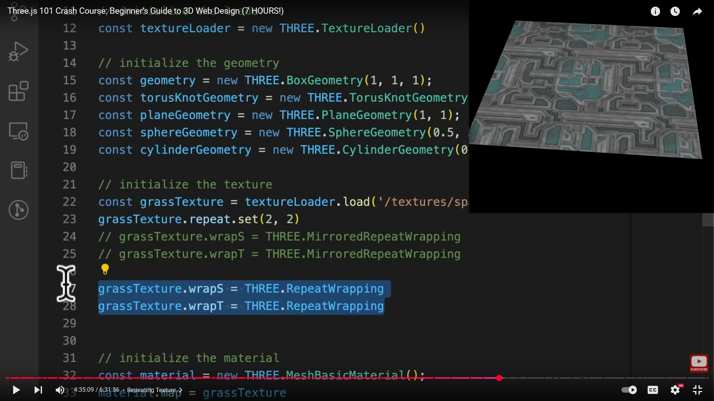
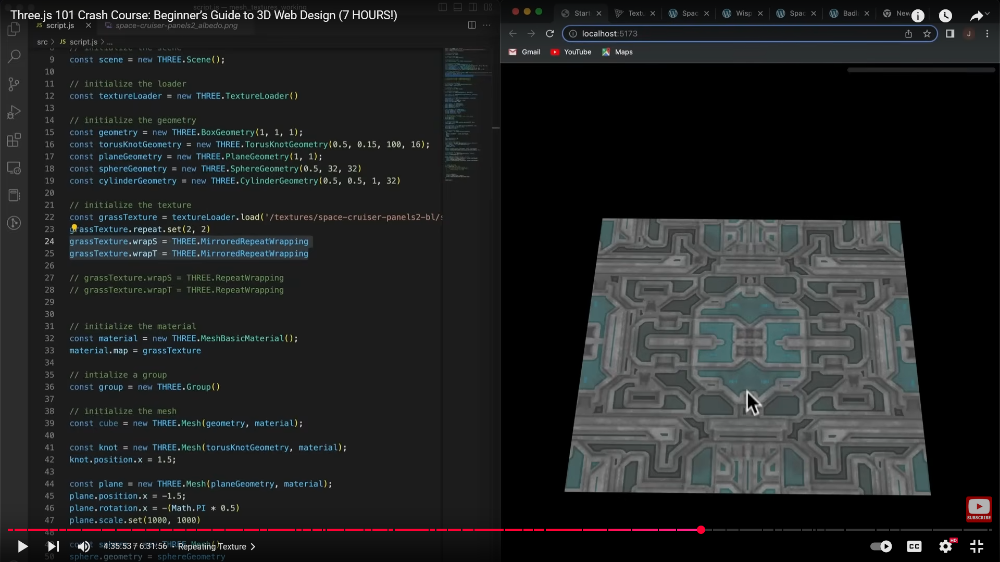

# ----Texture Repeat

🎨 **Texture Wrapping and Repeating in Three.js**

When you apply a texture to a material, sometimes the **UV coordinates** (which determine how the texture maps onto a surface) extend  **beyond the range [0, 1]** .

By default, textures are *clamped* — meaning anything outside `[0, 1]` shows the edge pixel color.

But you can change this behavior using **wrapping** and  **repeating** .

#### 🧩 **1. repeat**

Each texture has a `.repeat` property — a `THREE.Vector2` that controls how many times the texture repeats across the surface.

```js
texture.repeat.set(2, 3);
```

👉 This means:

* The texture repeats **2 times horizontally** (U direction, or X),
* and **3 times vertically** (V direction, or Y).

🧠 Note:

This only works if you also change the wrapping mode (next section).

Otherwise, the texture won’t actually repeat — it’ll still clamp.

#### 🌀 **2. wrapS and wrapT**

These control  **how the texture behaves outside the [0, 1] range** :

* `wrapS` → wrapping mode along the **U (horizontal)** axis.
* `wrapT` → wrapping mode along the **V (vertical)** axis.

Example:

```js
texture.wrapS = THREE.RepeatWrapping;
texture.wrapT = THREE.RepeatWrapping;
```

#### 🧱 **3. Wrapping Modes**

Each of the below are CONSTANTS just like THREE.FrontSide

###### 🟢 `THREE.ClampToEdgeWrapping` (default)

* Extends the **edge color** of the texture beyond the [0, 1] range.
* Texture  **does not repeat** .

```js
texture.wrapS = THREE.ClampToEdgeWrapping;
texture.wrapT = THREE.ClampToEdgeWrapping;
```

🧠 Default behavior — safe, but often boring.

###### 🔁 `THREE.RepeatWrapping`

* The texture **repeats seamlessly** outside the [0, 1] range.

```js
texture.wrapS = THREE.RepeatWrapping;
texture.wrapT = THREE.RepeatWrapping;
texture.repeat.set(4, 4); // repeats 4 times in both directions
```

✅ Commonly used for tiled surfaces like floors, walls, or patterns.



###### 🪞 `THREE.MirroredRepeatWrapping`

* Similar to `RepeatWrapping`, but each alternate repeat is  **flipped like a mirror** .

```js
texture.wrapS = THREE.MirroredRepeatWrapping;
texture.wrapT = THREE.MirroredRepeatWrapping;
texture.repeat.set(2, 2);
```

🪞 Useful when you want a pattern that looks continuous  **without visible seams** .



#### ✨ Example Code

```js
const texture = new THREE.TextureLoader().load('/textures/brick_diffuse.jpg');

// repeat texture 3x horizontally and 2x vertically
texture.repeat.set(3, 2);

// allow repeating
texture.wrapS = THREE.RepeatWrapping;
texture.wrapT = THREE.MirroredRepeatWrapping;

// apply to a material
const material = new THREE.MeshStandardMaterial({ map: texture });
const geometry = new THREE.PlaneGeometry(10, 10);
const mesh = new THREE.Mesh(geometry, material);
scene.add(mesh);
```

# ......................................................................................................................

# Texture Offset

🧭 What is `texture.offset`?

Every texture in Three.js has a property:

```js
texture.offset = new THREE.Vector2(x, y);
```

This controls **where the texture starts** on the geometry —

in other words, it **shifts (translates)** the texture in  **UV space** .

#### 🧠 UV Space Recap

* UV coordinates range from  **0.0 to 1.0** .
* `(0, 0)` → bottom-left corner of the texture.
* `(1, 1)` → top-right corner of the texture.

So when you change `texture.offset`, you’re shifting how the image is *sampled* across the surface.

#### ⚙️ Syntax

```js
texture.offset.set(x, y);
```

* `x` → horizontal offset (U direction)
* `y` → vertical offset (V direction)

Example:

```js
texture.offset.set(0.5, 0);
```

→ moves the texture  **halfway to the right** .

(If `RepeatWrapping` is enabled, it wraps seamlessly!)

#### 🚀 Important Behavior

If **wrapping** is set to the default `ClampToEdgeWrapping`,

offsetting will just **push the texture out of view** — the remaining area will stretch the edge pixel.

✅ For visible motion or tiling, always enable **`RepeatWrapping`** or  **`MirroredRepeatWrapping`** :

```js
texture.wrapS = THREE.RepeatWrapping;
texture.wrapT = THREE.RepeatWrapping;
```

Now, offsetting will appear as **scrolling** or **sliding** texture.

#### 🎮 Example

```js
const texture = new THREE.TextureLoader().load('/textures/brick_diffuse.jpg');

texture.wrapS = THREE.RepeatWrapping;
texture.wrapT = THREE.RepeatWrapping;
texture.repeat.set(2, 2);

// Shift texture half-way right and up
texture.offset.set(0.5, 0.5);

const material = new THREE.MeshStandardMaterial({ map: texture });
const geometry = new THREE.PlaneGeometry(10, 10);
const mesh = new THREE.Mesh(geometry, material);
scene.add(mesh);
```

✅ The texture starts halfway shifted right and upward.

✅ You’ll see the pattern **slide diagonally** across the surface.

#### 🌀 Animated Example (Texture Scrolling Effect)

You can animate `offset` to make textures move, e.g. for  **conveyor belts** ,  **water** , or  **flowing lava** :

```js
function animate() {
  requestAnimationFrame(animate);
  texture.offset.x += 0.01; // move right continuously
  renderer.render(scene, camera);
}
```

🧠 Because of  **RepeatWrapping** , the texture seamlessly wraps back around, creating an  **infinite scrolling illusion** .

#### ⚖️ Interaction with `.repeat`

| Property                     | Effect                               |
| ---------------------------- | ------------------------------------ |
| `texture.repeat.set(x, y)` | Controls how often the texture tiles |
| `texture.offset.set(x, y)` | Controls where the tiling starts     |

They **work together** — for example, to make a moving floor texture that tiles 4× and slides right:

```js
texture.repeat.set(4, 4);
texture.offset.x += 0.01;
```

---

# ----Maps

Let’s dive deep into **“maps”** — the textures that define how a material looks and reacts to light 🌈

**🎯 What is a Map in Three.js?**

In  **Three.js** , a **map** is simply a **texture (image or data)** that is  **applied to a material property** .

Each type of map controls a **different visual aspect** of the surface — such as color, roughness, or bumpiness.

A single material can use **multiple maps** together to create realistic surfaces.

#### 🧩 Common Maps Overview

Here’s a list of major maps and what they do 👇

| Map                                                                                           | Type              | Description                                                     |
| --------------------------------------------------------------------------------------------- | ----------------- | --------------------------------------------------------------- |
| **map**                                                                                 | Color map         | Base color of the surface (like paint).                         |
| **normalMap**                                                                           | Lighting map      | Simulates bumps and dents**without changing geometry** .  |
| **bumpMap**                                                                             | Height map        | Uses grayscale image to fake surface height differences.        |
| **roughnessMap**                                                                        | PBR map           | Controls surface smoothness (how blurred the reflection looks). |
| **metalnessMap**                                                                        | PBR map           | Defines metallic vs non-metallic areas.                         |
| **displacementMap**                                                                     | Geometry map      | Actually**moves vertices**based on height data.           |
| **alphaMap**                                                                            | Transparency map  | Controls transparency per pixel.                                |
| **aoMap**                                                                               | Ambient occlusion | Simulates shadowing in cracks and corners.                      |
| **emissiveMap**                                                                         | Glow map          | Makes areas emit light (like LEDs or lava).                     |
| **specularMap**                                                                         | Legacy (Phong)    | Defines shiny spots for `MeshPhongMaterial`.                  |
| **envMap**                                                                              | Reflection map    | Simulates reflections of the environment.                       |
| **clearcoatMap** , **clearcoatRoughnessMap**, <br />**clearcoatNormalMap** | Advanced PBR      | Adds a thin glossy coat on top (like car paint).                |

#### 🧠 Base Example – Color Map

```js
const textureLoader = new THREE.TextureLoader();
const colorTexture = textureLoader.load('/textures/wood.jpg');

const material = new THREE.MeshStandardMaterial({
  map: colorTexture,
});
```

✅ The texture acts as the **base color** (diffuse map).

Where the wood image is dark, the mesh appears dark; where it’s light, it appears light.

#### ⚙️ Normal Map Example

```js
const normalTexture = textureLoader.load('/textures/wood_normal.jpg');

const material = new THREE.MeshStandardMaterial({
  map: colorTexture,
  normalMap: normalTexture,
});
```

✅ Adds surface *bumps and dents* that react to light —

even though the geometry itself is flat.

#### 🌑 Roughness and Metalness Maps

These are used in **PBR (Physically-Based Rendering)** materials like `MeshStandardMaterial` or `MeshPhysicalMaterial`.

```js
const roughnessMap = textureLoader.load('/textures/metal_roughness.jpg');
const metalnessMap = textureLoader.load('/textures/metal_metalness.jpg');

const material = new THREE.MeshStandardMaterial({
  map: colorTexture,
  roughnessMap,
  metalnessMap,
});
```

✅ You get realistic shiny/rough metallic surfaces.

* Dark = smooth
* Light = rough

  (for roughnessMap)

#### 💨 Displacement Map (actually moves geometry!)

```js
const displacementMap = textureLoader.load('/textures/terrain_height.png');

const material = new THREE.MeshStandardMaterial({
  map: colorTexture,
  displacementMap,
  displacementScale: 1,
});

const geometry = new THREE.PlaneGeometry(10, 10, 256, 256);
```

✅ The **vertices** move based on grayscale intensity in the map.

⚠️ Requires **high vertex count geometry** to see the effect.

#### 💡 Emissive Map (glowing parts)

```js
const emissiveMap = textureLoader.load('/textures/lights_emissive.jpg');

const material = new THREE.MeshStandardMaterial({
  map: colorTexture,
  emissive: new THREE.Color(0xffffff),
  emissiveMap: emissiveMap,
  emissiveIntensity: 1,
});
```

✅ Areas of the emissive texture glow — perfect for neon signs, screens, or eyes.

#### 🕳️ AO Map (Ambient Occlusion)

Simulates how ambient light gets trapped in crevices.

```js
const aoMap = textureLoader.load('/textures/ao.jpg');

const material = new THREE.MeshStandardMaterial({
  map: colorTexture,
  aoMap,
  aoMapIntensity: 1,
});
```

⚠️ Requires the geometry to have a **secondary set of UVs** (`uv2`).

> #### 🌑 What AO Map Actually Does and Why need secondary set of UVs `(uv2)`
>
> An **Ambient Occlusion (AO) Map** simulates **soft shadows in crevices, folds, and corners** — places where light from the environment is  *less likely to reach* .
>
> It gives your 3D model a much more realistic sense of  **depth and contact shading** , even when using global or ambient light.
>
> In Three.js:
>
> ```js
> material.aoMap = textureLoader.load('/textures/ao.jpg');
> material.aoMapIntensity = 1;
> ```
>
> But if you apply this directly, you’ll often see **no visible effect at all** 😐 unless you do something special…
>
> ##### 💡 Why Two UV Sets?
>
> Think of it like this:
>
> * The  **first UV set (`uv`)** : used for color textures, normal maps, etc.
>
>   It’s optimized for **tiling** or  **mirroring** .
> * The  **second UV set (`uv2`)** : used specifically for **light baking** (AO, light maps).
>
>   It usually keeps each face of the geometry  **non-overlapping** , so baked lighting looks correct.
>
> This separation allows an artist (or the engine) to use:
>
> * **Seamless color textures** (tiling)
> * **Accurate AO** (baked from the actual geometry)
>
> on the same model.
>
> ##### ⚙️ How to Add `uv2` in Three.js
>
> If your geometry doesn’t already have it (like `BoxGeometry` or `SphereGeometry`),
>
> you can **copy** the first UV set to create a `uv2`:
>
> ```js
> geometry.setAttribute('uv2', new THREE.BufferAttribute(geometry.attributes.uv.array, 2));
> ```
>
> ✅ Now your geometry has both:
>
> * `uv` → used for color, normal, roughness
> * `uv2` → used for AO
>
> ##### 🔧 Full Working Example
>
> ```js
> const textureLoader = new THREE.TextureLoader();
>
> const colorMap = textureLoader.load('/textures/wood/color.jpg');
> const aoMap = textureLoader.load('/textures/wood/ao.jpg');
>
> const geometry = new THREE.BoxGeometry(2, 2, 2);
>
> // Copy UVs to create uv2
> geometry.setAttribute('uv2', new THREE.BufferAttribute(geometry.attributes.uv.array, 2));
>
> const material = new THREE.MeshStandardMaterial({
>   map: colorMap,
>   aoMap: aoMap,
>   aoMapIntensity: 1,
> });
>
> const mesh = new THREE.Mesh(geometry, material);
> scene.add(mesh);
> ```
>
> #### 🎨 Visual Effect
>
> Without AO map:
>
>> Everything looks evenly lit — surfaces feel “flat”.
>>
>
> With AO map:
>
>> You’ll notice **darkening in corners and inner areas** — it adds realism.
>>

#### 🧴 Alpha Map (Transparency)

```js
const alphaMap = textureLoader.load('/textures/leaf_alpha.png');

const material = new THREE.MeshStandardMaterial({
  map: colorTexture,
  alphaMap,
  transparent: true,
});
```

✅ The black parts of the alpha map become  **transparent** , great for leaves, fences, hair, etc.

#### 🪞 Environment Map (Reflections)

```js
const envMap = cubeTextureLoader.load([
  'px.jpg', 'nx.jpg', 'py.jpg', 'ny.jpg', 'pz.jpg', 'nz.jpg',
]);

const material = new THREE.MeshStandardMaterial({
  envMap,
  metalness: 1,
  roughness: 0.1,
});
```

✅ Adds **reflections** from the surroundings.

Perfect for metals, glass, or chrome.

#### 🎯 Summary Table

| Map                 | Used In            | Purpose            |
| ------------------- | ------------------ | ------------------ |
| `map`             | All                | Base color         |
| `normalMap`       | Standard, Physical | Fake bumps         |
| `bumpMap`         | Lambert, Phong     | Legacy bumps       |
| `displacementMap` | Standard, Physical | Move vertices      |
| `roughnessMap`    | Standard, Physical | Surface smoothness |
| `metalnessMap`    | Standard, Physical | Metallic property  |
| `aoMap`           | Standard, Physical | Ambient occlusion  |
| `emissiveMap`     | Standard, Physical | Glow/light         |
| `alphaMap`        | All                | Transparency       |
| `envMap`          | Standard, Physical | Reflections        |

---

# ----Lights

💡 LIGHTS IN THREE.JS — COMPLETE GUIDE

### 🌟 1. What Are Lights?

In Three.js, **lights illuminate the scene** so that materials like

`MeshStandardMaterial`, `MeshPhysicalMaterial`, and `MeshPhongMaterial` can show shading, reflections, and highlights.

🧠 **Important:**

Some materials like `MeshBasicMaterial` **don’t react** to lights — they just display pure color or texture.

### 🔧 2. Basic Syntax

```js
const light = new THREE.DirectionalLight(0xffffff, 1); // (color, intensity)
scene.add(light);
```

#### Common properties for all lights:

| Property      | Description                                            | Example                              |
| ------------- | ------------------------------------------------------ | ------------------------------------ |
| `color`     | Light color                                            | `0xffffff`(white)                  |
| `intensity` | Brightness (default = 1)                               | `0.5`,`2`                        |
| `position`  | Position in 3D space                                   | `light.position.set(10, 10, 10)`   |
| `target`    | (For directional & spot lights) where the light points | `light.target.position.set(0,0,0)` |

### 🔦 3. Types of Lights in Three.js

#### 🕯️ **A. AmbientLight**

* Simulates  **soft global illumination** .
* Lights all objects  **equally** , no shadows, no direction.

```js
const ambientLight = new THREE.AmbientLight(0xffffff, 0.5);
scene.add(ambientLight);
```

✅ Use case:

Fill light — to prevent overly dark shadows when using directional or point lights.

#### 💡 **B. DirectionalLight**

* Simulates sunlight — **parallel rays** from one direction.
* Affects all objects in the same way, regardless of distance.
* Can cast  **shadows** .

```js
const dirLight = new THREE.DirectionalLight(0xffffff, 1);
dirLight.position.set(5, 10, 7.5);
dirLight.castShadow = true;
scene.add(dirLight);
```

Add a helper:

```js
const dirLightHelper = new THREE.DirectionalLightHelper(dirLight, 5);
scene.add(dirLightHelper);
```

✅ Use case:

Outdoor scenes, sunlight, shadow casting.

#### 💡 **C. PointLight**

* Emits light **in all directions** from a single point — like a bulb.
* Has **distance** (range) and **decay** (falloff rate).

```js
const pointLight = new THREE.PointLight(0xffaa00, 1, 50, 2);
// color, intensity, distance, decay
pointLight.position.set(2, 3, 4);
scene.add(pointLight);
```

✅ Use case:

Lamps, bulbs, glowing balls, gym lights, etc.

Add a helper:

```js
const helper = new THREE.PointLightHelper(pointLight, 1);
scene.add(helper);
```

#### 🔦 **D. SpotLight**

* Emits light in a  **cone shape** , like a flashlight or stage light.
* Has  **angle** ,  **penumbra** ,  **distance** , and  **decay** .

```js
const spotLight = new THREE.SpotLight(0xffffff, 1, 100, Math.PI / 6, 0.3, 2);
// color, intensity, distance, angle, penumbra, decay
spotLight.position.set(5, 10, 5);
spotLight.castShadow = true;
scene.add(spotLight);

// Helper
scene.add(new THREE.SpotLightHelper(spotLight));
```

✅ Use case:

Spotlights on objects, gym machine lighting, product focus lighting.

> 💡 What is `penumbra` in a Spotlight?
>
> In  **Three.js** , the `penumbra` property of a `THREE.SpotLight` controls **the softness of the spotlight’s edge** — how gradually the light fades out near the outer boundary of its cone.
>
> Think of it like this:
>
> * A **spotlight** emits light in a **cone** shape.
> * The center of the cone (inner area) is  **brightest** .
> * The edge of the cone (outer area) can be **sharp** or  **soft** , depending on `penumbra`.
>
> ##### 🧠 Definition
>
> ```js
> spotLight.penumbra
> ```
>
> * **Type:** `Number`
> * **Default:** `0.0`
> * **Range:** `0.0` → `1.0`
>
> ##### 🎨 Behavior
>
> | Value   | Description                                                                               |
> | ------- | ----------------------------------------------------------------------------------------- |
> | `0.0` | The edge of the light cone is**hard and sharp**— light cuts off immediately.       |
> | `0.5` | The edge**softens gradually**— smooth fade between bright and dark.                |
> | `1.0` | The light**fades fully and softly**across the outer cone — very smooth transition. |
>
> ##### 📸 Real-world Analogy
>
> Imagine a  **flashlight** :
>
> * A **new flashlight lens** (focused) → sharp beam → `penumbra = 0`.
> * A **diffused flashlight lens** → soft edge glow → `penumbra = 0.5`.
> * A **heavily frosted flashlight** → very wide soft edge → `penumbra = 1.0`.
>
> So `penumbra` is like adding *diffusion or softness* to the beam’s boundary.
>
> ##### 🧩 Example Code
>
> ```js
> import * as THREE from 'three'
>
> const scene = new THREE.Scene()
>
> // Spotlight setup
> const spotLight = new THREE.SpotLight(0xffffff, 2)
> spotLight.position.set(5, 10, 5)
> spotLight.angle = Math.PI / 6        // cone spread
> spotLight.penumbra = 0.5             // soft edge
> spotLight.decay = 2
> spotLight.distance = 50
> scene.add(spotLight)
>
> // Helper to visualize
> scene.add(new THREE.SpotLightHelper(spotLight))
> ```
>
> ✅ Increasing `penumbra` makes the  **transition from light to shadow smoother** .
>
> ##### ⚙️ Behind the Scenes (How it works)
>
> The `penumbra` value is used inside Three.js’s **SpotLight shader** to apply a smooth gradient based on the  **angle between the light direction and the surface normal** .
>
> It linearly attenuates brightness near the edge of the cone.
>
> So, mathematically, it doesn’t change the cone shape — only the  **intensity falloff near the edge** .
>
> ##### 🧠 Common Mistake
>
> Developers often confuse `penumbra` with:
>
> * `angle`: controls the **width of the cone** (the total spread).
> * `penumbra`: controls the  **softness at the edge of that cone** .
>
> You often use both together for realistic results:
>
> ```js
> spotLight.angle = Math.PI / 4
> spotLight.penumbra = 0.4
> ```
>
> ##### 🪄 Bonus Tip
>
> If you want the  **softest and most realistic falloff** , combine:
>
> ```js
> spotLight.castShadow = true
> spotLight.shadow.mapSize.set(1024, 1024)
> spotLight.penumbra = 1
> spotLight.angle = Math.PI / 5
> ```
>
> Then you’ll get a **cinematic spotlight** look like on a stage or theater floor.
>
> ##### 🔍 Summary Table
>
> | Property     | Controls                              | Range   | Effect                    |
> | ------------ | ------------------------------------- | ------- | ------------------------- |
> | `angle`    | Width of light cone                   | radians | Wider or narrower beam    |
> | `penumbra` | Softness of cone edge                 | 0 → 1  | Sharp → soft edge        |
> | `decay`    | Light intensity falloff over distance | number  | 1 = linear, 2 = realistic |
> | `distance` | Max range of light                    | number  | Beyond this, no light     |

#### 🌐 **E. HemisphereLight**

* Simulates natural outdoor light — with different colors for sky and ground.
* Non-directional, ambient-like.

```js
const hemiLight = new THREE.HemisphereLight(0x00aaff, 0xffaa00, 1);
// skyColor, groundColor, intensity
scene.add(hemiLight);
```

✅ Use case:

Soft outdoor lighting, sky-ground color mixing.

#### 🔥 **F. RectAreaLight**

* Emits light from a rectangular surface.
* Works only with **MeshStandardMaterial** and  **MeshPhysicalMaterial** .
* Great for studio-style or product lighting.

```js
const rectLight = new THREE.RectAreaLight(0xffffff, 5, 4, 10);
// color, intensity, width, height
rectLight.position.set(5, 5, 0);
rectLight.lookAt(0, 0, 0);
scene.add(rectLight);
```

Add helper:

```js
scene.add(new THREE.RectAreaLightHelper(rectLight));
```

✅ Use case:

Photo studio lighting, product rendering, gym product showcase.

#### 🧠 4. Shadow Setup

For any light that supports shadows (Directional, Point, Spot):

```js
light.castShadow = true;
renderer.shadowMap.enabled = true;
mesh.castShadow = true;
mesh.receiveShadow = true;
```

For better shadow quality:

```js
light.shadow.mapSize.width = 2048;
light.shadow.mapSize.height = 2048;
light.shadow.bias = -0.001;
```

### 🧮 5. Combining Lights (Common Pattern)

You often combine multiple types for realism:

```js
// Global fill
scene.add(new THREE.AmbientLight(0xffffff, 0.3));

// Sunlight
const dirLight = new THREE.DirectionalLight(0xffffff, 1);
dirLight.position.set(10, 10, 10);
dirLight.castShadow = true;
scene.add(dirLight);

// Indoor bulb
const pointLight = new THREE.PointLight(0xffcc88, 1, 30);
pointLight.position.set(0, 5, 0);
scene.add(pointLight);
```

✅ Result: Balanced, realistic lighting.

### 🧪 6. Practical Example

```js
// SCENE SETUP
const scene = new THREE.Scene();
const camera = new THREE.PerspectiveCamera(75, window.innerWidth/window.innerHeight, 0.1, 100);
camera.position.set(2, 2, 5);
const renderer = new THREE.WebGLRenderer({ antialias: true });
renderer.setSize(window.innerWidth, window.innerHeight);
renderer.shadowMap.enabled = true;
document.body.appendChild(renderer.domElement);

// OBJECT
const geometry = new THREE.BoxGeometry();
const material = new THREE.MeshStandardMaterial({ color: 0x0077ff });
const cube = new THREE.Mesh(geometry, material);
cube.castShadow = true;
cube.receiveShadow = true;
scene.add(cube);

// PLANE
const plane = new THREE.Mesh(
  new THREE.PlaneGeometry(10, 10),
  new THREE.MeshStandardMaterial({ color: 0x555555 })
);
plane.rotation.x = -Math.PI / 2;
plane.receiveShadow = true;
scene.add(plane);

// LIGHTS
const ambient = new THREE.AmbientLight(0xffffff, 0.3);
scene.add(ambient);

const dirLight = new THREE.DirectionalLight(0xffffff, 1);
dirLight.position.set(5, 10, 5);
dirLight.castShadow = true;
scene.add(dirLight);

// ANIMATE
function animate() {
  cube.rotation.x += 0.01;
  cube.rotation.y += 0.01;
  renderer.render(scene, camera);
  requestAnimationFrame(animate);
}
animate();
```

### 📊 7. Summary Table

| Light Type       | Directional?        | Shadows? | Use Case                 |
| ---------------- | ------------------- | -------- | ------------------------ |
| AmbientLight     | ❌                  | ❌       | Global base light        |
| DirectionalLight | ✅                  | ✅       | Sunlight, outdoor scenes |
| PointLight       | 🔘 (All directions) | ✅       | Bulbs, lamps             |
| SpotLight        | 🔦 (Cone)           | ✅       | Flashlight, stage light  |
| HemisphereLight  | ☁️ (Sky-Ground)   | ❌       | Outdoor sky effect       |
| RectAreaLight    | ⬛ (Area)           | ✅       | Studio lighting          |

---

# ----GLTF / GLB models

This is a key part of real-world **Three.js** and **React Three Fiber** workflows 👇

Let’s go deep into **GLTF / GLB models in Three.js** —

what they are, how they work, how to load, customize, animate, and optimize them.

### 🧩 What Are glTF and GLB Files?

Both **glTF** (`.gltf`) and **GLB** (`.glb`) are modern **3D file formats** developed by the **Khronos Group** (the same group behind WebGL and Vulkan).

They’re designed specifically for  **real-time 3D rendering** , like in Three.js, Unreal, or Unity.

### 💡 Think of them as:

> “The JPEG of 3D.”
>
> Compact, standardized, web-friendly 3D assets.

### 📁 glTF vs GLB

| Format          | Description                                                                                                                |
| --------------- | -------------------------------------------------------------------------------------------------------------------------- |
| **.gltf** | A JSON-based format. References external files (textures, binary data).                                                    |
| **.glb**  | A single**binary**file — contains everything (geometry, materials, animations, textures). Easier to load, portable. |

✅ Both describe the same data structure (scene, materials, nodes, cameras, lights).

### 🧱 What Does a glTF / GLB File Contain?

A model file can contain:

* **Meshes** — the actual geometry
* **Materials** — how it looks (PBR-based)
* **Textures** — color maps, roughness, normal, AO, etc.
* **Skeletons** — for rigged (animated) characters
* **Animations** — baked keyframes for position/rotation/scale
* **Lights / Cameras / Scene Graph**
* **Metadata** — names, transforms, user data, extensions

### ⚙️ Loading a glTF / GLB Model in Three.js

You use the **GLTFLoader** from Three’s examples.

```js
import * as THREE from 'three'
import { GLTFLoader } from 'three/examples/jsm/loaders/GLTFLoader.js'
import { OrbitControls } from 'three/examples/jsm/controls/OrbitControls.js'

const scene = new THREE.Scene()
const camera = new THREE.PerspectiveCamera(75, window.innerWidth / window.innerHeight, 0.1, 100)
camera.position.set(2, 2, 5)

const renderer = new THREE.WebGLRenderer({ antialias: true })
renderer.setSize(window.innerWidth, window.innerHeight)
document.body.appendChild(renderer.domElement)

const controls = new OrbitControls(camera, renderer.domElement)

const loader = new GLTFLoader()
loader.load('/models/robot.glb', (gltf) => {
  const model = gltf.scene
  scene.add(model)

  console.log(gltf) // inspect animations, materials, etc.
}, undefined, (error) => {
  console.error(error)
})

function animate() {
  requestAnimationFrame(animate)
  controls.update()
  renderer.render(scene, camera)
}
animate()
```

##### 🧩 What the Loader Returns

When you load a `.glb`, the `gltf` object looks like this:

```js
{
  scene: Object3D,       // The root scene
  scenes: [Object3D],    // If there are multiple scenes
  animations: [AnimationClip],
  cameras: [Camera],
  asset: { version: '2.0', generator: 'Blender 3.6' },
  parser: GLTFParser,
  userData: {}
}
```

You usually use:

```js
scene.add(gltf.scene)
```

### 🎥 Playing Animations

If your model includes animations (e.g. from Blender):

```js
const mixer = new THREE.AnimationMixer(gltf.scene)
const action = mixer.clipAction(gltf.animations[0])
action.play()

function animate() {
  requestAnimationFrame(animate)
  mixer.update(clock.getDelta())
  renderer.render(scene, camera)
}
```

💡 You can mix multiple animations — e.g. “walk”, “run”, “idle”.

### 🎨 Accessing Meshes, Materials, and Nodes

Each part of your model is an  **Object3D** , often grouped in a hierarchy.

```js
gltf.scene.traverse((child) => {
  if (child.isMesh) {
    child.material.metalness = 0.5
    child.material.color.set('hotpink')
  }
})
```

Or by name (if you named it in Blender):

```js
const head = gltf.scene.getObjectByName('Head')
head.rotation.y = Math.PI / 4
```

### 🧠 glTF Is PBR-Ready

glTF/GLB uses **PBR (Physically Based Rendering)** materials:

* `baseColor` → diffuse/albedo texture
* `metallicRoughness` → controls metalness & roughness
* `normalMap` → adds surface detail
* `occlusionMap` → adds ambient shadow
* `emissiveMap` → glow

So it’s ready for modern, realistic lighting out-of-the-box.

### 🧮 File Size Optimization Tips

1. Use **.glb** (binary) instead of .gltf for compactness.
2. Compress textures (WebP or Basis / KTX2).
3. Use **Draco Compression** (Three.js supports it easily).

```js
import { DRACOLoader } from 'three/examples/jsm/loaders/DRACOLoader.js'

const dracoLoader = new DRACOLoader()
dracoLoader.setDecoderPath('/draco/')
loader.setDRACOLoader(dracoLoader)
```

This can reduce file size **by 50–90%** with minimal quality loss.

### 🔁 Transformations on Loaded Model

You can move, rotate, or scale models like any other mesh:

```js
model.position.set(0, -1, 0)
model.rotation.y = Math.PI / 2
model.scale.set(2, 2, 2)
```

### ⚡ Troubleshooting Common Issues

| Issue                  | Fix                                                        |
| ---------------------- | ---------------------------------------------------------- |
| Model not visible      | Check scale, position, or missing lights                   |
| Textures look dull     | Use `sRGBEncoding`on renderer and texture maps           |
| Huge or tiny model     | Apply `model.scale.set()`                                |
| Animations don’t play | Check `gltf.animations.length`and use `AnimationMixer` |

### 🧱 Summary

| Feature                | glTF / GLB                                       |
| ---------------------- | ------------------------------------------------ |
| Format type            | glTF → JSON + files; GLB → binary (all-in-one) |
| Materials              | PBR-based (standardized)                         |
| Animations             | Fully supported (rigged / skeletal)              |
| Supported in Three.js? | ✅ Yes (`GLTFLoader`)                          |
| Compression            | ✅ Draco, Meshopt                                |
| Lighting model         | Physically Based (PBR)                           |

---
