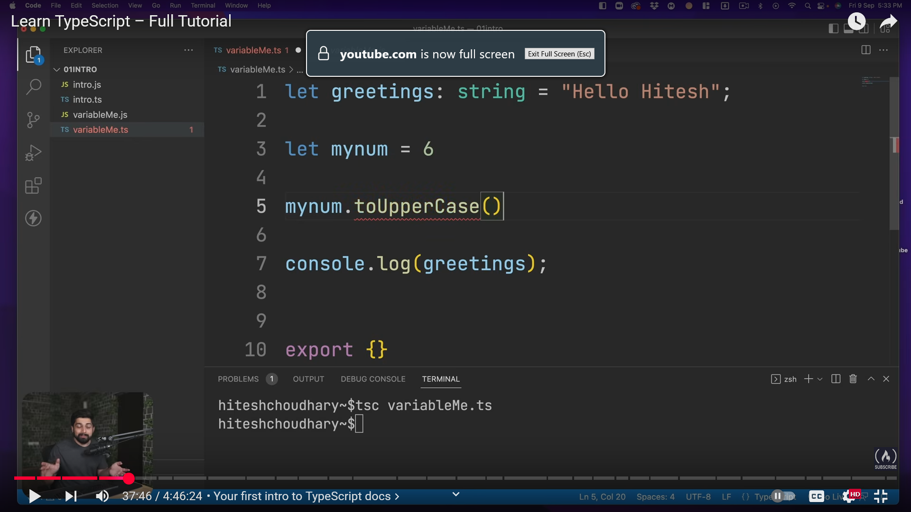
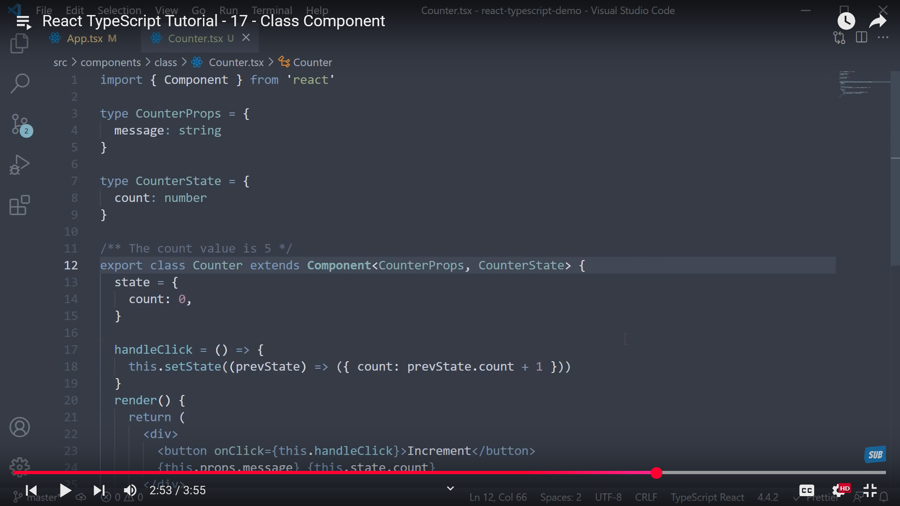
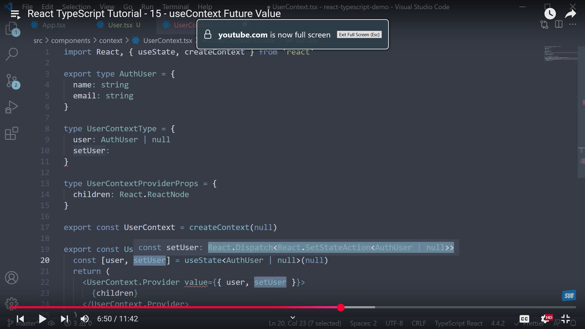
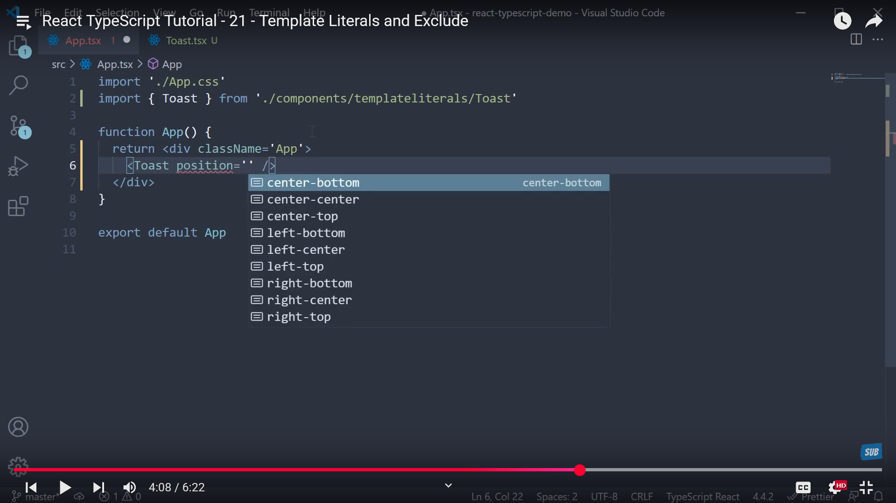

# Typescript - Introduction

TypeScript is a superset of JavaScript that adds extra features like static typing, interfaces, enums, and more.

--Essentially, TypeScript is JavaScript with additional syntax for defining types, making it a powerful tool for building scalable and
maintainable applications.

* Static typing allows you to define variable types and helps catch errors before running the code.
* TypeScript is compiled into JavaScript, ensuring it works in all JavaScript environments.
* It’s widely used for web development on both the client and server sides.
* Developed by Microsoft, TypeScript is trusted by companies like Google, Slack, Airbnb, and Asana.

****🔥 Latest Update [2025]:**** TypeScript is now up to ****10x faster**** thanks to a new native compiler written in Go. It directly improves
compilation and editor speed, making development smoother than ever.

> 👉 TypeScript is transpiled into JavaScript using a compiler-- TypeScript being converted into JavaScript means it runs anywhere that JavaScript runs!

**💥TypeScript has an official compiler which can be installed through npm.**

-- TypeScript files use the `.ts` extension rather than the `.js` extension of JavaScript files.

#### Why should I use TypeScript?

* JavaScript is a loosely typed language. It can be difficult to understand what types of data are being passed around in JavaScript.
* In JavaScript, function parameters and variables don't have any information! So developers need to look at documentation, or guess based
  on the implementation.
* TypeScript allows specifying the types of data being passed around within the code, and has the ability to report errors when the
  types don't match.   For example, TypeScript will report an error when passing a string into a function that expects a number. JavaScript will not.

#### Typescript is about Type-safety

Because javascript is not type-safe, it allows for example addition of number and string ie it won't stop you from doing that. Hence below are some of the similar odd behavior

#### Static Checking

* The simple idea behind the TypeScript is static checking. That's the only job.
* The static checking is something which is present in many languages, especially the languages such as Java or maybe even GoLang. A lot of languages are built in with the static checking. And what does
* 🔑 Static checking means that whenever you're writing the code, the parser of the language or the entire syntax of the language is constantly being analyzed by the IDE's. But not in the case of JavaScript. Whatever you write is just okay for the JavaScript.
  * And when the code executes in the browser or in the engine like node environment or anything done, then only the errors of JavaScript are being thrown at your face. And at that time, you just say, ah, that's wrong. And you need to rerun the code itself. Hence it would be really a great help if there's a static checker.
* ➡️ For example, I'm trying to access an object which is not yet defined. If  something can analyze my code and can give me a hint that that object  doesn't exist in the object properties, then obviously it's much more  easier for me. For example, when we are trying to add a few numbers and  then the one of the number is not a number, maybe a string, then an error line would help

> HENCE---- 🚀 Typescript is just to analyze your code and help you to understand that you might be running into a potential error without even running the code and getting the errors at the runtime itself. That's all it does.

#### In the TypeScript, you write a lot more code compared to JavaScript

#### TypeScript is a Development Tool

The most important thing know is TypeScript is a development tool. Your project still runs in JavaScript. The code that you produce or you send to the production is still a pure 100% JavaScript code. So TypeScript is just a layer on top of JavaScript. It's a super set of JavaScript. But rather, it would be accurate to say that it's a development tool.

> It helps you to write better code with less problems with a more scalable and maintainable code that is easily understandable and produces and the chances of producing the error is much more less.

#### If not Type-safe just gets error line it won't stop it from running in the browser or something

#### Examples


But you won't get error below, even though adding with string and number which is wrong acc to Typescript--


BUT THERE ARE WAYS TO AVOID THESE TOO

#### Installation

**Install TypeScript globally (recommended for CLI usage)**

```
npm install -g typescript
```

After installation, check the version:

```
tsc -v
```

**Alternatively, install it locally in a project**

```
npm install --save-dev typescript
```

**Initialize TypeScript in your project**

This creates a `tsconfig.json` file:

```
npx tsc --init
```

This file contains all configuration options for the TypeScript compiler.

**Write a `.ts` file**

Example: `index.ts`

```typescript
let message: string = "Hello, TypeScript!";
```

**Compile the file**

```
npx tsc index.ts
```

It will generate a compiled `index.js`.

---

# Types

## 🔹 **1. Primitive Types**

These are the most basic types in TypeScript, directly mapped to JavaScript primitives.

### 1.1 `string`

Textual data.

```ts
let name: string = "Arun";
```

💡 Breakdown in human language:

* `name`: the variable name
* `: `: means** *"has type"***
* `object`: the type assigned to the variable

So putting it together:

> “The variable `user` has the type `object`.”

### 1.2 `number`

All numeric values (integer, float, etc.).

```ts
let age: number = 25;
```

### 1.3 `boolean`

True or false.

```ts
let isActive: boolean = true;
```

### 1.4 `bigint`

Used for very large integers.

```ts
let largeNumber: bigint = 9007199254740991n;
```

### 1.5 `symbol`

Unique identifiers.

```ts
let sym1: symbol = Symbol("id");
```

### 1.6 `null` and `undefined`

```ts
let empty: null = null;
let nothing: undefined = undefined;
```

> By default, these are **subtypes** of all other types unless `--strictNullChecks` is on.

## 🔹 **2. Object Types**

Types that describe non-primitive values like objects, arrays, and functions.

### 2.1 `object`

Represents any non-primitive type.

```ts
let user: object = { name: "Arun" };
```

### 2.2 Interfaces and Object Literals

Custom structure.

```ts
interface User {
  id: number;
  name: string;
}

let user1: User = { id: 1, name: "Arun" };
```

## 🔹 **3. Array Types**

### 3.1 Using `[]`

```ts
let scores: number[] = [100, 95, 90];
```

### 3.2 Using `Array<Type>`

```ts
let names: Array<string> = ["Arun", "John"];   // OR---  let names: string[] = ["Arun", "John"]; 
```

> ✅ Explanation:
>
> * `Array<string>` is the  **generic syntax** .
> * `string[]` is the  **shorthand array syntax** .
>
> Both declare an array of strings. It's just a matter of  **preference or context** :
>
> * Use `Array<Type>` when working with  **more complex types** , like `Array<User>` or `Array<Array<number>>`.
> * Use `Type[]` when you want a  **cleaner, more concise syntax** , especially for primitive types.

## 🔹 **4. Tuple Types**

Fixed-length arrays with specified types.

```ts
let userTuple: [string, number] = ["Arun", 25];
```

Can also have optional and rest elements:

```ts
let mixed: [string, ...number[]] = ["count", 1, 2, 3];
```

* Used in API call responses coz they may send you or expects datas in array in specific order with specific types
* Improves Readability
* Expected datas must be in correct order, and number of items
  * Example----
  * ```typescript
    type RGB = [r: number, g: number, b: number];
    const red: RGB = [255, 0, 0];
    ```

## 🔹 **5. Enum Types**

Used to define named constants.

> Remember, Javascript doesn't have any built-in enums

An **`enum`** (short for  **enumeration** ) is a TypeScript feature that allows you to define a named set of related values that can be either:

* **Auto-incrementing numbers** (numeric enums)
* **Explicit string constants** (string enums)

It improves code readability, type safety, and autocomplete suggestions.

### 5.1 Numeric Enum

```ts
enum Direction {
  Up,
  Down,
  Left,
  Right
}
```

This defines a `Direction` enum with  **4 members** :

* `Direction.Up` = 0
* `Direction.Down` = 1
* `Direction.Left` = 2
* `Direction.Right` = 3

These values are **automatically assigned** starting from 0.

### 5.2 String Enum

```ts
enum Status {
  Success = "SUCCESS",
  Error = "ERROR"
}
```

### 5.3 **Heterogeneous Enums** (mix of number and string — rare)

```typescript
enum Result {
  Ok = 1,
  Error = "ERROR"
}
```

⚠️ Usually discouraged — can be confusing.

**Why Use Enums?**

✅ Better than magic strings or numbers  ✅ Autocomplete and compile-time checks    ✅ Can loop through values   ✅ Self-documenting

## 🔹 **6. Function Types**

### 6.1 Function Signature

```ts
let greet: (name: string) => string;

greet = (name) => "Hello " + name;
```

**What does this mean?**

📌 First Line:   `let greet: (name: string) => string;`

This declares a **function variable** `greet` with a specific  **function type** .

🔍 Explanation:

* `greet` is a  **variable that must store a function** .
* This function:
  * **Takes one argument** named `name` of type `string`
  * **Returns a value** of type `string`

So it's saying:

> "`greet` must be a function that takes a string and returns a string."

It does **not define** the function yet — it just **describes the shape** (i.e., the type).

📌Second Line:   `greet = (name) => "Hello " + name;`

We **assign a function** to `greet`.

* `(name) => "Hello " + name` is an  **arrow function** .
* It takes a string argument `name` and returns `"Hello "` plus the name.

✅ This function **matches** the type we declared earlier.

### 6.2 Optional and Default Params

```ts
function add(a: number, b: number = 10): number {
  return a + b;
}
```

### 6.3 Rest Parameters

```ts
function logMessages(...messages: string[]): void {
  console.log(messages.join(", "));
}
```

OTHER EXAMPLES----

🔹 **Arrow function example--**

```ts
const warn = (text: string): boolean=> {
  console.warn("Warning:", text);
  return true
}
```

**🔹  Callback function returning `void`**

This is common in event handlers or callback-style APIs.

```ts
function runCallback(callback: () => number) {
  callback();
}

runCallback(() => {
  console.log("Callback run");
  return 15
});
```

* The `callback` function takes no args and returns nothing.

## 🔹 **7. Union and Intersection Types**

### 7.1 Union (`|`)

A variable can be one of many types.

```ts
let id: number | string = "123";
```

### 7.2 Intersection (`&`)

A value must satisfy multiple types.

```ts
type Admin = { role: string };
type User = { name: string };

let adminUser: Admin & User = { role: "admin", name: "Arun" };
```

##### `type`

`type` is a **TypeScript-specific keyword** (not part of JavaScript) that lets you:

* Give a **name** (alias) to a complex or custom type
* Define  **object shapes** ,  **unions** ,  **intersections** ,  **tuples** , etc.

Let’s break the above code down clearly and then explain the concept of **intersection types (`&`)** in full detail.

✅ What does the code do?

1. `type Admin = { role: string }`

   ➤ Defines a type with a `role` property.
2. `type User = { name: string }`

   ➤ Defines a type with a `name` property.
3. `adminUser: Admin & User`

   ➤ Declares a variable `adminUser` that must satisfy **both** `Admin` **and** `User` types.
4. `{ role: "admin", name: "Arun" }`

   ➤ The object being assigned has  **both required properties** , so it's valid.

✅ So:

> `adminUser` is an object that has  **all properties of Admin AND User** .

**🔷 What is an Intersection Type?**

In TypeScript, an **intersection type** combines **multiple types into one** using the `&` (ampersand) operator.

**📌 Syntax:**

```ts
type Combined = TypeA & TypeB;
```

**This means:**

> "An object of type `Combined` must have **all the properties of both** `TypeA` and `TypeB`."

🧠 Think of it like merging two sets of rules:

**Example:**

```ts
type A = { a: number };
type B = { b: string };

type AB = A & B;

// Valid:
const value: AB = { a: 10, b: "hello" };

// Invalid:
const invalid1: AB = { a: 10 }; // ❌ Missing b
const invalid2: AB = { b: "hello" }; // ❌ Missing a
```

## 🔹8. Date Types

✅ Declaring Dates in TypeScript

```ts
let today: Date = new Date();
console.log(today); // Current date and time
```

You can also specify a date:

```ts
let birthday: Date = new Date("1995-12-17");
let specificDate: Date = new Date(2024, 5, 6); // June 6, 2024 (months are 0-indexed)
```

✅ TypeScript Benefits

You get type safety:

```ts
function formatDate(date: Date): string {
  return date.toISOString().split("T")[0];
}
```

You **can't accidentally pass a string or number** unless explicitly allowed.

## 🔹9. Regex Types

✅ Basic Syntax

```ts
const pattern: RegExp = /hello/;
const text: string = "hello world";

console.log(pattern.test(text)); // true
```

You can also use the constructor syntax:

```ts
const regex: RegExp = new RegExp("hello", "i"); // 'i' for case-insensitive
```

🛠️ Example

```ts
const emailRegex: RegExp = /^[\w.-]+@[\w.-]+\.\w+$/;

function isValidEmail(email: string): boolean {
  return emailRegex.test(email);
}

console.log(isValidEmail("test@example.com")); // true
```

## 🔹 **10.** Maps,WeakMaps, ReadonlyMaps, Sets, WeakSets, ReadonlySets (See Generics)

```typescript
					// ------ Maps

const map: Map<number, string> = new Map();

//Or

const map = new Map<number, string>()
//This works perfectly fine, and TypeScript will infer the type of map as Map<number, string> automatically.


// Basic Map with generics
const map = new Map<string, number>([["sdf", 3]])
map.set("sdf", 3)

// Nested Map with generics
const map2 = new Map<string, Map<string, number>>()

	//WeakMap

const weakMap: WeakMap<object, string> = new WeakMap();

const obj = { name: "Arun" };
weakMap.set(obj, "privateData");

console.log(weakMap.get(obj)); // "privateData"

	//ReadonlyMaps --  If you don't want the maps to be modified

const readOnlyMap: ReadonlyMap<string, number> = new Map([
  ["x", 1],
  ["y", 2],
]);

// readOnlyMap.set("z", 3); // ❌ Error: Property 'set' does not exist on type 'ReadonlyMap'


					//--------Sets

const stringSet: Set<string> = new Set();
stringSet.add("apple");

// Or

const stringSet = new Set<string>();
// This works perfectly fine, and TypeScript will infer the type of stringSet as Set<string> automatically.
stringSet.add("apple");

// stringSet.add(42); // ❌ Error: number is not assignable to string

	//ReaonlySets--  If you don't want the sets to be modified

const fruits: ReadonlySet<string> = new Set(["apple", "banana"]);

// ✅ Reading is allowed
console.log(fruits.has("apple")); // true

// ❌ Writing is not allowed
fruits.add("orange");     // Error ❌
fruits.delete("banana");  // Error ❌
fruits.clear();           // Error ❌

	//WeakSets

const weakSet: WeakSet<object> = new WeakSet();

const user = { id: 1 };
weakSet.add(user);

console.log(weakSet.has(user)); // true

// If user is no longer referenced, it's automatically removed from the WeakSet.


```

## 🔹 **11. Literal Types**

Exact value types.

```ts
let direction: "up" | "down";
direction = "up"; // only "up" or "down" allowed
```

Also:

```ts
type A = "yes";
```

This **does not mean** A is a string in general.

It means A is the **string literal type** `"yes"`.

> `"yes"`  **is a type** , just a **specific** string type.

**🔍 What is a string literal type?**

String literal types are types whose value  **must be exactly that string** .

> Similarly we have numeric literal type, etc

For example:

```ts
let status: "success" = "success";  // ✅ OK
status = "error";                   // ❌ Error: "error" is not assignable to "success"
```

## 🔹 **12. `any`, `unknown`, `never`, `void`**

### 12.1 `any`

Opt-out of type checking.

```ts
let anything: any = 123;
```

When a variable is declared with `any`, **TypeScript disables all type checking** for that variable. You can assign **any value** to it and perform **any operation** on it — just like plain JavaScript.

You can also let TypeScript **infer** it:

```typescript
let value; // inferred as any if no value is assigned and no type is specified
```

**⚠️ Why `any` can be risky**

```typescript
let user: any = { name: "Arun" };
console.log(user.age.toFixed()); // ❌ Compiles fine, but crashes at runtime!
```

* TypeScript doesn’t  **protect you.**
* This breaks the whole point of using TypeScript:  **type safety** .

**🔐 Better alternatives than `any`**

| Situation                    | Safer Alternative          |
| ---------------------------- | -------------------------- |
| Unsure of the type           | `unknown`+ narrowing     |
| Flexible object              | `{ [key: string]: any }` |
| Optional or multiple types   | `string                    |
| Accepts anything but checked | Generics with constraints  |

### 12.2 `unknown`

Like `any` but safer — must narrow type before use.

```ts
let value: unknown = "hello";
if (typeof value === "string") {
  console.log(value.toUpperCase());
}
```

✅ What is `unknown`?

The `unknown` type in TypeScript is a  **type-safe alternative to `any`** .

```ts
let value: unknown;
```

* `unknown` can hold  **any value** , just like `any`.
* But you **can’t use** that value unless you first **narrow** it (i.e., check what it is).

🔍 Why was `unknown` introduced?

Using `any` turns off type checking entirely. That’s dangerous in large codebases.

```ts
let value: any = "Hello";
value.toFixed(); // ✅ No error at compile time — but runtime crash!
```

`unknown` was introduced to **keep flexibility** without giving up  **type safety** .

🆚 `unknown` vs `any`

| Feature                     | `any`         | `unknown`                      |
| --------------------------- | --------------- | -------------------------------- |
| Can hold any type?          | ✅ Yes          | ✅ Yes                           |
| Can assign to any variable? | ✅ Yes          | ❌ Only to `any`or `unknown` |
| Can use without checking?   | ✅ Yes (unsafe) | ❌ No (must narrow first)        |
| Type-safe?                  | ❌ No           | ✅ Yes                           |

**🧪 Code Example: `unknown` vs `any`**

🔸 Using `any` (unsafe):

```ts
let data: any = "Arun";
console.log(data.toFixed()); // ❌ Runtime crash: string has no toFixed()
```

🔸 Using `unknown` (safe):

```ts
let data: unknown = "Arun";

// console.log(data.toFixed()); // ❌ Error: Object is of type 'unknown'.

if (typeof data === "string") {
  console.log(data.toUpperCase()); // ✅ Safe
}
```

You can’t do anything with an `unknown`-typed variable  **until you check its type** .

**🛡️ Safe Type Narrowing Examples**

1. `typeof` check

```ts
let input: unknown = 42;

if (typeof input === "number") {
  console.log(input.toFixed(2)); // ✅
}
```

2. `instanceof` check

```ts
let err: unknown = new Error("Oops");

if (err instanceof Error) {
  console.log(err.message); // ✅
}
```

3. Type assertion (when you're confident):

```ts
let value: unknown = "Arun";
console.log((value as string).toUpperCase()); // ✅ But use with care
```

**🧠 Assigning `unknown`**

```ts
let a: unknown = "hello";   // ✅ OK
let b: any = a;             // ✅ OK
let c: string = a;          // ❌ Error

// Must first check or assert:
if (typeof a === "string") {
  let c: string = a;        // ✅ Now allowed
}
```

**🧰 Real-world use case**

Use `unknown` when working with:

* **Dynamic data** (e.g. from an API)
* **Third-party libraries**
* **User input**
* **Generic function returns**

**Example:**

```ts
function parseJson(json: string): unknown {
  return JSON.parse(json);
}

const result = parseJson('{"name": "Arun"}');

// You can't do: result.name ❌

if (typeof result === "object" && result !== null && "name" in result) {
  console.log((result as { name: string }).name); // ✅
}
```

### 12.3 `void`

Used for functions that don’t return anything.

```ts
function log(): void {
  console.log("Hello");
}
```

**✅ What is `void` in TypeScript?**

In TypeScript, the `void` type is used to describe  **functions that do not return a value** .

> It’s like saying: “This function  **does something** , but  **does not return anything meaningful** .”

📌 Basic Syntax:

```ts
function logMessage(message: string): void {
  console.log(message);
}
```

🔹 **Arrow function with `void`**

```ts
const warn = (text: string): void => {
  console.warn("Warning:", text);
}
```

**🔹  Callback function returning `void`**

This is common in event handlers or callback-style APIs.

```ts
function runCallback(callback: () => void) {
  callback();
}

runCallback(() => {
  console.log("Callback run");
});
```

* The `callback` function takes no args and returns nothing.

🔹 **Void in interfaces (used for methods)**

```ts
interface Logger {
  log(message: string): void;
}

const myLogger: Logger = {
  log(message) {
    console.log("Logged:", message);
  }
};
```

🔹 Function returning `undefined`**

```ts
function doSomething(): void {
  return; // OK
  // return undefined; // Also OK
}
```

* Technically, `void` allows `undefined` to be returned (but  **not anything else** ).

**🔹 Using `void` to ignore a returned value**

You can use the `void` operator to **explicitly discard** a return value:

```ts
function fetchData(): string {
  return "data";
}

void fetchData(); // tells TS/JS: “I’m ignoring the result”
```

Useful when you:

* Want to call a function for side-effects
* Don’t care about the return value

### 12.4 `never`

Used for functions that never return.

```ts
function error(message: string): never {
  throw new Error(message);
}
```

The `never` type represents  **a value that never occurs** .

> It is used to indicate that a function  **never returns** , or a variable  **can never hold any value** .

**🔑 When is `never` used?**

There are  **3 common scenarios** :

1. ❌ Functions that never return (because they throw or loop forever)
2. 🚫 Variables that can’t be assigned any value
3. 🔍 Exhaustiveness checks in union types

**🔍 Examples**

🔹 1. **Function that throws an error**

```ts
function throwError(message: string): never {
  throw new Error(message);
}
```

* This function  **never returns normally** .
* Its return type is `never`, because it always  **throws** .

🔹 2. **Function with an infinite loop**

```ts
function foreverLoop(): never {
  while (true) {
    console.log("Looping forever...");
  }
}
```

* This function  **never stops** .
* It also returns `never` because it  **never completes** .

🔹 3. **Unreachable code or impossible type**

```ts
function processValue(value: string | number) {
  if (typeof value === "string") {
    console.log("String:", value);
  } else if (typeof value === "number") {
    console.log("Number:", value);
  } else {
    // value is never here!
    const _exhaustiveCheck: never = value;
  }
}
```

* This helps catch errors if **you add a new type** to the union later.
* TypeScript will complain if that `else` block becomes reachable.

🔹 4. **Type narrowing leading to `never`**

```ts
type Impossible = string & number;

let x: Impossible; // ❌ Error: Type 'string & number' is never

// There’s no value that can be both string and number at the same time.
```

**⚠️ Why use `never`?**

✅ Benefits:

* Helps with **type safety**
* Ensures **you handled all possible cases**
* Helps detect **unreachable code**
* Useful for **utility types** like in libraries

**🧠 Common confusion: `void` vs `never`**

| Feature  | `void`                          | `never`                       |
| -------- | --------------------------------- | ------------------------------- |
| Means    | Function returns**nothing** | Function**never returns** |
| Example  | `function log(): void {}`       | `function crash(): never {}`  |
| Returns? | Yes (undefined)                   | No return at all                |

## 🔹 **13. Type Aliases**

Create custom type shortcuts.

```ts
type ID = string | number;
let userId: ID = 101;
```

## 🔹 **14. Conditional Types**

(CMI-- Kammi - acronym- 13+14+15)

Types based on conditions.

```ts
type IsString<T> = T extends string ? "Yes" : "No";
type Test = IsString<"abc">; // "Yes"
```

## 🔹 **15. Mapped Types**

Create types from other types.

```ts
type ReadonlyUser = {
  readonly [K in keyof User]: User[K];
};
```

## 🔹 **16. Index Signature Types**

Allows unknown keys.

```typescript
type Dictionary = {
  [key: string]: string;
};

let colors: Dictionary = { primary: "red", secondary: "blue" };
```

## 🔹 **17. Utility Types**

Built-in helpers.

* `Partial<T>` – All properties optional.
* `Required<T>` – All required.
* `Readonly<T>` – All read-only.
* `Pick<T, K>` – Only selected keys.
* `Omit<T, K>` – All except selected keys.
* `Record<K, T>` – Create object types with specific keys.

```ts
type User = { id: number; name: string };
type OptionalUser = Partial<User>;
type ReadOnlyUser = Readonly<User>;
```

## 🔹 **keyof, typeof, infer**

* `keyof` gets property names:
  ```ts
  type Person = { name: string; age: number };
  type Keys = keyof Person; // "name" | "age"
  ```
* `typeof` gets a value's type:
  ```ts
  const person = { name: "Arun" };
  type PersonType = typeof person;
  ```
* `infer` is used in conditional types to infer types:
  ```ts
  type ReturnType<T> = T extends (...args: any[]) => infer R ? R : never;
  ```

## ✅ Summary Table

| Type            | Example                           |
| --------------- | --------------------------------- |
| Primitive       | `string`,`number`,`boolean` |
| Object          | `object`,`{}`                 |
| Array           | `number[]`,`Array<string>`    |
| Tuple           | `[string, number]`              |
| Enum            | `enum Status { ... }`           |
| Union           | `string                           |
| Intersection    | `TypeA & TypeB`                 |
| Literal         | `"on"                             |
| `any`         | No type checking                  |
| `unknown`     | Safe alternative to `any`       |
| `void`        | Function returns nothing          |
| `never`       | Function never returns            |
| Type Alias      | `type ID = string                 |
| Interface       | `interface Person { ... }`      |
| Utility Types   | `Partial<T>`,`Omit<T, K>`     |
| Conditional     | `T extends U ? X : Y`           |
| Index Signature | `{ [key: string]: T }`          |

---

# Interface

An `interface` defines the **shape of an object** — it describes the  **structure** , not the implementation.

> Think of it as a **contract** that says: “An object of this type  **must have these properties or methods** .”

#### 🔧 Basic Syntax

```ts
interface Person {
  name: string;
  age: number;
}

const user: Person = {
  name: "Arun",
  age: 25,
};
```

#### 🧱 Why use `interface`?

* Ensures **type safety**
* Makes your code **self-documenting**
* Supports **object-oriented design**
* Used in  **React props** , APIs, and large codebases

#### 🔍 Key Features of Interfaces

##### 1. **Optional Properties**

```ts
interface Person {
  name: string;
  age?: number; // optional
}

const p: Person = { name: "John" }; // OK
```

##### 2. **Readonly Properties**

```ts
interface Config {
  readonly id: number;
  name: string;
}

const cfg: Config = { id: 1, name: "X" };
// cfg.id = 2; ❌ Error: Cannot assign to 'id' because it is a read-only property.
```

##### 3. **Method Definitions**

```ts
interface Animal {
  speak(): void;
}

const dog: Animal = {
  speak() {
    console.log("Woof!");
  }
};
```

##### 4. **Function Types**

```ts
interface Greeter {
  (name: string): string;
}

const greet: Greeter = (name) => `Hello, ${name}`;
```

This is a **function type interface** — it's an interface that  **describes the shape of a function** , not an object.

📌 First Line: The Interface

```ts
interface Greeter {
  (name: string): string;
}
```

This means:

> Any value of type `Greeter` must be a function that:

* takes a single argument `name` of type `string`
* and returns a `string`

So you're defining  **a contract for a function's type** .

📌 Second Line: The Interface The function implementation

```ts
const greet: Greeter = (name) => `Hello, ${name}`;
```

* You declare a constant `greet`
* You say it **must follow the `Greeter` interface**
* And you provide a function `(name) => string`

✅ It satisfies the interface, so TypeScript is happy.

🔥 What does this allow?

This lets you treat  **functions as first-class typed values** :

```ts
function callGreeter(fn: Greeter) {
  console.log(fn("Arun"));
}

callGreeter(greet); // ✅ "Hello, Arun"
```

You can now pass any function that matches `(name: string) => string` as a `Greeter`.

🔑 Why use this pattern?

1. **Cleaner** than writing `type` or inline annotations for functions
2. Makes your function signatures **reusable and expressive**
3. Excellent for  **callbacks** ,  **handlers** ,  **event processors** , etc.

👉 Equivalent `type` syntax (FYI)

You can also write the same function type using `type`:

```ts
type Greeter = (name: string) => string;
const greet: Greeter = (name) => `Hello, ${name}`;
```

> Works the same, but `interface` is preferred when you may later  **extend or merge types** , especially in OOP contexts.

##### 5. **Index Signatures**

```ts
interface Dictionary {
  [key: string]: string;
}

const colors: Dictionary = {
  primary: "blue",
  secondary: "green",
};
```

##### 6. **Extending Interfaces**

```ts
interface Person {
  name: string;
}

interface Employee extends Person {
  employeeId: number;
}

const emp: Employee = {
  name: "Arun",
  employeeId: 101,
};
```

##### 7. **Multiple Interface Extensions**

```ts
interface A {
  a: string;
}

interface B {
  b: number;
}

interface C extends A, B {
  c: boolean;
}

const obj: C = { a: "x", b: 2, c: true };
```

> Multiple Inheritance is NOT ALLOWED for NORMAL OR ABSTRACT CLASSES but ALLOWED for ABSTRACT CLASSES

###### **Interfaces vs Type Alias**

| Feature         | `interface`    | `type`                        |
| --------------- | ---------------- | ------------------------------- |
| Extendable      | ✅ Yes (extend)  | ✅ Yes (via intersection `&`) |
| Merging Allowed | ✅ Yes           | ❌ No                           |
| Complex Types   | ❌ Limited       | ✅ Unions, primitives, etc      |
| Used for        | Object structure | Everything (objects, unions)    |

##### 9. **Interface Merging**

```ts
interface Box {
  width: number;
}

interface Box {
  height: number;
}

const b: Box = { width: 100, height: 200 }; // ✅ merged
```

> Works only with `interface`, not `type`.

##### 10. **Interface Implementation through class**

```ts
interface Logger {
  log(message: string): void;
}

class ConsoleLogger implements Logger {
  log(message: string): void {
    console.log(message);
  }
}
```

##### 11. Multiple Interface Implementation through class

```typescript
interface TakePhoto {
    cameraMode: string
    filter: string
    burst: number
}

interface Story {
    createStory(): void
}

class Instagram implements TakePhoto {
    constructor(public cameraMode: string, public filter: string, public burst: number){
     }
}

class Youtube implements TakePhoto, Story{
    constructor(public cameraMode: string, public filter: string, public burst: number, public short: string){
    }
    createStory(): void {
        console.log("Story was created");
  
    }
}
```

#### 🧠 Real-world Examples

##### 🔸 1. **React Props**

```tsx
interface Props {
  title: string;
  onClick?: () => void;
}

function Button({ title, onClick }: Props) {
  return <button onClick={onClick}>{title}</button>;
}
```

##### 🔸 2. **API response structure**

```ts
interface Product {
  id: number;
  name: string;
  price: number;
}

async function getProduct(): Promise<Product> {
  const res = await fetch('/product/1');
  return res.json();
}
```

#### ⚠️ When NOT to use `interface`

* For **unions** or  **primitive types** , prefer `type`

```ts
type Status = "success" | "error" | "loading";
```

---

# Warning if Reassigned with different type data

Lets say I'm declaring a variable which always, no matter what happens, is always going to accept the string. Later on, some other programmer who is working on the same project gets this variable and tries to assign it a number as six. This automatically stops him and sends him an error that, hey, the type number is not assignable to type string because it's a number. You cannot do this.

* Also the suggestions in the editor for such a a variable would be string specific




Also shows warning if there are typos in the way you have called the built in function


# If Just declared without any type- type taken is `any`

`let hero;`

# Good Practises-1

```typescript
let userId: number
userId = 245178

//This is redundant, and too obivious. Hence put that in one line, like below

let userId: number = 245178
```

---

# Function Returning an Object in Typescript

**✅ Basic Example: Function returning an object**

```ts
function getUser() {
  return {
    name: "Arun",
    age: 25,
  };
}
```

This function returns an object with:

```ts
{
  name: string;
  age: number;
}
```

TypeScript can **automatically infer** this, but let’s go deeper.

#### 🔍 With explicit return type annotation

###### Option 1: Inline annotation

```ts
function getUser(): { name: string; age: number } {
  return {
    name: "Arun",
    age: 25,
  };
}
```

✅ This ensures the function **must** return an object with exactly those keys and value types.

###### Option 2: Use a type alias

```ts
type User = {
  name: string;
  age: number;
};

function getUser(): User {
  return {
    name: "Arun",
    age: 25,
  };
}
```

✅ Much cleaner and reusable.

#### 🔍 With an interface

```ts
interface User {
  name: string;
  age: number;
}

function getUser(): User {
  return {
    name: "Arun",
    age: 25,
  };
}
```

✅ Interfaces are ideal when you expect to extend or reuse the object structure.

#### 🔍 Returning dynamic or conditional objects

**Example: Return based on input**

```ts
function createUser(name: string, age: number) {
  return {
    name,
    age,
    isAdult: age >= 18,
  };
}

const user = createUser("Arun", 25);
// user: { name: string; age: number; isAdult: boolean }
```

TypeScript will infer the return type automatically.

But if you want to lock it down:

```ts
function createUser(name: string, age: number): {
  name: string;
  age: number;
  isAdult: boolean;
} {
  return {
    name,
    age,
    isAdult: age >= 18,
  };
}
```

#### 🔍 Function expression style

```ts
const getUser = (): { name: string; age: number } => {
  return {
    name: "Arun",
    age: 25,
  };
};
```

Same as a normal function, just arrow-style.

#### 🧠 Function returning object with methods

```ts
function createCounter() {
  let count = 0;
  return {
    increment: () => ++count,
    decrement: () => --count,
    getCount: () => count,
  };
}

const counter = createCounter();
counter.increment(); // 1
counter.increment(); // 2
```

You can type this with:

```ts
type Counter = {
  increment: () => number;
  decrement: () => number;
  getCount: () => number;
};

function createCounter(): Counter {
  let count = 0;
  return {
    increment: () => ++count,
    decrement: () => --count,
    getCount: () => count,
  };
}
```

---

# Bad Behavior of Objects in Typescript

While the below will give you error in Ts, which it should--

```typescript
const User = {
    name: "hitesh",
    email: "hitesh@lco.dev",
    isAvtive: true
}

function createUser({name: string, isPaid: boolean}){}

createUser({name: "hitesh", isPaid: false, email: "h@h.com"})
```

But the below won't , although both are kind of same---

```typescript
const User = {
    name: "hitesh",
    email: "hitesh@lco.dev",
    isAvtive: true
}

function createUser({name: string, isPaid: boolean}){}

let newUser = {name: "hitesh", isPaid: false, email: "h@h.com"}

createUser(newUser)
```

This is because **TypeScript performs stricter checks** when you **directly pass an object literal** to a function. This is called an  ***excess property check*** .

✅ Let’s break it down step by step:

#### ❌ Case 1: Direct object literal passed

```ts
function createUser({ name, isPaid }: { name: string; isPaid: boolean }) {}

createUser({ name: "hitesh", isPaid: false, email: "h@h.com" });
```

* You're passing an **object literal** directly.
* TypeScript checks: Does this object **exactly match** the expected shape?
* It sees `email` is  **not expected** .
* ❌ Error: `Object literal may only specify known properties`.

> This is to help you catch typos like `emial: "abc@def"` that don't match the expected structure.

#### ✅ Case 2: Assign to variable first

```ts
let newUser = { name: "hitesh", isPaid: false, email: "h@h.com" };

createUser(newUser);
```

* Here, `newUser` is a **wider object** than needed.
* TypeScript assigns it a type:

  `{ name: string; isPaid: boolean; email: string }`
* Then it **checks compatibility** between types — and since `createUser()` only cares about `name` and `isPaid`, it's allowed.

> TypeScript trusts that if  **you created the object separately** , you might use the extra properties elsewhere.

#### ✅ In Short:

| Case                        | Behavior                                  | Why?                          |
| --------------------------- | ----------------------------------------- | ----------------------------- |
| Direct object literal       | ❌ Strict check, excess props not allowed | To catch mistakes             |
| Variable passed as argument | ✅ Looser check, allowed                  | Assumes it's reused elsewhere |

#### 🔍 How to allow extra properties in direct literals?

You can use an **index signature** if you truly want to allow extras:

```ts
function createUser(user: { name: string; isPaid: boolean; [key: string]: any }) {}
```

Or you can relax it with a broader type — but this has tradeoffs (like losing type safety).

---

# Array Of Objects and 2d Arrays in TypeScript

Example--

```typescript
type User = {
    name: string
    isActive: boolean
}

const allUsers: User[] = []  // Array of Objects

// OR --- Above way reccomended for clarity

type allUsers= {
    name: string
    isActive: boolean
}[]

----

const MLModels: number[][] = [
    [255, 255, 255],
    []
]    			      // 2d Array
```

---

# Union cavouts and Union of Arrays

```typescript
function getDbId(id: number | string){
    if (typeof id === "string") {
        id.toLowerCase()
    }
  
}
```

Here if the if statement for checking was not written then `id.toLowerCase() ` would be getting an error coz now id can be number that and in that case it doesn't have the access to fn `.tolowerCase() `

Hence we need to do the narrwoing

**Union of Arrays Example--**

```typescript
const data: number[] = [1, 2, 3]
const data2: string[] = ["1", "2", "3"]
const data3: (string | number | boolean)[] = ["1", "2", 3, true] 
```

* Because  `string[] | number[] | boolean[]`  is just the array of either full strings or numbers or booleans
* And you cannot write  `string | number | boolean[] `  too coz this is either string or number or array of booleans

---

# Odd Behaviors of Tuples

```typescript
type User = [number, string]

const newUser: User = [112, "example@google.com"]

newUser[1] = "hc.com"
newUser.push(true)
```

So in the above code I use the Array methods and disrupt the type strictness

* This won't happen the NEWER VERSIONS, hence its corrected

---

# Enum vs Const enums

#### ✳️ 1. Regular `enum`

```ts
enum SeatChoice {
  AISLE = "aisle",
  MIDDLE = 3,
  WINDOW,
  FOURTH
}
```

✅ Behavior:

* Compiles into a real  **JavaScript object** .
* You can **access members at runtime** like `SeatChoice.AISLE`.
* It  **generates extra code** .

🧾 Compiles to JS like:

```js
var SeatChoice;
(function (SeatChoice) {
  SeatChoice["AISLE"] = "aisle";
  SeatChoice[SeatChoice["MIDDLE"] = 3] = "MIDDLE";
  SeatChoice[SeatChoice["WINDOW"] = 4] = "WINDOW";
  SeatChoice[SeatChoice["FOURTH"] = 5] = "FOURTH";
})(SeatChoice || (SeatChoice = {}));
```

#### ⚡ 2. `const enum`

```ts
const enum SeatChoice {
  AISLE = "aisle",
  MIDDLE = 3,
  WINDOW,
  FOURTH
}
```

✅ Behavior:

* Completely  **inlined at compile time** .
* **No object** is created in the compiled JavaScript.
* More  **efficient** , less output code.

🧾 Compiles to JS like:

```js
"AISLE"
3
4
5
```

(Wherever `SeatChoice.AISLE` appears, it’s just replaced with `"AISLE"`.)

## 🔍 Comparison Table

| Feature                  | `enum`                          | `const enum`                      |
| ------------------------ | --------------------------------- | ----------------------------------- |
| Runtime presence         | Yes (creates JS object)           | No (completely erased/inlined)      |
| Performance              | Slightly slower (object lookup)   | Faster (direct value usage)         |
| Code size                | Bigger                            | Smaller                             |
| Debuggability            | Easier (you see `SeatChoice.X`) | Harder (you see raw values)         |
| Use in libraries         | Safe                              | Can cause issues in d.ts + emit     |
| Requires compiler config | No                                | Yes (`preserveConstEnums`= false) |

#### ⚠️ Important Notes

* `const enum`s **can't be used** in environments where **TypeScript is compiled to separate declaration files (`.d.ts`)** and values aren't emitted.
* **`const enum` is not supported in Babel’s TypeScript plugin by default** — unless using specific options.
* Use `const enum` only when:
  * Performance/code size is critical
  * You don’t need runtime reflection
  * You control the codebase (not for public libraries)

#### ✅ TL;DR

| Use `enum`when...                     |
| --------------------------------------- |
| You need the enum available at runtime. |
| You're debugging and want clear names.  |

| Use `const enum`when...                  |
| ------------------------------------------ |
| You want better performance/smaller output |
| You don’t need to inspect it at runtime   |

---

# Extending Type

In TypeScript, **extending a type** means creating a new type that builds upon an existing one by adding more properties. This is extremely useful for **code reuse** and  **creating more specific types from generic ones** .

Use the **intersection operator (`&`)** to extend a type alias:

```ts
type User = {
  name: string;
  email: string;
};

type Admin = User & {
  role: string;
};

const admin: Admin = {
  name: "Arun",
  email: "arun@example.com",
  role: "superadmin",
};
```

> Here, `Admin` extends `User` by adding a `role` property.

---

# How Setup Typscript for real Projects

Make 2 folders-

* src - for writing code
* dist - Are the files that's being served to the end user

Now provide src for `<script> ` to '.dist/index.js'


Now tell the ts compiler to compile to a the location - './dit/index.js', by changing the "**outDir**" field of **tsconfig.json**


To enable the watch-mode so that one can prevent to tell ts to compile every time making the changes by writing the command again and again--      `tsc -w`

**For live server one can install liveserver or nodemon or lite-server**

* For lite-server---    `npm i live-server`
* Then right click inisde the code editor, "Open with live server"

  For lite-server, `npm i lite-server` ,  you can then change the scripts.start field of tsconfig file


Then type  `npm start ` Then if wanted put it in watch mode

---

# Classes in Typescript

You can't straightaway use access variable using `this ` without first declaring it with its type. Else you will eror. In Js that's btw totally fine, no need to first declare a variable.

**REMEMBER--- We do not need to prefix variables declarations with `let` (or `const`) when declaring class properties in TypeScript.**

#### **Example 1--**

    (Without variable declaration)--


    Now with variable declaration ie email and name. Also one can make a field readonly--


#### **Example 2 --**

```typescript
class Person {
  name: string;
  age: number;

  constructor(name: string, age: number) {
    this.name = name;
    this.age = age;
  }

  greet(): string {
    return `Hello, my name is ${this.name}`;
  }
}

const person1 = new Person("Arun", 25);
console.log(person1.greet()); // Hello, my name is Arun
```

> We **do not** need to prefix `name` and `age` with `let` (or `const`) when declaring class properties in TypeScript.
>
> **✅ Why `let` Is Not Used**
>
> * `let` and `const` are for **local variables** inside functions or blocks.
> * `class` properties are defined with  **just the name and optional type modifier** , not `let`.
>
> So this would be ❌ invalid:
>
> ```typescript
> class Person {
>   let name: string; // ❌ SyntaxError
> }
> ```

#### ⚙️Shorthand for Property Declaration

You can declare and initialize properties directly in the constructor:

```typescript
class User {
  constructor( public username: string, private password: string) {}
  greet() {
    console.log(`Hello, ${this.username}`);
  }
}
```

TypeScript automatically does  **two things for each parameter** :

1. Declares a property on the class (`this.username`, `this.password`)
2. Assigns the constructor parameter value to that property

So hence Is equivalent to writing:

```typescript
class User {
  public username: string;
  private password: string;

  constructor(username: string, password: string) {
    this.username = username;
    this.password = password;
  }
}
```

#### TypeScript adds three visibility modifiers:

| Modifier            | Meaning                                                                                               |
| ------------------- | ----------------------------------------------------------------------------------------------------- |
| `public`(default) | Accessible everywhere   (In actual Js by defaut everything public)                                  |
| `private`         | Accessible**only inside class**  (In actual Js, its done by prefixing '#')                    |
| `protected`       | Accessible inside class & subclasses  (In actual Js, no built-in support to make protected variabes) |

> One can also mak PRIVATE METHODS

Example--

```javascript
class Employee {
  public name: string;
  private salary: number;
  protected department: string;

  constructor(name: string, salary: number, department: string) {
    this.name = name;
    this.salary = salary;
    this.department = department;
  }

  getSalary(): number {
    return this.salary;
  }
}

const emp = new Employee("Arun", 50000, "IT");
console.log(emp.name); // ✅ public
// console.log(emp.salary); ❌ Error: private
```

**Protected variables ----**

A `protected` property or method is  **only accessible** :

* 1. **Inside the class itself**
  2. **Inside its subclasses (derived classes)**

But —  **not accessible from outside the class hierarchy** , unlike `public`.

**🧱 Syntax Example:**

```ts
class Person {
  protected age: number;

  constructor(age: number) {
    this.age = age;
  }

  protected getAge(): number {
    return this.age;
  }
}

class Employee extends Person {
  showAge(): void {
    console.log(`Age is: ${this.age}`); // ✅ Allowed (subclass)
    console.log(this.getAge());         // ✅ Allowed (subclass)
  }
}

const emp = new Employee(30);

emp.showAge();          // ✅ Works
// console.log(emp.age); ❌ Error: 'age' is protected
// emp.getAge();         ❌ Error: 'getAge' is protected
```

**✅ Summary Table:**

| Modifier      | Accessible inside class | Accessible in subclass | Accessible outside |
| ------------- | ----------------------- | ---------------------- | ------------------ |
| `public`    | ✅ Yes                  | ✅ Yes                 | ✅ Yes             |
| `protected` | ✅ Yes                  | ✅ Yes                 | ❌ No              |
| `private`   | ✅ Yes                  | ❌ No                  | ❌ No              |

**🧠 Use Cases for `protected`**

1. **Internal State Sharing** :

   Useful when you want derived classes to access internals, but keep them hidden from the outside world.
2. **Controlled API Exposure** :

   You don't want external code to access certain values directly, but subclasses can safely work with them.
3. **Extensible Frameworks** :

   When building base classes that others will extend, `protected` methods can act as "hooks" for child classes.

#### Getters and Setters in Typescript

Setters should NOT have return type even if its `void`

**Example**

```typescript
class Product {
  private _price: number = 0;

  get price(): number {
    return this._price;
  }

  set price(val: number) {
    if (val > 0) {
      this._price = val;
    }
  }
}

const item = new Product();
item.price = 100;
console.log(item.price); // 100
```

#### Implementing Interface

* Can implement multiple interfaces by a a class

```typescript
interface TakePhoto {
    cameraMode: string
    filter: string
    burst: number
}

interface Story {
    createStory(): void
}

class Instagram implements TakePhoto {
    constructor(public cameraMode: string, public filter: string, public burst: number){
     }
}

class Youtube implements TakePhoto, Story{
    constructor(public cameraMode: string, public filter: string, public burst: number, public short: string){
    }
    createStory(): void {
        console.log("Story was created");
  
    }
}
```

---

# Multiple Inheritance in Classes, Abstract Classes and Interfaces

**Multiple inheritance is *not* allowed** for **normal classes and abstract classes** in **TypeScript** (and JavaScript) either. But ALLOWED for INTERFACES.

Classes can IMPLEMENT MULTIPLE INTERFACES

🔴 Why?

JavaScript (and therefore TypeScript) follows a **single inheritance model** using the  **prototype chain** . That means:

```ts
class A {}
class B {}

class C extends A, B {} // ❌ This will give a syntax error
```

You cannot extend from two classes at once — whether they are abstract or not.

#### ✅ What *is* allowed?

You can only extend from  **one class** :

```ts
class A {
  greet() {
    console.log("Hello from A");
  }
}

class B extends A {} // ✅ allowed

const obj = new B();
obj.greet(); // Hello from A
```

#### 🧠 But What If You Need Multiple Behaviors?

TypeScript offers two main solutions:

1. ✅ **Interfaces** for Type Structure

```ts
interface Flyable {
  fly(): void;
}

interface Swimmable {
  swim(): void;
}

class Bird implements Flyable, Swimmable {
  fly() {
    console.log("Flying");
  }

  swim() {
    console.log("Swimming");
  }
}
```

✔️ Works perfectly — because interfaces only define shape, not behavior.

ALSO,

```typescript
interface A {
  a: string;
}

interface B {
  b: number;
}

interface C extends A, B {
  c: boolean;
}

const obj: C = { a: "x", b: 2, c: true }
```

2. ✅ **Mixins** for Reusable Behavior

Mixins let you "compose" behaviors from multiple sources:

```ts
type Constructor<T = {}> = new (...args: any[]) => T;

function CanFly<TBase extends Constructor>(Base: TBase) {
  return class extends Base {
    fly() {
      console.log("Flying");
    }
  };
}

function CanSwim<TBase extends Constructor>(Base: TBase) {
  return class extends Base {
    swim() {
      console.log("Swimming");
    }
  };
}

class Animal {}

const FlyingSwimmingAnimal = CanSwim(CanFly(Animal));

const duck = new FlyingSwimmingAnimal();
duck.fly();  // ✅
duck.swim(); // ✅
```

## 🔑 Summary

| Feature                   | Class Inheritance | Interface Implementation | Mixins            |
| ------------------------- | ----------------- | ------------------------ | ----------------- |
| Multiple inheritance      | ❌ Not allowed    | ✅ Allowed               | ✅ With functions |
| Code reuse (method logic) | ✅ Yes            | ❌ No                    | ✅ Yes            |
| Type safety               | ✅ Yes            | ✅ Yes                   | ✅ Yes            |

---

# Abstract Classes in Typescript

A**bstract classes in TypeScript** , which are a powerful OOP (Object-Oriented Programming) concept used to define a **common structure** for derived classes while preventing direct instantiation.

#### 🔷 What is an Abstract Class?

An **abstract class** is a class that:

1. **Cannot be instantiated directly**
2. Can have:
   * **abstract methods** (no implementation — must be implemented by derived classes)
   * **concrete methods** (fully implemented)
   * **properties** (just like normal classes)

#### 🧱 Syntax Example:

```ts
abstract class Animal {
  abstract makeSound(): void; // abstract method

  move(): void {
    console.log("The animal moves");
  }
}
```

* You **can't** do this: `const a = new Animal();` ❌
* You **must** extend it and implement `makeSound` in the subclass:

```ts
class Dog extends Animal {
  makeSound(): void {
    console.log("Woof!");
  }
}

const dog = new Dog();
dog.makeSound(); // Woof!
dog.move();      // The animal moves
```

#### 💡 Why Use Abstract Classes?

| Purpose                                  | Example                                         |
| ---------------------------------------- | ----------------------------------------------- |
| Define a**base template**          | `Animal`,`Vehicle`,`Shape`, etc.          |
| Force**consistent structure**      | All subclasses must implement required behavior |
| Share**common functionality**      | Use concrete methods in abstract class          |
| Avoid**direct usage**of base class | Prevent misuse of general-purpose class         |

#### 🔍 Abstract Class with Properties and Constructors

**Example 1**

```ts
abstract class Person {
  constructor(public name: string) {}

  abstract work(): void;

  greet(): void {
    console.log(`Hi, I'm ${this.name}`);
  }
}

class Engineer extends Person {
  work(): void {
    console.log(`${this.name} is writing code`);
  }
}

const e = new Engineer("Arun");
e.greet(); // Hi, I'm Arun
e.work();  // Arun is writing code
```

* ✅ `greet()` is reused across all persons
* ✅ `work()` is custom for each subclass
* ❌ You can't instantiate `Person` directly

**Example 2**

```typescript
abstract class TakePhoto {
    constructor(public cameraMode: string, public filter: string){
    }
    abstract getSepia(): void
    getReelTime(): number{
        //some complex calculation
        return 8
    }
}


class Instagram extends TakePhoto{
    constructor(public cameraMode: string, public filter: string, public burst: number){
            super(cameraMode, filter)
        }
        getSepia(): void {
            console.log("Sepia");
  
        }
}

const hc = new Instagram("test", "Test", 3)

hc.getReelTime()
```

> 👉 In the above code, Instagram has to have `cameraMode` and `filter` as there parameter in the constructor, coz this class extends an abstract class that cannot make an object on its own but even then has a constructor (That takes `cameraMode` and `filter` as the parameters). Now since cameraMode and filter has to be passed to the parent class's contructor, we write  `super(cameraMode, filter)`

#### JavaScript does **not** have built-in support for `abstract` classes

❌ JavaScript does **not** have built-in support for `abstract` classes.

✅ But TypeScript *does* support abstract classes.

That’s because  **TypeScript is a superset of JavaScript** , and it adds extra features (like types and `abstract`) to help write safer code.

In TypeScript:

```ts
abstract class Animal {
  abstract makeSound(): void;
  move() {
    console.log("Moving...");
  }
}

class Dog extends Animal {
  makeSound() {
    console.log("Woof!");
  }
}
```

✅ This is valid TypeScript.

When compiled to JavaScript, the `abstract` keyword **disappears** completely.

🧱 In JavaScript

There is  **no `abstract` keyword** :

```js
class Animal {
  constructor() {
    if (new.target === Animal) {
      throw new Error("Cannot instantiate abstract class Animal directly");
    }
  }

  makeSound() {
    throw new Error("makeSound() must be implemented by subclass");
  }

  move() {
    console.log("Moving...");
  }
}
```

Then you use it like this:

```js
class Dog extends Animal {
  makeSound() {
    console.log("Woof!");
  }
}

const dog = new Dog(); // ✅ Works
const a = new Animal(); // ❌ Throws error
```

So in JavaScript:

* You **simulate** abstract classes using constructor checks
* You **simulate** abstract methods by throwing errors in base methods

#### 🧩 Abstract vs Interface

| Feature                 | `abstract class`              | `interface`             |
| ----------------------- | ------------------------------- | ------------------------- |
| Can have implementation | ✅ Yes (concrete methods)       | ❌ No (only declarations) |
| Can have constructor    | ✅ Yes                          | ❌ No                     |
| Can define fields       | ✅ Yes                          | ✅ Yes (as of TS 4.2+)    |
| Multiple inheritance    | ❌ No (only one abstract class) | ✅ Yes (extend multiple)  |

#### ⚠️ Key Rules

* If a class  **extends an abstract class** , it  **must implement all abstract methods** .
* Abstract classes **can** have implemented (non-abstract) methods.
* Abstract classes **can** define properties and access modifiers (`public`, `private`, `protected`).
* Abstract methods **cannot** have a body.

```ts
abstract class Test {
  abstract demo(): void; // ❌ No body allowed
}
```

#### Multiple Inheritance NOT allowed for Abstract classes

❌ Why multiple inheritance isn't allowed:

You **cannot extend more than one class** (abstract or concrete) at a time. For example:

```ts
abstract class A {
  abstract methodA(): void;
}

abstract class B {
  abstract methodB(): void;
}

class C extends A, B { // ❌ SyntaxError in TypeScript & JS
  methodA() {}
  methodB() {}
}
```

This is  **not supported** , because JavaScript (which TypeScript compiles to) only supports **single inheritance** through the prototype chain.

✅ What you can do instead:

1. Use Interfaces for Multiple Inheritance-like Behavior

Interfaces **can be extended** from multiple other interfaces:

```ts
interface A {
  methodA(): void;
}

interface B {
  methodB(): void;
}

class C implements A, B {
  methodA() { console.log("A"); }
  methodB() { console.log("B"); }
}
```

✅ `C` gets the benefits of both `A` and `B`, but without multiple class inheritance.

2. Use Mixins (Advanced Pattern)

Mixins allow combining multiple class-like behaviors:

```ts
type Constructor<T = {}> = new (...args: any[]) => T;

function Jumpable<TBase extends Constructor>(Base: TBase) {
  return class extends Base {
    jump() {
      console.log("Jump!");
    }
  };
}

function Runnable<TBase extends Constructor>(Base: TBase) {
  return class extends Base {
    run() {
      console.log("Run!");
    }
  };
}

class Animal {}

const Mixed = Jumpable(Runnable(Animal));

const a = new Mixed();
a.jump(); // ✅
a.run();  // ✅
```

> Mixins simulate multiple inheritance behavior in a clean, composable way.

#### 🔑 Conclusion

| Feature                 | Classes (incl. abstract)  | Interfaces |
| ----------------------- | ------------------------- | ---------- |
| Multiple Inheritance    | ❌ Not allowed            | ✅ Allowed |
| Implementation Included | ✅ Yes (methods)          | ❌ No      |
| Use in Mixins           | ✅ Possible via functions | ❌ N/A     |

#### 🧠 Use Cases

* Blueprint for services (e.g., `BaseService`, `AuthProvider`)
* Frameworks or libraries that want consumers to extend their base classes
* Code consistency for teams (e.g., all shapes must have `area()`)

---

# Generics

To start off, let’s do the “hello world”  identity function. The identity function is a function that will return back whatever is passed in.

Without generics, we would either have to give the identity function a specific type:

```typescript
function identity(arg: number): number {
  return arg;
}
```

Or, we could describe the identity function using the `any` type:

```typescript
function identity(arg: any): any {
  return arg;
}
```

While using `any` is certainly generic in that it will cause the function to accept any and all types for the type of `arg`, we actually are losing the information about what that type was when the function returns.
If we passed in a number, the only information we have is that any type could be returned and not neccessarily a number

⭐ Instead, we need a way of capturing the type of the argument in such a way that we can also use it to denote what is being returned.
Here, we will use a  *type variable* , a special kind of variable that works on types rather than values.

```typescript
function identity<Type>(arg: Type): Type {
  return arg;
}
```

Example --

```typescript

// If the user passes boolean , it should return boolean. But here it can also be number although we narrowed it highly. 
// Similarly if the user passes number, it should return number. But here it can also be boolean although we narrowed it highly.
 
function identityOne(val: boolean | number): boolean | number{
    return val
}

//Hence we try wth any, But any can be returned. For example, if user passes string, it can return anything, not neccessarily a string 

function identityTwo(val: any):any{
    return val
}

// HENCE WE USE GENERICS, Here if we pass varaible of type 'Type', it will for sure return a dat of type 'Type' only

function identityThree <Type> (val: Type): Type {
    return val
}

// Now if for example I call ----  identityThree <string> ("Hello") ---  it will return data of string type
// Or let the typescript, infer it automatically ie ----   identityThree("Hello")

// identityThree(true)

function identityFour <T> (val: T): T {
    return val
}

```

Generics in TypeScript allow you to write **reusable, type-safe code** that works with  **any data type** , while still preserving  **type information** .

#### 🔑 What Are Generics?

Instead of hardcoding a type, **generics** let you use a **placeholder** that gets replaced with the actual type when the function/class/interface is used.

#### 💡 Think of generics like variables for types.

#### 🛠️ Basic Generic Function   (For Arrow function syntax go to Generic Arrays Eg2)

```ts
function identity<T>(value: T): T {
  return value;
}
```

* `T` is a **type parameter**
* When you call `identity("hello")`, `T` becomes `string`
* When you call `identity(123)`, `T` becomes `number`

```ts
let output1 = identity<string>("Arun");  // T is string
let output2 = identity<number>(42);      // T is number
```

You can also let TypeScript **infer** the type:

```ts
let output3 = identity(true); // T is boolean
```

It can also be written with comma inside ie  `<T,>`  so as to not get confusedby jsx or tsx --

```typescript
function identity <T,> (value: T): T {
  return value;
}
```

#### 📦 Generic Arrays

Example 1--

```ts
function firstElement<T>(arr: T[]): T {
  return arr[0];
}

const first = firstElement([1, 2, 3]);  // inferred T is number
const name = firstElement(["Arun", "John"]); // inferred T is string
```

Example 2--

```typescript
function getSearchProducts <T> (products: T[]): T {
    // do some database operations
    const myIndex = 3
    return products[myIndex]
}

// Above can be written in Arrow function format as follows---

const getMoreSearchProducts = <T> (products: T[]): T => {
    //do some database operations
    const myIndex = 4
    return products[myIndex]
}
```

#### 🧱 Generic Interface

```ts
interface Box <T> {
  content: T;
}

const stringBox: Box<string> = { content: "hello" };
const numberBox: Box<number> = { content: 100 };
```

#### ⚙️ Generic Classes

Example 1--

```ts
class DataHolder <T> {
  private data: T;
  constructor(value: T) {
    this.data = value;
  }
  getData(): T {
    return this.data;
  }
}

const userString = new DataHolder<string>("Arun");
console.log(userString.getData()); // "Arun"
```

Example 2--

```typescript
interface Quiz{
    name: string,
    type: string
}

interface Course{
    name: string,
    author: string,
    subject: string
}

class Sellable<T>{
    public cart: T[] = []

    addToCart(product: T){
        this.cart.push(product)
    }
}

const quizSellables = new Sellable <Quiz>()
quizSellables.addToCart({name: 'Typscript', type: 'Top50'})
```

#### 🔐 Generic Constraints

You can restrict what types are allowed using `extends`.

```ts
function logLength <T extends { length: number }> (value: T): T {
  console.log(value.length);
  return value;
}

logLength("Hello"); // ✅ string has length
logLength([1, 2, 3]); // ✅ array has length
// logLength(123); ❌ number does not have length
```

Let’s break down this code step by step, and then dive deeper into **generic constraints** and more examples.

###### ✅ Explanation

🔹 `T` is a **generic type parameter**

* It means "we’ll accept any type, and call it `T`".

🔹 `T extends { length: number }`

* This is a  **generic constraint** .
* You're saying: "`T` must be an object that  **has a `length` property of type `number`** ".
* This means `T` can be:
  * a `string`
  * an `Array`
  * any object with a `length` field (like `{ length: 42 }`)

But **not** a `number`, `boolean`, or `object` without `length`.

🔹 `value: T`

* The function takes a parameter `value` of type `T`.

🔹 `console.log(value.length);`

* Safe to access `.length` because we restricted `T` to only types that **have** `.length`.

🔹 `return value;`

* The function returns the same value, with type information preserved.

###### 🧪 Examples

✅ Valid (has `.length`):

```ts
logLength("Hello");          // string
logLength([1, 2, 3]);        // number[]
logLength({ length: 10 });   // custom object with `length` field
```

❌ Invalid:

```ts
logLength(123);              // ❌ Error: number has no `length`
logLength(true);             // ❌ Error: boolean has no `length`
```

###### 🧠 Why Use Generic Constraints?

Generic constraints help you:

* Narrow what type `T` is allowed to be.
* Safely access certain properties or methods on that type.
* Avoid runtime errors by enforcing shape at  **compile time** .

###### 🎯 More Examples of Generic Constraints

**🔸 Example 1: Restrict to objects with `id` property**

```ts
function getId <T extends { id: number }> (item: T): number {
  return item.id;
}

getId({ id: 123 });         // ✅
getId({ id: 999, name: "Arun" }); // ✅
getId({ name: "Oops" });    // ❌ Error: no `id`
```

**🔸 Example 2: Ensure type has `toString()`**

```ts
function stringify <T extends { toString(): string }> (val: T): string {
  return val.toString();
}

stringify(123);             // ✅ numbers have toString
stringify(true);            // ✅
stringify(["a", "b"]);      // ✅
```

**🔸 Example 3: Key Constraint with `keyof`**

```ts
function getProperty <T, K extends keyof T> (obj: T, key: K): T[K] {
  return obj[key];
}

const user = { name: "Arun", age: 25 };
getProperty(user, "name");  // ✅ string
getProperty(user, "age");   // ✅ number
// getProperty(user, "email"); // ❌ Error: 'email' is not a key of user
```

**🔸 Example 4: Only accept arrays**

```ts
function lastItem <T extends any[]> (arr: T): T[number] {
  return arr[arr.length - 1];
}

lastItem([1, 2, 3]);        // 3
lastItem(["a", "b"]);       // "b"
// lastItem(123);           // ❌ Error: number is not an array
```

Let's break down this code piece by piece and explain  **what it does** ,  **how it works** , and  **why it's type-safe** .

**🧠 Line-by-Line Explanation**

👉 `function lastItem<T extends any[]>(arr: T): T[number]`

🔹 `T extends any[]`

* This is a  **generic constraint** .
* You're telling TypeScript: "`T` can be any  **array type** , like `string[]`, `number[]`, or `[boolean, string]`."
* So `T` could be:
  * `number[]`
  * `string[]`
  * `[number, boolean, string]` (a tuple)

> ❌ It **cannot** be `number`, `string`, or `{}` — only arrays.

🔹 `arr: T`

* The function argument `arr` must be of a type that satisfies `T extends any[]`, so it's an array.

🔹 `T[number]`

* This is a clever use of **indexed access types** in TypeScript.
* `T[number]` means: “The type of **any element inside the array** `T`.”

For example:

* If `T` is `string[]`, then `T[number]` is `string`
* If `T` is `[boolean, string]`, then `T[number]` is `boolean | string`

So the return type of the function is  **the element type of the array** .

🔹 `return arr[arr.length - 1];`

* Returns the **last element** of the array.
* This is valid because you constrained the argument to arrays.

**🧪 Usage**

```ts
lastItem([1, 2, 3]);       // Type inferred as number
lastItem(["a", "b"]);      // Type inferred as string
lastItem([true, "hello"]); // Type is boolean | string
```

**❌ Error Example**

```ts
lastItem(123); 
// Error: Argument of type 'number' is not assignable to parameter of type 'any[]'
```

This is because `123` is a number,  **not an array** , and `T` must be an array.

**💡 Why Use `T[number]`?**

`T[number]` gives the  **element type of an array** . Here's how it works:

```ts
type Sample = string[];
type Element = Sample[number];  // string
```

So if you want a function to return a value from an array and maintain its type, this is a very elegant and safe way to do it.

| Part                    | Explanation                         |
| ----------------------- | ----------------------------------- |
| `<T extends any[]>`   | Accept only array types             |
| `arr: T`              | `arr`is of array type `T`       |
| `T[number]`           | Type of an element inside the array |
| `arr[arr.length - 1]` | Returns the last element            |

#### 🧩 Multiple Type Parameters

```ts
function merge <T, U> (obj1: T, obj2: U): T & U {
  return { ...obj1, ...obj2 };
}

const merged = merge({ name: "Arun" }, { age: 25 });
// merged: { name: string, age: number }
```

#### Generic Maps, ReadonlyMaps and WeakMaps

🔹 **Basic `Map` Example with Generics**

```ts

const map: Map<number, string> = new Map();

//Or

const map = new Map<number, string>()
//This works perfectly fine, and TypeScript will infer the type of map as Map<number, string> automatically.


// Basic Map with generics
const map = new Map<string, number>([["sdf", 3]])
map.set("sdf", 3)

// Nested Map with generics
const map2 = new Map<string, Map<string, number>>()

```

🔹 **Basic Example: Generic Map with `string` keys and `number` values**

```ts
const scores: Map<string, number> = new Map();

scores.set("Math", 95);
scores.set("Science", 90);

// console.log(scores.get("Math")); // ✅ 95
```

🔹 **Readonly Map (TypeScript feature)**

If you don’t want the map to be modified:

```ts
const readOnlyMap: ReadonlyMap<string, number> = new Map([
  ["x", 1],
  ["y", 2],
]);

// readOnlyMap.set("z", 3); // ❌ Error: Property 'set' does not exist on type 'ReadonlyMap'
```

🔹 **WeakMaps**

```typescript
const weakMap: WeakMap<object, string> = new WeakMap();

const obj = { name: "Arun" };
weakMap.set(obj, "privateData");

console.log(weakMap.get(obj)); // "privateData"
```

If `obj` is no longer referenced anywhere else, it will be garbage collected, and its entry in the `WeakMap` will disappear automatically.

🔒 Type Safety:

```ts
// scores.set("History", "A"); // ❌ Error: Argument of type 'string' is not assignable to parameter of type 'number'
```

🔹 **Using Map with Custom Types**

```ts
type User = {
  id: number;
  name: string;
};

const userMap: Map<number, User> = new Map();

userMap.set(1, { id: 1, name: "Arun" });
userMap.set(2, { id: 2, name: "John" });

console.log(userMap.get(1)?.name); // Output: Arun
```

🔹 **Generic Function Using Map**

```ts
function logMapKeysAndValues<K, V>(map: Map<K, V>): void {
  for (const [key, value] of map) {
    console.log(`Key: ${key}, Value: ${JSON.stringify(value)}`);
  }
}

const data = new Map<string, number>([
  ["a", 1],
  ["b", 2],
]);

logMapKeysAndValues(data);
```

#### Generic Sets and ReadonlySets and WeakSets

🔹 **Basic `Set` Syntax with Generics**

```ts
const stringSet: Set<string> = new Set();
stringSet.add("apple");

// Or

const stringSet = new Set<string>();
// This works perfectly fine, and TypeScript will infer the type of stringSet as Set<string> automatically.
stringSet.add("apple");

// stringSet.add(42); // ❌ Error: number is not assignable to string
```

Here, `Set<string>` tells TypeScript that this set should only contain strings.

**🔹ReadonlySet**

It's a built-in **utility type** that represents a **set that cannot be modified** — meaning you can **read** from it, but **not change** it.

```typescript
const fruits: ReadonlySet<string> = new Set(["apple", "banana"]);

// ✅ Reading is allowed
console.log(fruits.has("apple")); // true

// ❌ Writing is not allowed
fruits.add("orange");     // Error ❌
fruits.delete("banana");  // Error ❌
fruits.clear();           // Error ❌
```

**🔹WeakSet**

    Example:

```typescript
const weakSet: WeakSet<object> = new WeakSet();

const user = { id: 1 };
weakSet.add(user);

console.log(weakSet.has(user)); // true

// If user is no longer referenced, it's automatically removed from the WeakSet.
```

🔹 **Creating a Generic Function That Uses `Set<T>`**

You can define functions that work with a generic `Set` of any type:

```ts
function logSetElements<T>(set: Set<T>): void {
  for (const item of set) {
    console.log(item);
  }
}

const numberSet = new Set<number>([1, 2, 3]);
logSetElements(numberSet); // ✅ Works for numbers

const boolSet = new Set<boolean>([true, false]);
logSetElements(boolSet); // ✅ Works for booleans too
```

🔹 **Custom Type with Generic Set**

```ts
type User = {
  id: number;
  name: string;
};

const userSet: Set<User> = new Set();

userSet.add({ id: 1, name: "Alice" });
userSet.add({ id: 1, name: "Alice" }); // ✅ Still added again (objects are compared by reference)
```

> 🔸 Important: `Set` in JS/TS uses  **reference equality** , so two different objects with the same content are treated as different.

🔹 **Generic Constraints using Set**

```ts
function printNames<T extends { name: string }>(set: Set<T>) {
  set.forEach(item => console.log(item.name));
}
```

#### Nested Generics

Example--

```typescript
// Nested Map with generics
const map2 = new Map<string, Map<string, number>>()
```

#### Complex Generic Examples with API Response Types

**Example 1--**

```typescript
// Basic generic API response type
type ApiResponse<Data> = {
  data: Data
  isError: boolean
}

// Version with default type parameter
type ApiResponse<Data = { status: number }> = {
  data: Data
  isError: boolean
}

// Specialized response types
type UserResponse = ApiResponse<{ name: string; age: number }>
type BlogResponse = ApiResponse<{ title: string }>
type StatusResponse = ApiResponse<{ status: number }>

// Example usage of UserResponse
const response: UserResponse = {
  data: {
    name: "Kyle",
    age: 28,
  },
  isError: false,
}

// Example usage of BlogResponse
const responseBlog: BlogResponse = {
  data: {
    title: "sdf"
  },
  isError: false,
}
```

**Example 2 -- (uses Extends, Default Generic parameters)**

```typescript
// Generic type with constraint using 'extends'
type ApiResponse<Data extends object> = {
  data: Data
  isError: boolean
}

// Usage with constraint - Data must extend object
const response3: ApiResponse<{ name: string }> = {
  data: {
    name: "sdf"
  },
  isError: false,
}

// Generic type with both constraint and default parameter
type ApiResponse<Data extends object = { status: number }> = {
  data: Data
  isError: boolean
}

// Using with default parameter that satisfies the constraint
const response4: ApiResponse = {
  data: {
    status: 200
  },
  isError: false,
}
```

#### ⛓️ Generic with `keyof` (Advanced)

```ts
function getProperty <T, K extends keyof T> (obj: T, key: K): T[K] {
  return obj[key];
}

const person = { name: "Arun", age: 25 };
const name = getProperty(person, "name"); // type is string
```

#### ✨ Real-world Use Cases

| Use Case                 | Example                                |
| ------------------------ | -------------------------------------- |
| Reusable data containers | `Array<T>`,`Map<K, V>`             |
| Form handlers            | `Form<T>`for custom form value types |
| HTTP response wrappers   | `ApiResponse<T>`for dynamic APIs     |
| Utility libraries        | `filter<T>()`,`map<T>()`, etc.     |

#### 📌 Summary

| Feature                  | Description                      |
| ------------------------ | -------------------------------- |
| `function<T>()`        | Generic function                 |
| `class<T>`             | Generic class                    |
| `interface<T>`         | Generic interface                |
| `T extends Constraint` | Restrict the accepted type       |
| `keyof`,`T[K]`       | Work with dynamic property types |

---

# Nested Generics

Nested generics in TypeScript refer to using **generic types inside other generic types** — allowing for deep, flexible, and composable data structures.

#### ✅ Basic Example of Nested Generics

```ts
type Response<T> = {
  status: number;
  payload: T;
};

type Paginated<T> = {
  items: T[];
  total: number;
};

type User = {
  id: string;
  name: string;
};

// Now we nest:
type UserListResponse = Response<Paginated<User>>;
```

###### Breakdown:

* `UserListResponse` means:
  * A `Response` where:
    * `payload` is a `Paginated<User>` which means:
      * `items: User[]`
      * `total: number`

This lets you write very flexible types while keeping type safety.

#### 💡 Why Use Nested Generics?

1. **Composable logic** — build reusable patterns (`Response<T>`, `Paginated<T>`, etc.)
2. **Strong type checking** — TypeScript ensures all nested levels match the structure.
3. **Scalability** — Easier to manage complex API types, cache schemas, etc.

#### ✅ More Real-Life Example

```ts
interface APIResponse<T> {
  success: boolean;
  data: T;
}

interface Comment {
  id: number;
  content: string;
}

interface Post {
  id: number;
  title: string;
  comments: Comment[];
}

// Type with nested generics:
type PostResponse = APIResponse<Post>;
type CommentResponse = APIResponse<Comment[]>;
```

And even further:

```ts
type NestedResponse<T> = APIResponse<Paginated<T>>;

const example: NestedResponse<Comment> = {
  success: true,
  data: {
    total: 5,
    items: [
      { id: 1, content: "Nice post!" },
      { id: 2, content: "Thanks!" },
    ]
  }
};
```

#### 🧠 Common Patterns with Nested Generics

| Pattern                                        | Example                             |
| ---------------------------------------------- | ----------------------------------- |
| Generic inside a generic                       | `Map<string, Set<number>>`        |
| Array of generic type                          | `Array<Promise<string>>`          |
| Function returning a generic                   | `() => Response<User[]>`          |
| Utility types like `Partial<SomeGeneric<T>>` | Yes, you can nest utility types too |

#### 🧪 Deeply Nested Generics Example

```ts
type Wrapper<T> = {
  value: T;
};

type Box<T> = {
  content: Wrapper<T>;
};

const myBox: Box<number> = {
  content: {
    value: 42
  }
};
```

#### 🔒 Nested Generics with Constraints

You can also nest  **generic constraints** :

```ts
interface WithId {
  id: string;
}

type EntityResponse<T extends WithId> = Response<Paginated<T>>;

const userResponse: EntityResponse<{ id: string; name: string }> = {
  status: 200,
  payload: {
    total: 1,
    items: [{ id: "u1", name: "Arun" }]
  }
};
```

#### ⚠️ Pitfalls to Avoid

* ❌ Overcomplicating: Don’t nest too deeply unless necessary — readability suffers.
* ❌ Missing constraints: Use `extends` if inner types depend on structure.
* ❌ Overuse in functions: Keep generic function signatures clean and purposeful.

#### ✅ Summary

* **Nested generics** = generic types used *inside* other generic types.
* Powerful for defining **multi-layered** data structures like API responses, forms, pagination, etc.
* Works with all kinds of generics: classes, types, interfaces, utility types.
* Combine with **constraints** to make your types even safer.

---

# Generic Promise

#### ✅ 1. What Is a Generic Promise?

In TypeScript, `Promise` is a  **generic type** :

```ts
Promise<T>
```

* `T` represents the  **type of the resolved value** .
* You provide `T` when you want TypeScript to know what kind of value a `Promise` will return.

#### 🔹 Example 1: Basic Generic Promise

```ts
const fetchName = (): Promise<string> => {
  return Promise.resolve("Arun");
};
```

Here:

* The function `fetchName` returns a `Promise` that  **resolves to a `string`** .
* So `Promise<string>` is the generic form.

#### ✅ 2. Why Use Generics with Promise?

Because without it, TypeScript won’t know the type of the resolved value.

###### 🔸 Without Generics (Not Ideal):

```ts
const fetchUser = () => {
  return new Promise((resolve) => {
    resolve({ id: 1, name: "Arun" });
  });
};

// No type safety!
fetchUser().then(user => {
  // Type of `user` is `any`
});
```

###### 🔸 With Generics (Recommended):

```ts
type User = {
  id: number;
  name: string;
};

const fetchUser = (): Promise<User> => {
  return new Promise((resolve) => {
    resolve({ id: 1, name: "Arun" });
  });
};

fetchUser().then(user => {
  console.log(user.id);   // ✅ TypeScript knows it's a number
  console.log(user.name); // ✅ string
});
```

#### ✅ 3. Using `async/await` with Generic Promises

```ts
type Product = {
  id: number;
  price: number;
};

const fetchProduct = async (): Promise<Product> => {
  return { id: 1, price: 100 };
};

const main = async () => {
  const product = await fetchProduct(); // ✅ product: Product
  console.log(product.price); // OK
};

// If Promise froom fetchProduct is generic then, the type is provided during the calling of fetchProduct() ie--

type Product = {
  id: number;
  price: number;
};

const fetchProduct = async (): Promise<T> => {
  return { id: 1, price: 100 };
};

const main = async () => {
  const product = await fetchProduct<Product>(); // ✅ product: Product
  console.log(product.price); // OK
};
```

#### ✅ 4. `Promise<T>` with Arrays and Nested Types

```ts
const fetchUsers = (): Promise<User[]> => {
  return Promise.resolve([
    { id: 1, name: "Arun" },
    { id: 2, name: "John" }
  ]);
};
```

And with nested generics:

```ts
type ApiResponse<T> = {
  status: string;
  data: T;
};

const fetchUserData = (): Promise<ApiResponse<User>> => {
  return Promise.resolve({
    status: "success",
    data: { id: 1, name: "Arun" }
  });
};
```

#### ✅ 5. Type Inference Works Too (But Be Careful)

```ts
const delayedNumber = new Promise((resolve) => {
  resolve(123);
});
// Type inferred as Promise<unknown> (not safe)
```

🔑 Use `Promise<number>` explicitly when writing more robust code.

---

# Generics in Async / await

#### ✅ What Are Generics in `async/await`?

You can write  **`async` functions that are generic** , meaning they return a `Promise<T>` where `T` is a placeholder type.

This is very useful for:

* Reusable API wrappers
* Generic data-fetching utilities
* Type-safe abstractions for dynamic values

#### 🔹 Basic Generic `async` Function

```ts
async function getValue<T>(value: T): Promise<T> {
  return value;
}

const result = await getValue<string>("Hello");
// result is inferred as string ✅
```

* Here `T` is a generic type parameter.
* `Promise<T>` ensures the return value is typed correctly.

#### 🔹 Generic with Objects

```ts
type User = { id: number; name: string };

async function fetchData<T>(data: T): Promise<T> {
  return data;
}

const user = await fetchData<User>({ id: 1, name: "Arun" });
// user: User ✅
```

#### 🔹 Generic Fetch Utility

Very common use-case: a generic HTTP utility.

```ts
async function fetchJSON<T>(url: string): Promise<T> {
  const res = await fetch(url);
  const data = await res.json();
  return data;
}

// Define expected type:
interface Post {
  id: number;
  title: string;
}

const post = await fetchJSON<Post>('https://jsonplaceholder.typicode.com/posts/1');
// post: Post ✅
```

This makes your code  **flexible, reusable, and type-safe** .

#### 🔹 Generic Constraints in `async` Functions

You can restrict generic types using `extends`:

```ts
interface HasId {
  id: number;
}

async function logItem<T extends HasId>(item: T): Promise<void> {
  console.log(item.id);
  // Can safely access item.id
}

await logItem({ id: 1, name: "Arun" }); // ✅
```

Here, `T` is restricted to only objects that have an `id`.

#### 🔹 Real-World Pattern: Nested Generics

```ts
type ApiResponse<T> = {
  success: boolean;
  data: T;
};

async function getApiData<T>(endpoint: string): Promise<ApiResponse<T>> {
  const res = await fetch(endpoint);
  const json = await res.json();
  return { success: true, data: json };
}

interface Product {
  id: number;
  price: number;
}

const productResponse = await getApiData<Product>('https://api.com/product/1');
// productResponse.data is of type Product ✅
```

---

# Awaited Utitlity Type

**`Awaited<T>`** is a **utility type** introduced in **TypeScript 4.5** that recursively unwraps the **resolved type** of a `Promise`.

In simple terms:

> It GIVES you the ACTUAL TYPE  that will be RESOLVED **AFTER** `await`ing a Promise or even that of complicated Promise CHAINS

#### 🧠 Why was `Awaited<T>` introduced?

Before TypeScript 4.5, `Promise<T>` had limited support for recursive unwrapping — i.e., what happens if you have `Promise<Promise<string>>`.

To handle such cases, TypeScript introduced `Awaited<T>`.

#### ✅ Syntax

```ts
type Awaited<T> = 
  T extends null | undefined ? T :
  T extends object & { then(onfulfilled: infer F, ...args: any): any } 
    ? F extends (value: infer V, ...args: any) => any 
      ? Awaited<V> 
      : never 
    : T;
```

> You don't need to write this — it’s built-in, but this is the internal logic.

#### 🔧 Basic Example

```ts
type A = Awaited<Promise<string>>; 
// A is string
```

```ts
type B = Awaited<Promise<Promise<number>>>;
// B is number (recursively unwrapped)
```

#### 🌀 Nested Promises

```ts
type MyPromise = Promise<Promise<Promise<boolean>>>;
type Result = Awaited<MyPromise>; // boolean
```

Without `Awaited<T>`, you'd have to manually unwrap them.

#### 💼 Real Use Case: Typing Async Function Return

```ts
async function getUser(): Promise<{ name: string }> {
  return { name: "Arun" };
}

type User = Awaited<ReturnType<typeof getUser>>;
// User is { name: string }
```

✅ This is very useful in utility types, async helpers, etc.

> ##### **🔍 What’s Happening Here?**
>
> This line defines a **type alias** named `User` that represents the **resolved return type** of the function `getUser`.
>
> Let’s understand it piece by piece:
>
> **🧩 `typeof getUser`**
>
> This gets the **type of the function** `getUser`.
>
> If you had:
>
> ```ts
> async function getUser() {
>   return { name: "Arun" };
> }
> ```
>
> Then `typeof getUser` is:
>
> ```ts
> () => Promise<{ name: string }>
> ```
>
> **🧩 `ReturnType<typeof getUser>`**
>
> This uses the built-in `ReturnType<T>` utility to extract the **return type** of that function.
>
> So:
>
> ```ts
> ReturnType<typeof getUser> === Promise<{ name: string }>
> ```
>
> **🧩 `Awaited<...>`**
>
> Since the function returns a `Promise`, we use `Awaited<...>` to **unwrap the resolved type** of the Promise.
>
> So:
>
> ```ts
> Awaited<Promise<{ name: string }>> === { name: string }
> ```
>
> **✅ Final Result:**
>
> ```ts
> type User = { name: string }
> ```
>
> You're saying:
>
> 👉 “Whatever the async `getUser()` returns *after* awaiting it — that's the type of `User`.”
>
> **🧠 Why Is This Useful?**
>
> It helps when:
>
> * You want to reuse the return type of an async function.
> * You want to make sure your types **automatically update** if the function changes.
>
> ##### **❌ Version  Without `Awaited` :**
>
> To achieve the same thing without `Awaited`, you'd need to manually extract the resolved type:
>
> ```ts
> async function getUser() {
>   return { name: "Arun" };
> }
>
> // Manual extraction of the resolved value from the promise
> type User = { name: string }; // manually written
>
> // In an async context:
> async function main() {
>   const user: User = await getUser(); // ✅ works fine
>   console.log(user.name);
> }
> ```
>
> **❗ What You Lose Without `Awaited`**
>
> If you later changed `getUser()` like this:
>
> ```ts
> async function getUser() {
>   return { name: "Arun", age: 25 };
> }
> ```
>
> Then `User` would become **out of sync** unless you manually update:
>
> ```ts
> type User = { name: string; age: number }; // must update manually
> ```
>
> Whereas with:
>
> ```ts
> type User = Awaited<ReturnType<typeof getUser>>;
> ```
>
> …it would automatically update the type —  **no duplication, no mistakes** .
>
> ##### ✅ Best Practice
>
> Use:
>
> ```ts
> type User = Awaited<ReturnType<typeof getUser>>;
> ```
>
> …so your code remains  **DRY, future-proof** , and safe with any change to the function.
>
> ##### **🛠 Bonus Example**
>
> ```ts
> async function fetchProduct() {
>   return { id: 1, title: "Book" };
> }
>
> type Product = Awaited<ReturnType<typeof fetchProduct>>;
> // Product is { id: number, title: string }
> ```
>
> No need to manually duplicate types. TypeScript infers them for you.

#### ⚠️ Important Notes

* `Awaited<T>` only unwraps `Promise`-like types.
* It also respects custom "thenables" (objects with a `then()` method).
* It handles `null` and `undefined` gracefully.

## ✅ Summary

| Feature         | Description                                    |
| --------------- | ---------------------------------------------- |
| `Awaited<T>`  | Unwraps the type a `Promise`resolves to      |
| Recursive       | Handles nested Promises                        |
| Async functions | Helps infer resolved values of async functions |
| Use cases       | Return types, utilities, Promise chains        |

---

# Narrowing

#### ✅ What is Type Narrowing?

**Type narrowing** means telling TypeScript:

> "Hey, at this point in the code, this variable is definitely of this more specific type."

This helps you avoid unsafe access to properties or methods on unions or `any`, `unknown`, etc.

**🔍 Example Without Narrowing**

```ts
function printId(id: number | string) {
  console.log(id.toUpperCase()); // ❌ Error: Property 'toUpperCase' does not exist on type 'number | string'
}
```

Why the error?

Because TypeScript doesn’t know if `id` is a `number` or `string`.

**✅ With Narrowing**

```ts
function printId(id: number | string) {
  if (typeof id === "string") {
    console.log(id.toUpperCase()); // ✅ Safe
  } else {
    console.log(id.toFixed(2));    // ✅ Safe
  }
}
```

TypeScript **narrows** `id` based on `typeof`.

#### 🧠 Common Narrowing Techniques

##### 1. **`typeof` narrowing** (for primitives)

```ts
function handle(x: string | number) {
  if (typeof x === "number") {
    x.toFixed(); // ✅
  } else {
    x.toUpperCase(); // ✅
  }
}
```

##### 2. **`instanceof` narrowing**

```ts
class Dog {
  bark() {}
}

class Cat {
  meow() {}
}

function makeSound(pet: Dog | Cat) {
  if (pet instanceof Dog) {
    pet.bark(); // ✅
  } else {
    pet.meow(); // ✅
  }
}
```

##### 3. **Equality narrowing**

```ts
function example(x: string | number, y: string | boolean) {
  if (x === y) {
    // x and y must both be string here ✅
    x.toUpperCase();
    y.toUpperCase();
  }
}
```

##### 4. **Truthiness narrowing**

```ts
function printName(name?: string) {  // ie here name is ana optional parameter
  if (name) {
    console.log(name.toUpperCase()); // ✅ name is string, not undefined
  }
}
```

##### 5. **Discriminated unions**

```ts
type Shape =
  | { kind: "circle"; radius: number }
  | { kind: "square"; side: number };

function getArea(shape: Shape) {
  if (shape.kind === "circle") {
    return Math.PI * shape.radius ** 2;
  } else {
    return shape.side ** 2;
  }
}
```

Here `kind` is a  **discriminant property** . It allows **safe narrowing** between union members.

##### 6. **`in` operator narrowing**

```ts
function move(animal: { swim: () => void } | { fly: () => void }) {
  if ("swim" in animal) {
    animal.swim(); // ✅
  } else {
    animal.fly(); // ✅
  }
}
```

##### 7. **Type predicates (`is`)**

```ts
function isString(x: any): x is string {
  return typeof x === "string";
}

function log(value: string | number) {
  if (isString(value)) {
    value.toUpperCase(); // ✅
  } else {
    value.toFixed(); // ✅
  }
}
```

#### 🚨 Why Narrowing Matters

* Prevents runtime errors
* Gives **better IntelliSense** and auto-completion
* Eliminates the need for unsafe type assertions (e.g., `as string`)
* Encourages **clear runtime checks**

#### ✅ Summary Table

| Technique            | Example                         | Best For                      |
| -------------------- | ------------------------------- | ----------------------------- |
| `typeof`           | `typeof x === "string"`       | Primitive types               |
| `instanceof`       | `x instanceof ClassName`      | Classes & constructor checks  |
| Discriminated unions | `if (x.kind === "circle")`    | Tagged union types            |
| `in`operator       | `"fly" in x`                  | Checking for method existence |
| Type predicates      | `function isCat(x): x is Cat` | Custom logic                  |
| Truthiness           | `if (value)`                  | Optional or nullable types    |
| Equality checks      | `if (x === y)`                | Narrowing based on values     |

---

# Type Assertions (`as`)

#### ✅ What is `"as"` in TypeScript?

**`as` is a Type Assertion operator.**

It tells the TypeScript compiler:

> “I **know** the type of this value — trust me!”

#### 🔹 Syntax:

```ts
const value = "123" as string;
```

You are saying:

> "Hey TypeScript, treat `value` as a `string` from now on."

#### 🧠 Important: It **does not** change the value at runtime.

It's purely for  **compile-time type checking** .

JavaScript has **no idea** about `as` — it gets stripped out during transpilation.

#### ✅ Common Use Cases of `as`

##### 1. **When TypeScript is unsure of a type**

```ts
const input = document.getElementById("username") as HTMLInputElement;

console.log(input.value); // ✅ TypeScript now knows it's an <input>
```

Without `as HTMLInputElement`, you'd get:

```ts
Property 'value' does not exist on type 'HTMLElement'.
```

##### 2. **Narrowing `unknown` or `any`**

```typescript
function handleData(data: unknown) {
  const str = data as string;  // ✅ treat data as string
  console.log(str.toUpperCase());
}
```

##### 3. **Type Casting in React**

```tsx
const buttonRef = useRef(null) as React.RefObject<HTMLButtonElement>;
```

#### 👉 `as` vs `<>` Syntax

You can also write:

```ts
const val = <string>someValue;
```

But this doesn’t work in `.tsx` (React) files, so `as` is preferred:

```ts
const val = someValue as string; // ✅ works in all TypeScript files
```

#### ⚠️ Dangers of Overusing `as`

```ts
const val = "hello" as number; // ❌ Forced but wrong
```

If you assert the  **wrong type** , TypeScript will **let you** — but your program will break at runtime.

Always use `as` only when:

* You **know something** TypeScript cannot infer
* You're sure about the actual type

#### 🚀 Using `as const ` for immutability

```ts
const user = {
  role: "admin"
} as const;
```

This tells TypeScript to make `role` a literal type:

```ts
role: "admin"  // instead of string
```

Useful for discriminated unions and pattern matching.

`as const` is a **TypeScript feature** that:

> Makes the entire object or array  **deeply immutable** , and **infers literal types** instead of general ones.

**✨ Without `as const`:**

```ts
const user = {
  role: "admin"
};
```

TypeScript sees `role` as:

```ts
role: string
```

Because `"admin"` is a string, and TypeScript assumes you may change it later.

**✅ With `as const`:**

```ts
const user = {
  role: "admin"
} as const;
```

Now, TypeScript sees `role` as:

```ts
role: "admin"  // 🔒 Literal type, not just string
```

And the entire object becomes  **readonly** .

**🔎 Deeper Example: Array**

**Without `as const`:**

```ts
const nums = [1, 2, 3];
```

**Inferred as:**

```ts
number[]
```

Which means: `nums.push(4)` is allowed ✅

**With `as const`:**

```ts
const nums = [1, 2, 3] as const;
```

**Inferred as:**

```ts
readonly [1, 2, 3]  // ✅ literal, tuple, and readonly
```

So `nums.push(4)` ❌ gives an error — because it's now immutable.

##### 🔄 Use Case: Narrowing with Literal Types

```ts
const direction = "left" as const;

function move(dir: "left" | "right") {
  console.log("Moving", dir);
}

move(direction); // ✅ Works because direction is "left", not just string
```

Without `as const`, `direction` would be of type `string`, and you'd get an error:

```
Argument of type 'string' is not assignable to parameter of type '"left" | "right"'.
```

##### 💡 Another Use Case: Discriminated Unions

```ts
type Shape =
  | { kind: "circle", radius: number }
  | { kind: "square", side: number };

const shape = {
  kind: "circle",
  radius: 10
} as const;

function getArea(shape: Shape) {
  if (shape.kind === "circle") {
    return Math.PI * shape.radius ** 2;
  }
}
```

* `as const` ensures that `kind` is `"circle"` instead of `string`
* This enables safe type narrowing

#### ✅ Summary

| Usage                    | Purpose                                       |
| ------------------------ | --------------------------------------------- |
| `value as Type`        | Asserts the value is of a specific type       |
| Common with DOM elements | Like `as HTMLInputElement`                  |
| Use carefully            | Don’t lie to the type system                 |
| `as const`             | Makes object values immutable & literal-typed |

---

# Type Predicates (`is`)

**📌 What does "predicate" mean?**

In general, a **predicate** is:

> A function or expression that **returns true or false** based on some condition.

In simple terms:

A predicate **"asks a question"** about a value, and answers with `true` or `false`.

#### 🧠 What is a Type Predicate?

A **type predicate** is a way to tell TypeScript:

> “If this function returns `true`, then the input is of a specific type.”

This is written using the `is` keyword in a return type.

#### 🔹 Syntax

```ts
function isType(value: unknown): value is SpecificType {
  // logic to determine if value is SpecificType
}
```

* `value is SpecificType` is the **type predicate**
* It **narrowly asserts** the type of `value` if the function returns `true`

#### 🐾 Real Example 1: Animal Type Narrowing

```ts
type Fish = { swim: () => void };
type Bird = { fly: () => void };

function isFish(pet: Fish | Bird): pet is Fish {
  return (pet as Fish).swim !== undefined;
}
```

* `isFish` checks if `swim` exists on the pet.
* 
* 
* If `true`, TypeScript **now knows** inside the `if` block that `pet` is a `Fish`.
  > Now Why not:
  >
  >> Instead of using `as`, why not just write:
  >>
  >
  > ```ts
  > return pet?.swim !== undefined;
  > ```
  >
  > And you're absolutely right — **yes, that works!** ✅
  >
  > Because:
  >
  > * `pet?.swim` checks if `swim` exists (i.e., if it's a function).
  > * And TypeScript **infers** that only `Fish` can have `swim`, so it understands your intent.
  >
  > But,
  >
  > ```ts
  > function isFish(pet: Fish | Bird): pet is Fish {
  >   return (pet as Fish).swim !== undefined;
  > }
  > ```
  >
  > The above uses:
  >
  > * `as Fish` to **force** TypeScript to assume `pet` has a `swim` method temporarily.
  >
  > 🔧 When Should You Use `as` Then?
  >
  > Use `as` when:
  >
  > * You’re **100% sure** about the type and want to **override** TypeScript's checking.
  > * You need to **force** access to a property that TypeScript doesn’t currently allow due to lack of type knowledge.
  >
  > But if you're writing a **type guard function** (with `is Type`), and you can check a property that only exists on one side of a union type —  **no need for `as`** .
  >
  > ✅ Final Clean Version---- This is  **cleaner** ,  **safer** , and preferred when possible.
  >
  > ```typescript
  > type Fish = { swim: () => void };
  > type Bird = { fly: () => void };
  >
  > function isFish(pet: Fish | Bird): pet is Fish {
  >   return pet?.swim !== undefined; // cleaner & safer!
  > }
  > ```
  >

#### Usage:

```ts
let pet: Fish | Bird = { swim: () => console.log("swimming") };

if (isFish(pet)) {
  pet.swim();  // ✅ Now treated as Fish
} else {
  pet.fly();   // ✅ Treated as Bird
}
```

#### 🎯 Why Use Type Predicates?

1. Helps TypeScript **understand custom logic**
2. Lets you build **safe type guards**
3. Useful for **union types**

#### 🔸 Behind the Scenes

When you write:

```ts
function isFish(pet: Fish | Bird): pet is Fish
```

You are saying:

> "If this function returns `true`, then `pet` can safely be treated as `Fish`."

TypeScript uses this to **narrow the type** of `pet` inside the conditional block.

#### 🧪 Real Example 2: Unknown Type Narrowing

```typescript
function isString(value: unknown): value is string {
  return typeof value === "string";
}

function handleValue(val: unknown) {
  if (isString(val)) {
    // val is now treated as string
    console.log(val.toUpperCase());
  }
}
```

#### 🧪 Example 3:

```typescript
function isString(x: any): x is string {
  return typeof x === "string";
}

function log(value: string | number) {
  if (isString(value)) {
    value.toUpperCase(); // ✅ Here TypeScript knows it's a string
  } else {
    value.toFixed();     // ✅ TypeScript knows it's a number
  }
}
```

> Step-by-step:
>
> 1. The function `log` accepts a value that could be a `string` **or** a `number`.
> 2. The line `if (isString(value))` runs the custom type guard.
>    * If `isString(value)` returns `true`, TypeScript **narrows the type** of `value` to `string` in that block.
>    * If it returns `false`, the type is now narrowed to `number` in the `else` block.
> 3. This allows you to safely use:
>    * `value.toUpperCase()` — only on strings
>    * `value.toFixed()` — only on numbers
>
> 🧠 Why use this?
>
> Because sometimes:
>
> * TypeScript can't infer the type correctly
> * Or you're working with `any`, `unknown`, or union types
> * Built-in checks like `typeof` or `instanceof` don’t fully help
>
> Custom type guards solve that.

#### 🧪 Example with an interface:

```typescript
interface Cat {
  meow(): void;
}

interface Dog {
  bark(): void;
}

function isCat(pet: Cat | Dog): pet is Cat {
  return (pet as Cat).meow !== undefined;
}

function interact(pet: Cat | Dog) {
  if (isCat(pet)) {
    pet.meow(); // ✅ safe
  } else {
    pet.bark(); // ✅ safe
  }
}
```

#### 🔸 Custom vs Built-in Type Guards

* `typeof`, `instanceof`, etc. are **built-in** type guards
* `is` lets you create **custom type guards**

Example:

```ts
if (typeof val === "string") {
  // TypeScript already knows val is string
}
```

#### ❌ What if You Don’t Use `is`?

Without a type predicate:

```ts
function isFish(pet: Fish | Bird) {
  return (pet as Fish).swim !== undefined;
}

if (isFish(pet)) {
  pet.swim();  // ❌ Error: Property 'swim' does not exist on type 'Bird | Fish'
}
```

TypeScript can’t trust the result without `is Fish`.

---

# typeof  in  Typescript

#### 🔹 1. `typeof` at **runtime** (JavaScript level)

This is the **original** `typeof` operator from JavaScript. It’s used to **check the type of a value** at runtime.

✅ Syntax

```ts
typeof value
```

✅ Example

```ts
let name = "Arun";
console.log(typeof name); // "string"
```

🔍 Common outputs of `typeof`

| Expression            | Result                       |
| --------------------- | ---------------------------- |
| `typeof "hello"`    | `"string"`                 |
| `typeof 123`        | `"number"`                 |
| `typeof true`       | `"boolean"`                |
| `typeof undefined`  | `"undefined"`              |
| `typeof null`       | `"object"`❗ (quirk in JS) |
| `typeof {}`         | `"object"`                 |
| `typeof []`         | `"object"`                 |
| `typeof (() => {})` | `"function"`               |

###### ⚠️ Note: `typeof null` is `"object"` — this is a **legacy bug** in JavaScript.

#### 🔹 2. `typeof` in **TypeScript** (compile-time type queries)

In TypeScript, `typeof` is  **also used in types** , not just values!

This is **completely different** from runtime `typeof`.

###### ✅ Use case: Get the type of a variable or function

```ts
let user = {
  name: "Arun",
  age: 25
};

type UserType = typeof user;
// Same as:
// type UserType = { name: string; age: number; }
```

You're saying:

> "Make a type from the structure of this variable."

###### 🔁 Reuse function types

```ts
function greet(name: string): string {
  return "Hello, " + name;
}

type GreetType = typeof greet;
// GreetType is: (name: string) => string
```

#### 🧠 Key Differences

| Feature        | Runtime `typeof`                        | TypeScript `typeof`(in types)        |
| -------------- | ----------------------------------------- | -------------------------------------- |
| When it runs   | At runtime                                | At compile-time (type system only)     |
| Returns        | A string like `"number"`or `"string"` | The**type**of the variable       |
| Used for       | Type checking in code                     | Creating or reusing types              |
| Syntax context | `typeof x`in expressions                | `typeof x`in a**type**position |

###### ✅ Example: Dynamic typing with `typeof`

```ts
let user = {
  username: "arun123",
  active: true,
};

function cloneUser(user: typeof user): typeof user {
  return { ...user };
}
```

Now if you change the structure of `user`, all dependent code updates safely.

###### 📌 Pro Tip: Combine with `keyof`

```ts
type User = {
  name: string;
  age: number;
};

type UserKeys = keyof typeof user; // "name" | "age"
```

> ❓ Why can’t we write this?
>
> ```ts
> type UserKeys = keyof user; // ❌ Error
> ```
>
> Because `user` is a  **value** , not a  **type** .
>
> * `keyof` only works on  **types** .
> * So you can’t use it directly on a variable (like `user`) without telling TypeScript:
>
>   "Hey, get the **type** of this value first."
>
> ✅ Correct usage
>
> ```ts
> const user = {
>   name: "Arun",
>   age: 25
> };
>
> type UserKeys = keyof typeof user; // ✅ "name" | "age"
> ```
>
> * `typeof user` → converts the **value** `user` to its **type**
> * `keyof typeof user` → extracts the keys: `"name" | "age"`
>
> ✅ Alternative: Use explicit type
>
> ```ts
> type User = {
>   name: string;
>   age: number;
> };
>
> type UserKeys = keyof User; // ✅ "name" | "age"
> ```
>
> So either:
>
> * Use `typeof user` if you're extracting from a value
> * Or define a separate `type User` if you're writing types directly

###### ✅ Use case: Function param types from `typeof`

```ts
function add(x: number, y: number): number {
  return x + y;
}

type AddFn = typeof add;

const subtract: AddFn = (x, y) => x - y;
```

#### ✅ Summary Table

| Use                          | Syntax                | Works at     | Returns             |
| ---------------------------- | --------------------- | ------------ | ------------------- |
| **Runtime check**      | `typeof x`          | Runtime      | JS primitive string |
| **Compile-time reuse** | `type X = typeof x` | Compile-time | Type of x           |

---

# keyof in Typescript

#### 🔹 What is `keyof`?

`keyof` is a **TypeScript operator** that takes an object type and  **returns a union of its keys as string literal types** .

#### ✅ Basic Example

```ts
type User = {
  name: string;
  age: number;
};

type UserKeys = keyof User; // "name" | "age"
```

Now `UserKeys` is equivalent to:

```ts
type UserKeys = "name" | "age";
```

#### 🧠 Think of it as:

> "Give me all the **keys** of this type, as a union of strings (or numbers/symbols)."

#### 🔍 Usage Scenarios

###### 1. **Safe property access**

```ts
function getProperty<T, K extends keyof T>(obj: T, key: K) {
  return obj[key];
}

const user = { name: "Arun", age: 25 };
const name = getProperty(user, "name"); // "Arun"
// getProperty(user, "height") ❌ Error: "height" is not a key of user
```

Here, `keyof T` makes sure you're accessing a **valid property** of `T`.

###### 2. **With `typeof`**

```ts
const user = {
  username: "arun123",
  email: "a@a.com",
  age: 25
};

type UserKeys = keyof typeof user;
// "username" | "email" | "age"
```

###### 3. **Mapped types**

```ts
type Flags<T> = {
  [K in keyof T]: boolean;
};

type Features = {
  darkMode: () => void;
  newUserProfile: () => void;
};

type FeatureFlags = Flags<Features>;
// {
//   darkMode: boolean;
//   newUserProfile: boolean;
// }
```

`keyof` is used to iterate over keys when creating new types.

> 🔹  `[K in keyof T]`
>
> This is a **mapped type** syntax.
>
> It means:
>
>> For each key `K` **in** the union of keys of `T`, create a property with the same name.
>>
>
> So for `User`, it's like writing:
>
> ```typescript
> {
>   name: boolean;
>   age: boolean;
> }
> ```
>
> It's dynamically iterating over the keys and replacing the value type with `boolean`.

###### 4. **Restrict values to object keys**

```ts
type User = {
  id: number;
  name: string;
  email: string;
};

function printKey(key: keyof User) {
  console.log(key);
}

printKey("name");  // ✅
printKey("email"); // ✅
printKey("password"); // ❌ Error
```

#### 📌 Output Type of `keyof`

| Object Type                    | `keyof`Result |
| ------------------------------ | --------------- |
| `{ a: string; b: number }`   | `"a"            |
| `Array<number>`              | `"length"       |
| `{ [key: string]: number }`  | `string`      |
| `{ [key: number]: boolean }` | `number`      |
| `{ [key: symbol]: string }`  | `symbol`      |

#### ⚠️ Note: Index Signatures

```ts
type Scores = {
  [key: string]: number;
};

type Keys = keyof Scores; // string
```

Because any string key is valid, `keyof` just gives `string`.

#### ✅ Real-world use with Generics

```ts
function pluck<T, K extends keyof T>(obj: T, keys: K[]): T[K][] {
  return keys.map(k => obj[k]);
}

const person = {
  name: "Arun",
  age: 30,
  active: true
};

const values = pluck(person, ["name", "active"]); // ["Arun", true]
```

This ensures:

* You **only access existing keys**
* The return type is the correct union: `string | boolean`

#### 🔁 Combined with `typeof`

```ts
const config = {
  port: 8080,
  debug: true,
  appName: "FitLab"
};

type ConfigKeys = keyof typeof config;
// "port" | "debug" | "appName"
```

---

# Infer

infer keyword uh basically is used inside the conditional types to infer the type of a value and it helps to extract the types in the complex scenarios

#### ✅ What is `infer` in TypeScript?

`infer` is a **TypeScript keyword** used in **conditional types** to **extract** or **"infer"** a type from another type.

Think of it as:

> “If Type X looks like this pattern, grab part of it and give it a name.”

#### ✅ Basic Example – Extracting Return Type

```ts
type GetReturnType<T> = T extends (...args: any[]) => infer R ? R : never;

type Fn = () => number;
type Result = GetReturnType<Fn>; // number ✅
```

> Let's break it down  **clearly and step by step** :
>
> ```ts
> type Fn = () => number;
> type Result = GetReturnType<Fn>; // number ✅
> ```
>
> Here:
>
> * `Fn` is a function that returns a `number`
> * `ReturnType<Fn>` evaluates to `number`
>
> 🔬 Now Let’s Understand This:
>
> ```ts
> type GetReturnType<T> = 
>   T extends (...args: any[]) => infer R 
>     ? R 
>     : never;
> ```
>
> Let’s decode this line:
>
> | Part                                      | What it means                                                               |
> | ----------------------------------------- | --------------------------------------------------------------------------- |
> | `T extends (...args: any[]) => infer R` | Check if `T`is a function type. If yes, infer its return type into `R`. |
> | `infer R`                               | Extracts the**return type**and gives it a name `R`                  |
> | `? R : never`                           | If the condition matches, return `R`. Else return `never`               |
>
> **So its like saying--**
>
> 🗣️  **Human-friendly version** :
>
>> “If `T` is a function that takes any number of arguments (coz it extends), then  **figure out what type it returns** , store that in `R`, and return `R`.
>>
>> If `T` is **not** a function, return `never`.”
>>
>
> **🔧 Step-by-Step Breakdown**
>
> Let’s walk through this example:
>
> ```ts
> type Fn = () => number;
> type Result = ReturnType<Fn>;
> ```
>
> Now match `Fn` against this pattern:
>
> ```ts
> (...args: any[]) => infer R
> ```
>
> * `Fn` is `() => number`
> * This  **matches** , and the return type is `number`
> * So `R` is inferred as `number`
> * Therefore: `Result = number`
>
> **❌ What If It Doesn’t Match?**
>
> ```ts
> type NotAFunction = string;
> type Result = ReturnType<NotAFunction>; // Result = never ❌
> ```
>
> Because `string` does **not** match a function signature, the result is `never`.
>
>> This is excatly how ReturnType, a Built-in  Utility type wokrs --
>>
>> **🔍 What is `ReturnType<T>`?**
>>
>> `ReturnType<T>` is a **built-in utility type** in TypeScript that extracts the **return type of a function** type `T`.
>>
>> You can think of it like:
>>
>>> "Give me the type that comes *out of* this function."
>>>
>>
>
> **🎯 Why Use This?**
>
> Instead of manually writing the return type of functions like:
>
> ```ts
> function getUser() {
>   return { name: "Arun", age: 25 };
> }
>
> type User = { name: string; age: number }; // ❌ Manual and error-prone
> ```
>
> Use:
>
> ```ts
> type User = GetReturnType<typeof getUser>; // ✅ Safer and syncs with function
> ```

#### 🔁 Example – Extract First Element Type from a Tuple

```ts
type First<T> = T extends [infer F, ...any[]] ? F : never;

type Example = First<[string, number, boolean]>; // string ✅
type Empty = First<[]>; // never ❌
```

### 🔍 Explanation:

* `infer F` grabs the **first item** of the tuple.
* If the tuple is empty, it results in `never`.

#### 📦 Example – Unwrap Array Type

```ts
type UnwrapArray<T> = T extends (infer U)[] ? U : T;

type A = UnwrapArray<string[]>;     // string
type B = UnwrapArray<number>;       // number (not an array, so fallback)
```

> Now **what it means to “infer `U`”** in this context, especially when we say:
>
>> “It matches the condition `T extends (infer U)[]`”
>>
>
> ##### **🔍 Let’s step back — what is `infer` really doing?**
>
> ```ts
> type UnwrapArray<T> = T extends (infer U)[] ? U : T;
> ```
>
> Here, you're telling TypeScript:
>
>> “If `T` is some array of unknown element type, please figure out (`infer`) what that element type is, and call it `U`.”
>>
>
> You’re **not** required to already know `U`. TypeScript will **try to guess** it  **during type evaluation** .
>
> **🧪 Think of `infer U` as a *placeholder* that TypeScript will "fill in" only if the structure matches.**
>
> **Making it clearer--**
>
>> “Check if `T` extends an array of something. If yes, store that ‘something’ into `U` and return `U`. Otherwise, just return `T`.”
>>
>
> Let’s walk through an example:
>
> ###### Example 1: `T = string[]`
>
> ```ts
> type T = string[];
>
> // Is T assignable to (infer U)[]
> // That is: string[] extends (infer U)[]
> ```
>
> Yes! Because `string[]` *is* an array — it matches that pattern.
>
> So TypeScript says:
>
> ➡️ “Ah, the thing inside the array (`string`) must be `U`.”
>
> Thus:
>
> ```ts
> U = string
> ```
>
> ###### Example 2: `T = number`
>
> ```ts
> type T = number;
>
> // Is T assignable to (infer U)[]
> // That is: number extends (infer U)[]
> ```
>
> Nope — because `number` is  **not an array** . So TypeScript doesn’t even attempt to infer anything.
>
> So the result is just the fallback value:
>
> ```ts
> UnwrapArray<number> = number
> ```
>
> ##### 🎯 Analogy
>
> Think of it like a pattern-matching game:
>
> **Pattern:**
>
> ```ts
> Something[] // array of something
> ```
>
> **Target:**
>
> ```ts
> string[]
> ```
>
> → Can it fit the pattern? ✅ YES
>
> → Then TypeScript goes: “Okay, that `something` must be `string`. Let’s call it `U`.”
>
> So **`U` is created and assigned** based on the structure of the target type.
>
> ✅ Conclusion
>
> * You  **don’t need to define `U` manually** .
> * `infer U` **introduces a temporary type variable** that TypeScript *fills in* when it sees a match.
> * If the match succeeds, you get access to that extracted type (`U`).
> * If it doesn’t, fallback (`: T` or `: never`) kicks in.

#### 🧵 Example – Extract Promise Resolved Type

```ts
type UnwrapPromise<T> = T extends Promise<infer U> ? U : T;

type A = UnwrapPromise<Promise<string>>; // string
type B = UnwrapPromise<number>;          // number
```

This is what TypeScript’s built-in `Awaited<T>` uses internally!

#### 🧩 Example – Extract Function Parameters

```ts
type Params<T> = T extends (...args: infer A) => any ? A : never;

type Fn = (name: string, age: number) => void;

type FnParams = Params<Fn>; // [string, number]
```

Here, `infer A` grabs all parameters of the function.

#### 🧪 Custom Example – Extract Value Type from Object

```ts
type ValueType<T> = T extends { [key: string]: infer V } ? V : never;

type Example = ValueType<{ name: string; age: number }>; 
// string | number
```

Here, `infer V` captures the **type of each value** in the object — which ends up being a union.

#### 🧠 Why Is This Powerful?

Using `infer` lets you:

* Build **type-safe utilities**
* Extract **nested** or **hidden** types
* Make your code  **generic** , reusable, and more readable

---

# Conditional Types in detail

Conditional types in TypeScript are a powerful feature that let you create types that behave like **if/else statements** at the type level.

#### 🔍 What Are Conditional Types?

They follow this syntax:

```ts
T extends U ? X : Y
```

> “If type `T` **is assignable to** type `U`, then the type is `X`, otherwise it is `Y`.”

#### ✅ Basic Example

```ts
type IsString<T> = T extends string ? "Yes" : "No";

type A = IsString<string>;  // "Yes"
type B = IsString<number>;  // "No"
```

* If `T` is a `string`, return `"Yes"`, else return `"No"`.

#### 🧠 Real-Life Example: Remove `null` or `undefined`

```ts
type NonNullable<T> = T extends null | undefined ? never : T;

type A = NonNullable<string | null>;        // string
type B = NonNullable<string | undefined>;   // string
type C = NonNullable<number | null | undefined>; // number
```

#### 🔁 Conditional Types with Inference (`infer`)

You can extract types using `infer` inside conditionals.

```ts
type ReturnType<T> = T extends (...args: any[]) => infer R ? R : never;

type Fn = () => number;
type Result = ReturnType<Fn>; // number
```

> `infer R` means “figure out what type is returned by the function.”

#### 🛠️ Use Cases

##### 1. Get element type from array

```ts
type ElementType<T> = T extends (infer U)[] ? U : T;

type A = ElementType<string[]>; // string
type B = ElementType<number>;   // number
```

##### 2. Conditional with Generics

```ts
type IsArray<T> = T extends any[] ? true : false;

type A = IsArray<string[]>; // true
type B = IsArray<number>;   // false
```

##### ⚙️ Distributive Conditional Types

Conditional types are **distributive** over union types by default:

```ts
type ToArray<T> = T extends any ? T[] : never;

type A = ToArray<string | number>; 
// string[] | number[]
```

If you want to prevent distribution:

```ts
type ToArray<T> = [T] extends [any] ? T[] : never;

type A = ToArray<string | number>; 
// (string | number)[]
```

#### 🧩 Built-in Utility Types Using Conditionals

| Utility            | Definition (simplified)                             |
| ------------------ | --------------------------------------------------- |
| `Exclude<T, U>`  | `T extends U ? never : T`                         |
| `Extract<T, U>`  | `T extends U ? T : never`                         |
| `ReturnType<T>`  | `T extends (...args: any) => infer R ? R : never` |
| `NonNullable<T>` | `T extends null                                     |

---

# Mapped Types in detail

**Mapped types** allow you to iterate over the properties (keys) of an existing type and apply **modifications** — like making properties `optional`, `readonly`, changing value types, etc.

### 🔹 Basic Syntax:

```ts
type NewType = {
  [Key in Keys]: Type
}
```

* `Key`: Temporary variable name for each key.
* `Keys`: A union of property names (like `keyof SomeType`).
* `Type`: The new type for each property.

### 🧠 Example: Copy all properties from one type

```ts
type Person = {
  name: string;
  age: number;
};

type Clone = {
  [K in keyof Person]: Person[K];
};
```

✅ Explanation:

* `keyof Person` = `"name" | "age"`
* `[K in keyof Person]` iterates over `"name"` and `"age"`
* `Person[K]` gives the type of that key (`string`, `number`)

So `Clone` is:

```ts
{
  name: string;
  age: number;
}
```

### 🛠️ Use Cases & Variants

#### 1. **Make all properties optional**

```ts
type Optional<T> = {
  [K in keyof T]?: T[K];
};
```

```ts
type Person = { name: string; age: number; }
type OptionalPerson = Optional<Person>;
// { name?: string; age?: number }
```

#### 2. **Make all properties readonly**

```ts
type Readonly<T> = {
  readonly [K in keyof T]: T[K];
};
```

#### 3. **Change all property types to string**

```ts
type Stringify<T> = {
  [K in keyof T]: string;
};

type Person = { name: string; age: number };
type StringifiedPerson = Stringify<Person>;
// { name: string; age: string }
```

#### 4. **Remove `readonly` (using `-readonly`) or optional (`-?`)**

```ts
type Mutable<T> = {
  -readonly [K in keyof T]: T[K];
};

type Required<T> = {
  [K in keyof T]-?: T[K];
};
```

#### 5. Template Mapped Types (with key remapping)

You can even  **rename keys** :

```ts
type PrefixProps<T> = {
  [K in keyof T as `prefix_${string & K}`]: T[K];
};

type User = { id: number; name: string };
type PrefixedUser = PrefixProps<User>;
// { prefix_id: number; prefix_name: string }
```

### 🧩 Built-in Utility Types that use Mapped Types

Mapped types are the basis for many built-in utility types:

* `Partial<T>` → makes all props optional
* `Readonly<T>` → makes all props readonly
* `Pick<T, K>` → keeps only certain keys
* `Record<K, T>` → creates a type with keys `K` and values `T`

---

# Utility Types

Here’s a complete list of **built-in Utility Types** in TypeScript, organized by category, along with a **short description** and **syntax** for each.

#### 🔧 Basic Utility Types

| Utility Type               | Description                                                |
| -------------------------- | ---------------------------------------------------------- |
| **`Partial<T>`**   | Makes all properties in `T`optional.                     |
| **`Required<T>`**  | Makes all properties in `T`required.                     |
| **`Readonly<T>`**  | Makes all properties in `T`readonly.                     |
| **`Record<K, T>`** | Constructs an object type with keys `K`and values `T`. |
| **`Pick<T, K>`**   | Picks a set of properties `K`from type `T`.            |
| **`Omit<T, K>`**   | Removes a set of properties `K`from type `T`.          |

> Example:
>
> ```typescript
> type User = {
>   id: number;
>   name: string;
>   email?: string;
> };
>
> type A = Partial<User>;        // All fields optional
> type B = Required<User>;       // All fields required
> type C = Readonly<User>;       // All fields readonly
> type D = Pick<User, 'name'>;   // Only 'name'
> type E = Omit<User, 'email'>;  // Everything except 'email'
> ```

#### 🔎 Set-Theoretic Utility Types

| Utility Type                 | Description                                                  |
| ---------------------------- | ------------------------------------------------------------ |
| **`Exclude<T, U>`**  | Excludes from `T`those types that are assignable to `U`. |
| **`Extract<T, U>`**  | Extracts from `T`those types that are assignable to `U`. |
| **`NonNullable<T>`** | Removes `null`and `undefined`from `T`.                 |

> ###### ✅ 1. `Exclude<T, U>`
>
> Removes from union type `T` all types that are assignable to `U`.
>
> ```ts
> type Roles = "admin" | "editor" | "user";
> type LimitedRoles = Exclude<Roles, "admin">;
>
> // Result:
> type LimitedRoles = "editor" | "user"
> ```
>
> 🔍  **Use case** : When you want to remove certain options from a union type.
>
> ✅ 2. `Extract<T, U>`
>
> Keeps only those types in `T` that are assignable to `U`.
>
> ```ts
> type Roles = "admin" | "editor" | "user";
> type AdminRoles = Extract<Roles, "admin" | "editor">;
>
> // Result:
> type AdminRoles = "admin" | "editor"
> ```
>
> 🔍  **Use case** : When you want to narrow a union type to valid overlapping members.

#### 🧠 Function Type Utilities

| Utility Type                           | Description                                                 |
| -------------------------------------- | ----------------------------------------------------------- |
| **`Parameters<T>`**            | Gets a tuple type of the parameters of function type `T`. |
| **`ConstructorParameters<T>`** | Gets the parameters of a class constructor type.            |
| **`ReturnType<T>`**            | Gets the return type of a function type.                    |
| **`InstanceType<T>`**          | Gets the instance type of a class constructor.              |
| **`ThisParameterType<T>`**     | Extracts the type of the `this`parameter for a function.  |
| **`OmitThisParameter<T>`**     | Removes the `this`parameter from a function type.         |

> ##### ✅ 3. `Parameters<T>`
>
> Extracts a tuple type of parameters from a function type.
>
> ```ts
> function createUser(name: string, age: number, isAdmin: boolean) {}
>
> type Args = Parameters<typeof createUser>;
>
> // Result:
> type Args = [name: string, age: number, isAdmin: boolean];
> ```
>
> 🔍  **Use case** : Useful for function wrapping, decorators, or forwarding arguments.
>
> ```ts
> function logWrapper(fn: (...args: any[]) => void) {
>   return (...args: Parameters<typeof fn>) => {
>     console.log("Calling with args:", args);
>     fn(...args);
>   };
> }
> ```

#### 🧱 Object & Class Utilities

| Utility Type              | Description                                                              |
| ------------------------- | ------------------------------------------------------------------------ |
| **`ThisType<T>`** | Used in object literals to set the type of `this`. (contextual typing) |

#### 🔁 Generics Helpers (Added in TS 4.1+)

| Utility Type                  | Description                                                 |
| ----------------------------- | ----------------------------------------------------------- |
| **`Awaited<T>`**      | Resolves the actual type inside a `Promise`, recursively. |
| **`Uppercase<T>`**    | Converts a string literal type to uppercase.                |
| **`Lowercase<T>`**    | Converts a string literal type to lowercase.                |
| **`Capitalize<T>`**   | Capitalizes the first letter of a string literal type.      |
| **`Uncapitalize<T>`** | Un-capitalizes the first letter of a string literal type.   |

> ##### ✅ 4. `Uppercase<T>`
>
> Converts a string literal type to uppercase.
>
> ```ts
> type Fruit = "apple";
> type CapitalFruit = Uppercase<Fruit>;
>
> // Result:
> type CapitalFruit = "APPLE"
> ```
>
> 🔍  **Use case** : When you need consistent casing in a mapped type or string enum handling.
>
> ```ts
> type Permissions = "read" | "write" | "execute";
> type PermissionLabels = Uppercase<Permissions>; 
> // "READ" | "WRITE" | "EXECUTE"
> ```

#### 📌 Pro Tip

Most of these are defined using  **conditional types + mapped types** , like:

```ts
type Partial<T> = {
  [P in keyof T]?: T[P];
}
```

---

---

# React with Typescript -------------------------------------------------------|||

## Introduction

If you hover on the App Component VsCode tells us that App Component is a function which returns a jsx element, and this is called type inference.

> Type inference comes in handy most of the time we are writing code we only have to intervene when typescript needs a little bit of help with that in mind

---

## 💻 Typing Props

Typing props in TypeScript for React components allows you to define exactly **what data** a component expects. Here's a **detailed breakdown with examples** for all common patterns.

### 🔸 **Basic Props Typing**

You define a type (or interface) for your props and use it with your component.

**✅ Using `type  `**

```tsx
type GreetProps = {
  name: string;
  age: number;
};

const Greet = ({ name, age }: GreetProps) => (
  <h1>Hello {name}, you're {age} years old</h1>
);
```

**✅ Using `interface`  (Type or Interface can be used, Interface used while making libraries)**

```tsx
interface GreetProps {
  name: string;
  age: number;
}

const Greet = ({ name, age }: GreetProps) => (
  <h1>Hello {name}, you're {age} years old</h1>
);
```

* If the Component expects a prop and you haven't supplied it when calling, typescript error comes in th mount code
* If not passed the correct types, will get typescript errors
* You have to pass expeted props unless its made OPTIONAL. Else typescript error
* Helps in autocomplete option of the props with its types suggestion, that automatically comes as you type props when calling component


Now adds "messageCount: number" in greetProps of Greet component in Greet.tsx, so autosuggestion in the prop when calling component comes up--


### 🔸 **Optional Props**

Add `?` to make a prop optional.

```tsx
type GreetProps = {
  name: string;
  age?: number;
};

const Greet = ({ name, age }: GreetProps) => (
  <h1>{age ? `${name}, ${age}` : `Hi ${name}`}</h1>
);
```

### 🔸 **Default Props (with optional typing)**

```tsx
type ButtonProps = {
  label?: string;
};

const Button = ({ label = "Click me" }: ButtonProps) => (
  <button>{label}</button>
);
```

### 🔸 **Typing Children**

```tsx
type CardProps = {
  children: React.ReactNode;
};

const Card = ({ children }: CardProps) => (
  <div className="card">{children}</div>
);
```

* If children is justa string, for eample use `children: string `  and for number, etc accordingly
* Use `React.ReactNode` for anything that can be rendered: string, JSX, fragment, etc.
* Use `JSX.Element` if you want only a  **single JSX node** .

> ##### React.ReactNode
>
> In TypeScript, `React.ReactNode` is the **most general** type for anything that can be rendered inside JSX — not just elements.
>
> ✅ You can think of `React.ReactNode` as:
>
>> “ **Anything you can put between the opening and closing tags of a JSX element.** ”
>>
>
> ✅  `React.ReactNode` in React is **similar to** the DOM concept of an  **HTML node** .
>
> 🔹 It includes:
>
> | Type                 | Example                              |
> | -------------------- | ------------------------------------ |
> | `string`           | `"hello"`                          |
> | `number`           | `42`                               |
> | `JSX.Element`      | `<div>Hello</div>`                 |
> | `null`             | `null`                             |
> | `undefined`        | `undefined`                        |
> | `boolean`          | `true`(but won’t render)          |
> | `React.Fragment`   | `<>...</>`                         |
> | `Array<ReactNode>` | `["Hello", <div key={1}>Hi</div>]` |
>
> ###### 🧠 Why not just `JSX.Element`?
>
> Because:
>
> ```tsx
> type CardProps = {
>   children: JSX.Element; // ❌ Only accepts ONE JSX element
> };
>
> <Card>
>   <h1>Title</h1>
>   <p>Description</p> // ❌ Error - multiple children
> </Card>
> ```
>
> Use:
>
> ```tsx
> type CardProps = {
>   children: React.ReactNode; // ✅ Accepts anything renderable
> };
> ```
>
> ###### 💡 When to use `React.ReactNode`?
>
> ✅ Use it for `children` when you expect any of the following:
>
> * Plain text
> * Elements
> * Fragments
> * Arrays of elements
> * Or even `null`, `undefined`, etc.

### 🔸 **Function as Props (Callback Props)**

```tsx
type CounterProps = {
  onClick: (count: number) => void;
};

const Counter = ({ onClick }: CounterProps) => {
  const [count, setCount] = useState(0);
  return <button onClick={() => { setCount(c => c + 1); onClick(count); }}>Click</button>;
};
```

### 🔸 **Union Props**

Use discriminated unions for different prop structures.

```tsx
type ButtonProps =
  | { variant: "link"; href: string }
  | { variant: "button"; onClick: () => void };

const Button = (props: ButtonProps) => {
  if (props.variant === "link") {
    return <a href={props.href}>Link</a>;
  }
  return <button onClick={props.onClick}>Button</button>;
};
```

### 🔸 **Generic Props**

```tsx
type ListProps<T> = {
  items: T[];
  renderItem: (item: T) => React.ReactNode;
};

function List<T>({ items, renderItem }: ListProps<T>) {
  return <ul>{items.map(renderItem)}</ul>;
}
```

### 🔸 **Component Props with `React.FC`**

You can also use `React.FC`:

```tsx
const Greet: React.FC<{ name: string }> = ({ name }) => <p>Hello {name}</p>;
```

But it has some downsides:

* It **implicitly includes `children`** prop, even if you don't want it.
* It's **not preferred** by the TypeScript community anymore.

Use **explicit types** instead:

```tsx
type Props = { name: string };
const Greet = ({ name }: Props) => <p>Hello {name}</p>;
```

> ##### 🔷 What exactly is `React.FC`?
>
> `React.FC` stands for  **React Functional Component** . It is a **TypeScript type** (or generic interface) provided by React to  **type functional components** , including their `props` and some default features like `children`.
>
> ✅ Example:
>
> ```tsx
> import React from "react";
>
> type MyProps = {
>   name: string;
> };
>
> const Greet: React.FC<MyProps> = ({ name, children }) => {
>   return (
>     <div>
>       <h1>Hello, {name}!</h1>
>       {children}
>     </div>
>   );
> };
> ```
>
> Here:
>
> * `Greet` is a functional component.
> * `MyProps` is the shape of the props it receives.
> * `React.FC<MyProps>` types the component and includes:
>   * the `name` prop.
>   * the optional `children` prop **automatically** (more on that below).
>
> ##### 🔍 What does `React.FC` include?
>
> When you write `React.FC<MyProps>`, TypeScript understands:
>
> ```ts
> type MyComponentType = (props: MyProps & { children?: ReactNode }) => ReactElement | null;
> ```
>
> So:
>
> * ✅ It enforces correct typing for the component's props.
> * ✅ It adds `children` by default (you don’t need to declare it yourself).
> * ✅ It expects your component to return something React can render (a `ReactElement` or `null`).
>
> ##### ❗ Downsides of `React.FC`
>
> Although it seems helpful, many developers (including React team members) recommend **not using `React.FC`** for new code. Why?
>
> | Drawback                     | Explanation                                                                        |
> | ---------------------------- | ---------------------------------------------------------------------------------- |
> | 🔸`children`always present | Sometimes you don’t want children — but `FC`includes them even when you don’t |
> | 🔸 Hides return type         | Makes it less obvious that the component must return a `ReactElement`            |
> | 🔸 Limited generic support   | For more advanced cases, you may hit type limitations                              |
>
> ✅ Alternative (preferred) way:
>
> ```tsx
> type MyProps = {
>   name: string;
>   children?: React.ReactNode; // optional if needed
> };
>
> const Greet = ({ name, children }: MyProps): JSX.Element => {
>   return (
>     <div>
>       <h1>Hello, {name}</h1>
>       {children}
>     </div>
>   );
> };
> ```
>
> **This is now the  recommended way :**
>
> * More explicit
> * More flexible
> * More control
>
> ##### **[SEE JSX.Element vs React.ReactNode vs React.ReactElement]**

### 🔸 **Extending HTML Props**

Want to pass all native props too (like `onClick`, `style`)? Extend `React.ComponentProps`:

```tsx
type MyButtonProps = React.ButtonHTMLAttributes<HTMLButtonElement> & {
  label: string;
};

const MyButton = ({ label, ...rest }: MyButtonProps) => (
  <button {...rest}>{label}</button>
);
```

> ##### 🔍 1. What is `React.ButtonHTMLAttributes<HTMLButtonElement>`?
>
> It is a **TypeScript utility type** provided by React.
>
> It gives you **all the valid HTML attributes** that a `<button>` element can accept.
>
> Examples:
>
> * `onClick`
> * `disabled`
> * `type`
> * `id`
> * `className`
> * `aria-*`
> * and more
>
> So by including this, you allow your custom button component to accept all the attributes a regular HTML `<button>` can.
>
> ##### 🔧 Example Use Case
>
> Here’s how you'd use this type in a custom component:
>
> ```tsx
> type MyButtonProps = React.ButtonHTMLAttributes<HTMLButtonElement> & {
>   label: string;
> };
>
> const MyButton = ({ label, ...rest }: MyButtonProps): JSX.Element => {
>   return <button {...rest}>{label}</button>;
> };
> ```
>
> ✅ Now you can use `MyButton` like:
>
> ```tsx
> <MyButton
>   label="Click Me"
>   onClick={() => alert("Clicked")}
>   disabled
>   type="submit"
> />
> ```
>
> You can pass:
>
> * `label` → your own custom prop
> * `onClick`, `disabled`, `type`, etc. → inherited from `ButtonHTMLAttributes`
>
> ##### 🧠 Why use this?
>
> Using `React.ButtonHTMLAttributes<HTMLButtonElement>`:
>
> * Provides full **auto-complete** and **type safety** in your IDE
> * Prevents invalid props from being used
> * Keeps your custom button compatible with HTML standards
>
> ##### ❓ So why add `React.ButtonHTMLAttributes<HTMLButtonElement>` ?
>
> **Because we want to allow standard HTML `<button>` attributes to be passed into your custom `MyButton` component.**
>
> For example:
>
> ```tsx
> <MyButton
>   label="Click Me"
>   onClick={() => alert("Hi")}  // ✅ standard button prop
>   type="submit"                // ✅ standard button prop
>   disabled                     // ✅ standard button prop
> />
> ```
>
> Without including `React.ButtonHTMLAttributes<HTMLButtonElement>`, you’d get **TypeScript errors** for `onClick`, `type`, `disabled`, etc. — even though they are valid for a `<button>`.
>
> ##### 🔍 How it works
>
> This:
>
> ```ts
> type MyButtonProps = React.ButtonHTMLAttributes<HTMLButtonElement> & {
>   label: string;
> };
> ```
>
> Means:
>
> * Take **all valid button props**
> * Add your custom `label` prop
>
> Now the component supports:
>
> * Standard HTML button props (`type`, `onClick`, `disabled`, etc.)
> * Your custom `label`
>
> ##### ✅ Practical comparison
>
> ✅ With extended HTML attributes:
>
> ```tsx
> <MyButton label="Submit" type="submit" />
> ```
>
> ✅ TypeScript accepts this.
>
> ❌ Without extended HTML attributes:
>
> ```tsx
> type MyButtonProps = { label: string };
> ```
>
> ```tsx
> <MyButton label="Submit" type="submit" />
> ```
>
> ❌ TypeScript says:
>
> `Property 'type' does not exist on type '{ label: string; }'`
>
> ##### 🔁 Common HTML Element Props Types in React
>
> There are similar types for other HTML elements:
>
> | HTML Element   | React Type                                            |
> | -------------- | ----------------------------------------------------- |
> | `<div>`      | `React.HTMLAttributes<HTMLDivElement>`              |
> | `<button>`   | `React.ButtonHTMLAttributes<HTMLButtonElement>`     |
> | `<input>`    | `React.InputHTMLAttributes<HTMLInputElement>`       |
> | `<textarea>` | `React.TextareaHTMLAttributes<HTMLTextAreaElement>` |
> | `<form>`     | `React.FormHTMLAttributes<HTMLFormElement>`         |
> | `<a>`        | `React.AnchorHTMLAttributes<HTMLAnchorElement>`     |
> | ``      | `React.ImgHTMLAttributes<HTMLImageElement>`         |
> | `<label>`    | `React.LabelHTMLAttributes<HTMLLabelElement>`       |
> | `<select>`   | `React.SelectHTMLAttributes<HTMLSelectElement>`     |
> | `<table>`    | `React.TableHTMLAttributes<HTMLTableElement>`       |
> | `<video>`    | `React.VideoHTMLAttributes<HTMLVideoElement>`       |
>
> So, if you're building a custom component that wraps an input, use the `InputHTMLAttributes` version, and so on.
>
> ##### 🧩 Pro Tip
>
> If you don't want to remember all these manually, you can infer them using:
>
> ```typescript
> type ButtonProps = JSX.IntrinsicElements["button"]
> type InputProps = JSX.IntrinsicElements["input"]
> type AnchorProps = JSX.IntrinsicElements["a"]
> ```

### 🔸  **Typing Props for Class Components**

```tsx
// 1. Define the props type
interface MyComponentProps {
  title: string;
  subtitle?: string;
}

// 2. Create the class component using props type
class MyComponent extends React.Component<MyComponentProps> {
  render() {
    return (
      <div>
        <h1>{this.props.title}</h1>
        {this.props.subtitle && <p>{this.props.subtitle}</p>}
      </div>
    );
  }
}

// 3. Use (call) the component somewhere else in your app
const App = () => {
  return (
    <div>
      <MyComponent title="Hello, Arun!" subtitle="Welcome to TypeScript + React" />
    </div>
  );
};

export default App;
```

---

## 💻 JSX.Element vs React.ReactNode vs React.ReactElement

| Type                   | Description                                                                                                                                                                                                 | 📌 Common Use                       |
| ---------------------- | ----------------------------------------------------------------------------------------------------------------------------------------------------------------------------------------------------------- | ----------------------------------- |
| `JSX.Element`        | The return type of a JSX tag, like `<div>`, `<h1>`, `<Component />`, etc.<br />Components should return a single element.                                                                           | Return type of components-Libraries |
| `React.ReactElement` | A more generic type -- includes `JSX.Element`, but also supports custom factories.<br />Hence like `JSX.Element`, but a bit more generic                                                                | Low-level utils                     |
| `ReactNode`          | The**broadest**— includes `JSX.Element`, string, number, null, arrays, etc.<br />Also **multiple elements,** or even fragments.<br />**Hence everything that can be rendered in JSX** | `children`prop, flexible UIs      |

### JSX.Element

`JSX.Element` is the **TypeScript type for the value returned by a JSX expression** — that is, what you return from a React component when you write:

```tsx
return <h1>Hello!</h1>;
```

That JSX code gets compiled (behind the scenes) into something like:

```js
React.createElement("h1", null, "Hello!");
```

And the return value of `React.createElement(...)` is a  **JSX.Element** .

So:

```ts
const Greet = (): JSX.Element => {
  return <h1>Hello</h1>;
};
```

#### ✅ Why use `JSX.Element` instead of `any`?

**🔥 Type safety! - Libraries, low-level utils-
`children`prop, flexible UIs**

Here’s why returning `any` is a  **bad idea** :

| ❌ Return `any`                    | ✅ Return `JSX.Element`     |
| ------------------------------------ | ----------------------------- |
| No type checking                     | Ensures component returns JSX |
| Can return undefined/null mistakenly | Prevents silent errors        |
| Loses autocomplete                   | Helps IDE & tooling           |

### Example:

```tsx
const Greet = ({ name }: { name: string }): any => {
  return name; // ❌ This compiles, but breaks in runtime!
};
```

VS

```tsx
const Greet = ({ name }: { name: string }): JSX.Element => {
  return <h1>Hello, {name}</h1>; // ✅ Proper JSX
};
```

TypeScript will **warn you** if you try to return a string or object from a component typed to return `JSX.Element`.

#### ✅ Should we explicitly specify the return type as JSX.Element

**In many examples — including the one like this:**

```tsx
type GreetProps = { name: string; age: number };

const Greet = ({ name, age }: GreetProps) => (
  <h1>Hello {name}, you're {age} years old</h1>
);
```

We **don’t specify the return type** like `: JSX.Element`.

**🔸 So why is that okay?**

> **Because  TypeScript infers it automatically .**

TypeScript looks at the return value:

```tsx
<h1>Hello {name}, you're {age} years old</h1>
```

It knows that this is JSX, so it infers the return type to be `JSX.Element`.

###### ✅ Why TypeScript can infer it correctly:

This works because of how JSX is compiled. TypeScript knows:

* `return <h1>...</h1>` ➜ becomes `React.createElement(...)`
* That returns a `JSX.Element` (technically, `React.ReactElement` under the hood)
* So the return type is inferred  **accurately** .

###### 🧠 Then why would we ever *explicitly* write `: JSX.Element`?

Adding it explicitly is about:

| Reason                            | Benefit                        |
| --------------------------------- | ------------------------------ |
| ✅ Type safety enforcement        | Prevents returning wrong types |
| ✅ Better documentation           | Readers know what’s expected  |
| ✅ Consistency in large codebases | Especially with return types   |

###### 🔁 Example of a bug without return type:

```tsx
const Greet = ({ name }: { name: string }) => {
  return name; // ❌ This returns a string — but you *meant* JSX!
};
```

If you had:

```tsx
const Greet = ({ name }: { name: string }): JSX.Element => {
  return name; // ❌ ERROR: Type 'string' is not assignable to type 'JSX.Element'
};
```

TypeScript would have caught it. That’s why **explicit return types** are better for serious projects.

### React.ReactNode

🧩 `React.ReactNode` is the **broadest type** in React for anything that can be **rendered** as children.

#### 🔍 So what does `React.ReactNode` include?

It includes:

* `JSX.Element` (like `<div>Hello</div>`)
* `string` (`"Hello"`)
* `number` (`42`)
* `boolean` (`true`, though usually ignored in rendering)
* `null` and `undefined`
* `React fragments` (`<>...</>`)
* Arrays of any of the above (`[<div key="1" />, "text", 42]`)
* Portals, strings, etc.

#### ✅ `ReactNode` is typically used for `children` props:

```tsx
type CardProps = {
  children: React.ReactNode;
};

const Card = ({ children }: CardProps) => {
  return <div className="card">{children}</div>;
};
```

This allows you to pass in:

```tsx
<Card>
  <h1>Hello</h1>
  <p>This is a paragraph</p>
</Card>
```

Or even just:

```tsx
<Card>Just a string</Card>
```

Or:

```tsx
<Card>{42}</Card>
```

And all of these are valid because they're all part of `ReactNode`.

### React.ReactElement

* **What it is**:    A type from the React library.
* **Represents**:    The object returned by `React.createElement(...)`
* More **explicit** and  **typed** , and used in lower-level React code or testing utilities.

```typescript
const el: React.ReactElement = <div>Hello</div>;
```

🔑 Useful when:

* You’re manipulating JSX programmatically (e.g., higher-order components)
* Writing custom rendering utilities
* Creating mock components for testing

---

## **💻 Typing States**

### 🔹 **Basic useState with primitives**

```tsx
const [count, setCount] = useState<number>(0);
```

* `count`: has type `number`
* `setCount`: will only accept numbers

💡 You can use `string`, `boolean`, `null`, `undefined`, etc.

```tsx
const [name, setName] = useState<string>("Arun");
const [isVisible, setIsVisible] = useState<boolean>(true);
const [token, setToken] = useState<string | null>(null);
```

### 🔹 **Inferring the type (TypeScript will do it)**

You don't always have to write types  **if initial value is clear** :

```tsx
const [active, setActive] = useState(false); // inferred as boolean
```

**But if the default is `null`, `undefined`, or `[]`, you must explicitly type it:**

```tsx
const [data, setData] = useState<string | null>(null); // ✅ necessary
const [items, setItems] = useState<string[]>([]); // ✅ array of strings
```

### 🔹 **Typing state with objects**

✅ Option 1: Inline type

```tsx
const [user, setUser] = useState<{ name: string; age: number } | null>(null);
```

✅ Option 2: Custom type

```tsx
type User = {
  name: string;
  age: number;
};

const [user, setUser] = useState<User | null>(null);
```

Why `| null`? Because `useState()` starts with null and updates later.

### 🔹 **Array of objects**

```tsx
type Product = {
  id: number;
  title: string;
};

const [products, setProducts] = useState<Product[]>([]);
```

### 🔹 **useState with union types**

```tsx
type Status = "idle" | "loading" | "success" | "error";

const [status, setStatus] = useState<Status>("idle");
```

This limits `setStatus()` to only accept one of those strings — great for loading states.

### 🔹 **useState with functions**

```tsx
const [getCount, setGetCount] = useState<() => number>(() => () => 0);
```

Or more usefully:

```tsx
const [callback, setCallback] = useState<(() => void) | null>(null);
```

### 🔹 **Generic state**

In reusable components:

```tsx
function useGenericState<T>(initial: T) {
  const [value, setValue] = useState<T>(initial);
  return [value, setValue] as const;
}
```

### 🔹 **Readonly state (discouraged for useState)**

React doesn’t support `Readonly<T>` for `useState` directly, but you can **type your value** as readonly:

```tsx
const [readonlyData, setReadonlyData] = useState<Readonly<{ name: string }>>({ name: "Arun" });
```

But usually `useState` is meant to be  **mutable** .

### 🔹 State and Props in Class Component



Above, One can put he Class props and stat type inside ---- `class Counter extends Component<CounterProps, CounterState>`


Now one can just pass the props or state inside the component as below--


---

## 💻 Typing Event Handlers

### 🧩 **Typing Synthetic Events**

React wraps native browser events into  **SyntheticEvent** , which normalizes behavior across browsers.

Basic form:

```ts
(event: React.SyntheticEvent) => void
```

But we can get  **more specific** .

### 🧷 **Input change events**

```tsx
const handleChange = (e: React.ChangeEvent<HTMLInputElement>) => {
  console.log(e.target.value);
};
```

✅ Use case:

```tsx
<input type="text" onChange={handleChange} />
```

🧠 Use `HTMLTextAreaElement` for `<textarea>`, `HTMLSelectElement` for `<select>`

```tsx
const handleTextarea = (e: React.ChangeEvent<HTMLTextAreaElement>) => { }
const handleSelect = (e: React.ChangeEvent<HTMLSelectElement>) => { }
```

### 🖱️ **Click events**

```tsx
const handleClick = (e: React.MouseEvent<HTMLButtonElement>) => {
  console.log("Button clicked");
};
```

✅ Use case:

```tsx
<button onClick={handleClick}>Click</button>
```

🧠 `MouseEvent<T>` is generic, so use the actual HTML element type.

### 📜 **Form submit**

```tsx
const handleSubmit = (e: React.FormEvent<HTMLFormElement>) => {
  e.preventDefault();
  // do something
};
```

✅ Use case:

```tsx
<form onSubmit={handleSubmit}>
  ...
</form>
```

### ⌨️ 5. **Keyboard events**

```tsx
const handleKeyDown = (e: React.KeyboardEvent<HTMLInputElement>) => {
  console.log(e.key);
};
```

### 🧼 6. **Focus & Blur**

```tsx
const handleFocus = (e: React.FocusEvent<HTMLInputElement>) => {
  console.log("Focused");
};
```

### 🧮 7. **Generic reusable handler**

```tsx
const handleInputChange = <T extends HTMLInputElement | HTMLTextAreaElement>(
  e: React.ChangeEvent<T>
) => {
  console.log(e.target.value);
};
```

### 📦 8. **Using inline event handlers**

You can type inline handlers  **implicitly** , but sometimes it helps to specify:

```tsx
<input
  type="text"
  onChange={(e: React.ChangeEvent<HTMLInputElement>) => console.log(e.target.value)}
/>
```

### 🧠 Common Event Handler Types

| Event                                             | Type                       |
| ------------------------------------------------- | -------------------------- |
| `onClick, onMouseEnter `,`onMouseLeave , etc` | `React.MouseEvent<T>`    |
| `onChange`                                      | `React.ChangeEvent<T>`   |
| `onSubmit`                                      | `React.FormEvent<T>`     |
| `onKeyDown`,`onKeyUp`                         | `React.KeyboardEvent<T>` |
| `onFocus`,`onBlur`                            | `React.FocusEvent<T>`    |

### 🔍 Examples

##### 🔹 Custom Button Handler

```tsx
const handleButton = (e: React.MouseEvent<HTMLButtonElement>) => {
  console.log("Button clicked");
};
```

##### 🔹 Typed Submit Handler

```tsx
const handleSubmit = (e: React.FormEvent<HTMLFormElement>) => {
  e.preventDefault();
};
```

##### 🔹 Multiple Input Fields

```tsx
type FormState = {
  name: string;
  age: string;
};

const [form, setForm] = useState<FormState>({ name: "", age: "" });

const handleInputChange = (e: React.ChangeEvent<HTMLInputElement>) => {
  const { name, value } = e.target;
  setForm((prev) => ({ ...prev, [name]: value }));
};
```

---

## 💻 Typing Styles

Typing **styles in React with TypeScript** can be handled in multiple ways depending on how you apply the styles: inline, `style` prop, CSS modules, styled-components, Tailwind, etc.

Let’s focus first on **inline styles** and `style` prop typing in detail.

### ✅ **Inline Style Object Typing**

In React (JSX), the `style` prop expects an object of type:

```ts
React.CSSProperties
```

✅ Example:

```tsx
const divStyle: React.CSSProperties = {
  color: "blue",
  fontSize: "16px",
  marginTop: "10px",
};

export default function App() {
  return <div style={divStyle}>Styled Text</div>;
}
```

🧠 Type-safe

* Auto-completion
* Catch invalid style keys or values
* Converts camelCase automatically

### 🎯 **Direct Inline Style**

```tsx
export default function App() {
  return (
    <div style={{ color: "red", padding: "10px" }}>
      Inline Styled Div
    </div>
  );
}
```

This is also valid — TypeScript infers `React.CSSProperties`.

❗ Incorrect Example

```tsx
const myStyle = {
  'font-size': '20px' // ❌ Invalid in TS
};
```

✅ Fix:

```tsx
const myStyle: React.CSSProperties = {
  fontSize: '20px' // ✅ camelCase only
};
```

### 🧩 **Dynamically typed styles**

```tsx
type BoxProps = {
  bgColor: string;
};

const Box = ({ bgColor }: BoxProps) => {
  const style: React.CSSProperties = {
    backgroundColor: bgColor,
    padding: "12px",
  };

  return <div style={style}>Box</div>;
};
```

### 📦 **Typing styles from functions**

```tsx
const getStyle = (size: number): React.CSSProperties => ({
  fontSize: `${size}px`,
  color: "teal",
});
```

### 🗂️ **Typing CSS Modules**

If you're using CSS Modules, you import `.module.css` files and types are inferred automatically if you're using:

* `*.d.ts` files manually
* Or a setup with `css-modules-typescript-loader`

```tsx
import styles from './App.module.css';

export default function App() {
  return <div className={styles.container}>CSS Module</div>;
}
```

You can also manually type:

```ts
interface Styles {
  container: string;
  header: string;
}
```

---

## 💻 Using Seperate File for Types

Use seperate File for wrting types, each for each .tsx file

Example -- Here we have   `Person.tsx`  and  `Person.types.ts`


---

## 💻 useState Type Assertion

One can completely fix the state if it won't change the value for sure in the future using Type Assertion

For example-- Sometimes you as the developer would know that user would be set to the correct value very soon after the component mounts and will never be null in the future

* Let's assume, once user comes, he cannot log out. In such cases you can if you want to use **Type Assertion** to let typescript know
  that the user is always of, for example of type `authUser` and won't be null . Hence we can specify just `authUser` for the initial value . This will now allow us to access name and email without a check


Hence we don't need the optional chaining now in `user.name ` and `usr.email`


---

## 💻 Typing Context

React’s `useContext` hook allows a component to access the value provided by a `Context.Provider`.

In TypeScript, we **explicitly define the shape of the context** to avoid incorrect types and null-related issues.

### ✅ Typing `useContext` — Step-by-step

#### 🔹 1. Define the type of the context value

```ts
type User = {
  name: string;
  age: number;
};
```

#### 🔹 2. Create a context with a default value (or `undefined`)

```tsx
import React, { useContext, createContext } from "react";

// Option 1: Default value
const UserContext = createContext<User | null>(null);

// OR Option 2: no default, force provider
const StrictUserContext = createContext<User | undefined>(undefined);
```

> `StrictUserContext` is a variation of a React context that **intentionally starts as `undefined`** and is meant to be used  **only within a proper `Provider`** . This pattern helps **enforce stricter usage** and prevent silent bugs caused by accessing context outside its provider.
>
> ###### **🔍 Why is it called `StrictUserContext`?**
>
> The term “ **strict** ” here is **not a built-in React or TypeScript feature** — it’s just a naming convention. It signals that:
>
> * The context starts as `undefined`.
> * Consumers of this context **must** be inside a `<Provider>`, or an error will be thrown.
> * You’ll often pair this with a **custom hook** that throws a helpful error if the context is accessed incorrectly.
>
> ###### ✅ Example
>
> ```tsx
> type User = {
>   name: string;
>   age: number;
> };
>
> // ❗ Context initialized with `undefined`
> const StrictUserContext = createContext<User | undefined>(undefined);
>
> // ✅ Custom hook to enforce presence
> function useStrictUserContext() {
>   const context = useContext(StrictUserContext);
>   if (!context) {
>     throw new Error("useStrictUserContext must be used inside a Provider");
>   }
>   return context;
> }
> ```
>
> ###### 🧠 Benefit
>
> This avoids silent failures like:
>
> ```tsx
> const user = useContext(UserContext); // null if outside provider — no warning!
> ```
>
> Instead, with `StrictUserContext`, it’s guaranteed you'll get a **clear error** if you forget the Provider.
>
> ###### ✅ When to Use
>
> Use `StrictUserContext` when you **want to make sure** that:
>
> * Your component doesn’t accidentally use a context outside its intended scope.
> * You want to **avoid null checks** everywhere in consumers.
> * You’re building reusable components or libraries and want to be safe by default.
>
> ###### ✅ Full Working Example
>
> Here’s the **complete React + TypeScript code** using `StrictUserContext`, including:
>
> 1. Context and strict hook
> 2. Provider component
> 3. A consumer component that uses the context safely
>
> ```tsx
> import React, { createContext, useContext, useState, ReactNode } from "react";
>
> // 1. Define the type
> type User = {
>   name: string;
>   age: number;
> };
>
> // 2. Create the context (initially undefined)
> const StrictUserContext = createContext<User | undefined>(undefined);
>
> // 3. Create a custom hook to enforce usage inside the Provider
> function useStrictUserContext() {
>   const context = useContext(StrictUserContext);
>   if (!context) {
>     throw new Error("useStrictUserContext must be used within a UserProvider");
>   }
>   return context;
> }
>
> // 4. Create a provider component
> type UserProviderProps = {
>   children: ReactNode;
> };
>
> const UserProvider = ({ children }: UserProviderProps) => {
>   const [user] = useState<User>({ name: "Arun", age: 25 });
>
>   return (
>     <StrictUserContext.Provider value={user}>
>       {children}
>     </StrictUserContext.Provider>
>   );
> };
>
> // 5. A component that consumes the context
> const Profile = () => {
>   const user = useStrictUserContext();
>
>   return (
>     <div>
>       <h2>User Profile</h2>
>       <p>
>         Name: {user.name} <br />
>         Age: {user.age}
>       </p>
>     </div>
>   );
> };
>
> // 6. App component using the provider
> const App = () => {
>   return (
>     <UserProvider>
>       <Profile />
>     </UserProvider>
>   );
> };
>
> export default App;
> ```

#### 🔹 3. Provide context in a parent

```tsx
const App = () => {
  const user = { name: "Arun", age: 25 };

  return (
    <UserContext.Provider value={user}>
      <Dashboard />
    </UserContext.Provider>
  );
};
```

#### 🔹 4. Consume the context

```tsx
const Dashboard = () => {
  const user = useContext(UserContext);

  if (!user) return <p>Loading...</p>;

  return <h1>Welcome, {user.name}!</h1>;
};
```

#### ✅ Generic Context Example

```tsx
type Theme = "light" | "dark";

const ThemeContext = createContext<Theme>("light");

const ThemeToggle = () => {
  const theme = useContext(ThemeContext); // Type: "light" | "dark"
  return <div>Current Theme: {theme}</div>;
};
```

#### ✅ Example

Below is UserContext.tsx ---


Here the type of   `setUser` inside `type UserCnotextType ` is understood by hovering over `setUser`  in the useState and copied and pasted as shown below--



Below is User.tsx --


Below is App,tsx ---


### 🔍 Bonus: useContext with `dispatch`

##### Reducer + Context (common in state management)

```tsx
type Action = { type: "LOGIN" } | { type: "LOGOUT" };
type AuthState = { isAuthenticated: boolean };

const AuthContext = createContext<{
  state: AuthState;
  dispatch: React.Dispatch<Action>;
} | undefined>(undefined);
```

### ⚠️ Gotcha: Avoid `as` in `useContext`

```tsx
// ❌ Avoid this
const ctx = useContext(UserContext) as User;
```

This bypasses type safety. Prefer:

```tsx
const ctx = useContext(UserContext); // Properly typed with createContext<User | null>()
```

---

## 💻 Using Seperate File for Types

### 🔍 1. **Refs with DOM Elements**

For basic DOM elements like `<input>`, we use `useRef<HTMLInputElement>(null)`:

✅ Example

```tsx
import React, { useRef } from "react";

const InputFocus = () => {
  const inputRef = useRef<HTMLInputElement>(null);

  const handleFocus = () => {
    inputRef.current?.focus();
  };

  return (
    <>
      <input ref={inputRef} type="text" />
      <button onClick={handleFocus}>Focus Input</button>
    </>
  );
};
```

> `useRef<HTMLInputElement>(null)` ensures `inputRef.current` is an `HTMLInputElement | null`.

### 🔁 Common DOM types

| Element        | Type to Use             |
| -------------- | ----------------------- |
| `<input>`    | `HTMLInputElement`    |
| `<textarea>` | `HTMLTextAreaElement` |
| `<button>`   | `HTMLButtonElement`   |
| `<form>`     | `HTMLFormElement`     |
| `<div>`      | `HTMLDivElement`      |
| `<canvas>`   | `HTMLCanvasElement`   |

### 🧱 2. **Refs with Components**

If you want to reference a child component (class or functional with `forwardRef`), you need to type it appropriately.

✅ Class Component Example

```tsx
class MyComponent extends React.Component {
  doSomething() {
    console.log("Doing something!");
  }
}

const Parent = () => {
  const ref = useRef<MyComponent>(null);

  return <MyComponent ref={ref} />;
};
```

✅ Functional Component with `forwardRef`

```tsx
type InputProps = {
  placeholder?: string;
};

const FancyInput = React.forwardRef<HTMLInputElement, InputProps>(
  (props, ref) => {
    return <input ref={ref} {...props} />;
  }
);

const Parent = () => {
  const ref = useRef<HTMLInputElement>(null);

  return <FancyInput ref={ref} placeholder="Type here" />;
};
```

### 🧪 3. **Refs for Non-DOM Values (Instance Refs)**

You can use `useRef` as a container for  **mutable non-DOM values** .

✅ Example

```tsx
const Timer = () => {
  const count = useRef<number>(0);

  const increment = () => {
    count.current += 1;
    console.log(count.current);
  };

  return <button onClick={increment}>Increment</button>;
};
```

> Type is `useRef<number>(0)`, so `count.current` is always a `number`.

### ❗️ 4. `useRef` vs `createRef`

* `useRef` → used in functional components, preserves value across re-renders.
* `createRef` → used in class components, creates a new ref on each render if used in a function.

### 🧩 5. RefObject vs MutableRefObject

* `RefObject<T>`: usually returned by `createRef` (readonly `current`)
* `MutableRefObject<T>`: returned by `useRef` (mutable `current`)

---

## cGeneric Props in Component

**Example programs showing passing generic prop in the component `List. `**

> **Here T is made to extend {} to make it more stricter and say that you have to pass objects atleast**


If T extends `string|number`  Then, you will get error in App.tsx while passing List of objects


Now if T extends `{id: number}`


---

## 💻 Restricting Props

In RandomNumbers.tsx ----


in App.tsx ----


One can just pass `isPositive ` just like that without writing `isPositive={true} `

Now technically we should not be able to pass the the other props ie `isNegative, isZero` when we already have psssed `isPositive` . But by the above way of wriitng code in RandomNumbers.tsx makes it hapens so. Now in order to forcefully retsrict the other props, one can do like below  in RandomNumbers.tsx ----


Now in App.tsx, we are getting error when we pass isNegative and isZero wen already isPositive is passed ----


Hence, to avoid error one is forced to pass just `isPositive` or `isNegative` or  `isZero`  alone ----


---

## 💻 Template Literals and Exclude

In Toast.tsx --


Now one could pass all combinations if `HorizontalPositions`  and `VerticalPositions` as you can see the values as you hover over `position` of type `ToastProps`


Now in App.tsx, you get autosuggestions



If passed wrong value, you get error---


Aso this also allows one to pass `center-center` as you can see the autosuggestions value which shouldn't be allowed. Hence in Toast.tsx --


Now in App.tsx --


---
