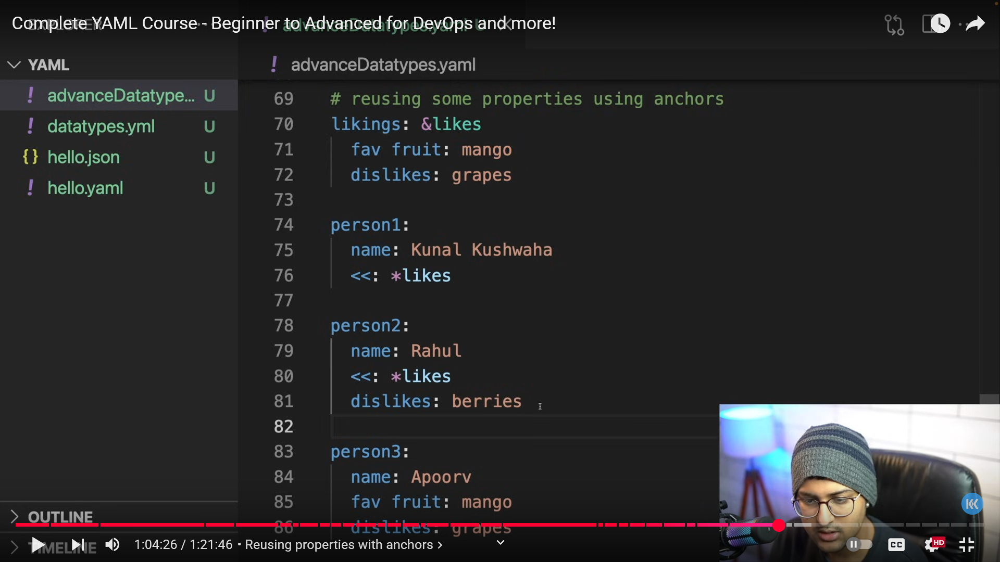
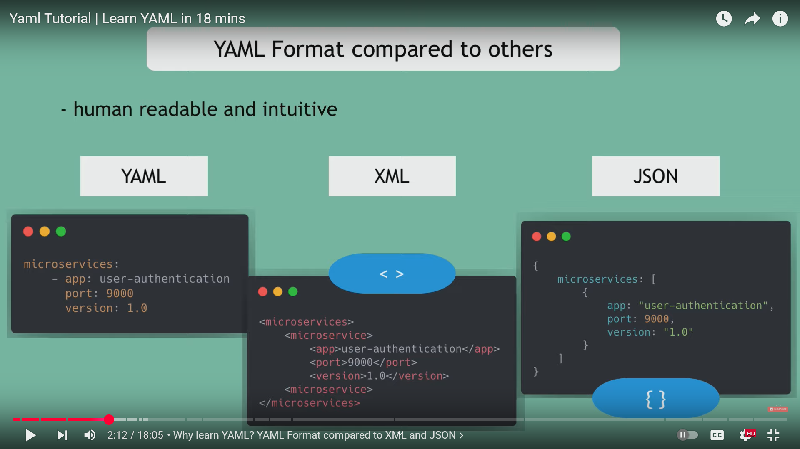
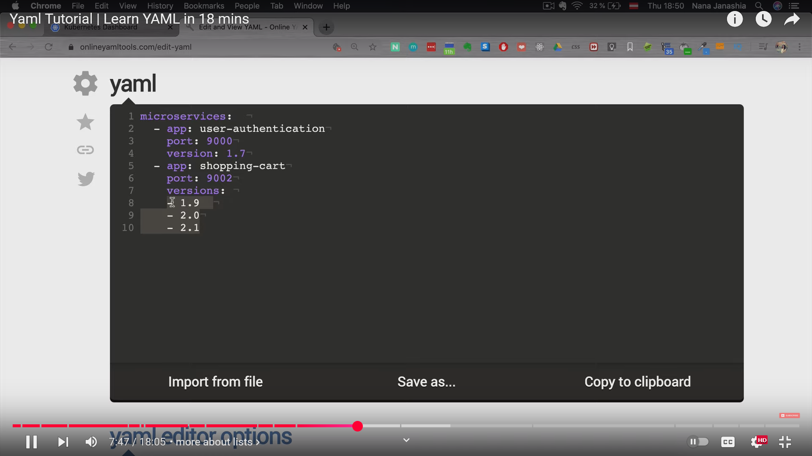
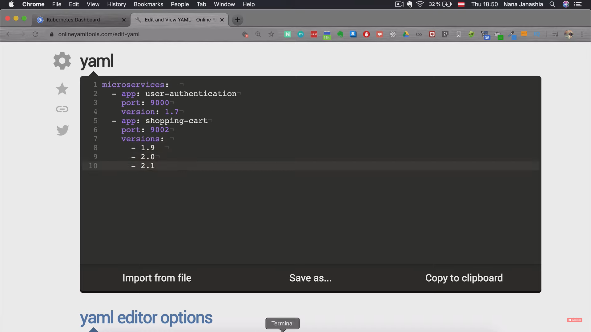
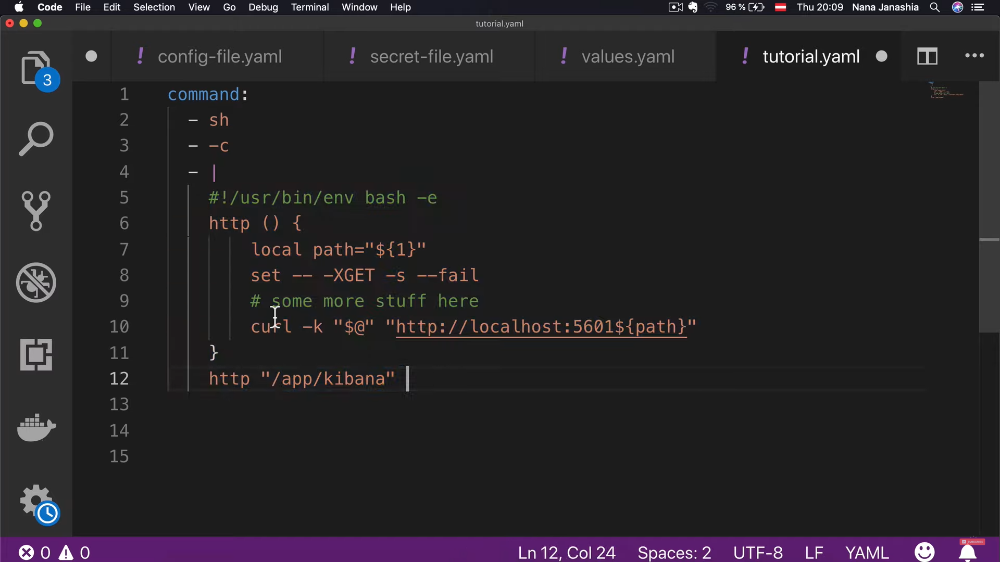
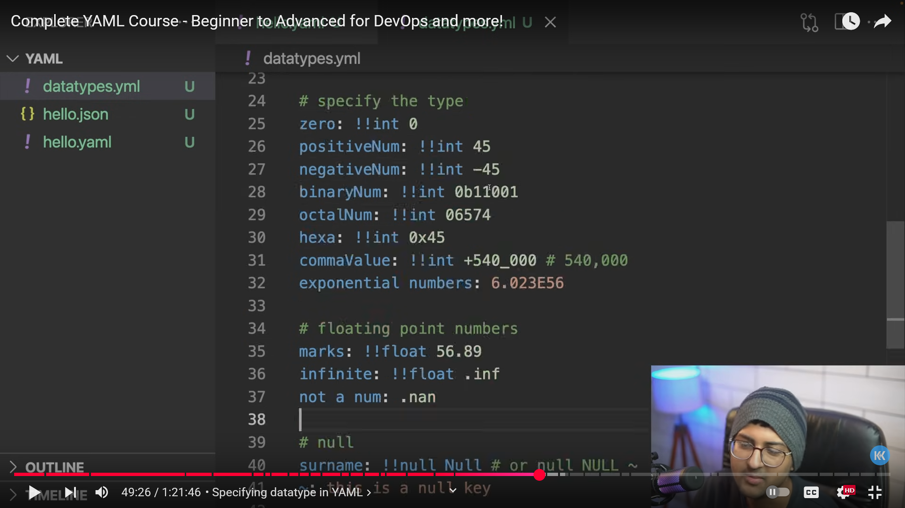
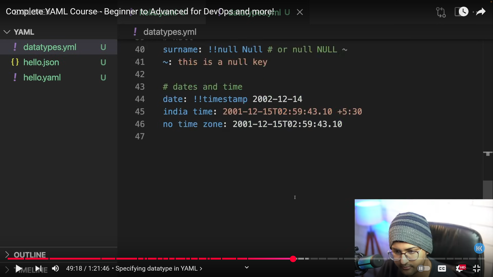
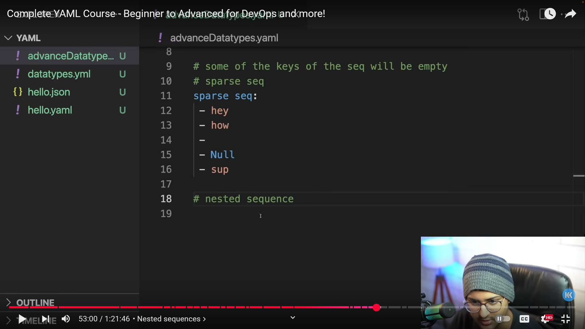

# ----Topics to learn

🔹 1. **YAML Basics**

* What is YAML? (syntax, indentation, use cases vs JSON/XML)
* YAML file structure (`key: value`)
* Indentation rules (spaces only, no tabs!)
* Comments (`# this is a comment`)

🔹 2. **Data Types**

* Scalars (strings, numbers, booleans, null)
* Strings
  * Quoted (`"hello"`, `'world'`) vs unquoted
  * Multiline strings (`|` and `>`)
* Numbers (int, float, scientific notation)
* Booleans (`true/false`, `yes/no`, `on/off`)
* Null values (`null`, `~`)

🔹 3. **Collections**

* Lists (arrays)
  ```yaml
  fruits:
    - apple
    - banana
    - mango
  ```
* Dictionaries (maps/objects)
  ```yaml
  person:
    name: Arun
    age: 25
  ```
* Nested structures (list inside a map, map inside a list)

🔹 4. **Advanced YAML Features**

* Anchors & Aliases (`&` and `*`) → reuse values
  ```yaml
  defaults: &defaults
    retries: 3
    timeout: 30s

  service1:
    <<: *defaults
    url: https://example.com
  ```
* Merge keys (`<<`)
* Custom tags (`!!str`, `!!int`)
* Folded (`>`) vs literal (`|`) block scalars

🔹 5. **YAML in CI/CD**

* Environment variables
* Secrets and sensitive values
* Job definitions (steps, scripts, runners)
* Re-usable configs (`extends`, `templates`, includes)

🔹 6. **YAML in Popular Tools**

* **GitLab CI/CD** → `.gitlab-ci.yml` (stages, jobs, runners)
* **GitHub Actions** → `.github/workflows/*.yml` (jobs, steps, actions)
* **Jenkins** (declarative pipelines with YAML plugins)
* **Kubernetes** → `deployment.yml`, `service.yml`, `ingress.yml`
* **Ansible** → Playbooks (`tasks.yml`, `inventory.yml`)
* **Docker Compose** → `docker-compose.yml`

🔹 7. **Best Practices**

* Consistent indentation (2 spaces is standard)
* Use anchors/aliases for DRY configs
* Keep secrets outside YAML (use env vars or secret managers)
* Validate YAML with linting tools (`yamllint`, `kubectl apply --dry-run`, etc.)

---

# ----Introduction

#### 🔹 What is YAML?

* YAML is a  **human-readable data serialization format** .
* It’s often used for **configuration files** (e.g., in Kubernetes, GitLab CI/CD, GitHub Actions, Ansible, Docker Compose).
* YAML is a superset of JSON (meaning any JSON is valid YAML, but not all YAML is valid JSON).
* Focuses on  **readability over complexity** .

#### 🔹 Basic Features of YAML

1. **Indentation matters** (like Python).
   * Spaces are used for structure (not tabs).
   * The number of spaces doesn’t matter, but consistency does.
2. **Key-value pairs** :

```yaml
   name: Arun
   age: 25
```

1. **Lists (arrays)** :

```yaml
   fruits:
     - apple
     - banana
     - mango
```

1. **Nested structures** :

```yaml
   person:
     name: Arun
     contact:
       email: arun@example.com
       phone: 1234567890
```

#### 🔹 Data Types in YAML

* **Scalars** : String, Integer, Float, Boolean, Null

```yaml
  string: "hello world"
  integer: 42
  float: 3.14
  boolean_true: true
  boolean_false: false
  null_value: null
```

* **Lists** :

```yaml
  items:
    - first
    - second
    - third
```

* **Dictionaries (Maps)** :

```yaml
  database:
    host: localhost
    port: 5432
```

* **Inline format** (JSON style):
  ```yaml
  colors: [red, green, blue]
  user: {name: Arun, age: 25}
  ```

#### 🔹 Advanced YAML Concepts

1. **Anchors (&) and Aliases (*)** – Reuse values.

   ```yaml
   default: &default
     country: India
     language: English

   user1:
     name: Arun
     <<: *default   # merges default block here

   user2:
     name: John
     <<: *default
   ```

   Overriding some values of anhors example--

   

   In the above example, `person2` now has `fav fruits: mango` and `dislikes: berries`
2. **Multi-line strings** :

* Literal (`|`) preserves line breaks:
  ```yaml
  bio: |
    This is line one.
    This is line two.
  ```
* Folded (`>`) folds into a single line:
  ```yaml
  bio: >
    This is line one
    This is line two
  # Output: "This is line one This is line two"
  ```

1. **Comments** :

```yaml
   # This is a comment
   version: 1.0
```

1. **Boolean variations** :

   YAML accepts multiple forms:

```yaml
   is_active: yes   # same as true
   is_disabled: no  # same as false
```

#### 🔹 YAML vs JSON

| Feature     | YAML                 | JSON                  |
| ----------- | -------------------- | --------------------- |
| Readability | More human-friendly  | Machine-friendly      |
| Data types  | Scalars, Lists, Maps | Arrays, Objects       |
| Syntax      | Uses indentation     | Uses `{}`and `[]` |
| Comments    | Allowed (`#`)      | Not allowed           |
| Used in     | Configs (K8s, CI/CD) | APIs, configs         |



#### 🔹 YAML in CI/CD (Practical Example)

👉 **GitLab CI/CD (`.gitlab-ci.yml`)**

```yaml
stages:
  - build
  - test
  - deploy

build_job:
  stage: build
  script:
    - echo "Building project..."

test_job:
  stage: test
  script:
    - echo "Running tests..."

deploy_job:
  stage: deploy
  script:
    - echo "Deploying project..."
  only:
    - main
```

👉 **GitHub Actions (`.github/workflows/main.yml`)**

```yaml
name: CI Pipeline

on:
  push:
    branches: [ "main" ]

jobs:
  build:
    runs-on: ubuntu-latest
    steps:
      - uses: actions/checkout@v2
      - name: Install dependencies
        run: npm install
      - name: Run tests
        run: npm test
```

#### 🔹 Key Topics to Learn in YAML (for DevOps/CI/CD)

1. Syntax (indentation, key-value pairs)
2. Scalars (strings, numbers, booleans, nulls)
3. Lists & Dictionaries
4. Nested structures
5. Anchors & Aliases (`&`, `*`, `<<`)
6. Multi-line strings (`|`, `>`)
7. Comments
8. Inline style (`{}`, `[]`)
9. Best practices (avoid tabs, keep consistent spacing, meaningful keys)
10. YAML in real-world tools:

* GitLab CI/CD
* GitHub Actions
* Docker Compose
* Kubernetes (pods, deployments, services)
* Ansible playbooks

---

# ----Caution on Indendation

Indentation is **the most important rule in YAML** because YAML uses indentation (spaces) to represent structure (hierarchy, nesting). Unlike JSON or XML, which use `{}`, `[]`, or tags, YAML relies purely on indentation.

Here’s the detailed explanation about  **consistency of indentation in YAML** :

#### 🔑 Rules for YAML Indentation

1. **Spaces only, never tabs**

   * YAML does **not allow tabs** for indentation (they will cause errors).
   * Always use  **spaces** . Most style guides recommend **2 spaces** or  **4 spaces** .
   * Be consistent — don’t mix different indentation levels (e.g., some with 2 spaces, some with 4).

   ❌ Wrong (tabs used):

   ```yaml
   name: Arun
   	age: 24
   ```

   ✅ Correct (spaces used):

   ```yaml
   name: Arun
     age: 24
   ```
2. **Indentation defines hierarchy**

   * Indentation shows which keys belong to which parent.
   * Each child must be indented  **more spaces than its parent** .

   Example:

   ```yaml
   person:
     name: Arun
     age: 24
     address:
       city: Chennai
       country: India
   ```

   Here:

   * `person` is root.
   * `name`, `age`, `address` are children of `person`.
   * `city` and `country` are children of `address`.
3. **Lists and indentation**

   * Lists are created using `-` followed by a space.
   * List items must align with each other.
   * Nested content under a list item must be indented further.

   ✅ Example:

   ```yaml
   fruits:
     - apple
     - banana
     - mango
   ```

   ✅ Nested list with objects:

   ```yaml
   users:
     - name: Arun
       age: 24
     - name: Sita
       age: 22
   ```
4. **Indentation must be consistent across same levels**

   * If you start with 2 spaces,  **stick to 2 spaces everywhere** .
   * Don’t mix 2 spaces for some keys and 4 spaces for others.

   ❌ Wrong (mixed indent):

   ```yaml
   person:
     name: Arun
       age: 24
   ```

   ✅ Correct (consistent indent):

   ```yaml
   person:
     name: Arun
     age: 24
   ```
5. **Empty lines are allowed but must not have spaces**

   * You can add blank lines for readability, but don’t leave spaces on empty lines.

   ✅ Example:

   ```yaml
   person:
     name: Arun

     age: 24
   ```

#### ⚠️ Common Mistakes with Indentation

* Using tabs instead of spaces.
* Mixing 2-space and 4-space indents in the same file.
* Misaligning list items.
* Extra spaces at the end of lines.



**Above is same as below ---**



---

# ----Embedding Shell Scripts is YAML



---

# ---Template engine Placeholders and Env variables in YAML

Great question 👍 Let’s dive into  **placeholders in YAML** .

YAML itself is just a  **data serialization format** , so it doesn’t have "placeholders" built-in like a programming language. However, in practice,  **placeholders are used when YAML files are consumed by applications or CI/CD tools (like GitLab CI, GitHub Actions, Kubernetes, Ansible, Docker Compose, etc.)** .

They act as **variables, anchors, or template values** that get replaced at runtime.

#### 1. **Environment Variable Placeholders**

In many systems, YAML supports variable substitution.

🔹 **Example in GitLab CI (`.gitlab-ci.yml`):**

```yaml
variables:
  APP_ENV: production
  APP_PORT: 8080

deploy:
  stage: deploy
  script:
    - echo "Deploying app in $APP_ENV mode on port $APP_PORT"
```

Here:

* `$APP_ENV` and `$APP_PORT` are placeholders that GitLab replaces with variable values.

#### 2. **Custom Placeholders (Template Engines)**

Some tools (like  **Ansible, Helm, Terraform** ) allow Jinja2 or Go templating inside YAML.

🔹 **Example (Ansible):**

```yaml
vars:
  app_name: myapp
  app_port: 5000

tasks:
  - name: Start {{ app_name }}
    docker_container:
      name: "{{ app_name }}"
      image: "myapp:latest"
      ports:
        - "{{ app_port }}:5000"
```

Here `{{ app_name }}` and `{{ app_port }}` are placeholders replaced by Ansible at runtime.

#### 3. **Placeholders in Docker Compose**

Docker Compose YAML allows `${VAR}` placeholders for environment variables.

🔹 **Example:**

```yaml
version: "3"
services:
  web:
    image: "nginx:${NGINX_VERSION}"
    ports:
      - "${PORT}:80"
```

If `.env` file contains:

```
NGINX_VERSION=latest
PORT=8080
```

They get substituted at runtime.

✅ **Summary:**

* YAML itself only supports **anchors & aliases** as placeholders.
* Real "variables" (`${VAR}`, `{{VAR}}`) come from the **tool consuming YAML** (GitLab, Kubernetes, Docker Compose, Ansible, etc.).
* Placeholders improve  **reusability, maintainability, and flexibility** .

#### 3. **Kubernetes Placeholders**

In Kubernetes YAML manifests, you don’t have direct placeholders, but with **Helm charts** or `envFrom`, you can inject them.

🔹 **Example:**

```yaml
apiVersion: v1
kind: Pod
metadata:
  name: mypod
spec:
  containers:
    - name: myapp
      image: nginx:${APP_VERSION}
```

Here `${APP_VERSION}` is a placeholder (Helm or `envsubst` can replace it at deploy time).

Would you like me to make a **comparison table** of YAML placeholder types (native anchors, env vars, CI/CD variables, Helm/Ansible templates) so you can quickly reference them?

---

# ----Store Multiple Documents in a Single YAML File

In YAML, **you can store multiple documents in a single `.yaml` or `.yml` file** by separating them with `---` (three dashes). Each document is parsed independently by the YAML processor.

#### 📌 Syntax

```yaml
# First YAML document
app: frontend
version: 1.0
ports:
  - 80
  - 443

---
# Second YAML document
app: backend
version: 2.0
ports:
  - 3000
  - 5000

---
# Third YAML document
app: database
type: postgres
version: 15
```

#### 📌 Explanation

* `---`

  Starts a  **new YAML document** .
* Each block between `---` is considered a separate document.
* You can even have `...` (three dots) at the end to explicitly mark the end of the last document (optional).

#### 📌 Example in Kubernetes (common real-world use case)

Kubernetes often uses multiple YAML documents in **one file** for defining multiple resources at once:

```yaml
# Deployment
apiVersion: apps/v1
kind: Deployment
metadata:
  name: my-app
spec:
  replicas: 2
  selector:
    matchLabels:
      app: my-app
  template:
    metadata:
      labels:
        app: my-app
    spec:
      containers:
        - name: my-app-container
          image: myapp:1.0
          ports:
            - containerPort: 8080

---
# Service
apiVersion: v1
kind: Service
metadata:
  name: my-app-service
spec:
  type: ClusterIP
  selector:
    app: my-app
  ports:
    - port: 80
      targetPort: 8080
```

👉 Here, the first document defines a  **Deployment** , and the second defines a **Service** — but both are in the same file.

#### 📌 Benefits

* Keeps related configurations together (instead of many small files).
* Easier deployment in platforms like Kubernetes, Ansible, Docker Compose, GitLab CI/CD, etc.

---

# ----Serialization and Deserialization

**Serialization** and D**eserialization** are fundamental concepts not just in YAML, but in programming and data handling in general.

#### 🔹 What is Serialization?

* **Definition** : Serialization is the process of  **converting a data structure or object into a format that can be stored or transmitted** .
* Purpose:
  * Save data to a file (YAML, JSON, XML, binary, etc.)
  * Send data over a network (APIs, messaging systems)
  * Persist state between program runs

👉 Example: In Python

```python
import yaml

data = {
    "name": "Arun",
    "skills": ["Python", "React", "DevOps"],
    "experience": 2
}

# Serialization: converting Python dict → YAML string
yaml_data = yaml.dump(data)
print(yaml_data)
```

**Output (YAML serialized format):**

```yaml
experience: 2
name: Arun
skills:
- Python
- React
- DevOps
```

Here, the Python dictionary was **serialized** into YAML.

#### 🔹 What is Deserialization?

* **Definition** : Deserialization is the reverse process —  **converting the serialized format back into a program-readable object** .
* Purpose:
  * Read configs from YAML/JSON files
  * Parse API responses
  * Reconstruct objects from stored states

👉 Example: In Python

```python
import yaml

yaml_data = """
experience: 2
name: Arun
skills:
- Python
- React
- DevOps
"""

# Deserialization: converting YAML string → Python dict
data = yaml.safe_load(yaml_data)
print(data)
```

**Output (Python object):**

```python
{'experience': 2, 'name': 'Arun', 'skills': ['Python', 'React', 'DevOps']}
```

Here, the YAML string was **deserialized** back into a Python dictionary.

#### 🔹 Serialization & Deserialization in Context of YAML

* **Serialization** = Writing objects/data into a YAML format file.
* **Deserialization** = Reading/parsing a YAML file back into an object (dictionary, map, struct, etc. depending on language).

#### 🔹 Real-World Examples

1. **CI/CD (GitLab, GitHub Actions, Jenkins):**
   * YAML files (`.gitlab-ci.yml`, `.github/workflows/*.yml`) are **deserialized** by the CI engine into instructions.
   * The engine then executes the steps described.
2. **Configuration Files:**
   * Kubernetes uses YAML for manifests.
   * When you apply `kubectl apply -f deployment.yaml`, Kubernetes **deserializes** the YAML into API objects.
3. **APIs / Microservices:**
   * Services can send data in YAML (or JSON).
   * Sender **serializes** → Receiver  **deserializes** .

> #### ❓ Does Deserialization converts yaml file to binary codes ?
>
> No..let me clarify this properly:
>
> ##### 🔹 Serialization & Deserialization in the YAML context
>
> * **Serialization** :
>
>   Converting a programming object (like a Python dict, Java object, or a C# class instance) into a YAML **string/file** so it can be stored or shared.
>
>   Example:
>
> ```python
>   import yaml
>
>   data = {"name": "Arun", "skills": ["Python", "React"]}
>   yaml_string = yaml.dump(data)
>   print(yaml_string)
> ```
>
> Output (YAML text, not binary):
>
> ```yaml
>   name: Arun
>   skills:
>   - Python
>   - React
> ```
>
> * **Deserialization** :
>
>   Converting that YAML **string/file** back into a programming object (dictionary, list, class instance, etc.).
>
> ```python
>   loaded_data = yaml.safe_load(yaml_string)
>   print(loaded_data)
> ```
>
> Output (in Python dict):
>
> ```python
>   {'name': 'Arun', 'skills': ['Python', 'React']}
> ```
>
> ##### ⭐ Let's Take an Example with Javascript
>
> * **Serialization** = Converting a **JavaScript object** into a YAML string.
> * **Deserialization** = Converting a **YAML string** back into a JavaScript object.
> * It does **NOT** directly convert to "binary machine code" — instead, it converts to a **data format** (YAML, JSON, XML, etc.), which is human-readable. Your programming language runtime later deals with binary execution.
>
> Now, let’s do the same example you saw in Python, but in  **JavaScript** .
>
> We’ll use the **`js-yaml`** package (a popular YAML library).
>
> **1. Install js-yaml**
>
> ```bash
> npm install js-yaml
> ```
>
> **2. Serialization (JS object → YAML string)**
>
> ```javascript
> import yaml from "js-yaml";
>
> // Our JavaScript object
> const data = {
>   name: "Arun",
>   skills: ["Python", "React"]
> };
>
> // Serialize: Convert JS object to YAML string
> const yamlString = yaml.dump(data);
>
> console.log("YAML Output:\n", yamlString);
> ```
>
> ✅ Output:
>
> ```yaml
> name: Arun
> skills:
>   - Python
>   - React
> ```
>
> **3. Deserialization (YAML string → JS object)**
>
> ```javascript
> import yaml from "js-yaml";
>
> // Our YAML string
> const yamlString = `
> name: Arun
> skills:
>   - Python
>   - React
> `;
>
> // Deserialize: Convert YAML string back to JS object
> const jsObject = yaml.load(yamlString);
>
> console.log("JavaScript Object:", jsObject);
> ```
>
> ✅ Output:
>
> ```javascript
> { name: 'Arun', skills: [ 'Python', 'React' ] }
> ```
>
> 👉 So in short:
>
> * **Serialization** = `js object → yaml string`
> * **Deserialization** = `yaml string → js object`
>
> ##### ❌ Misconception to clear
>
> * YAML **is text-based** (human-readable format).
> * Deserialization **does not** directly convert YAML into  *binary machine code* .
> * Instead, it converts YAML → **in-memory data structures** (dicts, objects, arrays).
>
> The program that reads YAML (like Python, Java, Go, etc.) may later compile or interpret those data structures into machine instructions during runtime, but  **YAML itself is not compiled into binary** .
>
> ✅ So the flow looks like this:
>
> **Code Object → YAML (Serialization) → Code Object (Deserialization)**
>
> NOT  -- **YAML → Binary Code**

#### ✅ **Summary:**

* **Serialization** = Object → YAML (or other format)
* **Deserialization** = YAML (or other format) → Object
* YAML is widely used for serialization because it’s  **human-readable, structured, and supported across many languages** .

---

# ----Explicitly specifying Datatypes in YAML

#### YAML allows **explicit typing** using `!!`.

 **Examples for `int, float, str, bool, null` :**

```yaml
intExample: !!int "42"
floatExample: !!float "3.14"
strExample: !!str 42      # Forces 42 to be a string
boolExample: !!bool "true"
nullExample: !!null ""
```

**Dates and Timestamps :**

```yaml
dob: 2025-08-16
meeting: 2025-08-16T14:30:00Z
```

YAML interprets these as date/time objects (if supported by the parser).

**Custom Types**

You can also define  **custom tags** :

```yaml
discount: !percent 20
```

Here `!percent` is a custom tag. Your application must define how to handle it.

#### 🔹 Example of Explicit Typing in One File





```yaml
# Scalars
age: !!int "30"
weight: !!float "72.5"
active: !!bool "true"
description: !!str "007"   # Stored as string, not integer

# Date
joined: !!timestamp "2025-08-16T10:00:00Z"

# Null
optionalField: !!null ""

# List
items: !!seq
  - !!str "One"
  - !!int "2"
  - !!float "3.14"

# Map
person: !!map
  name: !!str "Arun"
  id: !!int "101"

#Set
fruits: !!set
  apple: null
  banana: null
  mango: null
```

> ##### **Sets can also be written as below--**
>
> In YAML, when you see a `?` in front of something, it indicates a  **mapping key** .
>
> In the case of a  **set** :
>
> ```yaml
> fruits: !!set
>   ? apple
>   ? banana
>   ? mango
> ```
>
> This is equivalent to saying:
>
> ```yaml
> fruits:
>   apple: null
>   banana: null
>   mango: null
> ```
>
> So here:
>
> * `? apple` means `"apple"` is a **key** with no value (implicitly `null`).
> * Since  **sets only care about unique keys** , the values are ignored (or `null`).
> * The `?` is not "empty value" in general — it's just  **YAML’s way of explicitly saying “this is a key”** .
>
> 👉 In sets, the `?` indicates each item in the set, and since sets don’t have values, YAML treats it as `key: null`.
>
> **However,**
>
> This:
>
> ```yaml
> fruits: 
>   ? apple
>   ? banana
>   ? mango
> ```
>
> ❌ **is not valid YAML** if you intend it to mean a set.
>
> Why? Because YAML will try to parse it as a **mapping** (dictionary/object), but you didn’t provide values for the keys. YAML doesn’t allow "bare keys" without values unless it’s explicitly marked as a `!!set`.
>
> ✅ Correct version for a set is:
>
> ```yaml
> fruits: !!set
>   ? apple
>   ? banana
>   ? mango
> ```
>
> Which means:
>
> ```yaml
> fruits:
>   apple: null
>   banana: null
>   mango: null
> ```
>
> If you  **omit `!!set`** , YAML will throw an error (in strict parsers) or assume something invalid because it thinks you’re declaring a mapping with missing values.
> 👉 So,
>
> * `fruits: ? apple` etc.  **without `!!set` is invalid** .
> * You must use `!!set` for it to be treated as a proper set.

---

# ----Sparse Sequence



In the above one of the array element is just empty

---

# ----Nested Sequence or Array of Arrays


---

# ----Pairs datatype

#### 🔹 What is `!!pairs`?

* `!!pairs` is a **YAML tag** that represents an  **ordered sequence of key-value pairs** .
* Unlike a normal mapping (`!!map`), which requires  **unique keys** , `!!pairs` allows you to repeat keys.
* It is often used when the data structure needs to preserve  **multiple values for the same key** .

#### 🔹 Example

```yaml
students: !!pairs
  - name: Alice
  - name: Bob
  - name: Charlie
```

This represents a  **list of pairs** , each one being a mapping with `name` as the key.

#### 🔹 Equivalent JSON Representation

```json
{
  "students": [
    { "name": "Alice" },
    { "name": "Bob" },
    { "name": "Charlie" }
  ]
}
```

Notice how `name` is repeated multiple times – this would not be allowed in a normal YAML mapping, but `!!pairs` makes it valid.

#### 🔹 Another Example with Repeated Keys

```yaml
grades: !!pairs
  - math: A
  - math: B
  - science: A
```

Equivalent JSON:

```json
{
  "grades": [
    { "math": "A" },
    { "math": "B" },
    { "science": "A" }
  ]
}
```

Here, `math` appears twice — valid in `!!pairs`, invalid in a normal mapping.

#### 🔹 Summary

* `!!map` → Unique keys, unordered (dictionary).
* `!!set` → Unique keys only, values `null`.
* `!!pairs` → Ordered list of key-value pairs,  **keys can repeat** .

---

# ----YAML Validations

YAML validation is the process of checking whether a YAML document:

1. **Follows YAML syntax rules** (indentation, colons, dashes, etc.).
2. **Matches the expected schema or structure** (e.g., required fields exist, datatypes are correct).
3. **Produces valid data after parsing** (like JSON or dictionary objects).

#### **Levels of YAML Validation**

Validation usually happens in  **two levels** :

🔹 **(a) Syntax Validation**

Checks whether YAML is written correctly.

* Proper indentation (spaces, no tabs).
* Correct use of `:` for key-value pairs.
* Valid use of `-` for lists.
* Strings properly quoted if needed.
* No duplicate keys.

✅ Example (valid YAML):

```yaml
name: Arun
skills:
  - DevOps
  - Backend
age: 24
```

❌ Example (invalid YAML – wrong indentation):

```yaml
name: Arun
skills:
   - DevOps
 - Backend   # ❌ wrong indentation
```

🔹 **(b) Schema Validation**

Ensures that the YAML matches the  **rules/expectations of the application** .

For example, Kubernetes requires certain fields in a Deployment manifest.

✅ Example (valid schema for a Kubernetes Deployment):

```yaml
apiVersion: apps/v1
kind: Deployment
metadata:
  name: nginx-deployment
spec:
  replicas: 3
```

❌ Example (invalid schema – missing `spec` field):

```yaml
apiVersion: apps/v1
kind: Deployment
metadata:
  name: nginx-deployment
# ❌ `spec` is required but missing
```

Schema validation ensures the file isn’t just valid YAML, but also **usable** in the target system.

#### **YAML Validation Tools**

You can validate YAML using:

* **Online validators**

  e.g., [yaml-online-parser.appspot.com](https://yaml-online-parser.appspot.com/)
* **CLI tools**

  * `yamllint` → for syntax/style checking
  * `pyyaml` (Python) → load YAML safely and catch errors
  * `js-yaml` (Node.js) → parse YAML in JavaScript
* **Built-in validators in tools**

  * Kubernetes (`kubectl apply --dry-run=client -f file.yaml`)
  * GitLab CI (`CI Lint` tool in the UI)
  * GitHub Actions (`act` for local validation)

---
