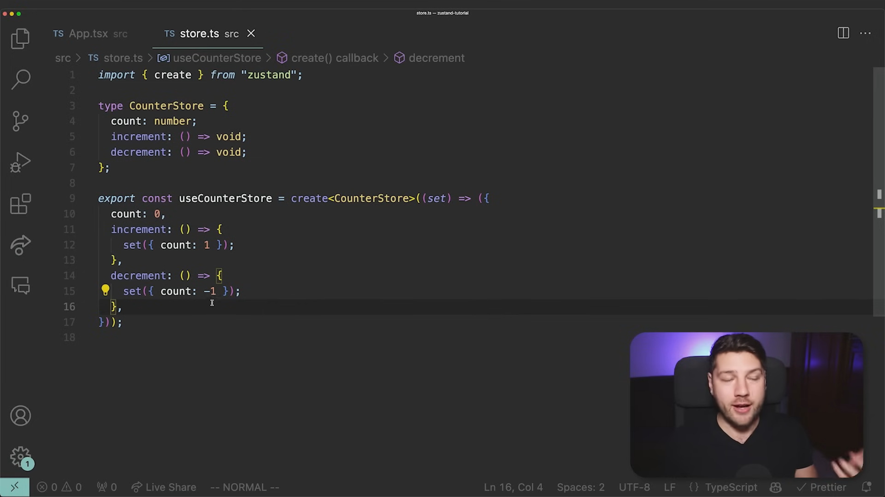
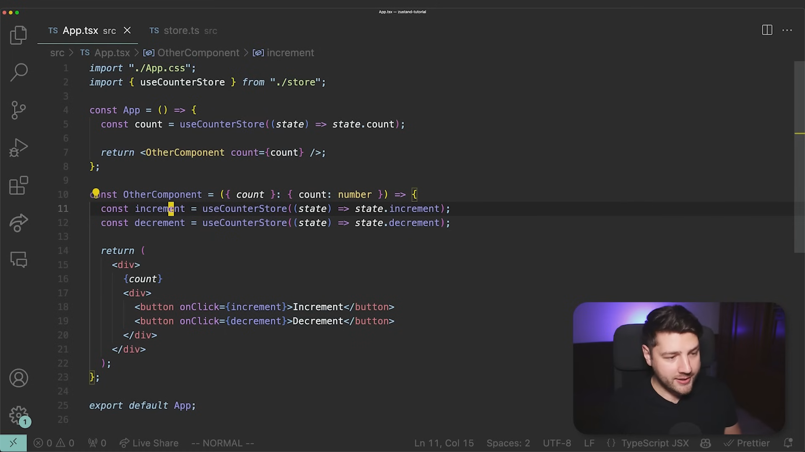
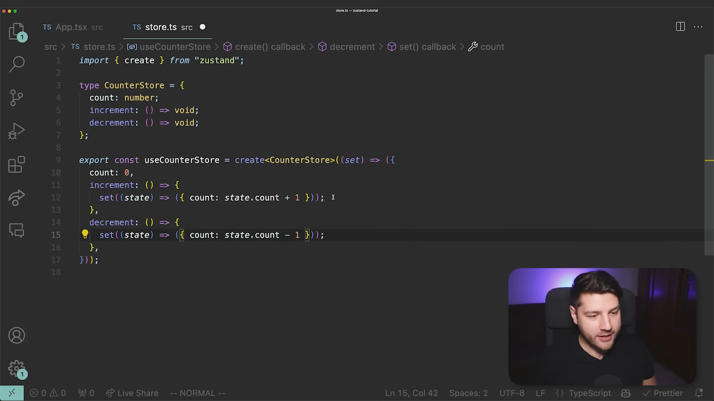
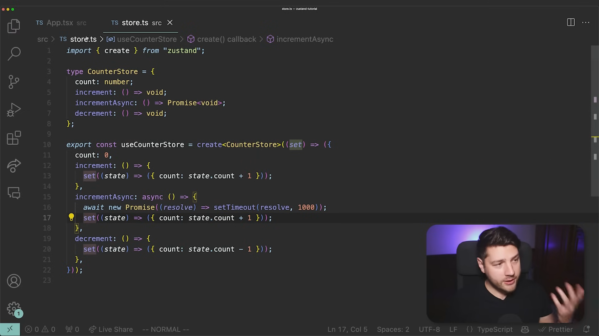
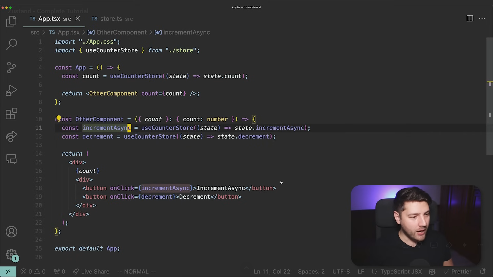
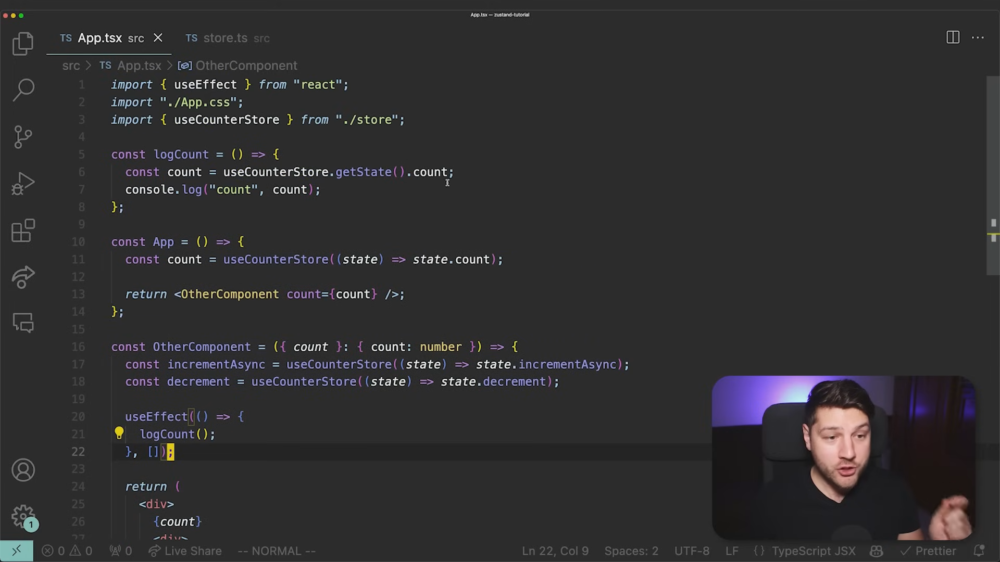
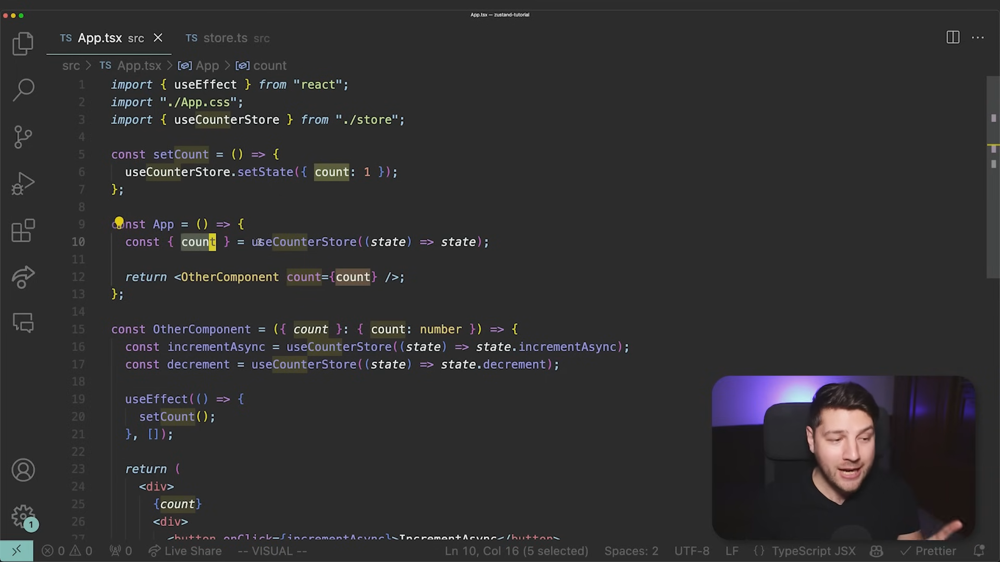

# ----Important Concepts in Detail

### 🧠 1. What exactly is Zustand?

**Zustand** is a small state-management library for JavaScript/React applications.

Its primary job is to let you create **shared application state** that multiple components can read and modify.

The simplest mental model is:

```text
React components
       │
       ▼
   Zustand Store
       │
 ┌─────┼─────┐
 ▼     ▼     ▼
state  state  actions
```

For example, imagine your app has:

```text
User
Theme
Sidebar
Shopping cart
Selected branch
Filters
Modal state
Notifications
```

Instead of passing those values through many components with props, you can put them into a Zustand store.

### 🧩 2. First understand the problem Zustand solves

Suppose you have:

```tsx
function App() {
  const [user, setUser] = useState(null);

  return <Dashboard user={user} />;
}

function Dashboard({ user }) {
  return <Sidebar user={user} />;
}

function Sidebar({ user }) {
  return <UserMenu user={user} />;
}

function UserMenu({ user }) {
  return <p>{user.name}</p>;
}
```

The problem isn't that this is impossible.

The problem is  **prop drilling** .

```text
App
 │
 │ user
 ▼
Dashboard
 │
 │ user
 ▼
Sidebar
 │
 │ user
 ▼
UserMenu
```

If ten unrelated components need `user`, this becomes annoying.

Zustand lets you do:

```text
                 Zustand Store
                 ┌────────────┐
                 │ user       │
                 │ theme      │
                 │ cart       │
                 │ actions    │
                 └─────┬──────┘
                       │
             ┌─────────┼─────────┐
             ▼         ▼         ▼
          Navbar    Dashboard   Profile
```

The components don't need to pass the state through one another.

### 🚀 3. Zustand Implementation in Brief







**Can make Async Calls too**





### 🏪 4. The central concept: the Store

Everything revolves around a  **store** .

A store contains:

1. **State**
2. **Actions** that modify the state

For example:

```ts
import { create } from "zustand";

const useCounterStore = create((set) => ({
  count: 0,

  increment: () =>
    set((state) => ({
      count: state.count + 1,
    })),

  decrement: () =>
    set((state) => ({
      count: state.count - 1,
    })),
}));
```

Conceptually:

```text
useCounterStore
│
├── count: 0
│
├── increment()
│
└── decrement()
```

This is your shared state container.

### 🔌 5. How do components use it?

A component can access the store directly.

```tsx
function Counter() {
  const count = useCounterStore((state) => state.count);

  return <Text>{count}</Text>;
}
```

Another component can access the action:

```tsx
function Buttons() {
  const increment = useCounterStore(
    (state) => state.increment
  );

  return (
    <Button
      title="Increment"
      onPress={increment}
    />
  );
}
```

Notice something important:

**You didn't pass `count` or `increment` through props.**

Both components communicate with the same store.

### 🎯 6. Why do we use the selector?

You'll frequently see this:

```ts
useCounterStore((state) => state.count)
```

rather than:

```ts
useCounterStore()
```

The selector means:

> "I only want this particular piece of the store."

For example:

```ts
const count = useCounterStore(
  state => state.count
);
```

You're subscribing to `count`.

If something unrelated changes in the store, your component can avoid unnecessary re-renders.

This becomes particularly important with larger stores.

---

# ----More realistic example

### Let's create an authentication store.

```ts
import { create } from "zustand";

type User = {
  id: string;
  name: string;
  email: string;
};

type AuthStore = {
  user: User | null;
  isAuthenticated: boolean;

  login: (user: User) => void;
  logout: () => void;
};

export const useAuthStore = create<AuthStore>((set) => ({
  user: null,
  isAuthenticated: false,

  login: (user) =>
    set({
      user,
      isAuthenticated: true,
    }),

  logout: () =>
    set({
      user: null,
      isAuthenticated: false,
    }),
}));
```

Now anywhere in the application:

```tsx
const user = useAuthStore(
  state => state.user
);
```

And:

```tsx
const logout = useAuthStore(
  state => state.logout
);
```

You don't need:

```text
App
 ↓
Dashboard
 ↓
Navbar
 ↓
ProfileMenu
```

to pass `user` through props.

---

# ----State vs Actions, set() and get()

This distinction is very important.

Consider:

```ts
const useCartStore = create((set) => ({
  items: [],

  addItem: (item) => {
    set((state) => ({
      items: [...state.items, item],
    }));
  },

  removeItem: (id) => {
    set((state) => ({
      items: state.items.filter(
        item => item.id !== id
      ),
    }));
  },

  clearCart: () => {
    set({ items: [] });
  },
}));
```

Here:

```text
STATE
─────
items
```

and:

```text
ACTIONS
───────
addItem()
removeItem()
clearCart()
```

The store contains both.

This is one of the patterns you'll use constantly.

### 🔄 What is `set()`?

`set()` is Zustand's mechanism for updating the store.

For example:

```ts
set({
  count: 10
});
```

means:

> Set `count` to 10.

You can also use the previous state:

```ts
set((state) => ({
  count: state.count + 1
}));
```

This means:

> Take the current state and calculate the new state from it.

This is particularly important when the new value depends on the previous value.

### 🔍 What is `get()`?

Zustand also provides `get()`.

Example:

```ts
const useCartStore = create((set, get) => ({
  items: [],

  addItem: (item) => {
    const items = get().items;

    set({
      items: [...items, item],
    });
  },
}));
```

`get()` reads the current store state.

However, most straightforward updates can simply use:

```ts
set((state) => ...)
```

So don't overuse `get()`.

### 🧮 Derived state

Sometimes you don't want to store everything.

Suppose:

```ts
items: [
  { price: 100, quantity: 2 },
  { price: 50, quantity: 3 }
]
```

You could create:

```ts
getTotal: () =>
  get().items.reduce(
    (total, item) =>
      total + item.price * item.quantity,
    0
  )
```

Then:

```tsx
const total = useCartStore(
  state => state.getTotal()
);
```

But there is an important design principle:

> **Don't store data that can easily be calculated from other state unless there's a good reason.**

For example, don't necessarily maintain:

```ts
items
total
```

when `total` can be calculated from `items`.

Otherwise you can accidentally create inconsistent state:

```text
items = ₹500
total = ₹700 ❌
```

---

# Zustand Benefits and Comparisons

### ⚛️ Zustand doesn't require Context

This is one of the reasons developers like it.

With React Context you might have:

```tsx
<AuthProvider>
  <App />
</AuthProvider>
```

and:

```tsx
const { user } = useContext(AuthContext);
```

Zustand doesn't require you to create a provider for ordinary usage.

You can simply:

```ts
const user = useAuthStore(
  state => state.user
);
```

from a component.

Conceptually:

```text
React Context

Provider
   ↓
Component tree
   ↓
useContext()
```

versus:

```text
Zustand

Store
 ↑  ↑  ↑
 │  │  │
A  B  C
```

Components can subscribe directly to the store.

### 🧠 Is Zustand replacing `useState`?

**No.**

You should still use `useState`.

For example:

```tsx
function LoginForm() {
  const [email, setEmail] = useState("");
  const [password, setPassword] = useState("");

  ...
}
```

These values are local to the login form.

There is no reason to put them into Zustand.

A useful rule:

**🟢 `useState`**

Use when the state belongs to  **one component or a small local component tree** .

Examples:

```text
Input text
Modal open/closed
Dropdown open/closed
Password visibility
Temporary UI state
```

**🟠 Zustand**

Use when state is  **shared across unrelated parts of the application** .

Examples:

```text
Logged-in user
Shopping cart
Selected branch
Global filters
Application preferences
Complex multi-screen workflow
```

### 🆚 Zustand vs Redux

Since you already know Redux, this is particularly important.

Both can solve global/client-state problems.

**-- Redux**

Typical architecture:

```text
Component
    ↓
dispatch(action)
    ↓
Reducer
    ↓
Store
    ↓
Component
```

You might write:

```ts
dispatch(
  addToCart(product)
);
```

and have reducers handling it.

**-- Zustand**

Much simpler:

```text
Component
    ↓
store action
    ↓
state changes
    ↓
subscribed components update
```

Example:

```ts
const addItem = useCartStore(
  state => state.addItem
);

addItem(product);
```

You don't necessarily need:

```text
Action creators
Reducers
Dispatch
Provider
Slices
```

### ⚖️ Does that mean Zustand is better than Redux?

Not universally.

I'd frame it this way:

|                            | Zustand              | Redux Toolkit        |
| -------------------------- | -------------------- | -------------------- |
| Learning curve             | ⭐⭐⭐⭐⭐           | ⭐⭐⭐               |
| Boilerplate                | Very low             | Moderate             |
| Simple global state        | Excellent            | Excellent            |
| Large complex applications | Excellent            | Excellent            |
| DevTools                   | ✅                   | ✅ Excellent         |
| Strict architecture        | Less opinionated     | More structured      |
| Async/server data          | Not its main purpose | Not its main purpose |
| React Native               | ✅                   | ✅                   |

For many modern React/React Native apps, Zustand is a very pleasant choice.

But Redux Toolkit remains extremely useful, especially in large teams/codebases where strict patterns are valuable.

### 🌐 Zustand vs TanStack Query

This is  **extremely important given your previous question about React Query** .

Don't think:

> Zustand = TanStack Query alternative.

They solve different problems.

**-- Zustand**

Primarily:

**Client/application state**

```text
Theme
Cart
Sidebar
Selected branch
UI preferences
Wizard state
Auth/session-related client state
```

**-- TanStack Query**

Primarily:

**Server state**

```text
Customers
Products
Orders
Sales
Inventory
Reports
```

Think:

```text
                  React Native App
                         │
              ┌──────────┴──────────┐
              │                     │
          Zustand              TanStack Query
              │                     │
        Client state           Server state
              │                     │
              │                 API requests
              │                     │
              │                     ▼
              │                  Backend
              │                     │
              │                  Database
```

And yes, **you can use both in the same application.**

---

# ----Zustand Persistence & Middleware

This is one of Zustand's particularly useful features for mobile apps.

Normally:

```text
Zustand store
     ↓
Memory
```

If the app is completely restarted, the state disappears.

But Zustand has a `persist` middleware.

For example:

```ts
import { create } from "zustand";
import { persist } from "zustand/middleware";

const useSettingsStore = create(
  persist(
    (set) => ({
      darkMode: false,

      toggleDarkMode: () =>
        set((state) => ({
          darkMode: !state.darkMode,
        })),
    }),
    {
      name: "settings",
    }
  )
);
```

Conceptually:

```text
Zustand
   ↓
Persist middleware
   ↓
Storage
```

So when the app starts again:

```text
App starts
   ↓
Read persisted state
   ↓
Restore Zustand store
```

### 📱 Persistence in React Native

On React Native, you commonly combine Zustand's `persist` middleware with something like AsyncStorage.

For example:

```bash
npm install @react-native-async-storage/async-storage
```

Then:

```ts
import AsyncStorage from
  "@react-native-async-storage/async-storage";

import { create } from "zustand";

import {
  persist,
  createJSONStorage,
} from "zustand/middleware";

export const useSettingsStore = create(
  persist(
    (set) => ({
      darkMode: false,

      toggleDarkMode: () =>
        set((state) => ({
          darkMode: !state.darkMode,
        })),
    }),

    {
      name: "settings-storage",

      storage: createJSONStorage(
        () => AsyncStorage
      ),
    }
  )
);
```

Now your state can survive application restarts.

### 🔐 Be careful with authentication persistence

This is an important real-world consideration.

You might be tempted to put:

```text
accessToken
refreshToken
password
```

into persisted Zustand storage without thinking about security.

Don't blindly do that.

Zustand's `persist` middleware is about  **persistence** , not secure secret storage.

For sensitive credentials/tokens in a mobile application, you should consider platform-secure storage such as  **Expo SecureStore** .

A common architecture is:

```text
Zustand
   │
   ├── user
   ├── authentication status
   └── UI/session state
   
SecureStore
   │
   └── sensitive token material
```

The exact architecture depends on your authentication system.

### 🧩 Zustand middleware

Zustand supports middleware.

Some common concepts include:

```text
persist
devtools
immer
subscribeWithSelector
```

For example:

```ts
persist(...)
```

allows persistence.

`devtools` integrates with Redux DevTools tooling.

`immer` can make complex immutable updates easier.

You don't need all of these immediately.

Start with:

```text
create
↓
state
↓
actions
↓
selectors
↓
persist
```

---

# ----Immutability & Immer

### 🛡️Immutability

You should understand this before using Zustand heavily.

Suppose:

```ts
items: ["A", "B"]
```

You shouldn't normally mutate it directly:

```ts
state.items.push("C");
```

Instead:

```ts
set((state) => ({
  items: [...state.items, "C"],
}));
```

You're creating a new array.

Similarly:

```ts
set((state) => ({
  user: {
    ...state.user,
    name: "Arun",
  },
}));
```

This creates a new object.

Zustand itself follows the general React ecosystem's preference for immutable state updates.

### 🧰 Immer can simplify complicated updates

Suppose your state is deeply nested:

```ts
user: {
  preferences: {
    notifications: {
      email: true,
      push: true
    }
  }
}
```

Without Immer, updates can become verbose:

```ts
set((state) => ({
  user: {
    ...state.user,
    preferences: {
      ...state.user.preferences,
      notifications: {
        ...state.user.preferences.notifications,
        email: false,
      },
    },
  },
}));
```

With Immer middleware, you can write mutation-looking code that Immer converts into immutable updates.

But I'd **learn normal Zustand first** rather than immediately adding Immer.

---

# ----Store & Architecture

### 👀 Selectors are very important

Suppose your store is:

```ts
const useStore = create((set) => ({
  user: null,
  theme: "light",
  cart: [],
  notifications: [],
}));
```

Don't necessarily do:

```ts
const store = useStore();
```

in every component.

Instead:

```ts
const theme = useStore(
  state => state.theme
);
```

or:

```ts
const cart = useStore(
  state => state.cart
);
```

This gives the component a focused subscription.

Think:

```text
Huge store
┌──────────────────┐
│ user             │
│ theme            │ ← Component A
│ cart             │ ← Component B
│ notifications    │ ← Component C
└──────────────────┘
```

Each component can subscribe to exactly what it needs.

### 🧠 Zustand doesn't mean "put everything into one giant store"

This is a common beginner mistake.

Don't make:

```text
useGlobalStore
│
├── user
├── products
├── customers
├── sales
├── inventory
├── theme
├── cart
├── notifications
├── modal
├── filters
├── dashboard
├── reports
├── settings
└── everything else
```

That becomes messy.

You can create multiple stores based on responsibility.

For example:

```text
stores/
├── authStore.ts
├── cartStore.ts
├── uiStore.ts
└── settingsStore.ts
```

For a larger application:

```text
stores/
├── auth/
│   └── authStore.ts
├── cart/
│   └── cartStore.ts
├── ui/
│   └── uiStore.ts
└── settings/
    └── settingsStore.ts
```

### 🏗️ Example architecture for your CreoGrid mobile app

Imagine you're building a jewellery management application.

I'd think about the state roughly like this:

```text
                  CreoGrid App
                       │
          ┌────────────┴─────────────┐
          │                          │
    Client State               Server State
          │                          │
       Zustand                 TanStack Query
          │                          │
   ┌──────┼───────┐          ┌───────┼────────┐
   ▼      ▼       ▼           ▼       ▼        ▼
 Auth    UI     Settings   Products Customers Sales
 Cart    Filters           Inventory Reports
```

##### **-- Zustand might contain:**

```ts
authStore
```

```text
user
isAuthenticated
login/logout actions
```

```ts
uiStore
```

```text
sidebar
modal
selectedTab
```

```ts
cartStore
```

```text
items
addItem
removeItem
clearCart
```

```ts
settingsStore
```

```text
language
theme
preferences
```

##### **-- TanStack Query might contain:**

```text
GET /customers
GET /products
GET /sales
GET /inventory
```

That's a much cleaner separation.

---

# ----What about API calls inside Zustand?

You **can** do them.

### 🚀Example

```ts
const useUserStore = create((set) => ({
  user: null,
  loading: false,

  fetchUser: async () => {
    set({ loading: true });

    const response =
      await fetch("/api/me");

    const user =
      await response.json();

    set({
      user,
      loading: false,
    });
  },
}));
```

This works.

But if you start doing:

```text
fetching
caching
retries
pagination
refetching
stale data
loading states
mutations
```

inside Zustand, you're starting to recreate features that  **TanStack Query already specializes in** .

So for your stack, I'd generally prefer:

```text
Zustand
→ client state

TanStack Query
→ server state
```

rather than putting all API data into Zustand.

---

# ----Zustand Outside React, getState() & setState()

### ⚡ Zustand can also be used outside React components

This is an interesting feature.

Because the store is not simply tied to React Context, you can access the store's API outside components.

For example:

```ts
useAuthStore.getState()
```

You can read:

```ts
const user =
  useAuthStore.getState().user;
```

And you can call actions:

```ts
useAuthStore.getState().logout();
```

This can be useful in things like:

```text
API utilities
Navigation logic
Non-React modules
Event handlers
```

But don't use this everywhere. React components should generally use normal selectors.





### 🔄 Subscribing outside React

Zustand also allows subscriptions.

Conceptually:

```ts
const unsubscribe = useStore.subscribe(
  state => {
    console.log(state);
  }
);
```

Then:

```ts
unsubscribe();
```

This is useful for advanced scenarios where something needs to react to store changes outside normal React rendering.

You probably won't need this much initially.

---

# ----A complete practical example

### 🚀 Let's make a shopping cart.

```ts
import { create } from "zustand";

type Product = {
  id: string;
  name: string;
  price: number;
};

type CartItem = Product & {
  quantity: number;
};

type CartStore = {
  items: CartItem[];

  addItem: (product: Product) => void;
  removeItem: (id: string) => void;
  clearCart: () => void;
};

export const useCartStore = create<CartStore>(
  (set) => ({
    items: [],

    addItem: (product) =>
      set((state) => {
        const existing =
          state.items.find(
            item => item.id === product.id
          );

        if (existing) {
          return {
            items: state.items.map(item =>
              item.id === product.id
                ? {
                    ...item,
                    quantity: item.quantity + 1,
                  }
                : item
            ),
          };
        }

        return {
          items: [
            ...state.items,
            {
              ...product,
              quantity: 1,
            },
          ],
        };
      }),

    removeItem: (id) =>
      set((state) => ({
        items: state.items.filter(
          item => item.id !== id
        ),
      })),

    clearCart: () =>
      set({
        items: [],
      }),
  })
);
```

Then your product component:

```tsx
function ProductCard({ product }) {
  const addItem = useCartStore(
    state => state.addItem
  );

  return (
    <Button
      title="Add to Cart"
      onPress={() => addItem(product)}
    />
  );
}
```

And your cart screen:

```tsx
function CartScreen() {
  const items = useCartStore(
    state => state.items
  );

  return (
    <View>
      {items.map(item => (
        <Text key={item.id}>
          {item.name} × {item.quantity}
        </Text>
      ))}
    </View>
  );
}
```

The flow is:

```text
ProductCard
    │
    │ addItem(product)
    ▼
Zustand Store
    │
    │ items updated
    ▼
CartScreen
    │
    ▼
UI re-renders
```

No props need to travel from `ProductCard` to `CartScreen`.

---

# ----Zustand & Other State management methods

### 🧠 The biggest conceptual distinction

There are roughly three different categories of state you'll encounter.

**🟢 Local UI state**

```text
useState
```

Example:

```text
Is this modal open?
What's currently typed into this input?
```

**🔵 Global/client state**

```text
Zustand
```

Example:

```text
Which branch is selected?
What's in the cart?
What is the current theme?
Who is the current user?
```

**🟣 Server state**

```text
TanStack Query
```

Example:

```text
What products are in PostgreSQL?
What customers exist?
What sales happened today?
```

So:

```text
                 STATE
                   │
       ┌───────────┼────────────┐
       │           │            │
       ▼           ▼            ▼
     Local       Client       Server
       │           │            │
   useState     Zustand    TanStack Query
```

This mental model will save you a  **lot of confusion** .

### 🎯 Do you need to learn Zustand?

For **your React Native + Expo + SaaS/product-building direction: yes.**

I'd put it fairly high on your list.

You don't need to become an expert in every Zustand middleware or advanced subscription technique.

Your first target should be:

```text
1. What is global state?
2. create()
3. Creating a store
4. State
5. Actions
6. set()
7. get()
8. Selectors
9. Multiple stores
10. Persistence
11. Zustand + React Native
12. Zustand vs TanStack Query
```

Then later:

```text
13. Middleware
14. Immer
15. DevTools
16. Advanced selectors
17. Subscriptions
18. Advanced persistence/hydration
```

### 🧭 Your modern React Native stack

Given everything you've been learning, I'd currently think of your architecture like this:

```text
                    📱 Expo / React Native
                            │
          ┌─────────────────┼─────────────────┐
          │                 │                 │
       Screens           Zustand         TanStack Query
          │                 │                 │
     Expo Router       Client State       Server State
                            │                 │
                            │                 ▼
                            │                API
                            │                 │
                            │                 ▼
                            │              Backend
                            │                 │
                            │              Prisma
                            │                 │
                            │             PostgreSQL
                            │
                            ▼
                      Local persistence
                      (when appropriate)
```

And this is the  **most important takeaway** :

> **Zustand isn't primarily an API-fetching library. It is a simple way to manage shared client/application state.**

So if you remember only one comparison:

**`useState` → local state**
**`Zustand` → shared client state**
**`TanStack Query` → server state**

Once that distinction is clear, Zustand becomes much easier to understand.

---

# ----Immer in detail

**Immer — easier immutable updates**

### 1 First: why does Immer exist?

React/Zustand generally expects you to update state  **immutably** .

Suppose your state is:

```ts
type State = {
  user: {
    profile: {
      name: string;
      address: {
        city: string;
        country: string;
      };
    };
  };
};
```

Imagine you want to change:

```text
city: "Thrissur"
```

to:

```text
city: "Ernakulam"
```

Without Immer, you have to create new objects at every level:

```ts
set((state) => ({
  user: {
    ...state.user,

    profile: {
      ...state.user.profile,

      address: {
        ...state.user.profile.address,
        city: "Ernakulam",
      },
    },
  },
}));
```

This is correct immutable updating.

But look at how much code you need just to change one deeply nested value.

### 🧈 2 Immer's idea

Immer lets you write code that  **looks like mutation** :

```ts
set((state) => {
  state.user.profile.address.city = "Ernakulam";
});
```

It looks like you're directly modifying state.

But Immer is actually creating the appropriate immutable state behind the scenes.

Conceptually:

```text
Your code

state.user.profile.address.city = "Ernakulam"
                 │
                 ▼
              Immer
                 │
                 ▼
      creates immutable next state
```

So the important idea is:

> **Immer lets you write mutable-looking code while producing immutable state updates.**

### 🧩 3. Using Immer with Zustand

First install it:

```bash
npm install immer
```

Then:

```ts
import { create } from "zustand";
import { immer } from "zustand/middleware/immer";
```

Create your store:

```ts
type User = {
  name: string;
  age: number;
};

type Store = {
  user: User;

  updateName: (name: string) => void;
  incrementAge: () => void;
};

const useStore = create<Store>()(
  immer((set) => ({
    user: {
      name: "Arun",
      age: 33,
    },

    updateName: (name) =>
      set((state) => {
        state.user.name = name;
      }),

    incrementAge: () =>
      set((state) => {
        state.user.age++;
      }),
  }))
);
```

Notice:

```ts
state.user.name = name;
```

and:

```ts
state.user.age++;
```

Those look like mutations.

But Immer handles the immutable update.

### 🆚 4. Zustand without Immer vs with Immer

**-- Without Immer**

```ts
set((state) => ({
  user: {
    ...state.user,
    profile: {
      ...state.user.profile,
      name: "Arun",
    },
  },
}));
```

**-- With Immer**

```ts
set((state) => {
  state.user.profile.name = "Arun";
});
```

For simple state:

```ts
set({ count: count + 1 });
```

Immer isn't particularly useful.

For complex nested state:

```text
Store
 └── company
      └── branches
           └── employees
                └── permissions
                     └── ...
```

Immer can make updates dramatically easier to read.

### 🛒 5. Practical Immer example: shopping cart

Suppose:

```ts
type CartItem = {
  id: string;
  name: string;
  quantity: number;
};

type CartStore = {
  items: CartItem[];

  addItem: (item: CartItem) => void;
  increaseQuantity: (id: string) => void;
  decreaseQuantity: (id: string) => void;
};
```

With Immer:

```ts
const useCartStore = create<CartStore>()(
  immer((set) => ({
    items: [],

    addItem: (item) =>
      set((state) => {
        state.items.push(item);
      }),

    increaseQuantity: (id) =>
      set((state) => {
        const item = state.items.find(
          item => item.id === id
        );

        if (item) {
          item.quantity++;
        }
      }),

    decreaseQuantity: (id) =>
      set((state) => {
        const item = state.items.find(
          item => item.id === id
        );

        if (item) {
          item.quantity--;
        }
      }),
  }))
);
```

Without Immer you'd need to create new arrays/objects manually.

### ⚠️ 6. Should you always use Immer?

**No.**

Don't add Immer automatically to every Zustand store.

For this:

```ts
count: 0,

increment: () =>
  set(state => ({
    count: state.count + 1,
  })),
```

Immer gives you little benefit.

I'd use Immer when your state updates become genuinely complicated.

Think:

```text
Simple state
   ↓
Normal Zustand

Complex nested state
   ↓
Consider Immer
```

### ⚠️ 7. One important correction about Immer

You might see code like:

```ts
set(state => {
  state.count++;
});
```

and think:

> "Zustand normally allows mutation."

**No.**

That syntax works here because  **Immer is wrapping the updater** .

Without Immer, you should write:

```ts
set(state => ({
  count: state.count + 1
}));
```

So:

```text
Normal Zustand
→ immutable update yourself

Zustand + Immer
→ Immer handles immutable update generation
```

That's an important distinction.

### 🧠 8. How much of Immer do you actually need?

For your level, I'd rank them:

**Learn moderately well.**

Understand:

```text
Why immutable updates exist
↓
Why nested updates become annoying
↓
How Immer simplifies them
↓
When to use it
```

You don't need advanced Immer internals.

---

# ---- DevTools — debugging Zustand

Now let's talk about Zustand's DevTools integration.

Imagine your application has:

```text
user logged in
      ↓
cart changed
      ↓
product added
      ↓
branch changed
      ↓
settings changed
```

Something goes wrong.

You want to know:

> "What changed the state?"

DevTools helps you inspect state changes.

### 🔍 Zustand + Redux DevTools

Zustand can integrate with the  **Redux DevTools extension** .

Install/use the middleware:

```ts
import { create } from "zustand";
import { devtools } from "zustand/middleware";
```

Example:

```ts
const useCounterStore = create(
  devtools((set) => ({
    count: 0,

    increment: () =>
      set(
        state => ({
          count: state.count + 1,
        }),
        false,
        "counter/increment"
      ),

    decrement: () =>
      set(
        state => ({
          count: state.count - 1,
        }),
        false,
        "counter/decrement"
      ),
  }))
);
```

The third argument:

```ts
"counter/increment"
```

is the action name.

You can then see state transitions in DevTools.

Conceptually:

```text
Initial state
count = 0

       ↓

counter/increment

       ↓

count = 1

       ↓

counter/increment

       ↓

count = 2

       ↓

counter/decrement

       ↓

count = 1
```

This is extremely useful when debugging complicated applications.

### 🧠 Why action names are useful

You could just do:

```ts
set(state => ({
  count: state.count + 1
}));
```

But with DevTools:

```ts
set(
  state => ({
    count: state.count + 1
  }),
  false,
  "counter/increment"
);
```

you get a meaningful history:

```text
counter/increment
counter/increment
counter/decrement
```

instead of mysterious state changes.

> #### 🔍 What are the three arguments of set()?
>
> In this particular form, Zustand's `set()` is essentially:
>
> ```ts
> set(update, replace?, actionName?)
> ```
>
> So:
>
> ```text
> set(
>   update,       // 1️⃣ What state should change?
>   replace,      // 2️⃣ Replace entire state or merge?
>   actionName    // 3️⃣ Name shown in DevTools
> )
> ```
>
> Therefore:
>
> ```ts
> set(
>   state => ({
>     count: state.count + 1
>   }),
>   false,
>   "counter/increment"
> );
> ```
>
> means:
>
> ```text
> 1️⃣ update:
>    increment count
>
> 2️⃣ false:
>    DON'T replace the entire store
>    → merge this update into existing state
>
> 3️⃣ "counter/increment":
>    Give this state change a name in DevTools
> ```
>
> #### 🧩 Why do we need `false`?
>
> Imagine your store is:
>
> ```ts
> {
>   count: 0,
>   name: "Arun",
>   theme: "dark"
> }
> ```
>
> And you do:
>
> ```ts
> set({
>   count: 1
> });
> ```
>
> You normally want:
>
> ```ts
> {
>   count: 1,
>   name: "Arun",
>   theme: "dark"
> }
> ```
>
> In other words:
>
> ```text
> new state
>    ↓
> merge with existing state
> ```
>
> That's what the default behavior does.
>
> The second argument controls whether the update should instead  **replace the entire store** .
>
> #### ⚠️ `false` vs `true`
>
> ### `false`
>
> ```ts
> set(
>   { count: 1 },
>   false
> );
> ```
>
> means approximately:
>
> ```text
> Keep existing state
> +
> apply this update
> ```
>
> Result:
>
> ```ts
> {
>   count: 1,
>   name: "Arun",
>   theme: "dark"
> }
> ```
>
> ### `true`
>
> ```ts
> set(
>   { count: 1 },
>   true
> );
> ```
>
> means:
>
>> Replace the entire store with this value.
>>
>
> Potential result:
>
> ```ts
> {
>   count: 1
> }
> ```
>
> You would lose:
>
> ```text
> name
> theme
> ```
>
> So  **you generally need to be careful with `true`** .
>
> #### 🧠 Why did we explicitly write `false` in the DevTools example?
>
> Because we wanted to use the third argument:
>
> ```ts
> "counter/increment"
> ```
>
> for the DevTools action name.
>
> The particular `set()` overload is:
>
> ```ts
> set(update, replace, actionName)
> ```
>
> So we need something in the second position before we can provide the action name.
>
> That's why you see:
>
> ```ts
> set(
>   state => ({
>     count: state.count + 1
>   }),
>   false,
>   "counter/increment"
> );
> ```
>
> It's basically saying:
>
>> "Update the count,  **don't replace the entire store** , and call this action `counter/increment` in DevTools."
>>
>
> #### 🎯 One subtle thing
>
> You **don't normally need to write `false`** when you're not using the DevTools action-name argument.
>
> This is perfectly normal:
>
> ```ts
> set(state => ({
>   count: state.count + 1
> }));
> ```
>
> The `false` becomes visible in examples where we're using the additional DevTools metadata:
>
> ```ts
> set(
>   state => ({
>     count: state.count + 1
>   }),
>   false,
>   "counter/increment"
> );
> ```
>
> So don't memorize:
>
> ```text
> set(update, false, action)
> ```
>
> as though `false` is some special Zustand requirement.
>
> Instead remember:
>
>> **The second parameter controls whether Zustand should replace the entire state. `false` means "merge/update rather than replace."**
>>
>
> And the third parameter in the `devtools` middleware setup is the  **action name** .

For a business application, you could have:

```text
auth/login
auth/logout

customer/create
customer/update
customer/delete

product/create
product/update
product/delete

sale/create
sale/cancel
```

That makes debugging much easier.

### 🏗️ DevTools in a real CreoGrid app

Imagine:

```text
CreoGrid
│
├── Auth
├── Customers
├── Products
├── Inventory
└── Sales
```

Something weird happens:

> A product disappears from the UI.

With DevTools, you could inspect:

```text
product/delete
product/update
inventory/remove
```

and determine which state transition happened.

Without DevTools, you might spend a long time putting:

```ts
console.log(...)
```

everywhere.

### ⚠️ DevTools is a development tool

Don't think of Redux DevTools as something your users see.

It's primarily for  **you, the developer** .

You can also conditionally enable it depending on your environment if needed.

And remember:

> DevTools doesn't magically fix bad state architecture.

It simply makes your state transitions much easier to inspect.

### 🧠 How much of Devtools do you actually need?

**Learn practically.**

You mainly need to know:

```text
devtools()
action names
inspect state
inspect state transitions
```

You'll naturally get better at it while debugging real applications.

---

# ----Advanced selectors

Now we get to a more important Zustand concept.

You already know:

```ts
const count = useStore(
  state => state.count
);
```

That's a selector.

A selector is simply:

> **A function that selects a piece of state from the store.**

### 🔎 Basic selector

Suppose:

```ts
const useStore = create(() => ({
  user: {
    name: "Arun",
    age: 33,
  },

  theme: "dark",

  cart: [],

  notifications: [],
}));
```

You can select:

```ts
const name = useStore(
  state => state.user.name
);
```

Or:

```ts
const theme = useStore(
  state => state.theme
);
```

Or:

```ts
const cart = useStore(
  state => state.cart
);
```

Each component can subscribe to what it actually needs.

### 🎯 Why selectors matter

Imagine your store has:

```text
user
theme
cart
notifications
products
customers
sales
inventory
```

Your navbar only needs:

```ts
state => state.user
```

It doesn't need:

```text
products
customers
sales
inventory
```

So don't subscribe to the entire store unnecessarily.

Instead:

```ts
const user = useStore(
  state => state.user
);
```

This gives Zustand a precise subscription.

### 🧩 Selecting multiple values

Suppose you need:

```text
user.name
theme
```

You could do:

```ts
const name = useStore(
  state => state.user.name
);

const theme = useStore(
  state => state.theme
);
```

That's completely fine.

But sometimes you want to select multiple values together.

For example:

```ts
const { user, theme } = useStore(
  state => ({
    user: state.user,
    theme: state.theme,
  })
);
```

Now we encounter an important issue.

### ⚠️ Object selectors and equality

Every time this selector executes:

```ts
state => ({
  user: state.user,
  theme: state.theme,
})
```

it creates a  **new object** .

Even if:

```text
user didn't change
theme didn't change
```

the returned object itself is a new reference:

```text
old object !== new object
```

That can cause unnecessary re-renders.

This is where Zustand's equality helpers become useful.

### 🧰  `useShallow`

Zustand provides `useShallow`.

For example:

```ts
import { useShallow } from "zustand/react/shallow";
```

Then:

```ts
const { user, theme } = useStore(
  useShallow((state) => ({
    user: state.user,
    theme: state.theme,
  }))
);
```

`useShallow` compares the selected values shallowly.

Conceptually:

```text
Selector returns

{
  user,
  theme
}

       ↓

useShallow

       ↓

Are user/theme actually different?
       │
   ┌───┴───┐
   │       │
  No      Yes
   │       │
   ▼       ▼
No      Re-render
render
```

This becomes useful when selecting multiple pieces of state.

##### 🧠 What is shallow comparison?

Suppose:

```ts
old = {
  name: "Arun",
  age: 33
}
```

and:

```ts
new = {
  name: "Arun",
  age: 33
}
```

These are different objects:

```ts
old === new // false
```

But shallow comparison checks their top-level values:

```text
name → same
age  → same
```

So it considers them equivalent for the relevant comparison.

It's called **shallow** because it doesn't recursively compare every nested object.

### 🧱 Advanced selector: derived data

Selectors don't have to simply return a property.

They can calculate something.

Suppose:

```ts
const useCartStore = create(() => ({
  items: [
    { price: 100, quantity: 2 },
    { price: 50, quantity: 3 },
  ],
}));
```

You could select the total:

```ts
const total = useCartStore(
  state =>
    state.items.reduce(
      (sum, item) =>
        sum + item.price * item.quantity,
      0
    )
);
```

Now the component receives:

```text
total = 350
```

rather than the entire cart.

That's a  **derived selector** .

##### ⚡ But there's a performance consideration

Every time the store updates, that selector may execute:

```ts
state =>
  state.items.reduce(...)
```

For a tiny array, this is completely fine.

For a huge dataset and expensive calculations, you need to think about optimization.

This is where techniques such as:

* better state structure
* memoization
* TanStack Query
* derived selectors
* moving expensive calculations elsewhere

can matter.

Don't prematurely optimize small calculations.

### 🎯 Selecting arrays

Suppose:

```ts
products: [
  { id: 1, category: "ring" },
  { id: 2, category: "chain" },
  { id: 3, category: "ring" }
]
```

You might want only rings:

```ts
const rings = useStore(
  state =>
    state.products.filter(
      product => product.category === "ring"
    )
);
```

Conceptually:

```text
products
   │
   ▼
selector
   │
   ▼
filter(category === "ring")
   │
   ▼
rings
```

But notice:

`filter()` creates a  **new array** .

Therefore you should understand equality and re-render behavior when using selectors that return newly-created objects/arrays.

### 🧠 A useful rule for selectors

Prefer:

```ts
state => state.user
```

over unnecessarily creating:

```ts
state => ({ user: state.user })
```

when you only need one thing.

Prefer:

```ts
state => state.user.name
```

if you only need the name.

And when selecting multiple values into a new object/array, consider:

```ts
useShallow(...)
```

when appropriate.

### 🧩 Selector functions outside components

You can also define reusable selectors.

For example:

```ts
const selectUser = (state: Store) =>
  state.user;

const selectIsLoggedIn = (state: Store) =>
  state.user !== null;
```

Then:

```ts
const user = useAuthStore(selectUser);
```

and:

```ts
const isLoggedIn = useAuthStore(
  selectIsLoggedIn
);
```

This can make large stores cleaner.

### 🏗️ Example: jewellery app selectors

Imagine:

```ts
type Store = {
  products: Product[];
  selectedCategory: string | null;
  search: string;
};
```

You could create:

```ts
const selectProducts = (
  state: Store
) => state.products;
```

and:

```ts
const selectSelectedCategory = (
  state: Store
) => state.selectedCategory;
```

More interestingly:

```ts
const selectFilteredProducts = (
  state: Store
) => {
  return state.products.filter(product => {
    const matchesCategory =
      !state.selectedCategory ||
      product.category === state.selectedCategory;

    const matchesSearch =
      product.name
        .toLowerCase()
        .includes(state.search.toLowerCase());

    return matchesCategory && matchesSearch;
  });
};
```

Then:

```tsx
const products = useProductStore(
  selectFilteredProducts
);
```

Your UI gets exactly what it needs.

### 🔥 Zustand's `shallow` vs `useShallow`

You'll see both terminology and examples online.

Modern Zustand usage commonly includes:

```ts
import { useShallow } from "zustand/react/shallow";
```

and:

```ts
const result = useStore(
  useShallow(state => ({
    user: state.user,
    theme: state.theme,
  }))
);
```

The broader concept to remember is:

> **Shallow equality helps prevent unnecessary updates when a selector returns a newly-created object/array whose top-level values haven't changed.**

Don't get too hung up on the API variations you'll see in older tutorials.

---

# ----Putting Immer + DevTools + selectors together

### Now let's create a more realistic store.

```ts
import { create } from "zustand";

import {
  devtools,
} from "zustand/middleware";

import {
  immer,
} from "zustand/middleware/immer";

type Product = {
  id: string;
  name: string;
  price: number;
};

type ProductStore = {
  products: Product[];

  addProduct: (product: Product) => void;
  updatePrice: (
    id: string,
    price: number
  ) => void;
  removeProduct: (id: string) => void;
};

export const useProductStore =
  create<ProductStore>()(
    devtools(
      immer((set) => ({
        products: [],

        addProduct: (product) =>
          set((state) => {
            state.products.push(product);
          }),

        updatePrice: (id, price) =>
          set((state) => {
            const product =
              state.products.find(
                product => product.id === id
              );

            if (product) {
              product.price = price;
            }
          }),

        removeProduct: (id) =>
          set((state) => {
            const index =
              state.products.findIndex(
                product => product.id === id
              );

            if (index !== -1) {
              state.products.splice(index, 1);
            }
          }),
      }))
    )
  );
```

Here:

```text
Zustand
   │
   ├── Immer
   │      └── easier updates
   │
   └── DevTools
          └── debugging
```

And components use selectors:

```tsx
const products = useProductStore(
  state => state.products
);
```

or:

```tsx
const updatePrice = useProductStore(
  state => state.updatePrice
);
```

---

# ----Zustand Subscriptions in Detail

You already know the normal React usage:

```tsx
const count = useStore(state => state.count);
```

Whenever `count` changes, the component can re-render.

But sometimes you want something different:

> “I don't need a component to re-render. I just want to **listen for changes** and execute some code.”

That's a  **subscription** .

### Basic idea

```text
Zustand Store
     │
     ├── Component A
     │
     ├── Component B
     │
     └── Subscription
             │
             └── "Tell me when this changes"
```

### 🧠 1. `subscribe()`

Every Zustand store has a `subscribe()` method.

For example:

```ts
const useCounterStore = create((set) => ({
  count: 0,

  increment: () =>
    set(state => ({
      count: state.count + 1
    })),
}));
```

You can subscribe to it:

```ts
const unsubscribe = useCounterStore.subscribe((state) => {
  console.log("Store changed:", state);
});
```

Now whenever the store changes:

```text
increment()
   ↓
count changes
   ↓
subscriber runs
   ↓
console.log(...)
```

### 🔄 2. Why does `subscribe()` return something?

Notice:

```ts
const unsubscribe = useCounterStore.subscribe(...)
```

`subscribe()` returns an  **unsubscribe function** .

So:

```ts
unsubscribe();
```

means:

> Stop listening to this store.

This is important because subscriptions that aren't cleaned up can create memory/resource problems.

### 🎯 3. Subscribing to a Specific Piece of State

This becomes much more interesting.

Suppose:

```ts
const useStore = create((set) => ({
  count: 0,
  username: "Arun",
  theme: "dark",
}));
```

If you do:

```ts
useStore.subscribe((state) => {
  console.log(state.count);
});
```

the callback is associated with store updates generally.

But often you don't want:

> "Tell me about every store update."

You want:

> "Tell me only when `count` changes."

That's where **selectors + subscription options** become useful.

### 🎯 4. `subscribeWithSelector`

Zustand provides middleware called:

```ts
subscribeWithSelector
```

Import:

```ts
import { subscribeWithSelector } from "zustand/middleware";
```

Then:

```ts
const useStore = create(
  subscribeWithSelector((set) => ({
    count: 0,
    username: "Arun",
  }))
);
```

Now:

```ts
useStore.subscribe(
  state => state.count,
  (count) => {
    console.log("Count changed:", count);
  }
);
```

There are now  **two functions** :

```ts
state => state.count
```

and

```ts
count => {
  console.log("Count changed:", count);
}
```

### 🧩 5. Understand the Two Functions

This is extremely important.

```ts
useStore.subscribe(
  state => state.count,
  count => {
    console.log(count);
  }
);
```

**-- First function**

```ts
state => state.count
```

is the  **selector** .

It says:

> From the entire Zustand state, I'm interested only in `count`.

**-- Second function**

```ts
count => {
  console.log(count);
}
```

is the  **listener** .

It says:

> Whenever that selected value changes, execute this.

So:

```text
Entire Store
     │
     ▼
Selector
state => state.count
     │
     ▼
count
     │
     ▼
Listener
console.log(...)
```

### ⚡ 6. Why is This Useful?

Imagine CreoGrid has:

```ts
const useStore = create(
  subscribeWithSelector((set) => ({
    user: null,
    cart: [],
    selectedBranch: null,
    theme: "light",
    notifications: [],
  }))
);
```

You could listen only for `selectedBranch`.

```ts
useStore.subscribe(
  state => state.selectedBranch,
  branch => {
    console.log("Branch changed:", branch);
  }
);
```

Changes to:

```ts
theme
```

or:

```ts
notifications
```

don't matter to this particular subscription.

### 🧹 7. Subscription Cleanup

In React, you'd commonly do:

```tsx
useEffect(() => {
  const unsubscribe = useStore.subscribe(
    state => state.count,
    count => {
      console.log(count);
    }
  );

  return unsubscribe;
}, []);
```

The lifecycle becomes:

```text
Component mounts
      ↓
subscribe()
      ↓
listen for changes
      ↓
Component unmounts
      ↓
unsubscribe()
```

This is a very common pattern.

### 🚀 8. `fireImmediately`

There is another useful option.

Normally:

```ts
useStore.subscribe(
  state => state.count,
  count => {
    console.log(count);
  }
);
```

runs when the selected value  **changes** .

But perhaps you also want the listener to execute immediately with the current value.

You can use:

```ts
{
  fireImmediately: true
}
```

Example:

```ts
useStore.subscribe(
  state => state.count,
  count => {
    console.log("Count:", count);
  },
  {
    fireImmediately: true
  }
);
```

So if:

```ts
count = 10
```

when the subscription starts, it immediately runs with:

```text
Count: 10
```

and then continues listening.

---

# ----Persistence in Detail

You already learned basic persistence.

For example:

```ts
import { persist } from "zustand/middleware";

const useStore = create(
  persist(
    (set) => ({
      count: 0,

      increment: () =>
        set(state => ({
          count: state.count + 1
        })),
    }),
    {
      name: "counter-storage",
    }
  )
);
```

Without persistence:

```text
App starts
   ↓
count = 0
```

If you had:

```text
count = 15
```

and closed the app:

```text
App closes
   ↓
memory disappears
```

With `persist`:

```text
count = 15
   ↓
saved to storage
   ↓
App closes
   ↓
App starts
   ↓
storage read
   ↓
count restored to 15
```

### 💧 What is Hydration?

This is one of the most important concepts here.

**Hydration** means:

> Taking the persisted data from storage and putting it back into the Zustand store when the application starts.

Imagine:

```text
Storage
┌─────────────────┐
│ count: 15       │
│ theme: "dark"   │
└─────────────────┘
         │
         │ hydration
         ▼
┌─────────────────┐
│ Zustand Store   │
│ count: 15       │
│ theme: "dark"   │
└─────────────────┘
```

So:

**Persistence**

```text
Zustand → Storage
```

**Hydration**

```text
Storage → Zustand
```

That's the easiest way to remember it.

### ⏳ Hydration Isn't Always Instant

This matters especially in React Native.

Suppose your initial Zustand state is:

```ts
user: null
```

But storage contains:

```json
{
  "user": {
    "id": "123",
    "name": "Arun"
  }
}
```

When the app starts, there can temporarily be:

```text
App starts
   ↓
Zustand initial state
user = null
   ↓
Storage being read
   ↓
hydration
   ↓
user = Arun
```

Therefore:

```text
Before hydration:
user = null

After hydration:
user = Arun
```

If you don't account for this, your UI can briefly make the wrong assumption.

For example:

```tsx
if (!user) {
  return <LoginScreen />;
}
```

You might briefly see:

```text
Login Screen
```

before hydration finishes and then suddenly:

```text
Home Screen
```

That's a classic hydration issue.

### 🚦  `onHydrate` and `onFinishHydration`

Zustand's persist middleware exposes hydration lifecycle hooks.

Conceptually:

```text
Hydration starts
      ↓
onHydrate
      ↓
storage is read
      ↓
state restored
      ↓
onFinishHydration
```

You can use:

```ts
onHydrate: () => {
  console.log("Hydration started");
},

onFinishHydration: (state) => {
  console.log("Hydration finished", state);
}
```

For example:

```ts
const useStore = create(
  persist(
    (set) => ({
      user: null,
      hasHydrated: false,
    }),
    {
      name: "app-storage",

      onHydrate: () => {
        console.log("Hydration started");
      },

      onFinishHydration: () => {
        console.log("Hydration finished");
      },
    }
  )
);
```

### 🧠 A Better Pattern: `hasHydrated`

For real applications, it's often useful to explicitly track whether hydration has completed.

For example:

```ts
const useStore = create(
  persist(
    (set) => ({
      user: null,
      hasHydrated: false,
    }),
    {
      name: "app-storage",

      onFinishHydration: () => {
        useStore.setState({
          hasHydrated: true
        });
      },
    }
  )
);
```

Then:

```tsx
const hasHydrated = useStore(
  state => state.hasHydrated
);

if (!hasHydrated) {
  return <LoadingScreen />;
}
```

The flow becomes:

```text
App starts
   ↓
hasHydrated = false
   ↓
Loading screen
   ↓
Storage loaded
   ↓
State restored
   ↓
hasHydrated = true
   ↓
Actual application
```

This prevents UI from making decisions based on incomplete persisted state.

### 📱 React Native Storage

This is especially important for your Expo/React Native learning.

On the web, Zustand's persist middleware can use browser storage.

For React Native, a common choice is:

```text
AsyncStorage
```

You install:

```bash
npx expo install @react-native-async-storage/async-storage
```

Then:

```ts
import AsyncStorage from "@react-native-async-storage/async-storage";
import { persist, createJSONStorage } from "zustand/middleware";
```

And:

```ts
const useStore = create(
  persist(
    (set) => ({
      theme: "dark",
    }),
    {
      name: "app-storage",

      storage: createJSONStorage(
        () => AsyncStorage
      ),
    }
  )
);
```

Now:

```text
Zustand
   ↕
AsyncStorage
```

### 🔐 Important: Don't Put Everything in AsyncStorage

This is particularly important for your future SaaS/mobile apps.

You might have:

```ts
{
  user: {...},
  accessToken: "...",
  cart: [...],
  theme: "dark",
  selectedBranch: "...",
}
```

You generally don't want to blindly persist the entire store.

Instead, persist only what actually needs persistence.

That's where:

**`partialize`**

comes in.

### ✂️  `partialize`

Suppose your store is:

```ts
{
  user: {...},
  accessToken: "...",
  cart: [...],
  theme: "dark",
  hasHydrated: false
}
```

But you only want:

```text
cart
theme
```

persisted.

You can do:

```ts
persist(
  (set) => ({
    user: null,
    accessToken: null,
    cart: [],
    theme: "light",
    hasHydrated: false,
  }),
  {
    name: "app-storage",

    partialize: (state) => ({
      cart: state.cart,
      theme: state.theme,
    }),
  }
)
```

Now:

```text
Zustand State
│
├── user ❌
├── accessToken ❌
├── cart ✅
├── theme ✅
└── hasHydrated ❌
```

Only the selected fields go into storage.

##### 🏗️ Why `partialize` Is Extremely Useful

Imagine a CreoGrid mobile app:

```ts
{
  user,
  selectedBranch,
  cart,
  theme,
  sidebarOpen,
  notifications,
  temporaryFormData,
  searchText,
  accessToken
}
```

You probably don't want:

```text
sidebarOpen
searchText
temporaryFormData
```

to survive an app restart.

But:

```text
selectedBranch
theme
cart
```

might reasonably survive.

So:

```ts
partialize: state => ({
  selectedBranch: state.selectedBranch,
  cart: state.cart,
  theme: state.theme,
})
```

This gives you  **fine-grained persistence** .

### 🧬 Versioning Persisted State

This is another  **very important production concept** .

Imagine version 1 of your store:

```ts
{
  user: {
    name: "Arun"
  }
}
```

Later, you release version 2:

```ts
{
  user: {
    firstName: "Arun",
    lastName: "S"
  }
}
```

But the user's phone still has the old persisted data.

You now have:

```text
Old stored data
      ↓
New application
      ↓
Potential incompatibility
```

Zustand's persist middleware supports:

```ts
version
```

and:

```ts
migrate
```

### 🔢 `version`

For example:

```ts
persist(
  ...
  {
    name: "app-storage",
    version: 2,
  }
)
```

Think of it as:

```text
Storage format version = 2
```

If the stored version doesn't match, you can migrate it.

### 🔧 `migrate`

Example:

```ts
migrate: (persistedState, version) => {
  if (version === 1) {
    return {
      ...persistedState,
      user: {
        firstName: persistedState.user.name,
        lastName: "",
      },
    };
  }

  return persistedState;
}
```

Conceptually:

```text
Version 1
{
  user: {
    name: "Arun"
  }
}

        ↓ migration

Version 2
{
  user: {
    firstName: "Arun",
    lastName: ""
  }
}
```

This is extremely useful when your application evolves.

### 🧹  `clearStorage`

Sometimes you want to completely remove persisted data.

For example:

```ts
useStore.persist.clearStorage();
```

This is useful for things such as:

```text
Logout
Reset app
Development/testing
Account switching
Corrupted persisted data
```

But be careful:

> Clearing persisted storage is different from simply resetting Zustand's in-memory state.

### 🔁 The Complete Persistence Lifecycle

You can now think about Zustand persistence like this:

```text
                    APP START
                       │
                       ▼
              Initial Zustand State
                       │
                       ▼
               Hydration Begins
                       │
                       ▼
                  Read Storage
                       │
                       ▼
              Check Version
                       │
                ┌──────┴──────┐
                │             │
            Same version   Different
                │             │
                │          migrate()
                │             │
                └──────┬──────┘
                       ▼
                    merge()
                       │
                       ▼
               Zustand hydrated
                       │
                       ▼
              onFinishHydration
                       │
                       ▼
                  App ready
```

Then during normal usage:

```text
User changes Zustand state
          ↓
persist middleware
          ↓
partialize()
          ↓
storage
```

---
